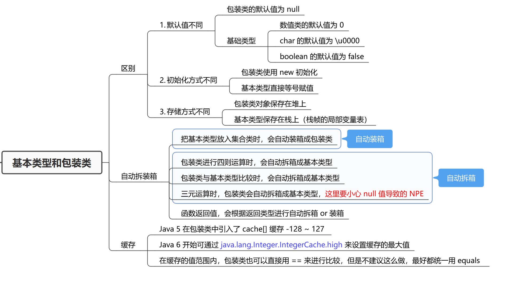
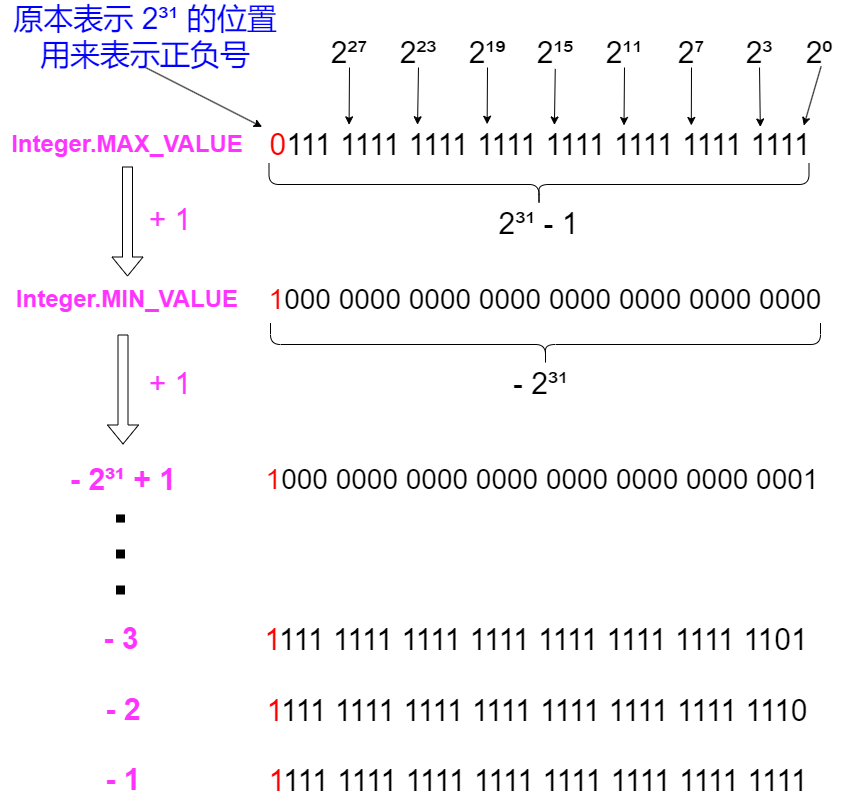
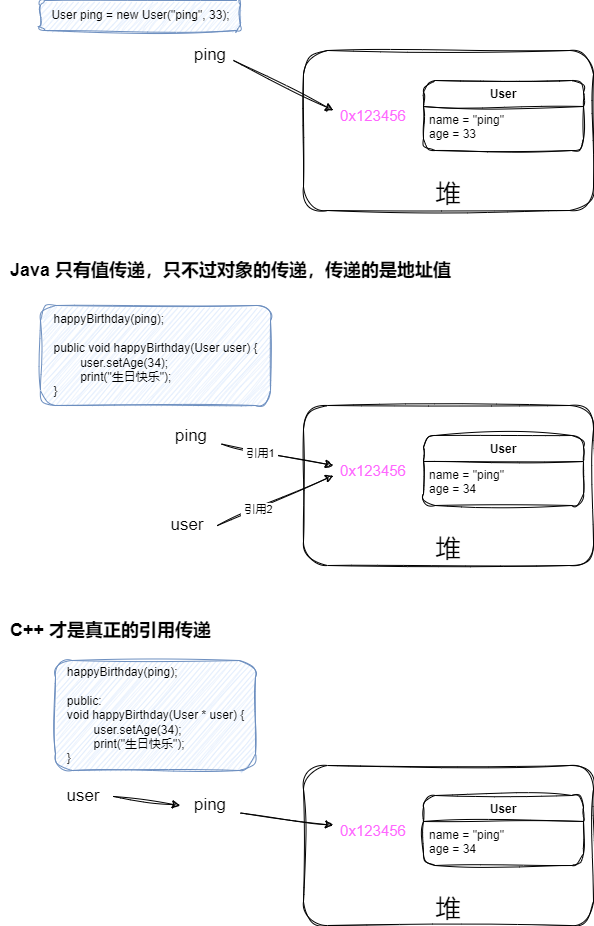

# 面试题-Java基础

#### Java 和 C++ 的区别？说说各自的优缺点

Java 是解释型语言，C++ 是编译型语言。

我们写的代码都要翻译成机器码，它是计算机可以直接执行的指令，解释型语言和编译型语言的区别就是翻译的时机不同。

- 解释型语言：
  - 先将源代码编译成一个中间码，比如 Java 的 class 文件，它是一种 JVM 可执行的十六进制字节码；
  - 然后在程序运行的时候，一行一行地解释、翻译成机器码、执行指令，Java 就需要搭配 Java 虚拟机来完成这部分工作。
- 编译型语言：
  - 在程序运行之前，就把源代码直接翻译成机器码；
  - 执行速度快、效率高，但跨平台性差。

Java 的优点就是跨平台性好，缺点是执行速度慢、效率低。

也有人说 Java 是半编译、半解释型语言。先用 Java 编译器（javac）将源代码编译成 Java 字节码（.class），再用 JVM 解释执行。

> [其他区别]
>
> C++对所有的数字类型有标准的范围限制，但字节长度是跟具体实现相关的，同一个类型在不同操作系统可能长度不一样。Java在所有平台上对所有的基本类型都有标准的范围限制和字节长度。
> C++除了一些比较少见的情况之外和C语言兼容 。 Java没有对任何之前的语言向前兼容。但在语法上受 C/C++ 的影响很大。
> C++允许直接调用本地的系统库 。 Java要通过JNI调用, 或者 JNA。
> C++允许过程式程序设计和面向对象程序设计 。Java必须使用面向对象的程序设计方式。
> C++支持指针，引用，传值调用 。Java只有值传递。
> C++需要显式的内存管理，但有第三方的框架可以提供垃圾搜集的支持。支持析构函数。 Java 是自动垃圾收集的。没有析构函数的概念。
> C++支持多重继承，包括虚拟继承 。Java只允许单继承，需要多继承的情况要使用接口。

[引导方向 -> JVM](#)

Java 有自动垃圾收集机制，C++ 本身没有，只能引入第三方框架支持。

[引导方向 -> 面向对象 -> 设计模式](#oop)

Java 必须使用面向对象的程序设计方式，而 C++ 允许使用面向过程的方式。

Java 只允许单继承，需要多继承的情况得使用接口，C++ 支持多重继承，包括虚拟继承。

[引导方向 -> 值传递](#reference_passing)

C++ 支持指针（存地址，移位读数据）、引用、传值调用，但 Java 只有值传递。

#### <span id="oop">说说面向对象</span>

在说面向对象之前，必须先说一下什么是面向过程。

**面向过程**把问题分解成一个个步骤，从开始一直执行到结束。只要掌握基础语法、还有 顺序 选择 循环这三种代码结构，就可以实现一切，但是随着代码增加，代码的可读性、可维护性、可扩展性越来越差，最根本的问题就是人力成本的增加。

**面向对象**则是把问题抽象成属性和行为，并将二者封装成一个个对象，然后基于这些对象的能力来实现复杂的业务逻辑，每个对象都可以类比成现实生活中的人或物，TA 们都有特定的能力，搭配使用可以解决各种各样复杂的问题。

使用面向对象编程，能够提高代码的可读性、可维护性、可扩展性、可复用性，这就不得不提面向对象的三大基本特征了：`封装`、`继承`、`多态`。

- **封装：**就是定义一个类（Class），把实现特定逻辑的代码抽象成这个类的行为（Method），把其中的变量抽象成这个类的属性（Field）。比如我定义一个代表`交通工具`的类，它就需要有`运输`的功能，也就是行为，它还会有`速度`、`功率`、`功耗`等属性。
- **继承：**继承就是字面意思，一个类可以继承另一个类的属性和行为，然后复用另一个类的能力。
- **多态：**多态离不开继承，在继承的基础上，子类可以重写从父类继承过来的方法。编写代码时，使用父类声明，但执行调用时取决于实际传入的对象。

[引导方向 -> 设计模式](#)

面向对象还有一些基本设计原则<font title=green>SOLLIDC</font>：

- 单一职责原则

- 开闭原则（对扩展开放，对修改关闭）

- 里氏替换原则（可以扩展父类，但不要改变父类原有功能）

- 迪米特原则（最少知道原则）

- 接口隔离原则（细化接口）

- 依赖倒置原则（依赖抽象，不要依赖实现）

- 合成复用原则（组合/聚合，少用继承）

在这些基本的设计原则之上，还衍生出了很多设计模式，面向对象的思想可以用在类、方法、属性的设计，也可以用在模块、服务、系统架构的设计，能够帮助我们实现高内聚低耦合的系统，提高代码的可读性、可扩展性、可维护性、可复用性，而好的代码设计、架构设计是能够大大节省软件开发的人力成本的，这也是我们使用各种框架、各种中间件的意义。

#### 为什么 Java 不支持多继承？

多继承会引入菱形继承问题，就是当一个类同时继承了类A和类B，类A和类B有完全相同的方法，那么子类调用的时候到底要调类A的还是类B的，就会产生歧义，C++为了解决这个问题，引入了虚继承（又称共享继承），但即使是 C++ 也不推荐多继承，应该尽量避免；

为了避免这些麻烦，Java 就干脆不支持多继承，事实上多继承的使用场景真的很少；不过 Java 支持接口多继承，但方法的逻辑都是由子类自己实现的，所以不存在上面说的问题。

不过从 Java 8 开始，接口支持 default 方法，那当一个类实现了两个接口，且它们拥有相同的 default 方法，这时就要求子类必须重写该方法，以此来解决菱形问题。

#### 如何理解 Java 中的多态？

多态就是同一个操作（方法）作用于不同的对象，可以有不同的解释，产生不同的执行结果。

多态是一种运行期状态，又称动态绑定：**根据运行期的实际类型来定位方法执行的版本**。

多态的实现一般有 3 个步骤：

1. 继承或接口实现
2. 子类要重写父类的方法
3. 父类的引用指向子类的对象

#### 接口和抽象类的区别，如何选择？

接口用来制定规范，抽象类用来继承和复用：

- 接口中的方法默认都是 public 且不能有实现体的，除了 java8 引入的 default 方法，接口中的属性默认都是 public static final 的；
- 抽象类一般会有至少一个 abstract 修饰的方法和一系列已实现的方法，抽象方法由子类来实现，并且子类会复用抽象类提供的非抽象方法，常用于模板模式。

#### Java中有了基本类型为什么还需要包装类？

Java 是一种面向对象的语言，为了赋予基本类型对象的特性，所以需要包装类。

基本类型在某些场景无法适用，比如集合的泛型必须是 Object，没有包装类就不行。



#### 为什么不能用浮点数表示金额？

二进制无法表示所有的小数，float（单精度浮点数） 和 double（双精度浮点数） 能表示的小数都是一个近似值，用他们进行高精度运算时，会发生精度丢失；

所以不能用浮点数表示金额，否则会发生资损，Java 提供了 `BigDecimal` 来进行精确的运算。

#### 为什么不能用 BigDecimal 的 equals 方法做等值比较？

因为 `BigDecimal` 的 equals 除了比较数值，还会比较 `scale 标度`，比如：`3.14` 和 `3.140` 的 `scale` 分别为 2 和 3，用 equals 比较它们是否相等会返回 `false`。

`BigDecimal` 比较两个值是否相等应该使用 `compareTo`：

```java
public statci void main(String[] args) {
    BigDecimal a = new BigDecimal("3.14");
    BigDecimal b = new BigDecimal("3.140");
    System.out.println(a.equals(b)); // result: false
    System.out.println(a.compareTo(b)); // result: 0
}
```

#### 为什么不能使用 new BigDecimal(double) 构建 BigDecimal 对象？

有精度损失的风险，实际存储的是一个小数位数很长的值，一般都是使用 `new BigDecimal(String)` 来构建 BigDecimal 对象。

或者使用 `BigDecimal.valueOf(double)` ，它内部使用 `Double.toString` 对尾数进行了截断。

#### 为什么对 Java 中的负数取绝对值结果不一定是正数？

这是一个越界问题，Integer 能表示的最小值为 `-2^31`，最大值为 `2^31 - 1`，当对最小值取绝对值时，就会发现还是它本身。



#### String、StringBuilder 和 StringBuffer 的区别？

String 是不可变的，StringBuilder 和 StringBuffer 都是可变的；

StringBuffer 是线程安全的，StringBuilder 都是非线程安全的；

[引导方向 -> 线程安全](#)

不过 StringBuffer 中的方法通过 `synchronized` 实现线程安全，性能较差，一般不会使用。

#### String 的 "+" 是如何实现的？

通过反编译可以发现，字符串拼接是 new 了一个 `StringBuilder`，使用它的 `append` 方法来实现的。

#### String 是怎么实现的？

jdk8 及之前的版本都是使用 `char[]` 实现，但 jdk9 开始就改用 `byte[]` 实现了。

java 内部是使用 UTF-16 来编码的，每一个字符占据 2 个字节；但是一些简单得字符，如：ISO8859-1(Latin1) 当中的字符单字节就能表示了，但是在字符串当中还是得用 char，也就是两个字节来表示，这就有点浪费了，于是从 jdk9 开始就废弃了 `char[]` 改用了 `byte[]`，并加入了一个编码标识符：

```java
private final byte coder;
```

- coder 等于 0，表示  LATIN1 编码，即 1 个字节代表 1 个字符；

- coder 等于 1，表示 UTF-16 编码，即 2 个字节代表 1 个字符。

#### 在 for 循环中使用 "+" 进行字符串拼接有什么问题？

在 for 循环中使用 "+" 进行字符串拼接每次都会 new 一个 StringBuilder 再调用 append：

```java
str = (new StringBuilder()).append(str).append(s).toString();
```

频繁创建对象会造成内存资源浪费，还增加程序运行时间。

#### String 是如何实现不可变的？

String 类用 final 修饰，意味着它无法被继承，方法不会被覆盖；存放字符串内容的 `char[]` 也是用 final 修饰的；

我们平时修改字符串的操作，实际上都是 `new String` 实现的，本质上是数组的拷贝操作。

#### String 为什么设计成不可变的？

String 被设计为不可变的主要是考虑了安全性、性能和线程安全的问题。

- 字符串经常用来存储敏感信息，如：用户名、密码、url 等，如果是可变的，字符串的内容将变得不可信，增加了安全隐患。

- 因为字符串是不可变的，所以是线程安全的，不需要额外编写线程安全的代码；如果字符串是可变的，那多线程访问的时候就需要考虑线程安全的问题了。
- 字符串是使用最频繁的数据结构，JVM 在 heap 中专门开辟了一块空间作为字符串常量池，用于缓存字符串对象，相同的字符串不会重复创建，而是复用字符串常量池中的，这可以避免频繁创建字符串，提升性能；如果字符串是可变的，就无法实现这个功能了，因为一旦字符串被修改，所有引用到的地方都会跟着变。

- 还有像 HashMap 会频繁地使用 `hashCode()` 方法，得益于 String 的不可变性，String 类在创建时会计算和缓存它的哈希码，之后使用无需再计算，也提高了性能。

#### String str = new String("54pig"); 创建了几个对象？

1 个或 2 个，new 操作会创建一个对象，还有一个对象却决于字符串常量池中是否存在 "54pig" 这个字符串对象，如果没有也会创建。

#### String#intern() 有什么作用？

`String#intern()`  会判断常量池中是否存在给定的字符串，如果不存在就将其放入常量池，最后返回这个字符串常量的引用。

一般不会用到这个方法，因为我们声明字符串常量的时候会自动触发这个动作；但如果字符串的值只有在运行期才能确定，那我们就可以通过 `String#intern()` 来避免重复创建字符串对象。

#### String a = "ab"; String b = "a" + "b"; a == b 吗？

结果为 true，`==` 比较的是地址，因为 a 和 b 都是由字面量组成的字符串，在编译之后会把字面量拼接在一起，实际运行的时候只有 `"ab"` 这个字符串对象，变量 a 和变量 b 指向同一个字符串对象。

#### 字符串常量是什么时候进入常量池的？

类加载的解析阶段，会把编译期生成的各种字面量和符号引用转换为直接引用，字符串常量就是这时候进入运行时常量池的。

这个动作可以在验证阶段就进行，也可以准备阶段之后进行，还可以在字符串字面量被调用时才进行；前两种是静态解析，后一种是动态解析，HotSpot 就是当字符串字面量被调用时，才会进行解析，开始为它在字符串常量池中创建对应的 String 实例。

#### 字符串有长度限制吗？

有，一个是编译期限制，一个是运行期限制。

编译期限制是《Java 虚拟机规范》定义的，为 2 个字节的无符号数，就是 16 位，`2^16 -1 = 65535`.

运行期限制是 String 的构造函数入参决定的，为 int 型的最大值，即 `2^31 - 1`，约等于 4G.

#### RPC接口返回中，使用基本类型还是包装类？

使用包装类，基本类型有默认值，会产生歧义，包装类默认值为 null 明确知道就是没赋值。

#### Java 中有哪些语法糖？都是怎么实现的？

> 语法糖（Syntactic sugar），指在计算机语言中添加的某种语法，这种语法对语言的功能并没有影响，但是更方便程序员使用。
>
> 虽然Java中有很多语法糖，但是Java虚拟机并不支持这些语法糖，所以这些语法糖在编译阶段就会被还原成简单的基础语法结构，这样才能被虚拟机识别，这个过程就是解语法糖。
>
> `com.sun.tools.javac.main.JavaCompiler` 的 `compile` 方法会调用 `desugar`  来解语法糖。

**常见的语法糖有 switch 支持枚举及字符串、泛型、条件编译、断言、可变参数、自动装箱/拆箱、枚举、内部类、增强 for 循环、try-with-resources 语句、lambda 表达式等。**

通过 `jad -p *.class` 反编译后，可以查看语法糖的原本的样子：

- switch 支持枚举或字符串

```java
String str = "world";
String s;
switch((s = str).hashCode())
{
default:
    break;
case 99162322:
    if(s.equals("hello"))
        System.out.println("hello");
    break;
case 113318802:
    if(s.equals("world"))
        System.out.println("world");
    break;
}
```

实际是 `hashCode() + equals()` 进行判断比较。

- 泛型

JVM 并不认识泛型，编译阶段会进行类型擦除，泛型只是编码的时候起到约束的作用，类型擦除后，其实都是 Object。

- 自动装箱与自动拆箱

`Integer.valueOf(i)` 实现自动装箱，`i.intValue()` 实现自动拆箱。

- 可变参数

使用 jad 反编译后会发现，可变参数其实就是传个数组。

- 枚举

枚举本质上是一个继承了 `java.lang.Enum` 的 final 类，我们声明的枚举实例本质上是 `public static final` 修饰的常量，这些实例会维护到一个 `$VALUES[]` 数组中，也是 `public static final` 修饰的，枚举默认还提供了 `values()` 方法返回所有实例的数组 `$VALUES[]` 的克隆对象。

```java
public final class Size extends Enum {

    public static Size[] values() {
        return (Size[]) $VALUES.clone();
    }

    public static Size valueOf(String name) {
        return (Size) Enum.valueOf(EnumTest$Size, name);
    }

    public String getAbbreviation() {
        return abbreviation;
    }

    public static final Size SMALL;
    public static final Size MEDIUM;
    public static final Size LARGE;
    public static final Size EXTRA_LARGE;
    private String abbreviation;
    private static final Size $VALUES[];

    static {
        SMALL = new Size("SMALL", 0, "S");
        MEDIUM = new Size("MEDIUM", 1, "M");
        LARGE = new Size("LARGE", 2, "L");
        EXTRA_LARGE = new Size("EXTRA_LARGE", 3, "XL");
        $VALUES = (new Size[]{
                SMALL, MEDIUM, LARGE, EXTRA_LARGE
        });
    }

    private Size(String s, int i, String abbreviation) {
        super(s, i);
        this.abbreviation = abbreviation;
    }
}
```

- 内部类

编译后是两个 class 文件，一个 `outer.class`，一个 `outer$inner.class` 文件。

- 断言

本质就是 if 语句，断言结果为 true 什么都不做，为 false 就抛出 AssertError 打断程序的执行。

- 数值字面量

可以在数字之间插入任意多个下划线，对于大数值更方便阅读，编译期间这些下划线会被去除。

```java
int i = 34_157____892
```

- for-each

遍历数组其实就是 for 循环，遍历 Collection 就是迭代器。

以 List 为例：

```java
for (String s : strList) {
    System.out.println(s);
}
```

反编译后：

```java
for(Iterator iterator = strList.iterator(); iterator.hasNext(); System.out.println(s))
        s = (String) iterator.next();
```

- try-with-resource

编译器帮我们做了资源关闭的动作。

- Lambda 表达式

依赖 `java.lang.invoke.LambdaMetafactory#metafactory` 这个 API 实现，通过这个 API 把 Lambda 表达式包装成一个 CallSite 对象，CallSite 内部有一个 MethodHandle，所以本质上也是通过反射来实现的。

> 扩展 —— MethodHandle 与传统的反射 API（如 java.lang.reflect.Method） 有什么区别？
>
> 1. **性能和效率：** MethodHandle 在性能上通常比传统的反射 API 更高效。MethodHandle 使用底层的字节码指令进行方法调用，避免了一些反射操作的开销。此外，MethodHandle 可以被 JVM 进行更多的优化，使得方法调用更加高效。
> 2. **灵活性：** MethodHandle 提供了更灵活的方法调用方式。它可以直接调用私有方法、实例方法、静态方法以及构造函数，而不需要提供额外的访问权限。MethodHandle 还可以在运行时动态绑定方法调用，适应不同的方法签名和参数类型。
> 3. **类型安全：** MethodHandle 在编译时进行类型检查，可以捕获类型错误。这可以帮助开发人员在编码阶段发现错误，而不是在运行时才抛出异常。
> 4. **代码简洁性：** 使用 MethodHandle 可以编写更简洁、易读的代码。相比传统的反射 API，MethodHandle 的语法更简洁明了，可以更方便地进行方法调用。
> 5. **异常处理：** MethodHandle 在异常处理方面与传统反射 API 有一些区别。在使用 MethodHandle 时，异常被包装在 `Throwable` 中抛出，需要在代码中显式处理。而传统的反射 API 则会抛出具体的异常类型，可以更方便地进行异常处理。

#### 说说泛型的作用

泛型是 JDK5 引入的新特性，允许在定义类、接口、方法时使用类型参数。在使用的时候通过类型参数可以约束传入的对象，避免在运行时出现类型转换错误，在编译时进行类型检查增加了程序的安全性。

#### 什么是类型擦除？类型擦除的缺点？

JVM 是不认识泛型的，类型擦除指的是编译器在编译时把泛型信息清除的过程。

类型擦除的缺点：泛型不可以重载

#### 在泛型为 Integer 的 ArrayList 中存放一个 String 类型的对象

可以通过反射实现：

```java
public void test() throws Exception {
    ArrayList<Integer> list = new ArrayList<Integer>();
    Method method = list.getClass().getMethod("add", Object.class);
    method.invoke(list, "Java反射机制实例");
    System.out.println(list.get(0));
}
```

这也侧面测实了类型擦除，JVM 不认识泛型。

#### 泛型中 K T V E ? Object 等分别代表什么含义?

- E – Element (在集合中使用，因为集合中存放的是元素)
- T – Type（Java 类）
- K – Key（键）
- V – Value（值）
- N – Number（数值类型）
- ？ – 表示不确定的 java 类型（无限制通配符类型）
- S、U、V – 2nd、3rd、4th types
- Object – 是所有类的根类，任何类的对象都可以设置给该 Object 引用变量，使用的时候可能需要类型强制转换。

#### 泛型中上下界限定符 extends 和 super 有什么区别？

`<? extends T>` 表示类型的上界，表示参数化类型的可能是 T 或是 T 的子类；

`<? super T>` 表示类型下界（Java Core 中叫超类型限定），表示参数化类型是此类型的超类型（父类型），直至 Object。

> 在使用 限定通配符的时候，需要遵守 PECS 原则，即 Producer Extends, Consumer Super；上界生产，下界消费
> 如果要从集合中读取类型T的数据，并且不能写入，可以使用 ? extends 通配符；(Producer Extends)
> 如果要从集合中写入类型T的数据，并且不需要读取，可以使用 ? super 通配符；(Consumer Super)
>
> extends 的时候是可读取不可写入，那为什么叫上界生产呢？
> 因为这个消费者/生产者描述的<集合>，当我们从集合读取的时候，集合是生产者。
>
> 如果既要存又要取，那么就不要使用任何通配符。

通俗点讲，

`? extends T` 限制了上界，一般是获取 T 来做点什么；

`? super T` 限制了下界，安全性更好，一般是用来把 T 存到某个地方。

#### 数组协变和泛型非协变

Object 是 String 的父类，所以 `Object[]` 同样是 `String[]` 的父类，这就是数组协变；

但是对于泛型来说，`List<Object>` 和 `List<String>` 毫无关系，无法赋值，这就是泛型非协变；

协变是一种类型系统的特性，它指的是【类型的子类型关系】与【类型参数的子类型关系】保持一致。

```java
// 如果泛型允许协变
List<Object> a = new List<String>();
// a 可以 add 任意对象，但实际是一个 List<String> 实例，这就有问题了
a.add(1); // 允许协变，可以装进来
String s = a.get(0); // 编译报错
```

#### 什么是 SPI，和 API 有什么区别？

SPI 是 Service Provider Interface 服务提供商接口，一种用于定义服务提供商与应用程序之间通信的接口，通常用于实现模块化和可插拔的系统。最常见的就是数据库驱动加载接口、还有 SLF4J 接口加载不同提供商的日志实现类、Spring 中也大量使用了 SPI（比如一些初始化器、自动类型转换接口）。

API 就是我们平常应用开发使用的接口，主要作用就是制定规范，约束实现类。

**SPI 的实现原理**

其实就是通过 `ServiceLoader.load(Class, ClassLoader)` 这个方法，加载 `/META-INF/services/` 目录下的文件，这里的文件都是以接口的全限定名命名的，它会根据传入的 Class 对象找到对应文件，然后把文件中所有的类加载出来，最后再通过迭代器遍历使用。

#### 什么是反射机制？为什么反射慢？

反射允许我们在程序运行时动态地查找、使用和修改类、接口、字段、方法等信息。

反射非常强大，可以帮我们简化很多非业务逻辑的开发工作，我们平常用的框架也都大量地应用反射：Spring 的依赖注入和 aop、Spring MVC 的请求处理流程、MyBatis 的映射器、Hibernate-Validator 数据校验框架、Swagger、单元测试框架等。

我觉得反射就是 Java 生态的根基，没有反射 Java 不可能有现在这么强大的生态。

**不过反射也有缺点：**

因为反射是在运行时动态解析和查找类、方法、字段等信息，相比于直接调用静态绑定的方法或访问字段，需要更多的时间和计算资源；

反射不能享受一些编译器优化，性能上有所损失；

#### Java 中创建对象有哪几种方式？

- new 关键字
- 反射
- clone，需要实现 Cloneable 接口，如果没有重写 clone 方法就调用 Object 类的 native 方法完成
- 反序列化
- 方法句柄(JDK7+)

```java
import java.lang.invoke.MethodHandle;
import java.lang.invoke.MethodHandles;
import java.lang.invoke.MethodType;

public class Main {
    public static void main(String[] args) throws Throwable {
        // 获取句柄
        MethodHandles.Lookup lookup = MethodHandles.lookup();
        // 可以看作 add 方法的引用
        MethodHandle addHandle = lookup.findStatic(
            Main.class, 
            "add", 
            MethodType.methodType(int.class, int.class, int.class));

        // 使用句柄调用方法
        int result = (int) addHandle.invokeExact(5, 3);
        System.out.println("Result: " + result);
    }

    public static int add(int a, int b) {
        return a + b;
    }
}
```

#### Java 的动态代理如何实现？

有两种方式：JDK 动态代理和 Cglib 动态代理。

**JDK 动态代理 - 核心 Proxy#getProxyInstance**

要求被代理类必须实现至少一个接口，然后定义一个 InvocationHandler 实现类就行，在 invoke 方法里写你的代理逻辑，这里就随意发挥了。

当然，你还要声明一个成员变量，用来接收要代理的目标对象，一般会定义一个 `public Object getProxy(Object target)` 方法来接收要代理的目标对象并使用 `Proxy.newProxyInstance(ClassLoader, Class<?>[], InvocationHandler)` 返回代理对象，供外部使用。

【原理】

JDK 动态代理的原理，其实就是 Proxy 的 newProxyInstance 这个方法帮我们生成了代理类的字节码文件，然后进行类加载、再反射构造出代理实例返回，这个方法接收了 3 个参数：

- 目标对象的 ClassLoader
- 目标对象实现的所有接口
- 一个 InvocationHandler 对象

很明显啊， `ClassLoader` 是用来加载代理类的，那这个代理类是怎么来的呢，就是 `newProxyInstance` 方法帮我们生成的，是以 `byte[]` 的形式存在的，但是如果你想生成 class 文件，通过修改一个系统属性就可以实现了：

```java
System.setProperty("sun.misc.ProxyGenerator.saveGeneratedFile", true);
```

`newProxyInstance` 方法的另外两个参数就是生成这个代理类需要的内容了，很明显生成的代理类会实现目标对象实现的接口，代理的方法会调用 `InvocationHandler` 的 `invoke` 方法。

通过查看反编译查看生成的代理类文件，可以验证这些猜测：

生成的代理类是 final 修饰的，不仅实现了目标对象实现的接口，还继承了 Proxy 类，代理类的构造函数会接收 `InvocationHandler` 这个对象，然后通过 super 关键字调用 Proxy 的构造器，传递给 Proxy 中定义 `InvocationHandler` 变量。

生成的代理方法都是通过调用 `InvocationHandler` 对象的 `invoke` 方法实现的，包括 equals、toString、hashCode 这些方法。调用 invoke 方法需要的 Method 对象，都是通过反射获取的。

```java
package com.sun.proxy;

import java.lang.reflect.InvocationHandler;
import java.lang.reflect.Method;
import java.lang.reflect.Proxy;
import java.lang.reflect.UndeclaredThrowableException;
import structurepattern.proxy.jdkdynamicproxy.IPerson;

// final 类，继承 Proxy，实现了目标对象的父接口
public final class $Proxy0 extends Proxy implements IPerson {
    private static Method m1;
    private static Method m3;
    private static Method m2;
    private static Method m0;

    // 构造函数接收一个 InvocationHandler 参数
    // Proxy.newProxyInstance 方法接收的 InvocationHandler 就是为了传给此处的
    public $Proxy0(InvocationHandler var1) throws  {
        super(var1);
    }

    // 接口继承的方法全部分派了 InvocationHandler 的 invoke 方法
    public final void findLove() throws  {
        try {
            super.h.invoke(this, m3, (Object[])null);
        } catch (RuntimeException | Error var2) {
            throw var2;
        } catch (Throwable var3) {
            throw new UndeclaredThrowableException(var3);
        }
    }

    // Object 继承过来的 equals、toString、hashCode 也被覆盖了，全部去调用 InvocationHandler#invoke
    public final boolean equals(Object var1) throws  {
        return (Boolean)super.h.invoke(this, m1, new Object[]{var1});
    }
    
    public final String toString() throws  {
        return (String)super.h.invoke(this, m2, (Object[])null);
    }

    public final int hashCode() throws  {
        return (Integer)super.h.invoke(this, m0, (Object[])null);
    }

    // 静态代码块：通过 Class.forName("类的全限定名") 的方法得到类对象再 getMethod 得到 Method 对象
    // Method 对象作为 InvocationHandler 的 invoke 方法的入参
    static {
        try {
            m1 = Class.forName("java.lang.Object").getMethod("equals", Class.forName("java.lang.Object"));
            m3 = Class.forName("structurepattern.proxy.jdkdynamicproxy.IPerson").getMethod("findLove");
            m2 = Class.forName("java.lang.Object").getMethod("toString");
            m0 = Class.forName("java.lang.Object").getMethod("hashCode");
        } catch (NoSuchMethodException var2) {
            throw new NoSuchMethodError(var2.getMessage());
        } catch (ClassNotFoundException var3) {
            throw new NoClassDefFoundError(var3.getMessage());
        }
    }
}
```

**Cglib 动态代理 - 核心 Enhancer#create()**

Cglib 动态代理，不要求被代理类实现接口，只需定义一个 `MethodInterceptor` 实现类就行，然后在 `intercept` 方法中实现代理逻辑。

同样地，定义一个 `public Object getProxy(Class clazz)` 方法，调用 `Enhancer` 的 `create()` 方法返回代理类实例。

【原理】

与 JDK 动态代理的原理类似，不过它生成了 3 个 class 字节码文件：

- 增强代理类，继承了代理的目标对象，实现了  `net.sf.cglib.proxy.Factory` 接口
- 代理类的 FastClass
- 被代理类的 FastClass

增强代理类的初始化过程分两步，

第一步是静态常量的初始化，调用增强代理类的 `CGLIB$SET_THREAD_CALLBACKS` 方法将 `MethodInterceptor` 存入 ThreadLocal，调用这个方法之前触发了代理类的 static 初始化代码块，执行了一些 static 常量的初始化，主要有 `Method` 对象（反射创建）、`MethodProxy` 对象（MethodProxy#create）、`ThreadLocal` 对象、还有一个 object 空数组。

第二步是调用构造函数，就是把刚刚存入 ThreadLocal 的 `MethodInterceptor` 对象赋给代理类的成员变量。

方法的调用就是通过 `MethodInterceptor` 的 `intercept` 方法实现， `intercept` 方法就是我们自定义的逻辑了，这里要注意，不要直接调用 `MethodProxy` 的 `invoke` 方法，否则会因无限递归导致 `StackOverflowError`，如果一定要调，必须设置退出条件，调用 invoke 方法相当于一直在递归 `intercept` 方法。正确的用法是调用 `invokeSuper` 方法，这样执行的是被代理类的方法逻辑，就不会发生递归调用。

<font title="red">FastClass 的作用是什么呢？</font>

在调用 MethodProxy 的 invokeSuper 方法时，会先执行一个 init() 方法，去创建代理类和被代理类的 FastClass 增强类，并设置当前代理方法的索引值；init 完成后，就可以通过 FastClass 的 invoke 方法，根据给定的 index 找到要目标对象的方法并执行。这个索引值时根据方法签名来确定的。

FastClass 中的关键方法就 getIndex 和 invoke。getIndex 根据方法签名返回索引值，invoke 根据索引值调用指定方法并执行。

> Cglib 是通过继承来生成的动态代理类，如果一个类被 final 修饰，是无法使用 Cglib 做动态代理的。

#### Java 注解的作用

Java 注解可以用来标记接口、类、方法、属性、或者其他注解，然后给它们设置一些元数据。

然后搭配反射，实现一些非业务逻辑的功能。

| 元注解（用来定义其他注解的） | 作用                                                         |
| ---------------------------- | ------------------------------------------------------------ |
| `@Target`                    | 表示注解可以作用于什么地方，value 可以是类、字段、方法、参数、构造器等，详见：`java.lang.annotation.ElementType` |
| `@Retention`                 | 表示在什么级别保存该注解信息，有 3 种 value 值：`RetentionPolicy.SOURCE`、`RetentionPolicy.CLASS`、`RetentionPolicy.RUNTIME` |
| `@Documented`                | 被标记的注解会出现在 Java API 文档中                         |
| `@Inherited`                 | 被标记的注解支持继承                                         |

#### 说一说 Java 序列化的原理

Java 序列化是将对象转换为字节流，以便在网络上传输或保存在本地文件中。

在 Java 中，通过调用 `ObjectOutputStream#writeObject(Object obj)` 方法将对象序列化，对象必须是字符串、数组、枚举或实现了 `Serializable` 接口，否则会抛 `NotSerializableException`。

另外，也可以实现 `Externalizable` 接口，实现 writeExternal 和 readExternal 方法指定序列化哪些属性。

#### serialVersionUID 有何用途? 如果没定义会有什么问题？

这是用来表示序列化版本的唯一ID，如果没有定义，JVM 会自动生成，只要 class 文件没有发生变化，不管编译多少次 serialVersionUID 都不变，一旦文件发生变化 serialVersionUID 也会跟着变；

反序列化的时候会检查字节流中的 serialVersionUID 和 class 文件当前的 serialVersionUID，如果不一致，就会抛 InvalidCastException。

#### Java 中异常分哪两类，有什么区别？

受检（checked）异常和非受检（unchecked）异常。

受检异常必须处理，不然编译不过去，这是强制规范；非受检异常不用显示捕获，一般就是指运行时异常，这种异常可以理解为是代码有问题导致的，应该在编码的时候避免。

#### finally 中代码一定会执行吗？

不一定，有些情况 finally 是不会执行的，比如：

1. `System.exit()` 方法被执行，强制退出程序
2. `Runtime.getRuntime().halt()` 方法被执行，强制终止 JVM
3. try 或者 catch 中有死循环
4. 操作系统强制杀掉了 JVM 进程，比如执行了`kill -9`
5. 其他原因导致的虚拟机崩溃了
6. 虚拟机所运行的环境挂了，如计算机电源断了
7. 如果一个 finally 是由守护线程执行的，那么是不保证一定能执行的，如果这时候 JVM 要退出，JVM 会检查其他非守护线程，如果都执行完了，那么就直接退出了。这时候 finally 可能就没办法执行完。

#### Java 中的枚举有什么特点和好处？

枚举一般用于需要一组常量对象的场景。枚举可以自定义属性，扩展性强；还提供了 valueOf 获取枚举对象，使用起来代码简洁。

枚举本质上是一个继承了 `java.lang.Enum` 的 final 类，我们声明的枚举实例本质上是 `public static final` 修饰的常量，这些实例会维护到一个 `$VALUES[]` 数组中，也是 `public static final` 修饰的，枚举默认还提供了 `values()` 方法返回所有实例的数组 `$VALUES[]` 的克隆对象。

```java
public final class Size extends Enum {

    public static Size[] values() {
        return (Size[]) $VALUES.clone();
    }

    public static Size valueOf(String name) {
        return (Size) Enum.valueOf(EnumTest$Size, name);
    }

    public String getAbbreviation() {
        return abbreviation;
    }

    public static final Size SMALL;
    public static final Size MEDIUM;
    public static final Size LARGE;
    public static final Size EXTRA_LARGE;
    private String abbreviation;
    private static final Size $VALUES[];

    static {
        SMALL = new Size("SMALL", 0, "S");
        MEDIUM = new Size("MEDIUM", 1, "M");
        LARGE = new Size("LARGE", 2, "L");
        EXTRA_LARGE = new Size("EXTRA_LARGE", 3, "XL");
        $VALUES = (new Size[]{
                SMALL, MEDIUM, LARGE, EXTRA_LARGE
        });
    }

    private Size(String s, int i, String abbreviation) {
        super(s, i);
        this.abbreviation = abbreviation;
    }
}
```

#### 为什么说枚举是实现单例最好的方式？

枚举实现的单例有以下好处：

- 代码实现简洁
- 天然线程安全，在 static 代码块中创建的实例，只会执行一次
- 可以避免反序列化破坏，`java.io.ObjectInputStream#readEnum` 反序列化的时候，枚举就是用 `java.lang.Enum#valueOf` 方法返回对象的。

#### 什么是 AIO、BIO 和 NIO？

**BIO （Blocking I/O）：**同步阻塞 I/O，是 JDK1.4 之前的传统 IO 模型。 线程发起 IO 请求后，一直阻塞，直到缓冲区数据就绪后，再进入下一步操作。

**NIO （Non-Blocking I/O）：**同步非阻塞 IO，线程发起 IO 请求后，不需要阻塞，立即返回。用户线程不原地等待 IO 缓冲区，可以先做一些其他操作，只需要定时轮询检查 IO 缓冲区数据是否就绪即可。

**AIO （ Asynchronous I/O）：**异步非阻塞 I/O 模型。线程发起 IO 请求后，不需要阻塞，立即返回，也不需要定时轮询检查结果，异步 IO 操作之后会回调通知调用方。

#### Java 中 BIO、NIO、AIO 分别适用哪些场景？

BIO 方式适用于连接数目比较小且固定的架构，这种方式对服务器资源要求比较高，并发局限于应用中，JDK1.4 以前的唯一选择，但程序直观简单易理解。

NIO 方式适用于连接数目多且连接比较短（轻操作）的架构，比如聊天服务器，并发局限于应用中，编程比较复杂，JDK1.4 开始支持。

AIO 方式适用于连接数目多且连接比较长（重操作）的架构，比如相册服务器，充分调用 OS 参与并发操作，编程比较复杂，JDK7 开始支持。

#### 同步、异步、阻塞、非阻塞怎么理解？

阻塞、非阻塞描述的是调用者：

- 阻塞表示调用者会一直等待结果的返回；
- 非阻塞表示调用者发出调用指令后，不会一直傻傻地等结果，而是继续干别的事，是不是询问一下结果返回了吗。

同步、异步描述的是被调用者：

- 收到请求立即处理，处理完成再响应结果；
- 收到请求立即响应结果，但不一定马上开始处理请求，反正处理完了会通知调用者。

#### <span id="reference_passing">Java 是值传递还是引用传递？</span>

值传递（pass-by-value）。

基本类型传递的是值的副本，引用类型传递的是引用的值的副本，传递的都是副本，都发生了拷贝动作。



#### 说一说深拷贝和浅拷贝

拷贝就是字面意思，拷贝一份对象副本出来，浅拷贝对于引用类型只是拷贝引用地址，而深拷贝不管是基本类型还是引用类型会创建新的对象。

`BeanUtils.copyProperties` 就是浅拷贝，深拷贝一般都是通过序列化 + 反序列化实现，比如 Apache commons lang 包的 `SerializationUtils#clone` 方法，或者借助 fastjson 提供的 API `JSON.parseObject(JSON.toJSONString(user), User.class)` 先把对象序列化为 json 字符串，再反序列化为对象。

深拷贝还可以自己实现 clone() 方法，用递归算法实现。

#### SimpleDateFormat 是线程安全的吗？使用时应该注意什么？

SimpleDateFormat 不是线程安全的，一般作为局部变量使用，防止多线程访问。

SimpleDateFormat 用一个成员变量 calendar 来保存时间，不安全的原因就是调用 format 方法时会修改这个变量，多线程并发调用时，这个变量被多个线程改来改去，最后格式化出来的日期肯定是不符合预期的。

除了加锁，也有推荐把 SimpleDateFormat 对象放到 ThreadLocal 的，这种方式也是可行的。

JDK8 推荐使用 `DateTimeFormatter`，这是一个线程安全的日期格式化工具。

- 字符串 -> 日期

```java
String dateStr= "2023年10月01日";
DateTimeFormatter formatter = DateTimeFormatter.ofPattern("yyyy年MM月dd日");
LocalDate date= LocalDate.parse(dateStr, formatter);
```

- 日期 -> 字符串

```java
LocalDateTime now = LocalDateTime.now();
DateTimeFormatter formatter = DateTimeFormatter.ofPattern("yyyy年MM月dd日 hh:mm a");
String nowStr = now.format(format);
```

#### JDK 新版本中都有哪些新特性？

| JDK 版本 | 新特性                                    |
| -------- | ----------------------------------------- |
| JDK8     | Lambda 表达式、Stream、Optional、日期API  |
| JDK9     | 模块化                                    |
| JDK10    | 局部变量推断                              |
| JDK12    | switch 表达式增强                         |
| JDK13    | 文本块（多行字符串，以 `"""` 开始和结束） |
| JDK14    | Records 记录类型、增强 instanceof         |
| JDK15    | 封闭类                                    |
| JDK17    | switch 匹配增强                           |
| JDK19    | 结构化并发                                |
| JDK21    | 虚拟线程、ZGC 增加了对分代的支持          |

- **模块化【JDK9】**

> 模块化允许开发者将应用程序拆分为更小、更可管理的模块，并定义模块之间的依赖关系。

模块定义文件 module-info.java

```java
module com.example.greeting {
    exports com.example.greeting;
}
```

在 com.example.greeting 模块中创建一个类

```java
package com.example.greeting;

public class Greeting {
    public static String getGreeting() {
        return "Hello, World!";
    }
}
```

定义一个模块，依赖 com.example.greeting 模块

```java
module com.example.app {
    requires com.example.greeting;
}
```

应用程序入口类

```java
package com.example.app;

import com.example.greeting.Greeting;

public class MainApp {
    public static void main(String[] args) {
        String greeting = Greeting.getGreeting();
        System.out.println(greeting);
    }
}
```

编译命令

```bash
javac -d <output-directory> --module-source-path <source-directory> <module-info.java> <source-files>
```

运行命令

```bash
java --module-path <module-path> --module <module>/<main-class>
```


- **局部变量推断【JDK10】**

```java
public class LocalVariableExample {
    public static void main(String[] args) {
        var message = "Hello, World!"; // 使用 var 推断字符串类型
        var count = 10; // 使用 var 推断整数类型
        var list = new ArrayList<String>(); // 使用 var 推断 ArrayList 类型
        
        System.out.println(message); // 输出：Hello, World!
        System.out.println(count); // 输出：10
        
        list.add("Apple");
        list.add("Banana");
        list.add("Orange");
        
        for (var fruit : list) { // 使用 var 推断循环变量类型
            System.out.println(fruit);
        }
    }
}
```


- **switch 表达式增强【JDK12】**

```java
public class SwitchExpressionExample {
    public static void main(String[] args) {
        int dayOfWeek = 3;
        String dayType = switch (dayOfWeek) {
            case 1, 2, 3, 4, 5 -> "Weekday";
            case 6, 7 -> "Weekend";
            default -> "Invalid day";
        };

        System.out.println(dayType);  // 输出：Weekday
    }
}
```


- **文本块【JDK13】**

```java
public class TextBlockExample {
    public static void main(String[] args) {
        String traditionalString = "This is a traditional\n"
                                  + "multi-line string\n"
                                  + "in Java.";

        String textBlock = """
                           This is a text block
                           that spans multiple
                           lines in Java.
                           """;

        System.out.println("Traditional String:\n" + traditionalString);
        System.out.println("\nText Block:\n" + textBlock);
    }
}
```


- **Records 记录类型【JDK14】**

```java
/**
 * 通过使用 record 关键字，我们可以自动生成构造函数、访问器方法以及 equals() 和 hashCode() 等方法
 */
record Person(String name, int age) {}

public class RecordsExample {
    public static void main(String[] args) {
        Person person = new Person("John Doe", 30);
        System.out.println(person.name());  // 输出：John Doe
        System.out.println(person.age());   // 输出：30
    }
}
```


- **增强 instanceof【JDK14】**

```java
public class PatternMatchingExample {
    public static void main(String[] args) {
        Object obj = "Hello, World!";
        
        if (obj instanceof String str) {
            // 在这里，我们使用 `instanceof` 模式匹配，并将匹配的对象转换为新的变量 `str`
            System.out.println(str.toUpperCase());
        } else {
            System.out.println("Not a string");
        }
    }
}
```


- **封闭类【JDK15】**

```java
/**
 * 能够继承 Shape 的类被限制了：Circle, Rectangle, Triangle
 */
sealed class Shape permits Circle, Rectangle, Triangle {
    // Shape 类的定义
}

final class Circle extends Shape {
    // Circle 类的定义
}

final class Rectangle extends Shape {
    // Rectangle 类的定义
}

final class Triangle extends Shape {
    // Triangle 类的定义
}

class Square extends Shape {
    // Square 类的定义
    // 这里会产生编译错误，因为 Square 类没有在 permits 列表中被允许
}
```


- **switch...case 匹配增强【JDK17】**

```java
public class SwitchPatternMatchingExample {
    public static void main(String[] args) {
        Object obj = "Hello";

        // case 支持类型匹配，还可以多条件匹配，支持各种运算符
        String result = switch (obj) {
            case String s -> "It's a string: " + s;
            case Integer i && i > 0 -> "It's a positive integer: " + i;
            case Integer i -> "It's an integer: " + i;
            case null -> "It's null";
            default -> "It's something else";
        };

        System.out.println(result);
    }
}
```


- **结构化并发【JDK19】**

```java
import java.util.concurrent.CompletableFuture;
import java.util.concurrent.ExecutionException;

public class StructuredConcurrencyDemo {

    public static void main(String[] args) {
        try {
            structuredConcurrencyDemo();
        } catch (InterruptedException | ExecutionException e) {
            e.printStackTrace();
        }
    }

    public static void structuredConcurrencyDemo() throws InterruptedException, ExecutionException {
        CompletableFuture<Void> mainTask = CompletableFuture.runAsync(() -> {
            System.out.println("主任务开始...");

            // 子任务 1
            CompletableFuture<Void> subTask1 = CompletableFuture.runAsync(() -> {
                System.out.println("子任务 1 开始...");
                // 执行一些工作
                System.out.println("子任务 1 完成");
            });

            // 子任务 2
            CompletableFuture<Void> subTask2 = CompletableFuture.runAsync(() -> {
                System.out.println("子任务 2 开始...");
                // 执行一些工作
                System.out.println("子任务 2 完成");
            });

            // 等待所有子任务完成
            CompletableFuture.allOf(subTask1, subTask2).join();

            System.out.println("主任务完成");
        });

        // 等待主任务完成
        mainTask.get();
    }
}

```


- **虚拟线程【JDK21】**

```java
import java.util.concurrent.ExecutorService;
import java.util.concurrent.Executors;

public class VirtualThreadExample {

    public static void main(String[] args) {
        // 创建 ExecutorService，每个虚拟线程对应一个任务
        ExecutorService executor = Executors.newVirtualThreadPerTaskExecutor();

        // 提交 100 个任务，每个任务都是一个虚拟线程
        for (int i = 0; i < 100; i++) {
            final int taskNumber = i;
            executor.submit(() -> {
                System.out.println("Task executed by Virtual Thread " + taskNumber);
                // 模拟任务的一些工作
                try {
                    Thread.sleep(100);
                } catch (InterruptedException e) {
                    e.printStackTrace();
                }
            });
        }

        // 关闭 ExecutorService
        executor.shutdown();
    }
}

```


#### 什么是 UUID，能保证唯一吗？

Version 1 和 Version 2 这两个版本的UUID，主要基于时间和 MAC 地址，所以比较适合应用于分布式计算环境下，具有高度唯一性。

Version 3 和 Version 5 这两种 UUID 都是基于名称空间的，所以在一定范围内是唯一的，而且如果有需要生成重复 UUID 的场景的话，这两种是可以实现的。

Version 4 这种是最简单的，只是基于随机数生成的，但是也是最不靠谱的，适合数据量不是特别大的场景下。

#### char 能存储中文吗？

在 Java 中，char 类型是用来表示一个 16 位的 Unicode 字符，它可以存储任何 Unicode 字符集中的字符，当然也包括中文字符。

#### while(true) 和 for(;;) 哪个性能好？

性能一样，使用 javap 反编译后，内容一摸一样。

#### ClassNotFoundException 和 NoClassDefFoundError 的区别是什么？

ClassNotFoundException 是类加载时找不到指定的 class 就会抛出，一般是依赖缺失导致的。

NoClassDefFoundError 是找到了 class 但加载、解析或链接时发生了问题，一般是依赖冲突导致的，或打包问题（编译时存在，运行时丢了）。

#### 为什么 JDK 9 中把 String 的 char[] 改成了 byte[]？

java 内部是使用 UTF-16 来编码的，每一个字符占据 2 个字节；但是一些简单得字符，如：ISO8859-1(Latin1) 当中的字符单字节就能表示了，但是在字符串当中还是得用 char，也就是两个字节来表示，这就有点浪费了，于是从 jdk9 开始就废弃了 `char[]` 改用了 `byte[]`，并加入了一个编码标识符：

```java
private final byte coder;
```

- coder 等于 0，表示  LATIN1 编码，即 1 个字节代表 1 个字符；

- coder 等于 1，表示 UTF-16 编码，即 2 个字节代表 1 个字符。
