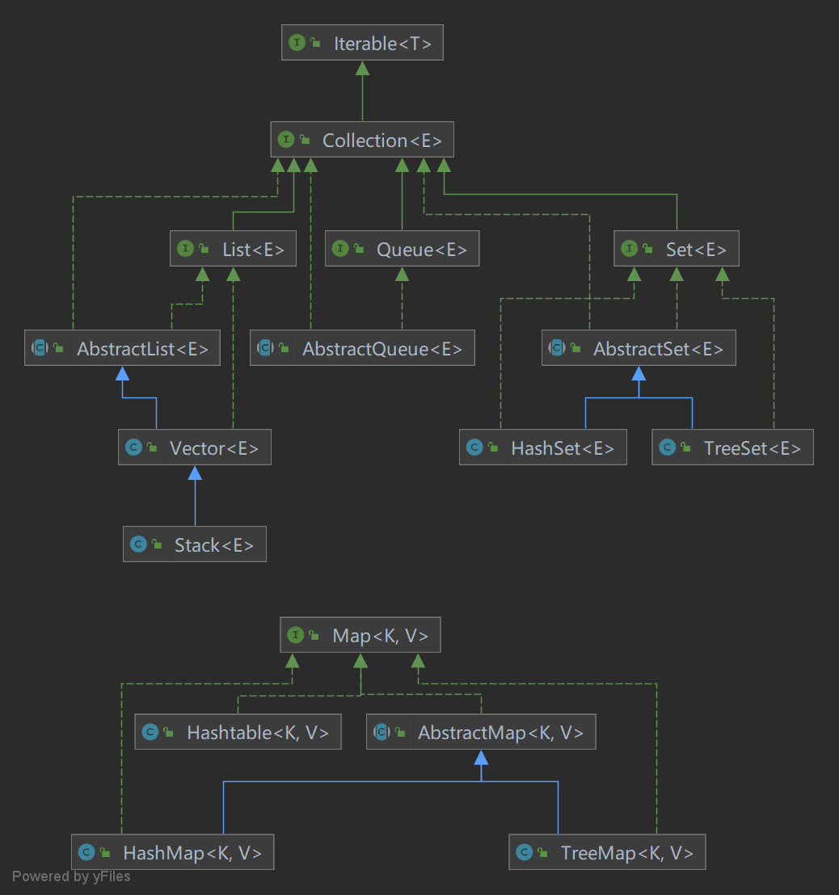
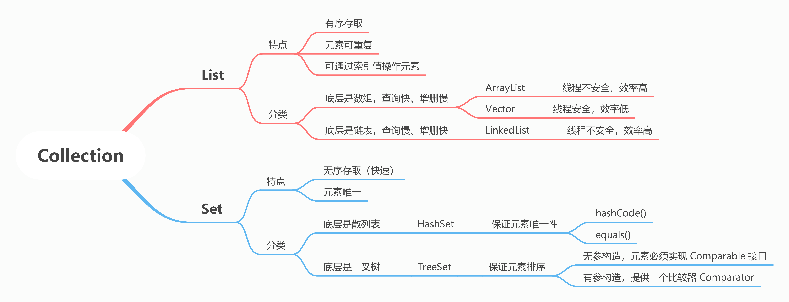

# 面试题-Java集合

#### Java 中的集合有哪些？如何分类的？



#### Collection 和 Collections 有什么区别？

Collection 是集合的顶层接口，继承 Iterable 接口；Collections 提供了一些 static 方法对集合进行操作或包装返回。

#### List、Set、Map 的区别是什么？



Map 存放键值对，key 是唯一的，可以为 null，HashSet 使用 HashMap 实现的，TreeSet 使用 TreeMap 实现的，TreeMap 是有序的，LinkedHashMap 可以按插入顺序排序。

#### Iterable 和 Iterator 什么区别？

```java
class AbstractList<E> implements Iterable<E> {
    public Iterator<E> iterator() {
        return new Itr();
    }

    private class Itr implements Iterator<E> {}
}
```

Iterable 是一个接口，表示可迭代的，集合类会实现它并实现 `iterator()` 方法，返回一个 Iterator 迭代器，迭代器的具体实现由集合实现类完成，以内部类的形式，主要有 3 个方法要实现：`hasNext()`, `next()`, `remove()`;

####  Iterable 和 Iterator 为什么不合成一个使用？

一个代表可迭代，一个代表迭代方式，两个职责，解耦是应该的。

#### 集合的排序方式有几种？

可以通过 `Collections.sort` 传一个 Comparator 进行排序；

也可以让准备加入集合的元素实现 Comparable 接口的 compareTo 方法；

#### 有了 Comparable 为什么还需要 Comparator？

Comparable 只能作用于自己项目中的代码，如果需要对一些二方库中的实体进行排序，又没有实现 Comparable 接口，那就得用 Comparator 了。

#### compareTo 和 equals 的使用场景有何区别?

equals 是用来比较是否相等的，compareTo 可以用来进行排序。

#### 什么是 fail-fast？什么是 fail-safe？

fail-fast 快速失败是一种发现故障立即结束操作并上报的机制，比如集合中维护了一个 expectedModCount 预期修改次数，更新集合时先对比预期值和实际值 modCout 的大小，如果不同就抛 CocurrentModificationException。

fail-safe 是一种并发环境下的安全机制，比如 CopyOnWriteArrayList，通过拷贝一份快照进行更新操作，其实迭代遍历也是拷贝了一份快照，只是读到的内容不是最新的，但可以避免 CocurrentModificationException。

#### 什么是 COW，如何保证的线程安全？

Copy-On-Write 写时复制是一种并发编程技术，用在多线程环境下对共享数据的安全访问。

进行写操作时拷贝一份副本进行操作，操作结束用更新后的副本替换原对象，这个动作要加锁。

适用于读操作频繁，写操作较少的场景。

#### Stream 的作用？

Java 8 引入的新特性，可以对进行流式操作，分流的创建、流的中间操作和最终操作。

它不是一种数据结构，只是某个数据源的一个视图，数据源可以是数组、集合或 I/O Channel 等。

它是惰性执行的，只有在用户真正需要结果的时候才会执行。

还有一个很重要的特点，和 IO 流很像，只能消费一次，一旦消费就无法重新访问了。

常见的操作有：遍历、过滤、映射（可以获得一个与数据源结构完全不一样的结果）、排序、...

## List

#### 遍历的同时修改一个 List 有几种方式？

普通的 for 循环，修改的同时要调整 index 值，比如 remove 后 index--；

使用迭代器，remove() 方法会更新游标（cursor）；

拷贝副本进行操作；

使用并发安全的集合类；

Stream 的 filter 方法，会生成新的 Stream 对象，不存在并发问题。

removeIf 方法，先找出所有要删除的元素，然后要保留的值替换覆盖要删除的，最后拷贝新数组替换旧数组。

#### 说说对 ArrayList 的理解

ArrayList 是最常见的非线程安全的有序集合，因为内部是数组存储的，所以随机访问效率很高，但非尾部的插入和删除性能较低，如果在中间插入元素，之后的所有元素都要后移。

ArrayList 从 AbstractList 继承了一个重要属性 `protected transient int modCount = 0;` modCount 是用来记录 ArrayList 被修改的次数，ArrayList 结构被修改会影响迭代的正确性，迭代过程中如果发现【预期修改次数不等于实际修改次数】就会抛异常 ConcurrentModificationException。

ArrayList 是 1.5 被扩容的，不支持自动缩容，只能调用 `trimToSize()` 手动缩容。

#### 说说对 LinkedList 的理解

LinkedList 是基于双向链表实现的，解决了数组从中间新增/删除元素需要移动元素的问题。

LinkedList 中的元素被包装成一个 Node，有 prev 和 next 属性分别指向前一个元素和下一个元素，它不支持随机访问，只能从头或从尾部开始遍历访问。

LinkedList 删除新增元素虽然没有移动元素的开销，但是删除、新增中间的元素都要从头节点或者尾节点开始搜索，这意味着，在最差的情况下，LinkedList 的增删改查时间复杂度都是 O(n)。

所以 LinkedList 只有一种场景推荐使用——频繁地操作首尾节点。

由于 LinkedList 要频繁创建节点【`new Node()`】，数据规模越大，性能越差（比 ArrayList 还差）。

#### ArrayList 是如何实现的？ArrayList 和 LinkedList 的区别？ArrayList 如何实现扩容？

ArrayList 内部是数组存储的，可以通过下标随机访问元素，时间复杂度为 O(1)；但是非尾部的插入和删除性能较低，因为要移动操作位置之后的所有元素，时间复杂度为 O(n)；不过 add 操作是 O(1) 的时间复杂度，虽然扩容要拷贝所有元素，但扩容这个动作并不是每次 add 都会发生的，默认情况每次扩容 1.5 倍，假设 add 10 次发生 1 次扩容操作，时间复杂度均摊到这 10 次 add 操作中，每次 add 只多了 3 次基础操作，所以复杂度还是常数级别的。

LinkedList 是基于双向链表实现的，每个节点除了存放数据还存放指向前驱节点和后继节点的引用，它的优点是从中间插入、删除元素开销很小，只需修改 prev 和 next 属性，不过搜索节点的过程需要从头节点或尾节点开始，这意味着最差情况下，LinkedList 增删改查的时间复杂度都是 O(n)，所以 LinkedList 只有一种场景推荐使用 —— 频繁操作首尾节点；另外，由于 LinkedList 需要频繁创建 Node 对象，数据规模越大性能越差，甚至会比 ArrayList 还差。

> 【ArrayList 的扩容】
>
> 添加元素的时候，当数组满了，就会创建新的数组，将旧的数组中的元素拷贝到新创建的数组，新创建的数组长度默认是旧数组的 1.5 倍。
>
> `int newCapacity = oldCapacity + (oldCapacity >> 1);`
>
> 【ArrayList 不支持缩容】
>
> 如果移除元素自动缩容，那存在一种场景：就是反复调用 add 和 remove，add 扩容、remove 缩容、add 扩容、remove 缩容、...，每次操作都需要 resize，本来 O(1) 复杂度的操作，因为 resize 每次都要拷贝所有元素，复杂度直接变成 O(n)。【复杂度震荡】
>
> 有一种 Lazy 的缩容方案，就是 remove 操作后不要着急缩容，等元素个数低于 capacity 的 1/4 时，才将 capacity 减半。

#### ArrayList 和 Vector 的区别？

Vector 是线程安全的，所有方法都是同步的（synchronized），每次扩容空间翻倍，ArrayList 每次只增长 50%。

#### 如何利用 List 实现 LRU？

LRU, Least Recently Used 最近最少使用，可以基于 LinkedList 实现，每次 add 操作把新增元素放列表头部，如果列表满了就删除尾部元素；每次 get 操作把获取的元素移到列表头部。

#### ArrayList 的 subList 方法有什么需要注意的地方吗？

- 要注意 subList 方法返回的是 ArrayList 的静态内部类 SubList 对象，这个类继承的是 AbstractList，无法强转为 ArrayList；

- 还有就是 subList 方法返回的是原 list 的一个视图，数据仍然是存储在原来的 ArrayList 的，如果修改，原 list 也会跟着变；
- 如果修改了原 list，之前生成的 subList 就不能再使用了，必须重新创建一个，否则会报 ConcurrentModificationException。

- 建议使用 subList 后，还涉及写操作就干脆 new 一个新的 ArrayList，就不会和原 list 互相影响了。 

#### ArrayList 的序列化是怎么实现的？

ArrayList 存放元素的数组是 transient 的，默认不会序列化，所以它自己定义了 writeObject 方法和 readObject 方法，for 循环遍历每个元素调用 writeObject。

#### 为什么要用 transient 修饰 elementData？

出于效率考虑，数组可能容量 100，只存了 50 个元素，还有 50 个全是 null，没有必要序列化。

#### 有哪几种实现 ArrayList 线程安全的方法？

CopyOnWriteArrayList 适合读多写少的场景，经常更新的场景使用 Collections.synchronizedList 性能更好。

也可以自己根据实际情况进行同步控制，不推荐。

### 深入源码

#### ArrayList 无参数构造器构造，现在 add 一个值进去，此时数组的大小是多少，下一次扩容前最大可用大小是多少？

无参构造初始化的是空数组，长度为 0；

add 一个值后数组（`Object[] elementData`）长度为 10，有一个默认的最小容量值 `DEFAULT_CAPACITY = 10`。

#### ArrayList 无参数构造器构造，被加入一个值后，如果我使用 addAll 方法，一下子加入 15 个值，那么最终数组的大小是多少？

16，ArrayList 无参数构造器构造，并加入一个值后，数组长度为 10，使用 addAll 加入 15 个值会触发扩容操作，按照 1.5 倍扩容也才 15，在 `newCapacity(int minCapacity)` 方法中会判断：如果扩容后仍然不够就返回传入的最小容量，即 16。

#### 现在我有一个很大的数组需要拷贝，原数组大小是 5k，请问如何快速拷贝？

新建数组时，指定新数组的大小为 5k，避免频繁扩容导致大量拷贝工作。

#### 为什么说扩容会消耗性能？

扩容底层使用的是 System.arraycopy 方法，会把原数组的数据全部拷贝到新数组上，所以性能消耗比较严重。

#### 源码扩容过程有什么值得借鉴的地方？

有两点：

- 是扩容的思想值得学习，通过自动扩容的方式，让使用者不用关心底层数据结构的变化，封装得很好，1.5 倍的扩容速度，可以让扩容速度在前期缓慢上升，在后期增速较快，大部分工作中要求数组的值并不是很大，所以前期增长缓慢有利于节省资源，在后期增速较快时，也可快速扩容。
- 扩容过程中，有数组大小溢出的意识，比如要求扩容后的数组大小，不能小于 0，不能大于 Integer 的最大值。

这两点在我们平时设计和写代码时都可以借鉴。

#### 有一个 ArrayList，数据是 2、3、3、3、4，中间有三个 3，现在我通过 for (int i=0;i<list.size ();i++) 的方式，想把值是 3 的元素删除，请问可以删除干净么？最终删除的结果是什么，为什么？删除代码如下：

```java
List<String> list = new ArrayList<String>() {{
  add("2");
  add("3");
  add("3");
  add("3");
  add("4");
}};
for (int i = 0; i < list.size(); i++) {
  if (list.get(i).equals("3")) {
    list.remove(i);
  }
}
```

不能删除干净，最终删除的结果是 2、3、4，有一个 3 删除不掉，原因是：

每次删除一个元素后，该元素后面的元素就会往前移动，而此时循环的 i 在不断地增长，最终会使每次删除 3 的后一个 3 被遗漏，导致删除不掉。

#### 还是上面的 ArrayList 数组，我们通过增强 for 循环进行删除，可以么？

答：不可以，会报错。因为增强 for 循环过程其实调用的就是迭代器的 next () 方法，当你调用 `list#remove()` 方法进行删除时，modCount 的值会 +1，而这时候迭代器中的 expectedModCount 的值却没有变，导致在迭代器下次执行 next () 方法时，expectedModCount != modCount 就会报 ConcurrentModificationException 的错误。

#### 2.3 还是上面的数组，如果删除时使用 Iterator.remove () 方法可以删除么，为什么？

答：可以的，因为 Iterator.remove () 方法在执行的过程中，会把最新的 modCount 赋值给 expectedModCount，这样在下次循环过程中，modCount 和 expectedModCount 两者就会相等。

#### 2.4 以上三个问题对于 LinkedList 也是同样的结果么？

答：是的，虽然 LinkedList 底层结构是双向链表，但对于上述三个问题，结果和 ArrayList 是一致的。

#### ArrayList 和 LinkedList 应用场景有何不同？

ArrayList 更适合于快速的查找匹配，不适合频繁新增删除，像工作中经常会对元素进行匹配查询的场景比较合适，LinkedList 更适合于经常新增和删除，对查询反而很少的场景。

#### ArrayList 和 LinkedList 两者有没有最大容量？

ArrayList 有最大容量的，为 Integer 的最大值，大于这个值 JVM 是不会为数组分配内存空间的，LinkedList 底层是双向链表，理论上可以无限大。但源码中，LinkedList 实际大小用的是 int 类型，这也说明了 LinkedList 不能超过 Integer 的最大值，不然会溢出。

#### ArrayList 和 LinkedList 是如何对 null 值进行处理的？

ArrayList 允许 null 值新增，也允许 null 值删除。删除 null 值时，是从头开始，找到第一值是 null 的元素删除；LinkedList 新增删除时对 null 值没有特殊校验，是允许新增和删除的。

#### ArrayList 和 LinkedList 是线程安全的么，为什么？

当两者作为非共享变量时，比如说仅仅是在方法里面的局部变量时，是没有线程安全问题的，只有当两者是共享变量时，才会有线程安全问题。主要的问题点在于多线程环境下，所有线程任何时刻都可对数组和链表进行操作，这会导致值被覆盖，甚至混乱的情况。

如果有线程安全问题，在迭代的过程中，会频繁报 ConcurrentModificationException 的错误，意思是在我当前循环的过程中，数组或链表的结构被其它线程修改了。

#### 如何解决线程安全问题？

Java 源码中推荐使用 `Collections#synchronizedList` 进行解决，`Collections#synchronizedList` 的返回值是 List 的每个方法都加了 synchronized 锁，保证了在同一时刻，数组和链表只会被一个线程所修改，或者采用 CopyOnWriteArrayList 并发 List 来解决，这个类我们后面会说。

#### 你能描述下双向链表么？

双向链表中双向的意思是说前后节点之间互相有引用，链表的节点我们称为 Node。Node 有三个属性组成：其前一个节点，本身节点的值，其下一个节点，假设 A、B 节点相邻，A 节点的下一个节点就是 B，B 节点的上一个节点就是 A，两者互相引用，在链表的头部节点，我们称为头节点。头节点的前一个节点是 null，尾部称为尾节点，尾节点的后一个节点是 null，如果链表数据为空的话，头尾节点是同一个节点，本身是 null，指向前后节点的值也是 null。

#### 描述下双向链表的新增和删除

如果是面对面沟通，最好可以直接画图，如果是电话面试，可以这么描述：

新增：我们可以选择从链表头新增，也可以选择从链表尾新增，如果是从链表尾新增的话，直接把当前节点追加到尾节点之后，本身节点自动变为尾节点。

删除：把删除节点的后一个节点的 prev 指向其前一个节点，把删除节点的前一个节点的 next 指向其后一个节点，最后把删除的节点置为 null 即可。

## Set

#### 既然 Set 是无序的，还怎么排序？

Set 是插入顺序无序，如果要排序，可以基于 SortedSet 接口，实现 `comparator()` 方法，TreeSet 就是这么干的。

#### Set 真的是插入无序的吗？

也有有序的实现，比如 LinkedHashSet，它使用 LinkedHashMap 作为数据结构，通过双向链表记录每个 Node 的插入顺序和访问顺序。

#### Set 如何保证元素不重复的？

HashSet 底层使用 HashMap 存储，添加元素时会先计算 hashCode() 定位，再通过 equals() 方法判断是否存在相同的元素，如果存在就放弃插入操作。

TreeSet 根据 compareTo() 方法判断元素是否重复，重复就放弃插入。

## Queue


## Stack


## Map


