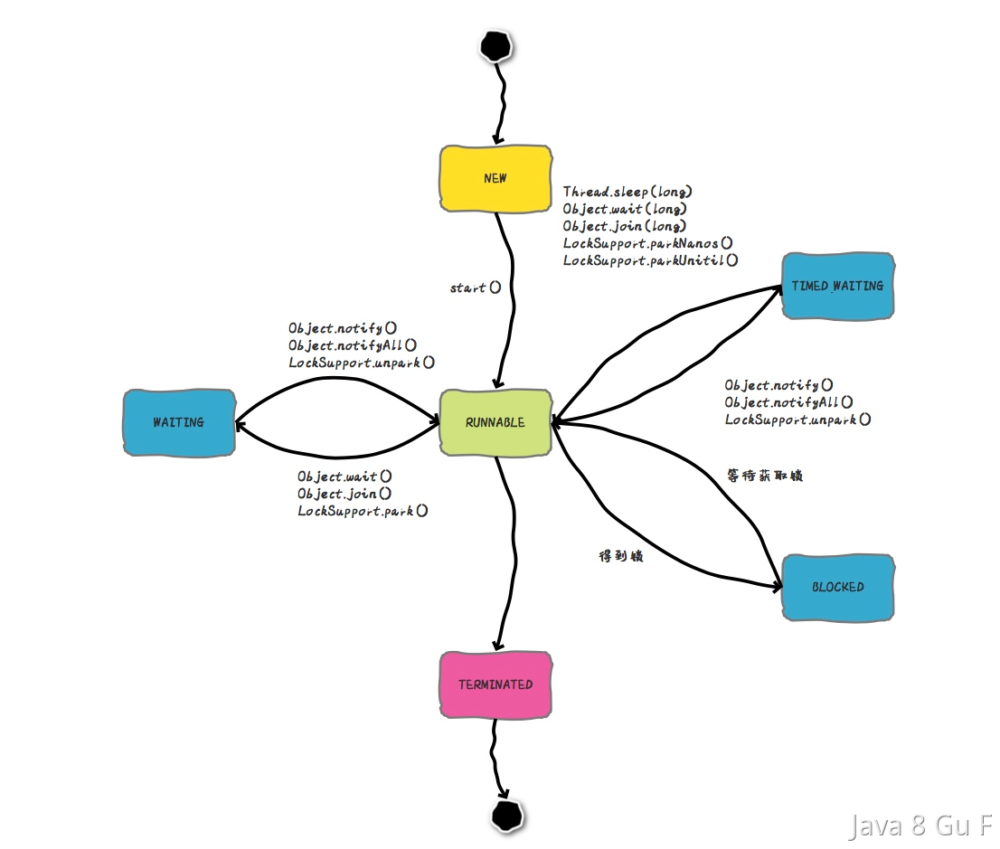
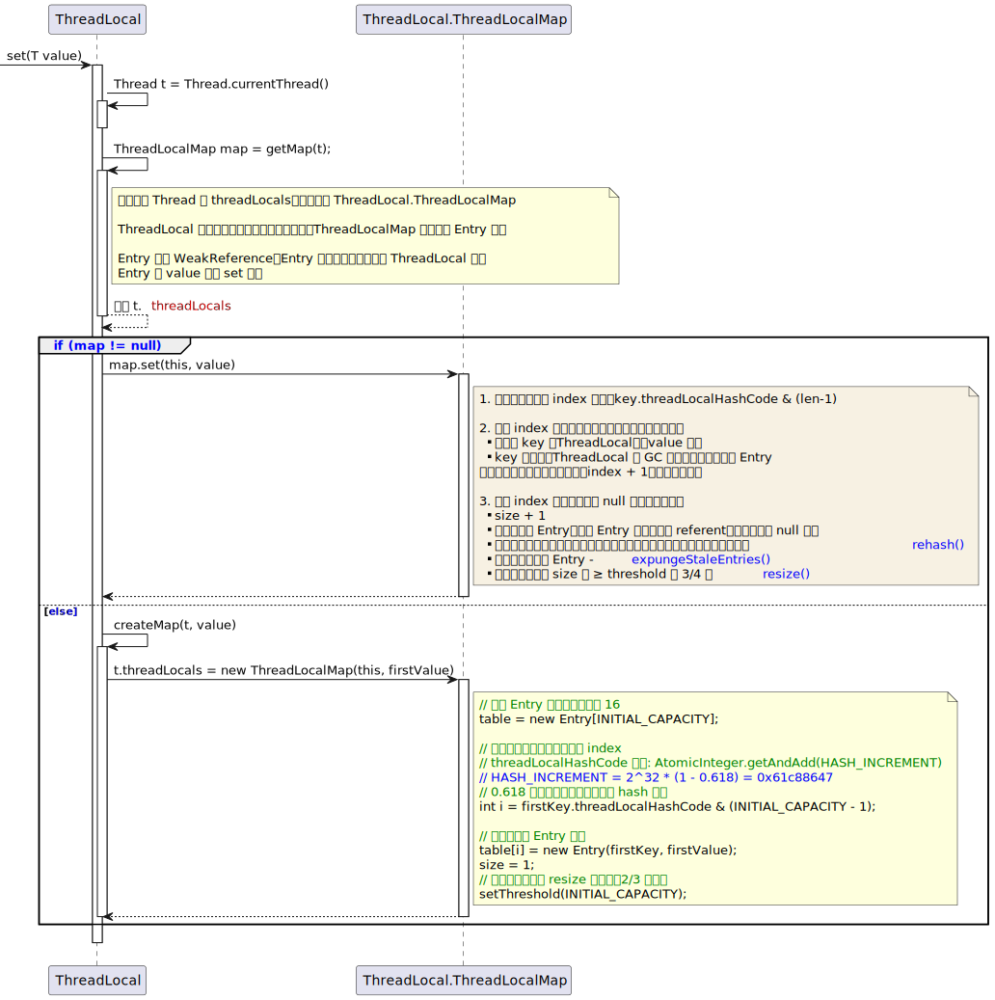
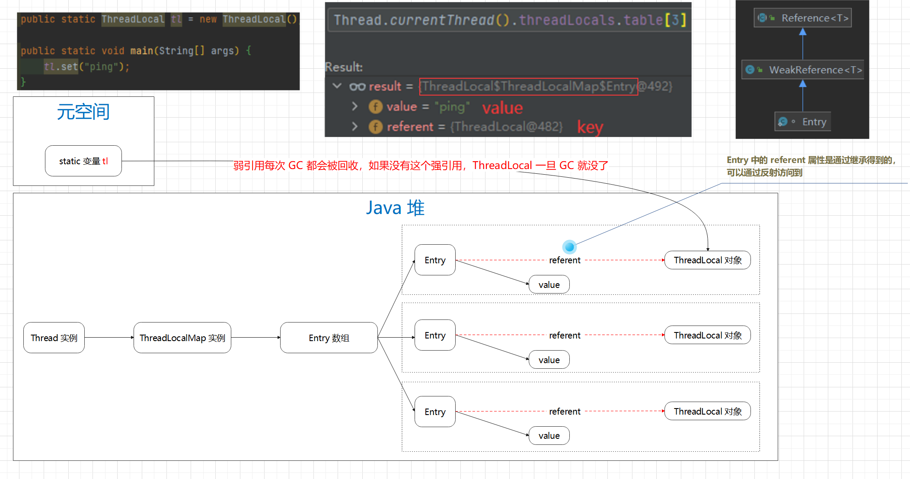

# 面试题-Java并发

#### 什么是多线程中的上下文切换？

先说一下**多线程的本质**吧，其实 CPU 在某一时刻只能执行一个任务，多线程的本质就是：把 cpu 时间划分为固定的时间片段（一般就 10~20ms），每个任务在一个时间片段内获得 CPU 执行时间，通过 cpu 时间片轮转调度，让多个任务不断地切换运行，给我们一种多任务同时运行的错觉。

**上下文切换**就是：当时间片用完后，操作系统中断当前任务、并保存当前任务状态（线程上下文）、然后加载下一个任务（就绪状态）的上下文、并开始执行该任务。

**上下文**就是：当前任务的寄存器值、指令指针、内存映射等任务执行相关的信息。

**java 中的线程上下文**就是：

- 程序计数器：指示线程当前执行的指令的位置；
- 虚拟机栈：用于存储线程的方法调用和局部变量；
  - 栈帧：包含了局部（本地）变量表和操作数栈（先进后出）、动态链接、方法出口等信息。

- 寄存器值：线程执行过程中需要的一些临时数据；

#### 何时会导致密集的上下文切换？

抢锁、IO、线程阻塞时、...

#### 如何避免频繁的上下文切换？

1. 减少线程数：线程数不在多，而在于合理；
2. 使用无锁并发编程：避免线程因等待锁而进入阻塞状态，从而减少上下文切换的发生；
3. 使用 CAS：可以避免线程阻塞和唤醒操作，从而减少上下文切换的发生；
4. 合理使用锁：避免过多使用同步，尽量缩小同步范围，减少线程等待时间，从而避免上下文切换；
5. 使用 JDK21 的虚拟线程：一种用户态线程，非内核态切换，使用 jvm 进行调度管理，降低上下文切换的成本。

#### 能不能谈谈你对线程安全的理解？

就是一个函数或对象在并发环境下被调用或访问，它能够正确处理共享数据，使其结果符合预期（程序正确执行），这就是线程安全。

#### 进程和线程的区别?

进程就是正在运行的程序（代码），对于操作系统来说，一个任务就是一个**进程**，比如：运行中的浏览器、音乐播放器、还有使用 `java -jar`  命令启动的 java 进程等等。

如果一个进程需要同时运行多个子任务，这时就需要用到**线程**了，可以把他理解为“轻量级的进程“，它其实就是共享了父进程的资源（比如：进程地址空间，文件描述符和信号量等），所以线程的切换成本比较低。

操作系统“分配资源的基本单位”是进程，但“调度的基本单位”可以是进程，也可以是线程，这个取决于操作的实现。

> 现代操作系统引入线程级调度主要有以下几个原因：
>
> 1. 提高并发性
> 2. 提高响应性
> 3. 共享资源
> 4. 平衡负载、提高资源利用率

通常每个进程都有自己独立的内存空间和系统资源。

> 进程的上下文不仅包括了虚拟内存、栈、全局变量等用户空间的资源，还包括了内核堆栈、寄存器等内核空间的状态。
>
> 进程切换时，需要先把该进程的用户态资源（虚拟内存、栈等）保存下来，再保存内核态资源（当前进程的内核状态和 CPU 寄存器），而加载了下一进程的内核态后，还需要刷新进程的虚拟内存和用户栈。

#### 为什么 Java 线程的阻塞和唤醒非常昂贵？

Java 的线程是映射到操作系统的原生线程上的，线程创建、析构及同步等动作，都需要进行系统调用，这就需要从用户态转到核心态，状态转换需要耗费很多处理器时间。

**用户态（函数调用）和内核态（系统调用）转换的开销：**

- 引导机制
- 建立内核堆栈
- 验证参数
- 内核态映射到用户态的地址空间（内核需要访问用户态的信息）
- 内核态独立地址空间 TLB

> 用户态：只能执行受限的指令、访问受限的资源。
>
> 内核态：可以执行特权指令、访问系统资源。
>
> TLB, Translation Lookaside Buffer 是一种硬件缓存，用于加速虚拟地址到物理地址的转换过程。

**缓存开销（缓存失效）：**

频繁使用的数据 cpu 会进行缓存，切换线程后会重新缓存。

#### 什么是并发？什么是并行？

单个 cpu 同时运行多个任务，就是并发。

多个 cpu 独立运行各自的任务，就是并行。

#### 线程有几种状态？状态之间怎么流转的？

1. NEW：新创建一个线程对象，还没调用 start() 方法
2. RUNNABLE：包含就绪（READY）和运行中（RUNNING）两个状态
   1. READY：调用了 start() 但线程还未获得 cpu 使用权
   2. RUNNING：获得 cpu 时间片，正在执行程序
3. BLOCKED：竞争锁失败被阻塞
4. WAITING：等待，需要其他线程唤醒或中断才会继续执行
5. TIMED_WAITING：超时等待，会在指定时间后转变为 RUNNABLE
6. TERMINATED：线程执行完毕。



#### 为什么线程没有 RUNNING 状态？

RUNNING 是线程获得 cpu 时间片，正在执行程序时的状态，cpu 时间片很短，一般就 10~20ms，所以，就绪和 RUNNING 这两个状态会频繁地转换，线程是否处于 RUNNING 状态我们没有必要关注，因为即使关注了也不准确，只要关注它是不是 RUNNABLE 状态就行了，所以 JAVA 没有给线程定义 RUNNING 状态。

#### WAITING 和 TIMED_WAIT 有什么区别？

WAITING 是等待状态，在 Java 中，调用 wait 方法时，线程会进入到 WAITING 状态，而 TIMED_WAITING 是超时等待状态，当线程执行 sleep 方法时，线程会进入 TIMED_WAIT 状态。

> 处于 WAITING 和 TIMED_WAIT 的线程，都是会让出 CPU 的，这时候其他线程就可以获得 CPU 时间片开始执行。
>
> 但是他们在对象的锁释放上面并不一样，如果加了锁，sleep 方法不会释放对象上的锁，而 wait 方法是会释放锁的。

#### 为什么 wait()、notify()、notifyAll() 定义在 Object 类，而 sleep 定义在 Thread 类？

wait、notify、notifyAll 操作的是锁对象，任意对象都可以作为锁对象，定义在 Object 类，编程更简单，如果定义在 Thread 类中，那么当一个线程持有多个锁时，编程会变得很麻烦。

sleep 与 wait、notify、notifyAll 的主要区别就是不涉及锁的释放和获取，所以作为一个线程操作就应该定义在 Thread 类中。

#### 什么是守护线程？和普通线程有什么区别？

守护线程一般用来执行后台任务，比如 GC 线程、Finalizer 线程（负责执行对象的 `finalize()` 方法），它和普通线程的区别就是：停止 JVM 进程时，需要等待普通线程都执行完，而不关心守护线程是否执行完。

#### 创建线程的方式有几种？

一种，就是构造 Thread 实例。

但是构造 Thread 实例的方式有很多种：

- 通过 Runnable 构造
- 通过 Callable 构造
- 通过 FutureTask 构造
- 通过线程池构造

#### run/start、wait/sleep、notify/notifyAll 区别?

run 是当前线程直接执行，start 是启一个线程执行 run 方法中的逻辑。

wait 会让线程进入等待（WAITING）状态直到被唤醒，需要搭配锁使用，sleep 会让线程进入超时等待（TIMED_WAITING）状态；wait 会释放锁而 sleep 不会；wait 是 Object 的方法，sleep 是 Thread 的方法；两者都可以响应中断。

notify 只会唤醒一个线程，notifyAll 会唤醒 _waitSet 中所有线程。

#### 一个线程两次调用 start() 会出现什么情况？为什么？

start 的时候会先检查线程状态，只有 new 状态的线程才能继续，否则会抛出 IlleagalThreadStateException。

> Tips
>
> start  方法是被 synchronized 修饰的，可以保证线程安全。
>
> 由 JVM 创建的 main 方法线程和 system 组线程，并不会通过 start 来启动。

#### 如何正确停止一个线程？

用 interrupt 方法来请求线程停止，线程通过 isInterrupted 方法获取中断标识，然后抛异常，即可停止一个线程。

#### 如何处理不可中断的阻塞？

> 例如抢锁时 ReetrantLock.lock() 或者 Socket I/O 时无法响应中断。

对于不能响应 InterruptedException 的阻塞，并没有通用的解法。得具体情况具体分析，比如 `ReentrantLock.lockInterruptibly()`，再比如关闭套接字使线程立即返回。

#### 如何用 wait() 实现两个线程交替打印 0~100 的奇偶数？

一个线程打印奇数，一个线程打印偶数，每次打印后就唤醒（notify）另外一个线程，自己进入休眠状态，等待另一个线程打印后唤醒自己，然后循环重复。

#### 为什么 wait() 必须在同步代码块中使用？

如果不在同步代码块中，那就无法准确控制 `wait()` 和 `notify()` 的执行顺序了，如果发生了 `notify()` 先执行，再执行 `wait()` 的情况，那么就会无限等待。

#### wait() 方法是属于 Object 对象的，那调用 Thread#wait() 会怎么样？

与 Object 的 wait 无异，但是 Thread 退出（`exit()`）的时候会自动 `notify()`，这样我们自己设计的唤醒流程就受到了干扰，所以非常不推荐这么干。

#### notify 和 notifyAll 如何选择？

使用 notifyAll，除非一次通知需要唤醒的线程只有一个，且是同质等待线程（同一保护条件，且 wait 后的处理逻辑一致）。

#### notifyAll 后所有线程都会再次抢夺锁，如果抢夺失败会怎样？

继续等待，和 synchronized 的 monitor 一样。

#### 用 suspend 和 resume 来阻塞线程可以吗？为什么？

不推荐使用，效果类似于 wait 和 notify，但不释放锁，容易引起死锁。

#### join 期间，线程处于哪种状态？

WAITING，为什么不是 TIMED_WAITING？因为 join 无法预估实际等待时间。

#### yield 和 sleep 的区别？

yield 只是释放 cpu 时间片，线程依然处于就绪状态，随时可能再次被调度。

sleep 期间，线程处于 TIMED_WAITING 状态，线程不会被调度。

#### 为什么程序设计不应依赖线程优先级？

高优先级并不能保证先于低优先级执行，如果优先级设置不合理还可能导致线程饥饿的问题（低优先级的线程一直得不到运行）。

#### 你知道哪几类线程安全问题？

- 运行结果错误（多线程共享的数据被并发修改）
- 对象发布和初始化的时候的安全问题，比如：构造函数中运行线程
- 死锁等活跃性问题

#### 哪些场景需要注意线程安全问题？

1. 访问共享的变量活资源会有并发风险
2. 依赖时序的操作
3. 不同的数据之间存在捆绑关系的时候

#### 为什么多线程会带来性能问题？

由于线程需要协作，存在调度的开销（当线程数超过 cpu 核心数时）。

除此之外，还有缓存开销。线程上下文切换还有导致 cpu 缓存失效。

#### 如何实现主线程捕获子线程异常?

- Callable 和 Future

```java
import java.util.concurrent.*;

public class Main {
    public static void main(String[] args) {
        ExecutorService executor = Executors.newSingleThreadExecutor();

        Future<Integer> future = executor.submit(() -> {
            // 子线程抛出异常
            throw new RuntimeException("子线程异常");
        });

        try {
            Integer result = future.get();
            System.out.println("子线程结果: " + result);
        } catch (ExecutionException e) {
            Throwable cause = e.getCause();
            System.out.println("捕获到子线程异常"));
        }

        executor.shutdown();
    }
}
```

- UncaughtExceptionHandler

```java
public class DemoUncaughtExceptionHandler implements Thread.UncaughtExceptionHandler {
    @Override
    public void uncaughtException(Thread t, Throwable e) {
        System.out.println("线程 " + t.getName() + " 抛出未捕获异常：" + e.getMessage());
        // 在这里可以执行自定义的异常处理逻辑
    }
}

public class Main {
    public static void main(String[] args) {
        Thread thread = new Thread(() -> {
            throw new RuntimeException("这是一个未捕获异常");
        });
        
        // 设置自定义的未捕获异常处理器
        thread.setUncaughtExceptionHandler(new DemoUncaughtExceptionHandler());
        
        thread.start();
    }
}
```

#### 三个线程分别顺序打印 0-100

**用 Thread#yield 实现**

```java
private static volatile int count = 0;
private static final int MAX = 100;
static class OtherWorker implements Runnable {

        private final int index;

        public OtherWorker(int index) {
            this.index = index;
        }

        @Override
        public void run() {
            while (count < MAX) {
                while (count % 3 != index) {
                    Thread.yield();
                }
                if (count > MAX) {
                    return;
                }
                System.out.println("Thread-" + index + " " + count);
                count++;
            }
        }
}
```

**用 ReentrantLock 和 Condition#await 和 Condition#singal 实现**

```java
public class Test {
    private static final int WORKER_COUNT = 3;
    private static int countIndex = 0;
    private static final ReentrantLock LOCK = new ReentrantLock();

    public static void main(String[] args){
        final List<Condition> conditions = new ArrayList<>();
        for(int i=0; i< WORKER_COUNT; i++){
            // 为每一个线程分配一个condition
            Condition condition = LOCK.newCondition();
            conditions.add(condition);
            Worker worker = new Worker(i, conditions);
            worker.start();
        }

    }

    static class Worker extends Thread{

        int index;
        List<Condition> conditions;

        public Worker(int index, List<Condition> conditions){
            super("Thread-"+index);
            this.index = index;
            this.conditions = conditions;
        }

        private void signalNext(){
            int nextIndex = (index + 1) % conditions.size();
            conditions.get(nextIndex).signal();
        }

        @Override
        public void run(){
            while(true) {
                //锁住 保证操作间同时只有一个线程
                LOCK.lock();
                try {
                    // 如果当前线程不满足打印条件，则等待
                    if (countIndex % 3 != index) {
                        conditions.get(index).await();
                    }
                    if (countIndex > 100) {
                        // 唤醒下一个线程，保证程序正常退出
                        signalNext();
                        // 退出循环 线程运行结束
                        return;
                    }
                    System.out.println((this.getName() + " " + countIndex));
                    // 计数器+1
                    countIndex ++;
                    // 通知下一个干活
                    signalNext();
                }catch (Exception e){
                    e.printStackTrace();
                }finally {
                    LOCK.unlock();
                }
            }
        }
    }
}
```

**用 synchronized 和 wait/notifyAll 实现**

```java
public class SortTest {

    private static final Object LOCK = new Object();
    private static volatile int count = 0;
    private static final int MAX = 100;

    public static void main(String[] args) {
        Thread thread = new Thread(new Seq(0));
        Thread thread1 = new Thread(new Seq(1));
        Thread thread2 = new Thread(new Seq(2));
        thread.start();
        thread1.start();
        thread2.start();
    }

    static class Seq implements Runnable {

        private final int index;

        public Seq(int index) {
            this.index = index;
        }

        @Override
        public void run() {
            while (count < MAX) {
                synchronized (LOCK) {
                    try {
                        while (count % 3 != index) {
                            LOCK.wait();
                        }
                        if(count <=MAX){
                            System.out.println("Thread-" + index + ": " + count);
                        }
                        count++;
                        LOCK.notifyAll();
                    } catch (InterruptedException e) {
                        e.printStackTrace();
                    }
                }
            }
        }
    }
}
```

#### Future 类有什么用？

Future 是一个接口，代表了一个异步执行的结果。接口中的方法用来检查执行是否完成、等待完成和得到执行的结果。当执行完成后，只能通过 get() 方法得到结果，get 方法会阻塞直到结果准备好了。如果想取消，那么调用 cancel() 方法。

FutureTask 是 Future 接口的一个实现，它实现了一个可以提交给 Executor 执行的任务，并且可以用来检查任务的执行状态和获取任务的执行结果。

#### Callable 和 Future 有什么关系？

Callable 接口定义了一个具有返回值的任务，它的 `call()` 方法可以被调用并返回一个结果。Callable 接口通常与 Executor 一起使用，以便将任务提交给线程池进行执行。

`submit` 方法返回一个 Future，代表一个异步计算的结果，它提供一些方法来检查任务是否完成、等待任务完成并获得结果。

```java
public class CallableExample implements Callable<String> {
    @Override
    public String call() throws Exception {
        // 执行一些耗时的操作
        Thread.sleep(2000);
        return "任务执行完成";
    }

    public static void main(String[] args) throws Exception {
        CallableExample callable = new CallableExample();
        ExecutorService executor = Executors.newFixedThreadPool(1);
        Future<String> future = executor.submit(callable);

        // 获取任务的执行结果
        String result = future.get();
        System.out.println(result);

        executor.shutdown();
    }
}
```

#### 如何对多线程进行编排？

在 Java 8 中, 新增加了一个新的类: `CompletableFuture`，它提供了非常强大的 Future 的扩展功能，可以帮助我们简化异步编程的复杂性，提供了函数式编程的能力，可以通过回调的方式处理计算结果，并且提供了转换和组合 `CompletableFuture` 的方法。

#### CompletableFuture 的底层是如何实现的？


#### JDK21 中的虚拟线程是怎么回事？


## ThreadLocal

#### 什么是 ThreadLocal，如何实现的？

ThreadLocal 提供线程局部变量，当你希望将状态与线程相关联时可以使用它。

ThreadLocal 有 4 个方法：

- **whthIntial(Supplier)**
  - 静态方法，返回一个 `SuppliedThreadLocal`，接受一个  `Supplier` 用于设置初始值。
- **get**
  - 返回此线程局部变量的当前线程副本中的值。如果没有值，就返回 `setInitialValue()` 的值。
- **set**
  - 将此线程局部变量的当前线程副本设置为指定值。
- **remove**
  - 移除这个线程局部变量的当前线程值，如果随后又调了 get 方法，就会通过 initialValue 重新初始化。


**下面通过 set 方法源码分析，了解 ThreadLocal 是如何实现的：**



**通过 set 方法分析，确定 ThreadLocal 的结构如下：**



可以看到 ThreadLocal 是通过线程实例的 ThreadLocalMap 的 Entry 数组引用的，Entry 的 referent 是继承的弱引用。

所以，即使 Thread 一直存在，ThreadLocal 也会在下次 GC 的时候被清理，前提是没有其他引用。

#### ThreadLocal 内存泄漏是怎么回事？

如上所述，虽然 ThreadLocal 是通过弱引用引用的，但是 value 是强引用，一般我们都是使用线程池，线程实例没有销毁 value 就一直存在，这就是 ThreadLocal 的内存泄露。

我们一般会在线程任务执行结束后进行 remove 操作，来清理 value。事实上，调用 get 和 set 方法的时候也会检查弱引用是否为 null，然后清理无用的 value。

#### ThreadLocalMap 的结构了解吗？

ThreadLocalMap 位于 ThreadLocal 类，是一个静态内部类。它的结构主要是一个 Entry 数组，Entry 也是 ThreadLocalMap 的静态内部类，继承 WeakReference，通过弱引用指向 ThreadLocal 实例，Entry 的 value 字段存储具体的内容。

#### ThreadLocalMap 怎么解决 hash 冲突的？

开放定址法。

```java
    private static AtomicInteger nextHashCode = new AtomicInteger();

    /**
     * 2^32 * (1 - 0.618)
     */
    private static final int HASH_INCREMENT = 0x61c88647;

    /**
     * Returns the next hash code.
     */
    private static int nextHashCode() {
        return nextHashCode.getAndAdd(HASH_INCREMENT);
    }
```

`hashCode & (数组长度 - 1)` 确定存到哪个位置，如果该位置已经有值，就找下一个位置，知道找到空位。

#### ThreadLocalMap 扩容机制了解吗？

在 set 结束后，会先进行启发式清理，如果没有清理掉任何数据，就判断 size 是否大于等于容量的 `2/3`，如果是，就 `rehash()`。

rehash 会先清理过期的 Entry，然后判断 size 是否大于等于阈值的 `3/4`，如果是，就 resize，按两倍扩容，把旧数组中的 Entry 重新散列到新数组。

#### 父子线程怎么共享数据？

使用 InheritableThreadLocal，构造 Thread 的时候调用 init 方法，会将父线程的 inheritableThreadLocal 传递给子线程。

```java
this.inheritableThreadLocals = ThreadLocal.createInheritedMap(parent.inheritableThreadLocals);
```

#### 有了 InheritableThreadLocal 为啥还需要 TransmittableThreadLocal？

InheritableThreadLocal 是用于主子线程之间参数传递的，但是，这种方式有一个问题，那就是必须要是在主线程中手动创建的子线程才可以，但是现在都是使用线程池，所以 InheritableThreadLocal 就不好使了。

TransmittableThreadLocal 是阿里开源的一个方案，这个类继承并加强 InheritableThreadLocal 类。用来实现线程之间的参数传递，一经常被用在以下场景中：

- 分布式跟踪系统 或 全链路压测（即链路打标）
- 日志收集记录系统上下文
- Session 级 Cache
- 应用容器或上层框架跨应用代码给下层 SDK 传递信息

## 锁

#### 线程同步的方式有哪些？

#### 什么是死锁？如何解决？

#### 什么是 Java 内存模型？

#### 什么是总线嗅探和总线风暴，和 JMM 有什么关系？

#### 并发编程中的原子性和数据库ACID的原子性一样吗？

#### 说说你对原子性、可见性、有序性的理解

#### synchronized 是怎么实现的？

#### synchronized 锁的是什么？

#### synchronized 是如何保证原子性、可见性、有序性的？

#### synchronized 的锁升级过程是怎样的？

#### synchronized 升级过程中有几次自旋？

#### synchronized 的锁优化是怎样的？

#### 构造方法可以用 synchronized 修饰吗？

不行，构造方法本身就是线程安全的。

#### 什么是内存可见性问题？

#### 什么是原子操作？

#### Java 中的原子操作有哪些？

#### AtomicInteger 的原理了解吗？

#### long 和 double 的原子性你有了解吗？

#### 讲讲 volatile 关键字

#### volatile 的原理了解吗？

#### 有了 synchronized 为什么还需要 volatile?

#### volatile 能保证原子性吗？为什么？

#### int a = 1 是原子性操作吗？

#### volatile 是如何保证可见性和有序性的？

#### 什么是指令重排序？

#### 指令重排序有限制吗？

#### happens-bofore 是什么？

#### happens-beefore 规则有哪些？

#### as-if-serial 是什么？单线程的程序一定是顺序的吗？

#### 什么是 CAS？存在什么问题？

#### CAS 一定有自旋吗？

#### 什么是 Unsafe？

#### CAS 在操作系统层面是如何保证原子性的？

#### synchronized 和 ReentrantLock 区别？

#### 公平锁和非公平锁的区别？

#### ReentrantLock 的实现原理

#### ReentrantLock 怎么实现公平锁的？

#### StampedLock 是什么？

#### StampedLock 性能为什么更好？

#### StampedLock 适用场景

#### StampedLock 底层原理

#### 可中断锁和不可中断锁有什么区别？

#### 共享锁和独占锁有什么区别？

#### 锁的分类

#### 线程持有读锁还能获取写锁吗？

#### 读锁为什么不不能升级为写锁？

#### LongAdder 和 AtomicLong 的区别？

#### 有三个线程 T1,T2,T3 如何保证顺序执行？

#### 如何保证多线程下 i++ 结果正确？

#### Thread.sleep(0) 的作用是什么？

#### 有哪些实现线程安全的方案?

#### 线程是如何被调度的？

#### 为什么 JDK 15 要废弃偏向锁？

#### Java 是如何判断一个线程是否存活的？

#### 什么是可重入锁，怎么实现可重入锁？

#### 什么是乐观锁？什么是悲观锁？

#### 如何实现乐观锁？

#### 乐观锁存在什么问题？

#### 写一个必然死锁的例子

#### 生产中什么场景下会发生死锁？

#### 发生死锁必须满足哪些条件？

#### 如何用工具定位死锁？

#### 有哪些解决死锁问题的策略？

#### 讲一讲经典的哲学家就餐问题

#### 实际开发中如何避免死锁？

#### 什么是活跃性问题？活锁、饥饿、死锁有什么区别？

## 线程池

#### 能说说工作中线程池的应用吗？

#### 如何让 Java 的线程池顺序执行任务？

使用单线程线程池 SingleThreadExecutor，或者调度线程池 `ScheduledExecutorService` 结合 `ScheduledFuture` 实现顺序执行：

```java
ScheduledExecutorService executor = Executors.newScheduledThreadPool(1);
ScheduledFuture<?> future1 = executor.schedule(task1, 0, TimeUnit.MILLISECONDS);
// future.get() 会使线程进入等待状态
ScheduledFuture<?> future2 = executor.schedule(task2, future1.get(), TimeUnit.MILLISECONDS);
ScheduledFuture<?> future3 = executor.schedule(task3, future2.get(), TimeUnit.MILLISECONDS);
// 任务会按照依赖关系和前一个任务的执行时间逐个执行
executor.shutdown();
```

#### 什么是线程池？如何实现？

#### 线程池的主要参数有哪些？

#### 如何给线程池命名

#### 简单说一下线程池的工作流程

#### 线程数设定成多少合适？

#### 线程池有哪几种工作队列？

#### 为什么不建议通过 Executors 构建线程池？

#### 线程池的拒绝策略有哪些？

#### 线程池提交 execute 和 submit 有什么区别？

#### 线程池怎么关闭？

#### 有哪几种常见的线程池？

#### 说一下常见的四种线程池的工作原理

#### 线程池异常怎么处理知道吗？

#### 能说一下线程池有几种状态吗？

#### 线程池如何实现参数的动态修改？

#### 线程池调优了解吗？

#### 你能设计实现一个线程池吗？

#### 单机线程池断电了应该怎么处理？

#### Fork/Join 框架了解吗？

#### ForkJoinPool 和 ThreadPoolExecutor 区别是什么？

## 并发容器

#### 线程安全的集合有哪些？

ConcurrentHahsMap (替代 HashMap)

ConcurrentLinkedDeque (替代 LinkedList, 双端队列)

ConcurrentLinkedQueue (替代 LinkedList, FIFO 队列)

ConcurrentSkipListMap (替代 TreeMap)

ConcurrentSkipSet (替代 TreeSet)

CopyOnWriteArrayList (替代 ArrayList)

CopyOnWriteArraySet (替代 HashMap)

#### 如何将集合变成线程安全的？

1. 操作加锁
2. 放入 ThreadLocal
3. 转换成同步集合 `Collections.synchronizedXXX()`
4. 转换成不可变集合 `Collections.unmodifiableXXX()`

#### 为什么 ConcurrentHashMap 不允许 null 值？

主要是考虑一个问题，当 get 方法返回 null 时，我们怎么判断这个 key 是 put 进去的时候就是 null，还是没找到。这是就需要用 contains 方法来判断了，在单线程环境中，这样判断是可靠的，HashMap 是单线程环境下使用的，所以没问题。

但是在多线程环境中，这样判断是不可靠的，假设 get 返回 null，contains 返回 true，然后你再去 get 同一个 key 返回结果已经不是 null 了，因为别的线程有可能修改了它，所以第一次 get 返回 null 的时候到底是因为没找到还是 put 设置的就是 null，根本不能靠 contains 来判断。

#### ConcurrentHashMap 是如何保证线程安全的？

在 JDK 1.7 中，ConcurrentHashMap 使用了分段锁技术，即将哈希表分成多个段，每个段拥有一个独立的锁。这样可以在多个线程同时访问哈希表时，只需要锁住需要操作的那个段，而不是整个哈希表，从而提高了并发性能。

虽然JDK 1.7的这种方式可以减少锁竞争，但是在高并发场景下，仍然会出现锁竞争，从而导致性能下降。

在 JDK 1.8中，ConcurrentHashMap的实现方式进行了改进，使用分段锁和“CAS+Synchronized”的机制来保证线程安全。在 JDK 1.8 中，ConcurrentHashMap 会在添加或删除元素时，首先使用 CAS 操作来尝试修改元素，如果 CAS 操作失败，则使用 synchronized 锁住当前槽，再次尝试 put 或者 delete。这样可以避免分段锁机制下的锁粒度太大，以及在高并发场景下，由于线程数量过多导致的锁竞争问题，提高了并发性能。

#### ConcurrentHashMap 在哪些地方做了并发控制？

初始化桶阶段、put 阶段、扩容阶段。

#### ConcurrentSkipListMap 和 ConcurrentHashMap 有什么区别？

ConcurrentHashMap 不支持排序，ConcurrentSkipListMap 支持排序，它是一个多层级的链表结构，插入元素时会随机一个层级，最终结构可以近似理解为一个多叉树，查找元素时从最顶层第一个节点开始，当要查找的值大于当前节点小于下一个节点，就下降一层继续找。

实现起来比较简单，却有近似 `O(log(n))` 的复杂度。

#### ConcurrentHashMap 是如何保证 fail-safe 的？

ConcurrentHashMap 通过弱一致性迭代器和 Segment 分离机制来实现 fail-safe 特性，可以保证在遍历时不会受到其他线程修改的影响。

## 并发工具类

#### 如何理解 AQS？

#### AQS 是如何实现线程的等待和唤醒的？

#### CountDownLatch（倒计数器）了解吗？

#### CountDownLatch 原理是什么？

#### CyclicBarrier（同步屏障）了解吗？

#### CyclicBarrier 原理是什么？

#### Semaphore（信号量）了解吗？

#### Semaphore 原理是什么？

#### Exchanger 了解吗？

#### Exchanger 原理是什么？

#### CountDownLatch、CyclicBarrier、Semaphore 区别？

