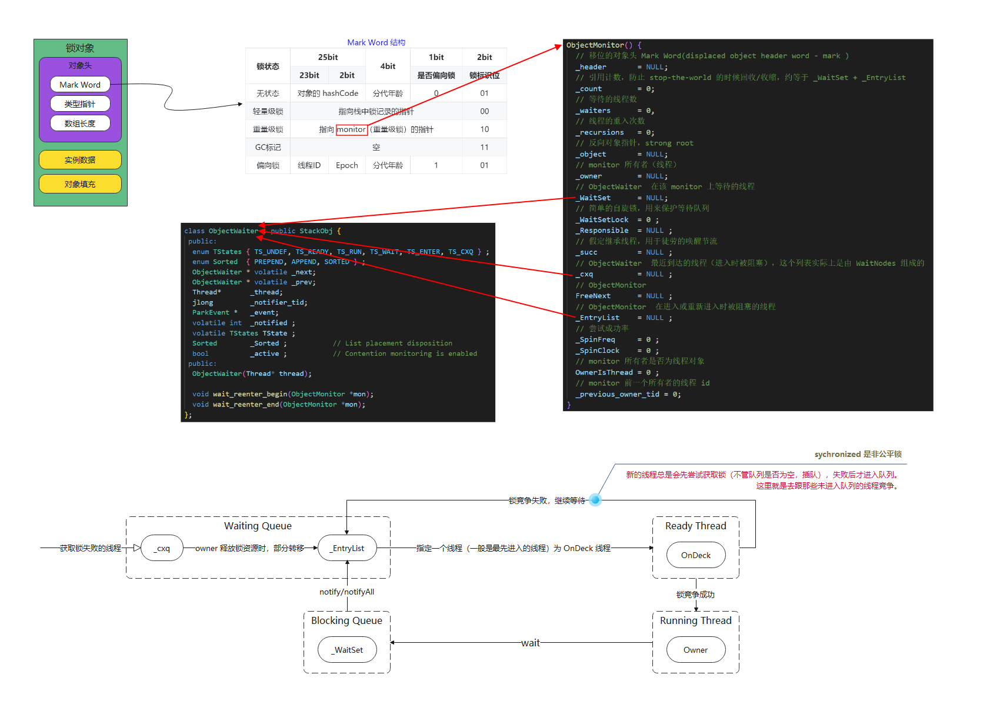
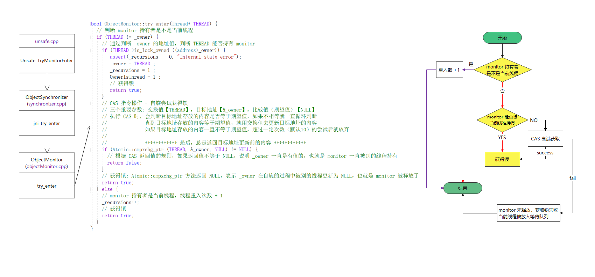
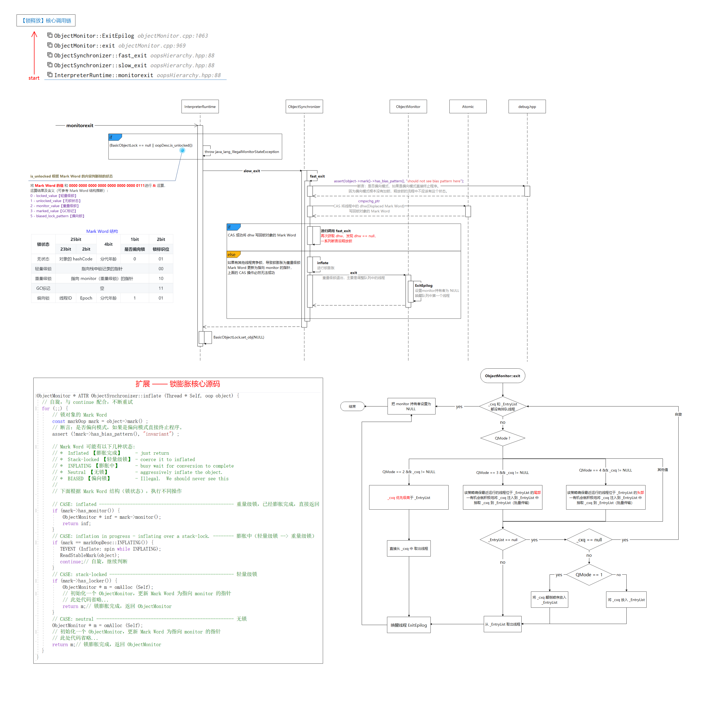
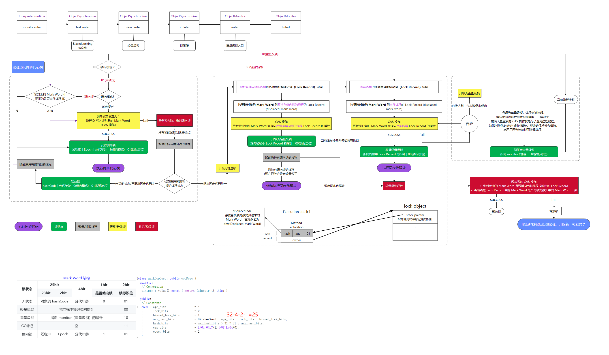
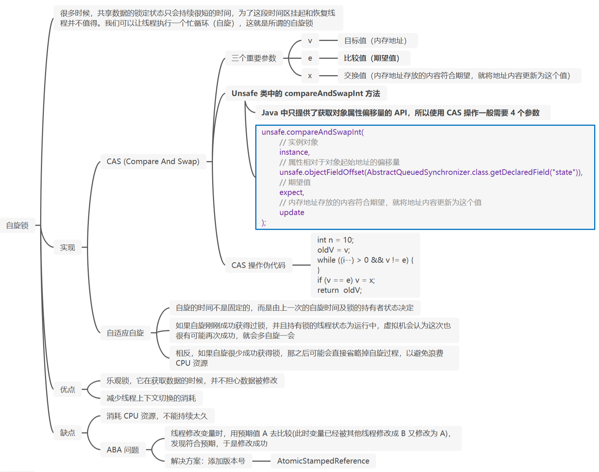
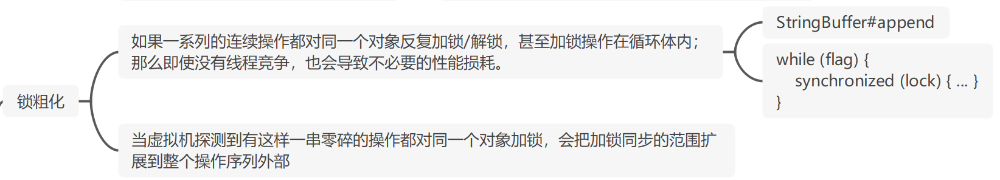
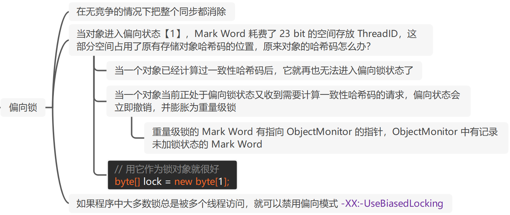
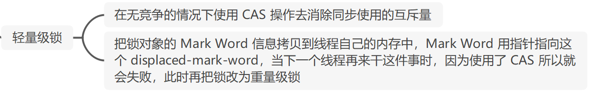

# 面试题-Java并发

#### 并发设计原则

1. **识别独立任务：**并发设计的第一步是确定哪些任务可以并行执行，哪些任务需要顺序执行。这需要对业务逻辑有深入的理解。
2. **使用高级并发控制机制：**现代编程语言通常提供了一些高级的并发控制机制，如线程池、并发集合等。这些机制可以帮助我们更容易地实现并发。
3. **考虑可扩展性：**并发设计应该考虑到系统的可扩展性。当系统的负载增加时，我们应该能够简单地添加更多的处理器或服务器来处理更多的任务。
4. **使用线程安全的 API：**在并发环境中，数据竞争和其他并发问题是常见的问题。使用线程安全的API可以帮助我们避免这些问题。
5. **不假设执行顺序：**在并发程序中，任务可能以任何顺序执行。我们不应该假设或依赖于特定的执行顺序。
6. **优先使用局部线程变量：**尽可能减少共享状态，可以使用ThreadLocal等技术将状态限制在单个线程内。
7. **寻找简单的并行算法：**复杂的并行算法往往更难以理解和维护。我们应该尽可能寻找简单的并行算法。
8. **优先使用不可变对象：**不可变对象是线程安全的，可以在多个线程之间安全地共享。
9. **遵循单一责任原则：**并发设计自身足够复杂，应该被视为修改的一个理由。我们应该尽可能地将并发相关的代码和其他代码分离。
10. **限制数据作用域：**我们应该尽可能地限制数据的作用域，避免不必要的数据共享。
11. **避免共享：**尽量避免多个线程之间共享数据，而是通过消息传递或其他方式实现线程之间的通信。共享数据容易导致数据一致性问题和竞争条件。
12. **分离关注点：**将并发处理逻辑与业务逻辑分离，这样可以更容易地管理和调整并发处理的策略，而不会对业务逻辑造成太大的影响。
13. **减小锁粒度：**尽量将锁的粒度减小到最小，以减少锁竞争的概率。可以使用细粒度锁、读写锁、无锁数据结构等技术来实现。
14. **异步处理：**尽量使用异步处理方式，将长时间的操作移至后台线程执行，以避免阻塞主线程。
15. **消息传递：**使用消息传递的方式进行线程间通信，可以减少线程之间的竞争和锁等并发问题。
16. **并发安全：**设计时要考虑并发操作可能引发的数据竞争、死锁、活锁等问题，并通过合适的并发控制手段来保证系统的并发安全性。
17. **性能优化：**在设计时要考虑系统的性能需求，并进行相应的优化措施，例如使用线程池、缓存等来提高系统的并发处理能力和响应速度。
18. **容错处理：**在设计并发处理系统时要考虑异常情况的处理，例如线程意外退出、资源不足等，需要有相应的容错机制来保证系统的稳定性。
19. **尽量减少锁的使用：**锁是一种同步机制，可以保护共享状态。但是，锁的使用会带来一定的开销，因此应该尽量减少锁的使用。
20. **尽量减少上下文切换：**上下文切换是指从一个线程切换到另一个线程的过程。上下文切换会带来一定的开销，因此应该尽量减少上下文切换。
21. **尽量减少线程数：**线程是一种轻量级的进程，但是线程的创建和销毁也会带来一定的开销。因此，应该尽量减少线程数，以提高程序的性能。
22. **尽量使用异步编程模型：**异步编程模型是指在等待某个操作完成时不会阻塞线程，而是通过回调函数等方式来处理操作完成的事件。异步编程模型可以提高程序的性能和可伸缩性。
23. **无锁或无阻塞设计：**尽可能地设计无锁或低阻塞的数据结构和算法，以提高并发性能。这可以通过使用原子操作、无锁数据结构或显式锁来实现。
24. **无状态原则：**无状态应用便于水平扩展，使系统更容易处理高并发
25. **分布式原则：**将系统的不同部分分布在多个机器上，提高可用性和扩展性，使系统更容易应对高并发情况
26. **高可用原则：**采用降级机制集中化管理，确保系统在面对高并发时仍能提供可靠服务
27. **业务设计原则：**包括幂等性、防重、状态机等，保障系统在并发场景下的正确性和稳定性
28. **基本原则：**原子性、内存可见性、有序性，确保在高并发环境下操作的正确性和可靠性
29. **幂等性设计原则：**保证同一请求多次提交时，服务端不会多次处理，确保处理逻辑的正确性
30. **微服务接口设计原则：**并发处理子任务时，可以将没有依赖关系的子任务并发化，提高系统性能
31. **高可用高并发系统设计原则：**包括服务解耦、异步处理、流量削峰缓冲等，牺牲强一致性以保证最终一致性
32. **系统设计目标：**高性能、高可用、可扩展是高并发系统设计的三大目标，以处理更多用户并发请求和处理更大流量
33. **拆分原则：**当系统过于庞大或承载不了大量请求时，应拆分系统，将复杂问题简化或将流量分散到不同子系统以分担压力。拆分可以按照系统维度、功能维度、读写维度以及模块维度进行。
34. **服务化原则：**当系统被拆分为多个服务后，应通过注册发现、限流、熔断、降级等方案让每个服务可以独立处理问题，降低排障成本。
35. **防重原则：**在某些场景下要防止用户重复操作，例如用户注册、下单、支付等，需要在客户端和服务端有相应方案避免这种问题。
36. **模块复用原则：**在业务中每个功能或多或少会有联系，设计时应尽量让模块独立，以便其他模块直接调用，减少代码冗余。
37. **可追溯原则：**在程序运行中避免不了业务问题以及故障的发生，可以通过日志的方式快速定位问题，做到有据可查
38. **锁和同步：**使用适当的锁机制（如互斥锁、读写锁等）来控制对共享资源的访问，以避免竞态条件。
39. **避免死锁：**死锁是多线程编程中的一个常见问题，需要采取措施来预防和检测死锁，例如使用锁顺序、超时设置或死锁检测算法。
40. **并发级别：**根据应用程序的需求和资源限制，合理地选择并发级别。过多的并发可能导致资源竞争和性能下降，而过少的并发则可能无法充分利用系统资源。
41. **资源池化：**通过创建资源池（如连接池、线程池等），可以重复利用已创建的资源，避免频繁创建和销毁资源带来的开销。
42. **负载均衡：**在多进程或多线程环境中，通过负载均衡来分配任务和请求，确保系统的整体性能和可用性。
43. **错误处理和恢复：**在并发设计中，需要考虑到错误处理和异常情况的处理。这包括捕获和处理异常、重试机制、事务回滚等，以确保系统的稳定性和可靠性。
44. **测试和性能分析：**在并发设计中，进行充分的测试和性能分析是至关重要的。通过测试来验证系统的并发性能、稳定性和正确性，并及时发现和解决潜在问题
45. **分解任务（Decompose Tasks）：**将大型任务分解为更小的子任务，这样可以使并发执行成为可能。通过拆分任务，可以将负载分配给多个线程或进程，提高系统的并发性能。
46. **最小化共享（Minimize Sharing）：**共享状态是并发问题的一个主要来源。尽量避免多个线程或进程之间共享可变的状态。如果必须共享状态，确保对共享状态进行正确的同步和访问控制，以避免竟态条件和数据不一致的问题。
47. **消除死锁（Avoid Deadlocks）：**死锁是并发系统中的一种常见问题，它会导致线程相互等待，无法继续执行。为了避免死锁，确保对锁的获取顺序进行正确管理，尽量避免循环依赖的锁。
48. **避免饥饿（PreventStarvation）：**饥饿是指某个线程或进程无法获取所需的资源而无法继续执行的情况。为了避免饥饿，应该合理调度和分配资源，确保每个线程或进程都有机会执行。
49. **保持简单性（Keep it Simple）：**并发设计应尽量保持简单。复杂的并发结构容易引l入错误和难以调试。选择简单而直观的并发模型和机制，以降低系统复杂性。
50. **使用线程安全的数据结构（Use Thread-Safe Data Structures）：**在并发设计中使用线程安全的数据结构可以简化同步和访问控制的工作。线程安全的数据结构能够自动处理并发访问的同步问题，减少开发人员的负担。
51. **合适的并发模型（Choose the Right Concurrency Model）：**根据应用的需求和特点,选择合适的并发模型。例如，基于线程的并发模型、基于事件驱动的模型或基于消息传递的模型等。选择适合问题领域和性能要求的模型可以提高系统效率。
52. **测试和调试（Testing and Debugging）：**并发系统的测试和调试是至关重要的。设计合适的测试用例来覆盖各种并发场景，进行并发性能测试和调试，以确保系统的正确性和性能

#### 什么是多线程中的上下文切换？

先说一下**多线程的本质**吧，其实 CPU 在某一时刻只能执行一个任务，多线程的本质就是：把 cpu 时间划分为固定的时间片段（一般就 10~20ms），每个任务在一个时间片段内获得 CPU 执行时间，通过 cpu 时间片轮转调度，让多个任务不断地切换运行，给我们一种多任务同时运行的错觉。

**上下文切换**就是：当时间片用完后，操作系统中断当前任务、并保存当前任务状态（线程上下文）、然后加载下一个任务（就绪状态）的上下文、并开始执行该任务。

**上下文**就是：当前任务的寄存器值、指令指针、内存映射等任务执行相关的信息。

**java 中的线程上下文**就是：

- 程序计数器：指示线程当前执行的指令的位置；
- 虚拟机栈：用于存储线程的方法调用和局部变量；
  - 栈帧：包含了局部（本地）变量表和操作数栈（先进后出）、动态链接、方法出口等信息。

- 寄存器值：线程执行过程中需要的一些临时数据；

#### 何时会导致密集的上下文切换？

抢锁、IO、线程阻塞时、...

#### 如何避免频繁的上下文切换？

1. 减少线程数：线程数不在多，而在于合理；
2. 使用无锁并发编程：避免线程因等待锁而进入阻塞状态，从而减少上下文切换的发生；
3. 使用 CAS：可以避免线程阻塞和唤醒操作，从而减少上下文切换的发生；
4. 合理使用锁：避免过多使用同步，尽量缩小同步范围，减少线程等待时间，从而避免上下文切换；
5. 使用 JDK21 的虚拟线程：一种用户态线程，非内核态切换，使用 jvm 进行调度管理，降低上下文切换的成本。

#### 能不能谈谈你对线程安全的理解？

就是一个函数或对象在并发环境下被调用或访问，它能够正确处理共享数据，使其结果符合预期（程序正确执行），这就是线程安全。

#### 进程和线程的区别?

进程就是正在运行的程序（代码），对于操作系统来说，一个任务就是一个**进程**，比如：运行中的浏览器、音乐播放器、还有使用 `java -jar`  命令启动的 java 进程等等。

如果一个进程需要同时运行多个子任务，这时就需要用到**线程**了，可以把他理解为“轻量级的进程“，它其实就是共享了父进程的资源（比如：进程地址空间，文件描述符和信号量等），所以线程的切换成本比较低。

操作系统“分配资源的基本单位”是进程，但“调度的基本单位”可以是进程，也可以是线程，这个取决于操作的实现。

> 现代操作系统引入线程级调度主要有以下几个原因：
>
> 1. 提高并发性
> 2. 提高响应性
> 3. 共享资源
> 4. 平衡负载、提高资源利用率

通常每个进程都有自己独立的内存空间和系统资源。

> 进程的上下文不仅包括了虚拟内存、栈、全局变量等用户空间的资源，还包括了内核堆栈、寄存器等内核空间的状态。
>
> 进程切换时，需要先把该进程的用户态资源（虚拟内存、栈等）保存下来，再保存内核态资源（当前进程的内核状态和 CPU 寄存器），而加载了下一进程的内核态后，还需要刷新进程的虚拟内存和用户栈。

#### 为什么 Java 线程的阻塞和唤醒非常昂贵？

Java 的线程是映射到操作系统的原生线程上的，线程创建、析构及同步等动作，都需要进行系统调用，这就需要从用户态转到核心态，状态转换需要耗费很多处理器时间。

**用户态（函数调用）和内核态（系统调用）转换的开销：**

- 引导机制
- 建立内核堆栈
- 验证参数
- 内核态映射到用户态的地址空间（内核需要访问用户态的信息）
- 内核态独立地址空间 TLB

> 用户态：只能执行受限的指令、访问受限的资源。
>
> 内核态：可以执行特权指令、访问系统资源。
>
> TLB, Translation Lookaside Buffer 是一种硬件缓存，用于加速虚拟地址到物理地址的转换过程。

**缓存开销（缓存失效）：**

频繁使用的数据 cpu 会进行缓存，切换线程后会重新缓存。

#### 什么是并发？什么是并行？

单个 cpu 同时运行多个任务，就是并发。

多个 cpu 独立运行各自的任务，就是并行。

#### 线程有几种状态？状态之间怎么流转的？

1. NEW：新创建一个线程对象，还没调用 start() 方法
2. RUNNABLE：包含就绪（READY）和运行中（RUNNING）两个状态
   1. READY：调用了 start() 但线程还未获得 cpu 使用权
   2. RUNNING：获得 cpu 时间片，正在执行程序
3. BLOCKED：竞争锁失败被阻塞
4. WAITING：等待，需要其他线程唤醒或中断才会继续执行
5. TIMED_WAITING：超时等待，会在指定时间后转变为 RUNNABLE
6. TERMINATED：线程执行完毕。


#### 为什么线程没有 RUNNING 状态？

RUNNING 是线程获得 cpu 时间片，正在执行程序时的状态，cpu 时间片很短，一般就 10~20ms，所以，就绪和 RUNNING 这两个状态会频繁地转换，线程是否处于 RUNNING 状态我们没有必要关注，因为即使关注了也不准确，只要关注它是不是 RUNNABLE 状态就行了，所以 JAVA 没有给线程定义 RUNNING 状态。

#### WAITING 和 TIMED_WAIT 有什么区别？

WAITING 是等待状态，在 Java 中，调用 wait 方法时，线程会进入到 WAITING 状态，而 TIMED_WAITING 是超时等待状态，当线程执行 sleep 方法时，线程会进入 TIMED_WAIT 状态。

> 处于 WAITING 和 TIMED_WAIT 的线程，都是会让出 CPU 的，这时候其他线程就可以获得 CPU 时间片开始执行。
>
> 但是他们在对象的锁释放上面并不一样，如果加了锁，sleep 方法不会释放对象上的锁，而 wait 方法是会释放锁的。

#### 为什么 wait()、notify()、notifyAll() 定义在 Object 类，而 sleep 定义在 Thread 类？

wait、notify、notifyAll 操作的是锁对象，任意对象都可以作为锁对象，定义在 Object 类，编程更简单，如果定义在 Thread 类中，那么当一个线程持有多个锁时，编程会变得很麻烦。

sleep 与 wait、notify、notifyAll 的主要区别就是不涉及锁的释放和获取，所以作为一个线程操作就应该定义在 Thread 类中。

#### 什么是守护线程？和普通线程有什么区别？

守护线程一般用来执行后台任务，比如 GC 线程、Finalizer 线程（负责执行对象的 `finalize()` 方法），它和普通线程的区别就是：停止 JVM 进程时，需要等待普通线程都执行完，而不关心守护线程是否执行完。

#### 创建线程的方式有几种？

一种，就是构造 Thread 实例。

但是构造 Thread 实例的方式有很多种：

- 通过 Runnable 构造
- 通过 Callable 构造
- 通过 FutureTask 构造
- 通过线程池构造

#### run/start、wait/sleep、notify/notifyAll 区别?

run 是当前线程直接执行，start 是启一个线程执行 run 方法中的逻辑。

wait 会让线程进入等待（WAITING）状态直到被唤醒，需要搭配锁使用，sleep 会让线程进入超时等待（TIMED_WAITING）状态；wait 会释放锁而 sleep 不会；wait 是 Object 的方法，sleep 是 Thread 的方法；两者都可以响应中断。

notify 只会唤醒一个线程，notifyAll 会唤醒 _waitSet 中所有线程。

#### 一个线程两次调用 start() 会出现什么情况？为什么？

start 的时候会先检查线程状态，只有 new 状态的线程才能继续，否则会抛出 IlleagalThreadStateException。

> Tips
>
> start  方法是被 synchronized 修饰的，可以保证线程安全。
>
> 由 JVM 创建的 main 方法线程和 system 组线程，并不会通过 start 来启动。

#### 如何正确停止一个线程？

用 interrupt 方法来请求线程停止，线程通过 isInterrupted 方法获取中断标识，然后抛异常，即可停止一个线程。

#### 如何处理不可中断的阻塞？

> 例如抢锁时 ReetrantLock.lock() 或者 Socket I/O 时无法响应中断。

对于不能响应 InterruptedException 的阻塞，并没有通用的解法。得具体情况具体分析，比如 `ReentrantLock.lockInterruptibly()`，再比如关闭套接字使线程立即返回。

#### 如何用 wait() 实现两个线程交替打印 0~100 的奇偶数？

一个线程打印奇数，一个线程打印偶数，每次打印后就唤醒（notify）另外一个线程，自己进入休眠状态，等待另一个线程打印后唤醒自己，然后循环重复。

#### 为什么 wait() 必须在同步代码块中使用？

如果不在同步代码块中，那就无法准确控制 `wait()` 和 `notify()` 的执行顺序了，如果发生了 `notify()` 先执行，再执行 `wait()` 的情况，那么就会无限等待。

#### wait() 方法是属于 Object 对象的，那调用 Thread#wait() 会怎么样？

与 Object 的 wait 无异，但是 Thread 退出（`exit()`）的时候会自动 `notify()`，这样我们自己设计的唤醒流程就受到了干扰，所以非常不推荐这么干。

#### notify 和 notifyAll 如何选择？

使用 notifyAll，除非一次通知需要唤醒的线程只有一个，且是同质等待线程（同一保护条件，且 wait 后的处理逻辑一致）。

#### notifyAll 后所有线程都会再次抢夺锁，如果抢夺失败会怎样？

继续等待，和 synchronized 的 monitor 一样。

#### 用 suspend 和 resume 来阻塞线程可以吗？为什么？

不推荐使用，效果类似于 wait 和 notify，但不释放锁，容易引起死锁。

#### join 期间，线程处于哪种状态？

WAITING，为什么不是 TIMED_WAITING？因为 join 无法预估实际等待时间。

#### yield 和 sleep 的区别？

yield 只是释放 cpu 时间片，线程依然处于就绪状态，随时可能再次被调度。

sleep 期间，线程处于 TIMED_WAITING 状态，线程不会被调度。

#### 为什么程序设计不应依赖线程优先级？

高优先级并不能保证先于低优先级执行，如果优先级设置不合理还可能导致线程饥饿的问题（低优先级的线程一直得不到运行）。

#### 你知道哪几类线程安全问题？

- 运行结果错误（多线程共享的数据被并发修改）
- 对象发布和初始化的时候的安全问题，比如：构造函数中运行线程
- 死锁等活跃性问题

#### 哪些场景需要注意线程安全问题？

1. 访问共享的变量活资源会有并发风险
2. 依赖时序的操作
3. 不同的数据之间存在捆绑关系的时候

#### 为什么多线程会带来性能问题？

由于线程需要协作，存在调度的开销（当线程数超过 cpu 核心数时）。

除此之外，还有缓存开销。线程上下文切换还有导致 cpu 缓存失效。

#### 如何实现主线程捕获子线程异常?

- Callable 和 Future

```java
import java.util.concurrent.*;

public class Main {
    public static void main(String[] args) {
        ExecutorService executor = Executors.newSingleThreadExecutor();

        Future<Integer> future = executor.submit(() -> {
            // 子线程抛出异常
            throw new RuntimeException("子线程异常");
        });

        try {
            Integer result = future.get();
            System.out.println("子线程结果: " + result);
        } catch (ExecutionException e) {
            Throwable cause = e.getCause();
            System.out.println("捕获到子线程异常"));
        }

        executor.shutdown();
    }
}
```

- UncaughtExceptionHandler

```java
public class DemoUncaughtExceptionHandler implements Thread.UncaughtExceptionHandler {
    @Override
    public void uncaughtException(Thread t, Throwable e) {
        System.out.println("线程 " + t.getName() + " 抛出未捕获异常：" + e.getMessage());
        // 在这里可以执行自定义的异常处理逻辑
    }
}

public class Main {
    public static void main(String[] args) {
        Thread thread = new Thread(() -> {
            throw new RuntimeException("这是一个未捕获异常");
        });
        
        // 设置自定义的未捕获异常处理器
        thread.setUncaughtExceptionHandler(new DemoUncaughtExceptionHandler());
        
        thread.start();
    }
}
```

#### 三个线程分别顺序打印 0-100

**用 Thread#yield 实现**

```java
private static volatile int count = 0;
private static final int MAX = 100;
static class OtherWorker implements Runnable {

        private final int index;

        public OtherWorker(int index) {
            this.index = index;
        }

        @Override
        public void run() {
            while (count < MAX) {
                while (count % 3 != index) {
                    Thread.yield();
                }
                if (count > MAX) {
                    return;
                }
                System.out.println("Thread-" + index + " " + count);
                count++;
            }
        }
}
```

**用 ReentrantLock 和 Condition#await 和 Condition#singal 实现**

```java
public class Test {
    private static final int WORKER_COUNT = 3;
    private static int countIndex = 0;
    private static final ReentrantLock LOCK = new ReentrantLock();

    public static void main(String[] args){
        final List<Condition> conditions = new ArrayList<>();
        for(int i=0; i< WORKER_COUNT; i++){
            // 为每一个线程分配一个condition
            Condition condition = LOCK.newCondition();
            conditions.add(condition);
            Worker worker = new Worker(i, conditions);
            worker.start();
        }

    }

    static class Worker extends Thread{

        int index;
        List<Condition> conditions;

        public Worker(int index, List<Condition> conditions){
            super("Thread-"+index);
            this.index = index;
            this.conditions = conditions;
        }

        private void signalNext(){
            int nextIndex = (index + 1) % conditions.size();
            conditions.get(nextIndex).signal();
        }

        @Override
        public void run(){
            while(true) {
                //锁住 保证操作间同时只有一个线程
                LOCK.lock();
                try {
                    // 如果当前线程不满足打印条件，则等待
                    if (countIndex % 3 != index) {
                        conditions.get(index).await();
                    }
                    if (countIndex > 100) {
                        // 唤醒下一个线程，保证程序正常退出
                        signalNext();
                        // 退出循环 线程运行结束
                        return;
                    }
                    System.out.println((this.getName() + " " + countIndex));
                    // 计数器+1
                    countIndex ++;
                    // 通知下一个干活
                    signalNext();
                }catch (Exception e){
                    e.printStackTrace();
                }finally {
                    LOCK.unlock();
                }
            }
        }
    }
}
```

**用 synchronized 和 wait/notifyAll 实现**

```java
public class SortTest {

    private static final Object LOCK = new Object();
    private static volatile int count = 0;
    private static final int MAX = 100;

    public static void main(String[] args) {
        Thread thread = new Thread(new Seq(0));
        Thread thread1 = new Thread(new Seq(1));
        Thread thread2 = new Thread(new Seq(2));
        thread.start();
        thread1.start();
        thread2.start();
    }

    static class Seq implements Runnable {

        private final int index;

        public Seq(int index) {
            this.index = index;
        }

        @Override
        public void run() {
            while (count < MAX) {
                synchronized (LOCK) {
                    try {
                        while (count % 3 != index) {
                            LOCK.wait();
                        }
                        if(count <=MAX){
                            System.out.println("Thread-" + index + ": " + count);
                        }
                        count++;
                        LOCK.notifyAll();
                    } catch (InterruptedException e) {
                        e.printStackTrace();
                    }
                }
            }
        }
    }
}
```

#### Future 类有什么用？

Future 是一个接口，代表了一个异步执行的结果。接口中的方法用来检查执行是否完成、等待完成和得到执行的结果。当执行完成后，只能通过 get() 方法得到结果，get 方法会阻塞直到结果准备好了。如果想取消，那么调用 cancel() 方法。

FutureTask 是 Future 接口的一个实现，它实现了一个可以提交给 Executor 执行的任务，并且可以用来检查任务的执行状态和获取任务的执行结果。

#### Callable 和 Future 有什么关系？

Callable 接口定义了一个具有返回值的任务，它的 `call()` 方法可以被调用并返回一个结果。Callable 接口通常与 Executor 一起使用，以便将任务提交给线程池进行执行。

`submit` 方法返回一个 Future，代表一个异步计算的结果，它提供一些方法来检查任务是否完成、等待任务完成并获得结果。

```java
public class CallableExample implements Callable<String> {
    @Override
    public String call() throws Exception {
        // 执行一些耗时的操作
        Thread.sleep(2000);
        return "任务执行完成";
    }

    public static void main(String[] args) throws Exception {
        CallableExample callable = new CallableExample();
        ExecutorService executor = Executors.newFixedThreadPool(1);
        Future<String> future = executor.submit(callable);

        // 获取任务的执行结果
        String result = future.get();
        System.out.println(result);

        executor.shutdown();
    }
}
```

#### 如何对多线程进行编排？

在 Java 8 中, 新增加了一个新的类: `CompletableFuture`，它提供了非常强大的 Future 的扩展功能，可以帮助我们简化异步编程的复杂性，提供了函数式编程的能力，可以通过回调的方式处理计算结果，并且提供了转换和组合 `CompletableFuture` 的方法。

#### CompletableFuture 的底层是如何实现的？

> CompletableFuture 是 jdk8 引入的新特性，它提供了一种简单的方法来实现异步编程和任务组合。
>
> 可以用作 CompletionStage，支持在其完成时触发的依赖函数和操作（事件驱动编程）。当两个或多个线程尝试 complete、completeExceptionally 或 cancel 一个 CompletableFuture 时，只有一个线程成功。

**CompletableFuture 示例：**

```java
/**
 * 示例 - 可以显式完成的 Future（设置其值和状态)
 * <p>
 *
 * @author 54pig
 * @since 2023/12/28 0028 23:44
 */
public class CompletableFutureDemo {

    public static void main(String[] args) throws Exception {
        // --------------------------------------- 可以显示地完成，即直接设置结果
        CompletableFuture<String> future = new CompletableFuture<>();
        future.complete("Hello, World!");
        System.out.println(future.get()); // Hello, World!
        System.out.println(future.join()); // Hello, World!

        // --------------------------------------- 创建 10 个 CompletableFuture 异步执行任务
        System.out.println("--------------------------------------");
        List<Integer> nums = Arrays.asList(1, 2, 3, 4, 5, 6, 7, 8, 9, 10);
        // 1. 创建 10 个 CompletableFuture
        List<CompletableFuture<Integer>> completableFutures = nums.stream().map(value ->
                CompletableFuture.supplyAsync(() -> {
                    try {
                        System.out.println("执行异步任务...");
                        TimeUnit.SECONDS.sleep(10);
                    } catch (InterruptedException e) {
                        throw new RuntimeException(e);
                    }
                    return value * 100;
                })
        ).toList();// 调用终止操作，异步任务开始执行

        // 2. 异步任务结果汇总
        CompletableFuture<Integer> sumFuture = CompletableFuture.allOf(completableFutures.toArray(new CompletableFuture[0]))
                .thenApplyAsync(v -> {
                    System.out.println("所有异步计算任务完成后，将它们的结果进行合并");
                    return completableFutures.stream().mapToInt(CompletableFuture::join).sum();
                });

        TimeUnit.SECONDS.sleep(3);
        System.out.println("主线程等待结果返回");
        int sum = sumFuture.join();
        System.out.println(sum);
    }
}
```

**执行结果：**

```
Hello, World!
Hello, World!
--------------------------------------
执行异步任务...
执行异步任务...
执行异步任务...
执行异步任务...
执行异步任务...
执行异步任务...
执行异步任务...
执行异步任务...
执行异步任务...
执行异步任务...
主线程等待结果返回
所有异步计算任务完成后，将它们的结果进行合并
5500
```

**底层实现涉及如下技术：**

- Completion 链式异步处理
- 事件驱动
- ForkJoinPool 线程池
- CountDownLatch 控制计算状态
- CompletionException 捕获异常

**CompletableFuture 内部采用了一种链式的结构来处理异步计算的结果。**

- 每个 CompletableFuture 都有一个与之关联的 **Completion 链**
  - 它可以包含多个 Completion 阶段，每个阶段都代表一个异步操作，并且可以指定它所依赖的前一个阶段的计算结果。
    - Completion 包含前一个阶段的计算结果、下一个阶段的计算操作、执行计算操作的线程池等信息。

> Completion 是 CompletableFuture 的内部类，它表示 Completion 链的一个阶段。

**CompletableFuture 还使用了一种事件驱动的机制来处理异步计算的完成事件。**

- 在一个 CompletableFuture 对象上注册的 Completion 阶段完成后，它会触发一个完成事件，然后 CompletableFuture 对象会执行与之关联的下一个 Completion 阶段。

**CompletableFuture 的异步计算是通过线程池来实现的。**

- CompletableFuture 在内部使用了一个 ForkJoinPool 线程池来执行异步任务。
- 当我们创建一个 CompletableFuture 对象时，它会在内部创建一个任务，并提交到 ForkJoinPool 中去执行。

#### JDK21 中的虚拟线程是怎么回事？

**虚拟线程示例：**

```java

/**
 * 虚拟线程示例.
 * <p>
 *
 * @author 54pig
 * @since 2023/12/28 0028 23:45
 */
public class VirtualThreadDemo {
    public static int num = 0;

    public static void main(String[] args) {
        long startTime = System.nanoTime();
        int count = 0;
        for (int i = 0; i < 10000; i++) {
            count++;
        }
        System.out.println(count + " ---- 单线程耗时：" + (System.nanoTime() - startTime) / 1000 + "微秒");

        // 创建 1w 个普通线程，执行 1w 个任务
        try (ExecutorService executor = Executors.newFixedThreadPool(10000)) {
            startTime = System.currentTimeMillis();
            // 提交 10000 个任务
            for (int i = 0; i < 10000; i++) {
                executor.submit(() -> {
                    // 模拟任务的执行
                    num++;
                });
            }
            System.out.println(num + " ---- 使用普通线程耗时："+ (System.currentTimeMillis() - startTime) + "毫秒");
        }

        num = 0;

        // 创建 ExecutorService，每个虚拟线程对应一个任务
        try (ExecutorService executor = Executors.newVirtualThreadPerTaskExecutor()) {
            startTime = System.currentTimeMillis();
            // 提交 10000 个任务，每个任务都是一个虚拟线程
            for (int i = 0; i < 10000; i++) {
                executor.submit(() -> {
                    // 模拟任务的执行
                    num++;
                });
            }
            System.out.println(num + " ---- 使用虚拟线程耗时："+ (System.currentTimeMillis() - startTime) + "毫秒");
        }
    }
}
```

**执行结果：**

```java
10000 ---- 单线程耗时：85微秒
9996 ---- 使用普通线程耗时：915毫秒
9838 ---- 使用虚拟线程耗时：165毫秒
```

可以看出来，虚拟线程明显比普通线程更快，但是多线程适用场景为 `IO 密集型任务` 这点是不变的，对于 CPU 密集型任务，多线程处理并没有什么优势。

> 虚拟线程（Virtual Thread）是 Java 19 引入的一种轻量级线程，它在很多其他语言中被称为协程、纤程、绿色线程、用户态线程等。

在理解虚拟线程前，我们先回顾一下线程的特点：

- 线程是由操作系统创建并调度的资源；
- 线程切换会耗费大量CPU时间；
- 一个系统能同时调度的线程数量是有限的，通常在几百至几千级别。

因此，我们说线程是一种重量级资源。在服务器端，对用户请求，通常都实现为一个线程处理一个请求。由于用户的请求数往往远超操作系统能同时调度的线程数量，所以通常使用线程池来尽量减少频繁创建和销毁线程的成本。

对于需要处理大量IO请求的任务来说，使用线程是低效的，因为一旦读写IO，线程就必须进入等待状态，直到IO数据返回。常见的IO操作包括：

- 读写文件；
- 读写网络，例如HTTP请求；
- 读写数据库，本质上是通过JDBC实现网络调用。

我们举个例子，一个处理HTTP请求的线程，它在读写网络、文件的时候就会进入等待状态：

```
Begin
────────
Blocking ──▶ Read HTTP Request
Wait...
Wait...
Wait...
────────
Running
────────
Blocking ──▶ Read Config File
Wait...
────────
Running
────────
Blocking ──▶ Read Database
Wait...
Wait...
Wait...
────────
Running
────────
Blocking ──▶ Send HTTP Response
Wait...
Wait...
────────
End
```

真正由 CPU 执行的代码消耗的时间非常少，线程的大部分时间都在等待 IO。我们把这类任务称为 IO 密集型任务。

> 为了能高效执行 IO 密集型任务，Java 从 19 开始引入了虚拟线程。虚拟线程的接口和普通线程是一样的，但是执行方式不一样。
>
> 虚拟线程不是由操作系统调度，而是由普通线程调度，即成百上千个虚拟线程可以由一个普通线程调度。
>
> 任何时刻，只能执行一个虚拟线程，但是，一旦该虚拟线程执行一个IO操作进入等待时，它会被立刻“挂起”，然后执行下一个虚拟线程。
>
> 什么时候 IO 数据返回了，这个挂起的虚拟线程才会被再次调度。
>
> 因此，若干个虚拟线程可以在一个普通线程中交替运行：

```
Begin
───────────
V1 Runing
V1 Blocking ──▶ Read HTTP Request
───────────
V2 Runing
V2 Blocking ──▶ Read HTTP Request
───────────
V3 Runing
V3 Blocking ──▶ Read HTTP Request
───────────
V1 Runing
V1 Blocking ──▶ Read Config File
───────────
V2 Runing
V2 Blocking ──▶ Read Database
───────────
V1 Runing
V1 Blocking ──▶ Read Database
───────────
V3 Runing
V3 Blocking ──▶ Read Database
───────────
V2 Runing
V2 Blocking ──▶ Send HTTP Response
───────────
V1 Runing
V1 Blocking ──▶ Send HTTP Response
───────────
V3 Runing
V3 Blocking ──▶ Send HTTP Response
───────────
End
```

如果我们单独看一个虚拟线程的代码，在一个方法中：

```java
void register() {
    config = readConfigFile("./config.json"); // #1
    if (config.useFullName) {
        name = req.firstName + " " + req.lastName;
    }
    insertInto(db, name); // #2
    if (config.cache) {
        redis.set(key, name); // #3
    }
}
```

涉及到 IO 读写的 #1、#2、#3 处，执行到这些地方的时候（进入相关的 JNI 方法内部时）会自动挂起，并切换到其他虚拟线程执行。等到数据返回后，当前虚拟线程会再次调度并执行，因此，代码看起来是同步执行，但实际上是异步执行的。

**使用虚拟线程**

虚拟线程的接口和普通线程一样，唯一区别在于创建虚拟线程只能通过特定方法。

方法一：直接创建虚拟线程并运行：

```java
// 传入Runnable实例并立刻运行:
Thread vt = Thread.startVirtualThread(() -> {
    System.out.println("Start virtual thread...");
    Thread.sleep(10);
    System.out.println("End virtual thread.");
});
```

方法二：创建虚拟线程但不自动运行，而是手动调用 `start()` 开始运行：

```java
// 创建VirtualThread:
Thread.ofVirtual().unstarted(() -> {
    System.out.println("Start virtual thread...");
    Thread.sleep(1000);
    System.out.println("End virtual thread.");
});
// 运行:
vt.start();
```

方法三：通过虚拟线程的ThreadFactory创建虚拟线程，然后手动调用 `start()` 开始运行：

```java
// 创建ThreadFactory:
ThreadFactory tf = Thread.ofVirtual().factory();
// 创建VirtualThread:
Thread vt = tf.newThread(() -> {
    System.out.println("Start virtual thread...");
    Thread.sleep(1000);
    System.out.println("End virtual thread.");
});
// 运行:
vt.start();
```

直接调用 `start()` 实际上是由 `ForkJoinPool` 的线程来调度的。我们也可以自己创建调度线程，然后运行虚拟线程：

```java
// 创建调度器:
ExecutorService executor = Executors.newVirtualThreadPerTaskExecutor();
// 创建大量虚拟线程并调度:
ThreadFactory tf = Thread.ofVirtual().factory();
for (int i=0; i<100000; i++) {
    Thread vt = tf.newThread(() -> { ... });
    executor.submit(vt);
    // 也可以直接传入Runnable或Callable:
    executor.submit(() -> {
        System.out.println("Start virtual thread...");
        Thread.sleep(1000);
        System.out.println("End virtual thread.");
        return true;
    });
}
```

由于虚拟线程属于非常轻量级的资源，因此，用时创建，用完就扔，不要池化虚拟线程。

最后注意，虚拟线程在 Java 21 正式发布，在 Java 19/20 是预览功能，默认关闭，需要添加参数 `--enable-preview` 启用：

```bash
java --source 19 --enable-preview Main.java
```

**使用限制**

注意到只有以虚拟线程方式运行的代码，才会在执行 IO 操作时自动被挂起并切换到其他虚拟线程。普通线程的 IO 操作仍然会等待，例如，我们在 `main()` 方法中读写文件，是不会有调度和自动挂起的。

可以自动引发调度切换的操作包括：

- 文件 IO；
- 网络 IO；
- 使用 Concurrent 库引发等待；
- `Thread.sleep()` 操作。

这是因为 JDK 为了实现虚拟线程，已经对底层相关操作进行了修改，这样应用层的 Java 代码无需修改即可使用虚拟线程。无法自动切换的语言需要用户手动调用 `await` 来实现异步操作：

```c
async function doWork() {
    await readFile();
    await sendNetworkData();
}
```

在虚拟线程中，如果绕过 JDK 的 IO 接口，直接通过 JNI 读写文件或网络是无法实现调度的。此外，在 `synchronized` 块内部也无法调度。

> Java 19 引入的虚拟线程是为了解决 IO 密集型任务的吞吐量，它可以高效通过少数线程去调度大量虚拟线程；
>
> 虚拟线程在执行到 IO 操作或 Blocking 操作时，会自动切换到其他虚拟线程执行，从而避免当前线程等待，能最大化线程的执行效率；
>
> 虚拟线程使用普通线程相同的接口，最大的好处是无需修改任何代码，就可以将现有的 IO 操作异步化获得更大的吞吐能力。
>
> 计算密集型任务不应使用虚拟线程，只能通过增加CPU核心解决，或者利用分布式计算资源。

## ThreadLocal

#### 什么是 ThreadLocal，如何实现的？

ThreadLocal 提供线程局部变量，当你希望将状态与线程相关联时可以使用它。

ThreadLocal 有 4 个方法：

- **whthIntial(Supplier)**
  - 静态方法，返回一个 `SuppliedThreadLocal`，接受一个  `Supplier` 用于设置初始值。
- **get**
  - 返回此线程局部变量的当前线程副本中的值。如果没有值，就返回 `setInitialValue()` 的值。
- **set**
  - 将此线程局部变量的当前线程副本设置为指定值。
- **remove**
  - 移除这个线程局部变量的当前线程值，如果随后又调了 get 方法，就会通过 initialValue 重新初始化。


**下面通过 set 方法源码分析，了解 ThreadLocal 是如何实现的：**


**通过 set 方法分析，确定 ThreadLocal 的结构如下：**


可以看到 ThreadLocal 是通过线程实例的 ThreadLocalMap 的 Entry 数组引用的，Entry 的 referent 是继承的弱引用。

所以，即使 Thread 一直存在，ThreadLocal 也会在下次 GC 的时候被清理，前提是没有其他引用。

#### ThreadLocal 内存泄漏是怎么回事？

如上所述，虽然 ThreadLocal 是通过弱引用引用的，但是 value 是强引用，一般我们都是使用线程池，线程实例没有销毁 value 就一直存在，这就是 ThreadLocal 的内存泄露。

我们一般会在线程任务执行结束后进行 remove 操作，来清理 value。事实上，调用 get 和 set 方法的时候也会检查弱引用是否为 null，然后清理无用的 value。

#### ThreadLocalMap 的结构了解吗？

ThreadLocalMap 位于 ThreadLocal 类，是一个静态内部类。它的结构主要是一个 Entry 数组，Entry 也是 ThreadLocalMap 的静态内部类，继承 WeakReference，通过弱引用指向 ThreadLocal 实例，Entry 的 value 字段存储具体的内容。

#### ThreadLocalMap 怎么解决 hash 冲突的？

开放定址法。

```java
    private static AtomicInteger nextHashCode = new AtomicInteger();

    /**
     * 2^32 * (1 - 0.618)
     */
    private static final int HASH_INCREMENT = 0x61c88647;

    /**
     * Returns the next hash code.
     */
    private static int nextHashCode() {
        return nextHashCode.getAndAdd(HASH_INCREMENT);
    }
```

`hashCode & (数组长度 - 1)` 确定存到哪个位置，如果该位置已经有值，就找下一个位置，知道找到空位。

#### ThreadLocalMap 扩容机制了解吗？

在 set 结束后，会先进行启发式清理，如果没有清理掉任何数据，就判断 size 是否大于等于容量的 `2/3`，如果是，就 `rehash()`。

rehash 会先清理过期的 Entry，然后判断 size 是否大于等于阈值的 `3/4`，如果是，就 resize，按两倍扩容，把旧数组中的 Entry 重新散列到新数组。

#### 父子线程怎么共享数据？

使用 InheritableThreadLocal，构造 Thread 的时候调用 init 方法，会将父线程的 inheritableThreadLocal 传递给子线程。

```java
this.inheritableThreadLocals = ThreadLocal.createInheritedMap(parent.inheritableThreadLocals);
```

#### 有了 InheritableThreadLocal 为啥还需要 TransmittableThreadLocal？

InheritableThreadLocal 是用于主子线程之间参数传递的，但是，这种方式有一个问题，那就是必须要是在主线程中手动创建的子线程才可以，但是现在都是使用线程池，所以 InheritableThreadLocal 就不好使了。

TransmittableThreadLocal 是阿里开源的一个方案，这个类继承并加强 InheritableThreadLocal 类。用来实现线程之间的参数传递，一经常被用在以下场景中：

- 分布式跟踪系统 或 全链路压测（即链路打标）
- 日志收集记录系统上下文
- Session 级 Cache
- 应用容器或上层框架跨应用代码给下层 SDK 传递信息

## 底层原理

#### 什么是 Java 内存模型？

> Java 内存模型规定了所有的共享变量都存储在主内存中，每条线程还有自己的工作内存，线程的工作内存中保存了该线程中使用到的变量的主内存副本拷贝，线程对变量的所有操作都必须在工作内存中进行，而不能直接读写主内存。不同的线程之间也无法直接访问对方工作内存中的变量，线程间变量的传递均需要自己的工作内存和主存之间进行数据同步进行。

JMM 作用于工作内存和主存之间数据同步过程。它规定了如何做数据同步以及什么时候做数据同步。

**JMM 主要围绕 3 个特性实现**：原子性、可见性、有序性，

**有 8 种操作**：`lock/unlock`、`read - load - use`、`assign - store - write`。

#### 什么是总线嗅探和总线风暴，和 JMM 有什么关系？

在 Java 内存模型中，总线嗅探和总线风暴问题与 CPU 缓存一致性有关。

在多线程编程中，如果多个线程共享同一个变量，且变量存储在主存中，则每个线程都有可能在自己的缓存中缓存该变量。如果一个线程修改了该变量的值，那么其他线程可能无法立即看到这个修改，因为它们缓存的是旧值。

为了保证缓存一致性，CPU 会使用总线嗅探机制来检测是否有其他处理器修改了该变量，如果有，则会将缓存中的旧值更新为新值。但是，如果多个线程频繁地读写共享变量，就会导致大量的总线通信，从而引发总线风暴的问题，降低系统的性能。

总线嗅探是多处理器系统中的一种通信机制，用于处理多个处理器共享的数据。在这种机制下，每个处理器都可以监视系统总线上的数据传输，以便了解数据是否与自己相关。如果数据与某个处理器相关，则该处理器将接管该数据，进行相应的操作。总线嗅探机制能够提高系统的性能，因为它能够减少数据冲突和锁竞争等问题，提高系统的并行性和效率。

总线嗅探也会引发总线风暴的问题。当多个处理器同时竞争总线上的资源时，就会产生大量的总线通信，从而导致总线风暴。总线风暴会降低系统的性能，并可能导致系统崩溃。

为了解决缓存一致性和总线风暴问题，Java 内存模型提供了一系列同步机制，如 synchronized、ReentrantLock 等。这些机制能够保证线程之间的可见性和原子性，并通过锁竞争等方式减少总线通信，提高系统的性能和并发度。

#### 并发编程中的原子性和数据库 ACID 的原子性一样吗？

不一样。原子性在并发编程中，和在数据库中两种不同的概念。

在数据库中，事务的 ACID 中原子性指的是"要么都执行要么都回滚"。

在并发编程中，原子性指的是"操作不可拆分、不被中断"。所以在并发编程中，我们要保证原子性指的就是一段代码需要不可拆分，不被中断。

#### 说说你对原子性、可见性、有序性的理解

原子性：不可分割的一系列操作。

可见性：当一个线程修改了共享变量的值，其他线程能够立即得知这个修改。

有序性：一个线程中，代码的执行都是有序的，可是对于其他线程来说可能是无序的。

#### 什么是内存可见性问题？

Java 作为高级语言，屏蔽了 cpu 缓存的底层细节，自己定义了一套 JMM（Java Memory Model）。

JMM 规定：

- 所有的变量都存储在主内存中，同时每个线程也有自己独立的工作内存，工作内存中的变量内容是主内存中的拷贝。
- 线程不能直接读写主内存中的变量，而是只能操作自己工作内存中的变量，然后再同步到主内存中。
- 主内存是多个线程共享的，但线程间不共享工作内存，如果线程间需要通信，必须借助主内存中转来完成。

所有的共享变量存在于主内存中，每个线程有自己的本地内存，而且线程读写共享数据也是通过本地内存交换的，所以才导致了可见性问题。

操作系统会尽可能抓住机会同步（只要CPU等有空闲，就去同步），而不是等要用的时候再同步。

#### 什么是原子操作？

最小的不可中断、不可拆分、不可并行的一系列操作。

执行期间不会被任何调度机制打断，运行期间不会有任何的上下文切换。

> 1.如果确定某个操作是原子的，就不用为了去保护这个操作而加上会耗费昂贵性能开销的锁。
>
> 2.借助原子操作可以实现互斥锁（mutex）。
>
> 3.借助互斥锁，可以实现让更多的操作变成原子操作。

#### Java 中的原子操作有哪些？

除了 long 和 double 之外的基本类型（int、byte、short、boolean、float、char）的赋值操作。

`java.concurrent.atomic.*` 中原子操作类的方法。

所有 reference 的赋值操作，无论是 32 位还是 64 位机器。

#### long 和 double 的原子性你有了解吗？

Java 编程语言规范中提到，对于 64 位的值的写入，分为两个 32 位的操作进行写入，而 1ong 和 double 是 64 位的，所以理论上可能发生错误。

非 volatile 的 1ong 或 double 值的单次写入被视为两次单独的写入：一次写入每个32位一半。

这可能导致线程从一次写入中看到 64 位值的**前 32 位**，而从另一次写入中看到**后 32 位**的情况。

#### AtomicInteger 的原理了解吗？

AtomInteger 是基于 CAS(compare-and-swap) 的，使用 Unsafe 类的 native 方法实现，底层就是调用 cpu 指令集 `cmpxchg`.

#### LongAdder 和 AtomicLong 的区别？

高并发下 LongAdder 性能比 AtomicLong 更好，因为它维护了多个单独的 Cell，有助于分散竞争，提高性能。

但 LongAdder 内存消耗比 AtomicLong 高。

在低竞争的情况下，还是用 AtomicLong 更快。

#### 有三个线程 T1, T2, T3 如何保证顺序执行？

- 方案一：使用 `join()` 让 T3 等待 T2 执行完再执行，T2 等待 T1 执行完在执行。
- 方案二：使用 `notify()` 和 `wait()` 实现：
  - 创建一个任意对象 obj 作为 synchronized 的锁对象；
  - 先启动 T1，再按顺序启动 T2、T3，但 T2、T3 的启动要 `obj.wait()`  并用 `synchronized(obj)` 块包起来；
  - 线程执行单元也用 `synchronized(obj)` 包起来，执行结束需要调用 `notify()` 方法。
- 方案三：创建 3 个 CountDownLatch: latch1、latch2、latch3, 计数值 count 都设置为 1
  - 先启动 T1，然后 `latch1.await` 等待；
  - 再启动 T2，然后 `latch2.await` 等待；
  - 再启动 T3，然后 `latch3.await` 等待；
  - 每个线程执行结束调用相应 latch 的 `countDown()` 方法。
- 方案四：创建一个 CyclicBarrier，等待线程数 parties 设置为 2
  - 启动 T1，然后 `cyclicBarrier.await()`，T1 执行结束也调用 `await()`，有 2 个线程抵达（即调用了 await），既可以继续启动 T2；
  - T2 启动后，也是 `cyclicBarrier.await()`，T2 执行结束也调用 `await()`，有 2 个线程抵达（即调用了 await），就可以继续启动 T3；
  - T3 启动后，也是 `cyclicBarrier.await()`，T3 执行结束也调用 `await()`，有 2 个线程抵达（即调用了 await），主线程结束。
- 方案五：创建一个 Semaphore，许可证 permits 设置为 1
  - 启动 T1，然后 `semaphore.acquire()`，T1 结束释放（release）许可证，继续启动 T2；
  - T2 启动后，也是 `semaphore.acquire()`，T2 结束释放（release）许可证，继续启动 T3。
- 方案六：创建一个线程数固定为 1 的线程池，按顺序提交 T1、T2、T3 即可实现顺序执行
- 方案七：使用 CompletableFuture 实现
  - `CompletableFuture.runAsync(new MyThread("T1")).thenRun(new MyThread("T2")).thenRun(new MyThread("T3"))`
  - 或者 CompletableFure 也有 join() 方法，实现方式参考方案一

#### 如何保证多线程下 i++ 结果正确？

- 使用原子操作类 AtomicInteger
- 使用 synchronized
- 使用 ReentrantLock

#### Thread.sleep(0) 的作用是什么？

让当前线程释放一下 CPU 时间片，然后重新开始争抢。

#### 有哪些实现线程安全的方案?

- 单线程
- 互斥锁
- 读写分离，例如：COW 写时赋值。
- 原子操作，不可中断，原子操作底层一般都是依赖的操作系统的 CAS 指令，思想也就是 `Compare And Swap`。
- 不可变（Immutability）模式
- 数据不共享

#### 线程是如何被调度的？

> 对于单 CPU 的计算机来说，在任意时刻只能执行一条机器指令，每个线程只有获得 CPU 的使用权才能执行指令。
>
> 所谓多线程的并发运行，其实是指从宏观上看，各个线程轮流获得 CPU 的使用权，分别执行各自的任务。
>
> 前面关于线程状态的介绍中，我们知道，线程的运行状态中包含两种子状态，即就绪（READY）和运行中(RUNNING)。
>
> 而一个线程想要从就绪状态变成运行中状态，这个过程需要系统调度，即给线程分配 CPU 的使用权，获得 CPU 使用权的线程才会从就绪状态变成运行状态。
>
> 给多个线程按照特定的机制分配 CPU 的使用权的过程就叫做线程调度。
>
> 进程是分配资源的基本单元，线程是 CPU 调度的基本单元。这里所说的调度指的就是给其分配 CPU 时间片，让其执行任务。

**Linux线程调度**

在 Linux 中，线程是由进程来实现，线程就是轻量级进程（ lightweight process ），因此在 Linux 中，线程的调度是按照进程的调度方式来进行调度的，也就是说线程是调度单元。

Linux 这样实现的线程的好处的之一是：线程调度直接使用进程调度就可以了，没必要再搞一个进程内的线程调度器。在 Linux 中，调度器是基于线程的调度策略（scheduling policy）和静态调度优先级（static scheduling priority）来决定那个线程来运行。

在 Linux 中，主要有三种调度策略。分别是：

- SCHED_OTHER 分时调度策略，（默认的）
- SCHED_FIFO 实时调度策略，先到先服务
- SCHED_RR 实时调度策略，时间片轮转

**Windows线程调度**

Windows 采用基于优先级的、抢占调度算法来调度线程。

用于处理调度的 Windows 内核部分称为调度程序，Windows 调度程序确保具有最高优先级的线程总是在运行的。由于调度程序选择运行的线程会一直运行，直到被更高优先级的线程所抢占，或终止，或时间片已到，或调用阻塞系统调用（如 I/O）。如果在低优先级线程运行时，更高优先级的实时线程变成就绪，那么低优先级线程就被抢占。这种抢占使得实时线程在需要使用 CPU 时优先得到使用。

**Java 线程调度**

可以看到，不同的操作系统，有不同的线程调度策略。但是，作为一个 Java 开发人员来说，我们日常开发过程中一般很少关注操作系统层面的东西。

主要是因为 Java 程序都是运行在 Java 虚拟机上面的，而虚拟机帮我们屏蔽了操作系统的差异，所以我们说 Java 是一个跨平台语言。

在操作系统中，一个 Java 程序其实就是一个进程。所以，我们说 Java 是单进程、多线程的！

前面关于线程的实现也介绍过，Thread 类与大部分的 Java API 有显著的差别，它的所有关键方法都是声明为 Native 的，也就是说，他需要根据不同的操作系统有不同的实现。

在 Java 的多线程程序中，为保证所有线程的执行能按照一定的规则执行，JVM 实现了一个线程调度器，它定义了线程调度模型，对于 CPU 运算的分配都进行了规定，按照这些特定的机制为多个线程分配 CPU 的使用权。

> 主要有两种调度模型：协同式线程调度和抢占式调度模型。

- 协同式线程调度

协同式调度的多线程系统，线程的执行时间由线程本身来控制，线程把自己的工作执行完了之后，要主动通知系统切换到另外一个线程上。协同式多线程的最大好处是实现简单，而且由于线程要把自己的事情干完后才会进行线程切换，切换操作对线程自己是可知的，所以没有什么线程同步的问题。

- 抢占式调度模型

抢占式调度的多线程系统，<font title=red>那么每个线程将由系统来分配执行时间，线程的切换不由线程本身来决定</font>。在这种实现线程调度的方式下，线程的执行时间是系统可控的，也<font title=red>不会有一个线程导致整个进程阻塞的问题</font>。

系统会让可运行池中优先级高的线程占用 CPU，如果可运行池中的线程优先级相同，那么就随机选择一个线程，使其占用 CPU。处于运行状态的线程会一直运行，直至它不得不放弃 CPU。

- Java 虚拟机采用抢占式调度模型。

虽然Java线程调度是系统自动完成的，但是我们还是可以“建议”系统给某些线程多分配一点执行时间，另外的一些线程则可以少分配一点 —— 这项操作可以通过设置线程优先级来完成。Java 语言一共设置了 10 个级别的线程优先级（Thread.MIN_PRIORITY 至 Thread.MAX_PRIORITY），在两个线程同时处于 Ready 状态时，优先级越高的线程越容易被系统选择执行。

不过，线程优先级并不是太靠谱，原因是 Java 的线程是通过映射到系统的原生线程上来实现的，所以线程调度最终还是取决于操作系统，虽然现在很多操作系统都提供线程优先级的概念，但是并不见得能与 Java 线程的优先级一一对应。

## 锁

#### 线程同步的方式有哪些？

- synchronized

Java 中最基本的线程同步机制，可以修饰代码块或方法，保证同一时间只有一个线程访问该代码块或方法，其他线程需要等待锁的释放。

```java
public synchronized void synchronizedMethod() {
    // 同步的代码块
}
```

- ReentrantLock

与 synchronized 关键字类似，也可以保证同一时间只有一个线程访问共享资源，但是更灵活，支持公平锁、可中断锁、多个条件变量等功能。

```java
import java.util.concurrent.locks.ReentrantLock;

private final ReentrantLock lock = new ReentrantLock();

public void someMethod() {
    lock.lock();
    try {
        // 同步的代码块
    } finally {
        lock.unlock();
    }
}
```

- Semaphore

允许多个线程同时访问共享资源，但是限制访问的线程数量。可以用于控制并发访问的线程数量，避免系统资源被过度占用。

```java
import java.util.concurrent.Semaphore;

private final Semaphore semaphore = new Semaphore(2);

public void accessResource() throws InterruptedException {
    semaphore.acquire(); // 获取许可
    try {
        // 访问共享资源
    } finally {
        semaphore.release(); // 释放许可
    }
}
```

- CountDownLatch

允许一个或多个线程等待其他线程执行完毕之后再执行，可以用于线程之间的协调和通信。

```java
import java.util.concurrent.CountDownLatch;

private final CountDownLatch latch = new CountDownLatch(3);

public void doWork() throws InterruptedException {
    // 每个线程完成工作后调用 latch.countDown()
    latch.countDown();
    // 主线程等待所有工作线程完成
    latch.await();
}
```

- CyclicBarrier

允许多个线程在一个栅栏处等待，直到所有线程都到达栅栏位置之后，才会继续执行。

```java
import java.util.concurrent.CyclicBarrier;

private final CyclicBarrier barrier = new CyclicBarrier(3);

public void doWork() throws InterruptedException, BrokenBarrierException {
    // 每个线程执行到 barrier.await() 处等待
    barrier.await();
    // 所有线程到达屏障点后同时继续执行
}
```

- Phaser

与 CyclicBarrier 类似，也是一种多线程同步工具，但是支持更灵活的栅栏操作，可以动态地注册和注销参与者，并可以控制各个参与者的到达和离开。

```java
import java.util.concurrent.Phaser;

private final Phaser phaser = new Phaser(3);

public void doWork() {
    // 线程执行到某个阶段，调用 phaser.arriveAndAwaitAdvance()
    phaser.arriveAndAwaitAdvance();
    // 所有线程到达阶段后同时继续执行下一阶段
}
```

#### 什么是死锁？如何解决？

死锁是指两个或两个以上的进程（或线程）在执行过程中，由于竞争资源或者由于彼此通信而造成的一种阻塞的现象，若无外力作用，它们都将无法推进下去。此时称系统处于死锁状态或系统产生了死锁，这些永远在互相等待的进程称为死锁进程。

> 比如：丈母娘要求先买房才能结婚，但是女婿说先结婚买房。

**产生死锁的四个必要条件：**

1. 互斥条件：一个资源每次只能被一个进程使用。
2. 占有且等待：一个进程因请求资源而阻塞时，对已获得的资源保持不放。
3. 不可强行占有：进程已获得的资源，在末使用完之前，不能强行剥夺。
4. 循环等待条件：存在循环等待链，每个线程以获得的资源同时被下一个线程请求。

**如何解决？**

1. 破环循环等待：保证每个线程获取锁的顺序一样。
2. 破坏不可抢占：设置优先级，优先级高的可以抢占资源。
3. 设置超时时间，避免无限等待。

#### synchronized 是怎么实现的？

synchronized 使用 monitorenter 和 monitorexit 两个指令实现，前者代表加锁，后者代表释放锁。

**monitor**



**monitorenter**



**monitorexit**



#### synchronized 锁的是什么？

对象。

static 方法锁的是 class 对象，非 static 方法锁的是实例对象，也可以自己指定一个任意对象，总之锁的是对象。

#### synchronized 是如何保证原子性、可见性、有序性的？

**原子性**

> 指一个操作不可中断。
>
> 比如线程1 获得时间片执行，但是执行过程中，CPU 时间片耗尽，他就需要让出 CPU，这时线程2 获得了时间片开始执行。但是对于线程1 来说，他的操作并没有全部执行完成，也没有全都不执行，这就是原子性问题。

synchonized 其实是通过 monitorenter 和 monitorexit 这两个字节码指令实现的。

线程1 在执行 monitorenter 指令的时候，会对 monitor 进行加锁，加锁后其他线程无法获得锁，除非线程1 主动解锁。即使在执行过程中，由于某种原因，比如 CPU 时间片用完，线程1 放弃了 CPU，但是，他并没有进行解锁。而由于 synchronized 的锁是可重入的，下一个时间片还是只能被他自己获取到，还是会继续执行代码。直到所有代码执行完。这就保证了原子性。

**有序性**

> 指程序执行的顺序按照代码的先后顺序执行。
>
> 计算机硬件层面做了很多优化，除了引入了时间片以外，由于处理器优化和指令重排等，CPU还可能对输入代码进行乱序执行。

Java 中有这么一句话：在本线程内观察，所有操作都是天然有序的；如果在一个线程中观察另一个线程，所有操作都是无序的。

这其实说的是 as-if-serial：无论怎么重排序，执行结果都不能改变，编译器和处理器都必须遵守这个语义。

synchronized 保证了统一时间只有一个线程能够访问，就保证了有序性。

**可见性**

> 指当多个线程访问同一个变量时，一个线程修改了这个变量的值，其他线程能够立即看得到修改的值。
>
> Java 内存模型规定了所有的变量都存储在主内存中，每条线程还有自己的工作内存，线程的工作内存中保存了该线程中使用到的变量的主内存副本拷贝，线程对变量的所有操作都必须在工作内存中进行，而不能直接读写主内存。

为了保证可见性，有一条规则是这样的：对一个变量解锁之前，必须先把此变量同步回主存中。这样解锁后，后续线程就可以访问到被修改后的值。

#### synchronized 的锁升级过程是怎样的？



#### synchronized 升级过程中有几次自旋？

**第一次自旋**

第一次自旋发生在 synchronized 获取轻量级锁时，即当一个线程尝试获取一个被其他线程持有的轻量级锁时，它会自旋等待锁的持有者释放锁。

在 OpenJDK 8 中，轻量级锁的自旋默认是开启的，最多自旋 15 次，每次自旋的时间逐渐延长。如果 15 次自旋后仍然没有获取到锁，就会升级为重量级锁。

**第二次自旋**

第二次自旋发生在 synchronized 轻量级锁升级到重量级锁的过程中。即当一个线程尝试获取一个被其他线程持有的重量级锁时，它会自旋等待锁的持有者释放锁。

在 OpenJDK 8 中，默认情况下不会开启重量级锁自旋。如果线程在尝试获取重量级锁时，发现该锁已经被其他线程占用，那么线程会直接阻塞，等待锁被释放。如果被持有时间很短，可以考虑开启重量级锁自旋，避免线程挂起和恢复带来的性能损失。

**自适应自旋**
在 JDK6 中之后的版本中，JVM 引入了自适应的自旋机制。该机制通过监控轻量级锁自旋等待的情况，动态调整自旋等待的时间。

如果自旋等待的时间很短，说明锁的竞争不激烈，当前线程可以自旋等待一段时间，避免线程挂起和恢复带来的性能损失。如果自旋等待的时间较长，说明锁的竞争比较激烈，当前线程应该及时释放CPU资源，让其他线程有机会执行。

#### synchronized 的锁优化是怎样的？

**自旋锁**



**锁消除**


**锁粗化**



**偏向锁**



**轻量级锁**



#### 构造方法可以用 synchronized 修饰吗？

不行，构造方法本身就是线程安全的。

#### 讲讲 volatile 关键字


#### volatile 的原理了解吗？


#### 有了 synchronized 为什么还需要 volatile?


#### volatile 能保证原子性吗？为什么？


#### int a = 1 是原子性操作吗？


#### volatile 是如何保证可见性和有序性的？


#### 什么是指令重排序？


#### 指令重排序有限制吗？


#### happens-bofore 是什么？


#### happens-beefore 规则有哪些？


#### as-if-serial 是什么？单线程的程序一定是顺序的吗？


#### 什么是 CAS？存在什么问题？


#### CAS 一定有自旋吗？


#### 什么是 Unsafe？


#### CAS 在操作系统层面是如何保证原子性的？


#### synchronized 和 ReentrantLock 区别？


#### 公平锁和非公平锁的区别？


#### ReentrantLock 的实现原理


#### ReentrantLock 怎么实现公平锁的？


#### StampedLock 是什么？


#### StampedLock 性能为什么更好？


#### StampedLock 适用场景


#### StampedLock 底层原理


#### 可中断锁和不可中断锁有什么区别？


#### 共享锁和独占锁有什么区别？


#### 锁的分类


#### 线程持有读锁还能获取写锁吗？


#### 读锁为什么不能升级为写锁？


#### 为什么 JDK 15 要废弃偏向锁？


#### 什么是可重入锁，怎么实现可重入锁？


#### 什么是乐观锁？什么是悲观锁？


#### 如何实现乐观锁？


#### 乐观锁存在什么问题？


#### 写一个必然死锁的例子


#### 生产中什么场景下会发生死锁？


#### 发生死锁必须满足哪些条件？


#### 如何用工具定位死锁？


#### 有哪些解决死锁问题的策略？


#### 讲一讲经典的哲学家就餐问题


#### 实际开发中如何避免死锁？


#### 什么是活跃性问题？活锁、饥饿、死锁有什么区别？

死锁是最常见的活跃性问题，还有一些类似的，会导致程序无法顺利执行的问题，统称为活跃性问题。

**活锁**

线程始终在运行，但永远都不会有进展，这就是活锁。

**死锁**

死锁是指两个或两个以上的进程（或线程）在执行过程中，由于竞争资源或者由于彼此通信而造成的一种阻塞的现象，若无外力作用，它们都将无法推进下去。

**饥饿**

当线程需要某些资源，但始终得不到，比如 cpu 资源，导致线程不能继续运行。如果有线程持有锁同时又无限循环从而不释放锁，就可能导致饥饿问题。

## 线程池

#### 能说说工作中线程池的应用吗？


#### 如何让 Java 的线程池顺序执行任务？

使用单线程线程池 SingleThreadExecutor，或者调度线程池 `ScheduledExecutorService` 结合 `ScheduledFuture` 实现顺序执行：

```java
ScheduledExecutorService executor = Executors.newScheduledThreadPool(1);
ScheduledFuture<?> future1 = executor.schedule(task1, 0, TimeUnit.MILLISECONDS);
// future.get() 会使线程进入等待状态
ScheduledFuture<?> future2 = executor.schedule(task2, future1.get(), TimeUnit.MILLISECONDS);
ScheduledFuture<?> future3 = executor.schedule(task3, future2.get(), TimeUnit.MILLISECONDS);
// 任务会按照依赖关系和前一个任务的执行时间逐个执行
executor.shutdown();
```

#### 什么是线程池？如何实现？


#### 线程池的主要参数有哪些？


#### 如何给线程池命名


#### 简单说一下线程池的工作流程


#### 线程数设定成多少合适？


#### 线程池有哪几种工作队列？


#### 为什么不建议通过 Executors 构建线程池？


#### 线程池的拒绝策略有哪些？


#### 线程池提交 execute 和 submit 有什么区别？


#### 线程池怎么关闭？


#### 有哪几种常见的线程池？


#### 说一下常见的四种线程池的工作原理


#### 线程池异常怎么处理知道吗？


#### 能说一下线程池有几种状态吗？


#### 线程池如何实现参数的动态修改？


#### 线程池调优了解吗？


#### 你能设计实现一个线程池吗？


#### 单机线程池断电了应该怎么处理？


#### Fork/Join 框架了解吗？


#### ForkJoinPool 和 ThreadPoolExecutor 区别是什么？


## 并发容器

#### 线程安全的集合有哪些？

ConcurrentHahsMap (替代 HashMap)

ConcurrentLinkedDeque (替代 LinkedList, 双端队列)

ConcurrentLinkedQueue (替代 LinkedList, FIFO 队列)

ConcurrentSkipListMap (替代 TreeMap)

ConcurrentSkipSet (替代 TreeSet)

CopyOnWriteArrayList (替代 ArrayList)

CopyOnWriteArraySet (替代 HashMap)

#### 如何将集合变成线程安全的？

1. 操作加锁
2. 放入 ThreadLocal
3. 转换成同步集合 `Collections.synchronizedXXX()`
4. 转换成不可变集合 `Collections.unmodifiableXXX()`

#### 为什么 ConcurrentHashMap 不允许 null 值？

主要是考虑一个问题，当 get 方法返回 null 时，我们怎么判断这个 key 是 put 进去的时候就是 null，还是没找到。这是就需要用 contains 方法来判断了，在单线程环境中，这样判断是可靠的，HashMap 是单线程环境下使用的，所以没问题。

但是在多线程环境中，这样判断是不可靠的，假设 get 返回 null，contains 返回 true，然后你再去 get 同一个 key 返回结果已经不是 null 了，因为别的线程有可能修改了它，所以第一次 get 返回 null 的时候到底是因为没找到还是 put 设置的就是 null，根本不能靠 contains 来判断。

#### ConcurrentHashMap 是如何保证线程安全的？

在 JDK 1.7 中，ConcurrentHashMap 使用了分段锁技术，即将哈希表分成多个段，每个段拥有一个独立的锁。这样可以在多个线程同时访问哈希表时，只需要锁住需要操作的那个段，而不是整个哈希表，从而提高了并发性能。

虽然JDK 1.7的这种方式可以减少锁竞争，但是在高并发场景下，仍然会出现锁竞争，从而导致性能下降。

在 JDK 1.8中，ConcurrentHashMap的实现方式进行了改进，使用分段锁和“CAS+Synchronized”的机制来保证线程安全。在 JDK 1.8 中，ConcurrentHashMap 会在添加或删除元素时，首先使用 CAS 操作来尝试修改元素，如果 CAS 操作失败，则使用 synchronized 锁住当前槽，再次尝试 put 或者 delete。这样可以避免分段锁机制下的锁粒度太大，以及在高并发场景下，由于线程数量过多导致的锁竞争问题，提高了并发性能。

#### ConcurrentHashMap 在哪些地方做了并发控制？

初始化桶阶段、put 阶段、扩容阶段。

#### ConcurrentSkipListMap 和 ConcurrentHashMap 有什么区别？

ConcurrentHashMap 不支持排序，ConcurrentSkipListMap 支持排序，它是一个多层级的链表结构，插入元素时会随机一个层级，最终结构可以近似理解为一个多叉树，查找元素时从最顶层第一个节点开始，当要查找的值大于当前节点小于下一个节点，就下降一层继续找。

实现起来比较简单，却有近似 `O(log(n))` 的复杂度。

#### ConcurrentHashMap 是如何保证 fail-safe 的？

ConcurrentHashMap 通过弱一致性迭代器和 Segment 分离机制来实现 fail-safe 特性，可以保证在遍历时不会受到其他线程修改的影响。

## 并发工具类

#### 如何理解 AQS？


#### AQS 是如何实现线程的等待和唤醒的？


#### CountDownLatch（倒计数器）了解吗？


#### CountDownLatch 原理是什么？


#### CyclicBarrier（同步屏障）了解吗？


#### CyclicBarrier 原理是什么？


#### Semaphore（信号量）了解吗？


#### Semaphore 原理是什么？


#### Exchanger 了解吗？


#### Exchanger 原理是什么？


#### CountDownLatch、CyclicBarrier、Semaphore 区别？

