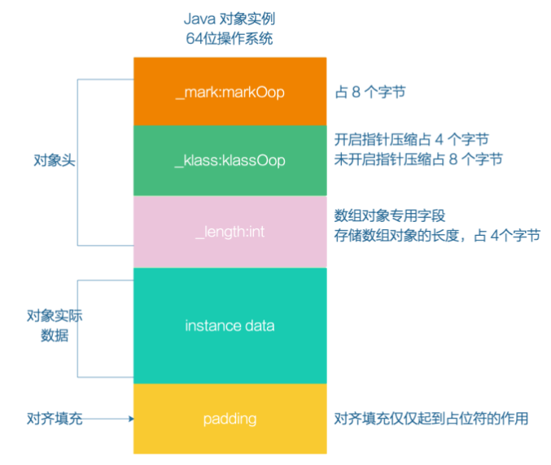
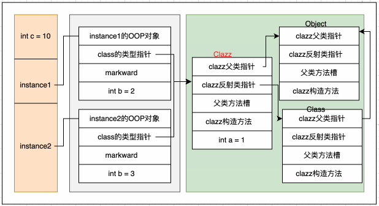
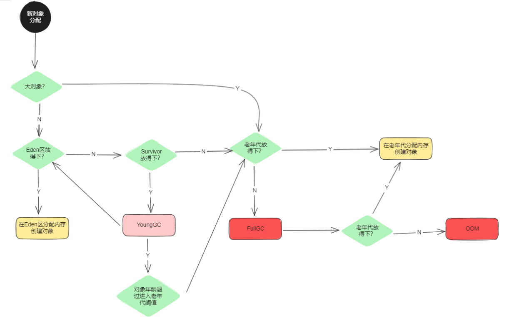
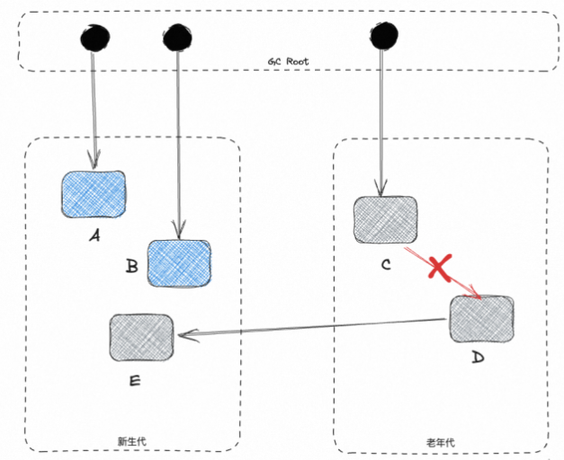
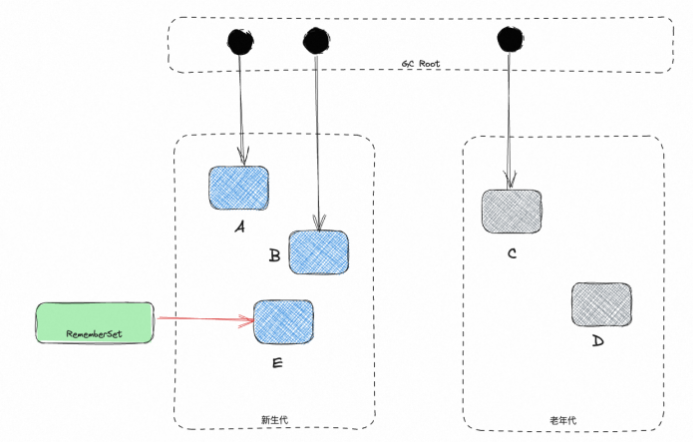

# 面试题-JVM

#### Java 是如何实现的平台无关？

Java 之所以可以做到跨平台，是因为 Java 虚拟机充当了桥梁。我们写的 java 代码会被编译成 `.class` 文件，这是平台无关的，`.class` 由 jvm 执行，jvm 是平台相关的，由它将 `.class` 翻译成操作系统可执行的二进制的机器码。

#### Java 是编译型还是解释型？

java 既是解释型又是编译型。

一般情况下，字节码是解释执行的，当 JVM 发现某个方法或代码块运行特别频繁的时候，就会人为这是“热点代码”，然后会通过 JIT 即时编译器把热点代码直接翻译成机器码，这些机器码就可以直接被执行了。

#### 简单介绍一下 JIT 优化技术

解释器的执行方式是一边翻译，一边执行，因此执行效率很低。为了解决这样的低效问题，HotSpot 引入了 JIT 技术（Just-In-Time）。

有了 JIT 技术之后，JVM 还是通过解释器进行解释执行。但是，当 JVM 发现某个方法或代码块运行时执行的特别频繁的时候，就会认为这是“热点代码”（Hot Spot Code)。然后 JIT 会把部分“热点代码”翻译成本地机器相关的机器码，并进行优化，然后再把翻译后的机器码缓存起来，以备下次使用。

#### 对 JDK 进程执行 kill -9 有什么影响？

`kill -9` 命令会立刻关闭 Jvm 进程。但是 `kill -9` 的语意是强制关闭，会导致在 Jvm 中执行的服务立刻关闭，来不及收尾。如导致 RPC 服务没有从注册中心取消注册导致服务不可用，如导致事务执行一半直接终止等等。

#### JVM 的运行时内存区域是怎样的？

> JVM 的运行时内存区域主要由 Java 堆、虚拟机栈、本地方法栈、方法区和程序计数器以及运行时常量池组成。
>
> 其中堆、方法区以及运行时常量池是线程之间共享的区域，而栈（本地方法栈+虚拟机栈）、程序计数器都是线程独享的。

**程序计数器**：一个只读的存储器，用于记录 Java 虚拟机正在执行的字节码指令的地址。它是线程私有的，为每个线程维护一个独立的程序计数器，用于指示下一条将要被执行的字节码指令的位置。它保证线程执行一个字节码指令以后，才会去执行下一个字节码指令。

**Java 虚拟机栈**：一种线程私有的存储器，用于存储 Java 中的局部变量。根据Java虚拟机规范，每次方法调用都会创建一个栈帧，该栈帧用于存储局部变量，操作数栈，动态链接，方法出口等信息。当方法执行完毕之后，这个栈帧就会被弹出，变量作用域就会结束，数据就会从栈中消失。

**本地方法栈**：本地方法栈是一种特殊的栈，它与 Java 虚拟机栈有着相同的功能，但是它支持本地代码（ Native Code ）的执行。本地方法栈中存放本地方法（ Native Method ）的参数和局部变量，以及其他一些附加信息。这些本地方法一般是用 C 等本地语言实现的，虚拟机在执行这些方法时就会通过本地方法栈来调用这些本地方法。

**Java 堆**：是存储对象实例的运行时内存区域。它是虚拟机运行时的内存总体的最大的一块，也一直占据着虚拟机内存总量的一大部分。Java 堆由 Java 虚拟机管理，用于存放对象实例，是几乎所有的对象实例都要在上面分配内存。此外，Java 堆还用于垃圾回收，虚拟机发现没有被引用的对象时，就会对堆中对象进行垃圾回收，以释放内存空间。

**方法区**：用于存储已被加载的类信息、常量、静态变量、即时编译后的代码等数据的内存区域。每加载一个类，方法区就会分配一定的内存空间，用于存储该类的相关信息，这部分空间随着需要而动态变化。方法区的具体实现形式可以有多种，比如堆、永久代、元空间等。

**运行时常量池**：是方法区的一部分。用于存储编译阶段生成的信息，主要有字面量和符号引用常量两类。其中符号引用常量包括了类的全限定名称、字段的名称和描述符、方法的名称和描述符。

#### Java 中的对象一定在堆上分配内存吗？

不一定，在 HotSpot 虚拟机中，存在 JIT 优化的机制，JIT 优化中可能会进行逃逸分析，当经过逃逸分析发现某一个局部对象没有逃逸到线程和方法外的话，那么这个对象就可能不会在堆上分配内存，而是进行栈上分配。

#### Java 的堆是如何分代的？为什么分代？

Java 的堆内存分代是指将不同生命周期的堆内存对象存储在不同的堆内存区域中，这里的不同的堆内存区域被定义为“代”。这样做**有助于提升垃圾回收的效率**，因为这样的话就可以为不同的"代"设置不同的回收策略。

一般来说，Java 中的大部分对象都是朝生夕死的，同时也有一部分对象会持久存在。因为如果把这两部分对象放到一起分析和回收，这样效率实在是太低了。通过将不同时期的对象存储在不同的内存池中，就可以节省宝贵的时间和空间，从而改善系统的性能。

**Java 的堆由新生代（Young Generation）和老年代（Old Generation）组成。新生代存放新分配的对象，老年代存放长期存在的对象。**

**新生代（Young）由年轻区（Eden）、Survivor 区组成（From Survivor、To Survivor）**。默认情况下，新生代的 Eden 区和 Survivor 区的空间大小比例是 `8:2`，可以通过 `-XX:SurvivorRatio` 参数调整。

#### 程序计数器为什么是私有的？

程序计数器是记录正在执行的字节码指令的地址，为了线程切换后能恢复到正确的执行位置，每个线程都需要有一个独立的程序计数器。

#### 虚拟机栈和本地方法栈为什么是私有的？

栈是存储方法执行过程中的数据，如果不是线程私有的，那方法就不能同时被多个线程调用执行了。

#### 堆和方法区的区别？

堆存放的是对象、数组和字符串常量池。

方法去存放的是类信息和运行时常量池。

#### 新生代如果只有一个 Eden + 一个 Survivor 可以吗?

这样就不能适用标记复制算法了，使用标记清除就会存在碎片问题，使用标记整理又存在效率问题。

如果还要使用标记复制算法，总要保持一个空着，因为两个区域都要用来分配对象，那空间比例就是 1:1，永远有一半空着，利用率低。

#### YoungGC 和 FullGC 的触发条件是什么？

YoungGC 的触发条件比较简单，那就是当年轻代中的 eden 区分配满的时候就会触发。

FullGC 的触发条件比较复杂也比较多，主要以下几种：

- 老年代空间不足

- 创建一个大对象，超过指定阈值会直接保存在老年代当中，如果老年代空间也不足，会触发 FullGC。

- YoungGC 之后，发现要移到老年代的对象，老年代存不下的时候，会触发一次 FullGC

- 空间分配担保失败

  - 当准备要触发一次 YoungGC 时，会进行空间分配担保，在担保过程中，发现虚拟机会检查老年代最大可用的连续空间小于新生代所有对象的总空间，但是`HandlePromotionFailure=false`，那么就会触发一次 FullGC（HandlePromotionFailure 这个配置，在JDK 7中并不在支持了，这一步骤在该版本已取消）
  - 当准备要触发一次 YoungGC 时，会进行空间分配担保，在担保过程中，发现虚拟机会检查老年代最大可用的连续空间小于新生代所有对象的总空间，但是HandlePromotionFailure=true，继续检查发现老年代最大可用连续空间小于历次晋升到老年代的对象的平均大小时，会触发一次FullGC

- 方法区空间不足
  
- 代码中执行 `System.gc()`

  - 代码中执行 `System.gc()` 的时候，会触发 FullGC，但是并不保证一定会立即触发。

#### 什么是 Stop The World

Java 中 Stop-The-World 机制简称 STW，是在执行垃圾收集算法时，Java 应用程序的其他所有线程都被挂起。这是 Java 中一种全局暂停现象，全局停顿，所有 Java 代码停止，native 代码可以执行，但不能与 JVM 交互。

不管选择哪种 GC 算法，stop-the-world 都是不能彻底避免的，只能尽量降低 STW 的时长。

**为什么需要 STW 呢？**

首先，如果不暂停用户线程，就意味着期间会不断有垃圾产生，永远也清理不干净。

其次，用户线程的运行必然会导致对象的引用关系发生改变，这就会导致两种情况：漏标和多标。

- **多标：**其实就是这个对象原本应该被回收掉的垃圾对象，但是被错误的标记成了存活对象。从而导致这个对象没有被 GC 回收掉。 这种情况还好一点，无非就是产生了一些浮动垃圾，下次 GC 再清理就好了。

- **漏标：**一个对象本来应该是存活对象，但是没有被正确的标记上，导致被错误的垃圾回收掉了。

#### JVM有哪些垃圾回收算法？

**标记-清除：**会产生内存碎片，但速度快，因为不需要移动和复制。

**标记-复制：**内存空间连续，不会产生内存碎片，但是需要保持一半空闲内存，有点浪费，而且复制有性能消耗。

**标记-整理：**不会产生内存碎片，也不会浪费内存空间，但是非常耗时（性能低）。

#### JVM 如何判断对象是否存活？

JVM 有两种算法来判断对象是否存活，分别是**引用计数法**和**可达性分析算法**。

- **引用计数法：**给对象中添加一个引用计数器，每当有一个地方引用它，计数器就加 1；当引用失效，计数器就减 1；任何时候计数器为 0 的对象就是不可能再被使用的。这个方法实现简单，效率高，但是目前主流的虚拟机中并没有选择这个算法来管理内存，其最主要的原因是它很难解决对象之间相互循环引用的问题。
  - 循环引用会导致对象无法被回收，最终会导致内存泄漏及内存溢出

- **可达性分析算法：** 这个算法的基本思想就是通过一系列的称为 “GC Roots” 的对象作为起点，从这些节点开始向下搜索，节点所走过的路径称为引用链，当一个对象到 GC Roots 没有任何引用链相连的话，则证明此对象是不可用的。

**但是，并不是说当进行完可达性分析算法后，即可证明某对象可以被GC。对象是否存活，需要两次标记：**

1. 第一次标记通过可达性分析算法。如果没有 GC Roots 相连接的引用链，那么将第一次标记
2. 如果对象的 `finalize()` 方法被覆盖并且没有执行过，则放在 F-Queue 队列中等待执行(不一定会执行)，如果一段时间后该队列的 `finalize()` 方法被执行且和 GC Roots 关联，则移出“即将回收”集合。如果仍然没有关联，则进行第二次标记，才会对该对象进行回收

不过现在都不提倡覆盖 finalize 方法，它的本意是像 Cpp 一样在对象销毁前执行，但是它影响了 JAVA 的安全和 GC 的性能，所以第二种判断会越来越少。

#### 哪些对象可以作为 GC roots？

- **局部变量**，就是虚拟机栈的栈帧中本地变量表引用的对象
- **native 方法中的局部变量**，本地方法栈引用的对象
- **static 类静态成员**，方法区中类静态属性引用的对象
- **方法区中常量引用的对象**
- **synchronized 同步锁持有的对象**
- **JVM 内部引用**：基本数据类型对应的 Class 对象、常驻异常对象（NullPointException, OutOfMemoryError)、系统类加载器。
- **反应 JVM 内部情况的 JMXBean、JVMT1 中注册的回调、本地代码缓存等**
- 不同垃圾收集器还可以有其他对象“临时性”地加入

#### 什么是三色标记算法？

三色标记算法是一种 JVM 中垃圾标记的算法，他可以减少 JVM 在 GC 过程中的 STW 时长，他是 CMS、G1 等垃圾收集器中主要使用的标记算法。

在出现三色标记算法之前，JVM 中垃圾对象的标记主要采用可达性分析算法及引用计数法。但是这两种算法存在以下问题：

1. 循环引用问题，如果两个对象互相引用，就形成了一个环形结构，如果采用引用计数法的话，那么这两个对象将永远无法被回收。
2. STW 时间长，可达性分析的整个过程都需要 STW，以避免对象的状态发生改变，这就导致 GC 停顿时长很长，大大影响应用的整体性能。

**为了解决上面这些问题，就引入了三色标记法。**

> 三色标记法将对象分为三种状态：白色、灰色和黑色。

- 白色：该对象没有被标记过。
- 灰色：该对象已经被标记过了，但该对象的引用对象还没标记完。
- 黑色：该对象已经被标记过了，并且他的全部引用对象也都标记完了。

三色标记法的标记过程可以分为**三个阶段：**初始标记（Initial Marking）、并发标记（Concurrent Marking）和重新标记（Remark）。

- **初始标记：**遍历所有的根对象，将根对象和直接引用的对象标记为灰色。在这个阶段中，垃圾回收器只会扫描被直接或者间接引用的对象，而不会扫描整个堆。因此，初始标记阶段的时间比较短。（Stop The World）
- **并发标记：**在这个过程中，垃圾回收器会从灰色对象开始遍历整个对象图，将被引用的对象标记为灰色，并将已经遍历过的对象标记为黑色。并发标记过程中，应用程序线程可能会修改对象图，因此垃圾回收器需要使用写屏障（Write Barrier）技术来保证并发标记的正确性。（不需要STW）
- **重新标记：**重新标记的主要作用是标记在并发标记阶段中被修改的对象以及未被遍历到的对象。这个过程中，垃圾回收器会从灰色对象重新开始遍历对象图，将被引用的对象标记为灰色，并将已经遍历过的对象标记为黑色。（Stop The World）

在重新标记阶段结束之后，垃圾回收器会执行清除操作，将未被标记为可达对象的对象进行回收，从而释放内存空间。这个过程中，垃圾回收器会将所有未被标记的对象标记为白色（White）。

以上三个标记阶段中，初始标记和重新标记是需要 STW 的，而并发标记是不需要 STW 的。其中最耗时的其实就是并发标记的这个阶段，因为这个阶段需要遍历整个对象树，而三色标记把这个阶段做到了和应用线程并发执行，大大降低了 GC 的停顿时长。

#### Java 中的四种引用有什么区别？

**强引用：**强引用是 Java 的默认引用形式，使用时不需要显示定义。如果一个对象具有强引用，那垃圾回收器绝不会回收它（可达时）。当内存空间不足，Java 虚拟机宁愿抛出 OutOfMemoryError 错误，使程序异常终止，也不会靠随意回收具有强引用的对象来解决内存不足的问题。

**弱引用：** 如果一个对象只具有弱引用，无论内存充足与否，Java GC 后对象如果只有弱引用将会被自动回收。

```java
WeakReference<String[]> weakBean = new WeakReference<String[]>(new String[]{"a", "b", "c"});
```

**软引用：** 软引用不会保证对象一定不会被回收，只能最大可能保证。软引用和弱引用的特性基本一致， 主要的区别在于软引用在内存不足时才会被回收。如果一个对象只具有软引用，Java GC 在内存充足的时候不会回收它，内存不足时才会被回收。

```java
SoftReference<String[]> softBean = new SoftReference<String[]>(new String[]{"a", "b", "c"});
```

**虚引用：**`java.lang.ref.PhantomReference` 类中只有一个方法 `get()`，而且几乎没有实现，只是返回 null。如果一个对象仅有虚引用，那么它就像没有任何引用一样，在任何时候都可能被 gc 回收。虚引用主要用来跟踪对象被垃圾回收的活动。

#### 新生代和老年代的 GC 算法

对于新生代来说，一般来说GC的次数是要比老年代高很多的，所以需要一个效率更高的算法，而且最好不要有碎片，因为很多对象都是需要先在新生代分配空间的，如果碎片太多的话，那么就会导致很多对象无法正常分配了。

所以，新生代选择了标记复制算法进行垃圾回收。

对于老年代来说，通常会采用标记整理算法，虽然效率低了一点，但是可以减少空间的浪费并且不会有空间碎片等问题。在有些回收器上面，如 CMS，为了降低 STW 的时长，也会采用标记清除算法。

#### 新生代和老年代的垃圾回收器有何区别？

常见的垃圾回收器如下：

- 串行垃圾回收器（Serial Garbage Collector） 如：Serial GC， Serial Old
- 并行垃圾回收器（Parallel Garbage Collector） 如：Parallel Scavenge，Parallel Old，ParNew
- 并发标记扫描垃圾回收器（CMS Garbage Collector） 
- G1垃圾回收器（G1 Garbage Collector，JDK 7中推出，JDK 9中设置为默认） 
- ZGC垃圾回收器（The Z Garbage Collector，JDK 11 推出）

**新生代收集器有 Serial、ParNew、Parallel Scavenge；**
**老年代收集器有 Serial Old、Parallel Old、CMS；**
**整堆收集器有 G1、ZGC。**

#### G1 和 CMS 有什么区别？

G1 会把 Java 的堆分为多个大小相等的 Region（每个 Region 的大小为 `1M~32M` ），他在年轻代回收的时候采用标记-复制算法，而在老年代回收的时候，采用的是标记-整理算法，这两种算法都可以避免内存碎片的产生。

G1 在回收的过程中，标记和清理的过程是并行的，可以充分利用多个 CPU 来缩短 STW 的时长，在复制的过程中是并发的，可以让复制线程和用户线程并发执行，不需要 STW。并且 G1 还可以在运行时动态的做区域内存大小的调整。

#### 为什么 G1 从 JDK 9 之后成为默认的垃圾回收器？

> G1，Garbage First，是 CMS 的改进版，解决了 CMS 内存碎片、更多的内存空间等问题。总之，G1 是一个先进的垃圾收集器，它可以提高系统的吞吐量，降低停顿的频率，并且可以有效管理大型堆。

G1 的优势：

1. **并发回收：**G1 能充分利用 CPU、多核环境下的硬件优势，使用多个 CPU（CPU或者CPU核心）来缩短 Stop The World 的停顿时间。部分其他收集器原本需要停顿 Java 线程执行的 GC 动作，G1 收集器仍然可以通过并发的方式让Java程序继续执行。
2. **分代收集：**分代概念在 G1 中依然得以保留。虽然 G1 可以不需要其它收集器配合就能独立管理整个 GC 堆，但它能够采用不同的方式去处理新创建的对象和已经存活了一段时间、熬过多次 GC 的旧对象以获取更好的收集效果。也就是说 G1 可以自己管理新生代和老年代了。
3. **空间整合：**由于 G1 使用了独立区域（Region）概念，G1 从整体来看是基于标记-整理算法实现收集，从局部（两个 Region）上来看是基于标记-复制算法实现的，但无论如何，这两种算法都意味着 G1 运作期间不会产生内存空间碎片。
4. **可预测的停顿：**这是 G1 相对于 CMS 的另一大优势，降低停顿时间是 G1 和 CMS 共同的关注点，但 G1 除了追求低停顿外，还能建立可预测的停顿时间模型，能让使用者明确指定一个长度为 M 毫秒的时间片段内，消耗在垃圾收集上的时间不得超过 N 毫秒。
5. **支持热插拔：**G1 可以在运行时动态调整堆的大小，以适应不同的内存需求。

> 与其它收集器相比，G1 变化较大的是它将整个Java堆划分为多个大小相等的独立区域（Region），虽然还保留了新生代和老年代的概念，但新生代和老年代不再是物理隔离的了它们都是一部分 Region（不需要连续）的集合。
>
> 同时，为了避免全堆扫描，G1 使用了 Remembered Set 来管理相关的对象引用信息。当进行内存回收时，在 GC 根节点的枚举范围中加入 Remembered Set 即可保证不对全堆扫描也不会有遗漏了。

适用场景：

- 大型内存环境：G1 针对大型内存环境进行了优化，因此对于使用了大量内存的应用程序来说（超过4G），G1 是一个更好的选择。
- 对应用程序响应时间敏感的场景：G1 通过分配多线程来进行垃圾回收，以最大限度地减少回收时应用程序的暂停时间。
- 对内存使用效率敏感的场景：G1 可以更好地评估哪些内存空间可以释放，以此来提高内存的利用率。
- 动态内存需求的场景：G1 支持热插拔，可以在运行时动态调整堆的大小，以适应不同的内存需求。
- 要求回收时间具有可预测性的场景：G1 使用固定的内存分配块来管理堆内存，这使得其在回收时间上具有更高的可预测性。

#### JDK 11 中新出的 ZGC 有什么特点？

ZGC（Z Garbage Collector）是 Java 11 中引入的一种新的垃圾回收器，他是一个为了实现低延迟而设计的垃圾收集器，具有以下几个特点：

1. **低停顿：**ZGC的目标是保证暂停时间非常短，ZGC 的目标是保持最大暂停时间在亚毫秒级，且这个暂停时间不会随着堆、live-set 或 root-set 的大小而增加。
2. **高吞吐量：**ZGC 是一个并发垃圾收集器，意味着大部分垃圾收集工作都是在 Java 线程继续执行的同时完成的。这极大地减少了垃圾收集对应用程序响应时间的影响。
3. **兼容性：**ZGC与现有的Java应用程序完全兼容，并且无需更改代码即可使用。但是也有一定的限制，仅支持 Linux 64位系统，不支持 32位平台。不支持使用压缩指针，采用内存分区管理。
4. **简单性：**ZGC设计简单，代码库较小，因此它更容易维护和扩展。
5. **支持大堆：**ZGC 能处理从 8MB 到 16TB  大小的堆，适用于大规模内存需求的应用程序
6. **不分代回收：**ZGC 在垃圾回收时对全量内存进行标记，但是回收时仅针对分内存回收，优先回收垃圾比较多的页面。

因此，ZGC 是一种新的、高效的、低停顿的垃圾回收器，适用于内存大小从几GB 到数TB 的应用程序。它的设计目标是在保证高吞吐量的同时保证最短的暂停时间，并且易于使用和维护。

#### Java 8 和 Java 11 的GC有什么区别？

Java 8 中默认的 `Parallel Scavenge GC + Parallel Old GC` 的，分别用来做新生代和老年代的垃圾回收。而在 Java 11 中默认采用的是 G1 进行整堆回收的（Java 9 中就是默认的了）。

另外，Java 11 中还新增了一种垃圾收集器，那就是 **ZGC**，他可以在保证高吞吐量的同时保证最短的暂停时间。

在垃圾识别及回收上面，Java 8 基于的是单纯地可达性分析，而 Java 11 中的 G1 采用的是三色标记法，可以大大降低 STW 的时长。

另外，G1 的内存划分是自适应的，它会根据堆的大小和使用情况来动态调整各个区域的大小和比例。而 `Parallel Scavenge GC+Parallel Old GC` 都是固定分配的策略。

#### 类的生命周期是怎么样的？

- 加载
- 连接
  - 验证
  - 准备
  - 解析
- 初始化
- 使用
- 卸载

#### Java中类加载的过程是怎么样的？

Java 中类的加载阶段分为加载、链接、初始化。其中连接过程又包含了验证、准备和解析。

**加载阶段**

查找并加载类的二进制数据(网络，jar包，运行时生成等)。将类的 `.class` 文件中的二进制数据读入内存中，将其放在方法区中，然后创建一个 `java.lang.Class` 对象（存放在堆中）用来封装类在方法区的数据结构。

**链接阶段**

在链接阶段，Java 类加载器对类进行验证、准备和解析操作。将类与类的关系（符号引用转为直接引用）确定好，校验字节码。

1. **验证：**校验类的正确性（文件格式，元数据，字节码，二进制兼容性）。
2. **准备：**为类的静态变量分配内存，将其初始化为默认值。但是在到达初始化之前，类变量都没有初始化为真正的初始值。当然，对于final修饰的变量来说，会在此时就被初始化为指定值。
3. **解析：**把类的符号引用转为直接引用(类或接口、字段、类方法、接口方法、方法类型、方法句柄和访问控制修饰符7类符号引用 )。

**初始化阶段**

初始化是类加载的最后一步，也是真正执行类中定义的  Java 程序代码(字节码)，初始化阶段是执行类构造器  `<clinit> ()` 方法的过程。这里利用了一种懒加载的思想，所有 Java 虚拟机实现必须在每个类或接口被 Java 程序首次主动使用才初始化，但类加载不一定，静态代码块在类初始化时执行。


#### 什么是符号引用和直接引用？

**符号引用（Symbolic Reference）**是一种用来表示引用目标的符号名称，比如类名、字段名、方法名等。符号引用与实际的内存地址无关，只是一个标识符，用于描述被引用的目标，类似于变量名。符号引用是在编译期间产生的，在编译后的 class 文件中存储。

**直接引用（Direct Reference）**是实际指向目标的内存地址，比如类的实例、方法的字节码等。直接引用与具体的内存地址相关，是在程序运行期间动态生成的。

```java
public class A {
    public int x;
}

public class B {
    public void foo() {
        A a = new A();
        // 通过符号引用来引用 A 类中的 x 变量，解析阶段，JVM 会将 A 类中的符号引用转换为直接引用；
        a.x = 10;
        // 假设 A 类的 x 变量的内存地址为 0x1000，在解析阶段，JVM 会为 B 类生成一条指令【getstatic 0x1000】，用于获取 x 变量的内存地址
        System.out.println("x = " + a.x);
    }
}
```

> 也就是说，在类的解析阶段进行的，Java 虚拟机会根据符号引用定位到具体的内存地址，并生成一条指令，用于访问该内存地址。

#### Java 中的类什么时候会被加载？

- 当创建类的实例时，如果该类还没有被加载，则会触发类的加载。例如，通过关键字new创建一个类的对象时，JVM 会检查该类是否已经加载，如果没有加载，则会调用类加载器进行加载。
- 当使用类的静态变量或静态方法时，如果该类还没有被加载，则会触发类的加载。例如，当调用某个类的静态方法时，JVM 会检查该类是否已经加载，如果没有加载，则会调用类加载器进行加载。
- 当使用反射机制访问类时，如果该类还没有被加载，则会触发类的加载。例如，当使用 `Class.forName()` 方法加载某个类时，JVM 会检查该类是否已经加载，如果没有加载，则会调用类加载器进行加载。
- 当 JVM 启动时，会自动加载一些基础类，例如 `java.lang.Object` 类和 `java.lang.Class` 类等。

总之，Java 中的类加载其实是延迟加载的，除了一些基础的类以外，其他的类都是在需要使用类时才会进行加载。同时，Java 还支持动态加载类，即在运行时通过程序来加载类，这为 Java 程序带来了更大的灵活性。

#### Java 中的类什么时候会被卸载？

Java 中类的卸载是由 Java虚拟机（JVM）自动进行的，JVM 会在满足以下条件时对一个类进行卸载：

1. 该类所有的实例都已被 GC 回收。
2. 该类的 ClassLoader 已经被 GC 回收。
3. 该类对应的 Class 对象没有在任何地方被引用，也就无法在任何地方通过反射访问该类方法。

> 在 Java 中，每一个类都会由 ClassLoader 加载到内存中，并在运行期间一直存在。当一个类不再被使用时，它的实例对象被 GC 回收后，如果 ClassLoader 也被 GC 回收，那么这个类就可以被卸载了。
>
> 需要注意的是，Java 虚拟机并不会在程序运行过程中频繁地卸载类，因为类卸载是一个比较耗时的操作，会影响程序的性能。通常情况下，Java 虚拟机会在需要释放内存空间时才会对不再使用的类进行卸载。
>
> 另外，Java SE 9 引入了一个新的特性，即“模块化”，通过模块化可以对 Java 类进行更加精细的控制，包括对类的卸载。在模块化环境下，如果一个模块中的类不再被引用，那么这个模块就可以被卸载。模块化可以使 Java 应用程序更加安全、可靠和可维护。

#### 什么是双亲委派？如何破坏？

双亲委派模型的工作过程是：

如果一个类加载器收到了类加载的请求，它首先不会自己去尝试加载这个类，而是把这个请求委派给父类加载器去完成，每一个层次的类加载器都是如此，因此所有的加载请求最终都应该传送到顶层的启动类加载器中，只有当父加载器反馈自己无法完成这个加载请求（它的搜索范围中没有找到所需的类）时，子加载器才会尝试自己去加载。

双亲委派模型主要是由 `ClassLoader#loadClass` 实现的，我们只需要自定义类加载器，并且重写其中的 `loadClass` 方法，即可破坏双亲委派模型。

#### 为什么需要双亲委派模型?

使用双亲委派模型来组织类加载器之间的关系，有一个显而易见的好处就是Java类随着它的类加载器一起具备了一种带有优先级的层次关系。例如类 `java.lang.Object`，它存放在 `rt.jar` 之中，无论哪一个类加载器要加载这个类，最终都是委派给处于模型最顶端的启动类加载器进行加载，因此 Object 类在程序的各种类加载器环境中都是同一个类。

相反，如果没有使用双亲委派模型，由各个类加载器自行去加载的话，如果用户自己编写了一个称为 `java.lang.Object` 的类，并放在程序的 ClassPath 中，那系统中将会出现多个不同的 Object 类，Java 类型体系中最基础的行为也就无法保证，应用程序也将会变得一片混乱。

#### loadClass 有什么区别 findClass？

findClass 用于重写类加载逻辑、loadClass 方法的逻辑里如果父类加载器加载失败则会调用自己的 findClass 方法完成加载，保证了双亲委派规则。

- 如果不想打破双亲委派模型，那么只需要重写 findClass 方法即可
- 如果想打破双亲委派模型，那么就重写整个 loadClass 方法

#### 有哪些破坏双亲委派的例子？

**向前兼容**

由于双亲委派模型是在 JDK1.2 之后才被引入的，而类加载器和抽象类 `java.lang.ClassLoader` 则是 JDK1.0 时候就已经存在，面对已经存在的用户自定义类加载器的实现代码，Java 设计者引入双亲委派模型时不得不做出一些妥协。

为了向前兼容，JDK1.2 之后的 `java.lang.ClassLoader` 添加了一个新的 `proceted` 方法 `findClass()`，在此之前，用户去继承 `java.lang.ClassLoader` 的唯一目的就是重写 `loadClass()` 方法，因为虚拟机在进行类加载的时候会调用加载器的私有方法 `loadClassInternal()`，而这个方法的唯一逻辑就是去调用自己的 `loadClass()`。

JDK1.2 之后已不再提倡用户再去覆盖 `loadClass()` 方法，应当把自己的类加载逻辑写到 `findClass()` 方法中，在 `loadClass()` 方法的逻辑里，如果父类加载器加载失败，则会调用自己的 `findClass()` 方法来完成加载，这样就可以保证新写出来的类加载器是符合双亲委派模型的。 

**SPI实现**

双亲委派模型很好地解决了各个类加载器的基础类统一问题(越基础的类由越上层的加载器进行加载)，基础类之所以被称为“基础”，是因为它们总是作为被调用的 API。但是，如果基础类又要调用用户的代码，那该怎么办呢。 

这并非是不可能的事情，一个典型的例子便是 JNDI 服务，它的代码由启动类加载器去加载(在 JDK1.3 时放进 rt.jar)，但 JNDI 的目的就是对资源进行集中管理和查找，它需要调用独立厂商实现部部署在应用程序的 classpath 下的 JNDI 接口提供者(SPI, Service Provider Interface)的代码，但启动类加载器不可能“认识”这些代码。

为了解决这个困境，Java 设计团队只好引入了一个不太优雅的设计：线程上下文类加载器(Thread Context ClassLoader)。这个类加载器可以通过 java.lang.Thread 类的 `setContextClassLoader()` 方法进行设置，如果创建线程时还未设置，它将会从父线程中继承一个；如果在应用程序的全局范围内都没有设置过，那么这个类加载器默认就是应用程序类加载器。

有了线程上下文类加载器，JNDI 服务使用这个线程上下文类加载器去加载所需要的 SPI 代码，也就是父类加载器请求子类加载器去完成类加载动作，这种行为实际上就是打坡了双亲委派模型的层次结构来逆向使用类加载器，已经违背了双亲委派模型，但这也是无可奈何的事情。

Java 中所有涉及 SPI 的加载动作基本上都采用这种方式，例如 JNDI, JDBC, JCE, JAXB 和 JBI 等。

**TOMCAT**

一个 web 容器可能需要部署多个应用程序，不同的应用程序可能会依赖同一个第三方类库的不同版本，但是不同版本的类库中某一个类的全路径名可能是一样的，如果采用默认的类加载机制，那么就会无法加载多个相同的类。

Tomcat 为了实现隔离性，所以并没有完全遵守双亲委派的原则。

#### Tomcat 的类加载机制是怎么样的？

> Tomcat 的类加载机制，在默认情况下，是先把当前要加载的类委托给 BootstrapClassLoader 尝试加载，为了避免 JRE 中的核心类被我们应用自己给覆盖（如String等），Bootstrap 如果无法加载，那么就由 WebAppClassLoader 尝试加载，如果无法加载，那么再委托通过双亲委派的方式向上委派给 Common、System 等类加载进行加载，即顺序为：`Bootstrap->WebApp->System->Common`
>
> 上面的是默认情况，tomcat 中有一个配置 delegate，他的默认值是 false，如果设置成 true 了，那么他就会严格遵守双亲委派，按照 `Bootstrap->System->Common->WebApp` 的顺序进行加载。

以下是 tomcat 中 `WebappClassLoaderBase.java` 中 loadClass 的代码，我做了一些精简，并加了一些注释：

```java
public Class<?> loadClass(String name, boolean resolve) throws ClassNotFoundException {
                    if (resolve) {
                        resolveClass(clazz);
                    }
                    return clazz;
                }
            } catch (ClassNotFoundException e) {
                // Ignore
            }
        }

        // 自己尝试加载
        // 能走到这里，肯定是BootStrap没加载到，之后还有两种情况：
        // 1、如果delegate为ture的话，说明上层类加载器也没记载到。
        // 2、如果delegate为false，那么就还没有进行过委派，先在这里尝试自己加载。
        if (log.isDebugEnabled()) {
            log.debug("  Searching local repositories");
        }
        try {
            clazz = findClass(name);
            if (clazz != null) {
                if (log.isDebugEnabled()) {
                    log.debug("  Loading class from local repository");
                }
                if (resolve) {
                    resolveClass(clazz);
                }
                return clazz;
            }
        } catch (ClassNotFoundException e) {
            // Ignore
        }

        // 如果delegate为false,说明还没有做过委派，那么委派给父类加载器加载类。
        if (!delegateLoad) {
            if (log.isDebugEnabled()) {
                log.debug("  Delegating to parent classloader at end: " + parent);
            }
            try {
                clazz = Class.forName(name, false, parent);
                if (clazz != null) {
                    if (log.isDebugEnabled()) {
                        log.debug("  Loading class from parent");
                    }
                    if (resolve) {
                        resolveClass(clazz);
                    }
                    return clazz;
                }
            } catch (ClassNotFoundException e) {
                // Ignore
            }
        }
    }

    throw new ClassNotFoundException(name);
}
```

整个代码的过程就是：

1. 加锁： 方法使用同步块确保线程安全
2. 检查已加载类缓存： 首先，通过调用 `findLoadedClass0` 方法检查本地缓存是否已加载该类，如果是，则直接返回缓存中的 Class 对象。
3. 检查已加载类缓存（GraalVM 兼容性处理）： 通过调用 `findLoadedClass` 方法检查另一个类加载缓存，如果是 GraalVM 环境，直接返回缓存中的 Class 对象。
4. 尝试使用 Bootstrap 类加载器加载： 尝试使用 Bootstrap 类加载器加载类，以防止 Web 应用程序覆盖 Java SE 类。如果加载成功，则返回加载的 Class 对象。
5. 决定是否委派加载： 根据 delegate 属性和其他条件判断是否应该委派加载给父类加载器。
6. 委派给父类加载器： 如果需要委派加载（delegate 为 true），尝试使用父类加载器加载类。
7. 自己尝试加载： 如果未指定需要委派（delegate 为 false），或者未从父类加载器中找到类，则调用 findClass 方法尝试自己进行类加载。
8. 委派给父类加载器： 如果未指定需要委派（delegate 为 false），且自己没加载到类，则尝试使用父类加载器加载类。

#### 如何判断 JVM 中类和其他类是不是同一个类？

> 类加载器虽然只用于实现类的加载动作，但它在 Java 程序中起到的作用却远远不限于类加载阶段。对于任意一个类，都需要由加载它的类加载器和这个类本身一同确立其在 Java 虚拟机中的唯一性，每一个类加载器，都拥有一个独立的类名称空间。

简单点说：比较两个类是否“相等”，只有在这两个类是由同一个类加载器加载的前提下才有意义，否则，即使这两个类来源于同一个 Class 文件，被同一个虚拟机加载，只要加载它们的类加载器不同，那这两个类就必定不相等。

#### JVM 如何保证给对象分配内存过程的线程安全？

> 首先，我们先来梳理下，JVM 是如何给对象分配内存的：
>
> - 如果 JIT 的逃逸分析后该对象没有逃逸，那么可能优化到栈上分配。
> - 否则对象主要分配到新生代上，如果启动了 TLAB，则分配到 TLAB 中。
> - 如果被判断为大对象，则直接分配到直接进入老年代，譬如很长的字符串和数组，避免为大对象分配内存时由于分配担保机制带来的复制而降低效率 。可以设置 `-XX:PretenureSizeThreshold`，令大于该尺寸的对象直接进入老年代。

所以，我们到这里就很清楚了，当给对象分配内存的时候，有可能在栈上分配，这自然不存在线程安全问题。除此之外，如果在堆上分配，则可能会启动 TLAB 机制，使得堆内存给线程单独划分空间，避免了线程安全的问题。

同时，当不启动 TLAB 机制的时候，如果一个空间被多个线程同时分配对象，JVM 会采用 **CAS + 失败重试**的方式来避免线程问题。

简而言之，是采用乐观锁的方式，只有假定该堆没有被其他线程操作的时候，当前线程才会在堆上分配对象，如果被其他线程操作，就获取当前堆中的最新标识，然后重试。

#### 什么是TLAB？

TLAB 是虚拟机在堆内存的 eden 划分出来的一块专用空间，是线程专属的。

在虚拟机的 TLAB 功能启动的情况下，在线程初始化时，虚拟机会为每个线程分配一块 TLAB 空间，只给当前线程使用，这样每个线程都单独拥有一个空间，如果需要分配内存，就在自己的空间上分配，这样就不存在竞争的情况，可以大大提升分配效率。

> 所以说，因为有了 TLAB 技术，堆内存并不是完完全全的线程共享，其 eden 区域中还是有一部分空间是分配给线程独享的。
>
> 这里值得注意的是，我们说 TLAB 是线程独享的，但是只是在“分配”这个动作上是线程独占的，至于在读取、垃圾回收等动作上都是线程共享的。而且在使用上也没有什么区别。
>
> 也就是说，虽然每个线程在初始化时都会去堆内存中申请一块 TLAB，并不是说这个 TLAB 区域的内存其他线程就完全无法访问了，其他线程的读取还是可以的，只不过无法在这个区域中分配内存而已。
>
> 并且，在 TLAB 分配之后，并不影响对象的移动和回收，也就是说，虽然对象刚开始可能通过 TLAB 分配内存，存放在 Eden 区，但是还是会被垃圾回收或者被移到 Survivor Space、Old Gen 等。

#### TLAB 的缺点

虽然在一定程度上，TLAB 大大的提升了对象的分配速度，但是 TLAB 并不是就没有任何问题的。前面我们说过，**因为 TLAB 内存区域并不是很大**，所以，有可能会经常出现不够的情况。

在《实战Java虚拟机》中有这样一个例子：

比如一个线程的 TLAB 空间有 100KB，其中已经使用了 80KB，当需要再分配一个 30KB 的对象时，就无法直接在 TLAB 中分配，遇到这种情况时，有两种处理方案：

1. 直接在堆内存中对该对象进行内存分配。
2. 废弃当前 TLAB，重新申请 TLAB 空间再次进行内存分配。

以上两个方案各有利弊，如果采用方案1，那么就可能存在着一种极端情况，就是 TLAB 只剩下1KB，就会导致后续需要分配的大多数对象都需要在堆内存直接分配。

如果采用方案2，也有可能存在频繁废弃 TLAB，频繁申请 TLAB 的情况，而我们知道，虽然在 TLAB 上分配内存是线程独享的，但是 TLAB 内存自己从堆中划分出来的过程确实可能存在冲突的，所以，TLAB 的分配过程其实也是需要并发控制的。而频繁的 TLAB 分配就失去了使用 TLAB 的意义。

为了解决这两个方案存在的问题，虚拟机定义了一个 `refill_waste` 的值，这个值可以翻译为“最大浪费空间”。

当请求分配的内存大于 `refill_waste` 的时候，会选择在堆内存中分配。若小于 `refill_waste` 值，则会废弃当前 TLAB，重新创建 TLAB 进行对象内存分配。

前面的例子中，TLAB 总空间 100KB，使用了 80KB，剩余 20KB，如果设置的 `refill_waste` 的值为 25KB，那么如果新对象的内存大于 25KB，则直接堆内存分配，如果小于 25KB，则会废弃掉之前的那个 TLAB，重新分配一个 TLAB 空间，给新对象分配内存。

> 当一个 TLAB 被填满或者废弃时，原有 TLAB 中的对象不会被移动或复制到新的 TLAB 中。在 JVM 中，一旦对象被分配在堆上，它们通常会保持在原地直到被垃圾回收。所以，当一个 TLAB 用完时，线程会简单地分配一个新的 TLAB，并在新的 TLAB 上继续对象分配。原有 TLAB 中的对象将保留在其当前位置，直到它们不再被引用并由垃圾收集器回收。

#### 虚拟机中的堆一定是线程共享的吗？

并不一定哦！

为了保证对象的内存分配过程中的线程安全性，HotSpot 虚拟机提供了一种叫做 `TLAB(Thread Local Allocation Buffer)` 的技术。

在线程初始化时，虚拟机会为每个线程分配一块 TLAB 空间，只给当前线程使用，当需要分配内存时，就在自己的空间上分配，这样就不存在竞争的情况，可以大大提升分配效率。

所以，“堆是线程共享的内存区域”这句话并不完全正确，因为 TLAB 是堆内存的一部分，他在读取上确实是线程共享的，但是在内存分分配上，是线程独享的。

TLAB 的空间其实并不大，所以大对象还是可能需要在堆内存中直接分配。那么，对象的内存分配步骤就是先尝试 TLAB 分配，空间不足之后，再判断是否应该直接进入老年代，然后再确定是在 eden 分配还是在老年代分配。

#### 常见的 JVM 工具有哪些？

- jps：显示当前所有 java 进程 pid 的命令。
- jstack：用于生成线程堆栈信息的命令，可用于诊断死锁、线程阻塞等问题。
- jmap：可以生成 JVM 中堆内存的 dump 文件，用于分析堆内存的使用情况，排查内存泄漏等问题。
- jstat：监控 JVM 中的类加载、GC、线程等信息。
- jhat：使用 jhat 生成 dump 文件之后，就可以使用 jhat 命令将 dump 文件转成 html 的形式访问查看。
- 图形化工具：JMC、JConsole、VisualVM、YourKit、JProfiler。
- Arthas：阿里巴巴开源的 Java 诊断工具。

#### 有哪些常用的 JVM 启动参数？

- **堆设置：**
  - `-Xms`：设置堆的初始大小。
  - `-Xmx`：设置堆的最大大小。

- **栈设置：**
  - `-Xss`：设置每个线程的栈大小。
- **垃圾回收器设置：**
  - `-XX:+UseG1GC`：使用 G1 垃圾回收器。
  - `-XX:+UseParallelGC`：使用并行垃圾回收器。
- **性能调优：**
  - `-XX:PermSize` 和 `-XX:MaxPermSize`：在 Java 8 之前设置永久代的初始大小和最大大小。
  - `-XX:MetaspaceSize` 和 `-XX:MaxMetaspaceSize`：在 Java 8 及以上版本设置 Metaspace 的初始大小和最大大小。
  - `-XX:+PrintGCDetails`：打印垃圾回收的详细信息。
- **调试和分析：**
  - `-verbose:gc`：输出垃圾回收的详细信息。
  - `-XX:+HeapDumpOnOutOfMemoryError`：在内存溢出时生成堆转储。

#### 哪些语言有 GC 机制?

Java, C#, Python, Ruby, JavaScript, Kotlin, Swift, Go, R, Lua

#### 一个对象的结构是什么样的？

> HotSpot JVM 设计了一个 OOP-Klass Model。OOP（Ordinary Object Pointer）指的是普通对象指针，而 Klass 用来描述对象实例的具体类型。

每一个 Java 类，在被 JVM 加载的时候，JVM 会给这个类创建一个 instanceKlass，保存在方法区，用来在 JVM 层表示该 Java 类。当我们在 Java 代码中，使用 new 创建一个对象的时候，JVM 会创建一个 instanceOopDesc 对象，这个对象中包含了**对象头**、**实例数据**以及**对齐填充**。



- **对象头（Object Header）**： 对象头是每个Java 对象的固定部分，它包含了用于管理对象的元数据信息。对象头的结构在 HotSpot 中是根据对象的类型（即是否是数组对象、是否启用偏向锁等）而变化的，但一般情况下，对象头包含以下信息：

  - **Mark Word（标记字）**：用于存储对象的标记信息，包括对象的锁状态、GC标记等。

  - **Class Metadata Address（类元数据地址）**：指向对象所属类的元数据信息，包括类的类型、方法、字段等。

- **实例数据（Instance Data）**： 实例数据是对象的成员变量（字段）的实际存储区域，它包含了对象的各个字段的值。实例数据的大小取决于对象所包含的字段数量和字段类型。
- **对齐填充（Padding）**： 对齐填充是为了使得对象的起始地址符合特定的对齐要求，以提高访问效率。由于虚拟机要求对象的起始地址必须是8字节的倍数（在某些平台上要求更大），因此可能需要在对象的实例数据末尾添加额外的字节来对齐。

```java
class Clazz
{
    public static int a = 1;
    public int b;

    public Clazz(int b) {
        this.b = b;
    }
}

public static void main(String[] args) {
    int c = 10;
    Clazz instance1 = new Clazz(2);
    Clazz instance2 = new Clazz(3);
}
```

当上面的代码段执行完后，会在JVM呈现出如下模式：



从上图中可以看到，在方法区的 `instantKlass` 中有一个 `int a=1` 的数据存储。

在堆内存中的两个对象的 oop 中，分别维护着 `int b = 3, int b = 2`的实例数据。

和 `oopDesc` 一样，`instantKlass` 也维护着一些 `fields`，用来保存类中定义的类数据，比如 `int a=1`。

#### JVM 是如何创建对象的？

1. 首先将去检查这个指令的参数是否能在常量池中定位到这个类的符号引用，并且检查这个符号引用代表的类是否已被加载过、解析和初始化过。如果没有，那必须先执行相应的类加载过程
2. 分配内存。JVM 会在堆中为对象分配内存空间（无 JIT 优化情况下）。在 HotSpot 中，对象的内存分配有两种方式，分别是指针碰撞和空闲列表法。
   ○ 指针碰撞：当堆中的内存是连续的，JVM 使用一个指针来标记当前可用的内存位置，然后将指针向前移动分配对象所需的内存大小。
   ○ 空闲列表：当堆中的内存是离散的，JVM 会维护一个空闲列表，记录可用的内存块。在分配对象时，JVM 会遍历空闲列表，找到足够大小的内存块进行分配。
   （分配内存解决并发有两种手段，一个是 CAS + 失败重试，一个是 Thread Local Allocation  Buffer（TLAB）)
3. 内存分配完成后，虚拟机需要将分配到的内存空间都初始化为零值，这一步确保了对象的字段在创建时都有默认值。如 int 被初始化为 0，引用类型被初始化为 null。
4. 设置对象头。 该实例所对应的类、如何才能找到类的元数据信息、对象的哈希码、对象的 GC 分代年龄，轻量级锁等等信息。
5. 调用该类的构造方法，初始化对象。如按照程序员意愿进行赋值。
6. 返回对象引用，当对象完成创建之后，返回一个该对象的引用，后续Java程序就可以使用这个引用来操作对象了。

#### 字符串常量池是如何实现的？

> 字符串常量池（String Constant Pool）是Java中一块特殊的内存区域，用于存储字符串常量。
>
> 当程序中出现字符串常量时，Java 编译器会将其放入字符串常量池中。字符串常量是不可变的，因此可以共享。如果字符串常量池中已存在相同内容的字符串，编译器会直接引用已存在的字符串常量，而不会创建新的对象。

在 HotSpot 虚拟机中：

在 JDK 1.6 及之前的版本，字符串常量池通常被实现为方法区的一部分，即永久代（Permanent Generation），用于存储类信息、常量池、静态变量、即时编译器编译后的代码等数据。

从 JDK 1.7 开始，字符串常量池的实现方式发生了重大改变。字符串常量池不再位于永久代，而是直接存放在堆（Heap）中，与其他对象共享堆内存。

之所以要挪到堆内存中，主要原因是因为永久代的 GC 回收效率太低，只有在 FullGC 的时候才会被执行回收。但是 Java 中往往会有很多字符串也是朝生夕死的，将字符串常量池放到堆中，能够更高效及时地回收字符串内存。

#### 字符串常量从哪来的？

1. 字面量常量。在代码中直接使用双引号括起来的字符串字面值（如 `String s = "ping"`）会被认为是常量，并且会在编译后进入 class 文件的常量池，并且在运行阶段，进入字符串常量池。这是最常见的字符串常量来源。
2. `intern()`方法。String 类提供了一个 `intern()` 方法，用于将字符串对象手动添加到字符串常量池中。调用 `intern()` 方法时，如果字符串常量池中已经存在相同内容的字符串，将会返回常量池中的引用；如果不存在，则会在常量池中创建新的字符串。

#### 什么是方法区？是如何实现的？

方法区是 Java 虚拟机规范定义的一块用于存储类信息、常量、静态变量、编译器编译后的代码等数据的内存区域。

在 JDK 1.7 及之前的版本中，方法区通常被实现为永久代（Permanent Generation），用于存储类信息、常量池、静态变量、即时编译器编译后的代码等数据。

不过在 1.6 中，方法区中包含了字符串常量池，而在 1.7 中，把字符串常量池、和静态变量都移到了堆内存中。这么做的主要原因是因为永久代的 GC 回收效率太低，只有在FullGC的时候才会被执行回收。但是 Java 中往往会有很多字符串也是朝生夕死的，将字符串常量池放到堆中，能够更高效及时地回收字符串内存。

由于永久代有固定的大小，且不容易调整，因此在一些场景下容易导致内存溢出。例如，如果应用程序中使用大量的动态生成类或者频繁地加载卸载类，就可能导致永久代溢出。

所以，从 JDK 1.8 开始，HotSpot 虚拟机对方法区的实现进行了重大改变。永久代被移除，取而代之的是元空间（Metaspace）。元空间是使用本地内存（Native Memory）来存储类的元数据信息的，它不再位于堆内存中。

元空间的特点是可以根据应用程序的需要动态调整其大小，因此更加灵活。它能够有效地避免了永久代的内存溢出问题，并且可以减少垃圾回收的压力。元空间的内存使用量受限于操作系统对本地内存的限制。

#### JVM 中一次完整的 GC 流程是怎样的？



一般来说，GC 的触发是在对象分配过程中，当一个对象在创建时，他会根据他的大小决定是进入年轻代或者老年代。如果他的大小超过 `-XX:PretenureSizeThreshold` 就会被认为是大对象，直接进入老年代，否则就会在年轻代进行创建。（`PretenureSizeThreshold` 默认是 0，也就是说，默认情况下对象不会提前进入老年代，而是直接在新生代分配。然后就 GC 次数和基于动态年龄判断来进入老年代。）

在年轻代创建对象，会发生在 Eden 区，但是这个时候有可能会因为 Eden 区内存不够，这时候就会尝试触发一次 YoungGC。

年轻代采用的是标记复制算法，主要分为，标记、复制、清除三个步骤，会从 GC Root 开始进行存活对象的标记，然后把 Eden 区和 Survivor 区复制到另外一个 Survivor 区。然后再把 Eden 和 From Survivor 区的对象清理掉。

这个过程，可能会发生两件事情，第一个就是 Survivor 有可能存不下这些存活的对象，这时候就会进行空间分配担保。如果担保成功了，那么就没什么事儿，正常进行 Young GC 就行了。但是如果担保失败了，说明老年代可能也不够了，这时候就会触发一次 FullGC 了。

还会发生第二件事情就是，在这个过程中，会进行对象的年龄判断，如果他经过一定次数的GC之后，还没有被回收，那么这个对象就会被放到老年代当中去。

而老年代如果不够了，或者担保失败了，那么就会触发老年代的 GC，一般来说，现在用的比较多的老年代的垃圾收集器是 CMS 或者 G1，他们采用的都是三色标记法。

也就是分为四个阶段：初始标记、并发标记、重新标记、及并发清理。

老年代在做 FullGC 之后，如果空间还是不够，那就要触发 OOM 了。

#### JVM 为什么要把堆和栈区分出来呢？

> 堆和栈是 JVM 中的两个区域，想要知道为什么要搞两个区域，其实只需要搞清楚他们的特点和用途之间区别是什么就行了。

堆 —— 是存储对象的区域，堆的大小可以根据需要随时调整，堆的管理有垃圾回收器进行，堆内存是多个线程之间共享的。

栈 —— 是每个线程独享的一块区域，用于方法调用、局部变量等的存储。

**把这两者区分开的好处有以下几个：**

- 首先因为他们的存储内容不同，可以分开管理。堆内存可以用垃圾回收器管理，栈内存可以靠编译器和虚拟机执行完成。

- 其次，可以做到不互相影响。独立开两个不同的区域，可以做到不互相影响。堆内存溢出不会影响到栈。栈溢出也不会影响到堆。

- 还有就是可以做到数据隔离，因为有了栈，就可以把一些线程独享的局部变量等内容放到栈上，可以做到更好的隔离。而共享的一些数据就可以放到堆上做统一管理。

- 提升各自性能。栈上分配的效率很高，可以适合分配局部变量等，可以非常的高效。而堆上的内存分配及回收都会相对复杂。这样区分开可以做各自的优化，提升整体效率。

#### 运行时常量池和字符串常量池的关系是什么？

**运行时常量池**，是 `runtime constant pool`，是 Java 虚拟机规范中定义的一块逻辑区域，它是方法区的一部分，规范中说明了，它是用于存储常量、符号引用和一些编译期已知的常量数据。

> 因为 Java 虚拟机规范并没有规定要如何实现方法区，所以在不同的 HotSpot 的 JDK 版本中，方法区所处的位置是不同的，所以运行时常量池所处的位置也是不一样的。

Java虚拟机规范中还说，字符串字面量不应该重复的存储在运行时常量池中，应该做到可以复用。

但是，以上都是规范，并不是具体实现，而字符串常量池这个东西，就是 HotSpot 的一种具体实现。

HotSpot 为了复用字符串对象，定义了一个字符串常量池，它是作为字符串对象的缓存池，用于存储所有字面量形式创建的字符串。

很多人认为字符串常量池和运行时常量池没啥关系，因为他们所处的位置不一样，尤其是在 JDK 1.7 之后，字符串常量池在堆上，而运行时常量池随着方法区而处于永久代或者元空间。

但是，根据虚拟机规范，字符串常量，需要放在运行时常量池中。所以，我认为**字符串池就是运行时常量池的一个逻辑子区域**。即字符串池是运行时常量池的分池！

#### 什么是堆外内存？如何使用堆外内存？

堆外内存则是在堆之外的一块持久化的内存空间。这种内存通常由操作系统管理，因此对于大规模数据存储和快速访问来说，使用堆外内存可以提供更好的性能和控制。

> 但是，需要注意的是，堆外内存不受 Java 垃圾回收机制的管理。在不再需要堆外内存时，务必手动释放内存资源，否则可能会造成内存泄漏和应用程序异常。因此，堆外内存的使用一般在特定场景和对内存管理有丰富经验的情况下才推荐使用。
>
> 尽管堆外内存不受 Java 堆大小的限制，但它仍然受到系统可用内存的限制。如果操作系统没有足够的可用内存供应用程序使用，就有可能导致堆外内存分配失败，从而抛出 OutOfMemoryError。

在 Java 中，堆外内存就可以理解为在 JVM 之外的机器内存，想要使用堆外内存，有两种方式，分别是借助 Unsafe 类以及 NIO。

NIO 中引入了 ByteBuffer 类，也可以用于处理堆外内存：

使用 ByteBuffer 类的 `allocateDirect()` 方法来创建一个 `DirectByteBuffer` 实例，它表示堆外内存的缓冲区。

```java
int capacity = 1024; // 指定内存大小
ByteBuffer buffer = ByteBuffer.allocateDirect(capacity);
```

使用 `ByteBuffer ` 的 `put()` 方法写入数据到堆外内存，使用 `get()` 方法从堆外内存读取数据。

```java
String dataToWrite = "Hello, this is hollis testing off-heap memory!";
buffer.put(dataToWrite.getBytes());

buffer.flip(); // 切换到读模式

byte[] dataToRead = new byte[buffer.remaining()];
buffer.get(dataToRead);

System.out.println(new String(dataToRead));
```

由于堆外内存不受 Java 垃圾回收机制管理，需要手动释放内存资源，避免内存泄漏。通过调用 ByteBuffer 的 `cleaner()` 方法获取 Cleaner 对象，并调用其 `clean()` 方法来释放堆外内存。

```java
sun.misc.Cleaner cleaner = ((sun.nio.ch.DirectBuffer) buffer).cleaner();
cleaner.clean();
```

虽然 DirectByteBuffer 分配的堆外内存不受 JVM 堆内存的 GC 直接管理，但 HotSpot JVM 确实提供了一种机制来间接管理这部分内存的回收。

> 当我们使用 `ByteBuffer buffer = ByteBuffer.allocateDirect(1024)` 分配内存时，会在堆外占用1k的内存，同时会在堆上创建一个 ByteBuffer 对象，当然这个对象只占用一个对象的指针引用的大小。
>
> 堆上的 ByteBuffer 在创建时，会注册一个与之关联的清理器（cleaner）。当DirectBuffer对象变成垃圾时，清理器会在垃圾收集过程中被调用，从而释放堆外内存。
>
> 也就是说，当一个 DirectByteBuffer 实例不再有任何强引用指向它时，该实例就会成为垃圾收集的候选对象。在垃圾收集过程中，JVM 会检测这些 DirectByteBuffer 对象。如果 DirectByteBuffer 对象被垃圾收集器确定为垃圾，它所关联的清理器（cleaner）会被触发。清理器的任务是释放 DirectByteBuffer 分配的堆外内存。

#### NIO 用堆外内存的原因

1. **减少垃圾回收压力：**在传统的 Java I/O 中，使用的是堆内存，而堆内存的垃圾回收是由 JVM 自动管理的。大量频繁的垃圾回收会导致应用程序的暂停和性能下降。而使用堆外内存，则可以避免这种情况，因为堆外内存不受 JVM 垃圾回收的影响。
2. **提高 I/O 性能：**堆外内存是直接与操作系统交互的内存，可以通过零拷贝（Zero-Copy）技术将数据从磁盘或网络读取到堆外内存，然后直接与应用程序进行数据交换，避免了数据在堆内存和堆外内存之间的复制过程。这样可以显著提高 I/O 性能，尤其是在处理大量数据时。
3. **避免堆内存限制：**堆内存是有一定的限制的，堆内存不足可能会导致 OutOfMemoryError。使用堆外内存可以在一定程度上规避这个限制，因为它不在 Java 堆中，不受堆大小限制，只受系统可用内存的影响。

#### FullGC 多久一次算正常？

这个应用日常的 QPS 在 5000 以上，线上一共有 100 台左右的机器。

整个集群，也就是 100 多台机器总体的数据是：

- 平常情况，FullGC 次数，一周不超过一次。
- 业务高峰期，FullGC 次数，2 小时一次。
- FullGC耗时，400-700ms，不超过 1 秒钟。
- YoungGC 次数，100+/分钟，YoungGC 耗时，20ms 左右
- 堆内存利用率维持在 50% 以下。

> 以上，供大家参考，一般来说，日常情况，FullGC 不应该超过一天一次的这个频率。

#### 什么是跨代引用，有什么问题？

JVM 的跨代引用问题是指在 Java 堆内存的不同代之间存在引用关系，导致对象在不同代之间的引用被称为跨代引用。比如：新生代到老年代的引用，老年代到新生代的引用等。



假如，我们现在 JVM 的堆是上面这种情况，那么在进行一次 MinorGC（YoungGC）的时候，会从 GC Root 出发，然后进行可达性分析，假如当前正在进行一次 Young GC，如果他发现一个对象处于老年代，那么 JVM 就会中断这条路径。

那么这时候，JVM 就会认为只有 A 和 B 是可达的，就会在接下来的 Young GC 中把 E 回收掉，但是其实 E 是有引用的，只不过他的引用在老年代，发生了跨代引用。

**想要解决解决这个问题，有两种简单的做法：**

1、在做 YoungGC 的时候，GC Root 出发后扫描到老年代对象后不中断，继续扫描和标记，把所有在年轻代的对象都标记上。
2、在 YoungGC 的实时，把老年代的所有对象也作为 GC Root，进行可达性分析扫描。

**以上两种做法，其实成本都太高了**，甚至第一种要比第二种成本还要高，因为他不仅要扫描，还需要不断地做标记。

> 那么，于是就有一个好的办法出现了，那就是定义了一个全局的数据结构 —— Remembered Set。
>
> Remembered Set 的主要作用是跟踪老年代对象与年轻代对象之间的引用关系，以帮助识别老年代中存活对象。他的核心目标是减少全堆扫描的开销。老年代中的对象通常存活更长时间，因此为了回收年轻代，JVM 需要知道哪些老年代对象引用了年轻代对象，以确保不会错误地回收正在被老年代引用的年轻代对象。
>
> Remembered Set 记录了老年代对象指向年轻代对象的引用关系，此后当发生 Minor GC 时，垃圾回收器不需要扫描整个老年代来确定哪些对象存活。它只需扫描 Remembered Set 中的条目，从而减少了扫描的开销。

所以，在 Remember Set 中的对象也会被加入到GC Roots进行扫描：



而在 Remembered Set 的实现中，比较常见的一种叫做 Card Table。

#### 内存泄漏和内存溢出的区别是什么？

内存泄漏指的是程序中分配的内存在不再需要时没有被正确释放或回收的情况。这会导致程序持续占用内存，随着时间的推移，可用内存逐渐减少，最终可能导致程序性能下降或崩溃。

内存泄漏通常发生在程序中的对象或数据结构被创建后，但没有适时地释放对它们的引用，从而阻止垃圾回收器将它们清理出内存。

常见的内存泄漏情况包括未关闭的文件或数据库连接、未释放的资源对象（如打开的文件句柄或网络连接）、长时间被引用的集合类（List、Map）等。

内存溢出指的是程序试图分配超过其可用内存的内存空间的情况。这通常会直接导致 Java 程序崩溃。

常见的内存溢出情况包括栈溢出和堆溢出。我们常说的内存溢出如果没有特别说明都是指堆溢出，即 OutOfMemory。

在 Java 中，当程序动态分配内存（例如使用 new 操作符在堆中创建对象）时，没有足够的可用内存时，就会发生 OOM，即 OutOfMemoryError。

一般来说，内存泄漏是会导致内存溢出的，因为内存泄漏会导致部分内存一直无法被回收，久而久之就会没有内存可以分配，就会导致内存溢出。

#### 什么是编译和反编译？

> 编程语言（Programming Language）分为低级语言（Low-level Language）和高级语言（High-level Language）。
>
> 机器语言（Machine Language）和汇编语言（Assembly Language）属于低级语言，直接用计算机指令编写程序。
>
> 而 C、C++、Java、Python 等属于高级语言。低级语言是计算机认识的语言、高级语言是程序员认识的语言。

将便于人编写、阅读、维护的高级计算机语言所写作的源代码程序，翻译为计算机能解读、运行的低阶机器语言的程序的过程就是编译。负责这一过程的处理的工具叫做编译器。

我们可以通过 javac 命令将 Java 程序的源代码编译成Java字节码，即我们常说的 class 文件。这是我们通常意义上理解的编译。但是，字节码并不是机器语言，要想让机器能够执行，还需要把字节码翻译成机器指令。这个过程是 Java 虚拟机做的，这个过程也叫编译。是更深层次的编译。

我们可以把将 `.java` 文件编译成 `.class` 的编译过程称之为前端编译。把将 `.class` 文件翻译成机器指令的编译过程称之为后端编译。

**反编译**的过程与编译刚好相反，就是将已编译好的编程语言还原到未编译的状态，也就是找出程序语言的源代码。就是将机器看得懂的语言转换成程序员可以看得懂的语言。Java 语言中的反编译一般指将 class 文件转换成 java 文件。

#### 破坏双亲委派之后，能重写 String 类吗？

但是我们虽然可以通过破坏双亲委派屏蔽 Bootstrap ClassLoader，但无法重写` java. 包` 下的类，如 `java.lang.String`。

> 我们知道，要破坏双亲委派模型是需要 `extends ClassLoader` 并重写其中的 `loadClass()` 和 `findClass()` 方法。
>
> 之所以无法替换 `java.包` 的类，主要原因是即使我们破坏双亲委派模型，依然需要调用父类中（`java.lang.ClassLoader.java`）的 `defineClass()` 方法来把字节流转换为一个 JVM 识别的 class。而 `defineClass()` 方法中通过 `preDefineClass()` 方法限制了类全限定名不能以 `java.` 开头。

```java
//将字节流转换成jvm可识别的java类
  protected final Class<?> defineClass(String name, byte[] b, int off, int len,
                                         ProtectionDomain protectionDomain)
        throws ClassFormatError
    {
        protectionDomain = preDefineClass(name, protectionDomain);//检查类全限定名是否有效
        String source = defineClassSourceLocation(protectionDomain);
        Class<?> c = defineClass1(name, b, off, len, protectionDomain, source);//调用本地方法，执行字节流转JVM类的逻辑。
        postDefineClass(c, protectionDomain);
        return c;
    }

//检查类名的有效性
 private ProtectionDomain preDefineClass(String name,
                                            ProtectionDomain pd)
    {
        if (!checkName(name))
            throw new NoClassDefFoundError("IllegalName: " + name);
        if ((name != null) && name.startsWith("java.")) { //禁止替换以java.开头的类文件
            throw new SecurityException
                ("Prohibited package name: " +
                 name.substring(0, name.lastIndexOf('.')));
        }
        if (pd == null) {
            pd = defaultDomain;
        }

        if (name != null) checkCerts(name, pd.getCodeSource());

        return pd;
    }
```

注意，defineClassX 三兄弟是三个本地方法，用于不同参数长度的方法调用。

```java
    private native Class<?> defineClass0(String name, byte[] b, int off, int len,
                                         ProtectionDomain pd);

    private native Class<?> defineClass1(String name, byte[] b, int off, int len,
                                         ProtectionDomain pd, String source);

    private native Class<?> defineClass2(String name, java.nio.ByteBuffer b,
                                         int off, int len, ProtectionDomain pd,
                                         String source);
```

对应到 JDK 源码中分别为：

```java
JNIEXPORT jclass JNICALL
Java_java_lang_ClassLoader_defineClass0(JNIEnv *env,
                                        jobject loader,
                                        jstring name,
                                        jbyteArray data,
                                        jint offset,
                                        jint length,
                                        jobject pd)
                                        
JNIEXPORT jclass JNICALL
Java_java_lang_ClassLoader_defineClass1(JNIEnv *env,
                                        jobject loader,
                                        jstring name,
                                        jbyteArray data,
                                        jint offset,
                                        jint length,
                                        jobject pd,
                                        jstring source)
                                    
JNIEXPORT jclass JNICALL
Java_java_lang_ClassLoader_defineClass2(JNIEnv *env,
                                        jobject loader,
                                        jstring name,
                                        jobject data,
                                        jint offset,
                                        jint length,
                                        jobject pd,
                                        jstring source)
```

这三个 C++ 方法会调用到 `SystemDictionary::resolve_from_stream` 检查全限定名是否包含 `java.`

```java
klassOop SystemDictionary::resolve_from_stream(Symbol* class_name,
                                               Handle class_loader,
                                               Handle protection_domain,
                                               ClassFileStream* st,
                                               bool verify,
                                               TRAPS) {
 ...//省略无关代码，以下是并检查全限定名，若包含java.，则抛出异常。
 const char* pkg = "java/";
  if (!HAS_PENDING_EXCEPTION &&
      !class_loader.is_null() &&
      parsed_name != NULL &&
      !strncmp((const char*)parsed_name->bytes(), pkg, strlen(pkg))) {
    ResourceMark rm(THREAD);
    char* name = parsed_name->as_C_string();
    char* index = strrchr(name, '/');
    *index = '\0';
    while ((index = strchr(name, '/')) != NULL) {
      *index = '.';
    }
    const char* fmt = "Prohibited package name: %s";
    size_t len = strlen(fmt) + strlen(name);
    char* message = NEW_RESOURCE_ARRAY(char, len);
    jio_snprintf(message, len, fmt, name);
    Exceptions::_throw_msg(THREAD_AND_LOCATION,
      vmSymbols::java_lang_SecurityException(), message);
  }
}
```

但是，如果破坏双亲委派的时候自己将字节流转换为一个 jvm 可识别的 class，那确实绕过 `defineClass()` 中的校验全限定名的逻辑，也就可以改写 `java.lang.String`，并加载到 JVM 中。

#### OutOfMemory 和 StackOverflow 的区别是什么?

OutOfMemory 是内存溢出错误，他通常发生在程序试图分配内存时，但是超出可用内存限制。这可能是因为程序使用了太多内存，或者由于内存泄漏而导致内存不断累积。

StackOverflow 是栈溢出错误，他通常发生在程序的调用栈变得过深时，如递归调用。每次函数调用都会在栈上分配一些内存，当递归调用或者函数调用层次过深时，栈空间会被耗尽，从而导致 StackOverflowError。

OutOfMemory 一般发生在 Java 的堆内存上，StackOverflow 一般发生在 Java 的栈内存中。但是也不绝对，在栈上也可能发生 OutOfMemory。

> OutOfMemory 在具体报错上还有以下几种情况：
>
> 1. `Java Heap Space`：这是最常见的 OutOfMemoryError。它发生在Java堆内存不足，通常由程序中创建的对象过多或者单个对象太大引起。这种错误可能导致 Java 应用程序崩溃。
> 2. `PermGen Space`（在Java 7之前）或 Metaspace（在Java 8及更高版本）：这种错误发生在永久代（Java 7之前）或元空间（Java 8及更高版本）不足。通常由于加载过多的类或创建过多的动态代理类等原因引起。
> 3. `Native Heap`：这种错误发生在本机堆内存不足。Java虚拟机使用本机代码（native code）来执行某些操作，如本机方法，这些操作可能会占用本机堆内存。
> 4. `Direct Memory`：这种错误发生在程序使用 NIO（New I/O）库或直接内存缓冲区时，由于分配了过多的直接内存而耗尽。
> 5. `GC Overhead Limit Exceeded`：这个错误发生在垃圾收集器花费了太多时间进行垃圾回收，而没有足够的内存被释放。这通常是由于内存不足以满足垃圾收集需求而引起的。
> 6. `Requested array size exceeds VM limit`：这个错误发生在试图创建一个太大的数组，超过了虚拟机的限制。
> 7. `Unable to create new native thread`：这个错误发生在虚拟机无法创建更多的本机线程，通常由于操作系统限制引起。

**栈上 OOM**

在《Java虚拟机规范》规定了：如果虚拟机的栈内存允许动态扩展，当扩展栈容量无法申请到足够的内存时，将抛出 OutOfMemoryError 异常。

在某些编程语言和运行时环境中，栈内存允许动态扩展，而不会固定在一个特定的大小。这种情况下，栈内存可以动态增加，以适应程序的需要。然而，这种实现在 Java 中并不常见，如我们常用的 Hotspot 虚拟机种，栈内存是有限且固定的，不能动态扩展。

所以，在 HotSpot 虚拟机中是不会出现因为栈空间不足而抛出 OutOfMemoryError 异常的情况的，只会发生 StackOverflow。

#### 什么是 Class 常量池，和运行时常量池关系是什么？

Class 常量池可以理解为是 Class 文件中的资源仓库。 Class 文件中除了包含类的版本、字段、方法、接口等描述信息外，还有一项信息就是常量池(constant pool table)，用于存放编译器生成的各种字面量(Literal) 和符号引用(Symbolic References)。

Class 是用来保存常量的一个媒介场所，并且是一个中间场所。Class 文件中的常量池部分的内容，会在运行期被运行时常量池加载进去。

#### Java 发生了 OOM 一定会导致 JVM 退出吗？

我们知道，JVM 是一个操作系统的进程，而在Linux和其他类Unix操作系统中，当一个进程在执行非法内存访问时，如访问未分配给它的内存或者访问超出其允许范围的内存时，操作系统会向该程序发送 SIGSEGV 信号（“段错误”（Segmentation Fault）），若进程没有注册信号处理函数会直接退出，并产生 **Segment Fault** 错误提示。

**而我们熟知的 OutOfMemoryError，StackOverflowError 就是 Segment Fault 的具体情况**，不过，JVM 被设计成能够容忍和隔离单个线程出现问题，当一个线程崩溃时，JVM 会尝试将问题限定在该线程内，而不会影响其他线程或整个应用程序。

也就是说，即使我们的线程执行过程中，发生了 OutOfMemoryError，StackOverflowError 等这些问题了，也并不代表 JVM 就一定要立即退出或者崩溃。

主要是因为，OutOfMemoryError，StackOverflowError 等这些我们看到的 ERROR，已经是 JVM 在注册了 SIGSEGV 信号处理函数之后，经过自己的处理之后抛给我们的错误了。（这部分源码在文末）

而 OutOfMemoryError，StackOverflowError 等这些错误跑给我们之后，其实都是可以被 catch 的，如果被 catch 掉之后，程序还是可以正常执行，而不会崩溃退出的。

所以说，Java 中的所有线程的崩溃，包括主线程、子线程，并不是说一定就会导致 JVM 直接崩溃的。

#### 什么是 safe point，有啥用？

安全点，简单点说就是代码执行过程中的一些特殊位置，当线程执行到这个位置的时候，可以被认为处于“安全状态”，如果有需要，可以在这里暂停，在这里暂停是安全的！

> 哪些操作需要等到安全点呢？其实网上总结了很多，难道要死记硬背吗？不需要，只需要记住：当JVM需要对线程进行挂起的时候，会等到安全点在执行。
>
> 安全点通常出现在不会改变共享数据状态的位置，例如在方法调用、循环迭代和异常抛出的地方。

因为安全点确保了线程在可预测和一致的状态下停止。这是非常重要的，因为我们后面要提及的各种操作，如 GC、JIT优化、偏向锁撤销、线程 Dump 等的，都需要 JVM 能保证线程不会再修改共享数据，那如何保证呢？那就是安全点了。

> 那么，JVM 中什么情况会把线程挂起呢？

**垃圾回收：**

- 当JVM进行垃圾回收时，需要暂停应用中的所有线程（称为“Stop-The-World”，STW），以防止它们在内存回收过程中修改对象。在这个过程中，只有当所有线程都运行到了安全点，JVM才会开始垃圾收集。

**偏向锁撤销：**

- 偏向锁是针对单一线程优化的。当另一个线程尝试获取相同锁时，JVM 需要撤销原有线程的偏向锁状态，以便其他线程能够竞争该锁。为了安全地完成这个过程，JVM 必须确保持有偏向锁的线程不在执行与该锁相关的代码。因此，JVM 会将这个线程挂起，直到它到达安全点。

**代码热替换：**

- 在某些情况下，比如使用 JVM 的调试工具时，开发者可能需要在运行时替换或修改类的定义。为了确保这种替换可以安全地发生，JVM 会等到线程到达安全点。

**获取Dump：**

- 对线程/堆进行 Dump 时（执行 jstack、jmap 等命令时），是想要获取线程或者堆在特定时刻的状态和信息。为了确保这些信息的准确性和一致性，JVM 在进行 Dump 时会暂停所有线程。也需要进入安全点才行。

**死锁检测：**

- 和 Dump 一样，当 JVM 执行死锁检测时，需要挂起线程，以获取线程间锁的精确状态。也需要进入安全点。

**JIT 编译优化：**

- 在进行 JIT 编译时，如果相关代码正在被线程执行，那么这些线程需要被挂起，以确保编译过程中代码的一致性和稳定性。这样可以防止正在运行的线程执行未完成优化的代码，确保代码优化的正确性和程序的稳定运行。同理，也需要进入安全点。

**定时进入：**

- JVM 有一个参数 `-XX:GuaranteedSafepointInterval`，他的作用是设置 JVM 在执行长时间运行的代码时强制进行安全点检查的时间间隔。这有助于确保即使在执行长时间的计算操作时，JVM 也能定期进行如垃圾回收等全局操作。这个参数通常用于性能调优，以在长时间计算和系统管理操作之间取得平衡。

#### 什么是逃逸分析？

逃逸分析是 Java HotSpot Server 编译器中 JIT 优化的一个重要步骤。它在 Java SE 6u23 及以后的版本中默认启用。

对象基于逃逸分析可以有三种状态：全局逃逸（GlobalEscape）、参数逃逸（ArgEscape）和无逃逸（NoEscape）。

- 全局逃逸（GlobalEscape）：对象超出了方法或线程的范围，比如被存储在静态字段或作为方法的返回值。

```java
public class GlobalEscapeExample {
    private static Object staticObject;

    public void globalEscape() {
        staticObject = new Object(); // 这个对象赋值给静态字段，因此它是全局逃逸的
    }
}

public static StringBuffer craeteStringBuffer(String s1, String s2) {
    StringBuffer sb = new StringBuffer();
    sb.append(s1);
    sb.append(s2);
    return sb;
}
```

- 参数逃逸（ArgEscape）：对象被作为参数传递或被参数引用，但在方法调用期间不会全局逃逸。

```java
public class ArgEscapeExample {
    public void methodA() {
        Object localObject = new Object();
        methodB(localObject); // localObject 作为参数传递，但不会从 methodB 中逃逸
    }

    public void methodB(Object param) {
        // 在这里使用 param, 就是发生了参数逃逸, 从 methodA 中逃逸到了 methodB 中
    }
}
```

- 无逃逸（NoEscape）：对象可以被标量替换，意味着它的内存分配可以从生成的代码中移除。

```java
public static String createStringBuffer(String s1, String s2) {
    StringBuffer sb = new StringBuffer();
    sb.append(s1);
    sb.append(s2);
    return sb.toString();
}
```

> 在 Java 中，不同的逃逸状态影响 JIT（即时编译器）的优化策略：
>
> 1. 全局逃逸（GlobalEscape）：由于对象可能被多个线程访问，全局逃逸的对象一般不适合进行栈上分配或其他内存优化。但 JIT 可能会进行其他类型的优化，如方法内联或循环优化。
> 2. 参数逃逸（ArgEscape）：这种情况下，对象虽然作为参数传递，但不会被方法外部的代码使用。JIT 可以对这些对象进行一些优化，例如锁消除
> 3. 无逃逸（NoEscape）：这是最适合优化的情况。JIT 可以采取多种优化措施，如在栈上分配内存，消除锁，甚至完全消除对象分配（标量替换）。这些优化可以显著提高性能，减少垃圾收集的压力。

| 优化手段 | 全局逃逸 | 参数逃逸 | 无逃逸 |
| -------- | -------- | -------- | ------ |
| 方法内联 | Y        | Y        | Y      |
| 循环优化 | Y        | Y        | Y      |
| 锁消除   | N        | Y        | Y      |
| 栈上分配 | N        | N        | Y      |

总的来说，JIT 编译器根据对象的逃逸状态采用不同的优化策略，以提高 Java 程序的性能和效率。

#### 什么是 AOT 编译？和 JIT 有啥区别？

我们都知道，Java 中有两种编译方法：

1. javac 把  java 代码编译成字节码，然后由 Java 虚拟机解释执行。
2. JIT 把 java 代码直接编译成机器码，然后由 Java 虚拟机直接运行。

但是，JIT 编译有一些比较明显的缺点也是不能忽视的：

1. 增加启动时间：由于JIT 编译器在程序运行时编译代码，它可能导致应用程序的启动时间较长。
2. 可能会影响应用性能：JIT 编译是需要进行热点代码检测、代码编译等动作的，这些都是要占用运行期的资源，所以，JIT 编译过程中也可能会影响应用性能。


而在如今的云原生盛行的今天，应用的快速启动以及减少预热时长是非常重要的，其实是 Serverless 场景中，所以，一个新兴的编译器 GraalVM 就诞生了。他提出了一种新的编译方式——Ahead of Time，即 AOT 编译。

AOT 编译，翻译一下就是提前编译，它不像JIT一样在运行期才生成机器码，而是在编译期间就将字节码转换为机器码，这就直接省去了运行时对 JVM 的依赖。

> 因为 AOT 编译是在编译期就生成机器代码了，所以，应用启动时就不需要编译，那么他就可以大大的减少应用的启动时间，提升系统的整体性能。所以他非常适用于对启动时间敏感的场景，例如云原生应用。
