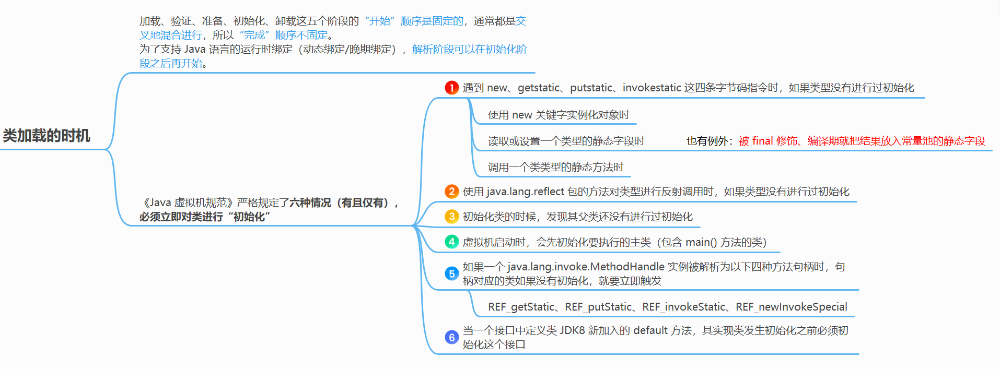

# 面试题-JVM

#### Java 是如何实现的平台无关？

Java 之所以可以做到跨平台，是因为 Java 虚拟机充当了桥梁。我们写的 java 代码会被编译成 `.class` 文件，这是平台无关的，`.class` 由 jvm 执行，jvm 是平台相关的，由它将 `.class` 翻译成操作系统可执行的二进制的机器码。

#### Java 是编译型还是解释型？

java 既是解释型又是编译型。

一般情况下，字节码是解释执行的，当 JVM 发现某个方法或代码块运行特别频繁的时候，就会人为这是“热点代码”，然后会通过 JIT 即时编译器把热点代码直接翻译成机器码，这些机器码就可以直接被执行了。

#### 简单介绍一下 JIT 优化技术

解释器的执行方式是一边翻译，一边执行，因此执行效率很低。为了解决这样的低效问题，HotSpot 引入了 JIT 技术（Just-In-Time）。

有了 JIT 技术之后，JVM 还是通过解释器进行解释执行。但是，当 JVM 发现某个方法或代码块运行时执行的特别频繁的时候，就会认为这是“热点代码”（Hot Spot Code)。然后 JIT 会把部分“热点代码”翻译成本地机器相关的机器码，并进行优化，然后再把翻译后的机器码缓存起来，以备下次使用。

#### 对 JDK 进程执行 kill -9 有什么影响？

`kill -9` 命令会立刻关闭 Jvm 进程。但是 `kill -9` 的语意是强制关闭，会导致在 Jvm 中执行的服务立刻关闭，来不及收尾。如导致 RPC 服务没有从注册中心取消注册导致服务不可用，如导致事务执行一半直接终止等等。

#### JVM 的运行时内存区域是怎样的？

> JVM 的运行时内存区域主要由 Java 堆、虚拟机栈、本地方法栈、方法区和程序计数器以及运行时常量池组成。
>
> 其中堆、方法区以及运行时常量池是线程之间共享的区域，而栈（本地方法栈+虚拟机栈）、程序计数器都是线程独享的。

**程序计数器**：一个只读的存储器，用于记录 Java 虚拟机正在执行的字节码指令的地址。它是线程私有的，为每个线程维护一个独立的程序计数器，用于指示下一条将要被执行的字节码指令的位置。它保证线程执行一个字节码指令以后，才会去执行下一个字节码指令。

**Java 虚拟机栈**：一种线程私有的存储器，用于存储 Java 中的局部变量。根据Java虚拟机规范，每次方法调用都会创建一个栈帧，该栈帧用于存储局部变量，操作数栈，动态链接，方法出口等信息。当方法执行完毕之后，这个栈帧就会被弹出，变量作用域就会结束，数据就会从栈中消失。

**本地方法栈**：本地方法栈是一种特殊的栈，它与 Java 虚拟机栈有着相同的功能，但是它支持本地代码（ Native Code ）的执行。本地方法栈中存放本地方法（ Native Method ）的参数和局部变量，以及其他一些附加信息。这些本地方法一般是用 C 等本地语言实现的，虚拟机在执行这些方法时就会通过本地方法栈来调用这些本地方法。

**Java 堆**：是存储对象实例的运行时内存区域。它是虚拟机运行时的内存总体的最大的一块，也一直占据着虚拟机内存总量的一大部分。Java 堆由 Java 虚拟机管理，用于存放对象实例，是几乎所有的对象实例都要在上面分配内存。此外，Java 堆还用于垃圾回收，虚拟机发现没有被引用的对象时，就会对堆中对象进行垃圾回收，以释放内存空间。

**方法区**：用于存储已被加载的类信息、常量、静态变量、即时编译后的代码等数据的内存区域。每加载一个类，方法区就会分配一定的内存空间，用于存储该类的相关信息，这部分空间随着需要而动态变化。方法区的具体实现形式可以有多种，比如堆、永久代、元空间等。

**运行时常量池**：是方法区的一部分。用于存储编译阶段生成的信息，主要有字面量和符号引用常量两类。其中符号引用常量包括了类的全限定名称、字段的名称和描述符、方法的名称和描述符。

#### Java 中的对象一定在堆上分配内存吗？

不一定，在 HotSpot 虚拟机中，存在 JIT 优化的机制，JIT 优化中可能会进行逃逸分析，当经过逃逸分析发现某一个局部对象没有逃逸到线程和方法外的话，那么这个对象就可能不会在堆上分配内存，而是进行栈上分配。

#### Java 的堆是如何分代的？为什么分代？

Java 的堆内存分代是指将不同生命周期的堆内存对象存储在不同的堆内存区域中，这里的不同的堆内存区域被定义为“代”。这样做**有助于提升垃圾回收的效率**，因为这样的话就可以为不同的"代"设置不同的回收策略。

一般来说，Java 中的大部分对象都是朝生夕死的，同时也有一部分对象会持久存在。因为如果把这两部分对象放到一起分析和回收，这样效率实在是太低了。通过将不同时期的对象存储在不同的内存池中，就可以节省宝贵的时间和空间，从而改善系统的性能。

**Java 的堆由新生代（Young Generation）和老年代（Old Generation）组成。新生代存放新分配的对象，老年代存放长期存在的对象。**

**新生代（Young）由年轻区（Eden）、Survivor 区组成（From Survivor、To Survivor）**。默认情况下，新生代的 Eden 区和 Survivor 区的空间大小比例是 `8:2`，可以通过 `-XX:SurvivorRatio` 参数调整。

#### 程序计数器为什么是私有的？

程序计数器是记录正在执行的字节码指令的地址，为了线程切换后能恢复到正确的执行位置，每个线程都需要有一个独立的程序计数器。

#### 虚拟机栈和本地方法栈为什么是私有的？

栈是存储方法执行过程中的数据，如果不是线程私有的，那方法就不能同时被多个线程调用执行了。

#### 堆和方法区的区别？

堆存放的是对象、数组和字符串常量池。

方法去存放的是类信息和运行时常量池。

#### 新生代如果只有一个 Eden + 一个 Survivor 可以吗?

这样就不能适用标记复制算法了，使用标记清除就会存在碎片问题，使用标记整理又存在效率问题。

如果还要使用标记复制算法，总要保持一个空着，因为两个区域都要用来分配对象，那空间比例就是 1:1，永远有一半空着，利用率低。

#### YoungGC 和 FullGC 的触发条件是什么？

YoungGC 的触发条件比较简单，那就是当年轻代中的 eden 区分配满的时候就会触发。

FullGC 的触发条件比较复杂也比较多，主要以下几种：

- 老年代空间不足

- 创建一个大对象，超过指定阈值会直接保存在老年代当中，如果老年代空间也不足，会触发 FullGC。

- YoungGC 之后，发现要移到老年代的对象，老年代存不下的时候，会触发一次 FullGC

- 空间分配担保失败

  - 当准备要触发一次 YoungGC 时，会进行空间分配担保，在担保过程中，发现虚拟机会检查老年代最大可用的连续空间小于新生代所有对象的总空间，但是`HandlePromotionFailure=false`，那么就会触发一次 FullGC（HandlePromotionFailure 这个配置，在JDK 7中并不在支持了，这一步骤在该版本已取消）
  - 当准备要触发一次 YoungGC 时，会进行空间分配担保，在担保过程中，发现虚拟机会检查老年代最大可用的连续空间小于新生代所有对象的总空间，但是HandlePromotionFailure=true，继续检查发现老年代最大可用连续空间小于历次晋升到老年代的对象的平均大小时，会触发一次FullGC

- 方法区空间不足
  
- 代码中执行 `System.gc()`

  - 代码中执行 `System.gc()` 的时候，会触发 FullGC，但是并不保证一定会立即触发。

#### 什么是 Stop The World

Java 中 Stop-The-World 机制简称 STW，是在执行垃圾收集算法时，Java 应用程序的其他所有线程都被挂起。这是 Java 中一种全局暂停现象，全局停顿，所有 Java 代码停止，native 代码可以执行，但不能与 JVM 交互。

不管选择哪种 GC 算法，stop-the-world 都是不能彻底避免的，只能尽量降低 STW 的时长。

**为什么需要 STW 呢？**

首先，如果不暂停用户线程，就意味着期间会不断有垃圾产生，永远也清理不干净。

其次，用户线程的运行必然会导致对象的引用关系发生改变，这就会导致两种情况：漏标和多标。

- **多标：**其实就是这个对象原本应该被回收掉的垃圾对象，但是被错误的标记成了存活对象。从而导致这个对象没有被 GC 回收掉。 这种情况还好一点，无非就是产生了一些浮动垃圾，下次 GC 再清理就好了。

- **漏标：**一个对象本来应该是存活对象，但是没有被正确的标记上，导致被错误的垃圾回收掉了。

#### JVM有哪些垃圾回收算法？

**标记-清除：**会产生内存碎片，但速度快，因为不需要移动和复制。

**标记-复制：**内存空间连续，不会产生内存碎片，但是需要保持一半空闲内存，有点浪费，而且复制有性能消耗。

**标记-整理：**不会产生内存碎片，也不会浪费内存空间，但是非常耗时（性能低）。

#### JVM 如何判断对象是否存活？

JVM 有两种算法来判断对象是否存活，分别是**引用计数法**和**可达性分析算法**。

- **引用计数法：**给对象中添加一个引用计数器，每当有一个地方引用它，计数器就加 1；当引用失效，计数器就减 1；任何时候计数器为 0 的对象就是不可能再被使用的。这个方法实现简单，效率高，但是目前主流的虚拟机中并没有选择这个算法来管理内存，其最主要的原因是它很难解决对象之间相互循环引用的问题。
  - 循环引用会导致对象无法被回收，最终会导致内存泄漏及内存溢出

- **可达性分析算法：** 这个算法的基本思想就是通过一系列的称为 “GC Roots” 的对象作为起点，从这些节点开始向下搜索，节点所走过的路径称为引用链，当一个对象到 GC Roots 没有任何引用链相连的话，则证明此对象是不可用的。

**但是，并不是说当进行完可达性分析算法后，即可证明某对象可以被GC。对象是否存活，需要两次标记：**

1. 第一次标记通过可达性分析算法。如果没有 GC Roots 相连接的引用链，那么将第一次标记
2. 如果对象的 `finalize()` 方法被覆盖并且没有执行过，则放在 F-Queue 队列中等待执行(不一定会执行)，如果一段时间后该队列的 `finalize()` 方法被执行且和 GC Roots 关联，则移出“即将回收”集合。如果仍然没有关联，则进行第二次标记，才会对该对象进行回收

不过现在都不提倡覆盖 finalize 方法，它的本意是像 Cpp 一样在对象销毁前执行，但是它影响了 JAVA 的安全和 GC 的性能，所以第二种判断会越来越少。

#### 哪些对象可以作为 GC roots？

- **局部变量**，就是虚拟机栈的栈帧中本地变量表引用的对象
- **native 方法中的局部变量**，本地方法栈引用的对象
- **static 类静态成员**，方法区中类静态属性引用的对象
- **方法区中常量引用的对象**
- **synchronized 同步锁持有的对象**
- **JVM 内部引用**：基本数据类型对应的 Class 对象、常驻异常对象（NullPointException, OutOfMemoryError)、系统类加载器。
- **反应 JVM 内部情况的 JMXBean、JVMT1 中注册的回调、本地代码缓存等**
- 不同垃圾收集器还可以有其他对象“临时性”地加入

#### 什么是三色标记算法？

三色标记算法是一种 JVM 中垃圾标记的算法，他可以减少 JVM 在 GC 过程中的 STW 时长，他是 CMS、G1 等垃圾收集器中主要使用的标记算法。

在出现三色标记算法之前，JVM 中垃圾对象的标记主要采用可达性分析算法及引用计数法。但是这两种算法存在以下问题：

1. 循环引用问题，如果两个对象互相引用，就形成了一个环形结构，如果采用引用计数法的话，那么这两个对象将永远无法被回收。
2. STW 时间长，可达性分析的整个过程都需要 STW，以避免对象的状态发生改变，这就导致 GC 停顿时长很长，大大影响应用的整体性能。

**为了解决上面这些问题，就引入了三色标记法。**

> 三色标记法将对象分为三种状态：白色、灰色和黑色。

- 白色：该对象没有被标记过。
- 灰色：该对象已经被标记过了，但该对象的引用对象还没标记完。
- 黑色：该对象已经被标记过了，并且他的全部引用对象也都标记完了。

三色标记法的标记过程可以分为**三个阶段：**初始标记（Initial Marking）、并发标记（Concurrent Marking）和重新标记（Remark）。

- **初始标记：**遍历所有的根对象，将根对象和直接引用的对象标记为灰色。在这个阶段中，垃圾回收器只会扫描被直接或者间接引用的对象，而不会扫描整个堆。因此，初始标记阶段的时间比较短。（Stop The World）
- **并发标记：**在这个过程中，垃圾回收器会从灰色对象开始遍历整个对象图，将被引用的对象标记为灰色，并将已经遍历过的对象标记为黑色。并发标记过程中，应用程序线程可能会修改对象图，因此垃圾回收器需要使用写屏障（Write Barrier）技术来保证并发标记的正确性。（不需要STW）
- **重新标记：**重新标记的主要作用是标记在并发标记阶段中被修改的对象以及未被遍历到的对象。这个过程中，垃圾回收器会从灰色对象重新开始遍历对象图，将被引用的对象标记为灰色，并将已经遍历过的对象标记为黑色。（Stop The World）

在重新标记阶段结束之后，垃圾回收器会执行清除操作，将未被标记为可达对象的对象进行回收，从而释放内存空间。这个过程中，垃圾回收器会将所有未被标记的对象标记为白色（White）。

以上三个标记阶段中，初始标记和重新标记是需要 STW 的，而并发标记是不需要 STW 的。其中最耗时的其实就是并发标记的这个阶段，因为这个阶段需要遍历整个对象树，而三色标记把这个阶段做到了和应用线程并发执行，大大降低了 GC 的停顿时长。

#### Java 中的四种引用有什么区别？

**强引用：**强引用是 Java 的默认引用形式，使用时不需要显示定义。如果一个对象具有强引用，那垃圾回收器绝不会回收它（可达时）。当内存空间不足，Java 虚拟机宁愿抛出 OutOfMemoryError 错误，使程序异常终止，也不会靠随意回收具有强引用的对象来解决内存不足的问题。

**弱引用：** 如果一个对象只具有弱引用，无论内存充足与否，Java GC 后对象如果只有弱引用将会被自动回收。

```java
WeakReference<String[]> weakBean = new WeakReference<String[]>(new String[]{"a", "b", "c"});
```

**软引用：** 软引用不会保证对象一定不会被回收，只能最大可能保证。软引用和弱引用的特性基本一致， 主要的区别在于软引用在内存不足时才会被回收。如果一个对象只具有软引用，Java GC 在内存充足的时候不会回收它，内存不足时才会被回收。

```java
SoftReference<String[]> softBean = new SoftReference<String[]>(new String[]{"a", "b", "c"});
```

**虚引用：**`java.lang.ref.PhantomReference` 类中只有一个方法 `get()`，而且几乎没有实现，只是返回 null。如果一个对象仅有虚引用，那么它就像没有任何引用一样，在任何时候都可能被 gc 回收。虚引用主要用来跟踪对象被垃圾回收的活动。

#### 新生代和老年代的 GC 算法

对于新生代来说，一般来说GC的次数是要比老年代高很多的，所以需要一个效率更高的算法，而且最好不要有碎片，因为很多对象都是需要先在新生代分配空间的，如果碎片太多的话，那么就会导致很多对象无法正常分配了。

所以，新生代选择了标记复制算法进行垃圾回收。

对于老年代来说，通常会采用标记整理算法，虽然效率低了一点，但是可以减少空间的浪费并且不会有空间碎片等问题。在有些回收器上面，如 CMS，为了降低 STW 的时长，也会采用标记清除算法。

#### 新生代和老年代的垃圾回收器有何区别？

常见的垃圾回收器如下：

- 串行垃圾回收器（Serial Garbage Collector） 如：Serial GC， Serial Old
- 并行垃圾回收器（Parallel Garbage Collector） 如：Parallel Scavenge，Parallel Old，ParNew
- 并发标记扫描垃圾回收器（CMS Garbage Collector） 
- G1垃圾回收器（G1 Garbage Collector，JDK 7中推出，JDK 9中设置为默认） 
- ZGC垃圾回收器（The Z Garbage Collector，JDK 11 推出）

**新生代收集器有 Serial、ParNew、Parallel Scavenge；**
**老年代收集器有 Serial Old、Parallel Old、CMS；**
**整堆收集器有 G1、ZGC。**

#### G1 和 CMS 有什么区别？

G1 会把 Java 的堆分为多个大小相等的 Region（每个 Region 的大小为 `1M~32M` ），他在年轻代回收的时候采用标记-复制算法，而在老年代回收的时候，采用的是标记-整理算法，这两种算法都可以避免内存碎片的产生。

G1 在回收的过程中，标记和清理的过程是并行的，可以充分利用多个 CPU 来缩短 STW 的时长，在复制的过程中是并发的，可以让复制线程和用户线程并发执行，不需要 STW。并且 G1 还可以在运行时动态的做区域内存大小的调整。

#### 为什么 G1 从 JDK 9 之后成为默认的垃圾回收器？

> G1，Garbage First，是 CMS 的改进版，解决了 CMS 内存碎片、更多的内存空间等问题。总之，G1 是一个先进的垃圾收集器，它可以提高系统的吞吐量，降低停顿的频率，并且可以有效管理大型堆。

G1 的优势：

1. **并发回收：**G1 能充分利用 CPU、多核环境下的硬件优势，使用多个 CPU（CPU或者CPU核心）来缩短 Stop The World 的停顿时间。部分其他收集器原本需要停顿 Java 线程执行的 GC 动作，G1 收集器仍然可以通过并发的方式让Java程序继续执行。
2. **分代收集：**分代概念在 G1 中依然得以保留。虽然 G1 可以不需要其它收集器配合就能独立管理整个 GC 堆，但它能够采用不同的方式去处理新创建的对象和已经存活了一段时间、熬过多次 GC 的旧对象以获取更好的收集效果。也就是说 G1 可以自己管理新生代和老年代了。
3. **空间整合：**由于 G1 使用了独立区域（Region）概念，G1 从整体来看是基于标记-整理算法实现收集，从局部（两个 Region）上来看是基于标记-复制算法实现的，但无论如何，这两种算法都意味着 G1 运作期间不会产生内存空间碎片。
4. **可预测的停顿：**这是 G1 相对于 CMS 的另一大优势，降低停顿时间是 G1 和 CMS 共同的关注点，但 G1 除了追求低停顿外，还能建立可预测的停顿时间模型，能让使用者明确指定一个长度为 M 毫秒的时间片段内，消耗在垃圾收集上的时间不得超过 N 毫秒。
5. **支持热插拔：**G1 可以在运行时动态调整堆的大小，以适应不同的内存需求。

> 与其它收集器相比，G1 变化较大的是它将整个Java堆划分为多个大小相等的独立区域（Region），虽然还保留了新生代和老年代的概念，但新生代和老年代不再是物理隔离的了它们都是一部分 Region（不需要连续）的集合。
>
> 同时，为了避免全堆扫描，G1 使用了 Remembered Set 来管理相关的对象引用信息。当进行内存回收时，在 GC 根节点的枚举范围中加入 Remembered Set 即可保证不对全堆扫描也不会有遗漏了。

适用场景：

- 大型内存环境：G1 针对大型内存环境进行了优化，因此对于使用了大量内存的应用程序来说（超过4G），G1 是一个更好的选择。
- 对应用程序响应时间敏感的场景：G1 通过分配多线程来进行垃圾回收，以最大限度地减少回收时应用程序的暂停时间。
- 对内存使用效率敏感的场景：G1 可以更好地评估哪些内存空间可以释放，以此来提高内存的利用率。
- 动态内存需求的场景：G1 支持热插拔，可以在运行时动态调整堆的大小，以适应不同的内存需求。
- 要求回收时间具有可预测性的场景：G1 使用固定的内存分配块来管理堆内存，这使得其在回收时间上具有更高的可预测性。

#### JDK 11 中新出的 ZGC 有什么特点？

ZGC（Z Garbage Collector）是 Java 11 中引入的一种新的垃圾回收器，他是一个为了实现低延迟而设计的垃圾收集器，具有以下几个特点：

1. **低停顿：**ZGC的目标是保证暂停时间非常短，ZGC 的目标是保持最大暂停时间在亚毫秒级，且这个暂停时间不会随着堆、live-set 或 root-set 的大小而增加。
2. **高吞吐量：**ZGC 是一个并发垃圾收集器，意味着大部分垃圾收集工作都是在 Java 线程继续执行的同时完成的。这极大地减少了垃圾收集对应用程序响应时间的影响。
3. **兼容性：**ZGC与现有的Java应用程序完全兼容，并且无需更改代码即可使用。但是也有一定的限制，仅支持 Linux 64位系统，不支持 32位平台。不支持使用压缩指针，采用内存分区管理。
4. **简单性：**ZGC设计简单，代码库较小，因此它更容易维护和扩展。
5. **支持大堆：**ZGC 能处理从 8MB 到 16TB  大小的堆，适用于大规模内存需求的应用程序
6. **不分代回收：**ZGC 在垃圾回收时对全量内存进行标记，但是回收时仅针对分内存回收，优先回收垃圾比较多的页面。

因此，ZGC 是一种新的、高效的、低停顿的垃圾回收器，适用于内存大小从几GB 到数TB 的应用程序。它的设计目标是在保证高吞吐量的同时保证最短的暂停时间，并且易于使用和维护。

#### Java 8 和 Java 11 的GC有什么区别？

Java 8 中默认的 `Parallel Scavenge GC + Parallel Old GC` 的，分别用来做新生代和老年代的垃圾回收。而在 Java 11 中默认采用的是 G1 进行整堆回收的（Java 9 中就是默认的了）。

另外，Java 11 中还新增了一种垃圾收集器，那就是 **ZGC**，他可以在保证高吞吐量的同时保证最短的暂停时间。

在垃圾识别及回收上面，Java 8 基于的是单纯地可达性分析，而 Java 11 中的 G1 采用的是三色标记法，可以大大降低 STW 的时长。

另外，G1 的内存划分是自适应的，它会根据堆的大小和使用情况来动态调整各个区域的大小和比例。而 `Parallel Scavenge GC+Parallel Old GC` 都是固定分配的策略。

#### 类的生命周期是怎么样的？

- 加载
- 连接
  - 验证
  - 准备
  - 解析
- 初始化
- 使用
- 卸载

#### Java中类加载的过程是怎么样的？

Java 中类的加载阶段分为加载、链接、初始化。其中连接过程又包含了验证、准备和解析。

**加载阶段**

查找并加载类的二进制数据(网络，jar包，运行时生成等)。将类的 `.class` 文件中的二进制数据读入内存中，将其放在方法区中，然后创建一个 `java.lang.Class` 对象（存放在堆中）用来封装类在方法区的数据结构。

**链接阶段**

在链接阶段，Java 类加载器对类进行验证、准备和解析操作。将类与类的关系（符号引用转为直接引用）确定好，校验字节码。

1. **验证：**校验类的正确性（文件格式，元数据，字节码，二进制兼容性）。
2. **准备：**为类的静态变量分配内存，将其初始化为默认值。但是在到达初始化之前，类变量都没有初始化为真正的初始值。当然，对于final修饰的变量来说，会在此时就被初始化为指定值。
3. **解析：**把类的符号引用转为直接引用(类或接口、字段、类方法、接口方法、方法类型、方法句柄和访问控制修饰符7类符号引用 )。

**初始化阶段**

初始化是类加载的最后一步，也是真正执行类中定义的  Java 程序代码(字节码)，初始化阶段是执行类构造器  `<clinit> ()` 方法的过程。这里利用了一种懒加载的思想，所有 Java 虚拟机实现必须在每个类或接口被 Java 程序首次主动使用才初始化，但类加载不一定，静态代码块在类初始化时执行。



#### 什么是符号引用和直接引用？

**符号引用（Symbolic Reference）**是一种用来表示引用目标的符号名称，比如类名、字段名、方法名等。符号引用与实际的内存地址无关，只是一个标识符，用于描述被引用的目标，类似于变量名。符号引用是在编译期间产生的，在编译后的 class 文件中存储。

**直接引用（Direct Reference）**是实际指向目标的内存地址，比如类的实例、方法的字节码等。直接引用与具体的内存地址相关，是在程序运行期间动态生成的。

```java
public class A {
    public int x;
}

public class B {
    public void foo() {
        A a = new A();
        // 通过符号引用来引用 A 类中的 x 变量，解析阶段，JVM 会将 A 类中的符号引用转换为直接引用；
        a.x = 10;
        // 假设 A 类的 x 变量的内存地址为 0x1000，在解析阶段，JVM 会为 B 类生成一条指令【getstatic 0x1000】，用于获取 x 变量的内存地址
        System.out.println("x = " + a.x);
    }
}
```

> 也就是说，在类的解析阶段进行的，Java 虚拟机会根据符号引用定位到具体的内存地址，并生成一条指令，用于访问该内存地址。

#### Java 中的类什么时候会被加载？

- 当创建类的实例时，如果该类还没有被加载，则会触发类的加载。例如，通过关键字new创建一个类的对象时，JVM 会检查该类是否已经加载，如果没有加载，则会调用类加载器进行加载。
- 当使用类的静态变量或静态方法时，如果该类还没有被加载，则会触发类的加载。例如，当调用某个类的静态方法时，JVM 会检查该类是否已经加载，如果没有加载，则会调用类加载器进行加载。
- 当使用反射机制访问类时，如果该类还没有被加载，则会触发类的加载。例如，当使用 `Class.forName()` 方法加载某个类时，JVM 会检查该类是否已经加载，如果没有加载，则会调用类加载器进行加载。
- 当 JVM 启动时，会自动加载一些基础类，例如 `java.lang.Object` 类和 `java.lang.Class` 类等。

总之，Java 中的类加载其实是延迟加载的，除了一些基础的类以外，其他的类都是在需要使用类时才会进行加载。同时，Java 还支持动态加载类，即在运行时通过程序来加载类，这为 Java 程序带来了更大的灵活性。

#### Java 中的类什么时候会被卸载？

Java 中类的卸载是由 Java虚拟机（JVM）自动进行的，JVM 会在满足以下条件时对一个类进行卸载：

1. 该类所有的实例都已被 GC 回收。
2. 该类的 ClassLoader 已经被 GC 回收。
3. 该类对应的 Class 对象没有在任何地方被引用，也就无法在任何地方通过反射访问该类方法。

> 在 Java 中，每一个类都会由 ClassLoader 加载到内存中，并在运行期间一直存在。当一个类不再被使用时，它的实例对象被 GC 回收后，如果 ClassLoader 也被 GC 回收，那么这个类就可以被卸载了。
>
> 需要注意的是，Java 虚拟机并不会在程序运行过程中频繁地卸载类，因为类卸载是一个比较耗时的操作，会影响程序的性能。通常情况下，Java 虚拟机会在需要释放内存空间时才会对不再使用的类进行卸载。
>
> 另外，Java SE 9 引入了一个新的特性，即“模块化”，通过模块化可以对 Java 类进行更加精细的控制，包括对类的卸载。在模块化环境下，如果一个模块中的类不再被引用，那么这个模块就可以被卸载。模块化可以使 Java 应用程序更加安全、可靠和可维护。

#### 什么是双亲委派？如何破坏？

双亲委派模型的工作过程是：

如果一个类加载器收到了类加载的请求，它首先不会自己去尝试加载这个类，而是把这个请求委派给父类加载器去完成，每一个层次的类加载器都是如此，因此所有的加载请求最终都应该传送到顶层的启动类加载器中，只有当父加载器反馈自己无法完成这个加载请求（它的搜索范围中没有找到所需的类）时，子加载器才会尝试自己去加载。

双亲委派模型主要是由 `ClassLoader#loadClass` 实现的，我们只需要自定义类加载器，并且重写其中的 `loadClass` 方法，即可破坏双亲委派模型。

#### 为什么需要双亲委派模型?

使用双亲委派模型来组织类加载器之间的关系，有一个显而易见的好处就是Java类随着它的类加载器一起具备了一种带有优先级的层次关系。例如类 `java.lang.Object`，它存放在 `rt.jar` 之中，无论哪一个类加载器要加载这个类，最终都是委派给处于模型最顶端的启动类加载器进行加载，因此 Object 类在程序的各种类加载器环境中都是同一个类。

相反，如果没有使用双亲委派模型，由各个类加载器自行去加载的话，如果用户自己编写了一个称为 `java.lang.Object` 的类，并放在程序的 ClassPath 中，那系统中将会出现多个不同的 Object 类，Java 类型体系中最基础的行为也就无法保证，应用程序也将会变得一片混乱。

#### loadClass 有什么区别 findClass？

findClass 用于重写类加载逻辑、loadClass 方法的逻辑里如果父类加载器加载失败则会调用自己的 findClass 方法完成加载，保证了双亲委派规则。

- 如果不想打破双亲委派模型，那么只需要重写 findClass 方法即可
- 如果想打破双亲委派模型，那么就重写整个 loadClass 方法

#### 有哪些破坏双亲委派的例子？

**向前兼容**

由于双亲委派模型是在 JDK1.2 之后才被引入的，而类加载器和抽象类 `java.lang.ClassLoader` 则是 JDK1.0 时候就已经存在，面对已经存在的用户自定义类加载器的实现代码，Java 设计者引入双亲委派模型时不得不做出一些妥协。

为了向前兼容，JDK1.2 之后的 `java.lang.ClassLoader` 添加了一个新的 `proceted` 方法 `findClass()`，在此之前，用户去继承 `java.lang.ClassLoader` 的唯一目的就是重写 `loadClass()` 方法，因为虚拟机在进行类加载的时候会调用加载器的私有方法 `loadClassInternal()`，而这个方法的唯一逻辑就是去调用自己的 `loadClass()`。

JDK1.2 之后已不再提倡用户再去覆盖 `loadClass()` 方法，应当把自己的类加载逻辑写到 `findClass()` 方法中，在 `loadClass()` 方法的逻辑里，如果父类加载器加载失败，则会调用自己的 `findClass()` 方法来完成加载，这样就可以保证新写出来的类加载器是符合双亲委派模型的。 

**SPI实现**

双亲委派模型很好地解决了各个类加载器的基础类统一问题(越基础的类由越上层的加载器进行加载)，基础类之所以被称为“基础”，是因为它们总是作为被调用的 API。但是，如果基础类又要调用用户的代码，那该怎么办呢。 

这并非是不可能的事情，一个典型的例子便是 JNDI 服务，它的代码由启动类加载器去加载(在 JDK1.3 时放进 rt.jar)，但 JNDI 的目的就是对资源进行集中管理和查找，它需要调用独立厂商实现部部署在应用程序的 classpath 下的 JNDI 接口提供者(SPI, Service Provider Interface)的代码，但启动类加载器不可能“认识”这些代码。

为了解决这个困境，Java 设计团队只好引入了一个不太优雅的设计：线程上下文类加载器(Thread Context ClassLoader)。这个类加载器可以通过 java.lang.Thread 类的 `setContextClassLoader()` 方法进行设置，如果创建线程时还未设置，它将会从父线程中继承一个；如果在应用程序的全局范围内都没有设置过，那么这个类加载器默认就是应用程序类加载器。

有了线程上下文类加载器，JNDI 服务使用这个线程上下文类加载器去加载所需要的 SPI 代码，也就是父类加载器请求子类加载器去完成类加载动作，这种行为实际上就是打坡了双亲委派模型的层次结构来逆向使用类加载器，已经违背了双亲委派模型，但这也是无可奈何的事情。

Java 中所有涉及 SPI 的加载动作基本上都采用这种方式，例如 JNDI, JDBC, JCE, JAXB 和 JBI 等。

**TOMCAT**

一个 web 容器可能需要部署多个应用程序，不同的应用程序可能会依赖同一个第三方类库的不同版本，但是不同版本的类库中某一个类的全路径名可能是一样的，如果采用默认的类加载机制，那么就会无法加载多个相同的类。

Tomcat 为了实现隔离性，所以并没有完全遵守双亲委派的原则。

#### Tomcat 的类加载机制是怎么样的？

> Tomcat 的类加载机制，在默认情况下，是先把当前要加载的类委托给 BootstrapClassLoader 尝试加载，为了避免 JRE 中的核心类被我们应用自己给覆盖（如String等），Bootstrap 如果无法加载，那么就由 WebAppClassLoader 尝试加载，如果无法加载，那么再委托通过双亲委派的方式向上委派给 Common、System 等类加载进行加载，即顺序为：`Bootstrap->WebApp->System->Common`
>
> 上面的是默认情况，tomcat 中有一个配置 delegate，他的默认值是 false，如果设置成 true 了，那么他就会严格遵守双亲委派，按照 `Bootstrap->System->Common->WebApp` 的顺序进行加载。

以下是 tomcat 中 `WebappClassLoaderBase.java` 中 loadClass 的代码，我做了一些精简，并加了一些注释：

```java
public Class<?> loadClass(String name, boolean resolve) throws ClassNotFoundException {
                    if (resolve) {
                        resolveClass(clazz);
                    }
                    return clazz;
                }
            } catch (ClassNotFoundException e) {
                // Ignore
            }
        }

        // 自己尝试加载
        // 能走到这里，肯定是BootStrap没加载到，之后还有两种情况：
        // 1、如果delegate为ture的话，说明上层类加载器也没记载到。
        // 2、如果delegate为false，那么就还没有进行过委派，先在这里尝试自己加载。
        if (log.isDebugEnabled()) {
            log.debug("  Searching local repositories");
        }
        try {
            clazz = findClass(name);
            if (clazz != null) {
                if (log.isDebugEnabled()) {
                    log.debug("  Loading class from local repository");
                }
                if (resolve) {
                    resolveClass(clazz);
                }
                return clazz;
            }
        } catch (ClassNotFoundException e) {
            // Ignore
        }

        // 如果delegate为false,说明还没有做过委派，那么委派给父类加载器加载类。
        if (!delegateLoad) {
            if (log.isDebugEnabled()) {
                log.debug("  Delegating to parent classloader at end: " + parent);
            }
            try {
                clazz = Class.forName(name, false, parent);
                if (clazz != null) {
                    if (log.isDebugEnabled()) {
                        log.debug("  Loading class from parent");
                    }
                    if (resolve) {
                        resolveClass(clazz);
                    }
                    return clazz;
                }
            } catch (ClassNotFoundException e) {
                // Ignore
            }
        }
    }

    throw new ClassNotFoundException(name);
}
```

整个代码的过程就是：

1. 加锁： 方法使用同步块确保线程安全
2. 检查已加载类缓存： 首先，通过调用 `findLoadedClass0` 方法检查本地缓存是否已加载该类，如果是，则直接返回缓存中的 Class 对象。
3. 检查已加载类缓存（GraalVM 兼容性处理）： 通过调用 `findLoadedClass` 方法检查另一个类加载缓存，如果是 GraalVM 环境，直接返回缓存中的 Class 对象。
4. 尝试使用 Bootstrap 类加载器加载： 尝试使用 Bootstrap 类加载器加载类，以防止 Web 应用程序覆盖 Java SE 类。如果加载成功，则返回加载的 Class 对象。
5. 决定是否委派加载： 根据 delegate 属性和其他条件判断是否应该委派加载给父类加载器。
6. 委派给父类加载器： 如果需要委派加载（delegate 为 true），尝试使用父类加载器加载类。
7. 自己尝试加载： 如果未指定需要委派（delegate 为 false），或者未从父类加载器中找到类，则调用 findClass 方法尝试自己进行类加载。
8. 委派给父类加载器： 如果未指定需要委派（delegate 为 false），且自己没加载到类，则尝试使用父类加载器加载类。

#### 如何判断 JVM 中类和其他类是不是同一个类？

> 类加载器虽然只用于实现类的加载动作，但它在 Java 程序中起到的作用却远远不限于类加载阶段。对于任意一个类，都需要由加载它的类加载器和这个类本身一同确立其在 Java 虚拟机中的唯一性，每一个类加载器，都拥有一个独立的类名称空间。

简单点说：比较两个类是否“相等”，只有在这两个类是由同一个类加载器加载的前提下才有意义，否则，即使这两个类来源于同一个 Class 文件，被同一个虚拟机加载，只要加载它们的类加载器不同，那这两个类就必定不相等。

#### JVM 如何保证给对象分配内存过程的线程安全？

#### 虚拟机中的堆一定是线程共享的吗？

#### 常见的 JVM 工具有哪些

#### 有哪些常用的 JVM 启动参数？

#### 哪些语言有 GC 机制

#### 一个对象的结构是什么样的？

#### JVM 是如何创建对象的？

#### 字符串常量池是如何实现的？

#### 什么是方法区？是如何实现的？

#### JVM 中一次完整的 GC 流程是怎样的？

#### JVM 为什么要把堆和栈区分出来呢？

#### 运行时常量池和字符串常量池的关系是什么？

#### 什么是堆外内存？如何使用堆外内存？

#### FullGC 多久一次算正常？

#### 什么是跨代引用，有什么问题？

#### 内存泄漏和内存溢出的区别是什么？

#### 什么是编译和反编译？

#### 破坏双亲委派之后，能重写 String 类吗？

#### OutOfMemory 和 StackOverflow 的区别是什么

#### 什么是 Class 常量池，和运行时常量池关系是什么？

#### Java 发生了 OOM 一定会导致 JVM 退出吗？

#### 什么是 safe point，有啥用？

#### JDK1.8 和 1.9 中类加载器有哪些不同

#### 什么是逃逸分析？

#### 什么是 AOT 编译？和 JIT 有啥区别？
