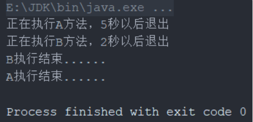

# 面试题-设计模式

#### 什么是设计模式？有什么好处？

设计模式是在软件开发过程中经常遇到的问题的**通用解决方案**。它们是经过无数的验证和经验积累的**最佳实践**。

首先，设计模式是一些前人经验的一些总结，所以，当遇到相似的问题的时候，我们可以直接借鉴好的设计模式来实现，这样可以**大大降低我们的试错成本和迭代成本**。可以大大**提升我们的开发速度**。

不要认为只有 23 种，只要是一套被反复使用、多数人知晓的、经过分类编目的、代码设计经验的总结都是软件设计模式的。比如说 MVC。

而且，设计模式都是遵守了很多设计原则的，这些原则**可以帮助我们大大提升代码的可重用性、可维护性和可扩展性等**。

设计模式通过使用松耦合的对象之间的交互，使系统更容易进行扩展和修改。通过引入抽象层和接口，可以将变化的部分隔离出来，而不影响整个系统的其他部分。提高了代码的**可扩展性**。

还有一点比较重要，那就是设计模式其实也是一种**通用语言**。他使得团队成员之间交流更加的顺畅。当我们提到单例、模板、策略、责任链，大家都知道是怎么回事儿。

可以很快速的就 get 到其他人要说的意思，不仅**可以提升沟通效率**，还能**降低后续代码维护中的出错概率**。

#### 设计模式的 7 大基本原则有哪些？

设计模式是软件设计中常用的解决方案，它们有助于构建可重用、可维护和可扩展的代码。在设计模式中，有七个基本原则，它们提供了指导设计的准则和原则。

设计模式的 7 大基本原则中，有 5 个来源于面向对象的5大基本原则，他们分别是：

**单一职责原则（Single Responsibility Principle，SRP）：**一个类应该只有一个引起变化的原因。换句话说，一个类应该只做一件事。这个原则鼓励将功能分解为小的、独立的单元，每个单元只负责一件事情。

**开放封闭原则（Open/Closed Principle，OCP）：**软件实体（类、模块、函数等）应该对扩展是开放的，而对修改是关闭的。这意味着应该通过扩展现有代码来引入新功能，而不是直接修改已有的代码。

**里氏替换原则（Liskov Substitution Principle，LSP）：**任何一个父类出现的地方，都可以用它的子类来替代，而不会导致程序的错误或异常。这个原则强调继承关系的正确使用，子类应该能够完全替代父类而不引发意外行为。

**依赖倒置原则（Dependency Inversion Principle，DIP）：**高层模块不应该依赖于低层模块，二者都应该依赖于抽象。这要求我们写出来的程序要依赖于抽象接口，而不是具体的实现。这个原则通过引入抽象接口或抽象类，将高层模块与低层模块解耦。

**接口隔离原则（Interface Segregation Principle，ISP）：**客户端不应该依赖于它不需要使用的接口。一个类不应该强迫它的客户端依赖于它们不需要的方法。接口应该小而专注，不应该包含多余的方法。这要求我们要使用多个小的专门的接口，而不要使用一个大的总接口。

除了这5大基本原则以外，在设计模式中，还有 2 个原则需要我们遵守的。那就是：

**迪米特法则（Law of Demeter，LoD）：**一个对象应该对其他对象有最少的了解。对象之间应该保持松耦合。这个原则鼓励将复杂系统分解为许多小的、相对独立的模块，模块之间的交互通过最少的接口进行。

**合成/聚合复用原则（Composition/Aggregation Reuse Principle，CARP）：**优先使用合成/聚合，而不是继承来实现代码复用。这个原则推崇对象组合和聚合的方式来构建复杂的对象结构，而不是依赖继承。

#### 使用哪种设计模式可以提高代码可维护性？

有很多设计模式可以提高代码可维护性，以下列举几种常见的：

1. **MVC模式（Model-View-Controller）：**将应用程序分为三个部分，分别是模型（Model）、视图（View）和控制器（Controller），它们之间通过定义清晰的接口进行交互。这种模式可以将业务逻辑与用户界面分离，使得应用程序更容易维护和修改。
2. **观察者模式（Observer）：**将对象之间的一对多的依赖关系封装起来，当一个对象发生改变时，它的所有依赖者都会得到通知并自动更新。这种模式可以减少对象之间的耦合度，使得系统更加灵活和易于维护。
3. **装饰器模式（Decorator）：**动态地给一个对象添加一些额外的职责，而不需要修改这个对象的代码。这种模式可以使得对象的功能扩展变得更加灵活和可控。
4. **工厂模式（Factory）：**将对象的创建和使用分离，通过一个工厂类来负责创建对象。这种模式可以使得系统更加灵活和易于维护，也方便对对象的管理和测试。
5. **单例模式（Singleton）：**确保一个类只有一个实例，并提供一个全局访问点。这种模式可以保证对象的唯一性，并方便对象的管理和控制。

#### 使用哪种设计模式可以提高代码的复用性？

1. **工厂模式（Factory）：**通过一个工厂类来负责创建对象，将对象的创建和使用分离，可以避免在代码中重复写对象创建的代码。
2. **模板方法模式（Template Method）：**通过模板方法，将一些通用的逻辑抽象出来放到父类中，各个子类继承父类并复用这些公共的方法。
3. **装饰器模式（Decorator）：**动态地给一个对象添加一些额外的职责，可以避免在代码中重复编写相似的功能。
4. **享元模式（Flyweight）：**将一个对象的状态分成内部状态和外部状态，多个具有相同内部状态的对象可以共享外部状态，可以避免在代码中重复创建具有相同内部状态的对象。
5. 适配器模式（Adapter）：将一个类的接口转换成客户端希望的另一个接口，可以使得原本不兼容的类可以协同工作。
6. **单例模式（Singleton）：**确保一个类只有一个实例，并提供一个全局访问点。这种模式可以保证对象的唯一性，并方便对象的管理和控制以及复用。

#### 你在工作中是如何使用设计模式的？

工作中常用的设计模式有很多，如单例、工厂、策略、模板等。**一般在工作中，是可以把策略、工厂和模板一起结合着来使用的。**

当我们需要有多个具体的策略服务的时候，那不同的内容放到策略服务中，那些公共的东西就可以抽象出来放到模板方法中了。那这些策略服务该如何管理呢？什么时候用什么策略服务呢？这时候就可以借助工厂来管理这些服务。

如以下例子， 我们需要定义一个支付服务，里面有一个支付方法：

```java
public interface PayService {
    public void pay(PayRequest payRequest);


}

class PayRequest {

}
```

这是一个单独的接口，只定义了一个方法，那么，我们再把所有支付渠道中公共的代码抽出来，定义一个抽象类：

```java
public abstract class AbstractPayService implements PayService {

    @Override
    public void pay(PayRequest payRequest) {
      	//前置检查
        validateRequest(payRequest);
      	//支付核心逻辑
        doPay(payRequest);
      	//后置处理
        postPay(payRequest);
    }

    public abstract void doPay(PayRequest payRequest);

    private void postPay(PayRequest payRequest) {
        //支付成功的后置处理
    }

    public void validateRequest(PayRequest payRequest) {
        //参数检查
    }
}
```

这个抽象类中首先把pay方法给实现了，然后编排了几个其他的方法，这些公共的方法在抽象类中直接实现了，具体的支付核心实现，留给实现类去实现就行了。

然后我们就可以定义多个策略服务了：

```java
@Service
public class AlipayPayService extends AbstractPayService {
    @Override
    public void doPay(PayRequest payRequest) {
        //支付宝支付逻辑
    }
}

@Service
public class WechatPayService extends AbstractPayService {
    @Override
    public void doPay(PayRequest payRequest) {
        //微信支付逻辑
    }
}
```

这些服务定义好了之后，需要有一个地方统一管理，那就定义一个工厂吧：

```java
import java.util.Map;
import java.util.concurrent.ConcurrentHashMap;
@Service
public class PayServiceFactory {

    @Autowired
    public Map<String, PayService> payServiceMap = new ConcurrentHashMap<>();

    public PayService getPayService(String payChannel) {
        // alipay -> alipayPayService
        // wechat -> wechatPayService
        return payServiceMap.get(payChannel + "PayService");
    }
}
```

在工厂中，把 PayService 的所有实现全部都注入到 payServiceMap 中，然后再需要用的是，直接调他的 getPayService 方法就行了。

这样，在使用的时候，只需要通过工厂就能获取对应的策略服务进行服务调用了：

```java
public class PayDomainService {
    @Autowired
    PayServiceFactory payServiceFactory;

    public void pay(PayRequest payRequest) {
        String payChannel = payRequest.getPayChannel();
        payServiceFactory.getPayService(payChannel).pay(payRequest);
    }
}
```

以上，我们借助了 Spring，结合了策略、模板以及工厂，实现了我们想要的功能，通过多种设计模式，减少重复代码，提升可维护性，也让代码更容易阅读和理解。

#### 请简述 MVC 模式的思想

MVC 模式（Model-View-Controller）是一种软件设计模式，它将应用程序分为三个部分：模型、视图和控制器。这个模式的目的是将应用程序的表示（视图）与处理（控制器）分开，以及将应用程序的数据和业务逻辑（模型）与表示和处理分开。

具体来说，MVC 模式的思想如下：

- **模型（Model）：**表示应用程序的核心业务逻辑和数据。模型通常包含一些数据结构和逻辑规则，用于处理数据的输入、输出、更新和存储等操作。模型并不关心数据的显示或用户的交互方式，它只关注数据本身以及对数据的操作。
- **视图（View）：**表示应用程序的用户界面，用于显示模型中的数据。视图通常包含一些控件和元素，用于展示数据，并且可以与用户进行交互。视图并不关心数据的处理或存储方式，它只关注如何呈现数据以及如何与用户进行交互。
- **控制器（Controller）：**表示应用程序的处理逻辑，用于控制视图和模型之间的交互。控制器通常包含一些事件处理和动作触发等操作，用于响应用户的输入或视图的变化，并对模型进行操作。控制器通过将用户的输入转化为对模型的操作，从而实现了视图和模型之间的解耦。

MVC 模式的核心思想是将应用程序的表示和处理分离开来，从而使得应用程序更加灵活、易于维护和扩展。这种模式可以提高代码的可读性和可维护性，同时也可以促进代码的复用和分工，使得多人协作开发变得更加容易。

#### 单例模式的多种写法

想要实现一个单例，首先就是要考虑把构造函数设置成 private 的，否则的话就可以随时通过构造函数创建对象了，就不是单例了。

那把构造函数 private 之后，就还需要提供一个方法，可以初始化单例对象，并且要保证只能初始化一个单例对象。并且需要考虑线程安全的问题。

具体到写法上，主要有 5 种。分别是懒汉、饿汉、静态内部类、双重校验锁以及枚举。

- **懒汉**

> 所谓懒汉，就是在需要的时候才会去创建对象。
>
> 好处就是避免提前创建浪费资源，但是缺点也明显，就是第一创建的时候浪费时间。

```java
public class Singleton {  
    private static Singleton instance;  
    private Singleton (){}  
    public static synchronized Singleton getInstance() {  
    if (instance == null) {  
        instance = new Singleton();  
    }  
    return instance;  
    }  
}  
```

- **饿汉**

> 所谓饿汉，就是在类刚一初始化的时候就立即把单例对象创建出来。

```java
public class Singleton {
    
    private static Singleton instance = new Singleton();
    
    private Singleton (){}
    
    public static Singleton getInstance() {
        return instance;
    }
}

public class Singleton {  
    private Singleton instance = null;
    
    static {
         instance = new Singleton();
    }
    
    private Singleton (){}
    
    public static Singleton getInstance() {
        return this.instance;
    }
}  
```

- **静态内部类**

```java
public class Singleton {
    
    private static class SingletonHolder {
        private static final Singleton INSTANCE = new Singleton();
    }
    
    private Singleton (){}
    
    public static final Singleton getInstance() {
        return SingletonHolder.INSTANCE;
    }
}
```

- **枚举**

```java
public enum Singleton {
    INSTANCE;
    
    public void whateverMethod() {
    }
}
```

- **双重检测锁**

```java
public class Singleton {
    
    private volatile static Singleton singleton;
    
    private Singleton (){}
    
    public static Singleton getSingleton() {
        if (singleton == null) {
            synchronized (Singleton.class) {
                if (singleton == null) {
                    singleton = new Singleton();
                }
            }
        }
        return singleton;
    }
}
```

#### 如何破坏单例模式？

单例模式主要是通过把一个类的构造方法私有化，来避免重复创建多个对象的。那么，想要破坏单例，只要想办法能够执行到这个私有的构造方法就行了。

一般来说做法有使用反射及使用反序列化都可以破坏单例。

> 如何避免反射破坏单例？
>
> 构造器中添加 throw 异常。
>
> 
>
> 如何避免反序列化破坏单例？
>
> 只要在 Singleton 中定义 readResolve 方法，并在该方法中指定要返回的对象的生成策略，就可以防止单例被破坏。

#### 为什么说枚举是实现单例最好的方式？

1、枚举实现的单例写法简单

2、枚举实现的单例天然是线程安全的

3、枚举实现的单例可避免被反序列化破坏

```java
public final class T extends Enum
{
    //省略部分内容
    public static final T SPRING;
    public static final T SUMMER;
    public static final T AUTUMN;
    public static final T WINTER;
    private static final T ENUM$VALUES[];
    static
    {
        SPRING = new T("SPRING", 0);
        SUMMER = new T("SUMMER", 1);
        AUTUMN = new T("AUTUMN", 2);
        WINTER = new T("WINTER", 3);
        ENUM$VALUES = (new T[] {
            SPRING, SUMMER, AUTUMN, WINTER
        });
    }
}
```

> 了解 JVM 的类加载机制的朋友应该对这部分比较清楚。static 类型的属性会在类被加载过程中被初始化，当一个 Java 类第一次被真正使用到的时候静态资源被初始化、Java 类的加载和初始化过程都是线程安全的（因为虚拟机在加载枚举的类的时候，会使用 ClassLoader 的 loadClass 方法，而这个方法使用同步代码块保证了线程安全）。所以，创建一个 enum 类型是线程安全的。
>
> 也就是说，我们定义的一个枚举，在第一次被真正用到的时候，会被虚拟机加载并初始化，而这个初始化过程是线程安全的。而我们知道，解决单例的并发问题，主要解决的就是初始化过程中的线程安全问题。
>
> 所以，由于枚举的以上特性，枚举实现的单例是天生线程安全的。

**枚举可解决反序列化会破坏单例的问题**

**对于普通的单例对象来说，反序列化过程中会通过 Java 的 Unsafe 机制来创建对象的**。这意味着即使类的构造函数是私有的，反序列化仍然可以创建该类的实例，因为它不依赖于常规的构造过程。

但是，枚举的反序列化并不是通过 Unsafe，也不是通过反射实现的。所以，也就不会发生由于反序列化导致的单例破坏问题。

#### 不使用锁如何实现线程安全的单例？

如果不能使用 synchronized 和 lock 的话，想要实现单例可以通过饿汉模式、枚举、以及静态内部类的方式实现。

**饿汉**，其实都是通过定义静态的成员变量，以保证 instance 可以在类初始化的时候被实例化。

**静态内部类**，这种方式和饿汉方式只有细微差别，只是做法上稍微优雅一点。这种方式是 Singleton 类被装载了，instance 不一定被初始化。因为SingletonHolder类没有被主动使用，只有显示通过调用 getInstance 方法时，才会显示装载 SingletonHolder 类，从而实例化 instance。。。但是，原理和饿汉一样。

**枚举**，其实，如果把枚举类进行反编译，你会发现他也是使用了 static final 来修饰每一个枚举项。

其实，上面三种方式，都是依赖静态数据在类初始化的过程中被实例化这一机制的。但是，如果真要较真的话，ClassLoader 的 loadClass 方法在加载类的时候使用了 synchronized 关键字。也正是因为这样， 除非被重写，这个方法默认在整个装载过程中都是同步的（线程安全的）。

那么，除了上面这三种，还有一种无锁的实现方式，那就是 CAS。

#### 三种工厂模式的区别和特点

工厂模式的主要功能就是帮助我们实例化对象的。**之所以名字中包含工厂模式四个字，是因为对象的实例化过程是通过工厂实现的，是用工厂代替new操作的**。

这样做的好处是封装了对象的实例化细节，尤其是对于实例化较复杂或者对象的生命周期应该集中管理的情况。会给你系统带来更大的可扩展性和尽量少的修改量。

**工厂模式有三种，分别是简单工厂模式、工厂方法模式、抽象工厂模式**。三种模式从前到后越来越抽象，也更具有一般性。


**简单工厂 ：一个工厂创建所有具体产品**。对于增加新的产品，主要是新增产品，就要修改工厂类。符合单一职责原则。不符合开放-封闭原则

- 优点： 
  - 1、屏蔽产品的具体实现，调用者只关心产品的接口。
  - 2、实现简单
- 缺点： 
  - 1、增加产品，需要修改工厂类，不符合开放-封闭原则
  - 2、工厂类集中了所有实例的创建逻辑，违反了高内聚责任分配原则

**工厂方法 ：一个工厂方法只创建一个具体产品**。支持增加任意产品，新增产品时不需要更改已有的工厂，需要增加该产品对应的工厂。符合单一职责原则、符合开放-封闭原则。但是引入了复杂性

- 优点： 
  - 1、继承了简单工厂模式的优点
  - 2、符合开放-封闭原则
- 缺点： 
  - 1、增加产品，需要增加新的工厂类，导致系统类的个数成对增加，在一定程度上增加了系统的复杂性。

**抽象工厂 ：一个工厂方法只创建一类具体产品**。增加新产品时，需要修改工厂，增加产品族时，需要增加工厂。符合单一职责原则，部分符合开放-封闭原则，降低了复杂性

- 优点： 
  - 1、隔离了具体类的生成，使得客户并不需要知道什么被创建
  - 2、每次可以通过具体工厂类创建一个产品族中的多个对象，增加或者替换产品族比较方便，增加新的具体工厂和产品族很方便；
- 缺点：
  - 增加新的产品等级结构很复杂，需要修改抽象工厂和所有的具体工厂类，对“开闭原则”的支持呈现倾斜性。

#### 简单工厂模式

简单工厂模式是属于创建型模式，又叫做静态工厂方法（Static Factory Method）模式。简单工厂模式是由一个工厂对象决定创建出哪一种产品类的实例。简单工厂模式是工厂模式家族中最简单实用的模式，可以理解为是不同工厂模式的一个特殊实现。

在介绍简单工厂模式之前，我们尝试解决以下问题：

现在我们要使用面向对象的形式定义计算器，为了实现各算法之间的解耦。主要的用到的类如下：

```java
// 计算类的基类
public abstract class Operation {

    private double value1 = 0;
    private double value2 = 0;

    public double getValue1() {
        return value1;
    }
    public void setValue1(double value1) {
        this.value1 = value1;
    }
    public double getValue2() {
        return value2;
    }
    public void setValue2(double value2) {
        this.value2 = value2;
    }
    protected abstract double getResule();
}

// 加法
public class OperationAdd extends Operation {
    @Override
    protected double getResule() {
        return getValue1() + getValue2();
    }
}
// 减法
public class OperationSub extends Operation {
    @Override
    protected double getResule() {
        return getValue1() - getValue2();
    }
}
// 乘法
public class OperationMul extends Operation {
    @Override
    protected double getResule() {
        return getValue1() * getValue2();
    }
}
// 除法
public class OperationDiv extends Operation {
    @Override
    protected double getResule() {
        if (getValue2() != 0) {
            return getValue1() / getValue2();
        }
        throw new IllegalArgumentException("除数不能为零");
    }
}
```

当我想要执行加法运算时，可以使用如下代码：

```java
public class Main {
    public static void main(String[] args) {
        OperationAdd operationAdd = new OperationAdd();
        operationAdd.setValue1(10);
        operationAdd.setValue2(5);
        System.out.println(operationAdd.getResule());
    }
}
```

当我需要执行减法运算时，我就要创建一个 OperationSub 类。也就是说，我想要使用不同的运算的时候就要创建不同的类，并且要明确知道该类的名字。

那么这种重复的创建类的工作其实可以放到一个统一的工厂类中。简单工厂模式有以下优点：

> 1、一个调用者想创建一个对象，只要知道其名称就可以了。
>
> 2、屏蔽产品的具体实现，调用者只关心产品的接口。

- **简单工厂模式实现方式**

简单工厂模式其实和他的名字一样，很简单。先来看看它的组成:

> Factory: 这是本模式的核心,含有一定的商业逻辑和判断逻辑。在 java 中它往往由 一个具体类实现。（OperationFactory）
>
> Product: 它一般是具体产品继承的父类或者实现的接口。在 java 中由接口或者抽象类来实现。（Operation）
>
> ConcreteProduct: 工厂类所创建的对象就是此角色的实例。在 java 中由一个具体类实现。 来用类图来清晰的表示下的它们之间的关系（OperationAdd\OperationSub 等）


在原有类的基础上，定义工厂类：

```java
// 工厂类
public class OperationFactory {

    public static Operation createOperation(String operation) {
        Operation oper = null;
        switch (operation) {
            case "+":
                oper = new OperationAdd();
                break;
            case "-":
                oper = new OperationSub();
                break;
            case "*":
                oper = new OperationMul();
                break;

            case "/":
                oper = new OperationDiv();
                break;
            default:
                throw new UnsupportedOperationException("不支持该操作");
        }
        return oper;
    }
}
```

有了工厂类之后，可以使用工厂创建对象：

```java
Operation operationAdd = OperationFactory.createOperation("+");
operationAdd.setValue1(10);
operationAdd.setValue2(5);
System.out.println(operationAdd.getResule());
```

通过简单工厂模式，该计算器的使用者不需要关心实现加法逻辑的那个类的具体名字，他只要知道该类对应的参数"+"就可以了。

- **简单工厂模式存在的问题**

当我们需要增加一种计算时，例如开平方。这个时候我们需要先定义一个类继承 Operation 类，其中实现平方的代码。除此之外我们还要修改 OperationFactory 类的代码，增加一个 case。这显然是违背开闭原则的。可想而知对于新产品的加入，工厂类是很被动的。

我们举的例子是最简单的情况。而在实际应用中，很可能产品是一个多层次的树状结构。 简单工厂可能就不太适用了。

- **简单工厂模式总结**

工厂类是整个简单工厂模式的关键。包含了必要的逻辑判断，根据外界给定的信息，决定究竟应该创建哪个具体类的对象。通过使用工厂类，外界可以从直接创建具体产品对象的尴尬局面摆脱出来，仅仅需要负责“消费”对象就可以了。而不必管这些对象究竟如何创建及如何组织的。明确了各自的职责和权利，有利于整个软件体系结构的优化。

但是由于工厂类集中了所有实例的创建逻辑，违反了高内聚责任分配原则，将全部创建逻辑集中到了一个工厂类中；它所能创建的类只能是事先考虑到的，如果需要添加新的类，则就需要改变工厂类了。

当系统中的具体产品类不断增多时候，可能会出现要求工厂类根据不同条件创建不同实例的需求．这种对条件的判断和对具体产品类型的判断交错在一起，很难避免模块功能的蔓延，对系统的维护和扩展非常不利；

这些缺点在工厂方法模式中得到了一定的解决。

#### 工厂方法模式

工厂方法模式(Factory Method Pattern)又称为工厂模式，也叫虚拟构造器(Virtual Constructor)模式或者多态工厂(Polymorphic Factory)模式，它属于类创建型模式。

工厂方法模式是一种实现了“工厂”概念的面向对象设计模式。就像其他创建型模式一样，它也是处理在不指定对象具体类型的情况下创建对象的问题。

> 工厂方法模式的实质是“定义一个创建对象的接口，但让实现这个接口的类来决定实例化哪个类。工厂方法让类的实例化推迟到子类中进行。”

- **工厂方法模式用途**

工厂方法模式和简单工厂模式虽然都是通过工厂来创建对象，他们之间最大的不同是 —— 工厂方法模式在设计上完全完全符合“开闭原则”。

在以下情况下可以使用工厂方法模式：

> 一个类不知道它所需要的对象的类：在工厂方法模式中，客户端不需要知道具体产品类的类名，只需要知道所对应的工厂即可，具体的产品对象由具体工厂类创建；客户端需要知道创建具体产品的工厂类。
>
> 一个类通过其子类来指定创建哪个对象：在工厂方法模式中，对于抽象工厂类只需要提供一个创建产品的接口，而由其子类来确定具体要创建的对象，利用面向对象的多态性和里氏代换原则，在程序运行时，子类对象将覆盖父类对象，从而使得系统更容易扩展。
>
> 将创建对象的任务委托给多个工厂子类中的某一个，客户端在使用时可以无须关心是哪一个工厂子类创建产品子类，需要时再动态指定，可将具体工厂类的类名存储在配置文件或数据库中。

- **工厂方法模式实现方式**

工厂方法模式包含如下角色：

> Product：抽象产品（Operation）
>
> ConcreteProduct：具体产品(OperationAdd)
>
> Factory：抽象工厂(IFactory)
>
> ConcreteFactory：具体工厂(AddFactory)


这里还用计算器的例子。在保持Operation，OperationAdd，OperationDiv，OperationSub，OperationMul等几个方法不变的情况下，修改简单工厂模式中的工厂类（OperationFactory）。替代原有的那个"万能"的大工厂类，这里使用工厂方法来代替：

> //工厂接口
> public interface IFactory {
>     Operation CreateOption();
> }
>
> //加法类工厂
> public class AddFactory implements IFactory {
>     public Operation CreateOption() {
>         return new OperationAdd();
>     }
> }
>
> //除法类工厂
> public class DivFactory implements IFactory {
>     public Operation CreateOption() {
>         return new OperationDiv();
>     }
> }
>
> //乘法类工厂
> public class MulFactory implements IFactory {
>     public Operation CreateOption() {
>         return new OperationMul();
>     }
> }
>
> //减法类工厂
> public class SubFactory implements IFactory {
>     public Operation CreateOption() {
>         return new OperationSub();
>     }
> }

这样，在客户端中想要执行加法运算时，需要以下方式：

```java
public class Main {

    public static void main(String[] args) {
        IFactory factory = new AddFactory();
        Operation operationAdd =  factory.CreateOption();
        operationAdd.setValue1(10);
        operationAdd.setValue2(5);
        System.out.println(operationAdd.getResult());
    }
}
```

到这里，一个工厂方法模式就已经写好了。

从代码量上看，这种工厂方法模式比简单工厂方法模式更加复杂。针对不同的操作（Operation）类都有对应的工厂。很多人会有以下疑问：

> 貌似工厂方法模式比简单工厂模式要复杂的多？
>
> 工厂方法模式和我自己创建对象没什么区别？为什么要多搞出一些工厂来？

下面就针对以上两个问题来深入理解一下工厂方法模式。

- **为什么要使用工厂来创建对象？**

> 封装对象的创建过程

在工厂方法模式中，工厂方法用来创建客户所需要的产品，同时还向客户**隐藏了哪种具体产品类将被实例化这一细节，用户只需要关心所需产品对应的工厂，无须关心创建细节，甚至无须知道具体产品类的类名。**

基于工厂角色和产品角色的多态性设计是工厂方法模式的关键。**它能够使工厂可以自主确定创建何种产品对象，而如何创建这个对象的细节则完全封装在具体工厂内部**。工厂方法模式之所以又被称为多态工厂模式，是因为所有的具体工厂类都具有同一抽象父类。

- **为什么每种对象要单独有一个工厂？**

> 符合『开放-封闭原则』

主要目的是为了解耦。在系统中加入新产品时，无须修改抽象工厂和抽象产品提供的接口，无须修改客户端，也无须修改其他的具体工厂和具体产品，而只要添加一个具体工厂和具体产品就可以了。这样，系统的可扩展性也就变得非常好，完全符合“开闭原则。

以上就是工厂方法模式的优点。但是，工厂模式也有一些不尽如人意的地方：

> 在添加新产品时，需要编写新的具体产品类，而且还要提供与之对应的具体工厂类，系统中类的个数将成对增加，在一定程度上增加了系统的复杂度，有更多的类需要编译和运行，会给系统带来一些额外的开销。
>
> 由于考虑到系统的可扩展性，需要引入抽象层，在客户端代码中均使用抽象层进行定义，增加了系统的抽象性和理解难度，且在实现时可能需要用到DOM、反射等技术，增加了系统的实现难度。

- **工厂方法模式总结**

工厂方法模式是简单工厂模式的进一步抽象和推广。

由于使用了面向对象的多态性，工厂方法模式保持了简单工厂模式的优点，而且克服了它的缺点。

在工厂方法模式中，核心的工厂类不再负责所有产品的创建，而是将具体创建工作交给子类去做。这个核心类仅仅负责给出具体工厂必须实现的接口，而不负责产品类被实例化这种细节，这使得工厂方法模式可以允许系统在不修改工厂角色的情况下引进新产品。

工厂方法模式的主要优点是增加新的产品类时无须修改现有系统，并封装了产品对象的创建细节，系统具有良好的灵活性和可扩展性；其缺点在于增加新产品的同时需要增加新的工厂，导致系统类的个数成对增加，在一定程度上增加了系统的复杂性。

#### 抽象工厂模式

抽象工厂模式(Abstract Factory Pattern)：提供一个创建一系列相关或相互依赖对象的接口，而无须指定它们具体的类。抽象工厂模式又称为Kit模式，属于对象创建型模式。

抽象工厂模式提供了一种方式，可以将同一产品族的单独的工厂封装起来。在正常使用中，客户端程序需要创建抽象工厂的具体实现，然后使用抽象工厂作为接口来创建这一主题的具体对象。客户端程序不需要知道（或关心）它从这些内部的工厂方法中获得对象的具体类型，因为客户端程序仅使用这些对象的通用接口。抽象工厂模式将一组对象的实现细节与他们的一般使用分离开来。

- **抽象工厂模式用途**

抽象工厂模式和工厂方法模式一样，都符合开放-封闭原则。但是不同的是，工厂方法模式在增加一个具体产品的时候，都要增加对应的工厂。但是抽象工厂模式只有在新增一个类型的具体产品时才需要新增工厂。也就是说，工厂方法模式的一个工厂只能创建一个具体产品。而抽象工厂模式的一个工厂可以创建属于一类类型的多种具体产品。工厂创建产品的个数介于简单工厂模式和工厂方法模式之间。

> 在以下情况下可以使用抽象工厂模式：
>
> 一个系统不应当依赖于产品类实例如何被创建、组合和表达的细节，这对于所有类型的工厂模式都是重要的。
>
> 系统中有多于一个的产品族，而每次只使用其中某一产品族。
>
> 属于同一个产品族的产品将在一起使用，这一约束必须在系统的设计中体现出来。
>
> 系统提供一个产品类的库，所有的产品以同样的接口出现，从而使客户端不依赖于具体实现。

- **抽象工厂模式实现方式**

抽象工厂模式包含如下角色：

> AbstractFactory(抽象工厂)：用于声明生成抽象产品的方法
>
> ConcreteFactory(具体工厂)：实现了抽象工厂声明的生成抽象产品的方法，生成一组具体产品，这些产品构成了一个产品族，每一个产品都位于某个产品等级结构中；
>
> AbstractProduct(抽象产品)：为每种产品声明接口，在抽象产品中定义了产品的抽象业务方法；
>
> Product(具体产品)：定义具体工厂生产的具体产品对象，实现抽象产品接口中定义的业务方法。

本文的例子采用一个汽车代工厂造汽车的例子。假设我们是一家汽车代工厂商，我们负责给奔驰和特斯拉两家公司制造车子。我们简单的把奔驰车理解为需要加油的车，特斯拉为需要充电的车。其中奔驰车中包含跑车和商务车两种，特斯拉同样也包含跑车和商务车。


以上场景，我们就可以把跑车和商务车分别对待，对于跑车有单独的工厂创建，商务车也有单独的工厂。这样，以后无论是再帮任何其他厂商造车，只要是跑车或者商务车我们都不需要再引入工厂。同样，如果我们要增加一种其他类型的车，比如越野车，我们也不需要对跑车或者商务车的任何东西做修改。

下面是抽象产品，奔驰车和特斯拉车：

```java
public interface BenzCar {
    //加汽油
    public void gasUp();

}

public interface TeslaCar {
    //充电
    public void charge();
}
```

下面是具体产品，奔驰跑车、奔驰商务车、特斯拉跑车、特斯拉商务车：

```java
public class BenzSportCar implements BenzCar {
    public void gasUp() {
        System.out.println("给我的奔驰跑车加最好的汽油");
    }
}

public class BenzBusinessCar implements BenzCar{
    public void gasUp() {
        System.out.println("给我的奔驰商务车加一般的汽油");
    }
}

public class TeslaSportCar implements TeslaCar {
    public void charge() {
        System.out.println("给我特斯拉跑车冲满电");
    }
}

public class TeslaBusinessCar implements TeslaCar {
    public void charge() {
        System.out.println("不用给我特斯拉商务车冲满电");
    }
}
```

下面是抽象工厂：

```java
public interface CarFactory {

    public BenzCar getBenzCar();
    public TeslaCar getTeslaCar();
}
```

下面是具体工厂：

```java
public class SportCarFactory implements CarFactory {
    public BenzCar getBenzCar() {
        return new BenzSportCar();
    }

    public TeslaCar getTeslaCar() {
        return new TeslaSportCar();
    }
}

public class BusinessCarFactory implements CarFactory {
    public BenzCar getBenzCar() {
        return new BenzBusinessCar();
    }

    public TeslaCar getTeslaCar() {
        return new TeslaBusinessCar();
    }
}
```

- **“开闭原则”的倾斜性**

“开闭原则”要求系统对扩展开放，对修改封闭，通过扩展达到增强其功能的目的。对于涉及到多个产品族与多个产品等级结构的系统，其功能增强包括两方面：

> 增加产品族：对于增加新的产品族，工厂方法模式很好的支持了“开闭原则”，对于新增加的产品族，只需要对应增加一个新的具体工厂即可，对已有代码无须做任何修改。
>
> 增加新的产品等级结构：对于增加新的产品等级结构，需要修改所有的工厂角色，包括抽象工厂类，在所有的工厂类中都需要增加生产新产品的方法，不能很好地支持“开闭原则”。

抽象工厂模式的这种性质称为“开闭原则”的倾斜性，抽象工厂模式以一种倾斜的方式支持增加新的产品，它为新产品族的增加提供方便，但不能为新的产品等级结构的增加提供这样的方便。

- **抽象工厂模式总结**

抽象工厂模式提供一个创建一系列相关或相互依赖对象的接口，而无须指定它们具体的类。抽象工厂模式又称为Kit模式，属于对象创建型模式。

抽象工厂模式是所有形式的工厂模式中最为抽象和最具一般性的一种形态。

抽象工厂模式的主要优点是隔离了具体类的生成，使得客户并不需要知道什么被创建，而且每次可以通过具体工厂类创建一个产品族中的多个对象，增加或者替换产品族比较方便，增加新的具体工厂和产品族很方便；主要缺点在于增加新的产品等级结构很复杂，需要修改抽象工厂和所有的具体工厂类，对“开闭原则”的支持呈现倾斜性。

#### 什么是不可变模式，有哪些应用？

在并发编程的世界里，共享变量的线程安全问题永远是一个无法避免且不得不面对的问题，如果只有读的情况，那么永远也不会出现线程安全的问题，因为多线程读永远是线程安全的，但是多线程读写一定会存在线程安全的问题。

那既然这么说是不是通过只读就能解决并发问题呢？其实最简单的办法就是让共享变量只有读操作，而没有写操作。这个办法如此重要，以至于被上升到了一种解决并发问题的设计模式：不变性（Immutability）模式。

所谓不变性，简单来讲，就是对象一旦被创建之后，状态就不再发生变化。换句话说，就是变量一旦被赋值，就不允许修改了（没有写操作）；没有修改操作，也就是保持了不变性。

- **不可变性的类**

在 java 中，如果要实现一个不可变的对象是很简单的，将其定义为 final 即可，同样类也是如此，只需要通过 final 来修饰某个类即可。同时将一个类所有的属性都设置成 final 的，并且只允许存在只读方法，那么这个类基本上就具备不可变性了。

更严格的做法是这个类本身也是 final 的，也就是不允许继承。因为子类可以覆盖父类的方法，有可能改变不可变性，所以推荐你在实际工作中，使用这种更严格的做法。

我们再日常开发中，已经在不知不觉中享受不可变模式带来的好处，例如经常用到的 String、Long、Integer、Double 等基础类型的包装类都具备不可变性，这些对象的线程安全性都是靠不可变性来保证的。

> 仔细翻看这些类的声明、属性和方法，你会发现它们都严格遵守不可变类的三点要求：类是 final 的，属性也是 final 的。同样的一旦某个类被 final 修饰，其本身就不能被继承了，也就无法重写其方法，即方法是只读的。
>
> 既然说方法是只读的，但是 Java 的 String 方法也有类似字符替换操作，这个不就已经改变了value[] 变量了吗？因为 value[] 是这么定义的。
>
> 它实际上是重新定义了一个新的 buf[] 来保存数据，这样在最后返回数据的时候确实确没有修改 原始的value[]，而是将替换后的字符串作为返回值返回了。
>
> 通过分析 String 的实现，你可能已经发现了，如果具备不可变性的类，需要提供类似修改的功能，具体该怎么操作呢？做法很简单，那就是创建一个新的不可变对象，这是与可变对象的一个重要区别，可变对象往往是修改自己的属性。
>
> 所有的修改操作都创建一个新的不可变对象。但是一个问题的解决必然会带来的新的问题，那就是这样势必在每次使用的时候都会创建新的对象，那岂不是无端的降低了系统的性能了浪费了系统的资源？这个时候享元模式就可以大显神通了。

- **享元模式避免创建重复对象**

享元模式你可能实际开发中使用的很少，它是这么定义的：

享元模式（Flyweight Pattern）：是一种软件设计模式。它使用共享物件，用来尽可能减少内存使用量以及分享资讯给尽可能多的相似物件；它适合用于只是因重复而导致使用无法令人接受的大量内存的大量物件。

通常物件中的部分状态是可以分享。常见做法是把它们放在外部数据结构，当需要使用时再将它们传递给享元

看不懂没关系，用一句直白话来概括就是：通过对象池的技术来避免重复的创建对象。这就好比是 Spring 中的容器（单例模式下），我们的对象都交给 Spring 容器来管理，这样我们再使用的时候只需要到容器中去拿即可，而不是每次都去创建新的对象。

利用享元模式可以减少创建对象的数量，从而减少内存占用。Java 语言里面 Long、Integer、Short、Byte 等这些基本数据类型的包装类都用到了享元模式。

**享元模式本质上其实就是一个对象池**，利用享元模式创建对象的逻辑也很简单：**创建之前，首先去对象池里看看是不是存在；如果已经存在，就利用对象池里的对象；如果不存在，就会新创建一个对象，并且把这个新创建出来的对象放进对象池里。**

jdk 源码中是如何使用享元模式的呢？我们以 Long 这个类为例来解释说明下。

Long 这个类并没有照搬享元模式，Long 内部维护了一个静态的对象池，仅缓存了[-128,127]之间的数字，这个对象池在 JVM 启动的时候就创建好了，而且这个对象池一直都不会变化，也就是说它是静态的。之所以采用这样的设计，是因为 Long 这个对象的状态共有 2^64 种，实在太多，不宜全部缓存，而[-128,127]之间的数字利用率最高。

- **基本类型包装类作为锁对象**

正是由于这些包装类内部用了享元模式，所以基本上所有的基础类型的包装类都不适合做锁，因为它们内部用到了享元模式，这会导致看上去私有的锁，其实是共有的。看下下面的代码，我们假设以 Long 对象作为锁，

```java
class A {
    //定义一个 A 对象名字叫 aObj ,值为 1
    private Long aObj = Long.valueOf(1);
    //定义一个 B 对象名字叫 bObj，值为 1
    private Long bObj = Long.valueOf(1);

    private void a() {
        //锁对象是 aObj
        synchronized (aObj) {
            System.out.println("正在执行A方法，5秒以后退出");
            try {
                TimeUnit.SECONDS.sleep(5);
                System.out.println("A执行结束......");
            } catch (InterruptedException e) {
                e.printStackTrace();
            }
        }
    }

    private void b() {
        //锁对象是 bObj
        synchronized (bObj) {
            System.out.println("正在执行B方法，2秒以后退出");
            try {
                TimeUnit.SECONDS.sleep(2);
                System.out.println("B执行结束......");
            } catch (InterruptedException e) {
                e.printStackTrace();
            }
        }
    }

    public static void main(String[] args) throws InterruptedException {
        A a = new A();
        //开通两个线程来执行，因为aObj 和 bObj 是不同的对象，所以理论上应该是互不干扰的
        new Thread(a::a).start();
        TimeUnit.SECONDS.sleep(1);
        new Thread(a::b).start();
    }
}
```


但是却出现了上面这样的结果？为什么会是同步的执行呢？就是因为享元模式导致的，因为 1 是在 [-128~127] 的，所以定义再多的对象都是直接从缓存池中拿的，并不会创建新的对象，**即锁的是同一个对象**。现在改成一个不在 [-128~127] 范围之内的，假设是128


结果为：



这个时候发现两个是互不干扰的，**也就是两个锁并不是同一个对象**。

- **使用 Immutability 模式的注意事项**

在使用 Immutability 模式的时候，需要注意以下两点：

1. 对象的所有属性都是 final 的，并不能保证不可变性；
2. 不可变对象也需要正确发布。

在 Java 语言中，final 修饰的属性一旦被赋值，就不可以再修改，但是如果属性的类型是普通对象，那么这个普通对象的属性是可以被修改的。什么鬼？乱七八糟的。别急，我们来看个例子（毕竟光说含义就是等于在耍流氓）。

```java
class D {
    final C c;

    public D(C c) {
        this.c = c;
    }

    private void changeValue(int salary) {
        c.setSalary(salary);
    }

    public static void main(String[] args) {
        C c = new C();
        c.setSalary(1);
        System.out.println("c.getSalary() = " + c.getSalary());
        D d = new D(c);
        d.changeValue(3);
        System.out.println("c.getSalary() = " + c.getSalary());
    }
}
```


**在使用 Immutability 模式的时候一定要确认保持不变性的边界在哪里，是否要求属性对象也具备不可变性**。这里的C对象是不可变的，但是里面的属性却是可以修改的。如果想要属性也不可以被修改，那么属性也必须要定义为 final 的。像这样的临界问题在处理的时候一定要加倍小心。

- **享元模式总结**

利用 Immutability 模式解决并发问题，也许你觉得有点陌生，其实你天天都在享受它的战果。Java 语言里面的 String 和 Long、Integer、Double 等基础类型的包装类都具备不可变性，这些对象的线程安全性都是靠不可变性来保证的。Immutability 模式是最简单的解决并发问题的方法，建议当你试图解决一个并发问题时，可以首先尝试一下 Immutability 模式，看是否能够快速解决。

具备不变性的对象，只有一种状态，这个状态由对象内部所有的不变属性共同决定。其实还有一种更简单的不变性对象，那就是无状态。无状态对象内部没有属性，只有方法。除了无状态的对象，你可能还听说过无状态的服务、无状态的协议等等。无状态有很多好处，最核心的一点就是性能。在多线程领域，无状态对象没有线程安全问题，无需同步处理，自然性能很好；在分布式领域，无状态意味着可以无限地水平扩展，所以分布式领域里面性能的瓶颈一定不是出在无状态的服务节点上。

#### 什么是享元模式，有哪些具体应用？

**享元模式是一种通过尽可能多地共享数据来最小化内存使用和对象数量，从而提高性能的设计模式**。在享元模式中，如果需要相同数据的多个对象，则共享这些对象而不是创建新的对象，从而提高系统的效率。

其实有很多应用场景，我们日常经常能接触到，但是很多人并不知道这其实是享元模式，如：

字符串池：在 Java 中，String 对象使用了享元模式，通过字符串池的方式共享相同的字符串对象，避免了重复创建。

其实，很多池化技术，如数据库连接池、线程池等，背后都是采用了享元模式来共享对象的。

在服务器端开发中，享元模式也经常被使用，可以用来管理网络连接，避免资源的浪费。

> 假设我们正在编写一个简单的游戏，这个游戏需要绘制很多小怪兽，每个小怪兽有不同的颜色、形状和属性。为了避免创建太多的怪兽对象占用过多的内存，我们可以使用享元模式来实现。

首先，我们创建一个抽象的怪兽类 Monster，包含所有怪兽共有的属性和方法，例如 draw() 方法来绘制怪兽。

```java
public abstract class Monster {
    public abstract void draw();
}
```

然后，我们创建具体的怪兽类，例如红色怪兽、蓝色怪兽、方形怪兽、圆形怪兽等等。这些怪兽类继承自 Monster 类，并在构造方法中初始化它们特有的属性，例如颜色和形状

```java
public class RedMonster extends Monster {
    private String color = "red";

    @Override
    public void draw() {
        System.out.println("Draw a " + color + " monster");
    }
}

public class BlueMonster extends Monster {
    private String color = "blue";

    @Override
    public void draw() {
        System.out.println("Draw a " + color + " monster");
    }
}

public class SquareMonster extends Monster {
    private String shape = "square";

    @Override
    public void draw() {
        System.out.println("Draw a " + shape + " monster");
    }
}

public class CircleMonster extends Monster {
    private String shape = "circle";

    @Override
    public void draw() {
        System.out.println("Draw a " + shape + " monster");
    }
}
```

接下来，我们创建一个工厂类 MonsterFactory 来管理怪兽对象的创建和共享。工厂类维护一个 HashMap 对象，用来存储已经创建的怪兽对象。在获取怪兽对象时，如果该对象已经存在，直接返回已有的对象，否则创建一个新的对象并将其存储到 HashMap 中。这样，我们就可以确保每种属性的怪兽只创建一次，从而实现共享。

```java
import java.util.HashMap;

public class MonsterFactory {
    private static final HashMap<String, Monster> monsters = new HashMap<>();

    public static Monster getMonster(String key) {
        Monster monster = monsters.get(key);
        if (monster == null) {
            switch (key) {
                case "red":
                    monster = new RedMonster();
                    break;
                case "blue":
                    monster = new BlueMonster();
                    break;
                case "square":
                    monster = new SquareMonster();
                    break;
                case "circle":
                    monster = new CircleMonster();
                    break;
            }
            monsters.put(key, monster);
        }
        return monster;
    }
}
```

这样，我们就可以在游戏中随意创建各种类型的怪兽，但是实际上每个怪兽只会被创建一次，避免了过多的内存占用。

#### String 的设计，用到了哪些设计模式？

String 的设计，用到了不可变模式和享元模式。

在 Java 中，String 对象使用了享元模式，即在内存中共享相同的字符串常量。当创建一个新的字符串对象时，会先在字符串池中查找是否已经存在相同的字符串常量，如果存在，则直接返回该常量的引用；如果不存在，则创建一个新的字符串常量，并将其加入到字符串池中，以便以后的重复使用。
这种共享字符串常量的机制可以大大减少内存的使用，因为同一个字符串常量在内存中只会存在一份拷贝，而不同的字符串对象可以共享同一个字符串常量，避免重复创建相同的字符串对象。

String 对象还使用了**不可变模式**，即一旦创建了一个字符串对象，就不能再修改其内容。这是通过将 String 类中的字符数组定义为 private final 的方式实现的，即该字符数组一旦被初始化，就不能再修改其内容，保证了字符串对象的不可变性。
这种不可变模式带来了一些好处，如线程安全、安全性、可靠性等。因为不可变的对象在多线程环境下是线程安全的，可以被多个线程共享，不需要进行额外的同步操作。同时，不可变的对象在安全性和可靠性方面也有优势，因为一旦对象创建完成，就不会再被修改，避免了意外修改导致的问题。

#### 什么是责任链模式，有哪些应用？

**责任链模式的目的是避免请求发送者与多个接收者之间的耦合关系，将这些接收者组成一条链，并沿着这条链传递请求，直到有一个接收者处理它为止。**

在责任链模式中，通常将处理请求的对象称为处理器或者链的节点，每个节点都包含了处理该请求的逻辑以及指向下一个节点的引用。当请求到达一个节点时，如果该节点无法处理该请求，它会将请求转发给下一个节点，直到有一个节点处理该请求或者整个链都无法处理该请求。

责任链模式在实际开发中有很多应用场景，比如：

1. 过滤器链：在 Web 开发中，可以通过责任链模式来实现过滤器链，例如 Spring 框架中的 FilterChain 就是一条责任链，每个过滤器都有机会对请求进行处理，直到最后一个过滤器处理完毕。
2. 日志记录器：在日志系统中，可以使用责任链模式来将日志记录器组成一条链，从而实现多种日志记录方式的灵活组合。
3. 异常处理器：在应用程序中，可以使用责任链模式来实现异常处理器的链式调用，从而灵活地处理各种异常情况。
4. 授权认证：在系统中，可以使用责任链模式来实现授权认证的链式调用，从而灵活地控制不同用户对系统的访问权限。

> 下面以一个订单处理的场景为例，介绍如何使用责任链模式：

假设我们有一个在线商店，当用户下单时，订单需要经过以下几个步骤：

1. 检查订单信息是否完整
2. 检查商品库存是否充足
3. 检查用户余额是否充
4. 确认订单，更新商品库存和用户余额

我们可以将每个步骤封装成一个处理者，然后使用责任链模式将它们连接起来，形成一个处理链。
首先定义一个处理者接口 OrderHandler：

```java
public interface OrderHandler {
    void handle(Order order);
}
```

然后实现每个步骤对应的 Handler：

```java
public class CheckOrderHandler implements OrderHandler {
    private OrderHandler next;

    public CheckOrderHandler(OrderHandler next) {
        this.next = next;
    }

    @Override
    public void handle(Order order) {
        // 检查订单信息是否完整
        if (order.isInfoComplete()) {
            // 如果订单信息完整，则将请求传递给下一个处理者
            next.handle(order);
        } else {
            // 如果订单信息不完整，则直接返回错误信息
            throw new RuntimeException("订单信息不完整");
        }
    }
}

public class CheckStockHandler implements OrderHandler {
    private OrderHandler next;

    public CheckStockHandler(OrderHandler next) {
        this.next = next;
    }

    @Override
    public void handle(Order order) {
        // 检查商品库存是否充足
        if (order.getStock() >= order.getQuantity()) {
            // 如果库存充足，则将请求传递给下一个处理者
            next.handle(order);
        } else {
            // 如果库存不足，则直接返回错误信息
            throw new RuntimeException("商品库存不足");
        }
    }
}

public class CheckBalanceHandler implements OrderHandler {
    private OrderHandler next;

    public CheckBalanceHandler(OrderHandler next) {
        this.next = next;
    }

    @Override
    public void handle(Order order) {
        // 检查用户余额是否充足
        if (order.getBalance() >= order.getAmount()) {
            // 如果余额充足，则将请求传递给下一个处理者
            next.handle(order);
        } else {
            // 如果余额不足，则直接返回错误信息
            throw new RuntimeException("用户余额不足");
        }
    }
}

public class ConfirmOrderHandler implements OrderHandler {
    @Override
    public void handle(Order order) {
        // 确认订单，更新商品库存和用户余额
        order.confirm();
    }
}
```

其中每个处理者都有一个指向下一个处理者的引用，处理者之间通过调用下一个处理者的 handle 方法将请求传递下去。如果某个处理者无法处理请求，则直接返回错误信息。

最后，再将这些 Handler 串联起来按顺序执行即可。

```java
// 客户端代码示例
CheckOrderHandler checkOrderHandler = new CheckOrderHandler();
CheckStockHandler checkStockHandler = new CheckStockHandler();
CheckBalanceHandler checkBalanceHandler = new CheckBalanceHandler();
ConfirmOrderHandler confirmOrderHandler = new ConfirmOrderHandler();


// 将处理器按照一定顺序组成责任链
checkOrderHandler.setNext(checkStockHandler);
checkStockHandler.setNext(checkBalanceHandler);
checkBalanceHandler.setNext(confirmOrderHandler);

// 处理订单
Order order = new Order();
checkOrderHandler.handle(order);
```

#### 什么是状态模式，有哪些应用？

状态模式允许一个对象在其内部状态发生改变时改变它的行为，使其看起来像是修改了其类。它通过将对象的行为包装在不同状态对象中，实现了在运行时更改对象的状态，从而影响其行为。

状态模式也有很多实际的应用场景，如：

1. 订单状态管理：订单状态有很多种，如未付款、已付款、已发货、已签收等。不同状态下，订单的行为也不同。
2. 游戏角色状态：游戏角色的状态有很多种，如待机、行走、攻击、受伤等。不同状态下，角色的行为也不同。
3. 音视频播放器：音视频播放器的状态有很多种，如播放、暂停、停止、快进、快退等。不同状态下，播放器的行为也不同。

在实际应用中，状态模式通常需要和其他设计模式结合使用，例如工厂模式、单例模式、策略模式等，以实现更灵活和高效的代码设计。

> 假设我们正在为一个订单系统，需要管理他的状态，比如它包含了已创建、已支付、已发货、已完成、已取消等状态。

首先定义一个状态接口

```java
public interface OrderState {
    void next(Order order);
    void previous(Order order);
    void printStatus();
}
```

然后定义具体的状态类，为每个具体状态实现上述接口。这里以两个状态为例：已创建和已支付。

```java
public class CreatedState implements OrderState {
    @Override
    public void next(Order order) {
        order.setState(new PaidState());
    }

    @Override
    public void previous(Order order) {
        System.out.println("The order is in its root state.");
    }

    @Override
    public void printStatus() {
        System.out.println("Order created.");
    }
}

public class PaidState implements OrderState {
    @Override
    public void next(Order order) {
        order.setState(new ShippedState());
    }

    @Override
    public void previous(Order order) {
        order.setState(new CreatedState());
    }

    @Override
    public void printStatus() {
        System.out.println("Order paid.");
    }
}
```

最后定义一个 Order 类，持有一个状态对象的引用，通过该状态对象的方法实现状态的切换。

```java
public class Order {
    private OrderState state;

    public Order() {
        // 订单初始化状态为已创建
        this.state = new CreatedState();
    }

    public void setState(OrderState state) {
        this.state = state;
    }

    public OrderState getState() {
        return this.state;
    }

    public void nextStep() {
        state.next(this);
    }

    public void previousStep() {
        state.previous(this);
    }

    public void printStatus() {
        state.printStatus();
    }
}
```

使用示例如下：

```java
public class StatePatternDemo {
    public static void main(String[] args) {
        Order order = new Order();

        order.printStatus();  

        order.nextStep();
        order.printStatus();  

        order.nextStep();
        order.printStatus();  
    }
}
```

在这个例子中，Order 对象根据其内部状态的改变（通过调用 nextStep 或 previousStep 方法）表现出了不同的行为。这就是状态模式的精髓：它将对象在不同状态下的行为封装到不同的状态对象中，使得状态的转换逻辑清晰，且易于扩展。

#### 什么是状态模式，有哪些应用？

**状态模式允许一个对象在其内部状态发生改变时改变它的行为，使其看起来像是修改了其类**。它通过将对象的行为包装在不同状态对象中，实现了在运行时更改对象的状态，从而影响其行为。

状态模式也有很多实际的应用场景，如：

1. 订单状态管理：订单状态有很多种，如未付款、已付款、已发货、已签收等。不同状态下，订单的行为也不同。
2. 游戏角色状态：游戏角色的状态有很多种，如待机、行走、攻击、受伤等。不同状态下，角色的行为也不同。
3. 音视频播放器：音视频播放器的状态有很多种，如播放、暂停、停止、快进、快退等。不同状态下，播放器的行为也不同。

在实际应用中，状态模式通常需要和其他设计模式结合使用，例如工厂模式、单例模式、策略模式等，以实现更灵活和高效的代码设计。

> 假设我们正在为一个订单系统，需要管理他的状态，比如它包含了已创建、已支付、已发货、已完成、已取消等状态。

首先定义一个状态接口

```java
public interface OrderState {
    void next(Order order);
    void previous(Order order);
    void printStatus();
}
```

然后定义具体的状态类，为每个具体状态实现上述接口。这里以两个状态为例：已创建和已支付。

```java
public class CreatedState implements OrderState {
    @Override
    public void next(Order order) {
        order.setState(new PaidState());
    }

    @Override
    public void previous(Order order) {
        System.out.println("The order is in its root state.");
    }

    @Override
    public void printStatus() {
        System.out.println("Order created.");
    }
}

public class PaidState implements OrderState {
    @Override
    public void next(Order order) {
        order.setState(new ShippedState());
    }

    @Override
    public void previous(Order order) {
        order.setState(new CreatedState());
    }

    @Override
    public void printStatus() {
        System.out.println("Order paid.");
    }
}
```

最后定义一个 Order 类，持有一个状态对象的引用，通过该状态对象的方法实现状态的切换。

```java
public class Order {
    private OrderState state;

    public Order() {
        // 订单初始化状态为已创建
        this.state = new CreatedState();
    }

    public void setState(OrderState state) {
        this.state = state;
    }

    public OrderState getState() {
        return this.state;
    }

    public void nextStep() {
        state.next(this);
    }

    public void previousStep() {
        state.previous(this);
    }

    public void printStatus() {
        state.printStatus();
    }
}
```

使用示例如下：

```java
public class StatePatternDemo {
    public static void main(String[] args) {
        Order order = new Order();

        order.printStatus();  

        order.nextStep();
        order.printStatus();  

        order.nextStep();
        order.printStatus();  
    }
}
```

在这个例子中，Order 对象根据其内部状态的改变（通过调用 nextStep 或 previousStep 方法）表现出了不同的行为。这就是状态模式的精髓：它将对象在不同状态下的行为封装到不同的状态对象中，使得状态的转换逻辑清晰，且易于扩展。

#### 策略模式和 if-else 相比有什么好处？

策略模式是一种行为设计模式，它允许在运行时根据不同情况选择算法的不同实现。它将算法和其相应的行为封装在一个独立的类中，使得它们可以相互替换，而不会影响客户端的使用。这种模式支持开闭原则，即在不修改现有客户端代码的情况下，可以动态地添加、删除或替换算法。

策略模式相较于 if-else 语句，有以下几个优势：

1. 易于扩展：使用策略模式，可以方便地增加、删除或更换算法，而不需要修改原有的代码，只需要添加新的策略类即可。
2. 更好的可读性：策略模式可以将复杂的条件语句分散到不同的策略类中，使得代码更加清晰、易于理解和维护。
3. 避免大量的条件判断：在 if-else 语句中，可能需要写很多的条件判断，当条件越来越多时，代码变得复杂、难以维护。而使用策略模式，可以将条件判断分散到不同的策略类中，每个策略类只需要关注自己的逻辑，使得代码更加简洁。
4. 提高代码复用性：策略模式可以将一些常用的算法封装在策略类中，可以被多个客户端共享使用，从而提高代码的复用性。

一般在实际应用中，策略模式会结合工厂模式、模板方法模式一起使用。

> 我们结合策略 + 工厂 + 模板方法模式，看一下如何在 Spring 中使用。

假设有一个订单处理系统，处理订单的流程包括如下步骤：

1. 根据订单类型选择不同的处理策略（如普通订单、团购订单、秒杀订单等）；
2. 每个订单类型的处理策略可能有所不同，但是都需要经过一些公共的处理流程，比如记录日志、验证订单信息等；
3. 处理完订单后，需要将处理结果返回给调用方。

首先，定义订单处理策略的接口：

```java
public interface OrderProcessStrategy {
    void process(Order order);
}
```

然后定义一个公共的基础实现类，其中包含了订单的前置处理和后置处理：

```java
public abstract class BaseOrderProcessStrategy implements OrderProcessStrategy {
   public void process(Order order){
    	//前置处理
    	checkOrder(order);

    	doProcess(order);

    	//后置处理
      //doLog(order);
  	
    }

  	public abstract void doProcess(Order order);
    public void checkOrder(Order order){
    	//订单检查业务逻辑
    }

	 public void doLog(Order order){
    	//记录日志相关代码
    }
}
```

接下来，定义不同类型订单的处理策略实现类，集成 BaseOrderProcessStrategy 这个抽象类，并且实现其中的 doProcess 方法。

```java
@Component("normalOrderProcessStrategy")
public class NormalOrderProcessStrategy extends BaseOrderProcessStrategy {
    @Override
    public void doProcess(Order order) {
        // 普通订单处理逻辑
    }
}

@Component("groupOrderProcessStrategy")
public class GroupOrderProcessStrategy extends BaseOrderProcessStrategy {
    @Override
    public void doProcess(Order order) {
        // 团购订单处理逻辑
    }
}

@Component("seckillOrderProcessStrategy")
public class SeckillOrderProcessStrategy extends BaseOrderProcessStrategy {
    @Override
    public void doProcess(Order order) {
        // 秒杀订单处理逻辑
    }
}
```

然后，定义一个工厂类来创建订单处理策略实例：

```java
@Component
public class OrderProcessStrategyFactory {
    @Autowired
    private ApplicationContext applicationContext;

    public OrderProcessStrategy getStrategy(String type) {
        return applicationContext.getBean(type + "OrderProcessStrategy", OrderProcessStrategy.class);
    }
}
```

或者：

```java
public static class OrderProcessStrategyFactory {
    @Autowired
    private ConcurrentHashMap<String,OrderProcessStrategy> orderProcessStrategyMaps;

    public OrderProcessStrategy getStrategy(String type) {
        return orderProcessStrategyMaps.get(type + "OrderProcessStrategy");
    }
}
```

最后，定义一个订单处理服务类，使用策略模式来处理订单：

```java
@Service
public class OrderProcessService {
    @Autowired
    private OrderProcessStrategyFactory strategyFactory;

    public void processOrder(Order order) {
        // 选择处理策略
        OrderProcessStrategy strategy = strategyFactory.getStrategy(order.getType());

        // 执行处理流程
        strategy.process(order);
    }
}
```

上述代码中，通过使用工厂模式来创建不同类型的订单处理策略实例，并使用策略模式来处理订单，避免了复杂的 if-else 语句，代码更加简洁易读，也更加易于维护。同时，使用模板方法模式来封装公共的处理流程，避免了代码重复。

#### 什么是观察者模式，有哪些应用？

观察者模式是一种行为设计模式，它定义了对象之间的一对多依赖关系，当一个对象的状态发生改变时，所有依赖于它的对象都会得到通知并自动更新。这种模式有助于实现松耦合，因为被观察者对象无需知道观察者的具体细节，只需通知它们即可。

观察者模式在许多应用场景中都能够发挥作用，特别是在需要处理对象之间的松耦合关系、实时通知和更新的情况下。以下是观察者模式常见的应用场景：

1. 发布-订阅系统：观察者模式是发布-订阅模式的核心。当发布者发布新消息或事件时，所有订阅者都会收到通知并执行相应的操作。
2. 事件处理机制：观察者模式用于处理事件驱动的编程。事件触发时，事件源对象会通知事件处理程序（观察者），以执行相应的操作。
3. 实时数据更新：在需要实时更新数据的应用中，观察者模式可以用于将数据源与数据消费者连接起来。当数据源的数据发生变化时，观察者可以自动获取最新的数据并进行处理。
4. 库和框架：许多编程库和框架使用观察者模式来支持插件和扩展。开发人员可以编写自定义观察者以响应库或框架中的事件或回调。
5. 消息队列系统：观察者模式可用于消息队列系统，其中生产者将消息发送到队列，而消费者作为观察者订阅队列以接收和处理消息。
6. 股票市场监测：股票市场应用程序可以使用观察者模式来监测股票价格变化，并将这些变化通知给投资者。
7. 游戏开发：在游戏中，观察者模式可用于处理各种事件，如玩家输入、碰撞检测、角色状态变化等。
8. 网络通信：在网络应用中，观察者模式可用于实现即时通信系统，其中用户之间的消息传递可以通过观察者模式来实现。

> 我们先创建一个主题，然后期望他在被修改的时候可以被立刻感知到。

```java
import java.util.ArrayList;
import java.util.List;

public class Subject {
    private List<Observer> observers = new ArrayList<>();
    private int state;

    public int getState() {
        return state;
    }

    public void setState(int state) {
        this.state = state;
        notifyAllObservers();
    }

    public void attach(Observer observer) {
        observers.add(observer);
    }

    public void notifyAllObservers() {
        for (Observer observer : observers) {
            observer.update();
        }
    }
}
```

这里面定义了一个成员变量 `List<Observer> observers` ，这就是这个主题的观察者的列表。Observer 的定义如下：

```java
public interface Observer {
    void update();
}
```

可以定义一些具体的观察者实现：

```java
public class ConcreteObserver implements Observer {
    private Subject subject;

    public ConcreteObserver(Subject subject) {
        this.subject = subject;
        this.subject.attach(this);
    }

    @Override
    public void update() {
        System.out.println("Observer updated with new state: " + subject.getState());
    }
}
```

这样，我们就可以通过观察者模式来模拟主题变化时可以被观察者立即感知并做一些自己的操作：

```java
public class ObserverPatternDemo {
    public static void main(String[] args) {
        Subject subject = new Subject();

        ConcreteObserver observer1 = new ConcreteObserver(subject);
        ConcreteObserver observer2 = new ConcreteObserver(subject);

        subject.setState(10); // 触发通知给观察者
    }
}
```

#### 什么是代理模式，有哪些应用？

代理模式是一种结构设计模式，它允许通过创建代理对象来控制对其他对象的访问。代理对象充当原始对象的接口，客户端通过代理对象间接地访问原始对象，并可以在访问过程中添加额外的逻辑或控制。

代理模式的主要目的是通过引入代理对象，为原始对象提供一层间接访问的方式，以实现对原始对象的控制、保护或增强。他的常用场景有以下几个：

**1、远程代理：**在分布式系统中，代理模式可用于代理远程对象。远程代理隐藏了远程对象的实际实现细节，使客户端可以像访问本地对象一样访问远程对象。如Dubbo的实现就是用到了代理模式。

**2、动态代理：**动态代理允许在运行时动态地创建代理对象，并动态地将方法调用分派到不同的处理器。它通过 Java 的反射机制实现，可以用于实现通用的代理逻辑，而无需为每个被代理的类单独创建代理。如 Spring 的 AOP，就用到了动态代理。

**3、缓存代理：**缓存代理可以缓存原始对象的结果，以避免重复计算或访问资源。一般我们在用到缓存的时候，可以用这种模式。先访问代理对象，代理对象会去查询缓存，如果缓存中你没有，再去查询真实对象。

**4、日志代理：**这种用的也挺多的，当我需要做日志记录的时候，可以做一个代理，在代理对象中进行统一的日志记录及管理。

**5、异常代理：**通常我们的系统中如果有统一的异常机制或者 ERROR_CODE 的机制，可以通过创建一个统一的代理来做处理。在代理对象中这些异常的捕捉及转换。

> 假设我们有一个比较耗时的查询服务，他的接口定义及实现如下：

```java
public interface DataService {
    String getData();
}
```


```java
public class DataServiceImpl implements DataService {
    @Override
    public String getData() {
        //执行非常耗时的数据查询
        return "Data from expensive operation";
    }
}
```

这时候我们想要引入缓存，则可以定义以一个代理：

```java
public class CachedDataServiceProxy implements DataService {
    private DataService dataService;
    @Autowired
    private CacheService cacheService;

    public CachedDataServiceProxy(DataService dataService) {
        this.dataService = dataService;
    }

    @Override
    public String getData() {
        //先从缓存中获取
        String cachedData = cacheService.getdata();
        //缓存中没有，则查询接口
        if (cachedData == null) {
            
            data = dataService.getData();
            //获取到以后再保存到缓存中
            cacheService.putData(data);
        }
        return cachedData;
    }
}
```

写一个测试如下：

```java
public static void main(String[] args) {
    DataService dataService = new DataServiceImpl();
    DataService cachedDataService = new CachedDataServiceProxy(dataService);
   
    cachedDataService.getData();
}
```

以上，就是一个代理模式的具体实现了，一般来说，我们也会基于上面的思想，再结合 Spring 的 AOP 的机制，和自定义注解，实现一个简单的注解，可以把他加到方法上就能实现缓存的逻辑了。

#### 什么是模板方法模式，有哪些应用？

模板方法模式是一种行为设计模式，他的主要作用就是复用代码。在很多时候，我们的代码中可能会有一些公共的部分并且还有一些定制的部分，那么公共这部分就可以定义在一个父类中，然后将定制的部分实现在子类中。这样子类可以根据需要扩展或重写父类的方法，而不需要改变算法的结构。

我们通常会把模板方法模式和策略模式一起使用，因为当我们使用策略模式的时候，会把具体的策略实现在策略服务里面，但是还剩下一些通用的逻辑，就可以通过模板方法模式进行复用。

> 我们拿一个常见的优惠券作为示例，假设我们需要定义一个优惠券的申请服务。

```java
abstract class Coupon {
    // 模板方法，定义优惠券的应用流程
    public final void applyCoupon() {
        if (isCouponValid()) {
            if (isEligibleForDiscount()) {
                applyDiscount();
            }
            displayConfirmation();
        } else {
            displayInvalidCouponMessage();
        }
    }

    // 具体方法，用于判断优惠券是否有效
    protected boolean isCouponValid() {
        // 具体的判断逻辑，子类可以重写该方法来实现特定的有效性判断
        return true;
    }

    // 具体方法，用于判断用户是否符合优惠券的折扣条件
    protected boolean isEligibleForDiscount() {
        // 具体的判断逻辑，子类可以重写该方法来实现特定的条件判断
        return true;
    }

    // 抽象方法，由子类实现具体的优惠券折扣逻辑
    protected abstract void applyDiscount();

    // 抽象方法，由子类实现具体的优惠券确认展示逻辑
    protected abstract void displayConfirmation();

    // 具体方法，用于展示无效优惠券的信息
    protected void displayInvalidCouponMessage() {
        System.out.println("无效优惠券！");
    }
}
```

以上是一个抽象类，这个类中有一个具体的方法 applyCoupon，其中定义了一个优惠券申请的具体实现，并且编排了多个其他的方法。

这就是一个典型的模板方法。我们可以基于这个抽象类来定义具体的实现：

```java
class PercentageCoupon extends Coupon {
    @Override
    protected void applyDiscount() {
        // 具体的百分比折扣逻辑
        System.out.println("应用百分比折扣优惠！");
    }

    @Override
    protected void displayConfirmation() {
        // 具体的百分比优惠券确认展示逻辑
        System.out.println("百分比折扣优惠确认！");
    }
}


class FixedAmountCoupon extends Coupon {
    @Override
    protected void applyDiscount() {
        // 具体的固定金额折扣逻辑
        System.out.println("应用固定金额优惠！");
    }

    @Override
    protected void displayConfirmation() {
        // 具体的固定金额优惠券确认展示逻辑
        System.out.println("固定金额优惠确认！");
    }
}
```

以上，就是两个具体的实现，分别继承 Coupon 抽象类，并且实现其中的部分方法就行了。

这样我们在实际使用时，就可以直接用 FixedAmountCoupon 和 PercentageCoupon 类，并且直接调用他的 applyCoupon 方法就行了。如：

```java
public class Main {
    public static void main(String[] args) {
        Coupon percentageCoupon = new PercentageCoupon();
        percentageCoupon.applyCoupon();

        System.out.println("----------------");

        Coupon fixedAmountCoupon = new FixedAmountCoupon();
        fixedAmountCoupon.applyCoupon();
    }
}
```

