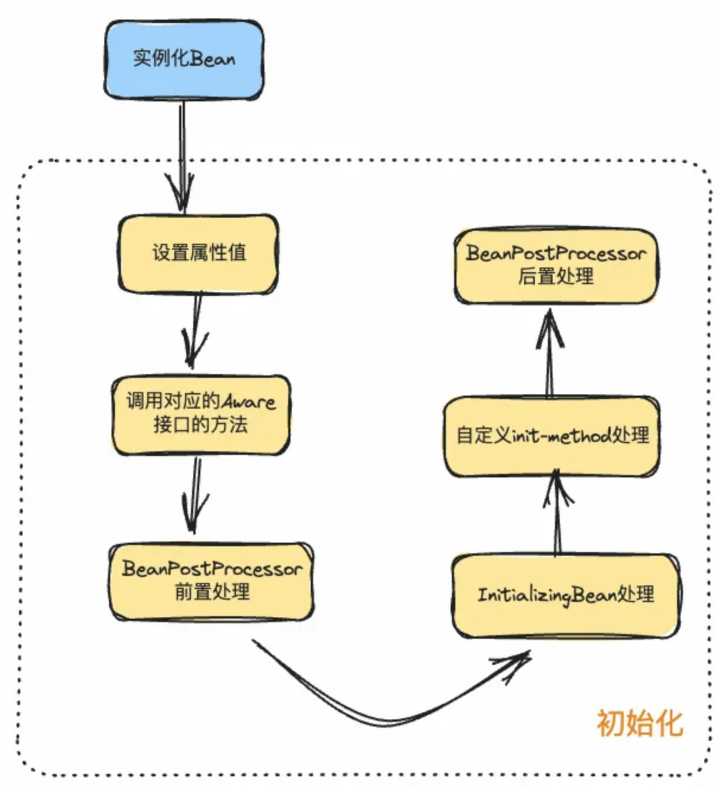
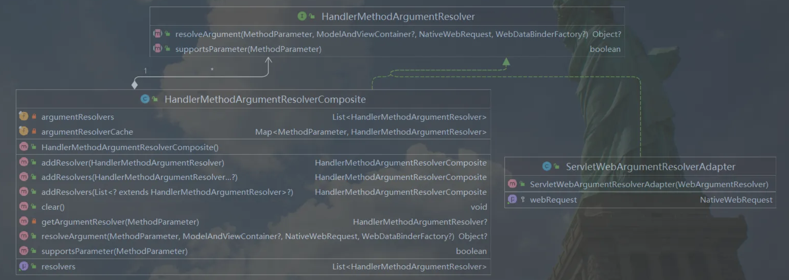
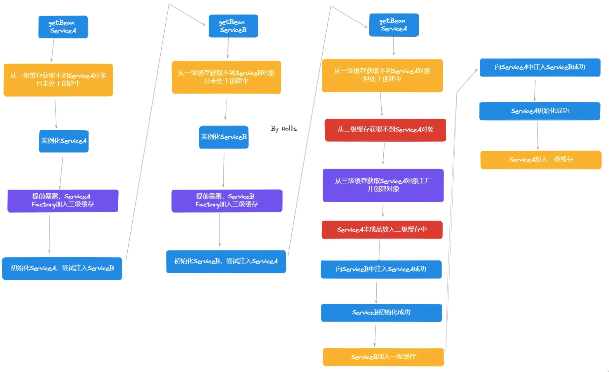
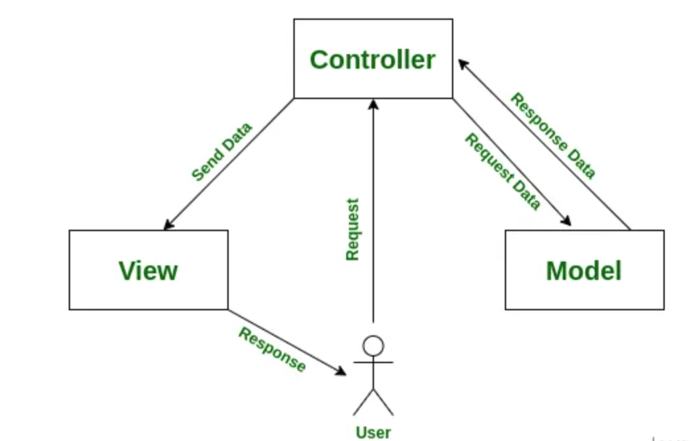
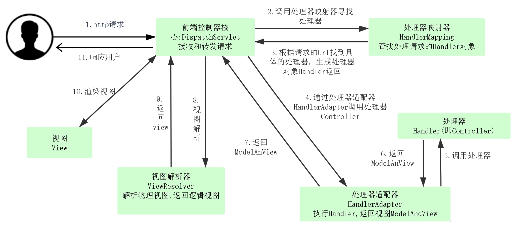
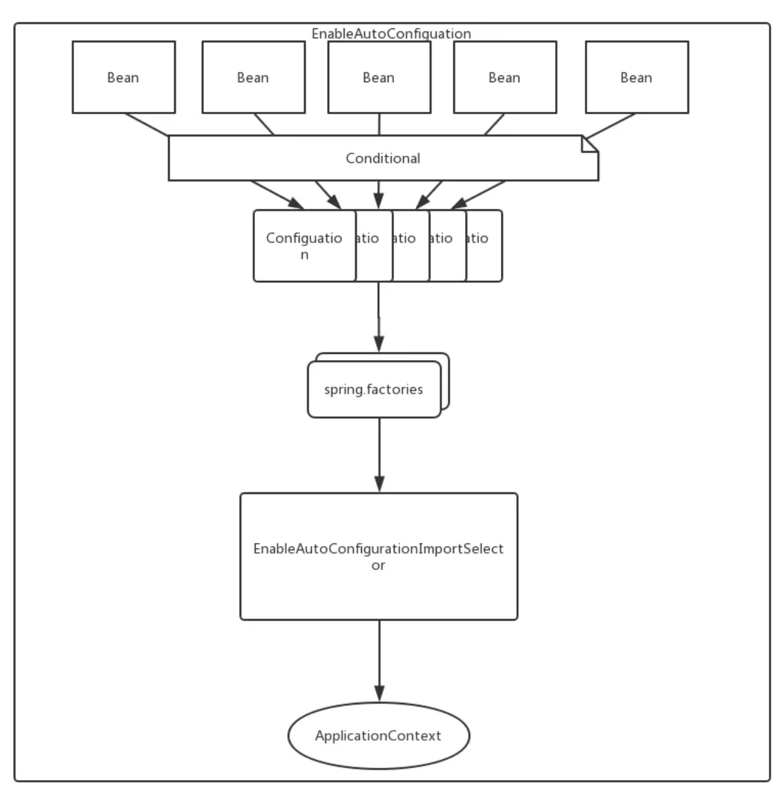
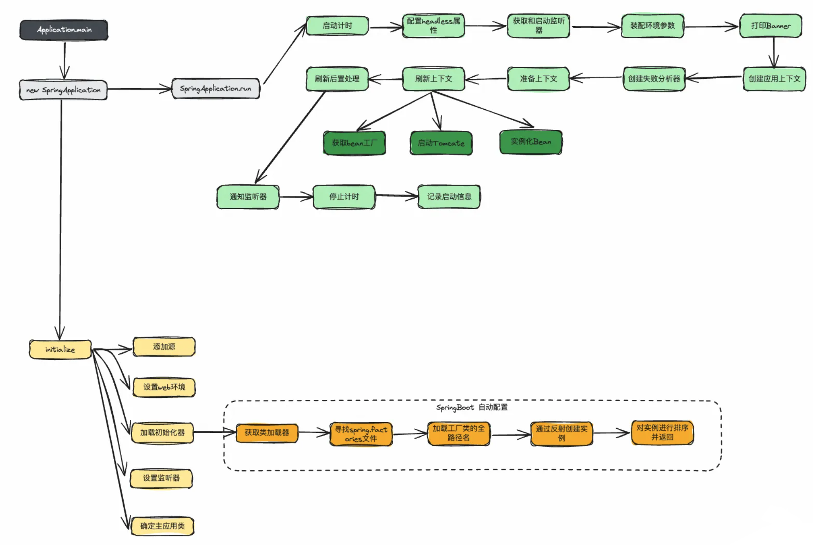

# 面试题-开源框架

## Spring

#### 介绍一下 Spring 的 IOC

IOC（inversion of control），就是控制反转的意思。

在传统的程序设计中，应用程序代码通常控制着对象的创建和管理。例如，一个对象需要依赖其他对象，那么它会直接 new 出来对象。这样的设计通常被称为 "控制流程"。

而在 IOC 中，控制关系发生了反转。控制权被转移到 Spring 容器中，容器负责创建和管理对象，并在需要的时候将它们注入到应用程序中。

**所以，原来这个对象的控制权在我们的代码中，我们自己 new 的对象，在 Spring 中，应用程序不再控制对象的创建，而是被动地接受由容器注入的对象。**

也就是说，**没有Spring的话，我们要使用的对象，需要我们自己创建，而有了Spring的IOC之后，对象由IOC容器创建并管理，我们只需要在想要使用的时候从容器中获取就行了**。

> 值得说明的是，IOC只是一种思想和理念，可以有不同的实现方式。

#### IOC 的优点

1. 使用者不用关心引用bean的实现细节，譬如对于 `B b = new A(c,d,e,f);` 来说，如果 B 要使用 A，那还要把 c，d，e，f 多个类全都感知一遍，这显然是非常麻烦且不合理的。
2. 不用创建多个相同的 bean 导致浪费。
3. Bean 的修改使用方无需感知。同样是上面的例子，假如说 BeanA 需要修改，如果没有 IOC 的话，所有引用到 A 的其他 bean 都需要感知这个逻辑，并且做对应的修改。但是如果使用了 IOC，其他 bean 就完全不用感知到。

#### 介绍一下 Spring 的 AOP

AOP(Aspect-Oriented Programming)，即面向切面编程，用人话说就是把公共的逻辑抽出来，让开发者可以更专注于业务逻辑开发。

和 IOC 一样，AOP 也指的是一种思想。AOP 思想是 OOP（Object-Oriented Programming）的补充。OOP是面向类和对象的，但是 AOP 则是面向不同切面的。一个切面可以横跨多个类和对象去操作，极大的丰富了开发者的使用方式，提高了开发效率。

譬如，一个订单的创建，可能需要以下步骤：

1. 权限校验
2. 事务管理
3. 创建订单
4. 日志打印

如果使用 AOP 思想，我们就可以把这四步当成四个“切面”，让业务人员专注开发第三个切面，其他三个切面则是基础的通用逻辑，统一交给 AOP 封装和管理。

#### AOP 是如何实现的？

从 Bean 的初始化流程中来讲，Spring 的 AOP 会在 bean 实例的实例化已完成，进行初始化后置处理时创建代理对象，即下面代码中的 `applyBeanPostProcessorsAfterInitialization` 部分。

```java
protected Object initializeBean(final String beanName, final Object bean, RootBeanDefinition mbd) {

    //...
    //检查Aware
    invokeAwareMethods(beanName, bean);
    
	//调用BeanPostProcessor的前置处理方法
    Object wrappedBean = bean;
    if (mbd == null || !mbd.isSynthetic()) {
        wrappedBean = applyBeanPostProcessorsBeforeInitialization(wrappedBean, beanName);
    }

    //调用InitializingBean的afterPropertiesSet方法或自定义的初始化方法及自定义init-method方法
    try {
        invokeInitMethods(beanName, wrappedBean, mbd);
    }
    catch (Throwable ex) {
        throw new BeanCreationException(
                (mbd != null ? mbd.getResourceDescription() : null),
                beanName, "Invocation of init method failed", ex);
    }
    //调用BeanPostProcessor的后置处理方法
    if (mbd == null || !mbd.isSynthetic()) {
        wrappedBean = applyBeanPostProcessorsAfterInitialization(wrappedBean, beanName);
    }
    return wrappedBean;
}
```

`applyBeanPostProcessorsAfterInitialization` 中会遍历所有 BeanPostProcessor，然后
调用其postProcessAfterInitialization方法，而AOP代理对象的创建就是在AbstractAutoProxyCreator这个类的 `postProcessAfterInitialization` 中：

```java
@Override
public Object postProcessAfterInitialization(Object bean, String beanName) throws BeansException {
    if (bean != null) {
        Object cacheKey = getCacheKey(bean.getClass(), beanName);
        if (this.earlyProxyReferences.remove(cacheKey) != bean) {
            return wrapIfNecessary(bean, beanName, cacheKey);
        }
    }
    return bean;
}
```

这里面最重要的就是 `wrapIfNecessary` 方法了：

```java
/**
 * 如果需要，对bean进行包装。
 *
 * @param bean 要包装的目标对象
 * @param beanName bean的名称
 * @param cacheKey 缓存键
 * @return 包装后的对象，可能是原始对象或代理对象
 */
protected Object wrapIfNecessary(Object bean, String beanName, Object cacheKey) {
    // 如果beanName不为null且在目标源bean集合中，则直接返回原始对象
    if (beanName != null && this.targetSourcedBeans.contains(beanName)) {
        return bean;
    }

    // 如果缓存键对应的值为Boolean.FALSE，则直接返回原始对象
    if (Boolean.FALSE.equals(this.advisedBeans.get(cacheKey))) {
        return bean;
    }

    // 如果bean的类型为基础设施类，或者应跳过该类型的代理，则将缓存键对应的值设置为Boolean.FALSE并返回原始对象
    if (isInfrastructureClass(bean.getClass()) || shouldSkip(bean.getClass(), beanName)) {
        this.advisedBeans.put(cacheKey, Boolean.FALSE);
        return bean;
    }

    // 如果存在advice，为bean创建代理对象
    Object[] specificInterceptors = getAdvicesAndAdvisorsForBean(bean.getClass(), beanName, null);
    if (specificInterceptors != DO_NOT_PROXY) {
        // 将缓存键对应的值设置为Boolean.TRUE
        this.advisedBeans.put(cacheKey, Boolean.TRUE);
        // 创建代理对象
        Object proxy = createProxy(
                bean.getClass(), beanName, specificInterceptors, new SingletonTargetSource(bean));
        // 将代理对象的类型与缓存键关联起来
        this.proxyTypes.put(cacheKey, proxy.getClass());
        return proxy;
    }

    // 如果没有advice，将缓存键对应的值设置为Boolean.FALSE并返回原始对象
    this.advisedBeans.put(cacheKey, Boolean.FALSE);
    return bean;
}
```

createProxy 的主要作用是根据给定的 bean 类、bean 名称、特定拦截器和目标源，创建代理对象：

```java
/**
 * 根据给定的bean类、bean名称、特定拦截器和目标源，创建代理对象。
 *
 * @param beanClass 要代理的目标对象的类
 * @param beanName bean的名称
 * @param specificInterceptors 特定的拦截器数组
 * @param targetSource 目标源
 * @return 创建的代理对象
 */
protected Object createProxy(
        Class<?> beanClass, String beanName, Object[] specificInterceptors, TargetSource targetSource) {

    // 如果beanFactory是ConfigurableListableBeanFactory的实例，将目标类暴露给它
    if (this.beanFactory instanceof ConfigurableListableBeanFactory) {
        AutoProxyUtils.exposeTargetClass((ConfigurableListableBeanFactory) this.beanFactory, beanName, beanClass);
    }

    // 创建ProxyFactory实例，并从当前代理创建器复制配置
    ProxyFactory proxyFactory = new ProxyFactory();
    proxyFactory.copyFrom(this);

    // 如果不强制使用CGLIB代理目标类，根据条件决定是否使用CGLIB代理
    if (!proxyFactory.isProxyTargetClass()) {
        if (shouldProxyTargetClass(beanClass, beanName)) {
            proxyFactory.setProxyTargetClass(true);
        } else {
            // 根据bean类评估代理接口
            evaluateProxyInterfaces(beanClass, proxyFactory);
        }
    }

    // 构建advisor数组
    Advisor[] advisors = buildAdvisors(beanName, specificInterceptors);
    // 将advisors添加到ProxyFactory中
    proxyFactory.addAdvisors(advisors);
    // 设置目标源
    proxyFactory.setTargetSource(targetSource);
    // 定制ProxyFactory
    customizeProxyFactory(proxyFactory);

    // 设置代理是否冻结
    proxyFactory.setFrozen(this.freezeProxy);
    // 如果advisors已经预过滤，则设置ProxyFactory为预过滤状态
    if (advisorsPreFiltered()) {
        proxyFactory.setPreFiltered(true);
    }

    // 获取代理对象，并使用指定的类加载器
    return proxyFactory.getProxy(getProxyClassLoader());
}
```

Spring AOP 是通过代理模式实现的，具体有两种实现方式，一种是基于 Java 原生的动态代理，一种是基于 cglib 的动态代理。对应到代码中就是，这里面的 Proxy 有两种实现，分别是 `CglibAopProxy` 和 `JdkDynamicAopProxy`。

> Spring AOP 默认使用标准的JDK动态代理进行 AOP 代理。这使得任何接口可以被代理。但是JDK动态代理有一个缺点，就是它不能代理没有接口的类。
>
> 所以 Spring AOP 就使用 CGLIB 代理没有接口的类。

#### 为什么 Spring 不建议使用字段的依赖注入？

- 单一职责问题

我们都知道，根据 SOLID 设计原则来讲，一个类的设计应该符合单一职责原则，就是一个类只能做一件功能，当我们使用基于字段注入的时候，随着业务的暴增，字段越来越多，我们是很难发现我们已经默默中违背了单一职责原则的。

但是如果我们使用基于构造器注入的方式，因为构造器注入的写法比较臃肿，所以它就在间接提醒我们，违背了单一职责原则，该做重构了。

- 防止 NPE

对于一个 bean 来说，它的初始化顺序为：

`静态变量或静态语句块 -> 实例变量或初始化语句块 -> 构造方法 -> @Autowired`

所以，在静态语句块，初始化语句块，构造方法中使用 Autowired 标记的字段，都会引起 NPE 问题。

用构造器的 DI，就会实例化对象，在使用的过程中，字段一定不为空。

- 不利于测试

使用了 Autowired 注解，说明这个类依赖了 Spring 容器，这让我们在进行 UT 的时候必须要启动一个 Spring 容器才可以测试这个类，显然太麻烦，这种测试方式非常重，对于大型项目来说，往往启动一个容器就要好几分钟，这样非常耽误时间。

不过，如果使用构造器的依赖注入就不会有这种问题，或者，我们可以使用 Resource 注解也可以解决上述问题

> 使用构造器注入可能有哪些？
>
> 我们两个 bean 循环依赖的话，构造器注入就会抛出异常。
>
> 如果两个类彼此循环引用，那说明代码的设计一定是有问题的。如果临时解决不了，我们可以在某一个构造器中加入@Lazy注解，让一个类延迟初始化即可。

#### Spring Bean 的初始化过程是怎么样的？



在Spring框架中，初始化和实例化是两个不同的概念。

**实例化（Instantiation）：**

- 实例化是创建对象的过程。在 Spring 中，这通常指的是通过调用类的构造器来创建 Bean 的实例。这是对象生命周期的开始阶段。对应 doCreateBean 中的 createBeanInstance 方法。
- 初始化（Initialization）：初始化是在 Bean 实例创建后，进行一些设置或准备工作的过程。在 Spring 中，包括设置 Bean 的属性，调用各种前置 & 后置处理器。对应 doCreateBean 中的 populateBean 和 initializeBean 方法。

**下面是 SpringBean 的实例化 + 初始化的完整过程：**

> Spring 容器在这一步创建 Bean 实例。
>
> 其主要代码在 AbstractAutowireCapableBeanFactory 类中的 createBeanInstance 方法中实现：
>
> 其实就是先确保这个Bean对应的类已经被加载，然后确保它是public的，然后如果有工厂方法，则直接调用工厂方法创建一本 Bean，如果没有的话就调用它的构造方法来创建这个 Bean。

```java
protected BeanWrapper createBeanInstance(String beanName, RootBeanDefinition mbd, Object[] args) {
    // 解析Bean的类，确保Bean的类在这个点已经被确定
    Class<?> beanClass = resolveBeanClass(mbd, beanName);

    // 检查Bean的访问权限，确保非public类允许访问
    if (beanClass != null && !Modifier.isPublic(beanClass.getModifiers()) && !mbd.isNonPublicAccessAllowed()) {
        throw new BeanCreationException(mbd.getResourceDescription(), beanName,
                "Bean class isn't public, and non-public access not allowed: " + beanClass.getName());
    }

    // 如果Bean定义中指定了工厂方法，则通过工厂方法创建Bean实例
    if (mbd.getFactoryMethodName() != null) {
        return instantiateUsingFactoryMethod(beanName, mbd, args);
    }

    // 当重新创建相同的Bean时的快捷路径
    boolean resolved = false;
    boolean autowireNecessary = false;
    if (args == null) {
        synchronized (mbd.constructorArgumentLock) {
            // 如果构造方法或工厂方法已经被解析，直接使用解析结果
            if (mbd.resolvedConstructorOrFactoryMethod != null) {
                resolved = true;
                autowireNecessary = mbd.constructorArgumentsResolved;
            }
        }
    }
    if (resolved) {
        // 如果需要自动装配构造函数参数，则调用相应方法进行处理
        if (autowireNecessary) {
            return autowireConstructor(beanName, mbd, null, null);
        }
        else {
            // 否则使用无参构造函数或默认构造方法创建实例
            return instantiateBean(beanName, mbd);
        }
    }

    // 通过BeanPostProcessors确定构造函数候选
    Constructor<?>[] ctors = determineConstructorsFromBeanPostProcessors(beanClass, beanName);
    // 如果有合适的构造函数或需要通过构造函数自动装配，则使用相应的构造函数创建实例
    if (ctors != null || mbd.getResolvedAutowireMode() == AUTOWIRE_CONSTRUCTOR ||
            mbd.hasConstructorArgumentValues() || !ObjectUtils.isEmpty(args)) {
        return autowireConstructor(beanName, mbd, ctors, args);
    }

    // 没有特殊处理，使用默认的无参构造函数创建Bean实例
    return instantiateBean(beanName, mbd);
}
```

> 这里需要注意的是，在 Spring 的完整 Bean 创建和初始化流程中，容器会在调用 createBeanInstance 之前检查 Bean 定义的作用域。如果是 Singleton，容器会在其内部单例缓存中查找现有实例。如果实例已存在，它将被重用；如果不存在，才会调用 createBeanInstance 来创建新的实例。

```java
BeanWrapper instanceWrapper = null;
if (mbd.isSingleton()) {
    instanceWrapper = this.factoryBeanInstanceCache.remove(beanName);
}
if (instanceWrapper == null) {
    instanceWrapper = createBeanInstance(beanName, mbd, args);
}
```

> 下一步就应该要到设置属性值了，但是在这之前还有一个重要的东西要讲，那就是三级缓存解决循环依赖，在 `doCreateBean` 方法中：

```java
    protected Object doCreateBean(final String beanName, final RootBeanDefinition mbd, final Object[] args)
			throws BeanCreationException {

		// 实例化bean
		// ...

        // Eagerly cache singletons to be able to resolve circular references
		// even when triggered by lifecycle interfaces like BeanFactoryAware.
		boolean earlySingletonExposure = (mbd.isSingleton() && this.allowCircularReferences &&
				isSingletonCurrentlyInCreation(beanName));
		if (earlySingletonExposure) {
			if (logger.isDebugEnabled()) {
				logger.debug("Eagerly caching bean '" + beanName +
						"' to allow for resolving potential circular references");
			}
			addSingletonFactory(beanName, new ObjectFactory<Object>() {
				@Override
				public Object getObject() throws BeansException {
					return getEarlyBeanReference(beanName, mbd, bean);
				}
			});
		}

        // ...

		
        //设置属性值
		//初始化Bean

    	// ...

		// 注册Bean的销毁回调

		return exposedObject;
	}
```

**设置属性值**

> populateBean 方法是 Spring Bean 生命周期中的一个关键部分，负责将属性值应用到新创建的 Bean 实例。它处理了自动装配、属性注入、依赖检查等多个方面。代码如下：

```java
protected void populateBean(String beanName, RootBeanDefinition mbd, BeanWrapper bw) {
    // 获取Bean定义中的属性值
    PropertyValues pvs = mbd.getPropertyValues();

    // 如果BeanWrapper为空，则无法设置属性值
    if (bw == null) {
        if (!pvs.isEmpty()) {
            throw new BeanCreationException(
                    mbd.getResourceDescription(), beanName, "Cannot apply property values to null instance");
        }
        else {
            // 对于null实例，跳过设置属性阶段
            return;
        }
    }

    // 在设置属性之前，给InstantiationAwareBeanPostProcessors机会修改Bean状态
    // 这可以用于支持字段注入等样式
    boolean continueWithPropertyPopulation = true;

    // 如果Bean不是合成的，并且存在InstantiationAwareBeanPostProcessor，执行后续处理
    if (!mbd.isSynthetic() && hasInstantiationAwareBeanPostProcessors()) {
        for (BeanPostProcessor bp : getBeanPostProcessors()) {
            if (bp instanceof InstantiationAwareBeanPostProcessor) {
                InstantiationAwareBeanPostProcessor ibp = (InstantiationAwareBeanPostProcessor) bp;
                if (!ibp.postProcessAfterInstantiation(bw.getWrappedInstance(), beanName)) {
                    continueWithPropertyPopulation = false;
                    break;
                }
            }
        }
    }

    // 如果上述处理后决定不继续，则返回
    if (!continueWithPropertyPopulation) {
        return;
    }

    // 根据自动装配模式（按名称或类型），设置相关的属性值
    if (mbd.getResolvedAutowireMode() == RootBeanDefinition.AUTOWIRE_BY_NAME ||
            mbd.getResolvedAutowireMode() == RootBeanDefinition.AUTOWIRE_BY_TYPE) {
        MutablePropertyValues newPvs = new MutablePropertyValues(pvs);

        // 如果是按名称自动装配，添加相应的属性值
        if (mbd.getResolvedAutowireMode() == RootBeanDefinition.AUTOWIRE_BY_NAME) {
            autowireByName(beanName, mbd, bw, newPvs);
        }

        // 如果是按类型自动装配，添加相应的属性值
        if (mbd.getResolvedAutowireMode() == RootBeanDefinition.AUTOWIRE_BY_TYPE) {
            autowireByType(beanName, mbd, bw, newPvs);
        }

        pvs = newPvs;
    }

    // 检查是否需要进行依赖性检查
    boolean hasInstAwareBpps = hasInstantiationAwareBeanPostProcessors();
    boolean needsDepCheck = (mbd.getDependencyCheck() != RootBeanDefinition.DEPENDENCY_CHECK_NONE);

    // 如果需要，则进行依赖性检查
    if (hasInstAwareBpps || needsDepCheck) {
        PropertyDescriptor[] filteredPds = filterPropertyDescriptorsForDependencyCheck(bw, mbd.allowCaching);
        if (hasInstAwareBpps) {
            for (BeanPostProcessor bp : getBeanPostProcessors()) {
                if (bp instanceof InstantiationAwareBeanPostProcessor) {
                    InstantiationAwareBeanPostProcessor ibp = (InstantiationAwareBeanPostProcessor) bp;
                    pvs = ibp.postProcessPropertyValues(pvs, filteredPds, bw.getWrappedInstance(), beanName);
                    if (pvs == null) {
                        return;
                    }
                }
            }
        }
        if (needsDepCheck) {
            checkDependencies(beanName, mbd, filteredPds, pvs);
        }
    }

    // 应用属性值
    applyPropertyValues(beanName, mbd, bw, pvs);
}
```

**initializeBean 方法**

```java
protected Object initializeBean(final String beanName, final Object bean, RootBeanDefinition mbd) {

    //...
    //检查Aware
    invokeAwareMethods(beanName, bean);
    
	//调用BeanPostProcessor的前置处理方法
    Object wrappedBean = bean;
    if (mbd == null || !mbd.isSynthetic()) {
        wrappedBean = applyBeanPostProcessorsBeforeInitialization(wrappedBean, beanName);
    }

    //调用InitializingBean的afterPropertiesSet方法或自定义的初始化方法及自定义init-method方法
    try {
        invokeInitMethods(beanName, wrappedBean, mbd);
    }
    catch (Throwable ex) {
        throw new BeanCreationException(
                (mbd != null ? mbd.getResourceDescription() : null),
                beanName, "Invocation of init method failed", ex);
    }
    //调用BeanPostProcessor的后置处理方法
    if (mbd == null || !mbd.isSynthetic()) {
        wrappedBean = applyBeanPostProcessorsAfterInitialization(wrappedBean, beanName);
    }
    return wrappedBean;
}
```

**检查 Aware**

> 就是检查这个 Bean 是不是实现了 BeanNameAware、BeanClassLoaderAware 等这些 Aware 接口，Spring 容器会调用它们的方法进行处理。

```java
private void invokeAwareMethods(final String beanName, final Object bean) {
    if (bean instanceof Aware) {
        if (bean instanceof BeanNameAware) {
            ((BeanNameAware) bean).setBeanName(beanName);
        }
        if (bean instanceof BeanClassLoaderAware) {
            ((BeanClassLoaderAware) bean).setBeanClassLoader(getBeanClassLoader());
        }
        if (bean instanceof BeanFactoryAware) {
            ((BeanFactoryAware) bean).setBeanFactory(AbstractAutowireCapableBeanFactory.this);
        }
    }
}
```

这些 Aware 接口提供了一种机制，使得 Bean 可以与 Spring 框架的内部组件交互，从而更灵活地利用 Spring 框架提供的功能。

- BeanNameAware: 通过这个接口，Bean 可以获取到自己在 Spring 容器中的名字。这对于需要根据 Bean 的名称进行某些操作的场景很有用。
- BeanClassLoaderAware: 这个接口使Bean能够访问加载它的类加载器。这在需要进行类加载操作时特别有用，例如动态加载类。
- BeanFactoryAware：通过这个接口可以获取对 BeanFactory 的引用，获得对 BeanFactory 的访问权限

**调用 BeanPostProcessor 的前置处理方法**

> BeanPostProcessor 是 Spring IOC 容器给我们提供的一个扩展接口，他的主要作用主要是帮我们在 Bean 的初始化前后添加一些自己的逻辑处理，Spring 内置了很多 BeanPostProcessor，我们也可以定义一个或者多个 BeanPostProcessor 接口的实现，然后注册到容器中。

调用 BeanPostProcessor 的前置处理方法是在 applyBeanPostProcessorsBeforeInitialization 这个方法中实现的，代码如下：

```java
@Override
public Object applyBeanPostProcessorsBeforeInitialization(Object existingBean, String beanName)
        throws BeansException {

    Object result = existingBean;
    for (BeanPostProcessor processor : getBeanPostProcessors()) {
        result = processor.postProcessBeforeInitialization(result, beanName);
        if (result == null) {
            return result;
        }
    }
    return result;
}
```

其实就是遍历所有的 `BeanPostProcessor` 的实现，执行他的 `postProcessBeforeInitialization` 方法。

**调用 InitializingBean 的 afterPropertiesSet 方法或自定义的初始化方法**

**调用 BeanPostProcessor 的后置处理方法**

> 这里面需要我们关注的就是 `AnnotationAwareAspectJAutoProxyCreator`，它继承自 `AspectJAwareAdvisorAutoProxyCreator`），他们也是`BeanPostProcessor`的实现，他之所以重要，是因为在他的 `postProcessAfterInitialization` 后置处理方法。

```java
/**
 * Create a proxy with the configured interceptors if the bean is
 * identified as one to proxy by the subclass.
 * @see #getAdvicesAndAdvisorsForBean
 */
@Override
public Object postProcessAfterInitialization(Object bean, String beanName) throws BeansException {
    if (bean != null) {
        Object cacheKey = getCacheKey(bean.getClass(), beanName);
        if (this.earlyProxyReferences.remove(cacheKey) != bean) {
            return wrapIfNecessary(bean, beanName, cacheKey);
        }
    }
    return bean;
}
```

在这里完成AOP的代理的创建。

#### Spring 6.0 和 Spring 3.0 有什么新特性？

- 基于 JDK17
- AOT 编译

Ahead-Of-Time，即预先编译，这是相对于我们熟知的Just-In-Time（JIT，即时编译）来说的。相比于JIT编译，AOT指的是在程序运行前编译，这样就可以避免在运行时的编译性能消耗和内存消耗，可以在程序运行初期就达到最高性能、也可以显著的加快程序的启动。

AOT 的引l入，意味着 Spring 生态正式引I入了提前编译技术，相比于JIT编译，AOT 有助于优化 Spring 框架启动慢、占用内存多、以及垃圾无法被回收等问题。

- Spring Navitve

在 Spring 的新版本中引入了 Spring Native。有了Spring Native，Spring 可以不再依赖 Java 虚拟机，而是基于 GraalVM 将 Spring 应用程序编译成原生镜像(native image），提供了一种新的方式来部署 Spring 应用。这种部署 Spring 的方式是云原生友好的。

Spring Native 的优点是编译出来的原生 Spring 应用可以作为一个独立的可执行文件进行部署，而不需要安装 JVM，而且启动时间非常短、并且有更少的资源消耗。他的缺点就是构建时长要比 JVM更 长一些。

#### Auwowired 和 Resources 的关系

**相同点**

都可以将 bean 注入到对应的 field 中

**不同点**

- byName 和 byTyp 匹配顺序不同。

Autowired 在获取 bean 的时候，先是byType的方式，再是byName的方式。意思就是先在Spring容器中找以 Bean 为类型的Bean 实例，如果找不到或者找到多个 bean，则会通过 fieldName 来找。

Resource 在获取 bean 的时候，和 Autowired 恰好相反，先是 byName 方式，然后再是 byType 方式。当然，我们也可以通过注解中的参数显示指定通过哪种方式。

- 作用域不同

Autowired 可以作用在构造器，字段，setter 方法上；Resource 只可以使用在 field，setter 方法上。

- 支持方不同

Autowired 是 Spring提供的自动注入注解，只有 Spring 容器会支持，如果做容器迁移，是需要修改代码的；Resource 是 JDK 官方提供的自动注入注解（JSR-250）。它等于说是一个标准或者约定，所有的 IOC 容器都会支持这个注解。假如系统容器从 Spring 迁移到其他 IOC 容器中，是不需要修改代码的。

#### BeanFactory 和 FactoryBean 的关系

FactoryBean

```java
package org.springframework.beans.factory;

public interface FactoryBean<T> {

  T getObject() throws Exception;
  
  Class<?> getObjectType();
  
  boolean isSingleton();
}
```

> FactoryBean 是创建 Bean 的一种方式，帮助实现复杂的初始化逻辑。FactoryBean 有一个 getObject() 方法，可以自定义实例如何创建。使用 getBean(name) 获取 FactoryBean 实例需要添加前缀 “&”。
>
> 通过 FactoryBean 还可以延迟对象的实例化时间。
>
> FactoryBean 通常用于创建很复杂的对象，比如需要通过某种特定的创建过程才能得到的对象。例如，创建与 JNDI 资源的连接或与代理对象的创建。就如我们的 Dubbo 中的 ReferenceBean。

BeanFactory

```java
package org.springframework.beans.factory;

public interface BeanFactory {
	Object getBean(String name) throws BeansException;

  <T> T getBean(String name, Class<T> requiredType) throws BeansException;

  Object getBean(String name, Object... args) throws BeansException;

  <T> T getBean(Class<T> requiredType) throws BeansException;

  <T> T getBean(Class<T> requiredType, Object... args) throws BeansException;

  boolean containsBean(String name);

  boolean isSingleton(String name) throws NoSuchBeanDefinitionException;

  boolean isPrototype(String name) throws NoSuchBeanDefinitionException;

  // ...
}
```

> BeanFactory 是整个 Spring IoC 容器的一部分，负责管理 Bean 的创建和生命周期。

#### Spring 在业务中常见的使用方式

- 通过 IOC 实现策略模式
- 通过 AOP 实现拦截
  - 参数校验
  - 缓存逻辑
  - 日志打印
- 通过 Event 异步解耦
- 通过 Spring 事务管理

#### Spring 中如何开启事务？

**编程式事务**

基于底层的 API，如 `PlatformTransactionManager`、`TransactionDefinition` 和 `TransactionTemplate` 等核心接口，开发者完全可以通过编程的方式来进行事务管理。

```java
public void test() {
      TransactionDefinition def = new DefaultTransactionDefinition();
      TransactionStatus status = transactionManager.getTransaction(def);

       try {
         // 事务操作
         // 事务提交
         transactionManager.commit(status);
      } catch (DataAccessException e) {
         // 事务回滚
         transactionManager.rollback(status);
         throw e;
      }
}
```

当然，我们也可以使用 Spring 中提供的 `TransactionTemplate` 来实现编程式事务。

```java
    @Autowired
    protected TransactionTemplate transactionTemplate;

  	public void test(){
        return transactionTemplate.execute(transactionStatus -> {
           //事务操作
        });
    }

	public void test1(){
        transactionTemplate.execute(new TransactionCallbackWithoutResult() {
            @Override
            protected void doInTransactionWithoutResult(TransactionStatus transactionStatus) {
              
            }
        });
    }
```

**声明式事务**

声明式事务管理方法允许开发者配置的帮助下来管理事务，而不需要依赖底层 API 进行硬编码。开发者可以只使用注解或基于配置的 XML 来管理事务。

```java
@Transactional
public void test() {
     // 事务操作  
}
```

如上，使用@Transactional即可给test方法增加事务控制。

#### 声明式事务的优缺点

- 最小粒度为方法

首先，声明式事务有一个局限，那就是他的**最小粒度要作用在方法上**。

也就是说，如果想要给一部分代码块增加事务的话，那就需要把这个部分代码块单独独立出来作为一个方法。

所以不建议过度使用声明式事务。

- 容易被忽略

因为声明式事务是通过注解的，有些时候还可以通过配置实现，这就会导致一个问题，那就是这个事务有可能被开发者忽略。

首先，如果开发者没有注意到一个方法是被事务嵌套的，那么就可能会再方法中加入一些如RPC远程调用、消息发送、缓存更新、文件写入等操作。

> 首先，如果开发者没有注意到一个方法是被事务嵌套的，那么就可能会再方法中加入一些如 RPC 远程调用、消息发送、缓存更新、文件写入等操作。
>
> 我们知道，这些操作如果被包在事务中，有两个问题：
>
> 1、这些操作自身是无法回滚的，这就会导致数据的不一致。可能 RPC 调用成功了，但是本地事务回滚了，可是 RPC 调用无法回滚了。
>
> 2、在事务中有远程调用，就会拉长整个事务。那么就会导致本事务的数据库连接一直被占用，那么如果类似操作过多，就会导致数据库连接池耗尽。
>
> 有些时候，即使没有在事务中进行远程操作，但是有些人还是可能会不经意的进行一些内存操作，如运算。或者如果遇到分库分表的情况，有可能不经意间进行跨库操作。

- 声明式事务使用不正确容易失效
  - `@Transactional` 应用在非 public 修饰的方法上 
  - `@Transactional` 注解属性 propagation 设置错误 
  - `@Transactional` 注解属性 rollbackFor 设置错误 
  - 同一个类中方法调用，导致 `@Transactional` 失效
  - 异常被catch捕获导致 `@Transactional` 失效
  - 数据库引擎不支持事务

#### Spring 事务失效可能是哪些问题？

- @Transactional 应用在非 public 修饰的方法上

private 方法，只会在当前对象中的其他方法中调用，也就是会进行对象的自调用，这种情况是用 this 调用的，并不会走到代理对象，而 `@Transactional` 是基于动态代理实现的，所以代理会失效。

- 同一个类中方法调用，导致 `@Transactional` 失效

和 private 是一回事，因为没办法走到代理服务，所以事务会失效。

- final、static 方法

由于 AOP 是通过创建代理对象来实现的，而无法对 final 方法进行子类化和覆盖，所以无法拦截这些方法。

还有就是调用 static 方法，因为这类方法是属于这个类的，并不是对象的，所以无法被 AOP。

- `@Transactional` 用的不对

`@Transactional` 注解属性 propagation 设置错误。

`@Transactional` 注解属性 rollbackFor 设置错误。

用错注解（同名注解）。

- 异常被 catch 捕获导致 `@Transactional` 失效

```java
public class MyService {
		@Transactional
    public void doSomething() {
      	try{
					doInternal(); 
        }catch(Exception e){
        	logger.error(e);
        }
    }
}
```

因为异常被捕获，所以就没办法基于异常进行 rollback 了，所以事务会失效。

- 数据库引擎不支持事务

比如 myisam，不支持的肯定就不行了。

#### Spring 的事务传播机制有哪些？

Spring 的事务传播机制用于控制在多个事务方法相互调用时事务的行为。

在复杂的业务场景中，多个事务方法之间的调用可能会导致事务的不一致，如出现数据丢失、重复提交等问题，使用事务传播机制可以避免这些问题的发生，保证事务的一致性和完整性。

Spring 的事务规定了7种事务的传播级别，默认的传播机制是 REQUIRED

- REQUIRED，如果不存在事务则开启一个事务，如果存在事务则加入之前的事务，总是只有一个事务在执行
- REQUIRES_NEW，每次执行新开一个事务
- SUPPORTS，有事务则加入事务，没有事务则普通执行
- NOT_SUPPORTED，有事务则暂停该事务，没有则普通执行
- MANDATORY，强制有事务，没有事务则报异常
- NEVER，有事务则报异常
- NESTED，如果之前有事务，则创建嵌套事务，嵌套事务回滚不影响父事务，反之父事务影响嵌套事务

> 在一个事务方法中，如果发生了 rollbackFor 属性指定的异常或其子类异常，则事务会回滚。如果不指定 rollbackFor，则默认情况下只有 RuntimeException 和 Error 会触发事务回滚。

**场景题**

> 问：一个长的事务方法 a，在读写分离的情况下，里面既有读库操作，也有写库操作，再调用个读库方法 b，方法 b 该用什么传播机制呢？

这种情况，读方法如果是最后一步，直接 not_supported 就行了，避免读报错导致数据回滚。如果是中间步骤，最好还是要 required，因为异常失败需要回滚一下。

#### Spring 中用到了哪些设计模式？

- **工厂模式**

Spring 的 IOC 就是一个非常好的工厂模式的例子。Spring IOC 容器就像是一个工厂一样，当我们需要创建一个对象的时候，只需要配置好配置文件/注解即可，完全不用考虑对象是如何被创建出来的。 IOC 容器负责创建对象，将对象连接在一起，配置这些对象，并从创建中处理这些对象的整个生命周期，直到它们被完全销毁。

- **适配器模式**

适配器模式简而言之就是上游为了适应下游，而要做一些适配，承担适配工作的模块，就叫做适配器。

常见的场景是甲方因为话语权很高，提供了一套交互模型，而所有对接甲方模型的乙方，就需要通过适配器模式来适配甲方的模型和自己已有的系统。

在 SpringMVC 中，`HandlerAdapter` 就是典型的适配器模式。参考其注释我们可以发现：

> MVC framework SPI, allowing parameterization of the core MVC workflow.
> Interface that must be implemented for each handler type to handle a request. This interface is used to allow the DispatcherServlet to be indefinitely extensible. The DispatcherServlet accesses all installed handlers through this interface, meaning that it does not contain code specific to any handler type.
> 必须为每个处理程序类型实现的接口，以处理请求。此接口用于允许 DispatcherServlet 无限期扩展。DispatcherServlet 通过此接口访问所有已安装的处理程序，这意味着它不包含特定于任何处理程序类型的代码。

对于`DispatcherServlet`来说，`HandlerAdapter`是核心的业务逻辑处理流程，`DispatcherServlet`只负责调用`HandlerAdapter#handle` 方法即可。至于当前Http的请求该如何处理，则交给`HandlerAdapter`的实现方负责。换句话说，`HandlerAdapter` 只是定义了和 `DispatcherServlet` 交互的标准，帮助不同的实现适配了 `DispatcherServlet` 而已。
譬如，用于 `Controller` 注解解析和 url 映射的逻辑就是通过 `RequestMappingHandlerAdapter` 实现的。

```java
protected void doDispatch(HttpServletRequest request, HttpServletResponse response) throws Exception {
    

    try {
        ModelAndView mv = null;
        Exception dispatchException = null;

        try {

            // Determine handler for the current request.
            mappedHandler = getHandler(processedRequest);

            // Determine handler adapter for the current request.
            HandlerAdapter ha = getHandlerAdapter(mappedHandler.getHandler());

            // Process last-modified header, if supported by the handler.
            String method = request.getMethod();

            if (!mappedHandler.applyPreHandle(processedRequest, response)) {
                return;
            }

            // Actually invoke the handler. 【重要】
            mv = ha.handle(processedRequest, response, mappedHandler.getHandler());

        }
        catch (Exception ex) {
            dispatchException = ex;
        }
        catch (Throwable err) {
            // As of 4.3, we're processing Errors thrown from handler methods as well,
            // making them available for @ExceptionHandler methods and other scenarios.
            dispatchException = new NestedServletException("Handler dispatch failed", err);
        }
        processDispatchResult(processedRequest, response, mappedHandler, mv, dispatchException);
    }
    catch (Exception ex) {
    }
    finally {
    }
}
```

- **代理模式**

代理模式和适配器模式的核心区别就在于，适配器模式的目的是为了适配不同的场景，而代理模式的目的则是 `enhance`，即增强被代理的类（如增加日志打印功能等）。

- **单例模式**

单例模式是 Spring 一个非常核心的功能，Spring 中的 bean 默认都是单例的，这样可以尽最大程度保证对象的复用和线程安全。

> Spring Bean 也不止是单例的，还有其他作用域，如下：
> ● prototype : 每次获取都会创建一个新的 bean 实例。也就是说，连续 getBean() 两次，得到的是不同的 Bean 实例。
> ● request （仅 Web 应用可用）: 每一次 HTTP 请求都会产生一个新的 bean（请求 bean），该 bean 仅在当前 HTTP request 内有效。
> ● session （仅 Web 应用可用） : 每一次来自新 session 的 HTTP 请求都会产生一个新的 bean（会话 bean），该 bean 仅在当前 HTTP session 内有效。
> ● global-session （仅 Web 应用可用）：每个 Web 应用在启动时创建一个 Bean（应用 Bean），该 bean 仅在当前应用启动时间内有效。
> ● websocket （仅 Web 应用可用）：每一次 WebSocket 会话产生一个新的 bean。

- **观察者模式**
- **模板方法模式**

如果使用过 Spring 的事务管理，相信一定对 `TransactionTemplate `这个类不陌生，而且顾名思义，这个也是用到了模板方法。它把事务操作按照 3 个固定步骤来写：

1. 执行业务逻辑
2. 如果异常则回滚事务
3. 否则提交事务

```java
public <T> T execute(TransactionCallback<T> action) throws TransactionException {

    TransactionStatus status = this.transactionManager.getTransaction(this);
    T result;
    try {
        // 1. 步骤一，执行事务逻辑
        result = action.doInTransaction(status);
    }
    catch (RuntimeException | Error ex) {
        // Transactional code threw application exception -> rollback
        rollbackOnException(status, ex);
        throw ex;
    }
    catch (Throwable ex) {
        // Transactional code threw unexpected exception -> rollback
        rollbackOnException(status, ex);
        throw new UndeclaredThrowableException(ex, "TransactionCallback threw undeclared checked exception");
    }
    // 2. 步骤三，提交事务
    this.transactionManager.commit(status);
    return result;
    
}
```

- **责任链模式**

对于SpringMVC来说，他会通过一系列的拦截器来处理请求执行前，执行后，以及结束的response，核心的类是`handlerExecutionChain`，它封装了 `HandlerAdapter` 和一系列的过滤器。
对于执行前的处理来说，`DispatherServlet` 会先通过 `handlerExecutionChain` 获取所有的 `HandlerInterceptor`，然后再执行处理逻辑，如下代码所示：

```java
protected void doDispatch(HttpServletRequest request, HttpServletResponse response) throws Exception {
    try {

        try {

            // Process last-modified header, if supported by the handler.
            String method = request.getMethod();
        	// 执行预处理
            if (!mappedHandler.applyPreHandle(processedRequest, response)) {
                return;
            }

        }
        processDispatchResult(processedRequest, response, mappedHandler, mv, dispatchException);
    }
    catch (Exception ex) {
    }
    finally {
    }
}
```

handlerExecutionChain

```java
boolean applyPreHandle(HttpServletRequest request, HttpServletResponse response) throws Exception {
    HandlerInterceptor[] interceptors = getInterceptors();
    if (!ObjectUtils.isEmpty(interceptors)) {
        for (int i = 0; i < interceptors.length; i++) {
            HandlerInterceptor interceptor = interceptors[i];
            if (!interceptor.preHandle(request, response, this.handler)) {
                triggerAfterCompletion(request, response, null);
                return false;
            }
            this.interceptorIndex = i;
        }
    }
    return true;
}
```

- **组合模式**
  - 组合模式在 SpringMVC 中用的非常多，其中的参数解析，响应值处理等模块就是使用了组合模式。



可以发现，整体的参数解析模块中，由一个接口 `HandlerMethodArgumentResolver` 负责。其中父节点会实现该接口，同时对所有的具体的子接口进行聚合。
其实这个里面不止用了组合模式，接口还提供了 `#supportsParamerter` 方法，去判断是否执行该 `resolver`，这也是策略模式的一种。

#### 什么是 Spring 的循环依赖问题？

在 Spring 框架中，循环依赖是指两个或多个 bean 之间相互依赖，形成了一个循环引用的情况。如果不加以处理，这种情况会导致应用程序启动失败。

> 在 Spring 中，解决循环依赖的方式就是引入了三级缓存。
>
> 但是，Spring 解决循环依赖是有一定限制的：
>
> - 首先就是要求互相依赖的 Bean 必须要是单例的 Bean
> - 另外就是依赖注入的方式不能都是构造函数注入的方式

**为什么只支持单例**

Spring 循环依赖的解决方案主要是通过对象的提前暴露来实现的。当一个对象在创建过程中需要引用到另一个正在创建的对象时，Spring 会先提前暴露一个尚未完全初始化的对象实例，以解决循环依赖的问题。这个尚未完全初始化的对象实例就是半成品对象。

在 Spring 容器中，单例对象的创建和初始化只会发生一次，并且在容器启动时就完成了。这意味着，在容器运行期间，单例对象的依赖关系不会发生变化。因此，可以通过提前暴露半成品对象的方式来解决循环依赖的问题。

相比之下，原型对象的创建和初始化可以发生多次，并且可能在容器运行期间动态地发生变化。因此，对于原型对象，提前暴露半成品对象并不能解决循环依赖的问题，因为在后续的创建过程中，可能会涉及到不同的原型对象实例，无法像单例对象那样缓存并复用半成品对象。

因此，Spring 只支持通过单例对象的提前暴露来解决循环依赖问题。

**为什么不支持构造函数注入**

Spring 无法解决构造函数的循环依赖，是因为在对象实例化过程中，构造函数是最先被调用的，而此时对象还未完成实例化，无法注入一个尚未完全创建的对象，因此 Spring 容器无法在构造函数注入中实现循环依赖的解决。

在属性注入中，Spring 容器可以通过先创建一个空对象或者提前暴露一个半成品对象来解决循环依赖的问题。但在构造函数注入中，对象的实例化是在构造函数中完成的，这样就无法使用类似的方式解决循环依赖问题了。

**如何解决构造器注入的循环依赖**

- 重新设计，彻底消除循环依赖

循环依赖，一般都是设计不合理导致的，可以从根本上做一些重构，来彻底解决。

- 改成非构造器注入

可以改成 setter 注入或者字段注入。

- 使用 `@Lazy` 解决。

`@Lazy` 是 Spring 框架中的一个注解，用于延迟一个 bean 的初始化，直到它第一次被使用。在默认情况下，Spring 容器会在启动时创建并初始化所有的单例 bean。这意味着，即使某个 bean 直到很晚才被使用，或者可能根本不被使用，它也会在应用启动时被创建。`@Lazy` 注解就是用来改变这种行为的。

也就是说，当我们使用 `@Lazy` 注解时，Spring 容器会在需要该 bean 的时候才创建它，而不是在启动时。这意味着如果两个 bean 互相依赖，可以通过延迟其中一个 bean 的初始化来打破依赖循环。

这样，Spring 容器可以先创建 ClassA 的实例（此时不需要立即创建 ClassB），然后创建 ClassB 的实例，最后解决 ClassA 对 ClassB 的依赖。

> 过度使用 `@Lazy` 可能会导致应用程序的行为难以预测和跟踪，特别是在涉及多个依赖和复杂业务逻辑的情况下。

#### 什么是 Spring 的三级缓存？

在Spring的`BeanFactory`体系中，BeanFactory是Spring IoC 容器的基础接口，其 `DefaultSingletonBeanRegistry` 类实现了 `BeanFactory` 接口，并且维护了三级缓存：

```java
public class DefaultSingletonBeanRegistry extends SimpleAliasRegistry implements SingletonBeanRegistry {
  //一级缓存，保存完成的Bean对象
  private final Map<String, Object> singletonObjects = new ConcurrentHashMap<>(256);
  //三级缓存，保存单例Bean的创建工厂
  private final Map<String, ObjectFactory<?>> singletonFactories = new HashMap<>(16);
  //二级缓存，存储"半成品"的Bean对象
  private final Map<String, Object> earlySingletonObjects = new ConcurrentHashMap<>(16);
}
```

**singletonObjects** 是一级缓存，存储的是完整创建好的单例bean对象。在创建一个单例 bean 时，会先从 **singletonObjects** 中尝试获取该 bean 的实例，如果能够获取到，则直接返回该实例，否则继续创建该 bean。

**earlySingletonObjects** 是二级缓存，存储的是尚未完全创建好的单例 bean 对象。在创建单例 bean 时，如果发现该 bean 存在循环依赖，则会先创建该 bean 的"半成品"对象，并将"半成品"对象存储到 **earlySingletonObjects** 中。当循环依赖的 bean 创建完成后，Spring 会将完整的 bean 实例对象存储到 **singletonObjects** 中，并将 **earlySingletonObjects** 中存储的代理对象替换为完整的 bean 实例对象。这样可以保证单例 bean 的创建过程不会出现循环依赖问题。

**singletonFactories** 是三级缓存，存储的是单例 bean 的创建工厂。当一个单例 bean 被创建时，Spring 会先将该 bean 的创建工厂存储到 **singletonFactories** 中，然后再执行创建工厂的 `getObject()` 方法，生成该 bean 的实例对象。在该 bean 被其他 bean 引用时，Spring 会从 **singletonFactories** 中获取该 bean 的创建工厂，创建出该 bean 的实例对象，并将该 bean 的实例对象存储到 **singletonObjects** 中。

#### 三级缓存是如何解决循环依赖的问题？



以下是 `DefaultSingletonBeanRegistry#getSingleton` 方法，代码中，包括一级缓存、二级缓存、三级缓存的处理逻辑，该方法是获取bean的单例实例对象的核心方法：

```java
@Nullable
protected Object getSingleton(String beanName, boolean allowEarlyReference) {
    // 首先从一级缓存中获取 bean 实例对象，如果已经存在，则直接返回
    Object singletonObject = this.singletonObjects.get(beanName);
    if (singletonObject == null && isSingletonCurrentlyInCreation(beanName)) {
        // 如果一级缓存中不存在 bean 实例对象，而且当前 bean 正在创建中，则从二级缓存中获取 bean 实例对象
        singletonObject = this.earlySingletonObjects.get(beanName);
        if (singletonObject == null && allowEarlyReference) {
            // 如果二级缓存中也不存在 bean 实例对象，并且允许提前引用，则需要在锁定一级缓存之前，
            // 先锁定二级缓存，然后再进行一系列处理
            synchronized (this.singletonObjects) {
                // 进行一系列安全检查后，再次从一级缓存和二级缓存中获取 bean 实例对象
                singletonObject = this.singletonObjects.get(beanName);
                if (singletonObject == null) {
                    singletonObject = this.earlySingletonObjects.get(beanName);
                    if (singletonObject == null) {
                        // 如果二级缓存中也不存在 bean 实例对象，则从三级缓存中获取 bean 的 ObjectFactory，并创建 bean 实例对象
                        ObjectFactory<?> singletonFactory = this.singletonFactories.get(beanName);
                        if (singletonFactory != null) {
                            singletonObject = singletonFactory.getObject();
                            // 将创建好的 bean 实例对象存储到二级缓存中
                            this.earlySingletonObjects.put(beanName, singletonObject);
                            // 从三级缓存中移除 bean 的 ObjectFactory
                            this.singletonFactories.remove(beanName);
                        }
                    }
                }
            }
        }
    }
    return singletonObject;
}
```

#### Spring 解决循环依赖一定需要三级缓存吗？

其实，只用二级缓存，也是可以解决循环依赖的问题的，那么，为什么还需要引入三级缓存呢？

如果我们只用二级缓存，对于普通对象的循环依赖问题是都可以正常解决的，但是如果是代理对象的话就麻烦多了，并且 AOP 又是 Spring 中很重要的一个特性，代理又不能忽略。

我们都知道，我们是可以在一个 ServiceA 中注入另外一个 ServiceB 的代理对象的，那么在解决循环依赖过程中，如果需要注入 ServiceB 的代理对象，就需要把ServiceB的代理对象创建出来，但是这时候还只是 ServiceB 的实例化阶段，代理对象的创建要等到初始化之后，在后置处理的 `postProcessAfterInitialization` 方法中对初始化后的 Bean 完成 AOP 代理的。

那怎么办好呢？Spring 想到了一个好的办法，那就是使用三级缓存，并且在这个三级缓存中，并没有存入一个实例化的对象，而是存入了一个匿名类 `ObjectFactory`（其实本质是一个函数式接口 `() -> getEarlyBeanReference(beanName, mbd, bean)`），具体代码如下：

```java
public abstract class AbstractAutowireCapableBeanFactory extends AbstractBeanFactory
		implements AutowireCapableBeanFactory {
  protected Object doCreateBean(String beanName, RootBeanDefinition mbd, @Nullable Object[] args)
    throws BeanCreationException {
    ....
    
    // 如果允许循环引用，且beanName对应的单例bean正在创建中，则早期暴露该单例bean，以便解决潜在的循环引用问题
    	boolean earlySingletonExposure = (mbd.isSingleton() && this.allowCircularReferences &&
    			isSingletonCurrentlyInCreation(beanName));
    	if (earlySingletonExposure) {
    		if (logger.isTraceEnabled()) {
    			logger.trace("Eagerly caching bean '" + beanName +
    					"' to allow for resolving potential circular references");
    		}
    		// 向singletonFactories添加该beanName及其对应的提前引用对象，以便解决潜在的循环引用问题
    		addSingletonFactory(beanName, () -> getEarlyBeanReference(beanName, mbd, bean));
    	}
    
    ...
    }
}
```

#### 什么是 MVC？

MVC 是指 Model-View-Controller，是一种软件设计模式，它将应用程序分为三个部分：模型、视图和控制器。这个模式的目的是将应用程序的表示（视图）与处理（控制器）分开，以及将应用程序的数据和业务逻辑（模型）与表示和处理分开。



具体来说，MVC 模式的思想如下：
● **模型（Model）**：表示应用程序的核心业务逻辑和数据。模型通常包含一些数据结构和逻辑规则，用于处理数据的输入、输出、更新和存储等操作。模型并不关心数据的显示或用户的交互方式，它只关注数据本身以及对数据的操作。

● **视图（View）**：表示应用程序的用户界面，用于显示模型中的数据。视图通常包含一些控件和元素，用于展示数据，并且可以与用户进行交互。视图并不关心数据的处理或存储方式，它只关注如何呈现数据以及如何与用户进行交互。

● **控制器（Controller）**：表示应用程序的处理逻辑，用于控制视图和模型之间的交互。控制器通常包含一些事件处理和动作触发等操作，用于响应用户的输入或视图的变化，并对模型进行操作。控制器通过将用户的输入转化为对模型的操作，从而实现了视图和模型之间的解耦。

> MVC 模式的核心思想是将应用程序的表示和处理分离开来，从而使得应用程序更加灵活、易于维护和扩展。这种模式可以提高代码的可读性和可维护性，同时也可以促进代码的复用和分工，使得多人协作开发变得更加容易。

#### MVC 和三层架构的区别？

MVC 是一种软件设计模式，他的目标是将应用程序的不同部分解耦，使其更容易维护和扩展。

三层架构是一种软件架构模式，或者说是一种代码分层结构。通常用于构建大型应用程序，如企业级应用或 Web 应用。

三层架构的主要目标是将不同的关注点分离，以便更容易管理和维护应用程序，同时提供更好的可扩展性和重用性。

#### SpringMVC 是如何将不同的 Request 路由到不同的 Controller 中的？

.png)

在计算机程序处理中，但凡涉及到路由，那包含到的数据结构一定是和 map 相关的。

对于 Spring MVC 的流程中来说，当 http 请求进入 tomcat 并在 HttpServlet 中处理的时候，首先会解析 http request 中的数据，以此来拿到对应的 HandlerMethod（HandlerMethod 封装了对应的 Method 和持有它的 Bean）。明白了这一层，本问题就会从不同的 request 如何路由到不同的 Controller 变为不同的 request 如何拿到对应的 HandlerMethod。

Spring MVC 在启动的时候，会把带有 `@RequestMapping` 注解的方法和类封装成一个 `RequestMappingInfo` 和 `HandlerMethod`，然后注册到 `MappingRegistry`。当 `HttpServletRequest` 访问时，会通过 `AbstractHandlerMethodMapping#lookupHandlerMethod` 方法获取对应的 `HandlerMethod`，核心代码如下：

```java
protected HandlerMethod lookupHandlerMethod(String lookupPath, HttpServletRequest request) throws Exception {
    List<Match> matches = new ArrayList<>();
    // 先通过url获取到对应的RequestMappingInfo集合
    List<T> directPathMatches = this.mappingRegistry.getMappingsByDirectPath(lookupPath);
    if (directPathMatches != null) {
        // 把RequestMappingInfo和HandlerMethod放到match里面
        addMatchingMappings(directPathMatches, matches, request);
    }
    if (matches.isEmpty()) {
        addMatchingMappings(this.mappingRegistry.getRegistrations().keySet(), matches, request);
    }
    if (!matches.isEmpty()) {
        Match bestMatch = matches.get(0);
        // 如果匹配到多个Match（譬如url相同但是方法不同），则通过RequestMappingInfo中的各种condition匹配出对应的bestMatch
        if (matches.size() > 1) {
        }
        // 获取match中的HandlerMethod
        return bestMatch.getHandlerMethod();
    }
    else {
        return handleNoMatch(this.mappingRegistry.getRegistrations().keySet(), lookupPath, request);
    }
}
```

要知道，一个http请求中，携带有不同的信息，如 url，method，header 等等，SpringMVC 通过 Match 类统一封装所有的 RequestMappingInfo 中的各种 condition，同时利用 compare 方法，直接比较出最优的那个 handlerMethod。同时，不管是 RequestMappingInfo 和其组合的各个 condition 都实现了 RequestCondition 接口，所以，这也符合组合模式的基本思想。

> 通过类图我们可以发现，SpringMVC 有一个特别巧秒的地方，就是抽出一个 `RequestMappingInfo` 去聚合 `@RequestMapping` 注解的各种匹配方法，这有一点像门面模式。

#### Spring MVC 的执行流程是怎么样的？

我们知道，对于 Http 请求来说，tomcat 执行了 `HttpServlet#service` 方法，继承了 HttpServlet 的 FrameWorkServlet 则是执行 doService 方法，而 SpringMVC 的 DispatcherServlet 则是继承了 FrameworkServlet，进入到 SpringMVC 的流程中，在 DispatcherServlet 中的流程如下：

1. 先通过 HandlerMapping 拿到 request 对应的 HandlerExecutionChain，然后再拿到 HandlerExecutionChain 中 handler 对应的 HandlerAdapter，执行 HandlerExecutionChain 中 `interceptor#prehandle` 方法。（责任链模式）
2. 再通过 HandlerAdapter 去执行 handler，handler 其实对应的是之前注册的 HandlerMethod（handlerMethod里面封装的映射的真正方法 handler还有可能是原生的Servlet），所以要执行 handler.invoke，不过在这之前要去判断参数，这一步需要参数解析器 `HandlerMethodArgumentResolver`。反射调用完之后，需要调用返回值解析器 `HandlerMethodReturnValueHanlder`（适配器模式&组合模式&策略模式）
3. 真正方法执行完了之后，再执行 `HandlerExecutionChain` 中 `interceptor#posthandle` 方法进行拦截器的后置处理。
4. SpringMVC 执行完之后返回的是 `ModelAndView`，我们还需要对 `ModelAndView` 进行 render，即把 `ModelAndView` 中的 view 渲染到 response 中
5. 当发生异常时，会将异常拉到用户业务自己的异常处理方法中，这时也需要对参数和返回值进行 custom，此时就需要用到 `HandlerExceptionResolver` 系列了。因为用户标记的 `@ExceptionHandler` 方法已经被 `ExceptionHandlerMethodResolver` 找到并且注册（key为对应异常，value为对应方法），只需要调用该方法就可以对异常进行处理，此时的方法调用和之前的 handler 几乎没有区别

**SpringMVC的执行流程图如下：**



#### SpringBoot 如何让你的 bean 在其他 bean 之前加载？

1. 直接依赖某个 bean，被依赖的 bean 一定会先加载。
2. 使用 `@DependsOn`
3. Order 只能控制同一个 Bean 类型中集合的顺序，不能控制不同 Bean 的初始化顺序。

> 如果我们希望某个 Bean 在其他所有 Bean 加载之前就初始化，用前面两种方式显然是不合适的，我们这个时候，就需要从 Spring 容器的生命周期中去找方法。
>
> 比如 BeanFactoryPostProcessor，
>
> Spring 的 Bean 在初始化之前，会通过 `BeanFactoryPostProcessor#postProcessBeanFactory` 对工厂进行处理，我们可以依赖这个特性，在此刻提前初始化我们需要的 bean。

```java
@Component
public class PrimaryBeanProcessor implements BeanFactoryPostProcessor {


    @Override
    public void postProcessBeanFactory(ConfigurableListableBeanFactory beanFactory) throws BeansException {
        PrimaryBean bean = beanFactory.getBean(PrimaryBean.class);
        System.out.println(bean);
    }
}
@Component
public class PrimaryBean {

    public PrimaryBean() {
        System.out.println("init primary bean");
    }

    @Override
    public String toString() {
        return "PrimaryBean{aaa}";
    }
}
```

#### 如何统计一个 Bean 中的方法调用次数？

通过 AOP 即可实现，通过 AOP 对 Bean 进行代理，在每次执行方法前或者后进行几次计数统计。这个主要就是考虑好如何避免并发情况下不准，以及如何使用 AOP 实现代理。

但是需要注意的是，这个统计结果只在内存中有效，如果应用发生重启，就会归零了。如果想要持久化保存，就需要考虑持久化存储了，如存在 mysql 或者 redis 中。

另外，如果并发特别高，对统计结果要求没那么精确， 可以用 LongAdder 替代 AtomicInteger。

#### SpringBoot 是如何实现自动配置的？

Spring Boot 会根据类路径中的 jar 包、类，为jar包里的类自动配置，这样可以极大的减少配置的数量。简单点说就是它会根据定义在 classpath 下的类，自动的给你生成一些Bean，并加载到 Spring 的 Context 中。

SpringBoot 通过 Spring 的条件配置决定哪些 bean 可以被配置，将这些条件定义成具体的 Configuration，然后将这些 Configuration 配置到 `spring.factories` 文件中（这种方式 Springboot 2.7.0 版本已不建议使用，最新的方式是使用 `/META-INF/spring/org.springframework.boot.autoconfigure.AutoConfiguration.imports` ）

作为key: `org.springframework.boot.autoconfigure.EnableAutoConfiguration` 的值

这时候，容器在启动的时候，由于使用了`EnableAutoConfiguration`注解，该注解Import的`EnableAutoConfigurationImportSelector` 会去扫描 `classpath` 下的所有 `spring.factories` 文件，然后进行 `bean` 的自动化配置：



#### SpringBoot 是如何实现 main 方法启动 Web 项目的？

在 Spring Boot 中，通过 SpringApplication 类的静态方法 run 来启动 Web 项目。当我们在 main 方法中调用 run 方法时， Spring Boot 使用一个内嵌的 Tomcat 服务器，并将其配置为处理 Web 请求。

当应用程序启动时，Spring Boot 会自动扫描应用程序中所有的 Spring 组件，并使用默认的配置来启动内嵌的 Tomcat 服务器。在默认情况下，Spring Boot 会自动配置大部分的 Web 开发所需的配置，包括请求处理、视图解析、静态资源处理等。

这样，在应用程序启动后，我们就可以通过 Web 浏览器访问应用程序了。例如，在默认情况下，可以通过访问http://localhost:8080 来访问应用程序的首页。

但是，很多人都会忽略一个关键的步骤（网上很多介绍 SpringBoot 启动流程的都没提到），那就是 Web 容器的启动，及 Tomcat 的启动其实也是在这个步骤。

> 调用链：`SpringApplication.run -> refreshContext -> refresh -> onRefresh`
>
> 在 `refresh-> onRefresh` 中，这里会调用到 `ServletWebServerApplicationContext` 的 `onRefresh` 中：

```java
@Override
protected void onRefresh() {
    super.onRefresh();
    try {
        createWebServer();
    }
    catch (Throwable ex) {
        throw new ApplicationContextException("Unable to start web server", ex);
    }
}


private void createWebServer() {
    WebServer webServer = this.webServer;
    ServletContext servletContext = getServletContext();
    if (webServer == null && servletContext == null) {
        StartupStep createWebServer = getApplicationStartup().start("spring.boot.webserver.create");
        ServletWebServerFactory factory = getWebServerFactory();
        createWebServer.tag("factory", factory.getClass().toString());
        this.webServer = factory.getWebServer(getSelfInitializer());
        createWebServer.end();	
        getBeanFactory().registerSingleton("webServerGracefulShutdown",
                new WebServerGracefulShutdownLifecycle(this.webServer));
        getBeanFactory().registerSingleton("webServerStartStop",
                new WebServerStartStopLifecycle(this, this.webServer));
    }
    else if (servletContext != null) {
        try {
            getSelfInitializer().onStartup(servletContext);
        }
        catch (ServletException ex) {
            throw new ApplicationContextException("Cannot initialize servlet context", ex);
        }
    }
    initPropertySources();
}
```

这里面的 `createWebServer` 方法中，调用到 `factory.getWebServer(getSelfInitializer());` 的时候，factory 有三种实现，分别是 `JettyServletWebServerFactory`、`TomcatServletWebServerFactory`、`UndertowServletWebServerFactory` 这三个，默认使用 `TomcatServletWebServerFactory`。

**TomcatServletWebServerFactory** 的 `getWebServer` 方法如下，这里会创建一个 Tomcat

```java
@Override
public WebServer getWebServer(ServletContextInitializer... initializers) {
    if (this.disableMBeanRegistry) {
        Registry.disableRegistry();
    }
    Tomcat tomcat = new Tomcat();
    File baseDir = (this.baseDirectory != null) ? this.baseDirectory : createTempDir("tomcat");
    tomcat.setBaseDir(baseDir.getAbsolutePath());
    for (LifecycleListener listener : this.serverLifecycleListeners) {
        tomcat.getServer().addLifecycleListener(listener);
    }
    Connector connector = new Connector(this.protocol);
    connector.setThrowOnFailure(true);
    tomcat.getService().addConnector(connector);
    customizeConnector(connector);
    tomcat.setConnector(connector);
    tomcat.getHost().setAutoDeploy(false);
    configureEngine(tomcat.getEngine());
    for (Connector additionalConnector : this.additionalTomcatConnectors) {
        tomcat.getService().addConnector(additionalConnector);
    }
    prepareContext(tomcat.getHost(), initializers);
    return getTomcatWebServer(tomcat);
}
```

最后一步 `getTomcatWebServer(tomcat);` 的代码中，会创建一个 `TomcatServer`，并且把他启动：

```java
protected TomcatWebServer getTomcatWebServer(Tomcat tomcat) {
    return new TomcatWebServer(tomcat, getPort() >= 0, getShutdown());
}


public TomcatWebServer(Tomcat tomcat, boolean autoStart, Shutdown shutdown) {
    Assert.notNull(tomcat, "Tomcat Server must not be null");
    this.tomcat = tomcat;
    this.autoStart = autoStart;
    this.gracefulShutdown = (shutdown == Shutdown.GRACEFUL) ? new GracefulShutdown(tomcat) : null;
    initialize();
}
```

接下来在 initialize 中完成了 tomcat 的启动:

```java
private void initialize() throws WebServerException {
    logger.info("Tomcat initialized with port(s): " + this.getPortsDescription(false));
    synchronized(this.monitor) {
        try {
            this.addInstanceIdToEngineName();
            Context context = this.findContext();
            context.addLifecycleListener((event) -> {
                if (context.equals(event.getSource()) && "start".equals(event.getType())) {
                    this.removeServiceConnectors();
                }
            });
            this.tomcat.start();
            this.rethrowDeferredStartupExceptions();
            try {
                ContextBindings.bindClassLoader(context, context.getNamingToken(), this.getClass().getClassLoader());
            } catch (NamingException var5) {
            }
            this.startDaemonAwaitThread();
        } catch (Exception var6) {
            this.stopSilently();
            this.destroySilently();
            throw new WebServerException("Unable to start embedded Tomcat", var6);
        }
    }
}
```

#### Spring 中 shutdownhook 作用是什么？

在 Spring 框架中，Shutdown Hook（关闭钩子）是一种机制，用于在应用程序关闭时执行一些清理操作。

Spring 会向 JVM 注册一个 shutdown hook，在接收到关闭通知的时候，进行 bean 的销毁，容器的销毁处理等操作。

在Spring框架中，可以使用使用 `AbstractApplicationContext` 类或其子类来注册 Shutdown Hook。这些类提供了一个 `registerShutdownHook()` 方法，用于将 Shutdown Hook 与应用程序上下文关联起来。

很多中间件的优雅上下线的功能（优雅停机），都是基于 Spring 的 shutdown hook 的机制实现的，比如 Dubbo 的优雅下线。

**还有我们经常在 Spring 中使用的以下两种方式，其实都是基于 shutdown hook 实现的**

- 实现 DisposableBean 接口，实现 destroy 方法：

```java
@Slf4j
@Component
public class MyShutdownHook implements DisposableBean {

    @Override
    public void destroy() throws Exception {
        // 清理资源
    }

}
```

- 用 @PreDestroy 注解

```java
@Service
public class MyBean {
    
    @PreDestroy
    public void cleanup() {
        // 执行清理逻辑
        System.out.println("Performing cleanup before bean destruction...");
        
        // 关闭资源、释放连接等
        // ...
    }
}
```

- 也可以借助 Spring 的事件机制，来自己注册一个 hook

```java
@Component
public class MyListener implements ApplicationListener<ContextClosedEvent> {

    @Override
    public void onApplicationEvent(ContextClosedEvent event) {
        // 做容器关闭之前的清理工作
    }
}
```

#### Spring 的 AOP 在什么场景下会失效？

> 总结起来有两类：自调用（没有调用到代理对象）和无法被代理（static、final）

1、私有方法调用
2、静态方法调用
3、final 方法调用
4、类内部自调用
5、内部类方法调用

#### SpringBoot 和 Spring 的区别是什么？

Spring 是一个非常强大的企业级 Java 开发框架（Java 的腾飞他居功至伟），提供了一系列模块来支持不同的应用需求，如依赖注入、面向切面编程、事务管理、Web应用程序开发等。而 SpringBoot 的出现，主要是起到了简化 Spring 应用程序的开发和部署，特别是用于构建微服务和快速开发的应用程序。

相比于 Spring，SpringBoot 主要在这几个方面来提升了我们使用 Spring 的效率，降低开发成本：

1. 自动配置：Spring Boot 通过 Auto-Configuration 来减少开发人员的配置工作。我们可以通过依赖一个starter就把一坨东西全部都依赖进来，使开发人员可以更专注于业务逻辑而不是配置。
2. 内嵌 Web 服务器：Spring Boot 内置了常见的 Web 服务器（如 Tomcat、Jetty），这意味着您可以轻松创建可运行的独立应用程序，而无需外部 Web 服务器。
3. 约定大于配置：SpringBoot 中有很多约定大于配置的思想的体现，通过一种约定的方式，来降低开发人员的配置工作。如他默认读取 `spring.factories` 来加载 Starter、读取 `application.properties` 或 `application.yml` 文件来进行属性配置等。

#### 在 Spring 中如何使用 Spring Event 做事件驱动？

> Spring Event 是 Spring 框架中的一种事件机制，它允许不同组件之间通过事件的方式进行通信。Spring 框架中的事件机制建立在观察者模式的基础上，允许应用程序中的组件注册监听器来监听特定类型的事件，并在事件发生时执行相应的操作。

Spring Event的使用需要定义以下三个内容：

- 事件（Event）：事件是一个普通的Java对象，用于封装关于事件发生的信息。通常，事件类会包含一些数据字段，以便监听器能够获取事件的相关信息。
- 事件发布者（Event Publisher）：事件发布者是负责触发事件并通知所有注册的监听器的组件。
- 事件监听器（Event Listener）：事件监听器是负责响应特定类型事件的组件。它们实现了一个接口或者使用注解来标识自己是一个事件监听器，并定义了在事件发生时需要执行的逻辑。

```java
/**
 * 定义一个事件
 */
public class RegisterSuccessEvent extends ApplicationEvent {

    public RegisterSuccessEvent(RegisterInfo registerInfo) {
        super(registerInfo);
    }
}
```


```java
/**
 * 事件监听器
 */
@Component
public class RegisterEventListener {

    @EventListener(RegisterSuccessEvent.class)
    public void onApplicationEvent(RegisterSuccessEvent event) {
        RegisterInfo registerInfo = (RegisterInfo) event.getSource();

        //执行发送欢迎短信的逻辑
    }
}
```


```java
/**
 * 事件发布者
 */
@Service
public class RegisterService{

  @Autowired
  protected ApplicationContext applicationContext;

	public RegisterResponse register(RegisterInfo registerInfo){

	  //用户注册核心代码

  	  //发送一个注册完成的事件
      applicationContext.publishEvent(new RegisterSuccessEvent(registerInfo));
  }
}
```

> 默认情况下，Spring Event 的调用时同步调用的。如果想要实现异步调用，也是支持的，最简单的方式就是借助 @Async 注解。
>
> 并且需要开启对异步的支持，需要在启动类中增加 `@EnableAsync`。
>
> 但是，一般来说我不建议大家直接用 `@Async`，最好是自定义线程池来实现异步。

#### Spring Event 带来的好处是什么？

1. 代码解耦：通过使用事件机制，组件之间不需要直接互相依赖，从而减少了代码之间的耦合度。这使得代码更易于维护和扩展。
2. 职责清晰：事件机制有助于将应用程序拆分为更小的模块，每个模块只关心要做的事儿，和关心自己需要监听的事件就行了。
3. 异步处理：Spring Event机制支持异步事件处理，这意味着可以将事件的处理分发到不同的线程，提高了系统的响应性。
4. 一对多：Spring Event是观察者模式的一种实现，他的一个事件可以有多个监听者，所以当我们有多个模块之间需要通信时，可以直接发一个事件出去，让监听者各自监听即可。

#### 为什么不建议直接使用 Spring 的 @Async？

@Async 中关于线程池的使用部分在 `AsyncExecutionInterceptor` 中，在这个类中有一个 `getDefaultExecutor` 方法， 当我们没有做过自定义线程池的时候，就会用 `SimpleAsyncTaskExecutor` 这个线程池。

```java
@Override
protected Executor getDefaultExecutor(BeanFactory beanFactory) {
    Executor defaultExecutor = super.getDefaultExecutor(beanFactory);
    return (defaultExecutor != null ? defaultExecutor : new SimpleAsyncTaskExecutor());
}
```

`SimpleAsyncTaskExecutor` 这玩意坑很大，其实他并不是真的线程池，它是不会重用线程的，每次调用都会创建一个新的线程，也没有最大线程数设置。并发大的时候会产生严重的性能问题。

他的 doExecute 核心逻辑如下：

```java
	/**
	 * Template method for the actual execution of a task.
	 * <p>The default implementation creates a new Thread and starts it.
	 * @param task the Runnable to execute
	 * @see #setThreadFactory
	 * @see #createThread
	 * @see java.lang.Thread#start()
	 */
	protected void doExecute(Runnable task) {
		Thread thread = (this.threadFactory != null ? this.threadFactory.newThread(task) : createThread(task));
		thread.start();
	}
```

所以，我们应该自定义线程池来配合@Async使用，而不是直接就用默认的。

#### SpringBoot 如何做优雅停机？

从Spring Boot 2.3开始，SpringBoot内置了优雅停机的功能。想要启用优雅停机也非常简单，你只需在你的 `application.properties` 文件中添加一行代码：

```properties
# 优雅停机	
server.shutdown=graceful
# 等待时间，默认的等待时长是 30 秒，这里设置为 2 分钟
spring.lifecycle.timeout-per-shutdown-phase=2m
```

通过这个设置，当你停止服务器时，它将不再接受新的请求。并且服务器也不会立即关闭，而是等待正在进行的请求处理完。

#### 如何在 Spring Boot Actuator 中启用优雅停机？

首先添加依赖

```xml
<dependency>
  <groupId>org.springframework.boot</groupId>
  <artifactId>spring-boot-starter-actuator</artifactId>
</dependency>
```

然后增加配置项

```properties
management.endpoints.web.exposure.include=*
management.endpoint.shutdown.enabled=true
```

要优雅停机应用，可以使用HTTP POST请求来调用关闭端点。

```bash
curl -X POST http://localhost:8080/actuator/shutdown
```

当你发送 POST 请求到 /actuator/shutdown 时，应用将接收到关闭命令并开始进行优雅停机。应用会等待一段时间以完成正在进行的请求处理，然后关闭。

#### Spring 中的事务事件如何使用？

`@TransactionalEventListener` 是 Spring Framework 提供的一个注解，用于处理事务事件。

它可以在事务提交前后（或回滚前后）触发事件监听器，以执行一些特定的操作。这个注解的使用场景是在需要基于事务状态执行后处理逻辑时非常有用。

```java
@Service
public class UserService {

    @Autowired
    private ApplicationEventPublisher eventPublisher;

    @Transactional
    public void registerUser(User user) {
        // 用户注册逻辑

        // 发布用户注册事件
        UserRegistrationEvent registrationEvent = new UserRegistrationEvent(user);
        eventPublisher.publishEvent(registrationEvent);
    }
}

@Component
public class UserRegistrationEventListener {

    @TransactionalEventListener
    public void handleUserRegistrationEvent(UserRegistrationEvent event) {
        // 事务成功提交后执行的逻辑
        sendWelcomeEmail(event.getUser());
    }

    private void sendWelcomeEmail(User user) {
        // 发送欢迎邮件
    }
}
```

> TransactionalEventListener 默认只在成功提交的事务中触发事件监听器。如果需要在事务回滚后也触发，可以使用 phase 属性进行配置。

phase 属性用于指定事件监听器的触发时机，它有四种不同的阶段，分别是 BEFORE_COMMIT、AFTER_COMMIT、AFTER_ROLLBACK 和 AFTER_COMPLETION。它们的区别如下：

1. BEFORE_COMMIT：在事务提交前触发。事件监听器将在事务尚未提交时执行，这意味着它可以在事务内部进行回滚操作，如果事件监听器抛出异常，将导致事务回滚。这个阶段通常用于在事务即将提交前执行某些额外的逻辑。
2. AFTER_COMMIT：在事务成功提交后触发。事件监听器将在事务已成功提交后执行，这意味着它不会影响事务的回滚。这个阶段通常用于执行那些不应该导致事务回滚的后处理操作，如发送通知或记录日志。
3. AFTER_ROLLBACK：在事务回滚后触发。事件监听器将在事务回滚后执行，这通常用于清理或记录与事务回滚相关的操作。
4. AFTER_COMPLETION：在事务完成（不管是提交还是回滚）后触发。事件监听器将在事务完成后执行，无论事务是否成功提交或回滚。这个阶段通常用于执行一些与事务状态无关的清理工作。

#### Spring 中 @Service、@Component、@Repository 等注解区别是什么？

在 Spring 框架中，有很多用来声明 Spring 管理的 bean 的常用注解。它们都是 `@Component` 的特化形式，用于指定不同类型的组件，主要有以下几个：

1. `@Component`：是一个通用的组件声明注解，表示该类是一个 Spring 组件。它可以用于任何 Spring 管理的组件。
2. `@Service`：通常用于标记服务层的组件。虽然它本质上与 @Component 相同，但这个注解表示该类属于服务层，这有助于区分不同层次的组件。
3. `@Repository`：用于标记数据访问层的组件，即 DAO（Data Access Object）层。这个注解除了将类标识为 Spring 组件之外，还能让 Spring 为它提供一些持久化特定的功能，比如异常转换。
4. `@Controller`：用于标记控制层的组件，特别是在 Spring MVC 中用于定义控制器类。这个注解通知 Spring 该类应当作为控制器处理 HTTP 请求。

**这些注解在 Spring 框架中的主要区别在于它们的语义意图，在功能上几乎没有差异！只是为了让我们识别出我们标注的 Bean 到底是个什么角色，是一个 Service、还是一个 Repository、又或者是一个 Controller。**

#### Spring Bean 的生命周期是怎么样的？

**整个生命周期可以大致分为 3 个大的阶段，分别是：创建、使用、销毁。还可以进一步分为 5 个小的阶段：实例化、初始化、注册 Destruction 回调、Bean 的正常使用以及 Bean 的销毁。**

> 有人把设置属性值这一步单独拿出来了，主要是因为在源码中 doCreateBean 是先调了 populateBean 进行属性值的设置，然后再调 initializeBean 进行各种前置&后置处理。但是其实属性的设置其实就是初始化的一部分。要不然初始化啥呢？
>
> 有人也把注册 Destruction 回调放到销毁这一步了，其实是不对的，其实他不算初始化的一步，也不应该算作销毁的一个过程，他虽然和销毁有关，但是他是在创建的这个生命周期中做的。

具体到代码方面，可以参考以下:

1. 实例化Bean：
   ○ Spring 容器首先创建Bean实例。
   ○ 在 `AbstractAutowireCapableBeanFactory` 类中的 `createBeanInstance` 方法中实现
2. 设置属性值：
   ○ Spring 容器注入必要的属性到 Bean 中。
   ○ 在 `AbstractAutowireCapableBeanFactory` 的 `populateBean` 方法中处理
3. 检查 Aware：
   ○ 如果 Bean 实现了 `BeanNameAware`、`BeanClassLoaderAware` 等这些 `Aware` 接口，Spring 容器会调用它们。
   ○ 在 `AbstractAutowireCapableBeanFactory` 的 `initializeBean` 方法中调用
4. 调用 `BeanPostProcessor` 的前置处理方法：
   ○ 在 Bean 初始化之前，允许自定义的 `BeanPostProcessor` 对 `Bean` 实例进行处理，如修改 `Bean` 的状态。 `BeanPostProcessor` 的 `postProcessBeforeInitialization` 方法会在此时被调用。
   ○ 由 `AbstractAutowireCapableBeanFactory` 的 `applyBeanPostProcessorsBeforeInitialization` 方法执行。
5. 调用 `InitializingBean` 的 `afterPropertiesSet` 方法：
   ○ 提供一个机会，在所有 Bean 属性设置完成后进行初始化操作。如果 Bean 实现了 `InitializingBean` 接口， `afterPropertiesSet` 方法会被调用。
   ○ 在 `AbstractAutowireCapableBeanFactory` 的 `invokeInitMethods` 方法中调用。
6. 调用自定义 `init-method` 方法：
   ○ 提供一种配置方式，在 XML 配置中指定 Bean 的初始化方法。如果 Bean 在配置文件中定义了初始化方法，那么该方法会被调用。
   ○ 在 `AbstractAutowireCapableBeanFactory` 的 `invokeInitMethods` 方法中调用。
7. 调用 `BeanPostProcessor` 的后置处理方法：
   ○ 在 Bean 初始化之后，再次允许 `BeanPostProcessor` 对Bean进行处理。`BeanPostProcessor` 的 `postProcessAfterInitialization` 方法会在此时被调用。
   ○ 由 `AbstractAutowireCapableBeanFactory` 的 `applyBeanPostProcessorsAfterInitialization` 方法执行
8. 注册 `Destruction` 回调：
   ○ 如果 Bean 实现了 `DisposableBean` 接口或在 Bean 定义中指定了自定义的销毁方法，Spring 容器会为这些 Bean 注册一个销毁回调，确保在容器关闭时能够正确地清理资源。
   ○ 在 `AbstractAutowireCapableBeanFactory` 类中的 `registerDisposableBeanIfNecessary` 方法中实现
9. Bean准备就绪：
   ○ 此时，Bean 已完全初始化，可以开始处理应用程序的请求了。
10. 调用 `DisposableBean的destroy` 方法：
    ○ 当容器关闭时，如果 Bean 实现了 `DisposableBean` 接口，destroy 方法会被调用。
    ○ 在 `DisposableBeanAdapter` 的 `destroy` 方法中实现
11. 调用自定义的 `destory-method`
    ○ 如果 Bean 在配置文件中定义了销毁方法，那么该方法会被调用。
    ○ 在 `DisposableBeanAdapter` 的 destroy 方法中实现。

可以看到，整个Bean的创建的过程都依赖于`AbstractAutowireCapableBeanFactory`这个类，而销毁主要依赖 `DisposableBeanAdapter` 这个类。

> AbstractAutowireCapableBeanFactory 的入口处，doCreateBean 的核心代码如下，其中包含了实例化、设置属性值、初始化 Bean 以及注册销毁回调的几个核心方法。

```java
    protected Object doCreateBean(final String beanName, final RootBeanDefinition mbd, final Object[] args)
			throws BeanCreationException {

		// 实例化bean
		BeanWrapper instanceWrapper = null;
		if (instanceWrapper == null) {
			instanceWrapper = createBeanInstance(beanName, mbd, args);
		}

        // ...

		Object exposedObject = bean;
		try {
            //设置属性值
			populateBean(beanName, mbd, instanceWrapper);
			if (exposedObject != null) {
                //初始化Bean
				exposedObject = initializeBean(beanName, exposedObject, mbd);
			}
		}
		
    	// ...

		// 注册Bean的销毁回调
		try {
			registerDisposableBeanIfNecessary(beanName, bean, mbd);
		}

		return exposedObject;
	}
```

而 `AbstractBeanFactory` 的 destroy 方法中核心内容如下：

```java
@Override
public void destroy() {
    if (this.invokeDisposableBean) {
            // ...
            ((DisposableBean) bean).destroy();
        }
        // ...
    }

    if (this.destroyMethod != null) {
        invokeCustomDestroyMethod(this.destroyMethod);
    }
    else if (this.destroyMethodName != null) {
        Method methodToCall = determineDestroyMethod();
        if (methodToCall != null) {
            invokeCustomDestroyMethod(methodToCall);
        }
    }
}
```

#### @PostConstruct、init-menthod 和 afterPropertiesSet 执行顺序

在 Spring 框架中，使用 @PostConstruct、自定义的 init-method 方法，和 InitializingBean 接口和 afterPropertiesSet 方法都是用于在 Bean 初始化阶段执行特定方法的方式。

他们的执行顺序是：`构造函数 > @PostConstruct > afterPropertiesSet > init-method`

● `@PostConstruct` 是 javax.annotation 包中的注解(Spring Boot 3.0之后 `jakarta.annotation` 中，用于在构造函数执行完毕并且依赖注入完成后执行特定的初始化方法。标注在方法上，表示这个方法将在 Bean 初始化阶段被调用。
● `init-method` 是在 Spring 配置文件（如XML文件）中配置的一种方式。通过在 Bean 的配置中指定 `init-method` 属性，可以告诉 Spring 在 Bean 初始化完成后调用指定的初始化方法。如果不使用 xml 文件，也可以使用 `@Bean` 注解的 `initMethod` 属性来指定初始化方法。（下面的例子就是用的这种方式）
● `afterPropertiesSet` 是 Spring 的 `InitializingBean` 接口中的方法。如果一个 Bean 实现了 `InitializingBean` 接口，Spring 在初始化阶段会调用该接口的 `afterPropertiesSet` 方法。

#### SpringBoot 的启动流程是怎么样的？



```java
public ConfigurableApplicationContext run(String... args) {
    // 创建并启动一个计时器，用于记录应用启动耗时
    StopWatch stopWatch = new StopWatch();
    stopWatch.start();

    ConfigurableApplicationContext context = null;
    FailureAnalyzers analyzers = null;

    // 配置无头（headless）属性，影响图形环境的处理
    configureHeadlessProperty();

    // 获取应用运行监听器，并触发开始事件
    SpringApplicationRunListeners listeners = getRunListeners(args);
    listeners.starting();

    try {
        // 创建应用参数对象
        ApplicationArguments applicationArguments = new DefaultApplicationArguments(args);
        // 准备环境，包括配置文件和属性源
        ConfigurableEnvironment environment = prepareEnvironment(listeners, applicationArguments);
        // 打印应用的 Banner
        Banner printedBanner = printBanner(environment);
        // 创建应用上下文
        context = createApplicationContext();
        // 创建失败分析器
        analyzers = new FailureAnalyzers(context);
        // 准备上下文，包括加载 bean 定义
        prepareContext(context, environment, listeners, applicationArguments, printedBanner);
        // 刷新上下文，完成 bean 的创建和初始化
        refreshContext(context);
        // 刷新后的后置处理
        afterRefresh(context, applicationArguments);
        // 通知监听器，应用运行完成
        listeners.finished(context, null);
        // 停止计时器
        stopWatch.stop();
        // 如果启用了启动信息日志，记录应用的启动信息
        if (this.logStartupInfo) {
            new StartupInfoLogger(this.mainApplicationClass).logStarted(getApplicationLog(), stopWatch);
        }
        //触发ApplicationStartedEvent 事件
        listeners.started(context);
        //调用实现了 CommandLineRunner 和 ApplicationRunner 接口的 bean 中的 run 方法
		callRunners(context, applicationArguments);
        // 触发 ApplicationReadyEvent 事件
        listeners.running(context);
        // 返回配置好的应用上下文
        return context;
    }
    catch (Throwable ex) {
        // 处理运行失败的情况
        handleRunFailure(context, listeners, analyzers, ex);
        throw new IllegalStateException(ex);
    }
}
```

**启动&停止计时器：**在代码中，用到 stopWatch 来进行计时。所以在最开始先要启动计时，在最后要停止计时。这个计时就是最终用来统计启动过程的时长的。最终在应用启动信息输出的实时打印出来，如以下内容：

**获取和启动监听器：**这一步从 `spring.factories` 中解析初始所有的 `SpringApplicationRunListener` 实例，并通知他们应用的启动过程已经开始。

> SpringApplicationRunListener 是 Spring Boot 中的一个接口，用于在应用的启动过程中的不同阶段提供回调。实现这个接口允许监听并响应应用启动周期中的关键事件。SpringApplicationRunListener 接口定义了多个方法，每个方法对应于启动过程中的一个特定阶段。这些方法包括：
>
> 1. `starting()`：在运行开始时调用，此时任何处理都未开始，可以用于初始化在启动过程中需要的资源。
> 2. `environmentPrepared()`：当 SpringApplication 准备好 Environment（但在创建 ApplicationContext 之前）时调用，这是修改应用环境属性的好时机。
> 3. `contextPrepared()`：当 ApplicationContext 准备好但在它加载之前调用，可以用于对上下文进行一些预处理。
> 4. `contextLoaded()`：当 ApplicationContext 被加载（但在它被刷新之前）时调用，这个阶段所有的 bean 定义都已经加载但还未实例化。
> 5. `started()`：在 ApplicationContext 刷新之后、任何应用和命令行运行器被调用之前调用，此时应用已经准备好接收请求。
> 6. `running()`：在运行器被调用之后、应用启动完成之前调用，这是在应用启动并准备好服务请求时执行某些动作的好时机。
> 7. `failed()`：如果启动过程中出现异常，则调用此方法。

**装配环境参数：**这一步主要是用来做参数绑定的，`prepareEnvironment` 方法会加载应用的外部配置。这包括 `application.properties` 或 `application.yml` 文件中的属性，环境变量，系统属性等。所以，我们自定义的那些参数就是在这一步被绑定的。

**打印Banner：**这一步的作用很简单，就是在控制台打印应用的启动横幅 Banner。

**创建应用上下文：**到这一步就真的开始启动了，第一步就是先要创建一个 Spring 的上下文出来，只有有了这个上下文才能进行 Bean 的加载、配置等工作。

**准备上下文：**这一步非常关键，很多核心操作都是在这一步完成的：

```java
private void prepareContext(ConfigurableApplicationContext context, ConfigurableEnvironment environment,
        SpringApplicationRunListeners listeners, ApplicationArguments applicationArguments, Banner printedBanner) {

    // 将environment设置到应用上下文中
    context.setEnvironment(environment);

    // 对应用上下文进行后处理（可能涉及一些自定义逻辑）
    postProcessApplicationContext(context);

    // 应用所有的ApplicationContextInitializer
    applyInitializers(context);

    // 通知监听器上下文准备工作已完成
    listeners.contextPrepared(context);

    // 如果启用了启动信息日志，则记录启动信息和配置文件信息
    if (this.logStartupInfo) {
        logStartupInfo(context.getParent() == null);
        logStartupProfileInfo(context);
    }

    // 向上下文中添加特定于 Spring Boot 的单例 Bean
    context.getBeanFactory().registerSingleton("springApplicationArguments", applicationArguments);
    if (printedBanner != null) {
        context.getBeanFactory().registerSingleton("springBootBanner", printedBanner);
    }

    // 加载应用的源（如配置类）
    Set<Object> sources = getSources();
    Assert.notEmpty(sources, "Sources must not be empty");
    load(context, sources.toArray(new Object[sources.size()]));

    // 通知监听器上下文加载已完成
    listeners.contextLoaded(context);
}
```

在这一步，会打印启动的信息日志，主要内容如下：

```bash
2024-03-12 04:33:00.123  INFO 12345 --- [           main] com.example.myapp.Application            : Starting Application v0.1.0 on MyComputer with PID 12345 (started by user in /path/to/app)
```

**刷新上下文：**这一步，是 Spring 启动的核心步骤了，这一步骤包括了实例化所有的 Bean、设置它们之间的依赖关系以及执行其他的初始化任务。

```java
@Override
public void refresh() throws BeansException, IllegalStateException {
	synchronized (this.startupShutdownMonitor) {
		// 为刷新操作准备此上下文
		prepareRefresh();

		// 告诉子类刷新内部 bean 工厂
		ConfigurableListableBeanFactory beanFactory = obtainFreshBeanFactory();

		// 为在此上下文中使用做好 bean 工厂的准备工作
		prepareBeanFactory(beanFactory);

		try {
			// 允许在上下文子类中对 bean 工厂进行后处理
			postProcessBeanFactory(beanFactory);

			// 调用在上下文中注册为 bean 的工厂处理器
			invokeBeanFactoryPostProcessors(beanFactory);

			// 注册拦截 bean 创建的 bean 处理器
			registerBeanPostProcessors(beanFactory);

			// 初始化此上下文的消息源
			initMessageSource();

			// 初始化此上下文的事件多播器
			initApplicationEventMulticaster();

			// 在特定上下文子类中初始化其他特殊 bean
			onRefresh();

			// 检查监听器 bean 并注册它们
			registerListeners();

			// 实例化所有剩余的（非懒加载）单例
			finishBeanFactoryInitialization(beanFactory);

			// 最后一步：发布相应的事件
			finishRefresh();
		}

		catch (BeansException ex) {
			if (logger.isWarnEnabled()) {
				logger.warn("Exception encountered during context initialization - " +
						"cancelling refresh attempt: " + ex);
			}

			// 销毁已经创建的单例以避免悬挂资源
			destroyBeans();

			// 重置“激活”标志
			cancelRefresh(ex);

			// 将异常传播给调用者
			throw ex;
		}

		finally {
			// 在 Spring 的核心中重置常见的内省缓存，因为我们可能不再需要单例 bean 的元数据...
			resetCommonCaches();
		}
	}
}
```

所以，这一步中，主要就是创建 BeanFactory，然后再通过 BeanFactory 来实例化 Bean。

> Web 容器的启动，及 Tomcat 的启动其实也是在这个步骤。
>
> 在 `refresh-> onRefresh` 中，这里会调用到 `ServletWebServerApplicationContext` 的 `onRefresh` 中。

#### 如何在 Spring 启动过程中做缓存预热？

**ApplicationReadyEvent**

> 在应用程序启动时，可以通过监听应用启动事件，或者在应用的初始化阶段，将需要缓存的数据加载到缓存中。
>
> ApplicationReadyEvent 是 Spring Boot 框架中的一个事件类，它表示应用程序已经准备好接收请求，即应用程序已启动且上下文已刷新。这个事件是在 ApplicationContext 被初始化和刷新，并且应用程序已经准备好处理请求时触发的。
>
> 基于ApplicationReadyEvent，我们可以在应用程序完全启动并处于可用状态后执行一些初始化逻辑。使用 @EventListener 注解或实现 ApplicationListener 接口来监听这个事件。例如，使用 @EventListener 注解：

```java
@EventListener(ApplicationReadyEvent.class)
public void preloadCache() {
    // 在应用启动后执行缓存预热逻辑
    // ...
}
```

**Runner**

> CommandLineRunner 和 ApplicationRunner 是 Spring Boot 中用于在应用程序启动后执行特定逻辑的接口。

```java
import org.springframework.boot.CommandLineRunner;
import org.springframework.stereotype.Component;

@Component
public class MyCommandLineRunner implements CommandLineRunner {

    @Override
    public void run(String... args) throws Exception {
        // 在应用启动后执行缓存预热逻辑
        // ...
    }
}
```


```java
import org.springframework.boot.ApplicationArguments;
import org.springframework.boot.ApplicationRunner;
import org.springframework.stereotype.Component;

@Component
public class MyApplicationRunner implements ApplicationRunner {

    @Override
    public void run(ApplicationArguments args) throws Exception {
        // 在应用启动后执行缓存预热逻辑
        // ...
    }
}
```


**使用 InitializingBean 接口**

实现 InitializingBean 接口，并在 afterPropertiesSet 方法中执行缓存预热的逻辑。这样，Spring 在初始化 Bean 时会调用 afterPropertiesSet 方法。

```java
import org.springframework.beans.factory.InitializingBean;
import org.springframework.stereotype.Component;

@Component
public class CachePreloader implements InitializingBean {

    @Override
    public void afterPropertiesSet() throws Exception {
        // 执行缓存预热逻辑
        // ...
    }
}
```

**使用 @PostConstruct 注解**

```java
import javax.annotation.PostConstruct;
import org.springframework.stereotype.Component;

@Component
public class CachePreloader {

    @PostConstruct
    public void preloadCache() {
        // 执行缓存预热逻辑
        // ...
    }
}
```

#### Spring 中的 Bean 是线程安全的吗？

Spring 的 Bean是否线程安全，这个要取决于他的作用域。Spring 的 Bean 有多种作用域，其中用的比较多的就是 Singleton 和 Prototype。

默认情况下，Spring Bean 是单例的（Singleton）。这意味着在整个 Spring 容器中只存在一个 Bean 实例。如果将 Bean 的作用域设置为原型的（Prototype） ，那么每次从容器中获取 Bean 时都会创建一个新的实例。

对于 Prototype 这种作用域的 Bean，他的 Bean  实例不会被多个线程共享，所以不存在线程安全的问题。

但是对于 Singleton 的 Bean，就可能存在线程安全问题了，但是也不绝对，要看这个 Bean 中是否有共享变量。

#### Spring 中的 Bean 作用域有哪些？

1. 单例（Singleton）：
   ○ 默认作用域。
   ○ 对于每个 Spring IoC 容器，只创建一个 Bean 实例。
   ○ 适用于全局共享的状态。
2. 原型（Prototype）：
   ○ 每次请求都会创建一个新的 Bean 实例。
   ○ 适用于所有状态都是非共享的情况。
3. 请求（Request）：
   ○ 仅在 Web 应用程序中有效。
   ○ 每个 HTTP 请求都会创建一个新的 Bean 实例。
   ○ 用于请求级别的数据存储和处理。
4. 会话（Session）：
   ○ 仅在 Web 应用程序中有效。
   ○ 每个 HTTP 会话都会创建一个新的 Bean 实例。
   ○ 适用于会话级别的数据存储和处理。
5. 应用（Application）：
   ○ 仅在 Web 应用程序中有效。
   ○ 在 ServletContext 的生命周期内，只创建一个 Bean 实例。
   ○ 适用于全应用程序级别的共享数据。
6. Websocket：
   ○ 仅在 Web 应用程序中有效。
   ○ 在 Websocket 的生命周期内，只创建一个 Bean 实例。
   ○ 适用于websocket级别的共享数据。

#### Spring 中如何实现多环境配置？

Spring 的 Profile 是一种通过在不同环境中使用不同配置的方式来实现条件化配置。Profile 允许你为不同的环境定义特定的配置。

#### 如何自定义一个 starter？       

1. 添加依赖 `org.springframework.boot:spring-boot-starter`
2. 创建自动配置类
3. 在 `src/main/resources` 下，创建 `META-INF/spring` 目录，并且创建一个 `
   org.springframework.boot.autoconfigure.AutoConfiguration.imports` 文件，将配置类的全路径名填入。


#### 为什么 Spring Boot 3 中移除了 spring.factories

为了云原生。

云原生时代中，最重要的是什么？启动速度。那 Java 如何提升的启动速度？**AOT 编译 + 云原生镜像**。

所以，SpringBoot 3.0 中支持基于 GraalVM 将 Spring 应用程序编译成原生镜像。

**重点是编译，所以这个动作需要在编译期进行。**

可是，传统方法使用 `spring.factories` 依赖于运行时扫描和加载自动配置类，这这么做效率肯定不高。不适合云原生！

相比之下，使用 `org.springframework.boot.autoconfigure.AutoConfiguration.imports` 这种方式，允许在编译时确定自动配置类，减少了运行时开销，并使得像 GraalVM 这样的工具更容易分析和编译 Spring Boot 应用到原生映像。这种方法可以带来更快的启动时间和更低的内存消耗，这对于从可扩展性和效率受益的云原生应用至关重要。

**同样是配置文件，为啥它能在编译期就确定自动配置类，而 `spring.factories` 要到运行期才行？**

> 这是因为 Spring 2.7 之后，不仅新增了这种配置方式，还提供了一个新的注解，就是这个 `@AutoConfiguration` 注解。
>
> `org.springframework.boot.autoconfigure.AutoConfiguration.imports` 的配置方式，能够在编译时确定自动配置类的原理主要基于 Java 编译期的注解处理器。
>
> 在 Java 中，处理注解主要有以下几种方式：
> 1、运行时反射是最常见的注解处理方式，通过 Java 反射 API 在运行时访问注解信息。这种方法允许程序动态地查询注解和注解的属性，从而根据注解执行特定的逻辑。这种方式广泛用于框架开发中，如 Spring 的依赖注入、Hibernate 的 ORM 映射等。
> 2、APT（Annotation Processing Tool）允许在编译时处理注解。通过创建实现 Processor 接口的注解处理器，开发者可以在源代码编译阶段读取注解信息，并根据注解生成新的源代码或资源文件。用于生成额外的源代码，如 Lombok 库自动生成 getter 和 setter 方法，或用于编译时的代码检查。

而 SpringBoot 的这种新的自动配置方式，就是借助的 **APT 的方式**，它允许在编译时检查、处理注解，并且可以生成新的源代码、资源文件或其他文件。

#### Spring的事务在多线程下生效吗？为什么？

如果是我们常用的 `@Transactional` 这种声明式事务的话，在多线程情况下是无法生效的。主要是因为`@Transactional` 的事务管理使用的是 `ThreadLocal` 机制来存储事务上下文，而 `ThreadLocal` 变量是线程隔离的，即每个线程都有自己的事务上下文副本。因此，在多线程环境下，Spring 的声明式事务会“失效”，即新线程中的操作不会被包含在原有的事务中。

不过，如果需要管理跨线程的事务，我们可以使用编程式事务，即自己用 `TransactionTemplate` 或`PlatformTransactionManager` 来控制事务的提交。

## SpringCloud

#### 什么是 SpringCloud，有哪些组件？

#### SpringCloud 和 Dubbo 有什么区别？

#### SpringCloud 在 Spring6.0 后有哪些变化？

#### 什么是 Zuul 网关，有什么用？

#### Ribbon 和 Nginx 的区别是什么？

#### Zuul、Gateway 和 Nginx 有什么区别？

#### Ribbon 是怎么做负载均衡的？

#### Hystrix 和 Sentinel 的区别是什么？

#### OpenFeign 不支持了怎么办？

#### LoadBalancer 和 Ribbon 的区别是什么？为什么用他替代 Ribbon？

#### 在 Spring Cloud 中，服务间的通信有哪些方式?

#### 为什么需要 SpringCloud Gateway，他起到了什么作用？

## MyBatis


## Tomcat


## Netty


## Dubbo

