# 面试题-开源框架

## Spring

#### 介绍一下 Spring 的 IOC

IOC（inversion of control），就是控制反转的意思。

在传统的程序设计中，应用程序代码通常控制着对象的创建和管理。例如，一个对象需要依赖其他对象，那么它会直接 new 出来对象。这样的设计通常被称为 "控制流程"。

而在 IOC 中，控制关系发生了反转。控制权被转移到 Spring 容器中，容器负责创建和管理对象，并在需要的时候将它们注入到应用程序中。

**所以，原来这个对象的控制权在我们的代码中，我们自己 new 的对象，在 Spring 中，应用程序不再控制对象的创建，而是被动地接受由容器注入的对象。**

也就是说，**没有Spring的话，我们要使用的对象，需要我们自己创建，而有了Spring的IOC之后，对象由IOC容器创建并管理，我们只需要在想要使用的时候从容器中获取就行了**。

> 值得说明的是，IOC只是一种思想和理念，可以有不同的实现方式。

#### IOC 的优点

1. 使用者不用关心引用bean的实现细节，譬如对于 `B b = new A(c,d,e,f);` 来说，如果 B 要使用 A，那还要把 c，d，e，f 多个类全都感知一遍，这显然是非常麻烦且不合理的。
2. 不用创建多个相同的 bean 导致浪费。
3. Bean 的修改使用方无需感知。同样是上面的例子，假如说 BeanA 需要修改，如果没有 IOC 的话，所有引用到 A 的其他 bean 都需要感知这个逻辑，并且做对应的修改。但是如果使用了 IOC，其他 bean 就完全不用感知到。

#### 介绍一下 Spring 的 AOP

AOP(Aspect-Oriented Programming)，即面向切面编程，用人话说就是把公共的逻辑抽出来，让开发者可以更专注于业务逻辑开发。

和 IOC 一样，AOP 也指的是一种思想。AOP 思想是 OOP（Object-Oriented Programming）的补充。OOP是面向类和对象的，但是 AOP 则是面向不同切面的。一个切面可以横跨多个类和对象去操作，极大的丰富了开发者的使用方式，提高了开发效率。

譬如，一个订单的创建，可能需要以下步骤：

1. 权限校验
2. 事务管理
3. 创建订单
4. 日志打印

如果使用 AOP 思想，我们就可以把这四步当成四个“切面”，让业务人员专注开发第三个切面，其他三个切面则是基础的通用逻辑，统一交给 AOP 封装和管理。

#### AOP 是如何实现的？

从 Bean 的初始化流程中来讲，Spring 的 AOP 会在 bean 实例的实例化已完成，进行初始化后置处理时创建代理对象，即下面代码中的 `applyBeanPostProcessorsAfterInitialization` 部分。

```java
protected Object initializeBean(final String beanName, final Object bean, RootBeanDefinition mbd) {

    //...
    //检查Aware
    invokeAwareMethods(beanName, bean);
    
	//调用BeanPostProcessor的前置处理方法
    Object wrappedBean = bean;
    if (mbd == null || !mbd.isSynthetic()) {
        wrappedBean = applyBeanPostProcessorsBeforeInitialization(wrappedBean, beanName);
    }

    //调用InitializingBean的afterPropertiesSet方法或自定义的初始化方法及自定义init-method方法
    try {
        invokeInitMethods(beanName, wrappedBean, mbd);
    }
    catch (Throwable ex) {
        throw new BeanCreationException(
                (mbd != null ? mbd.getResourceDescription() : null),
                beanName, "Invocation of init method failed", ex);
    }
    //调用BeanPostProcessor的后置处理方法
    if (mbd == null || !mbd.isSynthetic()) {
        wrappedBean = applyBeanPostProcessorsAfterInitialization(wrappedBean, beanName);
    }
    return wrappedBean;
}
```

`applyBeanPostProcessorsAfterInitialization` 中会遍历所有 BeanPostProcessor，然后
调用其postProcessAfterInitialization方法，而AOP代理对象的创建就是在AbstractAutoProxyCreator这个类的 `postProcessAfterInitialization` 中：

```java
@Override
public Object postProcessAfterInitialization(Object bean, String beanName) throws BeansException {
    if (bean != null) {
        Object cacheKey = getCacheKey(bean.getClass(), beanName);
        if (this.earlyProxyReferences.remove(cacheKey) != bean) {
            return wrapIfNecessary(bean, beanName, cacheKey);
        }
    }
    return bean;
}
```

这里面最重要的就是 `wrapIfNecessary` 方法了：

```java
/**
 * 如果需要，对bean进行包装。
 *
 * @param bean 要包装的目标对象
 * @param beanName bean的名称
 * @param cacheKey 缓存键
 * @return 包装后的对象，可能是原始对象或代理对象
 */
protected Object wrapIfNecessary(Object bean, String beanName, Object cacheKey) {
    // 如果beanName不为null且在目标源bean集合中，则直接返回原始对象
    if (beanName != null && this.targetSourcedBeans.contains(beanName)) {
        return bean;
    }

    // 如果缓存键对应的值为Boolean.FALSE，则直接返回原始对象
    if (Boolean.FALSE.equals(this.advisedBeans.get(cacheKey))) {
        return bean;
    }

    // 如果bean的类型为基础设施类，或者应跳过该类型的代理，则将缓存键对应的值设置为Boolean.FALSE并返回原始对象
    if (isInfrastructureClass(bean.getClass()) || shouldSkip(bean.getClass(), beanName)) {
        this.advisedBeans.put(cacheKey, Boolean.FALSE);
        return bean;
    }

    // 如果存在advice，为bean创建代理对象
    Object[] specificInterceptors = getAdvicesAndAdvisorsForBean(bean.getClass(), beanName, null);
    if (specificInterceptors != DO_NOT_PROXY) {
        // 将缓存键对应的值设置为Boolean.TRUE
        this.advisedBeans.put(cacheKey, Boolean.TRUE);
        // 创建代理对象
        Object proxy = createProxy(
                bean.getClass(), beanName, specificInterceptors, new SingletonTargetSource(bean));
        // 将代理对象的类型与缓存键关联起来
        this.proxyTypes.put(cacheKey, proxy.getClass());
        return proxy;
    }

    // 如果没有advice，将缓存键对应的值设置为Boolean.FALSE并返回原始对象
    this.advisedBeans.put(cacheKey, Boolean.FALSE);
    return bean;
}
```

createProxy 的主要作用是根据给定的 bean 类、bean 名称、特定拦截器和目标源，创建代理对象：

```java
/**
 * 根据给定的bean类、bean名称、特定拦截器和目标源，创建代理对象。
 *
 * @param beanClass 要代理的目标对象的类
 * @param beanName bean的名称
 * @param specificInterceptors 特定的拦截器数组
 * @param targetSource 目标源
 * @return 创建的代理对象
 */
protected Object createProxy(
        Class<?> beanClass, String beanName, Object[] specificInterceptors, TargetSource targetSource) {

    // 如果beanFactory是ConfigurableListableBeanFactory的实例，将目标类暴露给它
    if (this.beanFactory instanceof ConfigurableListableBeanFactory) {
        AutoProxyUtils.exposeTargetClass((ConfigurableListableBeanFactory) this.beanFactory, beanName, beanClass);
    }

    // 创建ProxyFactory实例，并从当前代理创建器复制配置
    ProxyFactory proxyFactory = new ProxyFactory();
    proxyFactory.copyFrom(this);

    // 如果不强制使用CGLIB代理目标类，根据条件决定是否使用CGLIB代理
    if (!proxyFactory.isProxyTargetClass()) {
        if (shouldProxyTargetClass(beanClass, beanName)) {
            proxyFactory.setProxyTargetClass(true);
        } else {
            // 根据bean类评估代理接口
            evaluateProxyInterfaces(beanClass, proxyFactory);
        }
    }

    // 构建advisor数组
    Advisor[] advisors = buildAdvisors(beanName, specificInterceptors);
    // 将advisors添加到ProxyFactory中
    proxyFactory.addAdvisors(advisors);
    // 设置目标源
    proxyFactory.setTargetSource(targetSource);
    // 定制ProxyFactory
    customizeProxyFactory(proxyFactory);

    // 设置代理是否冻结
    proxyFactory.setFrozen(this.freezeProxy);
    // 如果advisors已经预过滤，则设置ProxyFactory为预过滤状态
    if (advisorsPreFiltered()) {
        proxyFactory.setPreFiltered(true);
    }

    // 获取代理对象，并使用指定的类加载器
    return proxyFactory.getProxy(getProxyClassLoader());
}
```

Spring AOP 是通过代理模式实现的，具体有两种实现方式，一种是基于 Java 原生的动态代理，一种是基于 cglib 的动态代理。对应到代码中就是，这里面的 Proxy 有两种实现，分别是 `CglibAopProxy` 和 `JdkDynamicAopProxy`。

> Spring AOP 默认使用标准的JDK动态代理进行 AOP 代理。这使得任何接口可以被代理。但是JDK动态代理有一个缺点，就是它不能代理没有接口的类。
>
> 所以 Spring AOP 就使用 CGLIB 代理没有接口的类。

#### 为什么 Spring 不建议使用字段的依赖注入？

- 单一职责问题

我们都知道，根据 SOLID 设计原则来讲，一个类的设计应该符合单一职责原则，就是一个类只能做一件功能，当我们使用基于字段注入的时候，随着业务的暴增，字段越来越多，我们是很难发现我们已经默默中违背了单一职责原则的。

但是如果我们使用基于构造器注入的方式，因为构造器注入的写法比较臃肿，所以它就在间接提醒我们，违背了单一职责原则，该做重构了。

- 防止 NPE

对于一个 bean 来说，它的初始化顺序为：

`静态变量或静态语句块 -> 实例变量或初始化语句块 -> 构造方法 -> @Autowired`

所以，在静态语句块，初始化语句块，构造方法中使用 Autowired 标记的字段，都会引起 NPE 问题。

用构造器的 DI，就会实例化对象，在使用的过程中，字段一定不为空。

- 不利于测试

使用了 Autowired 注解，说明这个类依赖了 Spring 容器，这让我们在进行 UT 的时候必须要启动一个 Spring 容器才可以测试这个类，显然太麻烦，这种测试方式非常重，对于大型项目来说，往往启动一个容器就要好几分钟，这样非常耽误时间。

不过，如果使用构造器的依赖注入就不会有这种问题，或者，我们可以使用 Resource 注解也可以解决上述问题

> 使用构造器注入可能有哪些？
>
> 我们两个 bean 循环依赖的话，构造器注入就会抛出异常。
>
> 如果两个类彼此循环引用，那说明代码的设计一定是有问题的。如果临时解决不了，我们可以在某一个构造器中加入@Lazy注解，让一个类延迟初始化即可。

#### Spring Bean 的初始化过程是怎么样的？


在Spring框架中，初始化和实例化是两个不同的概念。

**实例化（Instantiation）：**

- 实例化是创建对象的过程。在 Spring 中，这通常指的是通过调用类的构造器来创建 Bean 的实例。这是对象生命周期的开始阶段。对应 doCreateBean 中的 createBeanInstance 方法。
- 初始化（Initialization）：初始化是在 Bean 实例创建后，进行一些设置或准备工作的过程。在 Spring 中，包括设置 Bean 的属性，调用各种前置 & 后置处理器。对应 doCreateBean 中的 populateBean 和 initializeBean 方法。

**下面是 SpringBean 的实例化 + 初始化的完整过程：**

> Spring 容器在这一步创建 Bean 实例。
>
> 其主要代码在 AbstractAutowireCapableBeanFactory 类中的 createBeanInstance 方法中实现：
>
> 其实就是先确保这个Bean对应的类已经被加载，然后确保它是public的，然后如果有工厂方法，则直接调用工厂方法创建一本 Bean，如果没有的话就调用它的构造方法来创建这个 Bean。

```java
protected BeanWrapper createBeanInstance(String beanName, RootBeanDefinition mbd, Object[] args) {
    // 解析Bean的类，确保Bean的类在这个点已经被确定
    Class<?> beanClass = resolveBeanClass(mbd, beanName);

    // 检查Bean的访问权限，确保非public类允许访问
    if (beanClass != null && !Modifier.isPublic(beanClass.getModifiers()) && !mbd.isNonPublicAccessAllowed()) {
        throw new BeanCreationException(mbd.getResourceDescription(), beanName,
                "Bean class isn't public, and non-public access not allowed: " + beanClass.getName());
    }

    // 如果Bean定义中指定了工厂方法，则通过工厂方法创建Bean实例
    if (mbd.getFactoryMethodName() != null) {
        return instantiateUsingFactoryMethod(beanName, mbd, args);
    }

    // 当重新创建相同的Bean时的快捷路径
    boolean resolved = false;
    boolean autowireNecessary = false;
    if (args == null) {
        synchronized (mbd.constructorArgumentLock) {
            // 如果构造方法或工厂方法已经被解析，直接使用解析结果
            if (mbd.resolvedConstructorOrFactoryMethod != null) {
                resolved = true;
                autowireNecessary = mbd.constructorArgumentsResolved;
            }
        }
    }
    if (resolved) {
        // 如果需要自动装配构造函数参数，则调用相应方法进行处理
        if (autowireNecessary) {
            return autowireConstructor(beanName, mbd, null, null);
        }
        else {
            // 否则使用无参构造函数或默认构造方法创建实例
            return instantiateBean(beanName, mbd);
        }
    }

    // 通过BeanPostProcessors确定构造函数候选
    Constructor<?>[] ctors = determineConstructorsFromBeanPostProcessors(beanClass, beanName);
    // 如果有合适的构造函数或需要通过构造函数自动装配，则使用相应的构造函数创建实例
    if (ctors != null || mbd.getResolvedAutowireMode() == AUTOWIRE_CONSTRUCTOR ||
            mbd.hasConstructorArgumentValues() || !ObjectUtils.isEmpty(args)) {
        return autowireConstructor(beanName, mbd, ctors, args);
    }

    // 没有特殊处理，使用默认的无参构造函数创建Bean实例
    return instantiateBean(beanName, mbd);
}
```

> 这里需要注意的是，在 Spring 的完整 Bean 创建和初始化流程中，容器会在调用 createBeanInstance 之前检查 Bean 定义的作用域。如果是 Singleton，容器会在其内部单例缓存中查找现有实例。如果实例已存在，它将被重用；如果不存在，才会调用 createBeanInstance 来创建新的实例。

```java
BeanWrapper instanceWrapper = null;
if (mbd.isSingleton()) {
    instanceWrapper = this.factoryBeanInstanceCache.remove(beanName);
}
if (instanceWrapper == null) {
    instanceWrapper = createBeanInstance(beanName, mbd, args);
}
```

> 下一步就应该要到设置属性值了，但是在这之前还有一个重要的东西要讲，那就是三级缓存解决循环依赖，在 `doCreateBean` 方法中：

```java
    protected Object doCreateBean(final String beanName, final RootBeanDefinition mbd, final Object[] args)
			throws BeanCreationException {

		// 实例化bean
		// ...

        // Eagerly cache singletons to be able to resolve circular references
		// even when triggered by lifecycle interfaces like BeanFactoryAware.
		boolean earlySingletonExposure = (mbd.isSingleton() && this.allowCircularReferences &&
				isSingletonCurrentlyInCreation(beanName));
		if (earlySingletonExposure) {
			if (logger.isDebugEnabled()) {
				logger.debug("Eagerly caching bean '" + beanName +
						"' to allow for resolving potential circular references");
			}
			addSingletonFactory(beanName, new ObjectFactory<Object>() {
				@Override
				public Object getObject() throws BeansException {
					return getEarlyBeanReference(beanName, mbd, bean);
				}
			});
		}

        // ...

		
        //设置属性值
		//初始化Bean

    	// ...

		// 注册Bean的销毁回调

		return exposedObject;
	}
```

**设置属性值**

> populateBean 方法是 Spring Bean 生命周期中的一个关键部分，负责将属性值应用到新创建的 Bean 实例。它处理了自动装配、属性注入、依赖检查等多个方面。代码如下：

```java
protected void populateBean(String beanName, RootBeanDefinition mbd, BeanWrapper bw) {
    // 获取Bean定义中的属性值
    PropertyValues pvs = mbd.getPropertyValues();

    // 如果BeanWrapper为空，则无法设置属性值
    if (bw == null) {
        if (!pvs.isEmpty()) {
            throw new BeanCreationException(
                    mbd.getResourceDescription(), beanName, "Cannot apply property values to null instance");
        }
        else {
            // 对于null实例，跳过设置属性阶段
            return;
        }
    }

    // 在设置属性之前，给InstantiationAwareBeanPostProcessors机会修改Bean状态
    // 这可以用于支持字段注入等样式
    boolean continueWithPropertyPopulation = true;

    // 如果Bean不是合成的，并且存在InstantiationAwareBeanPostProcessor，执行后续处理
    if (!mbd.isSynthetic() && hasInstantiationAwareBeanPostProcessors()) {
        for (BeanPostProcessor bp : getBeanPostProcessors()) {
            if (bp instanceof InstantiationAwareBeanPostProcessor) {
                InstantiationAwareBeanPostProcessor ibp = (InstantiationAwareBeanPostProcessor) bp;
                if (!ibp.postProcessAfterInstantiation(bw.getWrappedInstance(), beanName)) {
                    continueWithPropertyPopulation = false;
                    break;
                }
            }
        }
    }

    // 如果上述处理后决定不继续，则返回
    if (!continueWithPropertyPopulation) {
        return;
    }

    // 根据自动装配模式（按名称或类型），设置相关的属性值
    if (mbd.getResolvedAutowireMode() == RootBeanDefinition.AUTOWIRE_BY_NAME ||
            mbd.getResolvedAutowireMode() == RootBeanDefinition.AUTOWIRE_BY_TYPE) {
        MutablePropertyValues newPvs = new MutablePropertyValues(pvs);

        // 如果是按名称自动装配，添加相应的属性值
        if (mbd.getResolvedAutowireMode() == RootBeanDefinition.AUTOWIRE_BY_NAME) {
            autowireByName(beanName, mbd, bw, newPvs);
        }

        // 如果是按类型自动装配，添加相应的属性值
        if (mbd.getResolvedAutowireMode() == RootBeanDefinition.AUTOWIRE_BY_TYPE) {
            autowireByType(beanName, mbd, bw, newPvs);
        }

        pvs = newPvs;
    }

    // 检查是否需要进行依赖性检查
    boolean hasInstAwareBpps = hasInstantiationAwareBeanPostProcessors();
    boolean needsDepCheck = (mbd.getDependencyCheck() != RootBeanDefinition.DEPENDENCY_CHECK_NONE);

    // 如果需要，则进行依赖性检查
    if (hasInstAwareBpps || needsDepCheck) {
        PropertyDescriptor[] filteredPds = filterPropertyDescriptorsForDependencyCheck(bw, mbd.allowCaching);
        if (hasInstAwareBpps) {
            for (BeanPostProcessor bp : getBeanPostProcessors()) {
                if (bp instanceof InstantiationAwareBeanPostProcessor) {
                    InstantiationAwareBeanPostProcessor ibp = (InstantiationAwareBeanPostProcessor) bp;
                    pvs = ibp.postProcessPropertyValues(pvs, filteredPds, bw.getWrappedInstance(), beanName);
                    if (pvs == null) {
                        return;
                    }
                }
            }
        }
        if (needsDepCheck) {
            checkDependencies(beanName, mbd, filteredPds, pvs);
        }
    }

    // 应用属性值
    applyPropertyValues(beanName, mbd, bw, pvs);
}
```

**initializeBean 方法**

```java
protected Object initializeBean(final String beanName, final Object bean, RootBeanDefinition mbd) {

    //...
    //检查Aware
    invokeAwareMethods(beanName, bean);
    
	//调用BeanPostProcessor的前置处理方法
    Object wrappedBean = bean;
    if (mbd == null || !mbd.isSynthetic()) {
        wrappedBean = applyBeanPostProcessorsBeforeInitialization(wrappedBean, beanName);
    }

    //调用InitializingBean的afterPropertiesSet方法或自定义的初始化方法及自定义init-method方法
    try {
        invokeInitMethods(beanName, wrappedBean, mbd);
    }
    catch (Throwable ex) {
        throw new BeanCreationException(
                (mbd != null ? mbd.getResourceDescription() : null),
                beanName, "Invocation of init method failed", ex);
    }
    //调用BeanPostProcessor的后置处理方法
    if (mbd == null || !mbd.isSynthetic()) {
        wrappedBean = applyBeanPostProcessorsAfterInitialization(wrappedBean, beanName);
    }
    return wrappedBean;
}
```

**检查 Aware**

> 就是检查这个 Bean 是不是实现了 BeanNameAware、BeanClassLoaderAware 等这些 Aware 接口，Spring 容器会调用它们的方法进行处理。

```java
private void invokeAwareMethods(final String beanName, final Object bean) {
    if (bean instanceof Aware) {
        if (bean instanceof BeanNameAware) {
            ((BeanNameAware) bean).setBeanName(beanName);
        }
        if (bean instanceof BeanClassLoaderAware) {
            ((BeanClassLoaderAware) bean).setBeanClassLoader(getBeanClassLoader());
        }
        if (bean instanceof BeanFactoryAware) {
            ((BeanFactoryAware) bean).setBeanFactory(AbstractAutowireCapableBeanFactory.this);
        }
    }
}
```

这些 Aware 接口提供了一种机制，使得 Bean 可以与 Spring 框架的内部组件交互，从而更灵活地利用 Spring 框架提供的功能。

- BeanNameAware: 通过这个接口，Bean 可以获取到自己在 Spring 容器中的名字。这对于需要根据 Bean 的名称进行某些操作的场景很有用。
- BeanClassLoaderAware: 这个接口使Bean能够访问加载它的类加载器。这在需要进行类加载操作时特别有用，例如动态加载类。
- BeanFactoryAware：通过这个接口可以获取对 BeanFactory 的引用，获得对 BeanFactory 的访问权限

**调用 BeanPostProcessor 的前置处理方法**

> BeanPostProcessor 是 Spring IOC 容器给我们提供的一个扩展接口，他的主要作用主要是帮我们在 Bean 的初始化前后添加一些自己的逻辑处理，Spring 内置了很多 BeanPostProcessor，我们也可以定义一个或者多个 BeanPostProcessor 接口的实现，然后注册到容器中。

调用 BeanPostProcessor 的前置处理方法是在 applyBeanPostProcessorsBeforeInitialization 这个方法中实现的，代码如下：

```java
@Override
public Object applyBeanPostProcessorsBeforeInitialization(Object existingBean, String beanName)
        throws BeansException {

    Object result = existingBean;
    for (BeanPostProcessor processor : getBeanPostProcessors()) {
        result = processor.postProcessBeforeInitialization(result, beanName);
        if (result == null) {
            return result;
        }
    }
    return result;
}
```

其实就是遍历所有的 `BeanPostProcessor` 的实现，执行他的 `postProcessBeforeInitialization` 方法。

**调用 InitializingBean 的 afterPropertiesSet 方法或自定义的初始化方法**

**调用 BeanPostProcessor 的后置处理方法**

> 这里面需要我们关注的就是 `AnnotationAwareAspectJAutoProxyCreator`，它继承自 `AspectJAwareAdvisorAutoProxyCreator`），他们也是`BeanPostProcessor`的实现，他之所以重要，是因为在他的 `postProcessAfterInitialization` 后置处理方法。

```java
/**
 * Create a proxy with the configured interceptors if the bean is
 * identified as one to proxy by the subclass.
 * @see #getAdvicesAndAdvisorsForBean
 */
@Override
public Object postProcessAfterInitialization(Object bean, String beanName) throws BeansException {
    if (bean != null) {
        Object cacheKey = getCacheKey(bean.getClass(), beanName);
        if (this.earlyProxyReferences.remove(cacheKey) != bean) {
            return wrapIfNecessary(bean, beanName, cacheKey);
        }
    }
    return bean;
}
```

在这里完成AOP的代理的创建。

#### Spring 6.0 和 Spring 3.0 有什么新特性？

- 基于 JDK17
- AOT 编译

Ahead-Of-Time，即预先编译，这是相对于我们熟知的Just-In-Time（JIT，即时编译）来说的。相比于JIT编译，AOT指的是在程序运行前编译，这样就可以避免在运行时的编译性能消耗和内存消耗，可以在程序运行初期就达到最高性能、也可以显著的加快程序的启动。

AOT 的引l入，意味着 Spring 生态正式引I入了提前编译技术，相比于JIT编译，AOT 有助于优化 Spring 框架启动慢、占用内存多、以及垃圾无法被回收等问题。

- Spring Navitve

在 Spring 的新版本中引入了 Spring Native。有了Spring Native，Spring 可以不再依赖 Java 虚拟机，而是基于 GraalVM 将 Spring 应用程序编译成原生镜像(native image），提供了一种新的方式来部署 Spring 应用。这种部署 Spring 的方式是云原生友好的。

Spring Native 的优点是编译出来的原生 Spring 应用可以作为一个独立的可执行文件进行部署，而不需要安装 JVM，而且启动时间非常短、并且有更少的资源消耗。他的缺点就是构建时长要比 JVM更 长一些。

#### Auwowired 和 Resources 的关系

**相同点**

都可以将 bean 注入到对应的 field 中

**不同点**

- byName 和 byTyp 匹配顺序不同。

Autowired 在获取 bean 的时候，先是byType的方式，再是byName的方式。意思就是先在Spring容器中找以 Bean 为类型的Bean 实例，如果找不到或者找到多个 bean，则会通过 fieldName 来找。

Resource 在获取 bean 的时候，和 Autowired 恰好相反，先是 byName 方式，然后再是 byType 方式。当然，我们也可以通过注解中的参数显示指定通过哪种方式。

- 作用域不同

Autowired 可以作用在构造器，字段，setter 方法上；Resource 只可以使用在 field，setter 方法上。

- 支持方不同

Autowired 是 Spring提供的自动注入注解，只有 Spring 容器会支持，如果做容器迁移，是需要修改代码的；Resource 是 JDK 官方提供的自动注入注解（JSR-250）。它等于说是一个标准或者约定，所有的 IOC 容器都会支持这个注解。假如系统容器从 Spring 迁移到其他 IOC 容器中，是不需要修改代码的。

#### BeanFactory 和 FactoryBean 的关系

FactoryBean

```java
package org.springframework.beans.factory;

public interface FactoryBean<T> {

  T getObject() throws Exception;
  
  Class<?> getObjectType();
  
  boolean isSingleton();
}
```

> FactoryBean 是创建 Bean 的一种方式，帮助实现复杂的初始化逻辑。FactoryBean 有一个 getObject() 方法，可以自定义实例如何创建。使用 getBean(name) 获取 FactoryBean 实例需要添加前缀 “&”。
>
> 通过 FactoryBean 还可以延迟对象的实例化时间。
>
> FactoryBean 通常用于创建很复杂的对象，比如需要通过某种特定的创建过程才能得到的对象。例如，创建与 JNDI 资源的连接或与代理对象的创建。就如我们的 Dubbo 中的 ReferenceBean。

BeanFactory

```java
package org.springframework.beans.factory;

public interface BeanFactory {
	Object getBean(String name) throws BeansException;

  <T> T getBean(String name, Class<T> requiredType) throws BeansException;

  Object getBean(String name, Object... args) throws BeansException;

  <T> T getBean(Class<T> requiredType) throws BeansException;

  <T> T getBean(Class<T> requiredType, Object... args) throws BeansException;

  boolean containsBean(String name);

  boolean isSingleton(String name) throws NoSuchBeanDefinitionException;

  boolean isPrototype(String name) throws NoSuchBeanDefinitionException;

  // ...
}
```

> BeanFactory 是整个 Spring IoC 容器的一部分，负责管理 Bean 的创建和生命周期。

#### Spring 在业务中常见的使用方式

- 通过 IOC 实现策略模式
- 通过 AOP 实现拦截
  - 参数校验
  - 缓存逻辑
  - 日志打印
- 通过 Event 异步解耦
- 通过 Spring 事务管理

#### Spring 中如何开启事务？

**编程式事务**

基于底层的 API，如 `PlatformTransactionManager`、`TransactionDefinition` 和 `TransactionTemplate` 等核心接口，开发者完全可以通过编程的方式来进行事务管理。

```java
public void test() {
      TransactionDefinition def = new DefaultTransactionDefinition();
      TransactionStatus status = transactionManager.getTransaction(def);

       try {
         // 事务操作
         // 事务提交
         transactionManager.commit(status);
      } catch (DataAccessException e) {
         // 事务回滚
         transactionManager.rollback(status);
         throw e;
      }
}
```

当然，我们也可以使用 Spring 中提供的 `TransactionTemplate` 来实现编程式事务。

```java
    @Autowired
    protected TransactionTemplate transactionTemplate;

  	public void test(){
        return transactionTemplate.execute(transactionStatus -> {
           //事务操作
        });
    }

	public void test1(){
        transactionTemplate.execute(new TransactionCallbackWithoutResult() {
            @Override
            protected void doInTransactionWithoutResult(TransactionStatus transactionStatus) {
              
            }
        });
    }
```

**声明式事务**

声明式事务管理方法允许开发者配置的帮助下来管理事务，而不需要依赖底层 API 进行硬编码。开发者可以只使用注解或基于配置的 XML 来管理事务。

```java
@Transactional
public void test() {
     // 事务操作  
}
```

如上，使用@Transactional即可给test方法增加事务控制。

#### 声明式事务的优缺点

- 最小粒度为方法

首先，声明式事务有一个局限，那就是他的**最小粒度要作用在方法上**。

也就是说，如果想要给一部分代码块增加事务的话，那就需要把这个部分代码块单独独立出来作为一个方法。

所以不建议过度使用声明式事务。

- 容易被忽略

因为声明式事务是通过注解的，有些时候还可以通过配置实现，这就会导致一个问题，那就是这个事务有可能被开发者忽略。

首先，如果开发者没有注意到一个方法是被事务嵌套的，那么就可能会再方法中加入一些如RPC远程调用、消息发送、缓存更新、文件写入等操作。

> 首先，如果开发者没有注意到一个方法是被事务嵌套的，那么就可能会再方法中加入一些如 RPC 远程调用、消息发送、缓存更新、文件写入等操作。
>
> 我们知道，这些操作如果被包在事务中，有两个问题：
>
> 1、这些操作自身是无法回滚的，这就会导致数据的不一致。可能 RPC 调用成功了，但是本地事务回滚了，可是 RPC 调用无法回滚了。
>
> 2、在事务中有远程调用，就会拉长整个事务。那么就会导致本事务的数据库连接一直被占用，那么如果类似操作过多，就会导致数据库连接池耗尽。
>
> 有些时候，即使没有在事务中进行远程操作，但是有些人还是可能会不经意的进行一些内存操作，如运算。或者如果遇到分库分表的情况，有可能不经意间进行跨库操作。

- 声明式事务使用不正确容易失效
  - `@Transactional` 应用在非 public 修饰的方法上 
  - `@Transactional` 注解属性 propagation 设置错误 
  - `@Transactional` 注解属性 rollbackFor 设置错误 
  - 同一个类中方法调用，导致 `@Transactional` 失效
  - 异常被catch捕获导致 `@Transactional` 失效
  - 数据库引擎不支持事务

#### Spring 事务失效可能是哪些问题？

- @Transactional 应用在非 public 修饰的方法上

private 方法，只会在当前对象中的其他方法中调用，也就是会进行对象的自调用，这种情况是用 this 调用的，并不会走到代理对象，而 `@Transactional` 是基于动态代理实现的，所以代理会失效。

- 同一个类中方法调用，导致 `@Transactional` 失效

和 private 是一回事，因为没办法走到代理服务，所以事务会失效。

- final、static 方法

由于 AOP 是通过创建代理对象来实现的，而无法对 final 方法进行子类化和覆盖，所以无法拦截这些方法。

还有就是调用 static 方法，因为这类方法是属于这个类的，并不是对象的，所以无法被 AOP。

- `@Transactional` 用的不对

`@Transactional` 注解属性 propagation 设置错误。

`@Transactional` 注解属性 rollbackFor 设置错误。

用错注解（同名注解）。

- 异常被 catch 捕获导致 `@Transactional` 失效

```java
public class MyService {
		@Transactional
    public void doSomething() {
      	try{
					doInternal(); 
        }catch(Exception e){
        	logger.error(e);
        }
    }
}
```

因为异常被捕获，所以就没办法基于异常进行 rollback 了，所以事务会失效。

- 数据库引擎不支持事务

比如 myisam，不支持的肯定就不行了。

#### Spring 的事务传播机制有哪些？

Spring 的事务传播机制用于控制在多个事务方法相互调用时事务的行为。

在复杂的业务场景中，多个事务方法之间的调用可能会导致事务的不一致，如出现数据丢失、重复提交等问题，使用事务传播机制可以避免这些问题的发生，保证事务的一致性和完整性。

Spring 的事务规定了7种事务的传播级别，默认的传播机制是 REQUIRED

- REQUIRED，如果不存在事务则开启一个事务，如果存在事务则加入之前的事务，总是只有一个事务在执行
- REQUIRES_NEW，每次执行新开一个事务
- SUPPORTS，有事务则加入事务，没有事务则普通执行
- NOT_SUPPORTED，有事务则暂停该事务，没有则普通执行
- MANDATORY，强制有事务，没有事务则报异常
- NEVER，有事务则报异常
- NESTED，如果之前有事务，则创建嵌套事务，嵌套事务回滚不影响父事务，反之父事务影响嵌套事务

> 在一个事务方法中，如果发生了 rollbackFor 属性指定的异常或其子类异常，则事务会回滚。如果不指定 rollbackFor，则默认情况下只有 RuntimeException 和 Error 会触发事务回滚。

**场景题**

> 问：一个长的事务方法 a，在读写分离的情况下，里面既有读库操作，也有写库操作，再调用个读库方法 b，方法 b 该用什么传播机制呢？

这种情况，读方法如果是最后一步，直接 not_supported 就行了，避免读报错导致数据回滚。如果是中间步骤，最好还是要 required，因为异常失败需要回滚一下。

#### Spring 中用到了哪些设计模式？

- **工厂模式**

Spring 的 IOC 就是一个非常好的工厂模式的例子。Spring IOC 容器就像是一个工厂一样，当我们需要创建一个对象的时候，只需要配置好配置文件/注解即可，完全不用考虑对象是如何被创建出来的。 IOC 容器负责创建对象，将对象连接在一起，配置这些对象，并从创建中处理这些对象的整个生命周期，直到它们被完全销毁。

- **适配器模式**

适配器模式简而言之就是上游为了适应下游，而要做一些适配，承担适配工作的模块，就叫做适配器。

常见的场景是甲方因为话语权很高，提供了一套交互模型，而所有对接甲方模型的乙方，就需要通过适配器模式来适配甲方的模型和自己已有的系统。

在 SpringMVC 中，`HandlerAdapter` 就是典型的适配器模式。参考其注释我们可以发现：

> MVC framework SPI, allowing parameterization of the core MVC workflow.
> Interface that must be implemented for each handler type to handle a request. This interface is used to allow the DispatcherServlet to be indefinitely extensible. The DispatcherServlet accesses all installed handlers through this interface, meaning that it does not contain code specific to any handler type.
> 必须为每个处理程序类型实现的接口，以处理请求。此接口用于允许 DispatcherServlet 无限期扩展。DispatcherServlet 通过此接口访问所有已安装的处理程序，这意味着它不包含特定于任何处理程序类型的代码。

对于`DispatcherServlet`来说，`HandlerAdapter`是核心的业务逻辑处理流程，`DispatcherServlet`只负责调用`HandlerAdapter#handle` 方法即可。至于当前Http的请求该如何处理，则交给`HandlerAdapter`的实现方负责。换句话说，`HandlerAdapter` 只是定义了和 `DispatcherServlet` 交互的标准，帮助不同的实现适配了 `DispatcherServlet` 而已。
譬如，用于 `Controller` 注解解析和 url 映射的逻辑就是通过 `RequestMappingHandlerAdapter` 实现的。

```java
protected void doDispatch(HttpServletRequest request, HttpServletResponse response) throws Exception {
    

    try {
        ModelAndView mv = null;
        Exception dispatchException = null;

        try {

            // Determine handler for the current request.
            mappedHandler = getHandler(processedRequest);

            // Determine handler adapter for the current request.
            HandlerAdapter ha = getHandlerAdapter(mappedHandler.getHandler());

            // Process last-modified header, if supported by the handler.
            String method = request.getMethod();

            if (!mappedHandler.applyPreHandle(processedRequest, response)) {
                return;
            }

            // Actually invoke the handler. 【重要】
            mv = ha.handle(processedRequest, response, mappedHandler.getHandler());

        }
        catch (Exception ex) {
            dispatchException = ex;
        }
        catch (Throwable err) {
            // As of 4.3, we're processing Errors thrown from handler methods as well,
            // making them available for @ExceptionHandler methods and other scenarios.
            dispatchException = new NestedServletException("Handler dispatch failed", err);
        }
        processDispatchResult(processedRequest, response, mappedHandler, mv, dispatchException);
    }
    catch (Exception ex) {
    }
    finally {
    }
}
```

- **代理模式**

代理模式和适配器模式的核心区别就在于，适配器模式的目的是为了适配不同的场景，而代理模式的目的则是 `enhance`，即增强被代理的类（如增加日志打印功能等）。

- **单例模式**

单例模式是 Spring 一个非常核心的功能，Spring 中的 bean 默认都是单例的，这样可以尽最大程度保证对象的复用和线程安全。

> Spring Bean 也不止是单例的，还有其他作用域，如下：
> ● prototype : 每次获取都会创建一个新的 bean 实例。也就是说，连续 getBean() 两次，得到的是不同的 Bean 实例。
> ● request （仅 Web 应用可用）: 每一次 HTTP 请求都会产生一个新的 bean（请求 bean），该 bean 仅在当前 HTTP request 内有效。
> ● session （仅 Web 应用可用） : 每一次来自新 session 的 HTTP 请求都会产生一个新的 bean（会话 bean），该 bean 仅在当前 HTTP session 内有效。
> ● global-session （仅 Web 应用可用）：每个 Web 应用在启动时创建一个 Bean（应用 Bean），该 bean 仅在当前应用启动时间内有效。
> ● websocket （仅 Web 应用可用）：每一次 WebSocket 会话产生一个新的 bean。

- **观察者模式**
- **模板方法模式**

如果使用过 Spring 的事务管理，相信一定对 `TransactionTemplate `这个类不陌生，而且顾名思义，这个也是用到了模板方法。它把事务操作按照 3 个固定步骤来写：

1. 执行业务逻辑
2. 如果异常则回滚事务
3. 否则提交事务

```java
public <T> T execute(TransactionCallback<T> action) throws TransactionException {

    TransactionStatus status = this.transactionManager.getTransaction(this);
    T result;
    try {
        // 1. 步骤一，执行事务逻辑
        result = action.doInTransaction(status);
    }
    catch (RuntimeException | Error ex) {
        // Transactional code threw application exception -> rollback
        rollbackOnException(status, ex);
        throw ex;
    }
    catch (Throwable ex) {
        // Transactional code threw unexpected exception -> rollback
        rollbackOnException(status, ex);
        throw new UndeclaredThrowableException(ex, "TransactionCallback threw undeclared checked exception");
    }
    // 2. 步骤三，提交事务
    this.transactionManager.commit(status);
    return result;
    
}
```

- **责任链模式**

对于SpringMVC来说，他会通过一系列的拦截器来处理请求执行前，执行后，以及结束的response，核心的类是`handlerExecutionChain`，它封装了 `HandlerAdapter` 和一系列的过滤器。
对于执行前的处理来说，`DispatherServlet` 会先通过 `handlerExecutionChain` 获取所有的 `HandlerInterceptor`，然后再执行处理逻辑，如下代码所示：

```java
protected void doDispatch(HttpServletRequest request, HttpServletResponse response) throws Exception {
    try {

        try {

            // Process last-modified header, if supported by the handler.
            String method = request.getMethod();
        	// 执行预处理
            if (!mappedHandler.applyPreHandle(processedRequest, response)) {
                return;
            }

        }
        processDispatchResult(processedRequest, response, mappedHandler, mv, dispatchException);
    }
    catch (Exception ex) {
    }
    finally {
    }
}
```

handlerExecutionChain

```java
boolean applyPreHandle(HttpServletRequest request, HttpServletResponse response) throws Exception {
    HandlerInterceptor[] interceptors = getInterceptors();
    if (!ObjectUtils.isEmpty(interceptors)) {
        for (int i = 0; i < interceptors.length; i++) {
            HandlerInterceptor interceptor = interceptors[i];
            if (!interceptor.preHandle(request, response, this.handler)) {
                triggerAfterCompletion(request, response, null);
                return false;
            }
            this.interceptorIndex = i;
        }
    }
    return true;
}
```

- **组合模式**
  - 组合模式在 SpringMVC 中用的非常多，其中的参数解析，响应值处理等模块就是使用了组合模式。


可以发现，整体的参数解析模块中，由一个接口 `HandlerMethodArgumentResolver` 负责。其中父节点会实现该接口，同时对所有的具体的子接口进行聚合。
其实这个里面不止用了组合模式，接口还提供了 `#supportsParamerter` 方法，去判断是否执行该 `resolver`，这也是策略模式的一种。

#### 什么是 Spring 的循环依赖问题？

在 Spring 框架中，循环依赖是指两个或多个 bean 之间相互依赖，形成了一个循环引用的情况。如果不加以处理，这种情况会导致应用程序启动失败。

> 在 Spring 中，解决循环依赖的方式就是引入了三级缓存。
>
> 但是，Spring 解决循环依赖是有一定限制的：
>
> - 首先就是要求互相依赖的 Bean 必须要是单例的 Bean
> - 另外就是依赖注入的方式不能都是构造函数注入的方式

**为什么只支持单例**

Spring 循环依赖的解决方案主要是通过对象的提前暴露来实现的。当一个对象在创建过程中需要引用到另一个正在创建的对象时，Spring 会先提前暴露一个尚未完全初始化的对象实例，以解决循环依赖的问题。这个尚未完全初始化的对象实例就是半成品对象。

在 Spring 容器中，单例对象的创建和初始化只会发生一次，并且在容器启动时就完成了。这意味着，在容器运行期间，单例对象的依赖关系不会发生变化。因此，可以通过提前暴露半成品对象的方式来解决循环依赖的问题。

相比之下，原型对象的创建和初始化可以发生多次，并且可能在容器运行期间动态地发生变化。因此，对于原型对象，提前暴露半成品对象并不能解决循环依赖的问题，因为在后续的创建过程中，可能会涉及到不同的原型对象实例，无法像单例对象那样缓存并复用半成品对象。

因此，Spring 只支持通过单例对象的提前暴露来解决循环依赖问题。

**为什么不支持构造函数注入**

Spring 无法解决构造函数的循环依赖，是因为在对象实例化过程中，构造函数是最先被调用的，而此时对象还未完成实例化，无法注入一个尚未完全创建的对象，因此 Spring 容器无法在构造函数注入中实现循环依赖的解决。

在属性注入中，Spring 容器可以通过先创建一个空对象或者提前暴露一个半成品对象来解决循环依赖的问题。但在构造函数注入中，对象的实例化是在构造函数中完成的，这样就无法使用类似的方式解决循环依赖问题了。

**如何解决构造器注入的循环依赖**

- 重新设计，彻底消除循环依赖

循环依赖，一般都是设计不合理导致的，可以从根本上做一些重构，来彻底解决。

- 改成非构造器注入

可以改成 setter 注入或者字段注入。

- 使用 `@Lazy` 解决。

`@Lazy` 是 Spring 框架中的一个注解，用于延迟一个 bean 的初始化，直到它第一次被使用。在默认情况下，Spring 容器会在启动时创建并初始化所有的单例 bean。这意味着，即使某个 bean 直到很晚才被使用，或者可能根本不被使用，它也会在应用启动时被创建。`@Lazy` 注解就是用来改变这种行为的。

也就是说，当我们使用 `@Lazy` 注解时，Spring 容器会在需要该 bean 的时候才创建它，而不是在启动时。这意味着如果两个 bean 互相依赖，可以通过延迟其中一个 bean 的初始化来打破依赖循环。

这样，Spring 容器可以先创建 ClassA 的实例（此时不需要立即创建 ClassB），然后创建 ClassB 的实例，最后解决 ClassA 对 ClassB 的依赖。

> 过度使用 `@Lazy` 可能会导致应用程序的行为难以预测和跟踪，特别是在涉及多个依赖和复杂业务逻辑的情况下。

#### 什么是 Spring 的三级缓存？

在Spring的`BeanFactory`体系中，BeanFactory是Spring IoC 容器的基础接口，其 `DefaultSingletonBeanRegistry` 类实现了 `BeanFactory` 接口，并且维护了三级缓存：

```java
public class DefaultSingletonBeanRegistry extends SimpleAliasRegistry implements SingletonBeanRegistry {
  //一级缓存，保存完成的Bean对象
  private final Map<String, Object> singletonObjects = new ConcurrentHashMap<>(256);
  //三级缓存，保存单例Bean的创建工厂
  private final Map<String, ObjectFactory<?>> singletonFactories = new HashMap<>(16);
  //二级缓存，存储"半成品"的Bean对象
  private final Map<String, Object> earlySingletonObjects = new ConcurrentHashMap<>(16);
}
```

**singletonObjects** 是一级缓存，存储的是完整创建好的单例bean对象。在创建一个单例 bean 时，会先从 **singletonObjects** 中尝试获取该 bean 的实例，如果能够获取到，则直接返回该实例，否则继续创建该 bean。

**earlySingletonObjects** 是二级缓存，存储的是尚未完全创建好的单例 bean 对象。在创建单例 bean 时，如果发现该 bean 存在循环依赖，则会先创建该 bean 的"半成品"对象，并将"半成品"对象存储到 **earlySingletonObjects** 中。当循环依赖的 bean 创建完成后，Spring 会将完整的 bean 实例对象存储到 **singletonObjects** 中，并将 **earlySingletonObjects** 中存储的代理对象替换为完整的 bean 实例对象。这样可以保证单例 bean 的创建过程不会出现循环依赖问题。

**singletonFactories** 是三级缓存，存储的是单例 bean 的创建工厂。当一个单例 bean 被创建时，Spring 会先将该 bean 的创建工厂存储到 **singletonFactories** 中，然后再执行创建工厂的 `getObject()` 方法，生成该 bean 的实例对象。在该 bean 被其他 bean 引用时，Spring 会从 **singletonFactories** 中获取该 bean 的创建工厂，创建出该 bean 的实例对象，并将该 bean 的实例对象存储到 **singletonObjects** 中。

#### 三级缓存是如何解决循环依赖的问题？


以下是 `DefaultSingletonBeanRegistry#getSingleton` 方法，代码中，包括一级缓存、二级缓存、三级缓存的处理逻辑，该方法是获取bean的单例实例对象的核心方法：

```java
@Nullable
protected Object getSingleton(String beanName, boolean allowEarlyReference) {
    // 首先从一级缓存中获取 bean 实例对象，如果已经存在，则直接返回
    Object singletonObject = this.singletonObjects.get(beanName);
    if (singletonObject == null && isSingletonCurrentlyInCreation(beanName)) {
        // 如果一级缓存中不存在 bean 实例对象，而且当前 bean 正在创建中，则从二级缓存中获取 bean 实例对象
        singletonObject = this.earlySingletonObjects.get(beanName);
        if (singletonObject == null && allowEarlyReference) {
            // 如果二级缓存中也不存在 bean 实例对象，并且允许提前引用，则需要在锁定一级缓存之前，
            // 先锁定二级缓存，然后再进行一系列处理
            synchronized (this.singletonObjects) {
                // 进行一系列安全检查后，再次从一级缓存和二级缓存中获取 bean 实例对象
                singletonObject = this.singletonObjects.get(beanName);
                if (singletonObject == null) {
                    singletonObject = this.earlySingletonObjects.get(beanName);
                    if (singletonObject == null) {
                        // 如果二级缓存中也不存在 bean 实例对象，则从三级缓存中获取 bean 的 ObjectFactory，并创建 bean 实例对象
                        ObjectFactory<?> singletonFactory = this.singletonFactories.get(beanName);
                        if (singletonFactory != null) {
                            singletonObject = singletonFactory.getObject();
                            // 将创建好的 bean 实例对象存储到二级缓存中
                            this.earlySingletonObjects.put(beanName, singletonObject);
                            // 从三级缓存中移除 bean 的 ObjectFactory
                            this.singletonFactories.remove(beanName);
                        }
                    }
                }
            }
        }
    }
    return singletonObject;
}
```

#### Spring 解决循环依赖一定需要三级缓存吗？

其实，只用二级缓存，也是可以解决循环依赖的问题的，那么，为什么还需要引入三级缓存呢？

如果我们只用二级缓存，对于普通对象的循环依赖问题是都可以正常解决的，但是如果是代理对象的话就麻烦多了，并且 AOP 又是 Spring 中很重要的一个特性，代理又不能忽略。

我们都知道，我们是可以在一个 ServiceA 中注入另外一个 ServiceB 的代理对象的，那么在解决循环依赖过程中，如果需要注入 ServiceB 的代理对象，就需要把ServiceB的代理对象创建出来，但是这时候还只是 ServiceB 的实例化阶段，代理对象的创建要等到初始化之后，在后置处理的 `postProcessAfterInitialization` 方法中对初始化后的 Bean 完成 AOP 代理的。

那怎么办好呢？Spring 想到了一个好的办法，那就是使用三级缓存，并且在这个三级缓存中，并没有存入一个实例化的对象，而是存入了一个匿名类 `ObjectFactory`（其实本质是一个函数式接口 `() -> getEarlyBeanReference(beanName, mbd, bean)`），具体代码如下：

```java
public abstract class AbstractAutowireCapableBeanFactory extends AbstractBeanFactory
		implements AutowireCapableBeanFactory {
  protected Object doCreateBean(String beanName, RootBeanDefinition mbd, @Nullable Object[] args)
    throws BeanCreationException {
    ....
    
    // 如果允许循环引用，且beanName对应的单例bean正在创建中，则早期暴露该单例bean，以便解决潜在的循环引用问题
    	boolean earlySingletonExposure = (mbd.isSingleton() && this.allowCircularReferences &&
    			isSingletonCurrentlyInCreation(beanName));
    	if (earlySingletonExposure) {
    		if (logger.isTraceEnabled()) {
    			logger.trace("Eagerly caching bean '" + beanName +
    					"' to allow for resolving potential circular references");
    		}
    		// 向singletonFactories添加该beanName及其对应的提前引用对象，以便解决潜在的循环引用问题
    		addSingletonFactory(beanName, () -> getEarlyBeanReference(beanName, mbd, bean));
    	}
    
    ...
    }
}
```

#### 什么是 MVC？

MVC 是指 Model-View-Controller，是一种软件设计模式，它将应用程序分为三个部分：模型、视图和控制器。这个模式的目的是将应用程序的表示（视图）与处理（控制器）分开，以及将应用程序的数据和业务逻辑（模型）与表示和处理分开。


具体来说，MVC 模式的思想如下：
● **模型（Model）**：表示应用程序的核心业务逻辑和数据。模型通常包含一些数据结构和逻辑规则，用于处理数据的输入、输出、更新和存储等操作。模型并不关心数据的显示或用户的交互方式，它只关注数据本身以及对数据的操作。

● **视图（View）**：表示应用程序的用户界面，用于显示模型中的数据。视图通常包含一些控件和元素，用于展示数据，并且可以与用户进行交互。视图并不关心数据的处理或存储方式，它只关注如何呈现数据以及如何与用户进行交互。

● **控制器（Controller）**：表示应用程序的处理逻辑，用于控制视图和模型之间的交互。控制器通常包含一些事件处理和动作触发等操作，用于响应用户的输入或视图的变化，并对模型进行操作。控制器通过将用户的输入转化为对模型的操作，从而实现了视图和模型之间的解耦。

> MVC 模式的核心思想是将应用程序的表示和处理分离开来，从而使得应用程序更加灵活、易于维护和扩展。这种模式可以提高代码的可读性和可维护性，同时也可以促进代码的复用和分工，使得多人协作开发变得更加容易。

#### MVC 和三层架构的区别？

MVC 是一种软件设计模式，他的目标是将应用程序的不同部分解耦，使其更容易维护和扩展。

三层架构是一种软件架构模式，或者说是一种代码分层结构。通常用于构建大型应用程序，如企业级应用或 Web 应用。

三层架构的主要目标是将不同的关注点分离，以便更容易管理和维护应用程序，同时提供更好的可扩展性和重用性。

#### SpringMVC 是如何将不同的 Request 路由到不同的 Controller 中的？

.png)

在计算机程序处理中，但凡涉及到路由，那包含到的数据结构一定是和 map 相关的。

对于 Spring MVC 的流程中来说，当 http 请求进入 tomcat 并在 HttpServlet 中处理的时候，首先会解析 http request 中的数据，以此来拿到对应的 HandlerMethod（HandlerMethod 封装了对应的 Method 和持有它的 Bean）。明白了这一层，本问题就会从不同的 request 如何路由到不同的 Controller 变为不同的 request 如何拿到对应的 HandlerMethod。

Spring MVC 在启动的时候，会把带有 `@RequestMapping` 注解的方法和类封装成一个 `RequestMappingInfo` 和 `HandlerMethod`，然后注册到 `MappingRegistry`。当 `HttpServletRequest` 访问时，会通过 `AbstractHandlerMethodMapping#lookupHandlerMethod` 方法获取对应的 `HandlerMethod`，核心代码如下：

```java
protected HandlerMethod lookupHandlerMethod(String lookupPath, HttpServletRequest request) throws Exception {
    List<Match> matches = new ArrayList<>();
    // 先通过url获取到对应的RequestMappingInfo集合
    List<T> directPathMatches = this.mappingRegistry.getMappingsByDirectPath(lookupPath);
    if (directPathMatches != null) {
        // 把RequestMappingInfo和HandlerMethod放到match里面
        addMatchingMappings(directPathMatches, matches, request);
    }
    if (matches.isEmpty()) {
        addMatchingMappings(this.mappingRegistry.getRegistrations().keySet(), matches, request);
    }
    if (!matches.isEmpty()) {
        Match bestMatch = matches.get(0);
        // 如果匹配到多个Match（譬如url相同但是方法不同），则通过RequestMappingInfo中的各种condition匹配出对应的bestMatch
        if (matches.size() > 1) {
        }
        // 获取match中的HandlerMethod
        return bestMatch.getHandlerMethod();
    }
    else {
        return handleNoMatch(this.mappingRegistry.getRegistrations().keySet(), lookupPath, request);
    }
}
```

要知道，一个http请求中，携带有不同的信息，如 url，method，header 等等，SpringMVC 通过 Match 类统一封装所有的 RequestMappingInfo 中的各种 condition，同时利用 compare 方法，直接比较出最优的那个 handlerMethod。同时，不管是 RequestMappingInfo 和其组合的各个 condition 都实现了 RequestCondition 接口，所以，这也符合组合模式的基本思想。

> 通过类图我们可以发现，SpringMVC 有一个特别巧秒的地方，就是抽出一个 `RequestMappingInfo` 去聚合 `@RequestMapping` 注解的各种匹配方法，这有一点像门面模式。

#### Spring MVC 的执行流程是怎么样的？

我们知道，对于 Http 请求来说，tomcat 执行了 `HttpServlet#service` 方法，继承了 HttpServlet 的 FrameWorkServlet 则是执行 doService 方法，而 SpringMVC 的 DispatcherServlet 则是继承了 FrameworkServlet，进入到 SpringMVC 的流程中，在 DispatcherServlet 中的流程如下：

1. 先通过 HandlerMapping 拿到 request 对应的 HandlerExecutionChain，然后再拿到 HandlerExecutionChain 中 handler 对应的 HandlerAdapter，执行 HandlerExecutionChain 中 `interceptor#prehandle` 方法。（责任链模式）
2. 再通过 HandlerAdapter 去执行 handler，handler 其实对应的是之前注册的 HandlerMethod（handlerMethod里面封装的映射的真正方法 handler还有可能是原生的Servlet），所以要执行 handler.invoke，不过在这之前要去判断参数，这一步需要参数解析器 `HandlerMethodArgumentResolver`。反射调用完之后，需要调用返回值解析器 `HandlerMethodReturnValueHanlder`（适配器模式&组合模式&策略模式）
3. 真正方法执行完了之后，再执行 `HandlerExecutionChain` 中 `interceptor#posthandle` 方法进行拦截器的后置处理。
4. SpringMVC 执行完之后返回的是 `ModelAndView`，我们还需要对 `ModelAndView` 进行 render，即把 `ModelAndView` 中的 view 渲染到 response 中
5. 当发生异常时，会将异常拉到用户业务自己的异常处理方法中，这时也需要对参数和返回值进行 custom，此时就需要用到 `HandlerExceptionResolver` 系列了。因为用户标记的 `@ExceptionHandler` 方法已经被 `ExceptionHandlerMethodResolver` 找到并且注册（key为对应异常，value为对应方法），只需要调用该方法就可以对异常进行处理，此时的方法调用和之前的 handler 几乎没有区别

**SpringMVC的执行流程图如下：**


#### SpringBoot 如何让你的 bean 在其他 bean 之前加载？

1. 直接依赖某个 bean，被依赖的 bean 一定会先加载。
2. 使用 `@DependsOn`
3. Order 只能控制同一个 Bean 类型中集合的顺序，不能控制不同 Bean 的初始化顺序。

> 如果我们希望某个 Bean 在其他所有 Bean 加载之前就初始化，用前面两种方式显然是不合适的，我们这个时候，就需要从 Spring 容器的生命周期中去找方法。
>
> 比如 BeanFactoryPostProcessor，
>
> Spring 的 Bean 在初始化之前，会通过 `BeanFactoryPostProcessor#postProcessBeanFactory` 对工厂进行处理，我们可以依赖这个特性，在此刻提前初始化我们需要的 bean。

```java
@Component
public class PrimaryBeanProcessor implements BeanFactoryPostProcessor {


    @Override
    public void postProcessBeanFactory(ConfigurableListableBeanFactory beanFactory) throws BeansException {
        PrimaryBean bean = beanFactory.getBean(PrimaryBean.class);
        System.out.println(bean);
    }
}
@Component
public class PrimaryBean {

    public PrimaryBean() {
        System.out.println("init primary bean");
    }

    @Override
    public String toString() {
        return "PrimaryBean{aaa}";
    }
}
```

#### 如何统计一个 Bean 中的方法调用次数？

通过 AOP 即可实现，通过 AOP 对 Bean 进行代理，在每次执行方法前或者后进行几次计数统计。这个主要就是考虑好如何避免并发情况下不准，以及如何使用 AOP 实现代理。

但是需要注意的是，这个统计结果只在内存中有效，如果应用发生重启，就会归零了。如果想要持久化保存，就需要考虑持久化存储了，如存在 mysql 或者 redis 中。

另外，如果并发特别高，对统计结果要求没那么精确， 可以用 LongAdder 替代 AtomicInteger。

#### SpringBoot 是如何实现自动配置的？

Spring Boot 会根据类路径中的 jar 包、类，为jar包里的类自动配置，这样可以极大的减少配置的数量。简单点说就是它会根据定义在 classpath 下的类，自动的给你生成一些Bean，并加载到 Spring 的 Context 中。

SpringBoot 通过 Spring 的条件配置决定哪些 bean 可以被配置，将这些条件定义成具体的 Configuration，然后将这些 Configuration 配置到 `spring.factories` 文件中（这种方式 Springboot 2.7.0 版本已不建议使用，最新的方式是使用 `/META-INF/spring/org.springframework.boot.autoconfigure.AutoConfiguration.imports` ）

作为key: `org.springframework.boot.autoconfigure.EnableAutoConfiguration` 的值

这时候，容器在启动的时候，由于使用了`EnableAutoConfiguration`注解，该注解Import的`EnableAutoConfigurationImportSelector` 会去扫描 `classpath` 下的所有 `spring.factories` 文件，然后进行 `bean` 的自动化配置：


#### SpringBoot 是如何实现 main 方法启动 Web 项目的？

在 Spring Boot 中，通过 SpringApplication 类的静态方法 run 来启动 Web 项目。当我们在 main 方法中调用 run 方法时， Spring Boot 使用一个内嵌的 Tomcat 服务器，并将其配置为处理 Web 请求。

当应用程序启动时，Spring Boot 会自动扫描应用程序中所有的 Spring 组件，并使用默认的配置来启动内嵌的 Tomcat 服务器。在默认情况下，Spring Boot 会自动配置大部分的 Web 开发所需的配置，包括请求处理、视图解析、静态资源处理等。

这样，在应用程序启动后，我们就可以通过 Web 浏览器访问应用程序了。例如，在默认情况下，可以通过访问http://localhost:8080 来访问应用程序的首页。

但是，很多人都会忽略一个关键的步骤（网上很多介绍 SpringBoot 启动流程的都没提到），那就是 Web 容器的启动，及 Tomcat 的启动其实也是在这个步骤。

> 调用链：`SpringApplication.run -> refreshContext -> refresh -> onRefresh`
>
> 在 `refresh-> onRefresh` 中，这里会调用到 `ServletWebServerApplicationContext` 的 `onRefresh` 中：

```java
@Override
protected void onRefresh() {
    super.onRefresh();
    try {
        createWebServer();
    }
    catch (Throwable ex) {
        throw new ApplicationContextException("Unable to start web server", ex);
    }
}


private void createWebServer() {
    WebServer webServer = this.webServer;
    ServletContext servletContext = getServletContext();
    if (webServer == null && servletContext == null) {
        StartupStep createWebServer = getApplicationStartup().start("spring.boot.webserver.create");
        ServletWebServerFactory factory = getWebServerFactory();
        createWebServer.tag("factory", factory.getClass().toString());
        this.webServer = factory.getWebServer(getSelfInitializer());
        createWebServer.end();	
        getBeanFactory().registerSingleton("webServerGracefulShutdown",
                new WebServerGracefulShutdownLifecycle(this.webServer));
        getBeanFactory().registerSingleton("webServerStartStop",
                new WebServerStartStopLifecycle(this, this.webServer));
    }
    else if (servletContext != null) {
        try {
            getSelfInitializer().onStartup(servletContext);
        }
        catch (ServletException ex) {
            throw new ApplicationContextException("Cannot initialize servlet context", ex);
        }
    }
    initPropertySources();
}
```

这里面的 `createWebServer` 方法中，调用到 `factory.getWebServer(getSelfInitializer());` 的时候，factory 有三种实现，分别是 `JettyServletWebServerFactory`、`TomcatServletWebServerFactory`、`UndertowServletWebServerFactory` 这三个，默认使用 `TomcatServletWebServerFactory`。

**TomcatServletWebServerFactory** 的 `getWebServer` 方法如下，这里会创建一个 Tomcat

```java
@Override
public WebServer getWebServer(ServletContextInitializer... initializers) {
    if (this.disableMBeanRegistry) {
        Registry.disableRegistry();
    }
    Tomcat tomcat = new Tomcat();
    File baseDir = (this.baseDirectory != null) ? this.baseDirectory : createTempDir("tomcat");
    tomcat.setBaseDir(baseDir.getAbsolutePath());
    for (LifecycleListener listener : this.serverLifecycleListeners) {
        tomcat.getServer().addLifecycleListener(listener);
    }
    Connector connector = new Connector(this.protocol);
    connector.setThrowOnFailure(true);
    tomcat.getService().addConnector(connector);
    customizeConnector(connector);
    tomcat.setConnector(connector);
    tomcat.getHost().setAutoDeploy(false);
    configureEngine(tomcat.getEngine());
    for (Connector additionalConnector : this.additionalTomcatConnectors) {
        tomcat.getService().addConnector(additionalConnector);
    }
    prepareContext(tomcat.getHost(), initializers);
    return getTomcatWebServer(tomcat);
}
```

最后一步 `getTomcatWebServer(tomcat);` 的代码中，会创建一个 `TomcatServer`，并且把他启动：

```java
protected TomcatWebServer getTomcatWebServer(Tomcat tomcat) {
    return new TomcatWebServer(tomcat, getPort() >= 0, getShutdown());
}


public TomcatWebServer(Tomcat tomcat, boolean autoStart, Shutdown shutdown) {
    Assert.notNull(tomcat, "Tomcat Server must not be null");
    this.tomcat = tomcat;
    this.autoStart = autoStart;
    this.gracefulShutdown = (shutdown == Shutdown.GRACEFUL) ? new GracefulShutdown(tomcat) : null;
    initialize();
}
```

接下来在 initialize 中完成了 tomcat 的启动:

```java
private void initialize() throws WebServerException {
    logger.info("Tomcat initialized with port(s): " + this.getPortsDescription(false));
    synchronized(this.monitor) {
        try {
            this.addInstanceIdToEngineName();
            Context context = this.findContext();
            context.addLifecycleListener((event) -> {
                if (context.equals(event.getSource()) && "start".equals(event.getType())) {
                    this.removeServiceConnectors();
                }
            });
            this.tomcat.start();
            this.rethrowDeferredStartupExceptions();
            try {
                ContextBindings.bindClassLoader(context, context.getNamingToken(), this.getClass().getClassLoader());
            } catch (NamingException var5) {
            }
            this.startDaemonAwaitThread();
        } catch (Exception var6) {
            this.stopSilently();
            this.destroySilently();
            throw new WebServerException("Unable to start embedded Tomcat", var6);
        }
    }
}
```

#### Spring 中 shutdownhook 作用是什么？

在 Spring 框架中，Shutdown Hook（关闭钩子）是一种机制，用于在应用程序关闭时执行一些清理操作。

Spring 会向 JVM 注册一个 shutdown hook，在接收到关闭通知的时候，进行 bean 的销毁，容器的销毁处理等操作。

在Spring框架中，可以使用使用 `AbstractApplicationContext` 类或其子类来注册 Shutdown Hook。这些类提供了一个 `registerShutdownHook()` 方法，用于将 Shutdown Hook 与应用程序上下文关联起来。

很多中间件的优雅上下线的功能（优雅停机），都是基于 Spring 的 shutdown hook 的机制实现的，比如 Dubbo 的优雅下线。

**还有我们经常在 Spring 中使用的以下两种方式，其实都是基于 shutdown hook 实现的**

- 实现 DisposableBean 接口，实现 destroy 方法：

```java
@Slf4j
@Component
public class MyShutdownHook implements DisposableBean {

    @Override
    public void destroy() throws Exception {
        // 清理资源
    }

}
```

- 用 @PreDestroy 注解

```java
@Service
public class MyBean {
    
    @PreDestroy
    public void cleanup() {
        // 执行清理逻辑
        System.out.println("Performing cleanup before bean destruction...");
        
        // 关闭资源、释放连接等
        // ...
    }
}
```

- 也可以借助 Spring 的事件机制，来自己注册一个 hook

```java
@Component
public class MyListener implements ApplicationListener<ContextClosedEvent> {

    @Override
    public void onApplicationEvent(ContextClosedEvent event) {
        // 做容器关闭之前的清理工作
    }
}
```

#### Spring 的 AOP 在什么场景下会失效？

> 总结起来有两类：自调用（没有调用到代理对象）和无法被代理（static、final）

1、私有方法调用
2、静态方法调用
3、final 方法调用
4、类内部自调用
5、内部类方法调用

#### SpringBoot 和 Spring 的区别是什么？

Spring 是一个非常强大的企业级 Java 开发框架（Java 的腾飞他居功至伟），提供了一系列模块来支持不同的应用需求，如依赖注入、面向切面编程、事务管理、Web应用程序开发等。而 SpringBoot 的出现，主要是起到了简化 Spring 应用程序的开发和部署，特别是用于构建微服务和快速开发的应用程序。

相比于 Spring，SpringBoot 主要在这几个方面来提升了我们使用 Spring 的效率，降低开发成本：

1. 自动配置：Spring Boot 通过 Auto-Configuration 来减少开发人员的配置工作。我们可以通过依赖一个starter就把一坨东西全部都依赖进来，使开发人员可以更专注于业务逻辑而不是配置。
2. 内嵌 Web 服务器：Spring Boot 内置了常见的 Web 服务器（如 Tomcat、Jetty），这意味着您可以轻松创建可运行的独立应用程序，而无需外部 Web 服务器。
3. 约定大于配置：SpringBoot 中有很多约定大于配置的思想的体现，通过一种约定的方式，来降低开发人员的配置工作。如他默认读取 `spring.factories` 来加载 Starter、读取 `application.properties` 或 `application.yml` 文件来进行属性配置等。

#### 在 Spring 中如何使用 Spring Event 做事件驱动？

> Spring Event 是 Spring 框架中的一种事件机制，它允许不同组件之间通过事件的方式进行通信。Spring 框架中的事件机制建立在观察者模式的基础上，允许应用程序中的组件注册监听器来监听特定类型的事件，并在事件发生时执行相应的操作。

Spring Event的使用需要定义以下三个内容：

- 事件（Event）：事件是一个普通的Java对象，用于封装关于事件发生的信息。通常，事件类会包含一些数据字段，以便监听器能够获取事件的相关信息。
- 事件发布者（Event Publisher）：事件发布者是负责触发事件并通知所有注册的监听器的组件。
- 事件监听器（Event Listener）：事件监听器是负责响应特定类型事件的组件。它们实现了一个接口或者使用注解来标识自己是一个事件监听器，并定义了在事件发生时需要执行的逻辑。

```java
/**
 * 定义一个事件
 */
public class RegisterSuccessEvent extends ApplicationEvent {

    public RegisterSuccessEvent(RegisterInfo registerInfo) {
        super(registerInfo);
    }
}
```


```java
/**
 * 事件监听器
 */
@Component
public class RegisterEventListener {

    @EventListener(RegisterSuccessEvent.class)
    public void onApplicationEvent(RegisterSuccessEvent event) {
        RegisterInfo registerInfo = (RegisterInfo) event.getSource();

        //执行发送欢迎短信的逻辑
    }
}
```


```java
/**
 * 事件发布者
 */
@Service
public class RegisterService{

  @Autowired
  protected ApplicationContext applicationContext;

	public RegisterResponse register(RegisterInfo registerInfo){

	  //用户注册核心代码

  	  //发送一个注册完成的事件
      applicationContext.publishEvent(new RegisterSuccessEvent(registerInfo));
  }
}
```

> 默认情况下，Spring Event 的调用时同步调用的。如果想要实现异步调用，也是支持的，最简单的方式就是借助 @Async 注解。
>
> 并且需要开启对异步的支持，需要在启动类中增加 `@EnableAsync`。
>
> 但是，一般来说我不建议大家直接用 `@Async`，最好是自定义线程池来实现异步。

#### Spring Event 带来的好处是什么？

1. 代码解耦：通过使用事件机制，组件之间不需要直接互相依赖，从而减少了代码之间的耦合度。这使得代码更易于维护和扩展。
2. 职责清晰：事件机制有助于将应用程序拆分为更小的模块，每个模块只关心要做的事儿，和关心自己需要监听的事件就行了。
3. 异步处理：Spring Event机制支持异步事件处理，这意味着可以将事件的处理分发到不同的线程，提高了系统的响应性。
4. 一对多：Spring Event是观察者模式的一种实现，他的一个事件可以有多个监听者，所以当我们有多个模块之间需要通信时，可以直接发一个事件出去，让监听者各自监听即可。

#### 为什么不建议直接使用 Spring 的 @Async？

@Async 中关于线程池的使用部分在 `AsyncExecutionInterceptor` 中，在这个类中有一个 `getDefaultExecutor` 方法， 当我们没有做过自定义线程池的时候，就会用 `SimpleAsyncTaskExecutor` 这个线程池。

```java
@Override
protected Executor getDefaultExecutor(BeanFactory beanFactory) {
    Executor defaultExecutor = super.getDefaultExecutor(beanFactory);
    return (defaultExecutor != null ? defaultExecutor : new SimpleAsyncTaskExecutor());
}
```

`SimpleAsyncTaskExecutor` 这玩意坑很大，其实他并不是真的线程池，它是不会重用线程的，每次调用都会创建一个新的线程，也没有最大线程数设置。并发大的时候会产生严重的性能问题。

他的 doExecute 核心逻辑如下：

```java
	/**
	 * Template method for the actual execution of a task.
	 * <p>The default implementation creates a new Thread and starts it.
	 * @param task the Runnable to execute
	 * @see #setThreadFactory
	 * @see #createThread
	 * @see java.lang.Thread#start()
	 */
	protected void doExecute(Runnable task) {
		Thread thread = (this.threadFactory != null ? this.threadFactory.newThread(task) : createThread(task));
		thread.start();
	}
```

所以，我们应该自定义线程池来配合@Async使用，而不是直接就用默认的。

#### SpringBoot 如何做优雅停机？

从Spring Boot 2.3开始，SpringBoot内置了优雅停机的功能。想要启用优雅停机也非常简单，你只需在你的 `application.properties` 文件中添加一行代码：

```properties
# 优雅停机	
server.shutdown=graceful
# 等待时间，默认的等待时长是 30 秒，这里设置为 2 分钟
spring.lifecycle.timeout-per-shutdown-phase=2m
```

通过这个设置，当你停止服务器时，它将不再接受新的请求。并且服务器也不会立即关闭，而是等待正在进行的请求处理完。

#### 如何在 Spring Boot Actuator 中启用优雅停机？

首先添加依赖

```xml
<dependency>
  <groupId>org.springframework.boot</groupId>
  <artifactId>spring-boot-starter-actuator</artifactId>
</dependency>
```

然后增加配置项

```properties
management.endpoints.web.exposure.include=*
management.endpoint.shutdown.enabled=true
```

要优雅停机应用，可以使用HTTP POST请求来调用关闭端点。

```bash
curl -X POST http://localhost:8080/actuator/shutdown
```

当你发送 POST 请求到 /actuator/shutdown 时，应用将接收到关闭命令并开始进行优雅停机。应用会等待一段时间以完成正在进行的请求处理，然后关闭。

#### Spring 中的事务事件如何使用？

`@TransactionalEventListener` 是 Spring Framework 提供的一个注解，用于处理事务事件。

它可以在事务提交前后（或回滚前后）触发事件监听器，以执行一些特定的操作。这个注解的使用场景是在需要基于事务状态执行后处理逻辑时非常有用。

```java
@Service
public class UserService {

    @Autowired
    private ApplicationEventPublisher eventPublisher;

    @Transactional
    public void registerUser(User user) {
        // 用户注册逻辑

        // 发布用户注册事件
        UserRegistrationEvent registrationEvent = new UserRegistrationEvent(user);
        eventPublisher.publishEvent(registrationEvent);
    }
}

@Component
public class UserRegistrationEventListener {

    @TransactionalEventListener
    public void handleUserRegistrationEvent(UserRegistrationEvent event) {
        // 事务成功提交后执行的逻辑
        sendWelcomeEmail(event.getUser());
    }

    private void sendWelcomeEmail(User user) {
        // 发送欢迎邮件
    }
}
```

> TransactionalEventListener 默认只在成功提交的事务中触发事件监听器。如果需要在事务回滚后也触发，可以使用 phase 属性进行配置。

phase 属性用于指定事件监听器的触发时机，它有四种不同的阶段，分别是 BEFORE_COMMIT、AFTER_COMMIT、AFTER_ROLLBACK 和 AFTER_COMPLETION。它们的区别如下：

1. BEFORE_COMMIT：在事务提交前触发。事件监听器将在事务尚未提交时执行，这意味着它可以在事务内部进行回滚操作，如果事件监听器抛出异常，将导致事务回滚。这个阶段通常用于在事务即将提交前执行某些额外的逻辑。
2. AFTER_COMMIT：在事务成功提交后触发。事件监听器将在事务已成功提交后执行，这意味着它不会影响事务的回滚。这个阶段通常用于执行那些不应该导致事务回滚的后处理操作，如发送通知或记录日志。
3. AFTER_ROLLBACK：在事务回滚后触发。事件监听器将在事务回滚后执行，这通常用于清理或记录与事务回滚相关的操作。
4. AFTER_COMPLETION：在事务完成（不管是提交还是回滚）后触发。事件监听器将在事务完成后执行，无论事务是否成功提交或回滚。这个阶段通常用于执行一些与事务状态无关的清理工作。

#### Spring 中 @Service、@Component、@Repository 等注解区别是什么？

在 Spring 框架中，有很多用来声明 Spring 管理的 bean 的常用注解。它们都是 `@Component` 的特化形式，用于指定不同类型的组件，主要有以下几个：

1. `@Component`：是一个通用的组件声明注解，表示该类是一个 Spring 组件。它可以用于任何 Spring 管理的组件。
2. `@Service`：通常用于标记服务层的组件。虽然它本质上与 @Component 相同，但这个注解表示该类属于服务层，这有助于区分不同层次的组件。
3. `@Repository`：用于标记数据访问层的组件，即 DAO（Data Access Object）层。这个注解除了将类标识为 Spring 组件之外，还能让 Spring 为它提供一些持久化特定的功能，比如异常转换。
4. `@Controller`：用于标记控制层的组件，特别是在 Spring MVC 中用于定义控制器类。这个注解通知 Spring 该类应当作为控制器处理 HTTP 请求。

**这些注解在 Spring 框架中的主要区别在于它们的语义意图，在功能上几乎没有差异！只是为了让我们识别出我们标注的 Bean 到底是个什么角色，是一个 Service、还是一个 Repository、又或者是一个 Controller。**

#### Spring Bean 的生命周期是怎么样的？

**整个生命周期可以大致分为 3 个大的阶段，分别是：创建、使用、销毁。还可以进一步分为 5 个小的阶段：实例化、初始化、注册 Destruction 回调、Bean 的正常使用以及 Bean 的销毁。**

> 有人把设置属性值这一步单独拿出来了，主要是因为在源码中 doCreateBean 是先调了 populateBean 进行属性值的设置，然后再调 initializeBean 进行各种前置&后置处理。但是其实属性的设置其实就是初始化的一部分。要不然初始化啥呢？
>
> 有人也把注册 Destruction 回调放到销毁这一步了，其实是不对的，其实他不算初始化的一步，也不应该算作销毁的一个过程，他虽然和销毁有关，但是他是在创建的这个生命周期中做的。

具体到代码方面，可以参考以下:

1. 实例化Bean：
   ○ Spring 容器首先创建Bean实例。
   ○ 在 `AbstractAutowireCapableBeanFactory` 类中的 `createBeanInstance` 方法中实现
2. 设置属性值：
   ○ Spring 容器注入必要的属性到 Bean 中。
   ○ 在 `AbstractAutowireCapableBeanFactory` 的 `populateBean` 方法中处理
3. 检查 Aware：
   ○ 如果 Bean 实现了 `BeanNameAware`、`BeanClassLoaderAware` 等这些 `Aware` 接口，Spring 容器会调用它们。
   ○ 在 `AbstractAutowireCapableBeanFactory` 的 `initializeBean` 方法中调用
4. 调用 `BeanPostProcessor` 的前置处理方法：
   ○ 在 Bean 初始化之前，允许自定义的 `BeanPostProcessor` 对 `Bean` 实例进行处理，如修改 `Bean` 的状态。 `BeanPostProcessor` 的 `postProcessBeforeInitialization` 方法会在此时被调用。
   ○ 由 `AbstractAutowireCapableBeanFactory` 的 `applyBeanPostProcessorsBeforeInitialization` 方法执行。
5. 调用 `InitializingBean` 的 `afterPropertiesSet` 方法：
   ○ 提供一个机会，在所有 Bean 属性设置完成后进行初始化操作。如果 Bean 实现了 `InitializingBean` 接口， `afterPropertiesSet` 方法会被调用。
   ○ 在 `AbstractAutowireCapableBeanFactory` 的 `invokeInitMethods` 方法中调用。
6. 调用自定义 `init-method` 方法：
   ○ 提供一种配置方式，在 XML 配置中指定 Bean 的初始化方法。如果 Bean 在配置文件中定义了初始化方法，那么该方法会被调用。
   ○ 在 `AbstractAutowireCapableBeanFactory` 的 `invokeInitMethods` 方法中调用。
7. 调用 `BeanPostProcessor` 的后置处理方法：
   ○ 在 Bean 初始化之后，再次允许 `BeanPostProcessor` 对Bean进行处理。`BeanPostProcessor` 的 `postProcessAfterInitialization` 方法会在此时被调用。
   ○ 由 `AbstractAutowireCapableBeanFactory` 的 `applyBeanPostProcessorsAfterInitialization` 方法执行
8. 注册 `Destruction` 回调：
   ○ 如果 Bean 实现了 `DisposableBean` 接口或在 Bean 定义中指定了自定义的销毁方法，Spring 容器会为这些 Bean 注册一个销毁回调，确保在容器关闭时能够正确地清理资源。
   ○ 在 `AbstractAutowireCapableBeanFactory` 类中的 `registerDisposableBeanIfNecessary` 方法中实现
9. Bean准备就绪：
   ○ 此时，Bean 已完全初始化，可以开始处理应用程序的请求了。
10. 调用 `DisposableBean的destroy` 方法：
    ○ 当容器关闭时，如果 Bean 实现了 `DisposableBean` 接口，destroy 方法会被调用。
    ○ 在 `DisposableBeanAdapter` 的 `destroy` 方法中实现
11. 调用自定义的 `destory-method`
    ○ 如果 Bean 在配置文件中定义了销毁方法，那么该方法会被调用。
    ○ 在 `DisposableBeanAdapter` 的 destroy 方法中实现。

可以看到，整个Bean的创建的过程都依赖于`AbstractAutowireCapableBeanFactory`这个类，而销毁主要依赖 `DisposableBeanAdapter` 这个类。

> AbstractAutowireCapableBeanFactory 的入口处，doCreateBean 的核心代码如下，其中包含了实例化、设置属性值、初始化 Bean 以及注册销毁回调的几个核心方法。

```java
    protected Object doCreateBean(final String beanName, final RootBeanDefinition mbd, final Object[] args)
			throws BeanCreationException {

		// 实例化bean
		BeanWrapper instanceWrapper = null;
		if (instanceWrapper == null) {
			instanceWrapper = createBeanInstance(beanName, mbd, args);
		}

        // ...

		Object exposedObject = bean;
		try {
            //设置属性值
			populateBean(beanName, mbd, instanceWrapper);
			if (exposedObject != null) {
                //初始化Bean
				exposedObject = initializeBean(beanName, exposedObject, mbd);
			}
		}
		
    	// ...

		// 注册Bean的销毁回调
		try {
			registerDisposableBeanIfNecessary(beanName, bean, mbd);
		}

		return exposedObject;
	}
```

而 `AbstractBeanFactory` 的 destroy 方法中核心内容如下：

```java
@Override
public void destroy() {
    if (this.invokeDisposableBean) {
            // ...
            ((DisposableBean) bean).destroy();
        }
        // ...
    }

    if (this.destroyMethod != null) {
        invokeCustomDestroyMethod(this.destroyMethod);
    }
    else if (this.destroyMethodName != null) {
        Method methodToCall = determineDestroyMethod();
        if (methodToCall != null) {
            invokeCustomDestroyMethod(methodToCall);
        }
    }
}
```

#### @PostConstruct、init-menthod 和 afterPropertiesSet 执行顺序

在 Spring 框架中，使用 @PostConstruct、自定义的 init-method 方法，和 InitializingBean 接口和 afterPropertiesSet 方法都是用于在 Bean 初始化阶段执行特定方法的方式。

他们的执行顺序是：`构造函数 > @PostConstruct > afterPropertiesSet > init-method`

● `@PostConstruct` 是 javax.annotation 包中的注解(Spring Boot 3.0之后 `jakarta.annotation` 中，用于在构造函数执行完毕并且依赖注入完成后执行特定的初始化方法。标注在方法上，表示这个方法将在 Bean 初始化阶段被调用。
● `init-method` 是在 Spring 配置文件（如XML文件）中配置的一种方式。通过在 Bean 的配置中指定 `init-method` 属性，可以告诉 Spring 在 Bean 初始化完成后调用指定的初始化方法。如果不使用 xml 文件，也可以使用 `@Bean` 注解的 `initMethod` 属性来指定初始化方法。（下面的例子就是用的这种方式）
● `afterPropertiesSet` 是 Spring 的 `InitializingBean` 接口中的方法。如果一个 Bean 实现了 `InitializingBean` 接口，Spring 在初始化阶段会调用该接口的 `afterPropertiesSet` 方法。

#### SpringBoot 的启动流程是怎么样的？


```java
public ConfigurableApplicationContext run(String... args) {
    // 创建并启动一个计时器，用于记录应用启动耗时
    StopWatch stopWatch = new StopWatch();
    stopWatch.start();

    ConfigurableApplicationContext context = null;
    FailureAnalyzers analyzers = null;

    // 配置无头（headless）属性，影响图形环境的处理
    configureHeadlessProperty();

    // 获取应用运行监听器，并触发开始事件
    SpringApplicationRunListeners listeners = getRunListeners(args);
    listeners.starting();

    try {
        // 创建应用参数对象
        ApplicationArguments applicationArguments = new DefaultApplicationArguments(args);
        // 准备环境，包括配置文件和属性源
        ConfigurableEnvironment environment = prepareEnvironment(listeners, applicationArguments);
        // 打印应用的 Banner
        Banner printedBanner = printBanner(environment);
        // 创建应用上下文
        context = createApplicationContext();
        // 创建失败分析器
        analyzers = new FailureAnalyzers(context);
        // 准备上下文，包括加载 bean 定义
        prepareContext(context, environment, listeners, applicationArguments, printedBanner);
        // 刷新上下文，完成 bean 的创建和初始化
        refreshContext(context);
        // 刷新后的后置处理
        afterRefresh(context, applicationArguments);
        // 通知监听器，应用运行完成
        listeners.finished(context, null);
        // 停止计时器
        stopWatch.stop();
        // 如果启用了启动信息日志，记录应用的启动信息
        if (this.logStartupInfo) {
            new StartupInfoLogger(this.mainApplicationClass).logStarted(getApplicationLog(), stopWatch);
        }
        //触发ApplicationStartedEvent 事件
        listeners.started(context);
        //调用实现了 CommandLineRunner 和 ApplicationRunner 接口的 bean 中的 run 方法
		callRunners(context, applicationArguments);
        // 触发 ApplicationReadyEvent 事件
        listeners.running(context);
        // 返回配置好的应用上下文
        return context;
    }
    catch (Throwable ex) {
        // 处理运行失败的情况
        handleRunFailure(context, listeners, analyzers, ex);
        throw new IllegalStateException(ex);
    }
}
```

**启动&停止计时器：**在代码中，用到 stopWatch 来进行计时。所以在最开始先要启动计时，在最后要停止计时。这个计时就是最终用来统计启动过程的时长的。最终在应用启动信息输出的实时打印出来，如以下内容：

**获取和启动监听器：**这一步从 `spring.factories` 中解析初始所有的 `SpringApplicationRunListener` 实例，并通知他们应用的启动过程已经开始。

> SpringApplicationRunListener 是 Spring Boot 中的一个接口，用于在应用的启动过程中的不同阶段提供回调。实现这个接口允许监听并响应应用启动周期中的关键事件。SpringApplicationRunListener 接口定义了多个方法，每个方法对应于启动过程中的一个特定阶段。这些方法包括：
>
> 1. `starting()`：在运行开始时调用，此时任何处理都未开始，可以用于初始化在启动过程中需要的资源。
> 2. `environmentPrepared()`：当 SpringApplication 准备好 Environment（但在创建 ApplicationContext 之前）时调用，这是修改应用环境属性的好时机。
> 3. `contextPrepared()`：当 ApplicationContext 准备好但在它加载之前调用，可以用于对上下文进行一些预处理。
> 4. `contextLoaded()`：当 ApplicationContext 被加载（但在它被刷新之前）时调用，这个阶段所有的 bean 定义都已经加载但还未实例化。
> 5. `started()`：在 ApplicationContext 刷新之后、任何应用和命令行运行器被调用之前调用，此时应用已经准备好接收请求。
> 6. `running()`：在运行器被调用之后、应用启动完成之前调用，这是在应用启动并准备好服务请求时执行某些动作的好时机。
> 7. `failed()`：如果启动过程中出现异常，则调用此方法。

**装配环境参数：**这一步主要是用来做参数绑定的，`prepareEnvironment` 方法会加载应用的外部配置。这包括 `application.properties` 或 `application.yml` 文件中的属性，环境变量，系统属性等。所以，我们自定义的那些参数就是在这一步被绑定的。

**打印Banner：**这一步的作用很简单，就是在控制台打印应用的启动横幅 Banner。

**创建应用上下文：**到这一步就真的开始启动了，第一步就是先要创建一个 Spring 的上下文出来，只有有了这个上下文才能进行 Bean 的加载、配置等工作。

**准备上下文：**这一步非常关键，很多核心操作都是在这一步完成的：

```java
private void prepareContext(ConfigurableApplicationContext context, ConfigurableEnvironment environment,
        SpringApplicationRunListeners listeners, ApplicationArguments applicationArguments, Banner printedBanner) {

    // 将environment设置到应用上下文中
    context.setEnvironment(environment);

    // 对应用上下文进行后处理（可能涉及一些自定义逻辑）
    postProcessApplicationContext(context);

    // 应用所有的ApplicationContextInitializer
    applyInitializers(context);

    // 通知监听器上下文准备工作已完成
    listeners.contextPrepared(context);

    // 如果启用了启动信息日志，则记录启动信息和配置文件信息
    if (this.logStartupInfo) {
        logStartupInfo(context.getParent() == null);
        logStartupProfileInfo(context);
    }

    // 向上下文中添加特定于 Spring Boot 的单例 Bean
    context.getBeanFactory().registerSingleton("springApplicationArguments", applicationArguments);
    if (printedBanner != null) {
        context.getBeanFactory().registerSingleton("springBootBanner", printedBanner);
    }

    // 加载应用的源（如配置类）
    Set<Object> sources = getSources();
    Assert.notEmpty(sources, "Sources must not be empty");
    load(context, sources.toArray(new Object[sources.size()]));

    // 通知监听器上下文加载已完成
    listeners.contextLoaded(context);
}
```

在这一步，会打印启动的信息日志，主要内容如下：

```bash
2024-03-12 04:33:00.123  INFO 12345 --- [           main] com.example.myapp.Application            : Starting Application v0.1.0 on MyComputer with PID 12345 (started by user in /path/to/app)
```

**刷新上下文：**这一步，是 Spring 启动的核心步骤了，这一步骤包括了实例化所有的 Bean、设置它们之间的依赖关系以及执行其他的初始化任务。

```java
@Override
public void refresh() throws BeansException, IllegalStateException {
	synchronized (this.startupShutdownMonitor) {
		// 为刷新操作准备此上下文
		prepareRefresh();

		// 告诉子类刷新内部 bean 工厂
		ConfigurableListableBeanFactory beanFactory = obtainFreshBeanFactory();

		// 为在此上下文中使用做好 bean 工厂的准备工作
		prepareBeanFactory(beanFactory);

		try {
			// 允许在上下文子类中对 bean 工厂进行后处理
			postProcessBeanFactory(beanFactory);

			// 调用在上下文中注册为 bean 的工厂处理器
			invokeBeanFactoryPostProcessors(beanFactory);

			// 注册拦截 bean 创建的 bean 处理器
			registerBeanPostProcessors(beanFactory);

			// 初始化此上下文的消息源
			initMessageSource();

			// 初始化此上下文的事件多播器
			initApplicationEventMulticaster();

			// 在特定上下文子类中初始化其他特殊 bean
			onRefresh();

			// 检查监听器 bean 并注册它们
			registerListeners();

			// 实例化所有剩余的（非懒加载）单例
			finishBeanFactoryInitialization(beanFactory);

			// 最后一步：发布相应的事件
			finishRefresh();
		}

		catch (BeansException ex) {
			if (logger.isWarnEnabled()) {
				logger.warn("Exception encountered during context initialization - " +
						"cancelling refresh attempt: " + ex);
			}

			// 销毁已经创建的单例以避免悬挂资源
			destroyBeans();

			// 重置“激活”标志
			cancelRefresh(ex);

			// 将异常传播给调用者
			throw ex;
		}

		finally {
			// 在 Spring 的核心中重置常见的内省缓存，因为我们可能不再需要单例 bean 的元数据...
			resetCommonCaches();
		}
	}
}
```

所以，这一步中，主要就是创建 BeanFactory，然后再通过 BeanFactory 来实例化 Bean。

> Web 容器的启动，及 Tomcat 的启动其实也是在这个步骤。
>
> 在 `refresh-> onRefresh` 中，这里会调用到 `ServletWebServerApplicationContext` 的 `onRefresh` 中。

#### 如何在 Spring 启动过程中做缓存预热？

**ApplicationReadyEvent**

> 在应用程序启动时，可以通过监听应用启动事件，或者在应用的初始化阶段，将需要缓存的数据加载到缓存中。
>
> ApplicationReadyEvent 是 Spring Boot 框架中的一个事件类，它表示应用程序已经准备好接收请求，即应用程序已启动且上下文已刷新。这个事件是在 ApplicationContext 被初始化和刷新，并且应用程序已经准备好处理请求时触发的。
>
> 基于ApplicationReadyEvent，我们可以在应用程序完全启动并处于可用状态后执行一些初始化逻辑。使用 @EventListener 注解或实现 ApplicationListener 接口来监听这个事件。例如，使用 @EventListener 注解：

```java
@EventListener(ApplicationReadyEvent.class)
public void preloadCache() {
    // 在应用启动后执行缓存预热逻辑
    // ...
}
```

**Runner**

> CommandLineRunner 和 ApplicationRunner 是 Spring Boot 中用于在应用程序启动后执行特定逻辑的接口。

```java
import org.springframework.boot.CommandLineRunner;
import org.springframework.stereotype.Component;

@Component
public class MyCommandLineRunner implements CommandLineRunner {

    @Override
    public void run(String... args) throws Exception {
        // 在应用启动后执行缓存预热逻辑
        // ...
    }
}
```


```java
import org.springframework.boot.ApplicationArguments;
import org.springframework.boot.ApplicationRunner;
import org.springframework.stereotype.Component;

@Component
public class MyApplicationRunner implements ApplicationRunner {

    @Override
    public void run(ApplicationArguments args) throws Exception {
        // 在应用启动后执行缓存预热逻辑
        // ...
    }
}
```


**使用 InitializingBean 接口**

实现 InitializingBean 接口，并在 afterPropertiesSet 方法中执行缓存预热的逻辑。这样，Spring 在初始化 Bean 时会调用 afterPropertiesSet 方法。

```java
import org.springframework.beans.factory.InitializingBean;
import org.springframework.stereotype.Component;

@Component
public class CachePreloader implements InitializingBean {

    @Override
    public void afterPropertiesSet() throws Exception {
        // 执行缓存预热逻辑
        // ...
    }
}
```

**使用 @PostConstruct 注解**

```java
import javax.annotation.PostConstruct;
import org.springframework.stereotype.Component;

@Component
public class CachePreloader {

    @PostConstruct
    public void preloadCache() {
        // 执行缓存预热逻辑
        // ...
    }
}
```

#### Spring 中的 Bean 是线程安全的吗？

Spring 的 Bean是否线程安全，这个要取决于他的作用域。Spring 的 Bean 有多种作用域，其中用的比较多的就是 Singleton 和 Prototype。

默认情况下，Spring Bean 是单例的（Singleton）。这意味着在整个 Spring 容器中只存在一个 Bean 实例。如果将 Bean 的作用域设置为原型的（Prototype） ，那么每次从容器中获取 Bean 时都会创建一个新的实例。

对于 Prototype 这种作用域的 Bean，他的 Bean  实例不会被多个线程共享，所以不存在线程安全的问题。

但是对于 Singleton 的 Bean，就可能存在线程安全问题了，但是也不绝对，要看这个 Bean 中是否有共享变量。

#### Spring 中的 Bean 作用域有哪些？

1. 单例（Singleton）：
   ○ 默认作用域。
   ○ 对于每个 Spring IoC 容器，只创建一个 Bean 实例。
   ○ 适用于全局共享的状态。
2. 原型（Prototype）：
   ○ 每次请求都会创建一个新的 Bean 实例。
   ○ 适用于所有状态都是非共享的情况。
3. 请求（Request）：
   ○ 仅在 Web 应用程序中有效。
   ○ 每个 HTTP 请求都会创建一个新的 Bean 实例。
   ○ 用于请求级别的数据存储和处理。
4. 会话（Session）：
   ○ 仅在 Web 应用程序中有效。
   ○ 每个 HTTP 会话都会创建一个新的 Bean 实例。
   ○ 适用于会话级别的数据存储和处理。
5. 应用（Application）：
   ○ 仅在 Web 应用程序中有效。
   ○ 在 ServletContext 的生命周期内，只创建一个 Bean 实例。
   ○ 适用于全应用程序级别的共享数据。
6. Websocket：
   ○ 仅在 Web 应用程序中有效。
   ○ 在 Websocket 的生命周期内，只创建一个 Bean 实例。
   ○ 适用于websocket级别的共享数据。

#### Spring 中如何实现多环境配置？

Spring 的 Profile 是一种通过在不同环境中使用不同配置的方式来实现条件化配置。Profile 允许你为不同的环境定义特定的配置。

#### 如何自定义一个 starter？       

1. 添加依赖 `org.springframework.boot:spring-boot-starter`
2. 创建自动配置类
3. 在 `src/main/resources` 下，创建 `META-INF/spring` 目录，并且创建一个 `
   org.springframework.boot.autoconfigure.AutoConfiguration.imports` 文件，将配置类的全路径名填入。


#### 为什么 Spring Boot 3 中移除了 spring.factories

为了云原生。

云原生时代中，最重要的是什么？启动速度。那 Java 如何提升的启动速度？**AOT 编译 + 云原生镜像**。

所以，SpringBoot 3.0 中支持基于 GraalVM 将 Spring 应用程序编译成原生镜像。

**重点是编译，所以这个动作需要在编译期进行。**

可是，传统方法使用 `spring.factories` 依赖于运行时扫描和加载自动配置类，这这么做效率肯定不高。不适合云原生！

相比之下，使用 `org.springframework.boot.autoconfigure.AutoConfiguration.imports` 这种方式，允许在编译时确定自动配置类，减少了运行时开销，并使得像 GraalVM 这样的工具更容易分析和编译 Spring Boot 应用到原生映像。这种方法可以带来更快的启动时间和更低的内存消耗，这对于从可扩展性和效率受益的云原生应用至关重要。

**同样是配置文件，为啥它能在编译期就确定自动配置类，而 `spring.factories` 要到运行期才行？**

> 这是因为 Spring 2.7 之后，不仅新增了这种配置方式，还提供了一个新的注解，就是这个 `@AutoConfiguration` 注解。
>
> `org.springframework.boot.autoconfigure.AutoConfiguration.imports` 的配置方式，能够在编译时确定自动配置类的原理主要基于 Java 编译期的注解处理器。
>
> 在 Java 中，处理注解主要有以下几种方式：
> 1、运行时反射是最常见的注解处理方式，通过 Java 反射 API 在运行时访问注解信息。这种方法允许程序动态地查询注解和注解的属性，从而根据注解执行特定的逻辑。这种方式广泛用于框架开发中，如 Spring 的依赖注入、Hibernate 的 ORM 映射等。
> 2、APT（Annotation Processing Tool）允许在编译时处理注解。通过创建实现 Processor 接口的注解处理器，开发者可以在源代码编译阶段读取注解信息，并根据注解生成新的源代码或资源文件。用于生成额外的源代码，如 Lombok 库自动生成 getter 和 setter 方法，或用于编译时的代码检查。

而 SpringBoot 的这种新的自动配置方式，就是借助的 **APT 的方式**，它允许在编译时检查、处理注解，并且可以生成新的源代码、资源文件或其他文件。

#### Spring的事务在多线程下生效吗？为什么？

如果是我们常用的 `@Transactional` 这种声明式事务的话，在多线程情况下是无法生效的。主要是因为`@Transactional` 的事务管理使用的是 `ThreadLocal` 机制来存储事务上下文，而 `ThreadLocal` 变量是线程隔离的，即每个线程都有自己的事务上下文副本。因此，在多线程环境下，Spring 的声明式事务会“失效”，即新线程中的操作不会被包含在原有的事务中。

不过，如果需要管理跨线程的事务，我们可以使用编程式事务，即自己用 `TransactionTemplate` 或`PlatformTransactionManager` 来控制事务的提交。

## SpringCloud

#### 什么是 SpringCloud，有哪些组件？

> Spring Cloud 是基于 Spring Boot 的分布式系统开发工具，它提供了一系列开箱即用的、针对分布式系统开发的特性和组件，用于帮助开发人员快速构建和管理云原生应用程序。
>
> Spring Cloud 的主要目标是解决分布式系统中的常见问题，例如服务发现、负载均衡、配置管理、断路器、消息总线等。
>
> 所以，单体应用使用 Spring，需要快速构建，简化开发使用 SpringBoot，构建分布式、微服务应用，使用 SpringCloud。

下面是Spring Cloud常用的一些组件：

1. **Eureka**：服务发现和注册中心，可以帮助服务消费者自动发现和调用服务提供者。
2. **Ribbon**：负载均衡组件，可以帮助客户端在多个服务提供者之间进行负载均衡。
3. **OpenFeign**：声明式 HTTP 客户端，可以帮助开发人员更容易地编写 HTTP 调用代码。Spring6.0 代替方案 @HttpExchange.
4. **Hystrix**：断路器组件，可以帮助应用程序处理服务故障和延迟问题。
5. **Zuul**：API网关，可以帮助应用程序处理API请求的路由、负载均衡、安全和监控等问题。
6. **Config**：分布式配置管理组件，可以帮助应用程序从远程配置源获取配置信息。
7. **Bus**：消息总线组件，可以帮助应用程序实现分布式事件传递和消息广播。
8. **Sleuth**：Sleuth是Spring Cloud生态系统中的一个分布式追踪解决方案，可以帮助开发人员实现对分布式系统中请求链路的追踪和监控。 
9. **Gateway**：Spring Cloud Gateway 是 Spring Cloud 推出的第二代网关框架，取代 Zuul 网关。提供了路由转发、权限校验、限流控制等作用。
10. **Security**：用于简化 OAuth2 认证和资源保护。

> 但是，有的时候我们并不一定非要全部都用 SpringCloud 的这些组件，有的时候我们也可以选择其他的开源组件替代。比如经常用 Dubbo/gRPC 来代替Feign进行服务间调用。经常使用 Nacos 代替 Config+Eureka 来实现服务发现/注册及配置中心的功能。

#### Spring Cloud Alibaba 是什么？

Spring Cloud Alibaba 是由 Alibaba 推出的分布式开发框架，它主要针对于微服务和云原生应用的开发和部署。Spring Cloud Alibaba 提供了一系列的组件和解决方案，例如服务注册、配置管理、消息驱动等。Spring Cloud Alibaba 的组件通常基于阿里巴巴自研的组件，例如 Nacos、Sentinel、RocketMQ 等。

依托 Spring Cloud Alibaba，您只需要添加一些注解和少量配置，就可以将 Spring Cloud 应用接入阿里分布式应用解决方案，通过阿里中间件来迅速搭建分布式应用系统。

目前 Spring Cloud Alibaba 提供了如下功能:

1. **服务限流降级：**支持 WebServlet、WebFlux, OpenFeign、RestTemplate、Dubbo 限流降级功能的接入，可以在运行时通过控制台实时修改限流降级规则，还支持查看限流降级 Metrics 监控。
2. **服务注册与发现：**适配 Spring Cloud 服务注册与发现标准，默认集成了 Ribbon 的支持。
3. **分布式配置管理：**支持分布式系统中的外部化配置，配置更改时自动刷新。
4. **Rpc服务：**扩展 Spring Cloud 客户端 RestTemplate 和 OpenFeign，支持调用 Dubbo RPC 服务
5. **消息驱动能力：**基于 Spring Cloud Stream 为微服务应用构建消息驱动能力。
6. **分布式事务：**使用 `@GlobalTransactional` 注解， 高效并且对业务零侵入地解决分布式事务问题。
7. **阿里云对象存储：**阿里云提供的海量、安全、低成本、高可靠的云存储服务。支持在任何应用、任何时间、任何地点存储和访问任意类型的数据。
8. **分布式任务调度：**提供秒级、精准、高可靠、高可用的定时（基于 Cron 表达式）任务调度服务。同时提供分布式的任务执行模型，如网格任务。网格任务支持海量子任务均匀分配到所有 Worker（schedulerx-client）上执行。
9. **阿里云短信服务：**覆盖全球的短信服务，友好、高效、智能的互联化通讯能力，帮助企业迅速搭建客户触达通道。

#### SpringCloud 和 Dubbo 有什么区别？

1. **底层技术不同：**Spring Cloud 是基于 Spring Boot 和 Spring Framework 构建的，编程模型与通信协议绑定 HTTP，而 Dubbo 则是基于Java 的 RPC 框架实现的（Dubbo 也支持 HTTP 协议，但是主要还是以 Dubbo 协议为主）。
2. **主要的用途不同：**Spring Cloud 是一个完整的微服务框架，它提供了服务注册与发现、负载均衡、熔断器、配置管理等功能。而 Dubbo 是一个 RPC 框架，它主要解决分布式服务之间的调用问题，如服务注册与发现、负载均衡、协议转换、服务治理等。在 SpringCloud 中，服务注册与发现主要通过 Eureka、负载均衡主要通过 Ribbon、限流降级这些操作主要通过 Hystrix，网关服务主要依赖于 Zuul。
3. **社区生态不同：**Spring Cloud 是由 Spring 社区维护的，拥有庞大的社区和丰富的生态系统，能够支持多种云平台。而 Dubbo 则是由阿里巴巴开发和维护的（后来捐给了Apache），虽然拥有较为活跃的社区和强大的阿里巴巴技术支持，但生态系统相对较小。
4. **语言支持不同：**Spring Cloud 是基于 Java 语言实现的，同时也支持其他语言的开发，如 Kotlin、Groovy、Scala 等。而 Dubbo 则是一个纯 Java 实现的 RPC 框架，只支持 Java 语言开发（Dubbo-go 框架支持 go 语言）。

> 如何选择?
>
> 如果项目主要使用 Spring Boot 和 Spring Framework 技术栈，可以选择 Spring Cloud。如果项目使用 Java 语言且不依赖于 Spring 技术栈，可以选择 Dubbo。
>
> 如果你需要将应用部署到云平台上，Spring Cloud 提供了更多的云原生支持，包括对 Kubernetes 和 Istio 的支持。
>
> 如果你的项目需要强大的服务治理能力，例如多协议支持、多注册中心支持等，那么选择 Dubbo 可能更适合。Dubbo 提供了强大的服务治理能力，可以满足各种不同的需求。

#### SpringCloud 在 Spring 6.0 后有哪些变化？

> 继 SpringBoot 3.0 和 SpringFramework 6.0 之后，Spring Cloud 推出了一个重要的新版本——2022.0.0，官网把这个版本命名为 Kilburn。
>
> 主要有以下几个变化，首先 Spring Cloud 2022.0.0 是构建在 Spring Framework 6.0 和 Spring Boot 3.0 之上的一个主要版本。所以，他对 JDK 要求同样是最低需要是 Java 17，对 J2EE 的要求最低需要 Jakarta EE 9。
>
> Spring Cloud 2022.0.0 中的组件各个版本做了一些升级，并移除了 Spring Cloud CLI 和 Spring Cloud Cloudfoundry 这两个模块。

Spring Boot 3.0 中两个重要的升级就是开始支持 AOT 编译和引入了 Spring Native。

在本次升级的 SpringCloud 2022.0.0中，多个组件也都增加了对 AOT 和 Native 的支持，如 Spring Cloud Function、Spring Cloud Stream、Spring Cloud OpenFeign、Spring Cloud Commons、Spring Cloud Consul 以及 Spring Cloud Gateway 等。

由于 Spring 现在提供了自己的接口 HTTP 客户端解决方案，从 2022.0.0 开始，Spring Cloud OpenFeign 将被视为功能完整。这意味着 Spring Cloud 团队将不再向模块添加新特性。只会修复 bug 和安全问题。

更新到 Eureka 2.0.0，Eureka 2.0.0 是 Eureka 的一个新分支，与 7 年前的旧 2.x-archive 分支实验无关。新的 2.x 分支是为了与 JakartaEE 兼容，这也使得 Spring Cloud Netflix 与 Spring Framework 6.0 和 Spring Boot 3.0 兼容。

同时，本次版本升级还迁移Apache HttpClient到Apache HC5 HttpClient。

#### 什么是 Zuul 网关，有什么用？

Zuul 是一个开源的网关服务，主要用于将客户端请求路由到相应的微服务实例。它是 Netflix 公司开发的，现在成为了 Spring Cloud 生态系统中的一部分。

网关就相当于是一个前置的入口，所有的请求都要经过他，然后通过它进行服务转发和路由。

网关能带来几个好处，首先比较容易想到的就是他承担了统一的入口和出口的角色，所有的请求都需要经过他，那么他就可以很方便的管理这些服务。

其次，因为所有请求都要经过他， 所以他可以做负载均衡以及动态路由。根据不同的负载均衡算法，或者根据请求的参数内容，进行决策选择一个合适的后端服务进行调用。

其他他还有把很多公共的服务集成进来，比如做统一的鉴权、统一的异常处理等，还可以做各种粒度的限流、降级和熔断的操作。

#### Ribbon 和 Nginx 的区别是什么？

当我们在在对比Ribbon和Nginx的时候，主要对比的是他们的负载均衡方面的区别。

这两者最主要的区别是Nginx是一种**服务端负载均衡**的解决方案，而 Ribbon 是一种**客户端负载均衡**的解决方案。

- 服务端负载均衡指的是将负载均衡的逻辑集成到服务提供端，通过在服务端对请求进行转发，实现负载均衡。
- 客户端负载均衡指的是将负载均衡的逻辑集成到服务消费端的代码中，在客户端直接选择需要调用的服务提供端，并发起请求。这样的好处是可以在客户端直接实现负载均衡、容错等功能，不需要依赖其他组件，使得客户端具有更高的灵活性和可控性。
- Nginx 是需要单独部署一个Nginx服务的，这样他才能做好服务端负载均衡，而 Ribbon 是需要在服务消费端的机器代码中引入，和应用部署在一起，这样他才能实现客户端的负载均衡。

#### Zuul、Gateway 和 Nginx 有什么区别？

Zuul、Gateway 和 Nginx 都是常用的网关技术，但它们在实现和功能方面有一些区别。

Zuul 是 Netflix 开源的一个服务网关，主要用于构建微服务架构中的边缘服务。它提供了动态路由、负载均衡、请求过滤、身份验证、安全性等功能。Zuul 通常与 Netflix 的 Eureka 服务发现框架结合使用，并通过配置路由规则将请求路由到适当的后端服务。

Gateway 是 Spring Cloud 的一部分，用于构建基于 Spring Boot 的微服务网关。它提供了类似于 Zuul 的功能，如路由、负载均衡、请求过滤、安全性等。Gateway使用 Spring WebFlux 框架和 Reactor 库实现了异步非阻塞的处理模型。它可以与 Spring Cloud 的服务注册与发现组件（如 Eureka 或 Consul）进行集成。

Nginx 是一个高性能的开源Web服务器和反向代理服务器。虽然 Nginx 本身并不是专门设计用作网关，但它经常被用作反向代理和负载均衡器，以提供网关功能。Nginx 能够处理并转发 HTTP、HTTPS、SMTP、POP3 和 IMAP 等协议的请求，具有强大的性能和高并发处理能力。Nginx 还支持基于配置的路由和请求过滤功能，可以根据请求的 URL 路径或其他条件将流量路由到后端服务器。

Zuul 和 Gateway 是专门用于构建微服务架构的服务网关，提供了丰富的功能和易于配置的路由规则。而 Nginx 是一个通用的 Web 服务器和反向代理服务器，可以用作网关，但不像 Zuul 和 Gateway 那样专注于微服务架构。

当我们在微服务架构中，选择一个微服务网关的时候，建议优先考虑 Spring Cloud Gateway，主要是因为 Gateway 的推出就是要代替 Zuul 的，首先 Gateway 是 Spring 官方自己出的，而 Zuul 是 Netflix 出的，而且 Gateway 之所以推出，也是因为 Zuul 的更新和维护并不理想。而且 Gateway 使用 Spring WebFlux 框架和 Reactor 库，采用异步非阻塞的处理模型，所以性能会更好一些。

#### Ribbon 是怎么做负载均衡的？

> Ribbon 是一种客户端负载均衡的解决方案，它通常与 Spring Cloud 一起使用，以在微服务架构中实现负载均衡。
>
> 客户端负载均衡器的实现原理是通过注册中心，如 Nacos，将可用的服务列表拉取到本地（客户端），再通过客户端负载均衡器（设置的负载均衡策略）获取到某个服务器的具体 ip 和端口，然后再通过 Http 框架请求服务并得到结果。

Ribbon 通过在客户端中添加拦截器来实现负载均衡。当客户端发出请求时，拦截器会根据一组预定义的规则选择一个服务实例来处理请求。这些规则可以基于多个因素进行选择，包括服务实例的可用性、响应时间、负载等级等。

Ribbon 的核心是负载均衡算法，它决定了如何选择服务实例。Ribbon 提供了多种负载均衡算法，包括轮询、随机、加权随机、加权轮询、最少连接数等，他们的具体实现是实现了IRule接口，继承自 `AbstractLoadBalanceRule` 实现的：

- **轮询策略：RoundRobinRule**
  - 按照一定的顺序依次调用服务实例。比如一共有 3 个服务，依次调用服务 1、服务 2、服务3
  
- **权重策略：WeightedResponseTimeRule**
  - 每个服务提供者的响应时间分配一个权重，响应时间越长，权重越小。 它的实现原理是，刚开始使用轮询策略并开启一个计时器，每一段时间收集一次所有服务提供者的平均响应时间，然后再给每个服务提供者附上一个权重，权重越高被选中的概率也越大。
  
- **随机策略：RandomRule**
  - 这种实现很简单，从服务提供者的列表中随机选择一个服务实例。
  
- **最小连接数策略：BestAvailableRule**
  - 遍历服务提供者列表，选取连接数最小的⼀个服务实例。如果有相同的最小连接数，那么会调用轮询策略进行选取。
  
- **重试策略：RetryRule**
  - 按照轮询策略来获取服务，如果获取的服务实例为 null 或已经失效，则在指定的时间之内不断地进行重试来获取服务，如果超过指定时间依然没获取到服务实例则返回 null。
  
- **可用敏感性策略：AvailabilityFilteringRule**
  - 先过滤掉非健康的服务实例，然后再选择连接数较小的服务实例。
  
- **区域敏感策略：ZoneAvoidanceRule**
- 根据服务所在区域（zone）的性能和服务的可用性来选择服务实例，在没有区域的环境下，该策略和轮询策略类似。

Ribbon 还提供了一些高级功能，如服务列表的动态刷新、失败重试、请求重试、请求超时控制等。这些功能可以帮助客户端更好地适应动态的服务拓扑，并提高系统的可用性和容错性。

#### Hystrix 和 Sentinel 的区别是什么？

Hystrix 和 Sentinel 都是 SpringCloud 中可以用来做限流、降级的组件。

Hystrix 的关注点在于以 隔离 和 熔断 为主的容错机制，超时或被熔断的调用将会快速失败，并可以提供 fallback 机制。而 Sentinel 的侧重点在于多样化的流量控制、熔断降级、系统负载保护以及实时监控和控制台。

关于 Hystrix 和 Sentinel 的对比，在 Sentinel 的官网上有一篇文章写的挺详细的： https://sentinelguard.io/zh-cn/blog/sentinel-vs-hystrix.html 

#### OpenFeign 不支持了怎么办？

Feign 是 Spring Cloud 中的一个声明式的 HTTP 客户端库，用于简化编写基于 HTTP 的服务调用代码。但是从 Spring Cloud 2020 版本开始，官方宣布 Feign 将不再维护和支持，推荐使用 OpenFeign 作为替代方案。

但是，随着 SpringCloud 2022 的发布，官方宣布 OpenFeign 将被视为功能完整。这意味着 Spring Cloud 团队将不再向模块添加新特性。只会修复 bug 和安全问题。

但是，在 Spring 6.0 发布之后，Spring 内置了一个 HTTP 客户端 —— `@HttpExchange` （https://docs.spring.io/spring-framework/docs/current/javadoc-api/org/springframework/web/service/annotation/HttpExchange.html ），建议大家使用这个客户端进行 HTTP 调用。

#### LoadBalancer 和 Ribbon 的区别是什么？为什么用他替代 Ribbon？

Ribbon 是 Netflix 推出的负载均衡组件，但是从 2020 年开始，Netflix 推出的很多 SpringCloud 组件都宣布不再更新维护了，所以，SpringCloud 就自己推出了 Spring Cloud  LoadBalancer 来代替 Ribbon，所以，在 Spring Cloud 2020.0 版本中，Ribbon 已经被标记为过时，官方推荐使用 Spring Cloud LoadBalancer。

**二者在功能上和使用上没什么区别，主要的区别有：**

1. 实现方式：Ribbon 是一个独立的第三方的库，需要单独引入。而 Spring Cloud LoadBalancer 是 Spring Cloud 的一个组件，集成在 Spring Cloud 中，可以直接使用。
2. 易用性：Ribbon 是一个较为底层的负载均衡器，需要开发人员手动配置负载均衡策略和服务发现机制。而 Spring Cloud LoadBalancer 提供了一个更高层次的抽象，将负载均衡策略和服务发现机制的实现进行了封装，使开发人员更容易使用。
3. 生态完整：Spring Cloud LoadBalancer 与 Spring Cloud 的其他组件紧密集成，具有更好的易用性和稳定性，而且与 Ribbon 相比，更加轻量级，性能更好。

#### 在 Spring Cloud 中，服务间的通信有哪些方式?

**RESTful 调用**

最常见的方式是使用 RESTful API 进行服务间的通信。Spring Cloud 利用 Spring MVC 提供了强大的 REST 客户端和服务端支持。

比如我们的一个服务通过 Spring MVC 暴露出一个 HTTP 接口出来，然后另一个服务通过 RestTemplate 或 WebClient 来进行 HTTP 调用。

```java
@Autowired
private RestTemplate restTemplate;

public MyObject callOtherService() {
    return restTemplate.getForObject("http://other-service/api/data", MyObject.class);
}
```

**使用 Feign 客户端（常用）**

Feign 是一个声明式的 Web 服务客户端，使得编写 Web 服务客户端更加容易。

通过创建一个接口并用注解来配置请求的细节，Feign 可以自动处理请求的发送和结果的映射。Spring Cloud 对 Feign 进行了集成，使其成为在微服务架构中实现服务间调用的一个流行选择。

```java
@FeignClient("other-service")
public interface OtherServiceClient {
    @GetMapping("/api/data")
    MyObject getData();
}
```

**Spring Cloud Gateway（常用+推荐）**

Spring Cloud Gateway 是基于请求路由的 API 网关。它允许你根据请求的不同特征（如路径、头部、请求参数等）将请求路由到不同的后端服务上。

```java
spring:
  cloud:
    gateway:
      routes:
        - id: auth-service
          uri: lb://auth-service
          predicates:
            - Path=/auth/**
        - id: user-service
          uri: lb://user-service
          predicates:
            - Path=/user/**
```

如以上配置，当我们访问这个 gateway 网关应用时，如果路径是 `/user/**`，那么他就会把请求路由给我们的 user-service 应用来处理。

通常我们也会在网关中配合 `Spring Cloud LoadBalancer` 来实现客户端负载均衡的功能。

**RPC调用（常用+推荐）**

在 SpringCloud 中，也可以集成很多 RPC 框架进行服务间的调用，这也是非常常见的，比如 gRPC，Dubbo 等。

```java
package com.example.consumer;

import com.example.api.GreetingService;
import org.apache.dubbo.config.annotation.Reference;
import org.springframework.web.bind.annotation.GetMapping;
import org.springframework.web.bind.annotation.RequestParam;
import org.springframework.web.bind.annotation.RestController;

@RestController
public class GreetingController {

    @Reference
    private GreetingService greetingService;

    @GetMapping("/greet")
    public String greet(@RequestParam String name) {
        return greetingService.sayHello(name);
    }
}
```

**Spring Cloud Stream（常用+推荐）**

服务间通信，除了互相调用以外，还可以基于消息的通信，Spring Cloud Stream 提供了一个统一的方式来发送和接收消息。它抽象了底层消息中间件（如RabbitMQ、Kafka等），允许开发者使用统一的API来处理消息。

#### 为什么需要 SpringCloud Gateway，他起到了什么作用？

> 在如今的 SpringCloud 生态中，SpringCloud Gateway 是一个至关重要的组件。Spring Cloud Gateway 是一个在 Spring 生态系统中建立的 API 网关，它为微服务架构中的服务提供了一个简单有效的方式来路由请求、转发和过滤等功能。
>
> 网关的作用就是提供统一接入，意味着所有的流量都需要先经过网关，然后再由网关转发出去。所以，一般来说我们用 Gateway 构建的网关应用中不太有业务逻辑，主要的功能就是做流量的转发。

有了网关之后，我们就可以基于网关做很多事情，如：

**路由转发：**Spring Cloud Gateway 允许我们定义路由规则，将进入的请求根据不同的路径或条件转发到不同的下游服务。这对于微服务架构中服务的管理和维护非常重要。

基于这个原理，我们就可以根据用户的不同请求，把用户路由到对应的服务中，比如用户要访问订单服务，则把他的请求直接路由给订单服务的集群，用户要访问商品服务，则把他的请求直接路由给商品服务的集群。

```java
spring:
  cloud:
    gateway:
      routes:
        - id: order-service
          uri: lb://order-service
          predicates:
            - Path=/order/**
        - id: item-service
          uri: lb://item-service
          predicates:
            - Path=/item/**
```

**负载均衡：**因为网关可以做路由转发，所以借助他也能实现非常方便的负载均衡。一般都是集成 LoadBalancer 实现。

比如一个请求要访问商品模块，而商品模块是集群提供的，具体要路由给那台机器呢？这个就可以给予网关来实现负载均衡了。

**统一授权：**在Gateway中，我们可以继承 OAuth2、JWT 等安全协议的集成，来进行统一的登录、授权。

我们可以通过配置实现，如果用户访问任意一个页面，我们都先校验用户是否登录，如果没登录，路由到登录页面进行登录。如果登录了，则把请求路由给对应的服务进行处理。

**流量过滤：**就像统一授权一样，我们也可以基于Spring Cloud Gateway实现统一的过滤，比如一些黑名单的过滤，一些恶意请求的过滤等等。

**限流降级：**我们还可以在Gateway中集成Sentinel等组件，来实现统一的限流。这样我们就可以在网关层面实现一个统一的流量管控，避免下游服务因为流程扛不住而被打挂。

**跨域支持：**在微服务架构中，服务通常分布在不同的域中。Spring Cloud Gateway 提供跨域请求支持，使得不同域的服务可以安全、有效地相互通信。

总之，Gateway 就是一个流量的统一入口，所以他可以做很多通用的事情，比如路由转发、负载均衡、同意授权等，还可以做流量的过滤、限流降级等保护服务的机制。

但是，SpringCloud Gateway 搭建起来的网关服务也并不是全无缺点，作为网关，Spring Cloud Gateway 会处理所有进入的请求。**因此，它可能成为系统的瓶颈**。合理分配资源，监控性能指标，如响应时间、吞吐量和系统负载，是非常重要的。

在实现原理上，Spring Cloud Gateway 基于 Spring 5 引入的 WebFlux 框架，它使用了响应式编程模型，主要通过 Project Reactor 提供的 Mono 和 Flux API 来处理异步和非阻塞操作。这意味着 Spring Cloud Gateway 可以有效地处理大量并发连接，同时保持较低的资源使用率。 

## MyBatis

####  什么是ORM，有哪些常用框架？

Object Relational Mapping ，简称ORM，翻译过来是对象关系映射。一般用于实现面向对象编程语言里的对象和数据库中的之间的转换。

ORM 有下面这些优点：

- 数据模型都在一个地方定义，更容易更新和维护，也利于重用代码。
- ORM 有现成的工具，很多功能都可以自动完成，比如数据消毒、预处理、事务等等。

> 数据消毒是指对用户输入的数据进行处理，以防止恶意数据或不合法数据对应用程序的攻击或错误影响。常见的数据消毒操作包括转义特殊字符、验证输入、限制输入长度等。ORM框架可以做参数化查询、数据类型验证等可以实现数据消毒

- 它迫使你使用 MVC 架构，ORM 就是天然的 Model，最终使代码更清晰。
- 基于 ORM 的业务代码比较简单，代码量少，语义性好，容易理解。
- 你不必编写性能不佳的 SQL。

但是，ORM 也有很突出的缺点：

- ORM 库不是轻量级工具，需要花很多精力学习和设置。
- 对于复杂的查询，ORM 要么是无法表达，要么是性能不如原生的 SQL。
- ORM 抽象掉了数据库层，开发者无法了解底层的数据库操作，也无法定制一些特殊的 SQL。

常见的 ORM 框架有 Hibernate、ibatis、Mybatis 等。

#### MyBatis 与 Hibernate 有何不同？

Hibernate 和 Mybatis 都是 ORM 框架，都支持 JDBC 和 JTA 事务处理，它们创建的目的都是为了简化 Java 原生程序操作数据库的步骤。增加开发者的开发效率。

不同点有以下几点：

1. Hibernate 是全自动的，Mybatis 是半自动的。在 Hibernate 当中，开发者只需要定义好数据库的表字段和 Java DO 的映射关系和规则即可，Hibernate 会开放出来接口自动去处理数据库表的 CURD，并按照规定好的规则映射到 DO 对象中，这个过程中操作者是完全不需要感知 Sql 逻辑的。但是在 Mybatis 中则完全不是这样，Mybatis 不会帮助开发者编写sql逻辑，Mybatis 只会按照定义好的规则将数据库字段映射到 Java 的 DO 中，但是具体的 sql 逻辑还是需要开发者自己编写的。
2. 正是因为 Mybatis 需要自己编写 Sql 逻辑，这是一个包袱，因为开发者需要根据不同的 DB，选择不同的 SQL 语句（DB移植性不高），而且正是因为要自己写 SQL，项目初期的开发工作量要比 Hibernate 大一点。但是这也是优点，通过 Mybatis 开发者就可以定制 sql，譬如多表 join，sql 优化等操作是 Hibernate 不具备的
3. Hibernate 的缓存系统要优于Mybatis，如果二级缓存出现脏数据，Hibernate 会及时报错，但是Mybatis就需要开发者自己去感知

总的来说，MyBatis 是一个小巧、方便、高效、简单、直接、半自动化的持久层框架，Hibernate 是一个强大、方便、高效、复杂、间接、全自动化的持久层框架。

对于性能要求不太苛刻的系统，比如管理系统、ERP 等推荐使用 Hibernate，而对于性能要求高、响应快、灵活的系统则推荐使用 MyBatis。

#### Mybatis 的优点有哪些？

使用 Mybatis 的代码，结构更清晰，代码量也比较少，这就是 Mybatis 最直观的优点：

1. 将数据库的操作逻辑和业务操作解耦合，使得开发人员可以专心业务逻辑的处理。
2. 开发人员只写 Sql 就可以访问数据库，不需要关心各种数据库连接等额外的操作。各种 Connection 和 Statement 都交给了 Mybatis 来管理
3. 可以将数据库表的字段按照业务规则直接映射到 DO 层，不用再像 JDBC 一样需要业务代码来转换
   除此之外，还有其他优点：
4. 支持多种数据源，如 POOLED，UNPOOLED，JNDI。同时，还可以整合其他数据库连接池如 HikariCP，Druid，C3p0 等
5. 支持动态 SQL，大大减少了代码的开发量，如 `if/foreach` 等常用的动态标签
6. 支持事务性的一级缓存，二级缓存和自定义缓存，其中，一级缓存是以 session 为生命周期，默认开启；二级缓存则是根据配置的算法来计算过期时间（FIFO，LRU等），二级缓存如果操作不当容易产生脏数据，不建议使用。

#### Mybatis 是如何实现字段映射的？

Mybatis 通过 ResultSet 对象来获取 SQL 查询返回的结果集，然后将结果集中的每行记录映射到 Java 对象中。在字段映射过程中，Mybatis 提供了以下几种方式：

1. **使用列名映射：**Mybatis 默认使用列名来映射查询结果集中的列与Java对象中的属性。如果列名和 Java 对象属性名不完全一致，可以通过在 SQL 语句中使用“AS”关键字或使用别名来修改列名。
2. **使用别名映射：**如果查询语句中使用了别名，则Mybatis会优先使用列别名来映射Java对象属性名，而不是列名。
3. **使用 ResultMap 映射：**ResultMap 是 Mybatis 用来映射查询结果集和Java对象属性的关系。可以在映射文件中定义 ResultMap，指定 Java 对象和列之间的映射关系。通过 ResultMap，可以实现复杂的字段映射关系和转换。
4. **自定义TypeHandler映射：**如果默认的字段映射方式无法满足需求，可以通过实现 TypeHandler 接口来自定义字段映射规则。TypeHandler 可以将查询结果集中的列类型转换为 Java 对象属性类型，并将 Java 对象属性类型转换为 SQL 类型。可以通过在映射文件中定义 TypeHandler，来实现自定义映射。

总之，Mybatis 提供了多种灵活的字段映射方式，可以满足不同场景下的需求。

#### 字段映射的过程及原理

Mybatis 实现字段映射的代码主要在 `ResultSetHandler` 类中。该类是 Mybatis 查询结果集处理的核心类，负责将 JDBC ResultSet 对象转换为 Java 对象，并进行字段映射。

Mybatis 实现字段映射的原理可以简单描述为以下几个步骤：

1. Mybatis 通过 JDBC API 向数据库发送SQL查询语句，并获得查询结果集。
2. 查询结果集中的每一行数据都被封装成一个 ResultSet 对象，Mybatis 遍历 ResultSet 对象中的数据。
3. 对于每一行数据，Mybatis 根据 Java 对象属性名和查询结果集中的列名进行匹配。如果匹配成功，则将查询结果集中的该列数据映射到 Java 对象的相应属性中。
4. 如果 Java 对象属性名和查询结果集中的列名不完全一致，Mybatis 可以通过在 SQL 语句中使用“AS”关键字或使用别名来修改列名，或者使用 ResultMap 来定义 Java 对象属性和列的映射关系。
5. 对于一些复杂的映射关系，例如日期格式的转换、枚举类型的转换等，可以通过自定义 TypeHandler 来实现。Mybatis 将自定义 TypeHandler 注册到映射配置中，根据 Java 对象属性类型和查询结果集中的列类型进行转换。
6. 最终，Mybatis 将所有映射成功的Java对象封装成一个 List 集合，返回给用户使用。

总之，Mybatis 通过查询结果集中的列名和 Java 对象属性名之间的映射关系，将查询结果集中的数据映射到 Java 对象中。Mybatis 提供了多种灵活的映射方式，可以满足不同场景下的需求。

####  `#` 和 `$` 的区别是什么？什么情况必须用 `$`

在 Mybatis 的 mapper 文件中，可以使用 `#{param}` 和 `${param}` 来作为动态参数的替换。

使用 `${}` 方式传入的参数，mybatis 不会对它进行特殊处理，而使用 `#{}` 传进来的参数，mybatis 默认会将其当成字符串。

`#{}` 和 `${}` 在预编译处理中是不一样的。`#{}` 类似 jdbc 中的 PreparedStatement，对于传入的参数，在预处理阶段会使用?代替，可以有效的避免 SQL 注入。

所以我们在 Mybatis 中，能使用 `#{}` 的地方应尽量使用 `#{}`，但是有一些情况是必须要用 `${}` 的，比如我们要把他用在 `order by`、`group by` 等语句后面的时候。

```sql
order by ${sortParam} ${sortType} 
order by id desc;
```

当我们通过以上方式进行动态的选择排序字段的时候，就需要使用 `${}`；

#### `${}` 的 SQL 注入问题

如果一定要使用 `${}` 的话，有以下几种方式可以避免被 SQL 注入：

**参数验证：**在将变量传递到 SQL 语句之前，对输入的参数进行严格的验证。确保输入符合预期的格式，并且移除或转义可能的 SQL 控制字符。例如，如果你知道一个参数应该是一个整数，你可以先将其转换为整数。

**使用枚举或固定列表：**如果可能的参数值是已知且数量有限的，比如排序字段（ASC, DESC），可以使用枚举或预定义的字符串列表来限制输入。比如说字段名，那么也可以定义一个枚举或者常量类，然后用户输入时做判断，是否规定的枚举项或者常量。

#### Mybatis 插件的运行原理

Mybatis 插件的运行原理主要涉及3个关键接口：Interceptor、Invocation 和 Plugin。

1. **Interceptor**：拦截器接口，定义了Mybatis插件的基本功能，包括插件的初始化、插件的拦截方法以及插件的销毁方法。
2. **Invocation**：调用接口，表示Mybatis在执行SQL语句时的状态，包括SQL语句、参数、返回值等信息。
3. **Plugin**：插件接口，Mybatis框架在执行SQL语句时，会将所有注册的插件封装成Plugin对象，通过Plugin对象实现对SQL语句的拦截和修改。

插件的运行流程如下：

1. 首先，当 Mybatis 框架运行时，会将所有实现了 Interceptor 接口的插件进行初始化。
2. 初始化后，Mybatis 框架会将所有插件和原始的 Executor 对象封装成一个 InvocationChain 对象。（这里使用的是责任链模式）
3. 每次执行 SQL 语句时，Mybatis 框架都会通过 InvocationChain 对象依次调用所有插件的 intercept 方法，实现对 SQL 语句的拦截和修改。
4. 最后，Mybatis 框架会将修改后的 SQL 语句交给原始的 Executor 对象执行，并将执行结果返回给调用方。
   通过这种方式，Mybatis 插件可以对S QL 语句进行拦截和修改，实现各种功能，例如查询缓存、分页、分库分表等。

**自己写一个插件：**

```java
@Intercepts({@Signature(method = "update", type = Executor.class, args = {MappedStatement.class, Object.class}),
    @Signature(method = "query", type = Executor.class,
        args = {MappedStatement.class, Object.class, RowBounds.class, ResultHandler.class, CacheKey.class,
            BoundSql.class}), @Signature(method = "query", type = Executor.class,
    args = {MappedStatement.class, Object.class, RowBounds.class, ResultHandler.class})})
public class MultipleDataSourceInterceptor implements Interceptor {
    private static String dataSourceKey = null;

    @Override
    public Object intercept(Invocation invocation) throws Throwable {
        // 每次请求，都去设置最新的数据源（至于数据源如何更换，则就是另一个话题了）
        if (dataSourceKey != null) {
            DataSourceHolder.setDataSource(dataSourceKey);
        }
        return invocation.proceed();
    }

    @Override
    public Object plugin(Object target) {
        return Plugin.wrap(target, this);
    }

    @Override
    public void setProperties(Properties properties) {
        //do nothing
    }

    public void registerCallback(String data) {
        dataSourceKey = data;
    }
}
```

#### Mybatis 的工作原理

无论是 Mybatis 也好，Spring 也罢，它们的执行过程无非可分为启动阶段和运行阶段：

**启动阶段：**

1. 定义配置文件，如XML，注解
2. 解析配置文件，将配置文件加载到内存当中

**运行阶段：**

1. 读取内存中的配置文件，并根据配置文件实现对应的功能


对于执行SQL的逻辑来讲，有如下步骤：

当配置完成之后，假如说我们要执行一个下面一个 sql，那么该如何执行呢？

```java
TestMapper testMapper = session.getMapper(TestMapper.class);
Test test = testMapper.findOne(1);
```

- **代理类的生成**

首先 Mybatis 会根据我们传入接口通过 JDK 动态代理，生成一个代理对象 TestMapper，生成逻辑如下所示：

```java
public T newInstance(SqlSession sqlSession) {
    // mapperProxy实现了Invocationhandler接口，用于JDK动态代理
    final MapperProxy<T> mapperProxy = new MapperProxy<>(sqlSession, mapperInterface, methodCache);
    return newInstance(mapperProxy);
}
// 通过JDK动态代理生成对象
protected T newInstance(MapperProxy<T> mapperProxy) {
	return (T) Proxy.newProxyInstance(mapperInterface.getClassLoader(), new Class[] { mapperInterface }, mapperProxy);
}
```

> 代理类的主要逻辑在 MapperProxy 中，而代理逻辑则是通过 MapperMethod 完成的。
> 对于 MapperMethod 来说，它在创建的时候是需要读取 XML 或者方法注解的配置项，所以在使用的时候才能知道具体代理的方法的 SQL 内容。同时，这个类也会解析和记录被代理方法的入参和出参，以方便对 SQL 的查询占位符进行替换，同时对查询到的 SQL 结果进行转换。

- **执行 SQL**

代理类生成之后，就可以执行代理类的具体逻辑，也就是真正开始执行用户自定义的 SQL 逻辑了。
首先会进入到 MapperMethod 核心的执行逻辑，如下所示：

```java
public Object execute(SqlSession sqlSession, Object[] args) {
    Object result;
    switch (command.getType()) {
      case INSERT: {
      Object param = method.convertArgsToSqlCommandParam(args);
        result = rowCountResult(sqlSession.insert(command.getName(), param));
        break;
      }
      case UPDATE: {
        Object param = method.convertArgsToSqlCommandParam(args);
        result = rowCountResult(sqlSession.update(command.getName(), param));
        break;
      }
      case DELETE: {
        Object param = method.convertArgsToSqlCommandParam(args);
        result = rowCountResult(sqlSession.delete(command.getName(), param));
        break;
      }
      case SELECT:
        if (method.returnsVoid() && method.hasResultHandler()) {
          executeWithResultHandler(sqlSession, args);
          result = null;
        } else if (method.returnsMany()) {
          result = executeForMany(sqlSession, args);
        } else if (method.returnsMap()) {
          result = executeForMap(sqlSession, args);
        } else if (method.returnsCursor()) {
          result = executeForCursor(sqlSession, args);
        } else {
          Object param = method.convertArgsToSqlCommandParam(args);
          result = sqlSession.selectOne(command.getName(), param);
        }
        break;
      case FLUSH:
        result = sqlSession.flushStatements();
        break;
      default:
        throw new BindingException("Unknown execution method for: " + command.getName());
    }
     // ...
    return result;
}
```

> 通过代码我们可以很清晰的发现，为什么 Mybatis 的 insert，update 和 delete 会返回行数的原因。业务处理上，我们经常通过 update==1 来判断当前语句是否更新成功。
> 这里一共做了两件事情，一件事情是通过 BoundSql 将方法的入参转换为 SQL 需要的入参形式，第二件事情就是通过 SqlSession 来执行对应的 Sql。下面我们通过 select 来举例。

- **缓存**

Sqlsession 是 Mybatis 对 Sql 执行的封装，真正的 SQL 处理逻辑要通过 `Executor` 来执行。Executor 有多个实现类，因为在查询之前，要先 check 缓存是否存在，所以默认使用的是 `CachingExecutor` 类，顾名思义，它的作用就是二级缓存。

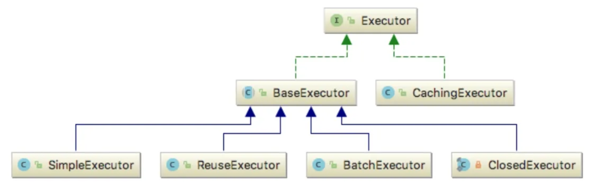

`CachingExecutor` 的执行逻辑如下所示：

```java
public <E> List<E> query(MappedStatement ms, Object parameterObject, RowBounds rowBounds, ResultHandler resultHandler, CacheKey key, BoundSql boundSql)
      throws SQLException {
    Cache cache = ms.getCache();
    if (cache != null) {
      flushCacheIfRequired(ms);
      if (ms.isUseCache() && resultHandler == null) {
        ensureNoOutParams(ms, boundSql);
        @SuppressWarnings("unchecked")
        List<E> list = (List<E>) tcm.getObject(cache, key);
        if (list == null) {
          list = delegate.<E> query(ms, parameterObject, rowBounds, resultHandler, key, boundSql);
          // 放缓存
          tcm.putObject(cache, key, list); // issue #578 and #116
        }
        return list;
      }
    }
    // 若二级缓存为空，则重新查询数据库
    return delegate.<E> query(ms, parameterObject, rowBounds, resultHandler, key, boundSql);
}
```

> 二级缓存是和命名空间绑定的，如果多表操作的 SQL 的话，是会出现脏数据的。同时如果是不同的事务，也可能引起脏读，所以要慎重。
>
> 如果二级缓存没有命中则会进入到 BaseExecutor 中继续执行，在这个过程中，会调用一级缓存执行。
>
> 值得一提的是，在 Mybatis 中，缓存分为 PerpetualCache, BlockingCache, LruCache 等，这些cache的实现则是借用了装饰者模式。
>
> 一级缓存使用的是 PerpetualCache，里面是一个简单的 HashMap。一级缓存会在更新的时候，事务提交或者回滚的时候被清空。
>
> 换句话说，一级缓存是和 SqlSession 绑定的。

- **查询数据库**

如果一级缓存中没有的话，则需要调用 JDBC 执行真正的 SQL 逻辑。我们知道，在调用 JDBC 之前，是需要建立连接的，如下代码所示：

```java
private Statement prepareStatement(StatementHandler handler, Log statementLog) throws SQLException {
    Statement stmt;
    Connection connection = getConnection(statementLog);
    stmt = handler.prepare(connection, transaction.getTimeout());
    handler.parameterize(stmt);
    return stmt;
}
```

> 我们会发现，Mybatis 并不是直接从 JDBC 获取连接的，通过数据源来获取的，Mybatis 默认提供了是那种种数据源：JNDI，PooledDataSource 和 UnpooledDataSource，我们也可以引入第三方数据源，如 Druid 等。包括驱动等都是通过数据源获取的。
> 获取到 Connection 之后，还不够，因为 JDBC 的数据库操作是需要 Statement 的，所以 Mybatis 专门抽象出来了 StatementHandler 处理类来专门处理和 JDBC 的交互，如下所示：

```java
public <E> List<E> query(Statement statement, ResultHandler resultHandler) throws SQLException {
    String sql = boundSql.getSql();
    statement.execute(sql);
    return resultSetHandler.<E>handleResultSets(statement);
}
```

其实这三行代码就代表了 Mybatis 执行 SQL 的核心逻辑：组装SQL，执行SQL，组装结果。仅此而已。

具体Sql是如何组装的呢？是通过 `BoundSql` 来完成的，具体组装的逻辑大家可以从 `org.apache.ibatis.mapping.MappedStatement#getBoundSql` 中了解，这里不再赘述。

- **处理查询结果**

当我们获取到查询结果之后，就需要对查询结果进行封装，即把查询到的数据库字段映射为 DO 对象。

因为此时我们已经拿到了执行结果 `ResultSet`，同时我们也在应用启动的时候在配置文件中配置了 DO 到数据库字段的映射 `ResultMap`，所以通过这两个配置就可以转换。核心的转换逻辑是通过 `TypeHandler` 完成的，流程如下所示：

1. 创建返回的实体类对象，如果该类是延迟加载，则先生成代理类。
2. 根据 `ResultMap` 中配置的数据库字段，将该字段从 `ResultSet` 取出来。
3. 从 `ResultMap` 中获取映射关系，如果没有，则默认将下划线转为驼峰式命名来映射。
4. 通过 `setter` 方法反射调用，将数据库的值设置到实体类对象当中。

#### Mybatis 的缓存机制

Mybatis 的缓存机制有两种：一级缓存和二级缓存。

**一级缓存**

在同一个会话中，Mybatis 会将执行过的 SQL 语句的结果缓存到内存中，下次再执行相同的 SQL 语句时，会先查看缓存中是否存在该结果，如果存在则直接返回缓存中的结果，不再执行 SQL 语句。一级缓存是默认开启的，可以通过在 Mybatis 的配置文件中设置禁用或刷新缓存来控制缓存的使用。

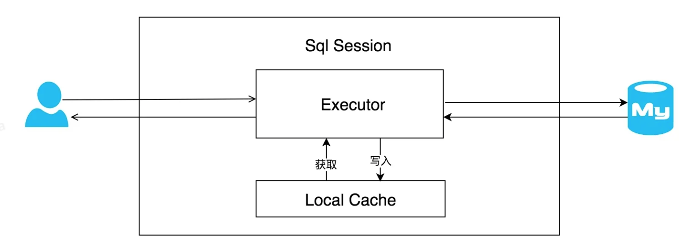

对于一级缓存，有两点需要注意的是：

1. MyBatis 一级缓存内部设计简单，只是一个没有容量限定的 HashMap，在缓存的功能性上有所欠缺。
2. MyBatis 的一级缓存最大范围是 `SqlSession` 内部，有多个 `SqlSession` 或者分布式的环境下，数据库写操作会引起脏数据，换句话说，当一个 `SqlSession` 查询并缓存结果后，另一个 `SqlSession` 更新了该数据，其他缓存结果的 `SqlSession` 是看不到更新后的数据的。所以建议设定缓存级别为 `Statement`。

**二级缓存（不建议使用，引入数据一致性问题）**

二级缓存是基于命名空间的缓存，它可以跨会话，在多个会话之间共享缓存，可以减少数据库的访问次数。要使用二级缓存，需要在 Mybatis 的配置文件中配置相应的缓存实现类，并在需要使用缓存的Mapper接口上添加 `@CacheNamespace` 注解。二级缓存的使用需要注意缓存的更新和失效机制，以及并发操作的问题。
工作流程如下：

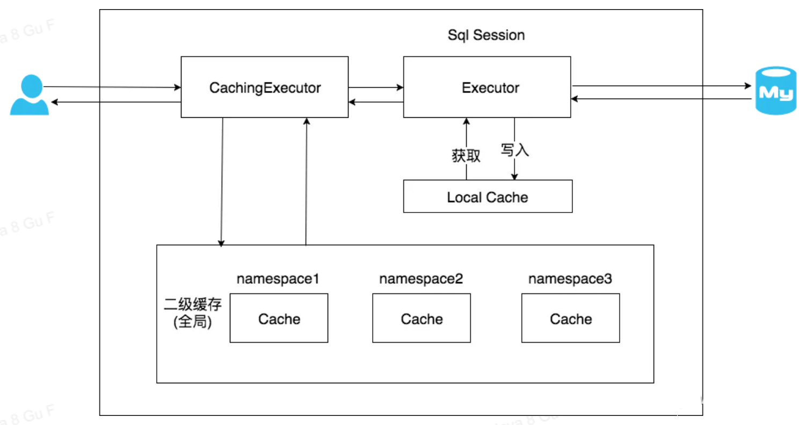

> 因为二级缓存是基于 namespace 的，所以一般情况下，Mybatis 的二级缓存是不适合多表查询的情况的。
>
> 举个例子：
> 我们有两个表：student 和 class，我们为这两个表创建了两个 namespace 去对这两个表做相关的操作。同时，为了进行多表查询，我们在 `namespace=student` 的空间中，对 student 和 class 两张表进行了关联查询操作（sqlA）。此时就会在 `namespace=student`的空间中把sqlA的结果缓存下来，如果我们在 `namespace=class` 下更新了 class 表， `namespace=student` 是不会更新的，这就会导致脏数据的产生。

#### Mybatis 用的什么连接池？

Mybatis 内置了三种数据源，分别是 Pooled，Unpooled 和 JNDI，其中 Pooled 数据源是具有连接池的。同时 Mybatis 也可以使用三方数据源，如 Druid，Hikari，C3P0 等等。

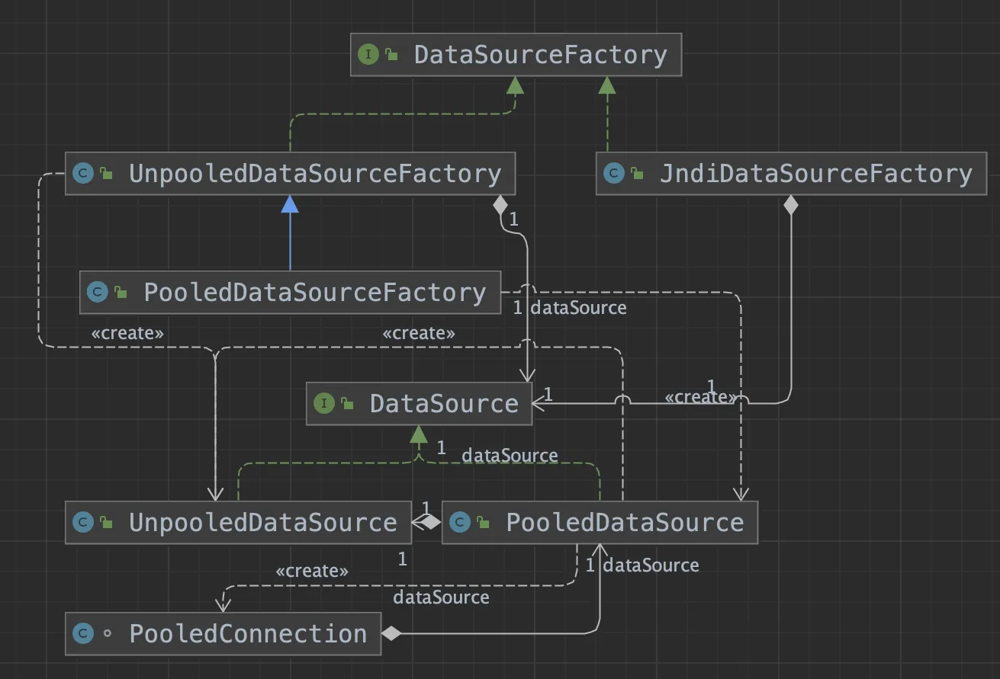

可以看到，在 Mybatis 中，会通过工厂模式来获得对应的数据源，那么 Mybatis 是在执行的哪一步获取的呢？
答案是在执行 SQL 之前，Mybatis 会获取数据库连接 Connection，而此时获得的 Connection 则是应用的启动的时候，已经通过配置项中的文件加载到内存中了：

```xml
<dataSource type="org.apache.ibatis.datasource.pooled.PooledDataSource">
  <property name="driver" value="com.mysql.jdbc.Driver"/>
  <property name="url" value="jdbc:mysql://localhost:3306/mybatis"/>
  <property name="username" value="root"/>
  <property name="password" value="123456"/>
</dataSource>
```

一般情况下，我们不会使用 Mybatis 默认的 `PooledDataSource`，而是会用 `Hikari`，如果要增加 Sql 监控功能的话，也可以使用 `Druid`，这是因为自带的数据库连接池有三个缺点：

1. **空闲连接占用资源：**连接池维护一定数量的空闲连接，这些连接会占用系统的资源，如果连接池设置过大，那么会浪费系统资源，如果设置过小，则会导致系统并发请求时连接不够用，影响系统性能。
2. **连接池大小调优困难：**连接池的大小设置需要根据系统的并发请求量、数据库的性能和系统的硬件配置等因素综合考虑，而这些因素都是难以预测和调整的。
3. **连接泄漏：**如果应用程序没有正确关闭连接，那么连接池中的连接就会泄漏，导致连接池中的连接数量不断增加，最终导致系统崩溃。

总的来说，专业的事情交给专业的组件来做，Mybatis 功能的核心是 ORM 映射和缓存，数据库连接池这种东西，市场上已经有比它做的更好的，我们直接用那些更好的就行了。

#### 什么是数据源，数据库和数据库连接池？

一般应用程序在连接数据库的时候，会有三步：

1. 输入 url，name，pwd 产生一个 connection
2. 然后在这个 connection 中完成对应的 sql 操作
3. 完成事务的提交或者回滚

为了对这三步进行抽象，诞生了数据源的概念，一般被定义为 `DataSource`。数据源负责和实体数据库的连接，如（内存数据库，mysql等），所以数据源是被第三方数据库实现的。

同时，因为通过数据源对数据库操作做了抽象，我们也可以在数据源中完成对数据库连接的池化，这就是数据库连接池。

> 借用 javaDoc 对 DataSource 的注释：
>
> 数据源用于连接到此 DataSource 对象所表示的物理数据源的工厂。作为 DriverManager 功能的替代方案，DataSource 对象是获取连接的首选方式。实现 DataSource 接口的对象通常会向基于 Java 的命名服务注册™ 命名和目录（JNDI）API。
> DataSource 接口由驱动程序供应商实现。有三种类型的实现：
>
> 1. 基本实现 —— 生成一个标准 Connection 对象。
> 2. 连接池实现 —— 生成一个 Connection 对象，该对象将自动参与连接池。此实现与中间层连接池管理器一起工作。
> 3. 分布式事务实现 —— 生成一个 Connection 对象，该对象可以用于分布式事务，并且几乎总是参与连接池。此实现使用中间层事务管理器，并且几乎总是使用连接池。

#### Mybatis 是否支持延迟加载？实现原理是什么？

延迟加载允许在需要时按需加载关联对象，而不是在查询主对象时立即加载所有关联对象。这样做可以提高查询性能和减少不必要的数据库访问。

> 假设，我们有两张表，分别是订单表和商品项表，一个订单中可以关联多个商品项。

```java
public class Order {
  private int id;
  private String orderNumber;
  private List<Item> items; // 关联的商品项列表

  // 省略构造函数和getter/setter方法
}

public class Item {
  private int id;
  private int orderId;
  private String itemName;
  private BigDecimal price;

  // 省略构造函数和getter/setter方法
}
```

当我们从数据库中查询 Order 的时候，如果同时把关联的 Item 都返回，这就不是延迟加载，如果在后面真正要用到 Item 的时候再查询加载，这就是延迟加载。

延迟加载的主要原理就是当开启了延迟加载功能 时，当查询主对象时，MyBatis 会生成一个代理对象，并将代理对象返回给调用者。

当后面需要访问这些关联对象时，代理对象会检查关联对象是否已加载。如果未加载，则触发额外的查询。

查询结果返回后，MyBatis 会将关联对象的数据填充到代理对象中，使代理对象持有关联对象的引用。这样，下次访问关联对象时，就可以直接从代理对象中获取数据，而无需再次查询数据库。

#### Mybatis 可以实现动态 SQL 么？

可以，动态 SQL 是指根据不同的条件生成不同的 SQL 语句，可以避免在编写 SQL 语句时出现重复的代码，提高代码的复用性和灵活性。

MyBatis 中提供了一些标签来支持动态SQL的生成，常见的几个有：

```xml
<!-- if标签：用于根据条件生成SQL语句的一部分 -->
<select id="getUsers" resultType="User">
  SELECT * FROM user
  WHERE
    <if test="name != null and name != ''">
      name like #{name}
    </if>
    <if test="age != null">
      and age = #{age}
    </if>
</select>

<!-- choose、when、otherwise标签：用于根据不同的条件选择不同的SQL语句块 -->
<select id="getUsers" resultType="User">
  SELECT * FROM user
  <where>
    <choose>
      <when test="name != null and name != ''">
        and name like #{name}
      </when>
      <when test="age != null">
        and age = #{age}
      </when>
      <otherwise>
        and sex = 'M'
      </otherwise>
    </choose>
  </where>
</select>

<!-- foreach标签：用于遍历集合并生成多个SQL语句块 -->
<update id="getUsers" parameterType="List">
 SELECT * FROM user
  where id in
    <foreach collection="list" item="user" open="(" separator="," close=")">
      #{user.id}
    </foreach>
</update>
```

#### 使用 MyBatis 如何实现分页？

MyBatis 中可以通过两种方式来实现分页：基于**物理分页**和基于**逻辑分页**。

所谓物理分页，指的是最终执行的 SQL 中进行分页，即 SQL 语句中带 `limit`，这样 SQL 语句执行之后返回的内容就是分页后的结果。

所谓逻辑分页，就是在 SQL 语句中不进行分页，照常全部查询，在查询到的结果集中，再进行分页。

在 MyBatis 中，想要实现分页通常有四种做法：

- 在 SQL 中添加 limit 语句
- 基于 PageHelper 分页插件，实现分页

```java
/**
 * 在使用 PageHelper 时，只需要在查询语句前调用 PageHelper.startPage() 方法，
 * 然后再进行查询操作。PageHelper 会自动将查询结果封装到一个 PageInfo 对象中，包含了分页信息和查询结果。
 */
PageHelper.startPage(1, 10);
List<User> userList = userMapper.getUsers();
PageInfo<User> pageInfo = new PageInfo<>(userList);
```

- 基于 RowBounds 实现分页

```java
int offset = 10; // 偏移量
int limit = 5; // 每页数据条数

// RowBounds 是 MyBatis 中提供的一个分页查询工具
RowBounds rowBounds = new RowBounds(offset, limit);
List<User> userList = sqlSession.selectList("getUsers", null, rowBounds);
```

- 基于MyBatis-Plus实现分页

```java
// MyBatis-Plus 中提供了分页插件，可实现简单易用的分页功能，可以根据传入的分页参数自动计算出分页信息
public interface UserMapper extends BaseMapper<User> {
 List<User> selectUserPage(Page<User> page, @Param("name") String name);
}
```

> 以上四种做法中，能实现逻辑分页的是 RowBounds 和 MyBatis-Plus，能实现物理分页的是手动添加 limit、PageHelper 以及 MyBatis-Plus。
>
> 【物理分页】 物理分页是数据库本身提供的分页方式，如 MySQL 的 limit，Oracle 的 rownum1。物理分页每次都访问数据库，只读取一部分数据，占用内存空间较小。物理分页的优点是效率高，实时性强，适用于数据量较大、更新频繁的场合。不好的地方就是不同数据库有不同的实现方式。
>
> 【逻辑分页】逻辑分页是在查询结果中，只取出指定页码的数据，而不是查询所有数据再进行分页。逻辑分页一次性将数据读取到内存，占用了较大的内容空间。逻辑分页的优点是所有数据库都统一，适用于数据量不大、数据稳定的场合。缺点是效率低，数据发生改变，数据库的最新状态不能实时反映到操作中，实时性差。

#### RowBounds 分页的原理是什么？

在使用 RowBounds 进行逻辑分页的时候，我们的 SQL 语句中是不需要指定分页参数的。

实际上在查询的时候，将会先所有符合条件的记录返回，然后再在内存中进行分页，分页的方式是根据 `RowBounds` 中指定的 `offset` 和 `limit` 进行数据保留，即抛弃掉不需要的数据再返回。

#### PageHelper 分页的原理是什么？

当我们在代码中使用 `PageHelper.startPage(int pageNum, int pageSize)` 设置分页参数之后，其实 `PageHelper` 会把他们存储到 `ThreadLocal` 中。

`PageHelper` 会在执行器的 `query` 方法执行之前，会从 `ThreadLocal` 中再获取分页参数信息，页码和页大小，然后执行分页算法，计算需要返回的数据块的起始位置和大小。最后，`PageHelper` 会通过修改 `SQL` 语句的方式，在 `SQL` 后面动态拼接上 `limit` 语句，限定查询的数据范围，从而实现物理分页的效果。并且在查询结束后再清除 `ThreadLocal` 中的分页参数。

#### MyBatis-Plus 有什么用？

MyBatis-Plus 是一个增强的 MyBatis 框架，提供了许多实用的功能和工具，包括：

- **通用 Mapper**：提供了一组通用的 Mapper 接口和实现，可以快速进行增删改查操作，无需手写 SQL 语句。例如 `BaseMapper`、`ConditionMapper` 等：

```java
public interface UserMapper extends BaseMapper<User> {
}
```

- **分页插件**：提供了一种简单易用的分页功能，可以根据传入的分页参数自动计算出分页信息，无需手动编写分页 SQL 语句。

```java
public interface UserMapper extends BaseMapper<User> {
    List<User> selectUserPage(Page<User> page, @Param("name") String name);
}
```

- **自动生成代码**：可以根据数据库表自动生成实体类、Mapper 接口、Mapper XML 映射文件等代码，大大减少了开发人员的工作量。

```java
AutoGenerator generator = new AutoGenerator();
generator.setDataSource(dataSourceConfig);
generator.setPackageInfo(new PackageConfig().setParent("com.example.mybatisplus"));
generator.setGlobalConfig(new GlobalConfig().setOutputDir(System.getProperty("user.dir") + "/src/main/java"));
generator.setTemplateEngine(new FreemarkerTemplateEngine());
generator.execute();
```

- **Lambda 表达式支持**：提供了 `LambdaQueryWrapper` 和 `LambdaUpdateWrapper`，可以使用 Lambda 表达式来构造查询条件和更新操作，使得代码更加简洁和易读。

```java
LambdaQueryWrapper<User> queryWrapper = new LambdaQueryWrapper<>();
queryWrapper.eq(User::getName, "Tom").gt(User::getAge, 18);
List<User> userList = userMapper.selectList(queryWrapper);
```

- **SQL 注入器**：提供了自定义的 SQL 注入器功能，可以自由扩展 MyBatis 的 SQL 语句，实现更加灵活的 SQL 操作。

```java
public class CustomSqlInjector extends AbstractSqlInjector {
    @Override
    public List<AbstractMethod> getMethodList(Class<?> mapperClass) {
        List<AbstractMethod> methodList = new ArrayList<>();
        methodList.add(new CustomInsert());
        return methodList;
    }
}

public class CustomInsert extends InsertMethod {
    @Override
    public String getMethod(SqlSource sqlSource) {
        return "customInsert";
    }
}
```

- **性能分析插件**：提供了性能分析插件，可以帮助开发人员分析 SQL 执行效率，优化数据库操作。

#### MyBatis-Plus 的分页原理是什么？

MyBatis-Plus 支持分页插件 —— `PaginationInnerInterceptor`

`PaginationInnerInterceptor` 采用的是物理分页方式，物理分页是在数据库中进行分页，即直接在 SQL 语句中加入 LIMIT 语句，只查询所需的部分数据。

物理分页的优点是可以减少内存占用，减轻数据库的负载，缺点是无法对结果进行任意操作，比如说在分页过程中做二次过滤、字段映射、json 解析等。

`PaginationInnerInterceptor` 这个分页插件就会自动拦截所有的 SQL 查询请求，计算分页查询的起始位置和记录数，并在 SQL 语句中加入 LIMIT 语句。

核心的操作在 `beforeQuery` 中：

```java
@Override
public void beforeQuery(Executor executor, MappedStatement ms, Object parameter, RowBounds rowBounds, ResultHandler resultHandler, BoundSql boundSql) throws SQLException {
    IPage<?> page = ParameterUtils.findPage(parameter).orElse(null);
    if (null == page) {
        return;
    }

    // 处理 orderBy 拼接
    boolean addOrdered = false;
    String buildSql = boundSql.getSql();
    List<OrderItem> orders = page.orders();
    if (CollectionUtils.isNotEmpty(orders)) {
        addOrdered = true;
        buildSql = this.concatOrderBy(buildSql, orders);
    }

    // size 小于 0 且不限制返回值则不构造分页sql
    Long _limit = page.maxLimit() != null ? page.maxLimit() : maxLimit;
    if (page.getSize() < 0 && null == _limit) {
        if (addOrdered) {
            PluginUtils.mpBoundSql(boundSql).sql(buildSql);
        }
        return;
    }

    handlerLimit(page, _limit);
    IDialect dialect = findIDialect(executor);

    final Configuration configuration = ms.getConfiguration();
    DialectModel model = dialect.buildPaginationSql(buildSql, page.offset(), page.getSize());
    PluginUtils.MPBoundSql mpBoundSql = PluginUtils.mpBoundSql(boundSql);

    List<ParameterMapping> mappings = mpBoundSql.parameterMappings();
    Map<String, Object> additionalParameter = mpBoundSql.additionalParameters();
    model.consumers(mappings, configuration, additionalParameter);
    mpBoundSql.sql(model.getDialectSql());
    mpBoundSql.parameterMappings(mappings);
}
```

其中比较关键的就是第31行，`buildPaginationSql` 方法。这里不同的数据库有不同的实现，我们看一下 MySQL 的实现：

```java
public class MySqlDialect implements IDialect {

    @Override
    public DialectModel buildPaginationSql(String originalSql, long offset, long limit) {
        StringBuilder sql = new StringBuilder(originalSql).append(" LIMIT ").append(FIRST_MARK);
        if (offset != 0L) {
            sql.append(StringPool.COMMA).append(SECOND_MARK);
            return new DialectModel(sql.toString(), offset, limit).setConsumerChain();
        } else {
            return new DialectModel(sql.toString(), limit).setConsumer(true);
        }
    }
}
```

这段代码就比较好理解了，其实就是在原来的 SQL 后面拼上 `LIMIT ?,? `，这样在后续执行的过程中，就可以把 `offerset` 和 `limit` 赋值给这两个占位符，实现分页查询了。

## Tomcat

#### Tomcat 的启动流程是怎样的？

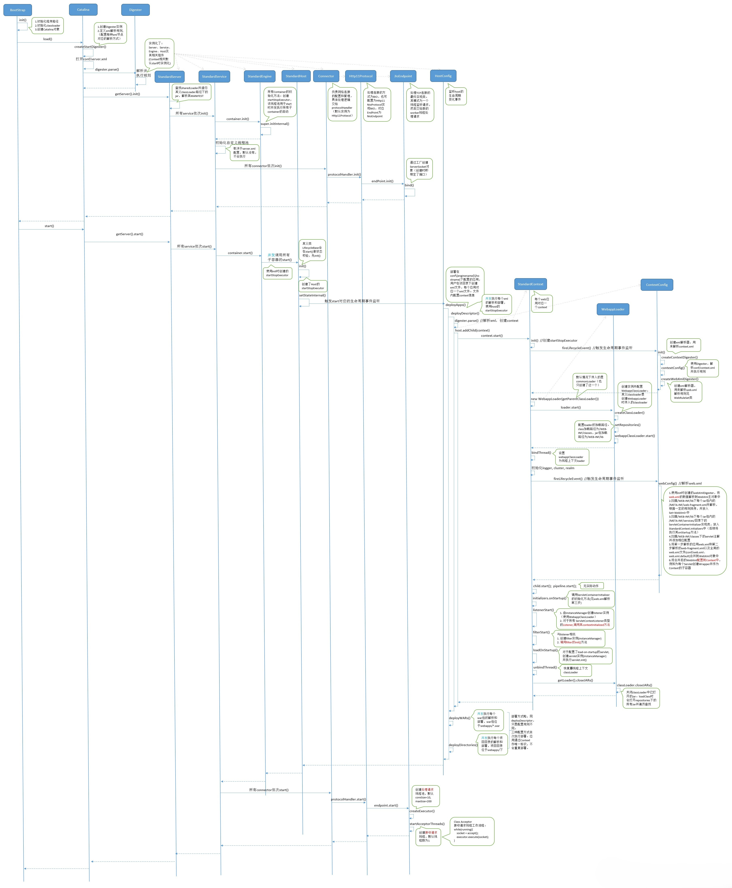

- **bootstrap.init**
  - 加载启动类：加载启动相关的类加载器及类，创建 `Catelina` 对象。
  
- **bootstrap.load**
  - 加载配置文件：主要包括 `server.xml` 和 `web.xml`，其中 `server.xml` 用于配置 `Tomcat` 的基础服务，如端口号、线程池等；`web.xml` 用于配置 Web 应用程序的参数、Servlet 和过滤器等信息。
  
  - 初始化组件：依次初始化 Tomcat 的各个组件，包括 Server、Service、Connector、Engine、Host 和 Context，它们都是 Tomcat 运行的重要组成部分。
  
- **bootstrap.start**
- 启动服务：当所有组件初始化完成后，Tomcat 会依次启动 Connector、Engine、Host 和 Context，最终启动整个 Tomcat 服务。
  
- 部署应用：启动完成后，会扫描指定的 Web 应用程序目录，自动部署已经打包好的 Web 应用程序。

以上步骤执行完之后，一个 web 应用就启动了，后续有请求到达时，会根据请求的 URL 匹配相应的 Context，然后将请求转发到相应的 Servlet 或 JSP 进行处理。

#### Tomcat 中有哪些类加载器?

Tomcat 的类加载机制是指 Tomcat 在运行时如何加载和管理 Java 类。Tomcat 的类加载机制的实现并没有严格遵守双亲委派原则，而是采用了一种层次化的类加载器结构，这种结构旨在提供更好的隔离性和灵活性，以支持多个 Web 应用程序的部署和运行。

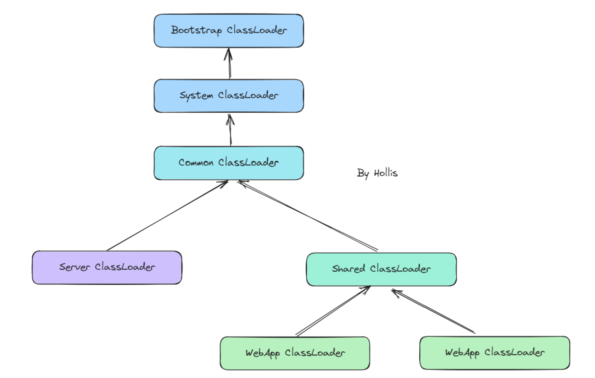

但是，默认情况下，Server 类加载器和 Shared 类加载器是未定义的，需要通过在 `conf/catalina.properties` 中定义`server.loader` 和 `/` 或 `shared.loader` 属性的值，才会是这个更复杂的层次结构。

Server 类加载器只对 Tomca t内部可见，对于 Web 应用程序完全不可见。

Shared 类加载器对所有 Web 应用程序可见，可以用于在所有 Web 应用程序之间共享代码。但是，对这些共享代码进行更新将需要重新启动 Tomcat。

所以，真正的需要一定有的，并且我们通常需要关注的就是下面这个层级关系：

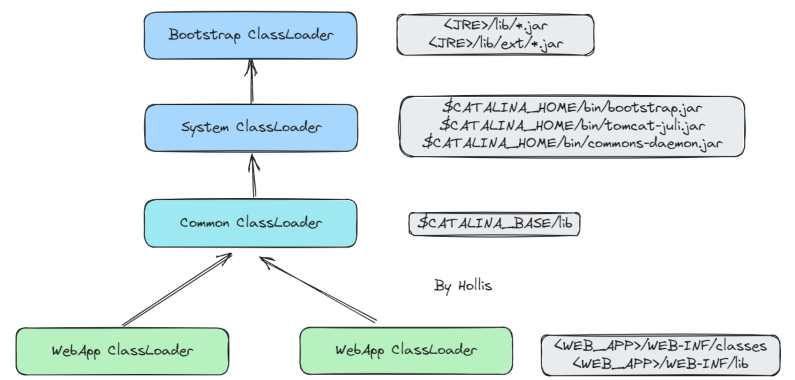

**启动类加载器（Bootstrap ClassLoader）**： 负责加载 JVM 自身的核心类库（如 `java.lang`、`java.util` 等）和 JVM 相关的类。启动类加载器是 JVM 的一部分，负责加载 JVM 运行所需的基础类。主要加载 JRE 中的 lib 包及 `lib/ext` 包下的内容

**系统类加载器（System Class Loader）**：负载加载 Tomcat 内部的一些核心类库，这些类一般在 `$CATALINA_HOME/bin` 这个目录下， 一般包含 `bootstarap.jar`、`tomcat-juli.jar` 以及 `common-daemon.jar` 等。

**公共类加载器（Common Class Loader）**： 负责加载 Tomcat 的公共类和库，位于 `$CATALINA_HOME/lib` 目录下的 JAR 文件。这些类库是 Tomcat 启动时加载的，是整个 Tomcat 实例中共享的类。

**Web应用程序类加载器（Webapp Class Loader）**： 每个 Web 应用程序都有一个独立的 Web 应用程序类加载器，负责加载该Web应用程序的类和资源。它从 `$CATALINA_HOME/webapps/<webapp_name>/WEB-INF/classes` 目录和 `$CATALINA_HOME/webapps/<webapp_name>/WEB-INF/lib` 目录加载类和 JAR 文件。

#### 为什么 Tomcat 可以把线程数设置为 200，而不是 N+1？

在实际应用中，设置线程池的核心线程数需要综合考虑多个因素，包括系统的硬件资源、应用的业务场景、应用线程的执行时间等等。因此，线程池核心线程数的推荐值仅仅是一个基础的参考值。

对于 Tomcat 而言，默认最大线程数是 200，默认最小空闲线程数是 10。

我认为，这些值应该是经过 Tomcat 开发团队反复测试和验证的结果，是适合绝大多数场景的。

我们作为使用者，大致可以猜测一下，Tomcat 可以设置为 200，可能有以下原因：

1. Tomcat 作为 Web 服务器，其主要的场景是处理短连接请求。相较于其他应用服务器，Tomcat 的请求处理时间相对较短，因此每条请求都不会占用时间太长。
2. Tomcat 作为 Web 服务器，与一般的应用程序不同，它需要处理大量的并发请求。因此，默认线程数设置的大一些，可以满足大多数 Web 应用的需求。
3. 在 Tomcat 的默认线程池中，使用了多个优化策略，如可回收线程、无锁化算法等，这些策略可以有效地减少线程创建和销毁的开销，提高线程池的吞吐量和性能。

Tomcat 的设计目标是高吞吐量和低延迟，不遵守线程池核心线程数推荐公式，是因为其默认线程池的设置已经经过充分的优化和测试，能够满足大多数的应用场景。

其实在实际工作中，我们也建议大家不要完全按照公式配置，而是根据你的实际业务情况进行充分压测之后，进行合理的配置。

#### Tomcat 处理请求的过程是怎么样的？

Tomcat 是一个基于 Servlet 规范实现的 Java Web 容器，所以，在接收并处理请求的过程中，Servlet 是必不可少的。

主要大致流程可以分为以下几步：

**1、接收请求**：Tomcat 通过连接器监听指定的端口和协议，接收来自客户端的 HTTP 请求。

**2、请求解析**：接收到请求之后，Tomcat 首先会解析请求信息，包括请求方法、URL、请求头参数等。

**3、Servlet 查找**：根据解析出来的 URL，找到对应的 Servlet，并把请求交给他进行处理。

**4、Servlet 请求处理**：这个过程就把请求交给 Servlet 进行处理，主要是执行其中的 service 方法进行请求处理。

**5、请求返回**：在 Servlet 处理结束后，把请求的响应在发送给客户端。

#### 过滤器和拦截器的区别是什么？

一般这个问题，主要是因为在 SpringMVC 的应用中，过滤器和拦截器都是用来对请求进行预处理、过滤、拦截的，所以经常会放在一起比较。不过他们其实还有一些区别的。

他们的主要区别在于作用和生效的位置不同，过滤器是在请求进入 Servlet 容器之前拦截请求并对请求进行处理，而拦截器是在请求进入 Servlet 容器之后，但在进入 Controller 之前拦截请求并对请求进行处理，也可以在响应返回客户端之前，拦截响应并对响应进行处理。

**在 Tomcat 中，一次请求会先进入到 Tomcat 容器，然后经过 Filter 的处理，处理通过之后才会进入到 Servlet 容器，进入到 Servlet 容器之后，才会在 Servlet 执行的前后执行 Intercepter。**

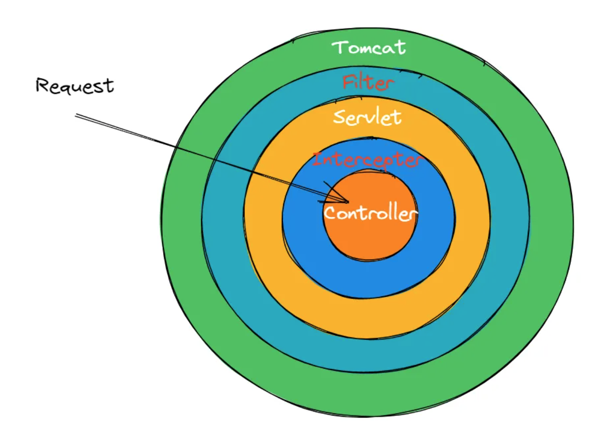

过滤器在请求进入 Servlet 容器之前拦截请求并对请求进行处理，比如对请求进行安全验证、日志记录等，之后将请求转发给对应的 Servlet 进行处理。过滤器是基于 Java Servlet 规范实现的，可以通过配置 `web.xml` 文件进行实现。

拦截器是在请求进入 Servlet 容器之后，拦截请求并对请求进行处理，也可以在响应返回客户端之前，拦截响应并对响应进行处理。拦截器可以对请求进行更加精细的控制，例如进行 AOP、权限控制、事务管理等操作。**拦截器是基于 Spring 框架实现的，可以通过定义拦截器类实现。**

**代码实现：*

- 定义一个过滤器，需要实现 `javax.servlet.Filter` 接口：

```java
public class LoginFilter implements Filter {
    public void init(FilterConfig config) throws ServletException {
        // 初始化
    }
 
    public void doFilter(ServletRequest req, ServletResponse resp, FilterChain chain) throws ServletException, IOException {
        // 登录验证和处理
        chain.doFilter(req, resp);
    }
 
    public void destroy() {
        // 销毁
    }
}
```

- 并且需要在 `web.xml` 文件中把他配置上:

```java
<filter>
    <filter-name>LoginFilter</filter-name>
    <filter-class>com.hollis.LoginFilter</filter-class>
</filter>
<filter-mapping>
    <filter-name>LoginFilter</filter-name>
    <url-pattern>/*</url-pattern>
</filter-mapping>
```

或者通过注解也可以。

> 在 `LoginFilter` 上添加 `@WebFilter` 注解，并在启动类上增加 `@ServletComponentScan("com.wsp.filter.LoginFilter")` 注解。也可替代 xml 文件中的配置。

想要定义一个拦截器，需要实现 `org.springframework.web.servlet.HandlerInterceptor` 接口：

```java
@Component
public class LoginInterceptor implements HandlerInterceptor {
    public boolean preHandle(HttpServletRequest request, HttpServletResponse response, Object handler) throws Exception {
       // 登录验证和处理
        return true;
    }
 
    public void postHandle(HttpServletRequest request, HttpServletResponse response, Object handler, ModelAndView modelAndView) throws Exception {
        // 后处理
    }
 
    public void afterCompletion(HttpServletRequest request, HttpServletResponse response, Object handler, Exception ex) throws Exception {
        // 完成处理
    }
}
```

并且在 `SpringMVC` 中进行配置：

```java
<mvc:interceptors>
    <mvc:interceptor>
        <mvc:mapping path="/api/*"/>
        <bean class="com.hollis.LoginInterceptor"/>
    </mvc:interceptor>
</mvc:interceptors>
```

或者：

```java
@Configuration
public class WebConfig implements WebMvcConfigurer {

    @Override
    public void addInterceptors(InterceptorRegistry registry) {
        registry.addInterceptor(new LoginInterceptor()).addPathPatterns("/api/*");
    }
}
```

#### 介绍一下 Tomcat 的 IO 模型？

- **BIO** 是最传统的线程模型，也称为阻塞 I/O。在 BIO 模型中，每个客户端连接都由一个独立的线程处理。当有新的连接到来时，Tomcat 会创建一个新的线程来处理请求。这意味着每个连接都需要一个独立的线程，当并发连接数较大时，会导致线程数急剧增加，占用大量系统资源，并且可能出现线程切换带来的开销。
- **NIO** 是 Java 的新 I/O 库（`java.nio`）的线程模型。在 NIO 模型中，通过使用 Java NIO 的选择器（Selector）机制，一个线程可以同时处理多个连接的请求。NIO 模型相对于 BIO 模型来说，能够支持更多的并发连接，并且在连接数较大时对系统资源的消耗较少，但由于在应用层需要处理 I/O 事件，编程较为复杂。
- **NIO2** 是 Java 7 引入的进一步改进的 NIO 模型，也叫 AIO。在 NIO2 中，Java 提供了更多的异步 I/O 操作，包括异步文件 I/O、异步套接字 I/O 等。这使得 Tomcat 能够更好地支持异步请求处理，提高了处理性能和效率。
- **APR** 是 Apache 软件基金会提供的一个库，它为应用程序提供了跨平台的抽象层，提供了高性能的本地 I/O 支持。在 APR 模型中，Tomcat 利用本地操作系统的特性进行 I/O 操作，包括网络和文件 I/O。APR 模型在性能方面表现得非常出色，特别是在处理大量并发连接时，因为它直接利用底层操作系统的异步 I/O 能力。

在 `server.xml` 文件中，通过配置 Connecter 来选择不同的 IO 模型，如：

```java
<Connector port="8080" protocol="HTTP/1.1"
           connectionTimeout="20000"
           redirectPort="8443" />
```

这里的 protoco 就是可以修改来替换成其他的协议，即 IO 模型的地方。

各个IO模型对应的关系如下：

●
BIO模型：将protocol属性设置为HTTP/1.1（默认值），或者可以显式地设置为org.apache.coyote.http11.Http11Protocol。
●
NIO模型：将protocol属性设置为org.apache.coyote.http11.Http11NioProtocol。
●
NIO2模型：将protocol属性设置为org.apache.coyote.http11.Http11Nio2Protocol。
●
APR模型：将protocol属性设置为org.apache.coyote.http11.Http11AprProtocol。

但是记得修改后需要重启 tomcat 才会生效。而且需要注意，Tomcat 的不同版本可能支持不同的I/O模型，因此请根据您使用的Tomcat版本进行相应的配置。

一般来说，建议使用 NIO 或者 NIO2 就行了，对于涉及大量 I/O 操作的应用，例如 Web 服务、聊天应用或在线游戏等，NIO 或 NIO2 模型都挺合适。

如果对性能要求非常高，可以考虑使用APR模型，但需要安装和配置 APR 库，有一定的成本。

#### Tomcat 与 Web 服务器（如Apache）之间的关系是什么？

Tomcat 是一个开源的 Java Servlet 容器和 JavaServer Pages（JSP）引擎，Tomcat 是一个 Web 应用程序服务器，它实现了 Java Servlet 和 JSP 规范，支持 Java 的 Server-Side 编程模型。它提供了一个 Servlet 容器，用于管理和执行 Java Servlet，以及一个 JSP 引擎，用于编译和执行 JSP 页面。

Tomcat 与 Web 服务器（如 Apache、Nginx 等）之间通常是配合使用的，形成一个典型的应用服务器架构。这种架构被称为 "Tomcat-Apache 联合部署"，它利用了两者的优势，提供更强大的功能和性能。

> 这种情况下，Apache 充当反向代理服务器，负责接收客户端的请求并处理一部分静态内容的请求。然后，Apache 将动态请求（如 Java Servlet、JSP）转发给 Tomcat 进行处理。Apache 与 Tomcat 之间的通信通常通过 AJP 协议（Apache JServ Protocol）或 HTTP 协议来实现。并且 Apache 也可以处理一些简单的操作，比如静态资源的访问，黑名单控制等。
>
> 这种架构的优势是，Apache 作为前端服务器能够处理高并发的静态请求，而 Tomcat 作为应用服务器则专注于处理动态请求，提供 Java Servlet 和 JSP 的支持。这样分离静态和动态内容，使得整体的请求处理效率更高。

#### Tomcat 的类加载机制是怎么样的？

Tomcat 的类加载机制，在默认情况下，是先把当前要加载的类委托给 `BootstrapClassLoader` 尝试加载，为了避免 JRE 中的核心类被我们应用自己给覆盖（如 String 等），Bootstrap 如果无法加载，那么就由 WebAppClassLoader 尝试加载，如果无法加载，那么再委托通过双亲委派的方式向上委派给 Common、System 等类加载进行加载，即顺序为：`Bootstrap->WebApp->System->Common`

上面的是默认情况，tomcat 中有一个配置 delegate，他的默认值是 false，如果设置成 true 了，那么他就会严格遵守双亲委派，按照 `Bootstrap->System->Common->WebApp` 的顺序进行加载。

talk is cheap，show me the code

以下是 tomcat 中 `WebappClassLoaderBase.java` 中 `loadClass` 的代码，我做了一些精简，并加了一些注释：

```java
public Class<?> loadClass(String name, boolean resolve) throws ClassNotFoundException {
                clazz = Class.forName(name, false, parent);
                if (clazz != null) {
                    if (log.isDebugEnabled()) {
                        log.debug("  Loading class from parent");
                    }
                    if (resolve) {
                        resolveClass(clazz);
                    }
                    return clazz;
                }
            } catch (ClassNotFoundException e) {
                // Ignore
            }
        }

        // 自己尝试加载
        // 能走到这里，肯定是BootStrap没加载到，之后还有两种情况：
        // 1、如果delegate为ture的话，说明上层类加载器也没记载到。
        // 2、如果delegate为false，那么就还没有进行过委派，先在这里尝试自己加载。
        if (log.isDebugEnabled()) {
            log.debug("  Searching local repositories");
        }
        try {
            clazz = findClass(name);
            if (clazz != null) {
                if (log.isDebugEnabled()) {
                    log.debug("  Loading class from local repository");
                }
                if (resolve) {
                    resolveClass(clazz);
                }
                return clazz;
            }
        } catch (ClassNotFoundException e) {
            // Ignore
        }

        // 如果delegate为false,说明还没有做过委派，那么委派给父类加载器加载类。
        if (!delegateLoad) {
            if (log.isDebugEnabled()) {
                log.debug("  Delegating to parent classloader at end: " + parent);
            }
            try {
                clazz = Class.forName(name, false, parent);
                if (clazz != null) {
                    if (log.isDebugEnabled()) {
                        log.debug("  Loading class from parent");
                    }
                    if (resolve) {
                        resolveClass(clazz);
                    }
                    return clazz;
                }
            } catch (ClassNotFoundException e) {
                // Ignore
            }
        }
    }

    throw new ClassNotFoundException(name);
}
```

整个代码的过程就是：

1. 加锁： 方法使用同步块确保线程安全
2. 检查已加载类缓存： 首先，通过调用 `findLoadedClass0` 方法检查本地缓存是否已加载该类，如果是，则直接返回缓存中的 Class 对象。
3. 检查已加载类缓存（GraalVM 兼容性处理）： 通过调用 `findLoadedClass` 方法检查另一个类加载缓存，如果是 GraalVM 环境，直接返回缓存中的 Class 对象。
4. **尝试使用 Bootstrap 类加载器加载**： 尝试使用 Bootstrap 类加载器加载类，以防止 Web 应用程序覆盖 Java SE 类。如果加载成功，则返回加载的 Class 对象。
5. **决定是否委派加载**： 根据 `delegate` 属性和其他条件判断是否应该委派加载给父类加载器。
6. **委派给父类加载器**： 如果需要委派加载（delegate 为 true），尝试使用父类加载器加载类。
7. **自己尝试加载**： 如果未指定需要委派（delegate 为 false），或者未从父类加载器中找到类，则调用 findClass 方法尝试自己进行类加载。
8. **委派给父类加载器**： 如果未指定需要委派（delegate为false），且自己没加载到类，则尝试使用父类加载器加载类。

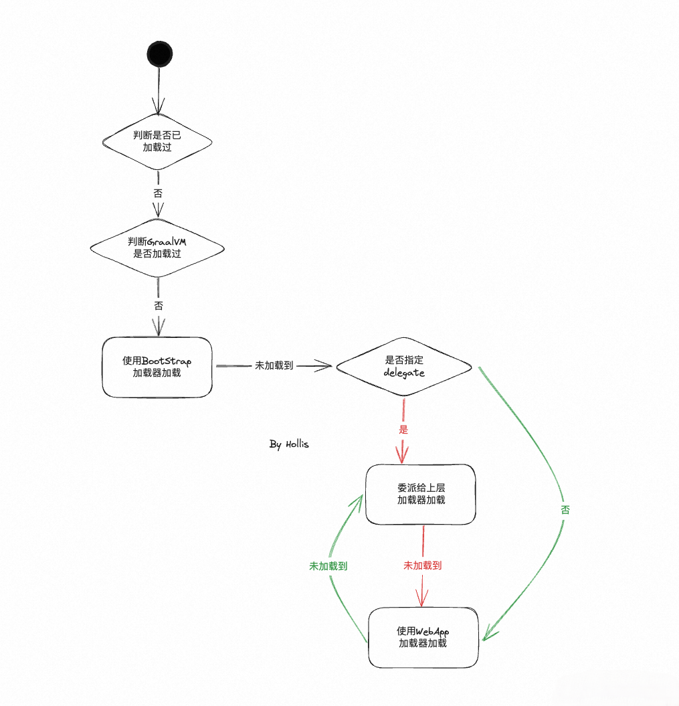

以上，就是 Tomcat 的类加载机制。你说他打破双亲委派了么？

打破了，当 `delegate = false` 的时候，打破了双亲委派。但是也并不是上来就自己直接加载，而是也得先给老大哥 —— `BootStrap` 尝试加载，避免 JRE 中的类被覆盖。

没打破，当 `delegate = true` 的时候，他是严格的遵守了双亲委派的。

## Netty

#### 为什么 Netty 适合做网络编程？

Netty 是由 JBOSS 提供的一个 Java 开源框架。Netty 提供异步的、基于事件驱动的网络应用程序框架，用以快速开发高性能、高可靠性的网络 IO 程序。Netty 主要用来做网络通信，一般可以用来作 RPC 框架的通信工具、实现即时通讯系统以及实时消息推送系统等。

相比于 Java 中自带的 NIO 来说，Netty 有很多好处，比如开箱即用，非常方便；性能高，能承载大量并发；功能更加强大并且社区也比较活跃。

**使用简单：**封闭了 Java 原生 NIO 类库繁琐的 API，使用起来更加高效；
**功能强大：**预置多种编码能力，支持多种主流协议。同时通过 ChannelHandler 可以进行灵活的拓展，支持很强的定制能力；
**高性能：**与其它业界主流 NIO 框架相比，Netty 综合更优。主要体现在吞吐量更高、延迟更低、减少资源消耗以及最小化不必要的内存复制；
**社区活跃：**版本更新周期短，BUG 修复速度快，让开发者可以专注业务本身。

#### Netty 性能好的原因是什么？

Netty 作为一个高性能的网络通信框架，性能是他重要优势，Netty 中主要做了以下事情来全方面的提升 Netty 的性能：

- **非阻塞IO模型：**Netty 采用了 IO 多路复用技术，让多个 IO 的阻塞复用到一个 select 线程阻塞上，能够有效的应对大量的并发请求
- **高效的 Reactor 线程模型：**支持多种 Reactor 线程模型，可以根据业务场景的性能诉求，自行选择
- **零拷贝：**尽量做到不必要的内存拷贝
- **内存池设计：**使用直接内存，并且可重复利用
- **无锁串行化设计：**避免使用锁带来的额外开销
- **高性能序列化协议：**支持 protobuf 等高性能序列化协议

#### Netty 的零拷贝是怎么实现的？

在操作系统中，零拷贝指的是避免在用户态（User-space）与内核态（Kernel-space）之间来回拷贝数据。

而 Netty 的零拷贝模型和操作系统中的零拷贝模型并不完全一样。他主要指的是在操作数据时, 不需要将数据 buffer 从 一个内存区域拷贝到另一个内存区域。少了一次内存的拷贝，CPU 效率就得到的提升。

Netty 的零拷贝主要体现在以下 5 个方面：

- 直接使用堆外内存，避免 JVM 堆内存到堆外内存的数据拷贝。
- `CompositeByteBuf` 类，可以组合多个 Buffer 对象合并成一个逻辑上的对象，避免通过传统内存拷贝的方式将几个 Buffer 合并成一个大的 Buffer。
- 通过 `Unpooled.wrappedBuffer` 可以将 byte 数组包装成 ByteBuf 对象，包装过程中不会产生内存拷贝。
- `ByteBuf.slice`  操作与 `Unpooled.wrappedBuffer` 相反，slice 操作可以将一个 ByteBuf 对象切分成多个 ByteBuf 对象，切分过程中不会产生内存拷贝，底层共享一个 byte 数组的存储空间。
- 使用 `FileRegion` 实现文件传输，`FileRegion` 底层封装了 `FileChannel#transferTo()` 方法，可以将文件缓冲区的数据直接传输到目标 Channel，避免内核缓冲区和用户态缓冲区之间的数据拷贝，这属于操作系统级别的零拷贝。

**对外内存**

Java 在将数据发送出去的时候，会先将数据从堆内存拷贝到堆外内存，然后才会将堆外内存再拷贝到内核态，进行消息的收发，代码如下：

```java
static int write(FileDescriptor paramFileDescriptor, 
                 ByteBuffer paramByteBuffer, long paramLong, 
                 NativeDispatcher paramNativeDispatcher) throws IOException{
	// 如果是直接内存，则直接写入
    if((paramByteBuffer instanceof DirectBuffer)) {
        return writeFromNativeBuffer(paramFileDescriptor, paramByteBuffer, paramLong, paramNativeDispatcher);
    }
    // ...否则，先把数据拷贝到直接内存中
    ByteBuffer localByteBuffer = Util.getTemporaryDirectBuffer(k);
    try {
        localByteBuffer.put(paramByteBuffer);
        localByteBuffer.filp();
        paramByteBuffer.position(i);
        int m = writeFromNativeBuffer(paramFileDescriptor, localByteBuffer, paramLong, paramNativeDispatcher);
    }
}
```

所以，我们发现，假如我们在收发报文的时候使用直接内存，那么就可以减少一次内存拷贝，Netty 就是这么做的。

Netty 在通信层进行字节流的接收和发送的时候，如果应用允许 Unsafe 访问，则会采用 DirectByteBuf 进行转换，也就是堆外的直接内存，代码如下：

```java
public ByteBuf ioBuffer(int initialCapacity) {
    if (PlatformDependent.hasUnsafe() || isDirectBufferPooled()) {
    return directBuffer(initialCapacity);
}
return heapBuffer(initialCapacity);
}
```

**CompositeByteBuf**

考虑一种场景，当一个数据包被拆成了两个字节流通过 TCP 传输过来后，那么对于接收者的机器来说，为了方便解析，它需要新建一个 ByteBuf 将这两个字节流重组成一个新的数据包，如下图所示：

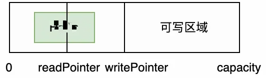

那么在这种情况下，我们如果直接将两个字节流拷贝到一个新的字节流中，显然会浪费空间和时间，所以 Netty 推出了 CompositeByteBuf，专门用来拷贝 ByteBuf

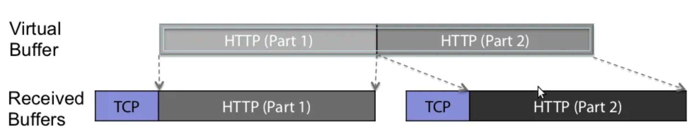

从图中可以看到，实际的 Buf 还是两个，只不过 Netty 通过 `CompositeByteBuf` 将老的 buf 通过指针组合映射到新的 Buf 中，减少了一次拷贝过程。

**Unpooled.wrappedBuffer**

Unpooled.wrappedBuffer 是创建 CompositeByteBuf 对象的另一种推荐做法。

`Unpooled.wrappedBuffer` 方法可以将不同的数据源的一个或者多个数据包装成一个大的 `ByteBuf` 对象，其中数据源的类型包括 `byte[]`、`ByteBuf`、`ByteBuffer`。包装的过程中不会发生数据拷贝操作，包装后生成的 `ByteBuf` 对象和原始 `ByteBuf` 对象是共享底层的 byte 数组。

**ByteBuf.slice**

`ByteBuf.slice` 和 `Unpooled.wrappedBuffer` 的逻辑正好相反，`ByteBuf.slice` 是将一个 `ByteBuf` 对象切分成多个共享同一个底层存储的 `ByteBuf` 对象。

**FileRegion文件传输**

Netty 使用 `FileRegion` 实现文件传输的零拷贝，而 `FileRegion` 其实是基于 Java 底层的 `FileChannel#tranferTo` 方法实现的。它可以根据操作系统直接将文件缓冲区的数据发送到目标 channel，底层借助了 `sendFile` 能力避免了传统通过循环 `write` 方式导致的内存拷贝问题。所以 `FileRegion` 是操作系统级别的零拷贝。

JavaDoc 的注释如下：

> This method is potentially much more efficient than a simple loop that reads from this channel and writes to the target channel. Many operating systems can transfer bytes directly from the filesystem cache to the target channel without actually copying them.
> 此方法可能比从此通道读取并写入目标通道的简单循环更有效。许多操作系统可以将字节直接从文件系统缓存传输到目标通道，而无需实际复制它们。

**sendFile**

JDK 原生的 `FileChannel#tranferTo` 方法其实是基于了 Linux 的 `sendFile` 方法，通过该方法，数据可以直接在内核空间内部进行 I/O 传输，从而省去了数据在用户空间和内核空间之间的来回拷贝。工作原理如下图：

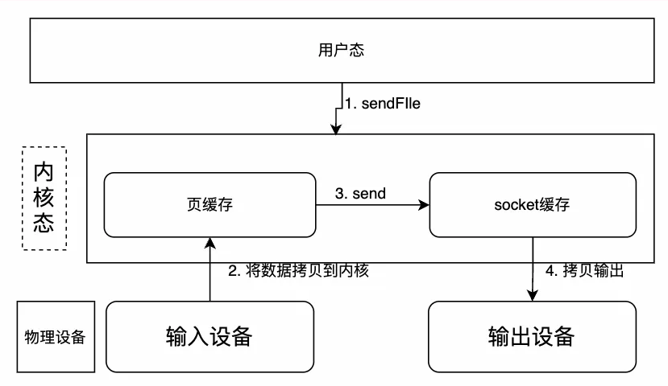

#### 能不能说一说 Netty 的无锁化设计？

在解决多线程的问题的时候，锁是最常用的方案，但是也是开销最大的一种方案，同时也会带来死锁的问题，所以，Netty 为了避免这些问题引入了无锁化设计。

那么，不用锁的话，怎么解决并发的问题呢，Netty 主要做了以下几个事情：

首先，Netty 基于 **Reactor 线程模式**实现并发请求处理，避免了线程阻塞与锁的竞争。

其次，Netty 实现了**对象池**，用来减少对象的创建和销毁，从而也能避免了锁的竞争。

而且在 Netty 中，还有许多组件都被设计为线程安全的，**例如，每个 Channel 都有一个唯一的 EventLoop**，用于处理所有事件。这样可以避免锁竞争和线程切换带来的开销。

#### Netty 的线程模型是怎么样的？

Netty 通过 Reactor 模型基于多路复用器接收并处理用户请求的。多路复用 IO 模型参考：

多路复用就是首先去阻塞的调用系统，询问内核数据是否准备好，如果准备好，再重新进行系统调用，进行数据拷贝。常见的实现有 select，epoll 和 poll 三种。

Netty 的线程模型并不是一成不变的，它实际取决于用户的启动参数配置。通过设置不同的启动参数，Netty 支持三种模型，分别是 **Reactor 单线程模型**、**Reactor 多线程模型**、**Reactor 主从多线程模型**。

- 单 Reactor 单线程模型

这是最简单的 Reactor 模型，当有多个客户端连接到服务器的时候，服务器会先通过线程A和客户端建立连接，
有连接请求后，线程A 会将不同的事件（如连接事件，读事件，写事件）进行分发，譬如有 IO 读写事件之后，会把该事件交给具体的 Handler 进行处理。

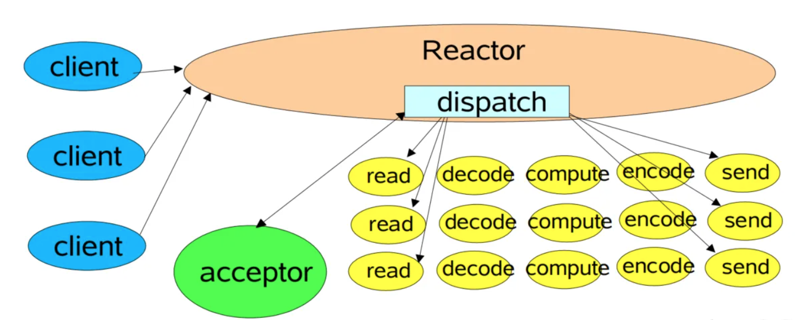

而线程A，就是我们说的 Reactor 模型中的 Reactor，Reactor 内部有一个 dispatch（分发器）。【注意，这里的 Reactor 单线程，主要负责事件的监听和分发】
此时一个 Reactor 既负责处理连接请求，又要负责处理读写请求，一般来说处理连接请求是很快的，但是处理具体的读写请求就要涉及字节的复制，相对慢太多了。Reactor 正在处理读写请求的时候，其他请求只能等着，只有等处理完了，才可以处理下一个请求。
通过一个 Reactor 线程，只能对应一个 CPU，发挥不出来多核 CPU 的优势。所以，一个 Reactor 线程处理简单的小容量场景，还是 OK 的，但是对于高负载来说，还需要进一步升级。

- 单 Reactor 多线程模型

为了利用多核 CPU 的优势，也为了防止在 Reactor 线程等待读写事件时候浪费 CPU，所以可以增加一个 Worker 的线程池，由此升级为单 Reactor 多线程模式。

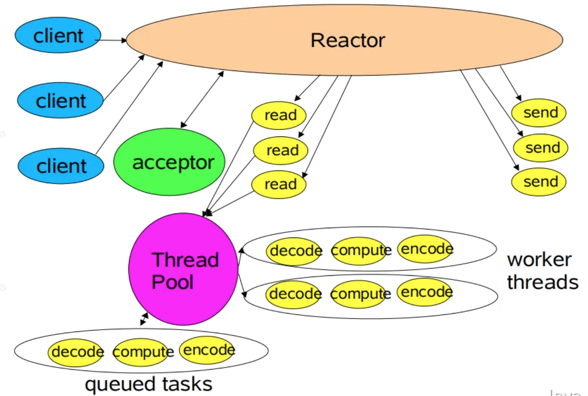

整体流程如下：

当多个客户端进入服务器后，Reactor 线程会监听多种事件（如连接事件，读事件，写事件），如果监听到连接事件，则把该事件分配给 acceptor 处理，如果监听到读事件，那么则会发起系统调用，将数据写入内存，之后再把数据交给工作线程池进行业务处理。

这个时候我们会发现，业务处理的逻辑已经变成多线程处理了。不过一个 Reactor 既要负责连接事件，又要负责读写事件，同时还要负责数据准备的过程。因为拷贝数据是阻塞的，假如说 Reactor 阻塞到拷贝数据的时候，服务器进来了很多连接，这个时候，这些连接是很有可能会被服务器拒绝掉的。
所以，单个 Reactor 看来是不够的，我们需要使用多个 Reactor 来处理。

- 主从 Reactor 模型

在主从 Reactor 模型中，主 Reactor 线程只负责连接事件的处理，它把读写事件全部交给了子 Reactor 线程。这样即使在数据准备阶段子线程被阻塞，主 Reactor 还是可以处理连接事件。巧妙的解决了高负载下的连接问题。

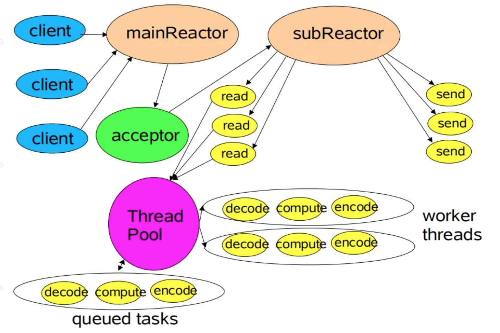

#### Netty 如何解决 TCP 粘包、拆包的问题的？

针对 TCP 的粘包、拆包问题，Netty 有自己的解决方式。

Netty通过预先指定的数据流编解码器，按照预先约定好的规则进行数据的解析，即可解决对应的粘包、拆包问题。

具体到代码层面，主要有以下几种解码器：

- 定长解码器 `FixedLengthFrameDecoder`
  - 这个解码器按照指定的长度对接收到的数据进行分割。如果接收到的数据长度小于指定长度，它会等待直到收集到足够的数据。
- 行分隔符解码器 `LineBasedFrameDecoder`
  - 它根据行分隔符（如 \n 或 \r\n）来处理粘包和拆包问题。这个解码器会按行分隔数据。
- 分隔符解码器 `DelimiterBasedFrameDecoder`
  - 这个解码器允许指定一个或多个分隔符。当遇到分隔符时，它将数据分割成一个个完整的帧。
- 长度字段解码器 `LengthFieldBasedFrameDecoder`
  - 这是一种更复杂的解决方案，适用于更复杂的协议。在这种方式中，消息中包含表示消息长度的字段。解码器根据这个长度字段来确定每个消息的边界。
- 自定义解码器
  - 如果预定义的解码器不满足需求，Netty 还允许开发者实现自定义的解码器。通过扩展 `ByteToMessageDecoder` 类，可以处理任何复杂的粘包和拆包场景。

除了解码器之外，Netty 也提供了编码器，用于在发送数据前按照特定规则格式化消息。例如，对于 `LengthFieldBasedFrameDecoder`，可以使用 `LengthFieldPrepender` 编码器来在消息前添加长度字段。

这些解决方案全被封装到了 handler 中，我们可以基于 Netty 的责任链模式，进行如下调用即可：

```java
serverBootstrap.group(bossGroup, workerGroup)
    // channel fact
    .channel(NioServerSocketChannel.class)
    .childHandler(new ChannelInitializer<SocketChannel>() {
        @Override
        public void initChannel(SocketChannel ch) {
            ch.pipeline.addLast(new FixedLenghtFrameDecoder());
        }
    }
);
```

#### Netty 的 Buffer 为什么好用？

在网络编程中，基本都是基于 TCP 报文的字节流的操作，所以 Java 的 NIO 又新增了 ByteBuffer，只不过 Java 原生的 ByteBuffer，非常难操作，也不能扩缩容，所以 Netty 又重新封装了自己的 Bytebuf，除了性能上的优势之外，Netty 的 Buffer 在使用上相对于 NIO 也非常简洁，有如下特点：

- **动态扩缩容**

顾名思义，Netty 中的 ByteBuffer 可以像 Java 中的 ArrayList 一样，根据写入数据的字节数量，自动扩容。代码如下所示：

```java
final void ensureWritable0(int minWritableBytes) {
    final int writerIndex = writerIndex();
    final int targetCapacity = writerIndex + minWritableBytes;
    // using non-short-circuit & to reduce branching - this is a hot path and targetCapacity should rarely overflow
    if (targetCapacity >= 0 & targetCapacity <= capacity()) {
        ensureAccessible();
        return;
    }
    if (checkBounds && (targetCapacity < 0 || targetCapacity > maxCapacity)) {
        ensureAccessible();
        throw new IndexOutOfBoundsException(String.format(
                "writerIndex(%d) + minWritableBytes(%d) exceeds maxCapacity(%d): %s",
                writerIndex, minWritableBytes, maxCapacity, this));
    }

    // Normalize the target capacity to the power of 2.
    final int fastWritable = maxFastWritableBytes();
    int newCapacity = fastWritable >= minWritableBytes ? writerIndex + fastWritable
            : alloc().calculateNewCapacity(targetCapacity, maxCapacity);

    // Adjust to the new capacity. 【此处进行扩容】
    capacity(newCapacity);
}
```

这个在编写代码的时候，满足 ByteBuf 最大缓冲区的情况下，我们可以毫无顾忌地调用 `#write` 方法增加字节，而不用手动去 check 容量满足，然后去重新申请。

- **读写指针代替#flip**

Java 原生的 ByteBuffer 的数据结构，分为 limit，capacity 两个指针，在我们写入内容之后，ByteBuffer 的内容如下：

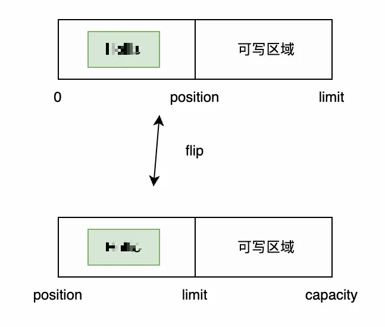

此时，如果我们要从该 `ByteBuffer` 中 `read` 数据，`ByteBuffer` 会默认从 `position` 开始读，这样就什么也读不到，所以我们必须调用 `#flip` 方法，将 `position` 指针移动，才可以读到数据，万一我们调用的时候忘记使用 `flip`，就读不到数据了。

**Netty 自带的 ByteBuf 通过读写双指针避免了上面的问题**，在写入的同时，我们可以直接通过 `readPointer` 读取数据，如下所示：

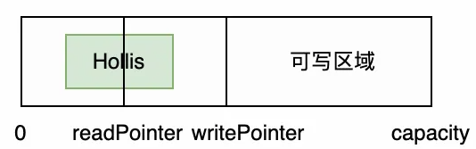

在这个过程中，我们完全不用像 JavaNIO 的 ByteBufer 一样，感知其结构内部的操作，也不用调用 flip，随意的读取和写入即可。

读到一半还可以调用 `discardReadBytes` 方法将指针位移，为可写区域增加空间。

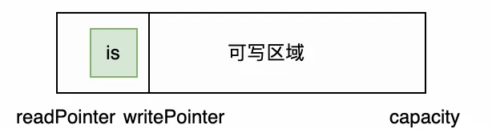

- **多种 ByteBuf 实现**

Netty 根据不同的场景，有不同的 ByteBuf 实现，主要的几种分别是：Pooled，UnPooled，Direct，Heap，列表格如下：

|                | Pooled                    | UnPooled                    |
| -------------- | ------------------------- | --------------------------- |
| HeapByteBuf    | 业务处理使用+高并发       | 业务处理使用+正常流量       |
| DireactByteBuf | Socket相关操作使用+高并发 | Socket相关操作使用+正常流量 |

当然 Netty 中的 Buffer 性能相比于 Java NIO 的 Buffer 也更强，譬如我们熟知的 Zero-Copy 等。

#### 说说 Netty 的对象池技术？

Netty 内置了对象池，用于重复利用一些已经创建过的对象，避免频繁地创建和销毁对象，从而提升系统的性能和可靠性。

> 对象池是一种非常常见的设计模式，它在多线程的环境中特别有用，能够有效地减少线程的上下文切换和资源的浪费，同时也有利于避免内存泄漏等问题。Java 中的字符串池，其实也就是一种对象池技术

当我们使用 Netty 编写一个网络应用程序时，可能需要频繁地创建和释放 ByteBuf 对象来处理输入和输出数据。如果我们每次需要时都创建新的 ByteBuf 对象，会导致频繁的垃圾回收和内存分配，降低性能。为了避免这种情况，Netty 提供了对象池技术，通过对象池来重用 ByteBuf 对象，从而减少垃圾回收和内存分配。

```java
// 创建对象池
ObjectPool<ByteBuf> pool = new DefaultObjectPool<>(new ByteBufAllocator() {
    // 创建ByteBuf对象
    @Override
    public ByteBuf buffer(int initialCapacity, int maxCapacity) {
        return Unpooled.buffer(initialCapacity, maxCapacity);
    }
});

// 从对象池中获取ByteBuf对象
ByteBuf buf = pool.borrowObject();

// 使用ByteBuf对象处理数据

// 将ByteBuf对象归还到对象池中
pool.returnObject(buf);
```

我们使用 `DefaultObjectPool` 类创建了一个对象池，并通过实现 `ByteBufAllocator` 接口的方式来指定如何创建 `ByteBuf` 对象。

通过调用 `borrowObject` 方法，我们可以从对象池中获取一个可用的 ByteBuf 对象，并在处理完数据后，调用 `returnObject` 方法将它归还到对象池中，供下次使用。这样就能够重复利用 ByteBuf 对象，从而减少了垃圾回收和内存分配。

Netty 对象池技术主要有以下几个优势：

1. **提高性能**：重复利用对象可以避免频繁地创建和销毁对象，从而减少了系统开销，提高了系统的性能。
2. **提高可靠性**：通过避免对象的重复创建和销毁，可以避免一些潜在的内存泄漏问题，从而提高系统的可靠性和稳定性。
3. **简化编程**：通过使用对象池，可以让开发人员更加专注于业务逻辑的实现，而不必过于关心对象的创建和销毁。

#### Netty 有哪些序列化协议？

Netty支持很多种序列化协议，基本上市面上常见的序列化协议他都支持的。如：

**Java 原生序列化**：Java 原生的序列化协议，可以序列化所有实现了 Serializable 接口的对象。Java 序列化虽然简单易用，但是序列化后的字节数较大，序列化性能较差，且不具备跨语言的能力，因此不太常用。

**JSON 序列化**：JSON 是一种轻量级的数据交换格式，易于阅读和编写，同时也具备跨语言的能力，因此在分布式系统中广泛使用。Netty 内置了多种 JSON 序列化库，包括 Jackson、FastJSON 等。

**XML序列化**：XML 也是一种常用的数据交换格式，可以用于跨语言的数据交换。Netty 内置了多种 XML 序列化库，包括 JAXB、XStream 等。

**Protobuf 序列化**：Protobuf 是 Google 开源的一种高效、灵活的二进制序列化协议，具有良好的跨语言能力和高效的序列化性能，被广泛应用于分布式系统中。Netty 内置了对 Protobuf 的支持。

**Thrift 序列化**：Thrift 也是一种由 Apache 开源的二进制序列化协议，具有跨语言、高效等特点，被广泛应用于分布式系统中。Netty 也提供了对 Thrift 的支持。

## Dubbo

#### 什么是 RPC，和 HTTP 有什么区别？

#### 什么场景只能用 HTTP，不能用 RPC？

#### 什么是泛化调用？

#### 什么是 Dubbo 的优雅停机，怎么实现的？

#### Dubbo 支持哪些调用协议？

#### Dubbo 服务发现与路由的概念有什么不同？

#### Dubbo 的缓存机制了解吗？

#### Dubbo 如何实现像本地方法一样调用远程方法的？

#### Dubbo 的整体架构是怎么样的？

#### 为什么 RPC 要比 HTTP 更快一些？

#### Dubbo 支持哪些序列化方式？

#### Dubbo 的服务调用的过程是什么样的？

#### 有用过 Dubbo 的异步调用吗？
