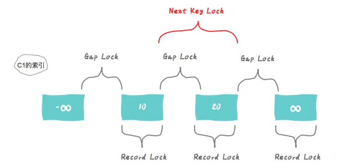

# 面试题-数据库

#### 有了关系型数据库，为什么还需要NOSQL？

NOSQL 数据库无需提前设计表结构，数据可以根据需要自由地存储和组织，而且相对于关系型数据库，NOSQL 高效灵活，非常适合那些复杂、高变化、高并发量的场景中。

#### 什么是关系型数据库，什么是非关系型数据库？

关系型数据库，是指采用了关系模型来组织数据的数据库（关系模型可以简单理解为二维表格模型），其以行和列的形式存储数据，以便于用户管理。

关系型数据库中有表的概念，表中包含了行和列，多张（或1张）表可以组成数据库。

关系型数据库具有以下几个特点：
1、传统的关系型数据库中的数据以行和列的方式进行存储。 
2、关系型数据库采用结构化查询语言（即SQL）来对数据库进行查询 
3、关系型数据库强调 ACID 规则（原子性（Atomicity）、一致性（Consistency）、隔离性（Isolation）、持久性（Durability）） 
4、关系型数据库十分强调数据的一致性，并为此降低读写性能付出了巨大的代价 
5、关系型数据的数据通常存储在硬盘中

我们常见的MySQL、Oracle等都是关系型数据库。但是因为关系型数据库强调强一致性、以及基于硬盘存储，所以存在着一定的性能问题，相比之下，非关系型数据库在这方面就会相对有些优势。

NoSQL 表示非关系型数据库，主要指那些非关系型的、分布式的，且一般不保证 ACID 的数据存储系统，主要代表如 Redis、MongoDB 等。

非关系型数据库的存储方式是基于键值来存储的，对于值的类型也有不同的支持，所以没有固定的要求和限制。

#### 关系型数据库和非关系型数据库主要有哪些区别？

1、关系型数据库以表的形式进行存储数据，而非关系型数据库以 Key-value 的形式存储数据。 
2、关系型数据库需要保证事务的 ACID，而非关系型数据库中的事务一般无法回滚。（也有部分数据库可以回滚，如 MongoDB 在集群模式下） 
3、关系型数据库可以通过一张表中的任意字段进行查询，非关系型数据库需要通过key进行查询 
4、一般来说，关系型数据库是基于硬盘存储，非关系型数据库基于内存存储。 （Mongodb 基于磁盘存储）
5、关系型数据库支持各种范围查询、公式计算等，非关系型数据库不一定支持。

#### MySQL 的数据存储一定是基于硬盘的吗？

不是的，MySQL 也可以基于内存的，即 MySQL 的内存表技术。它允许将数据和索引存储在内存中，从而提高了检索速度和修改数据的效率。优点包括具有快速响应的查询性能和节约硬盘存储空间。此外，使用内存表还可以实现更高的复杂性，从而提高了 MySQL 的整体性能。

> 创建内存表与创建普通表一样，使用CREATE TABLE语句，但需要将存储引擎设置为：ENGINE = MEMORY

#### 什么是数据库存储引擎？

数据库引擎是用于存储、处理和保护数据的核心服务。利用数据库引擎可控制访问权限并快速处理事务，从而满足企业内大多数需要处理大量数据的应用程序的要求。

使用数据库引擎创建用于联机事务处理或联机分析处理数据的关系数据库。这包括创建用于存储数据的表和用于查看、管理和保护数据安全的数据库对象（如索引、视图和存储过程）。

查看 mysql 当前使用什么存储引擎: `show engines`;

查看 mysql 当前默认的存储引擎: `show variables like '%storage_engine%'`;

查看看某个表用了什么引擎: `show create table 表名;`，在显示结果里参数 engine 后面的就表示该表当前用的存储引擎

#### MySQL 的存储引擎是基于表的还是基于数据库的？

表

#### MySQL 中如何指定引擎？

1、创建表时，可以通过ENGINE来指定存储引擎，在 create 语句最后加上“engine=存储引擎;”即可；

```sql
create table table1(id int(11) primary key auto_increment)engine=MyISAM; 
```

2、修改表时，可以使用“alter table 表名 engine=存储引擎;”来指定存储引擎。

```sql
alter table table1 engine=InnoDB; 
```

#### MySQL 支持哪几种执行引擎，有什么区别?

MySQL 是开源的，我们可以基于其源码编写我们自己的存储引擎，有以下几种存储引擎：

MyISAM、InnoDB、NDB、MEMORY，Archieve、Fedarated 以及 Maria 等。对比如下：


#### Innodb 和 MyISAM 有什么区别？

InnoDB 和 MyISAM 是 MySQL 中比较常用的两个执行引擎，MySQL 在 5.5 之前版本默认存储引擎是 MyISAM，5.5 之后版本默认存储引擎是 InnoDB，MyISAM 适合查询以及插入为主的应用，InnoDB 适合频繁修改以及涉及到安全性较高的应用。

- 如果应用需要高度的数据完整性和事务支持，那么 **InnoDB** 是更好的选择。**所以频繁修改及数据安全性的情况适合**。
- 如果应用主要是读取操作，或者需要高效的全文搜索功能，那么 MyISAM 可能更适合。**所以查询频繁的适合**。

他们主要有以下区别：

- 一、InnoDB 支持事务，MyISAM 不支持
- 二、InnoDB 是聚集索引，MyISAM 是非聚集索引。MyISAM 是采用了一种索引和数据分离的存储方式，Innodb 的聚簇索引中索引和数据在一起。
- 三、InnoDB 支持外键，MyISAM 不支持
- 四、InnoDB 最小的锁粒度是行锁，MyISAM 最小的锁粒度是表锁。
- 五、InnoDB 不支持 FULLTEXT 类型的索引（5.6之前不支持全文索引）
- 六、InnoDB 中不保存表的行数，但是 MyISAM 只要简单的读出保存好的行数即可
- 七、对于自增长的字段，InnoDB 中必须包含只有该字段的索引，但是在 MyISAM 表中可以和其他字段一起建立联合索引
- 八、清空整个表时，InnoDB 是一行一行的删除，效率非常慢。MyISAM 则会重建表

|          | InnoDB             | MyISAM   |
| -------- | ------------------ | -------- |
| 事务     | 支持               | 不支持   |
| 外键     | 支持               | 不支持   |
| 聚簇索引 | 支持               | 不支持   |
| 锁级别   | 支持行级锁、表级锁 | 表级锁   |
| 行数保存 | 不支持             | 支持     |
| 清空方式 | 逐行删除           | 重建表   |
| 默认版本 | 5.5 之后           | 5.5 之前 |
| 全文索引 | 5.6 以后支持       | 支持     |

#### char 和 varchar 的区别？

char 和 varchar 都是用于在数据库中存储字符串的数据类型。它们之间的主要区别在于存储空间的使用方式：

`char` 是一种定长的数据类型，它的长度固定且在存储时会自动在结尾添加空格来将字符串填满指定的长度。`char` 的长度范围是 `0-255`，`varchar` 是一种可变长度的数据类型，它只会存储实际的字符串内容，不会填充空格。因此，在存储短字符串时，varchar 可以节省空间。varchar 的长度范围是 `0-65535`（MySQL 5.0.3 之后的版本）。

> 如果使用 char(100)，则插入记录后就分配了 100 个字符，后续修改不会造成页分裂的问题，而 varchar(100) 由于没有提前分配存储空间，因为表中数据刚开始插入时，可变长度字段值都是根据实际长度存储下来的，且行与行之间数据也是紧密连续存放在文件地址中的。那么现在值变长了，原来的位置无法扩展出新的空间出来，所以无法覆盖存放到原来的位置上。此时 MySQL 就会使用页分裂的方法扩展字段变长的空间。

**varchar 的优点**是变长的字符串类型，兼容性更好；但是同时**也会带来一些问题**，如使用 varchar 可能会产生内存碎片、varchar 会额外需要 1 到 2 个字节存储长度信息、以及 update 语句可能会导致页分裂等。

**char 的优点**是定长的字符串类型，减少内存碎片，并且无需额外的磁盘空间去存储长度信息。但是他的**缺点是**会丢失列末尾的空格信息。

> char 会在长度不足时，在后面补充空格，所以当我要在一个长度为 10 的 char 中，分别存一个 "ping " 和 "ping"时，他存储的都是"ping    "，所以会丢失原来存储的空格信息。

#### MySQL 5.x 和 8.0 有什么区别？

1. 性能：MySQL 8.0 的速度要比 MySQL 5.7 快 2 倍。MySQL 8.0 在以下方面带来了更好的性能：读/写工作负载、IO 密集型工作负载、以及高竞争（"hot spot"热点竞争问题）工作负载。
2. NoSQL：MySQL 从 5.7  版本开始提供 NoSQL 存储功能，目前在 8.0 版本中这部分功能也得到了更大的改进。该项功能消除了对独立的 NoSQL 文档数据库的需求，而 MySQL 文档存储也为 schema-less 模式的 JSON 文档提供了多文档事务支持和完整的 ACID 合规性。
3. 窗口函数(Window Functions)：从 MySQL 8.0 开始，新增了一个叫窗口函数的概念，它可以用来实现若干新的查询方式。窗口函数与 SUM()、COUNT() 这种集合函数类似，但它不会将多行查询结果合并为一行，而是将结果放回多行当中。即窗口函数不需要 GROUP BY。
4. 隐藏索引：在 MySQL 8.0 中，索引可以被“隐藏”和“显示”。当对索引进行隐藏时，它不会被查询优化器所使用。我们可以使用这个特性用于性能调试，例如我们先隐藏一个索引，然后观察其对数据库的影响。如果数据库性能有所下降，说明这个索引是有用的，然后将其“恢复显示”即可；如果数据库性能看不出变化，说明这个索引是多余的，可以考虑删掉。
5. 取消查询缓存：MySQL 8.0 出于性能和可维护性方面的考虑取消了查询缓存，通过使用索引、更好的查询计划优化、以及缓存结果集而不是整个查询。这些方法更有效地提高了查询性能，同时避免了查询缓存可能引入的问题。
6. select for update 支持 no wait：如果另一个事务已经锁定了一些行，当前事务将等待直到那些锁被释放。加上 NOWAIT 关键字后，如果尝试锁定的行已经被其他事务锁定，数据库将立即抛出一个错误，而不是等待。
7. 降序索引：MySQL 8.0 为索引提供按降序方式进行排序的支持，在这种索引中的值也会按降序的方式进行排序。
8. 通用表表达式(Common Table Expressions CTE)：在复杂的查询中使用嵌入式表时，使用 CTE 使得查询语句更清晰。
9. UTF-8 编码：从 MySQL 8 开始，使用 utf8mb4 作为 MySQL 的默认字符集。
10. JSON：MySQL 8 大幅改进了对 JSON 的支持，添加了基于路径查询参数从 JSON 字段中抽取数据的 JSON_EXTRACT() 函数，以及用于将数据分别组合到 JSON 数组和对象中的 JSON_ARRAYAGG() 和 JSON_OBJECTAGG() 聚合函数。
11. 可靠性：InnoDB 现在支持表 DDL 的原子性，也就是 InnoDB 表上的 DDL 也可以实现事务完整性，要么失败回滚，要么成功提交，不至于出现 DDL 时部分成功的问题，此外还支持 crash-safe 特性，元数据存储在单个事务数据字典中。
12. 高可用性(High Availability)：InnoDB 集群为您的数据库提供集成的原生 HA 解决方案。
13. 安全性：对 OpenSSL 的改进、新的默认身份验证、SQL 角色、密码强度、授权。

> 详见：https://dev.mysql.com/blog-archive/whats-new-in-mysql-8-0-generally-available/

#### 什么是数据库范式，为什么要反范式？

所谓数据库范式，其实就是数据库的设计上的一些规范；这些规范可以让数据库的设计更加简洁、清晰；同时也会更加好的可以保证一致性。

三个常用的范式：

- 第一范式（1NF）是说，数据库表中的属性的原子性的，要求属性具有原子性，不可再被拆分。
  - 比如地址如果都细化拆分成省、市、区、街道、小区等等多个字段这就是符合第一范式的， 如果地址就是一个字段，那就不符合了。
- 第二范式（2NF）是说，数据库表中的每个实例或记录必须可以被唯一地区分，说白了就是要有主键，其他的字段都依赖于主键。
- 第三范式（3NF）是说，任何非主属性不依赖于其它非主属性，也就是说，非主键外的所有字段必须互不依赖。

> 如果我们在做表结构设计的时候，完全遵守数据库三范式，确实可以避免一些写时异常，提升一些写入性能，但是同时也会丢失一些读取性能。
>
> 因为在遵守范式的数据库设计中，表中不能有任何冗余字段，这就使得查询的时候就会经常有多表关联查询，这无疑是比较耗时的。

于是就有了反范式化。所谓反范式化，是一种针对遵从设计范式的数据库的性能优化策略。

也就是说，反范式化不等于非范式化，反范式化一定发生在满足范式设计的基础之上。**前者相当于先遵守所有规则，再进行局部调整。**

比如我们可以在表中增加一些冗余字段，方便我们进行数据查询，而不再需要经常做多表 join，但同时，这也会带来一个问题，那就是这些冗余字段之间的一致性如何保证，这个问题本来在遵守范式的设计中是不会有的，一旦做了反范式，那就需要开发者自行解决了。

反范式其实本质上是软件开发中一个比较典型的方案，那就是**"用空间换时间"**，通过做一些数据冗余，来提升查询速度。

在互联网业务中，比较典型的就是数据量大，并发高，并且通常查询的频率要远高于写入的频率，所以适当的做一些反范式，通过做一些字段的冗余，可以提升查询性能，降低响应时长，从而提升并发度。

#### 为什么大厂不建议使用多表 join？

MySQL 是使用了嵌套循环（Nested-Loop Join）的方式来实现关联查询的，简单点说就是要通过两层循环，用第一张表做外循环，第二张表做内循环，外循环的每一条记录跟内循环中的记录作比较，符合条件的就输出。

而具体到算法实现上主要有 `simple nested loop`，`block nested loop` 和 `index nested loop` 这三种。而且这三种的效率都没有特别高。

MySQL 是使用了嵌套循环（Nested-Loop Join）的方式来实现关联查询的，如果有 2 张表 join 的话，复杂度最高是 `O(n^2)`，3 张表则是 `O(n^3)`...随着表越多，表中的数据量越多， JOIN 的效率会呈指数级下降。

> MySQL 8.0 中新增了 hash join 算法

#### MySQL 的 Hash Join 是什么？

hash join 是 MySQL 8.0.18 版本中新推出的一种多表 join 的算法。

> 在这之前，MySQL 是使用了嵌套循环（Nested-Loop Join）的方式来实现关联查询的，而嵌套循环的算法其实性能是比较差的，而 Hash Join 的出现就是要优化 Nested-Loop Join 的。

所谓 Hash Join，其实是因为他底层用到了 Hash 表。

Hash Join 是一种针对 equal-join 场景的优化，他的基本思想是将驱动表数据加载到内存，并建立 hash 表，这样只要遍历一遍非驱动表，然后再去通过哈希查找在哈希表中寻找匹配的行 ，就可以完成 join 操作了。

但是，内存是有限的（通过 `join_buffer_size` 限制），**如果内存中存不下驱动表的数据怎么办呢？**

#### 基于磁盘的 hash join

如果驱动表中的数据量比较大， 没办法一次性的加载到内存中，就需要考虑把这些数据存储在磁盘上。通过将哈希表的一部分存储在磁盘上，分批次地加载和处理数据，从而减少对内存的需求。

在这样的算法中，为了避免一个大的 hash 表内存中无法完全存储，那么就采用分表的方式来实现，即首先利用 hash 算法将驱动表进行分表，并产生临时分片写到磁盘上。

这样就相当于把一张驱动表，拆分成多个 hash 表，并且分别存储在磁盘上。

接下来就是做 join 了，在这个过程中，会对被驱动表使用同样的 hash 算法进行分区，确定好在哪个分区之后，先确认下这个分区是否已经加载到内存，如果已经加载，则直接在内存中的哈希表中进行查找匹配的行。

如果哈希值对应的分区尚未加载到内存中，则从磁盘上读取该分区的数据到内存中的哈希表，并进行匹配。

就这样不断的重复进行下去，直到把所有数据都 join 完，把结果集返回。

#### 说一说 MySQL 一条 SQL 语句的执行过程？


1. 使用连接器，通过客户端/服务器通信协议与 MySQL 建立连接。并查询是否有权限
2. Mysql8.0 之前检查是否开启缓存，开启了 Query Cache 且命中完全相同的 SQL 语句，则将查询结果直接返回给客户端；
3. 由解析器（分析器)进行语法分析和语义分析，并生成解析树。如查询是 select、表名users、条件是 `age='18' and name='ping'`，预处理器则会根据 MySQL 规则进一步检查解析树是否合法。比如检查要查询的数据表或数据列是否存在等。
4. 由优化器生成执行计划。根据索引看看是否可以优化
5. 执行器来执行 SQL 语句，这里具体的执行会操作MySQL的存储引擎来执行 SQL 语句，根据存储引擎类型，得到查询结果。若开启了 Query Cache，则缓存，否则直接返回。

#### InnoDB 支持哪几种行格式？

数据库表的行格式决定了一行数据是如何进行物理存储的，进而影响查询和 DML 操作的性能。

在 InnoDB 中，常见的行格式有 4 种：

- **COMPACT** ：是 MySQL 5.0 之前的默认格式，除了保存字段值外，还会利用空值列表保存 null 值，还会记录变长字段长度列表和记录头信息。


> 对于可变长度列，前 768 字节的数据存储在B树节点的索引记录中，超出部分存储在溢出页中。大于或等于 768 字节的固定长度列会被编码为可变长度列，并可以存储在页外。

- **REDUNDANT** ：Redundant 是 MySQL5.0 版本之前 InnoDB 的行记录存储方式，用的比较少，Redundant 行格式会把该条记录中所有列 (包括隐藏列) 的长度信息都存储到 '字段长度偏移列表' 中。


- **DYNAMIC**：DYNAMIC 格式在 MySQL 5.7 版本引入，是 COMPACT 格式的改进版。它保持了 COMPACT 格式的优点，同时在存储大的可变长度列时更加灵活，能够动态地选择存储在页内或页外。DYNAMIC 格式适用于大部分的应用场景，并在存储空间和性能上做了一定的平衡。其结构和 COMPACT 大致相同；

- **COMPRESSED**：是 MySQL 5.1 中 InnoDB 的新特性之一，它可以在存储数据时对数据进行压缩，从而减小磁盘占用空间。它的缺点是增加了 CPU 的使用，可能会降低一些查询的性能。COMPRESSED 行格式是在 DYNAMIC 行格式的基础上添加了页外压缩功能。在存储时，如果发现数据可以通过压缩减小存储空间，就会使用压缩方式来存储数据。在查询时，会自动解压缩数据并返回结果。
- **BARRACUDA**：是 MySQL 5.7 引入的一种新格式，相对于前面的格式，支持更多的高级特性，如动态行格式、行级压缩、空间管理等。

| 行格式     | 紧凑的存储特性 | 增强的可变长度列存储 | 大索引键前缀支持 | 压缩支持 | 支持的表空间类型                | 所需文件格式          |
| ---------- | -------------- | -------------------- | ---------------- | -------- | ------------------------------- | --------------------- |
| REDUNDANT  | 否             | 否                   | 否               | 否       | system, file-per-table, general | Antelope or Barracuda |
| COMPACT    | 是             | 否                   | 否               | 否       | system, file-per-table, general | Antelope or Barracuda |
| DYNAMIC    | 是             | 是                   | 是               | 否       | system, file-per-table, general | Barracuda             |
| COMPRESSED | 是             | 是                   | 是               | 是       | file-per-table, general         | Barracuda             |

#### 什么是数据库事务？

数据库事务 (transaction) 是访问并可能操作各种数据项的一个数据库操作序列，这些操作要么全部执行，要么全部不执行，是一个不可分割的工作单位。 事务由事务开始与事务结束之间执行的全部数据库操作组成。

并非任意的对数据库的操作序列都是数据库事务。事务应该具有4个属性：原子性、一致性、隔离性、持久性。这四个属性通常称为ACID特性。

原子性（Atomicity）：事务作为一个整体被执行，包含在其中的对数据库的操作要么全部被执行，要么都不执行。

一致性（Consistency）：事务应确保数据库的状态从一个一致状态转变为另一个一致状态。一致状态的含义是数据库中的数据应满足完整性约束。

隔离性（Isolation）：多个事务并发执行时，一个事务的执行不应影响其他事务的执行。

持久性（Durability）：一个事务一旦提交，他对数据库的修改应该永久保存在数据库中。

#### InnoDB的一次更新事务是怎么实现的？

一次 InnnoDB 的 update 操作，涉及到 BufferPool、BinLog、UndoLog、RedoLog 以及物理磁盘，完整的一次操作过程基本如下：

**1、在 Buffer Pool 中读取数据：**当 InnoDB 需要更新一条记录时，首先会在 Buffer Pool 中查找该记录是否在内存中。如果没有在内存中，则从磁盘读取该页到 Buffer Pool 中。

**2、记录 UndoLog：**在修改操作前，InnoDB 会在 Undo Log 中记录修改前的数据。Undo Log 是用来保证事务原子性和一致性的一种机制，用于在发生事务回滚等情况时，将修改操作回滚到修改前的状态，以达到事务的原子性和一致性。UndoLog 的写入最开始写到内存中的，然后由1个后台线程定时刷新到磁盘中的。

**3、在 Buffer Pool 中更新：**当执行 update 语句时，InnoDB 会先更新已经读取到 Buffer Pool 中的数据，而不是直接写入磁盘。同时，InnoDB 会将修改后的数据页状态设置为“脏页”（Dirty Page）状态，表示该页已经被修改但尚未写入磁盘。

**4、记录 RedoLog Buffer：**InnoDB 在 Buffer Pool 中记录修改操作的同时，InnoDB 会先将修改操作写入到 redo log buffer 中。

**5、提交事务：**在执行完所有修改操作后，事务被提交。在提交事务时，InnoDB 会将 Redo Log 写入磁盘，以保证事务持久性。

**6、写入磁盘：**在提交过程后，InnoDB 会将 Buffer Pool 中的脏页写入磁盘，以保证数据的持久性。但是这个写入过程并不是立即执行的，是有一个后台线程异步执行的，所以可能会延迟写入，总之就是 MYSQL 会选择合适的时机把数据写入磁盘做持久化。

**7、记录 Binlog：**在提交过程中，InnoDB 会将事务提交的信息记录到 Binlog 中。Binlog 是 MySQL 用来实现主从复制的一种机制，用于将主库上的事务同步到从库上。在 Binlog 中记录的信息包括：事务开始的时间、数据库名、表名、事务 ID、SQL 语句等。


需要注意的是，在 binlog 和 redolog 的写入过程中，其实是分成了 2 阶段的，通过 2 阶段提交的方式来保证一致性的。

#### 什么是脏读、幻读、不可重复读？

脏读：读到了其他事务还没有提交的数据。
不可重复读：对某数据进行读取过程中，有其他事务对数据进行了修改（UPDATE、DELETE)，导致第二次读取的结果不同。 
幻读：事务在做范围查询过程中，有另外一个事务对范围内新增了记录(INSERT)，导致范围查询的结果条数不一致。

#### MySQL 中的事务隔离级别？

SQL-92 标准还定义了 4 种隔离级别来解决脏读、幻读、不可重复读等这些异常情况，从高到底依次为：**可串行化(Serializable)**、**可重复读(Repeatable reads)**、**提交读(Read committed)**、**未提交读(Read uncommitted)**。

- 未提交读(Read uncommitted) 是最低的隔离级别。通过名字我们就可以知道，在这种事务隔离级别下，一个事务可以读到另外一个事务未提交的数据。这种隔离级别下会存在幻读、不可重复读和脏读的问题。

- 提交读(Read committed) 也可以翻译成读已提交，通过名字也可以分析出，在一个事务修改数据过程中，如果事务还没提交，其他事务不能读该数据。所以，这种隔离级别是可以避免脏读的发生的。

- 可重复读(Repeatable reads)，由于提交读隔离级别会产生不可重复读的读现象。所以，比提交读更高一个级别的隔离级别就可以解决不可重复读的问题。这种隔离级别就叫可重复读。但是这种隔离级别没办法彻底解决幻读。

- 可串行化(Serializable) 是最高的隔离级别，前面提到的所有的隔离级别都无法解决的幻读，在可串行化的隔离级别中可以解决。

| 隔离级别                                | 脏读 | 不可重复读 | 幻读 |
| --------------------------------------- | ---- | ---------- | ---- |
| 能读到未提交的数据 RU, READ-UNCOMMITTED | Y    | Y          | Y    |
| 能读到已提交的数据 RC，READ-COMMITTED   | N    | Y          | Y    |
| 可重复读 RR, REPEATABLEREAD             | N    | N          | Y    |
| 串行执行 SERIALIZABLE                   | N    | N          | N    |

> 注意！！！以上是 SQL-92 标准中对事务隔离级别以及需要解决的读现象（脏读、幻读、不可重复读）的定义，但是不同的数据库在实际实现的过程中，是有一些细微差异的。

1、查看当前会话隔离级别

`select @@tx_isolation;`

在 MySQL 8.0 中：`SELECT @@transaction_isolation;`

2、查看系统当前隔离级别

`select @@global.tx_isolation;`

3、设置当前会话隔离级别

`set session transaction isolatin level repeatable read;`

4、设置系统当前隔离级别

5、命令行，开始事务时

`set autocommit=off` 或者 `start transaction`

#### InnoDB 如何解决脏读、不可重复读和幻读的？

在 Innodb 中，通过 **MVCC 解决脏读和不可重复读**，通过 **MVCC + 间隙锁解决幻读**的。

脏读的解决。脏读指一个事务可以读取另一个事务未提交的数据，导致数据不一致。在读已提交（Read Committed）隔离级别下，事务只能读取到其他事务已经提交的数据版本。因此，如果一个事务在读取数据时，另一个事务已经修改了这些数据但尚未提交，那么读取事务将不会看到这些未提交的更改。

当事务在“读已提交”隔离级别下执行读取操作时，InnoDB 获取当前最新的全局事务 ID，这个 ID 表示在当前时刻所有已提交事务的最新状态。InnoDB会检查每个数据行的版本，如果该版本是由一个小于或等于当前事务 ID 的事务修改的，并且该事务已提交，则这个版本是可见的。这保证了事务只能看到在它开始之前已经提交的数据版本。

不可重读的解决。不可重复读指一个事务读取同一行数据两次，但是在两次读取之间另一个事务修改了该行数据，导致两次读取的结果不同。InnoDB 通过使用 MVCC 来解决不可重复读的问题。在 RR 这种隔离级别下，当我们使用快照读进行数据读取的时候，只会在第一次读取的时候生成一个 Read View，后续的所有快照读都是用的同一个快照，所以就不会发生不可重复读的问题了。

幻读的解决。InnoDB 的 RR 级别中，基于 MVCC + 间隙锁，是在某种程度上是可以避免幻读的发生的，但是没有办法完全避免，当一个事务中发生当前读的时候，会导致幻读的发生。

#### Innodb 的 RR 到底有没有解决幻读？

InnoDB 中的 REPEATABLE READ 这种隔离级别通过 **间隙锁 + MVCC** 解决了大部分的幻读问题，但是并不是所有的幻读都能解读，想要彻底解决幻读，需要使用 Serializable 的隔离级别。

RR 中，通过间隙锁解决了部分当前读的幻读问题，通过增加间隙锁将记录之间的间隙锁住，避免新的数据插入。

RR 中，通过 MVCC 机制的，解决了快照读的幻读问题，RR 中的快照读只有第一次会进行数据查询，后面都是直接读取快照，所以不会发生幻读。

但是，如果两个事务，事务1 先进行快照读，然后事务2 插入了一条记录并提交，再在事务1 中进行 update 新插入的这条记录是可以更新出成功的，这就是发生了幻读。

还有一种场景，如果两个事务，事务1 先进行快照读，然后事务2 插入了一条记录并提交，在事务1 中进行了当前读之后，再进行快照读也会发生幻读。

#### MVCC 解决幻读

MVCC，是 Multiversion Concurrency Control 的缩写，翻译过来是多版本并发控制，和数据库锁一样，他也是一种并发控制的解决方案。它主要用来解决读-写并发的情况。

我们知道，在 MVCC 中有两种读，一种是快照读、一种是当前读。

所谓快照读，就是读取的是快照数据，即快照生成的那一刻的数据，像我们常用的普通的 SELECT 语句在不加锁情况下就是快照读。

`SELECT * FROM xx_table WHERE ...`

在 RC 中，每次读取都会重新生成一个快照，总是读取行的最新版本。
在 RR 中，快照会在事务中第一次 SELECT 语句执行时生成，只有在本事务中对数据进行更改才会更新快照。

那么也就是说，如果在 RR 下，一个事务中的多次查询，是不会查询到其他的事务中的变更内容的，所以，也就是可以解决幻读的。

如果我们把事务隔离级别设置为 RR，那么因为有了 MVCC 的机制，就能解决幻读的问题。

#### 间隙锁与幻读

上面我们讲过了 MVCC 能解决 RR 级别下面的快照读的幻读问题，那么当前读下面的幻读问题怎么解决呢？

当前读就是读取最新数据，所以，加锁的 SELECT，或者对数据进行增删改都会进行当前读，比如：

```sql
SELECT * FROM xx_table LOCK IN SHARE MODE;

SELECT * FROM xx_table FOR UPDATE;

INSERT INTO xx_table ...

DELETE FROM xx_table ...

UPDATE xx_table ...
```

在 RR 的级别下，当我们使用 `SELECT … FOR UPDATE `的时候，会进行加锁，不仅仅会对行记录进行加锁，还会对记录之间的间隙进行加锁，这就叫做间隙锁。

#### 解决不了的幻读

前面我们介绍了快照读（无锁查询）和当前读（有锁查询）下是如何解决幻读的问题的，但是，上面的例子就是幻读的所有情况了吗？显然并不是。

我们说 MVCC 只能解决快照读的幻读，那如果在一个事务中发生了当前读，并且在另一个事务插入数据前没来得及加间隙锁的话，会发生什么呢？


在上面的例子中，在事务1 中，我们并没有在事务开启后立即加锁，而是进行了一次普通的查询，然后事务2 插入数据成功之后，再通过事务1进行了2次查询。

我们发现，事务1后面的两次查询结果完全不一样，没加锁的情况下，就是快照读，读到的数据就和第一次查询是一样的，就不会发生幻读。但是第二次查询加了锁，就是当前读，那么读取到的数据就有其他事务提交的数据了，就发生了幻读。

那么，如果你理解了上面的这个例子，并且你也理解了当前读的概念，那么你很容易就能想到，下面的这个CASE其实也是会发生幻读的：


这里发生幻读的原理，和上面的例子其实是一样的，那就是 MVCC 只能解决快照读中的幻读问题，而对于当前读（SELECT FOR UPDATE、UPDATE、DELETE 等操作）还是会产生幻读的现象的。即，在同一个事务里面，如果既有快照读，又有当前读，那是会产生幻读的、

UPDATE 语句也是一种当前读，所以它是可以读到其他事务的提交结果的。

为什么事务1 的最后一次查询和倒数第二次查询的结果也不一样呢？

是因为根据快照读的定义，在 RR 中，如果本事务中发生了数据的修改，那么就会更新快照，那么最后一次查询的结果也就发生了变化。

#### 如何避免幻读?

那么了解了幻读的解决场景，以及不能解决的几个 CASE 之后，我们来总结一下该如何解决幻读的问题呢？

首先，如果想要彻底解决幻读的问题，在 InnoDB 中只能使用 Serializable 这种隔离级别。

那么，如果想在一定程度上解决或者避免发生幻读的话，使用 RR 也可以，但是 RC、RU 肯定是不行的。

在 RR 级别中，能使用快照读（无锁查询）的就使用快照读，这样不仅可以减少锁冲突，提升并发度，而且还能避免幻读的发生。

那么，如果在并发场景中，一定要加锁的话怎么办呢？那就一定要在事务一开始就立即加锁，这样就会有间隙锁，也能有效的避免幻读的发生。
但是需要注意的是，间隙锁是导致死锁的一个重要根源~所以，用起来也需要慎重。

#### 为什么 MySQL 默认使用 RR 隔离级别？

对于数据库的默认隔离级别，Oracle 默认的隔离级别是 RC，而 MySQL 默认的隔离级别是 RR。

那么，你知道为什么 Oracle 选择 RC 作为默认级别，而 MySQL 要选择 RR 作为默认的隔离级别吗？

**Oracle 的隔离级别**

Oracle 只支持 ANSI/ISO SQL 定义的 Serializable 和 Read Committed，其实，根据 Oracle 官方文档给出的介绍，Oracle 支持三种隔离级别：


即 Oracle 支持 Read Committed、Serializable 和 Read-Only。

Read-Only 只读隔离级别类似于 Serializable 隔离级别，但是只读事务不允许在事务中修改数据，除非用户是 SYS。

在 Oracle 这三种隔离级别中，Serializable 和 Read-Only 显然都是不适合作为默认隔离级别的，那么就只剩 Read Committed 这个唯一的选择了。

**MySQL 的隔离级别**

相比于 Oracle，MySQL 的默认隔离级别的可选范围就比较大了。

首先，我们先从四种隔离级别中排除 Serializable 和 Read Uncommitted 这两种，主要是因为这两个级别一个隔离级别太高，一个太低。太高的就会影响并发度，太低的就有脏读现象。

那么，剩下的 RR 和 RC 两种，怎么选？

在 MySQL 设计之初，他的定位就是提供一个稳定的关系型数据库。而为了要解决 MySQL 单点故障带来的问题，MySQL 采用主从复制的机制。

所谓主从复制，其实就是通过搭建 MySQL 集群，整体对外提供服务，集群中的机器分为主服务器（Master）和从服务器（Slave），主服务器提供写服务，从服务器提供读服务。

为了保证主从服务器之间的数据的一致性，就需要进行数据同步，大致的同步过程如下，这里就不详细介绍了


MySQL 在主从复制的过程中，数据的同步是通过 bin log 进行的，简单理解就是主服务器把数据变更记录到 bin log 中，然后再把 bin log 同步传输给从服务器，从服务器接收到 bin log之后，再把其中的数据恢复到自己的数据库存储中。

那么，binlog 里面记录的是什么内容呢？格式是怎样的呢？

MySQL 的 bin log 主要支持三种格式，分别是 statement、row 以及 mixed。MySQL 是在 5.1.5 版本开始支持 row 的、在 5.1.8 版本中开始支持 mixed。

statement 和 row 最大的区别，当 binlog 的格式为 statement 时，binlog 里面记录的就是 SQL 语句的原文（这句话很重要！！！后面会用的到）。

因为 MySQL 早期只有 statement 这种 bin log 格式，这时候，如果使用提交读 (Read Committed)、未提交读 (Read Uncommitted) 这两种隔离级别会出现问题。

> 举个例子，有一个数据库表t1，表中有如下两条记录：

```sql
CREATE TABLE `t1` (
  `a` int(11) DEFAULT NULL,
  `b` int(11) DEFAULT NULL,
  KEY `b` (`b`)
) ENGINE=InnoDB DEFAULT CHARSET=latin1;

insert into t1 values(10,1);
```

接着开始执行两个事务的写操作：

| Session1                                                     | Session2                                                |
| ------------------------------------------------------------ | ------------------------------------------------------- |
| set session transaction isolation level read committed;<br/>设置会话事务隔离级别 读取已提交; |                                                         |
| set autocommit = 0;                                          | set session transaction isolation level read committed; |
|                                                              | set autocommit = 0;                                     |
| begin;                                                       | begin;                                                  |
| delete from t1 where b < 100;                                |                                                         |
|                                                              | insert into t1 values(10,99);                           |
|                                                              | commit;                                                 |
| commit;                                                      |                                                         |

以上两个事务执行之后，数据库里面的记录会只有一条记录（10,99），这个发生在主库的数据变更大家都能理解。

即使 Session 1 的删除操作在 Session 2 的插入操作之后提交，由于 READ COMMITTED 的隔离级别，Session 2 的插入操作不会看到 Session 1 的删除操作，所以最后数据库中仍然会留下 Session 2 插入的记录 (10,99)。

> 以上两个事务执行之后，会在 bin log 中记录两条记录，因为事务2 先提交，所以 `insert into t1 values(10,99);` 会被优先记录，然后再记录 `delete from t1 where b < 100;` （再次提醒：statement 格式的 bin log 记录的是 SQL 语句的原文）
>
> 这样 bin log 同步到备库之后，SQL 语句回放时，会先执行 `insert into t1 values(10,99);`，再执行 `delete from t1 where b < 100;`。
>
> 这时候，数据库中的数据就会变成 EMPTY SET，即没有任何数据。这就导致主库和备库的数据不一致了！！！

为了避免这样的问题发生。MySQL 就把数据库的默认隔离级别设置成了 Repetable Read，那么，Repetable Read 的隔离级别下是如何解决这样问题的那？

那是因为 Repetable Read 这种隔离级别，会在更新数据的时候不仅对更新的行加行级锁，还会增加 GAP 锁和临键锁。上面的例子，在事务2 执行的时候，因为事务1 增加了 GAP 锁和临键锁，就会导致事务2 执行被卡住，需要等事务1提交或者回滚后才能继续执行。

**除了设置默认的隔离级别外，MySQL 还禁止在使用 statement 格式的 bin log 的情况下，使用 READ COMMITTED 作为事务隔离级别。**

一旦用户主动修改隔离级别，尝试更新时，会报错：

```
ERROR 1598 (HY000): Binary logging not possible. Message: Transaction level 'READ-COMMITTED' in InnoDB is not safe for binlog mode 'STATEMENT'
```

所以，现在我们知道了，为什么 MySQL 选择 RR 作为默认的数据库隔离级别了吧，其实就是为了兼容历史上的那种 statement 格式的 bin log。

#### 为什么很多大厂会把默认的 RR 改成 RC

虽然RR的隔离级别可以在一定程度上避免脏读、不可重复读和幻读等问题，但是，对于很多大型的互联网来说，会愿意将数据库的默认隔离级别调整成并发度更高的 RC 级别，从而，提升并发度并且降低发生死锁的概率。

**互联网公司和传统企业最大的区别是什么？**

**高并发！**

没错，互联网业务的并发度比传统企业要高处很多。2020 年双十一当天，订单创建峰值达到 58.3 万笔/秒。

很多人问，要怎么做才能扛得住这么大的并发量。其实，这背后的优化多到几个小时都讲不完，因为要做的、可以做的事情实在是太多了。

而有一个和我们今天这篇文章有关的优化，那就是通过修改数据库的隔离级别来提升并发度。

为什么 RC 比 RR 的并发度要好呢？

首先，RC 在加锁的过程中，是不需要添加 Gap Lock 和 Next-Key Lock 的，只对要修改的记录添加行级锁就行了。

这就使得并发度要比 RR 高很多。

另外，因为 RC 还支持"半一致读"，可以大大的减少了更新语句时行锁的冲突；对于不满足更新条件的记录，可以提前释放锁，提升并发度。

**减少死锁**

因为RR这种事务隔离级别会增加 Gap Lock 和 Next-Key Lock，这就使得锁的粒度变大，那么就会使得死锁的概率增大。

死锁：一个事务锁住了表A，然后又访问表B；另一个事务锁住了表B，然后企图访问表A；这时就会互相等待对方释放锁，就导致了死锁。

RR 和 RC 主要在加锁机制、主从同步以及一致性读方面存在一些差异。

而很多大厂，为了提升并发度和降低死锁发生的概率，会把数据库的隔离级别从默认的 RR 调整成 RC。

当然，这样做也不是完全没有问题，首先使用 RC 之后，就需要自己解决不可重复读的问题，这个其实还好，很多时候不可重复读问题其实是可以忽略的，或者可以用其他手段解决。

比如读取到别的事务修改的值其实问题不太大的，只要修改的时候的不基于错误数据就可以了，所以我们都是在核心表中增加乐观锁标记，更新的时候都要带上锁标记进行乐观锁更新。

还有就是使用 RC 的时候，不能使用 statement 格式的 binlog，这种影响其实可以忽略不计了，因为 MySQL 是在 5.1.5 版本开始支持 row 的、在 5.1.8 版本中开始支持 mixed，后面这两种可以代替 statement 格式。

#### RR 和 RC 的区别

**一致性读**

一致性读，又称为快照读。快照即当前行数据之前的历史版本。快照读就是使用快照信息显示基于某个时间点的查询结果，而不考虑与此同时运行的其他事务所执行的更改。

在 MySQL 中，只有 READ COMMITTED 和 REPEATABLE READ 这两种事务隔离级别才会使用一致性读。

在 RR 中，快照会在事务中第一次 SELECT 语句执行时生成，只有在本事务中对数据进行更改才会更新快照。

在 RC 中，每次读取都会重新生成一个快照，总是读取行的最新版本。

在数据库的 RC 这种隔离级别中，还支持"半一致读" ，一条 update 语句，如果 where 条件匹配到的记录已经加锁，那么 InnoDB 会返回记录最近提交的版本，由 MySQL 上层判断此是否需要真的加锁。

**锁机制**

数据库的锁，在不同的事务隔离级别下，是采用了不同的机制的。在 MySQL 中，有三种类型的锁，分别是 Record Lock、Gap Lock 和 Next-Key Lock。

Record Lock 表示记录锁，锁的是索引记录。

Gap Lock 是间隙锁，锁的是索引记录之间的间隙。

Next-Key Lock 是 Record Lock 和 Gap Lock 的组合，同时锁索引记录和间隙。他的范围是左开右闭的。

在 RC 中，只会对索引增加 Record Lock，不会添加 Gap Lock 和 Next-Key Lock。

在 RR 中，为了解决幻读的问题，在支持 Record Lock 的同时，还支持 Gap Lock 和 Next-Key Lock；

**主从同步**

在数据主从同步时，不同格式的 binlog 也对事务隔离级别有要求。

MySQL 的 binlog 主要支持三种格式，分别是 statement、row 以及 mixed，但是，RC 隔离级别只支持 row 格式的 binlog。如果指定了 mixed 作为 binlog 格式，那么如果使用 RC，服务器会自动使用基于 row 格式的日志记录。

而 RR 的隔离级别同时支持 statement、row 以及 mixed 三种。

#### 当前读和快照读有什么区别？

所谓快照读，就是读取的是快照数据，即快照生成的那一刻的数据，像我们常用的普通的 SELECT 语句在不加锁情况下就是快照读。如：

```sql
SELECT * FROM xx_table WHERE ...
```

和快照读相对应的另外一个概念叫做当前读，当前读就是读取最新数据，所以，加锁的 SELECT，或者对数据进行增删改都会进行当前读，比如：

```sql
SELECT * FROM xx_table LOCK IN SHARE MODE;

SELECT * FROM xx_table FOR UPDATE;

INSERT INTO xx_table ...

DELETE FROM xx_table ...

UPDATE xx_table ...
```

在 MySQL 中，只有 READ COMMITTED 和 REPEATABLE READ 这两种事务隔离级别才会使用快照读。

- 在 RR 中，快照会在事务中第一次 SELECT 语句执行时生成，只有在本事务中对数据进行更改才会更新快照。
- 在 RC 中，每次读取都会重新生成一个快照，总是读取行的最新版本。

#### 如何理解MVCC？

MVCC，是 Multiversion Concurrency Control 的缩写，翻译过来是多版本并发控制，和数据库锁一样，他也是一种并发控制的解决方案。

我们知道，在数据库中，对数据的操作主要有 2 种，分别是读和写，而在并发场景下，就可能出现以下三种情况：

- 读-读并发
- 读-写并发
- 写-写并发

我们都知道，在没有写的情况下读-读并发是不会出现问题的，而写-写并发这种情况比较常用的就是通过加锁的方式实现。那么，读-写并发则可以通过 MVCC 的机制解决。

> 快照读是 MVCC 实现的基础，而当前读是悲观锁实现的基础。
>
> 那么，快照读读到的快照是从哪里读到的呢？换句话说，快照是存在哪里的呢？

**UndoLog**

undo log 是 Mysql 中比较重要的事务日志之一，顾名思义，undo log 是一种用于回退的日志，在事务没提交之前，MySQL 会先记录更新前的数据到 undo log 日志文件里面，当事务回滚时或者数据库崩溃时，可以利用 undo log 来进行回退。

这里面提到的存在 undo log 中的"更新前的数据"就是我们前面提到的快照。所以，这也是为什么很多人说 UndoLog 是 MVCC 实现的重要手段的原因。

那么，一条记录在同一时刻可能有多个事务在执行，那么，undo log 会有一条记录的多个快照，那么在这一时刻发生 SELECT 要进行快照读的时候，要读哪个快照呢？

这就需要用到另外几个信息了。

**行记录的隐式字段**

其实，数据库中的每行记录中，除了保存了我们自己定义的一些字段以外，还有一些重要的隐式字段的：

- `db_row_id`：隐藏主键，如果我们没有给这个表创建主键，那么会以这个字段来创建聚簇索引。 
- `db_trx_id`：对这条记录做了最新一次修改的事务的ID 
- `db_roll_ptr`：回滚指针，指向这条记录的上一个版本，其实他指向的就是Undo Log中的上一个版本的快照的地址。 

因为每一次记录变更之前都会先存储一份快照到 `undo log` 中，那么这几个隐式字段也会跟着记录一起保存在 `undo log` 中，就这样，每一个快照中都有一个 `db_trx_id` 字段表示了对这个记录做了最新一次修改的事务的ID，以及一个 `db_roll_ptr` 字段指向了上一个快照的地址。（`db_trx_id` 和 `db_roll_ptr` 是重点，后面还会用到）

这样，就形成了一个快照链表：


有了 `undo log`，又有了几个隐式字段，我们好像还是不知道具体应该读取哪个快照，那怎么办呢？

**Read View**

这时候就需要Read View 登场了，

Read View 主要来帮我们解决可见性的问题的, 即他会来告诉我们本次事务应该看到哪个快照，不应该看到哪个快照。

在 Read View 中有几个重要的属性：

- **trx_ids**，系统当前未提交的事务 ID 的列表。
- **low_limit_id**，应该分配给下一个事务的id 值。
- **up_limit_id**，未提交的事务中最小的事务 ID。
- **creator_trx_id**，创建这个 Read View 的事务 ID。

每开启一个事务，我们都会从数据库中获得一个事务 ID，这个事务 ID 是自增长的，通过 ID 大小，我们就可以判断事务的时间顺序。

那么，一个事务应该看到哪些快照，不应该看到哪些快照该如何判断呢？

其实原则比较简单，那就是事务ID大的事务应该能看到事务ID小的事务的变更结果，反之则不能！举个例子：

假如当前有一个事务3想要对某条记录进行一次快照读的时候，他会先创建一个 Read View，并且把当前所有还未提交的事务的信息记录下来。比如 `up_limit_id = 2`，`low_limit_id = 5`，`trx_ids= [2,4,5]`，`creator_trx_id= 3`

我们前面说过，每一条记录上都有一个隐式字段 db_trx_id 记录对这条记录做了最新一次修改的事务的ID，如 db_trx_id = 3；

那么接下来，数据库会拿这条记录 db_trx_id 和 Read View 进行可见性比较。

如果 `db_trx_id < up_limit_id`，则说明，在Read View中所有未提交的事务创建之前，db_trx_id = 3 的这个事务就已经提交了，并且在这期间，并没有新的事务提交。所以，这条记录对当前事务就应该是可见的。

如果，`db_trx_id > low_limit_id`，则说明，db_trx_id = 3 的这个事务是在 Read View 中所有未提交的事务创建之后才提交的，也就是说，在当前事务开启之后，有别的事务修改了数据并作了提交。所以，这个记录对于当前事务来说应该就是不可见的。（不可见怎么办呢？后面讲）

那么，还有另外一种情况，那就是 `up_limit_id < db_trx_id < low_limit_id`，这种情况下，会再拿 `db_trx_id` 和 `Read View` 中的 `trx_ids` 进行逐一比较。

如果，`db_trx_id` 在 `trx_ids` 列表中，那么表示在当前事务开启时，并未提交的某个事务在修改数据之后提交了，那么这个记录对于当前事务来说应该是不可见的。

如果，`db_trx_id` 不在 `trx_ids` 列表中，那么表示的是在当前事务开启之前，其他事务对数据进行修改并提交了，所以，这条记录对当前事务就应该是可见的。

所以，当读取一条记录的时候，经过以上判断，发现记录对当前事务可见，那么就直接返回就行了。那么如果不可见怎么办？没错，那就需要用到 `undo log` 了。

当数据的事务ID 不符合 Read View 规则时候，那就需要从 `undo log` 里面获取数据的历史快照，然后数据快照的事务ID 再来和 `Read View` 进行可见性比较，如果找到一条快照，则返回，找不到则返回空。

> 所以，总结一下，在 InnoDB 中，MVCC 就是通过 Read View + Undo Log 来实现的，undo log 中保存了历史快照，而 Read View 用来判断具体哪一个快照是可见的。

#### MVCC和可重复读

其实，根据不同的事务隔离级别，Read View 的获取时机是不同的，在 RC 下，一个事务中的每一次 SELECT 都会重新获取一次 Read View，而在RR下，一个事务中只在第一次 SELECT 的时候会获取一次 Read View。

所以，可重复读这种事务隔离级别之下，因为有 MVCC 机制，就可以解决不可重复读的问题，因为他只有在第一次 SELECT 的时候才会获取一次 Read View，天然不存在重复读的问题了。

#### 介绍下 InnoDB 的锁机制？

Innodb 中的锁在锁的级别上一版分为两种，一种是共享锁（S锁），一种是排他锁（X锁）。

**共享锁 & 排他锁**

共享锁又称读锁，是读取操作创建的锁。其他用户可以并发读取数据，但任何事务都不能对数据进行修改（获取数据上的排他锁），直到已释放所有共享锁。

排他锁又称写锁，如果事务T对数据A加上排他锁后，则其他事务不能再对A加任任何类型的锁。获得排他锁的事务既能读数据，又能修改数据。

> 这就是我们经常会看到的 X 锁和 S 锁。即排他锁和共享锁。
>
> 除了 S 锁和 X 锁之外，Innodb 还有两种锁，是 IX 锁和 IS 锁，这里的 I 是 Intention 的意思，即意向锁。IX 就是意向排他锁，IS 就是意向共享锁。

**意向锁**

当一个事务请求获取一个行级锁或表级锁时，MySQL 会自动获取相应的表的意向锁。

- IS 锁： 表示事务打算在资源上设置共享锁（读锁）。这通常用于表示事务计划读取资源，并不希望在读取时有其他事务设置排它锁。
- IX 锁： 表示事务打算在资源上设置排它锁（写锁）。这表示事务计划修改资源，并不希望有其他事务同时设置共享或排它锁。

意向锁其实是一个表级锁！

以下是 MySQL 官网上给出的这几种锁之间的冲突关系：


**记录锁**

Record Lock，翻译成记录锁，是加在索引记录上的锁。例如，`SELECT c1 FROM t WHERE c1 = 10 For UPDATE;` 会对 c1=10 这条记录加锁，为了防止任何其他事务插入、更新或删除 c1 值为 10 的行。

Record Lock 是一个典型的行级锁，但是需要特别注意的是，Record 锁的不是这行记录，而是锁索引记录。并且 Record lock 锁且只锁索引！

如果没有索引怎么办？对于这种情况，InnoDB 会创建一个隐藏的聚簇索引，并使用这个索引进行记录锁定。

如果我们在一张表中没有定义主键，那么，MySQL 会默认选择一个唯一的非空索引作为聚簇索引。如果没有适合的非空唯一索引，则会创建一个隐藏的主键（row_id）作为聚簇索引。

**插入意向锁**

插入意向锁是一种由插入操作在行插入之前设置的间隙锁。这种锁表明了插入的意图，以这样一种方式，如果多个事务插入到同一索引间隙中但不在间隙内的相同位置插入，则它们不需要相互等待。

假设有索引记录的值为 4 和 7。分别尝试插入值为 5 和 6 的不同事务，在获取插入行的独占锁之前，各自用插入意向锁锁定 4 和 7 之间的间隙，但由于行不冲突，所以它们不会相互阻塞。但是如果他们的都要插入6，那么就会需要阻塞了。

**AUTO-INC 锁**

AUTO-INC 锁是一种特殊的表级锁，由插入带有 AUTO_INCREMENT 列的表的事务获取。在最简单的情况下，如果一个事务正在向表中插入值，任何其他事务都必须等待，以便执行它们自己的插入操作，这样第一个事务插入的行就会接收到连续的主键值。

innodb_autoinc_lock_mode 变量控制用于自增锁定的算法。它允许你选择如何在可预测的自增值序列和插入操作的最大并发性之间进行权衡。

在 MySQL 5.1 之前，AUTO-INC 锁是一种表级锁。

#### MySQL 的行级锁锁的到底是什么？

数据库的行级锁根据锁的粒度不同，可以叫做不同的名字。

Record Lock 表示记录锁，锁的是索引记录。 

Gap Lock 是间隙锁，锁的是索引记录之间的间隙。 

Next-Key Lock 是 Record Lock 和 Gap Lock 的组合，同时锁索引记录和间隙。他的范围是左开右闭的。

> 扩展知识：

**Record Lock**

Record Lock，翻译成记录锁，是加在索引记录上的锁。例如，`SELECT c1 FROM t WHERE c1 = 10 For UPDATE;` 会对 c1=10 这条记录加锁，为了防止任何其他事务插入、更新或删除c1值为 10 的行。

**Gap Lock**

Gap Lock，翻译成间隙锁，他指的是在索引记录之间的间隙上的锁，或者在第一个索引记录之前或最后一个索引记录之后的间隙上的锁。

那么，这里所谓的 Gap（间隙）又怎么理解呢？

Gap 指的是 InnoDB 的索引数据结构中可以插入新值的位置。

当你用语句 `SELECT…FOR UPDATE` 锁定一组行时。InnoDB可以创建锁，应用于索引中的实际值以及他们之间的间隙。例如，如果选择所有大于10的值进行更新，间隙锁将阻止另一个事务插入大于 10 的新值。

既然是锁，那么就可能会影响到数据库的并发性，所以，间隙锁只有在Repeatable Reads这种隔离级别中才会起作用。

在 Repeatable Reads 这种隔离下，对于锁定的读操作（select ... for update 、 lock in share mode)、update操作、delete操作时，会进行如下的加锁：

- 对于具有唯一搜索条件的唯一索引，InnoDB 只锁定找到的索引记录，而不会锁定间隙。 
-  对于其他搜索条件，InnoDB 锁定扫描的索引范围，使用gap lock或next-key lock来阻塞其他事务插入范围覆盖的间隙。 

也就是说，对于 SELECT FOR UPDATE、LOCK IN SHARE MODE、UPDATE 和 DELETE 等语句处理时，除了对唯一索引的唯一搜索外都会获取 gap锁 或 next-key锁，即锁住其扫描的范围。

**Next-Key Lock**

Next-Key 锁是索引记录上的记录锁和索引记录之前间隙上的间隙锁的组合。



设一个索引包含值 10、11、13 和 20。此索引可能的 next-key 锁包括以下区间:

```
(-∞, 10]
(10, 11]
(11, 13]
(13, 20]
(20, ∞ ]
```

对于最后一个间隙，∞ 不是一个真正的索引记录，因此，实际上，这个 next-key 锁只锁定最大索引值之后的间隙。

所以，Next-Key 的锁的范围都是左开右闭的。

Next-Key Lock 和 Gap Lock 一样，只有在 InnoDB 的 RR 隔离级别中才会生效。

#### MySQL 的加锁原则

前面介绍过了 Record Lock、Gap Lock 和 Next-Key Lock，但是并没有说明加锁规则。关于加锁规则，包含了两个“原则”、两个“优化”和一个“bug”：

**原则 1：**加锁的基本单位是 next-key lock。是一个前开后闭区间。 

**原则 2：**查找过程中访问到的对象才会加锁。 

**优化 1：**索引上的等值查询，给唯一索引加锁的时候，next-key lock 退化为行锁。 

**优化 2：**索引上的等值查询，向右遍历时且最后一个值不满足等值条件的时候，next-key lock 退化为间隙锁。 

**一个 bug：**唯一索引上的范围查询会访问到不满足条件的第一个值为止。

#### 什么是排他锁和共享锁？

共享锁又称读锁，是读取操作创建的锁。其他用户可以并发读取数据，但任何事务都不能对数据进行修改（获取数据上的排他锁），直到已释放所有共享锁。

如果事务T 对数据A 加上共享锁后，则其他事务只能对A 再加共享锁，不能加排他锁。获得共享锁的事务只能读数据，不能修改数据。

```sql
SELECT ... LOCK IN SHARE MODE;
```

在查询语句后面增加 LOCK IN SHARE MODE，MySQ L会对查询结果中的每行都加共享锁，当没有其他线程对查询结果集中的任何一行使用排他锁时，可以成功申请共享锁，否则会被阻塞。其他线程也可以读取使用了共享锁的表，而且这些线程读取的是同一个版本的数据。

排他锁又称写锁，如果事务T 对数据A 加上排他锁后，则其他事务不能再对A加任任何类型的锁。获得排他锁的事务既能读数据，又能修改数据。

```sql
SELECT ... FOR UPDATE;
```

在查询语句后面增加 FOR UPDATE，MySQL 会对查询命中的每条记录都加排他锁，当没有其他线程对查询结果集中的任何一行使用排他锁时，可以成功申请排他锁，否则会被阻塞。

#### 什么是意向锁？

MySQL 的 Innodb 引擎中，支持多种锁级别，包括了行级锁和表级锁。当多个事务想要访问一个共享资源的时候，如果每个事务都直接请求获取锁，那么就可能会导致互相阻塞，甚至导致死锁。

举个例子：

事务A 对表 Table1 中的一行加上了行级锁，这时候这行记录就只能读不能写了。事务B 申请对Table1 增加了表级锁，如果他申请成功了，那么他就可以修改表中的任意一行记录。这就发生了冲突。

那么，想要解决这个问题，就需要让事务B在对Table1增加表级锁的时候，先判断一下是不是有事务增加过行级锁。但是，事务B总不能遍历表中数据逐条判断是否有加锁吧？

所以，为了解决这个问题，MySQL 引入了意向锁机制。所以，意向锁是数据库管理系统中用于实现锁协议的一种锁机制，旨在处理不同锁粒度（如行锁和表锁）之间的并发性问题。（相同锁粒度（如多个行级锁）之间的并发性问题通过行级互斥锁解决。）

> 注意：
> 1、意向锁并不是直接锁定资源，而是为了通知其他事务，以防止它们在资源上设置不兼容的锁。
> 2、意向锁并不是直接由用户请求的，而是由 MySQL 管理的。

当一个事务请求获取一个行级锁或表级锁时，MySQL 会自动获取相应的表的意向锁。这样，其他事务请求获取表锁时，就可以先基于这个意向锁来发现是否有人加过锁，并根据该锁的类型（意向共享锁/意向排他锁）来判断自己是否可以获取锁。这样可以在不阻塞其他事务的情况下，为当前事务锁定资源。

意向锁有两种类型：意向共享锁和意向排他锁。

- 意向共享锁： 表示事务打算在资源上设置共享锁（读锁）。这通常用于表示事务计划读取资源，并不希望在读取时有其他事务设置排它锁。
- 意向排它锁： 表示事务打算在资源上设置排它锁（写锁）。这表示事务计划修改资源，并不希望有其他事务同时设置共享或排它锁。

意向锁是一个表级锁，并且他会在触发意向锁的事务提交或者回滚后释放。

#### 乐观锁与悲观锁如何实现？

在 MySQL 中，悲观锁是需要依靠数据库提供的锁机制实现的，在 InnoDB 引擎中，要使用悲观锁，需要先关闭 MySQL 数据库的自动提交属性，然后通过 `select ... for update` 来进行加锁。

在数据库中，悲观锁的流程如下：

- 在对记录进行修改前，先尝试为该记录加上排他锁（exclusive locking）。
- 如果加锁失败，说明该记录正在被修改，那么当前查询可能要等待或者抛出异常。具体响应方式由开发者根据实际需要决定。
- 如果成功加锁，那么就可以对记录做修改，事务完成后就会解锁了。
- 其间如果有其他对该记录做修改或加排他锁的操作，都会等待我们解锁或直接抛出异常。

我们举一个简单的例子，如淘宝下单过程中扣减库存的需求说明一下如何使用悲观锁：

```sql
//0.开始事务
begin; 
//1.查询出商品信息
select quantity from items where id=1 for update;
//2.修改商品quantity为2
update items set quantity=2 where id = 1;
//3.提交事务
commit;
```

以上，在对 id = 1 的记录修改前，先通过 for update 的方式进行加锁，然后再进行修改。这就是比较典型的悲观锁策略。

如果以上修改库存的代码发生并发，同一时间只有一个线程可以开启事务并获得 id=1 的锁，其它的事务必须等本次事务提交之后才能执行。这样我们可以保证当前的数据不会被其它事务修改。

> 上面我们提到，使用 select…for update 会把数据给锁住，不过我们需要注意一些锁的级别，MySQL InnoDB 默认行级锁。行级锁都是基于索引的，如果一条 SQL 语句用不到索引的话，优化器在选择时候，如果发现锁表可能性能更好的话，有可能会直接锁表。

MySQL 中的乐观锁主要通过 CAS 的机制来实现，一般通过 version 版本号来实现。

CAS 是项乐观锁技术，当多个线程尝试使用 CAS 同时更新同一个变量时，只有其中一个线程能更新变量的值，而其它线程都失败，失败的线程并不会被挂起，而是被告知这次竞争中失败，并可以再次尝试。

比如前面的扣减库存问题，通过乐观锁可以实现如下：

```sql
//查询出商品信息，quantity = 3
select quantity from items where id=1
//根据商品信息生成订单
//修改商品quantity为2
update items set quantity=2 where id=1 and quantity = 3;
```

以上，我们在更新之前，先查询一下库存表中当前库存数（quantity），然后在做 update 的时候，以库存数作为一个修改条件。当我们提交更新的时候，判断数据库表对应记录的当前库存数与第一次取出来的库存数进行比对，如果数据库表当前库存数与第一次取出来的库存数相等，则予以更新，否则认为是过期数据。

#### 悲观锁乐观锁如何选择？

在乐观锁与悲观锁的选择上面，主要看下两者的区别以及适用场景就可以了。

1、乐观锁并未真正加锁，效率高。适用于读操作频繁，写操作相对较少的场景。一旦锁的粒度掌握不好，更新失败的概率就会比较高，容易发生业务失败。 
2、悲观锁依赖数据库锁，效率低。更新失败的概率比较低。适用于写操作较为频繁，且并发写入的概率较高的场景。

#### Innodb 加索引，这个时候会锁表吗？

在 MySQL 5.6 之前，InnoDB 索引构建期间会对表进行排它锁定，这意味着在索引构建期间，其他会话不能读取或修改表中的任何数据。这将导致长时间阻塞和性能问题。

自 MySQL 5.6 开始，InnoDB 使用一种称为**“Online DDL”的技术**，允许在不阻塞其他会话的情况下创建或删除索引。Online DDL 针对不同的操作，有多种实现方式，包括COPY，INSTANT以及INPLACE

因为 DDL 有很多种操作，比如创建索引、增加字段、增加外键等，所以不同的操作支持的类型也不一样，具体支持方式可以在 mysql 官方可以看到：

https://dev.mysql.com/doc/refman/5.7/en/innodb-online-ddl-operations.html

#### Online DDL 原理

DDL，即 Data Defination Language，是用于定义数据库结构的操作。DDL 操作用于创建、修改和删除数据库中的表、索引、视图、约束等数据库对象，而不涉及实际数据的操作。以下是一些常见的DDL操作：

- CREATE  
- ALTER 
- DROP 
- TRUNCATE

与 DDL 相对的是 DML，即 Data Manipulation Language，用于操作数据。即包括我们常用的 INSERT、DELETE 和 UPDATE 等。

在 MySQL 5.6 之前，所有的 ALTER 操作其实是会阻塞 DML 操作的，如：添加/删除字段、添加/删除索引等，都是会锁表的。

但是在 MySQL 5.6 中引入了 Online DDL，OnLineDDL 是 MySQL5.6 提出的加速 DDL 方案，尽最大可能保证 DDL 期间不阻塞 DML 动作。但是需要注意，这里说的**尽最大可能意味着不是所有 DDL 语句都会使用 OnlineDDL 加速**。

Online DDL 的优点就是可以减少阻塞，是 MySQL 的一种内置优化手段，但是需要注意的是，DDL 在刚开始和快结束的时候，都需要获取 DML 锁，而在获取锁的时候如果有事务未提交，那么 DDL 就会因为加锁失败而进入阻塞状态，也会造成性能影响。

还有就是，如果 Online DDL 操作失败，其回滚操作可能成本较高。以及长时间运行的 Online DDL 操作可能导致主从同步滞后。

**DDL 算法 - COPY**

我们可以使用如下 SQL 指定 DDL 算法：

```sql
ALTER TABLE hollis_ddl_test ADD PRIMARY KEY (id) ,ALGORITHM=INPLACE,LOCK=NONE
```

1. 新建一张临时表
2. 对原表加共享MDL锁，禁止原表的写，只允许查询操作
3. 逐行拷贝原表数据到临时表，且不进行排序
4. 拷贝完成后升级原表锁为排他MDL锁，禁止原表读写
5. 对临时表rename操作，创建索引，完成DDL操作

**DDL 算法 - INPLACE**

INPLACE 算法是 MySQL 5.5 中引入的，主要是为了优化索引的创建和删除过程的效率。INPLACE 算法的原理是可能地使用原地算法进行DDL操作，而不是重新创建或复制表。

1. 创建索引数据字典。
2. 对原表加共享MDL锁，禁止原表的写，只允许查询操作。
3. 根据聚集索引的顺序，查询表中的数据，并提取需要的索引列数据。将提取的索引数据进行排序，并插入到新的索引页中。
4. 等待当前表的所有只读事务提交。
5. 创建索引结束。

MySQL 中的 INPLACE 其实还可以分为以下两种算法：

- `inplace-no-rebuild`：对二级索引的增删改查、修改变长字段长度（如：varchar）、重命名列名都不需要重建原表
- `inplace-rebuild`：修改主键索引、增加删除列、修改字符集、创建全文索引等都需要重建原表。

**OnlineDDL 算法**

前面说过，ALGORITHM可以指定的DDL操作的算法，目前主要支持以下几种：

- COPY 算法
- INPLACE 算法
- INSTANT 算法：MySQL 8.0.12 引入的新算法，目前只支持添加列等少量操作，利用 8.0 新的表结构设计，可以直接修改表的元数据，省掉了重建原表的过程，极大的缩短了 DDL 语句的执行时间。其他类型的改表语句默认使用 inplace 算法。
  关于 instant 支持的场景可参考官方文档 [Online DDL Operations](https://dev.mysql.com/doc/refman/8.0/en/innodb-online-ddl-operations.html)
- DEFAULT：如果不指定 ALGORITHM，那么 MySQL 会自行选择默认算法，优先使用 INSTANT、其次是 INPLACE、再然后是 COPY

以下是 MySQL 官网上给出的 Online DDL 对索引操作的支持情况：


**OnlineDDL 的原理**

以下是 OnlineDDL 的整体步骤，主要分为 Prepare 阶段、DDL 执行阶段以及 Commit 阶段。

Prepare 阶段：

1. 创建临时 frm 文件
2. 加 EXCLUSIVE-MDL 锁，禁止读写
3. 根据 alter 类型，确定执行方式（copy/online-rebuild/online-norebuild）。这里需要注意如果使用copy算法，就不是OnLineDDL了。
4. 更新数据字典的内存对象
5. 分配 row_log 对象，记录 OnlineDDL 过程中增量的 DML
6. 生成新的临时 idb 文件

Execute 阶段：

1. 降级EXCLUSIVE-MDL锁为SHARED-MDL锁，允许读写。
2. 扫描原表聚集索引的每一条记录。
3. 遍历新表的聚集索引和二级索引，逐一处理。
4. 根据原表中的记录构造对应的索引项。
5. 将构造的索引项插入 sort_buffer  块排序。
6. 将 sort_buffer 块更新到新表的索引上。
7. 记录 OnlineDDL 执行过程中产生的增量（oinline-rebuild）。
8. 重放 row_log  中的操作到新表的索引上（online-not-rebuild 数据是在原表上更新）。
9. 重放 row_log  中的 DML 操作到新表的数据行上。

Commit 阶段：

1. 升级到 EXCLUSIVE-MDL 锁，禁止读写。
2. 重做 row_log 中最后一部分增量。
3. 更新 innodb 的数据字典表。
4. 提交事务，写 redolog。
5. 修改统计信息。
6. rename 临时 ibd 文件，frm 文件。
7. 变更完成，释放 EXCLUSIVE-MDL 锁。

Prepare 阶段和 Commit 阶段虽然也加了 EXECLUSIVE-MDL 锁，但操作非常轻，所以耗时较低。Execute 阶段允许读写，通过 row_log 记录期间变更的数据记录，最后再应用 row_log 到新表中。最终实现 OnLineDDL 的效果。

#### InnoDB 中的索引类型？

InnoDB 存储引擎支持两种常见的索引数据结构：B+ 树索引、Hash 索引，其中 B+ 树索引是目前关系型数据库系统中最常见、最有效的索引。

数据库中的B+树索引分为聚集索引和非聚集索引。聚集索引就是按照每张表的主键构造一个 B+ 树，B+ 树的叶子节点中记录着表中一行记录的所有值。只要找到这个叶子节点也就得到了这条记录的所有值。非聚簇索引的叶节点中不包含行记录的所有值。只包含索引值和主键的值。

根据索引的唯一性，有可以把索引分为唯一索引和普通索引。唯一索引要求索引的列值必须唯一，不能重复。

另外，在MySQL 5.6中还增加了全文索引，5.7版本之后通过使用 ngram 插件开始支持中文。

#### InnoDB 为什么使用 B+ 树实现索引？

1. B+ 树是一棵平衡树，每个叶子节点到根节点的路径长度相同，查找效率较高；
2. B+ 树的所有关键字都在叶子节点上，因此范围查询时只需要遍历一遍叶子节点即可；
3. B+ 树的叶子节点都按照关键字大小顺序存放，因此可以快速地支持按照关键字大小进行排序；
4. B+ 树的非叶子节点不存储实际数据，因此可以存储更多的索引数据；
5. B+ 树的非叶子节点使用指针连接子节点，因此可以快速地支持范围查询和倒序查询。
6. B+ 树的叶子节点之间通过双向链表链接，方便进行范围查询。

那么，使用B+树实现索引，就有以下几个优点：

1. 支持范围查询，B+ 树在进行范围查找时，只需要从根节点一直遍历到叶子节点，因为数据都存储在叶子节点上，而且叶子节点之间有指针连接，可以很方便地进行范围查找。
2. 支持排序，B+ 树的叶子节点按照关键字顺序存储，可以快速支持排序操作，提高排序效率；
3. 存储更多的索引数据，因为它的非叶子节点只存储索引关键字，不存储实际数据，因此可以存储更多的索引数据；
4. 在节点分裂和合并时，IO 操作少。B+树的叶子节点的大小是固定的，而且节点的大小一般都会设置为一页的大小，这就使得节点分裂和合并时，IO 操作很少，只需读取和写入一页。
5. 有利于磁盘预读。由于 B+ 树的节点大小是固定的，因此可以很好地利用磁盘预读特性，一次性读取多个节点到内存中，这样可以减少IO操作次数，提高查询效率。
6. 有利于缓存。B+ 树的非叶子节点只存储指向子节点的指针，而不存储数据，这样可以使得缓存能够容纳更多的索引数据，从而提高缓存的命中率，加快查询速度。

**为什么不用红黑树或者B树？**

因为 B+ 树的特点是只有叶子节点存储数据，而非叶子节点不存储数据，并且节点大小固定，还有就是叶子结点之间通过双向链表链接的，所以，使用 B+ 树实现索引有很多好处，比如我们前面提到的支持范围查询、有利于磁盘预读、有利于优化排序等等。而这些是红黑树和 B 树做不到的。

**B+ 树索引和 Hash 索引有什么区别？**

B+ 树索引和哈希索引是常见的数据库索引结构，它们有以下几个主要区别：

B+ 树索引将索引列的值按照大小排序后存储，因此 B+ 树索引适合于范围查找和排序操作；而哈希索引是将索引列的值通过哈希函数计算后得到一个桶的编号，然后将桶内的记录保存在一个链表或者树结构中。因此，哈希索引适合于等值查询，但不适合范围查询和排序操作。

B+ 树索引在插入和删除数据时需要调整索引结构，这个过程可能会涉及到页分裂和页合并等操作，因此B+ 树索引的维护成本比较高；而哈希索引在插入和删除数据时只需要计算哈希值并插入或删除链表中的记录，因此哈希索引的维护成本相对较低。

B+ 树索引在磁盘上是有序存储的，因此在进行区间查询时可以利用磁盘预读的优势提高查询效率；而哈希索引在磁盘上是无序存储的，因此在进行区间查询时可能会需要随机访问磁盘，导致查询效率降低。

B+ 树索引在节点中存储多个键值对，因此可以充分利用磁盘块的空间，提高空间利用率；而哈希索引由于需要存储哈希值和指针，因此空间利用率相对较低。

#### MySQL 是如何保证唯一性索引的唯一性的？

MySQL 通常使用 B 树（或变种如 B+ 树）作为唯一性索引的数据结构。这种结构允许高效的数据检索和插入操作。当插入一个新行或更新现有行的索引列时，MySQL 首先在索引中检查是否已经存在相同的键值。如果发现索引列的新值已经存在于唯一性索引中，MySQL 将阻止该插入或更新操作，并返回一个错误。

在支持事务的存储引擎（如 InnoDB）中，事务机制和锁定协议帮助维护索引的唯一性。当一个事务正在修改索引列时，其他事务对相同键值的修改会被适当地阻塞，直到第一个事务提交或回滚，确保了数据的一致性和唯一性。

并且，在实际写入数据到磁盘之前，MySQL 也会执行约束检查，确保不会违反唯一性约束。

#### 唯一索引允许 NULL 值吗？

唯一索引在 MySQL 中可以允许 NULL 值的，但是这些NULL的表现是未知的，未知就是他们不相等，但是也不能说他们不等。

并且，InnoDB 存储引擎在 MySQ L中支持在唯一索引中有多个 NULL 值。这是因为在 MySQL 中，NULL 被认为是“未知”的，**每个 NULL 值都被视为互不相同**。因此，即使一个列被定义了唯一索引，它也可以包含多个 NULL 值。

#### 唯一性索引查询更快吗？

在数据库中，通过唯一性索引来创建唯一性约束，可以保证表中指定列的值唯一，避免数据重复和错误插入。

唯一性索引查询通常会比非唯一性索引查询更快，因为唯一性索引能够快速定位到唯一的记录，而非唯一性索引则需要扫描整个索引并匹配符合条件的记录。

在应用中，如果我们能够设计合适的唯一性索引，也可以有效地提升查询性能和数据质量。

#### 唯一性索引有什么缺点吗？

没有银弹，所以一定有缺点。

首先，唯一性索引需要保证索引列的唯一性，因此在插入数据时需要检查是否存在相同的索引值，这会对插入性能产生一定的影响。

如果需要更新唯一性索引列的值，需要先删除旧记录，再插入新记录，这会对更新操作的成本产生影响。

#### 什么是聚簇索引和非聚簇索引？


#### 为什么不推荐使用外键？

MySQL 外键（Foreign Key）是用于建立表之间关系的，它定义了一个表中的一列或一组列，这些列的值必须在另一个表的主键列中存在。

MySQL 外键最大的作用就是有助于维护数据的一致性和完整性。

- 一致性：如果一个订单表引用了一个客户表的外键，外键可以确保订单的客户 ID 存在于客户表中，从而保持数据的一致性。
- 完整性：外键可以防止在引用表中删除正在被其他表引用的记录，从而维护数据的完整性。

> 但是，其实在很多大型互联网公司中，很少用外键的，甚至阿里巴巴 Java 开发手册中明确规定了：
>
> 【强制】不得使用外键与级联，一切外键概念必须在应用层解决。

说明: 以学生和成绩的关系为例，学生表中的 student_id 是主键，那么成绩表中的 student_id 则为外键。如果更新学生表中的 student_id，同时触发成绩表中的 student_id 更新，即为级联更新。外键与级联更新适用于单机低并发，不适合分布式、高并发集群;级联更新是强阻塞，存在数据库更新风暴的风险;外键影响数据库的插入速度。

**那么，使用外键会带来哪些问题呢？**

先举个例子，我们有两张表：Orders（订单）和 OrderItems（订单项）。这两个表之间通过外键建立关系，订单项表中的外键引用订单表的订单号。

**性能问题**

首先就是性能问题，因为外键会增加数据库的维护负担，因为每次插入、更新或删除数据时，数据库都需要检查外键约束的完整性。

首先，这两张表中共有两个索引，一个是Orders表的主键索引，一个是 OrdersItems 表的外键索引，这就使得每次插入、更新或删除订单或订单项时，数据库需都要维护这两个索引，这可能会导致性能开销。

其次，在插入新的订单项之前，数据库需要执行数据一致性检查以确保引用的订单号在 Orders 表中存在。这额外的检查可能增加插入订单项的执行时间。

**锁竞争问题**

还有就是比较容易忽略的锁竞争问题。当多个事务同时尝试插入或更新订单项时，它们就需要去检查订单表，就需要获得额外的锁，以确保一致性。这可能导致事务之间的锁竞争，降低并发性能。

一旦有了锁竞争，就可能带来更加严重的死锁问题，所以都是需要尽量避免的。

**无法适应分库分表**

当数据量大的时候，我们就要考虑分库分表了，但是在分库分表环境中，相关数据可能分布在不同的数据库中，外键通常难以跨越不同数据库来建立关系。更重要的是，分库分表环境中，数据的一致性可能更难维护。跨库事务搞不定。


以上，就是一些比较重要的原因吧。其实最主要的还是外键约束会带来一些额外的开销及锁竞争。而在很多大型互联网公司中，都是会尽量避免的。

就像大厂会使用 RC 来替代 RR 一样，会尽可能的降低锁的发生，一方面提升性能，一方面避免死锁。

**逻辑删除**

我们在很多时候，都不会直接删除数据，而是通过逻辑删除进行，而外键在逻辑删除中会有一些约束。如：

1、外键是一种物理约束，而我们业务当中更多用的是逻辑删除。
2、加了外键之后必须先删子表，再删主表，而更多情况下都是先对主表做逻辑删除，再对子表做统一处理。

