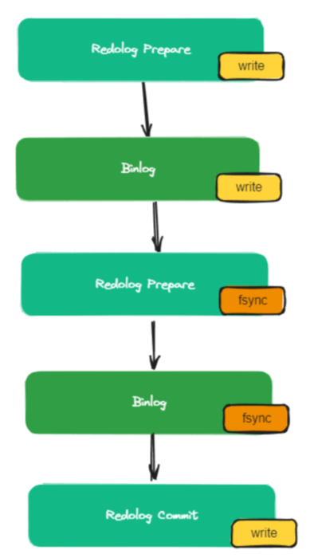

# 面试题-数据库

#### 有了关系型数据库，为什么还需要NOSQL？

NOSQL 数据库无需提前设计表结构，数据可以根据需要自由地存储和组织，而且相对于关系型数据库，NOSQL 高效灵活，非常适合那些复杂、高变化、高并发量的场景中。

#### 什么是关系型数据库，什么是非关系型数据库？

关系型数据库，是指采用了关系模型来组织数据的数据库（关系模型可以简单理解为二维表格模型），其以行和列的形式存储数据，以便于用户管理。

关系型数据库中有表的概念，表中包含了行和列，多张（或1张）表可以组成数据库。

关系型数据库具有以下几个特点：
1、传统的关系型数据库中的数据以行和列的方式进行存储。 
2、关系型数据库采用结构化查询语言（即SQL）来对数据库进行查询 
3、关系型数据库强调 ACID 规则（原子性（Atomicity）、一致性（Consistency）、隔离性（Isolation）、持久性（Durability）） 
4、关系型数据库十分强调数据的一致性，并为此降低读写性能付出了巨大的代价 
5、关系型数据的数据通常存储在硬盘中

我们常见的MySQL、Oracle等都是关系型数据库。但是因为关系型数据库强调强一致性、以及基于硬盘存储，所以存在着一定的性能问题，相比之下，非关系型数据库在这方面就会相对有些优势。

NoSQL 表示非关系型数据库，主要指那些非关系型的、分布式的，且一般不保证 ACID 的数据存储系统，主要代表如 Redis、MongoDB 等。

非关系型数据库的存储方式是基于键值来存储的，对于值的类型也有不同的支持，所以没有固定的要求和限制。

#### 关系型数据库和非关系型数据库主要有哪些区别？

1、关系型数据库以表的形式进行存储数据，而非关系型数据库以 Key-value 的形式存储数据。 
2、关系型数据库需要保证事务的 ACID，而非关系型数据库中的事务一般无法回滚。（也有部分数据库可以回滚，如 MongoDB 在集群模式下） 
3、关系型数据库可以通过一张表中的任意字段进行查询，非关系型数据库需要通过key进行查询 
4、一般来说，关系型数据库是基于硬盘存储，非关系型数据库基于内存存储。 （Mongodb 基于磁盘存储）
5、关系型数据库支持各种范围查询、公式计算等，非关系型数据库不一定支持。

#### MySQL 的数据存储一定是基于硬盘的吗？

不是的，MySQL 也可以基于内存的，即 MySQL 的内存表技术。它允许将数据和索引存储在内存中，从而提高了检索速度和修改数据的效率。优点包括具有快速响应的查询性能和节约硬盘存储空间。此外，使用内存表还可以实现更高的复杂性，从而提高了 MySQL 的整体性能。

> 创建内存表与创建普通表一样，使用CREATE TABLE语句，但需要将存储引擎设置为：ENGINE = MEMORY

#### 什么是数据库存储引擎？

数据库引擎是用于存储、处理和保护数据的核心服务。利用数据库引擎可控制访问权限并快速处理事务，从而满足企业内大多数需要处理大量数据的应用程序的要求。

使用数据库引擎创建用于联机事务处理或联机分析处理数据的关系数据库。这包括创建用于存储数据的表和用于查看、管理和保护数据安全的数据库对象（如索引、视图和存储过程）。

查看 mysql 当前使用什么存储引擎: `show engines`;

查看 mysql 当前默认的存储引擎: `show variables like '%storage_engine%'`;

查看看某个表用了什么引擎: `show create table 表名;`，在显示结果里参数 engine 后面的就表示该表当前用的存储引擎

#### MySQL 的存储引擎是基于表的还是基于数据库的？

表

#### MySQL 中如何指定引擎？

1、创建表时，可以通过ENGINE来指定存储引擎，在 create 语句最后加上“engine=存储引擎;”即可；

```sql
create table table1(id int(11) primary key auto_increment)engine=MyISAM; 
```

2、修改表时，可以使用“alter table 表名 engine=存储引擎;”来指定存储引擎。

```sql
alter table table1 engine=InnoDB; 
```

#### MySQL 支持哪几种执行引擎，有什么区别?

MySQL 是开源的，我们可以基于其源码编写我们自己的存储引擎，有以下几种存储引擎：

MyISAM、InnoDB、NDB、MEMORY，Archieve、Fedarated 以及 Maria 等。对比如下：


#### Innodb 和 MyISAM 有什么区别？

InnoDB 和 MyISAM 是 MySQL 中比较常用的两个执行引擎，MySQL 在 5.5 之前版本默认存储引擎是 MyISAM，5.5 之后版本默认存储引擎是 InnoDB，MyISAM 适合查询以及插入为主的应用，InnoDB 适合频繁修改以及涉及到安全性较高的应用。

- 如果应用需要高度的数据完整性和事务支持，那么 **InnoDB** 是更好的选择。**所以频繁修改及数据安全性的情况适合**。
- 如果应用主要是读取操作，或者需要高效的全文搜索功能，那么 MyISAM 可能更适合。**所以查询频繁的适合**。

他们主要有以下区别：

- 一、InnoDB 支持事务，MyISAM 不支持
- 二、InnoDB 是聚集索引，MyISAM 是非聚集索引。MyISAM 是采用了一种索引和数据分离的存储方式，Innodb 的聚簇索引中索引和数据在一起。
- 三、InnoDB 支持外键，MyISAM 不支持
- 四、InnoDB 最小的锁粒度是行锁，MyISAM 最小的锁粒度是表锁。
- 五、InnoDB 不支持 FULLTEXT 类型的索引（5.6之前不支持全文索引）
- 六、InnoDB 中不保存表的行数，但是 MyISAM 只要简单的读出保存好的行数即可
- 七、对于自增长的字段，InnoDB 中必须包含只有该字段的索引，但是在 MyISAM 表中可以和其他字段一起建立联合索引
- 八、清空整个表时，InnoDB 是一行一行的删除，效率非常慢。MyISAM 则会重建表

|          | InnoDB             | MyISAM   |
| -------- | ------------------ | -------- |
| 事务     | 支持               | 不支持   |
| 外键     | 支持               | 不支持   |
| 聚簇索引 | 支持               | 不支持   |
| 锁级别   | 支持行级锁、表级锁 | 表级锁   |
| 行数保存 | 不支持             | 支持     |
| 清空方式 | 逐行删除           | 重建表   |
| 默认版本 | 5.5 之后           | 5.5 之前 |
| 全文索引 | 5.6 以后支持       | 支持     |

#### char 和 varchar 的区别？

char 和 varchar 都是用于在数据库中存储字符串的数据类型。它们之间的主要区别在于存储空间的使用方式：

`char` 是一种定长的数据类型，它的长度固定且在存储时会自动在结尾添加空格来将字符串填满指定的长度。`char` 的长度范围是 `0-255`，`varchar` 是一种可变长度的数据类型，它只会存储实际的字符串内容，不会填充空格。因此，在存储短字符串时，varchar 可以节省空间。varchar 的长度范围是 `0-65535`（MySQL 5.0.3 之后的版本）。

> 如果使用 char(100)，则插入记录后就分配了 100 个字符，后续修改不会造成页分裂的问题，而 varchar(100) 由于没有提前分配存储空间，因为表中数据刚开始插入时，可变长度字段值都是根据实际长度存储下来的，且行与行之间数据也是紧密连续存放在文件地址中的。那么现在值变长了，原来的位置无法扩展出新的空间出来，所以无法覆盖存放到原来的位置上。此时 MySQL 就会使用页分裂的方法扩展字段变长的空间。

**varchar 的优点**是变长的字符串类型，兼容性更好；但是同时**也会带来一些问题**，如使用 varchar 可能会产生内存碎片、varchar 会额外需要 1 到 2 个字节存储长度信息、以及 update 语句可能会导致页分裂等。

**char 的优点**是定长的字符串类型，减少内存碎片，并且无需额外的磁盘空间去存储长度信息。但是他的**缺点是**会丢失列末尾的空格信息。

> char 会在长度不足时，在后面补充空格，所以当我要在一个长度为 10 的 char 中，分别存一个 "ping " 和 "ping"时，他存储的都是"ping    "，所以会丢失原来存储的空格信息。

#### MySQL 5.x 和 8.0 有什么区别？

1. 性能：MySQL 8.0 的速度要比 MySQL 5.7 快 2 倍。MySQL 8.0 在以下方面带来了更好的性能：读/写工作负载、IO 密集型工作负载、以及高竞争（"hot spot"热点竞争问题）工作负载。
2. NoSQL：MySQL 从 5.7  版本开始提供 NoSQL 存储功能，目前在 8.0 版本中这部分功能也得到了更大的改进。该项功能消除了对独立的 NoSQL 文档数据库的需求，而 MySQL 文档存储也为 schema-less 模式的 JSON 文档提供了多文档事务支持和完整的 ACID 合规性。
3. 窗口函数(Window Functions)：从 MySQL 8.0 开始，新增了一个叫窗口函数的概念，它可以用来实现若干新的查询方式。窗口函数与 SUM()、COUNT() 这种集合函数类似，但它不会将多行查询结果合并为一行，而是将结果放回多行当中。即窗口函数不需要 GROUP BY。
4. 隐藏索引：在 MySQL 8.0 中，索引可以被“隐藏”和“显示”。当对索引进行隐藏时，它不会被查询优化器所使用。我们可以使用这个特性用于性能调试，例如我们先隐藏一个索引，然后观察其对数据库的影响。如果数据库性能有所下降，说明这个索引是有用的，然后将其“恢复显示”即可；如果数据库性能看不出变化，说明这个索引是多余的，可以考虑删掉。
5. 取消查询缓存：MySQL 8.0 出于性能和可维护性方面的考虑取消了查询缓存，通过使用索引、更好的查询计划优化、以及缓存结果集而不是整个查询。这些方法更有效地提高了查询性能，同时避免了查询缓存可能引入的问题。
6. select for update 支持 no wait：如果另一个事务已经锁定了一些行，当前事务将等待直到那些锁被释放。加上 NOWAIT 关键字后，如果尝试锁定的行已经被其他事务锁定，数据库将立即抛出一个错误，而不是等待。
7. 降序索引：MySQL 8.0 为索引提供按降序方式进行排序的支持，在这种索引中的值也会按降序的方式进行排序。
8. 通用表表达式(Common Table Expressions CTE)：在复杂的查询中使用嵌入式表时，使用 CTE 使得查询语句更清晰。
9. UTF-8 编码：从 MySQL 8 开始，使用 utf8mb4 作为 MySQL 的默认字符集。
10. JSON：MySQL 8 大幅改进了对 JSON 的支持，添加了基于路径查询参数从 JSON 字段中抽取数据的 JSON_EXTRACT() 函数，以及用于将数据分别组合到 JSON 数组和对象中的 JSON_ARRAYAGG() 和 JSON_OBJECTAGG() 聚合函数。
11. 可靠性：InnoDB 现在支持表 DDL 的原子性，也就是 InnoDB 表上的 DDL 也可以实现事务完整性，要么失败回滚，要么成功提交，不至于出现 DDL 时部分成功的问题，此外还支持 crash-safe 特性，元数据存储在单个事务数据字典中。
12. 高可用性(High Availability)：InnoDB 集群为您的数据库提供集成的原生 HA 解决方案。
13. 安全性：对 OpenSSL 的改进、新的默认身份验证、SQL 角色、密码强度、授权。

> 详见：https://dev.mysql.com/blog-archive/whats-new-in-mysql-8-0-generally-available/

#### 什么是数据库范式，为什么要反范式？

所谓数据库范式，其实就是数据库的设计上的一些规范；这些规范可以让数据库的设计更加简洁、清晰；同时也会更加好的可以保证一致性。

三个常用的范式：

- 第一范式（1NF）是说，数据库表中的属性的原子性的，要求属性具有原子性，不可再被拆分。
  - 比如地址如果都细化拆分成省、市、区、街道、小区等等多个字段这就是符合第一范式的， 如果地址就是一个字段，那就不符合了。
- 第二范式（2NF）是说，数据库表中的每个实例或记录必须可以被唯一地区分，说白了就是要有主键，其他的字段都依赖于主键。
- 第三范式（3NF）是说，任何非主属性不依赖于其它非主属性，也就是说，非主键外的所有字段必须互不依赖。

> 如果我们在做表结构设计的时候，完全遵守数据库三范式，确实可以避免一些写时异常，提升一些写入性能，但是同时也会丢失一些读取性能。
>
> 因为在遵守范式的数据库设计中，表中不能有任何冗余字段，这就使得查询的时候就会经常有多表关联查询，这无疑是比较耗时的。

于是就有了反范式化。所谓反范式化，是一种针对遵从设计范式的数据库的性能优化策略。

也就是说，反范式化不等于非范式化，反范式化一定发生在满足范式设计的基础之上。**前者相当于先遵守所有规则，再进行局部调整。**

比如我们可以在表中增加一些冗余字段，方便我们进行数据查询，而不再需要经常做多表 join，但同时，这也会带来一个问题，那就是这些冗余字段之间的一致性如何保证，这个问题本来在遵守范式的设计中是不会有的，一旦做了反范式，那就需要开发者自行解决了。

反范式其实本质上是软件开发中一个比较典型的方案，那就是**"用空间换时间"**，通过做一些数据冗余，来提升查询速度。

在互联网业务中，比较典型的就是数据量大，并发高，并且通常查询的频率要远高于写入的频率，所以适当的做一些反范式，通过做一些字段的冗余，可以提升查询性能，降低响应时长，从而提升并发度。

#### 为什么大厂不建议使用多表 join？

MySQL 是使用了嵌套循环（Nested-Loop Join）的方式来实现关联查询的，简单点说就是要通过两层循环，用第一张表做外循环，第二张表做内循环，外循环的每一条记录跟内循环中的记录作比较，符合条件的就输出。

而具体到算法实现上主要有 `simple nested loop`，`block nested loop` 和 `index nested loop` 这三种。而且这三种的效率都没有特别高。

MySQL 是使用了嵌套循环（Nested-Loop Join）的方式来实现关联查询的，如果有 2 张表 join 的话，复杂度最高是 `O(n^2)`，3 张表则是 `O(n^3)`...随着表越多，表中的数据量越多， JOIN 的效率会呈指数级下降。

> MySQL 8.0 中新增了 hash join 算法

#### MySQL 的 Hash Join 是什么？

hash join 是 MySQL 8.0.18 版本中新推出的一种多表 join 的算法。

> 在这之前，MySQL 是使用了嵌套循环（Nested-Loop Join）的方式来实现关联查询的，而嵌套循环的算法其实性能是比较差的，而 Hash Join 的出现就是要优化 Nested-Loop Join 的。

所谓 Hash Join，其实是因为他底层用到了 Hash 表。

Hash Join 是一种针对 equal-join 场景的优化，他的基本思想是将驱动表数据加载到内存，并建立 hash 表，这样只要遍历一遍非驱动表，然后再去通过哈希查找在哈希表中寻找匹配的行 ，就可以完成 join 操作了。

但是，内存是有限的（通过 `join_buffer_size` 限制），**如果内存中存不下驱动表的数据怎么办呢？**

#### 基于磁盘的 hash join

如果驱动表中的数据量比较大， 没办法一次性的加载到内存中，就需要考虑把这些数据存储在磁盘上。通过将哈希表的一部分存储在磁盘上，分批次地加载和处理数据，从而减少对内存的需求。

在这样的算法中，为了避免一个大的 hash 表内存中无法完全存储，那么就采用分表的方式来实现，即首先利用 hash 算法将驱动表进行分表，并产生临时分片写到磁盘上。

这样就相当于把一张驱动表，拆分成多个 hash 表，并且分别存储在磁盘上。

接下来就是做 join 了，在这个过程中，会对被驱动表使用同样的 hash 算法进行分区，确定好在哪个分区之后，先确认下这个分区是否已经加载到内存，如果已经加载，则直接在内存中的哈希表中进行查找匹配的行。

如果哈希值对应的分区尚未加载到内存中，则从磁盘上读取该分区的数据到内存中的哈希表，并进行匹配。

就这样不断的重复进行下去，直到把所有数据都 join 完，把结果集返回。

#### 说一说 MySQL 一条 SQL 语句的执行过程？


1. 使用连接器，通过客户端/服务器通信协议与 MySQL 建立连接。并查询是否有权限
2. Mysql8.0 之前检查是否开启缓存，开启了 Query Cache 且命中完全相同的 SQL 语句，则将查询结果直接返回给客户端；
3. 由解析器（分析器)进行语法分析和语义分析，并生成解析树。如查询是 select、表名users、条件是 `age='18' and name='ping'`，预处理器则会根据 MySQL 规则进一步检查解析树是否合法。比如检查要查询的数据表或数据列是否存在等。
4. 由优化器生成执行计划。根据索引看看是否可以优化
5. 执行器来执行 SQL 语句，这里具体的执行会操作MySQL的存储引擎来执行 SQL 语句，根据存储引擎类型，得到查询结果。若开启了 Query Cache，则缓存，否则直接返回。

#### InnoDB 支持哪几种行格式？

数据库表的行格式决定了一行数据是如何进行物理存储的，进而影响查询和 DML 操作的性能。

在 InnoDB 中，常见的行格式有 4 种：

- **COMPACT** ：是 MySQL 5.0 之前的默认格式，除了保存字段值外，还会利用空值列表保存 null 值，还会记录变长字段长度列表和记录头信息。


> 对于可变长度列，前 768 字节的数据存储在B树节点的索引记录中，超出部分存储在溢出页中。大于或等于 768 字节的固定长度列会被编码为可变长度列，并可以存储在页外。

- **REDUNDANT** ：Redundant 是 MySQL5.0 版本之前 InnoDB 的行记录存储方式，用的比较少，Redundant 行格式会把该条记录中所有列 (包括隐藏列) 的长度信息都存储到 '字段长度偏移列表' 中。


- **DYNAMIC**：DYNAMIC 格式在 MySQL 5.7 版本引入，是 COMPACT 格式的改进版。它保持了 COMPACT 格式的优点，同时在存储大的可变长度列时更加灵活，能够动态地选择存储在页内或页外。DYNAMIC 格式适用于大部分的应用场景，并在存储空间和性能上做了一定的平衡。其结构和 COMPACT 大致相同；

- **COMPRESSED**：是 MySQL 5.1 中 InnoDB 的新特性之一，它可以在存储数据时对数据进行压缩，从而减小磁盘占用空间。它的缺点是增加了 CPU 的使用，可能会降低一些查询的性能。COMPRESSED 行格式是在 DYNAMIC 行格式的基础上添加了页外压缩功能。在存储时，如果发现数据可以通过压缩减小存储空间，就会使用压缩方式来存储数据。在查询时，会自动解压缩数据并返回结果。
- **BARRACUDA**：是 MySQL 5.7 引入的一种新格式，相对于前面的格式，支持更多的高级特性，如动态行格式、行级压缩、空间管理等。

| 行格式     | 紧凑的存储特性 | 增强的可变长度列存储 | 大索引键前缀支持 | 压缩支持 | 支持的表空间类型                | 所需文件格式          |
| ---------- | -------------- | -------------------- | ---------------- | -------- | ------------------------------- | --------------------- |
| REDUNDANT  | 否             | 否                   | 否               | 否       | system, file-per-table, general | Antelope or Barracuda |
| COMPACT    | 是             | 否                   | 否               | 否       | system, file-per-table, general | Antelope or Barracuda |
| DYNAMIC    | 是             | 是                   | 是               | 否       | system, file-per-table, general | Barracuda             |
| COMPRESSED | 是             | 是                   | 是               | 是       | file-per-table, general         | Barracuda             |

#### 什么是数据库事务？

数据库事务 (transaction) 是访问并可能操作各种数据项的一个数据库操作序列，这些操作要么全部执行，要么全部不执行，是一个不可分割的工作单位。 事务由事务开始与事务结束之间执行的全部数据库操作组成。

并非任意的对数据库的操作序列都是数据库事务。事务应该具有4个属性：原子性、一致性、隔离性、持久性。这四个属性通常称为ACID特性。

原子性（Atomicity）：事务作为一个整体被执行，包含在其中的对数据库的操作要么全部被执行，要么都不执行。

一致性（Consistency）：事务应确保数据库的状态从一个一致状态转变为另一个一致状态。一致状态的含义是数据库中的数据应满足完整性约束。

隔离性（Isolation）：多个事务并发执行时，一个事务的执行不应影响其他事务的执行。

持久性（Durability）：一个事务一旦提交，他对数据库的修改应该永久保存在数据库中。

#### InnoDB的一次更新事务是怎么实现的？

一次 InnnoDB 的 update 操作，涉及到 BufferPool、BinLog、UndoLog、RedoLog 以及物理磁盘，完整的一次操作过程基本如下：

**1、在 Buffer Pool 中读取数据：**当 InnoDB 需要更新一条记录时，首先会在 Buffer Pool 中查找该记录是否在内存中。如果没有在内存中，则从磁盘读取该页到 Buffer Pool 中。

**2、记录 UndoLog：**在修改操作前，InnoDB 会在 Undo Log 中记录修改前的数据。Undo Log 是用来保证事务原子性和一致性的一种机制，用于在发生事务回滚等情况时，将修改操作回滚到修改前的状态，以达到事务的原子性和一致性。UndoLog 的写入最开始写到内存中的，然后由1个后台线程定时刷新到磁盘中的。

**3、在 Buffer Pool 中更新：**当执行 update 语句时，InnoDB 会先更新已经读取到 Buffer Pool 中的数据，而不是直接写入磁盘。同时，InnoDB 会将修改后的数据页状态设置为“脏页”（Dirty Page）状态，表示该页已经被修改但尚未写入磁盘。

**4、记录 RedoLog Buffer：**InnoDB 在 Buffer Pool 中记录修改操作的同时，InnoDB 会先将修改操作写入到 redo log buffer 中。

**5、提交事务：**在执行完所有修改操作后，事务被提交。在提交事务时，InnoDB 会将 Redo Log 写入磁盘，以保证事务持久性。

**6、写入磁盘：**在提交过程后，InnoDB 会将 Buffer Pool 中的脏页写入磁盘，以保证数据的持久性。但是这个写入过程并不是立即执行的，是有一个后台线程异步执行的，所以可能会延迟写入，总之就是 MYSQL 会选择合适的时机把数据写入磁盘做持久化。

**7、记录 Binlog：**在提交过程中，InnoDB 会将事务提交的信息记录到 Binlog 中。Binlog 是 MySQL 用来实现主从复制的一种机制，用于将主库上的事务同步到从库上。在 Binlog 中记录的信息包括：事务开始的时间、数据库名、表名、事务 ID、SQL 语句等。


需要注意的是，在 binlog 和 redolog 的写入过程中，其实是分成了 2 阶段的，通过 2 阶段提交的方式来保证一致性的。

#### 什么是脏读、幻读、不可重复读？

脏读：读到了其他事务还没有提交的数据。
不可重复读：对某数据进行读取过程中，有其他事务对数据进行了修改（UPDATE、DELETE)，导致第二次读取的结果不同。 
幻读：事务在做范围查询过程中，有另外一个事务对范围内新增了记录(INSERT)，导致范围查询的结果条数不一致。

#### MySQL 中的事务隔离级别？

SQL-92 标准还定义了 4 种隔离级别来解决脏读、幻读、不可重复读等这些异常情况，从高到底依次为：**可串行化(Serializable)**、**可重复读(Repeatable reads)**、**提交读(Read committed)**、**未提交读(Read uncommitted)**。

- 未提交读(Read uncommitted) 是最低的隔离级别。通过名字我们就可以知道，在这种事务隔离级别下，一个事务可以读到另外一个事务未提交的数据。这种隔离级别下会存在幻读、不可重复读和脏读的问题。

- 提交读(Read committed) 也可以翻译成读已提交，通过名字也可以分析出，在一个事务修改数据过程中，如果事务还没提交，其他事务不能读该数据。所以，这种隔离级别是可以避免脏读的发生的。

- 可重复读(Repeatable reads)，由于提交读隔离级别会产生不可重复读的读现象。所以，比提交读更高一个级别的隔离级别就可以解决不可重复读的问题。这种隔离级别就叫可重复读。但是这种隔离级别没办法彻底解决幻读。

- 可串行化(Serializable) 是最高的隔离级别，前面提到的所有的隔离级别都无法解决的幻读，在可串行化的隔离级别中可以解决。

| 隔离级别                                | 脏读 | 不可重复读 | 幻读 |
| --------------------------------------- | ---- | ---------- | ---- |
| 能读到未提交的数据 RU, READ-UNCOMMITTED | Y    | Y          | Y    |
| 能读到已提交的数据 RC，READ-COMMITTED   | N    | Y          | Y    |
| 可重复读 RR, REPEATABLEREAD             | N    | N          | Y    |
| 串行执行 SERIALIZABLE                   | N    | N          | N    |

> 注意！！！以上是 SQL-92 标准中对事务隔离级别以及需要解决的读现象（脏读、幻读、不可重复读）的定义，但是不同的数据库在实际实现的过程中，是有一些细微差异的。

1、查看当前会话隔离级别

`select @@tx_isolation;`

在 MySQL 8.0 中：`SELECT @@transaction_isolation;`

2、查看系统当前隔离级别

`select @@global.tx_isolation;`

3、设置当前会话隔离级别

`set session transaction isolatin level repeatable read;`

4、设置系统当前隔离级别

5、命令行，开始事务时

`set autocommit=off` 或者 `start transaction`

#### InnoDB 如何解决脏读、不可重复读和幻读的？

在 Innodb 中，通过 **MVCC 解决脏读和不可重复读**，通过 **MVCC + 间隙锁解决幻读**的。

脏读的解决。脏读指一个事务可以读取另一个事务未提交的数据，导致数据不一致。在读已提交（Read Committed）隔离级别下，事务只能读取到其他事务已经提交的数据版本。因此，如果一个事务在读取数据时，另一个事务已经修改了这些数据但尚未提交，那么读取事务将不会看到这些未提交的更改。

当事务在“读已提交”隔离级别下执行读取操作时，InnoDB 获取当前最新的全局事务 ID，这个 ID 表示在当前时刻所有已提交事务的最新状态。InnoDB会检查每个数据行的版本，如果该版本是由一个小于或等于当前事务 ID 的事务修改的，并且该事务已提交，则这个版本是可见的。这保证了事务只能看到在它开始之前已经提交的数据版本。

不可重读的解决。不可重复读指一个事务读取同一行数据两次，但是在两次读取之间另一个事务修改了该行数据，导致两次读取的结果不同。InnoDB 通过使用 MVCC 来解决不可重复读的问题。在 RR 这种隔离级别下，当我们使用快照读进行数据读取的时候，只会在第一次读取的时候生成一个 Read View，后续的所有快照读都是用的同一个快照，所以就不会发生不可重复读的问题了。

幻读的解决。InnoDB 的 RR 级别中，基于 MVCC + 间隙锁，是在某种程度上是可以避免幻读的发生的，但是没有办法完全避免，当一个事务中发生当前读的时候，会导致幻读的发生。

#### Innodb 的 RR 到底有没有解决幻读？

InnoDB 中的 REPEATABLE READ 这种隔离级别通过 **间隙锁 + MVCC** 解决了大部分的幻读问题，但是并不是所有的幻读都能解读，想要彻底解决幻读，需要使用 Serializable 的隔离级别。

RR 中，通过间隙锁解决了部分当前读的幻读问题，通过增加间隙锁将记录之间的间隙锁住，避免新的数据插入。

RR 中，通过 MVCC 机制的，解决了快照读的幻读问题，RR 中的快照读只有第一次会进行数据查询，后面都是直接读取快照，所以不会发生幻读。

但是，如果两个事务，事务1 先进行快照读，然后事务2 插入了一条记录并提交，再在事务1 中进行 update 新插入的这条记录是可以更新出成功的，这就是发生了幻读。

还有一种场景，如果两个事务，事务1 先进行快照读，然后事务2 插入了一条记录并提交，在事务1 中进行了当前读之后，再进行快照读也会发生幻读。

#### MVCC 解决幻读

MVCC，是 Multiversion Concurrency Control 的缩写，翻译过来是多版本并发控制，和数据库锁一样，他也是一种并发控制的解决方案。它主要用来解决读-写并发的情况。

我们知道，在 MVCC 中有两种读，一种是快照读、一种是当前读。

所谓快照读，就是读取的是快照数据，即快照生成的那一刻的数据，像我们常用的普通的 SELECT 语句在不加锁情况下就是快照读。

`SELECT * FROM xx_table WHERE ...`

在 RC 中，每次读取都会重新生成一个快照，总是读取行的最新版本。
在 RR 中，快照会在事务中第一次 SELECT 语句执行时生成，只有在本事务中对数据进行更改才会更新快照。

那么也就是说，如果在 RR 下，一个事务中的多次查询，是不会查询到其他的事务中的变更内容的，所以，也就是可以解决幻读的。

如果我们把事务隔离级别设置为 RR，那么因为有了 MVCC 的机制，就能解决幻读的问题。

#### 间隙锁与幻读

上面我们讲过了 MVCC 能解决 RR 级别下面的快照读的幻读问题，那么当前读下面的幻读问题怎么解决呢？

当前读就是读取最新数据，所以，加锁的 SELECT，或者对数据进行增删改都会进行当前读，比如：

```sql
SELECT * FROM xx_table LOCK IN SHARE MODE;

SELECT * FROM xx_table FOR UPDATE;

INSERT INTO xx_table ...

DELETE FROM xx_table ...

UPDATE xx_table ...
```

在 RR 的级别下，当我们使用 `SELECT … FOR UPDATE `的时候，会进行加锁，不仅仅会对行记录进行加锁，还会对记录之间的间隙进行加锁，这就叫做间隙锁。

#### 解决不了的幻读

前面我们介绍了快照读（无锁查询）和当前读（有锁查询）下是如何解决幻读的问题的，但是，上面的例子就是幻读的所有情况了吗？显然并不是。

我们说 MVCC 只能解决快照读的幻读，那如果在一个事务中发生了当前读，并且在另一个事务插入数据前没来得及加间隙锁的话，会发生什么呢？


在上面的例子中，在事务1 中，我们并没有在事务开启后立即加锁，而是进行了一次普通的查询，然后事务2 插入数据成功之后，再通过事务1进行了2次查询。

我们发现，事务1后面的两次查询结果完全不一样，没加锁的情况下，就是快照读，读到的数据就和第一次查询是一样的，就不会发生幻读。但是第二次查询加了锁，就是当前读，那么读取到的数据就有其他事务提交的数据了，就发生了幻读。

那么，如果你理解了上面的这个例子，并且你也理解了当前读的概念，那么你很容易就能想到，下面的这个CASE其实也是会发生幻读的：


这里发生幻读的原理，和上面的例子其实是一样的，那就是 MVCC 只能解决快照读中的幻读问题，而对于当前读（SELECT FOR UPDATE、UPDATE、DELETE 等操作）还是会产生幻读的现象的。即，在同一个事务里面，如果既有快照读，又有当前读，那是会产生幻读的、

UPDATE 语句也是一种当前读，所以它是可以读到其他事务的提交结果的。

为什么事务1 的最后一次查询和倒数第二次查询的结果也不一样呢？

是因为根据快照读的定义，在 RR 中，如果本事务中发生了数据的修改，那么就会更新快照，那么最后一次查询的结果也就发生了变化。

#### 如何避免幻读?

那么了解了幻读的解决场景，以及不能解决的几个 CASE 之后，我们来总结一下该如何解决幻读的问题呢？

首先，如果想要彻底解决幻读的问题，在 InnoDB 中只能使用 Serializable 这种隔离级别。

那么，如果想在一定程度上解决或者避免发生幻读的话，使用 RR 也可以，但是 RC、RU 肯定是不行的。

在 RR 级别中，能使用快照读（无锁查询）的就使用快照读，这样不仅可以减少锁冲突，提升并发度，而且还能避免幻读的发生。

那么，如果在并发场景中，一定要加锁的话怎么办呢？那就一定要在事务一开始就立即加锁，这样就会有间隙锁，也能有效的避免幻读的发生。
但是需要注意的是，间隙锁是导致死锁的一个重要根源~所以，用起来也需要慎重。

#### 为什么 MySQL 默认使用 RR 隔离级别？

对于数据库的默认隔离级别，Oracle 默认的隔离级别是 RC，而 MySQL 默认的隔离级别是 RR。

那么，你知道为什么 Oracle 选择 RC 作为默认级别，而 MySQL 要选择 RR 作为默认的隔离级别吗？

**Oracle 的隔离级别**

Oracle 只支持 ANSI/ISO SQL 定义的 Serializable 和 Read Committed，其实，根据 Oracle 官方文档给出的介绍，Oracle 支持三种隔离级别：


即 Oracle 支持 Read Committed、Serializable 和 Read-Only。

Read-Only 只读隔离级别类似于 Serializable 隔离级别，但是只读事务不允许在事务中修改数据，除非用户是 SYS。

在 Oracle 这三种隔离级别中，Serializable 和 Read-Only 显然都是不适合作为默认隔离级别的，那么就只剩 Read Committed 这个唯一的选择了。

**MySQL 的隔离级别**

相比于 Oracle，MySQL 的默认隔离级别的可选范围就比较大了。

首先，我们先从四种隔离级别中排除 Serializable 和 Read Uncommitted 这两种，主要是因为这两个级别一个隔离级别太高，一个太低。太高的就会影响并发度，太低的就有脏读现象。

那么，剩下的 RR 和 RC 两种，怎么选？

在 MySQL 设计之初，他的定位就是提供一个稳定的关系型数据库。而为了要解决 MySQL 单点故障带来的问题，MySQL 采用主从复制的机制。

所谓主从复制，其实就是通过搭建 MySQL 集群，整体对外提供服务，集群中的机器分为主服务器（Master）和从服务器（Slave），主服务器提供写服务，从服务器提供读服务。

为了保证主从服务器之间的数据的一致性，就需要进行数据同步，大致的同步过程如下，这里就不详细介绍了


MySQL 在主从复制的过程中，数据的同步是通过 bin log 进行的，简单理解就是主服务器把数据变更记录到 bin log 中，然后再把 bin log 同步传输给从服务器，从服务器接收到 bin log之后，再把其中的数据恢复到自己的数据库存储中。

那么，binlog 里面记录的是什么内容呢？格式是怎样的呢？

MySQL 的 bin log 主要支持三种格式，分别是 statement、row 以及 mixed。MySQL 是在 5.1.5 版本开始支持 row 的、在 5.1.8 版本中开始支持 mixed。

statement 和 row 最大的区别，当 binlog 的格式为 statement 时，binlog 里面记录的就是 SQL 语句的原文（这句话很重要！！！后面会用的到）。

因为 MySQL 早期只有 statement 这种 bin log 格式，这时候，如果使用提交读 (Read Committed)、未提交读 (Read Uncommitted) 这两种隔离级别会出现问题。

> 举个例子，有一个数据库表t1，表中有如下两条记录：

```sql
CREATE TABLE `t1` (
  `a` int(11) DEFAULT NULL,
  `b` int(11) DEFAULT NULL,
  KEY `b` (`b`)
) ENGINE=InnoDB DEFAULT CHARSET=latin1;

insert into t1 values(10,1);
```

接着开始执行两个事务的写操作：

| Session1                                                     | Session2                                                |
| ------------------------------------------------------------ | ------------------------------------------------------- |
| set session transaction isolation level read committed;<br/>设置会话事务隔离级别 读取已提交; |                                                         |
| set autocommit = 0;                                          | set session transaction isolation level read committed; |
|                                                              | set autocommit = 0;                                     |
| begin;                                                       | begin;                                                  |
| delete from t1 where b < 100;                                |                                                         |
|                                                              | insert into t1 values(10,99);                           |
|                                                              | commit;                                                 |
| commit;                                                      |                                                         |

以上两个事务执行之后，数据库里面的记录会只有一条记录（10,99），这个发生在主库的数据变更大家都能理解。

即使 Session 1 的删除操作在 Session 2 的插入操作之后提交，由于 READ COMMITTED 的隔离级别，Session 2 的插入操作不会看到 Session 1 的删除操作，所以最后数据库中仍然会留下 Session 2 插入的记录 (10,99)。

> 以上两个事务执行之后，会在 bin log 中记录两条记录，因为事务2 先提交，所以 `insert into t1 values(10,99);` 会被优先记录，然后再记录 `delete from t1 where b < 100;` （再次提醒：statement 格式的 bin log 记录的是 SQL 语句的原文）
>
> 这样 bin log 同步到备库之后，SQL 语句回放时，会先执行 `insert into t1 values(10,99);`，再执行 `delete from t1 where b < 100;`。
>
> 这时候，数据库中的数据就会变成 EMPTY SET，即没有任何数据。这就导致主库和备库的数据不一致了！！！

为了避免这样的问题发生。MySQL 就把数据库的默认隔离级别设置成了 Repetable Read，那么，Repetable Read 的隔离级别下是如何解决这样问题的那？

那是因为 Repetable Read 这种隔离级别，会在更新数据的时候不仅对更新的行加行级锁，还会增加 GAP 锁和临键锁。上面的例子，在事务2 执行的时候，因为事务1 增加了 GAP 锁和临键锁，就会导致事务2 执行被卡住，需要等事务1提交或者回滚后才能继续执行。

**除了设置默认的隔离级别外，MySQL 还禁止在使用 statement 格式的 bin log 的情况下，使用 READ COMMITTED 作为事务隔离级别。**

一旦用户主动修改隔离级别，尝试更新时，会报错：

```
ERROR 1598 (HY000): Binary logging not possible. Message: Transaction level 'READ-COMMITTED' in InnoDB is not safe for binlog mode 'STATEMENT'
```

所以，现在我们知道了，为什么 MySQL 选择 RR 作为默认的数据库隔离级别了吧，其实就是为了兼容历史上的那种 statement 格式的 bin log。

#### 为什么很多大厂会把默认的 RR 改成 RC

虽然RR的隔离级别可以在一定程度上避免脏读、不可重复读和幻读等问题，但是，对于很多大型的互联网来说，会愿意将数据库的默认隔离级别调整成并发度更高的 RC 级别，从而，提升并发度并且降低发生死锁的概率。

**互联网公司和传统企业最大的区别是什么？**

**高并发！**

没错，互联网业务的并发度比传统企业要高处很多。2020 年双十一当天，订单创建峰值达到 58.3 万笔/秒。

很多人问，要怎么做才能扛得住这么大的并发量。其实，这背后的优化多到几个小时都讲不完，因为要做的、可以做的事情实在是太多了。

而有一个和我们今天这篇文章有关的优化，那就是通过修改数据库的隔离级别来提升并发度。

为什么 RC 比 RR 的并发度要好呢？

首先，RC 在加锁的过程中，是不需要添加 Gap Lock 和 Next-Key Lock 的，只对要修改的记录添加行级锁就行了。

这就使得并发度要比 RR 高很多。

另外，因为 RC 还支持"半一致读"，可以大大的减少了更新语句时行锁的冲突；对于不满足更新条件的记录，可以提前释放锁，提升并发度。

**减少死锁**

因为RR这种事务隔离级别会增加 Gap Lock 和 Next-Key Lock，这就使得锁的粒度变大，那么就会使得死锁的概率增大。

死锁：一个事务锁住了表A，然后又访问表B；另一个事务锁住了表B，然后企图访问表A；这时就会互相等待对方释放锁，就导致了死锁。

RR 和 RC 主要在加锁机制、主从同步以及一致性读方面存在一些差异。

而很多大厂，为了提升并发度和降低死锁发生的概率，会把数据库的隔离级别从默认的 RR 调整成 RC。

当然，这样做也不是完全没有问题，首先使用 RC 之后，就需要自己解决不可重复读的问题，这个其实还好，很多时候不可重复读问题其实是可以忽略的，或者可以用其他手段解决。

比如读取到别的事务修改的值其实问题不太大的，只要修改的时候的不基于错误数据就可以了，所以我们都是在核心表中增加乐观锁标记，更新的时候都要带上锁标记进行乐观锁更新。

还有就是使用 RC 的时候，不能使用 statement 格式的 binlog，这种影响其实可以忽略不计了，因为 MySQL 是在 5.1.5 版本开始支持 row 的、在 5.1.8 版本中开始支持 mixed，后面这两种可以代替 statement 格式。

#### RR 和 RC 的区别

**一致性读**

一致性读，又称为快照读。快照即当前行数据之前的历史版本。快照读就是使用快照信息显示基于某个时间点的查询结果，而不考虑与此同时运行的其他事务所执行的更改。

在 MySQL 中，只有 READ COMMITTED 和 REPEATABLE READ 这两种事务隔离级别才会使用一致性读。

在 RR 中，快照会在事务中第一次 SELECT 语句执行时生成，只有在本事务中对数据进行更改才会更新快照。

在 RC 中，每次读取都会重新生成一个快照，总是读取行的最新版本。

在数据库的 RC 这种隔离级别中，还支持"半一致读" ，一条 update 语句，如果 where 条件匹配到的记录已经加锁，那么 InnoDB 会返回记录最近提交的版本，由 MySQL 上层判断此是否需要真的加锁。

**锁机制**

数据库的锁，在不同的事务隔离级别下，是采用了不同的机制的。在 MySQL 中，有三种类型的锁，分别是 Record Lock、Gap Lock 和 Next-Key Lock。

Record Lock 表示记录锁，锁的是索引记录。

Gap Lock 是间隙锁，锁的是索引记录之间的间隙。

Next-Key Lock 是 Record Lock 和 Gap Lock 的组合，同时锁索引记录和间隙。他的范围是左开右闭的。

在 RC 中，只会对索引增加 Record Lock，不会添加 Gap Lock 和 Next-Key Lock。

在 RR 中，为了解决幻读的问题，在支持 Record Lock 的同时，还支持 Gap Lock 和 Next-Key Lock；

**主从同步**

在数据主从同步时，不同格式的 binlog 也对事务隔离级别有要求。

MySQL 的 binlog 主要支持三种格式，分别是 statement、row 以及 mixed，但是，RC 隔离级别只支持 row 格式的 binlog。如果指定了 mixed 作为 binlog 格式，那么如果使用 RC，服务器会自动使用基于 row 格式的日志记录。

而 RR 的隔离级别同时支持 statement、row 以及 mixed 三种。

#### 当前读和快照读有什么区别？

所谓快照读，就是读取的是快照数据，即快照生成的那一刻的数据，像我们常用的普通的 SELECT 语句在不加锁情况下就是快照读。如：

```sql
SELECT * FROM xx_table WHERE ...
```

和快照读相对应的另外一个概念叫做当前读，当前读就是读取最新数据，所以，加锁的 SELECT，或者对数据进行增删改都会进行当前读，比如：

```sql
SELECT * FROM xx_table LOCK IN SHARE MODE;

SELECT * FROM xx_table FOR UPDATE;

INSERT INTO xx_table ...

DELETE FROM xx_table ...

UPDATE xx_table ...
```

在 MySQL 中，只有 READ COMMITTED 和 REPEATABLE READ 这两种事务隔离级别才会使用快照读。

- 在 RR 中，快照会在事务中第一次 SELECT 语句执行时生成，只有在本事务中对数据进行更改才会更新快照。
- 在 RC 中，每次读取都会重新生成一个快照，总是读取行的最新版本。

#### 如何理解MVCC？

MVCC，是 Multiversion Concurrency Control 的缩写，翻译过来是多版本并发控制，和数据库锁一样，他也是一种并发控制的解决方案。

我们知道，在数据库中，对数据的操作主要有 2 种，分别是读和写，而在并发场景下，就可能出现以下三种情况：

- 读-读并发
- 读-写并发
- 写-写并发

我们都知道，在没有写的情况下读-读并发是不会出现问题的，而写-写并发这种情况比较常用的就是通过加锁的方式实现。那么，读-写并发则可以通过 MVCC 的机制解决。

> 快照读是 MVCC 实现的基础，而当前读是悲观锁实现的基础。
>
> 那么，快照读读到的快照是从哪里读到的呢？换句话说，快照是存在哪里的呢？

**UndoLog**

undo log 是 Mysql 中比较重要的事务日志之一，顾名思义，undo log 是一种用于回退的日志，在事务没提交之前，MySQL 会先记录更新前的数据到 undo log 日志文件里面，当事务回滚时或者数据库崩溃时，可以利用 undo log 来进行回退。

这里面提到的存在 undo log 中的"更新前的数据"就是我们前面提到的快照。所以，这也是为什么很多人说 UndoLog 是 MVCC 实现的重要手段的原因。

那么，一条记录在同一时刻可能有多个事务在执行，那么，undo log 会有一条记录的多个快照，那么在这一时刻发生 SELECT 要进行快照读的时候，要读哪个快照呢？

这就需要用到另外几个信息了。

**行记录的隐式字段**

其实，数据库中的每行记录中，除了保存了我们自己定义的一些字段以外，还有一些重要的隐式字段的：

- `db_row_id`：隐藏主键，如果我们没有给这个表创建主键，那么会以这个字段来创建聚簇索引。 
- `db_trx_id`：对这条记录做了最新一次修改的事务的ID 
- `db_roll_ptr`：回滚指针，指向这条记录的上一个版本，其实他指向的就是Undo Log中的上一个版本的快照的地址。 

因为每一次记录变更之前都会先存储一份快照到 `undo log` 中，那么这几个隐式字段也会跟着记录一起保存在 `undo log` 中，就这样，每一个快照中都有一个 `db_trx_id` 字段表示了对这个记录做了最新一次修改的事务的ID，以及一个 `db_roll_ptr` 字段指向了上一个快照的地址。（`db_trx_id` 和 `db_roll_ptr` 是重点，后面还会用到）

这样，就形成了一个快照链表：


有了 `undo log`，又有了几个隐式字段，我们好像还是不知道具体应该读取哪个快照，那怎么办呢？

**Read View**

这时候就需要Read View 登场了，

Read View 主要来帮我们解决可见性的问题的, 即他会来告诉我们本次事务应该看到哪个快照，不应该看到哪个快照。

在 Read View 中有几个重要的属性：

- **trx_ids**，系统当前未提交的事务 ID 的列表。
- **low_limit_id**，应该分配给下一个事务的id 值。
- **up_limit_id**，未提交的事务中最小的事务 ID。
- **creator_trx_id**，创建这个 Read View 的事务 ID。

每开启一个事务，我们都会从数据库中获得一个事务 ID，这个事务 ID 是自增长的，通过 ID 大小，我们就可以判断事务的时间顺序。

那么，一个事务应该看到哪些快照，不应该看到哪些快照该如何判断呢？

其实原则比较简单，那就是事务ID大的事务应该能看到事务ID小的事务的变更结果，反之则不能！举个例子：

假如当前有一个事务3想要对某条记录进行一次快照读的时候，他会先创建一个 Read View，并且把当前所有还未提交的事务的信息记录下来。比如 `up_limit_id = 2`，`low_limit_id = 5`，`trx_ids= [2,4,5]`，`creator_trx_id= 3`

我们前面说过，每一条记录上都有一个隐式字段 db_trx_id 记录对这条记录做了最新一次修改的事务的ID，如 db_trx_id = 3；

那么接下来，数据库会拿这条记录 db_trx_id 和 Read View 进行可见性比较。

如果 `db_trx_id < up_limit_id`，则说明，在Read View中所有未提交的事务创建之前，db_trx_id = 3 的这个事务就已经提交了，并且在这期间，并没有新的事务提交。所以，这条记录对当前事务就应该是可见的。

如果，`db_trx_id > low_limit_id`，则说明，db_trx_id = 3 的这个事务是在 Read View 中所有未提交的事务创建之后才提交的，也就是说，在当前事务开启之后，有别的事务修改了数据并作了提交。所以，这个记录对于当前事务来说应该就是不可见的。（不可见怎么办呢？后面讲）

那么，还有另外一种情况，那就是 `up_limit_id < db_trx_id < low_limit_id`，这种情况下，会再拿 `db_trx_id` 和 `Read View` 中的 `trx_ids` 进行逐一比较。

如果，`db_trx_id` 在 `trx_ids` 列表中，那么表示在当前事务开启时，并未提交的某个事务在修改数据之后提交了，那么这个记录对于当前事务来说应该是不可见的。

如果，`db_trx_id` 不在 `trx_ids` 列表中，那么表示的是在当前事务开启之前，其他事务对数据进行修改并提交了，所以，这条记录对当前事务就应该是可见的。

所以，当读取一条记录的时候，经过以上判断，发现记录对当前事务可见，那么就直接返回就行了。那么如果不可见怎么办？没错，那就需要用到 `undo log` 了。

当数据的事务ID 不符合 Read View 规则时候，那就需要从 `undo log` 里面获取数据的历史快照，然后数据快照的事务ID 再来和 `Read View` 进行可见性比较，如果找到一条快照，则返回，找不到则返回空。

> 所以，总结一下，在 InnoDB 中，MVCC 就是通过 Read View + Undo Log 来实现的，undo log 中保存了历史快照，而 Read View 用来判断具体哪一个快照是可见的。

#### MVCC和可重复读

其实，根据不同的事务隔离级别，Read View 的获取时机是不同的，在 RC 下，一个事务中的每一次 SELECT 都会重新获取一次 Read View，而在RR下，一个事务中只在第一次 SELECT 的时候会获取一次 Read View。

所以，可重复读这种事务隔离级别之下，因为有 MVCC 机制，就可以解决不可重复读的问题，因为他只有在第一次 SELECT 的时候才会获取一次 Read View，天然不存在重复读的问题了。

#### 介绍下 InnoDB 的锁机制？

Innodb 中的锁在锁的级别上一版分为两种，一种是共享锁（S锁），一种是排他锁（X锁）。

**共享锁 & 排他锁**

共享锁又称读锁，是读取操作创建的锁。其他用户可以并发读取数据，但任何事务都不能对数据进行修改（获取数据上的排他锁），直到已释放所有共享锁。

排他锁又称写锁，如果事务T对数据A加上排他锁后，则其他事务不能再对A加任任何类型的锁。获得排他锁的事务既能读数据，又能修改数据。

> 这就是我们经常会看到的 X 锁和 S 锁。即排他锁和共享锁。
>
> 除了 S 锁和 X 锁之外，Innodb 还有两种锁，是 IX 锁和 IS 锁，这里的 I 是 Intention 的意思，即意向锁。IX 就是意向排他锁，IS 就是意向共享锁。

**意向锁**

当一个事务请求获取一个行级锁或表级锁时，MySQL 会自动获取相应的表的意向锁。

- IS 锁： 表示事务打算在资源上设置共享锁（读锁）。这通常用于表示事务计划读取资源，并不希望在读取时有其他事务设置排它锁。
- IX 锁： 表示事务打算在资源上设置排它锁（写锁）。这表示事务计划修改资源，并不希望有其他事务同时设置共享或排它锁。

意向锁其实是一个表级锁！

以下是 MySQL 官网上给出的这几种锁之间的冲突关系：


**记录锁**

Record Lock，翻译成记录锁，是加在索引记录上的锁。例如，`SELECT c1 FROM t WHERE c1 = 10 For UPDATE;` 会对 c1=10 这条记录加锁，为了防止任何其他事务插入、更新或删除 c1 值为 10 的行。

Record Lock 是一个典型的行级锁，但是需要特别注意的是，Record 锁的不是这行记录，而是锁索引记录。并且 Record lock 锁且只锁索引！

如果没有索引怎么办？对于这种情况，InnoDB 会创建一个隐藏的聚簇索引，并使用这个索引进行记录锁定。

如果我们在一张表中没有定义主键，那么，MySQL 会默认选择一个唯一的非空索引作为聚簇索引。如果没有适合的非空唯一索引，则会创建一个隐藏的主键（row_id）作为聚簇索引。

**插入意向锁**

插入意向锁是一种由插入操作在行插入之前设置的间隙锁。这种锁表明了插入的意图，以这样一种方式，如果多个事务插入到同一索引间隙中但不在间隙内的相同位置插入，则它们不需要相互等待。

假设有索引记录的值为 4 和 7。分别尝试插入值为 5 和 6 的不同事务，在获取插入行的独占锁之前，各自用插入意向锁锁定 4 和 7 之间的间隙，但由于行不冲突，所以它们不会相互阻塞。但是如果他们的都要插入6，那么就会需要阻塞了。

**AUTO-INC 锁**

AUTO-INC 锁是一种特殊的表级锁，由插入带有 AUTO_INCREMENT 列的表的事务获取。在最简单的情况下，如果一个事务正在向表中插入值，任何其他事务都必须等待，以便执行它们自己的插入操作，这样第一个事务插入的行就会接收到连续的主键值。

innodb_autoinc_lock_mode 变量控制用于自增锁定的算法。它允许你选择如何在可预测的自增值序列和插入操作的最大并发性之间进行权衡。

在 MySQL 5.1 之前，AUTO-INC 锁是一种表级锁。

#### MySQL 的行级锁锁的到底是什么？

数据库的行级锁根据锁的粒度不同，可以叫做不同的名字。

Record Lock 表示记录锁，锁的是索引记录。 

Gap Lock 是间隙锁，锁的是索引记录之间的间隙。 

Next-Key Lock 是 Record Lock 和 Gap Lock 的组合，同时锁索引记录和间隙。他的范围是左开右闭的。

> 扩展知识：

**Record Lock**

Record Lock，翻译成记录锁，是加在索引记录上的锁。例如，`SELECT c1 FROM t WHERE c1 = 10 For UPDATE;` 会对 c1=10 这条记录加锁，为了防止任何其他事务插入、更新或删除c1值为 10 的行。

**Gap Lock**

Gap Lock，翻译成间隙锁，他指的是在索引记录之间的间隙上的锁，或者在第一个索引记录之前或最后一个索引记录之后的间隙上的锁。

那么，这里所谓的 Gap（间隙）又怎么理解呢？

Gap 指的是 InnoDB 的索引数据结构中可以插入新值的位置。

当你用语句 `SELECT…FOR UPDATE` 锁定一组行时。InnoDB可以创建锁，应用于索引中的实际值以及他们之间的间隙。例如，如果选择所有大于10的值进行更新，间隙锁将阻止另一个事务插入大于 10 的新值。

既然是锁，那么就可能会影响到数据库的并发性，所以，间隙锁只有在Repeatable Reads这种隔离级别中才会起作用。

在 Repeatable Reads 这种隔离下，对于锁定的读操作（select ... for update 、 lock in share mode)、update操作、delete操作时，会进行如下的加锁：

- 对于具有唯一搜索条件的唯一索引，InnoDB 只锁定找到的索引记录，而不会锁定间隙。 
-  对于其他搜索条件，InnoDB 锁定扫描的索引范围，使用gap lock或next-key lock来阻塞其他事务插入范围覆盖的间隙。 

也就是说，对于 SELECT FOR UPDATE、LOCK IN SHARE MODE、UPDATE 和 DELETE 等语句处理时，除了对唯一索引的唯一搜索外都会获取 gap锁 或 next-key锁，即锁住其扫描的范围。

**Next-Key Lock**

Next-Key 锁是索引记录上的记录锁和索引记录之前间隙上的间隙锁的组合。


设一个索引包含值 10、11、13 和 20。此索引可能的 next-key 锁包括以下区间:

```
(-∞, 10]
(10, 11]
(11, 13]
(13, 20]
(20, ∞ ]
```

对于最后一个间隙，∞ 不是一个真正的索引记录，因此，实际上，这个 next-key 锁只锁定最大索引值之后的间隙。

所以，Next-Key 的锁的范围都是左开右闭的。

Next-Key Lock 和 Gap Lock 一样，只有在 InnoDB 的 RR 隔离级别中才会生效。

#### MySQL 的加锁原则

前面介绍过了 Record Lock、Gap Lock 和 Next-Key Lock，但是并没有说明加锁规则。关于加锁规则，包含了两个“原则”、两个“优化”和一个“bug”：

**原则 1：**加锁的基本单位是 next-key lock。是一个前开后闭区间。 

**原则 2：**查找过程中访问到的对象才会加锁。 

**优化 1：**索引上的等值查询，给唯一索引加锁的时候，next-key lock 退化为行锁。 

**优化 2：**索引上的等值查询，向右遍历时且最后一个值不满足等值条件的时候，next-key lock 退化为间隙锁。 

**一个 bug：**唯一索引上的范围查询会访问到不满足条件的第一个值为止。

#### 什么是排他锁和共享锁？

共享锁又称读锁，是读取操作创建的锁。其他用户可以并发读取数据，但任何事务都不能对数据进行修改（获取数据上的排他锁），直到已释放所有共享锁。

如果事务T 对数据A 加上共享锁后，则其他事务只能对A 再加共享锁，不能加排他锁。获得共享锁的事务只能读数据，不能修改数据。

```sql
SELECT ... LOCK IN SHARE MODE;
```

在查询语句后面增加 LOCK IN SHARE MODE，MySQ L会对查询结果中的每行都加共享锁，当没有其他线程对查询结果集中的任何一行使用排他锁时，可以成功申请共享锁，否则会被阻塞。其他线程也可以读取使用了共享锁的表，而且这些线程读取的是同一个版本的数据。

排他锁又称写锁，如果事务T 对数据A 加上排他锁后，则其他事务不能再对A加任任何类型的锁。获得排他锁的事务既能读数据，又能修改数据。

```sql
SELECT ... FOR UPDATE;
```

在查询语句后面增加 FOR UPDATE，MySQL 会对查询命中的每条记录都加排他锁，当没有其他线程对查询结果集中的任何一行使用排他锁时，可以成功申请排他锁，否则会被阻塞。

#### 什么是意向锁？

MySQL 的 Innodb 引擎中，支持多种锁级别，包括了行级锁和表级锁。当多个事务想要访问一个共享资源的时候，如果每个事务都直接请求获取锁，那么就可能会导致互相阻塞，甚至导致死锁。

举个例子：

事务A 对表 Table1 中的一行加上了行级锁，这时候这行记录就只能读不能写了。事务B 申请对Table1 增加了表级锁，如果他申请成功了，那么他就可以修改表中的任意一行记录。这就发生了冲突。

那么，想要解决这个问题，就需要让事务B在对Table1增加表级锁的时候，先判断一下是不是有事务增加过行级锁。但是，事务B总不能遍历表中数据逐条判断是否有加锁吧？

所以，为了解决这个问题，MySQL 引入了意向锁机制。所以，意向锁是数据库管理系统中用于实现锁协议的一种锁机制，旨在处理不同锁粒度（如行锁和表锁）之间的并发性问题。（相同锁粒度（如多个行级锁）之间的并发性问题通过行级互斥锁解决。）

> 注意：
> 1、意向锁并不是直接锁定资源，而是为了通知其他事务，以防止它们在资源上设置不兼容的锁。
> 2、意向锁并不是直接由用户请求的，而是由 MySQL 管理的。

当一个事务请求获取一个行级锁或表级锁时，MySQL 会自动获取相应的表的意向锁。这样，其他事务请求获取表锁时，就可以先基于这个意向锁来发现是否有人加过锁，并根据该锁的类型（意向共享锁/意向排他锁）来判断自己是否可以获取锁。这样可以在不阻塞其他事务的情况下，为当前事务锁定资源。

意向锁有两种类型：意向共享锁和意向排他锁。

- 意向共享锁： 表示事务打算在资源上设置共享锁（读锁）。这通常用于表示事务计划读取资源，并不希望在读取时有其他事务设置排它锁。
- 意向排它锁： 表示事务打算在资源上设置排它锁（写锁）。这表示事务计划修改资源，并不希望有其他事务同时设置共享或排它锁。

意向锁是一个表级锁，并且他会在触发意向锁的事务提交或者回滚后释放。

#### 乐观锁与悲观锁如何实现？

在 MySQL 中，悲观锁是需要依靠数据库提供的锁机制实现的，在 InnoDB 引擎中，要使用悲观锁，需要先关闭 MySQL 数据库的自动提交属性，然后通过 `select ... for update` 来进行加锁。

在数据库中，悲观锁的流程如下：

- 在对记录进行修改前，先尝试为该记录加上排他锁（exclusive locking）。
- 如果加锁失败，说明该记录正在被修改，那么当前查询可能要等待或者抛出异常。具体响应方式由开发者根据实际需要决定。
- 如果成功加锁，那么就可以对记录做修改，事务完成后就会解锁了。
- 其间如果有其他对该记录做修改或加排他锁的操作，都会等待我们解锁或直接抛出异常。

我们举一个简单的例子，如淘宝下单过程中扣减库存的需求说明一下如何使用悲观锁：

```sql
//0.开始事务
begin; 
//1.查询出商品信息
select quantity from items where id=1 for update;
//2.修改商品quantity为2
update items set quantity=2 where id = 1;
//3.提交事务
commit;
```

以上，在对 id = 1 的记录修改前，先通过 for update 的方式进行加锁，然后再进行修改。这就是比较典型的悲观锁策略。

如果以上修改库存的代码发生并发，同一时间只有一个线程可以开启事务并获得 id=1 的锁，其它的事务必须等本次事务提交之后才能执行。这样我们可以保证当前的数据不会被其它事务修改。

> 上面我们提到，使用 select…for update 会把数据给锁住，不过我们需要注意一些锁的级别，MySQL InnoDB 默认行级锁。行级锁都是基于索引的，如果一条 SQL 语句用不到索引的话，优化器在选择时候，如果发现锁表可能性能更好的话，有可能会直接锁表。

MySQL 中的乐观锁主要通过 CAS 的机制来实现，一般通过 version 版本号来实现。

CAS 是项乐观锁技术，当多个线程尝试使用 CAS 同时更新同一个变量时，只有其中一个线程能更新变量的值，而其它线程都失败，失败的线程并不会被挂起，而是被告知这次竞争中失败，并可以再次尝试。

比如前面的扣减库存问题，通过乐观锁可以实现如下：

```sql
//查询出商品信息，quantity = 3
select quantity from items where id=1
//根据商品信息生成订单
//修改商品quantity为2
update items set quantity=2 where id=1 and quantity = 3;
```

以上，我们在更新之前，先查询一下库存表中当前库存数（quantity），然后在做 update 的时候，以库存数作为一个修改条件。当我们提交更新的时候，判断数据库表对应记录的当前库存数与第一次取出来的库存数进行比对，如果数据库表当前库存数与第一次取出来的库存数相等，则予以更新，否则认为是过期数据。

#### 悲观锁乐观锁如何选择？

在乐观锁与悲观锁的选择上面，主要看下两者的区别以及适用场景就可以了。

1、乐观锁并未真正加锁，效率高。适用于读操作频繁，写操作相对较少的场景。一旦锁的粒度掌握不好，更新失败的概率就会比较高，容易发生业务失败。 
2、悲观锁依赖数据库锁，效率低。更新失败的概率比较低。适用于写操作较为频繁，且并发写入的概率较高的场景。

#### Innodb 加索引，这个时候会锁表吗？

在 MySQL 5.6 之前，InnoDB 索引构建期间会对表进行排它锁定，这意味着在索引构建期间，其他会话不能读取或修改表中的任何数据。这将导致长时间阻塞和性能问题。

自 MySQL 5.6 开始，InnoDB 使用一种称为**“Online DDL”的技术**，允许在不阻塞其他会话的情况下创建或删除索引。Online DDL 针对不同的操作，有多种实现方式，包括COPY，INSTANT以及INPLACE

因为 DDL 有很多种操作，比如创建索引、增加字段、增加外键等，所以不同的操作支持的类型也不一样，具体支持方式可以在 mysql 官方可以看到：

https://dev.mysql.com/doc/refman/5.7/en/innodb-online-ddl-operations.html

#### Online DDL 原理

DDL，即 Data Defination Language，是用于定义数据库结构的操作。DDL 操作用于创建、修改和删除数据库中的表、索引、视图、约束等数据库对象，而不涉及实际数据的操作。以下是一些常见的DDL操作：

- CREATE  
- ALTER 
- DROP 
- TRUNCATE

与 DDL 相对的是 DML，即 Data Manipulation Language，用于操作数据。即包括我们常用的 INSERT、DELETE 和 UPDATE 等。

在 MySQL 5.6 之前，所有的 ALTER 操作其实是会阻塞 DML 操作的，如：添加/删除字段、添加/删除索引等，都是会锁表的。

但是在 MySQL 5.6 中引入了 Online DDL，OnLineDDL 是 MySQL5.6 提出的加速 DDL 方案，尽最大可能保证 DDL 期间不阻塞 DML 动作。但是需要注意，这里说的**尽最大可能意味着不是所有 DDL 语句都会使用 OnlineDDL 加速**。

Online DDL 的优点就是可以减少阻塞，是 MySQL 的一种内置优化手段，但是需要注意的是，DDL 在刚开始和快结束的时候，都需要获取 DML 锁，而在获取锁的时候如果有事务未提交，那么 DDL 就会因为加锁失败而进入阻塞状态，也会造成性能影响。

还有就是，如果 Online DDL 操作失败，其回滚操作可能成本较高。以及长时间运行的 Online DDL 操作可能导致主从同步滞后。

**DDL 算法 - COPY**

我们可以使用如下 SQL 指定 DDL 算法：

```sql
ALTER TABLE ping_ddl_test ADD PRIMARY KEY (id) ,ALGORITHM=INPLACE,LOCK=NONE
```

1. 新建一张临时表
2. 对原表加共享MDL锁，禁止原表的写，只允许查询操作
3. 逐行拷贝原表数据到临时表，且不进行排序
4. 拷贝完成后升级原表锁为排他MDL锁，禁止原表读写
5. 对临时表rename操作，创建索引，完成DDL操作

**DDL 算法 - INPLACE**

INPLACE 算法是 MySQL 5.5 中引入的，主要是为了优化索引的创建和删除过程的效率。INPLACE 算法的原理是可能地使用原地算法进行DDL操作，而不是重新创建或复制表。

1. 创建索引数据字典。
2. 对原表加共享MDL锁，禁止原表的写，只允许查询操作。
3. 根据聚集索引的顺序，查询表中的数据，并提取需要的索引列数据。将提取的索引数据进行排序，并插入到新的索引页中。
4. 等待当前表的所有只读事务提交。
5. 创建索引结束。

MySQL 中的 INPLACE 其实还可以分为以下两种算法：

- `inplace-no-rebuild`：对二级索引的增删改查、修改变长字段长度（如：varchar）、重命名列名都不需要重建原表
- `inplace-rebuild`：修改主键索引、增加删除列、修改字符集、创建全文索引等都需要重建原表。

**OnlineDDL 算法**

前面说过，ALGORITHM可以指定的DDL操作的算法，目前主要支持以下几种：

- COPY 算法
- INPLACE 算法
- INSTANT 算法：MySQL 8.0.12 引入的新算法，目前只支持添加列等少量操作，利用 8.0 新的表结构设计，可以直接修改表的元数据，省掉了重建原表的过程，极大的缩短了 DDL 语句的执行时间。其他类型的改表语句默认使用 inplace 算法。
  关于 instant 支持的场景可参考官方文档 [Online DDL Operations](https://dev.mysql.com/doc/refman/8.0/en/innodb-online-ddl-operations.html)
- DEFAULT：如果不指定 ALGORITHM，那么 MySQL 会自行选择默认算法，优先使用 INSTANT、其次是 INPLACE、再然后是 COPY

以下是 MySQL 官网上给出的 Online DDL 对索引操作的支持情况：


**OnlineDDL 的原理**

以下是 OnlineDDL 的整体步骤，主要分为 Prepare 阶段、DDL 执行阶段以及 Commit 阶段。

Prepare 阶段：

1. 创建临时 frm 文件
2. 加 EXCLUSIVE-MDL 锁，禁止读写
3. 根据 alter 类型，确定执行方式（copy/online-rebuild/online-norebuild）。这里需要注意如果使用copy算法，就不是OnLineDDL了。
4. 更新数据字典的内存对象
5. 分配 row_log 对象，记录 OnlineDDL 过程中增量的 DML
6. 生成新的临时 idb 文件

Execute 阶段：

1. 降级EXCLUSIVE-MDL锁为SHARED-MDL锁，允许读写。
2. 扫描原表聚集索引的每一条记录。
3. 遍历新表的聚集索引和二级索引，逐一处理。
4. 根据原表中的记录构造对应的索引项。
5. 将构造的索引项插入 sort_buffer  块排序。
6. 将 sort_buffer 块更新到新表的索引上。
7. 记录 OnlineDDL 执行过程中产生的增量（oinline-rebuild）。
8. 重放 row_log  中的操作到新表的索引上（online-not-rebuild 数据是在原表上更新）。
9. 重放 row_log  中的 DML 操作到新表的数据行上。

Commit 阶段：

1. 升级到 EXCLUSIVE-MDL 锁，禁止读写。
2. 重做 row_log 中最后一部分增量。
3. 更新 innodb 的数据字典表。
4. 提交事务，写 redolog。
5. 修改统计信息。
6. rename 临时 ibd 文件，frm 文件。
7. 变更完成，释放 EXCLUSIVE-MDL 锁。

Prepare 阶段和 Commit 阶段虽然也加了 EXECLUSIVE-MDL 锁，但操作非常轻，所以耗时较低。Execute 阶段允许读写，通过 row_log 记录期间变更的数据记录，最后再应用 row_log 到新表中。最终实现 OnLineDDL 的效果。

#### InnoDB 中的索引类型？

InnoDB 存储引擎支持两种常见的索引数据结构：B+ 树索引、Hash 索引，其中 B+ 树索引是目前关系型数据库系统中最常见、最有效的索引。

数据库中的B+树索引分为聚集索引和非聚集索引。聚集索引就是按照每张表的主键构造一个 B+ 树，B+ 树的叶子节点中记录着表中一行记录的所有值。只要找到这个叶子节点也就得到了这条记录的所有值。非聚簇索引的叶节点中不包含行记录的所有值。只包含索引值和主键的值。

根据索引的唯一性，有可以把索引分为唯一索引和普通索引。唯一索引要求索引的列值必须唯一，不能重复。

另外，在MySQL 5.6中还增加了全文索引，5.7版本之后通过使用 ngram 插件开始支持中文。

#### InnoDB 为什么使用 B+ 树实现索引？

1. B+ 树是一棵平衡树，每个叶子节点到根节点的路径长度相同，查找效率较高；
2. B+ 树的所有关键字都在叶子节点上，因此范围查询时只需要遍历一遍叶子节点即可；
3. B+ 树的叶子节点都按照关键字大小顺序存放，因此可以快速地支持按照关键字大小进行排序；
4. B+ 树的非叶子节点不存储实际数据，因此可以存储更多的索引数据；
5. B+ 树的非叶子节点使用指针连接子节点，因此可以快速地支持范围查询和倒序查询。
6. B+ 树的叶子节点之间通过双向链表链接，方便进行范围查询。

那么，使用B+树实现索引，就有以下几个优点：

1. 支持范围查询，B+ 树在进行范围查找时，只需要从根节点一直遍历到叶子节点，因为数据都存储在叶子节点上，而且叶子节点之间有指针连接，可以很方便地进行范围查找。
2. 支持排序，B+ 树的叶子节点按照关键字顺序存储，可以快速支持排序操作，提高排序效率；
3. 存储更多的索引数据，因为它的非叶子节点只存储索引关键字，不存储实际数据，因此可以存储更多的索引数据；
4. 在节点分裂和合并时，IO 操作少。B+树的叶子节点的大小是固定的，而且节点的大小一般都会设置为一页的大小，这就使得节点分裂和合并时，IO 操作很少，只需读取和写入一页。
5. 有利于磁盘预读。由于 B+ 树的节点大小是固定的，因此可以很好地利用磁盘预读特性，一次性读取多个节点到内存中，这样可以减少IO操作次数，提高查询效率。
6. 有利于缓存。B+ 树的非叶子节点只存储指向子节点的指针，而不存储数据，这样可以使得缓存能够容纳更多的索引数据，从而提高缓存的命中率，加快查询速度。

**为什么不用红黑树或者B树？**

因为 B+ 树的特点是只有叶子节点存储数据，而非叶子节点不存储数据，并且节点大小固定，还有就是叶子结点之间通过双向链表链接的，所以，使用 B+ 树实现索引有很多好处，比如我们前面提到的支持范围查询、有利于磁盘预读、有利于优化排序等等。而这些是红黑树和 B 树做不到的。

**B+ 树索引和 Hash 索引有什么区别？**

B+ 树索引和哈希索引是常见的数据库索引结构，它们有以下几个主要区别：

B+ 树索引将索引列的值按照大小排序后存储，因此 B+ 树索引适合于范围查找和排序操作；而哈希索引是将索引列的值通过哈希函数计算后得到一个桶的编号，然后将桶内的记录保存在一个链表或者树结构中。因此，哈希索引适合于等值查询，但不适合范围查询和排序操作。

B+ 树索引在插入和删除数据时需要调整索引结构，这个过程可能会涉及到页分裂和页合并等操作，因此B+ 树索引的维护成本比较高；而哈希索引在插入和删除数据时只需要计算哈希值并插入或删除链表中的记录，因此哈希索引的维护成本相对较低。

B+ 树索引在磁盘上是有序存储的，因此在进行区间查询时可以利用磁盘预读的优势提高查询效率；而哈希索引在磁盘上是无序存储的，因此在进行区间查询时可能会需要随机访问磁盘，导致查询效率降低。

B+ 树索引在节点中存储多个键值对，因此可以充分利用磁盘块的空间，提高空间利用率；而哈希索引由于需要存储哈希值和指针，因此空间利用率相对较低。

#### MySQL 是如何保证唯一性索引的唯一性的？

MySQL 通常使用 B 树（或变种如 B+ 树）作为唯一性索引的数据结构。这种结构允许高效的数据检索和插入操作。当插入一个新行或更新现有行的索引列时，MySQL 首先在索引中检查是否已经存在相同的键值。如果发现索引列的新值已经存在于唯一性索引中，MySQL 将阻止该插入或更新操作，并返回一个错误。

在支持事务的存储引擎（如 InnoDB）中，事务机制和锁定协议帮助维护索引的唯一性。当一个事务正在修改索引列时，其他事务对相同键值的修改会被适当地阻塞，直到第一个事务提交或回滚，确保了数据的一致性和唯一性。

并且，在实际写入数据到磁盘之前，MySQL 也会执行约束检查，确保不会违反唯一性约束。

#### 唯一索引允许 NULL 值吗？

唯一索引在 MySQL 中可以允许 NULL 值的，但是这些NULL的表现是未知的，未知就是他们不相等，但是也不能说他们不等。

并且，InnoDB 存储引擎在 MySQ L中支持在唯一索引中有多个 NULL 值。这是因为在 MySQL 中，NULL 被认为是“未知”的，**每个 NULL 值都被视为互不相同**。因此，即使一个列被定义了唯一索引，它也可以包含多个 NULL 值。

#### 唯一性索引查询更快吗？

在数据库中，通过唯一性索引来创建唯一性约束，可以保证表中指定列的值唯一，避免数据重复和错误插入。

唯一性索引查询通常会比非唯一性索引查询更快，因为唯一性索引能够快速定位到唯一的记录，而非唯一性索引则需要扫描整个索引并匹配符合条件的记录。

在应用中，如果我们能够设计合适的唯一性索引，也可以有效地提升查询性能和数据质量。

#### 唯一性索引有什么缺点吗？

没有银弹，所以一定有缺点。

首先，唯一性索引需要保证索引列的唯一性，因此在插入数据时需要检查是否存在相同的索引值，这会对插入性能产生一定的影响。

如果需要更新唯一性索引列的值，需要先删除旧记录，再插入新记录，这会对更新操作的成本产生影响。

#### 什么是聚簇索引和非聚簇索引？

聚簇索引（Clustered Index）和非聚簇索引（Non-clustered Index）是数据库中的两种索引类型，它们在组织和存储数据时有不同的方式。

聚簇索引，简单点理解就是将数据与索引放到了一起，找到索引也就找到了数据。也就是说，对于聚簇索引来说，他的非叶子节点上存储的是索引字段的值，而他的叶子节点上存储的是这条记录的整行数据。


**在 InnoDB 中，聚簇索引（Clustered Index）指的是按照每张表的主键构建的一种索引方式**，它是将表数据按照主键的顺序存储在磁盘上的一种方式。这种索引方式保证了行的物理存储顺序与主键的逻辑顺序相同，因此查找聚簇索引的速度非常快。

非聚簇索引，就是将数据与索引分开存储，叶子节点包含索引字段值及指向数据页数据行的逻辑指针。


**在 Innodb 中，非聚簇索引（Non-clustered Index）是指根据非主键字段创建的索引，也就是通常所说的二级索引**。它不影响表中数据的物理存储顺序，而是单独创建一张索引表，用于存储索引列和对应行的指针。

在 InnoDB 中，主键索引就是聚簇索引，而非主键索引，就是非聚簇索引，所以在 InnoDB 中：

- 对于聚簇索引来说，他的非叶子节点上存储的是索引值，而它的叶子节点上存储的是整行记录。
- 对于非聚簇索引来说，他的非叶子节点上存储的都是索引值，而它的叶子节点上存储的是主键的值+索引值。

所以，通过非聚簇索引的查询，需要进行一次回表，就是先查到主键ID，在通过ID 查询所需字段。

> 没有创建主键怎么办？
>
> 其实，数据库中的每行记录中，除了保存了我们自己定义的一些字段以外，还有一些重要的 `db_row_id` 字段，其实他就是一个数据库帮我添加的隐藏主键，如果我们没有给这个表创建主键，会选择一个不为空的唯一索引来作为聚簇索引，但是如果没有合适的唯一索引，那么会以这个隐藏主键来创建聚簇索引。

#### 什么是回表，怎么减少回表的次数？

在 InnoDB 里，索引 B+ Tree 的叶子节点存储了整行数据的是主键索引，也被称之为聚簇索引。而索引 B+ Tree 的叶子节点存储了主键的值的是非主键索引，也被称之为非聚簇索引。

在存储的数据方面，主键（聚簇）索引的B+树的叶子节点直接就是我们要查询的整行数据了。而非主键（非聚簇）索引的叶子节点是主键的值。

那么，**当我们根据非聚簇索引查询的时候，会先通过非聚簇索引查到主键的值，之后，还需要再通过主键的值再进行一次查询才能得到我们要查询的数据。而这个过程就叫做回表。**

所以，在InnoDB 中，**使用主键查询**的时候，是效率更高的， 因为这个过程不需要回表。另外，依赖**覆盖索引、索引下推**等技术，我们也可以通过优化索引结构以及SQL语句减少回表的次数。

#### 什么是索引覆盖、索引下推？

> 覆盖索引

覆盖索引（covering index）指一个查询语句的执行只用从索引中就能够取得，不必从数据表中读取。也可以称之为实现了索引覆盖。 

当一条查询语句符合覆盖索引条件时，MySQL 只需要通过索引就可以返回查询所需要的数据，这样避免了查到索引后再返回表操作，减少 I/O 提高效率。 

如，表 `covering_index_sample` 中有一个普通索引 `idx_key1_key2(key1,key2)`。

当我们通过 SQL 语句：

`select key2 from covering_index_sample where key1 = ‘keytest’;`

的时候，就可以通过覆盖索引查询，无需回表。

但是以下 SQL，因为不符合最左前缀匹配，虽然是索引覆盖，但是也无法用到索引（会扫描索引树）：

`select key1 from covering_index_sample where key2 = ‘keytest’;`

但是如果 SQL 中查询的信息不包含在联合索引中，那么就不会走索引覆盖。如：

`select key2,key3 from covering_index_sample where key1 = ‘keytest’;`

> 索引下推

索引下推是 MySQL 5.6 引入了一种优化技术，默认开启，使用 `SET optimizer_switch = ‘index_condition_pushdown=off’;` 可以将其关闭。

官方文档中给的例子和解释如下： people表中（zipcode，lastname，firstname）构成一个索引
`SELECT * FROM people WHERE zipcode=’95054′ AND lastname LIKE ‘%etrunia%’ AND address LIKE ‘%Main Street%’;`

如果没有使用索引下推技术，则 MySQL会通过 `zipcode=’95054’` 从存储引擎中查询对应的数据，返回到 MySQL 服务端，然后 MySQL 服务端基于 `lastname LIKE ‘%etrunia%’` 和 `address LIKE ‘%Main Street%’` 来判断数据是否符合条件。 

如果使用了索引下推技术，则 MYSQL 首先会返回符合 `zipcode=’95054’` 的索引，然后根据 `lastname LIKE ‘%etrunia%’` 来判断索引是否符合条件。

如果符合条件，则根据该索引来定位对应的数据，如果不符合，则直接 reject 掉。 有了索引下推优化，可以在有 like 条件查询的情况下，减少回表次数。

当一条 SQL 使用到索引下推时，explain 的执行计划中的 extra 字段中内容为：`Using index condition`

> 索引下推不止 like

上面的例子中，提到了 like，包括 MySQL 官网中也只提到了 like，但是其实不止有 Like。因为我认为索引下推其实是解决索引失效带来的效率低的问题的一种手段。


所以当联合索引中，某个非前导列因为索引失效而要进行扫表并回表时，就可以进行索引下推优化了。

如，有 a,b 联合索引，类型都是 varchar，以下 SQL 也可以用到索引下推：

`select d from t2 where a = "ni" and b = 1;` 

因为 b 字段因为类型不匹配导致索引失效了，但是通过下推优化其实是可以减少回表的次数的。

#### 设计索引的时候有哪些原则？

1. **考虑查询的频率和效率：**在决定创建索引之前，需要分析查询频率和效率。对于频繁查询的列，可以创建索引来加速查询，但对于不经常查询或者数据量较少的列，可以不创建索引。
2. **选择适合的索引类型：**MySQL提供了多种索引类型，如 B+Tree 索引、哈希索引和全文索引等。不同类型的索引适用于不同的查询操作，需要根据实际情况选择适合的索引类型。
3. **考虑区分度：**尽量不要选择区分度不高的字段作为索引，比如性别。但是也并不绝对，对于一些数据倾斜比较严重的字段，虽然区分度不高，但是如果有索引，查询占比少的数据时效率也会提升。
4. **考虑联合索引：**联合索引是将多个列组合在一起创建的索引。当多个列一起被频繁查询时，可以考虑创建联合索引。
5. **考虑索引覆盖：**联合索引可以通过索引覆盖而避免回表查询，可以大大提升效率，对于频繁的查询，可以考虑将 select 后面的字段和 where 后面的条件放在一起创建联合索引。
6. **避免创建过多的索引：**创建过多的索引会占用大量的磁盘空间，影响写入性能。并且在数据新增和删除时也需要对索引进行维护。所以在创建索引时，需要仔细考虑需要索引的列，避免创建过多的索引。
7. **避免使用过长的索引：**索引列的长度越长，索引效率越低。在创建索引时，需要选择长度合适的列作为索引列。对于文本列，可以使用前缀索引来减少索引大小。
8. **合适的索引长度：**虽然索引不建议太长，但是也要合理设置，如果设置的太短，比如身份证号，但是只把前面6位作为索引，那么可能会导致大量锁冲突。
9. **执行计划分析：**多用执行计划分析，因为随着数据库的数据量变化、索引数量变化，最终使用的索引可能也不太一样，所以需要经常查看索引是否有使用对。

#### MySQL索引一定遵循最左前缀匹配吗？

因为索引底层是一个 B+ 树，如果是联合索引的话，在构造 B+ 树的时候，会先按照左边的 key 进行排序，左边的 key 相同时再依次按照右边的 key 排序。

所以，在通过索引查询的时候，也需要遵守最左前缀匹配的原则，也就是需要从联合索引的最左边开始进行匹配，这时候就要求查询语句的 where 条件中，包含最左边的索引的值。这也就是最左前缀匹配。

MySQL 一定是遵循最左前缀匹配的，这句话在以前是正确的，没有任何毛病。但是在 MySQL 8.0 中，就不一定了。因为 8.0.13 中引入了索引跳跃扫描。

#### 索引跳跃扫描

MySQL 8.0.13 版本中，对于 range 查询（什么是 range 后面会提到)，引入了索引跳跃扫描（Index Skip Scan）优化，支持不符合组合索引最左前缀原则条件下的 SQL，依然能够使用组合索引，减少不必要的扫描。

通过一个例子给大家解释一下，首先有下面这样一张表（参考了MySQL官网的例子，但是我做了些改动和优化）：

```sql
CREATE TABLE t1 (f1 INT NOT NULL, f2 INT NOT NULL);
CREATE INDEX idx_t on t1(f1,f2);
INSERT INTO t1 VALUES
  (1,1), (1,2), (1,3), (1,4), (1,5),
  (2,1), (2,2), (2,3), (2,4), (2,5);
INSERT INTO t1 SELECT f1, f2 + 5 FROM t1;
INSERT INTO t1 SELECT f1, f2 + 10 FROM t1;
INSERT INTO t1 SELECT f1, f2 + 20 FROM t1;
INSERT INTO t1 SELECT f1, f2 + 40 FROM t1;
```

通过上面的 SQL，先创建一张 t1 表，并把 f1,f2 两个字段设置为联合索引。之后再向其中插入一些记录。

分别在 MySQL 5.7.9 和 MySQL 8.0.30 上执行 `EXPLAIN SELECT f1, f2 FROM t1 WHERE f2 = 40;`

> MySQL 5.7中，type = index，rows=160，extra=Using where;Using index
>
> MySQL 8.0中，type = range，rows=16，extra=Using where;Using index for skip scan

这里面的 type 指的是扫描方式，range 表示的是范围扫描，index 表示的是索引树扫描，通常情况下，range 要比 index 快得多。

从 rows 上也能看得出来，使用 index 的扫描方式共扫描了 160 行，而使用 range 的扫描方式只扫描了 16 行。

接着，重点来了，那就是为啥 MySQL 8.0 中的扫描方式可以更快呢？主要是因为 `Using index for skip scan` 表示他用到了索引跳跃扫描的技术。

也就是说，虽然我们的 SQL 中，没有遵循最左前缀原则，只使用了 f2 作为查询条件，但是经过 MySQL 8.0 的优化以后，还是通过索引跳跃扫描的方式用到了索引了。

**优化原理**

那么他是怎么优化的呢？

在 MySQL 8.0.13 及以后的版本中，`SELECT f1, f2 FROM t1 WHERE f2 = 40;` SQL执行过程如下：

- 获取 f1 字段第一个唯一值，也就是 f1=1
- 构造 `f1=1 and f2 = 40`，进行范围查询
- 获取 f1 字段第二个唯一值，也就是 f1=2
- 构造 `f1=2 and f2 = 40`，进行范围查询
- 一直扫描完 f1 字段所有的唯一值，最后将结果合并返回

也就是说，最终执行的 SQL 语句是像下面这样的：

```sql
SELECT f1, f2 FROM t1 WHERE f1 =1 and f2 = 40
UNION
SELECT f1, f2 FROM t1 WHERE f1 =2 and f2 = 40;
```

即，MySQL 的优化器帮我们把联合索引中的f1字段作为查询条件进行查询了。

**限制条件**

在知道了索引跳跃扫描的执行过程之后，很多聪明的读者其实就会发现，这种查询优化比较适合于f1的取值范围比较少，区分度不高的情况（如性别），一旦f1的区分度特别高的话（如出生年月日），这种查询可能会更慢。

所以，真正要不要走索引跳跃扫描，还是要经过 MySQL 的优化器进行成本预估之后做决定的。

所以，这种优化一般用于那种联合索引中第一个字段区分度不高的情况。但是话又说回来了，我们一般不太会把区分度不高的字段放在联合索引的左边，不过事无绝对，既然 MySQL 给了一个优化的方案，就说明还是有这样的诉求的。

但是，我们不能依赖他这个优化，建立索引的时候，还是优先把区分度高的，查询频繁的字段放到联合索引的左边。

除此之外，在 MySQL 官网中，还提到索引跳跃扫描还有一些其他的限制条件：

- 表T 至少有一个联合索引，但是对于联合索引 `(A,B,C,D)` 来说，A 和 D 可以是空的，但 B 和 C 必须是非空的。
- 查询必须只能依赖一张表，不能多表 join
- 查询中不能使用 GROUP BY 或 DISTINCT 语句
- 查询的字段必须是索引中的列

#### MySQL的主键一定是自增的吗？

不是的，主键是可以自己选择的，我们可以选择任意一种数据类型作为主键。

但是一般都是单独创建一个自增字段作为主键，主要能带来以下几个好处：

1. 索引大小更小：使用自增主键可以确保主键的递增性，使得新插入的数据都会在索引的末尾处，减少了数据页的分裂和页分裂导致的IO操作，使得索引大小更小，查询速度更快。
2. 索引顺序和插入顺序相同：使用自增主键可以保证索引顺序和插入顺序相同，减少了插入新数据时索引的重新排序，提高了插入速度。
3. 安全性：使用自增主键可以避免主键重复的情况，确保数据完整性和唯一性。
4. 减少页分裂（合并）及内存碎片。

另外，即使我们用了自增字段作为主键，最后体现在数据库上，字段也可能不是连续自增的，比如做了某一次插入失败但是主键ID被占用了，比如数据做了删除，比如做了回滚、比如做了数据订正等等。

#### 介绍一下 InnoDB 的数据页，和 B+ 树的关系是什么？

InnoDB 的数据页是 InnoDB 存储引擎中用于存储数据的基本单位。它是磁盘上的一个连续区域，通常大小为 16KB 当然，也可以通过配置进行调整。16KB 就意味着 Innodb 的每次读写都是以 16KB 为单位的，一次从磁盘到内存的读取的最小是 16KB，一次从内存到磁盘的持久化也是最小 16KB。

B+ 树的每个节点都对应着一个数据页，包括根节点、非叶子节点和叶子节点。B+ 树通过节点之间的指针连接了不同层级的数据页，从而构建了一个有序的索引结构。


通过 B+ 树的搜索过程，可以从根节点开始逐层遍历，最终到达叶子节点，找到所需的数据行。

所以，数据页是存储数据行的实际物理空间，以页为单位进行磁盘读写操作。B+ 树通过节点和指针的组织，构建了一个层次结构的索引，用于快速定位和访问数据行。

B+ 树的非叶子节点对应着数据页，其中存储着主键+指向子节点（即其他数据页）的指针。B+ 树的叶子节点包含实际的数据行，每个数据行存储在一个数据页中。

通过这种方式，InnoDB 利用 B+ 树和数据页的组合，实现了高效的数据存储和检索。B+ 树提供了快速的索引查找能力，而数据页提供了实际存储和管理数据行的机制。它们相互配合，使得 InnoDB 能够处理大规模数据的高效访问。

**数据页的构成**


#### 什么是 InnoDB 的页分裂和页合并

InnoDB 的数据页是 InnoDB 存储引擎中用于存储数据的基本单位，通常大小为 16KB。B+ 树的每个节点都对应着一个数据页，包括根节点、非叶子节点和叶子节点。B+ 树通过节点之间的指针连接了不同层级的数据页，从而构建了一个有序的索引结构。

我们都是知道，B+ 树是按照索引字段建立的，并且在 B+ 树中是有序的，假如有下面一个索引的树结构，其中的索引字段的值并不连续。


假如，现在我们插入一个新的一条记录，他的索引值是3，那么他就要按照顺序插入到页20中，在索引值为1,2的记录的后面。而如果这个索引页已经满了，那么就需要触发一次页分裂。

> 页分裂是指将该页面中的一部分索引记录移动到一个新的页面中，从而为新记录腾出空间。这样可以保持 B+ 树的平衡和性能。

以下，就是一次页分裂的过程：


那么，当我们向 Innodb 中添加数据的时候，如果索引是随机无序的，那么就会导致页分裂。而且分裂这个动作还可能会引起连锁反应，从叶子节点沿着树结构一路分裂到根节点。

有分裂，就会有合并。在 InnoDB 中，当索引页面中的索引记录删除后，页面可能会变得过于稀疏。这时，为了节省空间和提高性能，可能会触发页合并操作。

> 页合并是指将两个相邻的索引页面合并成一个更大的页面，减少 B+ 树的层级，从而提高查询性能。


**页分裂（合并）的危害**

首先，页分裂和合并是涉及大量数据移动和重组的操作。频繁进行这些操作会增加数据库的 I/O 负担和 CPU 消耗，影响数据库的整体性能。

分裂和合并可能导致 B+ 树索引结构频繁调整，这个过程也会影响插入及删除操作的性能。

频繁的页分裂和合并可能会导致磁盘上存在较多的空间碎片，新分出的一个页一般会有很多空闲空间，使得数据库表占用更多的磁盘空间，而导致浪费。

**如何避免页分裂**

> 【使用 varchar 会导致页分裂】
>
> varchar(100) 由于没有提前分配存储空间，因为表中数据刚开始插入时，可变长度字段值都是根据实际长度存储下来的，且行与行之间数据也是紧密连续存放在文件地址中的。那么现在值变长了，原来的位置无法扩展出新的空间出来，所以无法覆盖存放到原来的位置上。此时 MySQL 就会使用页分裂的方法扩展字段变长的空间。
>
> 使用 varchar 可能会产生内存碎片、varchar 会额外需要 1 到 2 个字节存储长度信息、以及 update 语句可能会导致页分裂。
>
> 【使用 UUID 作为主键会导致页分裂】

所以，尽量选择使用自增的字段作为索引，尤其是主键索引，这样可以很大程度的避免页分裂。

如果要插入大量数据，尽量使用批量插入的方式，而不是逐条插入。这样可以减少页分裂的次数。

频繁删除操作可能导致页面过于稀疏，从而触发叶合并。所以，一般建议使用逻辑删除而不是物理删除。

逻辑删除：即在记录中添加一个标记来表示记录是否被删除(`deleted  = 0/1`)，而不是真正地从数据库中删除记录。

我们当然还可以根据实际情况，适当调整 InnoDB 的配置参数，如页大小、填充因子、叶子页合并的阈值等，以优化数据库性能。

#### uuid 和自增id 做主键哪个好，为什么？

UUID 和自增主键ID 是作为数据库主键比较常用的方式。使用这两个做主键各自都有优缺点。

**UUID**

UUID 是一个 128 位长的唯一标识符，通常以字符串形式表示。它可以使用不同的算法生成，比如基于时间戳的 UUID（version 1）和随机数生成的 UUID（version 4）等。

他的优点是：

- 全局唯一：使用不同的算法生成，几乎可以保证在全球范围内唯一，避免了多台机器之间主键冲突的问题。
- 不可预测性：随机生成的 UUID 很难被猜测出来，对于需要保密性的应用场景较为适用。
- 分布式：由于可以在不同的机器上生成 UUID，因此可以用于分布式系统中。

UUID当做主键ID的话的缺点同样也有，如：

- 存储空间比较大：UUID 通常以字符串形式存储，占用的存储空间比较大。
- 不适合范围查询：因为不是自增的，所以在做范围查询的时候是不支持的。（后插入的UUID在排序时可能比前面的要小，在做范围查询的时候可能会出现数据重复或者漏数据的情况）
- 不方便展示：主键ID有的时候会需要在系统间、或者前台页面展示，如果是UUID的话，就因为比较长、并且没有任何业务含义，所以不方便展示。
- 查询效率低：
  - 在UUID列上创建索引，因为他很长，所以索引的大小会变得非常大。大的索引会占用更多的磁盘空间，导致缓存命中率下降，进而增加了磁盘I/O的需求。此外，大的索引还会导致查询时的内存开销增加。
  - 当使用UUID进行排序时，新的UUID值通常会插入到叶子节点的中间位置。这可能导致B+树的分裂和平衡操作频繁进行，从而增加了写入的开销。每次分裂或平衡都涉及到数据的重新排序和移动，这会影响查询的性能。

**自增ID**

在 MySQL 中，可以通过设置 AUTO_INCREMENT 属性实现 ID 的自增长，通常可以用来作为主键 ID。

使用自增ID做主键的好处是：

- 存储空间：ID 是数字，所以占用的位数要比 UUID 小多了，所以在存储空间上也节省很多。
- 查询效率：ID 是递增的，因此在使用 B+Tree 索引时，查询效率较高。
- 方便展示：因为 ID 比较短，方便展示。
- 分页方便：因为 ID 是连续自增的，所以在分页的时候，可以通过ID解决深度分页的问题。

但是，使用自增主键做主键 ID 也存在一定的问题：

- 分库分表：当我们做分库分表的时候，就没办法依赖一张表的自增主键来做主键 ID 了，这样就会发生重复导致冲突的问题
- 可预测：因为 ID 是顺序自增的，所以是可以预测的，这就给系统带来了一定的安全风险。
- 可能用尽：自增 id 的话可能是 int、bigint 等，但是他们都是有范围的，有可能会用尽。

#### order by 是怎么实现的？

order by 是做排序的，具体怎么排取决于优化器的选择，如果优化器认为走索引更快，那么就会用索引排序，否则，就会使用 filesort (执行计划中extra中提示：using filesort），但是能走索引排序的情况并不多，并且确定性也没有那么强，很多时候，还是走的 filesort。

filesort 这种排序方式中，如果需要排序的内容比较少，就会基于内存中的 sort_buffer，否则就需要使用临时文件进行排序了。并且在实际排序过程中，如果字段长度并不是特别长，那么就会使用全字段排序的方式直接在 sort_buffer 中排序后返回结果集。如果字段长度特别长，那么就可能基于空间考虑，采用 row_id 排序，这样就会在排序后进行二次回表后返回结果集。

**索引排序**

我们都知道，索引是天然有序的，所以当我们在使用 order by 的时候，如果能借助索引，那么效率一定是最高的。

并且 MySQL 确实也可以基于索引进行 order by 的查询，但是这个过程是否一定用索引，完全取决于优化器的选择。

```sql
 CREATE TABLE `t2` (          
  `id` INT(11),
  `a` varchar(64) NOT NULL,                                                                                                                                                          
  `b` varchar(64) NOT NULL,                                                                                                                                                          
  `c` varchar(64) NOT NULL,                                                                                                                                                          
  `d` varchar(64) NOT NULL,                                                                                                                                                          
  `f` varchar(64) DEFAULT NULL,    
  PRIMARY KEY(id),
  UNIQUE KEY `f` (`f`),                                                                                                                                                              
  KEY `idx_abc` (`a`,`b`,`c`)         
  KEY `idx_a` (`a`)    
) ENGINE=InnoDB DEFAULT CHARSET=latin1
```

假设有以上这样一张表，在排序时，可能出现的情况如下（因为有优化器的干预，以下结果并不一定可以100%复现。我自己实验的时候是可以的，我的环境是MySQL 5.7，）：

```sql
select * from t2 order by a;

-- 不走索引，使用filesort（后面介绍啥是filesort）


select * from t2 order by a limit 100;

-- 走索引


select a,b from t2 order by a limit 100;

-- 走索引


select a,b,c from t2 order by a;

-- 走索引


select a,b,c,d from t2 order by a;

-- 不走索引，使用filesort


select a,b,c,d from t2 where a = "ping" order by b;

-- 走索引


select a,b,c,d from t2 where b = "ping" order by a;

-- 不走索引，使用filesort
```

也就是说，当我们使用索引字段进行排序的时候，优化器会根据成本评估选择是否通过索引进行排序。经过我的不断验证，以下几种情况，走索引的概率很高：

- 查询的字段和 order by 的字段组成了一个联合索引，并且查询条件符合最左前缀匹配，查询可以用到索引覆盖。如 `select a,b,c from t2 order by a;`
- 查询条件中有 limit，并且 limit 的数量并不高。（我测试的表数据量 80 万，在 limit 超过 2W 多的时候就不走索引了），如 `order by a limit 100`
- 虽然没有遵循最左前缀匹配，但是前导列通过常量进行查询，如 `where a = "ping" order by b`

**filesort 排序**

如果不能使用或者优化器认为索引排序效率不高时， MySQL 会执行 filesort 操作以读取表中的行并对它们进行排序。

在进行排序时，MySQL 会给每个线程分配一块内存用于排序，称为 `sort_buffer`，它的大小是由 `sort_buffer_size` 控制的。

而根据 `sort_buffer_size` 的大小不同，会在不同的地方进行排序操作：
●
如果要排序的数据量小于 `sort_buffer_size`，那么排序就在内存中完成。
●
如果排序数据量大于 `sort_buffer_size`，则需要利用磁盘临时文件辅助排序。

临时文件排序采用归并排序的算法，首先会把需要排序的数据拆分到多个临时文件里同步进行排序操作，然后把多个排好序的文件合并成一个结果集返回给客户端。
在磁盘上的临时文件里排序相对于在内存中的 `sort buffer` 里排序来说，会慢很多。

除了 `sort_buffer_size` 参数以外，影响排序的算法的还有一个关键参数：`max_length_for_sort_data`

`max_length_for_sort_data` 是 MySQL 中控制 `<用于排序的行数据的长度>` 的一个参数，默认值是 1024 字节。如果单行的长度超过这个值，MySQL 就认为单行太大，那么就会采用 `rowid` 排序，否则就进行全字段排序。

**全字段排序**

所谓全字段排序，就是将要查询的所有字段都放到 `sort_buffer` 中，然后再根据排序字段进行排序，排好之后直接把结果集返回给客户端。

假如我们有如下查询 SQL：

```sql
select a,d,f from t2 where a = "ping" order by d;
```

因为这里涉及到的字段有 a,d,f 三个，那么就会把符合 where 条件的所有数据的 a,d,f 字段都放到 `sort_buffer` 中，然后再在 `sort_buffer` 中根据 d 进行排序，排好之后返回给客户端。大致过程如下：

1. 从索引 a 中取出 a = "ping" 的第一条记录的主键ID
2. 根据主键 ID 回表，取出 a,d,f 三个字段，存入 sort_buffer
3. 继续查询下一个符合 a = "ping" 的记录，重读第1-2步骤
4. 在 sort_buffer 中，根据 d 进行排序
5. 将排序后的结果集返回给客户端


以上过程中，如果数据 sort buffer 放不下了，就会采用临时文件，然后再对临时文件进行归并排序。

全字段排序的好处就是只对原表进行了一次回表查询（每条记录只需要回表一次），之后的排序好以后就可以直接把需要的字段返回了。所以他的效率比较高。但是他的缺点就是，如果要查询的字段比较多，那么就会比较耗费 sort_buffer 的空间，使得空间中能存储的数据很少。那么如果要排序的数据量变大，就会要用到临时文件，导致整体的性能下降。

那么，为了避免这个问题，也可以通过 row_id 排序的方式。

**row_id 排序**

这个也比较容易理解，就是说我们在构建 `sort_buffer` 的时候，不要把所有的要查询字段都放进去，只把排序字段这主键放进去就行了。

`select a,d,f from t2 where a = "ping" order by d;`

比如这个 SQL，那么只需要把 d 和 id 放到 `sort_buffer` 中，先按照 d 进行排序。排好之后，就在根据 id，把对应的 a,d,f 几个字段都查询出来，返回给客户端即可。大致过程如下：

1. 从索引 a 中取出 a = "ping" 的第一条记录的主键 ID
2. 根据主键 ID 回表，取出 d 这一个字段，存入 sort_buffer
3. 继续查询下一个符合 a = "ping" 的记录，重读第 1-2 步骤
4. 在 sort_buffer 中，根据 d 进行排序
5. 再根据 ID，回表查询出 a,d,f 几个字段
6. 将结果集返回给客户端

> 【如何选择】
>
> 其实，row_id 是 MySQL 的一种优化算法，他会优先考虑使用全字段排序，只有在他认为字段长度过长，可能会影响效率时，采用 row_id 的方式排序。并且，能用 sort_buffer 搞定的情况，MySQL 就不会采用临时文件。
>
> 总之就是，速度优先，内存优先、一次回表优先。

#### count(1)、count(*) 与 count(列名) 的区别

#### limit 0,100 和 limit 10000000,100 一样吗？

#### SQL 语句如何实现 insertOrUpdate 的功能？

#### binlog、redolog 和 undolog 区别？

#### 用了索引还是很慢，可能是什么原因？

#### SQL 执行计划分析的时候，要关注哪些信息？

#### 是否支持 emoji 表情存储，如果不支持，如何操作？

#### 如何优化一个大规模的数据库系统？

#### MySQL 只操作同一条记录，也会发生死锁吗？

#### 数据库死锁如何解决？

#### 索引失效的问题如何排查？

#### 如何进行 SQL 调优？

#### 区分度不高的字段建索引一定没用吗？

#### 慢 SQL 的问题如何排查？

慢查询是指数据库中查询时间超过指定阈值的 SQL，这个阈值根据不同的业务来说一般是不一样的，在我们内部，这个阈值是1s，也就是说，如果一条 SQL 执行超过 1 秒钟，就认为是一个慢 SQL。

慢 SQL 的问题排查一般分为几个步骤。

**发现问题**

一般来说，慢 SQL 的问题，是比较容易能够发现的。首先如果有很成熟的监控体系的话，会把慢 SQL 进行统计，然后以报警的形式推送出来。

如果用了一些数据库的中间件，他们也会有慢 SQL 的日志，如 TDDL：

```sql
Cause: ERR-CODE: [TDDL-4202][ERR_SQL_QUERY_TIMEOUT] Slow query leads to a timeout exception, please contact DBA to check slow sql. SocketTimout:12000 ms, 
```

如果中间件也没用，那么数据库自己也是可以配置慢 SQL 日志的，配置方式如下：

1、找到 MySQL 的配置文件 my.cnf（或 my.ini，取决于操作系统），通常位于 MySQL 安装目录下的 etc 或 conf 文件夹。
2、在配置文件中启用慢查询日志：找到或添加以下配置项，并取消注释（如果有注释），确保以下行存在或添加到配置文件中：

```sql
slow_query_log = 1
slow_query_log_file = /path/to/slow-query.log
long_query_time = 1
```

3、重启 MySQL 服务：保存配置文件并重新启动 MySQL 服务，使配置生效。

配置生效后，如果有 SQL 的执行时长超过 `long_query_time` 配置的时间阈值，那么就会打印慢 SQL 日志。

4、查看慢查询日志：使用文本编辑器打开慢查询日志文件，路径为在配置文件中指定的路径。例如，在 Linux 上可以使用以下命令：

```sql
vim /path/to/slow-query.log
```

如果有慢 SQL，内容如下：

```sql
# Time: 2023-06-04T12:00:00.123456Z
# User@Host: ping[192.168.0.1]:3306
# Query_time: 2.345678  Lock_time: 0.012345 Rows_sent: 10  Rows_examined: 100
SET timestamp=1650000000;
SELECT * FROM orders WHERE status = 'pending' ORDER BY gmt_created DESC;
```

**定位问题**

在如上的各种监控、报警以及日志中，我们就可以找到对应的慢SQL的具体SQL了，然后就可以进一步分析为什么这个 SQL 是慢 SQL 了，主要就是排查一下他慢在哪里。

一般来说，导致一个 SQL 慢的常见原因有以下几个：

1、没有索引
2、用错索引（没有遵守最左前缀、索引区分度不高）
3、查询字段太多
4、回表次数多
5、多表join
6、深度分页
7、...其他...

一般来说，大多数情况，是可以通过执行计划分析出一条 SQL 的慢的原因的，大部分来说，主要是索引的问题和 join 的问题了。

**解决问题**

在定位到问题之后，就是解决了

其实最难的不是解决问题，而是定位问题，因为一旦一个问题被定位到了，解决起来都比较容易。缺索引就加索引，join 太多就拆分就好了。这里就不展开说了。

#### MySQL 主从复制的过程

MySQL 的主从复制，是基于 binlog 实现的，主要过程是这样的：


1、从服务器在开启主从复制后，会创建出两个线程：I/O 线程和 SQL 线程

2、从服务器的 I/O 线程，会尝试和主服务器建立连接，相对应的，主服务中也有一个 binlog dump 线程， 是专门来和从服务器的I/O 线程做交互的。

3、从服务器的 I/O 线程会告诉主服务的 dump 线程自己要从什么位置开始接收 binlog

4、主服务器在更新过程中，将更改记录保存到自己的 binlog 中，根据不同的 binlog 格式，记录的内容可能不一样。

5、在 dump 线程检测到binlog 变化时，会从指定位置开始读取内容，然后会被slave的I/O线程把他拉取过去。

> 这里需要注意，有些资料上面说这里是主服务器向从服务器推的，但是，实际上是从服务器向主服务器拉的。（https://dev.mysql.com/doc/refman/8.0/en/replication-implementation.html ）
>
> 拉的模式，从库可以自行管理同步进度和处理延迟。

6、从服务器的 I/O 线程接收到通知事件后，会把内容保存在 relay log 中。

7、从服务器还有一个 SQL 线程，他会不断地读取他自己的 relay log 中的内容，把他解析成具体的操作，然后写入到自己的数据表中。

#### MySQL 支持哪些复制方式？

MySQL 目前支持多种复制方式，其中包括了全同步复制、异步复制和半同步复制。

**异步复制：**这是 MySQL 默认的复制方式，在异步复制的方式中主库在执行完事务操作以后，会立刻给客户端返回。他不需要关心从库是否完成该事务的执行。

这种方式会导致一个问题，那就是当主库出现故障时，主库虽然事务执行完了，但是可能还没来得及把数据同步给从库，就挂了。那么当从库升级为主库之后，他会丢失了这次事务的变更内容。

**全同步复制：**全同步复制的这个方式中，当主库执行完一个事务之后，他会等待所有的从库完成数据复制之后，才会给客户端反馈。

这种方式安全性可以保障了，但是性能很差。如果从库比较多的话，会导致整个过程更加长。

**半同步复制：**半同步复制是介于全同步复制和异步复制之间的一种方案。他再执行完一个事务之后，也不会立刻给客户端反馈，但是也不会等所有从库都完成事务，而是等其中一个从库完成接收到事件之后，再反馈给客户端。

> 在半同步复制这个方案中，会在事务提交的2阶段都完成之后，等待从库接收到 binlog，然后再返回成功。


#### MySQL 的驱动表是什么？MySQL 怎么选的？

驱动表是表连接中的基础表，也就是通过驱动表的数据结果集作为循环基础数据，然后一条一条的通过这个结果集的数据作为过滤条件到被驱动表中查询数据，然后再做合并。那么，也就意味着：驱动表在SQL语句执行的过程中先读取。而被驱动表在SQL语句执行的过程中后读取。

当我们知道 MySQL 的 join 的原理之后，其实就可以很容易的知道，驱动表的选择会决定着一条 SQL 的执行效率。所以，一条 SQL 中，该使用哪张表作为驱动表，其实是优化器决定的。

MySQL 的优化器选择驱动表的原则是：更好的访问性能和筛选性能，所以，通常情况下， 会做以下几个方面的考量：

- **表大小：**这个很容易理解，小表作为驱动表可以更快地被扫描和匹配。所以优化器倾向于选择较小的表作为驱动表。

> 当然，如果两张表都没有索引，那么都需要全表扫描，那么在 nested loop join 下就是笛卡尔积， 那么小表驱动大表的提升就微乎其微。
>
> 但是如果我们考虑到有索引的情况、hash join 的情况等的话，小表驱动大表还是优选的，所以总体来说，数据库还是会倾向于小表驱动大表。

- **索引：**在 MySQL 中，索引能大大的影响 SQL 的查询效率，所以选择可以利用索引进行加速访问的表作为驱动表可以提升效率。
- **where 条件：**如果查询中包含过滤条件，优化器会选择能够使用过滤条件进行筛选的表作为驱动表，以减少后续的匹配操作。
- **连接类型：**根据连接类型，INNER JOIN、LEFT JOIN、RIGHT JOIN 等，优化器可能会做一些选择。比如 left join 会选择左表作为驱动表，主要是因为 LEFT JOIN 要返回左表中的所有记录，而右表中的匹配记录是可选的。通过以左表作为驱动表，可以确保返回左表中的所有记录。
  - **left join：** 左表是驱动表，右表是被驱动表
  - **right join：** 右表是驱动表，左表是被驱动表
  - **inner join：** 表数据量较小的表会由 mysql 自动选择作为驱动表

#### 如何判断哪张表是驱动表?

可以使用explain查看一下SQL的执行计划。在输出的执行计划中，排在第一行的表是驱动表，排在第二行的表是被驱动表。

#### left join 一定是左表作为驱动表吗？

当然不一定，因为这是 MySQL 优化器决定的。当右表的数据量远远小于左表时，通过以右表作为驱动表可以更快地完成匹配操作。当右表上存在适合的索引或过滤条件，也可以通过右表作为驱动表来利用这些优化。

#### 指定驱动表

在 MySQL 中，可以使用 "STRAIGHT_JOIN" 关键字来强制指定 JOIN 语句中的表连接顺序。使用 "STRAIGHT_JOIN" 可以告诉优化器使用查询中表的顺序，而不再重新优化连接顺序。

```sql
SELECT * FROM table1 STRAIGHT_JOIN table2 ON table1.id = table2.id
```

> 但是，需要注意，STRAIGHT_JOIN 只适用于内连接。

#### MySQL 执行大事务会存在什么问题？

所谓大事务，一般是指事务中要执行的 SQL 很多，事务的时间比较长。

这样的事务，会带来很多问题。

**1、占用数据库连接：**这个很容易理解，SQL 多了，执行的就会很慢，那么大的事务就会很长时间占用数据库链接，但是因为数据库连接是有限的，被长事务占用后，就会导致其他事务可能无法获取连接，导致应用的吞吐量下降， 影响系统可用性。

**2、难以回滚：**由于大事务涉及的数据量较大，执行回滚操作可能会变得非常耗时。如果事务需要回滚或失败，可能需要花费很长时间才能完全回滚所有修改，这会对数据库的可用性和性能造成负面影响。

**3、锁竞争：**大事务的话，写操作多了就可能要锁定许多数据。这可能导致其他并发事务在访问相同资源时遇到锁竞争，从而导致性能下降和延迟增加。长时间的锁定还可能导致其他事务的等待和阻塞。

**4、日志空间占用：**大事务会生成大量的日志，尤其是binlog，当单个事务最大允许使用的Binlog文件的大小超过了`max_binlog_cache_size`时，会导致报错：`Multi-statement transaction required more than 'max_binlog_cache_size' bytes of storage; increase this mysqld variable and try again`

**解决方案：**

拆分，把一个大事务，拆成多个事务。把不需要在事务中的操作，如读操作，内存计算操作、IO 操作，远程调用等，放到事务外处理。

#### MySQL 怎么做热点数据高效更新？

MySQL 的热点数据更新问题，一直都是行业内的一个难题，对于秒杀场景至关重要。一旦处理不好，就可能会导致数据库被打垮。

那么，如果一定要在 MySQL 这个层面上，抗住高并发的热点数据并发更新，有什么方案呢？拿库存扣减举例

**1、库存拆分**，把一个大的库存拆分成多个小库存，拆分后，一次扣减动作就可以分散到不同的库、表中进行，降低锁粒度提升并发。

- 优点：实现较简单
- 缺点：存在碎片问题、库存调控不方便

**2、请求合并**，把多个库存扣减请求，合并成一个，进行批量更新。

- 优点：简单
- 缺点：适用于异步场景，或者经过分析后认为可以合并的场景

**3、把 update 转换成 insert**，直接插入一次占用记录，然后异步统计剩余库存，或者通过 SQL 统计流水方式计算剩余库存。

- 优点：没有 update，无锁冲突
- 缺点：insert 时控制不好容易超卖、insert 后剩余库存不好统计

除了上面这三个方案外，重点介绍一个我们公司内部在用的，扛了双十一的高并发的秒杀的方案。

那就是**改造 MySQL**

> 主要思路就是，针对于频繁更新或秒杀类业务场景，大幅度优化对于热点行数据的 update 操作的性能。当开启热点更新自动探测时，系统会自动探测是否有单行的热点更新，如果有，则会让大量的并发 update 排队执行，以减少大量行锁造成的并发性能下降。
>
> 也就是说，他们改造了 MySQL 数据库，让同一个热点行的更新语句，在执行层进行排队。这样的排队相比 update 的排队，要轻量级很多，因为他不需要自旋，不需要抢锁。
>
> 这个方案的好处就是开发不需要做额外的事情，只需要开启热点检测就行了。缺点就是改造 MySQL 数据库有成本。不过现在很多云上数据库都支持了。如：
>
> 腾讯云数据库 MySQL 热点更新： https://cloud.tencent.com/document/product/236/63239
> 阿里云数据库 Inventory Hint： https://www.alibabacloud.com/help/zh/apsaradb-for-rds/latest/inventory-hint
> 阿里云数据库库存提示： https://www.alibabacloud.com/help/zh/apsaradb-for-rds/latest/inventory-hint

**批量更新的具体实现**

请求合并，把多个库存扣减请求，合并成一个，进行批量更新。

这个方案的本质上是想将实时处理的并发操作转变为批量处理，以减少数据库的压力并提高效率。这种操作通常分为两个步骤：首先是收集和汇总积分，然后是定期更新用户积分表。以下是这两个步骤的示例 SQL 代码：

- 收集和汇总积分

在这一步中，你可以将需要增加的积分记录在一个临时表或一个专门用于积分变更的表中。假设这个表名为 pending_points，结构如下：

```sql
CREATE TABLE pending_points (
    user_id INT,        -- 用户ID
    points_to_add INT,  -- 待增加的积分
    created_at TIMESTAMP DEFAULT CURRENT_TIMESTAMP -- 记录创建时间
);
```

每当有积分变更时，你只需要往这个表中插入一条记录：

```sql
INSERT INTO pending_points (user_id, points_to_add) VALUES (1, 10);  
-- 假设为用户 ID 1 增加 10 积分
```

- 定期更新用户积分表

假设你有一个 users 表来存储用户信息和他们的当前积分，结构如下：

```sql
CREATE TABLE users (
    user_id INT PRIMARY KEY,
    points INT          -- 用户当前积分
);
```

然后，你可以每隔 10 分钟（为了避免出现时间差导致数据丢失，可以时间频率更短一点，比如 5 分钟）运行一个 SQL 脚本或使用计划任务（如使用定时任务，xxl-job 等），来汇总 pending_points 表中的积分并更新到 users 表中。之后，清空 pending_points 表中已处理的记录：

```sql
-- 更新用户积分
UPDATE users
SET points = points + (
    SELECT SUM(points_to_add)
    FROM pending_points
    WHERE users.user_id = pending_points.user_id
    AND pending_points.created_at <= NOW() - INTERVAL '10 MINUTE'  -- 只处理过去10分钟内的记录
)
WHERE EXISTS (
    SELECT 1
    FROM pending_points
    WHERE users.user_id = pending_points.user_id
    AND pending_points.created_at <= NOW() - INTERVAL '10 MINUTE'
);

-- 删除已处理的积分记录
DELETE FROM pending_points WHERE created_at <= NOW() - INTERVAL '10 MINUTE';
```

这里使用 `NOW() - INTERVAL '10 MINUTE'` 来确保只处理过去 10 分钟内的积分记录。这`种方式减少了即时更新的操作，通过批量处理来提高效率。

当然，这个方案还需要考虑一些其他的问题，比如某个任务失败了如何补偿之类的问题，大家可以基于这个方案再做延伸即可。

#### SQL 中 PK、UK、CK、FK、DF 是什么意思？

K是Key的意思，就是代表约束的，所以 PK、UK 这些都是代表不同类型的约束：


PK：Primary Key ，主键约束

UK：Unique Key， 唯一约束

CK： check()， 检查约束

FK：Foreign Key， 外键约束

DF：default ，默认约束

#### 什么是 buffer pool？

我们都知道，MySQL 的数据是存储在磁盘上面的（Memory引擎除外），但是如果每次数据的查询和修改都直接和磁盘交互的话，性能是很差的。

于是，为了提升读写性能，Innodb 引擎就引入了一个中间层，就是 buffer pool。

buffer 是在内存上的一块连续空间，他主要的用途就是用来缓存数据页的，每个数据页的大小是 16KB。

> 页是 Innodb 做数据存储的单元，无论是在磁盘，还是 buffe pool 中，都是按照页读取的，这也是一种'预读'的思想。


有了 buffer pool 之后，当我们想要做数据查询的时候，InnoDB 会首先检查 Buffer Pool 中是否存在该数据。如果存在，数据就可以直接从内存中获取，避免了频繁的磁盘读取，从而提高查询性能。如果不存在再去磁盘中进行读取，磁盘中如果找到了的数据，则会把该数据所在的页直接复制一份到 buffer pool 中，并返回给客户端，后续的话再次读取就可以从 buffer pool 中就近读取了。

当需要修改的时候也一样，需要现在 buffer pool 中做修改，然后再把他写入到磁盘中。

但是因为 buffer pool 是基于内存的，所以空间不可能无限大，他的默认大小是 128M，当然这个大小也不是完全固定的，我们可以调整，可以通过修改 MySQL 配置文件中的 `innodb_buffer_pool_size`参数来调整 Buffer Pool 的大小。

```sql
SHOW VARIABLES LIKE 'innodb_buffer_pool_size';  -- 查看buffer pool

SET GLOBAL innodb_buffer_pool_size = 512M; -- 修改buffer pool
```

#### buffer pool 的读写过程是怎么样的？

MySQL 的 Buffer Pool 是一个内存区域，用于缓存数据页，从而提高查询性能。读写过程涉及到数据的从磁盘到内存的读取，以及在内存中的修改和写回磁盘。

**读过程**

当我们在 MySQL 执行一个查询请求的时候，他的过程是这样的：

1. MySQL 首先检查 Buffer Pool 中是否存在本次查询的数据。如果数据在 Buffer Pool 中，就直接返回结果。
2. 如果数据不在 Buffer Pool 中，MySQL 会从磁盘读取数据。
3. 读取的数据页被放入 Buffer Pool，同时 MySQL 会返回请求的数据给应用程序。

读的过程比较简单的，而 Buffer Pool 的写的过程就有点复杂了。

**写过程**

当我们执行一次更新语句，如 INSERT、UPDATE 或 DELETE 等时，会进行以下过程

1. 当应用程序执行写操作时，MySQL 首先将要修改的数据页加载到 Buffer Pool 中。
2. 在 Buffer Pool 中，对数据页进行修改，以满足写请求。这些修改只在内存中进行，不会立即写回磁盘。
3. 如果 Buffer Pool 中的数据页被修改过，MySQL 会将这个页标记为“脏页”（Dirty Page）。
4. 脏页被写回磁盘，此时写入操作完成，数据持久化。

> 但是需要注意的是，脏页写回磁盘是由一个后台线程进行的，在 MySQL 服务器空闲或负载较低时，InnoDB 会进行脏页刷盘，以减少对用户线程的影响，降低对性能的影响。（https://dev.mysql.com/doc/refman/8.0/en/innodb-buffer-pool-flushing.html ）

当脏页的百分比达到 `innodb_max_dirty_pages_pct_lwm` 变量定义的低水位标记时，将启动缓冲池刷新。缓冲池页的默认低水位标记为10%。`innodb_max_dirty_pages_pct_lwm` 值设为 0 会禁用这种提前刷新行为。

InnoDB 还使用了一种适应性刷新算法，根据 redo log 的生成速度和当前的刷新率动态调整刷新速度。其目的是通过确保刷新活动与当前工作负载保持同步，来平滑整体性能。

当然，我们也可以手动触发脏页的刷新到磁盘，例如通过执行 `SET GLOBAL innodb_buffer_pool_dump_now=ON` 来进行一次脏页刷新。

还有一种情况，就是在 MySQL 服务器正常关闭或重启时，所有的脏页都会被刷新到磁盘。这样才能保证数据可以持久化下来。

#### buffer pool 和 query cache 的区别

在 Innodb 中，除了 buffer pool，还有一个缓存层是用来做数据缓存，提升查询效率的，很多人搞不清楚他和 buffer pool 的区别是什么。

首先就是他们目的和作用不同。Buffer Pool 用于缓存表和索引的数据页，从而加速读取操作；而 Query Cache 用于缓存查询结果，减少重复查询的执行时间。

Buffer Pool 主要与存储引擎 InnoDB 相关，而 Query Cache 也支持其他的引擎，如 MyISAM 等。所以，Query Cache 是位于Server 层的优化技术，而 Buffer Pool 是位于引擎层的优化技术。

需要注意的是，在 MySQL 5.7 版本中，Query Cache 已经被标记为废弃，并在 MySQL 8.0 版本中彻底被移除了。

#### MySQL 自增主键用完了会怎么样？

我们知道，在MySQL 中，自增主键有两种，一种是显式的、一种是隐式的。如果我们在一张表中没有定义主键，那么，MySQL 会创建一个隐藏的主键（row_id）作为主键。

那么，不管是我们自己定义的自增主键，还是 row_id 的这个主键，都是一个固定类型的，一般都是 `bigint unsigned`，那么既然有固定类型，就有取值范围。那么随着数据量的增长，主键的值会不断增长，那么万一超过了这个范围限制，会怎么样呢？

如果是我们自己显式定义的一个自增ID，如果已经达到了上限，那么下一次申请ID 的时候，得到的值就是那个最大值，后续也不会再增加。这时候我们会拿到一个已经用过的主键，如果继续插入的话，会报主键冲突。

那如果我们没有自定义自增 ID，那么就会默认使用 row_id，如果已经达到了上限，那么下一次申请ID 的时候，得到的值会从 0 开始，然后继续重新自增。但是，这种情况如果我们因为没有设置主键，所以他不会报主键冲突，他会直接把这个 `row_id = 0` 的数据插入到数据库中，并且会把之前的 `row_id=0` 的数据给直接覆盖了。

所以，结论是：

- 显示自定义的自增ID，用完以后下次插入会报主键冲突。
- 未定义自增ID主键，会用 row_id，用完以后下一次插入会覆盖历史数据。

那么，从这个方面来看的话，我们为了避免数据被覆盖，还是需要自己设置一个自增的主键ID 的，毕竟异常我们是可以感知到的，但是数据覆盖我们可能过了很久才能发现。

> 真用完了怎么办？
>
> - 归档旧数据（推荐）
>
> - 分布式ID（推荐）

#### 什么是最左前缀匹配？为什么要遵守？

在 MySQL 中，最左前缀匹配是指在查询中利用索引的最左边的一部分来进行匹配。指你执行查询时，如果查询条件涉及到了组合索引的前几个列，MySQL 就可以利用这个复合索引来进行匹配。

组合索引，指的就是有多个字段组成的一个联合索引，如 `idx_col1_col2_col3 (col1,col2,col3))`

假如我们创建了一个组合索引 (col1, col2, col3)，如果你的查询条件是针对 `col1` 、 `(col1, col2) `或者 `(col1, col2, col3)`，那么 MySQL 可以利用这个复合索引进行最左前缀匹配。

但是，如果查询条件涉及到的列只有 col2 或者 只有 col3 或者只有 col2 和 col3，总之就是如果不包含 col1 的话，那么是没有遵守最左前缀匹配，那么通常情况下（不考虑索引跳跃扫描等其他优化），就不能利用这个索引进行最左前缀匹配。

并且，需要注意的是，最左前缀匹配和查询条件的顺序没有关系，不管你写的是 `where col1 = "PING" and col2 = "666"` 还是 `where col2 = "666" and col1 = "PING"`  对结果都没有影响，该命中还是会命中。

但是，需要大家注意的是，很多人会以为创建一个组合索引 `(col1, col2, col3)` 的时候，数据库会创建出三个索引 `(col1)`、 `(col1, col2)` 和 `(col1, col2, col3)`，这么理解其实是不对的，他创建的只是一棵B+树，只不过在这颗树中，他是先按照 col1排序，在 col1 相同时再按照 col2 排序的，col2 相同再按照 col3 排序。

另外，如果不涉及到联合索引，单个字段的索引也需要遵守最左前缀，即有一个字段值为 `"abc"` 时，当我们使用 like 进行模糊匹配时，`like "ab%"` 是可以走索引的，而 `"%bc"` 是不行的，就是因为后者不遵守最左前缀匹配的原则了。

#### 为什么要遵循最左前缀匹配?

我们都知道，MySQL 的 Innodb 引擎中，索引是通过 B+ 树来实现的。不管是普通索引还是联合索引，都需要构造一个 B+ 树的索引结构。

那么，我们都知道普通索引的存储结构是在 B+ 树的每个非叶子节点上记录索引的值，而这棵 B+ 树的叶子节点上记录的是索引的值和聚簇索引（主键索引）的值的。

.png)

那么，如果是联合索引的话，这棵 B+ 树又是如何存储的呢？

在联合索引中，联合索引 (age,name) 也是一个B+树，非叶子节点中记录的是 name,age 两个字段的值，叶子节点中记录的是 name，age 两个字段以及主键id 的值。

.png)

在存储的过程中，如上图所示，当 age 不同时，按照 age 排序，当 age 相同时，则按照 name 排序。

所以，了解了索引的存储结构之后，我们就很容易理解最左前缀匹配了：**因为索引底层是一个 B+ 树，如果是联合索引的话，在构造 B+ 树的时候，会先按照左边的 key 进行排序，左边的 key 相同时再依次按照右边的 key 排序。**

所以，**在通过索引查询的时候，也需要遵守最左前缀匹配的原则，也就是需要从联合索引的最左边开始进行匹配，这时候就要求查询语句的 where 条件中，包含最左边的索引的值。**

#### 执行计划中，key 有值，还是很慢怎么办？

执行计划中，key 有值，并且 `type=index`，这时候很多人认为是走了索引的。

当我们执行执行计划查看一个SQL的执行过程的时候，通常会见到以下这样的执行计划：

```sql
+----+-------+---------------+----------+--------------------------+                                           
| id | type  | possible_keys | key      | Extra                    |                                           
+----+-------+---------------+----------+--------------------------+                                           
|  1 | index | NULL          | idx_abcd | Using where; Using index |                                           
+----+-------+---------------+----------+--------------------------+ 
```

这个执行计划中，`type=index,key=idx_abcd` 很多人会认为这表示这条 SQL 走了索引，但是其实这么理解是不对的。

如果是走了索引 Extra 中的内容应该是 `Using index`  而不是 `Using where; Using index`

以上的这个执行计划表明，这个 QL 确实用到了 `idx_abcd` 的这个索引树，但是他并没有直接通过索引进行匹配或者范围查询，而是扫描了整颗索引树。

所以，`type=index` 意味着进行了全索引扫描， 会遍历索引树来查找匹配的行，这个效率比扫表扫描快一些，但是很有限，和我们通常意义上理解的走了索引 是两回事儿。

遇到这种情况，大概率是因为没有遵守最左前缀匹配导致的索引失效了。所以需要调整查询语句，或者修改索引来解决。

#### 数据库乐观锁的过程中，完全没有加任何锁吗？

使用乐观锁在对数据库进行处理的时候，乐观锁并不会使用数据库提供的锁机制。一般的实现乐观锁的方式就是记录数据版本。

这是我们前面的文章中提到的一句话，但是，如果你认为乐观锁的这个过程中完全没有任何锁的参与的话那就大错特错了。

因为虽然在使用乐观锁的时候，我们没有显式的加锁，也没有用到对他的相关锁机制。但是乐观锁是使用updata语句过程中实现的，update的过程是有锁的。

数据库在更新时，会根据 where 条件中是否包含索引考虑加锁范围，如果有索引，那么就使用索引添加行级锁（可能还有gap 或者 next key），如果没有索引 ，那么就会添加表级锁。

所以，乐观锁的过程中，并不是完全无锁的。

那么，乐观锁既然也有锁，那么他相比悲观锁意义在哪里呢？

乐观锁最大的好处就是通过 CAS 的方式做并发校验，这个过程不需要提前加锁，只需要在更新的那一刻加一个短暂的锁而已，而悲观锁的话，需要你先 select for update，锁的时长要长得多。

#### MySQL 的 binlog 有几种格式

binlog 是 MySQL 用于记录数据库中的所有DDL语句和DML语句的一种二进制日志。它记录了所有对数据库结构和数据的修改操作，如 INSERT、UPDATE 和 DELETE 等。binlog 主要用来对数据库进行数据备份、灾难恢复和数据复制等操作。binlog 的格式分为基于语句的格式和基于行的格式。

MySQL 的 bin log 主要支持三种格式，分别是 statement、row 以及 mixed。MySQL 是在 5.1.5 版本开始支持 row 的、在 5.1.8 版本中开始支持 mixed。

**statement**

当 binlog 的格式为 statement 时，binlog 里面记录的就是 SQL 语句的原文，也就是说在数据库中执行的 SQL 会原封不动的记录到 binlog 中。

```
# at 12345
# statement: UPDATE employees SET name = "ping" WHERE id = 101;
```

这种格式现在用的都比较少了，因为他会导致主从同步的数据不一致问题。

比如说，当我们使用 DELETE 或者 UPDATE 的时候，指定了 LIMIT，但是并没有使用 order by，那么最终这条语句在主库和从库上的执行结果可能是不一样的（即使同一个库上面，你执行多次结果可能也不一样）。

**row**

在 ROW 格式中，bin log 会记录每个数据更改的具体行的细节。这意味着二进制日志中的每个条目都会详细列出发生变更的行的内容和修改。

这种格式的好处就是不会导致主从不一致的问题。

但是他的缺点就是可能会要记录更多的内容，比如批量修改，就需要把每条记录的变更都记录下来。

所以，带来的问题就是基于这种格式的 binlog，在数据恢复的时候，会需要更长的时间，也会导致磁盘IO 和网络IO 都比较高。

**mixed**

这种其实就是把 statement 和 row 结合了，MySQL 会根据 SQL 的情况，自动在 row 和 statement 中互相切换选择一个他认为合适的格式进行记录。

但是，在 RR 下，row 和 statement 都可以生效，但是在 RC 下，只有 row 格式才能生效。

#### MySQL 的并行复制原理

在 MySQL 的主从复制中，我们介绍过 MySQL 的主从复制的原理，在复制过程中，主库的 binlog 会不断地同步到从库，然后从库有一个 SQL 线程不断地拉取并重放这些 SQL 语句，那么，一旦日志内容太多的话，一个线程执行就会有延迟，就会导致主从延迟。

为了降低因为这个原因导致的主从延迟，所以 MySQL 提供了并行复制的方案。在 MySQL 的多个版本中，先后推出过很多个并行复制的方案：

- MySQL 5.6 推出基于库级别的并行复制。
- MySQL 5.7 推出基于组提交的的并行复制。
- MySQL 8.0  推出基于 WRITESET 的并行复制。

**库级别并行复制**

在 MySQL 5.6 中，并行是基于 Schema 的，也就是基于库的，在 MySQL 5.6 中，可以配置多个库并行进行复制，这意味着每个库都可以有自己的复制线程，可以并行处理来自不同库的写入。这提高了并行复制的性能和效率。

但是，其实大多数业务都是单库的，所以这种方案，在推出之后很多开发者和 DBA 并不买账，因为实在是太鸡肋了。

**组提交的的并行复制**

因为 5.6 的并行复制被很多人诟病，于是在 MySQL 5.7 中推出了基于组提交的的并行复制，这才是真正意义上的并行复制。这就是注明的 MTS (Enhanced Multi-Threaded Slave) ：https://dev.mysql.com/blog-archive/multi-threaded-replication-performance-in-mysql-5-7/

先了解下组提交，然后接着往下看。

在组提交的介绍中我们说过，一个组中多个事务，都处于 Prepare 阶段之后，才会被优化成组提交。那么就意味着如果多个事务他们能在同一个组内提交，这个就说明了这个几个事务在锁上是一定是没有冲突的。

```
binlog_transaction_dependency_tracking  = WRITESET                 #    COMMIT_ORDER          
transaction_write_set_extraction        = XXHASH64

```

换句话说，就是这几个事务修改的一定不是同一行记录，所以他们之间才能互不影响，同时进入 Prepare 阶段，并且进行组提交。

那么，没有冲突的多条 SQL，是不是就可以在主备同步过程中，在备库上并行执行回放呢？

答案是可以的，因为一个组中的多条 SQL 之间互相不影响，谁先执行，谁后执行，结果都是一样的！

所以，这样Slave就可以用多个 SQL 现成来并行的执行一个组提交中的多条 SQL，从而提升效率，降低主从延迟。

**基于WRITESET的并行复制**

前面的组提交大大的提升了主从复制的效率，但是他有一个特点，就是他依赖于主库的并行度，假如主库的并发比较高，那么才可以进行组提交，那么才能用到组提交的并行复制优化。

如果主库的 SQL 执行并没有那么频繁，那么时间间隔可能就会超过组提交的那两个参数阈值，就不会进行组提交。那么复制的时候就不能用并行复制了。

MySQL 8.0 为了解决这个问题，引入了基于 WriteSet 的并行复制，这种情况下即使主库在串行提交的事务，只有互相不冲突，在备库就可以并行回放。

开启 WRITESET：

```
binlog_transaction_dependency_tracking  = WRITESET                 #    COMMIT_ORDER          
transaction_write_set_extraction        = XXHASH64
```

实际上 Writeset 是一个集合，使用的是 C++ STL 中的 set 容器：

```
std::set<uint64> write_set_unique;
```

集合中的每一个元素都是 hash 值，这个 hash 值和 `transaction_write_set_extraction` 参数指定的算法有关（可选OFF、MURMUR32、XXHASH64，默认值 XXHASH64），其来源就是行数据的主键和唯一键。

WriteSet 是通过检测两个事务是否更新了相同的记录来判断事务能否并行回放的，因此需要在运行时保存已经提交的事务信息以记录历史事务更新了哪些行，并且在做更新的时候进行冲突检测，拿新更新的记录计算出来的hash值和WriteSet作比较，如果不存在，那么就认为是不冲突的，这样就可以共用同一个 last_committed 

> last_committed 指的是该事务提交时，上一个事务提交的编号。


就这样，就能保证同一个write_set中的变更都是不冲突的，那么同一个write_set就可以并行的通过多个线程进行回放SQL了。

#### MySQL 的深度分页如何优化

深度分页问题是指在数据库查询中，当你尝试访问通过分页查询返回的结果集的后面部分（即深层页码）时遇到的性能问题。

假设你有一个包含数百万条记录的表，你想通过分页的方式来展示这些数据。当用户请求第 10000 页数据时，假设 pageSize 为 10，那么最终就是LIMIT 99990,10 ，数据库必须先扫描过前 99990 条记录，才能返回第 10000 页的数据，这会导致显著的性能下降。

> 99991是起始ID = (页数 - 1) * 每页项目数 + 1 
> 对于第1页，起始ID 将是1，结束ID 将是10。对于第2页，起始ID 将是11，结束ID 将是20，以此类推。
> 对于第 10000 页：
> 起始ID = (10000 - 1) * 10 + 1 = 99991

深度分页的问题想要优化，有以下几个手段。

**使用子查询和 JOIN 优化**

假如我们这样一条SQL：

```sql
SELECT c1, c2, cn... FROM table WHERE name = "ping" LIMIT 1000000,10
```

我们可以基于子查询进行优化，如以下SQL：

```sql
SELECT c1, c2, cn...
FROM table
INNER JOIN (
    SELECT id
    FROM table
    WHERE name = "ping"
    ORDER BY id
    LIMIT 1000000, 10
) AS subquery ON table.id = subquery.id
```

> 首先，使用一个子查询来获取限定条件下的一小部分主键 id，这部分 id 对应于我们分页的目标区域。然后，使用这些 id 在主查询中获取完整的行数据。
>
> 以上 SQL，在 name 有索引的情况下，子查询中查询 id 是不需要回表的。而当我们查询出我们想要的 10 个 ID 之后，基于 ID 查询不仅快，而且要查的数据量也很少。

**使用子查询和 ID 过滤优化**

和上面的方法类似，我们还可以把 SQL 优化成：

```sql
SELECT c1, c2, cn...
FROM table
WHERE name = "ping"
  AND id > (SELECT id FROM table WHERE name = "ping" ORDER BY id LIMIT 1000000, 1)
ORDER BY id
LIMIT 10
```

> 这个方法代替了 join 的方式，使用了一个子查询来获取从哪里开始分页的参考点，基于 ID 做范围查询。但是这个方案有个弊端，那就是要求 ID 一定要是自增的。
>
> 和上面的方案同理，他也可以减少回表的次数。

**记录上一个ID**

还有一种方式，是上面这个方式的变种，就是如果能提前预估要查询的分页的条件的话，是可以很大程度提升性能的。比如记住上一页的最大 ID，下一页查询的时候，就可以可以根据 `id >　max_id_in_last_page` 进行查询。

**使用搜索引擎**

另外，如果是基于文本内容的搜索，可以使用 Elasticsearch 这样的全文搜索引擎来优化深度分页性能。但是需要注意的是，ES 也会有深度分页的问题，只不过他的影响比 MySQL 要小一些。

#### 什么是数据库的主从延迟，如何解决？

数据库的主从延迟是指在主从数据库复制过程中，从服务器（Slave）上的数据与主服务器（Master）上的数据之间存在的时间差或延迟。

一般来说导致主从延迟可能由多种因素引起，以下是一些常见的原因：

1. 网络延迟：主节点和从节点之间的网络延迟导致复制延迟这是比较常见的一种情况，
2. 从节点性能问题：从服务器的性能不足也可能导致复制延迟。如果从服务器的硬件资源（CPU、内存、磁盘）不足以处理接收到的复制事件，延迟可能会增加。
3. 复制线程不够：当从节点只有一个线程，或者线程数不够的时候，数据回放就会慢，就会导致主从节点的数据延迟。

解决主从延迟主要有几个事情可以做：

1. 优化网络：确保主节点和从节点之间的网络连接稳定，尽量同城或者同单元部署，减小网络延迟。
2. 提高从服务器性能：增加从服务器的硬件资源，如 CPU、内存和磁盘，以提高其性能，从而更快地处理复制事件。
3. 并行复制：借助 MySQL 提供的并行复制的能力，提升复制的效率，降低延迟。

#### 什么是事务的 2 阶段提交？

所谓的 MySQL 事务的 2 阶段提交，其实是在更新过程中，保证 binlog 和 redolog 一致性的一种手段。

- Prepare 阶段
  - 这个阶段 SQL 已经成功执行并生成 redolog，处于 prepare 阶段
- BinLog持久化
  - binlog 提交，通过 write() 将 binlog 内存日志数据写入文件缓冲区；
  - 通过fsync() 将 binlog 从文件缓冲区永久写入磁盘；
- Commit
  - 在执行引擎内部执行事务操作，更新 redolog，处于 Commit 阶段。

> write 和 fsync 是与文件系统和磁盘IO相关的两个不同的操作。
> write 操作将数据写入文件的缓冲区，这意味着 write 操作完成后，并不一定立即将数据持久化到磁盘上，而是将数据暂时存储在内存中。
> fsync 用于强制将文件的修改持久化到磁盘上。它通常与 write 配合使用，以确保文件的修改在 fsync 操作完成后被写入磁盘。

那么，为什么这个过程需要用 2 阶段提交的方式呢？

假设我们执行一条 SQL 语句，修改他的 name 为 ping ： update user set name = 'ping'  where id = 10 。

假设先写入 redo log 成功，但是没来得及写入 bin log ，系统崩了。在 MySQL 重启后，可以根据 redolog 把记录更新成'ping'，但是，binlog 由于没写成功，所以他是没有记录下来这次变更的，那么也就意味着，主备同步的时候，是缺了一条 SQL 的，导致主备库之间数据不一致。

那么，如果换个顺序，先写入 binlog 成功，但是没来及的写入 redolog，系统崩了。在 MySQL 重启之后，崩溃恢复的时候由于 redo log 还没写，所以什么都不用做，数据库记录还是旧值。但是因为 binlog 已经写入成功了，所以在做主备同步的时候，就会把新值同步到备库，就导致了主备库之间数据不一致。

如上面的例子，**如果不引入二阶段提交的话，在 bin log 和 redo log 没办法保证一致性的情况下，就会导致主备库之间的数据不一致。**

而为了解决这个问题，那就引入了2阶段提交，来整体的控制 redo log 和 bin log 的一致性写入。

#### 2 阶段如何保证一致性的？

引入 2 阶段提交之后，事务的提交过程就可能有以下三种情况：

**情况一：**一阶段提交之后崩溃了，即写入 redo log，处于 prepare 状态 的时候崩溃了

此时已经写了 redolog，处于 prepare 状态，binlog 还没写。这时候如果崩溃恢复，直接回滚事务即可，这样主备是一致的，就都没有执行这个事务。

**情况二：**一阶段提交成功，写完 binlog 之后崩溃了

此时，redolog 处于 prepare 状态，binlog 已写入，这时候检查 binlog 中的事务是否存在并且完整，如果存在且完整，则直接提交事务，如果不存在或者不完整，则回滚事务。

**情况三：**假设 redolog 处于 commit 状态的时候崩溃了，那么重启后的处理方案同情况二。

由此可见，两阶段提交能够确保数据的一致性。

#### 如何判断 binlog 和 redolog 达成一致了？

当 MySQL 写完 redolog 并将它标记为 prepare 状态时，并且会在 redolog 中记录一个 XID，它全局唯一的标识着这个事务。而当你设置 `sync_binlog=1` 时，做完了上面第一阶段写 redolog 后，mysql 就会对应 binlog 并且会直接将其刷新到磁盘中。

下图就是磁盘上的 row 格式的 binlog 记录。binlog 结束的位置上也有一个 XID。

只要这个 XID 和 redolog 中记录的 XID 是一致的，MySQL 就会认为 binlog 和 redolog 逻辑上是一致的。

#### 介绍下 MySQL 5.7 中的组提交

MySQL 的组提交（Group Commit）是一项优化技术，用于提高数据库系统的性能和事务处理的效率。它通过将多个事务的提交操作合并成一个批处理操作来减少磁盘IO和锁定开销，从而加速事务的处理。

我们的数据库需要不断地执行很多次数据变更，并且每次变更都需要把数据持久化下来，以方便进行崩溃恢复及主从同步、还有回滚等，这就涉及到 binlog、redolog 以及 undolog 的写入。

而频繁的文件写入需要会触发频繁磁盘写入操作，为了减少提交操作的开销，MySQL引入了组提交技术，就是将多个事务的提交操作可以合并成一个批处理操作，以减少磁盘IO次数。这个批处理操作将包含多个事务的修改，并一次性写入二进制日志。

通过以下命令可以查看关于组提交的配置：

```sql
mysql> show variables like '%group_commit%';                                                                                                                                         
+-----------------------------------------+-------+                                                                                                                                  
| Variable_name                           | Value |                                                                                                                                  
+-----------------------------------------+-------+                                                                                                                                  
| binlog_group_commit_sync_delay          | 0     |                                                                                                                                  
| binlog_group_commit_sync_no_delay_count | 0     |                                                                                                                                  
+-----------------------------------------+-------+                                                                                                                                  
2 rows in set (0.00 sec) 
```

- binlog_group_commit_sync_delay
  - 延迟多长时间再通过 fsync 进行刷盘，把数据持久化
- binlog_group_commit_sync_no_delay_count
  - 累积多少次操作再通过 fsync 进行刷盘，把数据持久化

注意，这两个条件是或的关系，只要满足一个，就会触发提交动作。

> 在有了组提交之后，2阶段就会有一些变化，因为日志的刷盘过程会因为组提交而需要等待，所以会变成这样：



这里面 write 和 fsync 是与文件系统和磁盘 IO 相关的两个不同的操作。

write 操作将数据写入文件的缓冲区，这意味着 write 操作完成后，并不一定立即将数据持久化到磁盘上，而是将数据暂时存储在内存中。

fsync 用于强制将文件的修改持久化到磁盘上。它通常与 write 配合使用，以确保文件的修改在 fsync 操作完成后被写入磁盘。

所以，用于将缓冲区内容持久化到磁盘的 fsync 这一步，被延迟了。他会等一个组中多个事务都处于 Prepare 阶段后，然后进行一次组提交，即把日志持久化到磁盘中。

#### 为什么 MySQL 8.0 要取消查询缓存？

MySQL 的查询缓存是一种数据库性能优化技术，它允许 MySQL 在执行 SELECT 时将查询结果缓存起来，以便在以后相同的查询被再次执行时，可以直接返回缓存的结果，而不必再次重新解析和执行该语句。

查询缓存在 session 之间共享，因此由一个客户端生成的结果集可以用来响应另一个客户端发出的相同查询。

查询缓存可以提高查询性能，尤其是具有不经常更改的表且服务器接收到许多相同查询的环境中非常有用。

但是查询缓存是存在一定的限制的，如：

1. 查询缓存是根据查询文本来匹配查询的。查询必须以字节级别完全匹配，包括大小写敏感性。如果查询文本不完全相同，查询将不会被缓存。
2. 包含非确定性函数的查询结果不会缓存，例如 RAND() 和 NOW()。这是因为这些函数的结果在不同的执行之间可能会不同，因此无法缓存结果。
3. 如果查询涉及使用临时表，查询缓存将不会工作。这是因为临时表的存在会导致查询无法被缓存。
4. 查询缓存被设计成不提供陈旧的结果。对底层表的任何修改都会导致这些表的所有缓存失效。
5. 某些存储引擎可能不支持查询缓存，或者在特定情况下限制了其使用。例如，InnoDB 存储引擎在某些情况下不使用查询缓存，以便支持多版本并发控制（MVCC）。

在 MySQL 5.6 之前，查询缓存默认开启的，但是从 5.6 开始，查询缓存已经默认禁用了！

但是，在 MySQL 8.0 中取消了查询缓存：https://dev.mysql.com/blog-archive/mysql-8-0-retiring-support-for-the-query-cache/

主要原因是因为虽然他能带来一定的性能提升，但它也有一些明显的缺点，这些缺点导致了 MySQL 8.0 取消查询缓存的决定：

1. 频繁失效：查询缓存是以表级别为单位进行管理的，这意味着如果任何表中的数据发生变化，与该表相关的所有查询缓存都将被清除。这导致了缓存的频繁失效，减少了其效用。
2. 内存开销：查询缓存需要占用大量内存来存储查询文本和结果集，这对于具有大量查询和数据的数据库来说，会导致内存开销问题。
3. 不一致性：有时查询结果可能会因为数据库中的数据更改而不再与缓存的结果匹配，这可能导致不一致性的问题。
4. 查询分布不均匀：在某些情况下，查询缓存可能会导致性能下降，因为它不能很好地应对不均匀的查询分布。（部分频繁查询需要频繁更新缓存，不频繁的查询又无法命中缓存）

所以，MySQL 8.0 决定取消查询缓存，以便提高整体性能和可维护性。

#### MyISAM 的索引结构是怎么样的，它存在的问题是什么？

和 InnoDB 最大的不同，MyISAM 是采用了一种索引和数据分离的存储方式，也就是说，MyISAM 中索引文件和数据文件是独立的。


因为文件独立，所以在MyISAM的索引树中，叶子节点上存储的并不是数据，而是数据所在的地址。所以，MyISAM 存储引擎实际上不支持聚簇索引的概念。在 MyISAM 中，所有索引都是非聚簇索引。

也就是说，在MyISAM中，根据索引查询的过程中，必然需要先查到数据所在的地址，然后再查询真正的数据，那么就需要有两次查询的过程。而在 InnoDB 中，如果基于聚簇索引查询，则不需要回表，因为叶子节点上就已经包含数据的内容了。

因为 MyISAM 是先出的，正式因为存在这个问题，所以后来的 InnoDB 引入了聚簇索引的概念提高了数据检索的效率，特别是对于主键检索。

#### MySQL 中 like 的模糊查询如何优化

在 MySQL 中，使用 like 进行模糊查询，在一定情况下是无法使用索引的。如下所示：

- 当 like 值前后都有匹配符时 `%abc%` ，无法使用索引
- 当 like 值前有匹配符时 `%abc`，无法使用索引
- 当 like 值后有匹配符时 `'abc%'`，可以使用索引

那么，`like %abc` 真的无法优化了吗？

我们之所以会使用 `%abc` 来查询说明表中的 name 可能包含以 abc 结尾的字符串，如果以 `abc%` 说明有以abc开头的字符串。

假设我们要向表中的 `name` 写入 `123abc`，我们可以将这一列反转过来，即 `cba321` 插入到一个冗余列 `v_name` 中，并为这一列建立索引：

```sql
ALTER TABLE `test` ADD COLUMN `v_name` VARCHAR(50) NOT NULL DEFAULT ''; //为test表新增v_name列
ALTER TABLE `test` ADD INDEX `idx_v_name`(`v_name`); //为v_name列添加索引
INSERT INTO `test`(`id`,`name`,`v_name`)VALUES(1,'123abc','cba321'); //这里不但要写name，也要写v_name
```

接下来在查询的时候，我们就可以使用 `v_name` 列进行模糊查询了

```sql
SELECT * FROM `test` WHERE `v_name` LIKE 'cba%'; //相当于反向查询匹配出了name=123abc的行
```

当然这样看起来有点麻烦，表中如果已经有了很多数据，还需要利用 update 语句反转 name 到 `v_name` 中，如果数据量大了（几百万或上千万条记录）更新一下 `v_name` 耗时也比较长，同时也会增大表空间。

```sql
UPDATE `test` SET `v_name` = REVERSE(`name`);
```

幸运的是在 MySQL5.7.6 之后，新增了虚拟列功能（如果不是 `>=5.7.6`，只能用上面的土方法）。为一个列建立一个虚拟列，并为虚拟列建立索引，在查询时 where 中 like 条件改为虚拟列，就可以使用索引了。

```sql
ALTER TABLE `test` ADD COLUMN `v_name` VARCHAR(50) GENERATED ALWAYS AS (REVERSE(`name`)) VIRTUAL; //创建虚拟列
ALTER TABLE `test` ADD INDEX `idx_name_virt`(`v_name`); //为虚拟列v_name列添加索引
```

我们再进行查询，就会走索引了。

当然如果你要查询 `like 'abc%'` 和 `like '%abc'`，你只需要使用一个 union

> 虚拟列可以指定为 VIRTUAL 或 STORED，VIRTUAL 不会将虚拟列存储到磁盘中，在使用时 MySQL 会现计算虚拟列的值，STORED 会存储到磁盘中，相当于我们手动创建的冗余列。所以：如果你的磁盘足够大，可以使用 STORED 方式，这样在查询时速度会更快一些。
>
> 如果你的数据量级较大，不使用反向查询的方式耗时会非常高。

#### 数据库怎么做加密和解密？

很多时候，我们的数据库表中会存储很多敏感信息，如用户的手机号、身份证号、密码之类的，这些数据如果不做好加密的话，一旦数据泄漏就会导致重要信息泄露。

一般来说都需要对敏感字段进行加密，然后再在数据库中保存加密后的数据，这样即使被拖库也没关系，比如攻击者拿到的只是加密后的密码，并不知道真实密码是什么。

那么，我们应该如何做数据库的加密呢。通常来说有以下几种办法：

**服务端加解密**

服务端加解密指的就是数据库在存入数据库之前就加密好，然后再从数据库取出之后进行解密。这样可以保证数据库的数据绝对安全，因为数据库也不知道明文到底是什么。

一般来说我们可以选择各种各样的加密算法，如对称加密和非对称加密都可以，一般来说用对称加密就行了。

> 当然，有些场景下也可以用MD5（MD5严格来说并不是加密算法，只是一种hash算法），但是需要注意的是MD5不支持解密，所以只能用于那种存储后只做匹配而不作查询展示的场景，如用户的密码。而需要展示的场景，如手机号等就需要支持解密。

**数据库加密函数**

MySQL 提供了一些内置的加密函数，我们可以直接使用这些加密函数进行数据加密：

**1、AES_ENCRYPT 和 AES_DECRYPT**，这两个函数是对称加密算法，使用对称密钥加密，这意味着加密和解密都使用相同的密钥。因此，必须确保密钥的安全性。

- `AES_ENCRYPT(str, key)` 用于使用 AES 算法对字符串 str 进行加密，key 表示使用的密钥。
- `AES_DECRYPT(crypt_str, key)` 用于解密已加密的字符串 crypt_str，使用相同的密钥 key。

```sql
-- 加密数据
INSERT INTO user_data (username, credit_card) VALUES ('ping', AES_ENCRYPT('1234-5678-9012-3456', 'ping_secret_key'));

-- 解密数据
SELECT username, AES_DECRYPT(credit_card, 'ping_secret_key') FROM user_data WHERE username = 'John';
```

**2、ENCRYPT**： `ENCRYPT(str, salt)` 函数使用 `UNIX crypt()` 函数对字符串 str 进行加密，其中 salt 是一个 2 字符的随机盐。这种加密方法通常用于密码存储，但不是最安全的加密方式。

```sql
-- 使用随机盐加密密码
INSERT INTO user_credentials (username, password_hash) VALUES ('ping', ENCRYPT('my_password', 'ab'));

-- 验证密码
SELECT * FROM user_credentials WHERE username = 'ping' AND password_hash = ENCRYPT('entered_password', password_hash);
```

**3、MD5 和 SHA1**：

- `MD5(str)` 和 `SHA1(str)` 函数分别用于计算字符串 str 的 MD5 和 SHA-1 哈希值。这不是真正的加密，而是散列函数，无法逆向解密。

```sql
-- 存储MD5哈希值
INSERT INTO user_data (username, password_hash) VALUES ('ping', MD5('ping666'));

-- 验证密码
SELECT * FROM user_data WHERE username = 'ping' AND password_hash = MD5('ping666');
```

**4、PASSWORD**： `PASSWORD(str)` 函数将字符串 str 加密为 MySQL 原生密码散列。这通常用于 MySQL 用户密码的存储。

```sql
-- 存储 MySQL 原生密码散列
INSERT INTO mysql_users (username, password_hash) VALUES ('ping', PASSWORD('ping666'));
```

**5、DES_ENCRYPT 和 DES_DECRYPT**，需要注意：DES算法不够安全，通常不建议使用：

- `DES_ENCRYPT(str, key_str)` 用于使用DES算法对字符串 str 进行加密，使用提供的密钥字符串 key_str。
- `DES_DECRYPT(crypt_str, key_str)` 用于解密已加密的字符串 crypt_str，使用相同的密钥字符串 key_str。

**InnoDB 静态加密**

MySQL 5.7 开始，InnoDB 支持对静态数据加密。适用于按表的文件表空间、常规表空间、mysql 系统表空间、redolog 和 undolog 进行加密。

从 MySQL 8.0.16 开始，还支持为 schema 和常规表空间设置默认加密，这允许 DBA 控制是否对在这些 schema 和表空间中创建的表进行加密。

关于表空间的加密，大家可以下官方文档中有比较详细的描述，这种加密一般都是DBA负责的：

https://dev.mysql.com/doc/refman/8.0/en/innodb-data-encryption.html#innodb-schema-tablespace-encryption-default

> 加密后会带来哪些问题?
>
> 加密可以保证数据的安全，但是对数据进行加密也并不是全无缺点的，一般来说存在以下几个缺点：
>
> ● 性能开销：加密和解密数据会引入额外的计算开销，这可能导致数据库性能下降。加密操作通常需要更多的CPU资源，因此在高负载环境中，可能需要更强大的硬件来维持性能水平。
> ● 复杂性：加密引入了复杂性，包括密钥管理、加密算法的选择和配置等。不正确的配置和管理可能导致数据泄露或安全漏洞。
> ● 查询和检索困难：加密数据的查询和检索通常更加困难，尤其是在进行模糊查询或部分匹配时。需要采用额外的技术来解决这些问题。
> ● 密钥管理：密钥管理是关键的问题。如果加密密钥不受良好的保护，那么整个安全性可能会受到威胁。密钥管理要求严格的访问控制和监控，以防止未经授权的访问。如果你丢失了加密密钥，那么加密数据将无法解密，这可能导致数据永久不可用。

#### 数据库加密后怎么做模糊查询？

**先解密再查询**

一种比较常见的方法，就是把要查询的表中的所有符合条件的数据，都加载到应用内存中，在内存中逐个解密，然后再做模糊匹配。

这个方案的优点就是实现简单，缺点也很明显，需要把所有数据都加载到内存中，容易导致OOM。不推荐!!!

**明文映射表**

还有人提出过说单独建一张表，其中保存明文和目标表之间的映射，需要模糊查询的时候先去明文映射表中查到主键，然后再去目标表查询数据。

但是这个方案基本上是属于自欺欺人，因为一旦数据被拖库，还是会丢。不推荐!!!

**数据库解密函数**

加密的时候如果用了函数的话，解密的时候我们也可以借助函数来做解密，同时做模糊查询，比如加密时使用了 AES_ENCRYPT 算法：

```sql
-- 加密数据
INSERT INTO user_data (username, credit_card) VALUES ('ping', AES_ENCRYPT('1234-5678-9012-3456', 'ping_secret_key'));
```

那么在做模糊查询的时候就可以这样做：

```sql
SELECT * FROM user_data WHERE AES_DECRYPT(credit_card, 'ping_secret_key') like 'pin%';
```

这样也就能实现一个模糊查询的效果了，但是这个方案有个缺点，就是无法用到索引，不是因为用 like，而是因为我们在字段上用了函数，索引就会失效。

这个方案适合于表中数据量不大，或者查询条件中还有其他查询字段可以走索引的情况。

**明文分词**

首先有一个比较简单的做法，那就是对明文进行分词，然后分别加密后存储到数据库中，比如 ping 这个需要加密的字符串，我们就可以把他拆成 pi 、n、g 等这几个字符串，然后分别对他们进行加密，并保存到数据库中。

这样当我们使用 pi 、n、g 进行查询的时候，就可以对明文加密后去数据库中匹配了。

这个方案的缺点也比较明显，第一个就是需要冗余很多字段，第二个就是不够灵活，如果我按照 pin 来查询的话就不支持了。

当然，也有一些改进的方式，比如并不需要增加多个字段，可以把这些需要用于模糊查询的信息都放到同一个字段中，如 DECRYPT_NAME，拼接成一个字符串就行了。如71AAFD38484F3160708C6A6D2D5F736B,83B01A578395CE81AEAAC6A4FE70AA94,E90048FB068AA98B7EC751CBD6DC78B7 这样就只需要通过这个字段做模糊查询就行了。SQL如下：

```sql
SELECT *
FROM ping_test_table
WHERE DECRYPT_NAME REGEXP '71AAFD38484F3160708C6A6D2D5F736B|83B01A578395CE81AEAAC6A4FE70AA94|E90048FB068AA98B7EC751CBD6DC78B7';
```

很多公司其实都是用的这种方案，比如：

淘宝：https://open.taobao.com/docV3.htm?docId=106213&docType=1

拼多多：https://open.pinduoduo.com/application/document/browse?idStr=7553D76C8D1713EF

#### where 条件的顺序影响使用索引吗？

假如有一个联合索引，（a,b），那么如下两个SQL的性能有差别么？

```sql
SELECT * FROM my_table WHERE a = 'value' AND b = 'value2';
SELECT * FROM my_table WHERE b = 'value2' AND a = 'value';
```

其实是没啥影响的，也就是说 WHERE 子句后面多个字段的先后顺序通常不会影响查询的结果。MySQL 查询的 WHERE 子句只是用来过滤满足指定条件的行，而不涉及字段之间的顺序。

因为有查询优化器的存在，字段的先后顺序并不重要，不信的话可以 explain 看一下上面两个 SQL 的执行计划，都是可以命中 `(a,b)` 的联合索引的。

#### 什么是 MySQL 的字典锁？

字典锁，英文名叫做 MetaData Lock，也叫做 MDL 锁，它是一种用于管理元数据的锁机制，而不是数据本身的锁。

MDL 锁用于控制对数据库对象的元数据的并发访问，数据库会在执行 DDL（Data Defination Language）操作时加上字典锁。字典锁的主要目的是保护数据库中的元数据对象，如表、列、索引、视图等，以确保在DDL操作期间，不会出现数据一致性问题和竞争条件。

以下是触发数据库加字典锁的一些情况：

1. 创建/修改/删除表结构：当执行 CREATE TABLE、ALTER TABLE、DROP TABLE 等 DDL 语句时，数据库会对相关的表和表的元数据对象加上字典锁，以阻止其他事务同时修改这些表的结构。
2. 创建/修改/删除索引：执行 CREATE INDEX、ALTER TABLE 添加索引、修改、删除索引等DDL操作时，会锁定与索引相关的元数据，以确保索引的一致性。
3. 修改列定义：如果执行 ALTER TABLE 来修改表的列定义，例如改变数据类型、添加、删除、重命名列等，相关的列和表的元数据会被锁定。
4. 创建/修改/删除视图：当执行 CREATE VIEW、ALTER VIEW、DROP VIEW 等 DDL 操作以创建或修改视图时，相关视图的元数据会被锁定。
5. 其他 DDL 操作：其他的 DDL 操作，如创建、修改、删除存储过程、触发器、事件等也可能涉及到元数据的锁定。

**字典锁升级**

在数据库中，通常有两种主要的锁级别，即共享锁和排他锁，而字典锁也有两种级别，即：

1. 共享字典锁（SHARED-MDL ）：这允许多个事务同时读取元数据对象，但不允许任何事务修改它们。共享字典锁通常用于保护元数据的读取操作，以确保在读取元数据时不会被其他事务修改。

2. 排他字典锁（EXCLUSIVE-MDL ）：排他字典锁是最高级别的字典锁，它阻止其他事务同时读取或修改元数据对象。只有一个事务可以持有排他字典锁，通常用于保护元数据的写操作，以确保数据的完整性。


而在字典锁的加锁过程中，会有升级的情况，当事务开始时，通常会以共享字典锁的方式访问元数据对象。这允许多个事务同时读取相同的元数据。

如果事务需要对元数据对象进行修改操作，例如修改表结构或索引，它需要将共享字典锁升级为排他字典锁，以阻止其他事务同时访问该元数据对象。

在数据库管理系统中，升级通常是自动执行的。当事务尝试修改元数据对象时，系统会检测到需要升级共享字典锁为排他字典锁，以确保数据的完整性。

#### 为什么 MySQL 会选错索引，如何解决？

有的时候，我们加了索引，也不一定最终查询语句就能用上索引，因为 Innodb 要不要使用索引，该使用哪个索引是优化器决定的，它是根据成本（代价）预估来选择的，他会倾向于选择一个成本最低的方式进行查询。

那么这个所谓的代价，或者叫做成本，都和什么有关的，主要是以下几个因素：

**1、基数性（Cardinality）：**

- 索引的基数性其实就是我们通常说的区分度，表示索引中不同值的数量。基数性越高，索引区分度越好，优化器越倾向于使用该索引。
- 参考：https://www.mysqltutorial.org/mysql-index/mysql-index-cardinality/

**2、选择性（Selectivity）：**

- 选择性是指索引过滤数据的能力。高选择性意味着索引能过滤掉更多的行，优化器会偏向于使用这样的索引。
- 这个因素是决定着扫描行数的关键。同一个查询语句，选择性更高的索引会使得扫描行数更少。

**3、索引覆盖：**

- 如果一个查询可以完全通过索引来解决，即所需的所有列都包含在索引中，优化器会倾向于使用这样的“覆盖索引”。

**4、ORDER BY:**

- 为了避免额外的排序操作，当SQL语句中有ORDER BY时，如果这个字段有索引，那么优化器为了减少file sort，会愿意选择使用这个索引，因为索引天然有序。

**5、索引类型：**

- 不同类型的索引（如B-TREE、HASH、FULLTEXT等）适用于不同类型的查询。优化器会根据查询类型选择最合适的索引。

**6、JOIN 类型和顺序：**

- 对于包含JOIN的查询，优化器会考虑使用哪些索引以及JOIN的顺序。

**7、索引的大小和深度：**

- 较小、较浅的索引通常更快，因为它们占用更少的磁盘空间，可以更快地加载到内存中。

**8、访问类型：**

- 访问类型，如范围查询、点查找、扫描等，也会影响索引的选择。例如，某些索引可能更适合范围查询。

**9、内存使用：**

- 对于大型表，优化器还会考虑执行计划的内存使用情况，尽量避免造成过多的内存占用。

**10、系统资源限制：**

- 优化器还会考虑系统的资源限制，如内存和磁盘I/O。

**11、查询缓存：**

- 如果启用了查询缓存且相同的查询已被缓存，优化器会使用这个缓存的结果而不是选择新的索引。

> 这里面比较重要的因素就是索引的基数性（区分度）、索引的选择性（扫描行数）、是否有索引覆盖等这几个。

因为如何选择索引是由以上这些因素共同决定的，所以最终选错了索引，可能有以下几个原因：

1、不准确的统计信息：
InnoDB 存储引擎依赖统计信息来决定使用哪个索引，如基数性、选择性这些都是统计信息。如果这些统计信息过时或不准确，优化器可能做出错误的决策。

2、复杂的查询逻辑：
对于复杂的查询，尤其是那些包含多表 join、子查询、函数等的查询，优化器可能难以准确判断哪个索引最有效。

3、系统和配置因素：
MySQL 的配置设置和系统资源限制（如内存大小）也会影响优化器的决策。


那么，如果发现 mysql 选择了一个错误的索引，一般来说有以下几种解决方式：

**1、更新统计信息：**

- 定期运行 ANALYZE TABLE 命令来更新表的统计信息。这可以帮助优化器更准确地评估各个索引的有效性。

**2、使用强制索引（FORCE INDEX）：**

- 如果我们确定某个索引比优化器选择的更有效，可以在查询中使用FORCE INDEX来强制使用特定索引。
- 如 `SELECT * FROM ping_test_table FORCE INDEX (idx_name) WHERE name ='ping';`
- 但是，FORCE INDEX 应该谨慎使用，因为强制使用特定的索引可能会导致性能下降，特别是当表的数据分布发生变化时。在使用之前，应该确保理解该索引为什么是最好的选择，并且定期评估其效果。

**3、优化查询：**

- 简化查询逻辑，尽量避免复杂的连接和子查询，这有助于优化器做出更好的决策。

**4、调整索引：**

- 我们可以为where条件中的过滤条件创建更合适的索引，并尽可能考虑创建复合索引来提高查询效率，尤其是对于多列的过滤和排序。

**5、调整MySQL配置：**

- 根据系统的资源和需求调整 MySQL 的配置参数，比如缓冲池大小（innodb_buffer_pool_size）。

#### 唯一索引和主键索引的区别？

唯一索引和主键索引是数据库中两种常见的索引类型。他们之所以放在一起比较，是因为他们都需要保证唯一性。但是他们还是有很多区别的。

**唯一性：**主键索引其实是一种特殊的唯一索引，他们都具有唯一性；也就是在一张表中，不能有两行有相同的主键；在同一张表中，主键索引字段的所有值都是唯一的。

**是否可空：**主键索引是不能为NULL的，而唯一键索引是可以为NULL的。

**是否可以有多个：**主键索引在一张表中只能有一个，而唯一索引在一张表中可以创建多个。

**索引结构：**在InnoDB中，主键索引就是聚簇索引，而唯一索引通常是非聚簇索引。

> 为啥说唯一索引通常是非聚簇索引呢？
>
> 这是因为有的时候，我们可能没有创建主键索引，那么，MySQL 会默认选择一个唯一的非空索引作为聚簇索引。所以，唯一索引也可能被选为聚簇索引。

**是否回表：**基于主键索引的查询一定不需要回表，基于唯一索引的查询，通常是需要回表的（这里的通常和上面的通常是一个事儿）

**外键：**主键可以被其他表引用为外键，而唯一索引是不可以的。

#### 联合索引是越多越好吗？

肯定不是的。

联合索引是数据库中的一种索引类型，它由多个列组成，这些列按照指定的顺序组合在一起，以加速数据库查询操作。如(a,b)，表示字段 a 和字段 b 组成一个联合索引。

虽然联合索引能带来很多好处，一方面当涉及到多个索引列的查询时，联合索引可以更快的定位到符合条件的数据行。另外，联合索引可以实现索引覆盖，当索引中包含了本次要查询的所有列时，可以通过索引覆盖直接返回而不需要回表。

但是，并不是说越多越好的，因为索引的创建和维护也是有很多成本和开销的。

首先，每个索引都需要占用存储空间。创建太多的联合索引可能会增加数据库的存储需求。

其次，每次对表进行插入、更新或删除操作时，相关的索引都需要进行维护。如果有太多的联合索引，这可能会增加写入操作的成本。

索引的维护会带来额外的一些页分裂、页合并等操作，会让整个过程效率更加低。

所以，联合索引并不是越多越好的。而是根据实际的查询条件、使用频率、字段区分度等情况，来创建合适的联合索引。

#### 一个查询语句的执行顺序是怎么样的？

以下是一个比较典型的查询语句，其中包含了很多子句，其中有 SELECT、FROM、JOIN、WHERE、GROUP BY、HAVING、ORDER BY 和 LIMIT。

```sql
SELECT name, COUNT(*)
FROM employees
JOIN departments ON employees.department_id = departments.id
WHERE employees.salary > 50000
GROUP BY departments.name
HAVING COUNT(*) > 10
ORDER BY name
LIMIT 5;
```

下面是 InnoDB 处理 SQL 查询的大致执行顺序，为啥说大致呢，因为这个顺序是逻辑上的执行顺序，实际的物理执行可能会有所不同。数据库优化器可能会根据统计信息、索引、查询类型等因素以不同的方式执行查询。

**1、FROM：**第一步肯定要先识别出查询中涉及的所有表。

**2、JOIN：**根据 FROM 子句中的表，执行 JOIN 操作。如果有多个 JOIN，数据库会根据内部算法和统计信息确定 JOIN 的顺序，以尝试优化查询效率。

**3、WHERE：**对 JOIN 操作的结果应用WHERE中的过滤条件。这一步会排除不符合条件的行。

**4、GROUP BY：**如果查询包含 GROUP BY 子句，此时对数据进行分组。分组操作通常在 WHERE 条件过滤之后进行。

**5、HAVING：**如果有 HAVING 子句，它会在 GROUP BY 之后应用。HAVING 子句用于筛选分组后的数据集。

**6、SELECT：**选择特定的列。实际上，所需列的数据可能在执行过程的早期就已经被获取，但在此阶段会根据 SELECT 子句确定最终输出的列。

**7、DISTINCT：**如果指定了 DISTINCT 关键字，此时会去除重复的行。

**8、ORDER BY：**如果查询指定了 ORDER BY，现在将对结果进行排序。注意，如果使用了 GROUP BY，MySQL 可能会利用这个排序作为 GROUP BY 的一部分。

**9、LIMIT：**最后，应用 LIMIT 子句来限制返回的行数。这通常是整个查询过程的最后一步。

> 如上面的 SQL，我们是找出平均薪水超过 50,000 的部门中员工人数超过 10 人的前 5 个部门，他的执行过程如下：

**1、FROM：**确定涉及的表：employees 和 departments。

**2、JOIN：**根据 `employees.department_id = departments.id` 条件执行 JOIN 操作，将两个表的数据合并。

**3、WHERE：**应用 WHERE 过滤条件 `employees.salary > 50000`，只保留薪水超过 50,000 的员工记录。

**4、GROUP BY：**根据 departments.name 对结果集进行分组。

**5、HAVING：**应用 HAVING 条件 `COUNT(*) > 10`，筛选出员工人数超过 10 人的部门。

**6、SELECT：**选择要显示的列：name（部门名称）和 COUNT(*)（员工数量）。

**7、DISTINCT：**此查询没有使用 DISTINCT 关键字，所以跳过。

**8、ORDER BY：**根据 name（部门名称）对结果集进行排序。

**9、LIMIT：**应用 LIMIT，只返回前 5 条记录。

#### on 和 where 有什么区别？

在 SQL 中，ON 和 WHERE 子句都用于指定条件，但它们在 JOIN 操作中的应用和影响是不同的。

ON 子句主要用在 JOIN 操作中，用于指定 JOIN 的条件。他仅影响 JOIN 操作的结果。

```sql
SELECT * FROM table1
JOIN table2
ON table1.id = table2.foreign_id;
```

WHERE 子句用于对结果集进行过滤，无论是简单的 SELECT 查询还是复杂的 JOIN 查询。WHERE 子句在 JOIN 操作之后应用，即在所有的 JOIN 操作完成后，对这个已经组合起来的数据集进行过滤。

```sql
SELECT * FROM table1
JOIN table2
ON table1.id = table2.foreign_id
WHERE table1.column > 100;
```

**二者区别**

1、应用阶段：ON 子句在 JOIN 阶段应用，而 WHERE 子句在所有 JOIN 操作完成后应用。
2、用途：ON 定义了如何 JOIN 两个表，WHERE 定义了如何筛选结果。

**举例说明**

-  使用 ON 子句： 

```sql
SELECT * FROM employees
LEFT JOIN departments ON employees.department_id = departments.id
   AND departments.name = 'IT';
```

这将返回所有员工，即使他们不在 IT 部门。对于不在 IT 部门的员工，部门相关的列将为 NULL。 

- 使用 WHERE 子句： 

```sql
SELECT * FROM employees
LEFT JOIN departments ON employees.department_id = departments.id
WHERE departments.name = 'IT';
```

这将仅返回 IT 部门的员工。那些不在 IT 部门的员工将被过滤掉。 

> 通过这个例子可以看出，尽管这两个查询看起来相似，但它们的结果会非常不同，这是由 ON 和 WHERE 子句的不同用法造成的。

#### InnoDB 中的表级锁、页级锁、行级锁？

- **全局锁**

全局锁，是一种影响整个 MySQL 实例的锁。

例如，`FLUSH TABLES WITH READ LOCK` 命令会锁定整个数据库实例的所有表，主要用于全局备份等操作。这个命令是全局读锁定，执行了命令之后库实例中的所有表都被锁定为只读。

- **表级锁**

表级锁，顾名思义，就是对整个表加的锁。表级锁有以下几种：

**意向锁**

首先就是意向锁，当一个事务请求获取一个行级锁或表级锁时，MySQL 会自动获取相应的表的意向锁。

这种锁是 MySQL 自动加的，不需要我们显示的加，当我们尝试向记录上添加共享锁的时候，就会自动给这张表添加一个意向共享锁。当我们尝试向记录上添加排他锁的时候，就会自动给这张表添加一个意向排他锁。

**AUTO-INC 锁**

AUTO-INC 锁是一种特殊的表级锁，由插入带有 AUTO_INCREMENT 列的表的事务获取。在最简单的情况下，如果一个事务正在向表中插入值，任何其他事务都必须等待，以便执行它们自己的插入操作，这样第一个事务插入的行就会接收到连续的主键值。

**字典锁**

字典锁，英文名叫做 MetaData Lock，也叫做 MDL 锁，它是一种用于管理元数据的锁机制，而不是数据本身的锁。

MDL 锁用于控制对数据库对象的元数据的并发访问，数据库会在执行 DDL（Data Defination Language）操作时加上字典锁。字典锁的主要目的是保护数据库中的元数据对象，如表、列、索引、视图等，以确保在 DDL 操作期间，不会出现数据一致性问题和竞争条件。

**表级排他 & 共享锁**

InnoDB 中，一般我们会做的就是两种操作，即 DDL 和 DML。

DML 中。我们日常的对数据库表结构的 SELECT、INSERT、UPDATE 以及 DELETE 都不会添加表级别的共享锁及排他锁。而是使用默认的并发控制方式——行级锁。

那除了增删改查以外，还有一些其他的操作，比如 ALTER、DROP 等对表机构改变的动作，他们加锁的过程添加的是 MDL 锁，即字典锁。

所以，InnoDB 中的表级锁并不是没用，而是因为他划分的太细了，意向锁、AUTO-INC 锁、字典锁等。而剩下的普通的排他锁和共享锁，确认很少才能用得上。我找了很多资料，也没有明确的看到具体是啥时候，在《MySQL是怎样运行的》这本书中提到过一句：比如在崩溃恢复时。

当然，我们可以自己通过SQL语句来添加表级锁。可以使用 LOCK TABLES 手动添加表级锁，但这会阻塞其他所有访问该表的操作，直到执行 UNLOCK TABLES。

LOCK TABLES 还可以分为排他和共享：

`LOCK TABLES table READ`：这就是添加表级别的共享锁
`LOCK TABLES table WRITE`：这就是添加表级别的排他锁

还有就是，Innodb 会在倾向于选择行级锁来进行并发控制，但是如果在一些极端情况下， 比如说 UPDATE 操作需要扫描整个表且对表中许多行进行更新，InnoDB 可能会评估行级锁的成本过高，而采用更粗粒度的锁定策略，比如表级锁。然而，这种情况在 InnoDB 中是非常罕见的，因为 InnoDB 设计上是倾向于尽可能地使用行级锁。

#### update 时没有用到索引，加什么锁？

相信大家看到过的很多资料中都有过类似的描述“innodb 的 update语句中，如果 where 条件中没有索引，就不是行级锁了，而是锁表了，就是表级锁”。

我一直也都有这个印象，最开始是从哪看来的，也无从考究了，确实很长一段时间都是这么认为的。但是我发现并不对。

确实，mysql的行级锁锁的是索引，但是当 update 语句的 where 条件中没有用到索引的话，他会做全表扫描，但是也不是全部都锁定。而是把符合条件的记录锁住。

锁啥呢？锁主键索引。没有主键呢？会自动创建隐式主键锁住。

#### truncate、delete、drop 的区别？

MySQL 数据库中的 TRUNCATE, DELETE, 和 DROP 是用于删除数据的三个不同命令。

**DELETE 用于删除表中的一行或多行记录**，它可以与 WHERE 子句一起使用来指定要删除的记录。
**TRUNCATE 用于快速删除表中的所有记录**，并重置任何自增的计数器（如自增的主键）
**DROP 用于删除整个表结构及其数据**。

这三个操作中，DROP 是最彻底的，他不仅删除表中的数据，还删除表结构，并且操作不可撤销。
这三个操作中，DELETE 是最慢的，因为他再操作过程中会记录 binlog，并且他是在事务中的，可以做回滚。
这三个操作中，DELETE 可以和 WHERE 一起用，可以设置筛选条件，而DROP和TRUNCATE是不可以增加筛选条件的。
这三个操作中，TRUNCATE 和 DROP 是 DDL(数据定义语言)操作，而 DELETE 是DML（数据操作语言）操作。
这三个操作中，DELETE 操作删除表中记录后，自增ID 不会重置，而 TRUNCATE 操作则会重新从1开始自增。

|          | 操作类型 | 删除内容      | 记录日志 | 支持回滚 | 支持 where | 速度 | 主键重置 |
| -------- | -------- | ------------- | -------- | -------- | ---------- | ---- | -------- |
| DELETE   | DML      | 记录          | Y        | Y        | Y          | 慢   | N        |
| TRUNCATE | DDL      | 记录          | N        | N        | N          | 快   | Y        |
| DROP     | DDL      | 记录 + 表结构 | N        | N        | N          | 快   | 表都没了 |

#### DROP 之后有办法恢复吗？

DROP 操作非常危险，并且是不可逆的。一旦执行了，数据和表结构就会被立即删除。想要恢复非常困难，可以有以下几个方式，但是不见得一定能100%恢复：

**1、数据库备份：**如果你定期备份数据库，可以从最近的备份中恢复丢失的表。

**2、bin log：**如果 MySQL 服务器的二进制日志被启用并且在删除表之前已经记录了所有更改，理论上可以通过这些日志恢复数据。这需要重放日志文件直到删除操作之前的点。

**3、数据恢复工具：**存在一些专门的数据恢复工具，如 Percona Data Recovery Tool for InnoDB，这些工具可以在某些情况下帮助恢复删除的 InnoDB 表。但是，这些方法通常技术要求高，且不能保证 100% 恢复。

**4、文件系统备份：**如果数据库文件所在的文件系统被备份，那么可以尝试从文件系统备份中恢复整个数据库目录。

#### MySQL 的 limit + order by 为什么会数据重复？

当我们在做查询的时候，经常会使用 order by 进行排序，而当我们只想查询部分数量的时候，也会使用 limit 进行限制条数。

但是，有的时候，同样的一条 SQL 语句，多次执行得到的结果可能是不同的，在实际表现中可能就是在分页查询中，一条记录可能出现在多个页中。

很多人会以为是因为查询过程中有别的事务新增或者删除了数据。其实也不一定，即使没有数据变化，这种情况也有可能会发生。

因为在 MySQL 的 Limit 的实际实现中，有以下描述：

> If multiple rows have identical values in the ORDER BY columns, the server is free to return those rows in any order, and may do so differently depending on the overall execution plan. In other words, the sort order of those rows is nondeterministic with respect to the nonordered columns.
>
> 
>
> https://dev.mysql.com/doc/refman/8.0/en/limit-optimization.html


也就是说，如果 ORDER BY 的列中，多行具有相同的值，服务器可以自由地以任何顺序返回这些行，并且根据整体执行计划的不同可能会以不同的方式返回它们。

所以，当我们在进行 `Limit+order by` 的时候，一定要尽量避免使用可能重复的字段，如时间、名称等。而应该选择唯一性的字段，如主键ID，或者唯一性索引。

#### 什么时候索引失效反而提升效率？

在数据库查询过程中，通常认为索引是提高数据查询速度的有效方式。然而，在某些情况下，索引可能不仅不会提高效率，反而会降低查询性能。

比较常见的是，当表中的数据量非常小的时候，使用索引可能不会带来性能提升。数据库可能会选择全表扫描而非使用索引，因为在这种情况下，索引的维护成本（如更新、插入或删除数据时维护索引结构）可能超过了它的查询效率优势。

有人疑惑了，为啥优化器这种情况下还会选择索引呢？直接扫全表不就行了么？
确实，这种时候优化器基本就直接扫全表了。但是万一你用了 force index，也可能用索引。那么取出 force index，让索引失效，也能提升效率。

类似，如果一个索引，他的过滤性不好，数据库优化器可能也会决定全表扫描比使用索引更高效。这是因为如果查询结果包含了表中大部分行，那么使用索引可能需要更多的I/O操作来遍历索引再获取数据，而全表扫描可以更连续地读取磁盘数据。

还有一个就是如果区分度不高也是一样的，就是数据存在严重的不均匀导致倾斜的时候，在这种情况下，优化器可能认为全表扫描比通过索引过滤这些行更有效。

还有一种情况也可以通过让索引失效来提升效率。比如说一条查询语句，走A索引和B索引都行，但是优化器选错了，选择了 A 索引，那么如果我能让他失效，那么他就会选择效率更高的B索引。

#### 高并发情况下自增主键会不会重复，为什么？

在高并发情况下，MySQL 的自增主键也不会重复。当然，前提是单库的情况下，如果你说的是分库分表的情况下，那就另当别论了。如果在同一张表中插入数据，再高的并发也不会导致自增主键出现重复。

这是因为 MySQL 通过 AUTO-INC 锁机制确保了自增主键的唯一性。

AUTO-INC 锁是 InnoDB 存储引擎专门用于管理自增长列（AUTO_INCREMENT列）值分配的一种内部锁机制。这种锁的主要目的是确保在向表中插入新记录时，每个新记录的自增列都能获得唯一的、连续的值，即使在高并发的插入操作中也能保持这一点。

AUTO-INC 锁的工作原理是当一个事务尝试向一个包含自增列的表中插入一条或多条新记录时，InnoDB 会为该表上的自增列申请一个 AUTO-INC 锁。这个锁确保了在该事务插入新记录期间，没有其他事务可以插入新记录到同一个表中，从而保证了自增值的唯一性和连续性。

在早期的 MySQL 版本中（5.1之前），AUTO-INC 锁是一个表级锁，它在第一个插入操作开始时被获取，并持续到整个事务结束。这意味着在同一时刻只有一个事务能对该表进行插入操作，这虽然保证了自增值的唯一性和连续性，但限制了并发性能。

从 MySQL 5.1 开始，InnoDB 引入了一种新的 AUTO-INC 锁策略，使得 AUTO-INC 锁在插入操作完成后立即释放，而不是在事务结束时释放。这种锁被称为“轻量级 AUTO-INC 锁”，它大大提高了并发插入的性能，因为不同的事务可以更快地连续插入新记录到同一个表中。

#### 什么情况会导致自增主键不连续？

一般来说，MySQL的自增主键，都是可以保证连续自增的，因为底层采用了AUTO-INC锁进行并发控制，但是还是有些情况会导致他出现不自增的情况。

主要有以下这几种情况：

1. **事务回滚：**如果一个事务包含了对自增主键表的插入操作，但事务最终失败并回滚，已经分配的自增值不会被重用。这会导致自增主键序列中出现跳跃。
2. **删除操作：**这个好理解，从表中删除行会导致自增主键序列出现间隔。因为当行被删除后，其对应的自增主键值不会被重用。
3. **手动指定自增值：**如果在插入数据时手动指定了自增列的值，MySQL 将使用该值而非自动生成的下一个自增值。如果指定的值大于当前的自增值，MySQL将更新自增计数器为该值，导致后续自动生成的自增值跳跃。
4. **服务器重启：**对于某些数据库引擎（尤其是早期版本的 MySQL 和 InnoDB 引擎），自增计数器可能不会持久化到磁盘。如果数据库服务器重启，自增计数器可能会重置为当前最大自增值加一，但未提交的事务占用的自增值会丢失，导致不连续。
5. **更改自增值设置：**通过修改表的自增起始值或者直接修改自增计数器的值，也可以导致自增主键不连续。
6. **数据导入：**在导入数据时，如果导入的数据中包含自增主键列，并且导入数据的主键值与现有数据不连续，也会导致自增主键不连续。

#### Using filesort 能优化吗，怎么优化？

在 InnoDB 存储引擎中，当执行计划中出现 Using filesort 时，意味着 MySQL 需要对结果集进行外部排序，以满足查询的 ORDER BY 条件。

如以下执行计划中的 Extra 中，出现的 Using filesort 表明了本次需要进行文件排序。

```bash
+----+-------+----------------------+---------------------+----------------------------------------------------+                                           
| id | type  | possible_keys        | key                 | Extra                                              |                                           
+----+-------+----------------------+---------------------+----------------------------------------------------+                                           
|  1 | range | idx_subject_product  | idx_subject_product | Using index condition; Using where; Using filesort |                                           
+----+-------+----------------------+---------------------+----------------------------------------------------+ 
```

所以，当执行计划中出现 Using filesort 的是时候，就是一个我们可以优化的方向。（但是，并不是说一定要优化！要看是否有必要以及收益是否够大）

针对 Using filesort 的优化，可以有以下几个方向：

**1、尽量使用索引排序：**

索引是天然有序的，所以当我们在使用order by的时候，如果能借助索引，那么效率一定是最高的。

- 那么我们就可以确保ORDER BY子句中的字段是索引的一部分。
- 并且如果可能，使ORDER BY中的列顺序与索引中的列顺序一致（order by a,b,c ， idx_a_b_c(a,b,c）)。
- 并且考虑使用复合索引。如果ORDER BY子句涉及多个列，创建一个包含这些列的复合索引可能会有助于消除Using filesort。

**2、优化MySQL配置：**

我们还可以调整 `sort_buffer_size` 参数。这个参数决定了排序操作可以使用的内存量。增加其值可以提高处理大型排序操作的能力（但设置过大可能会消耗过多内存资源，影响系统性能）

根据 `sort_buffer_size`  的大小不同，会在不同的地方进行排序操作：

- 如果要排序的数据量小于 `sort_buffer_size`，那么排序就在内存中完成。
- 如果排序数据量大于 `sort_buffer_size`，则需要利用磁盘临时文件辅助排序。

在内存中排序肯定会更快一点的。

#### 从 innodb 的索引结构分析，为什么索引的 key 长度不能太长?

InnoDB 的索引通常使用的是B+ 树的数据结构。B+ 树的结构特性和磁盘 I/O 操作的特性就决定了索引的 key 如果太长会影响性能。

在上面的文章汇中，介绍过，InnoDB 的数据页是 InnoDB 存储引擎中用于存储数据的基本单位。B+ 树的每个节点都对应着一个数据页，包括根节点、非叶子节点和叶子节点。一个数据页的大小是固定的，通常为 16KB。

>数据页是磁盘上的一个连续区域，通常大小为 16KB 当然，也可以通过配置进行调整。16KB 就意味着 Innodb 的每次读写都是以 16KB 为单位的，一次从磁盘到内存的读取的最小是16KB，一次从内存到磁盘的持久化也是最小 16KB。

首先，B+树是一种平衡多路查找树，其性能部分依赖于树的深度。**key长度增加会导致每个数据页能存储的键值对数量减少（因为页大小固定，key长度更大，能存的数量就更少），这可能导致B+树的深度增加。** 树的深度增加意味着查询、插入或删除操作需要更多的磁盘 I/O 操作来遍历这些额外的层级，从而降低性能。


其次，磁盘I/O 操作是数据库操作中成本最高的部分之一。因为每个 B+ 树节点通常对应于磁盘上的一个页，其大小在 InnoDB 中默认为 16KB。**如果索引的key长度很长，每个页面能存放的节点数就会减少，这意味着处理查询时需要读取更多的页面，从而增加了磁盘 I/O 操作的次数，降低了查询效率。**

还有就是，在 B+ 树中进行键值查找时，如果 key 长度过长，比较操作的成本会增加，尤其是对于字符串这类可变长度的数据类型。这会导致每一次查找操作都消耗更多的 CPU 资源，进一步影响到查询性能。

所以，索引的 key 长度不建议太长。但是也不要太短，太短可能会导致区分度不够高，比如身份证号，如果你只用前 6 位当做索引的话，因为重复度很高，那么索引效果就会很差。所以需要在区分度和长度时间做一个平衡。

#### MySQL 用了函数一定会索引失效吗？

很多人认为，用了函数就不能走索引了。

主要是因为索引是按照列值的原始顺序进行组织和存储的。当对列应用函数时（如进行数学运算、字符串操作或日期函数等），函数操作的结果会改变原始数据的值或格式，这使得数据库无法直接在索引树中定位到这些经过函数转换后的值。因此，数据库不得不回退到全表扫描，以确保能够评估所有行上的函数操作，从而导致查询性能下降。

但是在 MySQL 8.0 之后就不一定了，因为有了函数索引，他就是用来优化函数的。

MySQL 8.0 引入“功能索引”（Functional Indexes）的新特性，也别叫做函数索引。功能索引允许在创建索引时包含列上的表达式，这意味着你可以对数据进行某种计算或转换，并对结果建立索引。这样，即使查询条件中使用了函数操作，仍然可以利用这些索引来优化查询性能。

函数索引不是直接在表的列上创建的，而是基于列的某个表达式创建的。这个表达式可以是简单的数学运算，也可以是字符串函数、日期函数等。创建了函数索引后，MySQL 可以在执行涉及该表达式的查询时使用这个索引，从而提高查询效率。

#### 什么是索引合并，原理是什么？

索引合并（Index Merge）是数据库查询优化的一种技术，它允许数据库管理系统（DBMS）在处理查询时，利用多个索引来改进数据检索的效率。这种技术主要应用在那些涉及多个条件的查询中，通过合并多个索引的结果集，来找出最终满足所有条件的数据行。

索引合并在 MySQL 5.1 中引入。如以下 SQL 就可能会用到索引合并：

```sql
SELECT * FROM tbl_name WHERE key1 = 10 OR key2 = 20;

SELECT * FROM tbl_name
  WHERE (key1 = 10 OR key2 = 20) AND non_key = 30;

SELECT * FROM t1, t2
  WHERE (t1.key1 IN (1,2) OR t1.key2 LIKE 'value%')
  AND t2.key1 = t1.some_col;

SELECT * FROM t1, t2
  WHERE t1.key1 = 1
  AND (t2.key1 = t1.some_col OR t2.key2 = t1.some_col2);
```

在 MySQL 中，如果进行了索引合并，执行计划中会明确显示 type 为 index_merge，key 中会列出用到的索引列表，并且在 extra 中会提示具体用了哪种索引合并策略：

- **Using intersect：**使用**交集算法**，当查询条件使用 AND 连接时，系统可能会使用多个索引分别检索每个条件，然后找出所有索引结果的交集。
- **Using union：**使用**并集算法**，当查询条件使用 OR 连接时，每个条件可能利用不同的索引。系统会分别查找每个索引，然后合并结果。
- **Using sort_union：**使用**排序联合算法**，在需要对结果进行排序的查询中，如果不同的排序条件各自有索引，系统可以先分别检索每个索引，然后合并并排序这些结果。

索引合并（Index Merge）是数据库查询优化的一种技术，它允许数据库管理系统（DBMS）在处理查询时，利用多个索引来改进数据检索的效率。这种技术主要应用在那些涉及多个条件的查询中，通过合并多个索引的结果集，来找出最终满足所有条件的数据行。

假设有一个用户数据库表Users，表中有两个列：age 和 city，分别有各自的索引。

```sql
SELECT * FROM Users WHERE age > 30 AND city = 'Shang Hai';
```

**使用交集（Intersection）索引合并：** 

- 数据库系统会首先使用 city 索引找到所有在 Shang Hai 的用户。
- 然后使用 age 索引找到所有年龄大于 30 的用户。
- 最后，系统将这两个索引的结果做交集运算，从而得到同时满足这两个条件的用户列表。

```sql
SELECT * FROM Users WHERE age > 30 OR city = 'Shang Hai';
```

**使用联合（Union）索引合并：** 

- 数据库系统会分别使用 age 索引查找所有年龄大于 30 的用户，和使用 city 索引查找所有住在纽约的用户。
- 然后，系统将这两个结果集合并，以得到最终的用户列表。

#### a,b 两个单独索引，where a=xx and b=xx 走哪个索引？为什么？

首先，正常情况下，如果没有 a,b 的联合索引的话，这条 SQL 应该会在 a 和 b 这两个索引之间选择其中一个，选择的时候由优化器根据区分度、选择性这样进行选择一个效率更高的。

另外，还需要考虑索引失效的情况，如果发生索引失效的，那么比如 a 失效了，那么就只会走 b 的索引，索引失效的可能的情况有很多，比如函数、比如类型转换等等。

另外，除了上面说的情况外，还有一种特殊情况是，可能会同时走a,b 两个索引。

因为在 MySQL 5.1中推出了索引合并，这个功能可以通过使用同时使用两个单独索引来提升查询效率。

#### 为什么不推荐使用外键？

MySQL 外键（Foreign Key）是用于建立表之间关系的，它定义了一个表中的一列或一组列，这些列的值必须在另一个表的主键列中存在。

MySQL 外键最大的作用就是有助于维护数据的一致性和完整性。

- 一致性：如果一个订单表引用了一个客户表的外键，外键可以确保订单的客户 ID 存在于客户表中，从而保持数据的一致性。
- 完整性：外键可以防止在引用表中删除正在被其他表引用的记录，从而维护数据的完整性。

> 但是，其实在很多大型互联网公司中，很少用外键的，甚至阿里巴巴 Java 开发手册中明确规定了：
>
> 【强制】不得使用外键与级联，一切外键概念必须在应用层解决。

说明: 以学生和成绩的关系为例，学生表中的 student_id 是主键，那么成绩表中的 student_id 则为外键。如果更新学生表中的 student_id，同时触发成绩表中的 student_id 更新，即为级联更新。外键与级联更新适用于单机低并发，不适合分布式、高并发集群;级联更新是强阻塞，存在数据库更新风暴的风险;外键影响数据库的插入速度。

**那么，使用外键会带来哪些问题呢？**

先举个例子，我们有两张表：Orders（订单）和 OrderItems（订单项）。这两个表之间通过外键建立关系，订单项表中的外键引用订单表的订单号。

**性能问题**

首先就是性能问题，因为外键会增加数据库的维护负担，因为每次插入、更新或删除数据时，数据库都需要检查外键约束的完整性。

首先，这两张表中共有两个索引，一个是Orders表的主键索引，一个是 OrdersItems 表的外键索引，这就使得每次插入、更新或删除订单或订单项时，数据库需都要维护这两个索引，这可能会导致性能开销。

其次，在插入新的订单项之前，数据库需要执行数据一致性检查以确保引用的订单号在 Orders 表中存在。这额外的检查可能增加插入订单项的执行时间。

**锁竞争问题**

还有就是比较容易忽略的锁竞争问题。当多个事务同时尝试插入或更新订单项时，它们就需要去检查订单表，就需要获得额外的锁，以确保一致性。这可能导致事务之间的锁竞争，降低并发性能。

一旦有了锁竞争，就可能带来更加严重的死锁问题，所以都是需要尽量避免的。

**无法适应分库分表**

当数据量大的时候，我们就要考虑分库分表了，但是在分库分表环境中，相关数据可能分布在不同的数据库中，外键通常难以跨越不同数据库来建立关系。更重要的是，分库分表环境中，数据的一致性可能更难维护。跨库事务搞不定。


以上，就是一些比较重要的原因吧。其实最主要的还是外键约束会带来一些额外的开销及锁竞争。而在很多大型互联网公司中，都是会尽量避免的。

就像大厂会使用 RC 来替代 RR 一样，会尽可能的降低锁的发生，一方面提升性能，一方面避免死锁。

**逻辑删除**

我们在很多时候，都不会直接删除数据，而是通过逻辑删除进行，而外键在逻辑删除中会有一些约束。如：

1、外键是一种物理约束，而我们业务当中更多用的是逻辑删除。
2、加了外键之后必须先删子表，再删主表，而更多情况下都是先对主表做逻辑删除，再对子表做统一处理。

