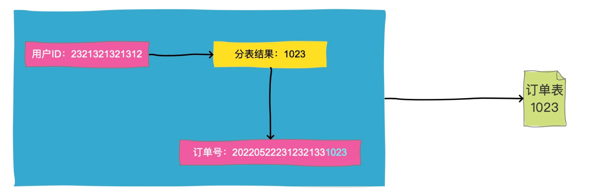
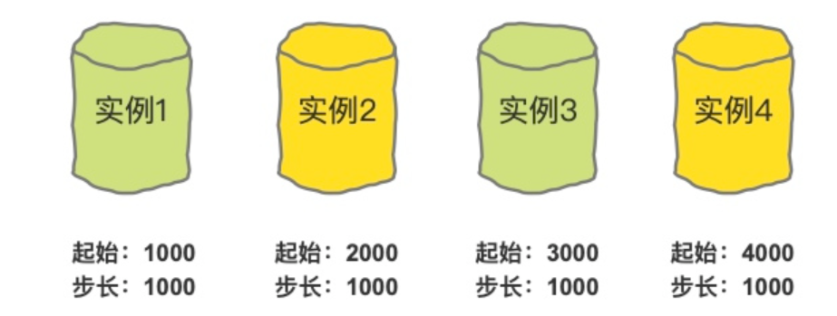
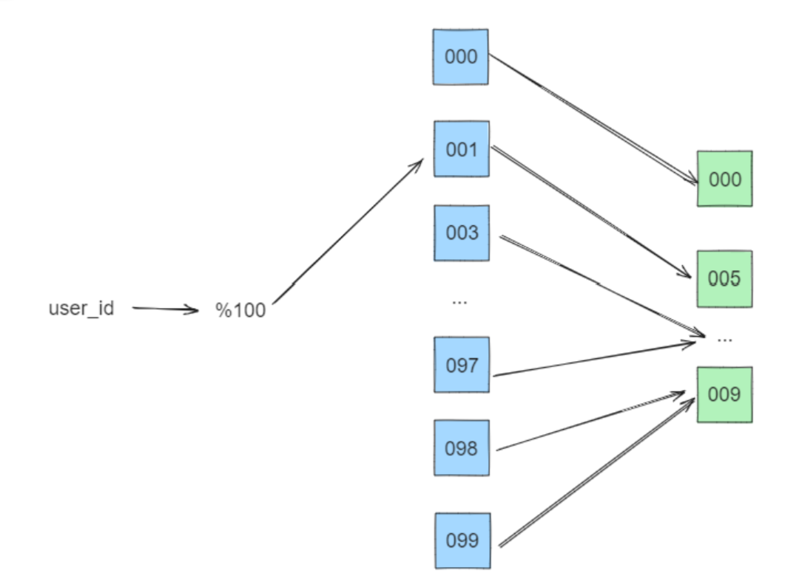
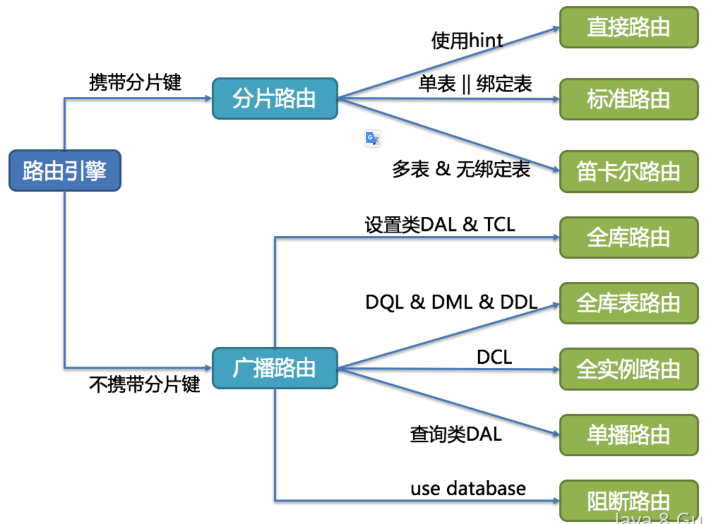

# 面试题-分布式系统

#### 什么是分布式系统？和集群的区别？

分布式是针对集中式来说的，先说集中式，集中式系统就是把一整个系统的所有功能，包括数据库等等全部都部署在一起，通过一个整套系统对外提供服务。但是集中式系统存在系统大而复杂、难于维护、容易发生单点故障、扩展性差等问题。而这些问题在分布式系统中可以很好的解决。

分布式就是把一个集中式系统拆分成多个系统，每一个系统单独对外提供部分功能，整个分布式系统整体对外提供一整套服务。对于访问分布式系统的用户来说，感知上就像访问一台计算机一样。

分布式意味着可以采用更多的普通计算机（相对于昂贵的大型机）组成分布式集群对外提供服务。计算机越多，CPU、内存、存储资源等也就越多，能够处理的并发访问量也就越大。但是分布式系统中也存在着网络通信延迟、数据一致性等问题。

拿电商网站来说，我们一般把一个电商网站横向拆分成商品模块、订单模块、购物车模块、消息模块、支付模块等。然后我们把不同的模块部署到不同的机器上，各个模块之间通过远程服务调用(RPC)等方式进行通信。以一个分布式的系统对外提供服务。

**分布式（distributed）**是指在多台不同的服务器中部署不同的服务模块，通过远程调用协同工作，对外提供服务。

**集群（cluster）**是指在多台不同的服务器中部署相同应用或服务模块，构成一个集群，通过负载均衡设备对外提供服务。

#### 分布式系统的特征

分布式系统需要各个主机之间通信和协调主要通过网络进行，所以，分布式系统中的计算机在空间上几乎没有任何限制，这些计算机可能被放在不同的机柜上，也可能被部署在不同的机房中，还可能在不同的城市中，对于大型的网站甚至可能分布在不同的国家和地区。

但是，无论空间上如何分布，一个标准的分布式系统应该具有以下几个主要特征：
**分布性**
分布式系统中的多台计算机之间在空间位置上可以随意分布，系统中的多台计算机之间没有主、从之分，即没有控制整个系统的主机，也没有受控的从机。
**透明性**
系统资源被所有计算机共享。每台计算机的用户不仅可以使用本机的资源，还可以使用本分布式系统中其他计算机的资源(包括CPU、文件、打印机等)。
**同一性**
系统中的若干台计算机可以互相协作来完成一个共同的任务，或者说一个程序可以分布在几台计算机上并行地运行。
**通信性**

系统中任意两台计算机都可以通过通信来交换信息。

和集中式系统相比，分布式系统的性价比更高、处理能力更强、可靠性更高、也有很好的扩展性。但是，分布式在解决了网站的高并发问题的同时也带来了一些其他问题。首先，分布式的必要条件就是网络，这可能对性能甚至服务能力造成一定的影响。其次，一个集群中的服务器数量越多，服务器宕机的概率也就越大。另外，由于服务在集群中分布式部署，用户的请求只会落到其中一台机器上，所以，一旦处理不好就很容易产生数据一致性问题。

#### 什么是 CAP 理论，为什么不能同时满足？

●一致性 

每次读取都会收到最新的写入数据或错误信息。

●可用性 

每个请求都会收到（非错误的）响应，但不能保证响应包含最新的写入数据。

●分区容忍性 

尽管网络节点之间会丢弃（或延迟）任意数量的消息，系统仍然能够继续运行。

#### 什么是分布式 BASE 理论？

BASE 理论是对 CAP 理论的延伸，核心思想是即使无法做到强一致性（Strong Consistency，CAP的一致性就是强一致性），但应用可以采用适合的方式达到最终一致性（Eventual Consitency）。

BASE 是指基本可用（Basically Available）、软状态（ Soft State）、最终一致性（ Eventual Consistency）。

做不到 100% 可用，那么就做到基本可用。做不到强一致性，那么就做到最终一致性。

想要做到BASE，那么主要就是用这几个手段：**中间状态（软状态）+ 重试（最终一致性）+ 降级（基本可用）**

#### 什么是拜占庭将军问题？

拜占庭将军问题是分布式系统中的一个经典问题，由Leslie Lamport等人于1982年提出，是对分布式系统中节点之间进行协调的一种特殊情况的抽象描述。

拜占庭帝国的一支军队要攻打一个城市，攻打的成功需要不同将军协同决策，但是有些将军是不忠诚的，他们可能会发送虚假信息或者故意阻碍其他将军的决策。问题是如何让忠诚的将军在不知道其他将军是否忠诚的情况下做出正确的决策。

**拜占庭将军问题的本质是分布式系统中的协同问题，即如何使得分布式系统中的不同节点能够在相互独立的情况下达成共识。**这个问题对于分布式系统的可靠性和安全性具有重要的意义，同时也是分布式系统研究中的一个重要话题。

解决拜占庭将军问题有许多方法，比较常见的就是通过投票算法、共识算法来解决，但是这些算法其实背后都基于了一个思想，那就是超过半数。

**基于多数表决的解决方案：**假设总共有N个将军，每个将军发送自己的意见给其他将军，然后将军们根据收到的意见进行投票，如果有超过N/2个将军投票一致，则采取投票的结果。这个方案的前提是假设叛徒的数量不超过总将军数的一半，因为如果超过一半的将军都是叛徒，则无法保证多数投票的结果是正确的。这种解决方案在很多算法中都有实践，如 Raft、ZAB、Paxos 等。

#### 有了 2 阶段提交为什么还需要 3 阶段提交？

二阶段提交(Two-phaseCommit)是 XA 分布式事务中一个重要的方案，二阶段提交的算法思路可以概括为：参与者将操作成败通知协调者，再由协调者根据所有参与者的反馈情报决定各参与者是否要提交操作还是中止操作。

所谓的两个阶段是指：第一阶段：准备阶段(投票阶段)和第二阶段：提交阶段（执行阶段）。但是 2PC 本身存在着同步阻塞问题、单点故障问题、数据不一致问题等，所以在二阶段的基础上，增加了一个预提交的阶段，组成了3阶段提交的方案。

**XA规范**

X/Open 组织（即现在的 Open Group ）定义了分布式事务处理模型。 模型中主要包括应用程序（ AP ）、事务管理器（ TM ）、资源管理器（ RM ）、通信资源管理器（ CRM ）等四个角色。

一般，常见的事务管理器（ TM ）是交易中间件，常见的资源管理器（ RM ）是数据库，常见的通信资源管理器（ CRM ）是消息中间件。    

通常把一个数据库内部的事务处理，如对多个表的操作，作为本地事务看待。数据库的事务处理对象是本地事务，而分布式事务处理的对象是全局事务。

所谓全局事务，是指分布式事务处理环境中，多个数据库可能需要共同完成一个工作，这个工作即是一个全局事务，例如，一个事务中可能更新几个不同的数据库。对数据库的操作发生在系统的各处但必须全部被提交或回滚。此时一个数据库对自己内部所做操作的提交不仅依赖本身操作是否成功，还要依赖与全局事务相关的其它数据库的操作是否成功，如果任一数据库的任一操作失败，则参与此事务的所有数据库所做的所有操作都必须回滚。     

XA 就是 X/Open DTP 定义的交易中间件与数据库之间的接口规范（即接口函数），交易中间件用它来通知数据库事务的开始、结束以及提交、回滚等。 XA 接口函数由数据库厂商提供。 

二阶提交协议和三阶提交协议就是根据这一思想衍生出来的。可以说二阶段提交其实就是实现XA分布式事务的关键。

**2PC**

所谓的两个阶段是指：第一阶段：准备阶段(投票阶段)和第二阶段：提交阶段（执行阶段）。

在日常生活中其实是有很多事都是这种二阶段提交的，比如西方婚礼中就经常出现这种场景：

> 牧师：”你愿意娶这个女人吗?爱她、忠诚于她，无论她贫困、患病或者残疾，直至死亡。Doyou(你愿意吗)?”
> 新郎：”Ido(我愿意)!”
> 牧师：”你愿意嫁给这个男人吗?爱他、忠诚于他，无论他贫困、患病或者残疾，直至死亡。Doyou(你愿意吗)?”
> 新娘：”Ido(我愿意)!”
> 牧师：现在请你们面向对方，握住对方的双手，作为妻子和丈夫向对方宣告誓言。
> 新郎：我——某某某，全心全意娶你做我的妻子，无论是顺境或逆境，富裕或贫穷，健康或疾病，快乐或忧愁，我都将毫无保留地爱你，我将努力去理解你，完完全全信任你。我们将成为一个整体，互为彼此的一部分，我们将一起面对人生的一切，去分享我们的梦想，作为平等的忠实伴侣，度过今后的一生。
> 新娘：我全心全意嫁给你作为你的妻子，无论是顺境或逆境，富裕或贫穷，健康或疾病，快乐或忧愁，我都将毫无保留的爱你，我将努力去理解你，完完全全信任你，我们将成为一个整体，互为彼此的一部分，我们将一起面对人生的一切，去分享我们的梦想，作为平等的忠实伴侣，度过今后的一生。


首先协调者（牧师）会询问两个参与者（二位新人）是否能执行事务提交操作（愿意结婚）。如果两个参与者能够执行事务的提交，先执行事务操作，然后返回 YES，如果没有成功执行事务操作，就返回 NO。

当协调者接收到所有的参与者的反馈之后，开始进入事务提交阶段。如果所有参与者都返回 YES，那就发送 COMMIT 请求，如果有一个人返回 NO，那就发送 rollback 请求。

值得注意的是，二阶段提交协议的第一阶段准备阶段不仅仅是回答 YES or NO，还是要执行事务操作的，只是执行完事务操作，并没有进行 commit 还是 rollback。和上面的结婚例子不太一样。如果非要举例的话可以理解为男女双方交换定情信物的过程。信物一旦交给对方了，这个信物就不能挪作他用了。也就是说，一旦事务执行之后，在没有执行 commit 或者 rollback 之前，资源是被锁定的。这会造成阻塞。

**2PC 存在的问题**

二阶段提交中，最重要的问题是可能会带来数据不一致的问题，除此之外，还存在同步阻塞以及单点故障的问题。

首先看为什么会发生同步阻塞和单点故障的问题：

1、同步阻塞问题。执行过程中，所有参与节点都是事务阻塞型的。当参与者占有公共资源时，其他第三方节点访问公共资源不得不处于阻塞状态。

2、单点故障。由于协调者的重要性，一旦协调者发生故障。参与者会一直阻塞下去。尤其在第二阶段，协调者发生故障，那么所有的参与者还都处于锁定事务资源的状态中，而无法继续完成事务操作。（如果是协调者挂掉，可以重新选举一个协调者，但是无法解决因为协调者宕机导致的参与者处于阻塞状态的问题）

作为一个分布式的一致性协议，我们主要关注他可能带来的一致性问题的。2PC 在执行过程中可能发生协调者或者参与者突然宕机的情况，在不同时期宕机可能有不同的现象。

**情况一：协调者挂了，参与者没挂**

这种情况其实比较好解决，只要找一个协调者的替代者。当他成为新的协调者的时候，询问所有参与者的最后那条事务的执行情况，他就可以知道是应该做什么样的操作了。所以，这种情况不会导致数据不一致。

**情况二：参与者挂了，协调者没挂**

这种情况其实也比较好解决。如果参与者挂了。那么之后的事情有两种情况：

- 第一个是挂了就挂了，没有再恢复。那就挂了呗，反正不会导致数据一致性问题。
- 第二个是挂了之后又恢复了，这时如果他有未执行完的事务操作，直接取消掉，然后询问协调者目前我应该怎么做，协调者就会比对自己的事务执行记录和该参与者的事务执行记录，告诉他应该怎么做来保持数据的一致性。

**情况三：参与者挂了，协调者也挂了**

这种情况比较复杂，我们分情况讨论。

- 协调者和参与者在第一阶段挂了。
  - 由于这时还没有执行 commit 操作，新选出来的协调者可以询问各个参与者的情况，再决定是进行 commit 还是 rollback。因为还没有 commit，所以不会导致数据一致性问题。
- 第二阶段协调者和参与者挂了，挂了的这个参与者在挂之前并没有接收到协调者的指令，或者接收到指令之后还没来的及做 commit 或者 rollback 操作。
  - 这种情况下，当新的协调者被选出来之后，他同样是询问所有的参与者的情况。只要有机器执行了abort（rollback）操作或者第一阶段返回的信息是No的话，那就直接执行 rollback 操作。如果没有人执行 abort 操作，但是有机器执行了 commit 操作，那么就直接执行 commit 操作。这样，当挂掉的参与者恢复之后，只要按照协调者的指示进行事务的 commit 还是 rollback 操作就可以了。因为挂掉的机器并没有做 commit 或者 rollback 操作，而没有挂掉的机器们和新的协调者又执行了同样的操作，那么这种情况不会导致数据不一致现象。
- 第二阶段协调者和参与者挂了，挂了的这个参与者在挂之前已经执行了操作。但是由于他挂了，没有人知道他执行了什么操作。
  - 这种情况下，新的协调者被选出来之后，如果他想负起协调者的责任的话他就只能按照之前那种情况来执行 commit 或者 rollback 操作。这样新的协调者和所有没挂掉的参与者就保持了数据的一致性，我们假定他们执行了 commit。但是，这个时候，那个挂掉的参与者恢复了怎么办，因为他之前已经执行完了之前的事务，如果他执行的是 commit 那还好，和其他的机器保持一致了，万一他执行的是 rollback 操作那？这不就导致数据的不一致性了么？虽然这个时候可以再通过手段让他和协调者通信，再想办法把数据搞成一致的，但是，这段时间内他的数据状态已经是不一致的了！

所以，2PC 协议中，如果出现协调者和参与者都挂了的情况，有可能导致数据不一致。

为了解决这个问题，衍生出了 3PC。我们接下来看看 3PC 是如何解决这个问题的。

**3PC**

3PC 最关键要解决的就是协调者和参与者同时挂掉的问题，所以 3PC 把 2PC 的准备阶段再次一分为二，这样三阶段提交就有 CanCommit、PreCommit、DoCommit 三个阶段。


在第一阶段，只是询问所有参与者是否可以执行事务操作，并不在本阶段执行事务操作。当协调者收到所有的参与者都返回 YES 时，在第二阶段才执行事务操作，然后在第三阶段在执行 commit 或者 rollback。

**3PC 为什么比 2PC 好？**

直接分析前面我们提到的协调者和参与者都挂的情况。

> 第二阶段协调者和参与者挂了，挂了的这个参与者在挂之前已经执行了操作。但是由于他挂了，没有人知道他执行了什么操作。
>
> - 这种情况下，当新的协调者被选出来之后，他同样是询问所有的参与者的情况来决定是 commit 还是 rollback。这看上去和二阶段提交一样啊？他是怎么解决一致性问题的呢？
> - 看上去和二阶段提交的那种数据不一致的情况的现象是一样的，但仔细分析所有参与者的状态的话就会发现其实并不一样。我们假设挂掉的那台参与者执行的操作是 commit。那么其他没挂的操作者的状态应该是什么？他们的状态要么是 prepare-commit 要么是 commit。因为 3PC 的第三阶段一旦有机器执行了 commit，那必然第一阶段大家都是同意 commit。所以，这时，新选举出来的协调者一旦发现未挂掉的参与者中有人处于 commit 状态或者是 prepare-commit 的话，那就执行 commit 操作。否则就执行 rollback 操作。这样挂掉的参与者恢复之后就能和其他机器保持数据一致性了。（为了简单的让大家理解，笔者这里简化了新选举出来的协调者执行操作的具体细节，真实情况比我描述的要复杂）

简单概括一下就是，如果挂掉的那台机器已经执行了 commit，那么协调者可以从所有未挂掉的参与者的状态中分析出来，并执行 commit。如果挂掉的那个参与者执行了 rollback，那么协调者和其他的参与者执行的肯定也是 rollback 操作。

所以，再多引入一个阶段之后，3PC 解决了 2PC 中存在的那种由于协调者和参与者同时挂掉有可能导致的数据一致性问题。

**3PC 存在的问题**

在 doCommit 阶段，如果参与者无法及时接收到来自协调者的 doCommit 或者 rebort 请求时，会在等待超时之后，会继续进行事务的提交。

所以，由于网络原因，协调者发送的 abort 响应没有及时被参与者接收到，那么参与者在等待超时之后执行了 commit 操作。这样就和其他接到 abort 命令并执行回滚的参与者之间存在数据不一致的情况。

#### 分布式锁有几种实现方式？

分布式锁有多种实现方式，比较常见的实现是通过数据库、Redis 或者 Zookeeper 来实现的。

其中数据库的实现可以依赖悲观锁以及数据库表记录来实现，通过 Redis 的实现可以考虑使用 setnx、redission 以及 redlock 实现。使用 zk 主要是依赖他提供的临时有序节点来实现。

在分析这几种实现方案之前我们先来想一下，我们需要的分布式锁应该是怎么样的？

> 可以保证在分布式部署的应用集群中，同一个方法在同一时间只能被一台机器上的一个线程执行。
>
> 这把锁要是一把可重入锁（避免死锁）
>
> 这把锁最好是一把阻塞锁（根据业务需求考虑要不要这条）
>
> 有高可用的获取锁和释放锁功能
>
> 获取锁和释放锁的性能要好

**基于数据库实现分布式锁**

要实现分布式锁，最简单的方式可能就是直接创建一张锁表，然后通过操作该表中的数据来实现了。

当我们要锁住某个方法或资源时，我们就在该表中增加一条记录，想要释放锁的时候就删除这条记录。

创建这样一张数据库表：

```sql
CREATE TABLE `methodLock` (
  `id` int(11) NOT NULL AUTO_INCREMENT COMMENT '主键',
  `method_name` varchar(64) NOT NULL DEFAULT '' COMMENT '锁定的方法名',
  `desc` varchar(1024) NOT NULL DEFAULT '备注信息',
  `update_time` timestamp NOT NULL DEFAULT CURRENT_TIMESTAMP ON UPDATE CURRENT_TIMESTAMP COMMENT '保存数据时间，自动生成',
  PRIMARY KEY (`id`),
  UNIQUE KEY `uidx_method_name` (`method_name `) USING BTREE
) ENGINE=InnoDB DEFAULT CHARSET=utf8 COMMENT='锁定中的方法';
```

当我们想要锁住某个方法时，执行以下SQL：

```sql
insert into methodLock(method_name,desc) values (‘method_name’,‘desc’)
```

因为我们对 method_name 做了唯一性约束，这里如果有多个请求同时提交到数据库的话，数据库会保证只有一个操作可以成功，那么我们就可以认为操作成功的那个线程获得了该方法的锁，可以执行方法体内容。

当方法执行完毕之后，想要释放锁的话，需要执行以下 Sql:

```sql
delete from methodLock where method_name ='method_name'
```

上面这种简单的实现有以下几个问题：

> 1、这把锁强依赖数据库的可用性，数据库是一个单点，一旦数据库挂掉，会导致业务系统不可用。
>
> 2、这把锁没有失效时间，一旦解锁操作失败，就会导致锁记录一直在数据库中，其他线程无法再获得到锁。
>
> 3、这把锁只能是非阻塞的，因为数据的insert操作，一旦插入失败就会直接报错。没有获得锁的线程并不会进入排队队列，要想再次获得锁就要再次触发获得锁操作。
>
> 4、这把锁是非重入的，同一个线程在没有释放锁之前无法再次获得该锁。因为数据中数据已经存在了。

当然，我们也可以有其他方式解决上面的问题。

- 数据库是单点？搞两个数据库，数据之前双向同步。一旦挂掉快速切换到备库上。
- 没有失效时间？只要做一个定时任务，每隔一定时间把数据库中的超时数据清理一遍。
- 非阻塞的？搞一个 while 循环，直到 insert 成功再返回成功。
- 非重入的？在数据库表中加个字段，记录当前获得锁的机器的主机信息和线程信息，那么下次再获取锁的时候先查询数据库，如果当前机器的主机信息和线程信息在数据库可以查到的话，直接把锁分配给他就可以了。

**基于数据库排他锁**

除了可以通过增删操作数据表中的记录以外，其实还可以借助数据中自带的锁来实现分布式的锁。

我们还用刚刚创建的那张数据库表。可以通过数据库的排他锁来实现分布式锁。 基于 MySql 的 InnoDB 引擎，可以使用以下方法来实现加锁操作：

```sql
public boolean lock(){
    connection.setAutoCommit(false)
    while(true){
        try{
            result = select * from methodLock where method_name=xxx for update;
            if(result==null){
                return true;
            }
        }catch(Exception e){

        }
        sleep(1000);
    }
    return false;
}
```

在查询语句后面增加 for update，数据库会在查询过程中给数据库表增加排他锁（这里再多提一句，InnoDB 引擎在加锁的时候，只有通过索引进行检索的时候才会使用行级锁，否则会使用表级锁。这里我们希望使用行级锁，就要给 method_name 添加索引，值得注意的是，这个索引一定要创建成唯一索引，否则会出现多个重载方法之间无法同时被访问的问题。重载方法的话建议把参数类型也加上。）。当某条记录被加上排他锁之后，其他线程无法再在该行记录上增加排他锁。

我们可以认为获得排它锁的线程即可获得分布式锁，当获取到锁之后，可以执行方法的业务逻辑，执行完方法之后，再通过以下方法解锁：

```java
public void unlock(){
    connection.commit();
}
```

通过 `connection.commit()` 操作来释放锁。

这种方法可以有效的解决上面提到的无法释放锁和阻塞锁的问题。

- 阻塞锁？ for update 语句会在执行成功后立即返回，在执行失败时一直处于阻塞状态，直到成功。
- 锁定之后服务宕机，无法释放？使用这种方式，服务宕机之后数据库会自己把锁释放掉。

但是还是无法直接解决数据库单点和可重入问题。

> 这里还可能存在另外一个问题，虽然我们对 method_name 使用了唯一索引，并且显示使用 for update 来使用行级锁。但是，MySql 会对查询进行优化，即便在条件中使用了索引字段，但是否使用索引来检索数据是由 MySQL 通过判断不同执行计划的代价来决定的，如果 MySQL 认为全表扫效率更高，比如对一些很小的表，它就不会使用索引，这种情况下 InnoDB 将使用表锁，而不是行锁。如果发生这种情况就悲剧了。。。
>
> 还有一个问题，就是我们要使用排他锁来进行分布式锁的lock，那么一个排他锁长时间不提交，就会占用数据库连接。一旦类似的连接变得多了，就可能把数据库连接池撑爆

**数据库实现分布式锁的优缺点**

总结一下使用数据库来实现分布式锁的方式，这两种方式都是依赖数据库的一张表，一种是通过表中的记录的存在情况确定当前是否有锁存在，另外一种是通过数据库的排他锁来实现分布式锁。

- 优点：直接借助数据库，容易理解。
- 缺点：
  - 会有各种各样的问题，在解决问题的过程中会使整个方案变得越来越复杂。
  - 操作数据库需要一定的开销，性能问题需要考虑。
  - 使用数据库的行级锁并不一定靠谱，尤其是当我们的锁表并不大的时候。

**基于缓存实现分布式锁**


**基于Zookeeper实现分布式锁**

基于 zookeeper 临时有序节点可以实现的分布式锁。

大致思想即为：每个客户端对某个方法加锁时，在zookeeper上的与该方法对应的指定节点的目录下，生成一个唯一的瞬时有序节点。 判断是否获取锁的方式很简单，只需要判断有序节点中序号最小的一个。 当释放锁的时候，只需将这个瞬时节点删除即可。同时，其可以避免服务宕机导致的锁无法释放，而产生的死锁问题。

> Zookeeper 实现的分布式锁其实存在一个缺点，那就是性能上可能并没有缓存服务那么高。因为每次在创建锁和释放锁的过程中，都要动态创建、销毁瞬时节点来实现锁功能。ZK 中创建和删除节点只能通过 Leader 服务器来执行，然后将数据同步到所有的 Follower 机器上。
>
> 其实，使用 Zookeeper 也有可能带来并发问题，只是并不常见而已。考虑这样的情况，由于网络抖动，客户端和 ZK 集群的 session 连接断了，那么 zk 以为客户端挂了，就会删除临时节点，这时候其他客户端就可以获取到分布式锁了。就可能产生并发问题。这个问题不常见是因为 zk 有重试机制，一旦 zk 集群检测不到客户端的心跳，就会重试，Curator 客户端支持多种重试策略。多次重试之后还不行的话才会删除临时节点。（所以，选择一个合适的重试策略也比较重要，要在锁的粒度和并发之间找一个平衡。）

优点：有效的解决单点问题，不可重入问题，非阻塞问题以及锁无法释放的问题。实现起来较为简单。

缺点：性能上不如使用缓存实现分布式锁。 需要对ZK的原理有所了解。

#### 什么是分布式事务？

分布式事务是指在分布式系统中涉及到多个数据库或多个应用程序之间的事务处理，这些数据库或应用程序可能分布在不同的物理节点上，甚至可能位于不同的地理位置。在分布式事务中，需要确保所有参与者的事务操作都能够保持一致性，即所有参与者的事务要么全部提交成功，要么全部回滚。

举个例子，假设一个电商系统，用户下单后需要扣减库存、扣减账户余额、生成订单等操作。在单机环境下，可以将这些操作放在同一个事务中，保证原子性、一致性和持久性。但在分布式环境下，可能存在多个服务（如库存服务、账户服务、订单服务）分布在不同的物理节点上，此时需要确保所有服务操作的事务都能够同步进行，避免出现数据不一致的情况。

为了解决分布式事务的问题，出现了一些分布式事务解决方案，如 XA 协议、TCC 事务、最大努力通知等。这些解决方案的实现方式各不相同，但都需要考虑如何确保所有参与者的事务操作能够保持一致性，以及如何处理可能出现的异常情况。

#### 常见的分布式事务有哪些？

分布式事务的目的是保证分布式系统中的多个参与方的数据能够保证一致性。即所有参与者，在一次写操作过程中要么都成功，要么都失败。

至于这个一致性到底是怎样的一致性，是强一致性、还是最终一致性，不同的分布式事务方案其实达到的效果并不相同。

如果想要实现强一致性，那么就一定要引入一个协调者，通过协调者来协调所有参与者来进行提交或者回滚。所以，这类方案包含基于XA规范的二阶段及三阶段提交、以及支持2阶段提交。

如果想要实现最终一致性，那么方案上就比较简单，常见的基于可靠消息的最终一致性（本地消息表、事务消息）、最大努力通知等。

#### 如何基于本地消息表实现分布式事务？

本地消息表其实也是借助消息来实现分布式事务的。

这个方案的主要思想是将分布式事务拆分为本地事务和消息事务两个部分，本地事务在本地数据库中进行提交或回滚，而消息事务则将消息写入消息中间件中，以实现消息的可靠投递和顺序性。

一般来说的做法是，在发送消息之前，先创建一条本地消息，并且保证写本地业务数据的操作，和，写本地消息记录的操作在同一个事务中。这样就能确保只要业务操作成功，本地消息一定可以写成功。


然后再基于本地消息，调用 MQ 发送远程消息。

消息发出去之后，等待消费者消费，在消费者端，接收到消息之后，做业务处理，处理成功后再修改本地消息表的状态。

这个过程中，可能有几个步骤都可能发生失败，那么如果失败了怎么办呢？

1、2如果失败，因为在同一个事务中，所以事务会回滚，3及以后的步骤都不会执行。数据是一致的。

3如果失败，那么就需要有一个定时任务，不断的扫描本地消息数据，对于未成功的消息进行重新投递。

4、5如果失败，则依靠消息的重投机制，不断地重试。

6、7如果失败，那么就相当于两个分布式系统中的业务数据已经一致了，但是本地消息表的状态还是错的。这种情况也可以借助定时任务继续重投消息，让下游幂等消费再重新更改消息状态，或者本系统也可以通过定时任务去查询下游系统的状态，如果已经成功了，则直接推进消息状态即可。


优点：

1. 可靠性高：基于本地消息表实现分布式事务，可以将本地消息的持久化和本地业务逻辑操作，放到一个事务中执行进行原子性的提交，从而保证了消息的可靠性。
2. 可扩展性好：基于本地消息表实现分布式事务，可以将消息的发送和本地事务的执行分开处理，从而提高了系统的可扩展性。
3. 适用范围广：基于本地消息表实现分布式事务，可以适用于多种不同的业务场景，可以满足不同业务场景下的需求。

缺点：

1. 实现复杂度高：基于本地消息表实现分布式事务，需要设计复杂的事务协议和消息发送机制，并且需要进行相应的异常处理和补偿操作，因此实现复杂度较高。
2. 系统性能受限：基于本地消息表实现分布式事务，需要将消息写入本地消息表，并且需要定时扫描本地消息表进行消息发送，因此对系统性能有一定影响。
3. 会带来消息堆积扫表慢、集中式扫表会影响正常业务、定时扫表存在延迟问题等问题。

#### 什么是最大努力通知？

所谓最大努力通知，换句话说就是并不保证100%通知到。这种分布式事务的方案，通常也是借助异步消息进行通知的。

发送者将消息发送给消息队列，接收者从消息队列中消费消息。在这个过程中，如果出现了网络通信故障或者消息队列发生了故障，就有可能导致消息传递失败，即消息被丢失。因此，最大努力通知无法保证每个接收者都能成功接收到消息，但是可以尽最大努力去通知。

下面是一个简单的例子来说明最大努力通知的过程。假设有一个在线商城系统，顾客可以下订单购买商品。当顾客成功下单后，通知顾客订单已经确认。这个通知就可以采用最大努力通知的方式。

- 顾客下单后，商城订单系统会生成订单并记录订单信息。
- 商城订单系统通过最大努力通知机制，将订单确认通知发送给用户通知服务。
- 用户通知服务把下单消息通过电子邮件发送给用户。
- 商城系统不会等待顾客的确认，而是将通知放入消息队列中，并尽力发送通知。
- 如果通知发送成功，那就很好，顾客会尽快收到订单确认邮件。但如果由于网络问题、电子邮件服务器问题或其他原因导致通知发送失败，商城系统可能会做一些尝试，尽可能的通知，重试多次后还是不成功，则不再发送


需要注意的是，在最大努力通知的过程中，可能会出现消息重复发送的情况，也可能会出现消息丢失的情况。因此，在设计最大努力通知系统时，需要根据实际业务需求和风险承受能力来确定最大努力通知的策略和重试次数，以及对消息进行去重等处理。

最大努力通知这种事务实现方案，一般用在消息通知这种场景中，因为这种场景中如果存在一些不一致影响也不大。

> 最大努力通知和本地消息表区别？
>
> 本地消息表相对于最大努力通知而言，引入了本地消息表，通过本地事务来保证消息可以发送成功。相对来说，具有更强的可靠性，可以在一定程度上保证消息的传递不丢失。但是，本地消息表也会带来额外的存储开销和网络通信成本。
>
> 而最大努力通知这种方案比较简单，但是可能存在丢消息的情况。其实，一般业务中，也会通过对账来解决的，并不会完全放任消息丢失，只不过对账的机制会有一定的延时，并且可能需要人工介入。

#### 什么是 TCC，和 2PC 有什么区别？

TCC 是 Try-Confirm-Cancel 的缩写，它是一种分布式事务解决方案，采用了基于业务逻辑的补偿机制，将整个分布式事务分解为若干个子事务，每个子事务都有一个 try、confirm 和 cancel 三个操作，通过这些操作来实现分布式事务的执行和回滚。


具体来说，TCC 事务包括以下三个步骤：

1. Try：在 try 阶段，参与者尝试执行本地事务，并对全局事务预留资源。如果 try 阶段执行成功，参与者会返回一个成功标识，否则会返回一个失败标识。
2. Confirm：如果所有参与者的 try 阶段都执行成功，则协调者通知所有参与者提交事务，那么就要执行 confirm 阶段，这时候参与者将在本地提交事务，并释放全局事务的资源。
3. Cancel：如果任何一个参与者在 try 阶段执行失败，则协调者通知所有参与者回滚事务。那么就要执行 cancel 阶段。

以下是一个简单的 TCC 事务的例子，假设有一个转账服务，需要从A账户中转移到B账户中100元、C账户中200元：

1. Try 阶段：转账服务首先尝试将A账户的金额冻结300元。
2. Confirm 阶段：如果所有的try操作都执行成功，转账服务将尝试执行解冻并转账，将金额转到B账户和C账户中。
3. Cancel 阶段：如果try过程中，某个转账事务执行失败。那么将执行解冻，将300元解冻。如果在confirm过程中，A->C的转账成功，但是A->B的转账失败，则再操作一次C->A的转账，将钱退回去。

TCC 这种事务方案有以下优缺点：

**优点：**

1. 灵活性：TCC适用于不同类型的业务场景，例如账户转账、库存扣减等，能够根据业务逻辑实现精细的事务控制。
2. 高可用性：TCC使用分布式锁来保证分布式事务的一致性，即使其中一个节点出现故障，也不会影响整个系统的运行。
3. 可扩展性：TCC 采用分阶段提交的方式，支持横向扩展，可以适应更多的并发访问和业务场景。
4. 性能：TCC 相对于 2PC 来说，具有更好的性能表现

**缺点：**

1. 实现复杂：TCC 需要实现 Try、Confirm 和 Cancel 三个操作，每个操作都需要实现正确的业务逻辑和补偿机制，代码实现比较复杂。
2. 存在悬挂事务问题：TCC的实现方式存在悬挂事务的问题，即在执行过程中可能会有部分子事务成功，而其他子事务失败，导致整个事务无法回滚或提交。
3. 空回滚问题：TCC 中的 Try 过程中，有的参与者成功了，有的参与者失败了，这时候就需要所有参与者都执行 Cancel，这时候，对于那些没有 Try 成功的参与者来说，本次回滚就是一次空回滚。需要在业务中做好对空回滚的识别和处理，否则就会出现异常报错的情况，甚至可能导致 Cancel 一直失败，最终导致整个分布式事务失败。
4. 业务代码侵入性：TCC 需要将事务操作拆分为 Try、Confirm 和 Cancel 三个步骤，对业务代码有一定的侵入性，需要针对不同的业务场景进行实现。

#### TCC 的空回滚和悬挂是什么？如何解决？

在 TCC 中，存在着两个比较关键的问题，那就是空回滚和悬挂的问题。

1. **空回滚问题：**TCC 中的 Try 过程中，有的参与者成功了，有的参与者失败了，这时候就需要所有参与者都执行 Cancel，这时候，对于那些没有Try成功的参与者来说，本次回滚就是一次空回滚。需要在业务中做好对空回滚的识别和处理，否则就会出现异常报错的情况，甚至可能导致 Cancel 一直失败，最终导致整个分布式事务失败。
2. **悬挂事务问题：**TCC 实现方式存在悬挂事务的问题，在调用 TCC 服务的一阶段 Try 操作时，可能会出现因网络拥堵而导致的超时，此时事务协调器会触发二阶段回滚，调用 TCC 服务的 Cancel 操作；在此之后，拥堵在网络上的一阶段 Try 数据包被 TCC 服务收到，出现了二阶段 Cancel 请求比一阶段 Try 请求先执行的情况。举一个比较常见的具体场景：一次分布式事务，先发生了 Try，但是因为有的节点失败，又发生了 Cancel，而下游的某个节点因为网络延迟导致先接到了 Cancel，在空回滚完成后，又接到了 Try 的请求，然后执行了，这就会导致这个节点的 Try 占用的资源无法释放，也没人会再来处理了，就会导致了事务悬挂。

这两个问题处理不好，都可能会导致一个分布式事务没办法保证最终一致性。有一个办法，可以一次性的解决以上两个问题，那就是——引入分布式事务记录表。

有了这张表，每一个参与者，都可以在本地事务执行的过程中，同时记录一次分布式事务的操作记录。

这张表中有两个关键的字段，一个是 tx_id 用于保存本次处理的事务 ID，还有一个就是 state，用于记录本次事务的执行状态。至于其他的字段，比如一些业务数据，执行时间、业务场景啥的，就自己想记录上就记录啥。

```sql
CREATE TABLE `distribute_transaction` (
  `tx_id` varchar(128) NOT NULL COMMENT '事务id',
  `state` int(1) DEFAULT NULL COMMENT '事务状态，0:try，1:confirm，2:cancel',
  PRIMARY KEY (`tx_id`) U
) 
```

有了这张表以后，我们在做 try、cancel 和 confirm 操作之后，都需要在本地事务中创建或者修改这条记录。一条记录的状态机如下：

**空回滚解决：**当一个参与者接到一次 Cancel 请求的时候，先去 distribute_transaction 中根据 tx_id 查询是否有 try 的记录，如果没有，则进行一次空回滚即可。并在 distribute_transaction 中创建一条记录，状态标记为 cancel。

**事务悬挂解决：**当一个参与者接到一次 Try 请求的时候，先去 distribute_transaction 表中根据 tx_id 查询是否有记录，如果当前存在，并且记录的状态是 cancel，则拒绝本次 try 请求。

但是需要注意的是，上面的请求过程，需要做好并发控制。

有了这张表，我们还可以基于他做幂等控制，每次 try-cancel-confirm 请求来的时候，都可以到这张表中查一下，然后做幂等控制。

#### TCC 中，Confirm 或者 Cancel 失败了怎么办？

在 TCC 模式中，如果 Confirm 阶段失败，这通常意味着在尝试提交事务的过程中遇到了问题。处理这种情况需要根据特定的失败场景和系统设计来确定最合适的策略。以下是几种常见的处理方法：
1. 重试（用的最多）
一种常见的策略是重试 Confirm 操作。这通常适用于由于临时问题（如网络延迟、服务短暂不可用等）导致的失败。在重试之前，可以设定一个延迟或等待一段时间，然后再次尝试 Confirm 操作。通常，会设置重试次数的上限，以避免无限重试。

这个方案用的是最多的，之所以可以这么做，主要是因为在 Try 的过程中已经锁定了资源，那么在 Confirm 的时候，大概率是可以成功，而如果 Confirm 失败就执行 Cancel，就会导致可能只是因为网络原因导致的时候就使得整个事务都 Cancel 了，而且这时候如果 Cancel 再失败怎么办呢？整个方案就会变得更加复杂了。

2. 执行 Cancel 操作
    如果重试 Confirm 操作依然失败，或者系统确定 Confirm 无法成功，下一步是执行 Cancel 操作。Cancel 阶段的目的是撤销在 Try 阶段预留的所有资源，确保系统回到事务开始前的状态。这是一种典型的回滚操作，用于处理事务失败的情况。

3. 日志记录和异常监控
    在 Confirm 失败的情况下，重要的是记录详细的错误日志和监控异常。这可以帮助系统管理员或开发人员分析为什么 Confirm 操作失败，并采取相应的改进措施。此外，日志可以帮助在事后定位问题的根源。

4. 人工干预
    在某些复杂或重要的事务中，如果自动化的重试和回滚失败，可能需要人工干预。这涉及到系统管理员或运维团队直接介入，手动处理故障和确保系统的一致性与稳定性。

**在 TCC 中，cancel 失败了怎么办呢？**

一般有以下几种处理手段，和 Confirm 也差不多，无非就是报警、重试、人工干预。

1. 记录日志&发送报警：将错误信息记录下来，方便后续分析和处理。并及时通知相关人员进行处理。
2. 自动重试：在一定程度上，可以通过自动重试的方式尝试多次执行 Cancel 操作，直到成功为止。
3. 人工干预：如果重试多次还是不成功， 可以报警，然后进行人工干预，可以尝试手动执行Cancel操作或者进行数据修复等。

#### TCC 和 2PC 有什么区别？

首先，二者的实现机制不同，2PC 使用协调者和参与者的方式来实现分布式事务，而 TCC 采用分阶段提交的方式。


处理方式不同，2PC 采用预写式日志的方式，在提交和回滚阶段需要协调者和参与者之间进行多次网络通信，整个事务处理过程较为复杂。TCC 则只需要在 Try、Confirm 和 Cancel 阶段执行相应的业务逻辑。

异常处理不同，2PC 需要处理网络、节点故障等异常情况，可能会导致整个事务无法提交或回滚，处理异常情况的复杂度较高。而TCC只需要处理业务异常情况，异常处理相对简单。

适用场景不同，2PC 适用于对事务一致性要求较高的场景，例如银行转账等，需要保证数据一致性和完整性。而 TCC 适用于对事务一致性要求不那么高的场景，例如电商库存扣减等，需要保证数据最终一致性即可。

> 最初 TCC 的设计是强一致性，基本上一次事务执行完之后，数据是一致的，要么都 commit，要么都 cancel。
>
> 但是其实在实际使用过程中，可能会采用最终一致性的思想，比如 commit 失败之后，进行异步重试让他尝试成功，而不是立刻 cancel

#### 什么是 Seata？他有哪几种模式？

Seata 是一个阿里开源的分布式事务解决方案（Simple Extensible Autonomous Transaction Architecture），用于在分布式系统中实现分布式事务。它旨在简化分布式事务的开发和管理，帮助解决分布式系统中的数据一致性问题。

|            | XA                             | AT                                     | TCC                                              | Saga                                                         |
| ---------- | ------------------------------ | -------------------------------------- | ------------------------------------------------ | ------------------------------------------------------------ |
| 一致性     | 强一致                         | 弱一致                                 | 弱一致                                           | 最终一致                                                     |
| 隔离性     | 完全隔离                       | 基于全局锁隔离                         | 基于资源预留隔离                                 | 无隔离                                                       |
| 代码侵入性 | 无                             | 无                                     | 有，要编写TCC三个接口                            | 有，要编写状态机及补偿代码                                   |
| 性能       | 差                             | 高                                     | 非常高                                           | 非常高                                                       |
| 适用场景   | 对一致性、隔离性要求较高的场景 | 基于关系型数据库的大多数分布式事务场景 | 对性能要求高的场景，有非关系型数据库要参与的事务 | 业务流程长且多。<br/>参与者包含外部接口或者遗留接口，无法做TCC模式的 |

**Seata 的实现原理**

因为 Seata 的开发者坚定地认为：一个分布式事务是有若干个本地事务组成的。所以他们给 Seata 体系的所有组件定义成了三种，分别是 Transaction Coordinator、Transaction Manager 和 Resource Manager

- **Transaction Coordinator(TC):**  这是一个独立的服务，是一个独立的 JVM 进程，里面不包含任何业务代码，它的主要职责：维护着整个事务的全局状态，负责通知 RM 执行回滚或提交；

- **Transaction Manager(TM):** 在微服务架构中可对应为聚合服务，即将不同的微服务组合起来成一个完成的业务流程，TM 的职责是开启一个全局事务或者提交或回滚一个全局事务；

- **Resource Manager(RM)：**RM 在微服务框架中对应具体的某个微服务为事务的分支，RM 的职责是：执行每个事务分支的操作。

看上去好像很难理解？举个例子你就知道了：


在一个下单事务中，我们有一个聚合的服务，姑且把他叫做TradeCenter吧，他负责接收并处理用户的下单请求，并且下单过程中需要调用订单服务（Order）、库存服务（Stock）及账户服务（Account）进行创建订单、扣减库存及增加积分。

所以 TradeCenter 担当的就是 TM 的角色，而 Order、Stock 及 Account 三个微服务就是RM的角色。在此之外，还需要一个独立的服务，维护分布式事务的全局状态，他就是TC。

因为TC维护着整个事务的全局状态，负责通知 RM 执行回滚或提交，所以他和 TM、RM 都是有交互的。并且 TM 和 RM 之间也有调用关系。多个RM之间可以是独立的。

上面这个场景中，要想保证分布式事务，就需要 Order、Stock 及 Account 三个服务对应的数据库表操作，要么都成功、要么都失败。不能有部分成功、部分失败的情况。

在用了 Seata 之后，一次分布式事务的大致流程如下（不同的模式略有不同，在介绍具体模式的时候分别展开）：

1、TM 在接收到用户的下单请求后，会先调用 TC 创建一个全局事务，并且从 TC 获取到他生成的 XID。

2、TM 开始通过 `RPC/Restful` 调用各个 RM，调用过程中需要把 XID 同时传递过去。


3、RM 通过其接收到的 XID,将其所管理的资源且被该调用锁使用到的资源注册为一个事务分支(Branch Transaction)


4、当该请求的调用链全部结束时，TM根据本次调用是否有失败的情况，如果所有调用都成功，则决议 Commit，如果有超时或者失败，则决议 Rollback。

5、TM将事务的决议结果通知 TC，TC 将协调所有 RM 进行事务的二阶段动作，该回滚回滚，该提交提交。


这里要求所有的 RM 都能做到 2 阶段，第一阶段做事务的预处理，第二阶段做事务的提交或者回滚。具体怎么实现，是否需要自己改代码，这个不同的模式不太一样。

#### 什么是柔性事务？

柔性事务，是业内解决分布式事务的主要方案。所谓柔性事务，相比较与数据库事务中的 ACID 这种刚性事务来说，柔性事务保证的是“基本可用，最终一致。”这其实就是基于 BASE 理论，保证数据的最终一致性。

虽然柔性事务并不像刚性事务那样完全遵循 ACID，但是，也是部分遵循 ACID 的，简单看一下关于 ACID 四个属性，柔性事务的支撑程度：

> 原子性：严格遵循
>
> 一致性：事务完成后的一致性严格遵循；事务中的一致性可适当放宽
>
> 隔离性：并行事务间不可影响；事务中间结果可见性允许安全放宽
>
> 持久性：严格遵循

在业内，关于柔性事务，最主要的有以下三种类型：**异步确保型、补偿型、最大努力通知型**。

> 想要实现柔性事务，有几个基础条件需要具备，以下介绍几个柔性事务实现的基础。

**可查询操作**

可查询操作，几乎是所有的分布式解决方案都需要的。

举一个常见的分布式场景的例子，如订单处理这一功能：

```java
/** 支付订单处理 **/
public void completeOrder() {
    orderDao.update(); // 订单服务本地更新订单状态
    accountService.update(); // 调用资金账户服务给资金帐户加款
    pointService.update(); // 调用积分服务给积分帐户增加积分
    accountingService.insert(); // 调用会计服务向会计系统写入会计原始凭证
    merchantNotifyService.notify(); // 调用商户通知服务向商户发送支付结果通知
}
```

以上这个支付订单处理的例子中，除了订单服务本地更新订单状态以外的所有操作，都需要调用 RPC 接口来执行，这种情况单纯的本地事务就无法保证数据的一致性了。就需要引入分布式事务。

在分布式事务执行过程中，如果某一个步骤执行出错，就需要明确的知道其他几个操作的处理情况，这就需要其他的服务都能够提供查询接口，保证可以通过查询来判断操作的处理情况。


为了保证操作的可查询，需要对于每一个服务的每一次调用都有一个全局唯一的标识，可以是业务单据号（如订单号）、也可以是系统分配的操作流水号（如支付记录流水号）。除此之外，操作的时间信息也要有完整的记录。

**幂等操作**

幂等性，其实是一个数学概念。幂等函数，或幂等方法，是指可以使用相同参数重复执行，并能获得相同结果的函数，如：

    f(f(x)) = f(x)

在编程中一个幂等操作的特点是其任意多次执行所产生的影响均与一次执行的影响相同。也就是说，同一个方法，使用同样的参数，调用多次产生的业务结果与调用一次产生的业务结果相同。

这一个要求其实也比较好理解，因为要保证数据的最终一致性，很多解决防范都会有很多重试的操作，如果一个方法不保证幂等，那么将无法被重试。

幂等操作的实现方式有多种，如在系统中缓存所有的请求与处理结果、检测到重复操作后，直接返回上一次的处理结果等。

**可补偿操作**

提到事务，为了保证原子性，就可能发生 commit 和 rollback，那么在分布式事务中，要想进行 rollback，就需要提供可补偿操作。

比如上面的订单处理的例子中，在`调用积分服务给积分帐户增加积分`操作执行之后，经过分布式事务协调，最终决定回滚整个事务，那么就需要提供一个`调用积分服务给积分帐户扣减积分`的操作。

并且，补偿操作同时也需要满足幂等性。

**TCC 操作**

TCC 即 Try-Confirm-Cancel。

- Try: 尝试执行业务
  - 完成所有业务检查(一致性) 预留必须业务资源(准隔离性)
- Confirm: 确认执行业务
  - 真正执行业务 不作任何业务检查 只使用 Try 阶段预留的业务资源 Confirm 操作要满足幂等性
- Cancel: 取消执行业务
  - 释放 Try 阶段预留的业务资源 ，Cancel 操作要满足幂等性

这种类型和可补偿操作类似，就是提供一种提交和回滚的机制。是一种典型的两阶段类型的操作。这里说的两阶段类型操作并不是指 2PC，他和 2PC 还是有区别的。

#### 分布式 ID 生成方案都有哪些？

在单体应用中，我们可以通过数据库的主键ID来生成唯一的ID，但是如果数据量变大，就需要进行分库分表，在分库分表之后，如何生成一个全局唯一的 ID，就是一个关键的问题。

通常情况下，对于分布式 ID 来说，我们一般希望他具有以下几个特点：

- 全局唯一：必须保证全局唯一性，这个是最基本的要求。
- 高性能&高可用：需要保证ID的生成是稳定且高效的。
- 递增：根据不同的业务情况，有的会要求生成的 ID 呈递增趋势，也有的要求必须单调递增（后一个 ID 必须比前一个大），也有的没有严格要求。

通常，在分布式 ID 的生成方案主要有以下6种：

- UUID
- 数据库自增ID
- 号段模式
- 基于Redis 实现
- 雪花算法
- 第三方 ID 生成工具


**UUID**

UUID(Universally Unique Identifier) 全局唯一标识符，是指在一台机器上生成的数字，它保证对在同一时空中的所有机器都是唯一的。

标准的UUID格式为：xxxxxxxx-xxxx-xxxx-xxxx-xxxxxxxxxxxx (8-4-4-4-12)，共32个字符，通常由以下几部分的组合而成：当前日期和时间，时钟序列，全局唯一的IEEE机器识别号

UUID的优点就是他的性能比较高，不依赖网络，本地就可以生成，使用起来也比较简单。

但是他也有两个比较明显的缺点，那就是长度过长和没有任何含义。长度自然不必说，他有32位16进制数字。对于"550e8400-e29b-41d4-a716-446655440000"这个字符串来说，我想任何一个程序员都看不出其表达的含义。一旦使用它作为全局唯一标识，就意味着在日后的问题排查和开发调试过程中会遇到很大的困难。

> 用 UUID 当做分布式 ID，存在着不适合范围查询、不方便展示以及查询效率低等问题。

**数据库自增**

分布式ID 也可以使用数据库的自增ID，但是这种实现中就要求一定是一个单库单表才能保证ID 自增且不重复，这就带来了一个单点故障的问题。

一旦这个数据库挂了，那整个分布式ID 的生成服务就挂了。而且还存在一个性能问题，如果高并发访问数据库的话，就会带来阻塞问题。

**号段模式**

号段模式是在数据库的基础上，为了解决性能问题而产生的一种方案。他的意思就是每次去数据库中取 ID 的时候取出来一批，并放在缓存中，然后下一次生成新 ID 的时候就从缓存中取。这一批用完了再去数据库中拿新的。

而为了防止多个实例之间发生冲突，需要采用号段的方式，即给每个客户端发放的时候按号段分开，如客户端A取的号段是1-1000，客户端B 取的是1001-2000，客户端C取的是2001-3000。当客户端A用完之后，再来取的时候取到的是3001-4000。

号段模式的好处是在同一个客户端中，生成的 ID 是顺序递增的。并且不需要频繁的访问数据库，也能提升获取 ID 的性能。缺点是没办法保证全局顺序递增，也存在数据库的单点故障问题。

其实很多分库分表的中间件的主键 ID 的生成，主要采用的也是号段模式，如 TDDL Sequence

**Redis 实现**

基于数据库可以实现，那么基于 Redis 也是可以的，我们可以依赖 Redis 的 incr 命令实现 ID 的原子性自增。

Redis 的好处就是可以借助集群解决单点故障的问题，并且他基于内存性能也比较高。

但是 Redis 存在数据丢失的情况，无论是那种持久化机制，都无法完全避免。

**雪花算法**

雪花算法（Snowflake）雪由 Twitter 研发的一种分布式 ID 生成算法，它可以生成全局唯一且递增的 ID。它的核心思想是将一个64 位的 ID 划分成多个部分，每个部分都有不同的含义，包括时间戳、数据中心标识、机器标识和序列号等。

具体来说，雪花算法生成的 ID 由以下几个部分组成：

1. 符号位（1bit）：预留的符号位，始终为0，占用1位。
2. 时间戳（41bit）：精确到毫秒级别，41位的时间戳可以容纳的毫秒数是2的41次幂，一年所使用的毫秒数是：365 * 24 * 60 * 60 * 1000，算下来可以使用69年。
3. 数据中心标识（5bit）：可以用来区分不同的数据中心。
4. 机器标识（5bit）：可以用来区分不同的机器。
5. 序列号（12bit)：可以生成4096个不同的序列号。

> SnowFlake 算法的缺点或者限制：
>
> 1、在 Snowflake 算法中，每个节点的机器ID 和数据中心ID 都是硬编码在代码中的，而且这些ID是全局唯一的。当某个节点出现故障或者需要扩容时，就需要更改其对应的机器ID 或数据中心ID，但是这个过程比较麻烦，需要重新编译代码，重新部署系统。还有就是，如果某个节点的机器ID 或数据中心ID 被设置成了已经被分配的ID，那么就会出现重复的ID，这样会导致系统的错误和异常。
>
> 2、Snowflake 算法中，需要使用 zookeeper 来协调各个节点的ID 	生成，但是 ZK 的部署其实是有挺大的成本的，并且 zookeeper 本身也可能成为系统的瓶颈。
>
> 3、依赖于系统时间的一致性，如果系统时间被回拨，或者不一致，可能会造成 ID 重复。

雪花算法使用时间戳作为生成 ID 的一部分，如果系统时钟回拨，可能会导致生成的ID重复。

时间回拨是指系统在运行过程中，可能由于网络时间校准或者人工设置，导致系统时间主动或被动地跳回到过去的某个时间

一旦发生这种情况，简单粗暴的做法是抛异常，发现时钟回调了，就直接抛异常出来。另外还有一种做法就是发现时钟变小了，就拒绝 ID 生成请求，等到时钟恢复到上一次的 ID 生成时间点后，再开始生成新的 ID。

美团 Leaf 引入了 Zookeeper 来解决时钟回拨问题，其大致思路为：每个 Leaf 运行时定时向 zk 上报时间戳。每次 Leaf 服务启动时，先校验本机时间与上次发 ID 的时间，再校验与 zk 上所有节点的平均时间戳。如果任何一个阶段有异常，那么就启动失败报警。

> 百度的 UidGenerator 中有两种 UidGenerator，其中 DefautlUidGenerator 使用了 System.currentTimeMillis() 获取时间与上一次时间比较，当发生时钟回拨时，抛出异常。而 CachedUidGenerator 使用是放弃了对机器的时间戳的强依赖，而是改用 AtomicLong 的 incrementAndGet() 来获取下一次时间，从而脱离了对服务器时间的依赖。

**第三方工具**

除了以上方案以外，还有一些第三方的工具可以用来实现分布式ID，如百度的 UidGenerator、美团的 Leaf 以及滴滴的 Tinyid 等等。

这些框架在功能上有的是整合了我们前面提到的多种实现方式，有的是针对不同的方式做了改进，如解决雪花算法的时钟拨回问题等。

#### 怎么实现分布式 Session？

在分布式系统中，我们的应用可能是以集群形式对外提供服务的，有可能出现在A服务器登录后，用户下一次访问的时候请求到B服务器，就需要有一个分布式的 Sesssion 来告诉 B 服务器用户是登录过的，并且需要拿到用户的登录信息。

在业内，实现分布式 Session 通常有以下几个方案：

客户端存储：用户登录后，将 Session 信息保存在客户端，用户在每次请求的时候，通过客户端的 cookie 把 session 信息带过来。这个方案因为要把 session 暴露给客户端，存在安全风险。

基于分布式存储（最常用）：将 Session 数据保存在分布式存储系统中，如分布式文件系统、分布式数据库等。不同服务器可以共享同一个分布式存储，通过 Session ID 查找对应的 Session 数据。唯一的缺点就是需要依赖第三方存储，如 Redis、数据库等。

粘性 Session：这个方案指的是把一个用户固定的路由到指定的机器上，这样只需要这台服务器中保存了 session 即可，不需要做分布式存储。但是这个存在的问题就是可能存在单点故障的问题。

Session 复制：当用户的 Session 在某个服务器上产生之后，通过复制的机制，将他同步到其他的服务器中。这个方案的缺点是有可能有延迟。

Tomcat 支持 Session 复制，配置方式可以参考官方文档：https://tomcat.apache.org/tomcat-8.0-doc/cluster-howto.html

Spring 中也提供了对 Session 管理的支持 —— Spring Session，他集成了很多 Session 共享的方案，如基于 Redis、基于数据库等。

#### 分布式命名方案都有哪些？

命名服务，就是帮助我们对资源进行命名的服务，命名的目的当然是为了更好的定位了。这里所提到的资源在不同场景中包括但不限于计算机（主机）名和地址、应用提供的服务的地址或者远程对象等。

一些比较常见的分布式框架（RPC、RMI）等都需要用到命名服务，如何解决分布式场景中的统一命名是一个至关重要的话题。

常见的命名方案有 JNDI、数据库自增 ID、UUID 以及基于 zookeeper 的命名服务来实现。

#### 什么是负载均衡，有哪些常见算法？

为了提升web应用的各方面能力，我们一般会把多台机器组成一个集群对外提供服务。然而，我们的网站对外提供的访问入口都是一个的，比如www.54p.com。那么当用户在浏览器输入www.54p.com的时候如何将用户的请求分发到集群中不同的机器上呢，这就是负载均衡在做的事情。

**负载均衡（Load Balance），意思是将负载（工作任务，访问请求）进行平衡、分摊到多个操作单元（服务器，组件）上进行执行。是解决高性能，单点故障（高可用），扩展性（水平伸缩）的终极解决方案。**

负载均衡服务器在决定将请求转发到具体哪台真实服务器的时候，是通过负载均衡算法来实现的。负载均衡算法，是一个负载均衡服务器的核心。

负载均衡算法可以分为两类：静态负载均衡算法和动态负载均衡算法。

静态负载均衡算法包括：轮询，比率，优先权

动态负载均衡算法包括: 最少连接数,最快响应速度，观察方法，预测法，动态性能分配，动态服务器补充，服务质量，服务类型，规则模式。

> 【负载均衡分类】
>
> 想要实现负载均衡，其实有很多种做法，在深入介绍负载均衡之前，要先介绍一个概念，那就是OSI七层模型。
>
> OSI 是一个开放性的通信系统互连参考模型，他是一个定义得非常好的协议规范。
>
> OSI 模型有 7 层结构，每层都可以有几个子层。 OSI 的 7 层从上到下分别是 
> 7、应用层；
> 6、表示层；
> 5、会话层；
> 4、传输层；
> 3、网络层；
> 2、数据链路层；
> 1、物理层；

其中高层（即7、6、5、4层）定义了应用程序的功能，下面3层（即3、2、1层）主要面向通过网络的端到端的数据流。

在这七层模型种，高层次都是依赖于低层次的。层次越高，使用起来越方便。


了解了网络协议的七层模型以后，再来看看负载均衡。我们可以很明确的一点是，负载均衡是要在网络传输中做文章的。而要在网络传输过程搞事情，那么这七层模型就势必躲不开。

所以，根据负载均衡技术实现在 OSI 七层模型的不同层次，是可以给负载均衡分类的。

常见的实现方式中，主要可以在应用层、传输层、网络层和数据传输层做文章。所以，工作在应用层的负载均衡，我们通常称之为七层负载均衡、工作在传输层的我们称之为四层负载均衡。

大致可以分为以下几种，其中最常用的是四层和七层负载均衡：

**二层负载均衡** 

负载均衡服务器对外依然提供一个 VIP（虚IP），集群中不同的机器采用相同 IP 地址，但是机器的 MAC 地址不一样。当负载均衡服务器接受到请求之后，通过改写报文的目标MAC地址的方式将请求转发到目标机器实现负载均衡。

**三层负载均衡**

和二层负载均衡类似，负载均衡服务器对外依然提供一个 VIP（虚IP），但是集群中不同的机器采用不同的 IP 地址。当负载均衡服务器接受到请求之后，根据不同的负载均衡算法，通过 IP 将请求转发至不同的真实服务器。

**四层负载均衡** 

四层负载均衡工作在 OSI 模型的传输层，由于在传输层，只有 TCP/UDP 协议，这两种协议中除了包含源 IP、目标 IP 以外，还包含源端口号及目的端口号。四层负载均衡服务器在接受到客户端请求后，以后通过修改数据包的地址信息（IP + 端口号）将流量转发到应用服务器。

**七层负载均衡** 

七层负载均衡工作在 OSI 模型的应用层，应用层协议较多，常用 http、radius、dns 等。七层负载就可以基于这些协议来负载。这些应用层协议中会包含很多有意义的内容。比如同一个Web服务器的负载均衡，除了根据 IP 加端口进行负载外，还可根据七层的URL、浏览器类别、语言来决定是否要进行负载均衡。

> 负载均衡工具
>
> 市面上有很多开源的负载均衡的工具或软件，基本都是基于前面提到的方案实现的，大多数是工作在第七层和第四层的。Nginx/LVS/HAProxy 是目前使用最广泛的三种负载均衡软件。

**LVS** 

LVS（Linux Virtual Server），也就是 Linux 虚拟服务器, 是一个由章文嵩博士发起的自由软件项目。使用 LVS 技术要达到的目标是：通过 LVS 提供的负载均衡技术和 Linux 操作系统实现一个高性能、高可用的服务器群集，它具有良好可靠性、可扩展性和可操作性。从而以低廉的成本实现最优的服务性能。

LVS 主要用来做四层负载均衡。

**Nginx** 

Nginx（发音同engine x）是一个网页服务器，它能反向代理 HTTP, HTTPS, SMTP, POP3, IMAP 的协议链接，以及一个负载均衡器和一个 HTTP 缓存。

Nginx 主要用来做七层负载均衡。

**HAProxy** 

HAProxy 是一个使用 C 语言编写的自由及开放源代码软件，其提供高可用性、负载均衡，以及基于 TCP 和 HTTP 的应用程序代理。

HAProxy 主要用来做七层负载均衡。

#### 常见负载均衡算法

负载均衡服务器在决定将请求转发到具体哪台真实服务器的时候，是通过负载均衡算法来实现的。负载均衡算法，是一个负载均衡服务器的核心。

负载均衡算法可以分为两类：静态负载均衡算法和动态负载均衡算法。

静态负载均衡算法包括：轮询，比率，优先权

动态负载均衡算法包括: 最少连接数,最快响应速度，观察方法，预测法，动态性能分配，动态服务器补充，服务质量，服务类型，规则模式。

- 轮询（Round Robin）：顺序循环将请求一次顺序循环地连接每个服务器。当其中某个服务器发生第二到第7 层的故障，BIG-IP 就把其从顺序循环队列中拿出，不参加下一次的轮询，直到其恢复正常。
- 比率（Ratio）：给每个服务器分配一个加权值为比例，根椐这个比例，把用户的请求分配到每个服务器。当其中某个服务器发生第二到第7 层的故障，BIG-IP 就把其从服务器队列中拿出，不参加下一次的用户请求的分配, 直到其恢复正常。
- 优先权（Priority）：给所有服务器分组,给每个组定义优先权，BIG-IP 用户的请求，分配给优先级最高的服务器组（在同一组内，采用轮询或比率算法，分配用户的请求）；当最高优先级中所有服务器出现故障，BIG-IP 才将请求送给次优先级的服务器组。这种方式，实际为用户提供一种热备份的方式。
- 最少的连接方式（Least Connection）：传递新的连接给那些进行最少连接处理的服务器。当其中某个服务器发生第二到第7 层的故障，BIG-IP 就把其从服务器队列中拿出，不参加下一次的用户请求的分配, 直到其恢复正常。
- 最快模式（Fastest）：传递连接给那些响应最快的服务器。当其中某个服务器发生第二到第7 层的故障，BIG-IP 就把其从服务器队列中拿出，不参加下一次的用户请求的分配，直到其恢复正常。
- 观察模式（Observed）：连接数目和响应时间以这两项的最佳平衡为依据为新的请求选择服务器。当其中某个服务器发生第二到第7 层的故障，BIG-IP就把其从服务器队列中拿出，不参加下一次的用户请求的分配，直到其恢复正常。
- 预测模式（Predictive）：BIG-IP利用收集到的服务器当前的性能指标，进行预测分析，选择一台服务器在下一个时间片内，其性能将达到最佳的服务器相应用户的请求。(被BIG-IP 进行检测)
- 动态性能分配(Dynamic Ratio-APM):BIG-IP 收集到的应用程序和应用服务器的各项性能参数，动态调整流量分配。
- 动态服务器补充(Dynamic Server Act.):当主服务器群中因故障导致数量减少时，动态地将备份服务器补充至主服务器群。
- 服务质量(QoS）:按不同的优先级对数据流进行分配。
- 服务类型(ToS): 按不同的服务类型（在Type of Field中标识）负载均衡对数据流进行分配。
- 规则模式：针对不同的数据流设置导向规则，用户可自行。

以上，就是目前实现负载均衡的主流算法。不同的负载均衡服务器会选择不同的算法。就像电影院和火车站可能会选用不同的引导策略一样。火车站可能会把行李少的旅客分配到一个专门的入口，可能给即将发车的旅客分派到特快入口，手持可扫描车票的用户单独分配到特殊入口等。

#### 如何解决接口幂等的问题？

解决接口幂等问题，只需要记住一句口令**"一锁、二判、三更新"**，只要严格遵守这个过程，那么就可以解决并发问题。

- 一锁：第一步，先加锁。可以加分布式锁、或者悲观锁都可以。但是一定要是一个互斥锁！
- 二判：第二步，进行幂等性判断。可以基于状态机、流水表、唯一性索引等等进行重复操作的判断。
- 三更新：第三步，进行数据的更新，将数据进行持久化。

```java
//一锁：先加一个分布式锁
@DistributeLock(scene = "OEDER", keyExpression = "#request.identifier", expire = 3000)
public OrderResponse apply(OrderRequest request) {
    OrderResponse response = new OrderResponse();
  	//二判：判断请求是否执行成功过
    OrderDTO orderDTO = orderService.queryOrder(request.getProduct(), request.getIdentifier());
    if (orderDTO != null) {
        response.setSuccess(true);
        response.setResponseCode("DUPLICATED");
        return response;
    }

		//三更新：执行更新的业务逻辑
  	return orderService.order(request);
}
```

三步需要严格控制顺序，确保加锁成功后进行数据查询和判断，幂等性判断通过后再更新，更新结束后释放锁。

以上操作需要有一个前提，那就是第一步加锁、和第二步判断的时候，需要有一个依据，这个就是幂等号了，通常需要和上游约定一个唯一ID 作为幂等号。然后通过对幂等号加锁，再通过幂等号进行幂等判断即可。

一锁这个过程，建议使用 Redis 实现分布式锁，因为他是非阻塞的高效率的互斥锁。非常适合在幂等控制场景中。

二判这个过程，如果有操作流水，建议基于操作流水做幂等，并将幂等号作为唯一性约束，确保唯一性。如果没有流水，那么基于状态机也是可以的。

但是不管怎么样，数据库的唯一性约束都要加好，这是系统的最后一道防线。万一前面的锁失效了，这里也能控制得住不会产生脏数据。

> 第一步加锁为了解决高并发场景下的幂等问题，如果没有高并发， 不需要第一步了，就直接查询，更新，再更新的时候做乐观锁控制就行了

#### 为什么不建议用数据库唯一性约束做幂等控制？

在做幂等控制的时候，通常会选择基于数据库的唯一性约束来做，一般流程是这样的：

1、根据幂等字段查询是否有历史记录
2、如果有，则直接返回
3、如果没有，则执行数据库操作，并捕获数据库唯一性约束冲突异常
4、没有异常，返回成功
5、捕获到异常，反查一下数据，如果真的成功，则返回成功

```java
public Boolean createUser(User user){

    User existUser = userDao.getUserByTel(user.getTelephone());
    
    if(existUser){
        return true;
    }
    
    try{
        return userDao.insert(user);
    }catch(DuplicateKeyException e){
        User existUser = userDao.getUserByTel(user.getTelephone());
        if(existUser){
            return true;
        }
    }
    
    return false;
}
```

首先我们说，这么做肯定是可以的，没啥大问题，一些小项目中，这么用也都是OK的。

但是为啥有人不建议这么做呢？或者说这么做有啥问题呢？为啥还需要一锁二判三更新呢？

> 这个方案，主要有以下几个问题：

**1、依赖 insert**，以上的方案，有一个局限性，就是需要在做 insert 的时候才行，这种情况下会因为幂等操作导致重复记录，而出发唯一性约束冲突。（不是说 update 不会触发，而是一般业务的 update 操作都不太会导致这种情况发生）

**2、依赖异常**，这里是通过 catch 了 DuplicateKeyException 依赖来做的处理，这样就对异常有了依赖，不建议大家在代码中根据异常来控制业务流程（原文见下方链接），另外，这里和 DuplicateKeyException 绑定了，一旦有一天换了数据库、换了 ORM 框架，换了 Spring 版本等等，这个异常就可能会发生改变，也许就不再抛这个异常了，那么就会出现问题。

**3、依赖数据库**，这种做法，还有一个问题，就是把并发请求交给数据库来抗了，如果没有特别大的并发的话没啥问题，但是如果一旦有并发比较高的话，那么就可能会对数据库造成很大的压力。

> 当然，这个做法也有好处，一方面是简单，不需要额外的引入分布式锁，还有一个好处，就是大多数情况下，其实业务幂等场景中出现并发或者重复的概率并不大，所以走到这个catch的流程也并不多，这样做相比先加个锁要更加高效。
>
> 所以，如果并发冲突不高，并且是insert操作，能基于唯一性约束来做的话，也可以这么干。但是不建议！如果并发比较高，那么建议还是一锁二判三更新。

#### Leaf生成分布式ID的原理？

Leaf 是美团的分布式 ID 框架，他有 2 种生成 ID 的模式，分别是 Snowflake 和 Segment。

在 Segment（号段）模式中，他的意思就是每次去数据库中取ID 的时候取出来一批，并放在缓存中，然后下一次生成新 ID 的时候就从缓存中取。这一批用完了再去数据库中拿新的。

而为了防止多个实例之间发生冲突，需要采用号段的方式，即给每个客户端发放的时候按号段分开，如客户端 A 取的号段是 1-1000，客户端 B 取的是 1001-2000，客户端 C 取的是 2001-3000。当客户端 A 用完之后，再来取的时候取到的是 3001-4000。

号段模式的好处是在同一个客户端中，生成的ID是顺序递增的。并且不需要频繁的访问数据库，也能提升获取ID的性能。

> 这种模式的优点是，虽然依赖数据库，但是因为有号段缓存，所以在数据库宕机后的一段时间内也能保证可用性，并且这种模式不依赖时钟，所以不存在时钟回拨的问题。
>
> 缺点也比较明显，首先是如果多个缓存中刚好用完了号段，同时去请求数据库获取新的号段时可能会导致并发争抢影响性能，另外，DB 如果宕机时间过长，缓存中号段耗尽也会有可用性问题。
>
> 为了解决多个号段用完之后取新的号段冲突，Leaf 还引入了双 buff，当号段消费到某个阈值时就异步的把下一个号段加载到内存中，而不需要定好耗尽才去更新，这样可以避免取号段的时候导致没有号码分配影响可用性及性能。

在 **Snowflake 模式**中，当然是基于基于 Twitter 的 Snowflake 算法实现的了。但是主要是针对 Snowflake 中存在的一些问题做了很多优化：

1、数据中心ID 和机器ID 的配置方式：Snowflake 需要在代码中硬编码数据中心ID 和机器ID，而 Leaf 通过配置文件的方式进行配置，可以动态配置数据中心ID 和机器ID，降低了配置的难度。

2、引入区间概念：Leaf 引入了区间的概念，每次从 zookeeper 获取一段 ID 的数量（比如1万个），之后在这个区间内产生ID，避免了每次获取ID 都要去 zookeeper 中获取，减轻了对 zookeeper 的压力，并且也可以减少对 ZK 的依赖，并且也能提升生成ID 的效率。

3、自适应调整：Leaf 支持自适应调整ID 生成器的参数，比如每个区间的 ID 数量、ID 生成器的工作线程数量等，可以根据实际情况进行动态调整，提高了系统的性能和灵活性。

4、支持多种语言：Leaf 不仅提供了 Java 版本的 ID 生成器，还提供了 Python 和 Go 语言的版本，可以满足不同语言的开发需求。

5、时钟回拨解决：每个 Leaf 运行时定时向 zk 上报时间戳。每次 Leaf 服务启动时，先校验本机时间与上次发 ID 的时间，再校验与 zk 上所有节点的平均时间戳。如果任何一个阶段有异常，那么就启动失败报警。

> Leaf 的分布式ID 生成过程可以简述如下：

1、Leaf 生成器启动时，会从配置文件中读取配置信息，包括数据中心 ID、机器 ID 等。

2、Leaf 生成器会向 zookeeper 注册自己的信息，包括 IP 地址、端口号等。
3、应用程序需要生成一个 ID 时，会向 Leaf 生成器发送一个请求。

4、Leaf 生成器会从 zookeeper 中读取可用的区间信息，并分配一批 ID。

5、Leaf 生成器将分配的 ID 返回给应用程序。

6、应用程序可以使用返回的 ID 生成具体的业务 ID。

7、当分配的 ID 用完后，Leaf 生成器会再次向 zookeeper 请求新的区间。

#### 什么是一致性哈希？

哈希算法大家都不陌生，经常被用在负载均衡、分库分表等场景中，比如说我们在做分库分表的时候，最开始我们根据业务预估，把数据库分成了 128 张表，这时候要插入或者查询一条记录的时候，我们就会先把分表键，如 buyer_id 进行 hash 运算，然后再对 128 取模，得到 0-127 之间的数字，这样就可以唯一定位到一个分表。

但是随着业务得突飞猛进，128 张表，已经不够用了，这时候就需要重新分表，比如增加一张新的表。这时候如果采用 hash 或者取模的方式，就会导致 128+1 张表的数据都需要重新分配，成本巨高。

而一致性 hash 算法， 就能有效的解决这种分布式系统中增加或者删除节点时的失效问题。

**一致性哈希（Consistent Hashing）是一种用于分布式系统中数据分片和负载均衡的算法。它的目标是在节点的动态增加或删除时，尽可能地减少数据迁移和重新分布的成本。**

> 在总结一下。一致性哈希算法将整个哈希空间视为一个环状结构，将节点和数据都映射到这个环上。每个节点通过计算一个哈希值，将节点映射到环上的一个位置。而数据也通过计算一个哈希值，将数据映射到环上的一个位置。
>
> 当有新的数据需要存储时，首先计算数据的哈希值，然后顺时针或逆时针在环上找到最近的节点，将数据存储在这个节点上。当需要查找数据时，同样计算数据的哈希值，然后顺时针或逆时针在环上找到最近的节点，从该节点获取数据。

#### 如何实现应用中的链路追踪？

随着业务量的增长，为了提升整体系统的可用性、性能及可扩展性，很多大型互联网公司都会采用微服务架构，一次业务请求，一般要经过几个微服务调用才能完成，。

一次请求之间要经过很多的系统，那么如何追踪一次请求从头到尾的流程，就至关重要，这样可以帮我们做很好的链路分析，及问题定位。

在业内，有很多链路追踪的工具，如 Google 的 dapper、twitter 的 zipkin、京东的 hydra、大众点评的 cat，以及开源的 skywalking。

> 不管是哪个实现，在我看来重点就是解决两个问题：
>
> 1、生成一个全局的 traceId
> 2、把这个 traceId 传递下去

**生成 TraceId**

想要追踪一个完成的链路，就需要有一个标识来标记这次调用链，业内把他叫做 traceId，一般会在入口处生成一个全局唯一的 traceId，比如说在HTTP的请求入口，在定时任务的调度入口等，生成一个 traceId。

**传递 TraceId**

在有了一个 traceId 之后，想要通过它把一次调用过程串联起来，那么就需要所有的系统间调用都得把他传递下去，这里面的调用包括了 HTTP 请求、RPC 请求、MQ 消息等，甚至还需要涉及到 Redis、MySQL 等等可能都需要进行传递。

所以，想要实现一个链路追踪，需要很多中间件一起配合才行，通常这个 traceId 会存放在 RPC 的请求头、HTTP 的请求头、MQ消息的消息头中进行传递。

系统之间通过这种方式，那系统内部也是需要传递的，所以一般都是用 ThreadLocal 来实现的，在接收到请求后，会把这个 traceId 存储在 ThreadLocal 中，然后就能在当前线程中一直传递下去，并且在记录日志的时候取出来打印到日志中，在需要调远程的时候，取出来传递下去。

> 但是，如果有多线程怎么办呢？ThreadLocal 咋传递呢，这就要用到TTL了：
>
> TransmittableThreadLocal 是阿里开源的一个方案 （开源地址：https://github.com/alibaba/transmittable-thread-local ） ，这个类继承并加强 InheritableThreadLocal 类。用来实现线程之间的参数传递。

**Span**

前面提到了 traceId，其实光有 traceId 还不够，trace 帮我们把一次调用串联起来，但是一次调用在每一个系统上都干了什么，干了多久，成功还是失败，这些对我们来说也很重要，这些信息就被记录在 span 中。

通常一个完整的 Span 具有如下属性：

- Operation Name：描述了当前接口的行为语义，如具体的哪个接口，哪个URL地址。
- SpanId/ParentSpanId：接口调用的层级标识，用于还原 Trace 内部的层次调用关系。
- Start/FinishTime：接口调用的开始和结束时间，二者相减就是该次调用的耗时。
- StatusCode：响应状态，标识当次调用是成功或失败。
- Tags & Events：调用附加信息

#### 实现一个分布式锁需要考虑哪些问题？

想要实现一个分布式锁，一般需要考虑哪些问题？一般来说应该从以下几个方面来考虑：

**互斥性**

一个分布式锁，最基本的要求，就是要具备互斥性，同一时间只能有一个线程获取到锁。否则就会出现并发问题。

在分布式场景中，想要实现一个分布式锁，必须要依赖一个第三方的分布式组件，比如数据库、Redis 或者 Zookeeper。借助自带的锁机制、单线程、互斥性等特点来实现互斥性。

**避免死锁**

锁的死锁问题使我们不得不考虑的。尤其在在分布式环境中，由于网络延迟、节点故障等原因，会出现死锁的概率就会更高。所以我们在设计分布式锁的时候，一般都会设置一定的超时机制和死锁检测策略。

**阻塞&非阻塞**

根据加锁失败后是否阻塞持续自旋加锁，分布式锁可以分为阻塞锁和非阻塞锁。一般来说非阻塞锁用的比较多。像我们常用的 Redis 的分布式锁就是非阻塞锁。而使用数据库悲观锁 for update 实现的可能就是个阻塞锁，这个要根据业务的具体情况来做选择和设计。

**可重入**

一个线程，拿到锁之后，是否可以在未释放时重新获得锁。这就是可重入的特性了。可重入的锁不仅可以提升加锁效率，也能降低死锁的概率。

而且在有些业务场景中，对是否可以重入也会有一些要求。所以这个也是需要重点考量的。

**锁的性能**

加锁性能是很重要的，尤其是分布式锁。因为在用分布式锁的场景一般并发较高，而如果分布式锁自身的性能差的话，对业务来说也是不可接受的。所以好的性能更重要。

**可靠性**

一个分布式锁是否可靠，很重要，一旦他不可靠了，就可能会出现重复加锁导致并发问题。这也是为什么Redis 的分布式锁从 SetNX 到 Redisson 再到 RedLock 的重要原因。

**其他**

实现一个分布式锁，除了上面这些，还有一些其他的东西需要考虑，比如实现的复杂度、易用性等，都很重要的。

#### 定时任务扫表的缺点有什么？

本地消息表的分布式事务方案是依赖本地消息表，然后通过定时任务扫表的方式来实现的最终一致性。那么这个方案，整体上来看，在以下几个方面是有问题的：

1、消息堆积扫表慢
2、集中式扫表会影响正常业务
3、定时扫表存在延迟问题

那么，这几个问题，该如何解决呢？


**消息堆积，扫表慢**

随着本地消息表中的数据量越来越大，通过定时任务扫表的方式会越来越慢，那么想要解决这个问题，首先可以考虑加索引。

我们可以在 state 字段上增加一个索引，虽然这个字段的区分度不高，但是一般来说，这张表中，SUCCESS 的数据量占 90%，而 INIT 的数据量只占 10%，而我们扫表的时候只关心 INIT 即可，所以增加索引后，扫表的效率是可以大大提升的。

其次，可以考虑多线程并发扫表，这里可以考虑采用线程池，在任务中开多个线程并发的从数据库中扫描数据进行处理。

但是这样做，会带来一个问题，那就是多个线程之间如何做好隔离，如何确保不会出现并发导致同一条记录被多个线程执行多次呢？

首先最基本的保障，扫表之后的处理逻辑要做好幂等控制，一旦出现了重复的情况，下游也能因为做了幂等而不会重复处理。

除此以外，在扫表的时候，可以通过分段的思想进行数据隔离。举个例子：

```java
Long minId = messageService.getMinInitId();


for(int i=1;i<= threadPool.size();i++){
    Long maxId = minId + segmentSize()*i;

    List<Message> messages = messageService.scanInitMessages(minId,maxId);

    proccee(messages);
    minId = maxId + 1;
}
```

像上面的例子中，假设有 10 个线程，那么第一个线程就扫描 ID 处于 0-1000 的数据，第二个线程扫描 1001-2000 的数据，第三个线程扫描 2001-3000 的数据。这样以此类推，线程之间通过分段的方式就做好了隔离，可以避免同一个数据被多个线程扫描到。

这个做法，有个小问题，那就是 INIT 的数据的 ID 可能不是连续的，那么就需要考虑其他的分段方式，比如在时间表中增加一个业务 ID，然后根据这个 biz_id 做分片也可以。

比如：

```java
for(int i=1;i<= threadPool.size();i++){
    List<Message> messages = messageService.scanInitMessages(i);
    proccee(messages);
}
```

这样在SQL中：

```java
SELECT * FROM RETRY_MESSAGE WHERE 
STATE = "INIT"
AND BIZ_ID LIKE "${frontNumber}%"
```

那么，不同的线程执行的SQL就不一样了分别是：

```java
SELECT * FROM RETRY_MESSAGE WHERE 
STATE = "INIT"
AND BIZ_ID LIKE "1%"

SELECT * FROM RETRY_MESSAGE WHERE 
STATE = "INIT"
AND BIZ_ID LIKE "2%"

SELECT * FROM RETRY_MESSAGE WHERE 
STATE = "INIT"
AND BIZ_ID LIKE "3%"

SELECT * FROM RETRY_MESSAGE WHERE 
STATE = "INIT"
AND BIZ_ID LIKE "4%"
```

这样也是可以做分段的。


**集中式扫表会影响正常业务**

如果业务量比较大的话，集中式的扫描数据库势必给数据库带来一定的压力，那么就会影响到正常的业务。

> 因为数据量大的话会一直扫表做查询，数据量大的时候查询就会很慢，那么数据库连接数就会被占满。导致应用的正常请求拿不到连接.

那么想要解决这个问题，首先可以考虑，不扫主库，而是扫描备库。之所以能这么做，是因为这个业务场景一般都是可以接受一定的数据延迟的，那么备库带来延迟就可以忽略，但是备库是没有业务操作的，所以对备库的扫描是不会对业务造成影响的。

当然，这里还要考虑一个问题，那就是备库扫描数据之后的执行，执行完该如何同步到主库，这里可以直接修改主库，主备库数据ID 一致的，直接去修改主库的就行了。不建议直接在备库上修改。

但是不管怎么样，备库还是可以分担扫表的这个大量高峰请求的。

除了扫备库，还有一个方案，那就是做分库了。把原来集中在同一个数据库的数据分散到不同的数据库中，这样用集群代替单库来整体对外提供服务，可以大大的提升吞吐量。

因为多个数据库的话，每个库提供的连接数就会多，并且多个实例的话，CPU、IO、LOAD 这些指标也可以互相分担。


**定时扫表存在延迟问题**

定时任务都是集中式的定时执行的，那么就会存在延迟的问题。随着数据库越来越大，延时会越来越长。

想要降低延迟，那就要抛弃定时任务的方案，可以考虑延迟消息，基于延迟消息来做定时执行。

用了延迟消息之后，还可以缓解数据库的压力。也能比定时扫表的性能要好，实时性也更高。


**同步转异步**

再提一个方案，那就是同步转异步。什么叫同步转异步呢，那就是同步先干一把，失败了的话，再异步执行。如：

```java
private static ThreadFactory namedThreadFactory = new ThreadFactoryBuilder()
    .setNameFormat("hollis-pool-%d").build();

private static ExecutorService pool = new ThreadPoolExecutor(5, 200,
    0L, TimeUnit.MILLISECONDS,
    new LinkedBlockingQueue<Runnable>(1024), namedThreadFactory, new ThreadPoolExecutor.AbortPolicy());

@Transactional(rollbackFor = Exception.class)
public void pay(PayRequest payRequest){

	//在同一个事务中做本地业务操作和记录消息
	payService.doPay(payRequest);
    retryMessageService.init(payRequest);

	//同步执行一次外部调用
    try{
        Result result = outerService.doSth(payRequest);
        if(result.isSuccess()){
            retryMessageService.success(payRequest);
        }
    }catch(Exception e){
        // 捕获异常，失败依赖异步重试
    }
}
```

如上，在同步接口中，先尝试着执行一次要可能会失败的任务，如果成功了，那就把事件推进到成功，如果失败了也无所谓，因为会有异步定时任务捞起来重试。

当然，这个方案在本地事务中做了远程调用，会拖长事务，不太建议，这里建议考虑用 SpringEvent 的异步事件来实现。

#### 什么是Canal，他的工作原理是什么？

Canal 是阿里巴巴开源的数据同步工具，他是一个用于数据库的数据变更捕获，它可以捕获数据库中的变更操作（如插入、更新、删除），并将这些变更以实时流的方式发布给其他系统进行消费。主要应用场景之一是数据库的增量数据同步，通常在数据仓库、缓存、搜索引擎等系统中使用。

我们经常会在数据迁移、数据同步的场景中需要用到 canal，比如分库分表时买家表同步出一张卖家表来，比如我们要把 mysql 中的数据同步到 es 中等等，这些场景，canal 都能大显神威。

Canal的实现原理其实挺简单的：

Canal会模拟 MySQL slave 的交互协议，把自己伪装成为一个 MySQL slave ，向 MySQL master 发送dump 协议，MySQL master 收到 dump 请求后，会被这个伪装的 slave ( canal )拉取这些 binlog ，canal 把 binlog 解析成流，然后对接到各个后续的消费者中，如 ES、数据库等。

#### 什么是分布式系统的一致性？

所谓一致性，是指数据在多个副本之间是否能够保持一致的特性。再聊一致性的时候，其实要搞清楚一致性模型。（概念挺多，但是没办法，这玩意它本身就是理论。想结合代码、示例都做不到，甚至想着画个图都不知道该如何下手）

分布式系统中的一致性模型是一组管理分布式系统行为的规则。它决定了在分布式系统中如何访问和更新数据，以及如何将这些更新提供给客户端。面对网络延迟和局部故障等分布式计算难题，分布式系统的一致性模型对保证系统的一致性和可靠性起着关键作用。在分布式系统中有多种一致性模型可用，每个模型都有其优点和缺点，选择模型取决于系统的具体要求。

大的分类上面，主要有三种，分别是**强一致性**、**弱一致性**和**最终一致性**：

- 强一致性模型（Strong Consistency）： 在强一致性模型下，系统保证每个读操作都将返回最近的写操作的结果，即任何时间点，客户端都将看到相同的数据视图。这包括线性一致性（Linearizability）、顺序一致性（Sequential Consistency）和严格可串行性（Strict Serializability）等子模型。强一致性模型通常牺牲了可用性来实现数据一致性。

- 弱一致性模型（Weak Consistency）： 弱一致性模型放宽了一致性保证，它允许在不同节点之间的数据访问之间存在一定程度的不一致性，以换取更高的性能和可用性。这包括因果一致性（Causal Consistency）、会话一致性（Session Consistency）和单调一致性（Monotonic Consistency）等子模型。弱一致性模型通常更注重可用性，允许一定程度的数据不一致性。

- 最终一致性模型（Eventual Consistency）： 最终一致性模型是一种最大程度放宽了一致性要求的模型。它允许在系统发生分区或网络故障后，经过一段时间，系统将最终达到一致状态。这个模型在某些情况下提供了很高的可用性，但在一段时间内可能会出现数据不一致的情况。


**线性一致性 & 顺序一致性**

线性一致性（Linearizability）和顺序一致性（Sequential Consistency）是两种强一致性模型。

**线性一致性是一种最强的一致性模型，它强调在分布式系统中的任何时间点，读操作都应该返回最近的写操作的结果。**

举个例子，如果操作A在操作B之前成功完成，那么操作B在序列化中应该看起来在操作A之后发生，即操作A应该在操作B之前完成。**线性一致性强调实时性，确保操作在实际时间上的顺序保持一致。**

**顺序一致性也是一种强一致性模型，但相对于线性一致性而言，它放宽了一些限制。**在顺序一致性模型中，系统维护一个全局的操作顺序，以确保每个客户端看到的操作顺序都是一致的。

**与线性一致性不同，顺序一致性不强调实时性，只要操作的顺序是一致的，就可以接受一些延迟。**

他们的主要区别在于强调**实时性**。线性一致性要求操作在实际时间上的顺序保持一致，而顺序一致性只要求操作的顺序是一致的，但不一定要求操作的实际时间顺序。


**顺序一致性 & 最终一致性**

很多人看完线性一致性和顺序一致性的区别之后，会容易懵，看上去顺序一致性和我们理解的最终一致性有点像？

那么他们的区别是啥呢？

在时间上，虽然顺序一致性和最终一致性都不强要求实时性，但是最终一致性的时间放的会更宽。并且最终一致性其实并不强调顺序，他只需要保证最终的结果一致就行了，而顺序一致性要求操作顺序必须一致。

并且，顺序一致性还是一种强一致性，比如在 Zookeeper 中，其实就是通过 ZAB 算法来保证的顺序一致性，即各个节点之间的写入顺序要求一致。并且要半数以上的节点写入成功才算成功。所以，顺序一致性的典型应用场景就是数据库管理系统以及分布式系统。

而最终一致性通常适用于互联网三高架构的业务开发，如电商网站，社交媒体网站等。


#### 什么是分布式数据库，有什么优势？

分布式数据库，即所谓的 NewSQL。主要代表 TiDB（pingcap）、OceanBase（蚂蚁）、Spanner（google）。与传统关系型数据库相比：

1. 性能高：在亿级别以上，读和写都会高于传统关系型数据库（MySQL、SQLServer等），在亿级别以下略逊色与传统关系型数据库
2. 可维护性：TiDB、OceanBase 都以开源的形式存在，其生态也比较贴近于现代数据库的需求（如完全支持云原生），有较好的社区文档、企业免费的培训课程
3. 可靠性：由于分布式的特性，通过副本冗余的方式提升整个集群可靠性。同样由于分布式的特性，无法严格且完全的实现真正意义上的 ACID，从事务的角度来看可靠性降低了。
4. 可扩展性：分布式的特性就在于近乎无限的水平可扩展，增加集群节点数量可大幅度提高集群的 QPS 和存储能力。Spanner 甚至实现了全球部署。
5. 用户体验：兼容大部分 SQL 标准，但也是由于分布式的原因，很多传统关系型数据库的特性（SQL 语法、其他功能）无法支持，如：无法保证自增 id 的连续性，有限的支持事务的强一致性(对性能略有损失)，天生分布式不支持单机部署（小型业务无法使用）。TiDB 与 MySQL 思想类似，也存在存储引擎概念，通过存储引起实现了 OLAP 和 OLTP 两种模式，插入数据能随时进行在线事务操作，也可以进行实时的离线分析操作。

#### 有了 MySQL 为啥还要有分布式数据库？

其实能用上分布式数据库的公司数据量和 QPS 已经非常庞大了。很难通过 MySQ L解决数据量和高 QPS 的问题了。

MySQL 在应对大数据量的时候通过采用分库分表的方案，应对大量读 QPS 的场景方案是进行读写分离，而写 TPS 很难提高，分库分表会带来诸多问题。

读写分离会带来的问题：

1. 主从复制存在延迟，存在写后读依赖的场景，只能强制读主，进而对主产生了压力
2. 读写分离需要应用感知主和从的存在
3. 使用 cluster 方案维护主从切换成本高
4. 纯主从复制方案单实例写 tps 有限，从只能提高读的并发度

因此，MySQL 官方提供了 Cluster 方案，但对主从选举时采用了复杂的 paxos 算法，可维护性和性能都大幅度降低，业内并不买账，依旧使用传统的分库分表、主从复制。

总的来说 MySQL 可维护性和可扩展性较差。

在分布式数据库中，**从 TiDB 来说，重点解决了可维护性和可扩展性的问题**。

TiDB 通过 pd 节点管理数据的自动分片，调度，倾斜自动迁移，热点自动迁移，自动选主（采用轻量的raft协议）等功能。数据节点单机使用 LSM 树作为底层存储结构，大幅度提升机械磁盘写的 IOPS。

本质上内部分片采用范围分片的策略，然后整个集群构成了一个树状结构，进行聚合，分页查询。分布式中时间是一个很重要的东西，无论是事务的 id 生成，还是 MVCC（多版本并发控制）都依托于时间，在计算机中即使是采用 NTP 服务也无法解决时间漂移的问题。

TiDB 通过 pd 节点管理时间，计算节点、数据节点都从pd节点进行同步。而 Spanner 采用了一个硬件设备（艳原子钟）确保数据中心的时间非常精准，从而实现了全球数据库部署，即跨国际的时间同步策略保证了事务的正确。

由于是分布式数据库，有限支持 id 自增，有限支持强一致的事务(对性能略有损失)。其弊端：

1. 天生分布式，不支持单机部署，基本不适合小业务量的应用
2. 由于分布式，事务隔离级别弱，无法完全实现 ACID
3. 实测在亿级以下的读写请求比 mysql 的性能略低一些

总的来说，虽然 tidb 承诺金融级别的分布式数据库，但是选择用在核心链路上还要深思熟虑。用在支付链路上曾遇到过因为 tidb 慢查询导致整个集群崩溃，其原因是 tidb 查询分析器有 bug 导致选择错了查询计划。

分布式数据库是技术和商业发展的必然，人类产生的数据量越来越大，传统关系型数据库也在逐渐往分布式数据库上过度（如 MySQL 的 Cluster 方案），人们应该逐渐接受分布式带来的问题，接受并能够解决事务不是那么强一致。

#### 如何基于 MQ 实现分布式事务?

在分布式事务的实现中，有很多种方案，其中比较常用的就是基于 MQ 来实现，在 MQ 的具体实现中，又有很多种具体的方案，从大的方面来说可以分为两种：

- 可靠消息最终一致性
- 最大努力通知

**可靠消息最终一致性**

可靠消息最终一致性，顾名思义就是依赖可靠的消息，来实现一种最终一致性的模型。

他的大致流程就是：
1、事务的发起方执行本地事务
2、事务的发起方向事务的参与方发送MQ消息
3、事务的参与方接收到MQ消息后执行自己的本地事务

这里面事务的发起方和参与方都需要各自执行本地事务，他们之间，通过可靠消息来保障最终一致。

那么，怎么样的消息算可靠呢，直接依赖 kafka、rocketMQ 发送一个消息就可靠了么？显然是不行的，因为我们知道，在出现网络分区、网络延迟等情况时，是没办法保证消息一定可以发出去的，也没办法保证消息发出去就一定能被成功消费。

那么想要做到让这个消息可靠，一般由两种做法：

1、本地消息表

2、事务消息

> 通过这两种方案，都可以保证事务的发起方在执行完本地事务之后，消息一定可以发出去，并且一定能被消费成功。
>
> 本地消息表的方案是基于本地事务+重试，来保证 MQ 消息一定可以发出去。
> 事务消息的方案是基于 MQ 的事务消息机制，把一条消息拆成两个 half 消息，通过 2 阶段的方式 + 回调反查来保证消息一定能发出去。
>
> 2 者都是依赖 MQ 自身的重试机制 + 事务参与者反查 + 对账来保证消息一定可以消费。

**最大努力通知**

除了可靠消息最终一致性这种以外，还有一种方式就是也使用消息，但是这个消息并不要求一定可靠。这就是最大努力通知。

这个方案一般就是只依赖重试机制，来做最大努力的通知事务参与者。但是需要注意的是，在最大努力通知的过程中，可能会出现消息重复发送的情况，也可能会出现消息丢失的情况。

> 【只用消息为啥不行】
>
> 直接用 MQ 发消息为啥不可以呢，要搞本地消息表、事务消息等这么麻烦的方案呢？
>
> 主要有几个问题：
>
> 1、消息不可靠，不管是啥 MQ，都没有办法保证 100% 的消息不丢的。所以，完全依赖消息是可能会丢消息的。
>
> 2、发消息和本地事务没办法保证一致性。我们在一个本地事务的操作和一个 MQ 发送操作，这俩保证不了一致性，有可能一个成功一个失败。比如，本地事务提交了，MQ 发失败了。或者本地事务回滚了，MQ 发成功了。都会导致最终的数据不一致。
>
> 本地事务提交了，MQ 发失败了？
>
> 如果没有把 MQ 放到事务中，那么就会出现这种情况，导致 MQ 丢失。
>
> 本地事务回滚了，MQ 发成功了？
>
> 当我们把 MQ 的发送也放到本地事务中的时候，一旦 MQ 发失败了，本地事务会回滚。但是问题是 MQ 有可能其实真正的是成功了，因为网络延迟等情况，他返回了失败，那这时候，就出现了不一致的情况。

#### 最大努力通知&事务消息&本地消息表三者区别是什么？

最大努力通知、MQ事务消息以及本地消息表都是依赖MQ实现最终一致性的方案。其中本地消息表和MQ事务消息其实是可靠消息最终一致性的两种具体实现。

这三者中，方案最简单的肯定是最大努力通知，因为他不需要保证消费者一定能接收到，只是尽自己最大的努力去通知就行了。最多就是在发消息的地方加一个重试的机制。

但是这个方案缺点也很明显，那就是可能会导致消息的重复和丢失，这个比较容易理解。

虽然最大努力通知也是一种最终一致性的方案，但是他的一致性保障并没有那么强，所以他不适合用在一些一致性要求较高的场景。只适合用在消息丢了也无所谓的场景。比如说下单后邮件通知、开通后发送欢迎短信之类的业务场景。

MQ事务消息以及本地消息表这两个方案一致性要求更高一些，但是同样方案也要更复杂一些。

MQ事务消息的方案首先要求这个MQ是支持事务消息的，其次对业务代码有侵入性，因为本来只需要发一次消息，用了这个方案之后需要改成发送两个half消息，并且同时还得给MQ提供一个反查的接口。

本地消息表这个方案对代码的侵入性没那么高，并且不需要MQ支持事务消息，但是他需要单独创建一张本地消息表，并且还需要提供一个定时任务来做轮询。所以他的改造成本也不低。

一般来说，事务消息和本地消息表比较适合于对一致性要求没那么高，不要求强一致，但是也不能丢的一些场景，比如用户下单后给用户增加积分。

一般来说，事务消息和本地消息表两个方案是可以互相替换的，用了事务消息的地方都可以换成本地消息表。但是实际来说，如果MQ支持事务消息，那么可以考虑这个方案，如果公司使用的MQ不支持事务消息，那么就可以考虑本地消息表。

或者还有些场景有一些消息持久化、或者对账的需求，那么也建议使用本地消息表的方案。

#### 锁和分布式锁的核心区别是什么？

锁和分布式锁的核心区别主要在于作用范围和适用场景。

锁，我们常用的就是 synchronized，ReentrantLock 等，他们通常是在单个进程内起作用的同步机制，用于控制对共享资源的访问。多个线程或进程之间可以使用锁来确保对关键资源的互斥访问。

这种锁，主要适用于单体应用，确保在同一JVM进程内多个线程同步共享资源的访问。

分布式锁，作用范围更广泛，可以跨越多个计算机或多个进程，用于协调分布式系统中的不同节点，以确保在全局范围内对共享资源的互斥访问。

分布式锁适用于分布式系统中，各个节点之间需要协调共享资源访问的情况。在分布式环境中，传统的锁机制可能无法有效地处理多节点之间的同步问题，因此需要分布式锁来确保一致性。

所以，普通的锁主要用于单机环境，用于控制同一JVM进程中多个线程对共享资源的互斥访问。而分布式锁则适用于分布式环境，用于协调多个计算机或多个进程之间对共享资源的互斥访问，确保分布式系统的一致性。

#### TCC 是强一致性还是最终一致性？

TCC 的过程是：

- Try 阶段：尝试执行所有操作，并锁定所需资源以准备提交。
- Confirm 阶段：如果所有的 Try 操作成功，那么执行 Confirm 操作，最终提交事务。
- Cancel 阶段：如果任何 Try 操作失败，或者确认过程中遇到问题，执行 Cancel 操作来回滚所有的操作，释放锁定的资源。

通过他这个通过精心设计的流程，你就能看得出他的设计尽可能确保数据的一致性。

在理想情况下，如果所有参与组件都能正确执行其 Try、Confirm 和 Cancel 逻辑，并且系统之间的通信是可靠的，那么 TCC 是可以提供强一致性的。

但是，如果你想让 TCC 需要所有参与的服务或组件必须能够正确处理 Try、Confirm 和 Cancel 各阶段的逻辑。在分布式系统中，因为网络延迟、服务中断或其他外部因素登的影响，这几乎是不可能的。

所以，因为在调用 confirm 或 cancel 的时候也可能因为某种原因（比如网络延迟）导致调用失败，就需要通过重试等方式来解决，这个过程就会出现短暂的不一致。最终再通过重试、人工介入等手段来保证他能达到最终一致性。

> 所以，TCC 模式的设计初衷是提供强一致性的。然而，在实际操作中，因为存在着各种各样的实际问题，如网络延迟等，这就使得它不得不降级为最终一致性。因此，虽然 TCC 旨在实现强一致性，但在某些实际应用场景中，它可能表现为介于强一致性和最终一致性之间。

### 分库分表

#### 什么是分库？分表？分库分表？

分库分表，是企业里面比较常见的针对高并发、数据量大的场景下的一种技术优化方案，**所谓"分库分表"，根本就不是一件事儿，而是三件事儿**，他们要解决的问题也都不一样。

这三个事儿分别是"只分库不分表"、"只分表不分库"、以及"既分库又分表"。

**分库主要解决的是并发量大的问题**。因为并发量一旦上来了，那么数据库就可能会成为瓶颈，因为数据库的连接数是有限的，虽然可以调整，但是也不是无限调整的。所以，当你的数据库的读或者写的QPS过高，导致你的数据库连接数不足了的时候，就需要考虑分库了，**通过增加数据库实例的方式来提供更多的可用数据库链接，从而提升系统的并发度**。

**分表主要解决的是数据量大的问题**。假如你的单表数据量非常大，因为并发不高，数据量连接可能还够，但是存储和查询的性能遇到了瓶颈了，你做了很多优化之后还是无法提升效率的时候，就需要考虑做分表了。

那么，当你的数据库链接也不够了，并且单表数据量也很大导致查询比较慢的时候，就需要做**既分库又分表**了。

> 一般我们认为，单表行数超过 500 万行或者单表容量超过 2GB之后，才需要考虑做分库分表了，小于这个数据量，遇到性能问题先建议大家通过其他优化来解决。
>
> PS：以上数据，是阿里巴巴Java开发手册中给出的数据，偏保守，根据实际经验来说，单表抗2000万数据量问题不大，但具体的数据里还是要看记录大小、存储引擎设置、硬件配置等。

#### 分区和分表有什么区别？

数据库中数据量过多，表太大的时候，不仅可以做分库分表，还可以做表分区，分区和分表类似，都是按照一定的规则将一张大表进行分解。

听上去好像也差不多，不就是将表拆分吗？那具体有什么差别呢？

主要是分区和分表后数据的数据存储方式有变化。

在 Innodb 中（8.0之前），表存储主要依赖两个文件，分别是 .frm文件和 .ibd 文件。.frm 文件用于存储表结构定义信息，而 .ibd 文件则用于存储表数据。

假如我们有一张 users 表，想要对他进行分区和分表，区别如下：

MySQL InnoDB 存储引擎在分区表时，会将每一个分区分别存放在一个单独的 .ibd 文件中，所有的 .ibd 文件组合构成表的物理结构，即 Table Space。

对于上面分区的 users表，存储时会在 MySQL 的 data 目录下创建一个用户名+表名+分区名.ibd 的文件（如：users_p1.ibd），用来存储 users 表中第一个分区的数据，同样会有 users_p2.ibd 和 users_p3.ibd 来存储第二和第三个分区的数据：

```java
users_1.ibd
users_1.frm
users_2.ibd
users_2.frm
users_3.ibd
users_3.frm
users_4.ibd
users_4.frm
```

**在做了分区后，表面是还是只有一张表，只不过数据保存在不同的位置上了（同一个.frm文件），在做数据读取的时候操作的表名还是users表，数据库会自己去组织各个分区的数据。**

**而在做了分表之后，不管是表面上，还是实际上，都已经是不同的表了（多个.frm文件），数据库操作的时候，需要去指定具体的表名。**

**一般来说，数据量变大时，我们应该先考虑分区，分区搞不定再考虑分表。**

因为分表可以在分区的基础上，进一步减少查询时的系统开销。因为分表后，单表数据量小，页缓存率更高，I/O读写性能更优，另外分表也能降低了锁带来的阻塞，也可以提高事务处理效率。还有就是小的表可以提升备份和恢复的速度、并且具有更好的横向扩展性。

> 【分区的方式】
>
> 表分区的方式有水平分区、垂直分区：
>
> 1、水平分区：将表根据行进行划分，即把一个表的数据划分成多个表的数据，每个表形成一个分区；这些细分出来的部分存放在多个不同的分区表中（比如按年份等）。每块数据都存放在不同的表中，可以显著提高操作的效率。
>
> 2、垂直分区：将表根据表字段进行划分，将表中的列（或字段）分割成多个数据表，用于存储不同的业务场景内的数据。使分区后的数据表垂直分离，可以有效减少数据库查询中非必要的访问。

**MySQL 数据库支持的分区类型为水平分区。**

常见的表分区实践中，可以按照以下一些原则进行分区：

1. 按照系统负载，将数据分到不同的区域中；
2. 按照应用程序查询模式，将数据库分为不同的分区；
3. 按照月份或者年份分区；
4. 通过实践哈希法可以将记录放置到不同的分区中；
5. 基于范围查询，使用分段来将记录放置到不同的分区中，以便提高查询效率。

```sql
-- MySQL水平分区的创建方法：
CREATE TABLE orders (
    order_id INT PRIMARY KEY,
    order_date DATE,
    customer_id INT,
    total_amount DECIMAL(10, 2)
) PARTITION BY RANGE (YEAR(order_date)) (
    PARTITION p0 VALUES LESS THAN (2020),
    PARTITION p1 VALUES LESS THAN (2021),
    PARTITION p2 VALUES LESS THAN (2022),
    PARTITION p3 VALUES LESS THAN MAXVALUE
);
```

#### 分表字段如何选择？

在分库分表的过程中，我们需要有一个字段用来进行分表，比如按照用户分表、按照时间分表、按照地区分表。这里面的用户、时间、地区就是所谓的分表字段。

那么，**在选择这个分表字段的时候，一定要注意，要根据实际的业务情况来做慎重的选择**。

比如说我们要对交易订单进行分表的时候，我们可以选择的信息有很多，比如买家Id、卖家Id、订单号、时间、地区等等，具体应该如何选择呢？

通常，如果有特殊的诉求，比如按照月度汇总、地区汇总等以外，我们通常建议大家按照买家Id进行分表。因为这样可以避免一个关键的问题那就是——数据倾斜（热点数据）。

> 买家还是卖家
>
> 首先，我们先说为什么不按照卖家分表？
>
> 因为我们知道，电商网站上面是有很多买家和卖家的，但是，一个大的卖家可能会产生很多订单，比如像苏宁易购、当当等这种店铺，他每天在天猫产生的订单量就非常的大。如果按照卖家Id分表的话，那同一个卖家的很多订单都会分到同一张表。
>
> 那就会使得有一些表的数据量非常的大，但是有些表的数据量又很小，这就是发生了数据倾斜。这个卖家的数据就变成了热点数据，随着时间的增长，就会使得这个卖家的所有操作都变得异常缓慢。
>
> 
>
> 但是，买家ID做分表字段就不会出现这类问题，因为不太容易出现一个买家能把数据买倾斜了。
>
> 
>
> 但是需要注意的是，我们说按照买家Id做分表，保证的是同一个买家的所有订单都在同一张表 ，并不是要给每个买家都单独分配一张表。
>
> 我们在做分表路由的时候，是可以设定一定的规则的，比如我们想要分1024张表，那么我们可以用买家ID或者买家ID的hashcode对1024取模，结果是0000-1023，那么就存储到对应的编号的分表中就行了。


> 卖家查询怎么办
>
> 如果按照买家Id进行了分表，那卖家的查询怎么办，这不就意味着要跨表查询了吗？
>
> 首先，业务问题我们要建立在业务背景下讨论。电商网站订单查询有几种场景？
>
> 1、买家查自己的订单
>
> 2、卖家查自己的订单
>
> 3、平台的小二查用户的订单。
>
> 首先，我们用买家ID做了分表，那么买家来查询的时候，是一定可以把买家ID带过来的，我们直接去对应的表里面查询就行了。
>
> 那如果是卖家查呢？卖家查询的话，同样可以带卖家id过来，那么，我们可以有一个基于 binlog、flink 等准实时的同步一张卖家维度的分表，这张表只用来查询，来解决卖家查询的问题。
>
> 
>
> 本质上就是用空间换时间的做法。
>
> 
>
> 不知道大家看到这里会不会有这样的疑问：同步一张卖家表，这不又带来了大卖家的热点问题了吗？
>
> 首先，我们说同步一张卖家维度的表来，但是其实所有的写操作还是要写到买家表的，只不过需要准实时同步的方案同步到卖家表中。也就是说，我们的这个卖家表理论上是没有业务的写操作，只有读操作的。
>
> 所以，这个卖家库只需要有高性能的读就行了，那这样的话就可以有很多选择了，比如可以部署到一些配置不用那么高的机器、或者其实可以干脆就不用MYSQL，而是采用HBASE、PolarDB、Lindorm等数据库就可以了。这些数据库都是可以海量数据，并提供高性能查询的。
>
> 还有呢就是，大卖家一般都是可以识别的，提前针对大卖家，把他的订单，再按照一定的规则拆分到多张表中。因为只有读，没有写操作，所以拆分多张表也不用考虑事务的问题。
>
> 
>
> 这里说的没有写指的是不会主动操作这张卖家表做更新，他的数据都是从买家表同步过来的，这个同步的事务在买家表已经处理过了，卖家表只需要负责同步。
>
> 卖家更新数据也一样，都是基于订单号更新的，订单号上面是带来分表信息的，直接到买家表去更新，然后同步到卖家表。


> 订单查询怎么办
>
> 上面说的都是有买卖家ID的情况，那没有买卖家ID呢？用订单号直接查怎么办呢？
>
> 这种问题的解决方案是，在生成订单号的时候，我们一般会把分表结果编码到订单号中去，因为订单生成的时候是一定可以知道买家ID的，那么我们就把买家ID的路由结果比如1023，作为一段固定的值放到订单号中就行了。这就是所谓的"基因法"



> 这样按照订单号查询的时候，解析出这段数字，直接去对应分表查询就好了。
>
> 至于还有人问其他的查询，没有买卖家ID，也没订单号的，那其实就属于是低频查询或者非核心功能查询了，那就可以用ES等搜索引擎的方案来解决了。就不赘述了。

#### 分表算法都有哪些？

如何基于这个分表字段来准确的把数据分表到某一张表中？

这就是分表算法要做的事情了，**但是不管什么算法，我们都需要确保一个前提，那就是同一个分表字段，经过这个算法处理后，得到的结果一定是一致的，不可变的。**

通常情况下，当我们对 order 表进行分表的时候，比如我们要分成128张表的话，那么得到的128表应该是: order_0000、order_0001、order_0002.....order_0126、order_0127

通常的分表算法有以下几种：

- **直接取模**

在分库分表时，我们是事先可以知道要分成多少个库和多少张表的，所以，比较简单的就是取模的方式。

比如我们要分成 128 张表的话，就用一个整数来对 128 取模就行了，得到的结果如果是 0002，那么就把数据放到 order_0002 这张表中。

- **按照关键字**

有的时候，我们在分表的时候，可以给予一定的关键字做拆分，比如按照时间，比如某个月份或者年份的数据单独放在某一个表中，或者可以按照地区分表也比较常见。

- **Hash取模**

那如果分表字段不是数字类型，而是字符串类型怎么办呢？有一个办法就是哈希取模，就是先对这个分表字段取 Hash，然后在再取模。

但是需要注意的是，**Java 中的 hash 方法得到的结果有可能是负数**，需要考虑这种负数的情况。

- **一致性Hash**

前面两种取模方式都比较不错，可以使我们的数据比较均匀的分布到多张分表中。但是还是存在一个缺点。

那就是如果需要扩容二次分表，表的总数量发生变化时，就需要重新计算hash值，就需要涉及到数据迁移了。

为了解决扩容的问题，我们可以采用一致性哈希的方式来做分表。

> 一致性哈希可以按照常用的hash算法来将对应的key哈希到一个具有 2^32 次方个节点的空间中，形成成一个顺时针首尾相接的闭合的环形。所以当添加一台新的数据库服务器时，只有增加服务器的位置和逆时针方向第一台服务器之间的键会受影响。

#### 分表后全局 ID 如何生成？

涉及到分库分表，就会引申出分布式系统中唯一主键 ID 的生成问题，因为在单表中我们可以用数据库主键来做唯一 ID，但是如果做了分库分表，多张单表中的自增主键就一定会发生冲突。那就不具备全局唯一性了。

那么，如何生成一个全局唯一的 ID 呢？有以下几种方式：

- **UUID**

很多人对 UUID 都不陌生，它是可以做到全局唯一的，而且生成方式也简单，但是我们通常不推荐使用他做唯一ID，首先 **UUID太长了，其次字符串的查询效率也比较慢，而且没有业务含义，根本看不懂**。

- **基于某个单表做自增主键**

多张单表生成的自增主键会冲突，但是如果所有的表中的主键都从同一张表生成是不是就可以了。

所有的表在需要主键的时候，都到这张表中获取一个自增的ID。

这样做是可以做到唯一，也能实现自增，但是问题是这个单表就变成整个系统的瓶颈，而且也存在单点问题，一旦他挂了，那整个数据库就都无法写入了。

- **基于多个单表 + 步长做自增主键**

为了解决单个数据库做自增主键的瓶颈及单点故障问题，我们可以引入多个表来一起生成就行了。

但是如何保证多张表里面生成的 Id 不重复呢？如果我们能实现以下的生成方式就行了：

实例1 生成的 ID 从 1000 开始，到 1999 结束。 实例2 生成的 ID 从 2000 开始，到 2999 结束。 实例3 生成的 ID 从 3000 开始，到 3999 结束。 实例 4 生成的 ID 从 4000 开始，到 4999 结束。



> 这样就能避免 ID 重复了，那如果第一个实例的 ID 已经用到 1999 了怎么办？那就生成一个新的起始值：
>
> 实例1 生成的 ID 从 5000 开始，到 5999 结束。 实例 2 生成的 ID 从 6000 开始，到 6999 结束。 实例 3 生成的 ID 从 7000 开始，到 7999 结束。 实例4生成的ID从8000开始，到 8999 结束。
>
> 我们把步长设置为 1000，确保每一个单表中的主键起始值都不一样，并且比当前的最大值相差 1000 就行了。

- **雪花算法**

**雪花算法也是比较常用的一种分布式ID的生成方式，它具有全局唯一、递增、高可用的特点。**

雪花算法生成的主键主要由 4 部分组成，1bit 符号位、41bit 时间戳位、10bit 工作进程位以及 12bit 序列号位。

时间戳占用 41bit，精确到毫秒，总共可以容纳约69年的时间。

工作进程位占用 10bit，其中高位 5bit 是数据中心 ID，低位 5bit 是工作节点 ID，做多可以容纳 1024 个节点。

序列号占用 12bit，每个节点每毫秒 0 开始不断累加，最多可以累加到 4095，一共可以产生 4096 个 ID。

所以，一个雪花算法可以在同一毫秒内最多可以生成 1024 X 4096 = 4194304 个唯一的 ID

#### 分库分表后会带来哪些问题？

分库分表之后，会带来很多问题。

首先，做了分库分表之后，所有的读和写操作，都需要带着分表字段，这样才能知道具体去哪个库、哪张表中去查询数据。如果不带的话，就得支持全表扫描。

但是，单表的时候全表扫描比较容易，但是做了分库分表之后，就没办法做扫表的操作了，如果要扫表的话就要把所有的物理表都要扫一遍。

还有，一旦我们要从多个数据库中查询或者写入数据，就有很多事情都不能做了，比如**跨库事务就是不支持的。**

> 所以，分库分表之后就会带来因为不支持事务而导致的数据一致性的问题。
>
> 其次，做了分库分表之后，以前单表中很方便的分页查询、排序等等操作就都失效了。因为我们不能跨多表进行分页、排序。
>
> 除此之外，还有一些其他的问题，比如二次分表的问题，一致性ID的问题等等。

#### 分库分表后如何进行分页查询？

在我们做了分库分表之后，数据会散落在不同的数据库中，这时候跨多个库的分页查询、以及排序等都非常的麻烦。

如果分的库不多，那么我们还可以通过扫表的方式把多个库中的数据都取出来，然后在内存中进行分页和排序。

比如我要查询 limit 100,100 的话，有三个库，那我就分别到这三个库中把 0 - 200 之间的数据都取回来，然后再在内存中给他们排序，之后，再取出第 100-200 之间的数据。

这种做法非常的麻烦，而且随着偏移量越大，当要分的页很多的时候，可想而知这种方法根本就不靠谱。

网上有很多文章写了几种做法，还起了几个名字，比如全局视野法、二次查询法、业务折衷法的，在我看来，这几种做法根本就都不靠谱，而且只会带来复杂的理解和维护成本，而且没有办法都一定的前提条件限制。

**一般来说，在企业中是怎么做的呢？**我们还是拿订单的分库分表举例，当我们用买家 ID 分表之后：

- **shardingkey 查询**

一般来说，买家的订单查询是最高频的，而对于买家来说，查询的时候天然就是可以带买家ID的，所以就可以路由到单个库中进行分页以及排序了。

- **非 shardingkey 的关键查询**

那么，电商网站上不仅有买家，还有卖家，他们的查询也很高频，该怎么做呢？

一般来说，业务上都会采用空间换时间的方案，同步出一张按照卖家维度做分表的表来，同步的过程中一般是使用 canal 基于 bin log 做自动同步。虽然这种情况下可能存在秒级的延迟，但是一般业务上来说都是可以接受的。

也就是说，当一条订单创建出来之后，会在买家表创建一条记录，以买家 ID 作为分表字段，同时，也会在卖家表创建一条记录出来，用卖家 ID 进行分表。

并且这张卖家表不会做任何写操作，只提供查询服务，完全可以用一些机器配置没有那么高的数据库实例。

这样，卖家的分页等查询就可以直连卖家表做查询了。

- **非 shardingkey 的复杂查询**

那除了买家、卖家以外，其他的查询怎么办呢？

一般来说，大型互联网公司用的比较多的方案就是使用分布式数据仓库来实现，也就是说我们会把这些数据同步到像 TiDB、PolarDB、AnalyticDB 等这些数据库中，或者同步到 ES 中，然后在这些数据库中做数据的聚合查询。

有人说，都用了 MySQL 了，还要用这些数据库，那方案也太重了，搞的这么复杂干什么？

那话又说回来了，分库分表，真不建议小公司、小团队用，这玩意本身就是意味着成本高的，又想要简单，又想要高效，又想要没问题？在技术领域，是没有银弹的。

#### 分库分表后，表还不够怎么办？

有的时候，当我们对数据库做了分库分表后，因为最初的预估数据不够准确，导致后续数据增长很快，表不够了，那么遇到这种情况该怎么办呢？

首先，我们应该尽量避免这种情况的发生，在第一次决定分表的时候，就尽可能根据当前的业务增长量预估一下未来可能需要存储的数据量，并且最好一定的 buffer，让这个分表尽可能够，避免出现不够的情况。

比如我们线上分表基本都是 256、512、1024 这样分的。

其次，如果真的后面就不够了，其实也没啥特别好的办法，要么就通用其他的手段来减少数据量，比如数据归档、二次分表等。

> 如果单表数据量大，只能考虑分库分表吗？
>
> 因为分库分表其实不仅实现方案复杂，并且也会带来很多问题，比如跨库事务、分页查询等，不到万不得已，不建议大家直接做分库分表。

一般来说，我们做分库的目的是提升数据库的吞吐量，做分表的目的是提升查询的效率。那么，当数据量大的时候，也可以用其他的方案来解决，应该优先考虑以下几个方案：

**1、数据库优化**

比如说，2000 万的数据量，其实大多数情况下用好索引就可以提升很大的效率的，有的时候把索引优化好，表结构设计好（比如适当做数据冗余），SQL 语句（比如减少多表 JOIN）优化好，就可以大大提升性能。

**2、缓存**

减少对数据库的压力可以通过缓存来实现，不要把所有的流量都交给数据库来抗。适当的在近端做一些缓存，如本地缓存、分布式缓存等就可以快速的返回，还能减少数据库的压力。

**3、分区**

通过数据分区可以减小单个表的物理存储空间，数据分区后，存储在不同的表或文件中，以减小单表的数据量，可以提高查询性能。

**4、数据归档**

我们可以定期的清理一些不再需要，或者不再活跃的数据，把他们进行数据归档到辅助存储中（如历史表，离线数仓等），这样就可以减少数据的数量，就能大大提升效率。

**5、分布式数据库**

另外，也可以考虑采用分布式数据库系统，这样可以在多个节点上分散数据，提高性能和容量。虽然分布式数据库需要的成本比较高，但是相比分库分表的改造来说，受益也比较大。

#### 什么是数据倾斜，会带来哪些问题？如何解决？

数据倾斜是指在分布式计算或数据库环境中，数据分布不均匀的现象。在理想的分布式系统中，数据和计算负载应该均匀分布在所有节点上。然而，由于各种原因，某些节点可能承载比其他节点更多的数据或计算负载，这就是数据倾斜。

比如一个系统中共有 500 万数据，但是属于同一个商家的数据就有 400 万，那么如果数据库按照商家做分库分表，就会导致出现严重的数据倾斜。

一般来说，数据倾斜发生在分库分表的场景中比较多，因为主要是因为分表字段选择的不够合适导致的。你比如说我之前做过一个定价系统，然后我们是按照付款方做的分库分表。原来都挺好的，同一个用户的付款也不会有什么特别多的数据，但是后来出现了一种机构付款的情况，有一个商户作为付款方了，那么就会导致这个商户的数据有很多，就会大量的堆积在同一张表中，就导致这个表数据量剧增。

数据倾斜主要会带来以下几个问题：

**1、性能瓶颈：**数据倾斜可能导致某些节点的负载明显高于其他节点，从而成为整个系统的性能瓶颈。

- 比如在 Redis 中，出现的热 key 问题，其实也是数据倾斜的一种具体情况，那么就会导致这个节点的负载非常高。

**2、资源利用不均：**导致资源利用不均衡，一部分节点可能过载，而其他节点则闲置。

**3、查询效率低下：**在数据库中，数据倾斜可能导致查询效率低下，特别是在执行JOIN操作或聚合查询时。

- 比如数据库分表后数据倾斜，就会使得分表的效果并不明显，单表的数据量还是可能会很大，导致查询速度变慢。

**4、影响其他业务：**某些数据倾斜会导致查询比较慢，这样不仅使这个业务有影响，和他在同一张表中的其他业务的数据也会有影响。

- 比如某个小商家和一个大商户的数据在同一张表，那么它的查询也会变慢。

所以，我们在做分库分表的时候，在选择分表字段的时候，一定要考虑数据倾斜的问题，尽量选择那种不会有聚集性数据的字段来做分表字段，如订单表，尽量选择买家 ID。

> 如何解决?
>
> 要解决数据倾斜的问题，其实和解决单表数据量大是同样的方案，无非就是把数据在拆分一下，分散数据量。

- **拆分**

比如在 Redis 中，为了解决热 key 的问题，可以采用 Cluster 模式，把一个大 key 拆分到多个实例上存储。

还有就是在分库分表场景，那就是做一下二次分表。

比如我之前提的那个定价记录表付款方严重倾斜的问题，为了解决它，我修改了一下我的路由算法。如果付款方式机构类型，那么我在分表时就会把时间因素考虑进去。基于时间在做一次分表。

```java
//为了解决机构账户的热点问题，这里对于付款方是机构的情况做特殊处理，拼接时间戳后进行分表
switch (customerTypeEnum) {
    case INSTITUTION_NAME:
        externalId = quotationDO.getPayerId() +  DateUtils.truncate(quotationDO.getBizTime(), Calendar.SECOND).getTime();
        break;
    default:
        externalId = quotationDO.getPayerId();
}

//这里再基于externalId做哈希取模
```

或者如果付款方一样，那么就基于收款方再做一次分表。这样后续每一次的插入、查询、更新都用同一个分表算法就行了。算法内部自己把这个逻辑包掉就可以了。

只不过在查询的时候，就需要的信息就会多一些，以前可能根据一个付款方就够查询了，因为只需要这一个字段就能知道会路由到哪张表，但是修改之后，就需要付款方、付款方类型以及时间戳三个字段了。就会使得查询更加麻烦一些，当然也不是所有查询都需要， 只有热点账户相关的才需要，非热点的并不需要。

- **隔离**

除了做二次分表或者数据拆分以外。还有一个办法，为了降低因为数据倾斜而带来的影响，有的时候我们也会采取物理隔离的方式。

所谓物理隔离，其实就是把这个严重倾斜的商户的数据，单独独立出来放到一个单独的数据库中。

这样既可以降低对其他用户的影响，又可以单独给这个数据库增加配置，提升可用性。

这样做只不过会带来一些额外的成本，并且需要应用在数据库访问的时候动态决策具体去哪个表中做查询，在分表算法中需要做一些定制逻辑。

#### 分库分表的取模算法策略如何避免数据倾斜

在上文中，我们介绍了什么是数据倾斜， 以及发生后如何解决。

分库分表时使用取模算法是一种常见的数据分片策略，它通过对某个字段的值进行取模运算来决定数据存储的目标库或表。然而，如果数据分布不均匀，简单的取模算法可能会导致某些数据库或表的负载明显高于其他，即数据倾斜问题。

但是，我们是不是可以在前期就想办法避免数据倾斜的问题呢？也是有办法的，可以采取以下几种策略：

- **选择合适分片键**

选择合适的分片（分表）键是避免数据倾斜的关键。分片键应该是高度散列的，并且在业务操作中经常被用作查询条件。

例如，用户 ID 通常是一个好的分片键，因为它通常能保证数据分布的均匀性。但是当做分表的时候，买家 ID 肯定比卖家 ID 分片会出现倾斜的概率要低得多。毕竟一个买家的订单肯定不会有卖家的订单多。

- **复合分片**

复合分片策略结合了多个分片键和/或多种分片方法。例如，可以先基于第一个分片键进行粗略分片，然后在每个粗略分片内部再根据第二个分片键进行细分。这种方法可以进一步细化数据分布，减少倾斜的风险。

例如说，对于支付单的表，按照付款方分片之后，发现有的付款方式企业账号，他的数据量很大，就会出现数据倾斜。

那么就可以针对付款方类型是企业的，再把"付款方 ID + 下单日期"组合在一起做一次分片。当然，这也会带来一个问题，就是下次查询的时候需要带上下单日期才行。但是我们前面的几篇分库分表的文章中讲过，我们可以通过基因法把分表结果组装到支付单号中，后续查询基于支付单号。

- **虚拟分片**

虚拟分片意味着实际的物理分片数量远少于虚拟分片的数量。首先，基于一个较大的取模基数进行分片，将数据均匀分布到多个虚拟分片中，然后再将这些虚拟分片映射到实际的物理分片上。这种方法可以在一定程度上缓解数据倾斜的问题，因为即使某些键值分布不均，通过虚拟分片和映射也能实现较均匀的数据分布。

假设有 100 个虚拟分片，但实际只有 10 个物理分片。那么就是每个物理分片包含 10 个虚拟分片。

当一个数据项需要被存储时，我们首先根据某个键（比如用户ID）对 100 取模，决定将这个数据项放到哪个虚拟分片中。然后，这个虚拟分片会根据预先定义的映射关系被映射到一个物理分片上。这样，即使某些用户 ID 段的数据特别多，通过虚拟分片和映射也能较均匀地分布到所有的物理分片上。



#### 分库分表之后的怎么进行 join 操作

在我们做了分库分表之后，数据会散落在不同的数据库中，这时候在需要进行跨库或跨表的 JOIN 操作时，就会比较麻烦。

如果数据被分表后，分散在不同的数据库上面，那么标准的 join 是要在单库内执行的，所以这就会带来复杂性。还有就是不同的库可能在不同的服务器上面，那么一次 join 就会需要和多个数据库交互，那么就会有更多的网络延迟，带来性能问题。

而且，有的时候一次 join 可能并不是 2 个库，而可能是多个库，比如订单和用户 join，那么我们要查的用户可能分散在很多个库中，那么一次 join 就会横跨很多库。

那么怎么解决呢？有以下几个办法。那就是：

- **应用层 JOIN**

这么做的优点是，灵活，可以跨不同的数据库和表实现。不依赖数据库特性，适用于任何数据库系统。

但是他的缺点也很明显，那就是对应用服务器的内存和处理能力要求较高，尤其是数据量大时。而且网络开销可能增加，性能可能受到影响。

- **使用数据库中间件**

在分库分表后，我们也可以使用如 MyCat、Shardingsphere 等数据库中间件来支持分库分表环境下的 JOIN 操作，比如使用 shardingsphere 的联邦查询功能（这个功能还在完善中，并不是特别建议在生产环境中用）。这些中间件可以理解为一个数据库代理，对应用透明地处理数据分片和查询路由。

这个方案的优点是对应用透明，应用不需要关心数据如何分片。可以较为高效地执行查询优化和数据汇总。缺点就是引入额外的系统复杂性和维护成本。性能和支持的 SQL 特性可能受限于中间件的能力。

- **数据冗余**

还有一种方案，那就是调整分库分表策略，尽量减少需要执行 JOIN 操作的场景，比如通过合理的数据冗余和预聚合来避免跨库查询。

这个方案可以显著减少复杂查询，提升系统性能。减少了跨网络的数据传输。缺点是会存在一致性问题，也会增加存储空间。

但是，这个方案确实是公司里面用的比较多的。很多时候对于一些不常修改的字段，做一些数据冗余是非常方便的，比如用户的真实姓名。

- **搜索引擎**

使用Elasticsearch等搜索引擎，也是可以解决跨库JOIN的问题的，尤其是在处理大数据和复杂搜索场景时。

我们可以基于前面的宽表的思想，把orders表和users中我们关心的所有字段做成一个文档，如类似以下形式：

```json
{
  "userId": "123",
  "userName": "Hollis",
  "orders": [
    {
      "orderId": "a1",
      "orderDate": "2021-01-01",
      "amount": 100
    },
    {
      "orderId": "b2",
      "orderDate": "2021-02-01",
      "amount": 150
    }
  ]
}
```

然后再基于 canal 等工具，把 orders 表及 users 表的变更同步到 ES 中，这样我们就可以基于ES直接做查询了。

#### 分库分表的数量为什么一般选择 2 的幂？

一般来说，在很多大厂中，需要做分表的时候，分表的数量都会选择 2 的幂，比如 16、64、128、512、 1024 等，这么做有什么好处呢？

首先，如果你看过 HashMap 的 hash 算法的话，应该知道，HashMap 的容量其实也是2的幂，这么做的好处就是可以讲取模操作改为更加高效的位运算。

因为，`hash % 8` 相当于 `hash & (8-1)`，所以对于分 8 个表，可以使用哈希值与 7 进行按位与操作，这不仅简化了计算，还提升了性能。

所以，使用2的幂作为分表数量的第一个好处，就是可以将取模算法优化成位运算算法。

除了这个好处以外，我们通常分表都是伴随着分库的，比如我们分 16 个库 128 张表， 这样如果我们的分表数量和分库数量都是 2 的幂，那么就可以实现均匀分布。128 张表就可以均匀的分到 16 个库中，每个库中有8张表。

所以，使用2的幂作为分表数量的第二个好处，就是可以使得多张分表在多个库中均匀分配。

当我们在做分库分表的时候，必然要考虑的一个问题那就是二次分表的问题，比如我们根据当前的业务发展，计算出可能需要分4张表就够了，但是随着业务增长，可能认为需要更多表才行，这时候如果我们把新的分表数量定位8张表，那么在做数据迁移的时候，就可以只迁移部分数据。

假设我们最开始将订单表分成了4张表，分别是 order_00、order_01、order_02、order_03，这时候假设我们的分表算法是根据 userId 取模。即 `userId % 4`

- **order_00：**userId % 4 == 0
- **order_01：**userId % 4 == 1
- **order_02：**userId % 4 == 2
- **order_03：**userId % 4 == 3

当数据量增长，需要将表扩展到 8 个时，需要将算法改为 `userId % 8` ：

新的哈希值计算：

- **order_00**：userId % 8 == 0
- **order_01**：userId % 8 == 1
- **order_02**：userId % 8 == 2
- **order_03**：userId % 8 == 3
- **order_04**：userId % 8 == 4
- **order_05**：userId % 8 == 5
- **order_06**：userId % 8 == 6
- **order_07**：userId % 8 == 7

而在做储量数据迁移的时候，我们只需要重新分配那些原来在表 0、1、2、3 中，且哈希值满足 `userId % 8 >= 4` 的数据进行迁移就好了，`userId % 8` 的结果在 0-3 范围内的数据其实是不用动的。

- 从表0迁移到表4：如果 hash % 8 == 4
- 从表1迁移到表5：如果 hash % 8 == 5
- 从表2迁移到表6：如果 hash % 8 == 6
- 从表3迁移到表7：如果 hash % 8 == 7

也就是说，从 4 张表扩容到 8 张表其实只需要迁移一半的数据。而如果不是 2 的幂，比如说从 5 张表扩容成 9 张表，那每个原数据都需要重新计算哈希值并重新分配到新的表中。因为扩展后的表数量不是 2 的幂次，大多数数据都会被重新分配到不同的表中。

所以，使用2的幂作为分表数量的第三个好处，也是最重要的一个好处，那就是在做数据迁移时只需重新计算和迁移一半数据。这种方法不仅降低了系统扩展的复杂性，还减少了扩展过程中对系统性能的影响。

#### ShardingJDBC 有哪些分片策略，你用的哪个？

所谓分片策略，其实就是我们提到的分表算法，就是说一个分表字段之后，基于什么样的策略或者算法来决策出数据应该去哪个库/表中进行读取或者写入。

算法 、策略好像是一回事儿，其实真要较真的话，可以认为**分片策略 = 分片算法+分片键**

ShardingJDBC 目前提供 4 种分片算法。包括了：

- **精确分片算法**
  - 对应 PreciseShardingAlgorithm，用于处理使用单一键作为分片键的 = 与 IN 进行分片的场景。需要配合 StandardShardingStrategy 使用。
- **范围分片算法**
  - 对应RangeShardingAlgorithm，用于处理使用单一键作为分片键的 BETWEEN AND 进行分片的场景。需要配合StandardShardingStrategy使用。
- **复合分片算法**
  - 对应 ComplexKeysShardingAlgorithm，用于处理使用多键作为分片键进行分片的场景，包含多个分片键的逻辑较复杂，需要应用开发者自行处理其中的复杂度。需要配合 ComplexShardingStrategy 使用。
- **Hint 分片算法**
  - 对应 HintShardingAlgorithm，用于处理使用 Hint 行分片的场景。需要配合 HintShardingStrategy 使用。

ShardingJDBC 目前提供 5 种分片策略。包括了：

- **标准分片策略**
  - 对应 StandardShardingStrategy。提供对 SQL 语句中的 =, IN 和 BETWEEN AND 的分片操作支持。 StandardShardingStrategy只支持单分片键，提供PreciseShardingAlgorithm和 RangeShardingAlgorithm 两个分片算法。PreciseShardingAlgorithm 是必选的，用于处理=和IN的分片。RangeShardingAlgorithm是可选的，用于处理BETWEEN AND分片，如果不配置RangeShardingAlgorithm，SQL 中的 BETWEEN AND 将按照全库路由处理。
- **复合分片策略**
  - 对应 ComplexShardingStrategy。复合分片策略。提供对 SQL 语句中的 =, IN 和 BETWEEN AND 的分片操作支持。ComplexShardingStrategy 支持多分片键，由于多分片键之间的关系复杂，因此并未进行过多的封装，而是直接将分片键值组合以及分片操作符透传至分片算法，完全由应用开发者实现，提供最大的灵活度。
- **行表达式分片策略**
  - 对应 InlineShardingStrategy。使用 Groovy 的表达式，提供对 SQL 语句中的 = 和 IN 的分片操作支持，只支持单分片键。对于简单的分片算法，可以通过简单的配置使用，从而避免繁琐的Java代码开发，
- **Hint 分片策略**
  - 对应 HintShardingStrategy。通过 Hint 而非 SQL 解析的方式分片的策略。
- **不分片策略**
  - 对应 NoneShardingStrategy。不分片的策略。

**一般来说，在工作中，行表达式分片策略、复合分片策略用的比较多**，还有就是一些特殊情况下 Hint 分片策略的也会用。

行表达式分片策略用的多的原因是因为他比较简单，不需要单独做算法的实现，只需要写 groovy 表达式进行分片即可，如:` t_user_$->{u_id % 8}` 表示 t_user 表根据 u_id 模 8，而分成 8 张表，表名称为 `t_user_0` 到 `t_user_7`。

复合分片策略用的也很多，主要是因为我们在项目中同时存在多个分表键的情况比较多的，比如我们介绍过的基因法，就是订单号和用户 ID 同时都作为分片建的情况。

Hint 这种一般是在需要指定具体那张表做查询的时候，会通过这种'提示'的方式明确的告知 ShardingJDBC 你要用哪张物理表！

#### ShardingJDBC 在查询的时候如果没有分表键，他怎么样？

ShardingJDBC 中有一个负责路由的路由引擎，对于带有分片键的 SQL，根据分片键的不同可以划分为单片路由(分片键的操作符是等号)、多片路由(分片键的操作符是 IN)和范围路由(分片键的操作符是BETWEEN)。 **不携带分片键的SQL则采用广播路由**。

根据SQL类型，**广播路由又可以划分为全库表路由、全库路由、全实例路由、单播路由和阻断路由这5种类型。**



一般来说，我们用的是比较多的其实就是 DML操作了，**DML 操作的时候，主要做的就是全库表路由**。

也就是说，当查询语句没有使用分片键时，ShardingJDBC 会将查询语句广播到所有的分片中执行。这意味着每个分片都会独立执行一次查询，然后 ShardingJDBC 会将各个分片的结果汇总并返回给应用。

举个例子，我们的逻辑表t_order，对应的物理表是t_order_01，t_order_02，t_order_03，t_order_00，而你的 SQL 是：

```sql
SELECT * FROM t_order WHERE user_name = "ping";
```

那么他其实在执行时，执行的是以下 SQL：

```sql
SELECT * FROM t_order_00 WHERE user_name = "ping"
UNION
SELECT * FROM t_order_01 WHERE user_name = "ping"
UNION
SELECT * FROM t_order_02 WHERE user_name = "ping"
UNION
SELECT * FROM t_order_03 WHERE user_name = "ping"
```

