# 面试题-Redis

#### Redis 是 AP 的还是 CP 的？

Redis是一个开源的内存数据库，那么他到底是 AP 的还是 CP 的呢？

有人说：单机的 Redis 是 CP 的，而集群的 Redis 是 AP 的？

但是我不这么认为，我觉得 Redis 就是 AP 的，虽然在单机 Redis 中，因为只有一个实例，他的一致性是有保障的，而一旦这个节点挂了，那么就没有可用性可言了。这么看上去好像是个 CP 系统。

但是，CAP 是分布式场景中的理论，如果单机 Redis，那就没啥分布式可言了。P 都没有了，还谈什么 AP、CP 呢？

> 那么，我们来说说，为啥Redis是AP的呢？

Redis 的设计目标是高性能、高可扩展性和高可用性，Redis的一致性模型是最终一致性，即在某个时间点读取的数据可能并不是最新的，但最终会达到一致的状态。

Redis 没办法保证强一致性的主要原因是，因为它的分布式设计中采用的是异步复制，这导致在节点之间存在数据同步延迟和不一致的可能性。

也就是说，当某个节点上的数据发生改变时，Redis 会将这个修改操作发送给其他节点进行同步，但由于网络传输的延迟等原因，这些操作不一定会立即被其他节点接收到和执行，这就可能导致节点之间存在数据不一致的情况。

除此之外，Redis的一致性还受到了节点故障的影响。当一个节点宕机时，这个节点上的数据可能无法同步到其他节点，这就可能导致数据在节点之间的不一致。虽然 Redis 通过复制和哨兵等机制可以提高系统的可用性和容错性，但是这些机制并不能完全解决数据一致性问题。

如果用同步复制的方式呢？

会不会就是 CP 了呢？并不会，这一点在 Redis 的官网中自己明确的说了：

> 客户端可以使用 WAIT 命令请求对特定数据进行同步复制。然而，WAIT 仅能确保数据在 Redis 实例中有指定数量的副本中被确认，它并不能将一组 Redis 实例转变为具有强一致性的 CP 系统：在故障转移期间，已确认的写操作仍然可能会丢失，这取决于 Redis 持久化的具体配置。然而，使用 WAIT 后，在发生故障事件时丢失写操作的概率大大降低，只在某些难以触发的故障模式下才会发生。


#### 介绍一下 Redis 的集群模式？

Redis 有三种主要的集群模式，用于在分布式环境中实现高可用性和数据复制。这些集群模式分别是：主从复制（Master-Slave Replication）、哨兵模式（Sentinel）和 Redis Cluster 模式。


**主从模式**


主从复制是 Redis 最简单的集群模式。这个模式主要是为了解决单点故障的问题，所以将数据复制多个副本中，这样即使有一台服务器出现故障，其他服务器依然可以继续提供服务。

主从模式中，包括一个主节点（Master）和一个或多个从节点（Slave）。主节点负责处理所有写操作和读操作，而从节点则复制主节点的数据，并且只能处理读操作。当主节点发生故障时，可以将一个从节点升级为主节点，实现故障转移（需要手动实现）。

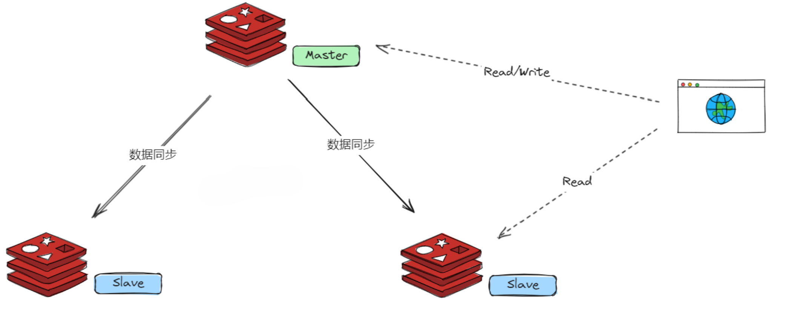

**主从复制的优势在于简单易用，适用于读多写少的场景**。它提供了数据备份功能，并且可以有很好的扩展性，只要增加更多的从节点，就能让整个集群的读的能力不断提升。

但是主从模式最大的缺点，就是不具备故障自动转移的能力，没有办法做容错和恢复。

主节点和从节点的宕机都会导致客户端部分读写请求失败，需要人工介入让节点恢复或者手动切换一台从节点服务器变成主节点服务器才可以。并且在主节点宕机时，如果数据没有及时复制到从节点，也会导致数据不一致。

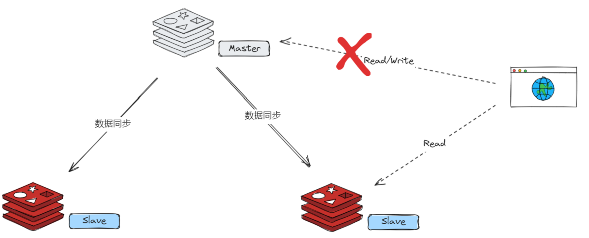

**哨兵模式**


为了解决主从模式的无法自动容错及恢复的问题，Redis 引入了一种哨兵模式的集群架构。

哨兵模式是在主从复制的基础上加入了哨兵节点。哨兵节点是一种特殊的 Redis 节点，用于监控主节点和从节点的状态。当主节点发生故障时，哨兵节点可以自动进行故障转移，选择一个合适的从节点升级为主节点，并通知其他从节点和应用程序进行更新。

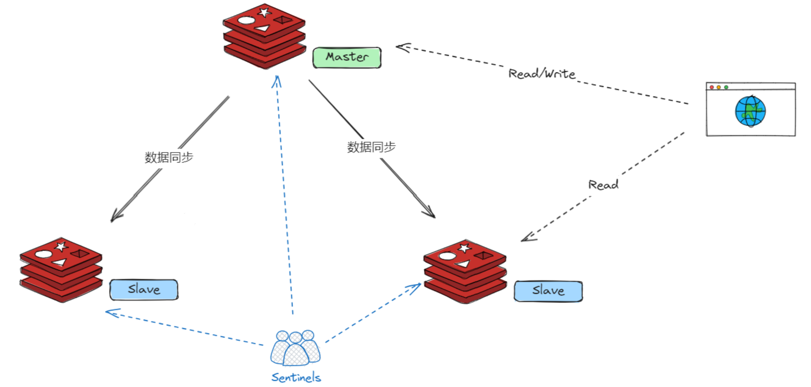

在原来的主从架构中，引入哨兵节点，其作用是监控 Redis 主节点和从节点的状态。每个 Redis 实例都可以作为哨兵节点，通常需要部署多个哨兵节点，以确保故障转移的可靠性。

哨兵节点定期向所有主节点和从节点发送 **PING** 命令，如果在指定的时间内未收到 **PONG** 响应，哨兵节点会将该节点标记为主观下线。如果一个主节点被多数哨兵节点标记为**主观下线**，那么它将被标记为**客观下线**。

当主节点被标记为**客观下线**时，哨兵节点会触发故障转移过程。它会从所有健康的从节点中选举一个新的主节点，并将所有从节点切换到新的主节点，实现自动故障转移。同时，哨兵节点会更新所有客户端的配置，指向新的主节点。

哨兵节点通过发布订阅功能来通知客户端有关主节点状态变化的消息。客户端收到消息后，会更新配置，将新的主节点信息应用于连接池，从而使客户端可以继续与新的主节点进行交互。

这个集群模式的优点就是为整个集群系统了一种故障转移和恢复的能力。


**Cluster 模式**


Redis Cluster 是 Redis 中推荐的分布式集群解决方案。它将数据**自动分片**到多个节点上，每个节点负责一部分数据。 

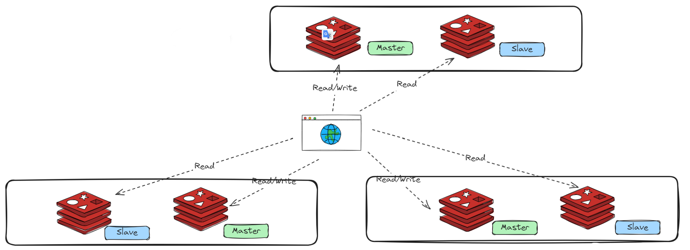

Redis Cluster 采用主从复制模式来提高可用性。每个分片都有一个主节点和多个从节点。主节点负责处理写操作，而从节点负责复制主节点的数据并处理读请求。

Redis Cluster 能够自动检测节点的故障。当一个节点失去连接或不可达时，Redis Cluster 会尝试将该节点标记为不可用，并从可用的从节点中提升一个新的主节点。

Redis Cluster 是适用于大规模应用的解决方案，它提供了更好的横向扩展和容错能力。它自动管理数据分片和故障转移，减少了运维的负担。

Cluster 模式的特点是数据分片存储在不同的节点上，每个节点都可以单独对外提供读写服务。不存在单点故障的问题。

#### 什么是 Redis 的数据分片？

Redis 的数据分片（sharding）是一种将一个 Redis 数据集分割成多个部分，分别存储在不同的 Redis 节点上的技术。它可以用于将一个单独的 Redis 数据库扩展到多个物理机器上，从而提高Redis集群的性能和可扩展性。

Redis 数据分片的实现方式通常是将数据按照某种规则（例如，key 的 hash 值）分配到不同的节点上。当客户端想要访问某个 key 时，它会先计算出这个 key 应该存储在哪个节点上，然后直接连接到该节点进行操作。因此，对于客户端而言，Redis集群就像是一个大型的、统一的数据库，而不需要关心数据的实际分布情况。

**在 Redis 的 Cluster 集群模式中，使用哈希槽（hash slot）的方式来进行数据分片**，将整个数据集划分为多个槽，每个槽分配给一个节点。客户端访问数据时，先计算出数据对应的槽，然后直接连接到该槽所在的节点进行操作。Redis Cluster 还提供了自动故障转移、数据迁移和扩缩容等功能，能够比较方便地管理一个大规模的 Redis 集群。

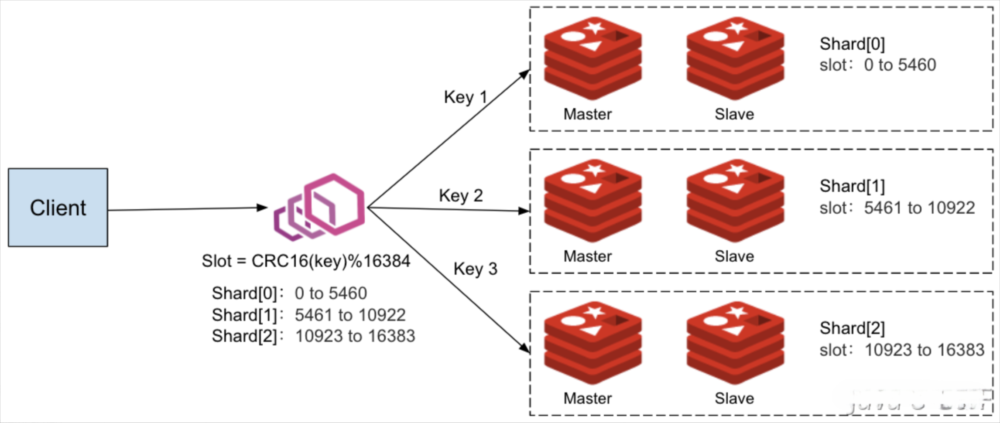

Redis Cluster 将整个数据集划分为 **16384 个槽**，每个槽都有一个编号（0~16383），集群的每个节点可以负责多个hash槽，客户端访问数据时，先根据key计算出对应的槽编号，然后根据槽编号找到负责该槽的节点，向该节点发送请求。

在 Redis 的每一个节点上，都有这么两个东西，一个是槽（slot），它的的取值范围是：0-16383。还有一个就是 cluster，可以理解为是一个集群管理的插件。当我们的存取的 Key 的时候，Redis 会根据 CRC16 算法得出一个结果，然后把结果对 16384 求余数，这样每个 key 都会对应一个编号在 0-16383 之间的哈希槽，通过这个值，去找到对应的插槽所对应的节点，然后直接自动跳转到这个对应的节点上进行存取操作。

Redis Cluster 中的数据分片具有以下特点：

1. **提升性能和吞吐量：**通过在多个节点上分散数据，可以并行处理更多的操作，从而提升整体的性能和吞吐量。这在高流量场景下尤其重要，因为单个节点可能无法处理所有请求。
2. **提高可扩展性：**分片使得Redis可以水平扩展。可以通过添加更多节点扩展数据库的容量和处理能力。
3. **更好的资源利用：**分片允许更有效地利用服务器资源。每个节点只处理数据的一部分，这降低了单个节点的内存和计算需求。
4. **避免单点故障：**在没有分片的情况下，如果唯一的Redis服务器发生故障，整个服务可能会停止。在分片的环境中，即使一个节点出现问题，其他节点仍然可以继续运行。
5. **数据冗余和高可用性：**在某些分片策略中，如 Redis 集群，每个分片的数据都可以在集群内的其他节点上进行复制。这意味着即使一个节点失败，数据也不会丢失，从而提高了系统的可用性。

> Redis Cluster 将整个数据集划分为 16384 个槽，为什么是 16384 呢，这个数字有什么特别的呢？

这个问题在Github上有所讨论，Redis的作者也下场做过回复：https://github.com/redis/redis/issues/2576

> The reason is:
>
> 1、Normal heartbeat packets carry the full configuration of a node, that can be replaced in an idempotent way with the old in order to update an old config. This means they contain the slots configuration for a node, in raw form, that uses 2k of space with16k slots, but would use a prohibitive 8k of space using 65k slots.
>
> 2、At the same time it is unlikely that Redis Cluster would scale to more than 1000 mater nodes because of other design tradeoffs.
>
> So 16k was in the right range to ensure enough slots per master with a max of 1000 maters, but a small enough number to propagate the slot configuration as a raw bitmap easily. Note that in small clusters the bitmap would be hard to compress because when N is small the bitmap would have slots/N bits set that is a large percentage of bits set.

16384 这个数字是一个 2 的 14 次方（2^14），尽管 crc16 能得到 2^16 -1=65535 个值，但是并没有选择，主要从消息大小和集群规模等方面考虑的：

1、正常的心跳数据包携带了节点的完整配置，在更新配置的时候，可以以幂等方式进行替换。这意味着它们包含了节点的原始槽配置，对于包含 16384 个槽位的情况，使用 2k 的空间就够了，但如果使用 65535 个槽位，则需要使用 8k 的空间，这就有点浪费了。

2、由于其他设计权衡的原因，Redis Cluster 不太可能扩展到超过 1000 个主节点，这种情况下，用 65535 的话会让每个节点上面的 slot 太多了，会导致节点的负载重并且数据迁移成本也比较高。而 16384 是相对比较好的选择，可以在 1000 个节点下使得 slot 均匀分布，每个分片平均分到的 slot 不至于太小。

除此之外，还有一些原因和优点供大家参考：

1、易于扩展：槽数量是一个固定的常数，这样就可以方便地进行集群的扩展和缩小。如果需要添加或删除节点，只需要将槽重新分配即可。

2、易于计算：哈希算法通常是基于槽编号计算的，**将槽数量设置为2的幂次方，可以使用位运算等简单的算法来计算槽编号，从而提高计算效率**。

3、负载均衡：槽数量的选择可以影响数据的负载均衡。如果槽数量太少，会导致某些节点负载过重；如果槽数量太多，会导致数据迁移的开销过大。**16384 这个数量在实践中被证明是一个比较合适的选择，能够在保证负载均衡的同时，减少数据迁移的开销。**

#### Redis 使用什么协议进行通信？

**Redis 使用自己设计的一种文本协议进行客户端与服务端之间的通信——RESP（REdis Serialization Protocol）**，这种协议简单、高效，易于解析，被广泛使用。

RESP 协议基于 TCP 协议，采用请求/响应模式，每条请求由多个参数组成，以命令名称作为第一个参数。请求和响应都以行结束符（`\r\n`）作为分隔符，具体格式如下：

```bash
*<number of arguments>\r\n
$<length of argument 1>\r\n
<argument data>\r\n
...
$<length of argument N>\r\n
<argument data>\r\n
```

其中，`<number of arguments>` 表示参数个数，`<length of argument>` 表示参数数据的长度，`<argument data>` 表示参数数据。参数可以是字符串、整数、数组等数据类型。

例如，以下是一个 Redis 协议的示例请求和响应：
请求：

```bash
*3\r\n
$3\r\n
SET\r\n
$5\r\n
mykey\r\n
$7\r\n
myvalue\r\n
```

响应：

```bash
+OK\r\n
```

上面的请求表示向 Redis 服务器设置一个名为 "mykey" 的键，值为 "myvalue"。响应返回 "+OK" 表示操作成功。

> "$3\r\n" 表示参数长度为 3，即下一个参数是一个 3 个字符的字符串。它表示要执行的命令是"SET"，即设置键值对。
>
> "$5\r\n" 表示参数长度为 5，即下一个参数是一个 5 个字符的字符串。它表示要设置的键是"mykey"。
>
> "$7\r\n" 表示参数长度为 7，即下一个参数是一个 7 个字符的字符串。它表示要设置的值是"myvalue"。

除了基本的 GET、SET 操作，Redis 还支持事务、Lua 脚本、管道等高级功能，这些功能都是通过 Redis 协议来实现的。

#### Redis 与 Memcached 有什么区别？

Redis 和 Memcached 都是常见的缓存服务器，它们的主要区别包括以下几个方面：

**1、数据结构不同：**Redis 提供了多种数据结构，如字符串、哈希表、列表、集合、有序集合等，而 Memcached 只支持简单的键值对存储。

**2、持久化方式不同：**Redis 支持多种持久化方式，如 RDB 和 AOF，可以将数据持久化到磁盘上；而 Memcached 不支持持久化。

**3、数据分片方式不同：**Redis 使用哈希槽分片，可以实现数据的自动分片和负载均衡；而 Memcached 只能手动分片。

**4、处理数据的方式不同：**Redis 使用单线程处理数据请求，支持事务、Lua 脚本等高级功能；而 Memcached 使用多线程处理数据请求，只支持基本的 GET、SET 操作。

**5、协议不同：**Redis 使用自己的协议，支持多个数据库，可以使用密码进行认证；而 Memcached 使用文本协议，只支持一个默认数据库。

**6、内存管理方式不同：**Redis 的内存管理比 Memcached 更加复杂，支持更多的内存优化策略。

综上所述，Redis 和 Memcached 有着不同的设计理念和应用场景。R**edis 适用于数据结构复杂、需要高级功能和数据持久化的场景；而 Memcached 则适用于简单的键值存储场景**。

#### Redis 为什么这么快？

Redis 之所以如此快，主要有以下几个方面的原因：

**1、基于内存：**Redis 是一种基于内存的数据库，数据存储在内存中，数据的读写速度非常快，因为内存访问速度比硬盘访问速度快得多。

**2、单线程模型：**Redis 使用单线程模型，这意味着它的所有操作都是在一个线程内完成的，不需要进行线程切换和上下文切换。这大大提高了 Redis 的运行效率和响应速度。

**3、多路复用 I/O 模型：**Redis 在单线程的基础上，采用了I/O 多路复用技术，实现了单个线程同时处理多个客户端连接的能力，从而提高了 Redis 的并发性能。

**4、高效的数据结构：**Redis 提供了多种高效的数据结构，如哈希表、有序集合、列表等，这些数据结构都被实现得非常高效，能够在 O(1) 的时间复杂度内完成数据读写操作，这也是 Redis 能够快速处理数据请求的重要因素之一。

**5、多线程的引入：**在 Redis 6.0 中，为了进一步提升 IO 的性能，引入了多线程的机制。采用多线程，使得网络处理的请求并发进行，就可以大大的提升性能。多线程除了可以减少由于网络 I/O 等待造成的影响，还可以充分利用 CPU 的多核优势。

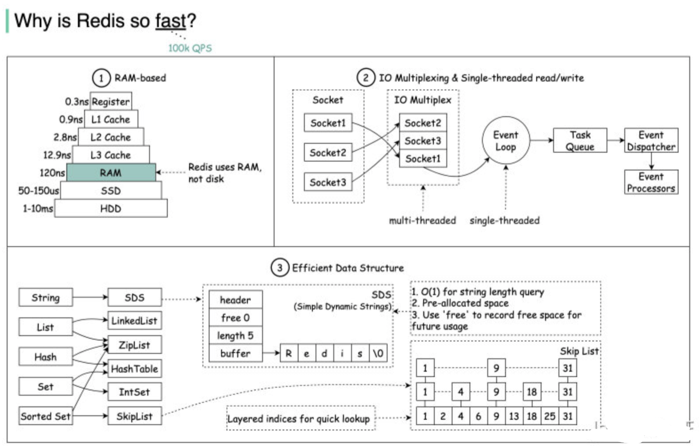

#### Redis 支持哪几种数据类型？

Redis 中支持了多种数据类型，其中比较常用的有五种：

1. 字符串（String）
2. 哈希（Hash）
3. 列表（List）
4. 集合（Set）
5. 有序集合（Sorted Set）

另外，Redis 中还支持一些高级的数据类型，如：Streams、Bitmap、Geospatial 以及 HyperLogLog

#### Redis 为什么要自己定义 SDS？

Redis 是一种 KV 的存储结构，他的 key 是字符串类型，值也支持字符串，所以字符串是 redis 中最常见的一个类型了。**Redis 自己本身是通过C语言实现的**，但是他并没有直接使用 C 语言中的字符数组的方式来实现字符串，而是自己实现了一个 SDS（Simple Dynamic Strings），即简单动态字符串，这是为什么呢？

首先，因为字符串在 Redis **中使用实在是太广泛了** ，所以对他的基本要求就有两点，**第一就是要支持任意字符的存储，第二就是各种操作需要高效**。

接着我们看看 C 语言中字符串的实现方式有什么问题呢？很多人可能都忘了，我帮大家回忆一下，C语言中，字符串是通过字符数组实现的，底层呢是开辟了一块连续的空间，依次存放字符串中的每一个字符。为了表示字符串的结束，他会在字符数组的最后一个字符处记录 `\0`，

也就是说，在 C 语言中，当识别到字符数组中的 `\0` 字符的时候，就认为字符串结束了，那么这么做会带来哪些问题呢？

就是**这样实现的字符串中就不能保存任意内容了**，至少 `\0`就不行，因为遇到他的时候就直接截断了，这肯定是接受不了的。

还有就是因为 **C 中的字符串以 `\0` 作为识别字符串结束的方式，所以他的字符串长度判断、字符串追加等操作，都需要从头开始遍历，一直遍历到\0的时候再返回长度或者做追加。这就使得字符串相关的操作效率都很低。**

那么，想要解决上面的两个问题要怎么办呢？那就是**在用字符数组表示字符串的同时，在这个字符串中增加一个表示分配给该字符数组的总长度的 alloc 字段，和一个表示字符串现有长度的 len 字段。这样在获取长度的时候就不依赖\0了，直接返回 len 的值就行了**。

还有呢，就是在做追加操作的时候，只需要判断新追加的部分的 len 加上已有的 len 是否大于 alloc，如果超过就重新再申请新空间，如果没超过，就直接进行追加就行了。

还有很多其他操作，比如复制、比较等都可以使用类似的思想高效的操作。

#### Redis 中的 Zset 是怎么实现的？

ZSet（也称为Sorted Set）是Redis中的一种特殊的数据结构，它内部维护了一个有序的字典，这个字典的元素中既包括了一个成员（member），也包括了一个double类型的分值(score)。这个结构可以帮助用户实现记分类型的排行榜数据，比如游戏分数排行榜，网站流行度排行等。

> Redis 中的 ZSet 在实现中，有多种结构，大类的话有两种，分别是 ziplist(压缩列表) 和 skiplist(跳跃表)，但是这只是以前，在 Redis 5.0 中新增了一个 listpack（紧凑列表）的数据结构，这种数据结构就是为了替代 ziplist 的，而在之后Redis 7.0的发布中，在 Zset 的实现中，已经彻底不在使用 zipList 了。

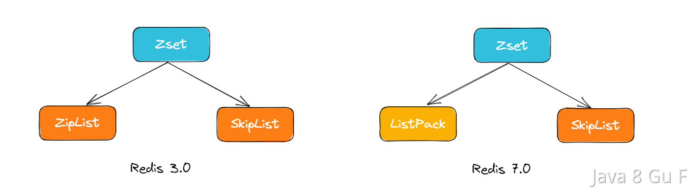

当 ZSet 的元素数量比较少时，Redis 会采用 ZipList（ListPack）来存储ZSet的数据。ZipList（ListPack）是一种紧凑的列表结构，它通过连续存储元素来节约内存空间。当 ZSet 的元素数量增多时，Redis会自动将ZipList（ListPack）转换为 SkipList，以保持元素的有序性和支持范围查询操作。

在这个过程中，Redis 会遍历 ZipList（ListPack）中的所有元素，按照元素的分数值依次将它们插入到 SkipList 中，这样就可以保持元素的有序性。

**在 Redis 的 ZSET 具体实现中，SkipList 的这种实现，不仅用到了跳表，还会用到 dict（字典）**

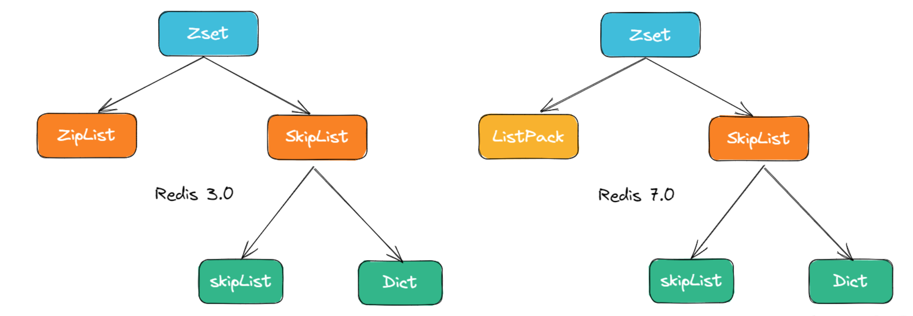

其中，SkipList 用来实现有序集合，其中每个元素按照其分值大小在跳表中进行排序。跳表的插入、删除和查找操作的时间复杂度都是 O(log n)，可以保证较好的性能。

dict 用来实现元素到分值的映射关系，其中元素作为键，分值作为值。哈希表的插入、删除和查找操作的时间复杂度都是 O(1)，具有非常高的性能。

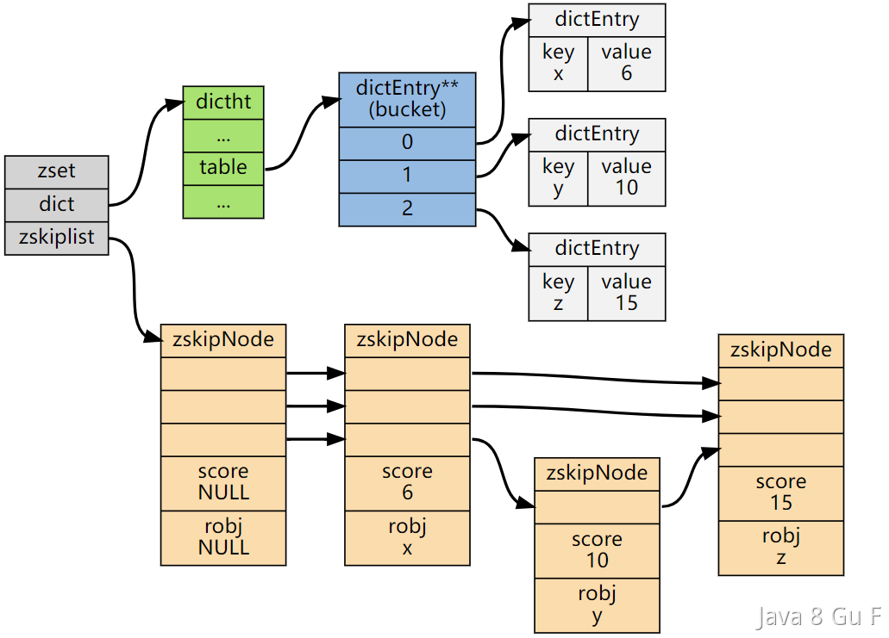

#### ZipList（ListPack）和 SkipList 之间是什么时候进行转换的呢？

在 Redis 中，ZSET 在特定条件下会使用 ziplist 作为其内部表示。这通常发生在有序集合较小的时候，具体条件如下：

1. 元素数量少：集合中的元素数量必须小于某个阈值（zset-max-ziplist-entries）。
2. 元素大小小：集合中的每个元素（包括值和分数）的大小必须小于指定的最大值（zset-max-ziplist-value）。

默认情况下，zset-max-ziplist-entries 是 128，zset-max-ziplist-value 是 64。

**总的来说就是，当元素数量少于 128，每个元素的长度都小于 64 字节的时候，使用 ZipList（ListPack），否则，使用 SkipList！**

#### 跳表的结构

跳表也是一个有序链表。

在链表中，我们想要查找一个数，需要从头结点开始向后依次遍历和匹配，直到查到为止，这个过程是比较耗费时间的，他的时间复杂度是 0(n)。

当我们想要向这个链表中插入一个数的时候，过程和查找类似，先需要从头开始遍历找到合适的为止，然后再插入，他的时间复杂度也是 O(n)。

那么，怎么能提升遍历速度呢，有一个办法，那就是我们对链表进行改造，先对链表中每两个节点建立第一级索引

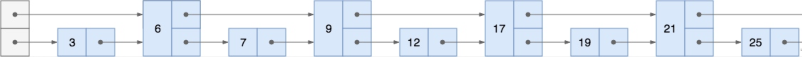

有了我们创建的这个索引之后，我们查询元素 12，我们先从一级索引 `6 -> 9 -> 17 -> 26` 中查找，发现 12 介于 9 和17之间，然后，转移到下一层进行搜索，即 `9 -> 12 -> 17`，即可找到 12 这个节点了。

可以看到，同样是查找 12，原来的链表需要遍历 5 个元素`(3、6、7、9、12)`，建立了一层索引之后，只需要遍历4个元素即可`（6、9、17、12）`。

像上面这种带多级索引的链表，就是跳表。

#### 什么是 GEO，有什么用？

GEO 就是 Geolocation 的简写形式，代表地理坐标，Redis GEO 主要用于存储地理位置信息的，帮助我们根据经纬度来检索数据。

它主要支持如下命令：

- GEOADD：添加一个地理空间信息，包含：经度（longitude）、纬度（latitude）、值（member）
- GEODIST：计算指定的两个点之间的距离并返回
- GEOHASH：将指定member的坐标转为hash字符串形式并返回
- GEOPOS：返回指定member的坐标
- GEORADIUS：指定圆心、半径，找到该圆内包含的所有member，并按照与圆心之间的距离排序后返回。
- GEOSEARCH：在指定范围内搜索member，并按照与指定点之间的距离排序后返回。范围可以是圆形或矩形。
- GEOSEARCHSTORE：与GEOSEARCH功能一致，不过可以把结果存储到一个指定的key。

#### Redis 为什么被设计成是单线程的？

我们所说的 Redis 单线程，指的是"其网络 IO 和键值对读写是由一个线程完成的"，也就是说，**Redis 中只有网络请求模块和数据操作模块是单线程的。而其他的如持久化存储模块、集群支撑模块等是多线程的。**

所以说，Redis 中并不是没有多线程模型的，早在 Redis 4.0 的时候就已经针对部分命令做了多线程化。

一个计算机程序在执行的过程中，主要需要进行两种操作分别是读写操作和计算操作。

其中读写操作主要是涉及到的就是I/O操作，其中包括网络 I/O 和磁盘 I/O。计算操作主要涉及到 CPU。

**而多线程的目的，就是通过并发的方式来提升 I/O 的利用率和 CPU 的利用率。**

**之所以 Redis 没有用多线程处理 IO 操作，主要是因为，Redis 的操作基本都是基于内存的，CPU 资源根本就不是 Redis 的性能瓶颈。**

#### 为什么 Redis 设计成单线程也能这么快？

Redis 的性能很好，除了因为他基于内存、有高效的数据结构等等原因以外，还有一个重要的原因那就是他在单线程中使用多路复用 I/O 技术也能提升 Redis 的 I/O 利用率。

**Redis的多路复用**

多路复用这个词，相信很多人都不陌生。那么，Redis的多路复用技术有什么特别的呢？

这里先讲讲 **Linux 多路复用技术，就是多个进程的 IO 可以注册到同一个管道上，这个管道会统一和内核进行交互。当管道中的某一个请求需要的数据准备好之后，进程再把对应的数据拷贝到用户空间中**。

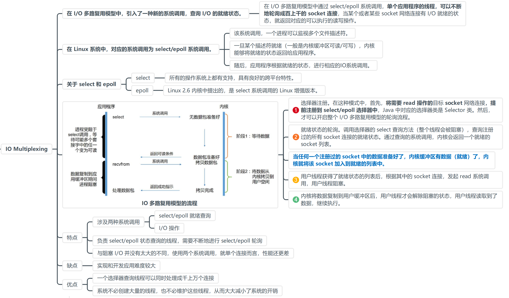

也就是说，通过一个线程来处理多个 IO 流。

IO 多路复用在 Linux 下包括了三种，select、poll、epoll，抽象来看，他们功能是类似的，但具体细节各有不同。

其实，Redis 的 IO 多路复用程序的所有功能都是通过包装操作系统的 IO 多路复用函数库来实现的。每个 IO 多路复用函数库在Redis源码中都有对应的一个单独的文件。

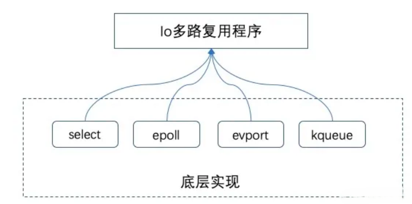

在 Redis 中，每当一个套接字准备好执行连接应答、写入、读取、关闭等操作时，就会产生一个文件事件。因为一个服务器通常会连接多个套接字，所以多个文件事件有可能会并发地出现。

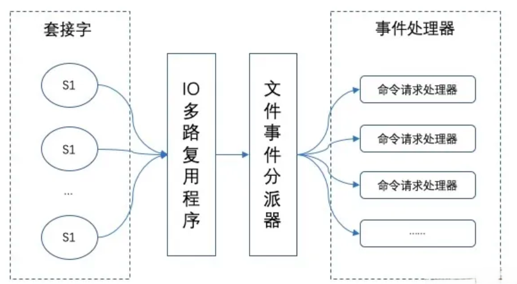

一旦有请求到达，就会交给 Redis 线程处理，这就实现了一个 Redis 线程处理多个 IO 流的效果。

所以，Redis 选择使用多路复用 IO 技术来提升 I/O 利用率。

而之所以 Redis 能够有这么高的性能，不仅仅和采用多路复用技术和单线程有关，此外还有以下几个原因：

1、完全基于内存，绝大部分请求是纯粹的内存操作，非常快速。 

 2、数据结构简单，对数据操作也简单，如哈希表、跳表都有很高的性能。 

 3、采用单线程，避免了不必要的上下文切换和竞争条件，也不存在多进程或者多线程导致的切换而消耗 CPU 

 4、使用多路 I/O 复用模型 

#### 为什么 Redis 6.0 引入了多线程？

Redis 6.0 中的多线程，也只是针对处理网络请求过程采用了多线程，而数据的读写命令，仍然是单线程处理的。

> Redis 不是号称单线程也有很高的性能么？
>
> 不是说多路复用技术已经大大的提升了 IO 利用率了么，为啥还需要多线程？

主要是因为我们对Redis有着更高的要求。

根据测算，Redis 将所有数据放在内存中，内存的响应时长大约为 100 纳秒，对于小数据包，Redis 服务器可以处理 80,000 到 100,000 QPS，这么高的对于 80% 的公司来说，单线程的 Redis 已经足够使用了。

但随着越来越复杂的业务场景，有些公司动不动就上亿的交易量，因此需要更大的 QPS。

为了提升 QPS，很多公司的做法是部署 Redis 集群，并且尽可能提升 Redis 机器数。但是这种做法的资源消耗是巨大的。

而经过分析，限制 Redis 的性能的主要瓶颈出现在网络 IO 的处理上，虽然之前采用了多路复用技术。但是我们前面也提到过，**多路复用的 IO 模型本质上仍然是同步阻塞型 IO 模型**。

下面是多路复用 IO 中 select 函数的处理过程：

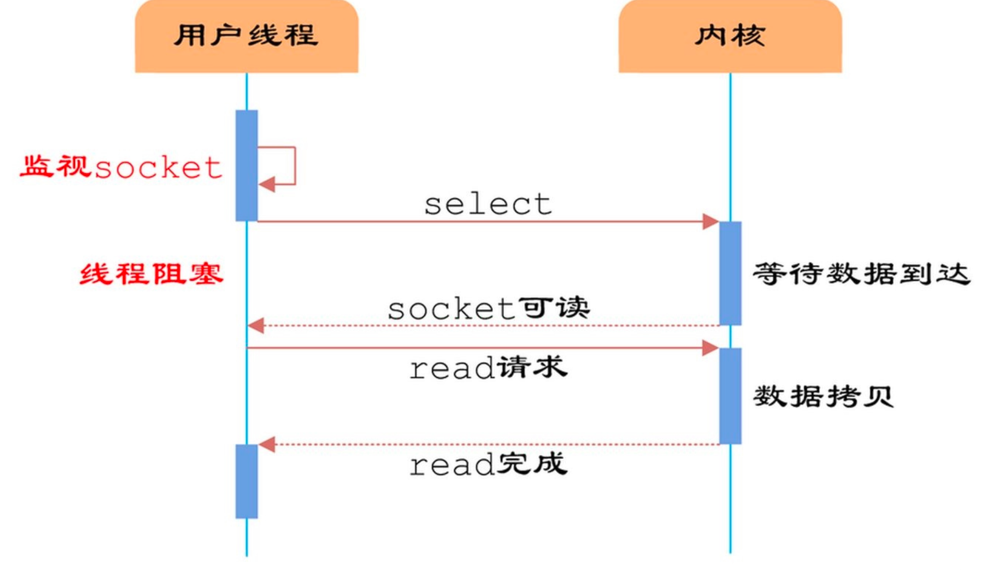

从上图我们可以看到，**在多路复用的 IO 模型中，在处理网络请求时，调用 select （其他函数同理）的过程是阻塞的，也就是说这个过程会阻塞线程，如果并发量很高，此处可能会成为瓶颈。**

虽然现在很多服务器都是多个 CPU 核的，但是对于 Redis 来说，因为使用了单线程，在一次数据操作的过程中，有大量的 CPU 时间片是耗费在了网络 IO 的同步处理上的，并没有充分的发挥出多核的优势。

**如果能采用多线程，使得网络处理的请求并发进行，就可以大大的提升性能。多线程除了可以减少由于网络 I/O 等待造成的影响，还可以充分利用 CPU 的多核优势。**

所以，Redis 6.0 采用多个 IO 线程来处理网络请求，网络请求的解析可以由其他线程完成，然后把解析后的请求交由主线程进行实际的内存读写。提升网络请求处理的并行度，进而提升整体性能。

但是，Redis 的多 IO 线程只是用来处理网络请求的，对于读写命令，Redis 仍然使用单线程来处理。

**那么，在引入多线程之后，如何解决并发带来的线程安全问题呢？**

这就是为什么我们前面多次提到的"Redis 6.0 的多线程只用来处理网络请求，而数据的读写还是单线程"的原因。

Redis 6.0 只有在网络请求的接收和解析，以及请求后的数据通过网络返回给时，使用了多线程。而数据读写操作还是由单线程来完成的，所以，这样就不会出现并发问题了。

#### 为什么 Lua 脚本可以保证原子性？

原子性在并发编程中，和在数据库中两种不同的概念。

在数据库中，事务的 ACID 中原子性指的是"要么都执行要么都回滚"。在并发编程中，原子性指的是"操作不可拆分、不被中断"。

Redis 既是一个数据库，又是一个支持并发编程的系统，所以，他的原子性有两种。所以，我们需要明确清楚，在问"Lua 脚本保证 Redis 原子性"的时候，指的到底是哪个原子性。

**Lua 脚本可以保证原子性，因为 Redis 会将 Lua 脚本封装成一个单独的事务，而这个单独的事务会在Redis客户端运行时，由 Redis 服务器自行处理并完成整个事务，如果在这个进程中有其他客户端请求的时候，Redis 将会把它暂存起来，等到 Lua 脚本处理完毕后，才会再把被暂存的请求恢复。**

这样就可以保证整个脚本是作为一个整体执行的，中间不会被其他命令插入。但是，如果命令执行过程中命令产生错误，事务是不会回滚的，将会影响后续命令的执行。

**也就是说，Redis 保证以原子方式执行 Lua 脚本，但是不保证脚本中所有操作要么都执行或者都回滚。**

那就意味着，Redis 中 Lua 脚本的执行，可以保证并发编程中不可拆分、不被中断的这个原子性，但是没有保证数据库 ACID 中要么都执行要么都回滚的这个原子性。

#### Redis 中的 setnx 命令为什么是原子性的?

**Redis 中的 setnx 命令是一个原子性操作，因为它利用了 Redis 单线程的特点。**

在 Redis 中，所有的命令都是在主线程中顺序执行的，**这意味着每个命令在执行时不会被其他命令打断**。当执行 setnx 命令时，Redis 会在内存中检查给定的 key 是否存在，如果不存在，则设置该 key 的值，并返回1。如果该 key 已经存在，则不做任何操作，直接返回 0。

由于 Redis 是单线程的，所以当一个客户端执行 setnx 命令时，其他客户端无法执行任何命令，直到该命令执行完毕。

因此，setnx 命令是一个原子性操作，它可以保证在任何时候只有一个客户端可以执行该命令，这可以防止并发访问造成的数据竞争和不一致性问题。

需要注意的是，虽然 setnx 命令本身是原子性的，但在实际应用中，多个Redis命令的组合可能会导致数据一致性问题。在这种情况下，开发人员需要使用Redis事务或分布式锁等机制来保证数据的一致性。

#### Redis 5.0 中的 Stream 是什么？

Redis Stream 是 Redis 5.0 版本新增加的数据结构，主要用于处理有序的、可追溯的消息流。

Stream 数据结构可以被视为一个日志或消息队列，其中每个消息都有一个唯一的 ID，并且按照添加的顺序进行排序。开发人员可以向 Stream 中添加消息、读取消息、删除消息以及订阅消息。Stream 数据结构还支持消费者组，可以让多个消费者并发地处理消息流。

在 Redis 5.0 之前，通过 Redis 的发布订阅 (pub/sub) 可以实现消息队列的功能，但它有个缺点就是消息无法持久化，如果出现网络断开、Redis 宕机等，消息就会被丢弃。

而 Redis Stream 提供了消息的持久化和主备复制功能，可以让任何客户端访问任何时刻的数据，并且能记住每一个客户端的访问位置，还能保证消息不丢失。

他的特点是支持持久化、消息具有有序性，并且支持分组。主要可以用来做消息队列、日志收集、实时数据处理和聊天室应用等。

**有序性：**消息可以按照发布时间排序，消费者可以按照消息发布的时间顺序进行消费。

**多消费者支持：**多个消费者可以订阅同一个 Stream 并独立消费消息，支持竞争式消费和共享式消费两种消费模式。

**持久化：**Stream 支持消息持久化，即使 Redis 服务器重启或崩溃，之前的消息仍然可以恢复。

**消息分组：**Stream 支持消息分组功能，可以将消息分配到不同的消费组中，从而实现更灵活的消息消费。

> 实现原理
>
> Stream 底层采用了类似于日志的数据结构，每个 Stream 都是由一个或多个日志实现的。每个日志包含多个消息，每个消息包含一个唯一的 ID 和一些附加的字段，如消息体、时间戳等。

Redis 提供了一系列的 Stream 命令，用于创建 Stream、发布/消费消息。

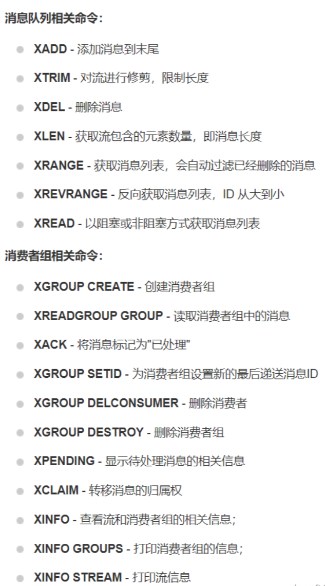

当一个消息被发布到 Stream 中时，它将被写入 Stream 日志中，每个消息都有一个唯一的 ID 和一些可选的字段，如时间戳、消息体等。消息 ID 是自动分配的，可以使用自然数或 UUID 作为 ID。

当一个消费者订阅了一个 Stream 并开始消费消息时，它可以使用 XREAD 命令从 Stream 中读取消息。消费者可以使用 XGROUP 命令将自己加入到一个消费组中，并使用 XREADGROUP 命令从该组中读取消息。消费者可以使用 XACK 命令来确认已经消费的消息，避免消息被重复消费。

他还支持消息分组的功能，当一个消费组被创建时，它将与一个 Stream 相关联，并包含一个消费组名称和一个偏移量。消费组可以有多个消费者，消费者可以独立地从 Stream 中读取消息。当一个消费者开始消费消息时，它将记录当前的消费偏移量，并在处理完所有消息后将其更新到消费组中。消费组可以使用 XPENDING 命令查找未确认的消息，从而处理消息的超时和未确认情况。

#### Redis 的虚拟内存机制是什么？

Redis 提供了一种称为**虚拟内存的机制，用于将部分不经常使用的数据存储到磁盘上**，从而避免 Redis 进程占用过多的内存。

但是**需要注意的是，Redis 从 2.4 版本开始已经废弃了虚拟内存（VM）功能，并且在更高版本中不再推荐使用**。

当Redis使用的内存超过了指定的阈值时，虚拟内存机制将自动将一些键值对转移到磁盘上，以释放一部分内存。当需要访问被转移到磁盘上的数据时，虚拟内存机制将自动将数据读取到内存中。

想要配置虚拟内存，需要修改配置文件。主要涉及到以下参数：

```bash
maxmemory <num>
vm-enabled yes
vm-max-memory <num>
vm-page-size <num>
vm-pages <num>
vm-max-threads <num>
```

- maxmemory 参数用于设置 Redis 允许使用的最大内存大小，单位为字节。一般来说，建议将 maxmemory 设置为物理内存大小的一半左右。例如，如果服务器的物理内存为 8GB，那么可以将 maxmemory 设置为 4GB
- vm-enabled 参数用于启用虚拟内存功能。将其设置为 yes 即可启用。
- vm-max-memory 参数用于设置虚拟内存的最大大小，单位为字节。一般来说，建议将 vm-max-memory 设置为 maxmemory 的 2 倍以上。例如，如果 maxmemory 设置为 4GB，那么可以将 vm-max-memory 设置为 8GB 以上。
- vm-page-size 参数用于设置页的大小，单位为字节。一般来说，不需要修改该参数的默认值，即 32 字节。
- vm-pages 参数用于设置虚拟内存的页数。一般来说，可以将该参数设置为 vm-max-memory/vm-page-size。
- vm-max-threads 参数用于设置虚拟内存使用的最大线程数。一般来说，建议将该参数设置为服务器的 CPU 核心数。

但是，还是那句话，没有银弹。**虚拟内存机制虽然可以节省内存，但同时也会带来一定的性能损失**。由于需要将数据从磁盘读取到内存中，因此访问被转移到磁盘上的数据会比访问内存中的数据慢一些。

因此，在实际使用中，需要根据具体的应用场景和硬件条件进行调整，以达到最佳的性能和内存使用效率。

> 不再建议使用
>
> 虚拟内存功能最初被设计为解决物理内存限制的问题，允许 Redis 将数据分页到磁盘上，只保留常用的数据在内存中。这个功能在初期对于内存受限的环境提供了一定的帮助。
>
> 然而，这种设计带来了一些问题：
>
> 1. 性能开销：虚拟内存的使用增加了额外的磁盘 I/O 操作，这会显著降低 Redis 的性能，因为磁盘访问速度远不如内存访问速度。
> 2. 复杂性：虚拟内存功能的管理增加了 Redis 运行的复杂性，尤其是在数据管理和性能调优方面。
> 3. 技术进步：随着时间的推移，内存价格的下降和服务器内存容量的增加，使得在服务器上配置大量内存变得经济实惠。这减少了对虚拟内存的需求。
>
> 因此，Redis 的开发团队决定在 2.4 版本后不再维护或使用虚拟内存功能，并推荐用户使用足够的物理内存来支持 Redis 实例，或者使用其他策略如数据分片（sharding）来管理大型数据集。这样的变化使得 Redis 能够专注于其核心优势——提供高性能的内存数据存储服务。

#### Redis 的持久化机制是怎样的？

Redis 提供了两种持久化的机制，分别是 RDB 和 AOF。


**RDB**

RDB 是将 Redis 的内存中的数据定期保存到磁盘上，以防止数据在Redis进程异常退出或服务器断电等情况下丢失。

RDB 的优点是：快照文件小、恢复速度快，适合做备份和灾难恢复。
RDB 的缺点是：定期更新可能会丢数据


**AOF**

AOF 是将 Redis 的所有写操作追加到 AOF 文件（Append Only File）的末尾，从而记录了Redis服务器运行期间所有修改操作的详细记录。当 Redis 重新启动时，可以通过执行 AOF 文件中保存的写操作来恢复数据。

但是如果 Redis 刚刚执行完一个写命令，还没来得及写 AOF 文件就宕机了，那么这个命令和相应的数据就会丢失了。但是它也比 RDB 要更加靠谱一些。

AOF 的优点是：可以实现更高的数据可靠性、支持更细粒度的数据恢复，适合做数据存档和数据备份。
AOF 的缺点是：文件大占用空间更多，每次写操作都需要写磁盘导致负载较高


| 特性         | RDB                              | AOF                                  |
| ------------ | -------------------------------- | ------------------------------------ |
| 数据可靠性   | 可能会丢失最后一次快照之后的数据 | 保证最后一次写操作之前的数据不会丢失 |
| 性能         | 读写性能较高，适合做数据恢复     | 写性能较高，适合做数据存档           |
| 存储空间占用 | 快照文件较小，占用空间较少       | AOF 文件较大，占用空间较多           |
| 恢复时间     | 从快照文件中恢复数据较快         | 从 AOF 文件中恢复数据较慢            |


**混合持久化**

AOF 和 RDB 各自有优缺点，为了让用户能够同时拥有上述两种持久化的优点， Redis 4.0 推出了 RDB-AOF 混合持久化。

在开启混合持久化的情况下，AOF 重写时会把 Redis 的持久化数据，以 RDB 的格式写入到 AOF 文件的开头，之后的数据再以 AOF 的格式化追加的文件的末尾。

aof-use-rdb-preamble 是开启混合模式的参数

混合持久化结合了 RDB 和 AOF 持久化的优点，开头为 RDB 的格式，使得 Redis 可以更快的启动，同时结合 AOF 的优点，有减低了大量数据丢失的风险。

但是，在AOF 文件中添加了 RDB 格式的内容，使得 AOF 文件的可读性变得很差；如果开启混合持久化，那么此混合持久化 AOF 文件，是不能用在旧版本中的，不向下兼容的。

#### Redis 能完全保证数据不丢失吗？

不能，因为 Redis 是基于内存存储的，当 Redis 进程异常退出或服务器断电等情况发生时，内存中的数据可能会丢失。

为了防止数据丢失，Redis 提供了 RDB 和 AOF 的持久化机制，Redis可以将数据从内存保存到磁盘中，以便在Redis进程异常退出或服务器断电等情况下，通过从磁盘中加载数据来恢复数据。

但是，持久化机制也不是绝对可靠的，归根结底 Redis 还是个缓存，他并不是完全给你做持久化用的，所以还是要有自己的持久化方式，比如双写到数据库。

因此，为了最大程度地保障数据安全，建议采用多种手段来提高数据可靠性，如定期备份数据、使用主从复制机制、使用集群模式等。

#### AOF 的三种写回策略

AOF 有三种数据写回策略，分别是 Always，Everysec 和 No。

- Always，同步写回：每个写命令执行完，立马同步地将日志写回磁盘；
- Everysec，每秒写回：每个写命令执行完，只是先把日志写到AOF文件的内存缓冲区，每隔一秒把缓冲区中的内容写入磁盘；
- No，操作系统控制的写回：每个写命令执行完，只是先把日志写到AOF文件的内存缓冲区，由操作系统决定何时将缓冲区内容写回磁盘。

“同步写回”可靠性肯定是最高的，但是它在每一个写命令后都有一个落盘操作，而且还是同步的，这和直接写磁盘类型的数据库有啥区别？

"操作系统控制的写回"这种是最不靠谱的，谁知道操作系统啥时候帮你做持久化，万一没来及持久化就宕机了，不就gg了。

"每秒写回"是在二者之间折中了一下，异步的每秒把数据写会到磁盘上，最大程度的提升效率和降低风险。

> Always 也不能保证不丢
>
> 即使是在 always 策略下，也不能保证 100% 不丢失数据的，主要出于以下原因：
>
> 1、磁盘和系统故障：如果在写入操作和同步到磁盘之间发生硬件故障或系统崩溃，可能会丢失最近的写操作
>
> 2、操作系统缓冲区：即使Redis请求立即将数据同步到磁盘，操作系统的 I/O 缓冲区可能会导致实际写入磁盘的操作延迟发生。如果在写入缓冲区之后，没写磁盘前，机器挂了，那么数据就丢了。
>
> 操作系统缓冲区，通常指的是操作系统用于管理数据输入输出（I/O）的一种内存区域。当程序进行文件写入操作时，数据通常首先被写入到这个缓冲区，而不是直接写入到硬盘。
>
> 3、磁盘写入延迟：磁盘的写入并非实时完成，特别是在涉及到机械硬盘时，写入延迟主要由磁盘旋转速度（RPM）和寻道时间决定。如果在这这个延迟过程中，机器挂了，那么数据也就丢了。

#### Redis 的事务机制是怎样的？

Redis 中是支持事务的，他的事务主要目的是保证多个命令执行的原子性，即要在一个原子操作中执行，不会被打断。

需要注意的是，**Redis 的事务是不支持回滚的**。从 Redis 2.6.5 开始，服务器将会在累积命令的过程中检测到错误。然后，在执行 EXEC 期间会拒绝执行事务，并返回一个错误，同时丢弃该事务。如果事务执行过程中发生错误，Redis 会继续执行剩余的命令而不是回滚整个事务。

Redis事务相关的命令主要有以下几个：

- MULTI：标记一个事务块的开始。
- DISCARD：取消事务，放弃执行事务块内的所有命令。
- EXEC：执行所有事务块内的命令。
- UNWATCH：取消 WATCH 命令对所有 key 的监视。
- WATCH key [key ...]：监视一个(或多个) key ，如果在事务执行之前这个(或这些) key 被其他命令所改动，那么事务将被打断。

> 事务执行时会有什么错误？
>
> 前面我们提到过，从 Redis 2.6.5 开始，服务器将会在累积命令的过程中检测到错误。但是后面又说事务执行时也会有错误。这里是不是矛盾了？
>
> 其实并不矛盾。
>
> Redis 错误有两种情况，一种是在命令排队的过程就就检测到的错误，比如语法错误，比如内存不够了，等等。在这种错误，会在调用 EXEC 后，命令可能会直接失败。
>
> 还有一种错误，是在调用 EXEC 后，命令执行过程中出现的错误，最常见的就是操作类型不一致，比如对字符串进行列表相关的操作。这种就是在执行过程中才会出现的。
>
> 而后面这种错误，Redis 认为是不应该出现的。所以需要在开发阶段就避免，这也是他没有提供回滚的一个重要原因。

#### Redis 的过期策略是怎么样的？

Redis 通过设置过期时间来控制键值对的生命周期。过期时间可以通过EXPIRE、EXPIREAT、PERSIST等命令设置，也可以在插入数据时直接设置过期时间。

**Redis 的过期策略采用的是定期删除和惰性删除相结合的方式。**

- **定期删除：**Redis 默认每隔 100ms 就随机抽取一些设置了过期时间的 key，并检查其是否过期，如果过期就删除。定期删除是 Redis 的主动删除策略，它可以确保过期的 key 能够及时被删除，但是会占用 CPU 资源去扫描 key，可能会影响 Redis 的性能。
- **惰性删除：**当一个 key 过期时，不会立即从内存中删除，而是在访问这个 key 的时候才会触发删除操作。惰性删除是 Redis 的被动删除策略，它可以节省 CPU 资源，但是会导致过期的 key 始终保存在内存中，占用内存空间。

**Redis 默认同时开启定期删除和惰性删除两种过期策略。**

定期删除会在 Redis 设置的过期键的过期时间达到一定阈值时进行一次扫描，将过期的键删除，但不会立即释放内存，而是把这些键标记为“已过期”，并放入一个专门的链表中。然后，在 Redis 的内存使用率达到一定阈值时，Redis会对这些“已过期”的键进行一次内存回收操作，释放被这些键占用的内存空间。

而惰性删除则是在键被访问时进行过期检查，如果过期了则删除键并释放内存。

需要注意的是，即使 Redis 进行了内存回收操作，也不能完全保证被删除的内存空间会立即被系统回收。

一般来说，这些被删除的内存空间会被操作系统标记为“可重用的内存”，等待被重新分配。因此，即使 Redis 进行了内存回收操作，也并不能保证 Redis 所占用的内存空间会立即释放给操作系统。

#### Redis 的内存淘汰策略是怎么样的？

Redis 的内存淘汰策略用于在内存满了之后，决定哪些 key 要被删除。Redis 支持多种内存淘汰策略，可以通过配置文件中的 maxmemory-policy 参数来指定。

以下是 Redis 支持的内存淘汰策略：

- noeviction：不会淘汰任何键值对，而是直接返回错误信息。
- allkeys-lru：从所有 key 中选择最近最少使用的那个 key 并删除。
- volatile-lru：从设置了过期时间的 key 中选择最近最少使用的那个 key 并删除。
- allkeys-random：从所有 key 中随机选择一个 key 并删除。
- volatile-random：从设置了过期时间的 key 中随机选择一个 key 并删除。
- volatile-ttl：从设置了过期时间的 key 中选择剩余时间最短的 key 并删除。
- volatile-lfu：淘汰的对象是带有过期时间的键值对中，访问频率最低的那个。
- allkeys-lfu：淘汰的对象则是所有键值对中，访问频率最低的那个。

> 以下是腾讯针对 Redis 的淘汰策略设置给出的建议：
>
> ● 当 Redis 作为缓存使用的时候，推荐使用 allkeys-lru 淘汰策略。该策略会将最近最少使用的 Key 淘汰。默认情况下，使用频率最低则后期命中的概率也最低，所以将其淘汰。
>
> ● 当 Redis 作为半缓存半持久化使用时，可以使用 volatile-lru。但因为 Redis 本身不建议保存持久化数据，所以只作为备选方案。
>
> 阿里云 Redis 默认是 volatile-lru （https://www.alibabacloud.com/help/zh/redis/user-guide/how-does-apsaradb-for-redis-evict-data-by-default ）
>
> 腾讯云默认是 noeviction，即不删除键。在内存占满后会出现 OOM 问题，所以建议创建好实例后修改淘汰策略，减少 OOM 问题的出现。（https://cloud.tencent.com/document/product/239/90960 ）

#### 什么是热 Key 问题，如何解决热 key 问题

当我们使用 Redis 作为存储时，如果发生一些特殊情况，比如明星官宣的突发事件，世界杯等重大活动，双十一的活动秒杀等等，就会出现特别大的流量，并且会导致某些热词、商品等被频繁的查询和访问。

**如果在同一个时间点上，Redis 中的同一个 key 被大量访问，就会导致流量过于集中，使得很多物理资源无法支撑，如网络带宽、物理存储空间、数据库连接等。**

这也是为什么某某明星官宣之后，微博上面就会出现宕机的情况。有时候这种宕机发生后，其他功能都是可以使用的，只是和这个热点有关的内容会无法访问，这其实就和热点数据有关系了。

对于热key的处理，主要在于**事前预测**和**事中解决**。

对于事前预测就是根据一些根据经验，提前的识别出可能成为热 key 的 Key，比如大促秒杀活动等。

**在事中解决方面，主要可以考虑，热点 key 拆分、多级缓存、热 key 备份、限流等方案来解决。**

> 多热算热，给个标准？
>
> JD 有一个框架叫做 hotkey，他就是专门做热key检测的，他的热 key 定义是在单位时间内访问超过设定的阈值频次就是热 key，这个阈值需要业务自己设定，并不断的调整和优化。
>
> 热 key 的定义，通常以其接收到的 Key 被请求频率来判定，例如：
> ● QPS 集中在特定的 Key：Redis 实例的总 QPS 为 10,000，而其中一个 Key 的每秒访问量达到了 7,000。那么这个 key 就算热 key 了。
>
> ● 带宽使用率集中在特定的 Key：对一个拥有 1000 个成员且总大小为 1 MB 的 HASH Key 每秒发送大量的 HGETALL 操作请求。
>
> ● CPU 使用时间占比集中在特定的 Key：对一个拥有 10000 个成员的 Key（ZSET类型）每秒发送大量的 ZRANGE 操作请求。


**识别热 Key**


想要解决热 key 的问题，首先要想办法识别出哪些 key 是热 key。主要由以下几个方案：

- 根据经验，提前预测

这种方法在大多数情况下还是比较奏效的。比较常见的就是电商系统中，会在做秒杀、抢购等业务开始前就能预测出热key。

但是，这种方式的局限性也很大，就是有些热key是完全没办法预测的，比如明星什么时候要官宣这种事情就无法预测。

- 实时收集

还有一种热点数据的发现机制，那就是实时的做收集，比如在客户端、服务端或者在代理层，都可以对实时数据进行采集，然后进行统计汇总。

达到一定的数量之后，就会被识别为热 key。

具体的收集方式也有很多种，可以在客户端进行收集、也可以在统一代理层进行收集、还可以通过 redis 的自带命令进行收集。redis 4.0.3 中提供了 `redis-cli` 的热点 key 发现功能，执行 `redis-cli` 时加上 `–hotkeys` 选项即可。


**热 key 备份**


有了缓存之后，还会带来一个问题，那就是热点数据如果都被缓存在同一个缓存服务器上，那么这个服务器也可能被打挂。

所以，很多人在加了缓存之后， 还可能同时部署多个缓存服务器，如 Redis 同时部署多个服务器集群。并且实时的将热点数据同步分发到多个缓存服务器集群中，一旦有的集群扛不住了，立刻做切换。

单纯的对于 Redis 热 key 缓存来说，Redis 是有分片机制的，同一个热key可能会都保存在同一个分片中，所以还可以在多个分片中都把热 key 同步一份，使得查询可以同时从多个分片进行，减少某一个分片的压力。

因为有分片，还有一种情况，就是有可能多个热key都会分到同一个分片中，为了减少这种情况的发生，可以增加更多的分片来分担流量。


**热 key 拆分**


将一个热 key 拆分成多个 key，在每一个 Key 后面加一个后缀名，然后把这些 key 分散到多个实例中。

这样在客户端请求的时候，可以根据一定的规则计算得出一个固定的 Key，这样多次请求就会被分散到不同的节点上了。

比如 `<淄博烧烤>` 是个热点 key，

把他拆分成 `淄博烧烤_0001、淄博烧烤_0002、淄博烧烤_0003、淄博烧烤_0004`，然后把它们分别存储在 cluster 中的不同节点上，这样用户在查询 `<淄博烧烤>` 的时候，先根据用户 ID 算出一个下标，然后就访问其中一个节点就行了

有人问了，这不是意味着一个用户只能拿到部分数据了吗？确实是，但是有时候我们并不一定就需要全部的数据。

比如说，同样的两个用户在刷抖音，都想看 `<淄博烧烤>` 这个热点相关的视频，但是我们并不一定要给所有用户都推送同样的内容，完全可以把这个词条下面的无数个视频分散存储在不同的节点上，然后给不同的用户推送在不同的节点上的数据就行了。

然后在这个热点 key 没那么热了之后，再把数据做一下汇总，挑选出一下好的视频在重新推送给没推送到的用户就行了

#### 什么是大 Key 问题，如何解决？

Big Key 是 Redis 中存储了大量数据的 Key，不要误以为 big key 只是表示 Key 的值很大，他还包括这个 Key 对应的value占用空间很多的情况，通常在 String、list、hash、set、zset 等类型中出现的问题比较多。其中 String 类型就是字符串的值比较大，而其他几个类型就是其中元素过多的情况。

Redis 的 Big Key 可能存在以下几个危害：

**1、影响性能：**由于 big key 的 values 占用的内存会很大，所以读取它们的速度会很慢，会影响系统的性能。

**2、占用内存：** 大量的 big key 也会占满 Redis 的内存，让 Redis 无法继续存储新的数据，而且也会导致Redis卡住

**3、内存空间不均匀：**比如在 Redis 集群中，可能会因为某个节点上存储了Big Key，导致多个节点之间内存使用不均匀。

**4、影响 Redis 备份和恢复：**如果从 RDB 文件中恢复全量数据时，可能需要大量的时间，甚至无法正常恢复。

**5、搜索困难：**由于大 key可 能非常大，因此搜索 key 内容时非常困难，并且可能需要花费较长的时间完成搜索任务。

**6、迁移困难：**大对象的迁移和复制压力较大，极易破坏缓存的一致性

**7、过期执行耗时：**如果 Bigkey 设置了过期时间，当过期后，这个 key 会被删除，而大 key 的删除过程也比较耗时

对于 Big Key 问题的处理，重点要在识别和解决上面。

> 多大算大？
>
> Redis 中多大的 key 算作大 key 并没有一个固定的标准，因为这主要取决于具体的场景和应用需求。一般来说，如果一个 key 的 value 比较大，占用的内存比较多，或者某个 key 包含的元素数量比较多，这些都可以被认为是大 key。
>
> 通常情况下，建议不要超过以下设定，超过这些数量就可能会影响 Redis 的性能。
>
> ●对于 String 类型的 Value 值，值超过 5MB（腾讯云定义是10M，阿里云定义是5M，我认为5M合适一点）。
>
> ●对于 Set 类型的 Value 值，含有的成员数量为 10000 个（成员数量多）。
>
> ●对于 List 类型的 Value 值，含有的成员数量为 10000 个（成员数量多）。
>
> ●对于 Hash 格式的 Value 值，含有的成员数量 1000 个，但所有成员变量的总 Value 值大小为 100MB（成员总的体积过大）。
>
> 但是，这些并不是绝对的限制，而是一个经验值，具体的情况还需要根据应用场景和实际情况进行调整。


**识别 big key**


在识别方面，Redis 中的 big key 可以识别的程序是“redis-cli”，用户可以通过在终端中输入“redis-cli –bigkeys” 来获取 Redis 中的 big key。当 redis-cli 被调用时，它将搜索所有 Redis 数据库中包含大量内存数据的 key，并且会将其保存在本地标准输出文件中：

```bash
# Scanning the entire keyspace to find biggest keys as well as
# average sizes per key type. You can use -i 0.1 to sleep 0.1 sec
# per 100 SCAN commands (not usually needed).

Biggest string found so far 'mykey' with 160012 bytes
Biggest list found so far 'mylist' with 2304 items
Biggest set found so far 'myset' with 1230 members
Biggest zset found so far 'myzset' with 3220 members
Biggest hash found so far 'myhash' with 412 fields
```


**处理 Big Key**


想要解决 Big Key 的问题，根据具体的业务情况有很多不同的方案，下面简单列几个：

1、**有选择地删除 Big Key**：针对 Big Key，我们可以针对一些访问频率低的进行有选择性的删除，删除 Big Key 来优化内存占用。

2、除了手动删除以外，还可以通过**合理的设置缓存 TTL**，避免过期缓存不及时删除而增大 key 大小。

3、Big Key的主要问题就是 Big，所以我们可以想办法解决 big 的问题，那就是拆分呗，**把 big 的 key 拆分开**：

​	a、在业务代码中，将一个 big key 有意的进行拆分，比如根据日期或者用户尾号之类的进行拆分。使用小键替代大键可以有效减小存储空间，从而避免影响系统性能

​	b、使用 Cluster 集群模式，以将大 key 分散到不同服务器上，以加快响应速度。

4、**部分迁移**：将大键存放在单独的数据库中，从而实现对大键的部分迁移

#### 什么是缓存击穿、缓存穿透、缓存雪崩？

**缓存击穿：**是指当某一 key 的缓存过期时大并发量的请求同时访问此 key，瞬间击穿缓存服务器直接访问数据库，让数据库处于负载的情况。

- 缓存空值
- BloomFilter

**缓存穿透：**是指缓存服务器中没有缓存数据，数据库中也没有符合条件的数据，导致业务系统每次都绕过缓存服务器查询下游的数据库，缓存服务器完全失去了其应用的作用。

- 异步定时更新：某一个热点数据的过期时间是 1 小时，那么每 59 分钟，通过定时任务去更新这个热点 key，并重新设置其过期时间。
- 互斥锁：当 Redis 中根据 key 获得的 value 值为空时，先锁上，然后从数据库加载，加载完毕，释放锁。若其他线程也在请求该 key 时，发现获取锁失败，则先阻塞。

**缓存雪崩：**是指当大量缓存同时过期或缓存服务宕机，所有请求的都直接访问数据库，造成数据库高负载，影响性能，甚至数据库宕机。

- 不同的过期时间：为了避免大量的缓存在同一时间过期，可以把不同的 key 过期时间设置成不同的， 并且通过定时刷新的方式更新过期时间。
- 集群：用集群可以避免服务单点故障。

在记忆这几个概念的时候，不要死记硬背，你可以尝试这样记忆：

首先，雪崩的概念比较容易记，就是很多个 Key 同时过期才会雪崩，"缓存雪崩的时候没有一个Key是无辜的"。至于穿透和击穿，区别在于穿透是"透"，什么叫透呢，那就是不仅缓存被击穿了，数据库也被击穿了，这种才叫透。所以，这种缓存和数据库中都没有的情况叫做"缓存穿透"。

#### 什么情况下会出现数据库和缓存不一致的问题？

首先，在非并发的场景中，出现不一致的问题大家都能比较容易的理解，因为缓存的操作和数据库的操作是存在一定的时间差的。而且这两个操作是没办法保证原子性的，也就是说，是有可能一个操作成功，一个操作失败的。所以，这就必然会存在不一致的情况。

如果在并发场景中，如果两个线程，同时进行先写数据库，后更新缓存的操作，就可能会出现不一致：

| thread-1     | thread-2     |
| ------------ | ------------ |
| 写数据库：20 |              |
|              | 写数据库：10 |
|              | 写缓存：10   |
| 写缓存：20   |              |

如果在并发场景中，如果两个线程，同时进行先更新缓存，后写数据库的操作，同理，也可能会出现不一致：

| thread-1     | thread-2     |
| ------------ | ------------ |
| 写缓存：20   |              |
|              | 写缓存：10   |
|              | 写数据库：10 |
| 写数据库：20 |              |

在并发场景中，还有一种容易忽略的并发场景，那就是读写并发。

我们知道，当我们使用了缓存之后，一个读的线程在查询数据的过程是这样的：

1、查询缓存，如果缓存中有值，则直接返回 

2、查询数据库 

3、把数据库的查询结果更新到缓存中

所以，对于一个读线程来说，虽然不会写数据库，但是是会更新缓存的，所以，在一些特殊的并发场景中，就会导致数据不一致的情况。

读写并发的时序如下：

| thread-1                  | thread-2             |
| ------------------------- | -------------------- |
|                           | 读缓存，缓存中没有值 |
|                           | 读数据库：10         |
| 写数据库和缓存，更新成 20 |                      |
|                           | 写缓存：10           |

也就是说，假如一个读线程，在读缓存的时候没查到值，他就会去数据库中查询，但是如果自查询到结果之后，更新缓存之前，数据库被更新了，但是这个读线程是完全不知道的，那么就导致最终缓存会被重新用一个”旧值”覆盖掉。

这也就导致了缓存和数据库的不一致的现象。

但是这种现象其实发生的概率比较低，因为一般一个读操作是很快的，数据库+缓存的读操作基本在十几毫秒左右就可以完成了。

而在这期间，刚好另一个线程执行了一个比较耗时的写操作的概率确实比较低。
当然，根据墨菲定律，只要有可能发生的事情，就一定会发生。所以我们也要引起重视。

#### 如何解决 Redis 和数据库的一致性问题？

为了保证 Redis 和数据库的数据一致性，肯定是要缓存和数据库双写了。

一般来说，在业内有3种比较常见的具体方案：

**1、先更新数据库， 再删除缓存。**

**2、延迟双删：先删除缓存，再更新数据库，再删除一次缓存**

**3、cache-aside：更新数据库，基于 binlog 监听进行缓存删除**

> 为什么删缓存而不是更新
>
> 更新缓存的动作，相比于直接删除缓存，操作过程比较的复杂，而且也容易出错。
>
> 还有就是，在数据库和缓存的一致性保证方面，删除缓存相比更新缓存要更简单一点。
>
> 在"写写并发"的场景中，如果同时更新缓存和数据库，那么很容易会出现因为并发的问题导致数据不一致的情况。如：

先写数据库，再更新缓存

| thread-1                   | thread-2     |
| -------------------------- | ------------ |
| 写数据库：20               |              |
|                            | 写数据库：10 |
|                            | 写缓存：10   |
| 写缓存：20  （数据不一致） |              |

先更新缓存，后写数据库：

| thread-1                     | thread-2     |
| ---------------------------- | ------------ |
| 写缓存：20                   |              |
|                              | 写缓存：10   |
|                              | 写数据库：10 |
| 写数据库：20  （数据不一致） |              |

但是，**如果是做缓存的删除的话，在写写并发的情况下，缓存中的数据都是要被清除的，所以就不会出现数据不一致的问题**。

但是，删除缓存相比更新缓存还是有一个小的缺点，那就是带来的一次额外的 cache miss，也就是说在删除缓存后的下一次查询会无法命中缓存，要查询一下数据库。

**这种 cache miss 在某种程度上可能会导致缓存击穿**，也就是刚好缓存被删除之后，同一个Key有大量的请求过来，导致缓存被击穿，大量请求访问到数据库。

但是，通过加锁的方式是可以比较方便的解决缓存击穿的问题的。

总之，删除缓存相比较更新缓存，方案更加简单，而且带来的一致性问题也更少。所以，在删除和更新缓存之间，我还是偏向于建议大家优先选择删除缓存。


> 先写数据库还是先删缓存？


**先删缓存**

如果我们的是先删除缓存，再更新数据库，有一个好处，那就是：如果是先删除缓存成功了，但是第二步更新数据库失败了，这种情况是可以接受的，因为这样只是把缓存给清空了而已，但是不会有脏数据，也没什么影响，只需要重试就好了。

但是，先删除缓存后写数据库的这种方式，会无形中放大"读写并发"导致的数据不一致的问题。我们知道，当我们使用了缓存之后，一个读的线程在查询数据的过程是这样的：


**先写数据库**


**延迟双删**


#### Redis 如何实现延迟消息？

#### Redis 如何实现发布/订阅？

#### 除了做缓存，Redis 还能用来干什么？

#### 对于 Redis 的操作，有哪些推荐的 Best Practices？

#### 如何用 SETNX 实现分布式锁？

#### 什么是 RedLock，他解决了什么问题？

#### 如何用 Redisson 实现分布式锁？

#### 为什么 ZSet 既能支持高效的范围查询，还能以 O(1) 复杂度获取元素权重值？

#### Redisson 的 watch dog 机制是怎么样的？

#### 什么是 Redis 的渐进式 rehash

#### Redis 中 key 过期了一定会立即删除吗?

#### Redis 中有一批 key 瞬间过期，为什么其它 key 的读写效率会降低？

#### 如何基于 Redis 实现滑动窗口限流？

#### 如何基于 Redisson 实现一个延迟队列

#### 介绍下 Redis 集群的脑裂问题？

#### 为什么需要延迟双删，两次删除的原因是什么？

#### Redis 的 Key 和 Value 的设计原则有哪些？

#### Redisson 和 Jedis 有啥区别？如何选择？

#### 什么是 Redis 的 Pipeline，和事务有什么区别？

#### Redis 的事务和 Lua 之间有哪些区别？

#### Redisson 的 lock 和 tryLock 有什么区别？

#### 为什么 Redis 不支持回滚？

#### 如何用 Redis 实现乐观锁？

#### watch dog 一直续期，那客户端挂了怎么办？

#### 如何用 setnx 实现一个可重入锁？

#### Redis 实现分布锁的时候，哪些问题需要考虑？

#### Redis 如何高效安全的遍历所有 key ?

#### watch dog 解锁失败，会不会导致一直续期下去？

#### Redis Cluster 中使用事务和 lua 有什么限制？

#### 如何在 Redis Cluster 中执行 lua 脚本？

#### Redisson 中为什么要废弃 RedLock，该用啥？
