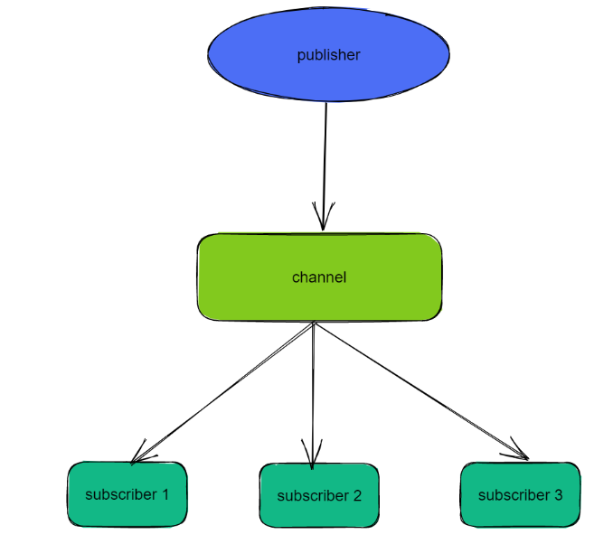
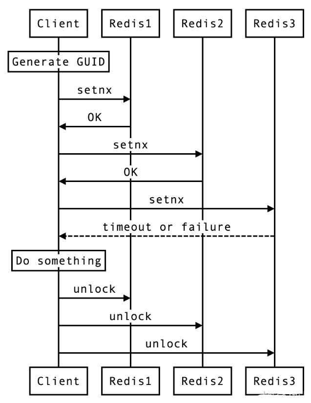
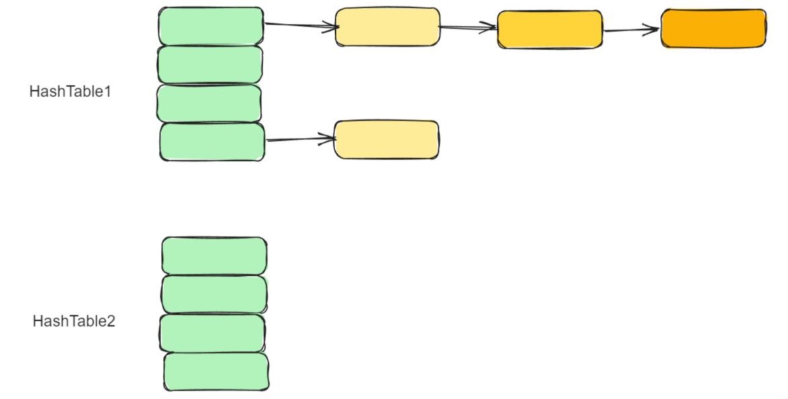
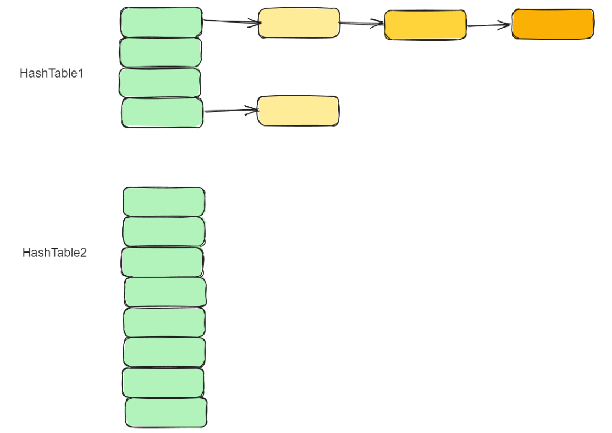
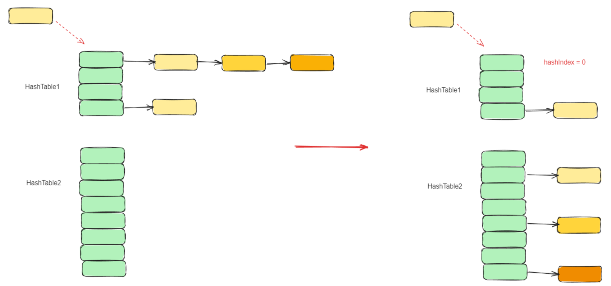
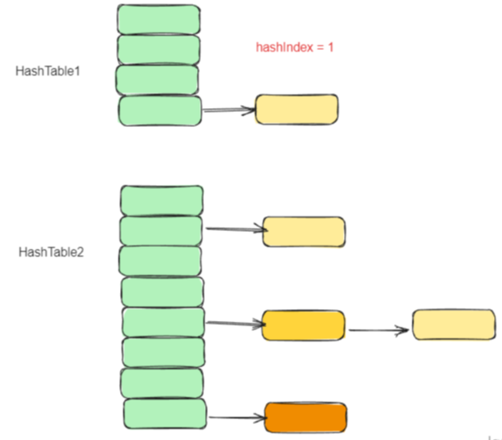
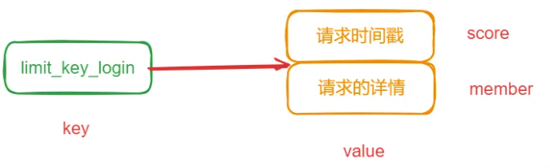
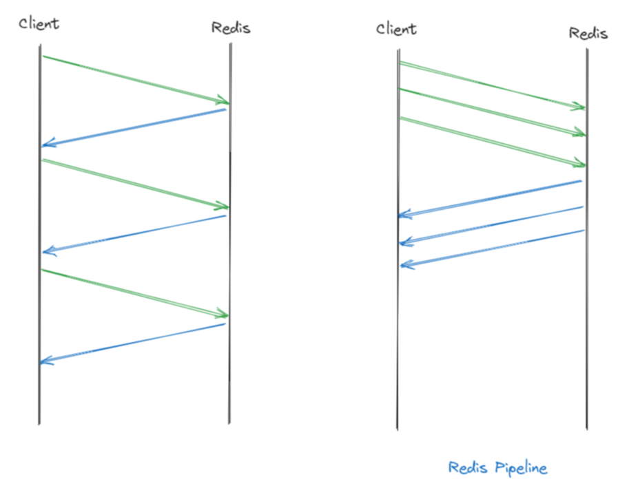

# 面试题-Redis

#### Redis 是 AP 的还是 CP 的？

Redis是一个开源的内存数据库，那么他到底是 AP 的还是 CP 的呢？

有人说：单机的 Redis 是 CP 的，而集群的 Redis 是 AP 的？

但是我不这么认为，我觉得 Redis 就是 AP 的，虽然在单机 Redis 中，因为只有一个实例，他的一致性是有保障的，而一旦这个节点挂了，那么就没有可用性可言了。这么看上去好像是个 CP 系统。

但是，CAP 是分布式场景中的理论，如果单机 Redis，那就没啥分布式可言了。P 都没有了，还谈什么 AP、CP 呢？

> 那么，我们来说说，为啥Redis是AP的呢？

Redis 的设计目标是高性能、高可扩展性和高可用性，Redis的一致性模型是最终一致性，即在某个时间点读取的数据可能并不是最新的，但最终会达到一致的状态。

Redis 没办法保证强一致性的主要原因是，因为它的分布式设计中采用的是异步复制，这导致在节点之间存在数据同步延迟和不一致的可能性。

也就是说，当某个节点上的数据发生改变时，Redis 会将这个修改操作发送给其他节点进行同步，但由于网络传输的延迟等原因，这些操作不一定会立即被其他节点接收到和执行，这就可能导致节点之间存在数据不一致的情况。

除此之外，Redis的一致性还受到了节点故障的影响。当一个节点宕机时，这个节点上的数据可能无法同步到其他节点，这就可能导致数据在节点之间的不一致。虽然 Redis 通过复制和哨兵等机制可以提高系统的可用性和容错性，但是这些机制并不能完全解决数据一致性问题。

如果用同步复制的方式呢？

会不会就是 CP 了呢？并不会，这一点在 Redis 的官网中自己明确的说了：

> 客户端可以使用 WAIT 命令请求对特定数据进行同步复制。然而，WAIT 仅能确保数据在 Redis 实例中有指定数量的副本中被确认，它并不能将一组 Redis 实例转变为具有强一致性的 CP 系统：在故障转移期间，已确认的写操作仍然可能会丢失，这取决于 Redis 持久化的具体配置。然而，使用 WAIT 后，在发生故障事件时丢失写操作的概率大大降低，只在某些难以触发的故障模式下才会发生。


#### 介绍一下 Redis 的集群模式？

Redis 有三种主要的集群模式，用于在分布式环境中实现高可用性和数据复制。这些集群模式分别是：主从复制（Master-Slave Replication）、哨兵模式（Sentinel）和 Redis Cluster 模式。


**主从模式**


主从复制是 Redis 最简单的集群模式。这个模式主要是为了解决单点故障的问题，所以将数据复制多个副本中，这样即使有一台服务器出现故障，其他服务器依然可以继续提供服务。

主从模式中，包括一个主节点（Master）和一个或多个从节点（Slave）。主节点负责处理所有写操作和读操作，而从节点则复制主节点的数据，并且只能处理读操作。当主节点发生故障时，可以将一个从节点升级为主节点，实现故障转移（需要手动实现）。


**主从复制的优势在于简单易用，适用于读多写少的场景**。它提供了数据备份功能，并且可以有很好的扩展性，只要增加更多的从节点，就能让整个集群的读的能力不断提升。

但是主从模式最大的缺点，就是不具备故障自动转移的能力，没有办法做容错和恢复。

主节点和从节点的宕机都会导致客户端部分读写请求失败，需要人工介入让节点恢复或者手动切换一台从节点服务器变成主节点服务器才可以。并且在主节点宕机时，如果数据没有及时复制到从节点，也会导致数据不一致。


**哨兵模式**


为了解决主从模式的无法自动容错及恢复的问题，Redis 引入了一种哨兵模式的集群架构。

哨兵模式是在主从复制的基础上加入了哨兵节点。哨兵节点是一种特殊的 Redis 节点，用于监控主节点和从节点的状态。当主节点发生故障时，哨兵节点可以自动进行故障转移，选择一个合适的从节点升级为主节点，并通知其他从节点和应用程序进行更新。


在原来的主从架构中，引入哨兵节点，其作用是监控 Redis 主节点和从节点的状态。每个 Redis 实例都可以作为哨兵节点，通常需要部署多个哨兵节点，以确保故障转移的可靠性。

哨兵节点定期向所有主节点和从节点发送 **PING** 命令，如果在指定的时间内未收到 **PONG** 响应，哨兵节点会将该节点标记为主观下线。如果一个主节点被多数哨兵节点标记为**主观下线**，那么它将被标记为**客观下线**。

当主节点被标记为**客观下线**时，哨兵节点会触发故障转移过程。它会从所有健康的从节点中选举一个新的主节点，并将所有从节点切换到新的主节点，实现自动故障转移。同时，哨兵节点会更新所有客户端的配置，指向新的主节点。

哨兵节点通过发布订阅功能来通知客户端有关主节点状态变化的消息。客户端收到消息后，会更新配置，将新的主节点信息应用于连接池，从而使客户端可以继续与新的主节点进行交互。

这个集群模式的优点就是为整个集群系统了一种故障转移和恢复的能力。


**Cluster 模式**


Redis Cluster 是 Redis 中推荐的分布式集群解决方案。它将数据**自动分片**到多个节点上，每个节点负责一部分数据。 


Redis Cluster 采用主从复制模式来提高可用性。每个分片都有一个主节点和多个从节点。主节点负责处理写操作，而从节点负责复制主节点的数据并处理读请求。

Redis Cluster 能够自动检测节点的故障。当一个节点失去连接或不可达时，Redis Cluster 会尝试将该节点标记为不可用，并从可用的从节点中提升一个新的主节点。

Redis Cluster 是适用于大规模应用的解决方案，它提供了更好的横向扩展和容错能力。它自动管理数据分片和故障转移，减少了运维的负担。

Cluster 模式的特点是数据分片存储在不同的节点上，每个节点都可以单独对外提供读写服务。不存在单点故障的问题。

#### 什么是 Redis 的数据分片？

Redis 的数据分片（sharding）是一种将一个 Redis 数据集分割成多个部分，分别存储在不同的 Redis 节点上的技术。它可以用于将一个单独的 Redis 数据库扩展到多个物理机器上，从而提高Redis集群的性能和可扩展性。

Redis 数据分片的实现方式通常是将数据按照某种规则（例如，key 的 hash 值）分配到不同的节点上。当客户端想要访问某个 key 时，它会先计算出这个 key 应该存储在哪个节点上，然后直接连接到该节点进行操作。因此，对于客户端而言，Redis集群就像是一个大型的、统一的数据库，而不需要关心数据的实际分布情况。

**在 Redis 的 Cluster 集群模式中，使用哈希槽（hash slot）的方式来进行数据分片**，将整个数据集划分为多个槽，每个槽分配给一个节点。客户端访问数据时，先计算出数据对应的槽，然后直接连接到该槽所在的节点进行操作。Redis Cluster 还提供了自动故障转移、数据迁移和扩缩容等功能，能够比较方便地管理一个大规模的 Redis 集群。


Redis Cluster 将整个数据集划分为 **16384 个槽**，每个槽都有一个编号（0~16383），集群的每个节点可以负责多个hash槽，客户端访问数据时，先根据key计算出对应的槽编号，然后根据槽编号找到负责该槽的节点，向该节点发送请求。

在 Redis 的每一个节点上，都有这么两个东西，一个是槽（slot），它的的取值范围是：0-16383。还有一个就是 cluster，可以理解为是一个集群管理的插件。当我们的存取的 Key 的时候，Redis 会根据 CRC16 算法得出一个结果，然后把结果对 16384 求余数，这样每个 key 都会对应一个编号在 0-16383 之间的哈希槽，通过这个值，去找到对应的插槽所对应的节点，然后直接自动跳转到这个对应的节点上进行存取操作。

Redis Cluster 中的数据分片具有以下特点：

1. **提升性能和吞吐量：**通过在多个节点上分散数据，可以并行处理更多的操作，从而提升整体的性能和吞吐量。这在高流量场景下尤其重要，因为单个节点可能无法处理所有请求。
2. **提高可扩展性：**分片使得Redis可以水平扩展。可以通过添加更多节点扩展数据库的容量和处理能力。
3. **更好的资源利用：**分片允许更有效地利用服务器资源。每个节点只处理数据的一部分，这降低了单个节点的内存和计算需求。
4. **避免单点故障：**在没有分片的情况下，如果唯一的Redis服务器发生故障，整个服务可能会停止。在分片的环境中，即使一个节点出现问题，其他节点仍然可以继续运行。
5. **数据冗余和高可用性：**在某些分片策略中，如 Redis 集群，每个分片的数据都可以在集群内的其他节点上进行复制。这意味着即使一个节点失败，数据也不会丢失，从而提高了系统的可用性。

> Redis Cluster 将整个数据集划分为 16384 个槽，为什么是 16384 呢，这个数字有什么特别的呢？

这个问题在Github上有所讨论，Redis的作者也下场做过回复：https://github.com/redis/redis/issues/2576

> The reason is:
>
> 1、Normal heartbeat packets carry the full configuration of a node, that can be replaced in an idempotent way with the old in order to update an old config. This means they contain the slots configuration for a node, in raw form, that uses 2k of space with16k slots, but would use a prohibitive 8k of space using 65k slots.
>
> 2、At the same time it is unlikely that Redis Cluster would scale to more than 1000 mater nodes because of other design tradeoffs.
>
> So 16k was in the right range to ensure enough slots per master with a max of 1000 maters, but a small enough number to propagate the slot configuration as a raw bitmap easily. Note that in small clusters the bitmap would be hard to compress because when N is small the bitmap would have slots/N bits set that is a large percentage of bits set.

16384 这个数字是一个 2 的 14 次方（2^14），尽管 crc16 能得到 2^16 -1=65535 个值，但是并没有选择，主要从消息大小和集群规模等方面考虑的：

1、正常的心跳数据包携带了节点的完整配置，在更新配置的时候，可以以幂等方式进行替换。这意味着它们包含了节点的原始槽配置，对于包含 16384 个槽位的情况，使用 2k 的空间就够了，但如果使用 65535 个槽位，则需要使用 8k 的空间，这就有点浪费了。

2、由于其他设计权衡的原因，Redis Cluster 不太可能扩展到超过 1000 个主节点，这种情况下，用 65535 的话会让每个节点上面的 slot 太多了，会导致节点的负载重并且数据迁移成本也比较高。而 16384 是相对比较好的选择，可以在 1000 个节点下使得 slot 均匀分布，每个分片平均分到的 slot 不至于太小。

除此之外，还有一些原因和优点供大家参考：

1、易于扩展：槽数量是一个固定的常数，这样就可以方便地进行集群的扩展和缩小。如果需要添加或删除节点，只需要将槽重新分配即可。

2、易于计算：哈希算法通常是基于槽编号计算的，**将槽数量设置为2的幂次方，可以使用位运算等简单的算法来计算槽编号，从而提高计算效率**。

3、负载均衡：槽数量的选择可以影响数据的负载均衡。如果槽数量太少，会导致某些节点负载过重；如果槽数量太多，会导致数据迁移的开销过大。**16384 这个数量在实践中被证明是一个比较合适的选择，能够在保证负载均衡的同时，减少数据迁移的开销。**

#### Redis 使用什么协议进行通信？

**Redis 使用自己设计的一种文本协议进行客户端与服务端之间的通信——RESP（REdis Serialization Protocol）**，这种协议简单、高效，易于解析，被广泛使用。

RESP 协议基于 TCP 协议，采用请求/响应模式，每条请求由多个参数组成，以命令名称作为第一个参数。请求和响应都以行结束符（`\r\n`）作为分隔符，具体格式如下：

```bash
*<number of arguments>\r\n
$<length of argument 1>\r\n
<argument data>\r\n
...
$<length of argument N>\r\n
<argument data>\r\n
```

其中，`<number of arguments>` 表示参数个数，`<length of argument>` 表示参数数据的长度，`<argument data>` 表示参数数据。参数可以是字符串、整数、数组等数据类型。

例如，以下是一个 Redis 协议的示例请求和响应：
请求：

```bash
*3\r\n
$3\r\n
SET\r\n
$5\r\n
mykey\r\n
$7\r\n
myvalue\r\n
```

响应：

```bash
+OK\r\n
```

上面的请求表示向 Redis 服务器设置一个名为 "mykey" 的键，值为 "myvalue"。响应返回 "+OK" 表示操作成功。

> "$3\r\n" 表示参数长度为 3，即下一个参数是一个 3 个字符的字符串。它表示要执行的命令是"SET"，即设置键值对。
>
> "$5\r\n" 表示参数长度为 5，即下一个参数是一个 5 个字符的字符串。它表示要设置的键是"mykey"。
>
> "$7\r\n" 表示参数长度为 7，即下一个参数是一个 7 个字符的字符串。它表示要设置的值是"myvalue"。

除了基本的 GET、SET 操作，Redis 还支持事务、Lua 脚本、管道等高级功能，这些功能都是通过 Redis 协议来实现的。

#### Redis 与 Memcached 有什么区别？

Redis 和 Memcached 都是常见的缓存服务器，它们的主要区别包括以下几个方面：

**1、数据结构不同：**Redis 提供了多种数据结构，如字符串、哈希表、列表、集合、有序集合等，而 Memcached 只支持简单的键值对存储。

**2、持久化方式不同：**Redis 支持多种持久化方式，如 RDB 和 AOF，可以将数据持久化到磁盘上；而 Memcached 不支持持久化。

**3、数据分片方式不同：**Redis 使用哈希槽分片，可以实现数据的自动分片和负载均衡；而 Memcached 只能手动分片。

**4、处理数据的方式不同：**Redis 使用单线程处理数据请求，支持事务、Lua 脚本等高级功能；而 Memcached 使用多线程处理数据请求，只支持基本的 GET、SET 操作。

**5、协议不同：**Redis 使用自己的协议，支持多个数据库，可以使用密码进行认证；而 Memcached 使用文本协议，只支持一个默认数据库。

**6、内存管理方式不同：**Redis 的内存管理比 Memcached 更加复杂，支持更多的内存优化策略。

综上所述，Redis 和 Memcached 有着不同的设计理念和应用场景。R**edis 适用于数据结构复杂、需要高级功能和数据持久化的场景；而 Memcached 则适用于简单的键值存储场景**。

#### Redis 为什么这么快？

Redis 之所以如此快，主要有以下几个方面的原因：

**1、基于内存：**Redis 是一种基于内存的数据库，数据存储在内存中，数据的读写速度非常快，因为内存访问速度比硬盘访问速度快得多。

**2、单线程模型：**Redis 使用单线程模型，这意味着它的所有操作都是在一个线程内完成的，不需要进行线程切换和上下文切换。这大大提高了 Redis 的运行效率和响应速度。

**3、多路复用 I/O 模型：**Redis 在单线程的基础上，采用了I/O 多路复用技术，实现了单个线程同时处理多个客户端连接的能力，从而提高了 Redis 的并发性能。

**4、高效的数据结构：**Redis 提供了多种高效的数据结构，如哈希表、有序集合、列表等，这些数据结构都被实现得非常高效，能够在 O(1) 的时间复杂度内完成数据读写操作，这也是 Redis 能够快速处理数据请求的重要因素之一。

**5、多线程的引入：**在 Redis 6.0 中，为了进一步提升 IO 的性能，引入了多线程的机制。采用多线程，使得网络处理的请求并发进行，就可以大大的提升性能。多线程除了可以减少由于网络 I/O 等待造成的影响，还可以充分利用 CPU 的多核优势。


#### Redis 支持哪几种数据类型？

Redis 中支持了多种数据类型，其中比较常用的有五种：

1. 字符串（String）
2. 哈希（Hash）
3. 列表（List）
4. 集合（Set）
5. 有序集合（Sorted Set）

另外，Redis 中还支持一些高级的数据类型，如：Streams、Bitmap、Geospatial 以及 HyperLogLog

#### Redis 为什么要自己定义 SDS？

Redis 是一种 KV 的存储结构，他的 key 是字符串类型，值也支持字符串，所以字符串是 redis 中最常见的一个类型了。**Redis 自己本身是通过C语言实现的**，但是他并没有直接使用 C 语言中的字符数组的方式来实现字符串，而是自己实现了一个 SDS（Simple Dynamic Strings），即简单动态字符串，这是为什么呢？

首先，因为字符串在 Redis **中使用实在是太广泛了** ，所以对他的基本要求就有两点，**第一就是要支持任意字符的存储，第二就是各种操作需要高效**。

接着我们看看 C 语言中字符串的实现方式有什么问题呢？很多人可能都忘了，我帮大家回忆一下，C语言中，字符串是通过字符数组实现的，底层呢是开辟了一块连续的空间，依次存放字符串中的每一个字符。为了表示字符串的结束，他会在字符数组的最后一个字符处记录 `\0`，

也就是说，在 C 语言中，当识别到字符数组中的 `\0` 字符的时候，就认为字符串结束了，那么这么做会带来哪些问题呢？

就是**这样实现的字符串中就不能保存任意内容了**，至少 `\0`就不行，因为遇到他的时候就直接截断了，这肯定是接受不了的。

还有就是因为 **C 中的字符串以 `\0` 作为识别字符串结束的方式，所以他的字符串长度判断、字符串追加等操作，都需要从头开始遍历，一直遍历到\0的时候再返回长度或者做追加。这就使得字符串相关的操作效率都很低。**

那么，想要解决上面的两个问题要怎么办呢？那就是**在用字符数组表示字符串的同时，在这个字符串中增加一个表示分配给该字符数组的总长度的 alloc 字段，和一个表示字符串现有长度的 len 字段。这样在获取长度的时候就不依赖\0了，直接返回 len 的值就行了**。

还有呢，就是在做追加操作的时候，只需要判断新追加的部分的 len 加上已有的 len 是否大于 alloc，如果超过就重新再申请新空间，如果没超过，就直接进行追加就行了。

还有很多其他操作，比如复制、比较等都可以使用类似的思想高效的操作。

#### Redis 中的 Zset 是怎么实现的？

ZSet（也称为Sorted Set）是Redis中的一种特殊的数据结构，它内部维护了一个有序的字典，这个字典的元素中既包括了一个成员（member），也包括了一个double类型的分值(score)。这个结构可以帮助用户实现记分类型的排行榜数据，比如游戏分数排行榜，网站流行度排行等。

> Redis 中的 ZSet 在实现中，有多种结构，大类的话有两种，分别是 ziplist(压缩列表) 和 skiplist(跳跃表)，但是这只是以前，在 Redis 5.0 中新增了一个 listpack（紧凑列表）的数据结构，这种数据结构就是为了替代 ziplist 的，而在之后Redis 7.0的发布中，在 Zset 的实现中，已经彻底不在使用 zipList 了。


当 ZSet 的元素数量比较少时，Redis 会采用 ZipList（ListPack）来存储ZSet的数据。ZipList（ListPack）是一种紧凑的列表结构，它通过连续存储元素来节约内存空间。当 ZSet 的元素数量增多时，Redis会自动将ZipList（ListPack）转换为 SkipList，以保持元素的有序性和支持范围查询操作。

在这个过程中，Redis 会遍历 ZipList（ListPack）中的所有元素，按照元素的分数值依次将它们插入到 SkipList 中，这样就可以保持元素的有序性。

**在 Redis 的 ZSET 具体实现中，SkipList 的这种实现，不仅用到了跳表，还会用到 dict（字典）**


其中，SkipList 用来实现有序集合，其中每个元素按照其分值大小在跳表中进行排序。跳表的插入、删除和查找操作的时间复杂度都是 O(log n)，可以保证较好的性能。

dict 用来实现元素到分值的映射关系，其中元素作为键，分值作为值。哈希表的插入、删除和查找操作的时间复杂度都是 O(1)，具有非常高的性能。


#### ZipList（ListPack）和 SkipList 之间是什么时候进行转换的呢？

在 Redis 中，ZSET 在特定条件下会使用 ziplist 作为其内部表示。这通常发生在有序集合较小的时候，具体条件如下：

1. 元素数量少：集合中的元素数量必须小于某个阈值（zset-max-ziplist-entries）。
2. 元素大小小：集合中的每个元素（包括值和分数）的大小必须小于指定的最大值（zset-max-ziplist-value）。

默认情况下，zset-max-ziplist-entries 是 128，zset-max-ziplist-value 是 64。

**总的来说就是，当元素数量少于 128，每个元素的长度都小于 64 字节的时候，使用 ZipList（ListPack），否则，使用 SkipList！**

#### 跳表的结构

跳表也是一个有序链表。

在链表中，我们想要查找一个数，需要从头结点开始向后依次遍历和匹配，直到查到为止，这个过程是比较耗费时间的，他的时间复杂度是 0(n)。

当我们想要向这个链表中插入一个数的时候，过程和查找类似，先需要从头开始遍历找到合适的为止，然后再插入，他的时间复杂度也是 O(n)。

那么，怎么能提升遍历速度呢，有一个办法，那就是我们对链表进行改造，先对链表中每两个节点建立第一级索引


有了我们创建的这个索引之后，我们查询元素 12，我们先从一级索引 `6 -> 9 -> 17 -> 26` 中查找，发现 12 介于 9 和17之间，然后，转移到下一层进行搜索，即 `9 -> 12 -> 17`，即可找到 12 这个节点了。

可以看到，同样是查找 12，原来的链表需要遍历 5 个元素`(3、6、7、9、12)`，建立了一层索引之后，只需要遍历4个元素即可`（6、9、17、12）`。

像上面这种带多级索引的链表，就是跳表。

#### 什么是 GEO，有什么用？

GEO 就是 Geolocation 的简写形式，代表地理坐标，Redis GEO 主要用于存储地理位置信息的，帮助我们根据经纬度来检索数据。

它主要支持如下命令：

- GEOADD：添加一个地理空间信息，包含：经度（longitude）、纬度（latitude）、值（member）
- GEODIST：计算指定的两个点之间的距离并返回
- GEOHASH：将指定member的坐标转为hash字符串形式并返回
- GEOPOS：返回指定member的坐标
- GEORADIUS：指定圆心、半径，找到该圆内包含的所有member，并按照与圆心之间的距离排序后返回。
- GEOSEARCH：在指定范围内搜索member，并按照与指定点之间的距离排序后返回。范围可以是圆形或矩形。
- GEOSEARCHSTORE：与GEOSEARCH功能一致，不过可以把结果存储到一个指定的key。

#### Redis 为什么被设计成是单线程的？

我们所说的 Redis 单线程，指的是"其网络 IO 和键值对读写是由一个线程完成的"，也就是说，**Redis 中只有网络请求模块和数据操作模块是单线程的。而其他的如持久化存储模块、集群支撑模块等是多线程的。**

所以说，Redis 中并不是没有多线程模型的，早在 Redis 4.0 的时候就已经针对部分命令做了多线程化。

一个计算机程序在执行的过程中，主要需要进行两种操作分别是读写操作和计算操作。

其中读写操作主要是涉及到的就是I/O操作，其中包括网络 I/O 和磁盘 I/O。计算操作主要涉及到 CPU。

**而多线程的目的，就是通过并发的方式来提升 I/O 的利用率和 CPU 的利用率。**

**之所以 Redis 没有用多线程处理 IO 操作，主要是因为，Redis 的操作基本都是基于内存的，CPU 资源根本就不是 Redis 的性能瓶颈。**

#### 为什么 Redis 设计成单线程也能这么快？

Redis 的性能很好，除了因为他基于内存、有高效的数据结构等等原因以外，还有一个重要的原因那就是他在单线程中使用多路复用 I/O 技术也能提升 Redis 的 I/O 利用率。

**Redis的多路复用**

多路复用这个词，相信很多人都不陌生。那么，Redis的多路复用技术有什么特别的呢？

这里先讲讲 **Linux 多路复用技术，就是多个进程的 IO 可以注册到同一个管道上，这个管道会统一和内核进行交互。当管道中的某一个请求需要的数据准备好之后，进程再把对应的数据拷贝到用户空间中**。


也就是说，通过一个线程来处理多个 IO 流。

IO 多路复用在 Linux 下包括了三种，select、poll、epoll，抽象来看，他们功能是类似的，但具体细节各有不同。

其实，Redis 的 IO 多路复用程序的所有功能都是通过包装操作系统的 IO 多路复用函数库来实现的。每个 IO 多路复用函数库在Redis源码中都有对应的一个单独的文件。


在 Redis 中，每当一个套接字准备好执行连接应答、写入、读取、关闭等操作时，就会产生一个文件事件。因为一个服务器通常会连接多个套接字，所以多个文件事件有可能会并发地出现。


一旦有请求到达，就会交给 Redis 线程处理，这就实现了一个 Redis 线程处理多个 IO 流的效果。

所以，Redis 选择使用多路复用 IO 技术来提升 I/O 利用率。

而之所以 Redis 能够有这么高的性能，不仅仅和采用多路复用技术和单线程有关，此外还有以下几个原因：

1、完全基于内存，绝大部分请求是纯粹的内存操作，非常快速。 

 2、数据结构简单，对数据操作也简单，如哈希表、跳表都有很高的性能。 

 3、采用单线程，避免了不必要的上下文切换和竞争条件，也不存在多进程或者多线程导致的切换而消耗 CPU 

 4、使用多路 I/O 复用模型 

#### 为什么 Redis 6.0 引入了多线程？

Redis 6.0 中的多线程，也只是针对处理网络请求过程采用了多线程，而数据的读写命令，仍然是单线程处理的。

> Redis 不是号称单线程也有很高的性能么？
>
> 不是说多路复用技术已经大大的提升了 IO 利用率了么，为啥还需要多线程？

主要是因为我们对Redis有着更高的要求。

根据测算，Redis 将所有数据放在内存中，内存的响应时长大约为 100 纳秒，对于小数据包，Redis 服务器可以处理 80,000 到 100,000 QPS，这么高的对于 80% 的公司来说，单线程的 Redis 已经足够使用了。

但随着越来越复杂的业务场景，有些公司动不动就上亿的交易量，因此需要更大的 QPS。

为了提升 QPS，很多公司的做法是部署 Redis 集群，并且尽可能提升 Redis 机器数。但是这种做法的资源消耗是巨大的。

而经过分析，限制 Redis 的性能的主要瓶颈出现在网络 IO 的处理上，虽然之前采用了多路复用技术。但是我们前面也提到过，**多路复用的 IO 模型本质上仍然是同步阻塞型 IO 模型**。

下面是多路复用 IO 中 select 函数的处理过程：


从上图我们可以看到，**在多路复用的 IO 模型中，在处理网络请求时，调用 select （其他函数同理）的过程是阻塞的，也就是说这个过程会阻塞线程，如果并发量很高，此处可能会成为瓶颈。**

虽然现在很多服务器都是多个 CPU 核的，但是对于 Redis 来说，因为使用了单线程，在一次数据操作的过程中，有大量的 CPU 时间片是耗费在了网络 IO 的同步处理上的，并没有充分的发挥出多核的优势。

**如果能采用多线程，使得网络处理的请求并发进行，就可以大大的提升性能。多线程除了可以减少由于网络 I/O 等待造成的影响，还可以充分利用 CPU 的多核优势。**

所以，Redis 6.0 采用多个 IO 线程来处理网络请求，网络请求的解析可以由其他线程完成，然后把解析后的请求交由主线程进行实际的内存读写。提升网络请求处理的并行度，进而提升整体性能。

但是，Redis 的多 IO 线程只是用来处理网络请求的，对于读写命令，Redis 仍然使用单线程来处理。

**那么，在引入多线程之后，如何解决并发带来的线程安全问题呢？**

这就是为什么我们前面多次提到的"Redis 6.0 的多线程只用来处理网络请求，而数据的读写还是单线程"的原因。

Redis 6.0 只有在网络请求的接收和解析，以及请求后的数据通过网络返回给时，使用了多线程。而数据读写操作还是由单线程来完成的，所以，这样就不会出现并发问题了。

#### 为什么 Lua 脚本可以保证原子性？

原子性在并发编程中，和在数据库中两种不同的概念。

在数据库中，事务的 ACID 中原子性指的是"要么都执行要么都回滚"。在并发编程中，原子性指的是"操作不可拆分、不被中断"。

Redis 既是一个数据库，又是一个支持并发编程的系统，所以，他的原子性有两种。所以，我们需要明确清楚，在问"Lua 脚本保证 Redis 原子性"的时候，指的到底是哪个原子性。

**Lua 脚本可以保证原子性，因为 Redis 会将 Lua 脚本封装成一个单独的事务，而这个单独的事务会在Redis客户端运行时，由 Redis 服务器自行处理并完成整个事务，如果在这个进程中有其他客户端请求的时候，Redis 将会把它暂存起来，等到 Lua 脚本处理完毕后，才会再把被暂存的请求恢复。**

这样就可以保证整个脚本是作为一个整体执行的，中间不会被其他命令插入。但是，如果命令执行过程中命令产生错误，事务是不会回滚的，将会影响后续命令的执行。

**也就是说，Redis 保证以原子方式执行 Lua 脚本，但是不保证脚本中所有操作要么都执行或者都回滚。**

那就意味着，Redis 中 Lua 脚本的执行，可以保证并发编程中不可拆分、不被中断的这个原子性，但是没有保证数据库 ACID 中要么都执行要么都回滚的这个原子性。

#### Redis 中的 setnx 命令为什么是原子性的?

**Redis 中的 setnx 命令是一个原子性操作，因为它利用了 Redis 单线程的特点。**

在 Redis 中，所有的命令都是在主线程中顺序执行的，**这意味着每个命令在执行时不会被其他命令打断**。当执行 setnx 命令时，Redis 会在内存中检查给定的 key 是否存在，如果不存在，则设置该 key 的值，并返回1。如果该 key 已经存在，则不做任何操作，直接返回 0。

由于 Redis 是单线程的，所以当一个客户端执行 setnx 命令时，其他客户端无法执行任何命令，直到该命令执行完毕。

因此，setnx 命令是一个原子性操作，它可以保证在任何时候只有一个客户端可以执行该命令，这可以防止并发访问造成的数据竞争和不一致性问题。

需要注意的是，虽然 setnx 命令本身是原子性的，但在实际应用中，多个Redis命令的组合可能会导致数据一致性问题。在这种情况下，开发人员需要使用Redis事务或分布式锁等机制来保证数据的一致性。

#### Redis 5.0 中的 Stream 是什么？

Redis Stream 是 Redis 5.0 版本新增加的数据结构，主要用于处理有序的、可追溯的消息流。

Stream 数据结构可以被视为一个日志或消息队列，其中每个消息都有一个唯一的 ID，并且按照添加的顺序进行排序。开发人员可以向 Stream 中添加消息、读取消息、删除消息以及订阅消息。Stream 数据结构还支持消费者组，可以让多个消费者并发地处理消息流。

在 Redis 5.0 之前，通过 Redis 的发布订阅 (pub/sub) 可以实现消息队列的功能，但它有个缺点就是消息无法持久化，如果出现网络断开、Redis 宕机等，消息就会被丢弃。

而 Redis Stream 提供了消息的持久化和主备复制功能，可以让任何客户端访问任何时刻的数据，并且能记住每一个客户端的访问位置，还能保证消息不丢失。

他的特点是支持持久化、消息具有有序性，并且支持分组。主要可以用来做消息队列、日志收集、实时数据处理和聊天室应用等。

**有序性：**消息可以按照发布时间排序，消费者可以按照消息发布的时间顺序进行消费。

**多消费者支持：**多个消费者可以订阅同一个 Stream 并独立消费消息，支持竞争式消费和共享式消费两种消费模式。

**持久化：**Stream 支持消息持久化，即使 Redis 服务器重启或崩溃，之前的消息仍然可以恢复。

**消息分组：**Stream 支持消息分组功能，可以将消息分配到不同的消费组中，从而实现更灵活的消息消费。

> 实现原理
>
> Stream 底层采用了类似于日志的数据结构，每个 Stream 都是由一个或多个日志实现的。每个日志包含多个消息，每个消息包含一个唯一的 ID 和一些附加的字段，如消息体、时间戳等。

Redis 提供了一系列的 Stream 命令，用于创建 Stream、发布/消费消息。


当一个消息被发布到 Stream 中时，它将被写入 Stream 日志中，每个消息都有一个唯一的 ID 和一些可选的字段，如时间戳、消息体等。消息 ID 是自动分配的，可以使用自然数或 UUID 作为 ID。

当一个消费者订阅了一个 Stream 并开始消费消息时，它可以使用 XREAD 命令从 Stream 中读取消息。消费者可以使用 XGROUP 命令将自己加入到一个消费组中，并使用 XREADGROUP 命令从该组中读取消息。消费者可以使用 XACK 命令来确认已经消费的消息，避免消息被重复消费。

他还支持消息分组的功能，当一个消费组被创建时，它将与一个 Stream 相关联，并包含一个消费组名称和一个偏移量。消费组可以有多个消费者，消费者可以独立地从 Stream 中读取消息。当一个消费者开始消费消息时，它将记录当前的消费偏移量，并在处理完所有消息后将其更新到消费组中。消费组可以使用 XPENDING 命令查找未确认的消息，从而处理消息的超时和未确认情况。

#### Redis 的虚拟内存机制是什么？

Redis 提供了一种称为**虚拟内存的机制，用于将部分不经常使用的数据存储到磁盘上**，从而避免 Redis 进程占用过多的内存。

但是**需要注意的是，Redis 从 2.4 版本开始已经废弃了虚拟内存（VM）功能，并且在更高版本中不再推荐使用**。

当Redis使用的内存超过了指定的阈值时，虚拟内存机制将自动将一些键值对转移到磁盘上，以释放一部分内存。当需要访问被转移到磁盘上的数据时，虚拟内存机制将自动将数据读取到内存中。

想要配置虚拟内存，需要修改配置文件。主要涉及到以下参数：

```bash
maxmemory <num>
vm-enabled yes
vm-max-memory <num>
vm-page-size <num>
vm-pages <num>
vm-max-threads <num>
```

- maxmemory 参数用于设置 Redis 允许使用的最大内存大小，单位为字节。一般来说，建议将 maxmemory 设置为物理内存大小的一半左右。例如，如果服务器的物理内存为 8GB，那么可以将 maxmemory 设置为 4GB
- vm-enabled 参数用于启用虚拟内存功能。将其设置为 yes 即可启用。
- vm-max-memory 参数用于设置虚拟内存的最大大小，单位为字节。一般来说，建议将 vm-max-memory 设置为 maxmemory 的 2 倍以上。例如，如果 maxmemory 设置为 4GB，那么可以将 vm-max-memory 设置为 8GB 以上。
- vm-page-size 参数用于设置页的大小，单位为字节。一般来说，不需要修改该参数的默认值，即 32 字节。
- vm-pages 参数用于设置虚拟内存的页数。一般来说，可以将该参数设置为 vm-max-memory/vm-page-size。
- vm-max-threads 参数用于设置虚拟内存使用的最大线程数。一般来说，建议将该参数设置为服务器的 CPU 核心数。

但是，还是那句话，没有银弹。**虚拟内存机制虽然可以节省内存，但同时也会带来一定的性能损失**。由于需要将数据从磁盘读取到内存中，因此访问被转移到磁盘上的数据会比访问内存中的数据慢一些。

因此，在实际使用中，需要根据具体的应用场景和硬件条件进行调整，以达到最佳的性能和内存使用效率。

> 不再建议使用
>
> 虚拟内存功能最初被设计为解决物理内存限制的问题，允许 Redis 将数据分页到磁盘上，只保留常用的数据在内存中。这个功能在初期对于内存受限的环境提供了一定的帮助。
>
> 然而，这种设计带来了一些问题：
>
> 1. 性能开销：虚拟内存的使用增加了额外的磁盘 I/O 操作，这会显著降低 Redis 的性能，因为磁盘访问速度远不如内存访问速度。
> 2. 复杂性：虚拟内存功能的管理增加了 Redis 运行的复杂性，尤其是在数据管理和性能调优方面。
> 3. 技术进步：随着时间的推移，内存价格的下降和服务器内存容量的增加，使得在服务器上配置大量内存变得经济实惠。这减少了对虚拟内存的需求。
>
> 因此，Redis 的开发团队决定在 2.4 版本后不再维护或使用虚拟内存功能，并推荐用户使用足够的物理内存来支持 Redis 实例，或者使用其他策略如数据分片（sharding）来管理大型数据集。这样的变化使得 Redis 能够专注于其核心优势——提供高性能的内存数据存储服务。

#### Redis 的持久化机制是怎样的？

Redis 提供了两种持久化的机制，分别是 RDB 和 AOF。


**RDB**

RDB 是将 Redis 的内存中的数据定期保存到磁盘上，以防止数据在Redis进程异常退出或服务器断电等情况下丢失。

RDB 的优点是：快照文件小、恢复速度快，适合做备份和灾难恢复。
RDB 的缺点是：定期更新可能会丢数据


**AOF**

AOF 是将 Redis 的所有写操作追加到 AOF 文件（Append Only File）的末尾，从而记录了Redis服务器运行期间所有修改操作的详细记录。当 Redis 重新启动时，可以通过执行 AOF 文件中保存的写操作来恢复数据。

但是如果 Redis 刚刚执行完一个写命令，还没来得及写 AOF 文件就宕机了，那么这个命令和相应的数据就会丢失了。但是它也比 RDB 要更加靠谱一些。

AOF 的优点是：可以实现更高的数据可靠性、支持更细粒度的数据恢复，适合做数据存档和数据备份。
AOF 的缺点是：文件大占用空间更多，每次写操作都需要写磁盘导致负载较高


| 特性         | RDB                              | AOF                                  |
| ------------ | -------------------------------- | ------------------------------------ |
| 数据可靠性   | 可能会丢失最后一次快照之后的数据 | 保证最后一次写操作之前的数据不会丢失 |
| 性能         | 读写性能较高，适合做数据恢复     | 写性能较高，适合做数据存档           |
| 存储空间占用 | 快照文件较小，占用空间较少       | AOF 文件较大，占用空间较多           |
| 恢复时间     | 从快照文件中恢复数据较快         | 从 AOF 文件中恢复数据较慢            |


**混合持久化**

AOF 和 RDB 各自有优缺点，为了让用户能够同时拥有上述两种持久化的优点， Redis 4.0 推出了 RDB-AOF 混合持久化。

在开启混合持久化的情况下，AOF 重写时会把 Redis 的持久化数据，以 RDB 的格式写入到 AOF 文件的开头，之后的数据再以 AOF 的格式化追加的文件的末尾。

aof-use-rdb-preamble 是开启混合模式的参数

混合持久化结合了 RDB 和 AOF 持久化的优点，开头为 RDB 的格式，使得 Redis 可以更快的启动，同时结合 AOF 的优点，有减低了大量数据丢失的风险。

但是，在AOF 文件中添加了 RDB 格式的内容，使得 AOF 文件的可读性变得很差；如果开启混合持久化，那么此混合持久化 AOF 文件，是不能用在旧版本中的，不向下兼容的。

#### Redis 能完全保证数据不丢失吗？

不能，因为 Redis 是基于内存存储的，当 Redis 进程异常退出或服务器断电等情况发生时，内存中的数据可能会丢失。

为了防止数据丢失，Redis 提供了 RDB 和 AOF 的持久化机制，Redis可以将数据从内存保存到磁盘中，以便在Redis进程异常退出或服务器断电等情况下，通过从磁盘中加载数据来恢复数据。

但是，持久化机制也不是绝对可靠的，归根结底 Redis 还是个缓存，他并不是完全给你做持久化用的，所以还是要有自己的持久化方式，比如双写到数据库。

因此，为了最大程度地保障数据安全，建议采用多种手段来提高数据可靠性，如定期备份数据、使用主从复制机制、使用集群模式等。

#### AOF 的三种写回策略

AOF 有三种数据写回策略，分别是 Always，Everysec 和 No。

- Always，同步写回：每个写命令执行完，立马同步地将日志写回磁盘；
- Everysec，每秒写回：每个写命令执行完，只是先把日志写到AOF文件的内存缓冲区，每隔一秒把缓冲区中的内容写入磁盘；
- No，操作系统控制的写回：每个写命令执行完，只是先把日志写到AOF文件的内存缓冲区，由操作系统决定何时将缓冲区内容写回磁盘。

“同步写回”可靠性肯定是最高的，但是它在每一个写命令后都有一个落盘操作，而且还是同步的，这和直接写磁盘类型的数据库有啥区别？

"操作系统控制的写回"这种是最不靠谱的，谁知道操作系统啥时候帮你做持久化，万一没来及持久化就宕机了，不就gg了。

"每秒写回"是在二者之间折中了一下，异步的每秒把数据写会到磁盘上，最大程度的提升效率和降低风险。

> Always 也不能保证不丢
>
> 即使是在 always 策略下，也不能保证 100% 不丢失数据的，主要出于以下原因：
>
> 1、磁盘和系统故障：如果在写入操作和同步到磁盘之间发生硬件故障或系统崩溃，可能会丢失最近的写操作
>
> 2、操作系统缓冲区：即使Redis请求立即将数据同步到磁盘，操作系统的 I/O 缓冲区可能会导致实际写入磁盘的操作延迟发生。如果在写入缓冲区之后，没写磁盘前，机器挂了，那么数据就丢了。
>
> 操作系统缓冲区，通常指的是操作系统用于管理数据输入输出（I/O）的一种内存区域。当程序进行文件写入操作时，数据通常首先被写入到这个缓冲区，而不是直接写入到硬盘。
>
> 3、磁盘写入延迟：磁盘的写入并非实时完成，特别是在涉及到机械硬盘时，写入延迟主要由磁盘旋转速度（RPM）和寻道时间决定。如果在这这个延迟过程中，机器挂了，那么数据也就丢了。

#### Redis 的事务机制是怎样的？

Redis 中是支持事务的，他的事务主要目的是保证多个命令执行的原子性，即要在一个原子操作中执行，不会被打断。

需要注意的是，**Redis 的事务是不支持回滚的**。从 Redis 2.6.5 开始，服务器将会在累积命令的过程中检测到错误。然后，在执行 EXEC 期间会拒绝执行事务，并返回一个错误，同时丢弃该事务。如果事务执行过程中发生错误，Redis 会继续执行剩余的命令而不是回滚整个事务。

Redis事务相关的命令主要有以下几个：

- MULTI：标记一个事务块的开始。
- DISCARD：取消事务，放弃执行事务块内的所有命令。
- EXEC：执行所有事务块内的命令。
- UNWATCH：取消 WATCH 命令对所有 key 的监视。
- WATCH key [key ...]：监视一个(或多个) key ，如果在事务执行之前这个(或这些) key 被其他命令所改动，那么事务将被打断。

> 事务执行时会有什么错误？
>
> 前面我们提到过，从 Redis 2.6.5 开始，服务器将会在累积命令的过程中检测到错误。但是后面又说事务执行时也会有错误。这里是不是矛盾了？
>
> 其实并不矛盾。
>
> Redis 错误有两种情况，一种是在命令排队的过程就就检测到的错误，比如语法错误，比如内存不够了，等等。在这种错误，会在调用 EXEC 后，命令可能会直接失败。
>
> 还有一种错误，是在调用 EXEC 后，命令执行过程中出现的错误，最常见的就是操作类型不一致，比如对字符串进行列表相关的操作。这种就是在执行过程中才会出现的。
>
> 而后面这种错误，Redis 认为是不应该出现的。所以需要在开发阶段就避免，这也是他没有提供回滚的一个重要原因。

#### Redis 的过期策略是怎么样的？

Redis 通过设置过期时间来控制键值对的生命周期。过期时间可以通过EXPIRE、EXPIREAT、PERSIST等命令设置，也可以在插入数据时直接设置过期时间。

**Redis 的过期策略采用的是定期删除和惰性删除相结合的方式。**

- **定期删除：**Redis 默认每隔 100ms 就随机抽取一些设置了过期时间的 key，并检查其是否过期，如果过期就删除。定期删除是 Redis 的主动删除策略，它可以确保过期的 key 能够及时被删除，但是会占用 CPU 资源去扫描 key，可能会影响 Redis 的性能。
- **惰性删除：**当一个 key 过期时，不会立即从内存中删除，而是在访问这个 key 的时候才会触发删除操作。惰性删除是 Redis 的被动删除策略，它可以节省 CPU 资源，但是会导致过期的 key 始终保存在内存中，占用内存空间。

**Redis 默认同时开启定期删除和惰性删除两种过期策略。**

定期删除会在 Redis 设置的过期键的过期时间达到一定阈值时进行一次扫描，将过期的键删除，但不会立即释放内存，而是把这些键标记为“已过期”，并放入一个专门的链表中。然后，在 Redis 的内存使用率达到一定阈值时，Redis会对这些“已过期”的键进行一次内存回收操作，释放被这些键占用的内存空间。

而惰性删除则是在键被访问时进行过期检查，如果过期了则删除键并释放内存。

需要注意的是，即使 Redis 进行了内存回收操作，也不能完全保证被删除的内存空间会立即被系统回收。

一般来说，这些被删除的内存空间会被操作系统标记为“可重用的内存”，等待被重新分配。因此，即使 Redis 进行了内存回收操作，也并不能保证 Redis 所占用的内存空间会立即释放给操作系统。

#### Redis 的内存淘汰策略是怎么样的？

Redis 的内存淘汰策略用于在内存满了之后，决定哪些 key 要被删除。Redis 支持多种内存淘汰策略，可以通过配置文件中的 maxmemory-policy 参数来指定。

以下是 Redis 支持的内存淘汰策略：

- noeviction：不会淘汰任何键值对，而是直接返回错误信息。
- allkeys-lru：从所有 key 中选择最近最少使用的那个 key 并删除。
- volatile-lru：从设置了过期时间的 key 中选择最近最少使用的那个 key 并删除。
- allkeys-random：从所有 key 中随机选择一个 key 并删除。
- volatile-random：从设置了过期时间的 key 中随机选择一个 key 并删除。
- volatile-ttl：从设置了过期时间的 key 中选择剩余时间最短的 key 并删除。
- volatile-lfu：淘汰的对象是带有过期时间的键值对中，访问频率最低的那个。
- allkeys-lfu：淘汰的对象则是所有键值对中，访问频率最低的那个。

> 以下是腾讯针对 Redis 的淘汰策略设置给出的建议：
>
> ● 当 Redis 作为缓存使用的时候，推荐使用 allkeys-lru 淘汰策略。该策略会将最近最少使用的 Key 淘汰。默认情况下，使用频率最低则后期命中的概率也最低，所以将其淘汰。
>
> ● 当 Redis 作为半缓存半持久化使用时，可以使用 volatile-lru。但因为 Redis 本身不建议保存持久化数据，所以只作为备选方案。
>
> 阿里云 Redis 默认是 volatile-lru （https://www.alibabacloud.com/help/zh/redis/user-guide/how-does-apsaradb-for-redis-evict-data-by-default ）
>
> 腾讯云默认是 noeviction，即不删除键。在内存占满后会出现 OOM 问题，所以建议创建好实例后修改淘汰策略，减少 OOM 问题的出现。（https://cloud.tencent.com/document/product/239/90960 ）

#### 什么是热 Key 问题，如何解决热 key 问题

当我们使用 Redis 作为存储时，如果发生一些特殊情况，比如明星官宣的突发事件，世界杯等重大活动，双十一的活动秒杀等等，就会出现特别大的流量，并且会导致某些热词、商品等被频繁的查询和访问。

**如果在同一个时间点上，Redis 中的同一个 key 被大量访问，就会导致流量过于集中，使得很多物理资源无法支撑，如网络带宽、物理存储空间、数据库连接等。**

这也是为什么某某明星官宣之后，微博上面就会出现宕机的情况。有时候这种宕机发生后，其他功能都是可以使用的，只是和这个热点有关的内容会无法访问，这其实就和热点数据有关系了。

对于热key的处理，主要在于**事前预测**和**事中解决**。

对于事前预测就是根据一些根据经验，提前的识别出可能成为热 key 的 Key，比如大促秒杀活动等。

**在事中解决方面，主要可以考虑，热点 key 拆分、多级缓存、热 key 备份、限流等方案来解决。**

> 多热算热，给个标准？
>
> JD 有一个框架叫做 hotkey，他就是专门做热key检测的，他的热 key 定义是在单位时间内访问超过设定的阈值频次就是热 key，这个阈值需要业务自己设定，并不断的调整和优化。
>
> 热 key 的定义，通常以其接收到的 Key 被请求频率来判定，例如：
> ● QPS 集中在特定的 Key：Redis 实例的总 QPS 为 10,000，而其中一个 Key 的每秒访问量达到了 7,000。那么这个 key 就算热 key 了。
>
> ● 带宽使用率集中在特定的 Key：对一个拥有 1000 个成员且总大小为 1 MB 的 HASH Key 每秒发送大量的 HGETALL 操作请求。
>
> ● CPU 使用时间占比集中在特定的 Key：对一个拥有 10000 个成员的 Key（ZSET类型）每秒发送大量的 ZRANGE 操作请求。


**识别热 Key**


想要解决热 key 的问题，首先要想办法识别出哪些 key 是热 key。主要由以下几个方案：

- 根据经验，提前预测

这种方法在大多数情况下还是比较奏效的。比较常见的就是电商系统中，会在做秒杀、抢购等业务开始前就能预测出热key。

但是，这种方式的局限性也很大，就是有些热key是完全没办法预测的，比如明星什么时候要官宣这种事情就无法预测。

- 实时收集

还有一种热点数据的发现机制，那就是实时的做收集，比如在客户端、服务端或者在代理层，都可以对实时数据进行采集，然后进行统计汇总。

达到一定的数量之后，就会被识别为热 key。

具体的收集方式也有很多种，可以在客户端进行收集、也可以在统一代理层进行收集、还可以通过 redis 的自带命令进行收集。redis 4.0.3 中提供了 `redis-cli` 的热点 key 发现功能，执行 `redis-cli` 时加上 `–hotkeys` 选项即可。


**热 key 备份**


有了缓存之后，还会带来一个问题，那就是热点数据如果都被缓存在同一个缓存服务器上，那么这个服务器也可能被打挂。

所以，很多人在加了缓存之后， 还可能同时部署多个缓存服务器，如 Redis 同时部署多个服务器集群。并且实时的将热点数据同步分发到多个缓存服务器集群中，一旦有的集群扛不住了，立刻做切换。

单纯的对于 Redis 热 key 缓存来说，Redis 是有分片机制的，同一个热key可能会都保存在同一个分片中，所以还可以在多个分片中都把热 key 同步一份，使得查询可以同时从多个分片进行，减少某一个分片的压力。

因为有分片，还有一种情况，就是有可能多个热key都会分到同一个分片中，为了减少这种情况的发生，可以增加更多的分片来分担流量。


**热 key 拆分**


将一个热 key 拆分成多个 key，在每一个 Key 后面加一个后缀名，然后把这些 key 分散到多个实例中。

这样在客户端请求的时候，可以根据一定的规则计算得出一个固定的 Key，这样多次请求就会被分散到不同的节点上了。

比如 `<淄博烧烤>` 是个热点 key，

把他拆分成 `淄博烧烤_0001、淄博烧烤_0002、淄博烧烤_0003、淄博烧烤_0004`，然后把它们分别存储在 cluster 中的不同节点上，这样用户在查询 `<淄博烧烤>` 的时候，先根据用户 ID 算出一个下标，然后就访问其中一个节点就行了

有人问了，这不是意味着一个用户只能拿到部分数据了吗？确实是，但是有时候我们并不一定就需要全部的数据。

比如说，同样的两个用户在刷抖音，都想看 `<淄博烧烤>` 这个热点相关的视频，但是我们并不一定要给所有用户都推送同样的内容，完全可以把这个词条下面的无数个视频分散存储在不同的节点上，然后给不同的用户推送在不同的节点上的数据就行了。

然后在这个热点 key 没那么热了之后，再把数据做一下汇总，挑选出一下好的视频在重新推送给没推送到的用户就行了

#### 什么是大 Key 问题，如何解决？

Big Key 是 Redis 中存储了大量数据的 Key，不要误以为 big key 只是表示 Key 的值很大，他还包括这个 Key 对应的value占用空间很多的情况，通常在 String、list、hash、set、zset 等类型中出现的问题比较多。其中 String 类型就是字符串的值比较大，而其他几个类型就是其中元素过多的情况。

Redis 的 Big Key 可能存在以下几个危害：

**1、影响性能：**由于 big key 的 values 占用的内存会很大，所以读取它们的速度会很慢，会影响系统的性能。

**2、占用内存：** 大量的 big key 也会占满 Redis 的内存，让 Redis 无法继续存储新的数据，而且也会导致Redis卡住

**3、内存空间不均匀：**比如在 Redis 集群中，可能会因为某个节点上存储了Big Key，导致多个节点之间内存使用不均匀。

**4、影响 Redis 备份和恢复：**如果从 RDB 文件中恢复全量数据时，可能需要大量的时间，甚至无法正常恢复。

**5、搜索困难：**由于大 key可 能非常大，因此搜索 key 内容时非常困难，并且可能需要花费较长的时间完成搜索任务。

**6、迁移困难：**大对象的迁移和复制压力较大，极易破坏缓存的一致性

**7、过期执行耗时：**如果 Bigkey 设置了过期时间，当过期后，这个 key 会被删除，而大 key 的删除过程也比较耗时

对于 Big Key 问题的处理，重点要在识别和解决上面。

> 多大算大？
>
> Redis 中多大的 key 算作大 key 并没有一个固定的标准，因为这主要取决于具体的场景和应用需求。一般来说，如果一个 key 的 value 比较大，占用的内存比较多，或者某个 key 包含的元素数量比较多，这些都可以被认为是大 key。
>
> 通常情况下，建议不要超过以下设定，超过这些数量就可能会影响 Redis 的性能。
>
> ●对于 String 类型的 Value 值，值超过 5MB（腾讯云定义是10M，阿里云定义是5M，我认为5M合适一点）。
>
> ●对于 Set 类型的 Value 值，含有的成员数量为 10000 个（成员数量多）。
>
> ●对于 List 类型的 Value 值，含有的成员数量为 10000 个（成员数量多）。
>
> ●对于 Hash 格式的 Value 值，含有的成员数量 1000 个，但所有成员变量的总 Value 值大小为 100MB（成员总的体积过大）。
>
> 但是，这些并不是绝对的限制，而是一个经验值，具体的情况还需要根据应用场景和实际情况进行调整。


**识别 big key**


在识别方面，Redis 中的 big key 可以识别的程序是“redis-cli”，用户可以通过在终端中输入“redis-cli –bigkeys” 来获取 Redis 中的 big key。当 redis-cli 被调用时，它将搜索所有 Redis 数据库中包含大量内存数据的 key，并且会将其保存在本地标准输出文件中：

```bash
# Scanning the entire keyspace to find biggest keys as well as
# average sizes per key type. You can use -i 0.1 to sleep 0.1 sec
# per 100 SCAN commands (not usually needed).

Biggest string found so far 'mykey' with 160012 bytes
Biggest list found so far 'mylist' with 2304 items
Biggest set found so far 'myset' with 1230 members
Biggest zset found so far 'myzset' with 3220 members
Biggest hash found so far 'myhash' with 412 fields
```


**处理 Big Key**


想要解决 Big Key 的问题，根据具体的业务情况有很多不同的方案，下面简单列几个：

1、**有选择地删除 Big Key**：针对 Big Key，我们可以针对一些访问频率低的进行有选择性的删除，删除 Big Key 来优化内存占用。

2、除了手动删除以外，还可以通过**合理的设置缓存 TTL**，避免过期缓存不及时删除而增大 key 大小。

3、Big Key的主要问题就是 Big，所以我们可以想办法解决 big 的问题，那就是拆分呗，**把 big 的 key 拆分开**：

​	a、在业务代码中，将一个 big key 有意的进行拆分，比如根据日期或者用户尾号之类的进行拆分。使用小键替代大键可以有效减小存储空间，从而避免影响系统性能

​	b、使用 Cluster 集群模式，以将大 key 分散到不同服务器上，以加快响应速度。

4、**部分迁移**：将大键存放在单独的数据库中，从而实现对大键的部分迁移

#### 什么是缓存击穿、缓存穿透、缓存雪崩？

**缓存击穿：**是指当某一 key 的缓存过期时大并发量的请求同时访问此 key，瞬间击穿缓存服务器直接访问数据库，让数据库处于负载的情况。

- 缓存空值
- BloomFilter

**缓存穿透：**是指缓存服务器中没有缓存数据，数据库中也没有符合条件的数据，导致业务系统每次都绕过缓存服务器查询下游的数据库，缓存服务器完全失去了其应用的作用。

- 异步定时更新：某一个热点数据的过期时间是 1 小时，那么每 59 分钟，通过定时任务去更新这个热点 key，并重新设置其过期时间。
- 互斥锁：当 Redis 中根据 key 获得的 value 值为空时，先锁上，然后从数据库加载，加载完毕，释放锁。若其他线程也在请求该 key 时，发现获取锁失败，则先阻塞。

**缓存雪崩：**是指当大量缓存同时过期或缓存服务宕机，所有请求的都直接访问数据库，造成数据库高负载，影响性能，甚至数据库宕机。

- 不同的过期时间：为了避免大量的缓存在同一时间过期，可以把不同的 key 过期时间设置成不同的， 并且通过定时刷新的方式更新过期时间。
- 集群：用集群可以避免服务单点故障。

在记忆这几个概念的时候，不要死记硬背，你可以尝试这样记忆：

首先，雪崩的概念比较容易记，就是很多个 Key 同时过期才会雪崩，"缓存雪崩的时候没有一个Key是无辜的"。至于穿透和击穿，区别在于穿透是"透"，什么叫透呢，那就是不仅缓存被击穿了，数据库也被击穿了，这种才叫透。所以，这种缓存和数据库中都没有的情况叫做"缓存穿透"。

#### 什么情况下会出现数据库和缓存不一致的问题？

首先，在非并发的场景中，出现不一致的问题大家都能比较容易的理解，因为缓存的操作和数据库的操作是存在一定的时间差的。而且这两个操作是没办法保证原子性的，也就是说，是有可能一个操作成功，一个操作失败的。所以，这就必然会存在不一致的情况。

如果在并发场景中，如果两个线程，同时进行先写数据库，后更新缓存的操作，就可能会出现不一致：

| thread-1     | thread-2     |
| ------------ | ------------ |
| 写数据库：20 |              |
|              | 写数据库：10 |
|              | 写缓存：10   |
| 写缓存：20   |              |

如果在并发场景中，如果两个线程，同时进行先更新缓存，后写数据库的操作，同理，也可能会出现不一致：

| thread-1     | thread-2     |
| ------------ | ------------ |
| 写缓存：20   |              |
|              | 写缓存：10   |
|              | 写数据库：10 |
| 写数据库：20 |              |

在并发场景中，还有一种容易忽略的并发场景，那就是读写并发。

我们知道，当我们使用了缓存之后，一个读的线程在查询数据的过程是这样的：

1、查询缓存，如果缓存中有值，则直接返回 

2、查询数据库 

3、把数据库的查询结果更新到缓存中

所以，对于一个读线程来说，虽然不会写数据库，但是是会更新缓存的，所以，在一些特殊的并发场景中，就会导致数据不一致的情况。

读写并发的时序如下：

| thread-1                  | thread-2             |
| ------------------------- | -------------------- |
|                           | 读缓存，缓存中没有值 |
|                           | 读数据库：10         |
| 写数据库和缓存，更新成 20 |                      |
|                           | 写缓存：10           |

也就是说，假如一个读线程，在读缓存的时候没查到值，他就会去数据库中查询，但是如果自查询到结果之后，更新缓存之前，数据库被更新了，但是这个读线程是完全不知道的，那么就导致最终缓存会被重新用一个”旧值”覆盖掉。

这也就导致了缓存和数据库的不一致的现象。

但是这种现象其实发生的概率比较低，因为一般一个读操作是很快的，数据库+缓存的读操作基本在十几毫秒左右就可以完成了。

而在这期间，刚好另一个线程执行了一个比较耗时的写操作的概率确实比较低。
当然，根据墨菲定律，只要有可能发生的事情，就一定会发生。所以我们也要引起重视。

#### 如何解决 Redis 和数据库的一致性问题？

为了保证 Redis 和数据库的数据一致性，肯定是要缓存和数据库双写了。

一般来说，在业内有3种比较常见的具体方案：

**1、先更新数据库， 再删除缓存。**

**2、延迟双删：先删除缓存，再更新数据库，再删除一次缓存**

**3、cache-aside：更新数据库，基于 binlog 监听进行缓存删除**

> 为什么删缓存而不是更新
>
> 更新缓存的动作，相比于直接删除缓存，操作过程比较的复杂，而且也容易出错。
>
> 还有就是，在数据库和缓存的一致性保证方面，删除缓存相比更新缓存要更简单一点。
>
> 在"写写并发"的场景中，如果同时更新缓存和数据库，那么很容易会出现因为并发的问题导致数据不一致的情况。如：

先写数据库，再更新缓存

| thread-1                   | thread-2     |
| -------------------------- | ------------ |
| 写数据库：20               |              |
|                            | 写数据库：10 |
|                            | 写缓存：10   |
| 写缓存：20  （数据不一致） |              |

先更新缓存，后写数据库：

| thread-1                     | thread-2     |
| ---------------------------- | ------------ |
| 写缓存：20                   |              |
|                              | 写缓存：10   |
|                              | 写数据库：10 |
| 写数据库：20  （数据不一致） |              |

但是，**如果是做缓存的删除的话，在写写并发的情况下，缓存中的数据都是要被清除的，所以就不会出现数据不一致的问题**。

但是，删除缓存相比更新缓存还是有一个小的缺点，那就是带来的一次额外的 cache miss，也就是说在删除缓存后的下一次查询会无法命中缓存，要查询一下数据库。

**这种 cache miss 在某种程度上可能会导致缓存击穿**，也就是刚好缓存被删除之后，同一个Key有大量的请求过来，导致缓存被击穿，大量请求访问到数据库。

但是，通过加锁的方式是可以比较方便的解决缓存击穿的问题的。

总之，删除缓存相比较更新缓存，方案更加简单，而且带来的一致性问题也更少。所以，在删除和更新缓存之间，我还是偏向于建议大家优先选择删除缓存。


> 先写数据库还是先删缓存？


**先删缓存**


如果我们的是先删除缓存，再更新数据库，有一个好处，那就是：**如果是先删除缓存成功了，但是第二步更新数据库失败了，这种情况是可以接受的**，因为这样只是把缓存给清空了而已，但是不会有脏数据，也没什么影响，只需要重试就好了。

但是，**先删除缓存后写数据库的这种方式，会无形中放大"读写并发"导致的数据不一致的问题**。我们知道，当我们使用了缓存之后，一个读的线程在查询数据的过程是这样的：

1、查询缓存，如果缓存中有值，则直接返回 
2、查询数据库 
3、把数据库的查询结果更新到缓存中

所以，对于一个读线程来说，虽然不会写数据库，但是是会更新缓存的，所以，在一些特殊的并发场景中，就会导致数据不一致的情况。

读写并发的时序如下：

| thread-1       | thread-2                        |
| -------------- | ------------------------------- |
| 删除缓存       |                                 |
|                | 读缓存，缓存中没有值            |
|                | 读数据库，数据库中得到结果为10  |
| 更新数据库：20 |                                 |
|                | 写缓存，更新成 10（数据不一致） |

> 也就是说，假如一个读线程，在读缓存的时候没查到值，他就会去数据库中查询，但是如果自查询到结果之后，更新缓存之前，数据库被更新了，但是这个读线程是完全不知道的，那么就导致最终缓存会被重新用一个"旧值"覆盖掉。
>
> 
>
> 这也就导致了缓存和数据库的不一致的现象。

但是这种现象其实发生的概率比较低，因为一般一个读操作是很快的，数据库+缓存的读操作基本在十几毫秒左右就可以完成了。**而在这期间，刚好另一个线程执行了一个比较耗时的写操作的概率确实比较低**。

因为这种"读写并发"问题发生的前提是读线程读缓存没读到值，而先删缓存的动作一旦发生，刚好可以让读线程就从缓存中读不到值。

所以，本来一个小概率会发生的"读写并发"问题，在先删缓存的过程中，问题发生的概率会被放大。

而且这种问题的后果也比较严重，那就是缓存中的值一直是错的，就会导致后续的所有命中缓存的查询结果都是错的！


**先写数据库**


如果我们先更新数据库，再删除缓存，有一个好处，那就是**缓存删除失败的概率还是比较低的**，除非是网络问题或者缓存服务器宕机的问题，否则大部分情况都是可以成功的。

并且这个方案还有一个好处，那就是数据库是作为持久层存储的，先更新数据库就能确保数据先写入持久层可以保证数据的可靠性和一致性，即使在删除缓存失败的情况下，数据库中已有最新数据。

但是这个方案也存在一个问题，那就是先写数据库，后删除缓存，如果第二步失败了，会导致数据库中的数据已经更新，但是缓存还是旧数据，**导致数据不一致**。

那么怎么解决呢？


**延迟双删**


所谓延迟双删，其实是：

1、先删除缓存
2、更新数据库
3、删除缓存

> 第一次删除缓存的原因：
>
> 第一次之所以要选择先删除缓存，而不是直接更新数据库，主要是因为先写数据库会存在一个比较关键的问题，那就是缓存的更新和数据库的更新不是一个原子操作，那么就存在失败的可能性。
>
> 如果写数据库成功了，但是删缓存失败了！那么就会导致数据不一致。
>
> 而如果先删缓存成功了，后更新数据库失败了，没关系，因为缓存删除了就删除了，又不是更新，不会有错误数据，也没有不一致问题。
>
> 并且，相对于缓存和数据库来说，数据库的失败的概率更大一些，并且删除动作和更新动作来说，更新的失败的概率也会更大一些。
>
> 
>
> 所以，为了避免这个因为两个操作无法作为一个原子操作而导致的不一致问题，我们选择先删除缓存，再更新数据库。这是第一次删除缓存的原因。
>
> 
>
> 一般来说，一些并发量不大的业务，这么做就已经可以了，先删缓存，后更新数据（如果业务量不大，其实先更新数据库，再删除缓存其实也可以），基本上就能满足业务上的需求了。
>
> 但是如果是并发量比较高的话，那么就可能存在一定的问题。
>
> 因为先删缓存再更新数据库的话，第一步先把缓存给清了，会放大读写并发导致的不一致的情况。

那么这个问题怎么解决呢？怎么避免缓存在更新后，又被一个其他的线程给把脏数据覆盖进去呢，那么就需要第二次删除了，就是我们的延迟双删。

因为"读写并发"的问题会导致并发发生后，缓存中的数被读线程写进去脏数据，那么就只需要在写线程在删缓存、写数据库之后，延迟一段时间，再执行一把删除动作就行了。

这样就能保证缓存中的脏数据被清理掉，避免后续的读操作都读到脏数据。当然，这个延迟的时长也很有讲究，到底多久来删除呢？一般建议设置 1-2s 就可以了。

当然，这种方案也是有一个弊端的，那就是可能会导致缓存中准确的数据被删除掉。当然这也问题不大，就像我们前面说过的，只是增加一次 cache miss 罢了。

所以，为了避免因为先删除缓存而导致的”读写并发问题“被放大的情况，所以引入了第二次缓存删除。

#### Redis 如何实现延迟消息？


**Redis过期消息实现延迟消息**


很多用过 Redis 的人都知道，Redis有一个过期监听的功能，

在 redis.conf 中，加入一条配置 notify-keyspace-events Ex 开启过期监听，然后再代码中实现一个 KeyExpirationEventMessageListener，就可以监听 key 的过期消息了。

这样就可以在接收到过期消息的时候，进行订单的关单操作。

这个方案不建议大家使用，是因为 Redis 官网上明确的说过，Redis 并不保证 Key 在过期的时候就能被立即删除，更不保证这个消息能被立即发出。所以，消息延迟是必然存在的，随着数据量越大延迟越长，延迟个几分钟都是常事儿。

而且，在 Redis 5.0 之前，这个消息是通过 PUB/SUB 模式发出的，他不会做持久化，至于你有没有接到，有没有消费成功，他不管。也就是说，如果发消息的时候，你的客户端挂了，之后再恢复的话，这个消息你就彻底丢失了。


**Redis 的 zset 实现延迟消息**


虽然基于 Redis 过期监听的方案并不完美，但是并不是 Redis 实现关单功能就不完美了，还有其他的方案。

我们可以借助 Redis 中的有序集合 —— zset 来实现这个功能。

zset 是一个有序集合，每一个元素(member)都关联了一个 score，可以通过 score 排序来取集合中的值。

我们将订单超时时间的时间戳（下单时间 + 超时时长）与订单号分别设置为 score 和 member。这样 redis 会对 zset 按照 score 延时时间进行排序。然后我们再开启redis扫描任务，获取”当前时间 > score”的延时任务，扫描到之后取出订单号，然后查询到订单进行关单操作即可。

使用 redis zset 来实现订单关闭的功能的优点是可以借助 redis 的持久化、高可用机制。避免数据丢失。但是这个方案也有缺点，那就是在高并发场景中，有可能有多个消费者同时获取到同一个订单号，一般采用加分布式锁解决，但是这样做也会降低吞吐型。

但是，在大多数业务场景下，如果幂等性做得好的，多个消费者取到同一个订单号也无妨。


**Redission 实现延迟消息**


上面这种方案看上去还不错，但是需要我们自己基于 zset 这种数据结构编写代码，那么有没有什么更加友好的方式？

有的，那就是基于 Redisson。

Redisson 是一个在 Redis 的基础上实现的框架，它不仅提供了一系列的分布式的 Java 常用对象，还提供了许多分布式服务。

Redission 中定义了分布式延迟队列 RDelayedQueue，这是一种基于我们前面介绍过的 zset 结构实现的延时队列，它允许以指定的延迟时长将元素放到目标队列中。

其实就是在 zset 的基础上增加了一个基于内存的延迟队列。当我们要添加一个数据到延迟队列的时候， redission 会把数据 + 超时时间放到 zset 中，并且起一个延时任务，当任务到期的时候，再去 zset 中把数据取出来，返回给客户端使用。

大致思路就是这样的，感兴趣的大家可以看一看 RDelayedQueue 的具体实现。

基于 Redisson 的实现方式，是可以解决基于 zset 方案中的并发重复问题的，而且还能实现方式也比较简单，稳定性、性能都比较高。

#### Redis 如何实现发布/订阅？

Redis 发布订阅 (pub/sub) 是一种消息通信模式：发送者 (pub) 发送消息，订阅者 (sub) 接收消息。

（在 Stream 推出之后，越来越多人会采用 Stream 来实现这样的功能了。）

即在 Redis 中定义频道，客户端可以订阅一个或多个频道并接收它们所发布的消息。发布者向一个或多个频道发布消息，所有订阅该频道的客户端都会收到该消息。



Redis 的发布/订阅模式一般用于实时消息传递和事件驱动的应用程序中，例如：

1. **即时通讯：**发布/订阅模式可以用于实现即时消息传递应用程序，例如聊天室或社交媒体应用程序。订阅者可以订阅特定频道以接收他们感兴趣的消息，并能够实时更新。
2. **日志处理：**发布/订阅模式可以用于日志处理应用程序，例如日志聚合或日志监控系统。订阅者可以订阅特定频道以接收他们感兴趣的日志消息，例如错误或异常消息，并能够实时更新。
3. **实时数据更新：**发布/订阅模式可以用于实时数据更新应用程序，例如股票市场或在线游戏。订阅者可以订阅特定频道以接收他们感兴趣的实时数据更新，并能够实时更新。
4. **缓存刷新：**发布/订阅模式可以用于缓存刷新应用程序，例如缓存的数据过期时自动更新。当数据被更新时，发布者将消息发布到特定频道，订阅者将接收到消息并更新其本地缓存。

> Redis 的发布/订阅模式有以下优点和缺点：
>
> 优点：
>
> 1. 实时性高：发布/订阅模式可以实现实时消息传递，能够提高应用程序的实时性和响应速度。
> 2. 灵活性高：发布/订阅模式可以根据需要订阅特定频道，订阅者只会接收他们感兴趣的消息，从而提高了灵活性。
> 3. 可扩展性高：发布/订阅模式能够支持多个订阅者同时订阅特定频道，从而提高了可扩展性。
>
> 缺点：
>
> 1. 可靠性低：发布/订阅模式是一种异步通信方式，发布者不会等待订阅者接收到消息，因此消息的可靠性可能会受到影响。
> 2. 可靠性难以保证：发布/订阅模式在传输过程中可能会出现消息丢失的情况，尤其是在高负载情况下。
> 3. 不适合高频次的请求：在高频次的请求场景下，发布/订阅模式可能会对性能造成影响，因为每个订阅者都需要对每个发布的消息进行处理。

具体的实现过程如下：

1、创建并发布消息到一个 Redis 频道：

```bash
redis-cli> PUBLISH channel1 "Hello, world!"
```

2、客户端订阅渠道的消息

```bash
redis-cli> SUBSCRIBE channel1
```

订阅后，客户端将一直保持订阅状态，直到手动取消订阅或者连接断开。

可以通过在不同的客户端上运行相同的订阅命令来实现多个订阅者，它们都会接收到频道中发布的消息。

**Redis 发布/订阅模式是异步的**，即发布者不会等待订阅者接收到消息。此外，Redis 还提供了许多其他功能，例如模式匹配和非阻塞订阅等。

#### 除了做缓存，Redis 还能用来干什么？

Redis 最主要的功能就是拿来做缓存，来提升系统的性能，但是除了做缓存以外，他还能做很多事（但是，能做并不代表就适合，并不代表就一定要用它）：

1. **消息队列（不建议）：**Redis 支持发布/订阅模式和 Stream，可以作为轻量级消息队列使用，用于异步处理任务或处理高并发请求。
2. **延迟消息（不建议）：**Redis 的 ZSET 可以用来实现延迟消息，也可以基于 Key 的过期消息实现延迟消息，还可以借助 Redisson 的 RDelayQueue 来实现延迟消息，都是可以的。
3. **排行榜（建议）：**利用 Redis 的有序集合和列表结构，可以成为设计实时排行榜的绝佳选择，例如各类热门排行榜、热门商品列表等。
4. **计数器（建议）：**基于 Redis 可以实现一些计数器的功能，比如网站的访问量、朋友圈点赞等。通过  incr 命令就能实现原子性的自增操作，从而实现一个全局计数器。·
5. **分布式 ID（可以）：**因为他有全局自增计数的功能，所以在分布式场景，我们也可以利用 Redis 来实现一个分布式ID来保障全局的唯一且自增。
6. **分布式锁（建议）：**Redis 的单线程特性可以保证多个客户端之间对同一把锁的操作是原子性的，可以轻松实现分布式锁，用于控制多个进程对共享资源的访问。
7. **地理位置应用（建议）：**Redis 支持 GEO，支持地理位置定位和查询，可以存储地理位置信息并通过 Redis 的查询功能获取附近的位置信息。比如"附近的人"用它来实现就非常方便。
8. **分布式限流（可以）：**Redis 提供了令牌桶和漏桶算法的实现，可以用于实现分布式限流。
9. **分布式 Session（建议）：**可以使用 Redis 实现分布式 Session 管理，保证多台服务器之间用户的会话状态同步。
10. **布隆过滤器（建议）：**Redis 提供了布隆过滤器（Bloom Filter）数据结构的实现，可以高效地检测一个元素是否存在于一个集合中
11. **状态统计（数据量大建议用）：**Redis 中支持 BitMap 这种数据结构，它不仅查询和存储高效，更能节省很多空间，所以我们可以借助他做状态统计，比如记录亿级用户的登录状态，或者是那他来做签到统计也比较常见。
12. **共同关注（建议）：**Redis 中支持 Set 集合类型，这个类型非常适合我们做一些取并集、交集、差集等，基于这个特性，我们就能去交集的方式非常方便的实现共同好友、或者共同关注的功能。
13. **推荐关注（可以）：**和上面的共同关注类似，交集实现共同好友，那么并集或者差集就能实现推荐关注的功能。

#### 对于 Redis 的操作，有哪些推荐的 Best Practices？

1. 避免使用 KEYS 命令获取所有 key，因为该命令会遍历所有 key，可能会阻塞 Redis 的主线程。
2. 避免使用 FLUSHALL 或 FLUSHDB 命令清空 Redis 数据库，因为这会清空所有数据库中的数据，而不仅仅是当前数据库。
3. 避免在 Redis 中存储大的数据块，因为这会导致 Redis 实例内存占用过高，影响 Redis 的性能。
4. 合理设置过期时间，避免过期时间设置过短或过长，导致 Redis 实例内存占用过高或数据过期失效时间不准确。
5. 对于写入操作频繁的数据，考虑使用 Redis 的持久化机制进行数据持久化，以保证数据的可靠性。
6. 避免使用 Lua 脚本中的无限循环，因为这会导致 Redis 的主线程被阻塞。
7. 对于需要频繁更新的数据，可以使用 Redis 的 Hash 数据结构，以减少 Redis 实例的内存占用和网络传输数据量。因为 Hash 可以做部分更新。
8. 避免在 Redis 实例上运行复杂的计算逻辑，因为这会导致 Redis 的主线程被阻塞，影响 Redis 的性能。
9. 对于需要高可用的 Redis 实例，可以使用 Redis Sentinel 或 Redis Cluster 进行搭建，以实现 Redis 的高可用性。
10. 对于需要高并发的场景，可以使用 Redis 的分布式锁机制，以避免并发访问数据的冲突。

#### 如何用 SETNX 实现分布式锁？

利用 Redis 的单线程特性，在多个 Redis 客户端同时通过 SETNX 命令尝试获取锁，如果返回 1 表示获取锁成功，否则表示获取锁失败。

> Redis Setnx（SET if Not eXists） 命令在指定的 key 不存在时，为 key 设置指定的值。设置成功，返回 1 。 设置失败，返回 0 。

因为 Redis 的单线程机制，所以可以保证只会有一个客户端成功获取到锁，而其他客户端则会失败。如果获取锁成功，则设置一个过期时间，防止该客户端挂了之后一直持有该锁。客户端释放锁的时候，需要先判断该锁是否仍然属于该客户端，如果是，则通过 DEL 命令释放锁。

```java
public class RedisDistributedLock {
    private final JedisPool jedisPool;

    public RedisDistributedLock(JedisPool jedisPool) {
        this.jedisPool = jedisPool;
    }

    public boolean tryLock(String lockKey, String requestId, int expireTime) {
        try (Jedis jedis = jedisPool.getResource()) {
            String result = jedis.set(lockKey, requestId, "NX", "PX", expireTime);
            return "OK".equals(result);
        }
    }

    public boolean unlock(String lockKey, String requestId) {
        try (Jedis jedis = jedisPool.getResource()) {
            String script = "if redis.call('get', KEYS[1]) == ARGV[1] then return redis.call('del', KEYS[1]) else return 0 end";
            Object result = jedis.eval(script, Collections.singletonList(lockKey), Collections.singletonList(requestId));
            return Long.parseLong(result.toString()) == 1L;
        }
    }
}
```

tryLock 方法接收三个参数，分别是锁的键值 lockKey、加锁的请求标识 requestId 和锁的过期时间 expireTime。该方法会尝试使用Redis的set命令加锁，如果加锁成功则返回 true，否则返回 false。其中 NX 表示只在锁的键不存在时设置锁，PX 表示锁的过期时间为 expireTim e毫秒。

> SETNX 命令自身是不支持设置超时时间的，一般是结合 EXPIRE 一起使用，常见用法：
>
> SETNX key value
> EXPIRE key 10
>
> 或者:
>
> SET key value EX 10 NX

unlock 方法接收两个参数，分别是锁的键值 lockKey 和加锁的请求标识 requestId。该方法会执行一个 Lua 脚本，判断当前锁的值是否等于请求标识 requestId，如果是则删除锁并返回 true，否则返回 false。该方法使用 eval 命令执行 Lua 脚本，传入锁的键值和请求标识两个参数，返回值是执行结果。


**优点**
（1）实现简单：SETNX 命令实现简单，易于理解和使用。
（2）性能较高：由于 SETNX 命令的执行原子性，保证了分布式锁的正确性，而且在 Redis 中，SETNX 命令是单线程执行的，所以性能较高。


**缺点**
（1）锁无法续期：如果加锁方在加锁后的执行时间较长，而锁的超时时间设置的较短，可能导致锁被误释放。
（2）无法避免死锁：如果加锁方在加锁后未能及时解锁（也未设置超时时间），且该客户端崩溃，可能导致死锁。
（3）存在竞争：由于 SETNX 命令是对 Key 的操作，所以在高并发情况下，多个客户端之间仍可能存在竞争，从而影响性能。
（4）setnx 不支持可重入，可以借助 redission 封装的能力实现可重入锁。

#### 如何用 Redisson 实现分布式锁？

在使用 SETNX 实现的分布式锁中，因为存在锁无法续期导致并发冲突的问题，所以在真实的生产环境中用的并不是很多，其实，真正在使用 Redis 时，用的比较多的是基于 Redisson 实现分布式锁。

> Redisson 是一个基于 Redis 的 Java 客户端，它提供了丰富的功能，包括分布式锁的支持。 https://redisson.org/
> 关于 Redisson 实现分布式锁可以查看：https://github.com/redisson/redisson/wiki/8.-Distributed-locks-and-synchronizers

为了避免锁超时，Redisson 中引入了看门狗的机制，他可以帮助我们在 Redisson 实例被关闭前，不断的延长锁的有效期。

> 默认情况下，看门狗的检查锁的超时时间是30秒钟，也可以通过修改 Config.lockWatchdogTimeout 来另行指定。

#### 什么是 RedLock，他解决了什么问题？

RedLock 是 Redis 的作者提出的一个多节点分布式锁算法，旨在解决使用单节点 Redis 分布式锁可能存在的单点故障问题。

Redis 的单点故障问题：

1、在使用单节点 Redis实现分布式锁时，如果这个 Redis 实例挂掉，那么所有使用这个实例的客户端都会出现无法获取锁的情况。

2、当使用集群模式部署的时候，如果 master 一个客户端在 master 节点加锁成功了，然后没来得及同步数据到其他节点上，他就挂了， 那么这时候如果选出一个新的节点，再有客户端来加锁的时候，就也能加锁成功，因为数据没来得及同步，新的 master 会认为这个 key 是不存在的。

> RedLock 通过使用多个 Redis 节点，来提供一个更加健壮的分布式锁解决方案，能够在某些 Redis 节点故障的情况下，仍然能够保证分布式锁的可用性。
>
> 在进行加锁操作时，RedLock 会向每个 Redis 节点发送相同的命令请求，每个节点都会去竞争锁，如果至少在大多数节点上成功获取了锁，那么就认为加锁成功。反之，如果大多数节点上没有成功获取锁，则加锁失败。这样就可以避免因为某个 Redis 节点故障导致加锁失败的情况发生。



在 redis 集群中有 3 个节点的情况下：

1、客户端想要获取锁时，会生成一个全局唯一的 ID（官方文档建议使用系统时间来生成这个ID）
2、客户端尝试使用这个 ID 获取所有redis节点的同意，这一步通过使用SETNX命令实现。
3、如果有 2 个以上的节点同意，那么锁就被成功设置了。
4、获取锁之后，用户可以执行想要的操作。
5、最后，不想用这把锁的时候，再尝试依次解锁，无论锁是否成功获取。

这样，当超过半数以上的节点都写入成功之后，即使 master 挂了，新选出来的 master 也能保证刚刚的那个 key 一定存在（否则这个节点就不会被选为master）。

需要注意的是，RedLock 并不能完全解决分布式锁的问题。例如，在脑裂的情况下，RedLock 可能会产生两个客户端同时持有锁的情况。

#### 为什么 ZSet 既能支持高效的范围查询，还能以 O(1) 复杂度获取元素权重值？

Sorted Set 能支持范围查询，这是因为它的核心数据结构设计采用了跳表，而它又能O(1)的复杂度获取元素权重，这是因为它同时采用了哈希表进行索引。

```c++
typedef struct zset 
{ 
    dict *dict; 
    zskiplist *zsl;
} zset;
```

以上是 zset 的数据结构，其中包含了两个成员，分别是哈希表 dict 和跳表 zsl。

dict 存储 member->score 之间的映射关系，所以  ZSCORE 的时间复杂度为 O(1)。skiplist 是一个「有序链表 + 多层索引」的结构，查询元素的复杂度是 O(logN)，所以他的查询效率很高。

#### Redisson 的 watch dog 机制是怎么样的？

为了避免 Redis 实现的分布式锁超时，Redisson中引入了watch dog 的机制，他可以帮助我们在 Redisson 实例被关闭前，不断的延长锁的有效期。

**自动续租：**当一个 Redisson 客户端实例获取到一个分布式锁时，如果没有指定锁的超时时间， Watchdog 会基于 Netty 的时间轮启动一个后台任务，定期向 Redis 发送命令，重新设置锁的过期时间，通常是锁的租约时间的 1/3。这确保了即使客户端处理时间较长，所持有的锁也不会过期。
**续期时长：**默认情况下，每 10s 钟做一次续期，续期时长是 30s。
**停止续期：**当锁被释放或者客户端实例被关闭时，Watchdog 会自动停止对应锁的续租任务。


**实现原理**


在 Redisson 中，watch dog 的主要实现在 scheduleExpirationRenewal 方法中：

```java
protected void scheduleExpirationRenewal(long threadId) {
    ExpirationEntry entry = new ExpirationEntry();
    ExpirationEntry oldEntry = EXPIRATION_RENEWAL_MAP.putIfAbsent(getEntryName(), entry);
    if (oldEntry != null) {
        oldEntry.addThreadId(threadId);
    } else {
        entry.addThreadId(threadId);
        try {
            renewExpiration();
        } finally {
            if (Thread.currentThread().isInterrupted()) {
                cancelExpirationRenewal(threadId);
            }
        }
    }
}

//定时任务执行续期
private void renewExpiration() {
    ExpirationEntry ee = EXPIRATION_RENEWAL_MAP.get(getEntryName());
    if (ee == null) {
        return;
    }
    
    Timeout task = getServiceManager().newTimeout(new TimerTask() {
        @Override
        public void run(Timeout timeout) throws Exception {
            ExpirationEntry ent = EXPIRATION_RENEWAL_MAP.get(getEntryName());
            if (ent == null) {
                return;
            }
            Long threadId = ent.getFirstThreadId();
            if (threadId == null) {
                return;
            }
            
            CompletionStage<Boolean> future = renewExpirationAsync(threadId);
            future.whenComplete((res, e) -> {
                if (e != null) {
                    log.error("Can't update lock {} expiration", getRawName(), e);
                    EXPIRATION_RENEWAL_MAP.remove(getEntryName());
                    return;
                }
                
                if (res) {
                    // reschedule itself
                    renewExpiration();
                } else {
                    cancelExpirationRenewal(null);
                }
            });
        }
    }, internalLockLeaseTime / 3, TimeUnit.MILLISECONDS);
    
    ee.setTimeout(task);
}


//使用LUA脚本，进行续期
protected CompletionStage<Boolean> renewExpirationAsync(long threadId) {
    return evalWriteAsync(getRawName(), LongCodec.INSTANCE, RedisCommands.EVAL_BOOLEAN,
            "if (redis.call('hexists', KEYS[1], ARGV[2]) == 1) then " +
                    "redis.call('pexpire', KEYS[1], ARGV[1]); " +
                    "return 1; " +
                    "end; " +
                    "return 0;",
            Collections.singletonList(getRawName()),
            internalLockLeaseTime, getLockName(threadId));
}
```

可以看到，上面的代码的主要逻辑就是用了一个 TimerTask 来实现了一个定时任务，设置了`internalLockLeaseTime / 3` 的时长进行一次锁续期。默认的超时时长是 30s，那么他会每 10s 进行一次续期，通过LUA脚本进行续期，再续 30s

不过，这个续期也不是无脑续，他也是有条件的，其中`ExpirationEntry ent = EXPIRATION_RENEWAL_MAP.get(getEntryName());`这个值得我们关注，他会从 `EXPIRATION_RENEWAL_MAP` 中尝试获取一个KV对，如果查不到，就不续期了。

`EXPIRATION_RENEWAL_MAP` 这个东西，会在 `unlock` 的时候操作的，对他进行 `remove`，所以一个锁如果被解了，那么就不会再继续续期了：

```java
@Override
public void unlock() {
    try {
        get(unlockAsync(Thread.currentThread().getId()));
    } catch (RedisException e) {
        if (e.getCause() instanceof IllegalMonitorStateException) {
            throw (IllegalMonitorStateException) e.getCause();
        } else {
            throw e;
        }
    }
}

@Override
public RFuture<Void> unlockAsync(long threadId) {
    return getServiceManager().execute(() -> unlockAsync0(threadId));
}

private RFuture<Void> unlockAsync0(long threadId) {
    CompletionStage<Boolean> future = unlockInnerAsync(threadId);
    CompletionStage<Void> f = future.handle((opStatus, e) -> {
        cancelExpirationRenewal(threadId);

        if (e != null) {
            if (e instanceof CompletionException) {
                throw (CompletionException) e;
            }
            throw new CompletionException(e);
        }
        if (opStatus == null) {
            IllegalMonitorStateException cause = new IllegalMonitorStateException("attempt to unlock lock, not locked by current thread by node id: "
                    + id + " thread-id: " + threadId);
            throw new CompletionException(cause);
        }

        return null;
    });

    return new CompletableFutureWrapper<>(f);
}

protected void cancelExpirationRenewal(Long threadId) {
    ExpirationEntry task = EXPIRATION_RENEWAL_MAP.get(getEntryName());
    if (task == null) {
        return;
    }
    
    if (threadId != null) {
        task.removeThreadId(threadId);
    }

    if (threadId == null || task.hasNoThreads()) {
        Timeout timeout = task.getTimeout();
        if (timeout != null) {
            timeout.cancel();
        }
        EXPIRATION_RENEWAL_MAP.remove(getEntryName());
    }
}
```

以上代码，第 4 行 -> 16行 -> 22行 -> 57行。就是一次 unlock 过程中，对 EXPIRATION_RENEWAL_MAP 进行移除，进而取消下一次锁续期的实现细节。

并且在 unlockAsync 方法中，不管 unlockInnerAsync 是否执行成功，还是抛了异常，都不影响 cancelExpirationRenewal 的执行，也可以理解为，只要 unlock 方法被调用了，即使解锁未成功，那么也可以停止下一次的锁续期。


**什么情况会进行续期**


当我们使用 Redisson 创建一个分布式锁的时候，并不是所有情况都会续期的，我们可以看下以下加锁过程的代码实现：

```java
private RFuture<Long> tryAcquireAsync(long waitTime, long leaseTime, TimeUnit unit, long threadId) {
    RFuture<Long> ttlRemainingFuture;
    if (leaseTime > 0) {
        ttlRemainingFuture = tryLockInnerAsync(waitTime, leaseTime, unit, threadId, RedisCommands.EVAL_LONG);
    } else {
        ttlRemainingFuture = tryLockInnerAsync(waitTime, internalLockLeaseTime,
                TimeUnit.MILLISECONDS, threadId, RedisCommands.EVAL_LONG);
    }
    CompletionStage<Long> s = handleNoSync(threadId, ttlRemainingFuture);
    ttlRemainingFuture = new CompletableFutureWrapper<>(s);

    CompletionStage<Long> f = ttlRemainingFuture.thenApply(ttlRemaining -> {
        // lock acquired
        if (ttlRemaining == null) {
            if (leaseTime > 0) {
                internalLockLeaseTime = unit.toMillis(leaseTime);
            } else {
                scheduleExpirationRenewal(threadId);
            }
        }
        return ttlRemaining;
    });
    return new CompletableFutureWrapper<>(f);
}
```

注意看第 15-19 行，只有当 `leaseTime <= 0` 的时候，Redisson 才会进行续期，所以，当我们加锁时，如果指定了超时时间，那么是不会被续期的。


**什么情况会停止续期**


首先，就是我们上面讲过的那种，如果一个锁的unlock方法被调用了，那么就会停止续期。

那么，取消续期的核心代码如下：

```java
protected void cancelExpirationRenewal(Long threadId) {
    ExpirationEntry task = EXPIRATION_RENEWAL_MAP.get(getEntryName());
    if (task == null) {
        return;
    }
    
    if (threadId != null) {
        task.removeThreadId(threadId);
    }

    if (threadId == null || task.hasNoThreads()) {
        Timeout timeout = task.getTimeout();
        if (timeout != null) {
            timeout.cancel();
        }
        EXPIRATION_RENEWAL_MAP.remove(getEntryName());
    }
}
```

主要就是通过 `EXPIRATION_RENEWAL_MAP.remove`来做的。那么 `cancelExpirationRenewal` 还有下面一处调用：

```java
protected void scheduleExpirationRenewal(long threadId) {
    ExpirationEntry entry = new ExpirationEntry();
    ExpirationEntry oldEntry = EXPIRATION_RENEWAL_MAP.putIfAbsent(getEntryName(), entry);
    if (oldEntry != null) {
        oldEntry.addThreadId(threadId);
    } else {
        entry.addThreadId(threadId);
        try {
            renewExpiration();
        } finally {
            if (Thread.currentThread().isInterrupted()) {
                cancelExpirationRenewal(threadId);
            }
        }
    }
}
```

也就是说，在尝试开启续期的过程中，如果线程被中断了，那么就会取消续期动作了。

目前，Redisson 是没有针对最大续期次数和最大续期时间的支持的。所以，正常情况下，如果没有解锁，是会一直续期下去的。

但是需要注意的是，Redisson 的续期是 Netty 的时间轮（TimerTask、Timeout、Timer）的，并且操作都是基于 JVM 的，所以，当应用宕机、下线或者重启后，续期任务就没有了。这样也能在一定程度上避免机器挂了但是锁一直不释放导致的死锁问题。

#### watch dog 一直续期，那客户端挂了怎么办？

> 一直续期，别人不是拿不到锁了吗？

下面这几个你一定知道答案：

分布式锁的目的是什么？防止并发。

锁续期的条件是什么？还没解锁。

什么情况下会没解锁？任务没执行完。

那么，如果一个任务没执行完，我就一直给他续期，让他不断地延长锁时长，防止并发，有毛病吗？没有啊！

如果你就是不想一直续期，那你就自己指定一个超时时间就行了。就不要用他的续期机制就好了。

> 一旦客户端挂了但是锁还没释放怎么办？

如果，应用集群中的一台机器，拿到了分布式锁，但是在执行的过程中，他挂了，还没来得及把锁释放，那么会有问题么？

因为我们知道，锁的续期是 Redisson 实现的，而 Redisson 的后台任务是基于 JVM 运行的，也就是说，如果这台机器挂了，那么 Redisson 的后台任务也就没办法继续执行了。

那么他也就不会会再继续续期了，那么到了期限之后，锁就会自动解除了。这样就可以避免因为一个实例宕机导致分布式锁的不可用。

#### watch dog 解锁失败，会不会导致一直续期下去？

不会的，因为在解锁过程中，不管是解锁失败了，还是解锁时抛了异常，都还是会把本地的续期任务停止，避免下次续期。

```java
@Override
public void unlock() {
    try {
        get(unlockAsync(Thread.currentThread().getId()));
    } catch (RedisException e) {
        if (e.getCause() instanceof IllegalMonitorStateException) {
            throw (IllegalMonitorStateException) e.getCause();
        } else {
            throw e;
        }
    }
}
```

这是 redisson 中解锁方法的入口，这里调用了 unlockAsync 方法，传入了当前线程的 ID

```java
@Override
public RFuture<Void> unlockAsync(long threadId) {
    return getServiceManager().execute(() -> unlockAsync0(threadId));
}

private RFuture<Void> unlockAsync0(long threadId) {
    CompletionStage<Boolean> future = unlockInnerAsync(threadId);
    CompletionStage<Void> f = future.handle((opStatus, e) -> {
        cancelExpirationRenewal(threadId);

        if (e != null) {
            if (e instanceof CompletionException) {
                throw (CompletionException) e;
            }
            throw new CompletionException(e);
        }
        if (opStatus == null) {
            IllegalMonitorStateException cause = new IllegalMonitorStateException("attempt to unlock lock, not locked by current thread by node id: "
                    + id + " thread-id: " + threadId);
            throw new CompletionException(cause);
        }

        return null;
    });

    return new CompletableFutureWrapper<>(f);
}
```

这里就是 unlock 的核心逻辑了。主要看两个关键步骤：

```java
CompletionStage<Boolean> future = unlockInnerAsync(threadId);
CompletionStage<Void> f = future.handle((opStatus, e) -> {
});
```

第一步是执行解锁的动作，第二部是执行解锁后的操作。注意看，这里用到了一个 CompletionStage，并且通过 handle 方法进行了后续的操作。

> CompletionStage 是 Java 8 引入的一个接口，位于 java.util.concurrent 包中。它代表了一个异步操作的阶段，这个阶段在某个任务的计算完成时会执行。CompletionStage 提供了一种非阻塞的方式来处理一系列的异步操作步骤。每一个操作步骤都可以以 CompletionStage 的形式表示，这些步骤可以串行执行，也可以并行执行或者应用某种组合。通过这种方式，CompletionStage 提供了强大的异步编程模型，允许开发者以链式调用的方式来组织复杂的异步逻辑。（他其实是CompletableFuture的父类）

CompletionStage 的 handle 方法提供了一种机制来处理前一个阶段的结果或异常，无论该阶段是正常完成还是异常完成。他的方法签名如下：

```java
<T> CompletionStage<T> handle(BiFunction<? super T, Throwable, ? extends T> fn);
```

handle 方法接收一个 BiFunction，这个函数有两个参数：计算的结果（如果计算成功完成）和抛出的异常（如果计算失败）。这使得 handle 方法可以在一个地方同时处理操作的成功和失败情况。

- 如果前一个阶段成功完成，handle 方法中的函数将被调用，其中的异常参数（Throwable）将为 null，而结果参数将携带操作的结果。
- 如果前一个阶段失败或抛出异常，handle 方法同样会被调用，但这次结果参数将为 null，而异常参数将携带相应的异常信息。

那么也就是说，CompletionStage 的 handle 方法允许你在前一个操作无论是成功完成、失败，还是抛出异常的情况下，都能够执行 handle 方法中定义的逻辑。

所以，不管上面的 unlockInnerAsync 过程中，解锁是否成功，是否因为网络原因等出现了异常，后续的代码都能正常执行。那后续的代码是什么呢？

```java
CompletionStage<Void> f = future.handle((opStatus, e) -> {
    cancelExpirationRenewal(threadId);

    if (e != null) {
        if (e instanceof CompletionException) {
            throw (CompletionException) e;
        }
        throw new CompletionException(e);
    }
    if (opStatus == null) {
        IllegalMonitorStateException cause = new IllegalMonitorStateException("attempt to unlock lock, not locked by current thread by node id: "
                + id + " thread-id: " + threadId);
        throw new CompletionException(cause);
    }

    return null;
});
```

这段代码一上来就调用了 cancelExpirationRenewal：

```java
protected void cancelExpirationRenewal(Long threadId) {
    ExpirationEntry task = EXPIRATION_RENEWAL_MAP.get(getEntryName());
    if (task == null) {
        return;
    }
    
    if (threadId != null) {
        task.removeThreadId(threadId);
    }

    if (threadId == null || task.hasNoThreads()) {
        Timeout timeout = task.getTimeout();
        if (timeout != null) {
            timeout.cancel();
        }
        EXPIRATION_RENEWAL_MAP.remove(getEntryName());
    }
}
```

逻辑挺简单的，就是从 `EXPIRATION_RENEWAL_MAP` 中把当前线程移除掉。

续期是需要依赖 EXPIRATION_RENEWAL_MAP 的，如果某个线程不在 EXPIRATION_RENEWAL_MAP 里面了，就不会再被续期了。

所以，如果解锁过程中失败了，redisson也能保证不会再被续期了。除非移除 EXPIRATION_RENEWAL_MAP 的这个动作也失败了，但是从本地的 map 中移除一个 key 失败的概率还是极低的。

#### 什么是 Redis 的渐进式 rehash

在 Redis 中，他的 hash 表结构随着数据量的增大可能会导致扩容，通常是将数组大小扩大为原来的两倍，而在扩容过程中，因为容量变化了，所以元素在新的 hash 表中所处的位置也会随之变化，这个变化过程就是通过 rehash 实现的。

而随着 Redis 的 hash 表越来越大，rehash 的成本也会越来越高。Redis 中实现了一种渐进式 rehash 的方案，他可以在哈希表 rehash 操作时，分多个步骤逐渐完成的方式，这样不会因为要一次性把所有元素都完成迁移而导致 IO 升高，线程阻塞。这个特性使得 Redis 可以在继续提供读写服务的同时，逐步迁移数据到新的哈希表，而不会对性能造成明显的影响。

在 Redis 中，他的 hash 结构其实底层是使用了两个全局哈希表的。我们把他们称之为哈希表 1 和哈希表 2。并且会维护一个 rehashindex ，初始值为-1，来记录当前 rehash 的下标位置。

当我们开始向 hash 表中插入数据时，只使用哈希表 1，不断向其中添加数据。



而随着数据逐渐增多，当元素个数和 hash 表中的数组长度一致时，就会触发 rehash 动作，这时候，会把哈希表 2 的容量扩大一倍。然后就开始进入 rehash 流程。



在进入 rehash 过程中，不会立刻把哈希表 1 中的数据全部 rehash 到哈希表 2 中，而是在后续有新的增删改查操作时，会从头开始进行 rehash 动作。

假如，我们现在要新增一个元素：



那么就会从当前的 `hashindex`开始，把这个哈希表 1 的 `hashindex` 这个位置的桶中的数据全部 `rehash` 到哈希表2中，然后 `rehashindex +1` 。

然后再在哈希表 2 中进行添加操作：



在后续的其他操作中也一样，会沿着 hashindex 一直往后开始进行逐个桶的 rehash，一直到哈希表1中的元素全部完成 rehash。

然后再把哈希表 1 和哈希表 2 的指针互换一下（后续会再把哈希表 2 给直接置为 NULL），后续的增删改查继续在新的哈希表 1 中操作，直到下一次 rehash 开始。


**查询怎么办**


在 Rehash 开始时，Redis 会创建一个新的哈希表（称为哈希表2），而旧的哈希表（称为哈希表1）仍然保留。这时，Redis 同时维护这两个哈希表。

当执行查询操作时，Redis 首先会在哈希表 1 中查找键。如果在哈希表 1 中没找到，Redis 会接着在哈希表2中查找。这确保了即使在 Rehash 过程中，所有的键都是可查询的。

当哈希表1中的所有数据都迁移到哈希表 2 后，Rehash 操作完成。此时，哈希表 1 会被释放，哈希表 2 成为当前使用的哈希表。 查询就直接查询哈希表 2 即可

#### Redis 中 key 过期了一定会立即删除吗?

我们都知道，Redis 的 Key 是可以设置过期时间的，那么，过期了一定会立即删除吗？

回答这个问题之前，我们先看下 Redis 是如何实现的 Key 的过期。


也就是说Redis的键有两种过期方式：一种是被动过期，另一种是主动过期。
被动过期指的是当某个客户端尝试访问一个键，发现该键已经超时，那么它会被从 Redis 中删除。

当然，仅仅依靠被动过期还不够，因为有些过期的键可能永远不会再被访问。这些键应该被及时删除，因此Redis会定期随机检查一些带有过期时间的键。所有已经过期的键都会从键空间中删除。

具体来说，Redis 每秒会执行以下操作 10 次：

1. 从带有过期时间的键集合中随机选择 20 个键。
2. 删除所有已经过期的键。
3. 如果已经过期的键占比超过 25 %，则重新从步骤1开始。

直到过期 Key 的比例下降到 25% 或者这次任务的执行耗时超过了25毫秒，才会退出循环

所以，Redis 其实是并不保证 Key 在过期的时候就能被立即删除的。因为一方面惰性删除中需要下次访问才会删除，即使是主动删除，也是通过轮询的方式来实现的。如果要过期的 key 很多的话，就会带来延迟的情况。


**主动删除 vs 被动删除**


主动删除的优点：

1. 及时释放内存：主动删除能够及时地释放过期键占用的内存，避免内存空间被长时间占用，从而降低了内存使用率。
2. 避免写操作延迟：由于过期键被定期删除，不会导致过多的过期键在访问时触发删除操作，因此可以减少读写操作的延迟。

主动删除的缺点：

1. 增加系统开销：定期扫描和删除操作会增加系统的开销，特别是在有大量键需要处理时，可能会导致Redis的性能下降。

被动删除的优点：

1. 减少系统开销：被动删除不会定期地进行扫描和删除操作，因此可以减少系统的开销，节省计算资源。

被动删除的缺点：

1. 可能导致内存占用高：被动删除可能导致过期键长时间占用内存，直到被访问时才被删除，这可能会导致内存占用率较高。
2. 可能导致访问延迟：当大量键同时过期并在访问时触发删除操作时，可能会导致读写操作的延迟。

**Redis 的被动删除策略**，不需要额外配置。当你设置键的过期时间（TTL）时，Redis 会自动处理被动删除。

要使用主动删除策略，需要在 Redis 配置文件中设置过期键检查的频率。你可以通过设置以下配置参数来调整主动删除的行为：

- hz（每秒执行的定时器频率）：增加该值可以提高主动删除的频率。
- maxmemory（Redis 的最大内存限制）：设置合适的最大内存限制，以确保 Redis 在内存不足时触发主动删除。

例如，在 Redis 配置文件中可以设置：

```properties
maxmemory 1gb
hz 10
```

#### Redis 中有一批 key 瞬间过期，为什么其它 key 的读写效率会降低？

Redis 的键有两种过期方式：一种是被动过期，另一种是主动过期。

主动过期会在定时的去删除 key，那么带来一个问题，那就是：Redis 中如果有一批 key 同时过期，会导致其它key的读写效率降低

原因是因为 Redis 的主动过期定时任务也是在 Redis 的单线程模型中的主线程中执行的，也就是说如果出现了一批key同时过期，就需要删除大量的Key。那么因为命令执行是单线程的，所以这时候后面来的业务操作请求，就需要等这个删除命令执行完才可以处理业务请求。

那么这时候就会出现，业务访问延时增大的问题。

如何解决这个问题呢？有以下几个思路：

使用随机过期时间：如果可能的话，可以将键的过期时间随机分布，而不是在同一时间点过期。这样可以分散过期键删除的压力，避免大规模的键同时过期。同时也能避免缓存雪崩的问题。

使用被动删除：被动删除在每次访问的时候才会去删除 key，并不会定时删除，不太容易发生大量 key 同时被删除的情况。但是被动删除可能会导致内存占用比较多。

#### 如何基于 Redis 实现滑动窗口限流？

滑动窗口限流是一种流量控制策略，用于控制在一定时间内允许执行的操作数量或请求频率。它的工作方式类似于一个滑动时间窗口，在窗口内允许的操作数量是固定的，窗口会随着时间的推移不断滑动。

滑动窗口限流的主要**优点是可以在时间内平滑地控制流量**，而不是简单地设置固定的请求数或速率。这使得系统可以更**灵活地应对突发流量或峰值流量**，而不会因为固定速率的限制而浪费资源或降低系统性能。

利用 Redis，我们就可以实现一个简单的滑动窗口限流的功能。因为滑动窗口和时间有关，所以很容易能想到要基于时间进行统计。

**那么我们只需要在每一次有请求进来的时候，记录下请求的时间戳和请求的数据，然后在统计窗口内请求的数量时，只需要统计窗口内的被记录的数据量有多少条就行了。**

在 Redis 中，我们可以基于 ZSET 来实现这个功能。假如我们限定 login 接口一分钟只能调用 100 次：

那么，我们就可以把 login 接口这个需要做限流的资源名作为 key 在 redis 中进行存储，然后 value 我们现在 ZSET 这种数据结构，把他的 score 设置为当前请求的时间戳，member 的话建议用请求的详情的 hash 进行存储（或者 UUID、MD5 什么的），避免在并发时，时间戳一致出现 scode 和 memberv 一样导致被 zadd 幂等的问题。



所以，我们实现滑动窗口限流的主要思想是：**只保留在特定时间窗口内的请求记录，而丢弃窗口之外的记录**。

主要步骤如下：

1. 定义滑动窗口的时间范围，例如，窗口大小为 60 秒。
2. 每次收到一个请求时，我们就定义出一个 zset 然后存储到 redis 中。
3. 然后再通过 ZREMRANGEBYSCORE 命令来删除分值小于窗口起始时间戳（当前时间戳-60s）的数据。
4. 最后，再使用 ZCARD 命令来获取有序集合中的成员数量，即在窗口内的请求量。

```java
import redis.clients.jedis.Jedis;

public class SlidingWindowRateLimiter {
    private Jedis jedis;
    private String key;
    private int limit;

    public boolean allowRequest(String key) {
        //当前时间戳
        long currentTime = System.currentTimeMillis();
        //窗口开始时间是当前时间减60s
        long windowStart = currentTime - 60 * 1000;
        //删除窗口开始时间之前的所有数据
        jedis.zremrangeByScore(key, "-inf", String.valueOf(windowStart));
        //计算总请求数
        long currentRequests = jedis.zcard(key);
    	//窗口足够则把当前请求加入
        if (currentRequests < limit) {
            jedis.zadd(key, currentTime, String.valueOf(currentTime));
            return true;
        }

        return false;
    }
}
```

以上代码在高并发情况下，可能会存在原子性的问题，需要考虑加事务或者 lua 脚本：

```java
import redis.clients.jedis.Jedis;

public class SlidingWindowRateLimiter {
    private Jedis jedis;
    private String key;
    private int limit;

    public SlidingWindowRateLimiter(Jedis jedis, String key, int limit) {
        this.jedis = jedis;
        this.key = key;
        this.limit = limit;
    }

    public boolean allowRequest(String key) {
        // 当前时间戳
        long currentTime = System.currentTimeMillis();

        // 使用Lua脚本来确保原子性操作
        String luaScript = "local window_start = ARGV[1] - 60000\n" +
                           "redis.call('ZREMRANGEBYSCORE', KEYS[1], '-inf', window_start)\n" +
                           "local current_requests = redis.call('ZCARD', KEYS[1])\n" +
                           "if current_requests < tonumber(ARGV[2]) then\n" +
                           "    redis.call('ZADD', KEYS[1], ARGV[1], ARGV[1])\n" +
                           "    return 1\n" +
                           "else\n" +
                           "    return 0\n" +
                           "end";

        Object result = jedis.eval(luaScript, 1, key, String.valueOf(currentTime), String.valueOf(limit));
        
        return (Long) result == 1;
    }
}
```


**ZREMRANGEBYSCORE**

Redis Zremrangebyscore 命令用于移除有序集中，指定分数（score）区间内的所有成员。

redis Zremrangebyscore 命令基本语法如下：

```bash
ZREMRANGEBYSCORE key min max
```

而我们代码中使用的 '-inf' 在 redis 中表示负无穷。-inf 代表负无穷，+inf 代表正无穷。

#### 如何基于 Redisson 实现一个延迟队列

Redisson 中定义了分布式延迟队列 RDelayedQueue，这是一种基于我们前面介绍过的zset结构实现的延时队列，它允许以指定的延迟时长将元素放到目标队列中。

其实就是在 zset 的基础上增加了一个基于内存的延迟队列。当我们要添加一个数据到延迟队列的时候， redisson 会把数据 + 超时时间放到 zset 中，并且起一个延时任务，当任务到期的时候，再去 zset 中把数据取出来，返回给客户端使用。

```xml
<dependency>
    <groupId>org.redisson</groupId>
    <artifactId>redisson</artifactId>
    <version>最新版</version> 
</dependency>
```

定义一个 Redisson 客户端：

```java
@Configuration
public class RedissonConfig {
    
    @Bean(destroyMethod="shutdown")
    public RedissonClient redisson() throws IOException {
        Config config = new Config();
		config.useSingleServer().setAddress("redis://127.0.0.1:6379");
		RedissonClient redisson = Redisson.create(config);
        return redisson;
    }
}
```

接下来，在想要使用延迟队列的地方做如下方式：

```java
import org.redisson.api.RBlockingDeque;
import org.redisson.api.RDelayedQueue;
import org.redisson.api.RedissonClient;
import org.springframework.beans.factory.annotation.Autowired;
import org.springframework.stereotype.Component;
import java.time.LocalDateTime;
import java.time.format.DateTimeFormatter;
import java.util.concurrent.TimeUnit;

@Component
public class RedissonOrderDelayQueue {


    @Autowired
    RedissonClient redisson;

    public void addTaskToDelayQueue(String orderId) {
      
        RBlockingDeque<String> blockingDeque = redisson.getBlockingDeque("orderQueue");
        RDelayedQueue<String> delayedQueue = redisson.getDelayedQueue(blockingDeque);

        System.out.println(LocalDateTime.now().format(DateTimeFormatter.ofPattern("yyyy-MM-dd HH:mm:ss")) + "添加任务到延时队列里面");
        delayedQueue.offer(orderId, 3, TimeUnit.SECONDS);
        delayedQueue.offer(orderId, 6, TimeUnit.SECONDS);
        delayedQueue.offer(orderId, 9, TimeUnit.SECONDS);
    }


   public String getOrderFromDelayQueue() {
        RBlockingDeque<String> blockingDeque = redisson.getBlockingDeque("orderQueue");
        RDelayedQueue<String> delayedQueue = redisson.getDelayedQueue(blockingDeque);
        String orderId = blockingDeque.take();
        return orderId;
    }

}
```

使用 offer 方法将两条延迟消息添加到 RDelayedQueue 中，使用 take 方法从 RQueue 中获取消息，如果没有消息可用，该方法会阻塞等待，直到消息到达。


我们使用 RDelayedQueue 的 offer 方法将元素添加到延迟队列，并指定延迟的时间。当元素的延迟时间到达时，Redisson 会将元素从 RDelayedQueue 转移到关联的 RBlockingDeque 中。

使用 RBlockingDeque 的 take 方法从关联的 RBlockingDeque 中获取元素。这是一个阻塞操作，如果没有元素可用，它会等待直到有元素可用。

所以，为了从延迟队列中取出元素，使用 RBlockingDeque 的 take 方法，因为 Redisson 的 RDelayedQueue 实际上是通过转移元素到关联的 RBlockingDeque 来实现延迟队列的。

#### 介绍下 Redis 集群的脑裂问题？

所谓脑裂，就像他的名字一样，大脑裂开了，一般来说就是指一个分布式系统中有两个子集，然后每个子集都有一个自己的大脑(Leader/Master)。那么整个分布式系统中就会存在多个大脑了，而且每个自己都认为自己是正常的，从而导致数据不一致或重复写入等问题。


**脑裂的发生**

Redis 的脑裂问题可能发生在网络分区或者主节点出现问题的时候：

- **网络分区：**网络故障或分区导致了不同子集之间的通信中断。
  - Master节点，哨兵和 Slave 节点被分割为了两个网络，Master 处在一个网络中，Slave 库和哨兵在另外一个网络中，此时哨兵发现和 Master 连不上了，就会发起主从切换，选一个新的 Master，这时候就会出现两个主节点的情况。
- **主节点问题：**集群中的主节点之间出现问题，导致不同的子集认为它们是正常的主节点。
  - Master 节点有问题，哨兵就会开始选举新的主节点，但是在这个过程中，原来的那个 Master 节点又恢复了，这时候就可能会导致一部分 Slave 节点认为他是 Master 节点，而另一部分 Slave 新选出了一个 Master


**脑裂的危害**

脑裂问题可能导致以下问题：

- 数据不一致：不同子集之间可能对同一数据进行不同的写入，导致数据不一致。
- 重复写入：在脑裂解决后，不同子集可能尝试将相同的写入操作应用到主节点上，导致数据重复。
- 数据丢失：新选出来的 Master 会向所有的实例发送 slave of 命令，让所有实例重新进行全量同步，而全量同步首先就会将实例上的数据先清空，所以在主从同步期间在原来那个 Master 上执行的命令将会被清空。


**如何避免脑裂**

那么如何防止脑裂的发生呢？

Redis 已经提供了两个配置项可以帮我们做这个事儿，分别是 min-slaves-to-write 和 min-slaves-max-lag。

min-slaves-to-write：主库能进行数据同步的最少从库数量；
min-slaves-max-lag：主从库间进行数据复制时，从库给主库发送 ACK 消息的最大延迟秒数。

这两个配置项必须同时满足，不然主节点拒绝写入。在期间满足min-slaves-to-write和min-slaves-max-lag的要求，那么主节点就会被禁止写入，脑裂造成的数据丢失情况自然也就解决了。

举个例子：

假设我们将 min-slaves-to-write 设置为 1，把 min-slaves-max-lag 设置为 10s。

如果Master节点因为某些原因挂了 12s，导致哨兵判断主库客观下线，开始进行主从切换。

同时，因为原 Master 宕机了 12s，没有一个（min-slaves-to-write）从库能和原主库在 10s（ min-slaves-max-lag） 内进行数据复制，这样一来，就因为不满足配置要求，原Master也就再也无法接收客户端请求了。

这样一来，主从切换完成后，也只有新主库能接收请求，这样就没有脑裂的发生了。


**能彻底解决脑裂吗？**

还是刚刚那个场景，假设我们将 min-slaves-to-write 设置为 1，把 min-slaves-max-lag 设置为 10s，并且down-after-milliseconds时间为8s，也就是说，如果8秒连不上主节点，哨兵就会进行主从切换。

但是，如果主从切换的过程需要5s时间的话，就会有问题。

Master 节点宕机 8s 时，哨兵判断主节点客观下线，开始进行主从切换，但是这个过程一共需要 5s。那如果主从切换过程中，主节点有恢复运行，即第 9 秒 Master 恢复了，而 min-slaves-max-lag 设置为 10s 那么主节点还是可写的。

那么就会导致 9s~12s 这期间如果有客户端写入原 Master 节点，那么这段时间的数据会等新的 Master 选出来之后，执行了 slaveof 之后导致丢失。

Redis脑裂可以采用 min-slaves-to-write 和 min-slaves-max-lag 合理配置尽量规避，但无法彻底解决。

#### Redis 的 Key 和 Value 的设计原则有哪些？

在设计 Redis 的 Key 和 Value 时，需要考虑一些原则，以确保数据存储和检索的效率，以及满足特定用例的需求。以下是一些设计 Redis Key 和 Value 的原则：

**Key 的设计原则**

1. **可读性：**一个Key应该具有比较好的可读性，让人能看得懂是什么意思，而不是含糊不清。key 名称以 key 所代表的 value 类型结尾，以提高可读性。例如：user:basic.info:userid:string。
2. **简洁性：**Key 应该保持简洁，避免过长的命名，以节省内存和提高性能。一个好的做法是使用短、有意义的 Key，但也不要过于简单以避免与其他 Key 冲突。
3. **避免特殊字符：**避免在 Key 中使用特殊字符，以确保 Key 的可读性和可操作性。命名中尽量只包含：大小写字母、数字、竖线、下划线、英文点号(.)和英文半角冒号(:)。
4. **命名空间：**使用命名空间来区分不同部分的 Key。例如，可以为用户数据使用 "user:" 前缀，为缓存数据使用 "cache:" 前缀。
5. **长度限制：**避免在 Key 的长度过长，会占用内存空间。

**Value 的设计原则**

1. **数据类型选择：**根据数据的特性选择合适的数据格式。Redis 支持字符串、列表、哈希、集合和有序集合等多种数据类型，选择合适的数据格式可以提高操作效率。
2. **避免大 Key：**如果 Value 很大，那么对应的 Key 就称之为大 Key，大 Key 会带来很多问题应该尽量避免。可以尝试将大数据分割为多个小 Value，以提高性能和降低内存使用。
3. **过期时间：**为 Value 设置适当的过期时间以自动清理不再需要的数据，以减少内存占用。
4. **压缩：**如果数据具有可压缩性，可以在存储之前进行压缩，以减少内存使用。
5. **合理控制和使用数据结构内存编码优化配置：**例如 ziplist 是一种特殊的数据结构，它可以将小型列表、哈希表和有序集合存储在一个连续的内存块中，从而节省了内存空间。但由于 ziplist 没有索引，因此在对 ziplist 进行查找、插入或删除操作时，需要进行线性扫描，这可能会导致性能下降。在实际应用中，应该根据具体情况来决定是否使用 ziplist。如果数据量较小且需要频繁进行遍历操作，那么使用 ziplist 可能是一个不错的选择。但是，如果数据量较大且需要频繁进行插入、删除或查找操作，那么使用 ziplist 可能会影响性能，应该考虑使用其他数据结构来代替。（本条来自腾讯云数据库规范）

#### Redisson 和 Jedis 有啥区别？如何选择？

Redisson 和 Jedis 是两个流行的 Java 客户端库，用于与 Redis 进行交互，其实在 Redisson 的官网上针对这两个产品做了比较全面的对比：https://redisson.org/feature-comparison-redisson-vs-jedis.html

一句话就是 Jedis 非常的轻量级，极其简单，可以认为就是把Redis的命令做了一下封装，而Redisson提供了更多高级特性和功能，整体也更加复杂一些。

**1、分布式集合：**

- Redisson：提供多种Java集合对象的实现，包括Multimap、PriorityQueue、DelayedQueue等
- Jedis：支持较少的分布式集合，大多只支持Map、Set、List等的基本命令。

**2、分布式锁和同步器：**

- Redisson：支持常见的Java锁和同步器，如FairLock、MultiLock、Semaphore、CountDownLatch等。
- Jedis：不支持。需要自己实现

**3、分布式对象：**

- Redisson：实现了多种分布式对象，如Publish/Subscribe、BloomFilter、RateLimiter、Id Generator等。
- Jedis：只支持基本的类型的基本命令，如AtomicLong、AtomicDouble、HyperLogLog等

**4、高级缓存支持：**

- Redisson：提供多种高级缓存功能，支持Read-through/Write-through/Write-behind等策略。
- Jedis：不支持这些高级缓存功能。

**5、API架构：**

- Redisson：支持实例线程安全、异步接口、响应式流接口和RxJava3接口。
- Jedis：不支持。

**6、分布式服务：**

- Redisson：提供ExecutorService、MapReduce、SchedulerService等服务。
- Jedis：不支持这些分布式服务。

**7、框架集成：**

- Redisson：支持Spring Cache、Hibernate Cache、MyBatis Cache等。
- Jedis：仅支持Spring Session和Spring Cache。

**8、安全性：**

- Redisson和Jedis：都支持认证和SSL。

**9、自定义数据序列化：**

- Redisson：支持多种编解码器，如JSON、JDK序列化、Avro等。
- Jedis：不支持JDK序列化或上述编解码器。

> 所以我们在选择的时候，如果需要高级特性如分布式锁、高级缓存支持或特定框架集成，Redisson 可能是更好的选择。如果项目需要一个轻量级的解决方案，且不需要高级功能，Jedis可能是合适的选择。

#### 什么是 Redis 的 Pipeline，和事务有什么区别？

**Redis 的 Pipeline 机制是一种用于优化网络延迟的技术**，主要用于在单个请求/响应周期内执行多个命令。在没有 Pipeline 的情况下，每执行一个 Redis 命令，客户端都需要等待服务器响应之后才能发送下一个命令。这种往返通信尤其在网络延迟较高的环境中会显著影响性能。

在 Pipeline 模式下，客户端可以一次性发送多个命令到 Redis 服务器，而无需等待每个命令的响应。Redis 服务器接收到这批命令后，会依次执行它们并返回响应。



所以，Pipeline 通过减少客户端与服务器之间的往返通信次数，可以显著提高性能，特别是在执行大量命令的场景中。

但是，需要注意的是，Pipeline 是不保证原子性的，他的多个命令都是独立执行的，Redis 并不保证这些命令可以以不可分割的原子操作进行执行。这是 Pipeline 和 Redis 的事务的最大的区别。

虽然都是执行一些相关命令，但是 Redis 的事务提供了原子性保障，保证命令执行以不可分割、不可中断的原子性操作进行，而Pipeline则没有原子性保证。

但是他们在命令执行上有一个相同点，那就是如果执行多个命令过程中，有一个命令失败了，其他命令还是会被执行，而不会回滚的。

>  如何使用 Pipeline

在 Java 中，可以用 Jedis 来使用 pipeline：

```java
import redis.clients.jedis.Jedis;
import redis.clients.jedis.Pipeline;

public class RedisPipelineExample {
    public static void main(String[] args) {
        // 连接到 Redis 服务器
        try (Jedis jedis = new Jedis("localhost", 6379)) {
            // 创建 Pipeline
            Pipeline pipeline = jedis.pipelined();

            // 向 Pipeline 添加命令
            pipeline.set("foo", "bar");
            pipeline.get("foo");
            pipeline.incr("counter");

            // 执行 Pipeline 中的所有命令，并获取响应
            List<Object> responses = pipeline.syncAndReturnAll();

            // 输出响应
            for (Object response : responses) {
                System.out.println(response);
            }
        } catch (Exception e) {
            e.printStackTrace();
        }
    }
}
```

#### Redis 的事务和 Lua 之间有哪些区别？

Redis 中，事务和 Lua 都是保证原子性的手段，当我们有多个命令要执行，希望他们以原子性方式执行的时候，就会考虑使用事务或者 Lua 脚本，那么他们之间有哪些区别呢？（看了很多资料，包括redis官网文档，几乎都没有提，以下内容是我基于自己的理解整理的，欢迎大家补偿）


**原子性保证**

事务和 Lua 都是可以保证原子性操作的，但是，这里说的原子性我们提过很多次，指的是不可拆分，不可中断的原子性操作。所以，需要注意的是，不管是 Redis 的事务还是 Lua，都没办法回滚，一旦执行过程中有命令失败了，都是不支持回滚的。

**但是，Redis 的事务在执行过程中，如果有某一个命令失败了，是不影响后续命令的执行的，而 Lua 脚本中，如果执行过程中某个命令执行失败了，是会影响后续命令执行的。**


**交互次数**

在 Redis 的事务执行时，每一条命令都需要和Redis服务器进行一次交互，我们可以在 Redis 事务过程中，MULTI 和 EXEC 之间发送多个 Redis 命令给到 Redis 服务器，这些命令会被服务器缓存起来，但并不会立即执行。但是每一条命令的提交都需要进行一次网络交互。

而 Lua 脚本则不需要，只需要一次性的把整个脚本提交给 Redis 即可。网络交互比事务要少。


**前后依赖**

在 Redis 的事务中，事务内的命令都是独立执行的，并且在没有执行 EXEC 命令之前，命令是没有被真正执行的，所以后续命令是不会也不能依赖于前一个命令的结果的。

而在 Lua 脚本中是可以依赖前一个命令的结果的，Lua 脚本中的多个命令是依次执行的，我们可以利用前一个命令的结果进行后续的处理。


**流程编排**

借助 Lua 脚本，我们可以实现非常丰富的各种分支流程控制，以及各种运算相关操作。而 Redis 的事务本身是不支持这些操作的。

#### Redisson 的 lock 和 tryLock 有什么区别？

当我们在使用 Redisson 实现分布式锁的时候，会经常用到 lock 和 tryLock 两个方法，那么他们有啥区别吗？

先来看看代码中是如何解释这两个方法的：

```java
/**
 * Tries to acquire the lock with defined <code>leaseTime</code>.
 * Waits up to defined <code>waitTime</code> if necessary until the lock became available.
 *
 * Lock will be released automatically after defined <code>leaseTime</code> interval.
 *
 * @param waitTime the maximum time to acquire the lock
 * @param leaseTime lease time
 * @param unit time unit
 * @return <code>true</code> if lock is successfully acquired,
 *          otherwise <code>false</code> if lock is already set.
 * @throws InterruptedException - if the thread is interrupted
 */
boolean tryLock(long waitTime, long leaseTime, TimeUnit unit) throws InterruptedException;

/**
 * Acquires the lock with defined <code>leaseTime</code>.
 * Waits if necessary until lock became available.
 *
 * Lock will be released automatically after defined <code>leaseTime</code> interval.
 *
 * @param leaseTime the maximum time to hold the lock after it's acquisition,
 *        if it hasn't already been released by invoking <code>unlock</code>.
 *        If leaseTime is -1, hold the lock until explicitly unlocked.
 * @param unit the time unit
 *
 */
void lock(long leaseTime, TimeUnit unit);
```

这两个方法声明和注释上，主要由以下 3 个区别：

- tryLock
  - Tries to acquire the lock with defined leaseTime
  - Waits up to defined waitTime if necessary until the lock became available.
  - 返回值为 boolean
- lock
  - Acquires the lock with defined leaseTime
  - Waits if necessary until lock became available.
  - 返回值为 void

> 那么，介绍一下就是 tryLock 是尝试获取锁，如果能获取到直接返回 true，如果无法获取到锁，他会按照我们指定的 waitTime 进行阻塞，在这个时间段内他还会再尝试获取锁。如果超过这个时间还没获取到则返回 false。如果我们没有指定 waitTime，那么他就在未获取到锁的时候，就直接返回 false 了。

```java
RLock lock = redisson.getLock("myLock");
boolean isLocked = lock.tryLock(); // 非阻塞方法，立即返回获取结果
if (isLocked) {
    try {
        // 执行临界区代码
    } finally {
        lock.unlock();
    }
} else {
    // 获取锁失败，处理逻辑
}
```

**lock 的原理是以阻塞的方式去获取锁，如果获取锁失败会一直等待，直到获取成功。**

```java
RLock lock = redisson.getLock("myLock");
lock.lock(); // 阻塞方法，直到获取到锁
try {
    // 执行代码
} finally {
    lock.unlock();
}
```

所以，我们可以认为，lock 实现的是一个阻塞锁，而 tryLock 实现的是一个非阻塞锁（在没有指定 waitTime 的情况下）。

#### 为什么 Redis 不支持回滚？

我们都知道，Redis 是不支持回滚的，即使是 Redis 的事务和 Lua 脚本，在执行的过程中，如果出现了错误，也是无法回滚的，可是，为什么呢？

不支持回滚主要的原因是支持回滚将对 Redis 的简洁性和性能产生重大影响。

主要有以下几个原因：

**1、使用场景：**Redis 通常用作缓存和，而不是作为需要复杂事务处理的关系型数据库。因此，它的目标用户通常不需要复杂的事务支持。如果需要的话，直接用数据库就行了。
**2、性能优先：**Redis 是一个高性能的 K-V 存储系统，它优化了速度和效率。引入回滚机制会增加复杂性和开销，从而影响其性能。
**3、简化设计：**Redis 的设计哲学倾向于简单和高效。回滚机制会使系统变得复杂，增加了错误处理和状态管理的难度。
**4、数据类型和操作：**Redis 支持的数据类型和操作通常不需要复杂的事务支持。大多数命令都是原子性的。
**5、单线程模型：**Redis 事务是提交后一次性在单线程中执行的，而关系型数据库如 MySQL 是交互式的多线程模型执行的，所以 MySQL 需要事务的回滚来确保并发更新结果不出现异常。而Redis不太需要。
**6、出错情况：**在 Redis 中，命令失败的原因比较有限：语法错误、操作的数据的类型不一致、Redis 资源不足等。而这几种问题，是应该在编码阶段就发现的，而不应该在 Redis 执行过程中出现。

总结一下，以为 Redis 的设计就是简单、高效等，所以引入事务的回滚机制会让系统更加的复杂，并且影响性能。从使用场景上来说，Redis 一般都是被用作缓存的，不太需要很复杂的事务支持，当人们需要复杂的事务时会考虑持久化的关系型数据库。相比于关系型数据库，Redis 是通过单线程执行的，在执行过程中，出现错误的概率比较低，并且这些问题一般来编译阶段都应该被发现，所以就不太需要引入回滚机制。

#### 如何用 Redis 实现乐观锁？

所谓乐观锁，其实就是基于 CAS 的机制，CAS 的本质是 Compare And Swap，就是需要知道一个 key 在修改前的值，去进行比较。

在 Redis 中，想要实现这个功能，我们可以依赖 WATCH 命令。这个命令一旦运行，他会确保只有在 WATCH 监视的键在调用 EXEC 之前没有改变时，后续的事务才会执行。

例如，如果没有 INCRBY，我们可以用下面的方式实现原子的增量操作：

```bash
WATCH counter
GET counter
MULTI
SET counter <从 GET 获得的值 + 任何增量>
EXEC
```

1. WATCH：使用 WATCH 命令监视一个或多个键。这个命令会监视给定键直到事务开始（即执行 MULTI 命令）。
2. GET：在事务开始之前，查询你需要的数据。
3. MULTI：使用 MULTI 命令开始事务。
4. SET：在事务中添加所有需要执行的命令。
5. EXEC：使用 EXEC 命令执行事务。如果自从事务开始以来监视的键被修改过，EXEC 将返回 nil，这表示事务中的命令没有被执行。

通过这种方式，Redis 保证了只有在监视的数据自事务开始以来没有改变的情况下，事务才会执行，从而实现了乐观锁定。

以下，是在 Java 中，用 Jedis 实现的代码，和上述流程是一样的：

```java
import redis.clients.jedis.Jedis;
import redis.clients.jedis.Transaction;

public class RedisOptimisticLock {
    public static void main(String[] args) {
        // 连接到 Redis
        Jedis jedis = new Jedis("localhost");

        try {
            // 监视键
            String key = "myKey";
            jedis.watch(key);

            // 模拟从数据库读取最新值
            String value = jedis.get(key);
            int intValue = Integer.parseInt(value);

            // 开始事务
            Transaction t = jedis.multi();

            // 在事务中执行操作
            t.set(key, String.valueOf(intValue + 1));

            // 尝试执行事务
            if (t.exec() == null) {
                System.out.println("事务执行失败，数据已被其他客户端修改");
            } else {
                System.out.println("事务执行成功");
            }
        } catch (Exception e) {
            e.printStackTrace();
        } finally {
            jedis.close();
        }
    }
}
```

#### 如何用 setnx 实现一个可重入锁？

可重入锁是一种多线程同步机制，允许同一线程多次获取同一个锁而不会导致死锁。

在 Redis 中，最简单的方式就是使用setnx来实现一个分布式锁了，但是如果我想要实现一个具有重入功能的锁，那么用setnx如何实现呢？

首先，我们需要有一个标识来识别出一个线程，这里可以是线程 ID，分布式的 traceId（https://www.yuque.com/hollis666/ca2plb/nnl88aqknhx2v76c ），或者是一个唯一的业务ID都可以。

有了这个唯一标识之后，我们加锁的时候，就可以用这个标识来判断当前持有锁的线程是不是自己，如果是的话，就可以直接重入。否则就无法重入。

为了保证重入几次之后，需要同时解锁几次，那么我们也需要维护一个重入次数的字段。因为每一次重入其实就是一个加锁动作，避免出现加锁2次，但是1次解锁动作就把锁给解了的情况。

有了以上基础之后，加锁和解锁的逻辑如下：

**加锁的逻辑：**

- 当线程尝试获取锁时，它首先检查锁是否已经存在。
- 如果锁不存在（即 SETNX 返回成功），线程设置锁，存储自己的标识符和计数器（初始化为1）
- 如果锁已存在，线程检查锁中的标识符是否与自己的相同。
  如果是，线程已经持有锁，只需增加计数器的值。
  如果不是，获取锁失败，因为锁已被其他线程持有。

**解锁的逻辑：**

- 当线程释放锁时，它会减少计数器的值。
- 如果计数器降至0，这意味着线程已完成对锁的所有获取请求，可以完全释放锁。
- 如果计数器大于0，锁仍被视为被该线程持有。

代码实现如下：

```java
import redis.clients.jedis.Jedis;

public class ReentrantRedisLock {

    public synchronized boolean tryLock(Jedis jedis,String lockKey) {
        String currentThreadId = String.valueOf(Thread.currentThread().getId());

        // 尝试获取锁
        String lockValue = jedis.get(lockKey);
        if (lockValue == null) {
            // 锁不存在，尝试设置锁
            jedis.set(lockKey, currentThreadId + ":1", "NX", "EX", 30);
            return true;
        }

        // 锁存在，检查是否由当前线程持有
        String[] parts = lockValue.split(":");

        //加锁线程是当前线程，则增加次数，进行重入加锁
        if (parts.length == 2 && parts[0].equals(currentThreadId)) {
            int count = Integer.parseInt(parts[1]) + 1;
            jedis.set(lockKey, currentThreadId + ":" + count, "XX", "EX", 30);
            return true;
        }

        //加锁失败
        return false;
    }

    public synchronized void unlock(Jedis jedis,String lockKey) {
        String currentThreadId = String.valueOf(Thread.currentThread().getId());

        String lockValue = jedis.get(lockKey);
        if (lockValue != null) {
            String[] parts = lockValue.split(":");
            if (parts.length == 2 && parts[0].equals(currentThreadId)) {
                int count = Integer.parseInt(parts[1]);
                //减少重入次数
                if (count > 1) {
                    jedis.set(lockKey, currentThreadId + ":" + (count - 1), "XX", "EX", 30);
                } else {
                    //解锁
                    jedis.del(lockKey);
                }
            }
        }
    }
}
```

在这个实现中，锁的值是一个由线程 ID 和锁的获取次数组成的字符串，格式为 线程 ID:次数。当一个线程尝试获取锁时，它会检查当前的锁值。

如果锁由相同的线程持有，则增加计数器；否则，尝试设置新的锁。释放锁时，它会递减计数器，当计数器为零时，锁被完全释放。


**lua 优化**

以上方式用 synchronized 来解决的并发，其实这里性能并不好，可以直接借助 lua 脚本的原子性来实现这个可重入的功能。

以下是 lua 脚本部分的代码实现：

```lua
-- tryLock.lua
-- 尝试获取锁的Lua脚本
-- KEYS[1] 是锁的key
-- ARGV[1] 是当前线程的标识
-- ARGV[2] 是锁的超时时间
local lockValue = redis.call('get', KEYS[1])
if lockValue == false then
    -- 锁不存在，创建锁并设置超时
    redis.call('setex', KEYS[1], ARGV[2], ARGV[1] .. ':1')
    return true
else
    local parts = {}
    local index = 0
    for match in (lockValue .. ":"):gmatch("(.-)" .. ":") do
        parts[index] = match
        index = index + 1
    end
    if parts[0] == ARGV[1] then
        -- 锁已经被当前线程持有，重入次数加1
        local count = tonumber(parts[1]) + 1
        redis.call('setex', KEYS[1], ARGV[2], ARGV[1] .. ':' .. count)
        return true
    end
end
return false
```

> .. 是 Lua 中的字符串连接操作符，用于连接两个字符串。
> gmatch 是 Lua 的一个字符串操作函数，用于在给定字符串中全局匹配指定的模式，并返回一个迭代器，每次调用这个迭代器都会返回下一个匹配的字符串。
> 模式 "(.-):" 是一个模式表达式,功能是匹配任意数量的字符直到遇到第一个 ":"

```lua
-- unlock.lua
-- 释放锁的Lua脚本
-- KEYS[1] 是锁的key
-- ARGV[1] 是当前线程的标识
local lockValue = redis.call('get', KEYS[1])
if lockValue ~= false then
    local parts = {}
    local index = 0
    for match in (lockValue .. ":"):gmatch("(.-)" .. ":") do
        parts[index] = match
        index = index + 1
    end
    if parts[0] == ARGV[1] then
        local count = tonumber(parts[1])
        if count > 1 then
            -- 减少重入次数
            count = count - 1
            redis.call('set', KEYS[1], ARGV[1] .. ':' .. count)
        else
            -- 重入次数为0，删除锁
            redis.call('del', KEYS[1])
        end
        return true
    end
end
return false
```

有了以上脚本之后，使用 jedis 就可以直接调用 lua 脚本了：

```lua
// 尝试获取锁
String tryLockScript = "..."; // Lua脚本字符串
Object result = jedis.eval(tryLockScript, Collections.singletonList(lockKey), Arrays.asList(currentThreadId, "30"));

// 释放锁
String unlockScript = "..."; // Lua脚本字符串
jedis.eval(unlockScript, Collections.singletonList(lockKey), Collections.singletonList(currentThreadId));
```

#### Redis 实现分布锁的时候，哪些问题需要考虑？

这是一个比较典型的关于 Redis 分布式锁的综合性问题，其实考察的就是关于分布式锁的熟悉程度，尤其是 Redis 的分布式锁的熟悉程度。

我总结了一下关于这个问题可以回答的几个方向和关键点。


**锁的基本要求**

一个分布式锁有很多基本要求，比如说锁的互斥性、可重入性、锁的性能等问题。

对于锁的互斥性，可以借助 setnx 来保证，因为这个操作本身就是一个原子性操作，并且结合 Redis 的单线程的机制，就可以保证互斥性。

因为 Redis 是基于内存的，所以他的性能也是很高的，这个就没啥好说的了，大家都知道的。

> 至于可重入性，其实就是说一个线程，在锁没有释放的情况下，他是可以反复的拿到同一把锁的。并且需要在锁中记录加锁次数，用来保证重入几次就需要解锁几次。用 setnx 也是可以实现的。
>
> 当然，如果我们直接使用 Redisson 的话，他是支持可重入锁的实现的。可以直接用。


**误解锁问题**

其实就是要确保只有锁的持有者能释放锁，避免其他客户端误解锁。这个问题其实挺傻的，但是我们实际就发生过，因为有的时候我们是在 finally 中去释放锁，finally 有一定会执行，那么就可能会导致虽然没拿到锁，但是当他执行 finally 的时候，也可能把锁给解了。

所以，需要解决这个问题，我们就需要在使用 setnx 加锁时把具体持有锁的 owner 放进去，和上面一样，线程 ID 也好，业务单号也好，总之需要做一下判断。

如果用了 Redisson 是不存在这个问题的。


**锁的有效时间**

为了避免死锁，我们一般会给一个分布式锁设置一个超时时间，如上面我们用的setnx的方案，其实就是设置了一个超时时间的。

但是有的是，代码如果执行的比较慢的话，比如设置的超时时间是3秒，但是代码执行了5秒，那么就会导致在第三秒的时候，key超时了就自动解锁了，那么其他的线程就可以拿到锁了，这时候就会发生并发的问题了。

所以，我们需要有一个好的办法来解决。一种是设置一个更长的超时时间，避免提前释放，我见过有人把分布式锁设置半个小时。。。

但是这个方案非常不好，因为分布式锁是影响并发的，锁的时间长，意味着加锁时间段内只能有一个线程操作，那么并发度就会大大降低。

还有一个好的办法，就是像 redisson 一样，实现一个 watch dog 的机制，给锁自动做续期，让锁不会提前释放。

但是需要注意的是，只有我们没有自己主动设置锁的超时时间的时候，watchdog 才会续期，如果自己设置了超时时间，那么就不会给你续期了。具体看上面这个原理解读。


**单点故障问题**

有了自动续期之后，锁就一定可靠了吗？其实也不是，这里会存在两个单点问题。

首先，在使用单节点 Redis 实现分布式锁时，如果这个 Redis 实例挂掉，那么所有使用这个实例的客户端都会出现无法获取锁的情况。

这个问题是有解的，就是引入集群模式，通过哨兵检测 redis 实例挂掉的情况，提升整个集群的可用性。

但是，这个方案同样存在一个单点故障带来的问题：

当使用集群模式部署的时候，如果 master 一个客户端在 master 节点加锁成功了，然后没来得及同步数据到其他节点上，他就挂了， 那么这时候如果选出一个新的节点，再有客户端来加锁的时候，就也能加锁成功，因为数据没来得及同步，新的 master 会认为这个 key 是不存在的。

为了解决这个问题，redis 的作者提出了一个算法 —— RedLock，他通过这种算法来保证在半数以上加锁成功才认为成功，这样就可以确保即使 master 挂了，新选出来的 master 也会有之前的加锁数据。


**网络分区问题**

但是，引入红锁就万事大吉了么。也并不是。红锁同样存在问题。首先就是一个网络分区的问题。

在网络分区的情况下，比如集群发生了脑裂，不同的节点可能会获取到相同的锁，这会导致分布式系统的不一致性问题。

但是我们需要注意的是，这个情况虽然会存在节点获取到相同锁，但这种情况只会发生在网络分区发生时，且只会发生在一小部分节点上。而在网络分区恢复后，RedLock 会自动解锁。所以理论上来说是有这个风险，但是实际上来说发生的概率极低。


**时间漂移问题**

除了脑裂，还有一个时钟飘逸的问题，由于不同的机器之间的时间可能存在微小的漂移，这会导致锁的失效时间不一致，也会导致分布式系统的不一致性问题。

那么就会导致有的 redis 实例已经解锁了，那么就会使得新的客户端可以拿到锁。

这个问题的解决方案是，RedLock 可以使用 NTP 等工具来同步不同机器之间的时间，从而避免时间漂移导致的问题。

#### Redis 如何高效安全的遍历所有 key ?

在 Redis 中遍历所有的 key，有两种办法，分别使用 KEYS 命令和 SCAN 命令。

KEYS 命令用于查找所有符合给定模式的键，例如 `KEYS *` 会返回所有键。它在小数据库中使用时非常快，但在包含大量键的数据库中使用可能会阻塞服务器，因为它一次性检索并返回所有匹配的键。

如使用 Jedis 的是实现方式如下：

```java
import redis.clients.jedis.Jedis;

public class RedisKeysExample {
    public static void main(String[] args) {
        Jedis jedis = new Jedis("localhost");
        Set<String> keys = jedis.keys("*"); // 使用KEYS命令获取所有键
        for(String key : keys) {
            System.out.println(key);
        }
        jedis.close();
    }
}
```

**SCAN 命令提供了一种更安全的遍历键的方式，它以游标为基础分批次迭代键集合，每次调用返回一部分匹配的键**。SCAN命令不会一次性加载所有匹配的键，因此不会像KEYS命令那样阻塞服务器，更适合用于生产环境中遍历键集合。

如使用Jedis的是实现方式如下：

```java
import redis.clients.jedis.Jedis;
import redis.clients.jedis.ScanParams;
import redis.clients.jedis.ScanResult;

public class RedisScanExample {
    public static void main(String[] args) {
        Jedis jedis = new Jedis("localhost");
        String cursor = ScanParams.SCAN_POINTER_START;
        ScanParams scanParams = new ScanParams().count(10);
        do {
            ScanResult<String> scanResult = jedis.scan(cursor, scanParams);
            cursor = scanResult.getCursor();
            scanResult.getResult().forEach(System.out::println);
        } while (!cursor.equals("0"));
        jedis.close();
    }
}
```

当遍历结束时，cursor 的值会变为 0，我们可以通过判断 cursor 的值来终止迭代。

#### Redis Cluster 中使用事务和 lua 有什么限制？

Redis Cluster采用主从复制模式来提高可用性。每个分片都有一个主节点和多个从节点。主节点负责处理写操作，而从节点负责复制主节点的数据并处理读请求。在Redis的Cluster 集群模式中，会对数据进行数据分片，将整个数据集分配给不同节点。

这个思想就和我们在MySQL 中做分库分表是一样的，都是通过一定的分片算法，把数据分散到不同的节点上进行存储。

**那么和 MySQL 对跨库事务支持存在限制一样，在 Redis Cluster 中使用事务和 Lua 脚本时，也是有一定的限制的。**

**在 Redis Cluster 中，事务不能跨多个节点执行**。事务中涉及的所有键必须位于同一节点上。如果尝试在一个事务中包含多个分片的键，事务将失败。另外，对 WATCH 命令也用同样的限制，要求他只能监视位于同一分片上的键。

和事务相同，**执行 Lua 脚本时，脚本中访问的所有键也必须位于同一节点**。Redis 不会在节点之间迁移数据来支持跨节点的脚本执行。Lua 脚本执行为原子操作，但是如果脚本因为某些键不在同一节点而失败，整个脚本将终止执行，可能会影响数据的一致性。

当我们要跨节点执行 lua 的时候，会报错提示：command keys must in same slot。（详见：https://redis.io/docs/latest/operate/oss_and_stack/reference/cluster-spec/ ）

#### 如何在 Redis Cluster 中执行 lua 脚本？

因为 Redis  Cluster 中，数据会被分片到多个节点上，跨节点的 lua 脚本是不支持的，所以就会失败。但是 Cluster 是很常见的场景，lua （以及事务）也是一个非常重要的用法，这个问题怎么解决呢？


**Hash Tag**

如果我们想要执行 lua 脚本或者事务的时候，就需要确保多个相关的键应该存储在同一个节点上以便执行原子操作，默认情况下，Redis 使用键的哈希值来决定将数据存储在哪个节点。而Redis 中的 hashtag 就是一种可以让我们干预 hash 结果的机制。

Redis 中的 hashtag 是键名中用大括号 {} 包裹的部分。Redis 对大括号内的字符串计算哈希值，并基于这个哈希值将键分配到特定的节点。只有键名中包含大括号，且大括号内有内容时，大括号内的部分才会被用来计算哈希值。如果大括号为空或不包含任何字符，Redis 将整个键名用于哈希计算。

有了这个特性，我们就可以在设计键名时，可以将共享相同逻辑或数据集的键包含相同的 hashtag。就和我们在 MySQL 的分库分表中的基因法其实是类似的概念。

例如，如果你有多个与用户 ID 相关的键，可以使用 `user:{12345}:profile 和 user:{12345}:settings` 这样的命名方式，确保它们都位于同一个节点。这样他只会用 `{12345}` 进行 hash 算法，这样虽然他们是不同的 key，但是分片之后的结果就可以在同一个节点上。这样就能执行事务或者 lua 脚本了。


**其他方案**

除了使用 Hash Tag 以外，还有一些其他的方案，也能实现，比如：

1. 应用层处理：如果跨节点操作不可避免，可以在应用层通过分布式事务管理器或其他机制来协调多个节点的数据一致性。这通常需要复杂的逻辑和额外的开发工作。
2. 拆分操作：尽量将需要事务处理的逻辑拆分成多个独立的、可以在单个节点上执行的小操作，从而避免跨节点事务的需求。


**allow-cross-slot-keys**

在 Redis 7.0.11 中新增了一个命令：`allow-cross-slot-keys`

开启这个配置，可以允许在单个命令中使用不同槽（slot）的键。例如，你可以在一个 MSET 命令中设置多个键，即使这些键属于不同的槽。

但是，需要注意的是，即使启用了 `allow-cross-slot-keys`，事务中的所有键仍然必须位于同一个槽（即同一个节点）才能保证事务的原子性。如果事务中的键分布在不同的节点上，Redis 会拒绝执行这些命令。

所以，网上有的文章说，使用 `allow-cross-slot-keys` 就能做跨节点事务或者 lua 了，其实是不对的！

但是需要注意的是，启用这个选项的命令可能会因为涉及多个节点的网络通信而导致性能降低，但这并不会让这些操作变成原子操作。

#### Redisson 中为什么要废弃 RedLock，该用啥？

RedLock 算法是一种基于 Redis 实现的分布式锁的方法，主要用来解决 Redis 的单点问题，详细算法细节见上文。

在我们常用的 Redisson 中是支持 RedLock 的，但是在后续的版本中已经被废弃（Deprecated）了：

https://github.com/redisson/redisson/blob/master/redisson/src/main/java/org/redisson/RedissonRedLock.java#L26

导致 Redisson 废弃 RedLock ，可能有以下几个原因：

1. 缺乏官方认证：尽管 RedLock 算法由 Redis 的创始人提出的，他后来指出，这种算法并没有经过彻底的检验，并且他不推荐在需要严格一致性的分布式系统中使用它。
2. 安全性和可靠性的担忧：在某些情况下，RedLock 算法可能无法保证互斥性，特别是在网络分区和节点故障的情况下。这种不确定性可能导致算法在分布式环境中的锁定行为不是完全可靠的。
3. 维护和操作复杂性：实现和维护 RedLock 需要对多个 Redis 实例进行操作，这不仅增加了部署的复杂性，也增加了出错的可能性。
4. Martin Kleppmann 的批评：分布式系统领域的知名研究者和作者 Martin Kleppmann ，在他的分析中指出，RedLock 算法存在几个关键问题，可能导致它在某些故障模式下不能正确地提供锁服务。

当然，以上只是一些猜测，主要其实就是官方不认可，并且作者表示也不承担责任，所以在 Redisson 这种框架中就不再支持他了。


**替代方案**

那么，在 RedLock 不再被建议使用之后，到底有什么方案来解决这种集群中的一致性问题导致的重复加锁呢？

这个在业内并没有公认的方案。在实践中，可以有以下几个方案：

1、这个方案我说出来可能会被喷，但是还是要提一下，因为他确实有效。那就是使用单实例的 Redis 锁，虽然这样的方案会面临单点故障的问题，但是在一些可以容忍短暂的服务中断的场景，用的还是比较多的。

2、还是用普通的锁，如 SETNX、redisson 等，但是在业务逻辑中做好幂等控制及状态及校验（比如数据库的唯一性约束），以及各种对账。这样就可以避免真的出现因为 Redis 的集群一致性出现问题导致重复加锁时，导致业务出现问题。主要业务没问题，其实就不算问题了。

3、使用那种强一致性的组件来实现分布式锁，如 ZooKeeper、etcd 或 Consul，这些系统提供了更强大的一致性保证，适用于需要严格一致性的分布式应用。这些系统使用类似于 Raft 或 Paxos 的一致性算法来保证数据的一致性和分布式锁的安全性。
