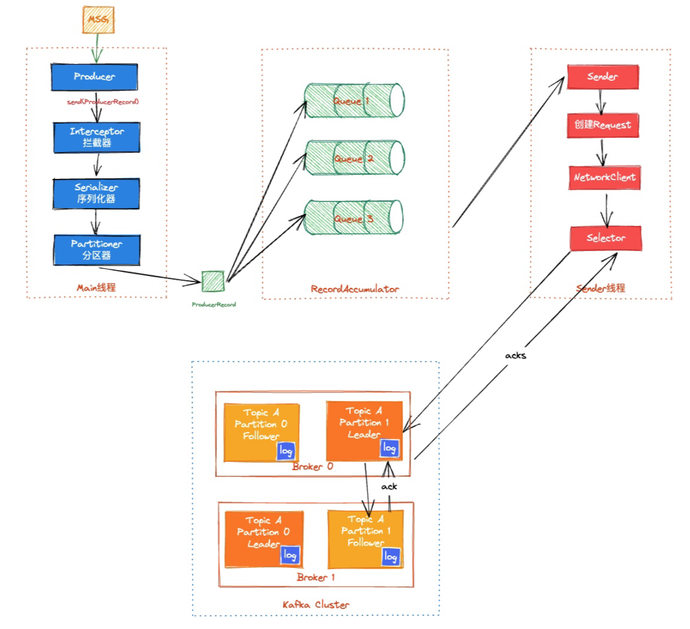

# 面试题-分布式消息队列

## Kafaka

#### 为什么要使用消息队列？

使用消息队列的主要目的主要记住这几个关键词：解耦、异步、削峰填谷

解耦：在一个复杂的系统中，不同的模块或服务之间可能需要相互依赖，如果直接使用函数调用或者 API 调用的方式，会造成模块之间的耦合，当其中一个模块发生改变时，需要同时修改调用方和被调用方的代码。而使用消息队列作为中间件，不同的模块可以将消息发送到消息队列中，不需要知道具体的接收方是谁，接收方可以独立地消费消息，实现了模块之间的解耦。

异步：有些操作比较耗时，例如发送邮件、生成报表等，如果使用同步的方式处理，会阻塞主线程或者进程，导致系统的性能下降。而使用消息队列，可以将这些操作封装成消息，放入消息队列中，异步地处理这些操作，不影响主流程的执行，提高了系统的性能和响应速度。

削峰填谷：削峰填谷是一种在高并发场景下平衡系统压力的技术，通常用于平衡系统在高峰期和低谷期的资源利用率，提高系统的吞吐量和响应速度。在削峰填谷的过程中，通常使用消息队列作为缓冲区，将请求放入消息队列中，然后在系统负载低的时候进行处理。这种方式可以将系统的峰值压力分散到较长的时间段内，减少瞬时压力对系统的影响，从而提高系统的稳定性和可靠性。

另外消息队列还有以下优点：

1. 可靠性高：消息队列通常具有高可靠性，可以实现消息的持久化存储、消息的备份和故障恢复等功能，保证消息不会丢失。
2. 扩展性好：通过增加消息队列实例或者添加消费者实例，可以实现消息队列的水平扩展，提高系统的处理能力。
3. 灵活性高：消息队列通常支持多种消息传递模式，如点对点模式和发布/订阅模式，可以根据不同的业务场景选择不同的模式。

#### Kafka、ActiveMQ、RabbitMQ 和 RocketMQ 都有哪些区别？

Kafka、ActiveMQ、RabbitMQ 和 RocketMQ 都是常见的消息中间件，它们都提供了高性能、高可用、可扩展的消息传递机制，但它们之间也有以下一些区别：

1. 消息传递模型：Kafka 主要支持发布-订阅模型，ActiveMQ、RabbitMQ和RocketMQ 则同时支持点对点和发布-订阅两种模型。
2. 性能和吞吐量：Kafka在数据处理和数据分发方面表现出色，可以处理每秒数百万条消息，而 ActiveMQ、RabbitMQ 和 RocketMQ 的吞吐量相对较低。
3. 消息分区和负载均衡：Kafka 将消息划分为多个分区，并分布在多个服务器上，实现负载均衡和高可用性。ActiveMQ、RabbitMQ 和 RocketMQ 也支持消息分区和负载均衡，但实现方式不同，例如 RabbitMQ 使用了一种叫做 Sharding 的机制。
4. 开发和部署复杂度：Kafka 相对比较简单，易于使用和部署，但在实现一些高级功能时需要进行一些复杂的配置。ActiveMQ、RabbitMQ 和 RocketMQ 则提供了更多的功能和选项，也更加灵活，但相应地会增加开发和部署的复杂度。
5. 社区和生态：Kafka、ActiveMQ、RabbitMQ 和 RocketMQ 都拥有庞大的社区和完善的生态系统，但 Kafka 和 RocketMQ 目前的发展势头比较迅猛，社区活跃度也相对较高。
6. 功能支持：

|          | 优先级队列 | 延迟队列                                              | 死信队列 | 重试队列                                                 | 消费模式                         | 事务消息                 |
| -------- | ---------- | ----------------------------------------------------- | -------- | -------------------------------------------------------- | -------------------------------- | ------------------------ |
| Kafka    | 不支持     | 不支持，可以间接实现延迟队列                          | 无       | 不直接支持，可以通过消费者逻辑来实现重试机制             | 主要是拉模式                     | 支持事务，但限于消息生产 |
| RocketMQ | 支持       | 直接支持延迟队列，可以设定消息的延迟时间              | 支持     | 支持重试队列，可以自动或手动将消息重新发送               | 支持推和拉两种模式               | 支持事务消息             |
| RabbitMQ | 支持       | 支持延迟队列，可以通过插件或者消息TTL和死信交换来实现 | 支持     | 可以实现重试机制，但需要通过消息属性和额外配置来手动设置 | 主要是推模式，但也可以实现拉模式 | 支持基本的消息事务       |
| ActiveMQ | 支持       | 支持                                                  | 支持     | 支持重试机制，可以配置消息重发策略                       | 支持推和拉两种模式               | 支持事务消息             |

总的来说，这些消息中间件都有自己的优缺点，选择哪一种取决于具体的业务需求和系统架构。

> 如何选型
>
> 在选择消息队列技术时，需要根据实际业务需求和系统特点来选择，以下是一些参考因素：
>
> 1. 性能和吞吐量：如果需要处理海量数据，需要高性能和高吞吐量，那么Kafka是一个不错的选择。
> 2. 可靠性：如果需要保证消息传递的可靠性，包括数据不丢失和消息不重复投递，那么 RocketMQ 和 RabbitMQ 都提供了较好的可靠性保证。
> 3. 消息传递模型：如果需要支持发布-订阅和点对点模型，那么 RocketMQ 和 RabbitMQ 是一个不错的选择。如果只需要发布-订阅模型，Kafka 则是一个更好的选择。
> 4. 消息持久化：如果需要更快地持久化消息，并且支持高效的消息查询，那么Kafka是一个不错的选择。如果需要更加传统的消息持久化方式，那么 RocketMQ 和 RabbitMQ 可以满足需求。
> 5. 开发和部署复杂度：Kafka 比较简单，易于使用和部署，但在实现一些高级功能时需要进行一些复杂的配置。RocketMQ 和 RabbitMQ 提供了更多的功能和选项，也更加灵活，但相应地会增加开发和部署的复杂度。
> 6. 社区和生态：Kafka、RocketMQ 和 RabbitMQ 都拥有庞大的社区和完善的生态系统，但Kafka和RocketMQ目前的发展势头比较迅猛，社区活跃度也相对较高。
> 7. 实现语言方面，kafk a是基于 scala 和 java 开发的，rocketmq、activemq 等都是基于 java 语言的，rabbitmq 是基于 erlang 的。
> 8. 功能性，上面列举过一些功能，我们在选型的时候需要看哪个可以满足我们的需求。
>
> 需要根据具体情况来选择最适合的消息队列技术。如果有多个因素需要考虑，可以进行性能测试和功能评估来辅助选择。

#### Kafka 为什么这么快？

kafka 是一个成熟的消息队列，一直以性能高著称，它之所以能够实现高吞吐量和低延迟，主要是由于以下几个方面的优化，我试着从发送端，存储端以及消费端分别介绍一下。

- **消息发送**

1、批量发送：Kafka 通过将多个消息打包成一个批次，减少了网络传输和磁盘写入的次数，从而提高了消息的吞吐量和传输效率。

2、异步发送：生产者可以异步发送消息，不必等待每个消息的确认，这大大提高了消息发送的效率。

3、消息压缩：支持对消息进行压缩，减少网络传输的数据量。

4、并行发送：通过将数据分布在不同的分区（Partitions）中，生产者可以并行发送消息，从而提高了吞吐量。

- **消息存储**

1、零拷贝技术：Kafka 使用零拷贝技术来避免了数据的拷贝操作，降低了内存和 CPU 的使用率，提高了系统的性能。

2、磁盘顺序写入：Kafka 把消息存储在磁盘上，且以顺序的方式写入数据。顺序写入比随机写入速度快很多，因为它减少了磁头寻道时间。避免了随机读写带来的性能损耗，提高了磁盘的使用效率。

3、页缓存：Kafka 将其数据存储在磁盘中，但在访问数据时，它会先将数据加载到操作系统的页缓存中，并在页缓存中保留一份副本，从而实现快速的数据访问。

4、稀疏索引：Kafka 存储消息是通过分段的日志文件，每个分段都有自己的索引文件。这些索引文件中的条目不是对分段中的每条消息都建立索引，而是每隔一定数量的消息建立一个索引点，这就构成了稀疏索引。稀疏索引减少了索引大小，使得加载到内存中的索引更小，提高了查找特定消息的效率。

5、分区和副本：Kafka 采用分区和副本的机制，可以将数据分散到多个节点上进行处理，从而实现了分布式的高可用性和负载均衡。

- **消息消费**

1、消费者群组：通过消费者群组可以实现消息的负载均衡和容错处理。

2、并行消费：不同的消费者可以独立地消费不同的分区，实现消费的并行处理。

3、批量拉取：Kafka 支持批量拉取消息，可以一次性拉取多个消息进行消费。减少网络消耗，提升性能。


| 生产消息 | 存储消息     | 消费消息   |
| -------- | ------------ | ---------- |
| 批量发送 | 磁盘顺序写入 | 消费者群组 |
| 异步发送 | 页缓存       | 批量拉取   |
| 消息压缩 | 稀疏索引     | 并行消费   |
| 并行发送 | 零拷贝       |            |
|          | 分区和副本   |            |

#### Kafka 的架构是怎么样的？

Kafka 的整体架构比较简单，是显式分布式架构，主要由 Producer（生产者）、broker（Kafka集群）和 consumer（消费者） 组成。

**生产者（Producer）：**生产者负责将消息发布到Kafka集群中的一个或多个主题(Topic)，每个Topic包含一个或多个分区（Partition）。

**主题：Topic：**主题是承载消息的逻辑容器，在实际使用中多用来区分具体的业务。
分区：Partition。一个有序不变的消息序列。每个主题下可以有多个分区。

**消费者（Consumer）：**消费者负责从Kafka集群中的一个或多个主题消费消息，并将消费的偏移量（Offset）提交回Kafka以保证消息的顺序性和一致性。

**偏移量：**Offset。表示分区中每条消息的位置信息，是一个单调递增且不变的值。

**Kafka集群：**Kafka集群是由多个Kafka节点（Broker）组成的分布式系统。每个节点都可以存储一个或多个主题的分区副本，以提供高可用性和容错能力。

> **Leader Broker：**Leader Broker 是分区的主副本，它是负责处理消息读写请求的节点。生产者将消息发送到 Leader Broker，消费者从 Leader Broker 中拉取消息。
>
> **Follower Broker：**Follower Broker 是 Leader Broker 的备份节点，它负责与 Leader Broker 进行数据同步，以保持自己的数据与 Leader Broker 保持一致。
>
> 
>
> 在集群中，每个分区都有一个 Leader Broker 和多个 Follower Broker，只有 Leader Broker 才能处理生产者和消费者的请求，而 Follower Broker 只是 Leader Broker 的备份，用于提供数据的冗余备份和容错能力。如果 Leader Broker 发生故障，Kafka 集群会自动将 Follower Broker 提升为新的 Leader Broker，从而实现高可用性和容错能力。


**ZooKeeper：**ZooKeeper 是 Kafka 集群中使用的分布式协调服务，用于维护 Kafka 集群的状态和元数据信息，例如主题和分区的分配信息、消费者组和消费者偏移量等。

#### Kafka 如何保证消息不丢失？

Kafka 作为一个消息中间件，他需要结合消息生产者和消费者一起才能工作，一次消息发送包含以下是三个过程：

1）Producer 端发送消息给 Kafka Broker 。
2）Kafka Broker 将消息进行同步并持久化数据。
3）Consumer 端从Kafka Broker 将消息拉取并进行消费。

Kafka 只对已提交的消息做最大限度的持久化保证不丢失，但是没办法保证 100%。

但是，Kafka 还是提供了很多机制来保证消息不丢失的。要想知道 Kafka 如何保证消息不丢失，需要从生产者、消费者以及 kafka 集群三个方面来分析。

- **Producer**

消息的生产者端，最怕的就是消息发送给 Kafka 集群的过程中失败，所以，我们需要有机制来确保消息能够发送成功，但是，因为存在网络问题，所以基本没有什么办法可以保证一次消息一定能成功。

所以，就需要有一个确认机制来告诉生产者这个消息是否有发送成功，如果没成功，需要重新发送直到成功。

我们通常使用Kafka发送消息的时候，通常使用的 `producer.send(msg)` 其实是一种异步发送，发送消息的时候，方法会立即返回，但是并不代表消息一定能发送成功。（`producer.send(msg).get()`  是同步等待返回的。）

那么，为了保证消息不丢失，通常会建议使用 `producer.send(msg, callback)` 方法，这个方法支持传入一个 callback，我们可以在消息发送时进行重试。

同时，我们也可以通过给 `producer` 设置一些参数来提升发送成功率：

```properties
# 表示 Leader 和 Follower 都接收成功时确认；可以最大限度保证消息不丢失，但是吞吐量低。
acks=-1

# 生产端的重试次数
retries=3

# 消息发送超时或失败后，间隔的重试时间
retry.backoff.ms = 300
```

> acks = 0: 表示 Producer 请求立即返回，不需要等待 Leader 的任何确认。这种方案有最高的吞吐率，但是不保证消息是否真的发送成功。
> acks = -1: 表示分区 Leader 必须等待消息被成功写入到所有的 ISR 副本(同步副本)中才认为 Producer 请求成功。这种方案提供最高的消息持久性保证，但是理论上吞吐率也是最差的。
> acks = 1: 表示 Leader 副本必须应答此 Producer 请求并写入消息到本地日志，之后 Producer 请求被认为成功。如果此时 Leader 副本应答请求之后挂掉了，消息会丢失。这个方案，提供了不错的持久性保证和吞吐。

- **Broker**

Kafka的集群有一些机制来保证消息的不丢失，比如复制机制、持久化存储机制以及ISR机制。

- 持久化存储：Kafka 使用持久化存储来存储消息。这意味着消息在写入 Kafka 时将被写入磁盘，这种方式可以防止消息因为节点宕机而丢失。
- ISR 复制机制：Kafka 使用 ISR 机制来确保消息不会丢失，Kafka 使用复制机制来保证数据的可靠性。每个分区都有多个副本，副本可以分布在不同的节点上。当一个节点宕机时，其他节点上的副本仍然可以提供服务，保证消息不丢失。

在服务端，也有一些参数配置可以调节来避免消息丢失：

```properties
# 表示分区副本的个数，replication.factor >1 当leader 副本挂了，follower副本会被选举为leader继续提供服务。
replication.factor

# 表示 ISR 最少的副本数量，通常设置 min.insync.replicas >1，这样才有可用的follower副本执行替换，保证消息不丢失
min.insync.replicas

# 是否可以把非 ISR 集合中的副本选举为 leader 副本。
unclean.leader.election.enable = false
```

- **Consumer**

作为 Kafka 的消费者端，只需要确保投递过来的消息能正常消费，并且不会胡乱的提交偏移量就行了。

Kafka 消费者会跟踪每个分区的偏移量，消费者每次消费消息时，都会将偏移量向后移动。当消费者宕机或者不可用时，Kafka 会将该消费者所消费的分区的偏移量保存下来，下次该消费者重新启动时，可以从上一次的偏移量开始消费消息。

另外，Kafka 消费者还可以组成消费者组，每个消费者组可以同时消费多个分区。当一个消费者组中的消费者宕机或者不可用时，其他消费者仍然可以消费该组的分区，保证消息不丢失。

为了保证消息不丢失，建议使用手动提交偏移量的方式，避免拉取了消息以后，业务逻辑没处理完，提交偏移量后但是消费者挂了的问题：

```properties
enable.auto.commit=false
```

#### Kafka 怎么保证消费只消费一次的?

Kafka 消息只消费一次，这个需要从多方面回答，既包含 Kafka 自身的机制，也需要考虑客户端自己的重复处理。

可以从以下几个方面回答：

首先，在 Kafka 中，每个消费者都必须加入至少一个**消费者组**。同一个消费者组内的消费者可以共享消费者的负载。因此，如果一个消息被消费组中的任何一个消费者消费了，那么其他消费者就不会再收到这个消息了。

另外，消费者可以通过**手动提交消费位移**来控制消息的消费情况。通过手动提交位移，消费者可以跟踪自己已经消费的消息，确保不会重复消费同一消息。

还有就是客户端自己可以做一些**幂等机制**，防止消息的重复消费。

另外可以借助 Kafka 的 **Exactly-once 消费语义**，其实就是引入了事务，消费者使用事务来保证消息的消费和位移提交是原子的，而生产者可以使用事务来保证消息的生产和位移提交是原子的。Exactly-once 消费语义则解决了重复问题，但需要更复杂的设置和配置。

- **Kafka 的三种消息传递语义**

在 Kafka 中，有三种常见的消息传递语义：At-least-once、At-most-once 和 Exactly-once。其中 At-least-once 和 Exactly-once 是最常用的。

- **At-least-once 消费语义**

**At-least-once 消费语义意味着消费者至少消费一次消息，但可能会重复消费同一消息**。在 At-least-once 语义中，当消费者从Kafka服务器读取消息时，消息的偏移量会被记录下来。一旦消息被成功处理，消费者会将位移提交回 Kafka 服务器。如果消息处理失败，消费者不会提交位移。这意味着该消息将在下一次重试时再次被消费。

**At-least-once 语义通常用于实时数据处理或消费者不能容忍数据丢失的场景，例如金融交易或电信信令。**

- **Exactly-once 消费语义**

Exactly-once 消费语义意味着每个消息仅被消费一次，且不会被重复消费。在 Exactly-once 语义中，Kafka 保证消息只被处理一次，同时保持消息的顺序性。为了实现 Exactly-once 语义，Kafka 引入了一个新的概念：事务。

事务是一系列的读写操作，这些操作要么全部成功，要么全部失败。在 Kafka 中，生产者和消费者都可以使用事务，以保证消息的 Exactly-once 语义。具体来说，消费者可以使用事务来保证消息的消费和位移提交是原子的，而生产者可以使用事务来保证消息的生产和位移提交是原子的。

在 Kafka 0.11 版本之前，实现 Exactly-once 语义需要一些特殊的配置和设置。但是，在 Kafka 0.11 版本之后，Kafka 提供了原生的 Exactly-once 支持，使得实现 Exactly-once 变得更加简单和可靠。

总之，At-least-once 消费语义保证了数据的可靠性，但可能会导致数据重复。而 Exactly-once 消费语义则解决了重复问题，但需要更复杂的设置和配置。选择哪种消费语义取决于业务需求和数据可靠性要求。

#### 什么是 Kafka 的重平衡机制？

Kafka 的重平衡机制是指在消费者组中新增或删除消费者时，Kafka 集群会重新分配主题分区给各个消费者，以保证每个消费者消费的分区数量尽可能均衡。

重平衡机制的目的是实现消费者的负载均衡和高可用性，以确保每个消费者都能够按照预期的方式消费到消息。


**重平衡的 3 个触发条件：**

- 消费者组成员数量发生变化。
- 订阅主题数量发生变化。
- 订阅主题的分区数发生变化。

当 Kafka 集群要触发重平衡机制时，大致的步骤如下：

1. **暂停消费：**在重平衡开始之前，Kafka 会暂停所有消费者的拉取操作，以确保不会出现重平衡期间的消息丢失或重复消费。
2. **计算分区分配方案：**Kafka 集群会根据当前消费者组的消费者数量和主题分区数量，计算出每个消费者应该分配的分区列表，以实现分区的负载均衡。
3. **通知消费者：**一旦分区分配方案确定，Kafka 集群会将分配方案发送给每个消费者，告诉它们需要消费的分区列表，并请求它们重新加入消费者组。
4. **重新分配分区：**在消费者重新加入消费者组后，Kafka 集群会将分区分配方案应用到实际的分区分配中，重新分配主题分区给各个消费者。
5. **恢复消费：**最后，Kafka 会恢复所有消费者的拉取操作，允许它们消费分配给自己的分区。

Kafka 的重平衡机制能够有效地实现消费者的负载均衡和高可用性，提高消息的处理能力和可靠性。但是，由于重平衡会带来一定的性能开销和不确定性，因此在设计应用时需要考虑到重平衡的影响，并采取一些措施来降低重平衡的频率和影响。

**在重平衡过程中，所有 Consumer 实例都会停止消费，等待重平衡完成。但是目前并没有什么好的办法来解决重平衡带来的 STW，只能尽量避免它的发生。**

#### 消费者的五种状态

| 状态                | 描述                                                         |
| ------------------- | ------------------------------------------------------------ |
| Empty               | 组内没有任何成员，但是消费者可能存在已提交的位移数据，而且这些位移尚未过期 |
| Dead                | 同样是组内没有任何成员，但是组的元数据信息已经被协调者端移除，协调者保存着当前向他注册过的所有组信息 |
| PreparingRebalance  | 消费者组准备开启重平衡，此时所有成员都需要重新加入消费者组   |
| CompletingRebalance | 消费者组下所有成员已经加入，各个成员中等待分配方案           |
| Stable              | 消费者组的稳定状态，该状态表明重平衡已经完成，组内成员能够正常消费数据 |

状态的流转过程：


#### Kafka 如何实现顺序消费？

Kafka 的消息是存储在指定的 topic 中的某个 partition 中的。并且一个 topic 是可以有多个 partition 的。同一个 partition 中的消息是有序的，但是跨 partition，或者跨topic的消息就是无序的了。

**为什么同一个 partition 的消息是有序的？**

因为当生产者向某个 partition 发送消息时，消息会被追加到该 partition 的日志文件（log）中，并且被分配一个唯一的 offset，文件的读写是有顺序的。而消费者在从该分区消费消息时，会从该分区的最早 offset 开始逐个读取消息，保证了消息的顺序性。

**基于此，想要实现消息的顺序消费，可以有以下几个办法：**

1、在一个 topic 中，只创建一个 partition，这样这个 topic 下的消息都会按照顺序保存在同一个 partition 中，这就保证了消息的顺序消费。

2、发送消息的时候指定 partition，如果一个 topic 下有多个 partition，那么我们可以把需要保证顺序的消息都发送到同一个 partition 中，这样也能做到顺序消费。

#### 如何把消息发送到同一个 partition

当我们发送消息的时候，如果 key 为 null，那么 Kafka 默认采用 Round-robin 策略，也就是轮转，实现类是 DefaultPartitioner。那么如果想要指定他发送到某个 partition 的话，有以下三个方式：

- **指定 partition**

我们可以在发送消息的时候，可以直接在 ProducerRecord 中指定 partition

```java
import org.apache.kafka.clients.producer.Producer;
import org.apache.kafka.clients.producer.ProducerRecord;

import java.util.Properties;

public class KafkaProducerExample {
    public static void main(String[] args) {
        
        // 创建Kafka生产者
        Producer<String, String> producer = new KafkaProducer<>(getProperties());

        String topic = "ping_topic"; // 指定要发送消息的主题
        String message = "Hello World!"; // 要发送的消息内容
        int partition = 0; // 要发送消息的分区

        // 创建包含分区信息的ProducerRecord
        ProducerRecord<String, String> record = new ProducerRecord<>(topic, partition, null, message);

        // 发送消息
        producer.send(record);

        // 关闭Kafka生产者
        producer.close();
    }
}
```

- **指定 key**

在没有指定 Partition(null 值) 时, 如果有 Key, Kafka 将依据 Key 做 hash 来计算出一个 Partition 编号来。如果key相同，那么也能分到同一个 partition 中：

```java
import org.apache.kafka.clients.producer.Producer;
import org.apache.kafka.clients.producer.ProducerRecord;

import java.util.Properties;

public class KafkaProducerExample {
    public static void main(String[] args) {
        
        // 创建Kafka生产者
        Producer<String, String> producer = new KafkaProducer<>(getProperties());

        String topic = "ping_topic"; // 指定要发送消息的主题
        String message = "Hello World!"; // 要发送的消息内容
        String key = "Ping_key"; // 要发送消息的key

       // 创建ProducerRecord，指定主题、键和消息内容
        ProducerRecord<String, String> record = new ProducerRecord<>(topic, null, key, message);

        // 发送消息
        producer.send(record);

        // 关闭Kafka生产者
        producer.close();
    }
}
```

- **自定义 Partitioner**

除了以上两种方式，我们还可以实现自己的分区器（Partitioner）来指定消息发送到特定的分区。

我们需要创建一个类实现 Partitioner 接口，并且重写 `partition()` 方法。

```java
import org.apache.kafka.clients.producer.Partitioner;
import org.apache.kafka.common.Cluster;
import org.apache.kafka.common.PartitionInfo;
import org.apache.kafka.common.record.InvalidRecordException;
import org.apache.kafka.common.utils.Utils;

import java.util.List;
import java.util.Map;

public class CustomPartitioner implements Partitioner {

    @Override
    public void configure(Map<String, ?> configs) {
        // 可以在这里处理和获取分区器的配置参数
    }

    @Override
    public int partition(String topic, Object key, byte[] keyBytes, Object value, byte[] valueBytes, Cluster cluster) {
        List<PartitionInfo> partitions = cluster.partitionsForTopic(topic);
        int numPartitions = partitions.size();

        if (keyBytes == null || !(key instanceof String)) {
            throw new InvalidRecordException("键不能为空且必须是字符串类型");
        }

        // 根据自定义的逻辑，确定消息应该发送到哪个分区
        String keyValue = (String) key;
        int partition = Math.abs(keyValue.hashCode()) % numPartitions;

        // 返回分区编号
        return partition;
    }

    @Override
    public void close() {
        // 可以在这里进行一些清理操作
    }
}
```

在 `partition()` 方法中，我们使用了一个简单的逻辑，根据键的哈希值将消息发送到相应的分区。为了在 Kafka 生产者中使用自定义的分区器，你需要在生产者的配置中指定分区器类：

```java
import org.apache.kafka.clients.producer.Producer;
import org.apache.kafka.clients.producer.ProducerRecord;

import java.util.Properties;

public class KafkaProducerExample {
    public static void main(String[] args) {
        // 设置Kafka生产者的配置属性
        Properties props = new Properties();
        props.put("bootstrap.servers", "localhost:9092");
        props.put("key.serializer", "org.apache.kafka.common.serialization.StringSerializer");
        props.put("value.serializer", "org.apache.kafka.common.serialization.StringSerializer");
        props.put("partitioner.class", "com.ping.CustomPartitioner"); // 指定自定义分区器类

        // 创建Kafka生产者
        Producer<String, String> producer = new org.apache.kafka.clients.producer.KafkaProducer<>(props);

        String topic = "ping_topic"; // 指定要发送消息的主题
        String message = "Hello World!"; // 要发送的消息内容
        String key = "Ping_key"; // 要发送消息的key

        // 创建ProducerRecord，指定主题、键和消息内容
        ProducerRecord<String, String> record = new ProducerRecord<>(topic, key, message);

        // 发送消息
        producer.send(record);

        // 关闭Kafka生产者
        producer.close();
    }
}
```

#### Kafka 几种选举过程简单介绍一下？

Kafka 中常见的选举过程有以下几种：

- **Partition Leader 选举**

Kafka 中的每个 Partition 都有一个 Leader，负责处理该 Partition 的读写请求。在正常情况下，Leader 和 ISR 集合中的所有副本保持同步，Leader 接收到的消息也会被 ISR 集合中的副本所接收。当 leader 副本宕机或者无法正常工作时，需要选举新的 leader 副本来接管分区的工作。

Leader 选举的过程如下：

1. 每个参与选举的副本会尝试向 ZooKeeper 上写入一个临时节点，表示它们正在参与 Leader 选举；
2. 所有写入成功的副本会在 ZooKeeper 上创建一个序列号节点，并将自己的节点序列号写入该节点；
3. 节点序列号最小的副本会被选为新的 Leader，并将自己的节点名称写入 ZooKeeper 上的 `/broker/.../leader` 节点中。

- **Controller 选举**

Kafka 集群中只能有一个 Controller 节点，用于管理分区的副本分配、leader 选举等任务。当当前 Controller 节点宕机时，需要进行 Controller 的重新选举。Kafka 使用 ZooKeeper 来进行 Controller 的选举。

Controller选举的过程如下：

1. 所有可用的 Broker 向 ZooKeeper 尝试创建 `/controller` 临时节点。谁创建成功了，谁就当选 Controller
2. 集群上的所有 Broker 对这个临时节点添加监听器。
3. 当 Controller 节点出现故障时，ZooKeeper 会删除 `/controller` 节点，这时所有的 Broker 都会监听到该事件，并开始争夺 Controller 的位置。
4. 继续尝试创建临时节点，谁创建成功了，谁当选 Contorller。

#### 为什么 Kafka 没办法 100% 保证消息不丢失？

Kafka 提供的 Producer 和 Consumer 之间的消息传递保证语义有三种，所谓消息传递语义，其实就是 Kafka 的消息交付可靠保障，主要有以下三种：

- At most once —消息可能会丢，但绝不会重复传递；
- At least once —消息绝不会丢，但可能会重复传递；
- Exactly once —每条消息只会被精确地传递一次：既不会多，也不会少；

目前，Kafka 默认提供的交付可靠性保障是第二种，即 At least once ，但是，其实依靠 Kafka 自身，是没有办法 100% 保证可靠性的。

上面的文档中，介绍了 Kafka 在保证消息的可靠性中做的一些努力，但是我们提到，**Kafka 只对已提交的消息做最大限度的持久化保证不丢失，但是没办法保证 100%**。

那么，整体分析下为什么吧。

> 生产者

Kafka 允许生产者以异步方式发送消息，这意味着生产者在发送消息后不会等待确认。当然，我们可以注册一个回调等待消息的成功回调。

但是，如果生产者在发送消息之后，Kafka的集群发生故障或崩溃，而消息尚未被完全写入 Kafka 的日志中，那么这些消息可能会丢失。虽然后续有可能会重试，但是，如果重试也失败了呢？如果这个过程中刚好生产者也崩溃了呢？那就可能会导致没有人知道这个消息失败了，就导致不会重试了。

> 消费者

消费者来说比较简单，只要保证在消息成功时，才提交偏移量就行了，这样就不会导致消息丢失了。

> Broker

Kafka 使用日志来做消息的持久化的，日志文件是存储在磁盘之上的，但是如果 Broker 在消息尚未完全写入日志之前崩溃，那么这些消息可能会丢失了。

而且，操作系统在写磁盘之前，会先把数据写入 Page Cache 中，然后再由操作系统中自己决定什么时候同步到磁盘当中，而在这个过程中，如果还没来得及同步到磁盘中，就直接宕机了，那这个消息也就丢了。

当然，也可以通过配置 `log.flush.interval.messages=1`，来实现类似于同步刷盘的功能，但是又回到了前面说的情况，还没来得及做持久化，就宕机了。

即使Kafka中引入了副本机制来提升消息的可靠性，但是如果发生同步延迟，还没来及的同步，主副本就挂掉了，那么消息就可能会发生丢失。

这几种情况，**只从Broker的角度分析，Broker自身是没办法保证消息不丢失的**，但是如果配合 Producer，再配合 `request.required.acks = -1` 这种 ACK 策略，可以确保消息持久化成功之后，才会 ACK 给 Producer，那么， 如果我们的 Producer 在一定时间段内，没有收到 ACK，是可以重新发送的。

但是，这种重新发送，就又回到了我们前面介绍生产者的时候的问题，生产者也有可能挂，重新发送也有可能会没有发送依据，导致消息最终丢失。

**所以，我们说，只靠 Kafka 自己，其实是没有办法保证极端情况下的消息 100% 不丢失的。**

**但是，我们也可以在做一些机制来保证，比如引入分布式事务，或者引入本地消息表等，保证在 Kafka Broker 没有保存消息成功时，可以重新投递消息。这样才行。**


#### Kafka 消息的发送过程简单介绍一下？

当我们使用Kafka发送消息时，一般有两种方式，分别是同步发送（`producer.send(msg).get()` ）及异步发送（`producer.send(msg, callback)`）。

同步发送的时候，可以在发送消息后，通过 get 方法等待消息结果：`producer.send(record).get()`; ，这种情况能够准确的拿到消息最终的发送结果，要么是成功，要么是失败。

而异步发送，是采用了callback 的方式进行回调的，可以大大的提升消息的吞吐量，也可以根据回调来判断消息是否发送成功。

不管是同步发送还是异步发送，最终都需要在 Producer 端把消息发送到 Broker 中，那么这个过程大致如下：



Kafka 的 Producer 在发送消息时通常涉及两个线程，**主线程（Main）和发送线程（Sender）和一个消息累加器（RecordAccumulator）**

**Main 线程**是 Producer 的入口，负责初始化 Producer 的配置、创建 KafkaProducer 实例并执行发送逻辑。它会按照用户定义的发送方式（同步或异步）发送消息，然后等待消息发送完成。

一条消息的发送，在调用 send 方法后，会经过**拦截器、序列化器及分区器**。

- 拦截器主要用于在消息发送之前和之后对消息进行定制化的处理，如对消息进行修改、记录日志、统计信息等。
- 序列化器负责将消息的键和值对象转换为字节数组，以便在网络上传输。
- 分区器决定了一条消息被发送到哪个 Partition 中。它根据消息的键（如果有）或者特定的分区策略，选择出一个目标 Partition。

**RecordAccumulator** 在 Kafka Producer 中起到了消息积累和批量发送的作用，当 Producer 发送消息时，不会立即将每条消息发送到 Broker，而是将消息添加到 RecordAccumulator 维护的内部缓冲区中，RecordAccumulator 会根据配置的条件（如 batch.size、linger.ms）对待发送的消息进行批量处理。

当满足指定条件时，RecordAccumulator 将缓冲区中的消息组织成一个批次（batch），然后一次性发送给 Broker。如果发送失败或发生错误，RecordAccumulator 可以将消息重新分配到新的批次中进行重试。这样可以确保消息不会丢失，同时提高消息的可靠性。

**Send 线程**是负责实际的消息发送和处理的。发送线程会定期从待发送队列中取出消息，并将其发送到对应的 Partition 的 Leader Broker 上。它主要负责网络通信操作，并处理发送请求的结果，包括确认的接收、错误处理等。

**NetworkClient 和 Selector** 是两个重要的组件，分别负责网络通信和 I/O 多路复用。

发送线程会把消息发送到Kafka集群中对应的 Partition 的 Partition Leader，Partition Leader 接收到消息后，会对消息进行一系列的处理。它会将消息写入本地的日志文件（Log）

为了保证数据的可靠性和高可用性，Kafka 使用了消息复制机制。Leader Broker 接收到消息后，会将消息复制到其他副本（Partition Follower）。副本是通过网络复制数据的，它们会定期从 Leader Broker 同步消息。

每一个 Partition Follower在写入本地 log 之后，会向 Leader 发送一个 ACK。

但是我们的 Producer 其实也是需要依赖 ACK 才能知道消息有没有投递成功的，而这个 ACK 是何时发送的，Producer 又要不要关心呢？这就涉及到了 kafka 的 ack 机制，生产者会根据设置的 request.required.acks 参数不同，选择等待或或直接发送下一条消息：

- `request.required.acks = 0` 
  - 表示 Producer 不等待来自 Leader 的 ACK 确认，直接发送下一条消息。在这种情况下，如果 Leader 分片所在服务器发生宕机，那么这些已经发送的数据会丢失。
- `request.required.acks = 1` 
  - 表示 Producer 等待来自 Leader 的 ACK 确认，当收到确认后才发送下一条消息。在这种情况下，消息一定会被写入到 Leader 服务器，但并不保证 Follow 节点已经同步完成。所以如果在消息已经被写入 Leader 分片，但是还未同步到 Follower 节点，此时 Leader 分片所在服务器宕机了，那么这条消息也就丢失了，无法被消费到。
-  `request.required.acks = -1` 
  - Leader 会把消息复制到集群中的所有 ISR（In-Sync Replicas，同步副本），要等待所有 ISR 的 ACK 确认后，再向 Producer 发送 ACK 消息，然后 Producer 再继续发下一条消息。

#### Kafka 高水位了解过吗？为什么 Kafka 需要 Leader Epoch？

高水位（HW，High Watermark）是Kafka中的一个重要的概念，主要是用于管理消费者的进度和保证数据的可靠性的。

高水位标识了一个特定的消息偏移量（offset），即一个分区中已提交消息的最高偏移量（offset），消费者只能拉取到这个 offset 之前的消息。消费者可以通过跟踪高水位来确定自己消费的位置。

> 这里的已提交指的是 ISRs 中的所有副本都记录了这条消息

在 Kafka 中，HW 主要有两个作用：

- 消费进度管理：消费者可以通过记录上一次消费的偏移量，然后将其与分区的高水位进行比较，来确定自己的消费进度。消费者可以在和高水位对比之后继续消费新的消息，确保不会错过任何已提交的消息。这样，消费者可以按照自己的节奏进行消费，不受其他消费者的影响。
- 数据的可靠性：高水位还用于确保数据的可靠性。在Kafka中，只有消息被写入主副本（Leader Replica）并被所有的同步副本（In-Sync Replicas，ISR）确认后，才被认为是已提交的消息。高水位表示已经被提交的消息的边界。只有高水位之前的消息才能被认为是已经被确认的，其他的消息可能会因为副本故障或其他原因而丢失。

还有一个概念，叫做 LEO，即 Log End Offset，他是日志最后消息的偏移量。 它标识当前日志文件中下一条待写入消息的 offset。


当消费者消费消息时，它可以使用高水位作为参考点，只消费高水位之前的消息，以确保消费的是已经被确认的消息，从而保证数据的可靠性。如上图，只消费 offet 为 6 之前的消息。


我们都知道，在 Kafka 中，每个分区都有一个 Leader 副本和多个 Follower 副本。

当 Leader 副本发生故障时，Kafka 会选择一个新的 Leader 副本。这个切换过程中，需要保证数据的一致性，即新的 Leader 副本必须具有和旧Leader副本一样的消息顺序。

为了实现这个目标，Kafka 引入了 Leader Epoch 的概念。Leader Epoch 是一个递增的整数，每次副本切换时都会增加。它用于标识每个Leader副本的任期。

每个副本都会维护自己的 Leader Epoch 记录。它记录了副本所属的分区在不同 Leader 副本之间切换时的任期。

在副本切换过程中，新的 Leader 会检查旧 Leader 副本的 Leader Epoch 和高水位。只有当旧 Leader 副本的 Leader Epoch 小于等于新 Leader 副本的 Leader Epoch，并且旧 Leader 副本的高水位小于等于新 Leader 副本的高水位时，新 Leader 副本才会接受旧 Leader 副本的数据。

通过使用 Leader Epoch 和高水位的验证，Kafka 可以避免新的 Leader 副本接受旧 Leader 副本之后的消息，从而避免数据回滚。只有那些在旧 Leader 副本的 Leader Epoch 和高水位之前的消息才会被新 Leader 副本接受。

- **Leader Epoch 的过程**

每个分区都有一个初始的 Leader Epoch，通常为0。

当Leader副本发生故障或需要进行切换时，Kafka 会触发副本切换过程。

副本切换过程中，Kafka 会从 ISR（In-Sync Replicas，同步副本）中选择一个新的 Follower 副本作为新的 Leader 副本。

新的 Leader 副本会增加自己的 Leader Epoch，使其大于之前的 Leader Epoch。这表示进入了一个新的任期。

新的 Leader 副本会验证旧 Leader 副本的状态以确保数据的一致性。它会检查旧 Leader 副本的 Leader Epoch 和高水位。

如果旧 Leader 副本的 Leader Epoch 小于等于新 Leader 副本的 Leader Epoch，并且旧 Leader 副本的高水位小于等于新 Leader 副本的高水位，则验证通过。

一旦验证通过，新的 Leader 副本会开始从 ISR 中的一部分副本复制数据，以确保新 Leader 上的数据与旧 Leader 一致。

一旦新的 Leader 副本复制了旧 Leader 副本的所有数据，并达到了与旧 Leader 副本相同的高水位，副本切换过程就完成了。

#### Kafka 为什么有 Topic 还要用 Partition?

Topic 和 Partition 是 kafka 中比较重要的概念。

> 主题：Topic 是 Kafka 中承载消息的逻辑容器。可以理解为一个消息队列。生产者将消息发送到特定的 Topic，消费者从 Topic 中读取消息。Topic 可以被认为是逻辑上的消息流。在实际使用中多用来区分具体的业务。
> 分区：Partition。是Topic的物理分区。一个 Topic 可以被分成多个 Partition，每个 Partition 是一个有序且持久化存储的日志文件。每个 Partition 都存储了一部分消息，并且有一个唯一的标识符（称为 Partition ID）。

看上去，这两个都是存储消息的载体，那为啥要分两层呢，有了 Topic 还需要 Partition 干什么呢？

在软件领域中，任何问题都可以加一个中间层来解决，而这，就是类似的思想，在 Topic 的基础上，再细粒度的划分出了一层，主要能带来以下几个好处：

1. 提升吞吐量：通过将一个 Topic 分成多个 Partition，可以实现消息的并行处理。每个 Partition 可以由不同的消费者组进行独立消费，这样就可以提高整个系统的吞吐量
2. 负载均衡：Partition 的数量通常比消费者组的数量多，这样可以使每个消费者组中的消费者均匀地消费消息。当有新的消费者加入或离开消费者组时，可以通过重新分配 Partition 的方式进行负载均衡。
3. 扩展性：通过增加 Partition 的数量，可以实现 Kafka 集群的扩展性。更多的 Partition 可以提供更高的并发处理能力和更大的存储容量。

综上，Topic 是逻辑上的消息分类，而 Partition 是物理上的消息分区。通过将 Topic 分成多个 Partition，可以实现提升吞吐量、负载均衡、以及增加可扩展性。

#### 介绍一下 Kafka 的 ISR 机制？

ISR，是 `In-Sync Replicas`，同步副本的意思。

在 Kafka 中，每个主题分区可以有多个副本(replica)。。ISR 是与主副本（Leader Replica）保持同步的副本集合。ISR 机制就是用于确保数据的可靠性和一致性的。

当消息被写入 Kafka 的分区时，它首先会被写入 Leader，然后 Leader 将消息复制给 ISR 中的所有副本。只有当 ISR 中的所有副本都成功地接收到并确认了消息后，主副本才会认为消息已成功提交。这种机制确保了数据的可靠性和一致性。

**ISR 列表维护**

在 Kafka 中，ISR（In-Sync Replicas）列表的维护是通过副本状态和配置参数来进行的。具体的 ISR 列表维护机制在不同的 Kafka 版本中有所变化。

- **before 0.9.x**

在 0.9.x 之前的版本，Kafka 有一个核心的参数：`replica.lag.max.messages`，表示如果 Follower 落后 Leader 的消息数量超过了这个参数值，就认为 Follower 就会从 ISR 列表里移除。

但是，基于 `replica.lag.max.messages` 这种实现，在瞬间高并发访问的情况下会有问题：比如 Leader 瞬间接收到几万条消息，然后所有 Follower 还没来得及同步过去，此时所有 follower 都会被踢出 ISR 列表。

- **after 0.9.x**

Kafka 从 0.9.x 版本开始，引入了 `replica.lag.max.ms` 参数，表示如果某个 Follower 的 LEO（latest end offset）一直落后 Leader 超过了 10 秒，那么才会被从 ISR 列表里移除。

这样的话，即使出现瞬间流量，导致 Follower 落后很多数据，但是只要在限定的时间内尽快追上来就行了。

## RocketMQ

#### RocketMQ 的架构是怎么样的？

RocketMQ 主要由 Producer、Broker 和 Consumer 三部分组成，如下图所示：


1. Producer：消息生产者，负责将消息发送到 Broker。
2. Broker：消息中转服务器，负责存储和转发消息。RocketMQ 支持多个 Broker 构成集群，每个 Broker 都拥有独立的存储空间和消息队列。
3. Consumer：消息消费者，负责从 Broker 消费消息。
4. NameServer：名称服务，负责维护 Broker 的元数据信息，包括Broker 地址、Topic 和 Queue 等信息。Producer 和 Consumer 在启动时需要连接到 NameServer 获取 Broker 的地址信息。
5. Topic：消息主题，是消息的逻辑分类单位。Producer 将消息发送到特定的 Topic 中，Consumer 从指定的 Topic 中消费消息。
6. Message Queue：消息队列，是 Topic 的物理实现。一个 Topic 可以有多个 Queue，每个 Queue 都是独立的存储单元。Producer 发送的消息会被存储到对应的 Queue 中，Consumer 从指定的 Queue 中消费消息。

#### RocketMQ 的事务消息是如何实现的？

RocketMQ 的事务消息是通过 TransactionListener 接口来实现的。

在发送事务消息时，首先向 RocketMQ Broker 发送一条“half消息”（即半消息），半消息将被存储在Broker端的事务消息日志中，但是这个消息还不能被消费者消费。

接下来，在半消息发送成功后，应用程序通过执行本地事务来确定是否要提交该事务消息。

如果本地事务执行成功，就会通知 RocketMQ Broker 提交该事务消息，使得该消息可以被消费者消费；否则，就会通知 RocketMQ Broker 回滚该事务消息，该消息将被删除，从而保证消息不会被消费者消费。


拆解下来的话，主要有以下4个步骤：

1. 发送半消息：应用程序向 RocketMQ Broker 发送一条半消息，该消息在Broker端的事务消息日志中被标记为“prepared”状态。
2. 执行本地事务：RocketMQ 会通知应用程序执行本地事务。如果本地事务执行成功，应用程序通知 RocketMQ Broker 提交该事务消息。
3. 提交事务消息：RocketMQ 收到提交消息以后，会将该消息的状态从“prepared”改为“committed”，并使该消息可以被消费者消费。
4. 回滚事务消息：如果本地事务执行失败，应用程序通知 RocketMQ Broker 回滚该事务消息，RocketMQ 将该消息的状态从“prepared”改为“rollback”，并将该消息从事务消息日志中删除，从而保证该消息不会被消费者消费。

- **如果一直没收到 COMMIT 或者 ROLLBACK 怎么办？**

在 RocketMQ 的事务消息中，如果半消息发送成功后，RocketMQ Broker 在规定时间内没有收到 COMMIT 或者 ROLLBACK 消息。

RocketMQ 会向应用程序发送一条检查请求，应用程序可以通过回调方法返回是否要提交或回滚该事务消息。如果应用程序在规定时间内未能返回响应，RocketMQ 会将该消息标记为“UNKNOW”状态。

在标记为“UNKNOW”状态的事务消息中，如果应用程序有了明确的结果，还可以向 MQ 发送 COMMIT 或者 ROLLBACK。

但是 MQ 不会一直等下去，如果过期时间已到，RocketMQ 会自动回滚该事务消息，将其从事务消息日志中删除。

- **第一次发送半消息失败了怎么办？**

在事务消息的一致性方案中，我们是先发半消息，再做业务操作的

所以，如果半消息发失败了，那么业务操作也不会进行，不会有不一致的问题。

遇到这种情况重试就行了。（可以自己重试，也可以依赖上游重试）

- **为什么要用事务消息？**

很多人看完事务消息会有一个疑惑：本地事务执行完成之后再发送消息有什么区别？为什么要有事务消息呢？

主要是因为：本地事务执行完成之后再发送消息可能会发消息失败。

一旦发送消息失败了，那么本地事务提交了，但是消息没成功，那么监听者就收不到消息，那么就产生数据不一致了。

那如果用事务消息。先提交一个半消息，然后执行本地事务，再发送一个 commit 的半消息。如果后面这个 commit 半消息失败了，MQ 是可以基于第一个半消息不断反查来推进状态的。这样只要本地事务提交成功，最终 MQ 也会成功。如果本地事务 rolllback，那么 MQ 的消息也会 rollback。保证了一致性。

#### RocketMQ 如何保证消息的顺序性？

和 Kafka 只支持同一个 Partition 内消息的顺序性一样，RocketMQ 中也提供了基于队列(分区)的顺序消费。即同一个队列内的消息可以做到有序，但是不同队列内的消息是无序的！

当我们作为 MQ 的生产者需要发送顺序消息时，需要在send方法中，传入一个 MessageQueueSelector。

MessageQueueSelector 中需要实现一个 select 方法，这个方法就是用来定义要把消息发送到哪个 MessageQueue 的，通常可以使用取模法进行路由：

```java
   SendResult sendResult = producer.send(msg, new MessageQueueSelector() {
    @Override
  	//mqs：该Topic下所有可选的MessageQueue
    //msg：待发送的消息
    //arg：发送消息时传递的参数
    public MessageQueue select(List<MessageQueue> mqs, Message msg, Object arg) {
       Integer id = (Integer) arg;
       //根据参数，计算出一个要接收消息的MessageQueue的下标
       int index = id % mqs.size();
       //返回这个MessageQueue
       return mqs.get(index);
    }
   }, orderId);
```

**通过以上形式就可以将需要有序的消息发送到同一个队列中**。需要注意的时候，这里需要使用同步发送的方式！

消息按照顺序发送的消息队列中之后，那么，消费者如何按照发送顺序进行消费呢？

RocketMQ 的 MessageListener 回调函数提供了两种消费模式，有序消费模式 MessageListenerOrderly 和并发消费模式 MessageListenerConcurrently。所以，**想要实现顺序消费，需要使用 MessageListenerOrderly 模式接收消息**：

```java
consumer.registerMessageListener(new MessageListenerOrderly() {
        Override
        public ConsumeOrderlyStatus consumeMessage(List<MessageExt> msgs ,ConsumeOrderlyContext context) {
             System.out.printf("Receive order msg:" + new String(msgs.get(0).getBody()));
             return ConsumeOrderlyStatus.SUCCESS ; 
        }
});
```

当我们用以上方式注册一个消费之后，为了保证同一个队列中的有序消息可以被顺序消费，就要保证 RocketMQ 的 Broker 只会把消息发送到同一个消费者上，这时候就需要加锁了。

在实现中，ConsumeMessageOrderlyService 初始化的时候，会启动一个定时任务，**会尝试向 Broker 为当前消费者客户端申请分布式锁。如果获取成功，那么后续消息将会只发给这个Consumer**。

接下来在消息拉取的过程中，消费者会一次性拉取多条消息的，并且会将拉取到的消息放入 ProcessQueue，同时将消息提交到消费线程池进行执行。

那么拉取之后的消费过程，怎么保证顺序消费呢？这里就需要更多的锁了。

RocketMQ 在消费的过程中，需要**申请 MessageQueue 锁**，确保在同一时间，一个队列中只有一个线程能处理队列中的消息。

获取到 MessageQueue 的锁后，就可以从 ProcessQueue 中依次拉取一批消息处理了，但是这个过程中，为了保证消息不会出现重复消费，还需要**对 ProcessQueue 进行加锁**。（这个在扩展知识中展开）

然后就可以开始处理业务逻辑了。

**总结下来就是三次加锁，先锁定Broker上的 MessageQueue，确保消息只会投递到唯一的消费者，对本地的 MessageQueue 加锁，确保只有一个线程能处理这个消息队列。对存储消息的 ProcessQueue 加锁，确保在重平衡的过程中不会出现消息的重复消费。**

（完整的处理流程大家可以看一下这张图，是极客时间上某个专栏中的内容，虽然专栏中这段文字描述不太容易懂，但是这个图画的还是挺清晰的。）


> 第三把锁有什么用？

前面介绍客户端加锁过程中，一共加了三把锁，那么，有没有想过这样一个问题，第三把锁如果不加的话，是不是也没问题？

因为我们已经对 MessageQueue 加锁了，为啥还需要对 ProcessQueue 再次加锁呢？

这里其实主要考虑的是**重平衡的问题**。

当我们的消费者集群，新增了一些消费者，发生重平衡的时候，某个队列可能会原来属于客户端 A 消费的，但是现在要重新分配给客户端 B 了。

这时候客户端A就需要把自己加在 Broker 上的锁解掉，而在这个解锁的过程中，就需要确保消息不能在消费过程中就被移除了，因为如果客户端 A 可能正在处理一部分消息，但是位点信息还没有提交，如果客户端 B 立马去消费队列中的消息，那存在一部分数据会被重复消费。

那么如何判断消息是否正在消费中呢，**就需要通过这个 ProcessQueue 上面的锁来判断了，也就是说在解锁的线程也需要尝试对 ProcessQueue 进行加锁，加锁成功才能进行解锁操作。以避免过程中有消息消费。**

> 顺序消费存在的问题
>
> 通过上面的介绍，我们知道了 RocketMQ 的顺序消费是通过在消费者上多次加锁实现的，这种方式带来的问题就是会降低吞吐量，并且如果前面的消息阻塞，会导致更多消息阻塞。所以，顺序消息需要慎用。

#### RocketMQ 如何保证消息不丢失？

**RocketMQ 的消息想要确保不丢失，需要生产者、消费者以及 Broker 的共同努力，缺一不可。**

首先**在生产者端，消息的发送分为同步和异步两种**，在同步发送消息的情况下，消息的发送会同步阻塞等待Broker返回结果，在 Broker 确认收到消息之后，生产者才会拿到 SendResult。如果这个过程中发生异常，那么就说明消息发送可能失败了，就需要生产者进行重新发送消息。

但是 Broker 其实并不会立即把消息存储到磁盘上，而是先存储到内存中，内存存储成功之后，就返回给确认结果给生产者了。然后再通过异步刷盘的方式将内存中的数据存储到磁盘上。但是这个过程中，如果机器挂了，那么就可能会导致数据丢失。

如果**想要保证消息不丢失，可以将消息保存机制修改为同步刷盘**，这样，Broker 会在同步请求中把数据保存在磁盘上，确保保存成功后再返回确认结果给生产者。

```properties
## 默认情况为 ASYNC_FLUSH 
flushDiskType = SYNC_FLUSH
```

除了同步发送消息，还有异步发送，**异步发送的话就需要生产者重写 SendCallback 的 onSuccess 和 onException 方法，用于给 Broker 进行回调。在方法中实现消息的确认或者重新发送**。

**为了保证消息不丢失，RocketMQ 肯定要通过集群方式进行部署，Broker 通常采用一主多从部署方式，并且采用主从同步的方式做数据复制。**

当主 Broker 宕机时，从 Broker 会接管主 Broker 的工作，保证消息不丢失。同时，RocketMQ 的 Broker 还可以配置多个实例，消息会在多个 Broker 之间进行冗余备份，从而保证数据的可靠性。

默认方式下，Broker 在接收消息后，写入 master 成功，就可以返回确认响应给生产者了，接着消息将会异步复制到 slave 节点。但是如果这个过程中，Master 的磁盘损坏了。那就会导致数据丢失了。

如果**想要解决这个问题，可以配置同步复制的方式，即 Master 在将数据同步到 Slave 节点后，再返回给生产者确认结果**。

```properties
## 默认为 ASYNC_MASTER
brokerRole=SYNC_MASTER
```

在消费者端，需要确保在消息拉取并消费成功之后再给 Broker 返回 ACK，就可以保证消息不丢失了，如果这个过程中 Broker 一直没收到 ACK，那么就可以重试。

所以，在消费者的代码中，一定要在业务逻辑的最后一步 `return ConsumeConcurrentlyStatus.CONSUME_SUCCESS;` 当然，也可以先把数据保存在数据库中，就返回，然后自己再慢慢处理。

但是，需要注意的是 RocketMQ 和 Kafka 一样，只能最大限度的保证消息不丢失，但是没办法做到 100% 保证不丢失。

#### RocketMQ 如何实现延时消息？

RocketMQ 是支持延迟消息的，延迟消息写入到Broker后，不会立刻被消费者消费，需要等待指定的时长后才可被消费处理的消息，称为延时消息。

> 当消息发送到 Broker 后，Broker 会将消息根据延迟级别进行存储。RocketMQ 的延迟消息实现方式是：将消息先存储在内存中，然后使用Timer定时器进行消息的延迟，到达指定的时间后再存储到磁盘中，最后投递给消费者。

但是，RocketMQ 的延迟消息并不是支持任意时长的延迟的，它只支持（5.0之前）：`1s 5s 10s 30s 1m 2m 3m 4m 5m 6m 7m 8m 9m 10m 20m 30m 1h 2h` 这几个时长。

另外，**RocketMQ 5.0 中新增了基于时间轮实现的定时消息**。

前面提到的延迟消息，并使用Timer定时器来实现延迟投递。但是，由于 Timer 定时器有一定的缺陷，比如在定时器中有大量任务时，会导致定时器的性能下降，从而影响消息投递。

因此，在 RocketMQ 5.0 中，采用了一种新的实现方式：**基于时间轮的定时消息。时间轮是一种高效的定时器算法，能够处理大量的定时任务，并且能够在 O(1) 时间内找到下一个即将要执行的任务，因此能够提高消息的投递性能**。

并且，**基于时间轮的定时消息能够支持更高的消息精度**，可以实现秒级、毫秒级甚至更小时间粒度的定时消息。

具体实现方式如下：

1. RocketMQ 在 Broker 端使用一个时间轮来管理定时消息，将消息按照过期时间放置在不同的槽位中，这样可以大幅减少定时器任务的数量。
2. 时间轮的每个槽位对应一个时间间隔，比如 1 秒、5 秒、10 秒等，每次时间轮的滴答，槽位向前移动一个时间间隔。
3. 当 Broker 接收到定时消息时，根据消息的过期时间计算出需要投递的槽位，并将消息放置到对应的槽位中。
4. 当时间轮的滴答到达消息的过期时间时，时间轮会将该槽位中的所有消息投递给消费者。

使用方式：

```java
// 创建一个消息生产者
DefaultMQProducer producer = new DefaultMQProducer("ProducerGroupName");
producer.setNamesrvAddr("localhost:9876");
producer.start();


Message message = new Message("TopicTest", "TagA", "Hello RocketMQ".getBytes(RemotingHelper.DEFAULT_CHARSET));
// 设置消息的延迟级别为3，即延迟10s
message.setDelayTimeLevel(3);

// 消息发送
SendResult sendResult = producer.send(message);
System.out.printf("%s%n", sendResult);
```

#### RocketMQ 有几种集群方式？

**3 种，分别是单 Master 模式、多 Master 模式以及多 Master 多 Slave 模式**。

单 Master 集群，这是一种最简单的集群方式，只包含一个 Master 节点和若干个 Slave 节点。所有的写入操作都由 Master 节点负责处理，Slave 节点主要用于提供读取服务。当 Master 节点宕机时，集群将无法继续工作。

多 Master 集群：这种集群方式包含多个Master节点，不部署 Slave 节点。这种方式的优点是配置简单，单个Master宕机或重启维护对应用无影响，在磁盘配置为 RAID10 时，即使机器宕机不可恢复情况下，由于 RAID10 磁盘非常可靠，消息也不会丢（异步刷盘丢失少量消息，同步刷盘一条不丢），性能最高；缺点是单台机器宕机期间，这台机器上未被消费的消息在机器恢复之前不可订阅，消息实时性会受到影响。

多 Master 多 Slave 集群：这种集群方式包含多个 Master 节点和多个 Slave 节点。每个 Master 节点都可以处理写入操作，并且有自己的一组 Slave 节点。当其中一个 Master 节点宕机时，消费者仍然可以从 Slave 消费。优点是数据与服务都无单点故障，Master 宕机情况下，消息无延迟，服务可用性与数据可用性都非常高；缺点是性能比异步复制模式略低（大约低 10% 左右），发送单个消息的 RT 会略高，且目前版本在主节点宕机后，备机不能自动切换为主机。

#### RocketMQ 消息堆积了怎么解决？

RocketMQ 的消息堆积，一般都是因为客户端本地消费过程中，由于消费耗时过长或消费并发度较小等原因，导致客户端消费能力不足，出现消息堆积的问题。

当线上出现消息堆积的问题时，一般有以下几种方式来解决：

1. 增加消费者数量：消息堆积了，消费不过来了，那就把消费者的数量增加一下，让更多人的实例来消费这些消息。
2. 提升消费者消费速度：消费者消费的慢可能是消息堆积的主要原因，想办法提升消费速度，比如引入线程池、本地消息存储后即返回成功后续再慢慢消费等。
3. 降低生产者的生产速度：如果生产者可控的话，可以让生产者生成消息的速度慢一点。
4. 清理过期消息：有一些过期消息、或者一直无法成功的消息，在业务做评估之后，如果无影响或者影响不大，其实是可以清理的。
5. 调整 RocketMQ 的配置参数：RocketMQ 提供了很多可配置的参数，例如消息消费模式、消息拉取间隔时间等，可以根据实际情况来调整这些参数，从而优化消息消费的效率。
6. 增加 Topic 队列数：如果一个 Topic 的队列数比较少，那么就容易出现消息堆积的情况。可以通过增加队列数来提高消息的处理并发度，从而减少消息堆积。

#### 介绍一下 RocketMQ 的工作流程？

RocketMQ 中有这样几个角色：NameServer、Broker、Producer 和 Consumer

**NameServer：**NameServer 是 RocketMQ 的路由和寻址中心，它维护了 Broker 和 Topic 的路由信息，提供了 Producer 和 Consumer 与正确的 Broker 建立连接的能力。NameServer 还负责监控 Broker 的状态，并提供自动发现和故障恢复的功能。

**Broker：**Broker 是 RocketMQ 的核心组件，负责存储、传输和路由消息。它接收 Producer 发送的消息，并将其存储在内部存储中。并且还负责处理 Consumer 的订阅请求，将消息推送给订阅了相应 Topic 的 Consumer。

**Producer（消息生产者）：**Producer 是消息的生产者，用于将消息发送到 RocketMQ 系统。

**Consumer（消息消费者）：**Consumer 是消息的消费者，用于从 RocketMQ 系统中订阅和消费消息。

RocketMQ 的工作过程大致如下：


1、启动 NameServer，他会等待 Broker、Producer 以及 Consumer 的链接。

2、启动 Broker，会和 NameServer 建立连接，定时发送心跳包。心跳包中包含当前 Broker 信息(ip、port等)、Topic 信息以及 Borker 与 Topic 的映射关系。

3、启动 Producer，启动时先随机和NameServer集群中的一台建立长连接，并从 NameServer 中获取当前发送的 Topic 所在的所有 Broker 的地址；然后从队列列表中轮询选择一个队列，与队列所在的 Broker 建立长连接，进行消息的发送。

4、Broker 接收 Producer 发送的消息，当配置为同步复制时，master 需要先将消息复制到 slave 节点，然后再返回“写成功状态”响应给生产者；当配置为同步刷盘时，则还需要将消息写入磁盘中，再返回“写成功状态”；要是配置的是异步刷盘和异步复制，则消息只要发送到 master 节点，就直接返回“写成功”状态。

5、启动 Consumer，过程和 Producer 类似，先随机和一台 NameServer 建立连接，获取订阅信息，然后在和需要订阅的 Broker 建立连接，获取消息。

#### RocketMQ 怎么实现消息分发的？

RocketMQ 支持两种消息模式：广播消费（ Broadcasting ）和集群消费（ Clustering ）。

**广播消费：**当使用广播消费模式时，RocketMQ 会将每条消息推送给集群内所有的消费者，保证消息至少被每个消费者消费一次。

广播模式下，RocketMQ 保证消息至少被客户端消费一次，但是并不会重投消费失败的消息，因此业务方需要关注消费失败的情况。并且，客户端每一次重启都会从最新消息消费。客户端在被停止期间发送至服务端的消息将会被自动跳过。

**集群消费：**当使用集群消费模式时，RocketMQ 认为任意一条消息只需要被集群内的任意一个消费者处理即可。

集群模式下，每一条消息都只会被分发到一台机器上处理。但是不保证每一次失败重投的消息路由到同一台机器上。一般来说，用集群消费的更多一些。

通过设置 MessageModel 可以调整消费方式：

```java
// MessageModel设置为CLUSTERING（不设置的情况下，默认为集群订阅方式）。
properties.put(PropertyKeyConst.MessageModel, PropertyValueConst.CLUSTERING);

// MessageModel设置为BROADCASTING。
properties.put(PropertyKeyConst.MessageModel, PropertyValueConst.BROADCASTING); 
```

#### RocketMQ 的消息是推还是拉？

MQ 的消费模式可以大致分为两种，一种是推Push，一种是拉 Pull

Push 是服务端主动推送消息给客户端，Pull 是客户端需要主动到服务端轮询获取数据。

他们各自有各自的优缺点，推优点是及时性较好，但如果客户端没有做好流控，一旦服务端推送大量消息到客户端时，就会导致客户端消息堆积甚至崩溃。

拉优点是客户端可以依据自己的消费能力进行消费，但是频繁拉取会给服务端造成压力，并且可能会导致消息消费不及时。

**RocketMQ 既提供了 Push 模式也提供了 Pull 模式**，开发者可以自行选择，主要有两个 Consumer 可以供开发者选择：

```java
public class DefaultMQPullConsumer extends ClientConfig implements MQPullConsumer {

// https://github.com/apache/rocketmq/blob/develop/client/src/main/java/org/apache/rocketmq/client/consumer/DefaultMQPullConsumer.java
}

public class DefaultMQPushConsumer extends ClientConfig implements MQPushConsumer {

// https://github.com/apache/rocketmq/blob/develop/client/src/main/java/org/apache/rocketmq/client/consumer/DefaultMQPushConsumer.java
}
```

其中 DefaultMQPullConsumer 已经不建议使用了，建议使用 DefaultLitePullConsumer。Lite Pull Consumer 是 RocketMQ 4.6.0 推出的 Pull Consumer，相比于原始的 Pull Consumer 更加简单易用，它提供了 Subscribe 和 Assign 两种模式。

```java
/**
 * @deprecated Default pulling consumer. This class will be removed in 2022, and a better implementation {@link
 * DefaultLitePullConsumer} is recommend to use in the scenario of actively pulling messages.
 */
```

但是，我们需要注意的是，RocketMQ 的 push 模式其实底层的实现还是基于 pull 实现的，只不过他把 pull 给封装的比较好，让你以为是在 push。

在下面这篇文章中我们介绍过长轮询，其实 RocketMQ 的 push 就是通过长轮询来实现的。

以下是关于 RocketMQ 中实现长轮询的代码（基于5.1.4），关键入口 PullMessageProcessor 的 processRequest 方法的部分代码：

```java
if (this.brokerController.getMessageStore() instanceof DefaultMessageStore) {
    DefaultMessageStore defaultMessageStore = (DefaultMessageStore)this.brokerController.getMessageStore();
    boolean cgNeedColdDataFlowCtr = brokerController.getColdDataCgCtrService().isCgNeedColdDataFlowCtr(requestHeader.getConsumerGroup());
    if (cgNeedColdDataFlowCtr) {
        boolean isMsgLogicCold = defaultMessageStore.getCommitLog()
            .getColdDataCheckService().isMsgInColdArea(requestHeader.getConsumerGroup(),
                requestHeader.getTopic(), requestHeader.getQueueId(), requestHeader.getQueueOffset());
        if (isMsgLogicCold) {
            ConsumeType consumeType = this.brokerController.getConsumerManager().getConsumerGroupInfo(requestHeader.getConsumerGroup()).getConsumeType();
            if (consumeType == ConsumeType.CONSUME_PASSIVELY) {
                response.setCode(ResponseCode.SYSTEM_BUSY);
                response.setRemark("This consumer group is reading cold data. It has been flow control");
                return response;
            } else if (consumeType == ConsumeType.CONSUME_ACTIVELY) {
                if (brokerAllowFlowCtrSuspend) {  // second arrived, which will not be held
                    PullRequest pullRequest = new PullRequest(request, channel, 1000,
                        this.brokerController.getMessageStore().now(), requestHeader.getQueueOffset(), subscriptionData, messageFilter);
                    this.brokerController.getColdDataPullRequestHoldService().suspendColdDataReadRequest(pullRequest);
                    return null;
                }
                requestHeader.setMaxMsgNums(1);
            }
        }
    }
}
```

其中这部分代码，就是通过创建一个轮询任务。

```java
PullRequest pullRequest = new PullRequest(request, channel, 1000,
                        this.brokerController.getMessageStore().now(), requestHeader.getQueueOffset(), subscriptionData, messageFilter);
this.brokerController.getColdDataPullRequestHoldService().suspendColdDataReadRequest(pullRequest);
```

ColdDataPullRequestHoldService （PullRequestHoldService）是一个子线程，他的 run 方法如下：

```java
@Override
public void run() {
    // 记录服务启动信息
    log.info("{} service started", this.getServiceName());

    // 在服务未停止的情况下循环执行以下逻辑
    while (!this.isStopped()) {
        try {
            // 根据配置决定等待的时长，控制数据流量
            if (!this.brokerController.getMessageStoreConfig().isColdDataFlowControlEnable()) {
                this.waitForRunning(20 * 1000); // 不启用冷数据流量控制时等待 20 秒
            } else {
                this.waitForRunning(5 * 1000);  // 启用冷数据流量控制时等待 5 秒
            }

            // 记录当前时间戳以计算处理时间
            long beginClockTimestamp = this.systemClock.now();

            // 执行检查数据并拉取的逻辑
            this.checkColdDataPullRequest();

            // 计算处理所花费的时间
            long costTime = this.systemClock.now() - beginClockTimestamp;

            // 记录处理耗时，并根据情况标记为 "NOTIFYME" 或 "OK"
            log.info("[{}] checkColdDataPullRequest-cost {} ms.", costTime > 5 * 1000 ? "NOTIFYME" : "OK", costTime);

        } catch (Throwable e) {
            // 记录异常信息，但不中断循环
            log.warn(this.getServiceName() + " service has exception", e);
        }
    }

    // 记录服务结束信息
    log.info("{} service end", this.getServiceName());
}
```

就是说，每隔一段时间（5秒或者20秒），执行一次数据拉取 checkColdDataPullRequest，看下这个方法的具体实现：

```java
/**
 * 检查数据并拉取
 */
private void checkColdDataPullRequest() {
    int succTotal = 0, errorTotal = 0;
    int queueSize = pullRequestColdHoldQueue.size();

    // 使用迭代器遍历冷数据拉取请求队列
    Iterator<PullRequest> iterator = pullRequestColdHoldQueue.iterator();
    while (iterator.hasNext()) {
        PullRequest pullRequest = iterator.next();

        // 判断是否超过了冷数据拉取的超时时间
        if (System.currentTimeMillis() >= pullRequest.getSuspendTimestamp() + coldHoldTimeoutMillis) {
            try {
                // 向请求中添加标记表明不需要挂起
                pullRequest.getRequestCommand().addExtField(NO_SUSPEND_KEY, "1");

                // 使用消息处理器执行请求，唤醒客户端进行消息拉取
                this.brokerController.getPullMessageProcessor().executeRequestWhenWakeup(
                    pullRequest.getClientChannel(), pullRequest.getRequestCommand());
                succTotal++;
            } catch (Exception e) {
                // 记录异常信息
                log.error("PullRequestColdHoldService checkColdDataPullRequest error", e);
                errorTotal++;
            }

            // 从迭代器中移除已处理的请求
            iterator.remove();
        }
    }

    // 记录处理结果的日志信息
    log.info("checkColdPullRequest-info-finish, queueSize: {} successTotal: {} errorTotal: {}",
        queueSize, succTotal, errorTotal);
}
```

> 
>
> 以下实例来自RocketMQ官网：https://rocketmq.apache.org/
>
> 

**Push 模式**

```java
public class Consumer {
  public static void main(String[] args) throws InterruptedException, MQClientException {
    // 初始化consumer，并设置consumer group name
    DefaultMQPushConsumer consumer = new DefaultMQPushConsumer("please_rename_unique_group_name");
   
    // 设置NameServer地址 
    consumer.setNamesrvAddr("localhost:9876");
    //订阅一个或多个topic，并指定tag过滤条件，这里指定*表示接收所有tag的消息
    consumer.subscribe("TopicTest", "*");
    //注册回调接口来处理从Broker中收到的消息
    consumer.registerMessageListener(new MessageListenerConcurrently() {
      @Override
      public ConsumeConcurrentlyStatus consumeMessage(List<MessageExt> msgs, ConsumeConcurrentlyContext context) {
        System.out.printf("%s Receive New Messages: %s %n", Thread.currentThread().getName(), msgs);
        // 返回消息消费状态，ConsumeConcurrentlyStatus.CONSUME_SUCCESS为消费成功
        return ConsumeConcurrentlyStatus.CONSUME_SUCCESS;
      }
    });
    // 启动Consumer
    consumer.start();
    System.out.printf("Consumer Started.%n");
  }
}
```

**Pull 模式**

```java
public class PullConsumerTest {
  public static void main(String[] args) throws MQClientException {
    DefaultMQPullConsumer consumer = new DefaultMQPullConsumer("please_rename_unique_group_name_5");
    consumer.setNamesrvAddr("127.0.0.1:9876");
    consumer.start();
    try {
      MessageQueue mq = new MessageQueue();
      mq.setQueueId(0);
      mq.setTopic("TopicTest");
      mq.setBrokerName("jinrongtong-MacBook-Pro.local");
      long offset = 26;
      PullResult pullResult = consumer.pull(mq, "*", offset, 32);
      if (pullResult.getPullStatus().equals(PullStatus.FOUND)) {
        System.out.printf("%s%n", pullResult.getMsgFoundList());
        consumer.updateConsumeOffset(mq, pullResult.getNextBeginOffset());
      }
    } catch (Exception e) {
      e.printStackTrace();
    }
    consumer.shutdown();
  }
}
```


```java
public class LitePullConsumerSubscribe {
    public static volatile boolean running = true;
    public static void main(String[] args) throws Exception {
        DefaultLitePullConsumer litePullConsumer = new DefaultLitePullConsumer("lite_pull_consumer_test");
        litePullConsumer.subscribe("TopicTest", "*");
        litePullConsumer.setPullBatchSize(20);
        litePullConsumer.start();
        try {
            while (running) {
                List<MessageExt> messageExts = litePullConsumer.poll();
                System.out.printf("%s%n", messageExts);
            }
        } finally {
            litePullConsumer.shutdown();
        }
    }
}
```

#### 用了 RocketMQ 一定能实现削峰的效果吗？

我们都知道，MQ 有三个好处，异步、解耦，削峰填谷。

在高并发场景下，系统可能会面临短时间内大量请求涌入，导致系统负载急剧上升，甚至超过系统的处理能力，造成服务瘫痪。使用MQ来缓冲这些请求，可以将大量并发请求暂存到队列中，然后按照系统能够处理的速度逐渐消费这些请求。这样可以避免系统因为瞬间的高并发而崩溃，实现系统流量的平滑处理。这就是削峰填谷。

但是，并不是说用了 MQ 了就一定实现了削峰填谷了。这要看 MQ 的消费方式。

MQ 的消息有推和拉两种模式，如果是那种推的模式，会在上游发送消息之后，就立即推给消费者，那这种情况对于接收消息的人来说，还是承担了很大的请求量。而如果消费者的消费能力不行，那么消息也会堆积到消费者端。

并且一旦消息量太大，也会导致消费失败，那么消息就会重投，这就会导致更多的请求量过来。

所以，**如果想要起到很好地削峰填谷的作用，需要使用拉的模式来获取消息，这样自己就可以控制速度了**。消息就可以在 MQ 的队列中堆积，而不是在客户端堆积，通过队列的缓冲来起到削峰填谷的作用！

## RabbitMQ

#### RabbitMQ 的整体架构是怎么样的？

RabbitMQ 是一个开源的消息中间件，用于在应用程序之间传递消息。它实现了 AMQP（高级消息队列协议）并支持其他消息传递协议，例如 STOMP（简单文本定向消息协议）和 MQTT（物联网协议）。

他的整体架构大致如下：


**Producer（生产者）：**生产者是消息的发送方，负责将消息发布到 RabbitMQ 的交换器（Exchange）。

 **VHost：**是 RabbitMQ 中虚拟主机的概念，它类似于操作系统中的命名空间，用于将 RabbitMQ 的资源进行隔离和分组。每个 VHost 拥有自己的交换器、队列、绑定和权限设置，不同VHost 之间的资源相互独立，互不干扰。VHost 可以用于将不同的应用或服务进行隔离，以防止彼此之间的消息冲突和资源竞争。

**Exchange（交换器）：**交换器是消息的接收和路由中心，它接收来自生产者的消息，并将消息路由到一个或多个与之绑定的队列（Queue）中。

**Queue（队列）：**队列是消息的存储和消费地，它保存着未被消费的消息，等待消费者（Consumer）从队列中获取并处理消息。

**Binding（绑定）：**绑定是交换器和队列之间的关联关系，它定义了交换器将消息路由到哪些队列中。

**Consumer（消费者）：**消费者是消息的接收方，负责从队列中获取消息，并进行处理和消费。

#### RabbitMQ 是怎么做消息分发的？

RabbitMQ 一共有 6 种工作模式（消息分发方式）分别是简单模式、工作队列模式、发布订阅模式、路由模式、主题模式以及 RPC 模式。

**简单模式**是最基本的工作模式，也是最简单的消息传递模式。在简单模式中，一个生产者将消息发送到一个队列中，一个消费者从队列中获取并处理消息。这种模式适用于单个生产者和单个消费者的简单场景，消息的处理是同步的。


**工作队列模式**用于实现一个任务在多个消费者之间的并发处理。在工作队列模式中，一个生产者将消息发送到一个队列中，多个消费者从队列中获取并处理消息。每个消息只能被一个消费者处理。这种模式适用于多个消费者并发处理消息的情况，提高了系统的处理能力和吞吐量。


**发布/订阅模式**用于实现一条消息被多个消费者同时接收和处理。在发布/订阅模式中，一个生产者将消息发送到交换器（Exchange）中，交换器将消息广播到所有绑定的队列，每个队列对应一个消费者。这种模式适用于消息需要被多个消费者同时接收和处理的广播场景，如日志订阅和事件通知等。


**路由模式**用于实现根据消息的路由键（Routing Key）将消息路由到不同的队列中。在路由模式中，一个生产者将消息发送到交换器中，并指定消息的路由键，交换器根据路由键将消息路由到与之匹配的队列中。这种模式适用于根据不同的条件将消息发送到不同的队列中，以实现消息的筛选和分发。


**主题模式**是一种更灵活的消息路由模式，它使用通配符匹配路由键，将消息路由到多个队列中。在主题模式中，一个生产者将消息发送到交换器中，并指定主题（Topic）作为路由键，交换器根据通配符匹配将消息路由到与之匹配的队列中。这种模式适用于消息的复杂路由需求，可以实现高度灵活的消息筛选和分发。

RPC 模式是一种用于实现分布式系统中远程调用的工作模式。指的是通过 RabbitMQ 来实现一种 RPC 的能力。


这几种模式，根据不同的场景可以用不同的模式，每种模式的发送方及接收方的代码都不太一样，有的简单，有的复杂， 具体实现可以参考：https://www.rabbitmq.com/getstarted.html


#### RabbitMQ如何实现延迟消息？

RabbitMQ 中是可以实现延迟消息的，一般有两种方式，分别是通过死信队列以及通过延迟消息插件来实现。

**死信队列**

当 RabbitMQ 中的一条正常的消息，因为过了存活时间（TTL过期）、队列长度超限、被消费者拒绝等原因无法被消费时，就会变成 Dead Message，即死信。

当一个消息变成死信之后，他就能被重新发送到死信队列中（其实是交换机-exchange）。

那么基于这样的机制，就可以实现延迟消息了。那就是我们给一个消息设定TTL，但是并不消费这个消息，等他过期，过期后就会进入到死信队列，然后我们再监听死信队列的消息消费就行了。

而且，RabbitMQ 中的这个 TTL 是可以设置任意时长的，这相比于 RocketMQ 只支持一些固定的时长而显得更加灵活一些。

但是，死信队列的实现方式存在一个问题，那就是可能造成队头阻塞。RabbitMQ 会定期扫描队列的头部，检查队首的消息是否过期。如果队首消息过期了，它会被放到死信队列中。然而，RabbitMQ 不会逐个检查队列中的所有消息是否过期，而是仅检查队首消息。这样，如果队列的队头消息未过期，而它后面的消息已过期，这些后续消息将无法被单独移除，直到队头的消息被消费或过期。

因为队列是先进先出的，在普通队列中的消息，每次只会判断队头的消息是否过期，那么，如果队头的消息时间很长，一直都不过期，那么就会阻塞整个队列，这时候即使排在他后面的消息过期了，那么也会被一直阻塞。

基于 RabbitMQ 的死信队列，可以实现延迟消息，非常灵活的实现定时关单，并且借助 RabbitMQ 的集群扩展性，可以实现高可用，以及处理大并发量。他的缺点第一是可能存在消息阻塞的问题，还有就是方案比较复杂，不仅要依赖 RabbitMQ，而且还需要声明很多队列出来，增加系统的复杂度。

**RabbitMQ 插件**

其实，基于 RabbitMQ 的话，可以不用死信队列也能实现延迟消息，那就是基于 `rabbitmq_delayed_message_exchange` 插件，这种方案能够解决通过死信队列实现延迟消息出现的消息阻塞问题。但是该插件从 RabbitMQ 的 3.6.12 开始支持的，所以对版本有要求。

这个插件是官方出的，可以放心使用，安装并启用这个插件之后，就可以创建 `x-delayed-message` 类型的交换机了。

前面我们提到的基于死信队列的方式，是消息先会投递到一个正常队列，在TTL过期后进入死信队列。但是基于插件的这种方式，消息并不会立即进入队列，而是先把他们保存在一个基于Erlang 开发的 Mnesia 数据库中，然后通过一个定时器去查询需要被投递的消息，再把他们投递到 `x-delayed-message` 交换机中。

基于 RabbitMQ 插件的方式可以实现延迟消息，并且不存在消息阻塞的问题，但是因为是基于插件的，而这个插件支持的最大延长时间是 `(2^32)-1` 毫秒，大约 49 天，超过这个时间就会被立即消费。

不过这个方案也有一定的限制，它将延迟消息存在于 Mnesia 表中，并且在当前节点上具有单个磁盘副本，存在丢失的可能。

目前该插件的当前设计并不真正适合包含大量延迟消息（例如数十万或数百万）的场景，详情参见 `#/issues/72` 另外该插件的一个可变性来源是依赖于 Erlang 计时器，在系统中使用了一定数量的长时间计时器之后，它们开始争用调度程序资源，并且时间漂移不断累积。（https://github.com/rabbitmq/rabbitmq-delayed-message-exchange#limitations ）

#### 什么是 RabbitMQ 的死信队列？

RabbitMQ 的死信队列（Dead Letter Queue，简称 DLQ）是一种用于处理消息处理失败或无法路由的消息的机制。它允许将无法被正常消费的消息重新路由到另一个队列，以便稍后进行进一步的处理、分析或排查问题。

当消息队列里面的消息出现以下几种情况时，就可能会被称为"死信"：

1. 消息处理失败：当消费者由于代码错误、消息格式不正确、业务规则冲突等原因无法成功处理一条消息时，这条消息可以被标记为死信。
2. 消息过期：在 RabbitMQ 中，消息可以设置过期时间。如果消息在规定的时间内没有被消费，它可以被认为是死信并被发送到死信队列。
3. 消息被拒绝：当消费者明确拒绝一条消息时，它可以被标记为死信并发送到死信队列。拒绝消息的原因可能是消息无法处理，或者消费者认为消息不符合处理条件。
4. 消息无法路由：当消息不能被路由到任何队列时，例如，没有匹配的绑定关系或路由键时，消息可以被发送到死信队列。


当消息变成"死信"之后，如果配置了死信队列，它将被发送到死信交换机，死信交换机将死信投递到一个队列上，这个队列就是死信队列。但是如果没有配置死信队列，那么这个消息将被丢弃。

RabbitMQ 的死信队列其实有很多作用，比如我们可以借助他实现延迟消息，进而实现订单的到期关闭，超时关单等业务逻辑。

**配置死信队列**

在 RabbitMQ 中，死信队列通常与交换机（Exchange）和队列（Queue）之间的绑定关系一起使用。要设置死信队列，通常需要以下步骤：

1. 创建死信队列：定义一个用于存储死信消息的队列。
2. 创建死信交换机：为死信队列定义一个交换机，通常是一个direct类型的交换机。
3. 将队列与死信交换机绑定：将主要队列和死信交换机绑定，以便无法处理的消息能够被转发到死信队列。
4. 在主要队列上设置死信属性：通过设置队列的 `x-dead-letter-exchange` 和 `x-dead-letter-routing-key` 属性，指定死信消息应该被发送到哪个交换机和路由键。
   当消息被标记为死信时，它将被发送到死信队列，并可以由应用程序进一步处理、审查或记录。这种机制有助于增加消息处理的可靠性和容错性，确保不丢失重要的消息，并提供了一种处理失败消息的方式。

以下是一个配置死信队列的方式：

```java
import org.springframework.amqp.core.*;
import org.springframework.context.annotation.Bean;
import org.springframework.context.annotation.Configuration;

@Configuration
public class RabbitMQConfig {

    // 配置死信队列和交换机
    @Bean
    public DirectExchange deadLetterExchange() {
        return new DirectExchange("dead-letter-exchange");
    }

    // 死信队列
    @Bean
    public Queue deadLetterQueue() {
        return new Queue("dead-letter-queue");
    }

    // 绑定死信队列到死信交换机
    @Bean
    public Binding deadLetterBinding() {
        return BindingBuilder.bind(deadLetterQueue()).to(deadLetterExchange()).with("dead-letter-routing-key");
    }

    // 主队列的交换机
    @Bean
    public DirectExchange mainExchange() {
        return new DirectExchange("main-exchange");
    }

 		// 主队列
    @Bean
    public Queue mainQueue() {
      	Map<String, Object> args = new HashMap<>(2);
      	// 声明当前队列绑定的死信交换机 
				args.put("x-dead-letter-exchange", DEAD_LETTER_EXCHANGE);
      	// 这里声明当前队列的死信路由key 
				args.put("x-dead-letter-routing-key", "dead-letter-routing-key");

      	return QueueBuilder.durable("main-queue").withArguments(args).build();
    }


    // 绑定主队列到主交换机
    @Bean
    public Binding binding() {
        return BindingBuilder.bind(mainQueue()).to(mainExchange()).with("main-routing-key");
    }
}
```

这样，消费者在消费的时候，分别监听主队列和死信队列就可以了：

```java
@Component 
public class DeadLetterMessageReceiver { 
    @RabbitListener(queues = "dead-letter-queue") 
    public void receiveA(Message message, Channel channel) throws IOException { 
      System.out.println("收到死信消息：" + new String(message.getBody())); 
      channel.basicAck(message.getMessageProperties().getDeliveryTag(), false); 
    } 
}


@Component 
public class MainMessageReceiver { 
    @RabbitListener(queues = "main-queue") 
    public void receiveA(Message message, Channel channel) throws IOException { 
      System.out.println("收到普通消息A：" + new String(message.getBody())); 
      channel.basicAck(message.getMessageProperties().getDeliveryTag(), false); 
    } 
}
```


#### RabbitMQ 是如何保证高可用的?

RabbitMQ可以通过多种方式来实现高可用性，以确保在硬件故障或其他不可预测的情况下，消息队列系统仍然能够正常运行。RabbitMQ有三种模式：单机模式、普通集群模式、镜像集群模式。

其中单机模式一般用于demo搭建，不适合在生产环境中使用。剩下的集群模式和镜像模式都可以帮助我们实现不同程度的高可用。


**普通集群模式**


普通集群模式，就是将 RabbitMQ 实例部署到多台服务器上，多个实例之间协同工作，共享队列和交换机的元数据，并通过内部通信协议来协调消息的传递和管理。

在这种模式下，我们创建的Queue，它的元数据（配置信息）会在集群中的所有实例间进行同步，但是队列中的消息只会存在于一个 RabbitMQ 实例上，而不会同步到其他队列。


当我们消费消息的时候，如果消费者连接到了未保存消息的实例，那么那个实例会通过元数据定位到消息所在的实例，拉取数据过来发送给消费者进行消费。

消息的发送也是一样的，当发送者连接到了一个不保存消息的实例时，也会被转发到保存消息的实例上进行写操作。

这种集群模式下，每一个实例中的元数据是一样的，大家都是完整的数据。但是队列中的消息数据，在不同的实例上保存的是不一样的。这样通过增加实例的方式就可以提升整个集群的消息存储量，以及性能。

这种方式在高可用上有一定的帮助，不至于一个节点挂了就全都挂了。但是也还有缺点，至少这个实例上的数据是没办法被读写了。


**镜像模式**


顾名思义，就是每一台 RabbitMQ 都像一个镜像一样，存储的内容都是一样的。这种模式下，Queue 的元数据和消息数据不再是单独存储在某个实例上，而是集群中的所有实例上都存储一份。

这样每次在消息写入的时候，就需要在集群中的所有实例上都同步一份，这样即使有一台实例发生故障，剩余的实例也可以正常提供完整的数据和服务。


这种模式下，就保障了 RabbitMQ 的高可用。


#### RabbitMQ 如何防止重复消费?

RabbitMQ 的消息消费是有确认机制的，正常情况下，消费者在消息消费成功后，会发送一个确认消息，消息队列接收到之后，就会将该消息从消息队列中删除，下次也就不会再投递了。

但是如果存在网络延迟的问题，导致确认消息没有发送到消息队列，导致消息重投了，是有可能，所以，当我们使用 MQ 的时候，消费者端自己也需要做好幂等控制来防止消息被重复消费。

一般来说，处理这种幂等问题就是我们提过无数次的'一锁、二判、三更新'

也就是说我们在发送消息是需要生成一个唯一的标识并且把它放到消息体中，根据这个标识就可以判断两次消息是不是同一条。这样我们在消费者端，接收到消息以后，只需要解析出消息体中的这个唯一标识，就可以通过'一锁、二判、三更新'的方式来判断是否消费成功过了。


#### RabbitMQ 如何保证消息不丢?

上文介绍了如何确保 RabbitMQ 的发送者把消息能够投递给 RabbitMQ 的 Exchange 和 Queue，那么，Queue 又是如何保证消息能不丢的呢？

RabbitMQ 在接收到消息后，默认并不会立即进行持久化，而是先把消息暂存在内存中，这时候如果 MQ 挂了，那么消息就会丢失。所以需要通过持久化机制来保证消息可以被持久化下来。


**队列和交换机的持久化**


在声明队列时，可以通过设置 durable 参数为 true 来创建一个持久化队列。持久化队列会在 RabbitMQ 服务器重启后保留，确保队列的元数据不会丢失。

在声明交换机时，也可以通过设置 durable 参数为 true 来创建一个持久化交换机。持久化交换机会在 RabbitMQ 服务器重启后保留，以确保交换机的元数据不会丢失。

绑定关系通常与队列和交换机相关联。当创建绑定关系时，还是可以设置 durable 参数为 true，以创建一个持久化绑定。持久化绑定关系会在服务器重启后保留，以确保绑定关系不会丢失。

```java
@Bean
public Queue TestQueue() {
    // 第二个参数durable:是否持久化,默认是false
    return new Queue("queue-name",true,true,false);
}


@Bean
public DirectExchange mainExchange() {
  	//第二个参数durable:是否持久化,默认是false
    return new DirectExchange("main-exchange",true,false);
}
```


**持久化消息**


生产者发送的消息可以通过设置消息的 deliveryMode 为 2 来创建持久化消息。持久化消息在发送到持久化队列后，将在服务器重启后保留，以确保消息不会丢失。

> deliveryMode 是一项用于设置消息传递模式的属性，用于指定消息的持久性级别。deliveryMode 可以具有两个值：
>
> - `1（非持久化）`：这是默认的传递模式。如果消息被设置为非持久化，RabbitMQ 将尽力将消息传递给消费者，但不会将其写入磁盘，这意味着如果 RabbitMQ 服务器在消息传递之前崩溃或重启，消息可能会丢失。
> - `2（持久化）`：如果消息被设置为持久化，RabbitMQ 会将消息写入磁盘，以确保即使在 RabbitMQ 服务器重启时，消息也不会丢失。持久化消息对于重要的消息非常有用，以确保它们不会在传递过程中丢失。

```java
Message message = MessageBuilder.withBody("hello, spring".getBytes(StandardCharsets.UTF_8)) //kp 消息体，字符集
                .setDeliveryMode(MessageDeliveryMode.PERSISTENT) 
                .build();

rabbitTemplate.convertAndSend("simple.queue", message);
```

通过设置 deliveryMode 类实现消息的持久化。但是需要注意，将消息设置为持久化会增加磁盘 I/O 开销。


**消费者确认机制**


有了持久化机制后，那么怎么保证消息在持久化下来之后一定能被消费者消费呢？这里就涉及到消息的消费确认机制。

在 RabbitMQ 中，消费者处理消息成功后可以向 MQ 发送 ack 回执，MQ 收到 ack 回执后才会删除该消息，这样才能确保消息不会丢失。如果消费者在处理消息中出现了异常，那么就会返回 nack 回执，MQ 收到回执之后就会重新投递一次消息，如果消费者一直都没有返回 `ACK/NACK` 的话，那么他也会在尝试重新投递。


**无法做到 100%不丢**


虽然我们通过发送者端进行异步回调、MQ 进行持久化、消费者做确认机制，但是也没办法保证 100% 不丢，因为 MQ 的持久化过程其实是异步的。即使我们开了持久化，也有可能在内存暂存成功后，异步持久化之前宕机了，那么这个消息就会丢失。

如果想要做到 100% 不丢失，就需要引入本地消息表，来通过轮询的方式来进行消息重投。


#### 如何保障消息一定能发送到 RabbitMQ?

当我们作为一个消费发送方，如何保证我们给 RabbitMQ 发送的消息一定能发送成功，如何确保他一定能收到这个消息呢？

我们知道，RabbitMQ 的消息最终时存储在 Queue上 的，而在 Queue 之前还要经过 Exchange，那么这个过程中就有两个地方可能导致消息丢失。第一个是 Producer 到 Exchange 的过程，第二个是 Exchange 到 Queue 的过程。


为了解决这个问题，有两种方案，一种是通过Confirm 机制，另外一种是事务机制，因为事务机制并不推荐，这里先介绍 Confirm 机制。

上面两个可能丢失的过程，都可以利用 confirm 机制，注册回调来监听是否成功。

**Publisher Confirm** 是一种机制，用于确保消息已经被 Exchange 成功接收和处理。一旦消息成功到达Exchange并被处理，RabbitMQ 会向消息生产者发送确认信号（ACK）。如果由于某种原因（例如，Exchange 不存在或路由键不匹配）消息无法被处理，RabbitMQ 会向消息生产者发送否认信号（NACK）。

```java
// 启用Publisher Confirms
channel.confirmSelect();

// 设置Publisher Confirms回调
channel.addConfirmListener(new ConfirmListener() {
    @Override
    public void handleAck(long deliveryTag, boolean multiple) throws IOException {
        System.out.println("Message confirmed with deliveryTag: " + deliveryTag);
        // 在这里处理消息确认
    }

    @Override
    public void handleNack(long deliveryTag, boolean multiple) throws IOException {
        System.out.println("Message not confirmed with deliveryTag: " + deliveryTag);
        // 在这里处理消息未确认
    }
});
```

**Publisher Returns** 机制与 Publisher Confirms 类似，但用于处理在消息无法路由到任何队列时的情况。当 RabbitMQ 在无法路由消息时将消息返回给消息生产者，但是如果能正确路由，则不会返回消息。

```java
// 启用Publisher Returns
channel.addReturnListener(new ReturnListener() {
    @Override
    public void handleReturn(int replyCode, String replyText, String exchange, String routingKey, AMQP.BasicProperties properties, byte[] body) throws IOException {
        System.out.println("Message returned with replyCode: " + replyCode);
        // 在这里处理消息发送到Queue失败的返回
    }
});
```

通过以上方式，我们注册了两个回调监听，用于在消息发送到Exchange或者Queue失败时进行异常处理。**通常我们可以在失败时进行报警或者重试来保障一定能发送成功**。

完整的代码如下：

```java
import com.rabbitmq.client.*;

public class PublisherCallbacksExample {

    public static void main(String[] args) throws Exception {
        ConnectionFactory factory = new ConnectionFactory();
        factory.setHost("localhost");

        try (Connection connection = factory.newConnection();
             Channel channel = connection.createChannel()) {

            // 启用Publisher Confirms
            channel.confirmSelect();

            // 设置Publisher Confirms回调
            channel.addConfirmListener(new ConfirmListener() {
                @Override
                public void handleAck(long deliveryTag, boolean multiple) throws IOException {
                    System.out.println("Message confirmed with deliveryTag: " + deliveryTag);
                    // 在这里处理消息确认
                }

                @Override
                public void handleNack(long deliveryTag, boolean multiple) throws IOException {
                    System.out.println("Message not confirmed with deliveryTag: " + deliveryTag);
                    // 在这里处理消息未确认
                }
            });

            // 启用Publisher Returns
            channel.addReturnListener(new ReturnListener() {
                @Override
                public void handleReturn(int replyCode, String replyText, String exchange, String routingKey, AMQP.BasicProperties properties, byte[] body) throws IOException {
                    System.out.println("Message returned with replyCode: " + replyCode);
                    // 在这里处理消息发送到Queue失败的返回
                }
            });

            String exchangeName = "my_exchange";
            String routingKey = "my_routing_key";
            String message = "Hello, RabbitMQ!";

            // 发布消息到Exchange
            channel.basicPublish(exchangeName, routingKey, true, null, message.getBytes());

            // 等待Publisher Confirms
            if (!channel.waitForConfirms()) {
                System.out.println("Message was not confirmed!");
            }

            // 关闭通道和连接
            channel.close();
        }
    }
}
```

另外，这里如果发送到 Queue 之后，是否一定能持久化下来，是否一定不丢，这就是另外一个话题了。

#### 介绍下 RabbitMQ 的事务机制

想要保证发送者一定能把消息发送给 RabbitMQ，一种是通过 confirm 机制，另外一种就是通过事务机制。

RabbitMQ 的事务机制，允许生产者将一组操作打包成一个原子事务单元，要么全部执行成功，要么全部失败。事务提供了一种确保消息完整性的方法，但需要谨慎使用，因为它们对性能有一定的影响。

RabbitMQ 是基于 AMQP 协议实现的，RabbitMQ 中，事务是通过在通道（Channel）上启用的，与事务机制有关的方法有三个：

- `txSelect()`：将当前 channel 设置成 transaction 模式。
- `txCommit()`：提交事务。
- `txRollback()`：回滚事务。

我们需要先通过 txSelect 开启事务，然后就可以发布消息给 MQ 了，如果 txCommit 提交成功了，则消息一定到达了 RabbitMQ，如果在 txCommit 执行之前 RabbitMQ 实例异常崩溃或者抛出异常，那我们就可以捕获这个异常然后执行 txRollback 进行回滚事务。

所以， 通过事务机制，我们也能保证消息一定可以发送给 RabbitMQ。

以下，是一个通过事务发送消息的方法示例：

```java
import com.rabbitmq.client.*;

public class RabbitMQTransactionExample {

    public static void main(String[] args) throws Exception {
        ConnectionFactory factory = new ConnectionFactory();
        factory.setHost("localhost");

        try (Connection connection = factory.newConnection();
             Channel channel = connection.createChannel()) {

            // 启用事务
            channel.txSelect();

            String exchangeName = "my_exchange";
            String routingKey = "my_routing_key";

            try {
                // 发送第一条消息
                String message1 = "Transaction Message 1";
                channel.basicPublish(exchangeName, routingKey, null, message1.getBytes());

                // 发送第二条消息
                String message2 = "Transaction Message 2";
                channel.basicPublish(exchangeName, routingKey, null, message2.getBytes());

                // 模拟一个错误
                int x = 1 / 0;

                // 提交事务（如果没有发生错误）
                channel.txCommit();

                System.out.println("Transaction committed.");
            } catch (Exception e) {
                // 发生错误，回滚事务
                channel.txRollback();
                System.err.println("Transaction rolled back.");
            }
        }
    }
}
```


#### RabbitMQ 如何实现消费端限流

什么是消费端限流，这是一种保护消费者的手段，假如说，现在是业务高峰期了，消息有大量堆积，导致 MQ 消费者需要不断地进行消息消费，很容易被打挂，甚至重启之后还是会被大量消息涌入，继续被打挂。

为了解决这个问题，RabbitMQ 提供了 basicQos 的方式来实现消费端限流。我们可以在消费者端指定最大的未确认消息数，当达到这个限制时，RabbitMQ 将不再推送新的消息给消费者，直到有一些消息得到确认。

想要实现这个功能，首先需要把自动提交关闭。

```java
channel.basicConsume(queueName, false, consumer);
```

接着进行限流配置：

```java
/**
  * 限流设置:  
  *	prefetchSize：每条消息大小的设置，0是无限制
  * prefetchCount:标识每次推送多少条消息
  * global:false标识channel级别的  true:标识消费者级别的
  */
 channel.basicQos(0,10,false);
```

如以上配置，可以实现消费者在处理完一条消息后，才会获取下一条消息。

然后再在消费者处理完一条消息之后，手动发送确认消息给到 RabbitMQ，这样就可以拉取下一条消息了：

```java
channel.basicAck(deliveryTag, false); // 发送确认
```

完整代码如下：

```java
import com.rabbitmq.client.*;

public class ConsumerWithFlowControl {
    private static final String QUEUE_NAME = "my_queue";
    private static final String HOST = "localhost";

    public static void main(String[] args) throws Exception {
        ConnectionFactory factory = new ConnectionFactory();
        factory.setHost(HOST);

        try (Connection connection = factory.newConnection();
             Channel channel = connection.createChannel()) {
            // 声明队列
            channel.queueDeclare(QUEUE_NAME, false, false, false, null);

            // 设置消费者限流，每次只获取一条消息
            int prefetchCount = 1;
            channel.basicQos(prefetchCount);

            // 创建消费者
            DefaultConsumer consumer = new DefaultConsumer(channel) {
                @Override
                public void handleDelivery(String consumerTag, Envelope envelope, AMQP.BasicProperties properties, byte[] body) throws IOException {
                    String message = new String(body, "UTF-8");
                    System.out.println("Received: " + message);

                    // 模拟消息处理耗时
                    try {
                        Thread.sleep(1000);
                    } catch (InterruptedException e) {
                        Thread.currentThread().interrupt();
                    }

                    // 发送消息确认
                    channel.basicAck(envelope.getDeliveryTag(), false);
                }
            };

            // 指定队列，并关闭自动确认
            channel.basicConsume(QUEUE_NAME, false, consumer);

           
        }
    }
}
```
