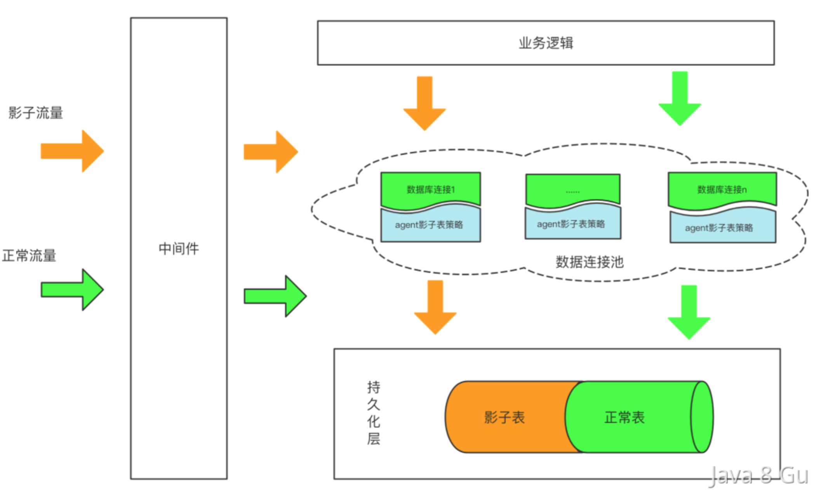

# 面试题-架构设计

#### 如何设计一个高性能的分布式系统？

设计高性能的分布式系统需要考虑多个因素，包括架构设计、负载均衡、数据一致性、容错处理、消息队列、缓存、性能监控和安全性等。下面是一些可以帮助设计高性能分布式系统的方法：

1. 架构设计：选择合适的分布式系统架构，例如微服务架构、SOA架构等，可以有效地提高系统性能。
2. 负载均衡：使用负载均衡技术可以将请求分布到多个节点上，提高系统的性能和可用性。可以使用硬件负载均衡器或软件负载均衡器来实现。
3. 数据一致性：保证数据一致性是设计分布式系统的一个重要方面，可以使用一致性哈希、副本复制、分片等技术来保证数据一致性。
4. 容错处理：设计分布式系统时必须考虑容错处理，以防止单点故障。可以使用备份、自动故障转移、容器化等技术来实现容错处理。
5. 消息队列：使用消息队列可以解耦系统组件，提高系统的可伸缩性和性能。
6. 缓存：使用缓存技术可以减轻数据库的负载，提高系统性能。
7. 性能监控：使用性能监控工具可以监测系统的性能瓶颈，提高系统的性能和可用性。
8. 安全性：分布式系统的安全性是至关重要的，可以使用身份验证、访问控制等技术来保证系统的安全性。

#### 什么是QPS，什么是RT？

QPS，指的是系统每秒能处理的请求数(Query Per Second) ，在Web应用中我们更关注的是Web应用每秒能处理的request数量。这个是衡量系统性能的重要指标。

RT，指的是响应时间(Response Time)，是指从客户端发一个请求开始计时，到客户端接收到从服务器端返回的响应结果结束所经历的时间。

#### 服务端接口性能优化有哪些方案？

设计调优、代码调优、JVM调优、数据库调优、操作系统调优。

- 使用单例
- 批量操作
- 使用 Future 模式
- 使用线程池
- 使用 NIO
- 锁优化
- 压缩传输
- 缓存结果
- SQL 优化

#### 什么是布隆过滤器，实现原理是什么？

布隆过滤器是一种数据结构，用于快速检索一个元素是否可能存在于一个集合(bit 数组)中。

它的基本原理是利用多个哈希函数，将一个元素映射成多个位，然后将这些位设置为 1。当查询一个元素时，如果这些位都被设置为 1，则认为元素可能存在于集合中，否则肯定不存在。

所以，布隆过滤器可以准确的判断一个元素是否一定不存在，但是因为哈希冲突的存在，所以他没办法判断一个元素一定存在。只能判断可能存在。

下面是布隆过滤器的工作过程：

**1、初始化布隆过滤器**
在初始化布隆过滤器时，需要指定集合的大小和误判率。布隆过滤器内部包含一个bit数组和多个哈希函数，每个哈希函数都会生成一个索引值。

**2、添加元素到布隆过滤器**
要将一个元素添加到布隆过滤器中，首先需要将该元素通过多个哈希函数生成多个索引值，然后将这些索引值对应的位设置为 1。如果这些索引值已经被设置为 1，则不需要再次设置。

**3、查询元素是否存在于布隆过滤器中**
要查询一个元素是否存在于布隆过滤器中，需要将该元素通过多个哈希函数生成多个索引值，并判断这些索引值对应的位是否都被设置为 1。如果这些位都被设置为 1，则认为元素可能存在于集合中，否则肯定不存在。

布隆过滤器的主要优点是可以快速判断一个元素是否属于某个集合，并且可以在空间和时间上实现较高的效率。但是，它也存在一些缺点，例如：

1. 布隆过滤器在判断元素是否存在时，有一定的误判率。
2. 布隆过滤器删除元素比较困难，因为删除一个元素需要将其对应的多个位设置为 0，但这些位可能被其他元素共享。

#### 什么是读写分离？如何实现？

在分布式系统设计中，读写分离是一种常见的架构模式，可以提升系统的处理能力、扩展性和可用性。简单来说就是分开处理读和写操作。

- 读操作：通常指的是从数据库中检索数据的操作，比如 SQL 查询。
- 写操作：包括创建、更新或删除数据库中的数据，比如 SQL 的 INSERT、UPDATE、DELETE 语句。

读写分离的好处：

1. 提高性能：一般来说，大型分布式应用中都是读多写少的。将读写操作分离可以显著提高数据库系统的整体性能。
2. 提高可扩展性：读写分离允许系统按需增加从数据库实例，以应对读请求量的增长，从而提高系统的可扩展性。
3. 增加可用性和容错性：在主-从复制架构中，如果主数据库出现故障，可以从从数据库中选举或提升一个为新的主数据库，从而减少系统的停机时间。
4. 负载均衡：通过在多个从数据库之间分散读请求，可以实现负载均衡，避免单个数据库的过载，从而提高系统的响应速度和稳定性。

我们都知道 MySQL 提供了主从复制的能力，所以我们就可以基于 MySQL 自带的主从复制的能力来实现读写分离。

> 在这种模式下，写操作只在主数据库（Master）上执行，而读操作则可以在从数据库（Slave）上执行。主库和从库通过主从复制来保持数据的同步。

**如何做读写的分流？**

如何实现让写流量请求到主库，读流量请求到从库呢，这就涉及到具体的读写分流了。

一般来说，首先我们需要把接口从定义上或者从职责上划分清楚，读接口和写接口。如 UserReadService 就是专门负责提供读服务的，UserWriteService 就是专门负责写服务的。

接下来，ReadService 在操作的时候，只需要和从库进行交互，而 WriteServie 在操作的时候只需要和主库进行操作就行了。具体分流方式有以下集中：

- 代码分流

> 最简单直观的方式，就是我们自己编码实现，我们可以在 DAO 层定义多个数据源，然后在实际进行读或者写操作的时候，选择使用不同的数据源即可。
>
> 如以下方式定义两个不同的 DataSource：

```java
@Configuration
public class DataSourceConfig {

    @Bean
    @Primary
    public DataSource primaryDataSource() {
        // 配置主数据源
        return DataSourceBuilder.create().url("jdbc:mysql://master_db:3306/mydb").username("user").password("pass").build();
    }

    @Bean
    public DataSource replicaDataSource() {
        // 配置从数据源
        return DataSourceBuilder.create().url("jdbc:mysql://replica_db:3306/mydb").username("user").password("pass").build();
    }
}
```

在定义一个动态数据源：

```java
public class DynamicDataSource extends AbstractRoutingDataSource {
    @Override
    protected Object determineCurrentLookupKey() {
        // 你可以根据实际情况来决定使用哪个数据源
        return DbContextHolder.getDbType();
    }
}
```

在 Spring 配置中设置 DynamicDataSource，并将之前定义的主从数据源作为目标数据源。

```java
@Configuration
public class RoutingConfig {

    @Autowired
    @Qualifier("primaryDataSource")
    private DataSource primaryDataSource;

    @Autowired
    @Qualifier("replicaDataSource")
    private DataSource replicaDataSource;

    @Bean
    public DataSource dataSource() {
        DynamicDataSource dynamicDataSource = new DynamicDataSource();
        Map<Object, Object> targetDataSources = new HashMap<>();
        targetDataSources.put(DbType.MASTER, primaryDataSource);
        targetDataSources.put(DbType.SLAVE, replicaDataSource);
        dynamicDataSource.setTargetDataSources(targetDataSources);
        dynamicDataSource.setDefaultTargetDataSource(primaryDataSource); // 默认使用主数据源
        return dynamicDataSource;
    }
}
```

通过 AOP 在业务层或 DAO 层方法调用前动态切换数据源。可以基于注解或方法名称约定来拦截方法调用。针对 find 方法使用从库，针对 insert 方法使用主库。

```java
@Aspect
@Component
public class DataSourceAspect {

    @Before("execution(* com.example.repository..*.find*(..)) || execution(* com.example.repository..*.get*(..))")
    public void setReadDataSourceType() {
        DbContextHolder.setDbType(DbType.SLAVE);
    }

    @Before("execution(* com.example.repository..*.insert*(..)) || execution(* com.example.repository..*.update*(..))")
    public void setWriteDataSourceType() {
        DbContextHolder.setDbType(DbType.MASTER);
    }

    @After("execution(* com.example.repository..*.*(..))")
    public void clearDataSourceType() {
        DbContextHolder.clearDbType();
    }
}


public class DbContextHolder {

    private static final ThreadLocal<DbType> contextHolder = new ThreadLocal<>();

    public static void setDbType(DbType dbType) {
        contextHolder.set(dbType);
    }

    public static DbType getDbType() {
        return contextHolder.get();
    }

    public static void clearDbType() {
        contextHolder.remove();
    }

    public enum DbType {
        MASTER, SLAVE
    }
}
```

这种方案的好处就是实现起来简单，我们可以根据业务做各种定制化，灵活性非常好。

- 借助中间件**（推荐）**

> 对于这种读写分离的场景，有很多中间件就天然支持的。比如Sharding-JDBC 、TDDL等，都是支持读写分离的。
>
> 他们的实现原理主要是根据 SQL 语义的分析，将读操作和写操作分别路由至主库与从库。
>
> 这个方案在可靠性、侵入性、稳定性方面更加友好。

- 代理模式

> 那就是在应用程序和数据库实例之间部署一组数据库代理实例，对应用程序来说，数据库代理把自己伪装成一个单节点的 MySQL 实例，应用程序的所有数据库请求被发送给代理，代理分离读写请求，然后转发给对应的数据库实例。
>
> 这种方案中，比较典型的是 Atlas，这是奇虎 360 研发的数据中间层项目。Atlas 是一个位于应用程序与 MySQL 之间中间件。在后端 DB 看来，Atlas相当于连接它的客户端，在应用层面看来，Atlas 相当于一个 DB 服务器。
>
> 以一主多从为例。Atlas 可以将读请求分发到两个从库节点，写请求分发到主库节点，实现读写分离。

MySQL 8.2 开始的 Router 也能用来做读写分离了。

#### 读写分离遇到主从延迟怎么办？

正常情况下，MySQL 的主从延迟都是非常小的，一般都不超过 1ms。但是在极端情况下也会出现查不到的情况。所以，我们需要想办法解决这个问题。

一般来说，为了减少主从延迟带来的影响，我们在实现读写分离时，可以采用以下几种方案做优化。

**读请求分类**

一般来说，虽然我们做了读写分离，但是也不是无脑分的，我们还会把读请求分成两类，一类是可以接受延迟的读，一类是不能接受延迟的读。

比如历史订单的查询、比如数据报表的生成、比如数据对账的查询、比如非关键业务的查询，比如评论信息等，这些都是可以延迟的读，这些读的话就可以完全从备库走。

而对于那些不能接受延迟的读，那么就需要注意了，就需要考虑进行强制读主库。

这种方案其实是用的比较多的，不要以为他是逃避了问题，有的时候，没必要给自己创造困难硬上！

**强制读主库**

上面我们提到了对于一些不能接受延迟的读请求，需要强制走主库。

还有一些情况，那就是一些核心的业务操作，或者是在一个事务上下文中的读请求，这时候也需要读主库的。

比如说我在创建订单的过程中，我会先插入一个订单，然后再查询订单信息进行后续操作，这个过程中，是要保证数据一定能查到的，这时候就也需要强制走主库。

具体如何实现强制读主库呢，如果是我们前面介绍的通过自己写代码分流的方案的话，就比较容易了，我们可以自己控制读写哪个数据源，那么就自己硬编码就好了。

如果是使用我推荐的中间件的方案的话，比如 ShardingJDBC，他也是支持强制路由的（https://shardingsphere.apache.org/document/legacy/3.x/document/cn/manual/sharding-jdbc/usage/hint/ ），可以通过设置hint的方式让 SQL 只操作主库。

**二次读取**

除了上面我们说的强制读主库的方案，还有一个常见做法叫做二次读取。

啥意思呢，就是我的读取操作，默认读从库，但是如果我从库读取的时候没读到，那我为了避免因为数据延迟导致的，那么就再进行一次从主库读取。

这个实现方式的话也是需要我们定制的开发代码。但是这个方案我不太建议，因为这种一旦出现延迟，也会导致你的主库会有大量的请求过去，造成很大的压力的。

**主备一致**

除了上面说的方案之外，还有一些场景中，是采用了一些特殊的手段，来确保主备一致。

- Sleep方案：就是主库更新之后，读从库之前先sleep 1秒，然后再读从库。
- 判断主备无延迟方案：每次从库执行查询请求前，先判断 seconds_behind_master 是否已经等于 0。如果还不等于 0 ，那就必须等到这个参数变为 0 才能执行查询请求。
- 等主库位点方案：其核心思想是在从库上执行读操作前，确保从库已经同步了特定的主库位点（即主库的数据变更位置）。这样可以保证读操作获取的数据是最新的，避免了因主从复制延迟而导致的数据不一致问题。
- 等 GTID 方案：和位点原理一样，MySQL 5.7.6 版本开始，允许在执行完更新类事务后，把这个事务的 GTID 返回给客户端，在执行读操作前，应用检查从库是否已经应用了该 GTID 标识的事务。这通常涉及查询从库的复制状态，确认已经处理的 GTID 集合包含了特定的 GTID。

> GTID（Global Transaction Identifier）为每个事务提供了一个全局唯一的标识符，使得主从复制过程中的数据变更能够更加精确和容易追踪。

#### 什么是SLA？

SLA 是 Service Level Agreement 的缩写，意为服务等级协议。它是指供应商和客户之间达成的一份正式协议，规定了供应商应该向客户提供的服务水平、质量、可靠性和响应时间等指标。

SLA 通常会涉及到各种服务指标，例如服务可用性、服务等待时间、故障修复时间、数据保密性、客户支持等，旨在确保供应商向客户提供高质量、高可靠性、高安全性的服务。

SLA 通常用于云计算、SaaS、PaaS 等服务领域，对于企业用户和服务提供商之间的合作非常重要。通过制定合适的 SLA，双方可以达成共识，从而更好地维护业务合作关系。

一般作为甲方在采购乙方的服务的时候，乙方都会提供一些 SLA 指标，这些指标包括但不限于以下几个方面：

1. **可用性：**指服务在一定时间范围内能够正常使用的时间比例，通常以百分比表示。例如，“四个九”（99.99%）可用性要求表示一年内服务最多只能停机不超过52.56分钟。
2. **响应时间：**指服务响应请求的时间，通常以毫秒或秒为单位表示。例如，网络服务的响应时间可要求在100毫秒以内。
3. **吞吐量：**指系统在单位时间内能够处理的请求量，通常以每秒钟处理的请求量（QPS）或每分钟处理的请求量（RPM）为单位。
4. **故障处理时间：**指故障发生后系统能够恢复正常运行的时间，通常以分钟或小时为单位。例如，“四个九”（99.99%）可用性要求通常要求故障处理时间在52分钟以内。
5. **数据可靠性：**指系统能够保证数据的完整性、一致性、可用性和安全性。例如，在数据库系统中，可要求采用主从同步、备份等技术手段来保证数据的可靠性。
6. **服务支持：**指服务提供商提供的技术支持、客户服务等方面的指标。例如，在运营云服务时，可要求服务提供商提供24小时客户服务、及时响应客户请求等。
7. **其他指标：**根据具体业务需求和服务类型，还可以定义其他指标，如安全性、可扩展性、性能等。

SLA 的指标需要根据业务需求、技术能力和市场标准等因素来进行制定，同时要具备可量化和可监控的特性，以确保双方都能够达成共识并得到有效执行。

> 4个9、5个9
>
> SLA 4个9 指的是服务的可用性要求，也被称为“四个九”，通常表示服务的可用性达到99.99%。
>
> 具体地说，四个九表示在一年的时间内，服务最多只能停机不超过 52.56分钟（365*24*60*(1-0.9999)）。这意味着服务需要保持高可用性，并且具备足够的弹性和韧性，以应对突发的故障和异常情况。
>
> 同理，3个9、5个9 等也是类似的算法。

#### 什么是冷备、热备，暖备？

冷备、热备和暖备是备份和恢复方案中常见的术语，它们表示备份和恢复方案的不同类型和不同级别。
**1、冷备（Cold Backup）**：冷备是指在关闭系统或服务后，将数据备份到离线介质中的一种备份方式。在备份过程中，系统或服务不可用。恢复时需要将备份的数据还原到系统中，并启动系统或服务。由于备份和恢复过程中系统处于离线状态，因此**冷备的恢复时间较长，但成本相对较低**。

举例：在深夜停机时备份整个数据库、在一个网站的低峰期备份数据库。

**2、热备（Hot Backup）**：热备是指在系统或服务运行期间，对数据进行备份的一种备份方式。**在备份过程中，系统或服务仍然可以提供服务。热备的恢复时间相对较短，但需要额外的资源来支持备份和恢复，因此成本较高**。

举例：使用数据库备份工具在生产服务器上运行备份任务，而无需停机，以确保数据持续可用。就像我们通常做的数据库的主从同步，其实就是热备的一种实现。

**3、暖备（Warm Backup）**：暖备是介于冷备和热备之间的备份方式。在进行暖备时，备份数据与原始数据之间的同步是定期进行的，**备份数据的时间间隔通常比热备长，但比冷备短**。暖备的恢复时间比热备长，但比冷备短，因为需要将备份数据还原到原来的位置，并进行一些必要的同步操作。

举例：一般是在某个应用程序的特定功能模块关闭或限制访问的情况下备份数据，以减轻备份操作对业务的影响。

综合来看，冷备、热备和暖备的选择应该根据具体的业务需求和资源限制来进行综合考虑。一般而言，如果数据要求高可用性和实时性，应该采用热备方式；如果数据要求较高，但可用性和实时性要求相对较低，可以采用暖备方式；如果数据要求不是很高，可以采用冷备方式。

#### 如何设计一个高可用架构？

设计一个高可用架构需要考虑多个方面，包括可用性、可靠性、性能、扩展性、安全性等。下面是一些设计高可用架构的一般性原则和方法：

1. **设计集群架构：**采用多节点的集群架构可以提高系统的可用性和可靠性，从而避免单点故障导致系统不可用。
2. **采用分布式架构：**采用分布式架构可以将系统的负载分散到多个节点上，从而提高系统的性能和可扩展性。
3. **实现故障转移和容错机制：**通过使用冗余组件、备份数据等技术手段，可以实现故障转移和容错机制。例如，采用主从复制、备份、快速切换等技术来确保数据不丢失、系统快速恢复。
4. **可靠的服务器和网络：**选择可靠的服务器和网络设备，以确保它们能够在故障时正常运行。可以采用多个服务器进行冗余备份，以实现故障转移和负载均衡。可以选择高可靠性网络设备和路由器，以避免网络故障。
5. **容灾和备份：**需要设置容灾和备份计划，以确保在自然灾害、人为错误或其他紧急情况下能够快速恢复服务。可以使用云备份和容灾服务，以提高备份和恢复的效率和可靠性。
6. **设计监控和自动化工具：**通过使用监控工具和自动化工具可以实现对系统的实时监控和自动化维护。例如，通过使用系统监控工具、自动化运维工具等来实现自动化运维、自动化扩容等功能，从而减少手动操作和人为错误。
7. **实现数据安全保护：**通过采用多层次的安全策略来保护数据的安全性。例如，使用加密技术、防火墙、入侵检测等技术来保护系统和数据的安全。
8. **进行容量规划和性能优化：**通过进行容量规划和性能优化，可以提高系统的性能和可扩展性。例如，通过使用缓存、调整配置参数、优化代码等技术手段来提高系统的性能和稳定性。
9. **设计自动化扩容和弹性伸缩：**通过设计自动化扩容和弹性伸缩功能，可以根据业务需求和系统负载情况来自动调整系统资源。例如，通过使用自动化扩容工具和自动化弹性伸缩策略来实现系统资源的自动分配和调整。

需要注意的是，设计高可用架构需要综合考虑业务需求、技术方案、资源投入等因素，同时需要不断进行优化和改进，以实现最优的性能和可用性。

#### 什么是异地多活？

**异地多活是一种分布式系统架构模式**，可以让多个数据中心在不同地理位置提供相同的服务，并且能够实现数据的实时同步和故障切换。通常用于需要在全球范围内提供高可用性和低延迟的应用程序，例如在线游戏、社交媒体、金融交易等。

**在异地多活架构中，多个数据中心之间通过高速网络连接进行数据同步和负载均衡。每个数据中心都具有完整的应用程序和数据副本，可以同时提供服务并处理客户端请求。当一个数据中心发生故障时，可以通过自动切换和故障转移机制将流量转移到其他健康的数据中心，从而保证系统的可用性和可靠性。**

异地多活架构需要考虑多个因素，例如数据同步和冲突解决、负载均衡和故障切换、安全性和隐私保护等。通常需要采用分布式数据库、消息队列、负载均衡器、DNS 解析等技术来支持异地多活架构。

> 同城容灾
>
> 同城容灾和异地多活一样，也是一种分布式系统架构模式，可以在同一城市或地理区域内提供高可用性和容灾能力。它通过将不同的服务器和存储设备组合在一起，构建出一个分布式系统，可以实现数据的实时同步和故障切换。
>
> 在同城容灾架构中，多个数据中心之间通过高速网络连接进行数据同步和负载均衡。每个数据中心都具有完整的应用程序和数据副本，可以同时提供服务并处理客户端请求。当一个数据中心发生故障时，可以通过自动切换和故障转移机制将流量转移到其他健康的数据中心，从而保证系统的可用性和可靠性。
>
> 同城容灾架构相比于异地多活架构来说，更加适用于数据中心距离较近的情况。它可以通过使用复制、镜像和数据同步等技术来实现数据的备份和容灾，从而提高系统的可用性和可靠性。同时，同城容灾架构还可以提供低延迟和高带宽的网络连接，以支持高吞吐量的应用程序。

#### 什么是压测，怎么做压测？

压测是一种非常常见的帮我们做性能评估的手段。通过模拟用户请求，帮助我们发现系统的瓶颈以及评估系统的整体水位。

以下是进行压测的一般步骤：

1. 确定测试目标：明确进行压测的目标，具体是哪个接口，那个方法，哪种具体的case。以及这次压测我们要实现什么目的，是测试300QPS能不能扛得住，还是看看系统的整体水位咋样。
2. 制定压测计划：确定压测的具体策略，包括测试的时间、持续多久、并发量要压到多少、是一次性压到指标还是脉冲式压上去、测试环境配置等。
3. 创建环境并准备脚本：压测可以在测试环境也可以在生产环境，但是不管是硬件配置、部署架构还是代码，都需要和线上环境尽量保持一致。并且需要准备好压测数据及脚本，是不同的用户，还是相同的用户，是写数据还是读数据。都是不一样的。
4. 执行压测：根据测试计划，执行压测并收集性能指标。可以逐步增加负载，观察系统的响应情况。
5. 监控系统性能：施压不是目的，目的是在施压过程中，观察系统的整体情况。包括但不限于：
   a. RT、CPU利用率、Load、内存情况、GC次数、GC时长、网络IO情况、堆内存情况、线上报警情况等。
6. 分析结果：对压测结果进行分析，确定系统的性能瓶颈和潜在问题，并采取相应的优化措施。
7. 优化和再测试：根据分析结果，进行必要的优化和改进，并重新进行压测，直到系统能够满足预期的性能要求。

常用的压测工具包括 JMeter、Apache Bench 等，它们可以帮助自动化执行压测脚本，并提供详细的测试报告和性能分析。在进行压测时，需要特别注意对生产环境的影响，确保不会对实际用户造成不良影响。因此，在压测前务必仔细准备，并充分评估风险。

#### 什么是全链路压测？

全链路压测诞生于阿里巴巴双11备战过程，如果说双11大促是阿里业务的“期末考试”，全链路压测就是大考前的“模拟考试”。全链路压测通过在生产环境对业务大流量场景进行高仿真模拟，获取最真实的线上实际承载能力、执行精准的容量规划，确保系统可用性。

因为对于像阿里这种大型互联网公司来说，尤其是电商业务，一个业务流程涉及到的上下游实在是太多了。任何一个节点都可能成为整个系统的瓶颈。

而在单链路压测时，往往只关注自己的系统，就会不可避免忽略掉一些资源竞争及外部干扰，最终得到一个过于乐观的结果。

并且在分布式场景中，我们和上下游之间的依赖关系错综复杂，只有在全链路压测中才能真正的暴露出真实环境中的各种问题。

全链路压测可以从网络到Nginx反向代理、到应用服务器、系统间依赖、数据库、缓存、磁盘等全方位的找出系统瓶颈。

但是全链路压测和单链路压测有个比较大的不同，那就是对于很多下游系统来说，他需要能识别出压测流量，一方面可以对这些流量做一些特殊处理，比如某个系统大促当天会被降级，那么他就可以直接把压测流量过滤掉，不参加压测。

还有就是，很多时候压测都不仅仅是读操作，还有很多写操作，那就会在很多系统中产生数据，那么就需要把这部分流量识别出来，把这部分数据做好隔离。


所以，全链路压测中比较重要的就是流量识别及数据隔离。

**流量识别**

在流量识别方面，一般都是通过流量染色实现的，其实就是对各种服务框架进行改造，比如 DUBBO、REDIS、TDDL、MQ 等所有的系统间交互以及存储等需要用到的组件中做改造。

比如定义一个特殊的字段，如 full_chain_stress_tag，把他在整个链路中都传递下去，然后这样各个系统就可以有效的识别出压测流量了。

这个也可以和分布式链路追踪结合着来做，理论上大家要该干的事儿是一样的。

**数据隔离**

数据隔离一般都是用影子表。比如我们有一张 order 表，那么在压测前就需要创建一张 order__shadow 表，作为他的影子表。

这样在数据库持久层，就需要识别出压测流量，然后把压测数据写入到影子表中。这样就可以避免对真实数据产生影响。



除了数据库，还有缓存，也一样，也需要识别压测流量，然后写入到对应的影子缓存中。还有日志，如果有需要，也可以做隔离。

#### 如何设计一个能够支持高并发的系统？

设计一个能够支持高并发的系统需要考虑多方面的因素，包括架构、性能优化、容错和可伸缩性等。以下是一些一般性的建议和实践：

1. **分布式架构：**将系统分解成多个模块，采用分布式架构来降低单点故障的风险，并提高系统的可伸缩性和性能。
2. **集群部署：**将一个服务通过集群进行部署，来提升系统整体的吞吐量及响应速度，并使用负载均衡技术将请求均衡分配给多个服务器，以提高系统的性能和可用性。
3. **利用缓存：**使用缓存、NoSQL等技术，以提高数据读写的性能和可靠性。
4. **异步处理：**采用异步处理机制，如使用消息队列、事件驱动等技术，以降低请求响应时间和提高系统吞吐量。
5. **预加载：**使用预加载技术来提前加载需要的资源，以减少用户等待时间。
6. **代码优化和调优：**对系统代码进行优化和调优，如采用异步I/O、避免锁（减小锁的粒度）、减少循环和递归、避免长事务等，以提高系统性能。
7. **数据库优化：**合理的数据库设计和优化，包括合理的索引设计、分库分表、读写分离、缓存优化等，可以有效提高系统的并发度和响应速度。
8. **分库分表：**将一个大型的数据库拆分成多个小型的数据库（分库），然后将每个小型数据库中的表再进行拆分（分表），从而减轻单个数据库或表的读写压力，通过分库分表，可以将大量的读写操作分散到多个数据库或表中，从而提高系统的并发度和响应速度。
9. **读写分离：**读写分离是一种常用的数据库优化技术，它将读操作和写操作分配到不同的数据库实例上处理。通过读写分离，主库主要负责写操作，从库则负责读操作，从而提高了系统的并发度和可扩展性。同时，读写分离还可以提高系统的可用性和容错能力，因为即使主库出现故障，从库仍然可以提供读服务。
10. **防止雪崩：**通过使用限流、熔断、降级等技术，可以防止系统因为某个组件出现故障而导致整个系统崩溃的雪崩效应。
11. **容错和监控：**实现容错机制，如备份、容灾、负载降级等，以保障系统的可用性。同时，使用监控工具来实时监测系统的运行状况和性能瓶颈，及时做出调整和优化。
12. **测试和评估：**进行全面的性能测试和评估，包括压力测试、负载测试、安全测试等，以发现并解决系统的性能瓶颈和安全隐患。

综上所述，设计高并发系统需要从多个方面考虑，需要综合运用各种技术和工具，进行全面的测试和评估，以实现系统的高可用、高性能和高安全性。

#### 什么是服务降级？

限流和降级都是对系统的保护功能，一般用户在流量高峰时期，比如双十一大促。

降级是通过开关配置将某些不重要的业务功能屏蔽掉，以提高服务处理能力。在大促场景中经常会对某些服务进行降级处理，大促结束之后再进行复原。

**区别于熔断机制，降级一般并不是彻底功能不可用，而是用一种默认返回、异步执行、延迟处理等方式进行降低处理。**

> 降级的方式 - 延迟服务
>
> 比如发表了评论，重要服务，比如在文章中显示正常，但是延迟给用户增加积分，只是放到一个缓存中，等服务平稳之后再执行。

**在粒度范围内关闭服务（片段降级或服务功能降级）**

比如关闭相关文章的推荐，直接关闭推荐区

**页面异步请求降级**

比如商品详情页上有推荐信息/配送至等异步加载的请求，如果这些信息响应慢或者后端服务有问题，可以进行降级； 页面跳转（页面降级）

比如可以有相关文章推荐，但是更多的页面则直接跳转到某一个地址。

**写降级**

比如秒杀抢购，我们可以只进行Cache的更新，然后异步同步扣减库存到DB，保证最终一致性即可，此时可以将DB降级为 Cache。

**读降级**

比如多级缓存模式，如果后端服务有问题，可以降级为只读缓存，这种方式适用于对读一致性要求不高的场景；

11月11日的零点到11月12日的零点之间无法退款，其实是采用了关闭服务这种降级方式

> 降级的介入方式
>
> 按照是不是可以自动化降级，降级共有两种介入方式，分别是：自动开关降级和人工开关降级。

**自动开关降级**

自动开关降级的方式一般是当系统达到某些设定的条件（系统负载、资源使用情况、SLA 等指标）之后，自动执行一些策略。

常见的可以作为自动降级条件的指标有以下几个：

- 服务超时

当访问的数据库/http服务/远程调用响应慢或者长时间响应慢，且该服务不是核心服务的话可以在超时后自动降级；

比如前面提到的详情页上有推荐和收藏功能，即使出现问题也不会影响用户的正常下单。如果是调用别人的远程服务，和对方定义一个服务响应最大时间，如果超时了则可以自动降级。

- 失败次数

调用外部服务的时候，除了超时以外，最常见的异常情况就是调用失败。比如详情页中的库存信息，如果是某一次查询请求失败了，那么就可以通过读取缓存数据等方式直接降级掉。

但是，这种降级可能存在一个问题，就是虽然一次请求展示了缓存，但是其他用户访问的时候还是会查询库存信息，这对于库存系统来说就是雪上加霜。因为他可能已经有问题了，但是上游系统还是在不断的对他发送请求。

所以，可以针对这个查询库存的接口做统一的降级。设定一个失败次数的阈值，一旦整体失败次数达到这个阈值了，就对后续一段时间内的该查询接口做降级。直到其功能恢复。

- 发生故障

上面提到的失败可能是服务不稳定造成的，过一段时间可以自动恢复的。还有一种情况可能是依赖的服务彻底跪了、或者网络不通了等等。这种情况就可以直接降级了。

当HTTP请求返回固定的错误码、或者一个RPC请求的时候底层服务抛了异常以后，就认为有故障发生，对其进行降级即可。

- 限流降级

还有种电商网站常见的策略，那就是限流降级。对于某些功能，设定一个流量阈值，一旦流量达到阈值的话，就进行降级。

比如秒杀功能，如果一瞬间流量太大，就可以进行限流降级。对于后续访问的用户直接提示已售空、跳转错误页、或者让他输入验证码重试等。

**人工开关降级**

还有一种降级方式，那就是人工开关降级。

人工开关降级的方式是指当系统维护人员在发现系统异常之后，通过人工修改参数、关闭服务等方式进行降级的方法。

这种方式的好处是比较灵活，能够根据异常情况灵活应对；但弊端是对人的要求比较高，一来需要维护人员对系统有足够的了解，另外要求维护人员在系统异常时能够在第一时间进行处置。

还有一种情况，可能也会人工介入，那就是在大促之前，预估到流量会十分巨大，提早的识别出风险，为了节省资源保证主流程的可用，开发人员可以手动将某个功能降级掉。

这里说的人工开关降级，并不一定是一定要人工操作，也可能是人工通过一个定时任务进行定时触发的。

> 降级工具
>
> 目前市面上，针对流量控制，限流降级主要有以下两种选择：Netflix Hystrix 和 Alibaba Sentinal。

#### 什么是熔断？
