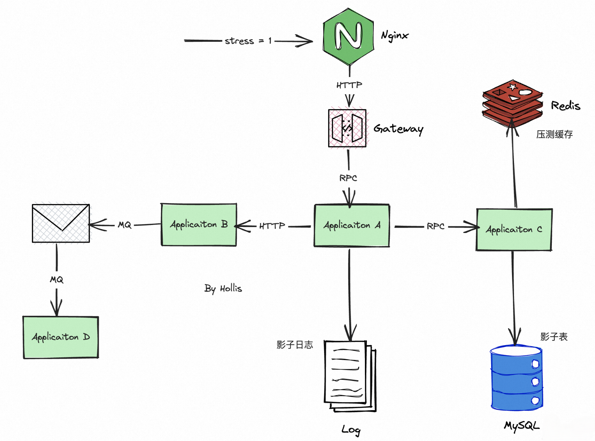

# 面试题-架构设计

#### 常见的架构设计原则有哪些？

1. **分离关注点（Separation of Concerns）**：系统中的不同模块应该专注于自己的职责，并与其他模块进行解耦，避免模块之间的耦合度过高，增加系统的可维护性和可扩展性。
2. **单一职责原则（Single Responsibility Principle）**：每个模块或者组件应该只负责一个职责或者任务，这样可以减少模块之间的相互影响，提高代码的可读性和可维护性。
3. **开放封闭原则（Open-Closed Principle）**：系统的设计应该对扩展开放，对修改关闭，通过接口的定义，使得系统能够在不修改原有代码的情况下进行扩展和修改。
4. **接口隔离原则（Interface Segregation Principle）**：系统中的接口应该只包含必要的方法，避免接口过于庞大，减少系统的复杂度。
5. **依赖倒置原则（Dependency Inversion Principle）**：高层模块不应该依赖于低层模块，而应该依赖于抽象接口，通过接口实现高低层的解耦，提高系统的可维护性和可扩展性。
6. **最少知识原则（Least Knowledge Principle）**：模块之间的通信应该尽可能少，一个模块只应该了解那些与之直接交互的模块，避免模块之间的耦合度过高，降低系统的复杂度。
7. **重构（Refactoring）**：系统的设计应该不断进行重构，保持系统的灵活性和可维护性。通过对系统的分层、模块化、组件化等方式，减少代码的冗余和重复，提高系统的可读性和可维护性。
8. **高内聚低耦合原则：**模块内部的元素之间应该紧密关联，而与外部的联系应该尽量松散。
9. **分层架构原则：**将系统分解成若干个层次，每个层次负责一种特定的功能。
10. **模块化原则：**将系统分解成若干个模块，每个模块负责一种特定的功能。模块之间应该是松散耦合的。

#### 架构设计中最重要的三个要素是什么？

罗列几个架构设计的时候需要考虑的一些要素：

1. 模块化：将整个系统拆分成若干个模块，每个模块具有独立的功能和职责，以便于管理和维护。
2. 可扩展性：系统应该能够快速、容易地扩展以适应业务的不断变化。
3. 高可用性：系统应该设计为高可用性，能够在故障情况下快速恢复，保证业务的连续性。
4. 可维护性：系统应该易于维护和管理，包括故障排除、监控、日志记录等方面。
5. 安全性：系统应该保证数据的安全性和隐私性，防止未经授权的访问和攻击。
6. 性能优化：系统应该具备良好的性能，能够在高并发情况下快速响应并处理请求。
7. 简单性：系统应该尽可能地简单化，降低系统的复杂度，易于开发和维护。
8. 可测试性：系统应该易于测试和验证，包括单元测试、集成测试、性能测试等方面。

#### 什么是技术债务？你怎么理解它？

**技术债务（Technical Debt）指的是在开发过程中，为了快速交付或避免解决问题所需的高成本和高风险而采取的妥协或折中方案，这些方案所留下的技术上的负担和后续成本即被称为技术债务。**

**技术债务的本质是以速度和时间为代价**，在软件开发中的某个时刻实施了不可持续的技术决策，通常是为了实现某种业务目标而对代码质量、架构设计、技术选型等方面进行了妥协。虽然技术债务能够让团队在短时间内快速交付软件产品，但随着时间的推移，**技术债务会越积越多，导致软件系统越来越难以维护和升级，进而影响业务的持续发展和创新。**

为了避免技术债务的积累，开发团队需要**尽可能遵循良好的软件开发规范，采用可持续的软件开发方法，关注代码质量和可维护性，并在合适的时机进行技术债务的偿还**，即对之前的技术债务进行重构、优化或更新，以保持软件系统的健康发展。

#### 架构是设计出来的还是演进出来的？

**架构既是设计出来的，也是演进出来的。设计 + 演进，缺一不可。**

在开始一个项目时，架构通常需要被设计出来，以确保系统具有所需的特性、可扩展性、可靠性和安全性。然而，随着项目的不断发展和演进，架构也可能需要随之进行调整。这可能是由于需求的变化、系统性能问题的发现、技术进步、以及其他各种原因。

因此，好的架构不仅需要从一开始就进行充分的设计规划，还需要通过不断的演进来持续地改进和完善。架构的设计和演进是一种动态的过程，需要不断地评估和调整，以确保系统能够持续地满足业务需求和用户需求。

#### 什么样的架构才算是好的架构？

一个好的架构应该具备以下特点：

1. 易于理解和维护：架构应该易于理解，遵循良好的设计原则，使得代码易于维护和更新。
2. 可扩展性：架构应该能够在需要时方便地扩展，而不会影响现有的代码。
3. 可靠性：架构应该是可靠的，避免单点故障，提供数据冗余和故障恢复机制。
4. 高性能：架构应该能够处理大量的请求，具有高性能和可伸缩性，以满足业务需求。
5. 安全性：架构应该具备安全性，对系统的机密数据和操作进行保护，避免安全漏洞和攻击。
6. 灵活性：架构应该具有灵活性，允许对业务需求的变化做出快速响应，以提高业务的敏捷性和创新能力。
7. 易于部署和升级：架构应该易于部署和升级，允许快速部署新功能和修复问题，同时确保不中断服务。
8. 成本效益：架构应该是成本效益的，**避免过度设计**和过度工程，同时保证系统的可靠性和性能。

架构，一定是服务于业务的，所以，它**需要能够适应不断变化的业务需求和技术发展**。同时，好的架构需要遵循良好的设计原则和软件工程实践，以确保软件的质量和可维护性。

**最后，架构没有好坏之分，只有适不适合，所谓好与坏只是不同的历史背景下的一个客观评判。适合的架构就是好架构。**

#### 为什么说做架构其实就是做权衡？

架构设计的过程中，往往需要在多个目标之间进行权衡，以找到最优的设计方案。这些目标可能包括系统的可扩展性、可维护性、性能、安全性、可靠性、易用性、成本等等。由**于这些目标有时候是相互矛盾的，因此需要在不同目标之间进行权衡。**

#### 亿级商品如何存储？

存储亿级商品需要考虑以下几个方面问题：

1. 存储方式：亿级商品的存储一般使用分布式存储技术，例如分布式文件系统、分布式对象存储或者分布式数据库。这样可以保证数据的可靠性和高可用性。一般可以考虑像 TiDB、Oceanbase 等。
2. 数据分片：当数据量达到亿级时，需要考虑数据的分片，将数据分散存储在多个节点上，以提高查询效率和并发处理能力。可以根据商品的属性（如品牌、类别、价格等）进行分片，或者按照商品ID 的哈希值进行分片。常见的做法就是分库分表。
3. 数据缓存：对于热门的商品数据，可以将其缓存在内存或缓存数据库中，以提高查询速度和响应时间。常用的缓存技术包括 Redis、Memcached 等。
4. 数据备份与恢复：需要建立完善的数据备份和恢复机制，以保证数据的安全性和可靠性。可以采用冷备份、热备份或者增量备份等方式进行备份，以便在数据出现故障或丢失时能够及时恢复。
5. 数据索引与优化：对于亿级商品的查询，需要进行索引优化和性能调优，以提高查询效率和响应速度。可以采用多种索引技术（如 B+ 树、哈希索引等），或者进行数据的预处理、缓存、批处理等优化方式。
6. 适当归档：对于一些非热点数据，如过期商品等内容，可以适当的做一些归档存储。
7. 数据压缩：对于一些可以被压缩的数据，可以采用压缩技术来减少数据存储空间，降低存储成本。

#### 如何做技术选型？

技术选型，没有最好，只有更合适。

当我们要做技术选型的时候，通常需要考虑很多因素，然后在总和对比各个因素，最终选择一个相对比较合适的技术方案。

一般需要考虑以下几个因素：

首先就是看一个工具、或者框架的功能是否能够满足业务、技术需求，这是一个大的前提，如果不能满足需求，有再多的优点都没用。而满足需求又分为多个方面，一个是当前的需求，一个是未来可能会需要的需求，所以这就需要开发者或者架构师仔细去对比各个方案的功能列表，从中选择更加适合自己团队的。

功能符合的话，其次还要看这个技术使用的人多不多，如果用的人多，那么当我们使用过程中，遇到问题的话，就能很快的找到答案。

一般来说，用的人多的技术，bug 就少一些，开源社区也更加活跃一些，那么，他的更新迭代速度，以及问题的解决速度也就更快一些。这些对于生产环境中使用某个技术来说还是比较重要的。

提到bug，这就需要考虑一个技术在非功能性需求以外的一些基本要求，比如可扩展性、安全性、性能等，这些可能在短期影响不大，但是随着业务的逐渐增长，这些都可能成为瓶颈。

另外，在成本上也是需要重点考量的，成本包括很多，使用成本、学习成本、迁移成本、维护成本等等，不仅仅眼前要付费的叫成本，人员的上手速度、后期的迭代维护，这些都是成本。有很多东西，用起来免费，但是学习成本很高，后期问题也多，那也并不一定是最佳选择。

还有一点也很重要，那就是引入的这项新技术或者框架，和公司内部现有技术体系的匹配度怎样么？不能说全公司都用 kafka，你非要用r ocketmq 吧？

所以说，做一个技术选型，需要在：功能性、非功能性需求、是否足够成熟、使用的人多不多、开源社区是否活跃、学习成本，使用成本，维护成本，以及和现有技术的匹配度如何。

#### 微服务的拆分有哪些原则？

一百个架构师眼中，有 100 种微服务拆分的方式，那么我简单总结几个我在做类似的事情的时候会参考的一些原则：

1、职责。我们学面向对象的第一天，就被告知要职责单一，而一个微服务也一样，他应该聚焦干一件事儿，否则他就不够"微"，至少在电商中，我们要把用户和交易拆分开。

2、业务。我们说技术是为了业务服务的，所以微服务的构建需要围绕着业务来做，不同的业务需要独立出来，比如保险业务中，投保和理赔，就是不同的业务，那么就可以把他们拆分开。

3、中台化。当我们在做业务拆分、职责划分后，可能会有一些公共的部分，这部分内容分别在各自微服务实现一份也可以，单独独立出来也是可行的，所以如果考虑中台化的思想，一些公共的部分，是可以独立拆分出来的。

4、系统保障。在做微服务拆分的时候，可能需要根据不同的系统保障级别做拆分，比如秒杀和日常交易，就可以单独拆开，针对秒杀做单独的可用性保障。还有一种就是在线任务和离线任务，也是可以拆分开的，各自做可用性保障。

> 在线任务：就是你应用中一直都在运行的任务，比如你的订单系统，他的下单、退款正常这些操作都是在线任务。
> 离线任务：一般是那种异步扫表、或者定时执行的任务，比如订单的到期关闭等。

5、技术栈。要考虑技术栈，不同的技术栈，不要硬往一起融，最后只会让这个系统无法维护。

6、依赖关系。拆分之后，各个微服务之间，不要有循环依赖。依赖应该是单向的，而不是循环的，循环依赖会给服务治理，链路追踪带来很大的挑战，并且存在循环依赖一定是拆分的不够合理

7、康威定律。最后一点，康威定律，应用架构要和组织架构一一对应。组织架构决定了业务架构、应用架构。说白了，就是多个团队一起维护一个微服务，一定会存在沟通、（发布）冲突、谁来干等问题。

#### 什么是单元化架构？

所谓单元，是指一个能完成所有业务操作的自包含集合，在这个集合中包含了所有业务所需的所有服务，以及分配给这个单元的数据。

单元化架构就是把单元作为系统部署的基本单位，在全站所有机房中部署数个单元，每个机房里的单元数目不定，任意一个单元都部署了系统所需的所有的应用，数据则是全量数据按照某种维度划分后的一部分。

所以，在单元化架构中，分成很多个单元和一个中心。每个单元之间都是相互独立的。一个单元中完整的部署了一整套业务，如电商交易，金融支付，一次用户操作可以在一个单元内部完成，不需要跨单元执行。

但是如果从数据角度来说， 单元内的数据又不是完整的，他只包含这个单元内的数据，其他的单元的数据他是没有的。

所以，多个单元组合在一起，数据才是完整的。比如我们可以把一个淘宝， 分成3个单元，如上海单元、北京单元和新加坡单元。

这样，一个杭州的用户下单，就可以直接路由到上海单元，并且在这个单元内把所有流程都走完，一个美国的用户下单，就会路由到新加坡单元，并在这个单元完成所有操作。并且杭州的用户的数据只在上海单元中有，美国用户的数据只保存在新加坡单元中。

> 除了单元以外， 一般还有一个中心的概念，中心的数据就是全量的，所有单元的数据的聚合在一起，都存放在中心上，也会有一部分用户可以路由到中心进行业务操作。

做了单元化以后，一次下单要经过的交易系统、支付系统、数据库、缓存、MQ等等，这些都是在本单元内部独立部署的，所有的请求都不需要跨单元，在单元内部封闭执行完成，可以大大的降低网络的延迟。

并且，做了单元化以后非常方便的扩容，可以在单元内部快速扩容，不会影响到其他单元，也可以直接增加一个新的单元。都有非常好的扩展性。

做了多单元之后，就可以天然实现异地多活，具有很好的容灾性。在用户访问的时候，就可以就近原则，可以得到更快地响应。

当然，单元化也存在一些问题和限制：

1、单元化需要全链路改造，在整个环节中，如有一个环节没有做单元化改造，这种情况这个节点就只有中心。那么网络交互就一定会跨单元，跨单元就会带来更多的网络延迟。并且从这个节点开始，后面的所有请求也都只能在中心完成了。

2、每个单元都不是完整数据，这就会使得如果用户的路由没做好，就会导致用户的数据跨单元访问后获取不到数据。如果做得好，一个用户只会固定访问一个单元，那么就可能要打破就近原则，比如一个杭州的用户出差美国之后，还会路由到上海单元，那就会访问非常慢。如果给他路由到新加坡单元，速度是快了，但是数据可能没有。

3、成本，这个架构方案，成本巨高。所以只在一些大厂中才会采用，并且即使是这些大厂，也没有所有应用都做了单元化改造。并且会衍生出类似强单元化、弱单元化、非单元化等链路，会让这个系统更加的复杂。

#### 什么是银弹，什么叫做没有银弹？

这个问题是很多读者在一些文章中评论的，因为我多次提到过没有银弹，那么这是个啥意思呢？

没有银弹，其实来源于一本书，书名叫《没有银弹：软件工程的本质性与附属性工作》翻译自《No Silver Bullet—Essence and Accidents of Software Engineering》

这句话表达的意思就是：由于软件的复杂性本质，没有一个什么技术、手段、方案是可以解决所有问题，而不带来任何负面影响的。

书中的故事：

在民俗传说里，所有能让我们充满梦靥的怪物之中，没有比狼人更可怕的了，因为它们会突然地从一般人变身为恐怖的怪兽，因此人们尝试着查找能够奇迹似地将狼人一枪毙命的银弹。

我们熟悉的软件项目也有类似的特质（以一个不懂技术的管理者角度来看），平常看似单纯而率直，但很可能一转眼就变成一只时程延误、预算超支、产品充满瑕疵的怪兽，所以，我们听到了绝望的呼唤，渴望有一种银弹，能够有效降低软件开发的成本，就跟电脑硬件成本能快速下降一样。

但是，我们预见，从现在开始的十年之内，将不会看到任何银弹，无论是在技术上或管理上，都不会有任何单一的重大突破，能够保证在生产力、可靠度或简洁性上获得改善，甚至，连一个数量级的改善都不会有。

然而，怀疑并非悲观，虽然我们预见不会有任何重大的突破，而且事实上，我相信发生这种重大突破也不符软件的本质，但是，仍然有许多令人振奋的创新正在进行当中，若能按部就班、持之以恒地予以发展、散布，并灵活运用的话，想必应该会得到一个数量级的进展。快捷方式是不会有的，但有志者事竟成。

人类能克服疾病的第一步，就是以细菌说（germ theory）淘汰了恶魔说（demon theory）和体液说（humours theory），正是这一步，带给了人类希望，粉碎了所有奇迹式的冀望，告诉人们进步是要靠按部就班、不辞劳苦而来，得在清洁卫生方面持续不断地投入心血，养成良好习惯，才是正道。如今，我们面对软件工程也是一样。

#### MVC 和三层架构有什么区别？

MVC 是一种软件设计模式，他的目标是将应用程序的不同部分解耦，使其更容易维护和扩展。

三层架构是一种软件架构模式，或者说是一种代码分层结构。通常用于构建大型应用程序，如企业级应用或Web应用。

三层架构的主要目标是将不同的关注点分离，以便更容易管理和维护应用程序，同时提供更好的可扩展性和重用性。

> MVC 和三层架构之间要说有关系的话，那可能就是都是和3有关吧。。。

总结一下吧：

- MVC 是一种设计模式，通常用于用户界面开发，而三层架构是一种更广泛用于整个应用程序的软件架构。
- MVC 将应用程序分为模型、视图和控制器，重点在用户界面和用户交互，而三层架构将应用程序分为表示层、业务逻辑层和数据访问层，强调业务逻辑和数据处理。

MVC 和三层架构并不是互斥的，可以结合使用。例如，在三层架构中使用 MVC 来处理用户界面的部分是很常见的。

### DDD

#### 如何理解领域驱动设计？

领域驱动设计（Domain-Driven Design，DDD）是一种软件开发方法论，强调将业务领域作为软件设计的核心，以便更好地满足业务需求。

DDD 认为，软件开发的核心是理解业务，而不是实现技术。在 DDD 中，软件开发人员应该与业务人员密切合作，了解业务需求，理解业务模型。通过抽象出业务领域模型、领域服务和领域事件等概念，将业务模型映射到软件系统中，以实现更好的业务价值。

在不使用 DDD 的软件开发过程中，来了一个需求，开发会首先考虑如何设计表结构，然后再根据表结构设计实体类以及对应的 Service 服务。但是在 DDD 中，提倡通过领域驱动设计，要先进行领域建模，最后在考虑持久化存储。

具体而言，DDD 的主要思想包括：

- **领域建模**：领域建模是 DDD 的核心概念，其目的是将业务领域抽象出来，通过对领域对象、领域服务、领域事件等概念的定义，实现业务需求。
- **领域驱动架构**：DDD 中有一套自己的架构分层，将应用程序划分为四个层次，包括应用层、领域层、基础设施层和用户接口层，以实现业务领域的清晰分离。


- **领域事件驱动**：领域事件是领域模型中的一种交互机制，可以用于在模块之间传递信息，实现领域模型的解耦。领域事件驱动是一种基于领域事件的系统架构风格，通过领域事件的发布和订阅机制，来实现系统的解耦。

> 【DDD 带来的好处】
>
> DDD 强调业务领域的概念，术语和关系。通过深入了解业务领域，开发人员可以更好地理解和反映业务需求，从而开发出更符合业务需求的软件系统。能够更好的理解业务领域。
>
> DDD 鼓励将软件系统划分为可重用的模块，这些模块基于业务领域的概念和语言进行组织。这样可以使代码更加模块化，易于维护和重构，并且可以更好地支持业务需求的变化。
>
> DDD 倡导业务人员，开发人员和其他技术人员之间的紧密协作。通过这种协作，业务需求可以更好地传达给开发团队，同时开发人员也可以向业务人员解释他们正在开发的软件系统的工作方式。


> 【DDD 的不足】
>
> DDD 是一种复杂的方法论，需要较长的学习曲线来理解和应用。因此，它可能不适合所有的开发团队。
>
> 由于 DDD 需要更深入的业务领域知识和更好的模块化，因此它可能需要更多的开发成本。这可能会使它不适合一些较小的项目或团队。
>
> 虽然 DDD 可以在许多项目中得到应用，但并不是所有项目都适合使用 DDD。因此，在应用 DDD 之前，需要评估项目的需求和适用性。


#### 请详细描述 DDD 的实现流程？

领域驱动设计（DDD）是一种面向领域的软件设计方法。它强调将业务知识和业务逻辑集成到软件设计中，从而提高软件系统的可维护性、可扩展性和可测试性。DDD 的实现流程主要包括以下几个步骤：

**1、确定业务领域**
首先，需要明确软件系统要解决的业务问题，并确定业务领域的边界。业务领域是指具有内在一致性和自治性的业务范畴，它包含了一些核心概念、业务规则和业务流程。

（假设我们要对一个电商网站进行DDD落地，首先，需要明确电商系统要解决的业务问题，即为用户提供方便快捷的购物体验。业务领域的边界为商品、订单和用户三个核心领域。）

**2、设计领域模型**
在确定业务领域之后，需要设计领域模型。领域模型是用来描述业务领域的核心概念、业务规则和业务流程的一种图形化表示方式。它由实体、值对象、聚合、领域服务和事件等元素组成。

（接着，需要设计领域模型。商品、订单和用户分别是三个领域，它们分别由实体、值对象、聚合、领域服务和事件等元素组成。例如，商品领域可以设计为Product实体，包含商品ID、商品名称、商品描述、商品价格等属性；订单领域可以设计为Order聚合，包含订单ID、用户ID、订单状态、订单金额等属性，同时包含OrderItem实体和Delivery值对象；用户领域可以设计为User实体，包含用户ID、用户名称、用户地址、用户手机号等属性。）

**3、建立统一语言**
为了确保所有团队成员都能够理解和共享业务知识，需要建立统一的业务语言。这个语言应该是简单、清晰、精确和易于理解的，以便能够准确地表达业务概念和业务规则。

（为了确保所有团队成员都能够理解和共享业务知识，需要建立统一的业务语言。例如，商品领域中可以定义“商品价格”表示商品的单价，而不是“商品单价”或者“商品售价”。）

**4、实现领域模型**
在设计好领域模型之后，需要将它们转化为实际的代码。实现领域模型需要注意以下几点：

- 将领域对象封装到聚合中，并保证聚合内的对象保持一致性。
- 实现领域服务，以实现领域模型之间的交互和协作。
- 使用领域事件来传递领域对象之间的消息。

（在设计好领域模型之后，需要将它们转化为实际的代码。实现领域模型需要注意以下几点：

- 在聚合中封装实体和值对象，并保证聚合内的对象保持一致性。
- 实现领域服务，例如 OrderService，负责创建订单、取消订单、查询订单等操作。
- 使用领域事件来传递领域对象之间的消息，例如 OrderCreatedEvent，表示订单已经被创建。）

**5、应用架构设计**
除了领域模型之外，还需要设计应用架构。应用架构包括了应用层、基础设施层和表示层等组件。应用层负责处理用户请求和协调领域对象的交互，基础设施层负责提供数据持久化和外部服务访问等功能，表示层负责将应用程序的结果展示给用户。

**6、领域驱动设计实践**
最后，需要实践领域驱动设计。实践过程中需要注意以下几点：

- 确保领域模型和业务需求的一致性。
- 实时更新领域模型，以应对业务需求的变化。
- 鼓励团队成员共同参与领域模型的设计和实现。

（最后，需要实践领域驱动设计。实践过程中需要注意以下几点：

- 确保领域模型和业务需求的一致性。例如，修改商品价格时，需要同步更新所有已经下单但未支付的订单的金额。
- 实时更新领域模型，以应对业务需求的变化。例如，新增促销活动时，需要修改商品领域模型，增加促销价格属性。）


#### 什么是聚合，什么是聚合根？

在软件开发中，聚合是指将多个相关的对象或实体组合在一起形成一个单独的整体。这个整体可以是一个具有单一标识符的对象，它代表了一组相关的子对象或属性，而这些子对象或属性在整个系统中具有特定的上下文和含义。

聚合根是聚合中最重要的对象，它代表了聚合的根实体。聚合根是聚合中的唯一标识符，并且控制着聚合中其他对象的生命周期。聚合根是整个聚合的唯一入口点，所有的操作都是通过聚合根来进行的。

例如，如果我们有一个订单聚合，那么订单就是聚合根，它包含了发件人信息、商品信息、发票信息等子对象。


#### 什么是实体，什么是值对象？

**实体通常指具有唯一标识的具体对象或事物**。实体通常具有自己的生命周期，可以被创建、修改和删除。在数据库中，实体通常对应着数据库表的一行记录，每个实体具有唯一的标识符（通常是主键）。

比如，一个人可以被视为一个实体，因为每个人都有唯一的身份证号码作为标识符，并且每个人具有自己的生命周期，可以被创建、修改和删除。

**值对象通常指没有唯一标识的对象或数据类型**。值对象通常不可变，一旦创建就不能修改，只能通过创建新的值对象来替换原来的值对象。在数据库中，值对象通常对应着数据库表的一组字段，每个值对象不具有唯一的标识符，而是通过一组字段来描述其属性。

比如，一个地址可以被视为一个值对象，因为它没有唯一标识符，而是由一组字段描述，例如国家、省份、城市、街道和门牌号等。并且地址通常是不可变的，一旦创建就不能修改，只能通过创建新的地址对象来替换原来的地址对象。


#### 什么是充血模型和贫血模型 ?

充血模型（Domain Driven Design）是一种面向对象的软件设计方法，它强调将业务逻辑封装在领域对象中。

假设有一个电商网站，需要对商品进行购买、库存管理等操作。在充血模型中，我们可以定义一个 Product 类来表示商品。Product 类会包含商品的属性（例如名称、价格、库存等），并且也会包含一些行为（例如购买商品、更新库存等）。这些行为是直接封装在Product类中的，以便于对商品进行操作。

```java
public class Product{
	private String productName;
	private BigDecimal price;
	private Long stock;

	 public void purchase(int quantity) {
          if (quantity > stock) {
              throw new IllegalArgumentException("Not enough stock available");
          }
          stock -= quantity;
      }
}
```

贫血模型（Anemic Domain Model）则是一种将数据与行为分离的模型，其中数据由对象持有，而行为则由外部服务提供。

在贫血模型中，Product 类可能只包含商品的属性（例如名称、价格、库存等），而行为则由其他类或服务提供。例如，我们可能会创建一个 ProductService 类来提供购买商品、更新库存等操作，而 Product 类只用于存储数据。这种方式下，Product 类只是一个被动的数据持有者，而没有自己的行为。

```java
public class Product {
    private String name;
    private double price;
    private int stock;

    public Product(String name, double price, int stock) {
        this.name = name;
        this.price = price;
        this.stock = stock;
    }

    public String getName() {
        return name;
    }

    public double getPrice() {
        return price;
    }

    public int getStock() {
        return stock;
    }
}
```


```java
public class ProductService {
    public void purchase(Product product, int quantity) {
        if (quantity > product.getStock()) {
            throw new IllegalArgumentException("Not enough stock available");
        }
        product.setStock(product.getStock() - quantity);
    }
}
```


> 【优缺点及适用场景】
>
> 充血模型的优点：
>
> 1. 面向对象设计，具有良好的封装性和可维护性。
> 2. 领域对象自包含业务逻辑，易于理解和扩展。
> 3. 可以避免过度依赖外部服务，提高系统的稳定性。
>
> 充血模型的缺点：
>
> 1. 需要对模型的理解才能更好的开发，上手成本高
> 2. 对象间的协作可能增加，导致设计变得复杂。
> 3. 对象的状态可能会变得不一致，需要特别注意。
>
> 贫血模型的优点：
>
> 1. 数据与行为分离，降低了对象的复杂度。
> 2. 可以提高代码的重用性和可测试性。
> 3. 可以更好地利用现有的服务和框架。
>
> 贫血模型的缺点：
>
> 1. 对象缺乏封装性，易于出现耦合性和脆弱性。
> 2. 业务逻辑被分散在多个类中，难以维护和理解。
> 3. 过度依赖外部服务，可能导致系统的不稳定性。
>
> 一般来说，对于较小的应用系统或者简单的业务流程，可以使用贫血模型；对于较大的应用系统或者复杂的业务流程，建议使用充血模型。


#### 什么是领域事件？

领域事件，是 DDD 中比较常见一个概念，他一般是领域内的模型发生了一些状态或者行为时，向外发出的一个通知。被定义为领域事件。

他和我们常听说的 MQ 中的事件不一样，领域事件一般不会在分布式系统之间传递，只会在单个微服务内部传递。

它起到最大的好处和 MQ 一样，就是解耦，通过事件的方式来解除领域之间的耦合，通过发布事件的方式进行一种松耦合的通信，而不用依赖具体的实现细节。

假设我们正在设计一个电子商务平台，其中有一个订单管理领域。在订单管理中，领域事件可以用于表示订单的状态转换或重要动作。例如，我们可以定义以下几个领域事件：

1. 订单创建事件（OrderCreated）：当用户成功创建一个订单时触发，包含订单的基本信息（订单号、客户信息等）。
2. 订单支付事件（OrderPaid）：当用户成功支付一个订单时触发，包含支付相关的信息（支付金额、支付方式等）。
3. 订单发货事件（OrderShipped）：当订单被发货时触发，包含发货相关的信息（发货时间、物流信息等）。
4. 订单取消事件（OrderCanceled）：当订单被取消时触发，包含取消原因等信息。

例如，当一个订单被创建时，可以发布一个 "OrderCreated" 的领域事件，其他订阅该事件的领域对象可以根据该事件执行相应的操作，比如更新库存、生成支付信息等。

类似地，当订单支付成功时，发布一个 "OrderPaid" 的事件，其他相关领域对象可以接收该事件并执行相应的业务逻辑，如更新订单状态、生成发货单等。

通过使用领域事件，我们可以将相关的业务逻辑和状态变化封装在领域模型内部，提高模型的内聚性和可扩展性。各个领域对象可以通过订阅和处理领域事件，实现模块之间的松耦合通信，从而更好地支持业务需求的变化和演化。


#### DDD的分层架构是怎么样的？

DDD 的分层架构是一个四层架构，从上到下依次是：用户接口层、应用层、领域层和基础层。

层次之间的调用关系是上层可以调用下层，即用户接口层可以调用应用层、领域层及基础层。应用层可以调用领域层和基础层，领域层可以调用基础层。

但是不能从下往上反向调用，各个层级之间是严格的单向调用的依赖关系。

除了这种简单的四层架构以外，DDD中还有比较典型的洋葱架构和六边形架构

洋葱架构，就是像洋葱一样的一层一层，从外到内的架构形式，如下图：


他的依赖关系是从外到内的。

六边形架构和洋葱架构有点像，只不过不是圆形，而是六边形的：


虽然 DDD 分层架构、整洁架构、六边形架构的架构模型表现形式不一样，但是这三种架构模型的设计思想都是微服务架构高内聚低耦合原则的完美体现，**都是以领域模型为中心的设计思想**。


### 高性能

#### 如何设计一个高性能的分布式系统？

设计高性能的分布式系统需要考虑多个因素，包括架构设计、负载均衡、数据一致性、容错处理、消息队列、缓存、性能监控和安全性等。下面是一些可以帮助设计高性能分布式系统的方法：

1. 架构设计：选择合适的分布式系统架构，例如微服务架构、SOA架构等，可以有效地提高系统性能。
2. 负载均衡：使用负载均衡技术可以将请求分布到多个节点上，提高系统的性能和可用性。可以使用硬件负载均衡器或软件负载均衡器来实现。
3. 数据一致性：保证数据一致性是设计分布式系统的一个重要方面，可以使用一致性哈希、副本复制、分片等技术来保证数据一致性。
4. 容错处理：设计分布式系统时必须考虑容错处理，以防止单点故障。可以使用备份、自动故障转移、容器化等技术来实现容错处理。
5. 消息队列：使用消息队列可以解耦系统组件，提高系统的可伸缩性和性能。
6. 缓存：使用缓存技术可以减轻数据库的负载，提高系统性能。
7. 性能监控：使用性能监控工具可以监测系统的性能瓶颈，提高系统的性能和可用性。
8. 安全性：分布式系统的安全性是至关重要的，可以使用身份验证、访问控制等技术来保证系统的安全性。

#### 什么是QPS，什么是RT？

QPS，指的是系统每秒能处理的请求数(Query Per Second) ，在Web应用中我们更关注的是Web应用每秒能处理的request数量。这个是衡量系统性能的重要指标。

RT，指的是响应时间(Response Time)，是指从客户端发一个请求开始计时，到客户端接收到从服务器端返回的响应结果结束所经历的时间。

#### 服务端接口性能优化有哪些方案？

设计调优、代码调优、JVM调优、数据库调优、操作系统调优。

- 使用单例
- 批量操作
- 使用 Future 模式
- 使用线程池
- 使用 NIO
- 锁优化
- 压缩传输
- 缓存结果
- SQL 优化

#### 什么是布隆过滤器，实现原理是什么？

布隆过滤器是一种数据结构，用于快速检索一个元素是否可能存在于一个集合(bit 数组)中。

它的基本原理是利用多个哈希函数，将一个元素映射成多个位，然后将这些位设置为 1。当查询一个元素时，如果这些位都被设置为 1，则认为元素可能存在于集合中，否则肯定不存在。

所以，布隆过滤器可以准确的判断一个元素是否一定不存在，但是因为哈希冲突的存在，所以他没办法判断一个元素一定存在。只能判断可能存在。

下面是布隆过滤器的工作过程：

**1、初始化布隆过滤器**
在初始化布隆过滤器时，需要指定集合的大小和误判率。布隆过滤器内部包含一个bit数组和多个哈希函数，每个哈希函数都会生成一个索引值。

**2、添加元素到布隆过滤器**
要将一个元素添加到布隆过滤器中，首先需要将该元素通过多个哈希函数生成多个索引值，然后将这些索引值对应的位设置为 1。如果这些索引值已经被设置为 1，则不需要再次设置。

**3、查询元素是否存在于布隆过滤器中**
要查询一个元素是否存在于布隆过滤器中，需要将该元素通过多个哈希函数生成多个索引值，并判断这些索引值对应的位是否都被设置为 1。如果这些位都被设置为 1，则认为元素可能存在于集合中，否则肯定不存在。

布隆过滤器的主要优点是可以快速判断一个元素是否属于某个集合，并且可以在空间和时间上实现较高的效率。但是，它也存在一些缺点，例如：

1. 布隆过滤器在判断元素是否存在时，有一定的误判率。
2. 布隆过滤器删除元素比较困难，因为删除一个元素需要将其对应的多个位设置为 0，但这些位可能被其他元素共享。

#### 什么是读写分离？如何实现？

在分布式系统设计中，读写分离是一种常见的架构模式，可以提升系统的处理能力、扩展性和可用性。简单来说就是分开处理读和写操作。

- 读操作：通常指的是从数据库中检索数据的操作，比如 SQL 查询。
- 写操作：包括创建、更新或删除数据库中的数据，比如 SQL 的 INSERT、UPDATE、DELETE 语句。

读写分离的好处：

1. 提高性能：一般来说，大型分布式应用中都是读多写少的。将读写操作分离可以显著提高数据库系统的整体性能。
2. 提高可扩展性：读写分离允许系统按需增加从数据库实例，以应对读请求量的增长，从而提高系统的可扩展性。
3. 增加可用性和容错性：在主-从复制架构中，如果主数据库出现故障，可以从从数据库中选举或提升一个为新的主数据库，从而减少系统的停机时间。
4. 负载均衡：通过在多个从数据库之间分散读请求，可以实现负载均衡，避免单个数据库的过载，从而提高系统的响应速度和稳定性。

我们都知道 MySQL 提供了主从复制的能力，所以我们就可以基于 MySQL 自带的主从复制的能力来实现读写分离。

> 在这种模式下，写操作只在主数据库（Master）上执行，而读操作则可以在从数据库（Slave）上执行。主库和从库通过主从复制来保持数据的同步。

**如何做读写的分流？**

如何实现让写流量请求到主库，读流量请求到从库呢，这就涉及到具体的读写分流了。

一般来说，首先我们需要把接口从定义上或者从职责上划分清楚，读接口和写接口。如 UserReadService 就是专门负责提供读服务的，UserWriteService 就是专门负责写服务的。

接下来，ReadService 在操作的时候，只需要和从库进行交互，而 WriteServie 在操作的时候只需要和主库进行操作就行了。具体分流方式有以下集中：

- 代码分流

> 最简单直观的方式，就是我们自己编码实现，我们可以在 DAO 层定义多个数据源，然后在实际进行读或者写操作的时候，选择使用不同的数据源即可。
>
> 如以下方式定义两个不同的 DataSource：

```java
@Configuration
public class DataSourceConfig {

    @Bean
    @Primary
    public DataSource primaryDataSource() {
        // 配置主数据源
        return DataSourceBuilder.create().url("jdbc:mysql://master_db:3306/mydb").username("user").password("pass").build();
    }

    @Bean
    public DataSource replicaDataSource() {
        // 配置从数据源
        return DataSourceBuilder.create().url("jdbc:mysql://replica_db:3306/mydb").username("user").password("pass").build();
    }
}
```

在定义一个动态数据源：

```java
public class DynamicDataSource extends AbstractRoutingDataSource {
    @Override
    protected Object determineCurrentLookupKey() {
        // 你可以根据实际情况来决定使用哪个数据源
        return DbContextHolder.getDbType();
    }
}
```

在 Spring 配置中设置 DynamicDataSource，并将之前定义的主从数据源作为目标数据源。

```java
@Configuration
public class RoutingConfig {

    @Autowired
    @Qualifier("primaryDataSource")
    private DataSource primaryDataSource;

    @Autowired
    @Qualifier("replicaDataSource")
    private DataSource replicaDataSource;

    @Bean
    public DataSource dataSource() {
        DynamicDataSource dynamicDataSource = new DynamicDataSource();
        Map<Object, Object> targetDataSources = new HashMap<>();
        targetDataSources.put(DbType.MASTER, primaryDataSource);
        targetDataSources.put(DbType.SLAVE, replicaDataSource);
        dynamicDataSource.setTargetDataSources(targetDataSources);
        dynamicDataSource.setDefaultTargetDataSource(primaryDataSource); // 默认使用主数据源
        return dynamicDataSource;
    }
}
```

通过 AOP 在业务层或 DAO 层方法调用前动态切换数据源。可以基于注解或方法名称约定来拦截方法调用。针对 find 方法使用从库，针对 insert 方法使用主库。

```java
@Aspect
@Component
public class DataSourceAspect {

    @Before("execution(* com.example.repository..*.find*(..)) || execution(* com.example.repository..*.get*(..))")
    public void setReadDataSourceType() {
        DbContextHolder.setDbType(DbType.SLAVE);
    }

    @Before("execution(* com.example.repository..*.insert*(..)) || execution(* com.example.repository..*.update*(..))")
    public void setWriteDataSourceType() {
        DbContextHolder.setDbType(DbType.MASTER);
    }

    @After("execution(* com.example.repository..*.*(..))")
    public void clearDataSourceType() {
        DbContextHolder.clearDbType();
    }
}


public class DbContextHolder {

    private static final ThreadLocal<DbType> contextHolder = new ThreadLocal<>();

    public static void setDbType(DbType dbType) {
        contextHolder.set(dbType);
    }

    public static DbType getDbType() {
        return contextHolder.get();
    }

    public static void clearDbType() {
        contextHolder.remove();
    }

    public enum DbType {
        MASTER, SLAVE
    }
}
```

这种方案的好处就是实现起来简单，我们可以根据业务做各种定制化，灵活性非常好。

- 借助中间件**（推荐）**

> 对于这种读写分离的场景，有很多中间件就天然支持的。比如Sharding-JDBC 、TDDL等，都是支持读写分离的。
>
> 他们的实现原理主要是根据 SQL 语义的分析，将读操作和写操作分别路由至主库与从库。
>
> 这个方案在可靠性、侵入性、稳定性方面更加友好。

- 代理模式

> 那就是在应用程序和数据库实例之间部署一组数据库代理实例，对应用程序来说，数据库代理把自己伪装成一个单节点的 MySQL 实例，应用程序的所有数据库请求被发送给代理，代理分离读写请求，然后转发给对应的数据库实例。
>
> 这种方案中，比较典型的是 Atlas，这是奇虎 360 研发的数据中间层项目。Atlas 是一个位于应用程序与 MySQL 之间中间件。在后端 DB 看来，Atlas相当于连接它的客户端，在应用层面看来，Atlas 相当于一个 DB 服务器。
>
> 以一主多从为例。Atlas 可以将读请求分发到两个从库节点，写请求分发到主库节点，实现读写分离。

MySQL 8.2 开始的 Router 也能用来做读写分离了。

#### 读写分离遇到主从延迟怎么办？

正常情况下，MySQL 的主从延迟都是非常小的，一般都不超过 1ms。但是在极端情况下也会出现查不到的情况。所以，我们需要想办法解决这个问题。

一般来说，为了减少主从延迟带来的影响，我们在实现读写分离时，可以采用以下几种方案做优化。

**读请求分类**

一般来说，虽然我们做了读写分离，但是也不是无脑分的，我们还会把读请求分成两类，一类是可以接受延迟的读，一类是不能接受延迟的读。

比如历史订单的查询、比如数据报表的生成、比如数据对账的查询、比如非关键业务的查询，比如评论信息等，这些都是可以延迟的读，这些读的话就可以完全从备库走。

而对于那些不能接受延迟的读，那么就需要注意了，就需要考虑进行强制读主库。

这种方案其实是用的比较多的，不要以为他是逃避了问题，有的时候，没必要给自己创造困难硬上！

**强制读主库**

上面我们提到了对于一些不能接受延迟的读请求，需要强制走主库。

还有一些情况，那就是一些核心的业务操作，或者是在一个事务上下文中的读请求，这时候也需要读主库的。

比如说我在创建订单的过程中，我会先插入一个订单，然后再查询订单信息进行后续操作，这个过程中，是要保证数据一定能查到的，这时候就也需要强制走主库。

具体如何实现强制读主库呢，如果是我们前面介绍的通过自己写代码分流的方案的话，就比较容易了，我们可以自己控制读写哪个数据源，那么就自己硬编码就好了。

如果是使用我推荐的中间件的方案的话，比如 ShardingJDBC，他也是支持强制路由的（https://shardingsphere.apache.org/document/legacy/3.x/document/cn/manual/sharding-jdbc/usage/hint/ ），可以通过设置hint的方式让 SQL 只操作主库。

**二次读取**

除了上面我们说的强制读主库的方案，还有一个常见做法叫做二次读取。

啥意思呢，就是我的读取操作，默认读从库，但是如果我从库读取的时候没读到，那我为了避免因为数据延迟导致的，那么就再进行一次从主库读取。

这个实现方式的话也是需要我们定制的开发代码。但是这个方案我不太建议，因为这种一旦出现延迟，也会导致你的主库会有大量的请求过去，造成很大的压力的。

**主备一致**

除了上面说的方案之外，还有一些场景中，是采用了一些特殊的手段，来确保主备一致。

- Sleep方案：就是主库更新之后，读从库之前先sleep 1秒，然后再读从库。
- 判断主备无延迟方案：每次从库执行查询请求前，先判断 seconds_behind_master 是否已经等于 0。如果还不等于 0 ，那就必须等到这个参数变为 0 才能执行查询请求。
- 等主库位点方案：其核心思想是在从库上执行读操作前，确保从库已经同步了特定的主库位点（即主库的数据变更位置）。这样可以保证读操作获取的数据是最新的，避免了因主从复制延迟而导致的数据不一致问题。
- 等 GTID 方案：和位点原理一样，MySQL 5.7.6 版本开始，允许在执行完更新类事务后，把这个事务的 GTID 返回给客户端，在执行读操作前，应用检查从库是否已经应用了该 GTID 标识的事务。这通常涉及查询从库的复制状态，确认已经处理的 GTID 集合包含了特定的 GTID。

> GTID（Global Transaction Identifier）为每个事务提供了一个全局唯一的标识符，使得主从复制过程中的数据变更能够更加精确和容易追踪。

### 高可用

#### 什么是SLA？

SLA 是 Service Level Agreement 的缩写，意为服务等级协议。它是指供应商和客户之间达成的一份正式协议，规定了供应商应该向客户提供的服务水平、质量、可靠性和响应时间等指标。

SLA 通常会涉及到各种服务指标，例如服务可用性、服务等待时间、故障修复时间、数据保密性、客户支持等，旨在确保供应商向客户提供高质量、高可靠性、高安全性的服务。

SLA 通常用于云计算、SaaS、PaaS 等服务领域，对于企业用户和服务提供商之间的合作非常重要。通过制定合适的 SLA，双方可以达成共识，从而更好地维护业务合作关系。

一般作为甲方在采购乙方的服务的时候，乙方都会提供一些 SLA 指标，这些指标包括但不限于以下几个方面：

1. **可用性：**指服务在一定时间范围内能够正常使用的时间比例，通常以百分比表示。例如，“四个九”（99.99%）可用性要求表示一年内服务最多只能停机不超过52.56分钟。
2. **响应时间：**指服务响应请求的时间，通常以毫秒或秒为单位表示。例如，网络服务的响应时间可要求在100毫秒以内。
3. **吞吐量：**指系统在单位时间内能够处理的请求量，通常以每秒钟处理的请求量（QPS）或每分钟处理的请求量（RPM）为单位。
4. **故障处理时间：**指故障发生后系统能够恢复正常运行的时间，通常以分钟或小时为单位。例如，“四个九”（99.99%）可用性要求通常要求故障处理时间在52分钟以内。
5. **数据可靠性：**指系统能够保证数据的完整性、一致性、可用性和安全性。例如，在数据库系统中，可要求采用主从同步、备份等技术手段来保证数据的可靠性。
6. **服务支持：**指服务提供商提供的技术支持、客户服务等方面的指标。例如，在运营云服务时，可要求服务提供商提供24小时客户服务、及时响应客户请求等。
7. **其他指标：**根据具体业务需求和服务类型，还可以定义其他指标，如安全性、可扩展性、性能等。

SLA 的指标需要根据业务需求、技术能力和市场标准等因素来进行制定，同时要具备可量化和可监控的特性，以确保双方都能够达成共识并得到有效执行。

> 4个9、5个9
>
> SLA 4个9 指的是服务的可用性要求，也被称为“四个九”，通常表示服务的可用性达到99.99%。
>
> 具体地说，四个九表示在一年的时间内，服务最多只能停机不超过 52.56分钟（365*24*60*(1-0.9999)）。这意味着服务需要保持高可用性，并且具备足够的弹性和韧性，以应对突发的故障和异常情况。
>
> 同理，3个9、5个9 等也是类似的算法。

#### 什么是冷备、热备，暖备？

冷备、热备和暖备是备份和恢复方案中常见的术语，它们表示备份和恢复方案的不同类型和不同级别。
**1、冷备（Cold Backup）**：冷备是指在关闭系统或服务后，将数据备份到离线介质中的一种备份方式。在备份过程中，系统或服务不可用。恢复时需要将备份的数据还原到系统中，并启动系统或服务。由于备份和恢复过程中系统处于离线状态，因此**冷备的恢复时间较长，但成本相对较低**。

举例：在深夜停机时备份整个数据库、在一个网站的低峰期备份数据库。

**2、热备（Hot Backup）**：热备是指在系统或服务运行期间，对数据进行备份的一种备份方式。**在备份过程中，系统或服务仍然可以提供服务。热备的恢复时间相对较短，但需要额外的资源来支持备份和恢复，因此成本较高**。

举例：使用数据库备份工具在生产服务器上运行备份任务，而无需停机，以确保数据持续可用。就像我们通常做的数据库的主从同步，其实就是热备的一种实现。

**3、暖备（Warm Backup）**：暖备是介于冷备和热备之间的备份方式。在进行暖备时，备份数据与原始数据之间的同步是定期进行的，**备份数据的时间间隔通常比热备长，但比冷备短**。暖备的恢复时间比热备长，但比冷备短，因为需要将备份数据还原到原来的位置，并进行一些必要的同步操作。

举例：一般是在某个应用程序的特定功能模块关闭或限制访问的情况下备份数据，以减轻备份操作对业务的影响。

综合来看，冷备、热备和暖备的选择应该根据具体的业务需求和资源限制来进行综合考虑。一般而言，如果数据要求高可用性和实时性，应该采用热备方式；如果数据要求较高，但可用性和实时性要求相对较低，可以采用暖备方式；如果数据要求不是很高，可以采用冷备方式。

#### 如何设计一个高可用架构？

设计一个高可用架构需要考虑多个方面，包括可用性、可靠性、性能、扩展性、安全性等。下面是一些设计高可用架构的一般性原则和方法：

1. **设计集群架构：**采用多节点的集群架构可以提高系统的可用性和可靠性，从而避免单点故障导致系统不可用。
2. **采用分布式架构：**采用分布式架构可以将系统的负载分散到多个节点上，从而提高系统的性能和可扩展性。
3. **实现故障转移和容错机制：**通过使用冗余组件、备份数据等技术手段，可以实现故障转移和容错机制。例如，采用主从复制、备份、快速切换等技术来确保数据不丢失、系统快速恢复。
4. **可靠的服务器和网络：**选择可靠的服务器和网络设备，以确保它们能够在故障时正常运行。可以采用多个服务器进行冗余备份，以实现故障转移和负载均衡。可以选择高可靠性网络设备和路由器，以避免网络故障。
5. **容灾和备份：**需要设置容灾和备份计划，以确保在自然灾害、人为错误或其他紧急情况下能够快速恢复服务。可以使用云备份和容灾服务，以提高备份和恢复的效率和可靠性。
6. **设计监控和自动化工具：**通过使用监控工具和自动化工具可以实现对系统的实时监控和自动化维护。例如，通过使用系统监控工具、自动化运维工具等来实现自动化运维、自动化扩容等功能，从而减少手动操作和人为错误。
7. **实现数据安全保护：**通过采用多层次的安全策略来保护数据的安全性。例如，使用加密技术、防火墙、入侵检测等技术来保护系统和数据的安全。
8. **进行容量规划和性能优化：**通过进行容量规划和性能优化，可以提高系统的性能和可扩展性。例如，通过使用缓存、调整配置参数、优化代码等技术手段来提高系统的性能和稳定性。
9. **设计自动化扩容和弹性伸缩：**通过设计自动化扩容和弹性伸缩功能，可以根据业务需求和系统负载情况来自动调整系统资源。例如，通过使用自动化扩容工具和自动化弹性伸缩策略来实现系统资源的自动分配和调整。

需要注意的是，设计高可用架构需要综合考虑业务需求、技术方案、资源投入等因素，同时需要不断进行优化和改进，以实现最优的性能和可用性。

#### 什么是异地多活？

**异地多活是一种分布式系统架构模式**，可以让多个数据中心在不同地理位置提供相同的服务，并且能够实现数据的实时同步和故障切换。通常用于需要在全球范围内提供高可用性和低延迟的应用程序，例如在线游戏、社交媒体、金融交易等。

**在异地多活架构中，多个数据中心之间通过高速网络连接进行数据同步和负载均衡。每个数据中心都具有完整的应用程序和数据副本，可以同时提供服务并处理客户端请求。当一个数据中心发生故障时，可以通过自动切换和故障转移机制将流量转移到其他健康的数据中心，从而保证系统的可用性和可靠性。**

异地多活架构需要考虑多个因素，例如数据同步和冲突解决、负载均衡和故障切换、安全性和隐私保护等。通常需要采用分布式数据库、消息队列、负载均衡器、DNS 解析等技术来支持异地多活架构。

> 同城容灾
>
> 同城容灾和异地多活一样，也是一种分布式系统架构模式，可以在同一城市或地理区域内提供高可用性和容灾能力。它通过将不同的服务器和存储设备组合在一起，构建出一个分布式系统，可以实现数据的实时同步和故障切换。
>
> 在同城容灾架构中，多个数据中心之间通过高速网络连接进行数据同步和负载均衡。每个数据中心都具有完整的应用程序和数据副本，可以同时提供服务并处理客户端请求。当一个数据中心发生故障时，可以通过自动切换和故障转移机制将流量转移到其他健康的数据中心，从而保证系统的可用性和可靠性。
>
> 同城容灾架构相比于异地多活架构来说，更加适用于数据中心距离较近的情况。它可以通过使用复制、镜像和数据同步等技术来实现数据的备份和容灾，从而提高系统的可用性和可靠性。同时，同城容灾架构还可以提供低延迟和高带宽的网络连接，以支持高吞吐量的应用程序。

#### 什么是压测，怎么做压测？

压测是一种非常常见的帮我们做性能评估的手段。通过模拟用户请求，帮助我们发现系统的瓶颈以及评估系统的整体水位。

以下是进行压测的一般步骤：

1. 确定测试目标：明确进行压测的目标，具体是哪个接口，那个方法，哪种具体的case。以及这次压测我们要实现什么目的，是测试300QPS能不能扛得住，还是看看系统的整体水位咋样。
2. 制定压测计划：确定压测的具体策略，包括测试的时间、持续多久、并发量要压到多少、是一次性压到指标还是脉冲式压上去、测试环境配置等。
3. 创建环境并准备脚本：压测可以在测试环境也可以在生产环境，但是不管是硬件配置、部署架构还是代码，都需要和线上环境尽量保持一致。并且需要准备好压测数据及脚本，是不同的用户，还是相同的用户，是写数据还是读数据。都是不一样的。
4. 执行压测：根据测试计划，执行压测并收集性能指标。可以逐步增加负载，观察系统的响应情况。
5. 监控系统性能：施压不是目的，目的是在施压过程中，观察系统的整体情况。包括但不限于：
   a. RT、CPU利用率、Load、内存情况、GC次数、GC时长、网络IO情况、堆内存情况、线上报警情况等。
6. 分析结果：对压测结果进行分析，确定系统的性能瓶颈和潜在问题，并采取相应的优化措施。
7. 优化和再测试：根据分析结果，进行必要的优化和改进，并重新进行压测，直到系统能够满足预期的性能要求。

常用的压测工具包括 JMeter、Apache Bench 等，它们可以帮助自动化执行压测脚本，并提供详细的测试报告和性能分析。在进行压测时，需要特别注意对生产环境的影响，确保不会对实际用户造成不良影响。因此，在压测前务必仔细准备，并充分评估风险。

#### 什么是全链路压测？

全链路压测诞生于阿里巴巴双11备战过程，如果说双11大促是阿里业务的“期末考试”，全链路压测就是大考前的“模拟考试”。全链路压测通过在生产环境对业务大流量场景进行高仿真模拟，获取最真实的线上实际承载能力、执行精准的容量规划，确保系统可用性。

因为对于像阿里这种大型互联网公司来说，尤其是电商业务，一个业务流程涉及到的上下游实在是太多了。任何一个节点都可能成为整个系统的瓶颈。

而在单链路压测时，往往只关注自己的系统，就会不可避免忽略掉一些资源竞争及外部干扰，最终得到一个过于乐观的结果。

并且在分布式场景中，我们和上下游之间的依赖关系错综复杂，只有在全链路压测中才能真正的暴露出真实环境中的各种问题。

全链路压测可以从网络到Nginx反向代理、到应用服务器、系统间依赖、数据库、缓存、磁盘等全方位的找出系统瓶颈。

但是全链路压测和单链路压测有个比较大的不同，那就是对于很多下游系统来说，他需要能识别出压测流量，一方面可以对这些流量做一些特殊处理，比如某个系统大促当天会被降级，那么他就可以直接把压测流量过滤掉，不参加压测。

还有就是，很多时候压测都不仅仅是读操作，还有很多写操作，那就会在很多系统中产生数据，那么就需要把这部分流量识别出来，把这部分数据做好隔离。



所以，全链路压测中比较重要的就是流量识别及数据隔离。

**流量识别**

在流量识别方面，一般都是通过流量染色实现的，其实就是对各种服务框架进行改造，比如 DUBBO、REDIS、TDDL、MQ 等所有的系统间交互以及存储等需要用到的组件中做改造。

比如定义一个特殊的字段，如 full_chain_stress_tag，把他在整个链路中都传递下去，然后这样各个系统就可以有效的识别出压测流量了。

这个也可以和分布式链路追踪结合着来做，理论上大家要该干的事儿是一样的。

**数据隔离**

数据隔离一般都是用影子表。比如我们有一张 order 表，那么在压测前就需要创建一张 order__shadow 表，作为他的影子表。

这样在数据库持久层，就需要识别出压测流量，然后把压测数据写入到影子表中。这样就可以避免对真实数据产生影响。


除了数据库，还有缓存，也一样，也需要识别压测流量，然后写入到对应的影子缓存中。还有日志，如果有需要，也可以做隔离。

### 高并发

#### 如何设计一个能够支持高并发的系统？

设计一个能够支持高并发的系统需要考虑多方面的因素，包括架构、性能优化、容错和可伸缩性等。以下是一些一般性的建议和实践：

1. **分布式架构：**将系统分解成多个模块，采用分布式架构来降低单点故障的风险，并提高系统的可伸缩性和性能。
2. **集群部署：**将一个服务通过集群进行部署，来提升系统整体的吞吐量及响应速度，并使用负载均衡技术将请求均衡分配给多个服务器，以提高系统的性能和可用性。
3. **利用缓存：**使用缓存、NoSQL等技术，以提高数据读写的性能和可靠性。
4. **异步处理：**采用异步处理机制，如使用消息队列、事件驱动等技术，以降低请求响应时间和提高系统吞吐量。
5. **预加载：**使用预加载技术来提前加载需要的资源，以减少用户等待时间。
6. **代码优化和调优：**对系统代码进行优化和调优，如采用异步I/O、避免锁（减小锁的粒度）、减少循环和递归、避免长事务等，以提高系统性能。
7. **数据库优化：**合理的数据库设计和优化，包括合理的索引设计、分库分表、读写分离、缓存优化等，可以有效提高系统的并发度和响应速度。
8. **分库分表：**将一个大型的数据库拆分成多个小型的数据库（分库），然后将每个小型数据库中的表再进行拆分（分表），从而减轻单个数据库或表的读写压力，通过分库分表，可以将大量的读写操作分散到多个数据库或表中，从而提高系统的并发度和响应速度。
9. **读写分离：**读写分离是一种常用的数据库优化技术，它将读操作和写操作分配到不同的数据库实例上处理。通过读写分离，主库主要负责写操作，从库则负责读操作，从而提高了系统的并发度和可扩展性。同时，读写分离还可以提高系统的可用性和容错能力，因为即使主库出现故障，从库仍然可以提供读服务。
10. **防止雪崩：**通过使用限流、熔断、降级等技术，可以防止系统因为某个组件出现故障而导致整个系统崩溃的雪崩效应。
11. **容错和监控：**实现容错机制，如备份、容灾、负载降级等，以保障系统的可用性。同时，使用监控工具来实时监测系统的运行状况和性能瓶颈，及时做出调整和优化。
12. **测试和评估：**进行全面的性能测试和评估，包括压力测试、负载测试、安全测试等，以发现并解决系统的性能瓶颈和安全隐患。

综上所述，设计高并发系统需要从多个方面考虑，需要综合运用各种技术和工具，进行全面的测试和评估，以实现系统的高可用、高性能和高安全性。

#### 什么是服务降级？

限流和降级都是对系统的保护功能，一般用户在流量高峰时期，比如双十一大促。

降级是通过开关配置将某些不重要的业务功能屏蔽掉，以提高服务处理能力。在大促场景中经常会对某些服务进行降级处理，大促结束之后再进行复原。

**区别于熔断机制，降级一般并不是彻底功能不可用，而是用一种默认返回、异步执行、延迟处理等方式进行降低处理。**

> 降级的方式 - 延迟服务
>
> 比如发表了评论，重要服务，比如在文章中显示正常，但是延迟给用户增加积分，只是放到一个缓存中，等服务平稳之后再执行。

**在粒度范围内关闭服务（片段降级或服务功能降级）**

比如关闭相关文章的推荐，直接关闭推荐区

**页面异步请求降级**

比如商品详情页上有推荐信息/配送至等异步加载的请求，如果这些信息响应慢或者后端服务有问题，可以进行降级； 页面跳转（页面降级）

比如可以有相关文章推荐，但是更多的页面则直接跳转到某一个地址。

**写降级**

比如秒杀抢购，我们可以只进行Cache的更新，然后异步同步扣减库存到DB，保证最终一致性即可，此时可以将DB降级为 Cache。

**读降级**

比如多级缓存模式，如果后端服务有问题，可以降级为只读缓存，这种方式适用于对读一致性要求不高的场景；

11月11日的零点到11月12日的零点之间无法退款，其实是采用了关闭服务这种降级方式

> 降级的介入方式
>
> 按照是不是可以自动化降级，降级共有两种介入方式，分别是：自动开关降级和人工开关降级。

**自动开关降级**

自动开关降级的方式一般是当系统达到某些设定的条件（系统负载、资源使用情况、SLA 等指标）之后，自动执行一些策略。

常见的可以作为自动降级条件的指标有以下几个：

- 服务超时

当访问的数据库/http服务/远程调用响应慢或者长时间响应慢，且该服务不是核心服务的话可以在超时后自动降级；

比如前面提到的详情页上有推荐和收藏功能，即使出现问题也不会影响用户的正常下单。如果是调用别人的远程服务，和对方定义一个服务响应最大时间，如果超时了则可以自动降级。

- 失败次数

调用外部服务的时候，除了超时以外，最常见的异常情况就是调用失败。比如详情页中的库存信息，如果是某一次查询请求失败了，那么就可以通过读取缓存数据等方式直接降级掉。

但是，这种降级可能存在一个问题，就是虽然一次请求展示了缓存，但是其他用户访问的时候还是会查询库存信息，这对于库存系统来说就是雪上加霜。因为他可能已经有问题了，但是上游系统还是在不断的对他发送请求。

所以，可以针对这个查询库存的接口做统一的降级。设定一个失败次数的阈值，一旦整体失败次数达到这个阈值了，就对后续一段时间内的该查询接口做降级。直到其功能恢复。

- 发生故障

上面提到的失败可能是服务不稳定造成的，过一段时间可以自动恢复的。还有一种情况可能是依赖的服务彻底跪了、或者网络不通了等等。这种情况就可以直接降级了。

当HTTP请求返回固定的错误码、或者一个RPC请求的时候底层服务抛了异常以后，就认为有故障发生，对其进行降级即可。

- 限流降级

还有种电商网站常见的策略，那就是限流降级。对于某些功能，设定一个流量阈值，一旦流量达到阈值的话，就进行降级。

比如秒杀功能，如果一瞬间流量太大，就可以进行限流降级。对于后续访问的用户直接提示已售空、跳转错误页、或者让他输入验证码重试等。

**人工开关降级**

还有一种降级方式，那就是人工开关降级。

人工开关降级的方式是指当系统维护人员在发现系统异常之后，通过人工修改参数、关闭服务等方式进行降级的方法。

这种方式的好处是比较灵活，能够根据异常情况灵活应对；但弊端是对人的要求比较高，一来需要维护人员对系统有足够的了解，另外要求维护人员在系统异常时能够在第一时间进行处置。

还有一种情况，可能也会人工介入，那就是在大促之前，预估到流量会十分巨大，提早的识别出风险，为了节省资源保证主流程的可用，开发人员可以手动将某个功能降级掉。

这里说的人工开关降级，并不一定是一定要人工操作，也可能是人工通过一个定时任务进行定时触发的。

> 降级工具
>
> 目前市面上，针对流量控制，限流降级主要有以下两种选择：Netflix Hystrix 和 Alibaba Sentinal。

#### 什么是熔断？

现在很多网站的背后都是一个庞大的分布式系统，多个系统之间的交互大多数都是采用RPC的方式，但是因为是远程调用，所以被调用者的服务的可用情况其实是不可控的。

而越是庞大的系统，上下游的调用链就会越长，而如果在一个很长的调用链中，某一个服务由于某种原因导致响应时间很长，或者完全无响应，那么就可能把整个分布式系统都拖垮。

如果其中某一个服务由于自身原因导致响应很慢，那么就可能导致上游的服务相应也很慢，这样循环往复，就会导致整个系统全线崩溃，这就是服务雪崩。

在服务的依赖调用中，当被调用方出现故障时，出于自我保护的目的，调用方会主动停止调用，并根据业务需要进行相应处理。调用方这种主动停止调用的行为我们称之为熔断。

> 为什么需要熔断 ?
>
> 其实，在分布式系统中，为了保证整体服务可用性和一致性，很多系统都会引入重试机制，在有些情况下，重试其实是可以解决问题的，比如网络问题等，都可以通过重试来解决。
>
> 但是，有些情况下，重试并不能解决问题，反而会加剧问题的严重性，比如下游系统因为请求量太大，导致CPU已经被打满，数据库连接池被占满，这时候上游系统调不通就会不断进行重试，这种重试请求，对于下游系统来说，无疑是雪上加霜，给下游系统造成二次伤害。
>
> 而分布式系统，大多数的服务雪崩也都是因为不断重试导致的，这种重试有可能是框架级别的自动重试、有可能是代码级别的重试逻辑、还有可能是用户的主动重试。
>
> 有些重试是无法避免的，而且如果因为防止雪崩，就不设计重试机制，也是一种因噎废食。

**熔断器模式**

熔断器模式（Circuit Breaker Pattern），是一个现代软件开发的设计模式。用以侦测错误，并避免不断地触发相同的错误（如维护时服务不可用、暂时性的系统问题或是未知的系统错误）。

假设有个应用程序每秒会与数据库沟通数百次，此时数据库突然发生了错误，程序员并不会希望在错误时还不断地访问数据库。因此会想办法直接处理这个错误，并进入正常的结束程序。简单来说，

熔断器会侦测错误并且“预防”应用程序不断地重试调用一个近乎毫无回应的服务（除非该服务已经安全到可重试连线了）。

熔断器模式是防止微服务系统雪崩的一种重要手段。

一个比较完善的熔断器，一般包含三种状态：

● 关闭 
    ○ 熔断器在默认情况下下是呈现关闭的状态，而熔断器本身带有计数功能，每当错误发生一次，计数器也就会进行“累加”的动作，到了一定的错误发生次数断路器就会被“开启”，这个时候亦会在内部启用一个计时器，一旦时间到了就会切换成半开启的状态。

● 开启 
    ○ 在开启的状态下任何请求都会“直接”被拒绝并且抛出异常讯息。

● 半开启 
    ○ 在此状态下断路器会允许部分的请求，如果这些请求都能成功通过，那么就意味着错误已经不存在，则会被切换回关闭状态并重置计数。倘若请求中有“任一”的错误发生，则会恢复到“开启”状态，并且重新计时，给予系统一段休息时间。

> 如果在微服务系统的调用过程中，引入熔断器，那么整个系统将天然具备以下能力：
>
> ● 快速失败：当因为调用远程服务失败次数过多，熔断器开启时，上游服务对于下游服务的调用就会快速失败，这样可以避免上游服务被拖垮。
>
> ● 无缝恢复：因为熔断器可以定期检查下游系统是否恢复，一旦恢复就可以重新回到关闭状态，所有请求便可以正常请求到下游服务。使得系统不需要人为干预。

#### 什么是预热？它有何作用？

预热一般指缓存预热，一般用在高并发系统中，为了提升系统在高并发情况下的稳定性的一种手段。

缓存预热是指在系统启动之前或系统达到高峰期之前，通过预先将常用数据加载到缓存中，以提高缓存命中率和系统性能的过程。缓存预热的目的是尽可能地避免缓存击穿和缓存雪崩，还可以减轻后端存储系统的负载，提高系统的响应速度和吞吐量。

1. **减少冷启动影响：**当系统重启或新启动时，缓存是空的，这被称为冷启动。冷启动可能导致首次请求处理缓慢，因为数据需要从慢速存储（如数据库）检索。
2. **提高数据访问速度：**通过预先加载常用数据到缓存中，可以确保数据快速可用，从而加快数据访问速度。
3. **平滑流量峰值：**在流量高峰期之前预热缓存可以帮助系统更好地处理高流量，避免在流量激增时出现性能下降。
4. **保证数据的时效性：**定期预热可以保证缓存中的数据是最新的，特别是对于高度依赖于实时数据的系统。
5. 减少对后端系统的压力：通过缓存预热，可以减少对数据库或其他后端服务的直接查询，从而减轻它们的负载。

比如秒杀商品、大促活动等，这些是可以提前预知哪些key会变成热key的，所以就可以做提前的预热。

缓存预热的一般做法是在系统启动或系统空闲期间，将常用的数据加载到缓存中，主要做法有以下几种：

1. 系统启动时加载：在系统启动时，将常用的数据加载到缓存中，以便后续的访问可以直接从缓存中获取。
2. 定时任务加载：定时执行任务，将常用的数据加载到缓存中，以保持缓存中数据的实时性和准确性。
3. 手动触发加载：在系统达到高峰期之前，手动触发加载常用数据到缓存中，以提高缓存命中率和系统性能。

缓存预热是一种提高高并发系统性能和可靠性的重要方法，通过预先将常用的数据加载到缓存中，避免缓存击穿和缓存雪崩等问题，从而保证系统的稳定性和可靠性。

#### 什么是限流？常见的限流算法有哪些？

限流是一种控制流量的技术，用于保护系统免受突发流量或恶意流量的影响。其基本原理是通过控制请求的速率或数量，确保系统在可承受的范围内运行。

常见的限流算法有：

1. **漏桶算法（常用）：**系统请求先进入漏桶，再从漏桶中逐一取出请求执行，控制漏桶的流量。
2. **令牌桶算法（常用）：**系统请求会得到一个令牌，从令牌桶中取出一个令牌执行，控制令牌桶中令牌的数量。
3. **计数器算法（简单）：**系统请求被计数，通过比较当前请求数与限流阈值来判断是否限流。
4. **可以阻塞算法：**当系统达到限流阈值时，不再接受新请求，等到限流阈值降下来再接受请求。
5. **令牌环算法：**与令牌桶算法类似，但是在多个令牌桶之间形成环形结构，以便在不同的请求处理速率之间进行平衡。
6. **最小延迟算法：**基于预测每个请求的处理时间，并在处理完请求后进行延迟，以控制请求的速率。
7. **滑动窗口（常用）：**基于一个固定大小的时间窗口，允许在该时间窗口内的请求数不超过设定的阈值。这个时间窗口随着时间的推移不断滑动，以适应不同时间段内的请求流量。

#### Sentinel 和 Hystrix 有什么区别？


#### 什么是自适应限流？

所谓自适应限流，就是限流器结合服务器实例的Load、CPU、内存、接口的RT、QP、并发线程数等指标，进行的一种自适应的流控策略。即通过监控这些指标的变化，来动态的调整限流，来达到保证系统稳定性的目的。

这种思想也有很多其他的应用，比如自适应扩容，也是根据机器的Load，CPU等情况，进行动态的扩容等。

其实主要就是要给系统定义一个基线，或者水位，一旦这些指标达到了水位之上，比如CPU利用率超过60%，那么就开启自适应限流，通过限流的方式来保护系统不被打垮。

注明的Sentinal限流框架就支持自适应限流，目前他支持以下的阈值类型：

- Load（仅对 Linux/Unix-like 机器生效）：当系统 load1 超过阈值，且系统当前的并发线程数超过系统容量时才会触发系统保护。系统容量由系统的 `maxQps * minRt` 计算得出。设定参考值一般是 `CPU cores * 2.5`。
- CPU usage（1.5.0+ 版本）：当系统 CPU 使用率超过阈值即触发系统保护（取值范围 0.0-1.0）。
- RT：当单台机器上所有入口流量的平均 RT 达到阈值即触发系统保护，单位是毫秒。
- 线程数：当单台机器上所有入口流量的并发线程数达到阈值即触发系统保护。
- 入口 QPS：当单台机器上所有入口流量的 QPS  达到阈值即触发系统保护。

#### 什么是滑动窗口限流？

滑动窗口限流是一种流量控制策略，用于控制在一定时间内允许执行的操作数量或请求频率。它的工作方式类似于一个滑动时间窗口，在窗口内允许的操作数量是固定的，窗口会随着时间的推移不断滑动。

首先需要把时间划分成多个连续的时间片段，每一个片段都有一个固定的时间间隔，如1s、1h等。

然后再定义一个时间窗口，比如10s，随着时间的推移，这个窗口不断的向右移动。为了实现限流的功能，我们通常需要定义一个计数器，统计时间窗口内的请求数。

当时间窗口移动时，需要把上一个时间片段中的请求数减掉，当有新的请求或操作到达系统时，系统会检查窗口内的计数是否已满。如果计数未满，请求被允许执行；如果计数已满，请求被拒绝或进入等待队列，或执行其他限流操作。

滑动窗口限流的主要优点是可以在时间内平滑地控制流量，而不是简单地设置固定的请求数或速率。这使得系统可以更灵活地应对突发流量或峰值流量，而不会因为固定速率的限制而浪费资源或降低系统性能。

滑动窗口限流可以在分布式系统、API服务、网络通信等各种应用场景中使用，以确保系统的稳定性和可用性，防止过多的请求或操作对系统造成负担或崩溃。

> 【固定窗口限流】
>
> 固定窗口限流中，也是需要定义时间片段和时间窗口，只不过在计数上有一个区别，那就是当随着时间的推移，到了下一个时间窗口时，固定窗口限流的计数器的数量会被清零。重新开始计数。
>
> 固定窗口限流的主要特点是窗口大小是固定的，不管请求是否均匀分布，每个窗口内的请求数量都是相同的。这可能导致某些时间段内请求过多，而在其他时间段内则很少，不同窗口之间可能出现流量的不平衡。

#### 高并发场景中，乐观锁和悲观锁哪个更适合？

乐观锁和悲观锁是在处理并发访问时使用的两种不同的策略。

**乐观锁的基本思想是假设冲突很少发生**，每个线程在修改数据之前，先获取一个版本号或时间戳，并在更新时检查这个版本号或时间戳，以确保其他线程没有同时修改数据。

**乐观锁适用于读操作频繁，写操作相对较少的场景**。当冲突较少，且并发写入的概率较低时，乐观锁的性能可能更好。

**悲观锁则是假设冲突经常发生**，因此在访问共享资源之前，线程会先获取锁，确保其他线程无法同时访问相同的数据。这可能导致并发性降低，因为只有一个线程能够访问数据。

**悲观锁适用于写操作较为频繁，且并发写入的概率较高的场景**。悲观锁可以有效地避免多个线程同时修改相同数据的情况。

乐观锁和悲观锁还有个区别：乐观锁因为比较乐观，所以一般是先做业务逻辑操作，比如参数处理，内存中进行模型组装调整，然后再去更新数据库。悲观锁因为比较悲观，所以会先尝试加锁，然后再去做业务逻辑操作。

也就是说，乐观锁是先干活，后加锁。悲观锁是先加锁，再干活。

而高并发的写操作时，你干了一大堆活，把模型都组装好了，内存计算也都做完了，结果最后去数据库那更新的时候发现版本号变了。这不是大冤种吗？

所以，应该是先尝试获取锁，如果获取锁成功，再进行业务操作，否则就直接返回失败。这样可以做fail-fast。

综上，在高并发场景中，**一般来说并发写入的冲突较为频繁，所以建议优先考虑悲观锁**。即在做并发操作前，先尝试获取锁，如果获取锁成功，在进行业务操作，否则就直接返回失败。

比如，我们通常在并发场景下都使用分布式锁，即先加分布式锁，然后再操作。这个就是一个悲观锁的思想，我认为冲突一定很大，所以我先尝试加锁。拿到锁再开始干活。

#### 漏桶和令牌桶有啥区别？

漏桶和令牌桶都是用来做流量控制的算法。经常会有人把他们放在一起对比。

他们之间的关系是都有一个固定容量的桶，都是按照固定的速率向桶中添加水（或者令牌），但是他们有一个最大的区别，那就是漏桶的这个桶底部是漏的，它同样会按照固定的速率把水流出，所以漏桶输出流量是匀速的，不管输入流量如何变化。而令牌桶的底部不是漏的，他不会以固定的速率流出，只会以固定的速率向桶中添加令牌。

以上就是二者的差别。举个例子：

漏桶的这个桶，一秒钟流入一滴水，同样一秒钟漏出一滴水。那么，一秒钟就只能处理一个请求，超过的请求会被拒绝掉，达到限流的效果。

也就是说，漏桶这种算法，在5秒钟只能可以处理5个请求，并且每秒钟一个。但是如果出现这种情况，前4秒钟都没有请求，第5秒同时来了5个请求，漏桶是无法处理5个请求的，他只能处理1个，因为这一秒钟只会有一滴水漏出来。

这就是典型的突发流量的问题。而令牌桶可以很好的解决这个问题。

令牌桶的实现逻辑是同样1秒钟产生一个令牌放到桶中，但是如果这个令牌没有被消费的话，他就会一直在桶中，不会被漏出去。还是刚刚那个例子，前4秒没有请求要处理的话，那么5秒钟就可以积攒5个令牌，这时候第5秒来了5个请求的时候，他去桶中是可以一次取出5个令牌，然后把这5个请求都给处理掉的。这就很好地应对了突发力量的问题。

所以，漏桶算法适合于需要限制数据的平均传输速率并确保数据传输的平滑性的场景。令牌桶算法更加灵活，适合于那些既需要限制数据平均传输速率，又需要允许一定程度突发传输的场景。


> 【漏桶算法】
>
> 通过一个固定容量的漏桶来控制请求的处理速率，每个请求被看作是一定数量的水，需要先放到漏桶中。当漏桶满时，请求将被拒绝或延迟处理，从而保证了系统的稳定性。
>
> 漏桶通过定时器的方式将水以恒定的速率流出，与请求的数量无关，从而平滑控制了请求的处理速率。当请求到来时，先将请求看作是一定数量的水，需要将这些水放入漏桶中。
>
> 如果漏桶未满，请求将被立即处理并从漏桶中取出对应数量的水。如果漏桶已满，请求将被拒绝或被延迟处理，直到漏桶中有足够的空间存放请求对应数量的水。
>
> 当定时器触发时，漏桶中的水以恒定的速率流出，此时可以继续处理请求。
>
> 总之，漏桶算法通过一个固定容量的漏桶来控制请求的处理速率，可以平滑控制流量的进出，保证系统的稳定性和安全性。
>
> 但需要注意的是，漏桶算法无法处理突发流量，因为他只能按照固定的速度来处理请求，如果某个请求的流量突增，因为漏桶的机制就导致了他还是只能一个一个的按照固定速度进行消费。
>
> 为了解决这种突发流量的问题，就有了令牌桶算法。


> 【令牌桶算法】
>
> 令牌桶其实和漏桶的原理类似，令牌桶按固定的速率往桶里放入令牌，并且只要能从桶里取出令牌就能通过。
>
> 也就是说，我不管现在请求量是多还是少，都有一个线程以固定的速率再往桶里放入令牌，而有请求过来的时候，就会去桶里取出令牌，能取到就执行，取不到就拒绝或者阻塞。
>
> 令牌桶通过定时器的方式向桶中添加令牌，每秒钟添加一定数量的令牌，从而平滑控制了请求的处理速率。这样如果突发流量过来了，只要令牌桶中还有足够的令牌，就可以快速的执行，而不是像漏桶一样还要按照固定速率执行。
>
> 令牌桶的好处就是把流量给平滑掉了，在流量不高的时候也会不断的向桶中增加令牌，这样就有足够的令牌可供请求消费。
>
> 在Java中，我们可以借助Guava提供的RateLimiter来实现令牌桶。

### 本地缓存

#### 本地缓存和分布式缓存有什么区别？

本地缓存和分布式缓存是两种不同的缓存架构，**它们的主要区别在于数据的存储和管理方式**。

**本地缓存是指将数据存储在单个应用程序的内存中**，它通常被用于提高应用程序的性能，减少对数据库等后端存储系统的请求次数。

**本地缓存的优点是速度快、易于使用和管理**，但是它只能在应用程序的本地节点使用，不能跨多个节点进行共享。也就是说，**本地缓存在集群环境中，会存在不一致的问题**。多个本地缓存之间的数据可能不一致。

分布式缓存是指将数据存储在多个节点的内存中，这些节点可以在不同的服务器上，甚至在不同的地理位置上。

**分布式缓存的优点是可以支持多个应用程序共享数据，提高系统的可伸缩性和可用性，但是它的管理和维护成本较高，需要考虑数据一致性和故障恢复等问题。**

总的来说，本地缓存适合于单个应用程序的性能优化，而分布式缓存则适合于多个应用程序共享数据、提高系统可伸缩性和可用性的场景。

#### 如何实现本地缓存？

所谓本地缓存，就是和应用服务器在一起的缓存工具，将需要缓存的数据放到本地缓存中，可以大大的提升访问速度。

在设计本地缓存时，一般需要考虑以下几个方面的问题:

**数据结构**

一般来讲，为了提升缓存的效率，通常采用 Key-Value 结构进行数据存储，也就是说，缓存中的数据保存和读取都需要有一个 Key，通过 Key 来读取固定的缓存的 Value。

**线程安全**

本地缓存一定要考虑线程安全的问题，因为大多数情况下本地缓存都是一个全局可访问的变量，那么就会有多个线程同时访问，所以线程安全问题不容忽视。

**对象上限**

因为是本地缓存，而本地内存中的数据是要占用 JVM 的堆内存的，所以内存是有上限要求的，如果无限存储，最终一定会导致 OOM 的问题。

**清除策略**

为了避免 OOM 的问题，一般会考虑在缓存中增加清除策略，通过一定的手段定期的清理掉一些数据，来保证内存占用不会过大，常见清除策略主要有有 LRU(最近最少使用)、FIFO(先进先出)、LFU(最近最不常用)、SOFT(软引用)、WEAK(弱引用)等;

**过期时间**

有了清除策略并不能保证百分百的可以删除数据，极端情况会会使得某些数据一直无法删除。这时候就需要有一种机制，能够保证某些K-V一定可以删除。通常采用的方案是给每一个缓存的key设置过期时间，当达到过期时间之后直接删除,采用清除策略+过期时间双重保证;

考虑到以上这些问题之后，就可以考虑如何具体实现一个本地缓存了。

最简单的方式是通过 HashMap 来实现一个本地缓存，因为他本身就是一种 Key-Value 结构的，并且如果使用 ConcurrentHashMap 的话，也能保证线程安全，不过需要自己实现对象上限、过期策略以及清除策略。

除此之外，也有一些比较成熟的开源的本地缓存框架可以直接使用，比较常用的有：

● Guava Cache
● Caffeine （推荐）
● Encache

> 推荐优先使用 Caffeine 作为本地缓存，在功能上，GuavaCache 支持的功能，Caffeine 都支持，另外 Caffeine 支持异步Cache和写入外部资源，这两个 Guava Cache 是不支持的。Caffeine 也是 Spring 5 中默认支持的 Cache。而 Caffeine 在性能上要比 GuavaCache 好很多，主要有以下几个原因：
>
> 1、剔除算法，GuavaCache采用的是「LRU」算法，而Caffeine采用的是「Window TinyLFU」算法，这是两者之间最大，也是根本的区别。
>
> 2、立即失效，Guava会把立即失效 (例如：expireAfterAccess(0) and expireAfterWrite(0)) 转成设置最大Size为0。这就会导致剔除提醒的原因是SIZE而不是EXPIRED。Caffeine能正确识别这种剔除原因。
>
> 3、取代提醒，Guava只要数据被替换，不管什么原因，都会触发剔除监听器。而Caffeine在取代值和先前值的引用完全一样时不会触发监听器。
>
> 4、异步化，Caffeine的很多工作都是交给线程池去做的（默认：ForkJoinPool.commonPool()），例如：剔除监听器，刷新机制，维护工作等。

基于 Caffeine 实现本地缓存：

```java
import com.github.benmanes.caffeine.cache.Cache;
import com.github.benmanes.caffeine.cache.Caffeine;
import org.springframework.beans.factory.InitializingBean;
import org.springframework.stereotype.Component;

import java.util.concurrent.TimeUnit;

/**
 * 本地缓存工具
 */
@Component
public class LocalCacheManager implements InitializingBean {

    private Cache<String, String> localCache;

    /**
     * 向缓存中保存数据，如果已经存在则不覆盖
     */
    public void putIfNotExist(String key, String value) {
        if (localCache.getIfPresent(key) == null) {
            localCache.put(key, value);
        }
    }

    /**
     * 根据key获取缓存数据
     *
     * @param key
     */
    public String get(String key) {
        return localCache.getIfPresent(key);
    }

    public void del(String key) {
        localCache.invalidate(key);
    }

    /**
     * 在bean初始化时，初始化本地缓存
     */
    @Override
    public void afterPropertiesSet() {
        localCache = Caffeine.newBuilder()
            .expireAfterWrite(10, TimeUnit.SECONDS)
            .expireAfterAccess(10, TimeUnit.SECONDS)
            .maximumSize(1000)
            .build();
    }
}
```

#### 什么是近端缓存？

**近端缓存（Edge Cache）通常是指位于网络边缘、离用户更近的位置的缓存**。它可以用于在网络上尽可能快地向用户提供内容，减少用户请求的响应时间和带宽占用。

离用户更近的位置，那么首先能想到的就是 CDN，其实它就是一种使用近端缓存的技术，它将内容存储在分布在全球各地的缓存服务器上，以提供更快速和可靠的内容传输服务。

除了 CDN 以外，应用服务器相比于分布式缓存，离用户也更近一些。所以和应用服务器部署在一起的缓存有时候可以叫做是近端缓存。

比如我们前面提到的本地缓存，他也是近端缓存的一种。

**还有一种近端缓存，就是可以把 Redis 等这种分布式缓存在应用服务器上也部署一份，这样就使得查询缓存的时候不需要网络通信的远程调用，也能提升查询的速度。**

#### 介绍下 LFU、LRU 等缓存失效算法？

缓存失效算法主要是进行缓存失效的，当缓存中的存储的对象过多时，需要通过一定的算法选择出需要被淘汰的对象，一个好的算法对缓存的命中率影响是巨大的。常见的缓存失效算法有 FIFO、LRU、LFU，以及 Caffeine 中的Window TinyLFU 算法。

**FIFO**

FIFO 算法是一种比较容易实现也最容易理解的算法。它的主要思想就是和队列是一样的，即先进先出（First In First Out）

一般认为一个数据是最先进入的，那么可以认为在将来它被访问的可能性很小。

1. 新数据插入到队列尾部，数据在队列中顺序移动；
2. 淘汰队列头部的数据；

**LRU**

LRU（The Least Recently Used，最近最少使用）是一种常见的缓存算法，在很多分布式缓存系统（如Redis, Memcached）中都有广泛使用。

LRU算法的思想是：如果一个数据在最近一段时间没有被访问到，那么可以认为在将来它被访问的可能性也很小。因此，当空间满时，最久没有访问的数据最先被淘汰。

最常见的实现是使用一个链表保存缓存数据，详细算法实现如下：

1. 新加入数据插入到队列尾部（因为引用计数为1）；
2. 队列中的数据被访问后，引用计数增加，队列重新排序；
3. 当需要淘汰数据时，将已经排序的列表最后的数据块删除。

**W-TinyLFU**

LFU 通常能带来最佳的缓存命中率，但 LFU 有两个缺点：

1. 它需要给每个记录项维护频率信息，每次访问都需要更新，需要一个巨大的空间记录所有出现过的 key 和其对应的频次；
2. 如果数据访问模式随时间有变，LFU 的频率信息无法随之变化，因此早先频繁访问的记录可能会占据缓存，而后期访问较多的记录则无法被命中；
3. 如果一个刚加入缓存的元素，它的频率并不高，那么它可能会会直接被淘汰。

其中第一点过于致命导致我们通常不会使用 LFU。我们最常用的 LRU 实现简单，内存占用低，但其并不能反馈访问频率。LFU 通常需要较大的空间才能保证较好的缓存命中率。

W-TinyLFU 是一种高效的缓存淘汰算法，它是 TinyLFU 算法的一种改进版本，主要用于处理大规模缓存系统中的淘汰问题。W-TinyLFU 的核心思想是基于窗口的近似最少使用算法，即根据数据的访问模式动态地调整缓存中数据的淘汰策略。**W-TinyLFU 综合了 LRU 和 LFU 的长处：高命中率、低内存占用**。

W-TinyLFU 由多个部分组合而成，包括窗口缓存、过滤器和主缓存。

> 使用LRU来作为一个窗口缓存，主要是让元素能够有机会在窗口缓存中去积累它的频率，避免因为频率很低而直接被淘汰。
>
> 主缓存是使用SLRU，元素刚进入W-TinyLFU会在窗口缓存暂留一会，被挤出窗口缓存时，会在过滤器中和主缓存中最容易被淘汰的元素进行PK，如果频率大于主缓存中这个最容易被淘汰的元素，才能进入主缓存。

#### 如何保证本地缓存的一致性？

其实，真正的工作中，一般来说，对于本地缓存的使用，一般都是这样的：

首先，肯定是要评估数据的变化频率，对于变化不频繁的数据，才会考虑放到本地缓存中。那种频繁更新的数据，其实并不适合放到本地缓存。比如数据库的库存，你见过哪个公司秒杀是在本地缓存做的？本地缓存这么快，咋不用呢？因为他就不适合啊。

还有就是，要提前评估下业务上能否接收不一致，以及能接受的不一致的时长。如果接受不了不一致，那就绝对不能用本地缓存。

如果能接受，那么就基于业务上能接受的时长设置失效时长，比如业务上可以接受 10 分钟的延迟，那么我们可以设置个 8 分钟的超时时间。这样到期之后这个缓存的内容就会自动失效。

在初始化缓存的时候，可以设置参数，如 expireAfterAccess、expireAfterWrite、refreshAfterWrite，利用这些参数我们可以配置自动更新及自动失效。

**自动失效**

```java
Cache<String, String> cache = Caffeine.newBuilder()
                .expireAfterWrite(5, TimeUnit.SECONDS) // 设置缓存项写入后的过期时间为5秒
                .build();
```

在自动失效后，查询本地缓存就会有一次 cache miss，然后下次再查询就会去分布式缓存查询，然后再缓存到本地缓存中即可。这样就能保持最新数据了。

这是让缓存自动失效的方式，还有一种可以让本地缓存自动更新的方式。如 Cffeine 就支持可以定义一个 refresh 策略，他会定时的进行数据的刷新。

**自动更新**

```java
Cache<String, String> cache = Caffeine.newBuilder()
                .refreshAfterWrite(5, TimeUnit.SECONDS) // 设置缓存项写入后的自动刷新时间为5秒
                .build(new CacheLoader<String, String>() { //定义一个CacheLoader，实现load方法。
                 	@Override
                 	public ListenableFuture<String> reload(String key, String oldValue) throws Exception {
                     return remoteCache.get(key);
                	}
               });
```

以上，会在达到缓存刷新的时间后，Caffeine会自动调用load方法进行数据读取并更新。

