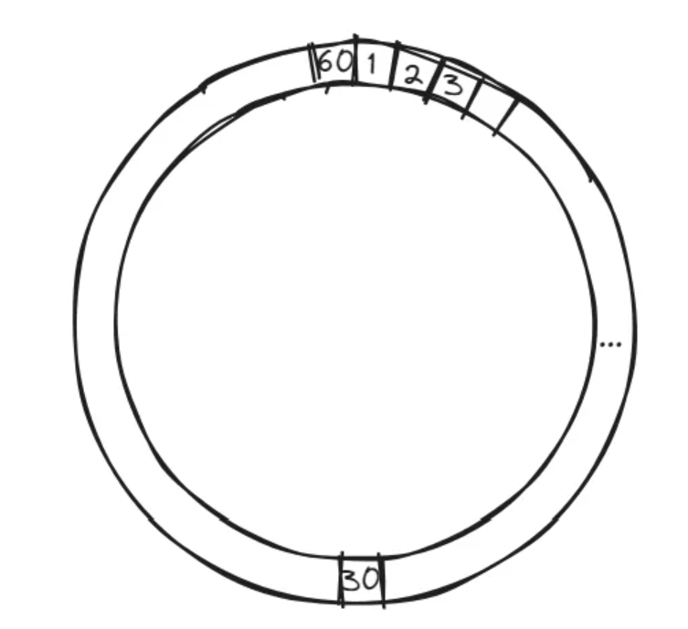
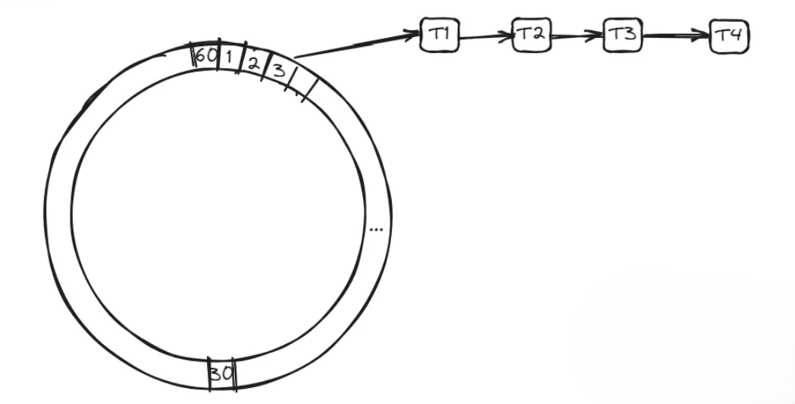
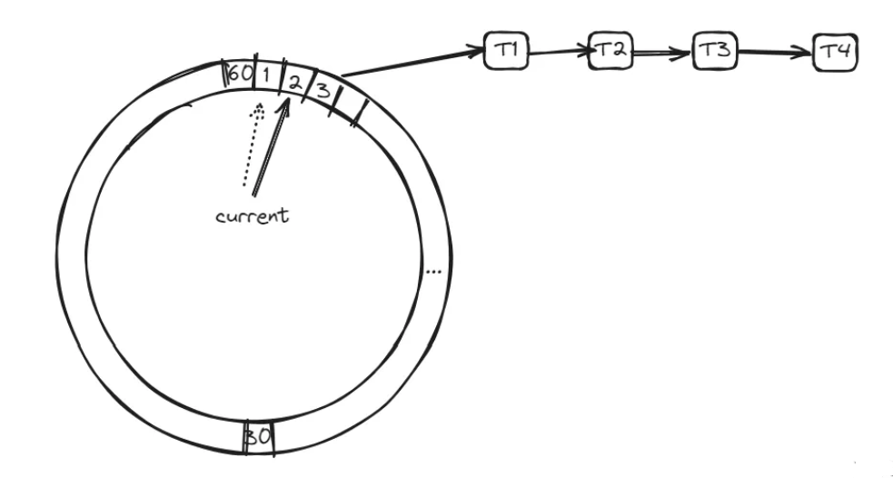
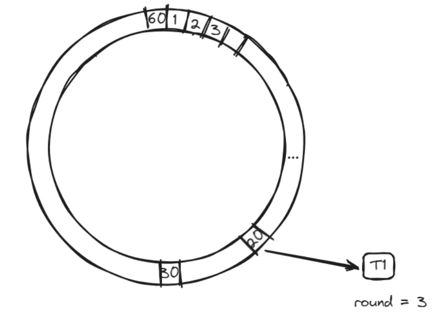
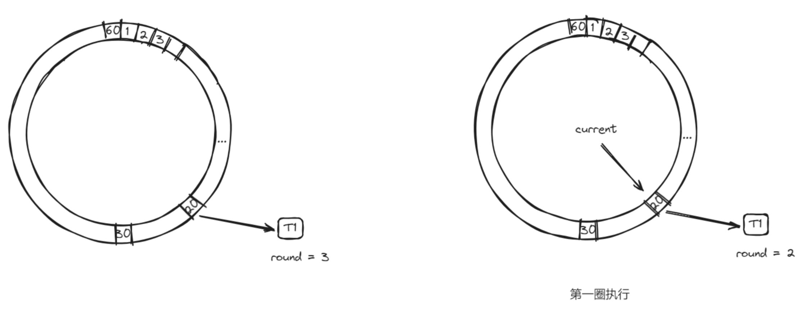
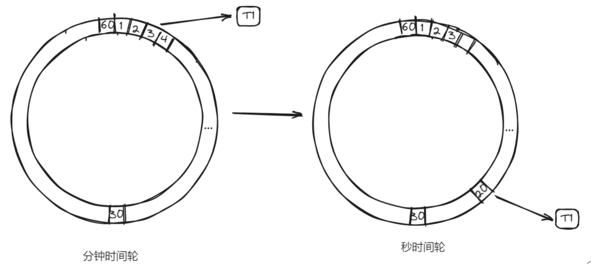

# 面试题-其他技术

## 定时任务

#### 为什么定时任务可以定时执行？

定时任务可以定时执行的原理是通过**操作系统提供的定时器实现的**。定时器是计算机系统的一个重要组成部分，它可以周期性地发出信号或中断，以便操作系统或其他应用程序可以在指定的时间间隔内执行某些任务。

在定时任务中，操作系统或应用程序会利用计时器或定时器来定期检查当前时间是否达到了预定的执行时间，如果当前时间已经达到了预定的时间，系统会自动执行相应的任务。在操作系统中，常见的定时任务管理工具有 crontab（Linux系统）、Windows Task Scheduler（Windows系统）等。

总之，定时任务可以定时执行，是因为操作系统或应用程序利用定时器周期性地检查当前时间，一旦达到预定时间就会自动执行相应的任务。

> 为什么 Cron 表达式能定时执行？
>
> Cron 表达式是我们经常使用的一种表达式，主要用于配置各种定时任务的。
>
> 他可以定时执行其实底层也是基于操作系统的定时器的机制。在常见的计算机操作系统中，都提供了一种定时器机制，可以设置定时器来触发某个操作或执行某个任务。Cron 表达式利用这种机制实现了定时执行任务的功能。
>
> 具体来说，当我们在系统中设置了一个 Cron 任务后，Cron 服务会根据 Cron 表达式计算出任务下一次应该执行的时间点，并将这个时间点与当前时间点进行比较。如果当前时间点已经超过了任务的执行时间点，那么 Cron 服务会立即执行该任务；否则，Cron 服务会将任务的执行时间点记录下来，并在这个时间点到来时再执行任务。
>
> 为了实现这种定时器机制，Cron 表达式通常会被转化为一些特定的参数，然后传递给操作系统或程序库，让它们来设置相应的定时器。不同的操作系统或程序库对于定时器的实现方式可能有所不同，但它们的基本思想都是一致的：在指定的时间点触发一个定时器事件，然后执行相应的任务或操作。
>
> 在 Unix/Linux 系统中，Cron 服务通常是通过一个名为 cron 的系统服务来实现的。这个服务会周期性地检查系统中已经配置好的 crontab 文件，根据其中的配置信息来决定哪些任务应该被执行。
>
> crontab 文件中包含了多条定时任务的配置信息，其中每条任务都由五个时间字段和一个命令行指令组成。这五个时间字段分别表示分钟、小时、日期、月份和星期几，cron 会根据这些时间信息来判断任务何时应该被执行。
>
> 当定时器达到指定时间时，cron 会根据 crontab 文件中的配置信息，启动相应的命令行指令来执行任务。这样，定时任务就可以按照预定的时间定时执行了。
>
> 在 Windows 系统中，Cron 服务通常是通过 Task Scheduler（任务计划程序）来实现的。这个程序也会周期性地检查系统中已经配置好的任务计划，根据其中的配置信息来决定哪些任务应该被执行。

#### Java 中实现定时任务的几种方式

想要用 Java 中原生的特性实现定时任务，主要有以下几种常见的手段：

**1、Timer 类和 TimerTask 类：** Timer 类是 Java SE5 之前的一个定时器工具类，可用于执行定时任务。 TimerTask 类则表示一个可调度的任务，通常通过继承该类来实现自己的任务，然后使用 `Timer.schedule()` 方法来安排任务的执行时间。

**2、ScheduledExecutorService 类：** ScheduledExecutorService 是 Java SE5 中新增的一个定时任务执行器，它可以比Timer更精准地执行任务，并支持多个任务并发执行。通过调用 `ScheduledExecutorService.schedule()` 或 `ScheduledExecutorService.scheduleAtFixedRate()` 方法来安排任务的执行时间。

**3、DelayQueue：**DelayQueue 是一个带有延迟时间的无界阻塞队列，它的元素必须实现 Delayed 接口。当从 DelayQueue 中取出一个元素时，如果其延迟时间还未到达，则会阻塞等待，直到延迟时间到达。因此，我们可以通过将任务封装成实现 Delayed 接口的元素，将其放入 DelayQueue 中，再使用一个线程不断地从 DelayQueue 中取出元素并执行任务，从而实现定时任务的调度。

以上几种方案，相比于xxl-job这种定时任务调度框架来说，他实现起来简单，不须要依赖第三方的调度框架和类库。方案更加轻量级。

当然这个方案也不是没有缺点的，首先，以上方案都是基于 JVM 内存的，需要把定时任务提前放进去，那如果数据量太大的话，可能会导致 OOM 的问题；另外，基于 JVM 内存的方案，一旦机器重启了，里面的数据就都没有了，所以一般都需要配合数据库的持久化一起用，并且在应用启动的时候也需要做重新加载。

还有就是，现在很多应用都是集群部署的，那么集群中多个实例上的多个任务如何配合是一个很大的问题。

> 以上是在不引入任何其他第三方框架的情况下可以使用的 JDK 自带的功能实现定时任务，如果可以引入一些常用的类库，如 Spring 等，还有以下几种方案：

**1、Spring的@Scheduled 注解：** Spring 框架提供了一个方便的定时任务调度功能，可以使用@Scheduled注解来实现定时任务。通过在需要执行定时任务的方法上加上 @Scheduled 注解，并指定执行的时间间隔即可。

**2、Quartz 框架：** Quartz 是一个流行的开源任务调度框架，它支持任务的并发执行和动态调度。通过创建 JobDetail 和 Trigger 对象，并将它们交给 Scheduler 进行调度来实现定时任务。

**3、xxl-job：**xxl-job 是一款分布式定时任务调度平台，可以实现各种类型的定时任务调度，如定时执行 Java 代码、调用 HTTP 接口、执行 Shell 脚本等。xxl-job 采用分布式架构，支持集群部署，可以满足高并发、大数据量的任务调度需求。

**4、Elastic-Job：**Elastic-Job 是一款分布式任务调度框架，可以实现各种类型的定时任务调度，如简单任务、数据流任务、脚本任务、Spring Bean 任务等。Elastic-Job 提供了丰富的任务调度策略，可以通过配置 cron 表达式、固定间隔等方式实现定时任务调度。Elastic-Job 支持分布式部署，提供了高可用性和灵活的扩展性，可以满足高并发、大数据量的任务调度需求。

#### 什么是时间轮？

时间轮算法（Time Wheel Algorithm）是一种用于处理定时任务和调度的常见算法。

时间轮算法主要需要定义一个时间轮盘，在一个时间轮盘中划分出多个槽位，每个槽位表示一个时间段，这个段可以是秒级、分钟级、小时级等等。如以下就是把一个时间轮分为了 60 个时间槽，每一个槽代表一秒钟。



然后当我们有定时任务需要执行的时候，就把他们挂在到这些槽位中，这个任务将要在哪个槽位中执行，就把他挂在到哪个槽位的链表上。

比如当前如果是 0 秒，那么要 3 秒后执行，那就挂在槽位为 3 的那个位置上。



而随着时间的推移，轮盘不断旋转，任务会被定期触发。

因为这个时间轮是 60 个槽位，那么他就会在一分钟完整的转完一圈，那么就有一个指针，每一秒钟在槽位中进行一次移动。这个操作是有一个单独的线程来做的，他的工作就是每一秒钟改变一次 current 指针。



然后还有一个线程池，在指针轮转到某个槽位上的时候，在线程池中执行链表中需要执行的任务。

以上就是一个简单的时间轮算法，但是这个时间轮存在一个问题，那就是我们把它分了60个槽，那么就意味着我们的定时任务最多只支持 60s 以内的。

**那么，怎么解决这个问题呢？**

首先能想到的最简单的方式就是加槽位，比如我要支持 5 分钟的延迟任务，那么就可以把槽位设置为300个。

还有就是也可以调整时间轮槽位移动的延迟，比如把 1 秒钟移动一次，改为 1 分钟移动一次，那么就可以支撑 60 分钟的延迟任务了。

但是这两个办法都不够灵活，而且是有瓶颈的。于是有一种新的办法。

- round

在时间轮中增加一个 round 的标识，标识运行的圈数，比如说上面的 60s 的时间轮，如果我要 200s 之后运行，那么我在设置这个任务的时候，就把他的round设置为 200/60 = 3 ，然后再把它放到 200%60 = 20 的这个槽位上。



有了这个 round 之后，每一次 current 移动到某个槽位时，检查任务的 round 是不是为 0，如果不为 0，则减一。



这样时间轮转到第三圈时，round 的值会变成 0，再第四圈运行到 current=20 的时候，发现 round=0 了，那么就可以执行这个任务了。

这样就解决了我们前面说的问题了。

但是这个方案还存在一个问题，那就是这个 round 的检查过程，需要把所有任务都遍历一遍，效率还是没那么高。

- 分层时间轮

为了解决遍历所有任务的问题，我们可以引入分层时间轮。我们在刚刚的秒级时间轮的基础上，在定义一个分钟级时间轮



也就是说我们对于200s以后执行这个任务，我们先把他放到分钟级时间轮上，这个时间轮的槽位每一分钟移动一次，当移动时候，发现某个槽位上有这一分钟内需要执行的任务时。

把这个任务取出来，放到秒级时间轮中。这样在第 3 分 20 秒的时候，就可以运行这个任务了。

这就是分层时间轮。在分层时间轮包括多个级别的时间轮，每个级别的时间轮都有不同的粒度和周期。

通常，粒度较细的时间轮拥有更短的周期，而粒度较粗的时间轮拥有更长的周期。例如，分层时间轮可以包括毫秒级、秒级、分钟级等不同粒度的时间轮。

当一个任务需要被调度时，它被分配到适当级别的时间轮中，每个级别的时间轮都独立地旋转。当一个时间轮的指针到达某个位置时，它将触发执行该级别时间轮中的任务。如果某个任务在较粗的时间轮中已经到期，它将被升级到下一级时间轮。

当任务升级到下一级时间轮时，任务的调度粒度变得更细。这意味着任务将在更短的时间内被触发，从而更精确地满足其调度要求。

> 【典型应用】
>
> 时间轮算法在各种框架和库中都有广泛的应用。以下是一些应用时间轮算法的常见框架和库：
>
> 1、Netty：Netty 是一款高性能的网络通信框架，它使用时间轮算法来处理定时任务和超时检测。时间轮用于管理通道的超时和重连机制。
>
> 2、Akka：Akka 是一个并发编程框架，它包括一个调度器，该调度器使用时间轮算法来管理和触发并发任务。这使得 Akka 能够支持高并发和复杂的任务调度需求。
>
> 3、Kafka：Apache Kafka 是一个分布式消息队列系统，它使用时间轮算法来管理消息的过期和删除。时间轮用于清理过期消息，以释放存储空间。
>
> 4、Hystrix：Hystrix 是 Netflix 开发的容错和延迟容忍库，它使用时间轮来管理命令执行和熔断状态的转换。
>
> 5、Disruptor：Disruptor 是一个高性能并发框架，它使用时间轮算法来管理任务的并发执行，以提高处理大量事件的性能。
>
> 6、xxl-job：在以前的版本的 xxl-job 中，使用 quartz 做定时任务调度，但是在 7.28 版本中去除了quartz，改用了时间轮算法。

#### Java 中 Timer 实现定时调度的原理是什么？

Java 中的 Timer 类是一个定时调度器，用于在指定的时间点执行任务。JDK 中 Timer 类的定义如下：

```java
public class Timer {
    /**
     * The timer task queue.  This data structure is shared with the timer
     * thread.  The timer produces tasks, via its various schedule calls,
     * and the timer thread consumes, executing timer tasks as appropriate,
     * and removing them from the queue when they're obsolete.
     */
    private final TaskQueue queue = new TaskQueue();

    /**
     * The timer thread.
     */
    private final TimerThread thread = new TimerThread(queue);
}
```

以上就是Timer中最重要的两个成员变量：

1. TaskQueue：一个任务队列，用于存储已计划的定时任务。任务队列按照任务的执行时间进行排序，确保最早执行的任务排在队列前面。在队列中的任务可能是一次性的，也可能是周期性的。
2. TimerThread：Timer 内部的后台线程，它负责扫描 TaskQueue 中的任务，检查任务的执行时间，然后在执行时间到达时执行任务的 run() 方法。TimerThread 是一个守护线程，因此当所有非守护线程完成时，它会随之终止。

任务的定时调度的核心代码就在 TimerThread 中：

```java
class TimerThread extends Thread {
   
    boolean newTasksMayBeScheduled = true;

    /**
     * 存储 TimerTask 的队列
     */
    private TaskQueue queue;

    TimerThread(TaskQueue queue) {
        this.queue = queue;
    }

    public void run() {
        try {
            mainLoop();
        } finally {
            synchronized (queue) {
                newTasksMayBeScheduled = false;
                queue.clear(); 
            }
        }
    }

    /**
     * 主要的计时器循环。 
     */
    private void mainLoop() {
        while (true) {
            try {
                TimerTask task;
                boolean taskFired;
                synchronized (queue) {
                    // 等待队列变为非空
                    while (queue.isEmpty() && newTasksMayBeScheduled)
                        queue.wait();
                    if (queue.isEmpty())
                        break; // 队列为空，将永远保持为空；线程终止

                    // 队列非空；查看第一个事件并执行相应操作
                    long currentTime, executionTime;
                    task = queue.getMin();
                    synchronized (task.lock) {
                        if (task.state == TimerTask.CANCELLED) {
                            queue.removeMin();
                            continue;  // 无需执行任何操作，再次轮询队列
                        }
                        currentTime = System.currentTimeMillis();
                        executionTime = task.nextExecutionTime;
                        if (taskFired = (executionTime <= currentTime)) {
                            if (task.period == 0) { // 非重复，移除
                                queue.removeMin();
                                task.state = TimerTask.EXECUTED;
                            } else { // 重复任务，重新安排
                                queue.rescheduleMin(
                                  task.period < 0 ? currentTime   - task.period
                                                : executionTime + task.period);
                            }
                        }
                    }
                    if (!taskFired) // 任务尚未触发；等待
                        queue.wait(executionTime - currentTime);
                }
                if (taskFired)  // 任务触发；运行它，不持有锁
                    task.run();
            } catch (InterruptedException e) {
            }
        }
    }
}
```

可以看到，TimerThread 的实际是在运行 mainLoop 方法，这个方法一进来就是一个 while(true) 的循环，他在循环中不断地从 TaskQueue 中取出第一个任务，然后判断他是否到达执行时间了，如果到了，就触发任务执行。否则就继续等一会再次执行。

不断地重复这个动作，从队列中取出第一个任务进行判断，执行。。。

这样只要有新的任务加入队列，就在队列中按照时间排序，然后唤醒 timerThread 重新检查队列进行执行就可以了。代码如下：

```java
    private void sched(TimerTask task, long time, long period) {
        if (time < 0)
            throw new IllegalArgumentException("Illegal execution time.");

        // Constrain value of period sufficiently to prevent numeric
        // overflow while still being effectively infinitely large.
        if (Math.abs(period) > (Long.MAX_VALUE >> 1))
            period >>= 1;

        synchronized(queue) {
            if (!thread.newTasksMayBeScheduled)
                throw new IllegalStateException("Timer already cancelled.");

            synchronized(task.lock) {
                if (task.state != TimerTask.VIRGIN)
                    throw new IllegalStateException(
                        "Task already scheduled or cancelled");
                task.nextExecutionTime = time;
                task.period = period;
                task.state = TimerTask.SCHEDULED;
            }
        	//新任务入队列
            queue.add(task);
            //唤醒任务
            if (queue.getMin() == task)
                queue.notify();
        }
    }
```

> 优缺点
>
> Timer 类用于实现定时任务，最大的好处就是他的实现非常简单，特别的轻量级，因为它是 Java 内置的，所以只需要简单调用就行了。
>
> 但是他并不是特别的解决定时任务的好的方案，因为他存在以下问题：
>
> 1、Timer 内部是单线程执行任务的，如果某个任务执行时间较长，会影响后续任务的执行。
> 2、如果任务抛出未捕获异常，将导致整个 Timer 线程终止，影响其他任务的执行。
> 3、Timer 无法提供高精度的定时任务。因为系统调度和任务执行时间的不确定性，可能导致任务执行的时间不准确。
> 4、虽然可以使用 cancel 方法取消任务，但这仅仅是将任务标记为取消状态，仍然会在任务队列中占用位置，无法释放资源。这可能导致内存泄漏。
> 5、当有大量任务时，Timer 的性能可能受到影响，因为它在每次扫描任务队列时都要进行时间比较。
> 6、Timer 执行任务完全基于 JVM 内存，一旦应用重启，那么队列中的任务就都没有了

#### 实现一个定时任务，可以用什么数据结构及算法？

定时任务，是我们经常要用的，不管是 Java 中内置的，还是一些框架中的。但是想要实现一个定时任务，其实底层依赖的无非就是以下几种数据结构与算法：

**1、小顶堆：**我们可以使用小顶堆来管理定时事件，其中每个事件包含触发时间戳和要执行的任务信息。最紧要触发的任务一直处于堆的根部。通过小顶堆，可以高效地找到最近触发的定时事件，并在触发时执行相应的任务。

如 Java 中的 Timer、DelayQueue 等，都是基于小顶堆实现的。

**2、时间轮算法：**时间轮算法是一种时间管理算法，可以高效地处理定时任务。它将时间划分成若干个时间槽，并使用循环队列来存储在每个时间槽上触发的任务，从而避免了遍历整个定时事件集合的开销。

如 Netty 中的 HashedWheelTimer、Quartz Scheduler、Kafka 中等都有时间轮算法的应用。

**3、链表（用的比较少）：**链表可以用于管理定时事件，每个节点包含触发时间戳和任务信息。链表中的节点按照触发时间戳从小到大排列，通过遍历链表，可以找到最近触发的定时事件并执行任务。

#### 定时任务扫表的方案有什么缺点？

通过定时任务扫表，是我们在业务中经常会做的事情，一般是直接用 xxl-job 等定时任务去分页查询数据库，然后进行业务操作，这个方案，一般是最简单的，也是最有效的。

但是，他还是有一些缺点的，如：

1、数据量多扫表慢
2、集中式扫表会影响正常业务
3、定时扫表存在延迟问题

那么，这几个问题，该如何解决呢？

- **数据量多，扫表慢**

随着需要扫描的表中的数据量越来越大，通过定时任务扫表的方式会越来越慢，那么想要解决这个问题，首先可以考虑加索引。

我们可以在 state 字段上增加一个索引，虽然这个字段的区分度不高，但是一般来说，这张表中， SUCCESS 的数据量占 90%，而 INIT 的数据量只占 10%，而我们扫表的时候只关心 INIT 即可，所以增加索引后，扫表的效率是可以大大提升的。

其次，可以考虑多线程并发扫表，这里可以考虑采用线程池，在任务中开多个线程并发的从数据库中扫描数据进行处理。

但是这样做，会带来一个问题，那就是多个线程之间如何做好隔离，如何确保不会出现并发导致同一条记录被多个线程执行多次呢？

首先最基本的保障，扫表之后的处理逻辑要做好幂等控制，一旦出现了重复的情况，下游也能因为做了幂等而不会重复处理。

除此以外，在扫表的时候，可以通过分段的思想进行数据隔离。举个例子：

```sql
Long minId = messageService.getMinInitId();


for(int i=1;i<= threadPool.size();i++){
    Long maxId = minId + segmentSize()*i;

    List<Message> messages = messageService.scanInitMessages(minId,maxId);

    proccee(messages);
    minId = maxId + 1;
}
```

像上面的例子中，假设有 10 个线程，那么第一个线程就扫描 ID 处于 0-1000 的数据，第二个线程扫描 1001-2000 的数据，第三个线程扫描 2001-3000 的数据。这样以此类推，线程之间通过分段的方式就做好了隔离，可以避免同一个数据被多个线程扫描到。

这个做法，有个小问题，那就是 INIT 的数据的 ID 可能不是连续的，那么就需要考虑其他的分段方式，比如在事件表中增加一个业务 ID，然后根据这个 biz_id 做分片也可以。

```sql
for(int i=1;i<= threadPool.size();i++){
    List<Message> messages = messageService.scanInitMessages(i);
    proccee(messages);
}
```

这样在SQL中：

```sql
SELECT * FROM RETRY_MESSAGE WHERE 
STATE = "INIT"
AND BIZ_ID LIKE "${frontNumber}%"
```

那么，不同的线程执行的 SQL 就不一样了分别是：

```sql
SELECT * FROM RETRY_MESSAGE WHERE 
STATE = "INIT"
AND BIZ_ID LIKE "1%"

SELECT * FROM RETRY_MESSAGE WHERE 
STATE = "INIT"
AND BIZ_ID LIKE "2%"

SELECT * FROM RETRY_MESSAGE WHERE 
STATE = "INIT"
AND BIZ_ID LIKE "3%"

SELECT * FROM RETRY_MESSAGE WHERE 
STATE = "INIT"
AND BIZ_ID LIKE "4%"
```

这样也是可以做分段的。

- **集中式扫表会影响正常业务**

如果业务量比较大的话，集中式的扫描数据库势必给数据库带来一定的压力，那么就会影响到正常的业务。

那么想要解决这个问题，首先可以考虑，不扫主库，而是扫描备库。之所以能这么做，是因为这个业务场景一般都是可以接受一定的数据延迟的，那么备库带来延迟就可以忽略，但是备库是没有业务操作的，所以对备库的扫描是不会对业务造成影响的。

当然，这里还要考虑一个问题，那就是备库扫描数据之后的执行，执行完该如何同步到主库，这里可以直接修改主库，主备库数据 ID 一致的，直接去修改主库的就行了。不建议直接在备库上修改。

但是不管怎么样，备库还是可以分担扫表的这个大量高峰请求的。

除了扫备库，还有一个方案，那就是做分库了。把原来集中在同一个数据库的数据分散到不同的数据库中，这样用集群代替单库来整体对外提供服务，可以大大的提升吞吐量。

因为多个数据库的话，每个库提供的连接数就会多，并且多个实例的话，CPU、IO、LOAD 这些指标也可以互相分担。

- **定时扫表存在延迟问题**

定时任务都是集中式的定时执行的，那么就会存在延迟的问题。随着数据库越来越大，延时会越来越长。

想要降低延迟，那就要抛弃定时任务的方案，可以考虑延迟消息，基于延迟消息来做定时执行。

用了延迟消息之后，还可以缓解数据库的压力。也能比定时扫表的性能要好，实时性也更高。

当然，引入另外一个中间件也需要考虑成本的。

- **同步转异步**

再提一个方案，那就是同步转异步。什么叫同步转异步呢，那就是同步先干一把，失败了的话，再异步执行。如：

```java
private static ThreadFactory namedThreadFactory = new ThreadFactoryBuilder()
    .setNameFormat("hollis-pool-%d").build();

private static ExecutorService pool = new ThreadPoolExecutor(5, 200,
    0L, TimeUnit.MILLISECONDS,
    new LinkedBlockingQueue<Runnable>(1024), namedThreadFactory, new ThreadPoolExecutor.AbortPolicy());

@Transactional(rollbackFor = Exception.class)
public void pay(PayRequest payRequest){

	//在同一个事务中做本地业务操作和记录消息
	payService.doPay(payRequest);
    retryMessageService.init(payRequest);

	//同步执行一次外部调用
    try{
        Result result = outerService.doSth(payRequest);
        if(result.isSuccess()){
            retryMessageService.success(payRequest);
        }
    }catch(Exception e){
        // 捕获异常，失败依赖异步重试
    }
}
```

如上，在同步接口中，先尝试着执行一次要可能会失败的任务，如果成功了，那就把事件推进到成功，。如果失败了也无所谓，因为会有异步定时任务捞起来重试。

#### xxl-job 如何保证一任务只会触发一次？

XXL-JOB 作为一个定时任务调度工具，他需要确保同一时间内同一任务只会在一个执行器上执行。这个特性对于避免任务的重复执行非常关键，特别是在分布式环境中，多个执行器实例可能同时运行相同的任务。

这个特性被 XXL-JOB 描述为“调度一致性”，并且官方文档也给出了这个问题的答案：

> “调度中心”通过 DB 锁保证集群分布式调度的一致性, 一次任务调度只会触发一次执行；

调度中心在 XXL-JOB 中负责管理所有任务的调度，它知道哪些任务需要执行，以及任务的调度配置（如 CRON 表达式）。当到达指定的执行时间点，调度中心会选择一个执行器实例来执行任务。

调度相关的 JobScheduleHelper 是 XXL-JOB 中的一个核心组件，负责协调任务的调度逻辑，确保任务触发的正确性和唯一性。

通过查看 JobScheduleHelper 的源码，在他的 scheduleThread 的方法中，我们可以看到以下代码

```java
try {
    conn = XxlJobAdminconfig·getAdminConfig()·getDataSource()·getConnection();
    connAutocommit = conn.getAutoCommit();
    conn.setAutocommit(false);
    // 这明显是一个基于数据的悲观锁实现的一个加锁过程。
    preparedstatement = conn.preparestatement( "select * from xxl_job_lock where lock_name = 'schedule_lock' for update" ); 
    preparedstatement.execute()
}
```

xxl_job_lock 是 XXL-JOB 的一张表，是一张任务调度锁表；

在使用 XXL-JOB 的时候需要提前创建好这张表。并且需要提前插入一条记录：

INSERT INTO `xxl_job_lock` ( `lock_name`) VALUES ( 'schedule_lock');

> 通过 select for update 的方式添加一个悲观锁，可以确保在同一时刻，只能有一个事务获取到锁。这样获取到锁的线程就可以执行任务的调度了。
>
> 并且这个锁会随着事务的存在一直存在，这个事务最终是在方法的 finally 中实现的：

#### xxl-job 支持分片任务吗？实现原理是什么？

支持！分片任务非常适用于处理大数据量的任务，其实就是可以将一个大任务划分为多个子任务并行执行，以提高效率。

分片任务能更好的利用集群的能力，可以同时调度多个机器并行运行任务。

分片任务的实现原理包括以下几个核心步骤：

**1、任务分配：** 

- 当一个分片任务被触发时，调度器会根据任务的分片参数决定需要多少个执行器参与任务。
- 每个执行器或执行线程会接收到一个分片索引（shard index）和分片总数（shard total）。

**2、分片参数：** 

- 分片索引（从0开始）标识了当前执行器处理的是哪一部分数据。
- 分片总数告诉执行器总共有多少个分片。

**3、并行执行：** 

- 每个执行器根据分配到的分片索引并行执行其任务。例如，如果一个任务被分为10个片，那么每个执行器可能负责处理10%的数据。

**4、处理逻辑：** 

- 开发者在任务实现时需要根据分片索引和分片总数来调整处理逻辑，确保每个分片处理正确的数据段。

**5、结果汇总：** 

- 分片执行完毕后，各个执行器的执行结果可以被独立处理，或者可以通过某种机制进行结果的汇总和整合。

当一个任务被分片任务调度的时候，会带着 shardIndex 和 shardTotal 两个参数过来，我们就可以解析这两个参数进行分片执行。

```sql
public ReturnT<String> orderTimeOutExecute() {
   
    int shardIndex = XxlJobHelper.getShardIndex();
    int shardTotal = XxlJobHelper.getShardTotal();

    if (userId % shardTotal == shardIndex) {
        // 执行任务
        System.out.println("执行任务: 用户 " + userId);
    } else {
        // 不执行任务
        System.out.println("用户 " + userId + " 不执行任务");
    }
}
```

举个例子，假如我们要处理用户订单的关闭任务，就可以用用户 id 对 shardTotal 取模，然后得到的结果如果和当前的 shardIndex 相等，则执行，否则不执行。

