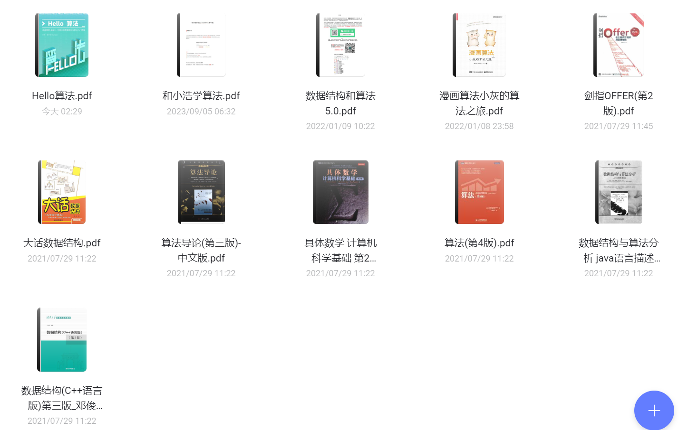
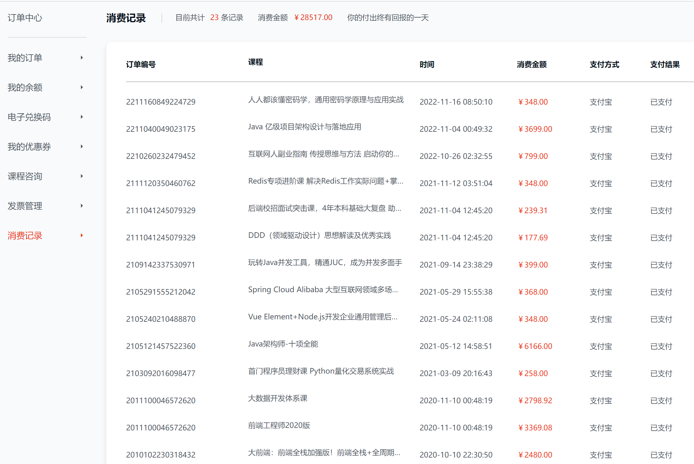
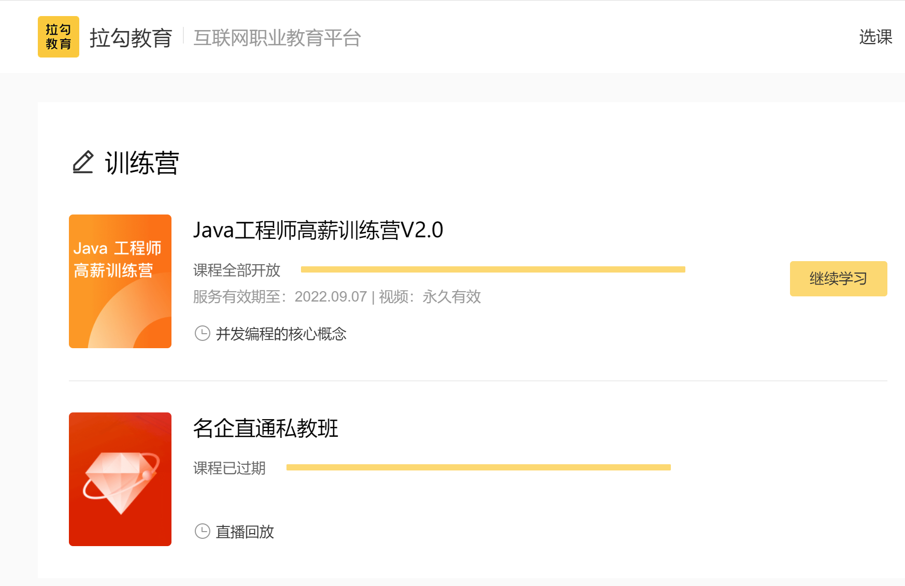

# java-interview

# [文中包含的加密资源/学习笔记，从这里获取提取码，密码：7777](https://pan.baidu.com/s/1bSkP-uI-vA3B7v-Ncs3Zvg)

## 学习资料大全！！！

JDK 文档

[JDK 21 Documentation](https://docs.oracle.com/en/java/javase/21/)

GitHub 中文资料榜 - Java

- https://github.com/GrowingGit/GitHub-Chinese-Top-Charts/blob/master/content/charts/overall/knowledge/Java.md

GitHub stars 最高的 Java 项目

- https://github.com/search?q=stars%3A%3E1000+language%3AJava&type=repositories&l=Java&s=stars&o=desc

### 面试准备系列

Hollis 的 Java 八股文（需要购买，抖音搜"程序员Hollis"，购入体验：持续更新的，物超所值，强烈推荐！！！）

- https://www.yuque.com/hollis666/ca2plb

Java 面试八股文

- https://javabetter.cn/sidebar/sanfene/nixi.html

- https://github.com/itwanger/toBeBetterJavaer

Java 学习 + 面试指南

- https://javaguide.cn/home.html
- https://github.com/Snailclimb/JavaGuide

互联网 Java 工程师进阶知识完全扫盲

- https://doocs.github.io/advanced-java/#/

- https://github.com/doocs/advanced-java

【系统学习】技术面试必备基础知识、Leetcode、计算机操作系统、计算机网络、系统设计

- https://github.com/CyC2018/CS-Notes

### 实战能力提升

**新手求快就花钱，只推荐一个网站，最佳选择没有之一**

- [imooc](#imooc)

**设计模式**

- https://github.com/fuzhengwei/itstack-demo-design
- https://github.com/CyC2018/CS-Notes/blob/master/notes/%E8%AE%BE%E8%AE%A1%E6%A8%A1%E5%BC%8F%20-%20%E7%9B%AE%E5%BD%95.md

**完整的开源电商系统**

- https://github.com/macrozheng

**Java 超全技术栈学习**

- https://mrbird.cc/tags/

**Spring 系列**

- https://github.com/wuyouzhuguli/SpringAll

> 
>
> Tips
>
> 
>
> 实战提升，就是去 GitHub 找开源项目学习，或者工作中慢慢爬，没有捷径，花钱也只是前期会快点（多接触优秀的代码、编程习惯、设计，少走弯路）。
>
> 后期主要靠自己了，花钱已经不能提速了。
>
> 

### 算法系列

**LeetCode（全）**

- 系统学习：https://leetcode.cn/leetbook/
- 题库：https://leetcode.cn/problemset/all/

**牛客网在线编程**

- https://www.nowcoder.com/exam/oj?page=1&tab=%E7%AE%97%E6%B3%95%E7%AF%87&topicId=295

**大佬整理（高频）**

- 《Hello 算法》：动画图解、一键运行的数据结构与算法教程
  - https://www.hello-algo.com/
  - https://github.com/krahets/hello-algo
- 用动画的形式呈现解LeetCode题目的思路
  - https://blog.algomooc.com/
  - https://github.com/MisterBooo/LeetCodeAnimation

- 小浩算法 - 针对小白的算法训练
  - https://www.lintcode.com/
  - https://github.com/geekxh/hello-algorithm

- LeetCode、《剑指 Offer（第 2 版）》、《程序员面试金典（第 6 版）》题解

  - https://doocs.github.io/leetcode/

  - https://github.com/doocs/leetcode

**其他算法学习网站**

- 编程竞赛知识整合站点：https://oi-wiki.org/

- 数据结构可视化：https://www.cs.usfca.edu/~galles/visualization/Algorithms.html
- 数据结构和算法动态可视化：https://visualgo.net/zh
- 二叉树：http://520it.com/binarytrees/
- 二叉树可视化：http://btv.melezinek.cz/home.html
- B 树可视化：https://yangez.github.io/btree-js/
- 算法可视化（超牛）：https://algorithm-visualizer.org/
- 常用数据结构算法复杂度：https://www.bigocheatsheet.com/
- 代码实现打印二叉树：https://www.bigocheatsheet.com/

**算法相关书籍**

- 数据结构(C++语言版)第三版_邓俊辉
- 大话数据结构
- Hello算法
- 漫画算法小灰的算法之旅
- 剑指OFFER(第2版)
- 算法(第4版)
- 算法导论(第三版)-中文版
- 具体数学 计算机科学基础
- 数据结构与算法分析 java语言描述

> 链接：https://pan.baidu.com/s/1NU-gpQ7g2s5BJmmUL7WenA?pwd=var4 
> 提取码：var4 

**实在学得吃力、学不下去，就看视频学**

- 学堂在线 -【国家精品课】清华大学《数据结构》邓俊辉
  - https://www.xuetangx.com/course/THU08091000384/19318292
  - https://www.xuetangx.com/course/THU08091002048/19318085

- 中国大学MOOC -【国家精品课】浙江大学《数据结构》
  - https://www.icourse163.org/course/ZJU-93001
- 中国大学MOOC -【国家精品课】华中科技大学《数据结构》
  - https://www.icourse163.org/course/HUST-1001907004
- 中国大学MOOC -【国家精品课】南京邮电大学《数据结构》 
  - https://www.icourse163.org/course/NJUPT-1206361803

**如果上面这些你还学不下去，就花钱吧**

- 【慕课网】算法与数据结构体系课
  - https://class.imooc.com/sale/datastructure
- 【慕课网】算法与数据结构高手养成-求职提升特训课
  - https://coding.imooc.com/class/589.html
- 【慕课网】玩转算法面试 -- Leetcode真题分门别类讲解
  - https://coding.imooc.com/class/82.html
- 【慕课网】算法与数据结构（C++版） 面试/评级的算法复习技能包
  - https://coding.imooc.com/class/71.html
- 【慕课网】玩转算法系列 -- 图论精讲 （Java版）
  - https://coding.imooc.com/class/370.html
- 【慕课网】算法面试专题--竞赛命题人带你刷70+中高级题型
  - https://coding.imooc.com/class/478.html
- 【慕课网】7个经典应用诠释Java算法精髓
  - https://coding.imooc.com/class/138.html
- 【慕课网】JavaScript版数据结构与算法 轻松解决前端算法面试
  - https://coding.imooc.com/class/446.html

### 算法进阶 + 数学 + 应用

**算法进阶**

- 【慕课网】个性化推荐算法实战（可用于毕设）
  - https://coding.imooc.com/class/297.html

- 【慕课网】Python3入门机器学习 经典算法与应用
  - https://coding.imooc.com/class/169.html
- 【慕课网】Python3入门人工智能，掌握机器学习+深度学习
  - https://coding.imooc.com/class/418.html
- 【慕课网】玩转机器学习之神经网络，系统入门算法工程师
  - https://coding.imooc.com/class/547.html
- 【慕课网】深度学习之目标检测常用算法原理+实践精讲
  - https://coding.imooc.com/class/chapter/298.html
- 【慕课网】PyTorch入门到进阶，实战计算机视觉与自然语言处理
  - https://coding.imooc.com/class/440.html

**数学**

- 【慕课网】专为程序员设计的高数补习班 贴合开发讲解高数
  - https://coding.imooc.com/class/427.html

- 【慕课网】结合编程学数学 专为程序员设计的线性代数
  - https://coding.imooc.com/class/260.html
- 【慕课网】专为程序员设计的统计课
  - https://coding.imooc.com/class/371.html
- 【慕课网】讲透机器学习概率统计，快速打造算法基础核心能力
  - https://coding.imooc.com/class/545.html

**应用**

- 【慕课网】Kaggle 竞赛经典案例深度剖析
  - https://coding.imooc.com/class/504.html

- 【慕课网】程序员理财课 Python 量化交易系统实战
  - https://coding.imooc.com/class/494.html
- 【慕课网】Python 量化交易工程师养成实战-金融高薪领域
  - https://coding.imooc.com/class/371.html
- 【慕课网】PyTorch 深度学习开发医学影像端到端判别项目
  - https://coding.imooc.com/class/612.html

**AI 方向学习路线**

- 【慕课网】Python量化交易开发从入门到就业系统养成
  - https://coding.imooc.com/learningpath/route?pathId=57
- 【慕课网】快速入门深度学习之目标检测
  - https://coding.imooc.com/learningpath/route?pathId=48
- 【慕课网】从0入门人工智能学习
  - https://coding.imooc.com/learningpath/route?pathId=28
- 【慕课网】AI人工智能算法工程师
  - https://class.imooc.com/sale/aialgorithm
- 【慕课网】LLM大语言模型算法特训  带你转型AI大语言模型算法工程师
  - https://class.imooc.com/sale/llm

### 免费学习网站

- [学堂在线 - 清华、北大等高校计算机课程](https://www.xuetangx.com/)
- [中国大学MOOC - 各大高校计算机课程](https://www.icourse163.org/channel/3002.htm)
- [网易云课堂 - 大学计算机课程（部分关闭了，但b站找得到）](https://study.163.com/curricula/cs.htm)
- [阿里云培训中心](https://edu.aliyun.com/explore/)
- [牛客网（求职面试必备、刷题、AI模拟面试，还有 app 移动端）](https://www.nowcoder.com/)

### 贵，但仍然强烈推荐的学习网站（我自己一直在用）

> 在线教育网站排名：https://top.chinaz.com/hangye/index_jiaoyu_zaixianjiaoyu_alexa.html
>
> 慕课网排名前10，编程类第一，【专业的教学经理】，高质量差异化内容。

[慕课网-程序员的梦工厂](https://www.imooc.com/)

- [免费课（入门还是可以的）](https://www.imooc.com/course/list)

- [慕课教程（这都是免费的）](https://www.imooc.com/wiki/)
- [慕课专栏（百元内精讲课）](https://www.imooc.com/read)
- [学习路线 - 系统化学习（这个真的很赞！！！）](https://coding.imooc.com/learningpath/list)
- [实战课 - 实用性很强，可以直接拿到工作中用的](https://coding.imooc.com/)
- [大实战课 - 可以作为简历亮点，建议直接部署到服务器，给面试官展示，效果炸裂！！！](https://coding.imooc.com/?tx=tiny)
- [精品体系课（很贵，但真的很不错！！！）](https://class.imooc.com/)

**下面是我自己买过的一些课程截图，证明我不是瞎推荐，是实打实地花了钱觉得好的。**

**并不是无脑推荐，也买过其他网站的课程，对比过，还是推荐 imooc 的课，其他网站也有优质的课，但是整体质量没法比。**

## Java 基础

[面试题-Java基础](./01_java-basic/面试题-Java基础.md)

<blockquote alt="info">
学习方式：书 + 视频 + coding
</blockquote>

#### 电子书 pdf

[Java核心技术 卷Ⅰ 基础知识（原书第11版）- JDK11](https://pan.baidu.com/s/1Ln_GLID64DaUDKGCcMtw_Q?pwd=cy4d)

[Java核心技术 卷Ⅱ 高级特性（原书第11版）- JDK11](https://pan.baidu.com/s/1fjm3r4gRoh5VGacD2Z0IpQ?pwd=03cj)

[Java核心技术 卷Ⅰ+ 卷Ⅱ（第12版）- JDK17](https://pan.baidu.com/s/1I8lQGXSoC0GNK5RcG2h2TA?pwd=h6de)

#### 视频资源

[清华大学-mooc](https://www.xuetangx.com/search?query=java&org=1&classify=1&type=&status=&ss=manual_search&page=1)

[b 站很多免费的](https://www.bilibili.com/)

## Java 集合

[面试题-Java集合](./02_java-collection/面试题-Java集合.md)

<blockquote alt="info">
学习方式：源码 + 笔记 + UML图
</blockquote>

#### 源码解析

[ArrayList & LinkedList 源码解析](https://mrbird.cc/LinkedList-ArrayList%E6%BA%90%E7%A0%81%E8%A7%A3%E6%9E%90.html)

[ArrayList 核心源码 + 扩容机制](https://github.com/Snailclimb/JavaGuide/blob/main/docs/java/collection/arraylist-source-code.md)

[LinkedList 核心源码](https://github.com/Snailclimb/JavaGuide/blob/main/docs/java/collection/arraylist-source-code.md)

[Vector 源码解析](https://mrbird.cc/Vector%E6%BA%90%E7%A0%81%E8%A7%A3%E6%9E%90.html)

[HashMap 底层实现原理](https://mrbird.cc/Java-HashMap%E5%BA%95%E5%B1%82%E5%AE%9E%E7%8E%B0%E5%8E%9F%E7%90%86.html)

[HashMap 核心源码](https://github.com/Snailclimb/JavaGuide/blob/main/docs/java/collection/hashmap-source-code.md)

[HashSet 源码解析](https://mrbird.cc/HashSet%E6%BA%90%E7%A0%81%E8%A7%A3%E6%9E%90.html)

[HashTable 源码解析](https://mrbird.cc/HashTable%E6%BA%90%E7%A0%81%E8%A7%A3%E6%9E%90.html)

[LinkedHashMap 源码解析](https://mrbird.cc/LinkedHashMap%E6%BA%90%E7%A0%81%E8%A7%A3%E6%9E%90.html)

[LinkedHashSet 源码解析](https://mrbird.cc/LinkedHashSet%E6%BA%90%E7%A0%81%E8%A7%A3%E6%9E%90.html)

[CopyOnWriteArrayList 源码解析](https://mrbird.cc/CopyOnWriteArrayList%E6%BA%90%E7%A0%81%E8%A7%A3%E6%9E%90.html)

[CopyOnWriteArrayList 核心源码分析](https://github.com/Snailclimb/JavaGuide/blob/main/docs/java/collection/copyonwritearraylist-source-code.md)

[CopyOnWriteArraySet 源码解析](https://mrbird.cc/CopyOnWriteArraySet%E6%BA%90%E7%A0%81%E8%A7%A3%E6%9E%90.html)

[ConcurrentHashMap 核心源码](https://github.com/Snailclimb/JavaGuide/blob/main/docs/java/collection/concurrent-hash-map-source-code.md)

[LinkedHashMap 核心源码](https://github.com/Snailclimb/JavaGuide/blob/main/docs/java/collection/linkedhashmap-source-code.md)

[ArrayBlockingQueue 核心源码分析](https://github.com/Snailclimb/JavaGuide/blob/main/docs/java/collection/arrayblockingqueue-source-code.md)

[PriorityQueue 核心源码分析](https://github.com/Snailclimb/JavaGuide/blob/main/docs/java/collection/priorityqueue-source-code.md)

[DelayQueue 核心源码分析](https://github.com/Snailclimb/JavaGuide/blob/main/docs/java/collection/delayqueue-source-code.md)

[mooc 推荐：系统精讲 Java 源码及大厂真题](https://www.imooc.com/read/47)

- [学习笔记](https://pan.baidu.com/s/1EDSzJRVbXcLhoHg9P1w6pg)

#### 视频资源

[系统解析JDK源码](https://coding.imooc.com/class/chapter/621.html)

- [学习笔记](https://pan.baidu.com/s/1TQxTGs1LGUlBLkOM3mpL8A)

## Java 并发

[面试题-Java并发](./03_java-concurrent/面试题-Java并发.md)

<blockquote alt="info">
学习方式：书 + 视频 + coding
</blockquote>

[个人学习笔记](https://gitee.com/pingWurth/study-notes/blob/master/java-thread/Java%E5%A4%9A%E7%BA%BF%E7%A8%8B%E5%AD%A6%E4%B9%A0%E7%AC%94%E8%AE%B0.md)

#### 电子书 pdf

- 《Java多线程编程实战指南  核心篇》
- 《Java多线程编程实战指南 设计模式篇》
- 《Java多线程编程核心技术》
- 《Java多线程编程核心技术（第2版）》
- 《Java并发编程从入门到精通》
- 《Java并发编程实践》
- 《Java并发编程的艺术》
- 《Java高并发编程详解》
- 《图解Java多线程设计模式》

[Java并发书籍百度网盘链接](https://pan.baidu.com/s/1-14lP2Vpp2_5AKQOy-Nzrw?pwd=qni8)

#### 视频资源

超级推荐的收费课，个人目前为止学得最舒服的 mooc，我是已经学完了，还特意去买正版课，主打一个支持。

- [线程八大核心+Java并发原理及企业级并发解决方案](https://coding.imooc.com/class/362.html)
  - [学习笔记](https://pan.baidu.com/s/12tAOJ-ST8xdFZ4-ohOV9xA)
- [深度解密Java并发工具，精通JUC，成为并发多面手](https://coding.imooc.com/class/409.html)
  - [学习笔记](https://pan.baidu.com/s/1TeRX1a3KCEYErUm30Nt4cQ)

## Java 虚拟机

[面试题-JVM](./04_java-JVM/面试题-JVM.md)

<blockquote alt="info">
学习方式：书 + 视频 + 笔记
</blockquote>

[个人学习笔记](https://gitee.com/pingWurth/study-notes/blob/master/jvm/JVM%E5%AD%A6%E4%B9%A0%E7%AC%94%E8%AE%B0.md)

#### 电子书 pdf

- [《深入理解Java虚拟机：JVM高级特性与最佳实践（第3版） 周志明》](https://pan.baidu.com/s/1-J9djumDUl7BOUzYwknvag?pwd=gd74)
- [《Java虚拟机规范  Java SE 8版》](https://pan.baidu.com/s/1V-fEOCOESsjVuYl4W86nWg?pwd=b54w)
- [《实战JAVA虚拟机  JVM故障诊断与性能优化》](https://pan.baidu.com/s/1jDIWtaroB-0R2IMlS62nJg?pwd=gxo7)
- [《自己动手写Java虚拟机》](https://pan.baidu.com/s/1qkyUE5d65juTU4CHhHC7IQ?pwd=t6ma)

#### 视频资源

[构建JVM知识体系 解决Java工程师必会的工作/面试难点](https://coding.imooc.com/class/429.html)

- [学习笔记](https://pan.baidu.com/s/1SpjT_DzIIoAeZXW5vQ--nQ)

[JVM七大核心系统精讲 从基础理论到高级应用](https://coding.imooc.com/class/681.html)

- [学习笔记]()

[体系课：Java架构师-技术专家（含 JVM 调优内容）](https://class.imooc.com/sale/javaarchitect)

- [学习笔记](https://pan.baidu.com/s/1hTRCMEM894KAGpQM08s5lQ)

[Java性能调优 6步实现项目性能升级（含 JVM 调优内容）](https://coding.imooc.com/class/442.html)

- [学习笔记](https://pan.baidu.com/s/1AHoYgGSRz40snVdGp7Bshw)

[Java生产环境下性能监控与调优详解（含 JVM 调优内容）](https://coding.imooc.com/class/241.html)

- [学习笔记](https://pan.baidu.com/s/1yOoCtN4BH60yW_eWn1vDEw)

## 设计模式

[面试题-设计模式](./05_design-pattern/面试题-设计模式.md)

<blockquote alt="info">
学习方式：书 + 视频 + 笔记
</blockquote>

[个人学习笔记](https://gitee.com/pingWurth/study-notes/blob/master/design_mode/designpattern/README.md)

#### 电子书 pdf

[《大话设计模式》](https://pan.baidu.com/s/1rJvQ457N344Uz9Azn0VOiA?pwd=2n3t)

[《设计模式就该这样学》](https://pan.baidu.com/s/1zgtHWZ8YPuSgaM9Hl6fhvg?pwd=z7fs)

#### 视频资源

[Java设计模式精讲 Debug方式+内存分析]([https://coding.imooc.com/class/270.html)

- [学习笔记](https://pan.baidu.com/s/1nvXZL4Fzg6oRR7WUVLvFvw)

## 开源框架

[面试题-开源框架](./06_open-source-framework/面试题-开源框架.md)

<blockquote alt="info">
学习方式：书 + 源码 + 笔记 + UML 图 + 视频
</blockquote>

[个人学习笔记](https://gitee.com/pingWurth/study-notes#spring-1)

#### 电子书 pdf

英语好的，建议直接看官方文档，书里的内容主要来源也是官方文档。事实上有一定阅读能力，配合翻译工具就可以搞定了。

- [Java常用开源框架电子书](https://pan.baidu.com/s/1Ffe2ukPAoVNhYIr7ndGBSA?pwd=7tm7)

#### 视频资源

太多了，自己去“慕课网”、“极客时间”搜，有很多不错的课程。

[网盘资源](https://pan.baidu.com/s/1bSkP-uI-vA3B7v-Ncs3Zvg)

## 数据库

[面试题-数据库](./07_database/面试题-数据库.md)

<blockquote alt="info">
学习方式：书 + 视频 + 笔记
</blockquote>

[个人学习笔记](https://gitee.com/pingWurth/study-notes/blob/master/mysql/MySQL%E5%AD%A6%E4%B9%A0%E7%AC%94%E8%AE%B0.md)

#### 电子书 pdf

[网盘资源](https://pan.baidu.com/s/1wGeI7CUwnKYNjj-uQ6-fZA?pwd=0f4r)

#### 视频资源

[MySQL数据库直通车：0基础入门到设计与实现](https://coding.imooc.com/learningpath/route?pathId=6)

[MySQL 实战课](https://coding.imooc.com/?c=mysql)

**推荐课程**

[MySQL面试指南-慕课网实战](https://coding.imooc.com/class/296.html)

- [学习笔记](https://pan.baidu.com/s/1FrPie09y-dKCGr1u7-ToKg)

[程序猿必知必会-MySQL 8.0详解与实战](https://coding.imooc.com/class/332.html)

- [学习笔记](https://pan.baidu.com/s/1sXxX8BYU6drf9Hhox2PEtg)

[阿里新零售数据库设计与实战](https://coding.imooc.com/class/353.html)

- [学习笔记](https://pan.baidu.com/s/1pEg3QUwnrp-KWib_x6H7RQ)

[MySQL性能管理及架构设计](https://coding.imooc.com/class/49.html)

- [学习笔记](https://pan.baidu.com/s/1mfPrVnVdicFgWZvg10YeOg)

[高并发高性能高可用MySQL实战](https://coding.imooc.com/class/515.html)

- [学习笔记](https://pan.baidu.com/s/1EKoZediNxv2PDfJ2ZIT0qw)

[6大数据库，挖掘7种业务场景的存储更优解](https://coding.imooc.com/class/615.html)

- [学习笔记](https://pan.baidu.com/s/10j8mgEXBoO8Ti5xXtys-Ug)

[技术大牛成长课,从0到1带你手写一个数据库系统](https://coding.imooc.com/class/711.html)

- [学习笔记]()

## 分布式系统

[面试题-分布式系统](./08_distributed-system/面试题-分布式系统.md)

<blockquote alt="info">
学习方式：实战 + 笔记
</blockquote>

#### 视频资源

[Java主流分布式解决方案多场景设计与实战](https://coding.imooc.com/class/686.html)

- [学习笔记]()

[Java分布式架构_分布式服务架构实例](https://coding.imooc.com/class/539.html)

- [学习笔记]()

[体系课：Java架构师-技术专家](https://class.imooc.com/sale/javaarchitect)

- [学习笔记](https://pan.baidu.com/s/1hTRCMEM894KAGpQM08s5lQ)

## 微服务

[面试题-微服务](./09_microservice/面试题-微服务.md)

<blockquote alt="info">
学习方式：书 + 视频 + 实战 + 源码 + UML 图
</blockquote>

[个人学习笔记](https://gitee.com/pingWurth/study-notes/blob/master/springcloud/SpringCloud%E5%AD%A6%E4%B9%A0%E7%AC%94%E8%AE%B0.md)

[推荐学习资料](https://gitee.com/pingWurth/study-notes/blob/master/springcloud/SpringCloud%E5%AD%A6%E4%B9%A0%E8%B5%84%E6%96%99.md)

#### 电子书 pdf

[网盘资源](https://pan.baidu.com/s/1rFSCFoUXP3D6b6GrelNJuA?pwd=7zaj)

#### 视频资源

[SpringCloud+Alibaba 从入门到进阶 学习路线](https://coding.imooc.com/learningpath/route?pathId=7)

[Springcloud实战课](https://coding.imooc.com/?c=springcloud)

**推荐课程**

[深度解锁SpringCloud主流组件_一战解决微服务诸多难题](https://coding.imooc.com/class/396.html)

- [学习笔记]()

[Spring Cloud分布式微服务实战_养成应对复杂业务的综合技术能力](https://coding.imooc.com/class/456.html)

- [学习笔记]()

[Spring Cloud Alibaba微服务从入门到进阶](https://coding.imooc.com/class/358.html)

- [学习笔记]()

[Spring Cloud / Alibaba 微服务架构实战](https://coding.imooc.com/class/522.html)

- [学习笔记]()

[SpringCloudAlibaba高并发仿斗鱼直播平台实战](https://coding.imooc.com/class/670.html)

- [学习笔记]()

[Springboot3+微服务实战12306高性能售票系统](https://coding.imooc.com/class/641.html)

- [学习笔记]()

[Nacos核心原理&微服务实战](https://coding.imooc.com/class/611.html)

- [学习笔记]()

[Spring Cloud Alibaba 大型互联网领域多场景最佳实践](https://coding.imooc.com/class/508.html)

- [学习笔记]()

[Spring Cloud 进阶 Alibaba 微服务体系自媒体实战](https://coding.imooc.com/class/chapter/456.html)

- [学习笔记]()

## Redis

[面试题-Redis](./10_redis/面试题-Redis.md)

<blockquote alt="info">
学习方式：书 + 视频 + 实战
</blockquote>

[个人学习笔记](https://gitee.com/pingWurth/study-notes#/pingWurth/study-notes/blob/master/redis/Redis%E5%AD%A6%E4%B9%A0%E7%AC%94%E8%AE%B0.md)

#### 电子书 pdf

[网盘资源](https://pan.baidu.com/s/1GvLPyzP1K0xMYZR7un0EmQ?pwd=wyld)

#### 视频资源

[Java主流分布式解决方案多场景设计与实战](https://coding.imooc.com/class/686.html)

- [学习笔记]()

[高性能多级网关与多级缓存架构落地实战](https://coding.imooc.com/class/694.html)

- [学习笔记]()

[Redis最新版全面精讲_一站式Redis解决方案](https://coding.imooc.com/class/467.html)

- [学习笔记]()

## 分布式消息队列

[面试题-分布式消息队列](./11_distributed-message-queue/面试题-分布式消息队列.md)

<blockquote alt="info">
学习方式：书 + 视频 + 实战
</blockquote> 

[个人学习笔记](https://gitee.com/pingWurth/study-notes/blob/master/kafka/Kafka%E5%AD%A6%E4%B9%A0%E7%AC%94%E8%AE%B0.md)

#### 电子书 pdf

[网盘资源](https://pan.baidu.com/s/1oBZeg5BeAan0IKRU6r4KEw?pwd=78nc)

#### 视频资源

[Kafka多维度系统精讲，从入门到熟练掌握](https://coding.imooc.com/class/434.html)

- [学习笔记]()

[RabbitMQ理论+实战精讲_全面提升实际应用能力](https://coding.imooc.com/class/461.html)

- [学习笔记]()

[RocketMQ核心技术精讲与高并发抗压实战](https://coding.imooc.com/class/292.html)

- [学习笔记]()

[体系课：Java架构师-技术专家](https://class.imooc.com/sale/javaarchitect)

- [学习笔记](https://pan.baidu.com/s/1hTRCMEM894KAGpQM08s5lQ)

## 分布式搜索引擎

[面试题-分布式搜索引擎](./12_search-engine/面试题-分布式搜索引擎.md)

<blockquote alt="info">
学习方式：书 + 视频 + 实战
</blockquote> 

[个人学习笔记](https://gitee.com/pingWurth/study-notes/blob/master/elasticsearch/Elasticsearch%E5%AD%A6%E4%B9%A0%E7%AC%94%E8%AE%B0.md)

#### 电子书 pdf

[网盘资源](https://pan.baidu.com/s/1mDygNBO6FzTC_hZ-LfPADw?pwd=nse5)

#### 视频资源

[ElasticSearch+Spark 构建高匹配度搜索服务_千人千面推荐系统](https://coding.imooc.com/class/391.html)

- [学习笔记]()

[Elastic Stack 从入门到实践](https://coding.imooc.com/class/181.html)

- [学习笔记]()

[Spark + Elasticsearch 构建电商用户标签系统实现精准营销](https://coding.imooc.com/class/410.html)

- [学习笔记]()

[Go+ES8企业级搜索微服务](https://coding.imooc.com/class/579.html)

- [学习笔记]()

[国际证书-Elasticsearch 认证工程师 一站式通关课](https://coding.imooc.com/class/697.html)

- [学习笔记]()

## 容器

[面试题-容器](./13_container/面试题-容器.md)

<blockquote alt="info">
学习方式：书 + 视频 + 实战
</blockquote> 

[个人学习笔记](https://gitee.com/pingWurth/study-notes/blob/master/docker/Docker%E5%AD%A6%E4%B9%A0%E7%AC%94%E8%AE%B0.md)

#### 电子书 pdf

[网盘资源](https://pan.baidu.com/s/1yUjKsWax0LRwewqDQm8C-A?pwd=jajo)

#### 视频资源

[Docker+ Kubernetes 微服务容器化实践](https://coding.imooc.com/class/198.html)

- [学习笔记]()

[基于SpringCloud+Kubernetes _微服务的容器化持续交付实战](https://coding.imooc.com/class/439.html)

- [学习笔记]()

[Kubernetes 入门到进阶实战](https://coding.imooc.com/class/464.html)

- [学习笔记]()

[Docker系统性入门+实践](https://coding.imooc.com/class/511.html)

- [学习笔记]()

[Kubernetes系统精讲 Go语言实战K8S集群可视化](https://coding.imooc.com/class/642.html)

- [学习笔记]()

## 架构设计

[面试题-架构设计](./14_architecture-design/面试题-架构设计.md)

<blockquote alt="info">
学习方式：书 + 视频 + 实战
</blockquote> 

#### 电子书 pdf

[网盘资源](https://pan.baidu.com/s/1GtBz8NQNjGlECKN7P-TeyQ?pwd=symp)

#### 视频资源

[体系课：Java架构师-技术专家](https://class.imooc.com/sale/javaarchitect)

- [学习笔记](https://pan.baidu.com/s/1hTRCMEM894KAGpQM08s5lQ)

[Java 亿级项目架构设计与落地应用](https://class.imooc.com/sale/project)

- [学习笔记]()

[Java架构师-十项能力修炼](https://class.imooc.com/sale/javaalmighty)

- [学习笔记]()

#### GitHub

GitHub stars 228k+ 系统设计入门

- https://github.com/donnemartin/system-design-primer/blob/master/README-zh-Hans.md

## 项目 + 技术

[面试题-项目+技术](./15_project-and-technology/面试题-项目+技术.md)

<blockquote alt="info">
学习方式：实战 + 总结 + 思考 + 应用
</blockquote> 

## 场景设计

[面试题-场景设计](./16_scene-design/面试题-场景设计.md)

<blockquote alt="info">
学习方式：实战 + 各种技术文章 + 各种自媒体
</blockquote> 

## Linux

[面试题-Linux](./17_linux/面试题-Linux.md)

<blockquote alt="info">
学习方式：书 + 视频
</blockquote> 

#### 电子书 pdf

[网盘资源](https://pan.baidu.com/s/1P0h1_uj1N-T0CoRIXSCqCg?pwd=citn)

#### 视频资源

[掌握Shell脚本编程 360架构师带你进阶Linux高手](https://coding.imooc.com/class/314.html)

- [学习笔记]()

[Linux核心技能与应用](https://coding.imooc.com/class/chapter/386.html)

- [学习笔记]()

[Linux系统 从入门到进阶-2023全新版](https://coding.imooc.com/class/703.html)

- [学习笔记]()

## 网络

[面试题-网络](./18_network/面试题-网络.md)

<blockquote alt="info">
学习方式：书 + 视频
</blockquote> 

#### 电子书 pdf

#### 视频资源

[计算机基础课程](https://class.imooc.com/sale/computer)

- [学习笔记]()

[7天快速学习计算机基础必考八股文](https://coding.imooc.com/learn/list/540.html)

- [学习笔记]()

## 操作系统

[面试题-操作系统](./19_operating-system/面试题-操作系统.md)

<blockquote alt="info">
学习方式：书 + 视频
</blockquote> 

#### 电子书 pdf

#### 视频资源

[操作系统 - 清华大学 - 学堂在线 (xuetangx.com)](https://www.xuetangx.com/course/THU08091000267/12424484?channel=i.area.course_list_all)

- [学习笔记]()

[计算机基础课程 - 慕课网 (imooc.com)](https://class.imooc.com/sale/computer)

- [学习笔记]()

## 数据结构与算法

[面试题-数据结构与算法](./20_data-structures-and-algorithms/面试题-数据结构与算法.md)

<blockquote alt="info">
学习方式：书 + 视频 + 持续练习
</blockquote> 

#### 电子书 pdf

- [数据结构(C++语言版)第三版_邓俊辉](https://pan.baidu.com/s/1aIajzwJ2Vw-auEJEvHh4SA?pwd=pip4)
- [《大话数据结构》](https://pan.baidu.com/s/1fmT0MF49dGvAR7qt4IdOtA?pwd=g2v9)
- [《剑指Offer（第2版）》](https://pan.baidu.com/s/1j5Jhtr5yX3M5CqiWWgeu4w?pwd=zm1a)
- [《Hello 算法》](https://www.hello-algo.com)
- [《漫画算法小灰的算法之旅》](https://pan.baidu.com/s/14vDNQi6xV9D90y4GXOPPaw?pwd=9mnh)
- [《数据结构和算法5.3》](https://pan.baidu.com/s/1VhxiVs2uhTJarJQ3UupNcA?pwd=yds9)
- [《数据结构与算法分析 Java 语言描述（第3版）》](https://pan.baidu.com/s/1_ntzMBUVHkqOZDpTwYiipg?pwd=7zvw)
- [《算法（第4版）》](https://pan.baidu.com/s/1_Qwsm02hV8a7LdyJdaJWQQ?pwd=eh14)
- [《算法导论（第3版）》](https://pan.baidu.com/s/1jh_oNmkaQWJFHPJszdKtAQ?pwd=az59)
- [《具体数学 计算机科学基础 第2版》](https://pan.baidu.com/s/1gAv5r-OR35MF554V5T3xCA?pwd=01ok)

#### 视频资源

[数据结构(上) - 清华大学 - 学堂在线 (xuetangx.com)](https://www.xuetangx.com/course/THU08091000384/16906679?channel=i.area.course_list_all)

- [学习笔记]()

[数据结构（下） - 清华大学 - 学堂在线 (xuetangx.com)](https://www.xuetangx.com/course/THU08091002048/16906478?channel=i.area.course_list_all)

- [学习笔记]()

[算法课程推荐 - 慕课网 (imooc.com)](https://class.imooc.com/sale/datastructure)

- [学习笔记]()

[算法与数据结构高级进阶课程 - 慕课网 (imooc.com)](https://coding.imooc.com/class/589.html)

- [学习笔记]()

[系统入门深度学习，直击算法工程师 - 慕课网 (imooc.com)](https://coding.imooc.com/class/547.html)

- [学习笔记]()

[计算机基础课程 - 慕课网 (imooc.com)](https://class.imooc.com/sale/computer)

- [学习笔记]()

## 其他技术

[面试题-其他技术](./99-other/面试题-其他技术.md)
